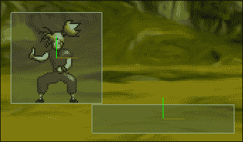

# 第九章. 使用 Box2D 的现实世界物理

如果你之前已经参与过游戏开发，你应该熟悉 Box2D。它是一个跨平台的物理库，在游戏社区中得到广泛使用。你会发现它与它一起工作非常容易，并且可以快速创建出看起来很棒的物理效果，但这并不意味着你必须创建另一个 *愤怒的小鸟* 克隆，提示提示。

# 创建世界

第一步是按照给定的步骤创建负责物理模拟的世界：

1.  创建一个名为 `physics_manager.lua` 的文件，并从 `game.lua` 中 `require` 它。

1.  现在让我们构建 `PhysicsManager` 模块。

    ```swift
    module ( "PhysicsManager", package.seeall )
    function PhysicsManager:initialize ( layer )
    ```

    1.  第一步是创建 `MOAIBox2DWorld` 对象。这将负责从 Moai SDK 与 Box2D 通信。

        ```swift
                self.world = MOAIBox2DWorld.new ()
        ```

    1.  然后，我们需要设置我们的比例。我们在这里做的是说，模拟中的 1 米相当于我们世界坐标中的 38 个点。由于我们使用的是一个高 64 个点的角色精灵，我们可以说我们的角色大约有 1.67 米高。所以，65 / 1.67 大约是 38。这就是找到这个比例所需的计算。

        ```swift
                self.world:setUnitsToMeters ( 1/38 )
        ```

        ### 提示

        Box2D 在包含从 0.1 到 10 米的物体的模拟上工作得更好，所以在设置这个比例时要考虑这一点。

    1.  这里我们设置重力。参数是每秒在 `x` 和 `y` 方向上我们的对象受到影响的米数。所以，在这个例子中，我们使用与地球相似的重力（地球的重力是 -9.8 mts / (s * s)，所以我们可以安全地使用 -10）。

        ```swift
                self.world:setGravity ( 0, -10 )
        ```

    1.  最后，我们开始模拟：

        ```swift
                self.world:start ()
        ```

    1.  通常，我们不想在屏幕上看到 Box2D 创建的对象；我们只想让它们连接到我们自己的渲染对象，并使它们根据模拟行为。但是，出于调试目的，在屏幕上显示物理对象可以非常方便。如果你将一个层传递给 `initialize` 方法，它将使用它作为调试层来显示你在 Box2D 中创建的对象。你会看到物理对象的实际形状，并且当它们相互碰撞时，它们的颜色会改变。

        ```swift
                    if layer then
                        layer:setBox2DWorld ( self.world )
                    end
                end
        ```

就这样。我们的世界正在运行！现在该谈谈物体了。

# Box2D 物体类型

使用物理引擎的全部目的是创建一个世界，你可以在这里放置（物体）根据物理定律行为的对象。术语 `body` 在物理学文献中有着很高的基础，其中所有相互作用的物体都被称为 `body`。

Box2D 中有三种类型的物体：静态、运动学和动态。它们如下所述：

+   **静态物体**：你可以把它们想象成固定在世界上。它们不会自己移动，也不会受到重力或碰撞的影响。记住，静态物体可以与其他对象碰撞，但它们不会因为碰撞而移动或改变，就像其他对象（如果它们不是静态的）一样。我们将使用静态物体作为游戏中的平台，让玩家站立。

+   **运动学体**: 这些体不受碰撞或重力的影响，但它们可以自行移动。它们在碰撞期间可以影响其他对象，就像静力学体一样。一个简单的移动平台危险可能应该使用运动学体来实现。

+   **动态体**: 这些体受重力、碰撞的影响，并且可以自行移动。我们将使用这些体来让我们的角色和敌人移动和碰撞。你总是可以将这些体设置为忽略某些力效果。

现在我们对体有了更多了解，让我们将地板添加到我们的游戏中。

1.  为了做到这一点，请将以下代码追加到`World:initialize()`。

1.  在这里，我们使用`MOAIBox2DWorld`的`addBody`创建一个静态体。然后我们使用`setTransform`方法来放置它。我们在`X`轴上居中，并在`Y`轴上将它在屏幕底部放置。

    ```swift
        self.floor = {}
        self.floor.body = self.world:addBody ( MOAIBox2DBody.STATIC )
        self.floor.body:setTransform ( 0, -WORLD_RESOLUTION_Y/2 )
    ```

1.  在此之后，我们需要定义物体的形状（在 Box2D 的上下文中称为夹具）。我们可以使用多种形状，甚至将它们组合起来创建更复杂的物体。在这个例子中，我们创建了一个矩形物体，其宽度等于屏幕大小，高度等于 100。我们定义这些矩形的方式遵循图像中矩形的惯例，以模型坐标中的`(0,0)`为中心。

    ```swift
        self.floor.fixture = self.floor.body:addRect (
        -WORLD_RESOLUTION_X/2, -50, 
        WORLD_RESOLUTION_X/2, 50 )
    ```

1.  然后我们定义我们不想在地板上有摩擦。这将阻止我们的玩家在跑步时减速。

    ```swift
        self.floor.fixture:setFriction ( 0 )
    ```

现在，我们需要在`game.lua`中初始化我们的世界，以便在屏幕上渲染一些内容。只需将以下代码复制到`loadBackground`调用下方：

```swift
    PhysicsManager:initialize ( self.layers.walkBehind )
```

我们在这里做的是使用`walkBehind`层作为调试参数。如果你不想看到创建的对象，只需避免传递层，你就不会看到它们。

### 注意

现在运行游戏，你应该在底部看到一个盒子。那就是我们的地板。

# 角色与世界对比

现在，我们想要让主要角色与我们的世界进行交互。

我们将向`Character`模块添加一些新方法，如下所示：

1.  首先，我们创建一个对象来存储我们的身体和形状，如下所示：

    ```swift
    function Character:initializePhysics ()
        self.physics = {}
    ```

1.  然后我们向物理模拟添加一个动态体。这将是我们角色的主体，如下所示：

    ```swift
        self.physics.body = 
        PhysicsManager.world:addBody ( MOAIBox2DBody.DYNAMIC )
    ```

1.  现在我们使用与我们的渲染角色相同的初始位置来定位身体，如下所示：

    ```swift
        self.physics.body:setTransform (
        unpack(character_object.position) )
    ```

1.  现在我们添加一个形状。我们将使用与精灵大小相同的正方形（64 x 64）。这显然远非理想，因为在某些情况下碰撞可能看起来很奇怪（它将感觉像他周围有一个透明的盒子），但为了保持简单，我们可以忍受这一点。

    ```swift
        self.physics.fixture = self.physics.body:addRect( -32, -32, 32, 32 )
    ```

    

1.  在前面的图像中，我们看到角色和一个带有 Box2D 调试的平台。我们可以看到玩家应该会掉落，但不会掉落，因为它的盒子太大。

    ### 提示

    你可能想在最终游戏中创建一个更好的形状，以便有更好的碰撞检测，但请记住，如果碰撞形状更复杂，则在碰撞时需要更多的计算。始终尝试最小化你的固定装置的顶点和边数。

1.  最后一步是将我们的`prop`与我们的`body`绑定。为此，我们将使用`setParent`方法，它告诉 Action Tree 当物理体移动时会影响`prop`。这是一个展示 Action Tree 强大功能的绝佳例子。

    ```swift
        self.prop:setParent ( self.physics.body )
    end
    ```

如果你现在按播放，由于重力作用，角色应该会下落。

# 移动

现在，让我们直接进入重要的事情。首先，我们将在`Character`上定义几个方法。然后我们将重新构建`InputManager`来处理按键事件而不是鼠标事件，并将其与我们的游戏集成。

1.  我们将要使用的第一个方法将使我们的角色跑步。它将在我们按下*A*或*D*键时被调用，分别向左或向右移动。我们将传递两个参数，`direction`（左为`-1`，右为`1`）和`keyDown`，这是一个布尔值，告诉我们玩家是否在按键。

1.  我们首先使用`direction`参数与`setScl`（用于缩放对象）结合。想法是，如果你通过一个负因子缩放精灵，它将在缩放组件的方向上翻转，所以我们在做的是告诉我们的精灵根据玩家按下的哪个键来面向左或右。

    ```swift
    function Character:run ( direction, keyDown )
        if keyDown then
        self.prop:setScl ( direction, 1 )
    ```

1.  然后，我们通过 100 在指定方向上强制线性速度，并保持垂直轴上的速度，因为我们希望在跳跃时能够跳跃和移动：

    ```swift
        velX, velY = self.physics.body:getLinearVelocity ()
        self.physics.body:setLinearVelocity ( direction * 100, velY )
    ```

1.  然后，如果我们没有在跑步并且没有在跳跃，我们就开始以下跑步动画：

    ```swift
       if(self.currentAnimation ~= self:getAnimation ( 'run' ) )and not self.jumping then
            self:startAnimation('run')
        end
    ```

1.  如果这个事件是`keyUp`并且我们没有在跳跃，那么停止移动。这是有问题的，你应该在这里有一个更好的逻辑来保持不同键的状态，但为了简单起见，我们可以忍受它。就这样，我们的`Character`现在可以跑了：

    ```swift
        else
        if not self.jumping then
            self:stopMoving ()
        end
        end
    end
    ```

1.  这两种方法都非常简单。如果我们向左移动，我们用`-1`作为方向调用`run`；如果我们向右移动，我们用`1`作为方向调用`run`。在两种情况下，我们都传递接收到的`keyDown`。这个`keyDown`将稍后从`InputManager`获取。

    ```swift
    function Character:moveLeft ( keyDown )
        self:run ( -1, keyDown )
    end
    function Character:moveRight( keyDown )
        self:run ( 1, keyDown )
    end
    ```

1.  我们要停止移动的操作是（在确认我们不是在跳跃之后）停止所有移动，将线性速度在两个方向上设置为 0，并开始空闲动画。这很简单：

    ```swift
    function Character:stopMoving ()
        if not self.jumping then
            self.physics.body:setLinearVelocity ( 0, 0 )
            self:startAnimation ( 'idle' )
        end
    end
    ```

1.  对于跳跃，我们将做一些不同的事情。我们不会强制线性速度，而是应用一个力。我们可以用同样的方式做，但只是为了说明如何应用力，我们在这里使用它。然后我们设置一个名为`jumping`的变量为 true；这将允许我们知道我们在跳跃，最后开始跳跃动画。这也很容易。

    ```swift
    function Character:jump ( keyDown )
        if keyDown and not self.jumping then
            self.physics.body:applyForce ( 0, 8000 )
            self.jumping = true
            self:startAnimation ( 'jump' )
        end
    end
    ```

1.  最后，我们将实现`stopJumping`方法。我们基本上将跳跃设置为 false 并停止移动如下：

    ```swift
    function Character:stopJumping ()
        self.jumping = false
        self:stopMoving ()
    end
    ```

1.  我们最后的方法将用于处理与地板的碰撞。为了使用它，我们需要在`initializePhysics`中添加一行。

1.  我们现在正在设置一个`callback`方法，当 Box2D 检测到与玩家形状的碰撞时将执行。参数是方法本身，以及它应该在碰撞的哪个阶段被调用，定义如下：

    ```swift
    self.physics.fixture:setCollisionHandler (
        onCollide, 
        MOAIBox2DArbiter.BEGIN )
    ```

    ### 小贴士

    要检查所有碰撞阶段，请查看`setCollisionHandler`定义在[`getmoai.com/docs/class_m_o_a_i_box2_d_fixture.html#a693a608fc6645b170d067845dd1a9c20`](http://getmoai.com/docs/class_m_o_a_i_box2_d_fixture.html#a693a608fc6645b170d067845dd1a9c20)。

    现在我们需要创建`callback`方法：

1.  我们现在要检查我们与之碰撞的形状是否是地板，如果是，我们就停止跳跃，如下所示：

    ```swift
    function onCollide ( phase, fixtureA, fixtureB, arbiter )
        if fixtureB == PhysicsManager.floor.fixture then
            Character:stopJumping ()
        end
    end
    ```

# 键盘输入

为了开始使用键盘，我们需要更改一些内容：

1.  首先，我们需要从`game.lua`中删除我们的`processInput`方法和对`Game:start`的调用。

1.  然后我们需要创建一个负责管理`InputManager`按键输入的方法。

    ```swift
    function Game:keyPressed ( key, down )
        if key == 'right' then Character:moveRight(down)end
        if key == 'left' then Character:moveLeft(down)end
        if key == 'up' then Character:jump(down)end
    end
    ```

    此方法将一些按键与我们在`Character`上创建的方法关联起来。这应该足以处理我们角色的移动。

1.  现在，我们必须从`input_manager.lua`中删除所有代码（除了模块定义），并使用以下代码重新编写：

    ```swift
    function InputManager:initialize ()
        function onKeyboardEvent ( key, down )
            if key == 119 then key = 'up' end
            if key == 97 then key = 'left' end
            if key == 100 then key = 'right' end
            Game:keyPressed(key, down)
        end
    ```

    1.  `onKeyboardEvent`将是我们的键盘回调。我们在这里所做的只是使用*A*、*D*和*W*的键码，将它们替换为可读的字符串，并将它们作为参数传递给之前实现的`keyPressed`方法。

        ```swift
            MOAIInputMgr.device.keyboard:setCallback( onKeyboardEvent )
        end
        ```

    1.  现在只需设置回调，我们就算完成了。

1.  现在尝试运行游戏。你应该能够使用*A*、*D*和*W*移动角色并跳跃。

# 创建场景

现在，我们将创建定义级别的必要代码。我们不会对精灵进行操作；相反，我们只需使用 Box2D 的默认调试形状。我们将创建整个物理世界，你现在应该能够将精灵分配给它（这与我们对玩家所做的是一样的）。

1.  首先，我们需要删除`physics_manager.lua`中与地板定义相关的所有代码，因为现在我们将使用其他平台一起创建地板。

1.  现在，在`game.lua`文件中，在`background_objects`定义下方，我们将创建场景的定义：

    ```swift
    local scene_objects = {
        floor = {
            type = MOAIBox2DBody.STATIC,
            position = {0, -WORLD_RESOLUTION_Y/2},
            friction = 0,
            size = {2 * WORLD_RESOLUTION_X, 10}
        }
        platform1 = {
            type = MOAIBox2DBody.STATIC,
            position = {100, -50},
            friction = 0,
            size = {100, 20}
        }
    }
    ```

1.  如您在给出的代码中所见，我们定义了两个对象，即地板和平台。我们为每个对象定义其身体类型、位置和大小。请注意，地板现在只是另一个场景对象。

1.  我们现在将遍历这个表，并使用一段代码创建所有对象：

    ```swift
    function Game:loadScene()
        self.objects = {}
        for key, attr in pairs(scene_objects)do
    ```

    1.  我们开始遍历所有的`scene_objects`：

        ```swift
            local body = PhysicsManager.world:addBody(attr.type)
        ```

    1.  在这里，我们创建 Box2D 身体，使用定义中的类型：

        ```swift
            body:setTransform ( unpack(attr.position) );
            width, height = unpack ( attr.size );
            local fixture = body:addRect (
            -width/2, -height/2, width/2, height/2 )
        ```

    1.  然后我们设置大小和位置。

        ```swift
            fixture:setFriction ( attr.friction )
        ```

    1.  最后是摩擦力。

        ```swift
            self.objects[key] = { body = body, fixture = fixture }
            end
        end
        ```

    1.  然后将对象存储在定义的名称下，我们就完成了。

如果你希望向定义中添加更多内容（例如多边形的顶点，或者类似的东西），这仅仅是一个决定如何在定义中表示它，并在`loadScene`内部添加必要的调用方法来满足那个定义的问题。

### 小贴士

目前，只支持八个顶点。你可以修改 Moai SDK 的源代码来添加更多。

1.  在`Game:initialize`中的`PhysicsManager`初始化下面，你应该添加一个对`loadScene`的调用。

    ```swift
        self:loadScene ()
    ```

1.  现在我们需要做的一件事是修复我们的`collision`方法，它使用了硬编码的地板。

    1.  首先，我们需要在`game.lua`中添加另一个辅助方法：

        ```swift
        function Game:belongsToScene ( fixture )
            for key, object in pairs (self.objects )do
                if object.fixture == fixture then
                    return true
                end
            end
            return false
        end
        ```

    1.  在这个方法中，我们遍历所有场景对象，查看传递的参数是否是其中之一。

    1.  打开`character.lua`，将`onCollide`替换为新版本：

        ```swift
        function onCollide ( phase, fixtureA, fixtureB, arbiter )
            if Game:belongsToScene ( fixtureB ) then
                Character:stopJumping ()
            end
        end
        ```

1.  我们在这里做的是，当发生碰撞时调用辅助方法，以查看我们是否与场景中的某个对象发生碰撞。在这种情况下，我们停止跳跃。这将产生一个有趣的机制；运行游戏，你就会明白为什么（超级肉男孩？有人吗？好吧，当你与一个盒子的垂直边缘碰撞时，玩家会停止，这样你就可以再次跳跃了！）。

我们创建这个场景的方式与实际加载它的代码是解耦的。在现实世界中，你将希望能够在代码外部编辑你的关卡，然后加载它们。

加载代码将主要以这种方式运行，但你可能会使用另一种语言（XML、JSON 等）来存储你的关卡。关卡编辑器是你的朋友。

### 小贴士

你知道**Inkscape**吗？它是一个使用 SVG 作为主要格式的矢量图形编辑器。SVG 是 XML！所以它非常易于解析。顺便说一句，它是开源的，免费的。如果你在处理瓦片，另一个有用的开源工具是**Tiled**，它将非常有用，因为它包括图层、瓦片地图支持，并导出为 Lua。

# 练习

到现在为止，添加敌人到这个场景应该对你来说很熟悉了。你需要考虑移动的人工智能，但除此之外，其他所有内容都已经见过。你应该将其创建为一个动态体，并修改玩家碰撞处理器以正确反应（例如杀死玩家，或者从玩家那里扣除生命）。

另一个很好的想法是实现马里奥风格的平台，你可以从平台的底部跳起，然后碰撞并停留在顶部。（你将不得不使用 Box2D 的传感器，并在碰撞处理器中检查碰撞的法线。然后，根据碰撞的法线，在适当的时间停止移动）。

试着玩一玩，因为玩耍是学习过程中的重要部分。

# 概述

在这一章中，你可能感觉自己像是牛顿。我们用 Box2D 做了一些实验，以构建我们的平台游戏原型的物理系统。我们看到了如何使用键盘，并通过用户的输入和碰撞使我们的角色进行动画和移动。

下一章将负责展示一些调试数据，以说明如何创建 HUD。
