# 第十二章：iOS 部署

现在我们已经涵盖了制作游戏所需的大部分内容，我们可以开始讨论将你的游戏部署到特定设备上了。在本章中，我们将修改默认的 iOS 主机项目，以便让我们的游戏在其上运行。为此，我们将复制随 Moai SDK 提供的示例主机项目，并逐一介绍你需要做的一切，以便让你的游戏运行起来。

# Xcode 项目

首先，如果你梦想你的游戏能进入 iTunes Store，你将不得不从 Apple 获取最新的 Xcode 和 iOS SDK。你可以通过注册 Apple 的开发者网站([`developer.apple.com/`](https://developer.apple.com/))来获取访问权限。

如果你没有使用 Xcode 的经验，建议你阅读一个快速教程，因为那超出了本书的范围。关于 Xcode，你应该知道的一些基本事情是如何处理源文件，如何管理目标，以及一些基本的 Objective-C，以便修改主机以适应你的游戏。

打开随 Moai SDK 下载提供的 Xcode 项目。它位于`hosts/ios/moai.xcodeproject`。如果你使用该位置的项目，它已经配置为使用`lib/ios`中的 Moai SDK 静态库，但如果你移动它，你需要修复项目配置中的相应路径。我们很快就会看到如何做这件事。

## 主机

所有 iOS 特定主机的代码都可以在`Classes`文件夹内找到。如果你仔细查看它们，你会很容易理解它们的作用。基本上，它们设置了一个 OpenGL 视图，将所有输入方法注册到 AKU，并配置其他你可能觉得有用的服务（或者如果你不想使用它们，可以移除）。

另有一个名为`Resources`的文件夹（其中包含图标），编译后的源文件将放在那里（在另一个名为`build`的文件夹内）。

你会看到，默认情况下，`moai-target`文件和`lua`文件夹都显示为红色。原因是，在构建过程中，一个脚本会运行并读取`Resources/build`中`moai-target`的内容，以识别我们游戏的全部 Lua 源代码。找到后，脚本会将`moai-target`中引用的每个目录复制到`lua`文件夹中（文件也被标记为只读，以提醒你它们不应该被编辑，因为它们将在下一次构建时被删除）。`lua`文件夹内的文件包含在应用程序包中，以便在打包部署时可以访问它们。看看`MoaiAppDelegate.mm`，那里存放着调用`main.lua`以启动游戏的代码。如果你想为`main.lua`使用不同的入口点，你可以在那里做到。

在`moai-target`文件中，你应该按行包含你游戏的全部代码和资源源文件。例如：

```swift
../../myGame/src
../../myGameAssets/
```

### 小贴士

如果你正在安装的模块有特殊的依赖项（以 `samples/iphone/app-apsalar` 为例），你可以使用一个名为 `moai-target-ext` 的文件来定义它们。脚本将检查你在 `moai-target` 中定义的每个文件夹内是否存在此文件，并将递归地复制其中的所有内容。

这对于与提供的宿主一起工作至关重要。

你还应该看看 `Frameworks` 文件夹，其中包含构建我们的宿主所需的全部静态库和 iOS 框架。

# 运行示例

在开始修改你的游戏代码之前，你应该尝试运行示例项目。它已经指向了 Moai SDK 的一个示例，所以它应该像检查模拟器中的设备并点击 **构建和调试** 一样简单。

如果你看到 Moai SDK 的标志在旋转，那么你可以继续了。如果没有，请检查你的 Xcode 配置是否正确，或者加入 Moai SDK 的论坛寻求帮助，详细说明你遇到的错误。

在实际设备上运行需要你理解（或者至少能够破解——谁能理解它呢？）如何处理和设置苹果的开发者配置文件。这在苹果开发者门户的文档中有详细说明，你可以在这里找到（[`developer.apple.com/devcenter/ios/index.action`](https://developer.apple.com/devcenter/ios/index.action)）。

# 设置我们自己的项目

由于 Moai SDK 附带的自定义 Xcode 项目示例包含了一些我们可能不需要的东西，建议进行清理。我们将首先将整个项目复制到我们的硬盘上的某个位置。如果你一直跟随所有章节并提取了所有代码，将我们的项目放在代码示例相同的文件夹中是个不错的选择，这样我们就可以指向它们，并在 iOS 上拥有我们的 *Concentration* 游戏。你可以使用 第七章 的 *集中注意力游戏* 的源代码。

无论哪种方式，如果你下载了本书的源代码，你将在本章的代码中找到 iOS 项目和 *Concentration* 游戏实现。

现在我们已经有了 Xcode 项目和 *Concentration* 游戏，双击 `moai.xcodeproj` 以打开 Xcode 并开始配置它。

这可能需要一些时间来加载。Xcode 在第一次打开项目时执行文件索引。不用担心，后续加载时不会发生这种情况（嗯，除非它决定随机索引）。

如果你现在运行它，可能会失败。学会花时间阅读和理解错误；这是解决问题的唯一方法。

现在，让我们一步一步地修复项目。

## 指向正确的源代码

默认项目使用相对路径指向 Moai SDK 的一个示例。由于我们移动了项目，这个路径现在已损坏。我们需要让所有内容都指向我们自己的代码。

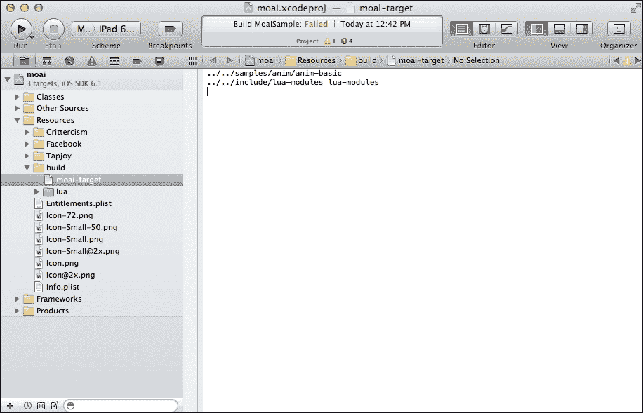

为了做到这一点，展开**资源**文件夹，然后是**构建**文件夹，最后点击**moai-target**。

`moai-target`的内容应该是这样的：

```swift
../../../samples/anim/anim-basic
../../../include/lua-modules lua-modules
```

`moai-target`正使用相对路径指向`anim-basic`示例。因此，为了运行我们自己的游戏，我们需要让它指向正确的位置。

在这个例子中，我们将游戏代码移动到了一个名为`concentration-code`的文件夹中，所以我们将指向那里。最终的`moai-target`应该如下所示：

```swift
../concentration-code
```

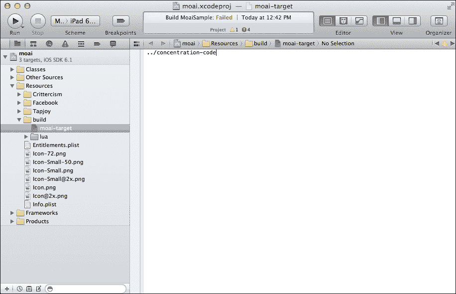

## 修复源路径

由于我们将 Xcode 项目从原始位置移动了，现在我们需要修复围绕它的相对路径。

1.  收起**资源**文件夹并展开**类**。您会看到**ParticlePresets.cpp**和**ParticlePresets.h**以红色显示。它们可以在`moai-sdk/hosts/src/`中找到（`moai-sdk`是您在初始章节中安装 Moai SDK 的文件夹）。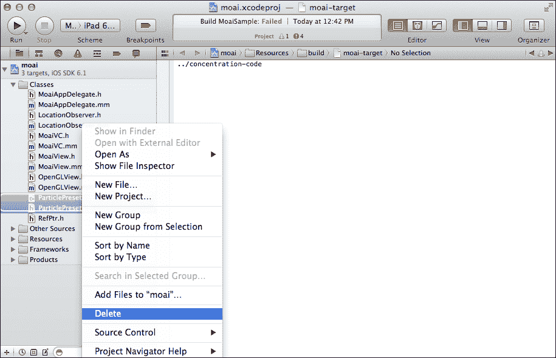

1.  选择**ParticlePresets.cpp**和**ParticlePresets.h**并删除它们。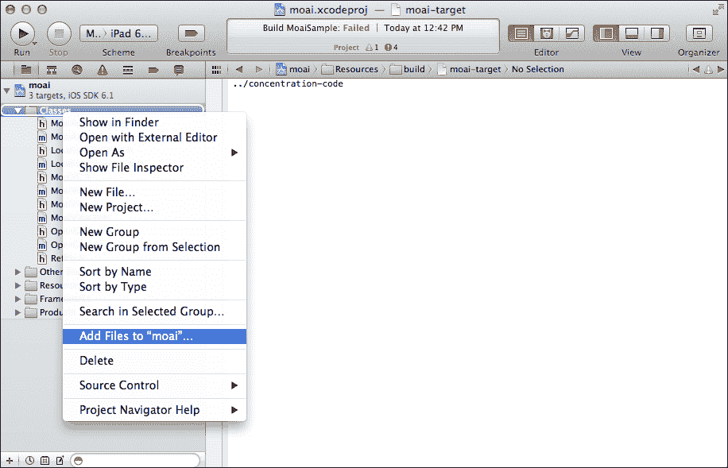

1.  现在右键单击**类**文件夹，选择**将文件添加到"moai"**。转到`moai-sdk/hosts/src/`并选择**ParticlePresets.cpp**和**ParticlePresets.h**。接受后，它们应该在该文件夹中，并且不应以红色显示。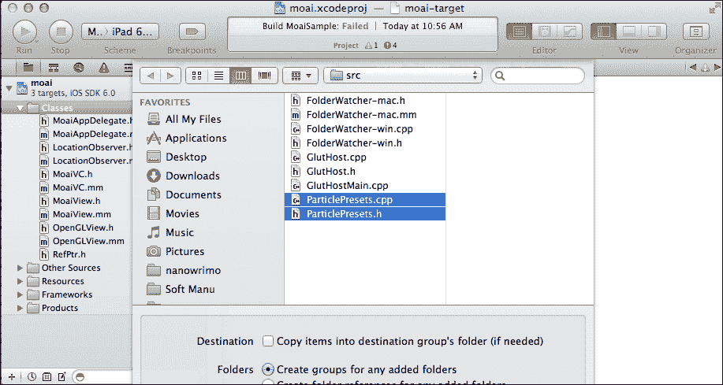

## 修复包含路径

下一步我们需要做的是修复相对包含路径。

要这样做，单击文件夹树顶部的**moai**，其中显示了 Xcode 应用程序的图标。然后，在**项目**部分（不是**目标**部分）下选择**moai**。

这里有几个问题需要修复：

1.  搜索名为**头文件搜索路径**的设置；它应该读取**../../include/**。如果您双击它，将显示一个弹出窗口，然后您可以双击包含路径并将其更改为您自己的包含路径，该路径位于`moai-sdk/include/`。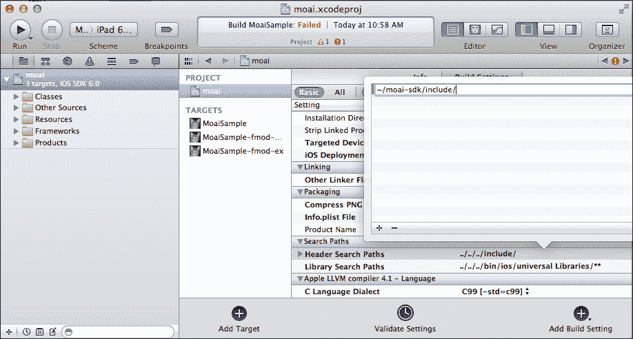

1.  搜索**其他链接器标志**，将**../../../lib/ios/universal/libmoai-ios-tapjoy.a**更改为正确的位置（`moai-sdk/lib/ios/universal/libmoai-ios-tapjoy.a`）。如果 Xcode 仍然找不到此文件，请尝试使用绝对路径（在我的情况下是`/Users/nictuku/moai-sdk/lib/ios/universal/libmoai-ios-tapjoy.a`）。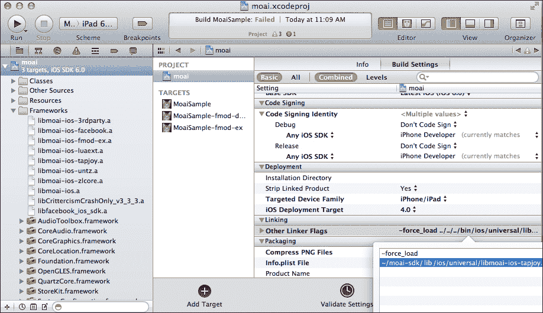

1.  搜索**库搜索路径**，将**../../../lib/ios/universal**更改为`moai-sdk/lib/ios/universal`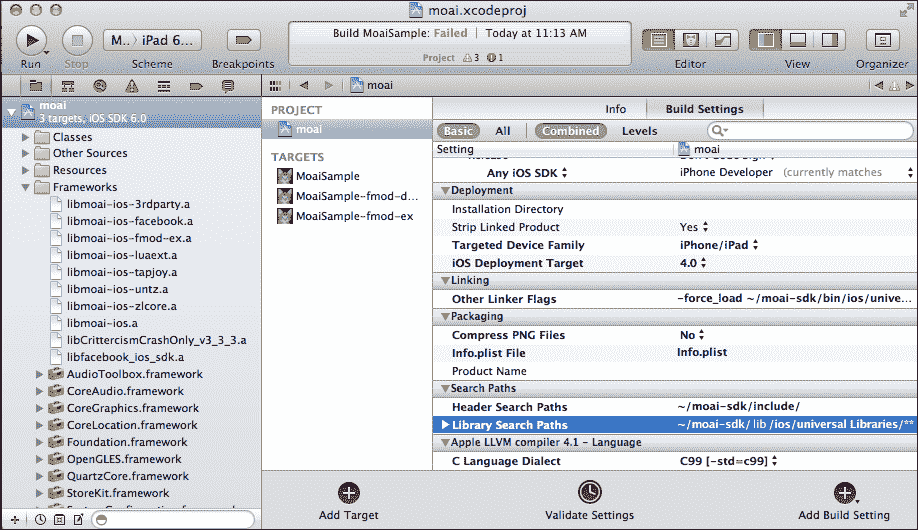

1.  现在，在**目标**部分下单击**MoaiSample**。双击**库搜索路径**，并以相同的方式替换剩余的相对路径。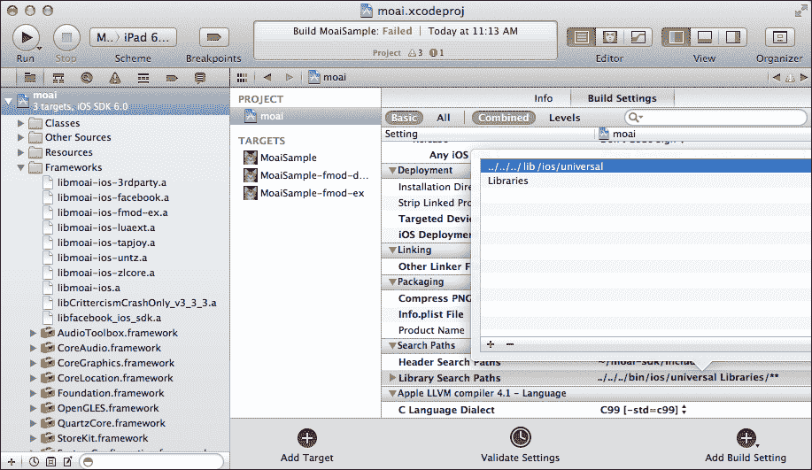

## 修复链接库

下一步我们需要修复的是所有链接库的位置。

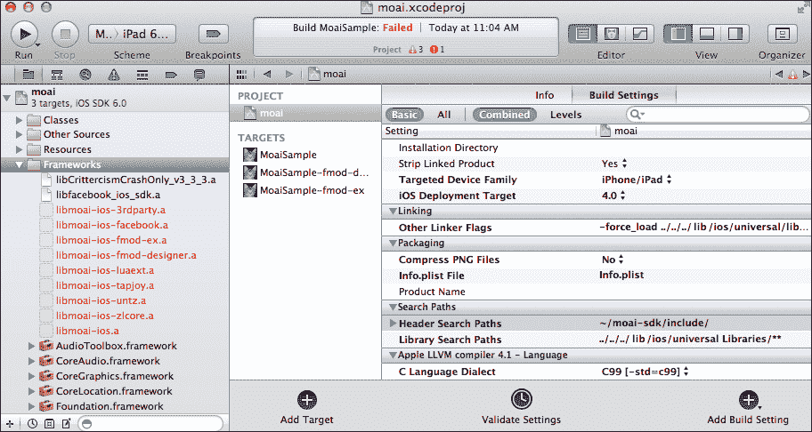

展开框架文件夹，并识别所有显示为红色的库。

你可以在`moai-sdk/bin/ios/universal`中找到它们。删除红色中的那些，并添加该路径下的所有文件，就像我们处理`ParticlePresets`文件一样。

你应该最终在目录中拥有相同的文件，但它们不应再以红色显示。

现在，如果你点击**运行**，构建应该成功，你应该在 iOS 模拟器上看到我们的**专注力**游戏。

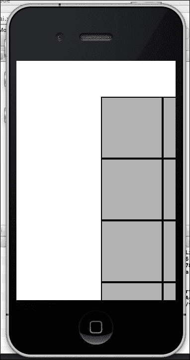

但等等！它没有被正确显示，触摸也没有被检测到！这是因为我们本地配置项目的方式。所以让我们尝试修复它。

# 跨平台开发

我们首先需要考虑的是如何在项目中处理不同的分辨率。你可以在这方面做很多复杂的事情，比如根据不同的大小更改 UI，或者在分辨率高于或等于 1024 x 768（或你选择的任何值）时加载高清图像，等等。在这个例子中，我们将保持简单；我们只需将一切拉伸，使其适合屏幕。

打开`Concentration`项目，并更改以下行：

```swift
SCREEN_RESOLUTION_X = 2 * WORLD_RESOLUTION_X
SCREEN_RESOLUTION_Y = 2 * WORLD_RESOLUTION_Y
```

到以下：

```swift
SCREEN_RESOLUTION_X = MOAIEnvironment.horizontalResolution
SCREEN_RESOLUTION_Y = MOAIEnvironment.verticalResolution
```

如果你现在运行项目，它应该显示游戏的拉伸版本，但它仍然不会对触摸做出反应。

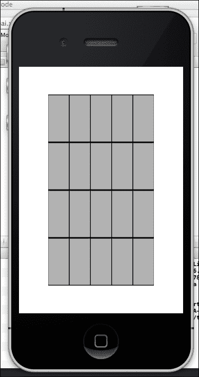

为了修复这个问题，编辑`game.lua`并修改`processInput`以使用`InputManager:getTouch`而不是`InputManager:position`。

在显示`x, y = InputManager:position ()`的地方，你应该将其替换为`x, y = InputManager:getTouch ()`。

现在如果你运行你的项目，你将能够玩我们的游戏。


但看起来被拉伸了。你可以在 Moai 的维基页面上学习如何在横幅模式下使其工作（[`getmoai.com/wiki/index.php?title=Setup_landscape_in_Moai_Games_For_iOS_Devices`](http://getmoai.com/wiki/index.php?title=Setup_landscape_in_Moai_Games_For_iOS_Devices)）。

# 在设备上运行

经过我们采取的所有步骤后，游戏应该能够在设备上运行。这仅仅是一个设置正确的**代码签名**标识符和更改目标设备的问题。

现在尝试这个操作会很好，如果你迷路了，可以向苹果社区或 Moai 论坛寻求帮助，因为设置苹果开发者账户和证书超出了本书的范围。

# 摘要

在本章中，我们学习了如何修改 iOS 宿主的 Xcode 项目，以便使其与我们的游戏一起工作。我们修复了在移动项目时中断的相对路径，并正确设置了分辨率。

我们知道 iOS 不是唯一的平台。我们将在下一章讨论其他平台！
