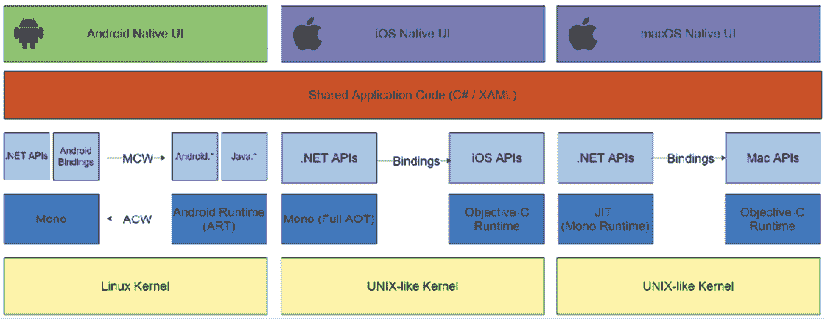
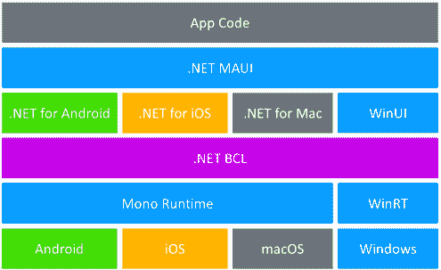
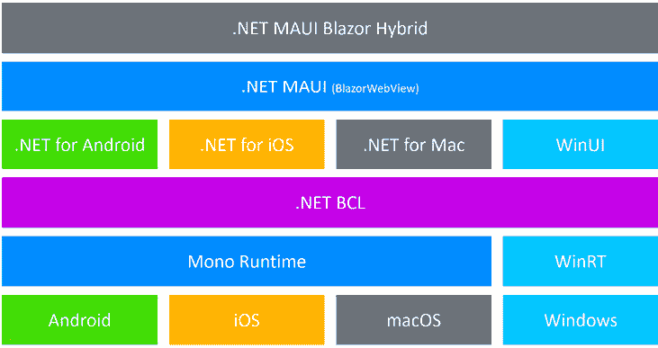
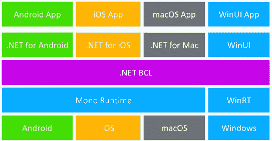
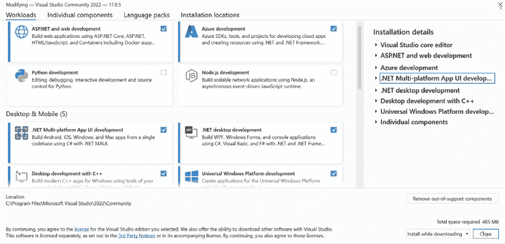
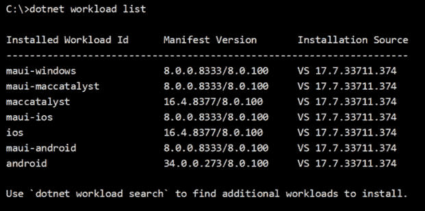
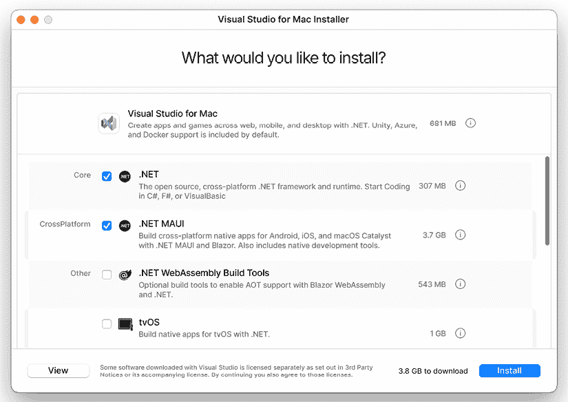
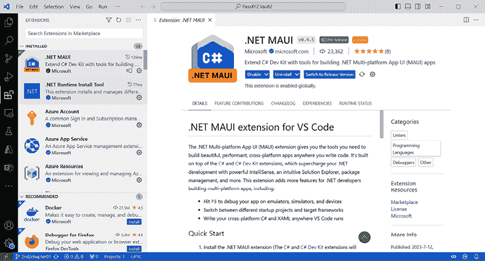

# 第一章：开始使用 .NET MAUI

自从 .NET 5 发布以来，微软一直在努力将不同的 .NET 实现统一到一个 .NET 版本中。.NET 多平台应用程序用户界面（或 .NET MAUI）是提供统一跨平台 UI 框架的努力。本书将教会我们如何使用 .NET MAUI 开发跨平台应用程序。

本章节将涵盖以下内容：

+   跨平台技术的概述

+   跨平台技术（.NET、Java 和 JavaScript）的比较

+   .NET 景观和 Xamarin 的历史

+   .NET MAUI 特性

+   .NET MAUI Blazor 应用程序

+   .NET 8 为 .NET MAUI 带来了哪些新特性？

+   开发环境设置

如果你刚接触 .NET 开发，本章将帮助你了解 .NET 的整体环境。对于 Xamarin 开发者来说，本书中的许多主题可能听起来很熟悉；本章将为你概述本书将要讨论的内容。

# 跨平台和全栈技术的概述

.NET 多平台应用程序用户界面，或称 .NET MAUI，是微软推出的一款跨平台开发框架，用于构建针对 Android、iOS、macOS、Windows 和 Tizen 等移动和桌面设备的应用程序。它是市场上众多跨平台框架之一。

在讨论跨平台技术之前，我们先回顾一下应用开发的范围。这次回顾将帮助我们更好地理解各种跨平台框架。

通常，软件开发可以分为两大类——**系统编程**和**应用编程**。应用编程旨在直接为用户提供软件服务，而系统编程旨在产生为其他软件提供服务的软件和软件平台。在 .NET 领域，.NET 平台本身的发展属于系统编程，而基于 .NET 平台的应用开发则属于应用编程。

与系统编程相比，大多数软件开发需求都来自应用编程。

许多商业解决方案都属于应用开发的范畴。为了理解为什么我们为解决方案选择特定的技术栈，了解整个解决方案中使用的所有技术概述是至关重要的。一旦我们清楚地理解了跨平台技术在整个解决方案中的作用，我们就能更好地理解我们希望选择的技术。 

商业解决方案的大部分开发工作包括前端和后端组件。前端开发者负责用户直接看到、触摸和交互的应用程序的可视和交互部分。通常，前端团队专注于开发网页和原生应用程序。另一方面，后端开发涉及服务器端处理、数据管理和应用程序中业务逻辑的实现。

前端和后端开发涉及不同的编程语言和框架。有时，由于各种原因，同一个团队可能需要同时进行前端和后端开发。在这种情况下，我们需要一个能够进行全栈开发的团队。

为了根据编程语言和框架对应用程序开发进行分类，我们有以下三个类别。

## 本地应用程序

通过本地应用程序开发，我们通常指的是为特定操作系统进行的应用程序开发。对于桌面应用程序，可能包括 Windows 应用程序、macOS 应用程序或 Linux 应用程序。对于移动应用程序，可能包括 Android 或 iOS。

当我们开发本地应用程序时，我们可能需要支持多个平台（Windows、Linux、Android、macOS/iOS 等）。为了支持多个平台，我们需要使用不同的编程语言、工具和库来分别开发每一个平台。

## Web 应用程序

过去几十年中，Web 应用程序开发已经经历了几个时代的演变，从 Netscape 浏览器中的静态网页到今天使用 JavaScript 框架（如 React 和 Angular）的**单页应用程序（SPA）**。在 Web 应用程序开发中，JavaScript 和各种基于 JavaScript 的框架占据了市场的主导地位。在.NET 生态系统中，Blazor 正在努力追赶这个领域的步伐。我们将在第八章“介绍 Blazor 混合应用程序开发”中了解更多关于 Blazor 的内容。

## 后端服务

本地应用程序和 Web 应用程序通常需要后端服务来访问业务逻辑或数据库。对于后端开发，有各种语言和框架可供选择，包括 Java/Spring、.NET、Node.js、Ruby on Rails 和 Python/Django。在许多情况下，本地应用程序和 Web 应用程序可以共享同一个后端服务。Java/Spring、ASP.NET 和 Node.js 是后端服务开发中最受欢迎的选择之一。

每个类别的技术栈选择可以显著影响解决方案的复杂性。在下一节中，我们将回顾和分析解决方案的复杂性。

## 管理开发复杂性

构建一个完整的解决方案通常需要一个 Web 应用程序、一个本地应用程序和一个后端服务。由于 Web、本地和后端开发使用不同的编程语言和框架，我们必须组建多个团队来实现一个解决方案。为了管理开发过程的复杂性，我们需要管理开发团队的配置。团队配置可以根据两种极端情况/方法进行管理。最简单的一种是建立一个涵盖所有层的团队。更复杂的一种是针对每个层有独立的团队。要成功使用一个团队开发所有层，该团队必须是一个跨平台的全栈开发团队。是否存在跨平台的全栈团队？让我们在下一两节中回顾各种场景。

## 全栈开发

许多人怀疑组建全栈团队是否好，甚至是否可行，但实际上，最早的 Web 开发框架都是全栈框架。如果你有机会使用 Java/Thymeleaf 或 ASP.NET MVC，你会知道它们是全栈框架。这些框架使用服务器端渲染，因此 UI 和业务逻辑的实现都在服务器端。

前端和后端的分离伴随着单页面应用（SPAs）的出现。为了将 UI 移动到客户端，SPA 框架，如 React、Angular 和 Vue.js，被用来实现客户端逻辑。后端服务使用 Java/Spring 和 ASP.NET Core 等框架来实现。

单页面应用（SPA）框架使用**客户端渲染**（**CSR**），而 Java/Thymeleaf 和 ASP.NET MVC 使用**服务器端渲染**（**SSR**）。CSR 和 SSR 各有优缺点。在现代应用开发中，框架如 Next.js 和 Nuxt.js 都同时使用了 CSR 和 SSR。在.NET 8 中，微软引入了服务器端 Blazor 组件渲染，或称 Blazor United。有了这个特性，ASP.NET 中前端和后端的界限再次变得模糊。

总结来说，我们应该根据业务需求选择技术栈，因此并没有一个单一的、通用的答案来决定我们是否应该采用全栈开发。

对于最终用户来说，SPAs 与原生应用非常相似，一些 SPA 框架甚至已经发展成为跨平台框架，如 React Native。使用 React 和 React Native，一个团队可以同时进行前端开发和原生应用开发。此外，如果选择了基于 JavaScript 的后端框架，就有可能组建一个跨平台全栈团队来实现整个解决方案。

为了更好地理解跨平台框架，让我们在下一节分析目前市场上可用的跨平台框架。

## 跨平台技术

跨平台框架是原生应用程序开发的替代解决方案。原生应用程序开发是指使用操作系统提供的编程语言和**软件开发工具包**（**SDK**）。在原生应用程序开发中，我们使用原生开发工具，例如 iOS 的 Swift/UIKit、Android 的 Java/Kotlin 和 Windows 的 C#/WinUI。理想情况下，我们应该使用操作系统供应商提供的工具来为特定操作系统开发应用程序。使用原生应用程序开发，我们的应用程序不会出现性能或兼容性问题。使用跨平台开发框架时，总会存在某些无法仅使用跨平台 API 解决的边缘情况。无论你是 .NET MAUI、React Native 还是 Flutter 开发者，获取一定程度的原生编程知识来解决这些特定情况是必要的。例如，我现在正在等待 ZXing.Net.Maui 项目准备就绪，以便在我的应用程序中支持二维码功能。

然而，我们通常需要为多个操作系统开发我们的应用程序。原生应用程序开发比跨平台框架的成本要高得多。在项目中，我们必须在预算、时间和质量之间取得平衡。再次强调，我们需要根据业务需求选择解决方案。这可能会意味着我们需要选择一个跨平台框架。

市场上最受欢迎的跨平台框架包括 Flutter、React Native、.NET MAUI/Xamarin、Ionic 和 Apache Cordova。

理解各种跨平台技术可以极大地帮助 .NET MAUI 开发者在选择技术栈时做出明智的决定。需要注意的是，目前还没有一种单一的跨平台技术能够满足所有需求。因此，我们仍然会遇到在商业解决方案中使用 Ionic 的新项目。

在这些框架中，除了 Flutter 和 .NET MAUI，React Native、Ionic 和 Apache Cordova 都是源自 Web 开发的基于 JavaScript 的框架。

### Apache Cordova

Apache Cordova 是一个混合框架，可以使用 HTML、CSS 和 JavaScript 等 Web 技术构建移动应用程序。Cordova 在 WebView 中运行，提供了一个运行时环境以访问设备功能。Cordova 使用与 Web 应用相同的技術，因此 Cordova 可以重用 Web 应用的源代码。使用混合框架，前端团队可以同时处理 Web 和移动应用程序。

混合框架的问题在于，由于用户界面是使用 Web 技术创建的，因此移动端的用户界面与原生应用相比更类似于 Web 应用。另一个担忧是，混合应用程序的性能依赖于特定平台上的 WebView 的性能。用户在 iOS 和 Android 平台上可能会有不同的体验。

Cordova 是一个使用 JavaScript、HTML 和 CSS 的混合框架，但它不提供使用现代 JavaScript 框架（如 React、Vue.js 和 Angular）的方法。

### Ionic

Ionic 是一个最初建立在 Apache Cordova 之上的框架。另一个名为 Capacitor 的低级框架也可以在较新版本中使用。Ionic 可以与流行的 JavaScript 框架如 React、Vue.js 和 Angular 集成，这意味着生产力可以显著提高。Ionic 还包括 UI 控件以支持交互、手势和动画。

由于 Ionic 是使用混合框架（如 Cordova 和 Capacitor）构建的，其性能与底层框架相似。然而，Ionic 包括针对动画和过渡的优化，以提供类似原生的性能，用于内置库。

### React Native

React Native 是另一个起源于 Web 开发框架的框架。由于 React Native 使用 React 和 JavaScript 开发移动应用，React 开发者可以轻松地掌握 React Native。跨平台团队可以使用 React 和 React Native 在 Web 和移动应用上同时工作。

与混合框架不同，React Native 使用桥接技术将 JavaScript UI 转换为原生 UI。React Native 应用与原生应用具有相同的视觉和触觉体验。由于 React Native 在 iOS 和 Android 上使用原生组件来渲染 UI，而不是 WebView，因此它比混合应用能实现更好的性能。React Native 使用原生组件的缺点是我们不能在 React 和 React Native 之间共享 UI 设计和 UI 代码。其范式是“一次学习，到处编写”，而不是“一次编写，到处运行”。

由于 React Native 在其架构中使用了桥接技术，其性能可能比 Flutter 或 .NET MAUI 慢。在新版本的 React Native 中，这可能会通过新的架构得到改善。

### Flutter

Flutter 是由 Google 开发的一个开源 UI 工具包，使用 Dart 编程语言。使用 Dart，Flutter 支持 **即时编译**（**JIT**）和 **提前编译**（**AOT**），并且拥有强大的性能优化工具。Flutter 应用可以实现接近原生应用的性能。

Flutter 与混合应用和 React Native 相比，采用了独特的渲染技术。它使用一个名为 Skia（或预览中的 Impeller）的内部图形引擎将组件层次结构转换为屏幕上的实际像素。Flutter 应用在不同设备上具有相同的视觉和触觉体验，无需特定定制。

为了模拟不同平台的外观和感觉，Flutter 为 iOS 和 Android 提供了两个不同的 UI 库。Cupertino 小部件用于 iOS，Material 小部件用于 Android。

### .NET MAUI

.NET MAUI 是 Xamarin.Forms 的继任者，Xamarin.Forms 是更大 Xamarin 平台的一部分。Xamarin 本身提供原生 UI 控件，作为 iOS、macOS 和 Android 上 .NET 运行时环境的一部分。您可以使用 C# 和 Xamarin 开发原生应用程序。在 Windows 上，由于 .NET 是原始框架，因此默认支持 .NET。

从 .NET 6 或更高版本开始，您在这四个平台上都有完整的 .NET 运行时。.NET MAUI 只是使用 Xamarin 的 .NET 跨平台框架之一。还有其他使用 Xamarin 的 .NET 跨平台框架，其中一些可以支持比 .NET MAUI 更多的操作系统，例如 Uno Platform、Avalonia UI 和 Blazor Hybrid。

Flutter、React Native 和 Cordova/Ionic 代表三种不同的跨平台框架实现类型。在 .NET 世界中，我们可以找到可以匹配所有这三个类别的 .NET 跨平台实现。

Cordova 或 Ionic 是一个混合框架，它使用 Web 技术 JavaScript、HTML 和 CSS 来开发在 WebView 内运行的移动应用程序。在 .NET 中，Blazor 是一种 Web 技术，它使用 C#、HTML 和 CSS 来开发 Web 应用程序。.NET 的混合解决方案是 Blazor Hybrid。BlazorWebView 用于在不同的平台上托管 Blazor Hybrid 应用程序。目前，BlazorWebView 可用于 .NET MAUI、WFP 和 Windows Forms。我们可以使用 BlazorWebView 在这三个框架上开发混合应用程序。它就像 Cordova 和 Ionic 一样，Blazor Hybrid 应用程序的外观和感觉与 Web 应用程序相同。Blazor Hybrid 和 Blazor 应用程序之间可以重用代码。

Flutter 使用基于 Skia 2D 引擎或 Impeller 的渲染技术。在 .NET 中，Avalonia UI 使用类似的方法，通过 Skia 2D 引擎构建 UI 控件。

.NET MAUI 使用原生组件作为 UI 控件，例如 React Native，因此 .NET MAUI 的 UI 看起来与原生应用程序相同。

要总结和比较不同的框架，请参阅 *表 1.1*。

| **跨平台框架**(语言) | **UI 功能** |
| --- | --- |
| .NET MAUI(XAML/C#) | React Native(HTML/CSS/JavaScript) | 原生 UI |
| Blazor Hybrid(HTML/CSS/C#) | Ionic/Cordova(HTML/CSS/JavaScript) | Web UI |
| Avalonia UI(XAML/C#) | Flutter(Dart) | 使用 2D 引擎 (Skia) 定制的 UI |

表 1.1：跨平台框架比较

除了 Flutter 之外，我们还可以看到跨平台框架使用 JavaScript 或 .NET。可以设置一个跨平台全栈团队，使用 JavaScript 或 .NET 技术来处理整个解决方案。让我们在下一节通过比较不同的组合来回顾跨平台全栈解决方案的复杂程度。

## 跨平台全栈解决方案分析

现在我们已经分析了跨平台和全栈框架，我们可以看到我们可以只使用一种编程语言，即 JavaScript 或 C#，来构建解决方案的整个技术栈。

*表 1.2* 是使用 JavaScript 或 .NET 的跨平台全栈框架的总结。

| **层** | **框架** |
| --- | --- |
| JavaScript | C#/.NET |
|  Web 应用 | React、Angular 或 Vue.js 等 | Blazor |
|  移动应用 | Cordova 或 Ionic | Blazor Hybrid |
| React Native | .NET MAUI |
|  后端服务 | Node.js/Nest.js/Koa/Express.js | ASP.NET Core |

表 1.2：JavaScript 和 .NET 跨平台全栈技术栈比较

要使用 JavaScript 构建解决方案，我们可以使用 JavaScript 框架（如 React、Angular 和 Vue.js）开发 Web 客户端。如果成本和上市时间是主要考虑因素，我们希望尽可能地在 Web 和移动之间重用代码。在这种情况下，我们可以选择混合框架，如 Ionic 和 Cordova。如果性能和用户体验对业务更重要，React Native 可以是移动开发的良好选择。对于后端服务，有大量的基于 JavaScript 的后端框架，如 Nest.js、Koa 和 Express.js。我们可以选择在解决方案的所有层中使用纯 JavaScript 框架。

在 .NET 中，我们有与 JavaScript 中非常相似的选择。如果选择纯 .NET 技术栈的解决方案，可以使用 Blazor 进行 Web 客户端开发。我们还有选择混合和原生框架的选项。如果考虑成本和上市时间，我们可以选择 Blazor Hybrid，这样可以将 Web 和移动开发视为一个开发任务。为了获得原生用户体验和更好的性能，我们可以选择 .NET MAUI 进行移动开发。在后端开发中，ASP.NET Core 已经拥有很大的市场份额，并且是一个流行的框架。

使用单一编程语言的框架是最经济的选择，正如我们在 *表 1.1* 和 *表 1.2* 中所看到的。然而，在实际项目中，我们可能需要考虑许多因素。我们的实际解决方案可以是不同语言和框架的组合。让我们回顾 *表 1.3* 中不同组合的复杂度级别。

| **上市时间成本** | **** | **性能用户体验** | **复杂度级别** | **解决方案中的技术栈** |
| --- | --- | --- | --- | --- |
| **移动** | **Web** | **后端** |
| 1 | Blazor Hybrid | Blazor | ASP.NET |
| 离子/Cordova | JavaScript | Node.js |
| 2 | .NET MAUI | Blazor | ASP.NET |
| React Native | ReactJS | Node.js |
| 3 | React Native | ReactJS | Java/ASP.NET/… |
| 4 | Flutter | JavaScript | Java/ASP.NET/… |
| 5 | Android/iOS/macOS/Windows/… | JavaScript | Java/ASP.NET/… |

表 1.3：跨平台全栈解决方案的复杂度级别

在 *表 1.3* 中，我总结了解决方案每一层中不同技术选择的复杂度级别。

您的解决方案的复杂性取决于涉及多少编程语言和框架。涉及的编程语言和框架越多，上市时间和成本就越高。

在跨平台和后端框架方面，我们的选择比前端更多。在编程语言方面，我们可以选择 JavaScript 或 C#来开发 Web 客户端。因此，对于后端框架的最经济选择是选择基于 JavaScript 或 C#的后端框架。这就是我们在*表 1.3*中看到的复杂度级别 1 和 2 的内容。

如果我们选择混合框架，例如 Ionic 或 Blazor 混合，来开发移动应用，我们可以使用一种语言和框架来覆盖所有前端和移动开发。在这种情况下，如果我们还选择同一种语言的后端框架，与所有其他配置相比，这个配置所需的时间和成本是最小的。正如我们在*表 1.3*中可以看到的，我们在复杂度级别 1 有 JavaScript 和.NET 选项。

对产品所有者来说，最经济的选择可能不是最好的，因为产品所有者可能对解决方案的用户体验和性能有所顾虑。就前端和后端框架而言，.NET 和 JavaScript 框架是成熟且经过验证的解决方案。然而，在考虑解决方案性能时，真正的担忧应该是关于混合框架的。我们可以选择.NET MAUI 或 React Native 进行移动开发。当使用 React Native 时，最经济的选择是使用 React 作为前端框架。这样，我们仍然可以使用一种语言和类似的框架来覆盖移动和 Web 开发。有许多商业解决方案与此选项相匹配。由于我们无法在.NET MAUI 和 Blazor 或 React 和 React Native 之间共享 UI 代码，这个类别是一个复杂度级别 2 的选项。

在后端开发中，关于语言和框架的选项太多，其中许多都是经过验证的解决方案。可供后端开发使用的语言列表非常长，例如 Java、C#、JavaScript、Python、Ruby、Go 和 Rust。无论出于什么原因，我们可能无法选择与移动和 Web 开发相同的后端编程语言。这意味着复杂度级别 3 的解决方案。在这种情况下，项目团队可以通过选择与后端框架一起使用的 React 和 React Native 来降低复杂性。在实际项目中，.NET MAUI 和 Blazor 通常与.NET 后端一起使用。我们很少看到.NET MAUI 或 Blazor 与非.NET 后端框架一起使用的情况。

Flutter 和 React Native 是市场上最受欢迎的两个跨平台框架。.NET MAUI 还需要更多时间才能赶上市场。如果我们使用 Flutter，我们将进入复杂度级别 4。在这种情况下，我们必须在解决方案配置中涉及三种编程语言。

在某些大型项目中，用户体验比其他因素更重要。在这种情况下，我们选择原生应用开发。涉及的语言和框架数量显著增加，因为列表中添加的每个操作系统都会增加一个编程语言。这是最复杂的情况，复杂度为 5 级。

## .NET 和 JavaScript 的比较

没有一种跨平台工具或框架是最佳选择。最终的选择通常是根据具体的业务需求来决定的。然而，从上面的表格中，我们可以看到.NET 生态系统为您的需求提供了全面的工具。大型系统的发展团队通常需要具有不同编程语言和框架经验的人员。使用.NET，编程语言和框架的复杂性可以大大简化。

我们概述了在 Web 应用、原生应用和后端服务开发中使用的工具和框架。如果我们从更高的层面来看，即.NET 生态系统层面，JavaScript 的生态系统几乎与我们在.NET 解决方案中拥有的相匹配。JavaScript 和.NET 解决方案几乎可以在所有层面上提供工具或框架。在更高层面上对 JavaScript 和.NET 进行比较将很有趣。

JavaScript 是为网页浏览器创建的一种语言，但由于网络开发的需求，其能力得到了扩展。JavaScript 的限制在于它是一种脚本语言，因此它缺乏在 C#中可以找到的语言特性。然而，这种限制并不限制其使用和普及。*表 1.4*是两种技术的比较：

| **比较领域** | **.NET** | **JavaScript** |
| --- | --- | --- |
| 编程语言 | C#, F#, VB, C++ | JavaScript, TypeScript, CoffeeScript 等。 |
| 运行时 | CLR | V8/SpiderMonkey/JavaScriptCore |
| 支持的 IDE | Microsoft Visual Studio, Rider, MonoDevelop, Visual Studio Code | Visual Studio Code, Webstorm, Atom |
| Web | ASP.NET MVC/Blazor | React, Angular, Vue.js 等。 |
| 原生应用 | WinForms, WinUI, WPF, UWP | - |
| 桌面应用 | .NET MAUI/Avalonia/Uno Platform/Xamarin | Electron, NW.js |
| 移动应用 | React Native, Cordova, 或 Ionic |
| 后端 | ASP.NET Core | Node.js |

表 1.4：.NET 和 JavaScript 的比较

从 *表 1.4* 中，我们可以看到 .NET 有一个良好的基础设施来支持多种语言。以 **公共类型系统** (**CTS**) 和 **公共语言运行时** (**CLR**) 作为 .NET 实现的核心，它自然地支持多种语言，并具有在所有支持的语言中共享 **基础类库** (**BCL**) 的能力。JavaScript 作为一种脚本语言有其局限性，因此发明了 TypeScript 和 CoffeeScript 等语言来增强它。TypeScript 是由微软开发的，旨在将现代、面向对象的语言特性引入 JavaScript。TypeScript 编译成 JavaScript 以执行，因此它可以很好地与现有的 JavaScript 库协同工作。

.NET 和 JavaScript 的跨平台框架不仅涵盖移动开发，还包括桌面开发。在 .NET 环境中，.NET MAUI、Uno Platform 和 Avalonia 可以支持桌面和移动的跨平台开发。在 JavaScript 生态系统中，React Native、Ionic 和 Cordova 用于移动开发，而 Electron 或 NW.js 用于桌面开发。

由于 .NET 是 Windows 操作系统的内置组件，因此它被用于开发如 WinForms、UWP 和 WPF 这样的原生应用程序。Windows 操作系统本身是跨平台编程框架支持的主要目标之一。

这个比较帮助我们选择并评估跨平台全栈开发的技术堆栈。作为一名 .NET MAUI 开发者，这项分析可以帮助你了解 .NET MAUI 在 .NET 生态系统中的位置。要了解更多关于 .NET 生态系统的情况，让我们在下一节快速回顾一下 .NET 整体格局的历史。

# 探索 .NET 的整体格局

在我们深入探讨 .NET MAUI 的细节之前，让我们先对 .NET 的整体格局有一个概览。本节是为那些刚接触 .NET 的新手准备的。如果你是 .NET 开发者，你可以跳过这一节。

自从微软引入 .NET 平台以来，它已经从 Windows 的专有软件框架演变为跨平台和开源平台。

有许多方式来观察 .NET 技术堆栈。基本上，它包含以下组件：

+   公共基础设施（编译器和工具套件）

+   基础类库 (BCL)

+   运行时（WinRT 或 Mono）

## .NET Framework

.NET 的历史始于 .NET Framework。这是一个由微软开发的专有软件框架，主要在 Microsoft Windows 上运行。.NET Framework 最初是一个面向未来的应用程序框架，旨在标准化 Windows 生态系统中的软件堆栈。它围绕 **公共语言基础设施** (**CLI**) 和 C# 构建。尽管主要的编程语言是 C#，但它被设计成一个语言无关的框架。支持的语言可以共享相同的 CTS 和 CLR。大多数 Windows 桌面应用程序都是使用 .NET Framework 开发的，并且它作为 Windows 操作系统的一部分进行分发。

## Mono

将 .NET 打造为开源框架的第一尝试是由一家名为 Ximian 的公司做出的。当 CLI 和 C# 在 2001 年由 ECMA 批准，在 2003 年由 ISO 批准时，为独立实现打开了大门。

在 2001 年，开源项目 Mono 启动，旨在在 Linux 上实现 .NET Framework。

由于当时 .NET Framework 是一种专有技术，因此 .NET Framework 和 Mono 都有自己的编译器、BCL 和运行时。

随着时间的推移，微软逐渐转向开源；.NET 源代码对开源社区开放。Mono 项目从 .NET 代码库中采用了部分源代码和工具。

同时，Mono 项目也经历了许多变化。一度，Mono 由 Xamarin 拥有。Xamarin 开发了基于 Mono 的 Xamarin 平台，以支持 Android、iOS、UWP 和 macOS 上的 .NET 平台。2016 年，微软收购了 Xamarin，Xamarin 成为 .NET 生态系统中的跨平台解决方案。

## .NET Core

在收购 Xamarin 之前，微软已经开始努力使 .NET 成为跨平台框架。第一次尝试是在 2016 年发布 .NET Core 1.0。.NET Core 是一个免费且开源的框架，适用于 Windows、Linux 和 macOS。它可以用来创建现代 Web 应用、微服务、库和控制台应用程序。由于 .NET Core 应用可以在 Linux 上运行，我们可以使用容器和云基础设施来构建微服务。

在 .NET Core 3.x 发布后，微软致力于在各种平台上整合和统一 .NET 技术。这个统一版本旨在取代 .NET Core 和 .NET Framework。为了避免与 .NET Framework 4.x 混淆，这个统一框架被命名为 .NET 5。自 .NET 5 以来，可以在所有平台上使用一个共同的 BCL。在 .NET 5 中，仍然存在两个运行时，分别是用于 Windows 的 **Windows 运行时**（**WinRT**），以及用于移动和 macOS 的 Mono 运行时。

自 .NET 5 以来，.NET 发布支持两种类型的发布，分别是 **长期支持**（**LTS**）和 **标准期限支持**（**STS**）。在这本书中，我们将使用 .NET 8 发布，这些是 LTS 发布。

## .NET Standard 和可移植类库

在 .NET 5 之前，我们有 .NET Framework、Mono 和 .NET Core，在不同平台上拥有不同的 BCL 子集。为了在不同运行时或平台之间共享代码，使用了一种称为 **可移植类库**（**PCLs**）的技术。当你创建一个 PCL 时，你必须选择你想要支持的平台的组合。兼容性级别由开发者决定。如果你想重用 PCL，你必须仔细研究支持的平台列表。

尽管 PCL 提供了一种共享代码的方法，但它并不能很好地解决兼容性问题。为了克服兼容性问题，微软引入了 .NET Standard。

.NET 标准不是一个独立的 .NET 版本，而是一组必须在大多数 .NET 实现上支持（.NET Framework、Mono、.NET Core、.NET 5 和 6 等）的 .NET API 规范。

自 .NET 5 以来，统一的 BCL 可用，但 .NET 标准仍将是这个统一 BCL 的一部分。如果你的应用程序只需要支持 .NET 5 或更高版本，你实际上不需要太关心 .NET 标准版。然而，如果你想与旧版本的 .NET 兼容，.NET 标准版仍然是你的最佳选择。由于这是一个可以支持大多数现有 .NET 实现和所有未来 .NET 版本的版本，本书将使用 .NET 标准版 2.0 来构建我们的数据模型。

微软将不再发布新的 .NET 标准版本，但 .NET 5、.NET 6 以及所有未来的版本将继续支持 .NET 标准版 2.1 及更早版本。*表 1.5* 展示了 .NET 标准版 2.0 可以支持的平台和版本。这同时也是本书数据模型兼容性列表。

| **.NET 实现** | **版本支持** |
| --- | --- |
| .NET 和 .NET Core | 2.0, 2.1, 2.2, 3.0, 3.1, 5.0, 6.0 |
| .NET Framework 1 | 4.6.1.2, 4.6.2, 4.7.1, 4.7.2, 4.8 |
| Mono | 5.4, 6.4 |
| Xamarin.iOS | 10.14, 12.16 |
| Xamarin.Mac | 3.8, 5.16 |
| Xamarin.Android | 8.0, 10.0 |
| Universal Windows Platform | 10.0.16299, TBD |
| Unity | 2018.1 |

表 1.5：.NET 标准版 2.0 兼容的实现

# 使用 Xamarin 进行跨平台开发

正如我们在上一节中提到的，Xamarin 是 Mono 项目的一部分，旨在支持 Android、iOS 和 macOS 上的 .NET。Xamarin 将底层操作系统功能导出到 .NET 运行时。Xamarin.Forms 是 Xamarin 的跨平台 UI 框架。.NET MAUI 是 Xamarin.Forms 的发展。在我们讨论 .NET MAUI 和 Xamarin.Forms 之前，让我们回顾一下各种平台上 Xamarin 实现的以下图示。



图 1.1：Xamarin 实现

*图 1.1* 展示了 Xamarin 的整体架构。Xamarin 允许开发者在每个平台上创建原生 UI，并用 C# 编写可以在多个平台上共享的业务逻辑。

从 Xamarin 到 .NET MAUI 的过渡，或者更具体地说，从 Xamarin.Forms 到 .NET MAUI 的过渡，并不是一场革命。.NET MAUI 实质上代表了一个新的 Xamarin.Forms 版本，而不是 Xamarin 的其他组件。Xamarin.Android 现在已成为 .NET Android，主要区别在于名称变更。然而，整体架构并没有经历重大修改。

在支持的平台上，Xamarin 包含了几乎所有底层平台 SDK 的绑定。Xamarin 还提供了直接调用 Objective-C、Java、C 和 C++ 库的功能，赋予你使用大量第三方代码的能力。你可以使用用 Objective-C、Swift、Java 和 C/C++ 编写的现有 Android、iOS 或 macOS 库。

Mono 运行时在这些平台上用作.NET 运行时。它有两种操作模式——JIT 和 AOT。JIT，或即时编译，在执行时动态生成代码。在 AOT，或提前编译，模式下，Mono 预先编译一切，以便可以在不允许动态代码生成的操作系统中使用。

正如我们在*图 1.1*中可以看到的，JIT 可以在 Android 和 macOS 上使用，而 AOT 用于 iOS，其中不允许动态代码生成。

使用 Xamarin 开发原生应用程序有两种方式。

我们可以使用每个平台上的原生 API，就像 Android、iOS 和 macOS 的开发者一样开发原生应用程序。区别在于您使用.NET 库和 C#而不是直接使用特定于平台的语言和库。这种方法的优势在于，我们可以使用一种语言，并通过.NET BCL 共享大量组件，即使在不同的平台上工作也是如此。我们还可以利用底层平台的力量，就像原生应用程序开发者一样。

如果我们想在用户界面层重用代码，可以使用 Xamarin.Forms 而不是原生 UI。

## Xamarin.Forms

Xamarin.Android、Xamarin.iOS 和 Xamarin.Mac 提供了一个.NET 环境，几乎在其各自平台上暴露了所有原始 SDK 的能力。例如，作为开发者，您使用 Xamarin.Android 时几乎具有与原始 Android SDK 相同的性能。为了提高代码共享，创建了开源 UI 框架 Xamarin.Forms。Xamarin.Forms 包含一系列跨平台 UI 组件。用户界面设计可以使用 XAML 标记语言实现，这与 WinUI 或 WPF 中的 Windows 用户界面设计类似。

## Xamarin.Essentials

由于 Xamarin 暴露了底层平台 SDK 的能力，您可以使用.NET API 访问设备功能。然而，实现是平台特定的。例如，当您在 Android 或 iOS 上使用位置服务时，可用的.NET API 可能不同。为了进一步改善跨平台的代码共享，可以使用 Xamarin.Essentials 来访问原生设备功能。Xamarin.Essentials 为原生设备功能提供了一个统一的.NET 接口。如果您使用 Xamarin.Essentials 而不是原生 API，您的代码可以在平台上重用。

Xamarin.Essentials 提供的一些功能示例包括：

+   设备信息

+   文件系统

+   加速度计

+   电话拨号

+   文字转语音

+   屏幕锁定

使用 Xamarin.Forms 和 Xamarin.Essentials 一起，大多数实现，包括业务逻辑、用户界面设计和一些特定于设备的特性，可以在平台上共享。在第七章*使用特定平台的功能*中，我们将学习 Xamarin.Essentials 是如何移植的，从而使其对.NET MAUI 可用。

## 比较不同平台上的用户界面设计

在各种平台上，大多数现代应用程序开发都使用**模型-视图-控制器（MVC）**设计模式。为了分离业务逻辑和用户界面设计，Android、iOS/macOS 和 Windows 上使用了不同的方法。在这些平台上，尽管使用的编程语言不同，但它们都使用 XML 或 HTML 来设计用户界面。

在 iOS/macOS 上，开发者可以使用 Xcode 中的 Interface Builder 生成*.storyboard*或*.xib*文件。这两个都是基于 XML 的脚本文件，用于保存用户界面信息，并在运行时与 Swift 或 Objective-C 代码一起解释以创建用户界面。2019 年，苹果宣布了一个新的框架，SwiftUI。使用 SwiftUI，开发者可以以声明式的方式直接使用 Swift 语言构建用户界面。

在 Android 平台上，开发者可以使用 Android Studio 中的布局编辑器图形化地创建用户界面，并将结果存储在布局文件中。布局文件是 XML 格式，可以在运行时加载以创建用户界面。

在 Windows 平台上，用户界面设计使用 XAML。XAML，或可扩展应用程序标记语言，是一种用于 Windows 平台用户界面设计的基于 XML 的语言。对于 WPF 或 UWP 应用程序，可以使用 XAML Designer 进行用户界面设计。在.NET MAUI 中，基于 XAML 的 UI 是默认的应用程序 UI。另一种模式，MVU，也可以使用。在 MVU 模式中，用户界面直接使用 C#实现，而不使用 XAML。MVU 的编码风格类似于 SwiftUI。

即使在苹果平台上的 SwiftUI 或.NET MAUI 中的 MVU 可以使用，经典的用户界面实现仍然使用 XML 或 HTML。让我们在*表 1.6*中进行比较。

| **平台** | **IDE** | **编辑器** | **语言** | **文件扩展名** |
| --- | --- | --- | --- | --- |
| Windows | Visual Studio | XAML Designer | XAML/C# | .xaml |
| Android | Android Studio | 布局编辑器 | XML/Java/Kotlin | .layout |
| iOS/macOS | Xcode | Interface Builder | XML/Swift/Objective C | .storyboard 或 .xib |
| .NET MAUI/Xamarin.Forms | Visual Studio | N.A. | XAML/C# | .xaml |
| .NET MAUI Blazor | Razor/C# | .razor |

表 1.6：用户界面设计选项比较

在*表 1.6*中，我们可以看到不同平台上用户界面设计选项的比较。

.NET MAUI 和 Xamarin.Forms 使用 XAML 方言在所有支持的平台上设计用户界面。对于.NET MAUI，我们还有另一种用户界面设计的选择，那就是 Blazor。Blazor UI 是用 Razor 语法编写的，Razor 语法是 HTML、CSS 和 C#的组合。我们将在本章后面讨论 Blazor。

在 Xamarin.Forms 中，我们使用 XAML 创建用户界面，在 C#中编写代码背后的部分。底层实现仍然是每个平台上的本地控件，因此 Xamarin.Forms 应用程序的外观和感觉与本地应用程序相同。

Xamarin.Forms 提供的功能示例包括：

+   XAML 用户界面语言

+   数据绑定

+   手势

+   影响

+   样式

虽然 Xamarin.Forms 允许共享几乎所有 UI 代码，但仍然需要在各个平台项目中管理应用程序使用的多数资源。这些资源可以包括图像、字体、字符串等。在 Xamarin.Forms 项目结构中，有一个通用的 .NET Standard 项目，并伴随各种特定平台的项目。

大多数开发工作应该在通用的 .NET Standard 项目中进行。虽然字体图标等资源可以作为嵌入资源在通用项目中共享，但大多数其他资源的管理仍然局限于独立的特定平台项目。

# 转向 .NET MAUI

随着 .NET 的统一，Xamarin 已经成为 .NET 平台的一部分，Xamarin.Forms 正在以 .NET MAUI 的形式与 .NET 集成。

.NET MAUI 是一个一等 .NET 成员，具有 `Microsoft.Maui` 命名空间。

转向 .NET MAUI 也是一个机会，让微软从零开始重新设计和重建 Xamarin.Forms，并解决一些在较低层次上悬而未决的问题。与 Xamarin.Forms 相比，.NET MAUI 使用单一项目结构，更好地支持热重载，并支持 MVU 和 Blazor 开发模式。

需要注意的是，MVU 目前不是一个稳定的构建 .NET MAUI 应用程序的方法；它只是被宣布了。

*图 1.2* 展示了 .NET MAUI 的架构图；您可以在 Microsoft 文档中找到它。从 *图 1.2* 中，我们可以看到所有支持的操作系统中都有一个通用的 BCL。在 BCL 之下，根据平台，有两个运行时，WinRT 和 Mono 运行时。对于每个平台，都有一个专门的 .NET 实现来提供对原生应用程序开发的全面支持。



图 1.2：.NET MAUI 架构

与 Xamarin.Forms 相比，我们可以在 *表 1.7* 中看到 .NET MAUI 有许多改进。

.NET MAUI 使用单一项目结构来简化项目管理。我们可以在一个位置管理资源、依赖注入和配置，而不是在每个平台上分别管理。我们将在 *第二章*，*构建我们的第一个 .NET MAUI 应用程序* 中了解更多关于单一项目结构的内容。

.NET MAUI 作为 .NET 的一部分完全集成，因此我们可以使用 .NET SDK 命令行创建和构建项目。在这种情况下，我们在开发环境方面有更多的选择。

| **特性** | **.NET MAUI** | **Xamarin.Forms** |
| --- | --- | --- |
| 项目结构 | 单个项目 | 多个项目 |
| 资源管理 | 所有平台的一个位置 | 每个平台独立管理 |

| 完全集成于 .NET | 在 `Microsoft.Maui` 和其他 IDE 中可以选择命名空间，除了 Visual Studio，还支持命令行支持。我们可以在控制台中创建、构建和运行：

```swift
dotnet new maui
dotnet build -t:Run -f net8.0-android
dotnet build -t:Run -f net8.0-ios
dotnet build -t:Run -f net8.0-maccatalyst 
```

| `Xamarin.Forms` 和 Visual Studio 作为 IDE 中的命名空间 |
| --- |
| 设计改进 | 通过.NET 通用宿主依赖注入支持进行配置 | 配置分散在不同位置 |
| 模型视图更新（MVU）模式 | UI 实现的现代方式 | 否 |
| Blazor 混合 | 通过`BlazorWebView`提供支持 | 否 |

表 1.7：.NET MAUI 改进

## .NET MAUI Blazor 应用程序

在*表 1.6*中，我们比较了不同平台上的用户界面设计选项，我们提到在.NET MAUI 中还有另一种设计跨平台用户界面的方法，那就是 Blazor。

Blazor，于 ASP.NET Core 3.0 发布，是一个使用.NET 构建交互式客户端 Web UI 的框架。通过.NET MAUI 和 Blazor，我们可以以 Blazor 混合应用程序的形式构建跨平台应用程序。这样，原生应用程序和 Web 应用程序之间的界限变得模糊。.NET MAUI Blazor 混合应用程序使 Blazor 组件能够与原生平台功能和 UI 控件集成。Blazor 组件可以完全访问设备的原生功能。

**

图 1.3：.NET MAUI Blazor 混合

如我们在*图 1.3*中看到的，在.NET MAUI 中使用 Blazor Web 框架的方式是通过一个`BlazorWebView`组件。我们可以使用.NET MAUI Blazor 在单个视图中混合本地和 Web UI。在.NET MAUI Blazor 应用程序中，应用程序可以利用 Blazor 组件模型（Razor 组件），它使用 Razor 语法中的 HTML、CSS 和 C#。应用程序的 Blazor 部分可以重用现有常规 Web 应用程序中使用的组件、布局和样式。`BlazorWebView`组件可以与原生元素一起组合；此外，这些组件利用平台功能并与它们的原生对应项共享状态。

## 使用.NET 开发本地应用程序

使用.NET MAUI，Xamarin.Android、Xamarin.iOS 和 Xamarin.Mac 已更新到.NET for Android、.NET for iOS 和.NET for Mac。正如我们在*图 1.4*中看到的，我们可以使用.NET 开发本地应用程序。



图 1.4：使用.NET 进行本地应用程序开发

由于我们在 Android、iOS 和 macOS 上都有完整的.NET 实现，我们可以使用.NET 工具在这些平台上开发本地应用程序。这与 Xamarin-native 项目相同。开源项目`keepass2android`是使用`Xamarin.Android`开发本地 Android 应用程序的一个很好的例子：[`play.google.com/store/search?q=keepass2android`](https://play.google.com/store/search?q=keepass2android)。

随着最新的.NET 版本发布，有多种方式可以开发跨平台应用程序，例如.NET MAUI 应用程序、本地应用程序、Blazor 混合应用程序、Avalonia 和 Uno。我们可以看到.NET 生态系统中存在多种可能性。

# .NET 8 中.NET MAUI 的新特性是什么？

.NET 8 引入了许多新变化，在此我们将回顾与.NET MAUI 相关的方面。

## 对 iOS-like 平台的本地 AOT 支持

.NET 8 为类似 iOS 的平台引入了原生 AOT 支持，允许在各种平台上构建和运行 .NET iOS 和 .NET MAUI 应用程序。初步测试显示，.NET iOS 应用程序的磁盘大小减少了 40%，而使用原生 AOT 的 .NET MAUI iOS 应用程序增加了 25%。然而，由于这仅仅是支持的第一步，因此不应得出性能结论。原生 AOT 支持是应用部署的可选功能，而 Mono 仍然是开发和部署的默认运行时。

## Visual Studio Code 的 .NET MAUI 扩展

虽然仍处于预览阶段，但 Visual Studio Code 现在提供 .NET MAUI 扩展，使其可用于 .NET MAUI 开发。.NET MAUI 扩展是一个新的 Visual Studio Code 扩展，允许您在 VS Code 中开发并在设备、模拟器和仿真器上调试您的应用。它建立在 C# 和 C# Dev Kit 扩展之上，通过强大的 IntelliSense、直观的解决方案资源管理器、包管理等功能，增强了您的 .NET 开发。

# 开发环境设置

在本节中，我们将介绍 Visual Studio 和 Visual Studio Code 中的开发环境设置。

## 使用 Visual Studio

Windows 和 macOS 都可以用于 .NET MAUI 开发，但仅使用其中之一，您将无法构建所有目标。您需要 Windows 和 Mac 电脑来构建所有目标。在本书中，使用 Windows 环境来构建和测试 Android 和 Windows 目标，而 iOS 和 macOS 目标则在 Mac 电脑上构建。

.NET MAUI 应用可以针对以下平台：

+   Android 5.0 (API 21) 或更高版本

+   iOS 11 或更高版本

+   macOS 10.15 或更高版本，使用 Mac Catalyst

+   Windows 11 和 Windows 10 版本 1809 或更高版本，使用 Windows UI 库 (WinUI) 3

.NET MAUI Blazor 应用使用特定平台的 WebView 控件，因此它们有以下附加要求：

+   Android 7.0 (API 24) 或更高版本

+   iOS 14 或更高版本

+   macOS 11 或更高版本，使用 Mac Catalyst

.NET MAUI 的 Android、iOS、macOS 和 Windows 构建目标可以在 Windows 电脑上的 Visual Studio 中构建。在此环境中，需要一个网络连接的 Mac 来构建 iOS 和 macOS 目标。为了在 Windows 环境中调试和测试 iOS MAUI 应用，必须在该配对的 Mac 上安装 Xcode。

.NET MAUI 的 Android、iOS 和 macOS 目标可以在 macOS 上构建和测试。请参阅 *表 1.8* 了解 Windows 和 macOS 上的构建配置。

| **目标平台** | **Windows** | **macOS** |
| --- | --- | --- |
| Windows | 是 | 否 |
| Android | 是 | 是 |
| iOS | 是（与 Mac 配对） | 是 |
| macOS | 仅构建（与 Mac 配对） | 是 |

表 1.8：.NET MAUI 开发环境

### 在 Windows 上安装 .NET MAUI

.NET MAUI 可以作为 Visual Studio 2022 的一部分进行安装。Visual Studio Community Edition 是免费的，我们可以从 Microsoft 网站下载它：[`visualstudio.microsoft.com/vs/community/`](https://visualstudio.microsoft.com/vs/community/)。

启动 Visual Studio 安装程序后，我们看到 *图 1.5* 中所示的内容。请在选项列表中选择 **.NET 多平台应用程序 UI 开发** 和 **.NET 桌面开发**。我们还需要为 .NET MAUI Blazor 应用程序选择 **ASP.NET 和 Web 开发**，这将在本书的第二部分中介绍。



图 1.5：Visual Studio 2022 安装

安装完成后，我们可以使用 `dotnet` 命令在命令行中检查安装，如下所示。



图 1.6：检查 dotnet 工作负载列表

我们现在准备好在 Windows 上创建、构建和运行 .NET MAUI 应用程序了。

### 在 macOS 上安装 .NET MAUI

尽管微软宣布 Visual Studio for Mac 将于 2023 年 8 月退役，但开发者仍然可以使用它来在 Mac 上进行 .NET MAUI 开发。Visual Studio for Mac 17.6 将继续支持 12 个月，直到 2024 年 8 月 31 日。请参阅以下公告：[`devblogs.microsoft.com/visualstudio/visual-studio-for-mac-retirement-announcement/`](https://devblogs.microsoft.com/visualstudio/visual-studio-for-mac-retirement-announcement/)。

Visual Studio Community Edition 的安装与我们在 Windows 上所做类似。安装包可以从相同的链接下载。

启动 Visual Studio 安装程序后，我们看到 *图 1.7* 中所示的内容。



图 1.7：Visual Studio for Mac 2022 安装程序

请从 *图 1.7* 中的选项列表中选择 **.NET** 和 **.NET MAUI**。

安装完成后，我们也可以使用 `dotnet` 命令在命令行中检查安装。

我们现在准备好在 macOS 上创建、构建和运行 .NET MAUI 应用程序了。

## 带有 .NET MAUI 扩展的 Visual Studio Code

我们还可以使用 Visual Studio Code 设置开发环境。通过在 Visual Studio Code 中安装它，开始使用 .NET MAUI 扩展非常简单。你可以搜索 .NET MAUI 扩展并安装它，如 *图 1.8* 所示。



图 1.8：带有 .NET MAUI 扩展的 Visual Studio Code

当你安装 **.NET MAUI 扩展** 时，C# 开发工具包和 C# 扩展将自动安装。一旦安装了 .NET MAUI 扩展，你就可以像在 Visual Studio 中一样，在解决方案资源管理器中加载项目并探索项目。 


图 1.9：Visual Studio Code 中的解决方案资源管理器

由于 Visual Studio Code 可以支持 Windows、macOS 和 Linux，我们可以在这三个平台上开发 .NET MAUI 应用程序。请参考以下表格以了解支持的目标平台。

| **操作系统** | **支持的目标平台** |
| --- | --- |
| Windows | Windows, Android |
| macOS | Android, iOS, macOS |
| Linux | Android |

表 1.9：支持的目标平台

使用 Visual Studio Code，可以在 Linux 上开发.NET MAUI 应用程序，但它只能支持 Android 作为目标平台。

# 摘要

在本章中，我们探讨了与.NET MAUI 和 Xamarin 相关的主题，讨论了与.NET MAUI 相比的各种跨平台技术。这次分析为不同框架的优缺点提供了见解。此外，我们还比较了 JavaScript 和 C#生态系统，因为大多数跨平台框架都使用这些语言。通过介绍.NET 景观和可用的跨平台框架，你现在在深入.NET MAUI 的世界之前，对基本概念有了全面的理解。

在下一章中，我们将探讨如何从头开始构建.NET MAUI 应用程序。

# 进一步阅读

+   Avalonia UI 和 MAUI – 为每个人提供一些东西：[`avaloniaui.net/`](https://avaloniaui.net/)

+   **.NET MAUI** – 你可以在 Microsoft 官方文档中找到更多关于.NET MAUI 的信息：[`docs.microsoft.com/en-us/dotnet/maui/`](https://docs.microsoft.com/en-us/dotnet/maui/)

+   **KeePass** – KeePass 的官方网站可在：[`keepass.info/`](https://keepass.info/)找到

# 在 Discord 上了解更多

加入我们社区的 Discord 空间，与作者和其他读者进行讨论：

[`packt.link/cross-platform-app`](https://packt.link/cross-platform-app)


