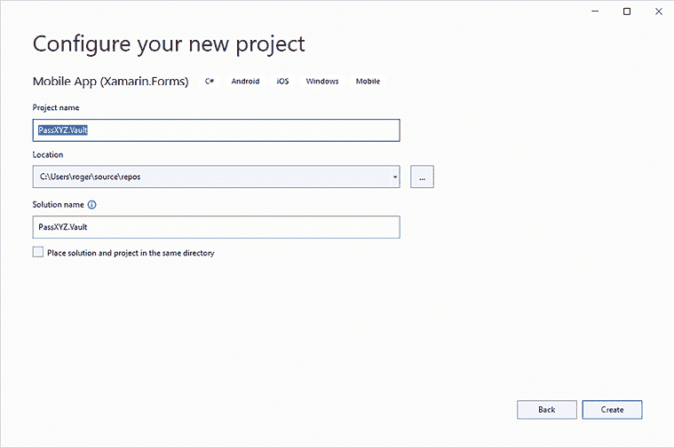

# 构建我们的第一个 .NET MAUI 应用程序

在本章节中，我们将创建一个新的 .NET MAUI 项目，并对其进行自定义，以便我们可以在应用程序开发中使用它。我们将开发的应用程序是一个密码管理应用程序。在随后的章节中，我们将逐步向其中引入各种功能。到 *第一部分* 结束时，我们将拥有一个功能齐全的密码管理应用程序。

对于之前有 Xamarin.Forms 经验的人来说，会记得 **Shell** 作为一种方便的应用程序容器，通过提供定义应用程序关键组件的统一结构来简化应用程序开发。虽然微软没有直接提供 .NET MAUI Shell 的 Visual Studio 模板，但我们可以有效地利用来自 Xamarin.Forms 的模板。为了在我们的应用程序中包含 Shell，我们将重用 Xamarin.Forms 中找到的项目模板。此外，将 Xamarin.Forms Shell 模板迁移到 .NET MAUI 的过程将为将 Xamarin.Forms 项目迁移到 .NET MAUI 提供宝贵的见解。

本章节将涵盖以下主题：

+   设置新的 .NET MAUI 项目

+   应用程序启动和生命周期管理

+   配置资源

+   创建具有 Shell 支持的新 Xamarin.Forms 项目

+   将此 Xamarin.Forms 项目迁移到 .NET MAUI

# 技术要求

要测试和调试本章节中的源代码，您需要在 Windows 或 macOS 上安装 Visual Studio 2022。请参阅 *第一章*，*开始使用 .NET MAUI* 中的 *开发环境设置* 部分，获取详细信息。

要检查本章节的源代码，我们可以使用以下 Git 命令：

```swift
$ git clone https://github.com/PacktPublishing/.NET-MAUI-Cross-Platform-Application-Development-Second-edition.git -b 2nd/chapter02 
```

# 管理本书中的源代码

由于我们将在本书中逐步开发密码管理应用程序，因此每个章节的源代码都是基于前一个章节构建的。为了持续改进我们的应用程序，我们将为每个章节的源代码设置单独的分支。如果您想使用一条命令克隆所有章节的源代码，您可以从主分支克隆。在主分支中，所有章节都在单独的文件夹中。如果您不想使用 Git，您也可以从发布区域下载源代码的压缩文件，如图中所示（*图 2.1*）：


图 2.1：GitHub 中的源代码

由于新的 .NET MAUI 版本可能会不时发布，因此发布区域中的 Git 标签和版本将根据新的 .NET MAUI 版本和错误修复进行更新。

本书中的源代码可以在以下 GitHub 仓库中找到：[`github.com/PacktPublishing/.NET-MAUI-Cross-Platform-Application-Development-Second-edition`](https://github.com/PacktPublishing/.NET-MAUI-Cross-Platform-Application-Development-Second-edition)。

从 GitHub 下载源代码有三种方法。

## 下载压缩文件中的源代码

源代码可以在发布区域下载，或者使用以下 URL：[`github.com/PacktPublishing/.NET-MAUI-Cross-Platform-Application-Development-Second-edition/releases/tag/V1.0.0`](https://github.com/PacktPublishing/.NET-MAUI-Cross-Platform-Application-Development-Second-edition/releases/tag/V1.0.0)。

当有新版本发布时，发布标签可能会更改。

## 按章节克隆源代码

要检查出章节的源代码，可以使用以下命令，例如：

```swift
$ git clone https://github.com/PacktPublishing/.NET-MAUI-Cross-Platform-Application-Development-Second-edition.git -b 2nd/chapter02 
```

我使用以下命名约定为分支命名：`[xxx]/chapter[yy]`，其中`x`是版本号，`y`是章节号，例如`2nd/chapter01`。

## 从主分支克隆源代码

要从主分支检查出所有章节的源代码，可以使用以下命令：

```swift
$ git clone https://github.com/PacktPublishing/.NET-MAUI-Cross-Platform-Application-Development-Second-edition.git 
```

# 设置新的.NET MAUI 项目

在本章中，我们将创建和配置一个新的.NET MAUI 项目，这将成为我们密码管理器应用程序进一步开发的基础。鉴于默认的.NET NAUI 项目模板非常简单，我们需要一个更健壮的项目框架来建立基本的项目结构。

Xamarin.Forms 项目模板提供了合适的选项。特别是，有一个模板集成了 Shell 和**模型-视图-视图模型**（**MVVM**）模式设置。我们将将其迁移到我们的.NET MAUI 项目中，这也会给我们提供学习如何将 Xamarin.Forms 项目迁移到.NET MAUI 的机会。最终，我们将创建我们自己的 Visual Studio 项目模板。

要创建一个新的.NET MAUI 项目，我们可以使用 Visual Studio 或命令行。

## 使用 Visual Studio 创建新项目

要创建一个新的.NET MAUI 项目，请按照以下步骤操作：

1.  启动 Visual Studio 2022，在启动屏幕上选择**创建新项目**。这将打开**创建新项目**向导。

1.  在屏幕顶部有一个搜索框。我们可以在搜索框中输入`maui`，.NET MAUI 相关的项目模板将会显示（见图*2.2*）：

    图 2.2：新项目设置 – 创建新项目

    .NET MAUI 应用程序或库有三个模板：

    +   **.NET MAUI 应用程序** – 这是基于 XAML 的.NET MAUI 应用程序。

    +   **.NET MAUI Blazor 混合应用程序** – 此模板可用于创建.NET MAUI Blazor 应用程序。

    +   **.NET MAUI 类库** – 这是构建.NET MAUI 类库的选项。当我们开发.NET MAUI 应用程序时，我们可以将共享组件作为.NET MAUI 类库来构建。

1.  让我们选择**.NET MAUI 应用程序**并点击**下一步**按钮；它进入下一步以配置我们的新项目，如图*2.3*所示：


图 2.3：新项目设置 – 配置您的项目

1.  输入项目名称和解决方案名称为`PassXYZ.Vault`并点击**下一步**按钮。项目创建后，项目结构将类似于*图 2.4*，并将显示以下内容：

    +   *通用文件* – 在一个新项目中，模板中包含三个文件 – `App.xaml`、`MainPage.xaml` 和 `MauiProgram.cs`。这是我们将在整本书中工作的文件组。它们是平台无关的。业务逻辑和 UI 都可以在这里开发并在所有平台上共享。

    +   *平台特定文件* – 在 `Platforms` 文件夹中有五个子文件夹（`Android`、`iOS`、`MacCatalyst`、`Windows` 和 `Tizen`）。由于我们不会支持 Tizen，我们可以将其从我们的项目中删除。

    +   *资源* – `Resources` 文件夹中包含各种资源，从图像、字体、启动画面、样式和原始资产等。这些资源可以在所有支持的平台中使用。


图 2.4：.NET MAUI 项目结构

在 .NET MAUI 项目中，只有一个项目结构。稍后，我们将看到 Xamarin.Forms 的开发涉及多个项目。

## 使用 dotnet 命令创建新项目

虽然. NET MAUI 作为 Visual Studio 安装的一部分被安装，但它也可以使用命令行独立安装。这种灵活性允许使用替代的开发工具，例如 Visual Studio Code，而不是 Visual Studio。要从命令行创建和构建 .NET MAUI 应用程序，我们可以使用 `dotnet` 命令。

要找出已安装哪些项目模板，我们可以参考以下命令：

```swift
C:\ > dotnet new --list 
```

要使用命令行创建新项目，我们可以执行以下命令：

```swift
C:\ > dotnet new maui -n "PassXYZ.Vault" 
```

在创建新的 .NET MAUI 项目后，我们可以构建和测试它。在我们继续之前，让我们花些时间看看 .NET MAUI 应用程序启动代码和生命周期。

# 应用程序启动和生命周期

.NET MAUI 中的生命周期管理对于高效资源管理至关重要，确保用户体验的流畅和一致性，安全地处理应用程序，以及理解和调试应用程序行为。它允许应用程序在后台或前台时保存和恢复应用程序的状态，从而节约资源。当应用程序进入后台时，它提供了执行某些操作的机会，例如保存数据或暂停活动。此外，当应用程序在活动状态之间切换时，它通过管理敏感数据提供了增强的安全性。因此，理解应用程序生命周期对于构建健壮、高效且用户友好的 .NET MAUI 应用程序至关重要。

在 .NET MAUI 项目中，应用程序启动和生命周期管理由以下两个文件处理：

+   `MauiProgram.cs`

+   `App.xaml/App.xaml.cs`

.NET 通用宿主用于应用程序启动和配置。当应用程序启动时，创建一个 .NET 通用宿主对象来封装应用程序的资源及其生命周期功能，如下所示：

+   **依赖注入**（**DI**）

+   日志记录

+   配置

+   生命周期管理

这使得应用程序可以在单个位置进行初始化，并提供了配置字体、服务和第三方库的能力。本章将探讨除依赖注入（DI）之外的所有内容，依赖注入将在第六章“使用依赖注入的软件设计”中介绍。

**.NET 通用宿主**

如果你是一个 Xamarin 开发者，你可能不熟悉 .NET 通用宿主。.NET 通用宿主是在 .NET Core 中引入的，它是一个用于构建跨平台 .NET 应用程序的统一托管模型。它提供了一种一致的方式来配置、运行和管理各种类型的 .NET 应用程序（如控制台应用程序、微服务和 Web 应用程序）中的服务和后台任务。在 .NET MAUI 中，采用了相同的模式，用于启动和配置管理。

让我们检查 *清单 2.1* 中的应用程序启动代码：

```swift
namespace PassXYZ.Vault;
public static class **MauiProgram**
{
  public static MauiApp **CreateMauiApp**()                  //(1)
  {
    var builder = MauiApp.CreateBuilder();               //(2)
    builder
      .UseMauiApp<App>()                                 //(4)
      .ConfigureFonts(fonts =>
      {
        fonts.AddFont("OpenSans-Regular.ttf", "OpenSansRegular");
      });
    return builder.Build();                              //(3)
  }
} 
```

清单 2.1: `MauiProgram.cs` ([`epa.ms/MauiProgram2-1`](https://epa.ms/MauiProgram2-1))

在 *清单 2.1* 中，我们可以看到以下内容：

**(1)** 在每个平台上，入口点位于特定平台的代码中。入口点调用 `CreateMauiApp` 函数，这是 `MauiProgram` 静态类的一个方法。

**(2)** 在 `CreateMauiApp` 内部，代码调用 `CreateBuilder` 函数，这是 `MauiApp` 静态类的一个方法，并返回一个 `MauiAppBuilder` 实例，它提供了一个 .NET 通用宿主接口。我们可以使用这个 .NET 通用宿主接口的实例来配置我们应用程序中使用的资源或服务。

**(3)** `CreateMauiApp` 函数的返回值是一个 `MauiApp` 实例，它是我们应用程序的入口点。

**(4)** 在 `UseMauiApp` 方法中引用的 `App` 类是我们应用程序的根对象。让我们回顾一下 *清单 2.2* 中 `App` 类的定义：

```swift
namespace PassXYZ.Vault;
public partial class **App** : **Application**              //(1)
{
  public App()
  {
    InitializeComponent();
    MainPage = new **AppShell**();                      //(2)
  }
} 
```

清单 2.2: `App.xaml.cs` ([`epa.ms/App2-2`](https://epa.ms/App2-2))

在 *清单 2.2* 中，我们可以看到以下内容：

**(1)** `App` 类是从 `Application` 类派生的，而 `Application` 类是在 `Microsoft.Maui.Controls` 命名空间中定义的。

**(2)** `AppShell` 是 Shell 的一个实例，它定义了应用程序初始页的 UI。

`Application` 类在应用程序运行和视图显示的 `Window` 类中创建一个实例。在 `App` 类中，我们可以重写 `CreateWindow` 方法来管理生命周期，我们很快就会看到。

## 生命周期管理

.NET MAUI 应用程序通常在四个执行状态中操作：

+   运行

+   未运行

+   停止

+   已停止

在状态转换期间，将触发预定义的生命周期事件。定义了六个跨平台的生命周期事件，正如我们可以在 *表 2.1* 中看到的那样：

| **事件** | **描述** | **状态转换** | **重写方法** |
| --- | --- | --- | --- |
| 创建 | 此事件在原生窗口创建后触发。 | 未运行 -> 运行 | `OnCreated` |
| 激活 | 当窗口被激活并且是或将成为焦点窗口时，此事件被触发。 | 未运行 -> 运行 | `OnActivated` |
| 非活动 | 当窗口不再是焦点窗口时，此事件被触发。然而，窗口可能仍然可见。 | 运行 -> 非活动 | `OnDeactivated` |
| 停止 | 当窗口不再可见时，此事件被触发。 | 非活动 -> 停止 | `OnStopped` |
| 恢复 | 当应用在停止后恢复时，此事件被触发。 | 停止 -> 运行 | `OnResumed` |
| 销毁 | 当原生窗口被销毁和释放时，此事件被触发。 | 停止 -> 未运行 | `OnDestroying` |

表 2.1：生命周期事件和覆盖方法

请参考以下 Microsoft 文档以了解更多有关生命周期事件的信息：[`learn.microsoft.com/en-us/dotnet/maui/fundamentals/app-lifecycle`](https://learn.microsoft.com/en-us/dotnet/maui/fundamentals/app-lifecycle)。

这些生命周期事件与 `Application` 创建的 `Window` 类的实例相关联。对于每个事件，都定义了一个相应的覆盖方法。我们可以订阅生命周期事件或创建覆盖函数来处理生命周期管理。

### 订阅窗口生命周期事件

要订阅生命周期事件，如 *列表 2.3* 中所示，在 **(1)** 处，我们可以在 `App` 类中覆盖 `CreateWindow` 方法来创建一个 `Window` 实例，我们可以在其上订阅事件：

```swift
using System.Diagnostics;
namespace PassXYZ.Vault;
public partial class App : Application {
  public App() {
    InitializeComponent();
    MainPage = new MainPage();
  }
  protected override Window CreateWindow(IActivationState
    activationState)                                       //(1)
  {
    Window window = base.CreateWindow(activationState);
    window.Created += (s, e) => {
      Debug.WriteLine("PassXYZ.Vault.App: 1\. Created event");
    };
    window.Activated += (s, e) => {
      Debug.WriteLine("PassXYZ.Vault.App: 2\. Activated event");
    };
    window.Deactivated += (s, e) => {
      Debug.WriteLine("PassXYZ.Vault.App: 3\. Deactivated event");
    };
    window.Stopped += (s, e) => {
      Debug.WriteLine("PassXYZ.Vault.App: 4\. Stopped event");
    };
    window.Resumed += (s, e) => {
      Debug.WriteLine("PassXYZ.Vault.App: 5\. Resumed event");
    };
    window.Destroying += (s, e) => {
      Debug.WriteLine("PassXYZ.Vault.App: 6\. Destroying event");
    };
    return window;
  }
} 
```

列表 2.3：`App.xaml.cs` 与生命周期事件 ([`epa.ms/App2-3`](https://epa.ms/App2-3))

在 *列表 2.3* 中，我们修改了 `App.xaml.cs` 的代码，并订阅了所有六个事件，以便我们可以在 Visual Studio 输出窗口中运行测试并观察状态。如下面的调试输出所示，我们在 Windows 环境中运行并测试了我们的应用。

在我们启动我们的应用后，我们可以看到 `Created` 和 `Activated` 事件被触发。然后，我们最小化我们的应用，我们可以看到 `Deactivated` 和 `Stopped` 事件被触发。当我们再次恢复应用时，`Resumed` 和 `Activated` 事件被触发。最后，我们关闭我们的应用，并触发一个 `Destroying` 事件：

```swift
PassXYZ.Vault.App: 1\. Created event
PassXYZ.Vault.App: 2\. Activated event
PassXYZ.Vault.App: 4\. Stopped event
PassXYZ.Vault.App: 3\. Deactivated event
PassXYZ.Vault.App: 5\. Resumed event
PassXYZ.Vault.App: 2\. Activated event
PassXYZ.Vault.App: 5\. Resumed event
PassXYZ.Vault.App: 2\. Activated event
The thread 0x6f94 has exited with code 0 (0x0).
PassXYZ.Vault.App: 6\. Destroying event
The program '[30628] PassXYZ.Vault.exe' has exited with code 0 (0x0). 
```

### 消费生命周期覆盖方法

或者，我们可以消费生命周期覆盖方法。我们可以从 `Window` 类创建自己的派生类：

1.  在 Visual Studio 中，右键单击项目节点，然后选择 **添加** 并然后 **新建项…**。

1.  在 **添加新项** 窗口中，从模板中选择 **C# 类** 并将其命名为 `PxWindow`。我们创建了一个新类，如下所示在 *列表 2.4*：

```swift
using System.Diagnostics;
namespace PassXYZ.Vault;
public class PxWindow : Window
{
    public PxWindow() : base() {}
    public PxWindow(Page page) : base(page) {}
    protected override void OnCreated() {
        Debug.WriteLine("PassXYZ.Vault.App: 1\. OnCreated");
    }
    protected override void OnActivated() {
        Debug.WriteLine("PassXYZ.Vault.App: 2\. OnActivated");
    }
    protected override void OnDeactivated() {
        Debug.WriteLine("PassXYZ.Vault.App: 3\. OnDeactivated");
    }
    protected override void OnStopped() {
        Debug.WriteLine("PassXYZ.Vault.App: 4\. OnStopped");
    }
    protected override void OnResumed() {
        Debug.WriteLine("PassXYZ.Vault.App: 5\. OnResumed");
    }
    protected override void OnDestroying() {
        Debug.WriteLine("PassXYZ.Vault.App: 6\. OnDestroying");
    }
} 
```

列表 2.4：`PxWindow.cs` ([`epa.ms/PxWindow2-4`](https://epa.ms/PxWindow2-4))

在 *列表 2.4* 中，我们创建了一个新的类，`PxWindow`。在这个类中，我们定义了我们的生命周期覆盖方法。我们可以在 `App.xaml.cs` 中使用这个新类。

接下来，让我们看看 `App.xaml.cs` 的修改版本 (*列表 2.5*)：

```swift
namespace PassXYZ.Vault;
public partial class App : Application
{
  public App()
  {
    InitializeComponent();
  }
  protected override Window CreateWindow(
    IActivationState activationState)            //(1)
  {
    return new PxWindow(new MainPage());
  }
} 
```

*列表 2.5：修改后的 App.xaml.cs 与 PxWindow (*[`epa.ms/App2-5`](https://epa.ms/App2-5)*)*

当我们重复之前的测试步骤时，我们可以在 Visual Studio 输出窗口中看到以下输出。输出看起来非常类似于之前的一个。基本上，这两种方法对生命周期管理的影响是相同的：

```swift
PassXYZ.Vault.App: 1\. OnCreated
PassXYZ.Vault.App: 2\. OnActivated
PassXYZ.Vault.App: 4\. OnStopped
PassXYZ.Vault.App: 3\. OnDeactivated
PassXYZ.Vault.App: 5\. OnResumed
PassXYZ.Vault.App: 2\. OnActivated
PassXYZ.Vault.App: 5\. OnResumed
PassXYZ.Vault.App: 2\. OnActivated
PassXYZ.Vault.App: 6\. OnDestroying
The program '[25996] PassXYZ.Vault.exe' has exited with code 0 (0x0). 
```

我们通过 `Window` 类学习了 .NET MAUI 的应用生命周期管理。我们可以订阅生命周期事件或覆盖可覆盖的方法来管理应用生命周期。*表 2.1* 展示了这两种方法的比较。

如果你是一名 Xamarin.Forms 开发者，你可能知道在 `Application` 类中定义了生命周期方法。在 .NET MAUI 中，以下虚拟方法仍然可用：

+   `OnStart` – 当应用启动时调用

+   `OnSleep` – 每次应用进入后台时调用

+   `OnResume` – 当应用从后台恢复时调用

要观察这些方法的行为，我们可以在 `App` 类中覆盖以下方法，如 *列表 2.6* 所示：

```swift
using System.Diagnostics;
namespace PassXYZ.Vault;
public partial class App : Application
{
  public App()
  {
    InitializeComponent();
    MainPage = new MainPage();
  }
  protected override void **OnStart**() {                    //(1)
    Debug.WriteLine("PassXYZ.Vault.App: OnStart");
  }
  protected override void **OnSleep**() {                    //(2)
    Debug.WriteLine("PassXYZ.Vault.App: OnSleep");
  }
  protected override void **OnResume**() {                   //(3)
    Debug.WriteLine("PassXYZ.Vault.App: OnResume");
  }
} 
```

列表 2.6: `App.xaml.cs` ([`epa.ms/App2-6`](https://epa.ms/App2-6))

当我们在 Windows 上测试前面的代码时，我们可以在 Visual Studio 输出窗口中看到以下调试信息：

```swift
PassXYZ.Vault.App: OnStart
PassXYZ.Vault.App: OnSleep
The thread 0x6844 has exited with code 0 (0x0).
The thread 0x6828 has exited with code 0 (0x0).
The thread 0x683c has exited with code 0 (0x0).
PassXYZ.Vault.App: OnResume 
```

如 *列表 2.6* 所示，根据应用的不同状态，将激活特定的方法。

**(1)** 当应用启动时，`OnStart` 方法会被调用。

**(2)** 当我们最小化应用时，`OnSleep` 方法会被调用。

**(3)** 当我们从任务栏恢复应用时，`OnResume` 方法会被调用。

我们已经了解了 .NET MAUI 应用的生命周期状态，并且了解到我们可以订阅生命周期事件或使用覆盖方法来管理应用的生命周期。现在让我们关注应用启动时的资源配置。

# 配置资源

资源管理是 .NET MAUI 和 Xamarin 之间的主要区别之一。

跨平台开发具有独特的挑战，因为每个平台都有自己管理资源的方法。这种多样性可以为开发团队带来重大的管理任务。例如，我们必须包含多种图像大小以适应不同的分辨率。

在 Xamarin 中，大多数资源都在平台特定的项目中单独管理。如果我们想添加一个图像，我们必须分别将不同大小的图像文件添加到所有平台项目中。

.NET MAUI 提供了一种优雅的解决方案来有效地管理资源。一个单一项目支持所有平台的设计目标有助于在一个地方管理资源。

在 .NET MAUI 中，可以根据资源在项目中所起的作用，使用基于构建操作的标签将资源文件分类到不同的类别中，正如我们在 *表 2.2* 中所看到的：

| **资源类型** | **构建操作** | **示例** |
| --- | --- | --- |
| 图像 | `MauiImage` | `dotnet_bot.svg` |
| 图标 | `MauiIcon` | `appicon.svg` |
| 启动画面图像 | `MauiSplashScreen` | `appiconfg.svg` |
| 字体 | `MauiFont` | `OpenSans-Regular.ttf` |
| 使用外部 CSS 定义样式 | `MauiCss` | N/A |
| 原始资产 | `MauiAsset` | N/A |
| XAML UI 定义 | `MauiXaml` | N/A |

表 2.2：.NET MAUI 资源类型

最后三个使用频率不高，因此我们将重点关注使用更常见资源类型的示例。

添加资源文件后，可以在 Visual Studio 的**属性**窗口中设置构建操作。如果我们查看项目文件，我们可以看到以下`ItemGroup`：

```swift
<ItemGroup>
  <!-- App Icon -->
  <MauiIcon Include="Resources\AppIcon\appicon.svg"
    ForegroundFile="Resources\AppIcon\appiconfg.svg"
    Color="#512BD4" />
  <!— Splash Screen -->
  <MauiSplashScreen Include= "Resources\Splash\splash.svg"
    Color="#512BD4" BaseSize="128,128" />
  <!-- Images -->
  <MauiImage Include="Resources\Images\*" />
  <!-- Custom Fonts -->
  <MauiFont Include="Resources\Fonts\*" />
</ItemGroup> 
```

如果我们按照默认文件夹设置的约定放置资源，资源将被视为相应的类别，并且构建操作将自动设置。

## 应用图标

在我们的应用设置中，如上`ItemGroup`所示，我们在`Resources\AppIcon`文件夹中有一个 SVG 图像文件`appicon.svg`，其构建操作设置为`MauiIcon`。在构建时，此文件用于为目标平台上的各种目的生成图标图像，例如在设备上或在应用商店中。

可以将此 SVG 文件与其他图像一起移动到`Resources\Images`文件夹中。在这种情况下，我们应该在项目文件中使用以下条目：

```swift
<MauiIcon Include="Resources\Images\appicon.png" ForegroundFile="Resources\Images\appiconfg.svg" Color="#512BD4" /> 
```

缺点是构建操作对同一文件夹中的文件处理不一致 - `appicon.svg`位于我们的项目中的`Resources\AppIcon`文件夹，而不是`Resources\Images`。

## 启动屏幕

启动屏幕的配置与应用图标的配置类似。我们在`Resources/Splash`文件夹中有一个 SVG 图像文件`splash.svg`，其构建操作设置为`MauiSplashScreen`：

```swift
<MauiSplashScreen Include="Resources\Splash\splash.svg" Color="#512BD4" /> 
```

如应用图标、启动屏幕和其他图像等资源简单，可以直接在项目文件中进行配置。

一些常用资源，如自定义字体和服务，可能需要在代码中或同时在代码和项目文件中进行配置。我们将在下一节讨论自定义字体的配置，并将依赖注入留到*第六章*，*使用依赖注入的软件设计*。

## 设置自定义字体图标

自定义字体可以作为资源的一部分进行管理。使用自定义字体图标，我们可以显著减少我们应用中的图像资源数量。在移动应用中，视觉表示通常通过图像来传递。我们在各种导航活动中使用图像。在 Android 和 iOS 开发中，我们需要管理不同屏幕分辨率的图像资源。

使用自定义字体作为图标而不是图像有许多优点。字体图标是矢量图标而不是位图图标。矢量图标是可缩放的，这意味着您不需要根据设备的不同大小和分辨率使用不同的图像。图标字体缩放可以通过`FontSize`属性来处理。字体文件的大小也比图像小得多。包含数百个图标的字体文件可能只有几 KB 大小。

图标的颜色可以通过`TextColor`属性进行更改。对于静态图像，我们无法更改图标颜色。

最后，字体文件可以在共享项目中管理，因此我们不需要在不同的平台上分别管理字体。

在 Xamarin.Forms 和.NET MAUI 中，我们可以使用自定义字体（图标字体）而不是图像作为应用程序图标。

在.NET MAUI 中，显示文本的控件通常具有可定义的属性来配置字体设置。可以配置的属性包括：

+   `FontAttributes`，这是一个有三个成员的枚举：`None`、`Bold`和`Italic`。此属性的默认值为`None`。

+   `FontSize`，这是字体大小的属性，类型为`double`。

+   `FontFamily`，这是字体家族的属性，类型为`string`。

### 自定义字体设置

自定义字体的设置分为两个阶段——添加字体文件和配置它们。在.NET MAUI 和 Xamarin.Forms 中，都可以将自定义字体文件添加到共享项目中。然而，它们的配置过程有所不同。在 Xamarin.Forms 中，配置是通过`AssemblyInfo.cs`处理的。在.NET MAUI 中，这是通过.NET 通用宿主管理的。

在 Xamarin.Forms 中，完成此操作的过程如下：

1.  将字体文件添加到 Xamarin.Forms 共享项目作为嵌入资源（构建操作：`EmbeddedResource`）。

1.  使用`ExportFont`属性在`AssemblyInfo.cs`等文件中注册字体文件。也可以指定一个可选的别名。

在.NET MAUI 中，过程如下：

1.  将字体文件添加到`Resources`->`Fonts`文件夹。构建操作设置为**MauiFont**，正如我们在*图 2.5*中看到的那样：


图 2.5：.NET MAUI 资源

1.  代替在程序集注册字体文件，.NET MAUI 通过启动代码中的.NET 通用宿主初始化大部分资源，正如在*列表 2.7*的**（1**）处所示的*图 2.7*。字体文件通过`ConfigureFonts`方法添加，这是`MauiAppBuilder`类的一个扩展方法。

在我们的项目中，我们使用以下开源项目中的 Font Awesome 图标库：[`github.com/FortAwesome/Font-Awesome`](https://github.com/FortAwesome/Font-Awesome)。

可以从前面的网站下载`fa-brands-400.ttf`、`fa-regular-400.ttf`和`fa-solid-900.ttf`字体文件。

让我们回顾*列表 2.7*中的源代码，看看如何将这些字体添加到应用程序配置中：

```swift
namespace PassXYZ.Vault;
public static class MauiProgram
{
  public static MauiApp CreateMauiApp()
  {
    var builder = MauiApp.CreateBuilder();
    builder
      .UseMauiApp<App>()
      .ConfigureFonts(fonts =>                             //(1)
      {
       fonts.AddFont("fa-regular-400.ttf","FontAwesomeRegular");
       fonts.AddFont("fa-solid-900.ttf", "FontAwesomeSolid");
       fonts.AddFont("fa-brands-400.ttf","FontAwesomeBrands");
       fonts.AddFont("OpenSans-Regular.ttf","OpenSansRegular");
       fonts.AddFont("OpenSans-SemiBold.ttf","OpenSansSemiBold");
      });
    return builder.Build();
  }
} 
```

列表 2.7：`MauiProgram.cs` ([`epa.ms/MauiProgram2-7`](https://epa.ms/MauiProgram2-7))

在上述代码中，我们可以通过在`MauiAppBuilder`对象上调用`ConfigureFonts` **（1**）方法来添加字体。要向`ConfigureFonts`传递参数，我们调用接口`IFontCollection`的扩展方法`AddFont`来添加字体。

### 显示字体图标

要在.NET MAUI 应用程序中显示字体图标，可以在`FontImageSource`对象中定义字体图标数据。这个类是`ImageSource`类的派生类，包含*表 2.3*中显示的属性：

| **属性名称** | **类型** | **描述** |
| --- | --- | --- |
| `Glyph` | `string` | Unicode 字符值，例如 `"&#xf007;"` |
| `Size` | `double` | 字体在设备无关单位中的大小 |
| `FontFamily` | `string` | 表示字体家族的字符串，例如 `FontAwesomeRegular` |
| `Color` | `Color` | 字体图标颜色在 `Microsoft.Maui.Graphics.Color` |

表 2.3：FontImageSource 属性

以下 XAML 示例显示了一个字体图标在 `Image` 视图中：

```swift
<Image BackgroundColor="#D1D1D1">
    <Image.Source>
        <**FontImageSource** Glyph="&#xf007;"
                         FontFamily="FontAwesomeRegular"
                         Size="32" />
    </Image.Source>
</Image> 
```

如果你对前面示例中的 XAML 语法不熟悉，不要担心。我们将在下一章中介绍它。在前面代码中，一个 `User` 图标在 `Image` 控件中显示，该图标来自我们刚刚在配置中添加的 `FontAwesomeRegular` 字体家族。`User` 图标的十六进制格式的 `Glyph` 是 `\uf007`，在这里以 C# 转义格式呈现。当我们将其用于 XML 时，我们必须使用的转义格式是 `&#xf007;`。

相应的 C# 代码如下：

```swift
Image image = new Image {
    BackgroundColor = Color.FromHex("#D1D1D1")
};
image.Source = new **FontImageSource** {
    Glyph = "\uf007",
    FontFamily = "FontAwesomeRegular",
    Size = 32
}; 
```

在前面的示例中，我们使用十六进制数字的字符串表示形式来引用字体图标中的 `Glyph`。然而，这在实际应用中并不实用。最好将字体符号定义为 C# 字符串常量，以便进行更有意义的引用。这里可以应用几种方法。在我们的情况下，我们使用开源的 **IconFont2Code** 工具来生成字符串常量。**IconFont2Code** 可以在 GitHub 上找到，使用以下 URL：[`github.com/andreinitescu/IconFont2Code`](https://github.com/andreinitescu/IconFont2Code)。

在我们的项目中，我们使用 Font Awesome。通过 **IconFont2Code** 网站，我们可以从项目的 `Resources\Fonts` 文件夹上传字体库。**IconFont2Code** 然后为我们生成相应的代码，如下例所示：

```swift
namespace PassXYZ.Vault.Resources.Styles;
static class FontAwesomeRegular
{
    public const string Heart = "\uf004";
    public const string Star = "\uf005";
    public const string Scan = "\uf006";
    public const string User = "\uf007";
    public const string Qrcode = "\uf008";
    public const string Fingerprint = "\uf009";
    public const string Clock = "\uf017";
    public const string ListAlt = "\uf022";
    public const string Flag = "\uf024";
    public const string Bookmark = "\uf02e";
    ...
    public const string SmileBeam = "\uf5b8";
    public const string Surprise = "\uf5c2";
    public const string Tired = "\uf5c8";
} 
```

我们可以将生成的 C# 文件保存在 `Resources\Styles` 文件夹中。前面的文件可以在这里找到：`Resources\Styles\FontAwesomeRegular.cs`。

在前面的 `FontAwesomeRegular` 静态类中，字体图标可以像 XAML 文件中的普通文本一样使用：

```swift
<Button
  Text="Click me"
  FontAttributes="Bold"
  Grid.Row="3"
  SemanticProperties.Hint="Counts the number of times …"
  Clicked="OnCounterClicked"
  HorizontalOptions="Center">
  <Button.ImageSource>
<FontImageSource 
      **FontFamily**="FontAwesomeSolid"
      **Glyph**="{x:Static app:FontAwesomeSolid.PlusCircle}"
      **Color**="{DynamicResource SecondaryColor}"
      **Size**="16" />
  </Button.ImageSource>
</Button> 
```

在前面的代码中，我们向 `Button` 控件添加了一个圆形加号图标，该图标出现在文本 `"Click me"` 之前。为了在生成的 C# 类中引用图标名称，我们引入了一个 `app` 命名空间，如下所示：

```swift
xmlns:app="clr-namespace:PassXYZ.Vault.Resources.Styles" 
```

到目前为止，我们已经创建了我们的项目并配置了我们需要的资源。现在是时候构建和测试我们的应用程序了。

# 构建和调试

如我们在 *第一章* 中提到的，*开始使用 .NET MAUI*，我们不能使用单个平台构建和测试每个目标。请参阅 *表 1.8* 了解 Windows 和 macOS 平台上的可用构建目标。为了简化，我们将在 Windows 上构建和测试 Windows 和 Android 的目标。对于 iOS 和 macOS 构建，我们将在 macOS 平台上进行。

一旦我们设置好一切，我们就可以开始构建和调试我们的应用程序。

让我们从 Windows 平台上的构建和测试开始。我们可以根据需要选择要运行或调试的框架，如图 *图 2.6* 所示：


图 2.6：构建和调试

## Windows

我们可以通过选择**net8.0-windows10.0.19041.0**作为框架，在本地机器上运行或调试 Windows 构建。但是，为了完成此操作，我们必须首先在 Windows 上启用开发者模式，如果尚未激活的话。请参阅 *图 2.7* 以获取在 Windows 10 或 11 上启用开发者模式的指导：

1.  打开**开始**菜单。

1.  搜索**开发者设置**并选择它。

1.  打开**开发者模式**。

1.  如果收到有关开发者模式的警告消息，请阅读它，并选择**是**。


图 2.7：开发者模式

## Android

对于 Android 构建，可以使用 Android 模拟器或设备进行测试。然而，在构建或调试之前，我们需要连接设备或设置模拟器的一个实例。有关如何配置设备或创建模拟器实例的说明，请参阅以下 Microsoft 文档：[`learn.microsoft.com/en-us/dotnet/maui/`](https://learn.microsoft.com/en-us/dotnet/maui/)。

我们可以通过选择**net8.0-android**作为框架，从 Visual Studio (*图 2.6*) 运行或调试。

或者，我们也可以使用以下命令从命令行构建和运行 `net8.0-android`：

```swift
dotnet build -t:Run -f net8.0-android 
```


图 2.8：在 Android 和 Windows 上运行

在 Android 和 Windows 目标上运行应用程序后，我们可以看到前面的屏幕 (*图 2.8*)。

## iOS 和 macOS

我们能够在 Mac 计算机上构建和测试 iOS 和 macOS 目标。鉴于 Microsoft 关于退役 Microsoft Visual Studio 2022 for Mac 的公告，我们将继续演示如何利用命令行操作构建和测试 iOS 和 macOS 目标。

### 构建 iOS 目标并进行测试

要构建和测试 iOS 目标，我们可以在项目文件夹中使用以下命令：

```swift
dotnet build -t:Run -f net8.0-ios -p:_DeviceName=:v2:udid=02C556DA-64B8-440B-8F06-F8C56BB7CC22 
```

要选择一个目标 iOS 模拟器，我们需要使用以下参数提供设备 ID：

```swift
-p:_DeviceName=:v2:udid= 
```

要找到设备 ID，我们可以在 Mac 计算机上启动 Xcode 并转到**Windows** -> **设备和模拟器**，如图 *图 2.9* 所示：


图 2.9：Xcode 中的设备和模拟器

除了在 Mac 上构建之外，值得注意的是，iOS 目标也可以在 Windows 上使用 Visual Studio 2022 进行构建和测试，前提是配置已相应设置。有关如何使用热重启部署 iOS 应用程序的说明，请参阅以下 Microsoft 文档：[`learn.microsoft.com/en-us/dotnet/maui/ios/hot-restart`](https://learn.microsoft.com/en-us/dotnet/maui/ios/hot-restart)。

### 构建 macOS 目标并进行测试

对于 macOS 目标，我们可以使用以下命令来构建和测试：

```swift
dotnet build -t:Run -f net8.0-maccatalyst 
```

在 *图 2.10* 中，我们可以看到我们的项目在 iOS 和 macOS 上的截图。外观和感觉与 Android 和 Windows 类似。


图 2.10：在 iOS 和 macOS 上运行

Android、iOS 和 macOS 的环境设置涉及平台特定的细节。请参阅 Microsoft 文档以获取详细说明。

我们的应用程序现在运行良好，但你可以看到它是一个非常简单的应用程序，只有一个窗口。为了为我们的后续开发打下更好的基础，我们将使用 Shell 作为导航框架。在 Xamarin.Forms 中有一个很好的基于 Shell 的模板，我们可以用它来创建应用程序的初始代码。

# 从 Xamarin 迁移

在本节中，我们将展示将 Xamarin.Forms 项目模板迁移到 .NET MAUI 的过程。需要注意的是，这只是一个示例，因为存在许多类型的 Xamarin 项目。因此，本章只讨论了将 Xamarin.Forms 项目迁移到 .NET MAUI 的示例。有关迁移 Xamarin-native 项目和其他相关主题的更多信息，请参阅 Microsoft 文档：[`learn.microsoft.com/en-us/dotnet/maui/migration/`](https://learn.microsoft.com/en-us/dotnet/maui/migration/)。

尽管我们在这个章节中主要将 Xamarin.Forms Shell 模板作为示例进行移植，但这个新的项目模板对我们后续的开发至关重要。为了提供更多背景信息，我将简要介绍 PassXYZ.Vault 从 Xamarin.Forms 迁移到 .NET MAUI 的计划。这将概述我们在本书中需要克服的挑战，这应该能帮助你为迁移自己的应用程序时可能遇到的挑战做好准备。

我们现在可以成功运行我们创建的应用程序。在本书的其余部分，我们将开发一个名为 PassXYZ.Vault 的密码管理应用程序。该应用程序的 *1.x.x* 版本使用 Xamarin.Forms 实现，你可以在 GitHub 上找到它：[`github.com/passxyz/Vault`](https://github.com/passxyz/Vault)。

*1.x.x* 版本使用 Xamarin.Forms *5.0.0* 开发。我们计划使用 .NET MAUI 重新构建它，并在本书中讨论这个过程。.NET MAUI 的发布将标记为 *2.x.x*，源代码将在以下位置提供：[`github.com/passxyz/Vault2`](https://github.com/passxyz/Vault2)。

*1.x.x* 和 *2.x.x* 版本都使用 Shell 作为导航框架，分别通过 `Microsoft.Maui.Controls.Shell` 和 `Xamarin.Forms.Shell` 在 .NET MAUI 和 Xamarin.Forms 中得到支持。Shell 在所有平台上提供一致的导航用户体验。我们将在第五章 *使用 .NET MAUI Shell 和 NavigationPage 进行导航* 中深入了解 Shell 及其导航功能。

由 Visual Studio 创建的 .NET MAUI 和 Xamarin.Forms 的项目模板都包含 Shell。然而，默认的 .NET MAUI 项目模板只包含最简单的 Shell 形式，如图 2.8 所示：

```swift
<?xml version="1.0" encoding="UTF-8" ?>
<Shell
    x:Class="PassXYZ.Vault.AppShell"
    xmlns="http://schemas.microsoft.com/dotnet/2021/maui"
    xmlns:x="http://schemas.microsoft.com/winfx/2009/xaml"
    xmlns:local="clr-namespace:PassXYZ.Vault"
    Shell.FlyoutBehavior="Disabled">
    <ShellContent
        Title="Home"
        ContentTemplate="{DataTemplate local:MainPage}"
        Route="MainPage" />
</Shell> 
```

列表 2.8: `AppShell.xaml` ([`epa.ms/AppShell2-8`](https://epa.ms/AppShell2-8))

`MainPage` 在 `ShellContent` 中显示，呈现一个基本 UI，内容不多。在我们的应用程序中，我们将使用 **MVVM 模式** 通过 Shell 构建用户界面。为了做到这一点，需要包含 MVVM 模式和 Shell 导航结构的样板代码。

MVVM 模式是 .NET MAUI 应用程序开发中常用的 UI 设计模式。随着我们在这本书中继续探讨主题，我们将多次遇到它。

我们可以选择从头开始创建此代码。然而，Xamarin.Forms 模板包括我在 `PassXYZ.Vault` 版本 *1.x.x* 中使用的样板代码。因此，可以为 .NET MAUI 创建相同的项目模板。这个过程也让我们了解了如何迁移或重用现有的 Xamarin.Forms 代码。

## 从 Xamarin.Forms 迁移和重用 Shell 模板

Xamarin.Forms 提供了一个更通用的 Shell 模板，可以用来生成带有飞出或标签页 Shell 导航选项的样板代码。我们可以使用这个模板来设置一个新的 Xamarin.Forms 项目。然后，我们可以在刚刚创建的 .NET MAUI 应用程序中实现这个样板代码。

要创建一个新的 Xamarin.Forms 项目，请按照以下步骤操作：

1.  启动 Visual Studio 2022 并选择 **创建新项目**。这打开 **创建新项目** 向导。在搜索框中，我们可以输入 `Xamarin`，所有与 Xamarin 相关的项目模板都将显示（见图 2.11）：


图 2.11：新 Xamarin 项目

1.  从列表中选择 **移动应用 (Xamarin.Forms**) 并点击 **下一步**。在下一屏幕，如图 2.12 所示，我们可以选择不同的位置并使用相同的项目名称 `PassXYZ.Vault`，然后点击 **创建** 按钮：



图 2.12：配置 Xamarin 项目

1.  我们还有一步，如图 2.13 所示。让我们选择 **飞出** 模板并点击 **创建**：


图 2.13：配置 Xamarin 项目 – 飞出

新解决方案创建后，我们可以看到解决方案中有四个项目，如图 2.14 所示：

+   **PassXYZ.Vault** – 这是一个由其他项目共享的 .NET Standard 项目，所有平台无关的代码都应该在这里。

+   **PassXYZ.Vault.Android** – 这是一个特定于 Android 平台的项目。

+   **PassXYZ.Vault.iOS** – 这是一个特定于 iOS 平台的项目。

+   **PassXYZ.Vault.UWP** – 这是一个特定于 UWP 的项目。

我们观察到，Xamarin.Forms 的项目结构与 .NET MAUI 的项目结构相当不同。解决方案由多个项目组成，平台特定的项目中分别管理资源。大部分的开发工作是在 .NET Standard 项目中进行的，**PassXYZ.Vault**。我们将重点关注迁移和重用此项目中的代码。


图 2.14：Xamarin.Forms 项目结构

此 Xamarin.Forms 项目的源代码可在此处找到：[`github.com/shugaoye/PassXYZ.Vault2/tree/xamarin`](https://github.com/shugaoye/PassXYZ.Vault2/tree/xamarin)。

当不涉及平台特定代码时，迁移过程相对简单。我们在这里处理的是最简单的情况，但重要的是要注意，生产代码可能比这个例子复杂得多。因此，任何迁移都应在仔细分析后进行。

让我们专注于 .NET Standard 项目。其内容包含用于 MVVM 模式和 Shell UI 的样板代码——这正是我们所需要的。我们可以将 *表 2.4* 中突出显示的文件复制到 .NET MAUI 项目中，并相应地调整源代码中的命名空间。

下面是迁移过程的步骤：

1.  请参考 *表 2.4*，它显示了与 .NET Standard 项目中的文件和文件夹列表相对应的操作列表：

| **Xamarin.Forms** | **操作** | **.NET MAUI** |
| --- | --- | --- |
| `App.xaml` | 无 | 保持 .NET MAUI 版本。它定义了 `Application` 类的实例。 |
| `AppShell.xaml` | 替换 | 覆盖 .NET MAUI 版本并将命名空间更改为 .NET MAUI。此文件定义了 Shell 导航层次结构。 |
| `Views/` | 复制 | 在 .NET MAUI 项目中新建文件夹。需要更改命名空间。 |
| `ViewModels/` | 复制 | 在 .NET MAUI 项目中新建文件夹。需要更改命名空间。 |
| `Services/` | 复制 | 导出模型的接口。在 .NET MAUI 项目中新建文件夹。需要更改命名空间。 |
| `Models/` | 复制 | 在 .NET MAUI 项目中新建文件夹。需要更改命名空间。 |

表 2.4：.NET Standard 项目中的操作

1.  在 .NET MAUI 项目中，请参考 *表 2.5* 替换以下命名空间：

| **旧命名空间** | **新命名空间** |
| --- | --- |
|  |  |
| `using Xamarin.Forms` | `using Microsoft.Maui AND using Microsoft.Maui.Controls` |
| `using Xamarin.Forms.Xaml` | `using Microsoft.Maui.Controls.Xaml` |

表 2.5：.NET MAUI 和 Xamarin.Forms 中的命名空间

1.  测试并修复任何错误。

    在 *图 2.15* 中，我们可以看到在迁移过程中更改的文件列表：

    

    图 2.15：迁移过程中更改的文件（https://bit.ly/3NlfqvO）

    对于这个简单的案例，所有必要的更改都关联到命名空间。然而，在现实世界中的情况并不总是遵循这种模式。尽管这个过程很简单，但对于.NET MAUI 的新手来说，它仍然可能有些令人畏惧。实际上，你不需要亲自执行这个过程。作为替代方案，我创建了一个新的.NET MAUI 项目模板，您可以使用它。

在构建和测试这个更新后的应用程序后，我们可以在*图 2.16*提供的屏幕截图中查看结果：


*图 2.16*：PassXYZ.Vault 与.NET MAUI Shell

在*图 2.16*中，我们可以看到默认 Shell 菜单中包含三个页面：

+   **关于**：这是一个告知用户应用程序功能的页面。

+   **浏览**：这是项目列表的入口点。

+   **注销**：这是登录页面的链接，您可以在那里登录或注销。

这段样板代码将作为本书中我们项目进一步开发的基石。为了封装本节中我们所做的工作，我创建了一个相应的 Visual Studio 项目模板。使用这个模板可以轻松地生成所需的项目结构。

注意，这个例子仅仅说明了基本的迁移过程。在实际项目中，还需要考虑许多其他因素，例如：

+   将资源（字体、图像等）从平台文件夹中移出

+   将 Customer Renderer 转换为 Handler

+   更新依赖项（NuGet 包）

+   将`DependencyService`更改为 DI

上述列表只是一个例子。我们只能在详细分析项目后找出所有考虑因素。

## Visual Studio 项目模板

该项目模板可以从 Visual Studio Marketplace 下载为 Visual Studio 扩展包：[`marketplace.visualstudio.com/items?itemName=shugaoye.maui`](https://marketplace.visualstudio.com/items?itemName=shugaoye.maui)。

当您访问上述 URL 时，您将看到*图 2.17*所示的页面：


*图 2.17*：Visual Studio Marketplace 中的项目模板

在安装此项目模板后，我们可以创建一个新的.NET MAUI 项目，如图*图 2.18*所示：


*图 2.18*：创建新的.NET MAUI MVVM 项目

使用此模板创建的项目，其项目结构与本章中的相同。此项目模板的源代码可以在以下位置找到：[`github.com/passxyz/MauiTemplate`](https://github.com/passxyz/MauiTemplate)。

# 摘要

在本章中，我们创建了一个新的 .NET MAUI 项目。我们学习了如何使用 .NET 泛型宿主配置我们的 .NET MAUI 应用，并调整了资源配置以使用自定义字体（Font Awesome）。我们还了解了 .NET MAUI 应用程序的生命周期，并通过重写 `CreateWindow` 方法以及创建 `Window` 类的派生类来测试订阅生命周期事件的过程。为了生成具有 MVVM 模式和 Shell 支持的样板代码，我们创建了一个新的 .NET MAUI 项目模板。这个教程旨在演示如何将 Xamarin.Forms 代码迁移到 .NET MAUI。

在我们接下来的章节中，我们将学习如何使用 XAML 创建用户界面，这可以用于构建 WPF、UWP、Xamarin.Forms 和 .NET MAUI 的用户界面。我们将继续使用 XAML 创建和增强我们的密码管理器应用的用户界面。

# 在 Discord 上了解更多信息

加入我们社区的 Discord 空间，与作者和其他读者进行讨论：

[`packt.link/cross-platform-app`](https://packt.link/cross-platform-app)


