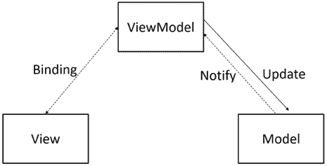
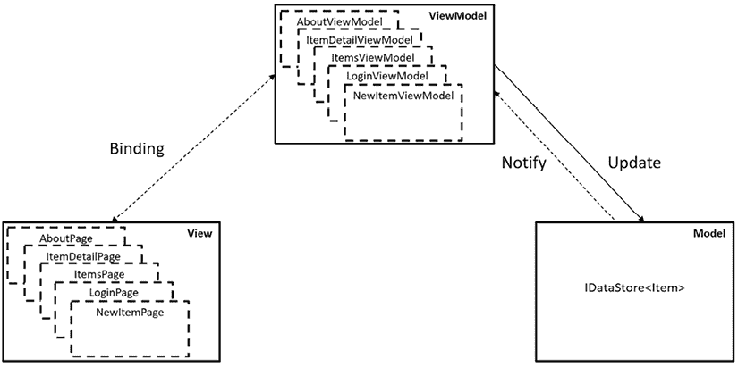
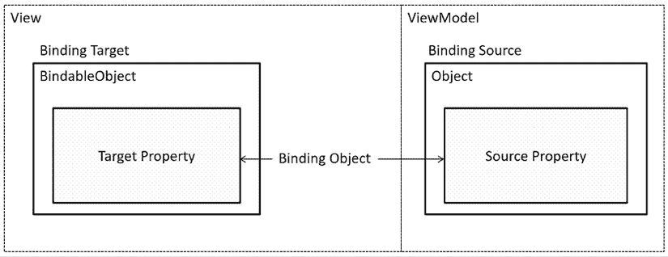
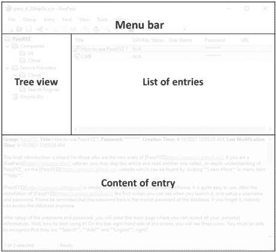
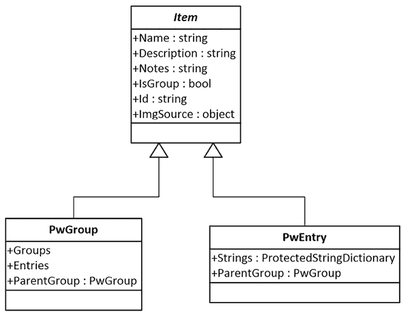
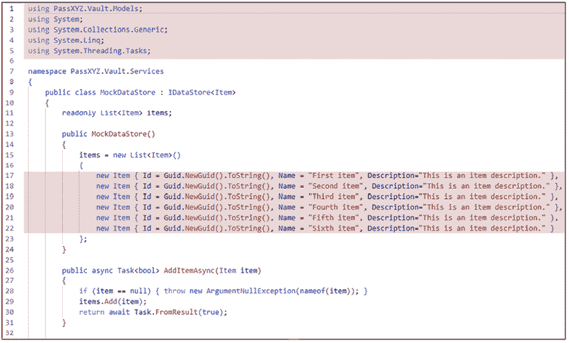
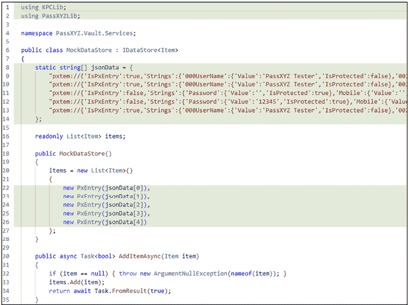
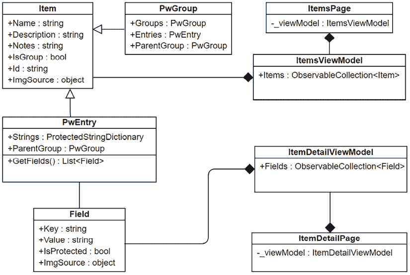
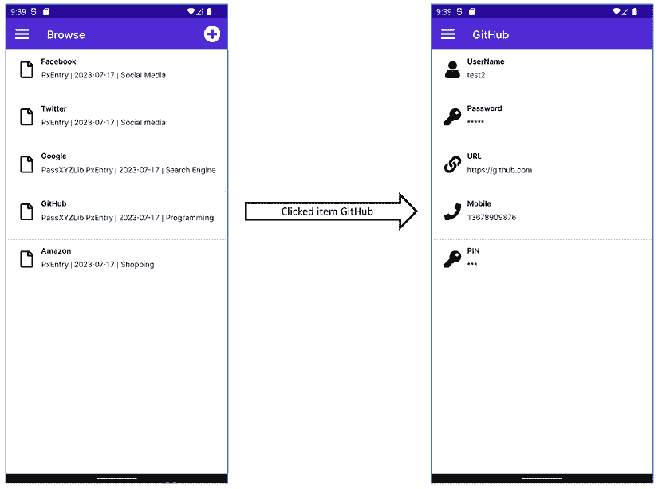

# 探索 MVVM 和数据绑定

在上一章中，我们探讨了如何使用 XAML 构建**用户界面**（**UI**）。在本章中，我们将深入探讨**模型-视图-视图模型**（**MVVM**）模式和数据绑定。MVVM 模式，一种广泛采用的架构模式，对于创建可维护、可扩展和可测试的应用程序至关重要。在.NET MAUI 的上下文中，MVVM 将用户界面逻辑、数据和应用程序的结构分离成三个不同的组件：模型、视图和视图模型。这种分离导致代码库整洁有序，使得开发和维护应用程序更加容易。数据绑定是一种将视图（UI）与视图模型连接的技术，使得 UI 能够同步和自动地反映视图模型的数据变化。

在本章中，我们的初步重点是介绍**MVVM**和数据绑定。为了更好地设计和编写更干净的代码，我们将使用.NET 社区工具包的一部分，即 MVVM 工具包。使用 MVVM 工具包的结果是更简洁、更干净的视图模型代码。

在现实世界的应用程序中，大多数逻辑都是在模型和服务层实现的。没有更复杂的模型层，我们无法深入探讨关于 MVVM 和数据绑定的复杂主题。因此，在本章的后半部分，我们展示了实际的模型层，包括两个.NET 库，**KPCLib**和**PassXYZLib**。

在建立了实际的模型层之后，我们介绍了数据绑定的两个高级主题：绑定到集合和使用自定义视图。

本章将涵盖以下主题：

+   理解**MVVM**和**MVC**

+   数据绑定

+   .NET 社区工具包

+   介绍数据模型和服务层

+   绑定到集合

+   使用自定义视图

# 技术要求

要测试和调试本章的源代码，您需要在您的 PC 或 Mac 上安装 Visual Studio 2022。有关详细信息，请参阅第一章，*开始使用.NET MAUI*中的*开发环境设置*部分。

本章的源代码可在以下 GitHub 仓库中找到：[`github.com/PacktPublishing/.NET-MAUI-Cross-Platform-Application-Development-Second-edition/tree/2nd/chapter04`](https://github.com/PacktPublishing/.NET-MAUI-Cross-Platform-Application-Development-Second-edition/tree/2nd/chapter04)。

要查看本章的源代码，我们可以使用以下命令：

```swift
$ git clone -b 2nd/chapter04 https://github.com/PacktPublishing/.NET-MAUI-Cross-Platform-Application-Development-Second-edition.git PassXYZ.Vault2 
```

要了解更多关于本书源代码的信息，请参阅第二章，*构建我们的第一个.NET MAUI 应用程序*中的*管理本书的源代码*部分。

# 理解 MVVM 和 MVC

在软件设计中，我们通常遵循并重用良好的实践和设计模式。**模型-视图-控制器**（**MVC**）模式是一种解耦系统责任的方法。它可以帮助将 UI 实现和业务逻辑分离到不同的部分。


图 4.1：MVC 模式

如*图 4.1*所示，MVC 模式将系统的职责分为三个不同的部分：

+   **模型**：模型代表应用程序的数据和业务逻辑。它负责存储应用程序的数据，处理数据验证，并执行任何必要的数据处理。模型类通常与数据源（如数据库、Web API 或文件存储）交互，以获取和存储数据。模型类通常可以实施为**纯旧 CLR 对象**（**POCOs**）或**数据传输对象**（**DTOs**）。POCO 是一个不依赖于任何框架特定类的类，因此 POCO 类可以很好地与 LINQ 或 Entity Framework 一起使用。DTO 是 POCO 类的子集，仅包含数据而没有逻辑或行为。DTO 类可用于在层之间传递数据。模型不依赖于视图或控制器，因此它可以单独实现和测试。

+   **视图**：视图负责应用程序的用户界面和用户交互。视图不应包含任何业务逻辑或直接的数据处理。相反，它向用户显示数据和界面元素，并捕获他们的输入。

+   **控制器**：控制器根据用户的操作更新模型和视图。我们对模型和视图的理解在时间上并没有太大的变化，但自从 MVC 模式被引入以来，对控制器就有不同的理解和实现。

MVVM 模式受 MVC 模式的启发，但其目标是提供一种针对基于 XAML 的应用程序 UI 开发的改进方法。随着基于 XAML 的 UI 框架的兴起，MVVM 获得了动力，并成为 WPF、Silverlight 以及后来的 Xamarin.Forms 应用程序的事实上的模式。

随着 Xamarin.Forms 演变为.NET MAUI，MVVM 在多平台移动和桌面应用程序开发中继续是一个突出的模式。



图 4.2：MVVM 模式

如*图 4.2*所示，在 MVVM 中，ViewModel 用于替代控制器。MVVM 与 MVC 之间的区别如下：

+   **视图和模型的解耦**：ViewModel 用于处理视图和模型之间的通信。视图通过 ViewModel 访问模型中的数据和逻辑。

+   **视图和 ViewModel 之间的数据绑定**：使用数据绑定，视图或 ViewModel 中的更改可以自动更新到另一个中。这有助于减少实现的复杂性。

在 MVC 和 MVVM 中，模型都可以单独测试。在 MVVM 中，还可以为 ViewModel 设计单元测试。

当视图发生变化时，这些变化将通过数据绑定反映在 ViewModel 中。ViewModel 将处理模型中的数据变化。同样，当模型中的数据发生变化时，ViewModel 会收到通知以更新视图。通知的常见解决方案是安装事件处理器来触发通知。使用数据绑定，实现大大简化。

## PassXYZ.Vault 中的 MVVM

在我们的应用`PassXYZ.Vault`中，我们使用 MVVM 来处理视图和 ViewModel 之间的数据交换。正如我们在*图 4.3*中可以看到的，我们有五个 XAML 内容页面和相同数量的 ViewModel 定义。在我们的模型中，我们有一个`Item`类，这是我们模型类，并且可以通过**IDataStore**接口访问。



图 4.3：PassXYZ.Vault 中的 MVVM

数据绑定用作视图和 ViewModel 之间的通信通道。ViewModel 将通过**IDataStore**服务接口更新`Item`模型。我们将在下一节通过分析`ItemDetailPage`和`ViewModel`来学习如何使用数据绑定。

# 数据绑定

让我们探索 MVVM 和数据绑定是如何工作的。我们可以在我们的应用中使用一个项目详情页面实现来分析**数据绑定是如何工作的**。以下列表包括了我们将要探索的视图、ViewModel 和模型：

+   **视图**：`ItemDetailPage`，参见前一章的*列表 3.4*

+   **ViewModel**：`ItemDetailViewModel`，参见前一章的*列表 4.1*

+   **模型**：`Item`（通过**IDataStore**接口访问），参见前一章的*列表 3.3*

`ItemDetailPage`是一个用于显示`Item`实例内容的视图。数据是从 ViewModel 中检索的。展示`Item`内容的 UI 元素通过数据绑定连接到 ViewModel 实例。



图 4.4：数据绑定

正如我们在*图 4.4*中看到的，数据绑定用于同步目标和源对象的属性。数据绑定中有三个对象参与，它们是`绑定目标`、`绑定源`和`绑定对象`。

## 绑定对象

在*图 4.4*中，`Binding`类（`Microsoft.Maui.Controls.Binding`）的对象代表了目标属性（在视图）和源属性（在 ViewModel）之间的连接。它管理属性值的同步并处理源和目标之间的通信。绑定对象是在你定义 XAML 标记中的绑定表达式或创建代码中的绑定时创建的。

在 XAML 中创建绑定对象的示例：

```swift
<Label Text="{Binding FirstName}" /> 
```

在 C#中创建绑定对象的示例：

```swift
label.SetBinding(Label.TextProperty, new Binding("FirstName")); 
```

## 绑定目标

在 *图 4.4* 中，目标指的是绑定到 ViewModel 属性的视图中的 UI 元素（控件）。更具体地说，目标是参与绑定的 UI 元素的属性。目标属性的例子包括 `Label` 或 `Entry` 上的 `Text`、`Image` 上的 `Source` 和 `Button` 上的 `IsEnabled`。目标属性必须是可绑定属性才能参与数据绑定。

## 绑定源

源是包含绑定到视图中的目标属性属性的对象。通常，源对象是 ViewModel，它应该被设置为视图的 `BindingContext` 或其父元素之一。ViewModel 暴露了定义其数据类型、获取器和设置器方法的属性。源属性通过绑定表达式中的绑定路径来识别。

当你在 XAML 中定义绑定表达式或在代码中创建绑定对象时，会创建一个绑定对象并将其设置为指定的目标属性。XAML 解析器或绑定系统创建绑定对象，并用提供的绑定属性（如 `Path`、`Source`、`Mode`、`Converter` 等）初始化它。

这里是一个涉及目标和源对象属性的列表：

+   **目标** – 这是涉及的 UI 元素，并且这个 UI 元素必须是 `BindableObject` 的子元素。在 `ItemDetailPage` 中使用的 UI 元素是 `Label`。

+   **目标属性** – 这是目标对象的属性。它是一个 `BindableProperty`。如果目标是 `Label`，如我们在这里提到的，目标属性可以是 `Label` 的 `Text` 属性。

+   **源** – 这是数据绑定引用的源对象。在这里，它是 `ItemDetailViewModel`。

+   **源对象值路径** – 这是源对象中值的路径。在这里，路径是一个 `ViewModel` 属性，例如 `Name` 或 `Description`。

让我们看看 `ItemDetailPage` 中的以下代码：

```swift
<StackLayout Spacing="20" Padding="15">
  <Label Text="Name:" FontSize="Medium" />
  <Label Text="{Binding Name}" FontSize="Small"/>                  //(1)
  <Label Text="Description:" FontSize="Medium" />
  <Label Text="{Binding Description}" FontSize="Small"/>           //(2)
</StackLayout> 
```

在这里的 XAML 中，有两个数据绑定源路径，分别是 `Name`、**（1**）和 `Description`、**（2**）。绑定目标是 `Label`，目标属性是 `Label` 的 `Text` 属性。如果我们回顾 `Label` 的继承层次结构，它看起来是这样的：

```swift
Object -> BindableObject -> Element -> NavigableElement -> VisualElement -> View -> Label 
```

我们可以看到 `Element`、`VisualElement` 和 `View` 是 `BindableObject` 的派生类。数据绑定目标必须是 `BindableObject` 的子元素。

绑定源是 ViewModel 的 `Name`、**（1**）和 `Description`、**（2**）属性，如本处所示的 *清单 4.1*：

```swift
using PassXYZ.Vault.Models;
namespace PassXYZ.Vault.ViewModels {
[QueryProperty(nameof(ItemId), nameof(ItemId))]
public class ItemDetailViewModel : BaseViewModel {
        private string itemId;
        private string name;
        private string description;
        public string Id { get; set; }
        public string Name {                                      //(1)
            get => name;
            set => SetProperty(ref name, value);
        }
        public string Description...                              //(2)
        public string ItemId...
        public async void LoadItemId(string itemId) {             //(3)
            try {
                var item = await DataStore.GetItemAsync
                    (itemId);
                Id = item.Id;
                Name = item.Name;
                Description = item.Description;
            }
            catch (Exception) {
                Debug.WriteLine("Failed to Load Item");
            }
        }
} 
```

清单 4.1: `ItemDetailViewModel.cs` ([`epa.ms/ItemDetailViewModel4-1`](https://epa.ms/ItemDetailViewModel4-1))

`Name`、**（1**）和 `Description`、**（2**）的值是从 `LoadItemId()` 方法中的模型加载的，**（3**）。你可能注意到类被 `QueryPropertyAttribute` 属性装饰。这用于在页面导航期间传递参数，将在下一章中介绍。

让我们使用以下，*表 4.1*，来总结代码中的数据绑定组件。

| **数据绑定元素** | **示例** |
| --- | --- |
| 目标 | `Label` |
| 目标属性 | `Text` |
| 源对象 | `ItemDetailViewModel` |
| 源对象值路径 | `Name` 或 `Description` |

表 4.1: 数据绑定设置

## 绑定对象的属性

分析了前面的代码后，让我们看看绑定表达式的语法：

```swift
<object property="{Binding bindProp1=value1[, bindPropN=valueN]*}" ... /> 
```

绑定属性可以设置为一系列以 `bindProp=value` 形式的名称-值对。例如，请参见以下内容：

```swift
<Label Text="{Binding Path=Description}" FontSize="Small"/> 
```

`Path` 属性是默认属性，如果它是属性列表中的第一个，则可以省略，如这里所示：

```swift
<Label Text="{Binding Description}" FontSize="Small"/> 
```

我们在这里提到的绑定属性是 `Binding` 类的属性，您可以通过参考 Microsoft 关于 `Binding` 类的文档来找到详细信息：[`learn.microsoft.com/en-us/dotnet/api/microsoft.maui.controls.binding`](https://learn.microsoft.com/en-us/dotnet/api/microsoft.maui.controls.binding)。

除了 `Path` 属性，让我们再回顾另外两个重要的绑定属性，`Source` 和 `Mode`。

### 源

`Source` 属性表示包含源属性的对象（该属性将被绑定到目标属性）。默认情况下，源对象是元素的 `BindingContext`，通常是 ViewModel。但是，如果需要，您可以使用 `Source` 属性来绑定到其他对象。

示例：

```swift
<Label Text="{Binding Source={x:Reference someLabel}, Path=Text}" /> 
```

当我们将数据绑定设置到目标时，我们可以使用目标类的以下两个成员：

+   `BindingContext` 属性为我们提供了源对象

+   `SetBinding` 方法指定目标属性和源属性

在我们的例子中，我们在 `ItemDetailPage` 的 C# 代码隐藏文件中将 `BindingContext` 属性设置为 `ItemDetailViewModel` 的一个实例 **(1**)，如这里所示的 *清单 4.2*。它是在页面级别设置的，并适用于此页面上所有绑定目标：

```swift
using PassXYZ.Vault.ViewModels;
using System.ComponentModel;
using Microsoft.Maui;
using Microsoft.Maui.Controls;
namespace PassXYZ.Vault.Views
{
  public partial class ItemDetailPage : ContentPage
  {
    public ItemDetailPage()
    {
      InitializeComponent();
      BindingContext = new ItemDetailViewModel();                 //(1)
    }
  }
} 
```

清单 4.2: `ItemDetailPage.xaml.cs` ([`epa.ms/ItemDetailPage4-2`](https://epa.ms/ItemDetailPage4-2))

除了使用 `Binding` 标记扩展，我们还可以直接使用 `SetBinding` 方法创建绑定，就像这里所做的那样：

```swift
<StackLayout Spacing="20" Padding="15">
  <Label Text="Text:" FontSize="Medium" />
  <Label x:Name="labelText" FontSize="Small"/>                     //(2)
  <Label Text="Description:" FontSize="Medium" />
  <Label Text="{Binding Description}" FontSize="Small"/>
</StackLayout> 
```

**(2**) 在 XAML 代码中，我们移除了 `Binding` 标记扩展，并将实例名称指定为 `labelText`。在 C# 代码隐藏文件中，我们可以在 `ItemDetailPage` 的构造函数中调用 `SetBinding` 方法 **(3**) 来创建 `Text` 属性的数据绑定：

```swift
 public ItemDetailPage()
    {
        InitializeComponent();
        BindingContext = new ItemDetailViewModel();
        labelText.SetBinding(Label.TextProperty, "Text");          //(3)
    } 
```

### 绑定模式

`Mode` 属性指定绑定中数据流的方向，例如数据是否只从 ViewModel 流向 UI，或者是否双向流动。

在 `ItemDetailPage` 中，所有 UI 元素都是 `Label` 对象，用户无法编辑。这是从源到目标的单向绑定。源对象中的更改将导致目标对象更新。

.NET MAUI 支持四种绑定模式。让我们通过参考 *图 4.5* 来回顾它们。


图 4.5: 绑定模式

让我们看看`.NET MAUI`支持的绑定模式：

+   `OneWay`绑定通常用于向用户展示数据的情况。在我们的应用中，我们将检索密码条目列表，并在`ItemsPage`上显示这个列表。当用户点击列表中的项目时，密码详情将显示在`ItemDetailPage`上。`OneWay`绑定在这两种情况下都使用。

+   `TwoWay`绑定会导致源属性或目标属性的变化自动更新另一个。在我们的应用中，当用户编辑密码条目的字段或当用户在`LoginPage`上输入用户名和密码时，目标 UI `Entry`组件和源视图模型对象都设置为`TwoWay`。

+   `OneWayToSource`是`OneWay`绑定模式的逆操作。当目标属性发生变化时，源属性将被更新。当我们向`NewItemPage`添加新的密码条目时，我们可以使用`OneWayToSource`而不是`TwoWay`绑定模式来提高性能。

+   `OneTime`绑定是一种在*图 4.4*中没有显示的绑定模式。目标属性从源属性初始化，但源属性的任何进一步更改都不会更新目标属性。这是一种比`OneWay`绑定模式更简单的形式，具有更好的性能。

如果我们没有在数据绑定中指定绑定模式，则使用默认绑定模式。如果需要，我们可以覆盖默认绑定模式。

在我们的`ItemsPage`代码中，我们使用`ListView`控件来显示密码组条目列表，因此我们应该将`IsRefreshing`属性设置为`OneWay`绑定模式：

```swift
IsRefreshing="{Binding IsBusy, Mode=OneWay}" 
```

当我们在`NewItemPage`中添加新项目时，我们使用`Entry`和`Editor`控件来编辑属性。我们可以使用`OneWayToSource`或`TwoWay`绑定模式：

```swift
<Label Text="Text" FontSize="Medium" />
<Entry Text="{Binding Text, Mode=TwoWay}" FontSize="Medium"/>
<Label Text="Description" FontSize="Medium" />
<Editor Text="{Binding Description, Mode=OneWayToSource}"
  AutoSize="TextChanges" FontSize="Medium" Margin="0" /> 
```

## 在 ViewModel 中更改通知

在*图 4.5*中，我们可以看到数据绑定目标是`BindableObject`的派生类。除了这个要求外，在数据绑定设置中，数据源（ViewModel）需要实现`INotifyPropertyChanged`接口，以便当属性发生变化时，会引发`PropertyChanged`事件来通知变化。

在 MVVM 模式中，ViewModel 通常是数据绑定的数据源，因此我们需要在我们的 ViewModel 中实现`INotifyPropertyChanged`接口。如果我们为每个 ViewModel 类都这样做，将会产生大量的重复代码。在 Visual Studio 模板中，一个`BaseViewModel`类，如我们在*列表 4.3*中所见，包含在样板代码中，并在我们的应用中使用。其他 ViewModel 继承这个类：

```swift
namespace PassXYZ.Vault.ViewModels;
public class BaseViewModel : INotifyPropertyChanged              //(1)
{
  public IDataStore<Item> DataStore =>
    DependencyService.Get<IDataStore<Item>>();
  bool isBusy = false;
  public bool IsBusy {
    get { return isBusy; }
    set { SetProperty(ref isBusy, value); }                      //(2)
  }
  string title = string.Empty;
  public string Title {
    get { return title; }
    set { SetProperty(ref title, value); }
  }
  protected bool SetProperty<T>(ref T backingStore,
      T value,
      [CallerMemberName] string propertyName = "",
      Action onChanged = null) {
    if (EqualityComparer<T>.Default.Equals
        (backingStore, value))
        return false;
    backingStore = value;
    onChanged?.Invoke();
    OnPropertyChanged(propertyName);
    return true;
  }
#region INotifyPropertyChanged
 public event PropertyChangedEventHandler PropertyChanged;        //(4)
  protected void OnPropertyChanged([CallerMemberName]
    string propertyName = "") {                                   //(3)
    var changed = PropertyChanged;
    if (changed == null)
        return;
    changed.Invoke(this, new PropertyChangedEventArgs(propertyName));
  }
#endregion
} 
```

列表 4.3 `BaseViewModel.cs` ([`epa.ms/BaseViewModel4-3`](https://epa.ms/BaseViewModel4-3))

在`BaseViewModel`类(*列表 4.3*)中，我们可以看到以下内容：

**(1)** `BaseViewModel`实现了`INotifyPropertyChanged`接口，该接口定义了一个事件，`PropertyChanged`**(4)**。

**（3）** 当属性在设置器中变更时，会调用 `OnPropertyChanged` 方法。在 `OnPropertyChanged` 中，会触发 `PropertyChanged` 事件。`PropertyChanged` 事件处理器的副本存储在 **changed** 本地变量中，因此这种实现适用于多线程环境。当触发 `PropertyChanged` 事件时，需要传递属性名称作为参数，以指示哪个属性已更改。可以使用 `CallerMemberName` 属性来查找调用者的方法名或属性名，因此我们不需要硬编码属性名。

**（2）** 当我们在 ViewModel 中定义属性时，设置器中会调用 `OnPropertyChanged` 方法——但如您所见，在我们的代码中，我们调用 `SetProperty<T>` 而不是直接调用 `OnPropertyChanged`。`SetProperty<T>` 在调用 `OnPropertyChanged` 之前会执行额外的工作。它会检查值是否已更改。如果没有变化，它将返回并执行无操作。如果值已更改，它将更新后端字段并调用 `OnPropertyChanged` 来触发变更事件。

如果我们回顾 *列表 4.1* 中的 `ItemDetailViewModel`，它继承自 `BaseViewModel` 类。在 `Name` 和 `Description` 属性的设置器中，我们调用 `SetProperty<T>` 来设置值并触发 `PropertyChanged` 事件：

```swift
 public string Name {
            get => name;
            set => SetProperty(ref name, value);
        }
        public string Description {
            get => description;
            set => SetProperty(ref description, value);
        } 
```

在本节中，我们学习了数据绑定和 `INotifyPropertyChanged` 接口。我们需要创建样板代码来定义具有变更通知支持的属性。为了简化代码并在幕后自动生成样板代码，我们可以使用 MVVM Toolkit。

# .NET Community Toolkit

在本节中，我们将使用 MVVM Toolkit 对 ViewModel 代码进行重构。MVVM Toolkit 是 .NET Community Toolkit 中的一个模块，专门设计用于构建遵循 MVVM 设计模式的程序。

.NET Community Toolkit（之前称为 Windows Community Toolkit）是一组辅助函数、自定义控件和应用程序服务，旨在简化并加速 .NET 应用程序的开发。该工具包是开源的，并由社区维护，为各种 .NET 开发平台提供了一套工具，例如 .NET MAUI、Xamarin、UWP、WPF 和 WinUI。该工具包提供了有用的组件，开发者可以开箱即用，轻松构建具有丰富用户界面、常见应用程序服务、动画等的应用程序。

MVVM Toolkit 提供了一套基础类、实用工具和属性，使在 .NET 应用程序中实现 MVVM 模式更加高效和直接。MVVM Toolkit 提供以下关键组件：

+   `ObservableObject`：这是一个简化实现引发 PropertyChanged 事件的对象（如 ViewModels）的基础类。它实现了 `INotifyPropertyChanged` 接口，并提供 `SetProperty` 方法来处理属性变更通知。

+   `RelayCommand` 和 `AsyncRelayCommand`：实现 `ICommand` 接口的类，旨在处理执行方法和检查命令是否可以执行。它们使得为 ViewModel 创建响应 UI 操作的命令变得容易。

+   **依赖注入** 支持：MVVM 工具包提供了对依赖注入的内建支持，这使得使用流行的依赖注入库（如 `Microsoft.Extensions.DependencyInjection`）将服务集成到 ViewModel 中变得简单。

+   **信使**（**事件聚合器**）：MVVM 工具包提供了一个轻量级的信使服务，它允许组件之间进行解耦的消息传递通信，例如不同的 ViewModels。这促进了关注点的分离，并使每个组件更容易进行测试。

请在 *进一步阅读* 部分查找有关 MVVM 工具包的更多信息。

## 如何使用 MVVM 工具包

要在 .NET MAUI 中使用 MVVM 工具包，请按照以下步骤操作：

1.  将 .NET `CommunityToolkit.Mvvm` NuGet 包添加到我们的项目文件中，如下所示：

    ```swift
    <ItemGroup>
      <PackageReference Include="CommunityToolkit.Mvvm"
        Version="8.2.1" />
    </ItemGroup> 
    ```

1.  使用 MVVM 工具包源生成器重构 ViewModel。源生成器是 C# 编译器的一个功能，允许在编译时执行自定义代码以修改编译输出。MVVM 工具包支持使用源生成器根据属性自动生成 ViewModel 和 `ICommand` 模板代码，从而简化 ViewModel 的创建。

MVVM 工具包可以帮助我们通过使用源生成器简化 ViewModel。如果我们想在 ViewModel 中添加一个作为数据绑定源的属性，我们需要实现 `INotifyPropertyChanged` 接口。例如，在 `ItemDetailViewModel` 中，我们实现 `Description` 属性如下：

```swift
private string description;
public string Description {
  get => description;
  set => SetProperty(ref description, value);
} 
```

在 Setter 中，调用 `SetProperty` 方法，它将更新后端字段并调用 `OnPropertyChanged` 来触发更改事件。`SetProperty` 和 `OnPropertyChanged` 都在 `BaseViewModel` 类中定义，正如我们在 *清单 4.3* 中所看到的。

使用 MVVM 工具包，我们可以从 `ObservableObject` 继承，而不是从 `BaseViewModel` 继承。`ObservableObject` 实现了与我们在 `BaseViewModel` 中所做类似的 `INotifyPropertyChanged` 接口。使用 `ObservableObject`，我们可以将上述实现简化如下：

```swift
[ObservableProperty]
private string description; 
```

如我们所见，使用 `ObservableProperty` 属性，我们可以在代码中仅定义后端字段。源生成器将帮助我们生成模板代码。我们可以在 XAML 中使用 `Description` 属性如下：

```swift
<Label Text="{Binding Description}"
  FontSize="Small"
  TextType ="Html"
  Style="{DynamicResource ListItemDetailTextStyle}" /> 
```

在 MVVM 模式下，我们可以将 ViewModel 属性定义为可观察属性以支持双向绑定。我们还可以将 ViewModel 属性定义为 `ICommand` 接口，以使用数据绑定处理 UI 事件。

在我们的应用中，我们在 `ItemsPage` 中显示项目列表。在 `ItemsPage` 中，我们需要从数据源加载项目列表，并且还需要支持添加新项目。我们需要定义两个 `ICommand` 接口如下：

```swift
public class ItemsViewModel : BaseViewModel
{
  ...
  public Command LoadItemsCommand { get; }                      //(1)
  public Command AddItemCommand { get; }                        //(2)

  public ItemsViewModel()
  {
    ...
    LoadItemsCommand = new Command(
        async () => await LoadItems());                         //(3)
    AddItemCommand = new Command(AddItem);                      //(4)
    ...
  }
  private async Task LoadItems()                                //(5)
  {
    ...
  }
  private async void AddItem(object obj)                        //(6)
  {
    await Shell.Current.GoToAsync(nameof(NewItemPage));
  }
  ...
} 
```

在上述实现中，我们定义了两个属性，`LoadItemsCommand`**(1)** 和 `AddItemCommand`**(2)**，其类型为 `Microsoft.Maui.Controls.Command`。在 ViewModel 的构造函数中，我们用私有方法 `LoadItems`**(5)** 和 `AddItem`**(6)** 初始化它们**(3)(4)**。

使用 MVVM 工具包，我们可以简化实现如下：

```swift
public partial class ItemsViewModel : BaseViewModel
{
  ...
  [RelayCommand]
  private async void AddItem(object obj)                        //(1)
  {
    await Shell.Current.GoToAsync(nameof(NewItemPage));
  }

  ...

  [RelayCommand]
  private async Task LoadItems()                                //(2)
  {
    ...
  }
} 
```

我们可以看到，我们只需要在 `AddItem` `(1)` 和 `LoadItems` `(2)` 前添加 `RelayCommandAttribute` 来实现 `ICommand` 属性。源生成器将帮助我们生成其余的代码。

在介绍了 XAML UI 设计的基本知识、MVVM 模式和数据绑定之后，我们可以使用我们刚刚学到的知识来改进我们的应用。

# 改进数据模型和服务

在介绍了 MVVM 模式、数据绑定和 MVVM 工具包之后，我们掌握了如何使用数据绑定的基础知识。在本章的剩余部分，我们将探讨数据绑定的高级主题。我们将首先讨论如何绑定到集合，然后我们将介绍自定义视图。使用自定义视图，我们可以使 XAML 代码更简洁、更简洁。

为了检验这些主题，需要一个更复杂的模型层。我们不会创建一个假设的模型层，而是将使用我们应用中的实际模型层，该模型层包括两个 .NET 库：**KPCLib** 和 **PassXYZLib**。

为了介绍我们应用的模型层，让我们再次回顾一下用例。我们正在开发一个跨平台密码管理器应用，该应用兼容流行的 **KeePass** 数据库格式。我们有以下用例：

+   **用例 1**: `LoginPage` – 作为密码管理器用户，我希望登录到密码管理器应用，以便我可以访问我的密码数据。

+   **用例 2**: `AboutPage` – 作为密码管理器用户，我希望了解我正在使用的数据库和应用概览。

+   **用例 3**: `ItemsPage` – 作为密码管理器用户，我希望看到一组和条目列表，以便我可以探索和检查我的密码数据。

+   **用例 4**: `ItemDetailPage` – 作为密码管理器用户，我希望在列表中选择密码条目后，能看到该密码条目的详细信息。

+   **用例 5**: `NewItemPage` – 作为密码管理器用户，我希望在我的数据库中添加密码条目或创建一个新的组。

这五个用例是从 Visual Studio 模板继承的，对于密码管理器应用的当前用户故事来说已经足够了。我们将使用这些用户故事在本章中改进我们的应用。

我们使用 MVVM 模式实现了我们的应用，但下面的 `Item` 模型过于简单，不足以在密码管理器应用中使用：

```swift
public class Item
{
  public string Id { get; set; }
  public string Name { get; set; }
  public string Description { get; set; }
} 
```

我们密码管理器应用的主要功能封装在模型层中。我们将使用两个 .NET 包，KPCLib 和 PassXYZLib 来构建我们的模型。这两个包包含了我们需要的所有密码管理功能。

## KPCLib

我们将使用的是来自**KeePass**的库，名为`KeePassLib`。KeePass 和`KeePassLib`都是为.NET Framework 构建的，因此它们只能在 Windows 上使用。我将`KeePassLib`移植并重新构建为一个.NET Standard 2.0 库，打包为 KPCLib。KPCLib 可以在以下 NuGet 和 GitHub 上找到：

+   NuGet: [`www.nuget.org/packages/KPCLib/`](https://www.nuget.org/packages/KPCLib/)

+   GitHub: [`github.com/passxyz/KPCLib`](https://github.com/passxyz/KPCLib)

KPCLib 既用作包名也用作命名空间。KPCLib 的包包括两个命名空间，`KeePassLib`和`KPCLib`。`KeePassLib`命名空间是 KeePass 的原始命名空间，以下是一些更改：

+   更新并构建为.NET Standard 2.0

+   将`PwEntry`和`PwGroup`更新为从`Item`抽象类派生的类

在 KPCLib 命名空间中，定义了一个`Item`抽象类。我创建了一个新类并将其作为`PwEntry`和`PwGroup`的父类，是因为`KeePass`和`PassXYZ.Vault`之间的导航设计不同。

如果我们查看*图 4.5*中的 KeePass UI，我们可以看到它是一个经典的 Windows 桌面 UI。导航是围绕类似于 Windows 资源管理器的树视图设计的。



图 4.6: KeePass UI

两个类，`PwGroup`和`PwEntry`，表现得像目录和文件。一个`PwGroup`实例就像一个目录，它包含一个子列表——`PwGroup`和`PwEntry`。所有`PwGroup`实例都在右侧面板上的树视图中显示。当选择一个`PwGroup`实例时，该组中`PwEntry`的列表将显示在右侧面板上。`PwEntry`包括密码条目的内容，例如用户名和密码。`PwEntry`的内容在底部面板上显示。

在`PassXYZ.Vault`的用户界面设计中，我们使用.NET MAUI Shell 模板。这是一个堆叠型主-详细模式的实现。在堆叠型主-详细模式中，使用单个列表来显示项目。在这种情况下，`PwGroup`和`PwEntry`的实例都可以在同一个列表中显示。选择一个项目后，我们将根据项目的类型执行相应的操作。

### PwGroup 和 PwEntry 的抽象

为了更好地处理 PassXYZ.Vault 的用户界面设计，我们可以将`PwGroup`和`PwEntry`抽象为`Item`抽象类，如图*4.7*所示。



图 4.7: Item 类的类图

参考图*4.7*中的 UML 类图和*列表 4.4*中的`Item.cs`源代码，我们可以看到在`Item`抽象类中定义了以下属性。这些属性在`PwEntry`和`PwGroup`中都有实现：

**(1)** `Name`: `Item`的名称

**(2)** `Description`: `Item`的描述

**(3)** `Notes`: 用户定义的`Item`注释

**(4)** `IsGroup`: 如果实例是`PwGroup`则为`true`，如果是`PwEntry`则为`false`

**(5)** `Id`: 实例的 ID（类似于数据库中的主键的唯一值）

**(6)** `ImgSource`: 图标的图像源（`PwGroup` 和 `PwEntry` 都可以关联一个图标）

**(7)** `LastModificationTime`: 项目的最后修改时间

**(8)** `Item`: 实现了 `INotifyPropertyChanged` 接口，并且能够在 MVVM 模型中很好地用于数据绑定：

```swift
using System.Text;
namespace KPCLib
{
  public abstract class Item : INotifyPropertyChanged             //(8)
  {
    public abstract DateTime LastModificationTime {get;
        set;};}                                                   //(7)
    public abstract string Name { get; set; }                     //(1)
    public abstract string Description { get;}                    //(2)
    public abstract string Notes { get; set; }                    //(3)
    public abstract bool IsGroup { get; }                         //(4)
    public abstract string Id { get; }                            //(5)
    virtual public Object ImgSource { get; set; }                 //(6)
#region INotifyPropertyChanged ...
  }
} 
```

列表 4.4: `Item.cs` ([`epa.ms/Item4-4`](https://epa.ms/Item4-4))

## PassXYZLib

要在 `PassXYZ.Vault` 中使用 KeePassLib，我们需要使用一些 .NET MAUI API 来扩展我们应用所需的功能。为了将业务逻辑与 UI 分离并扩展 KeePassLib 的 .NET MAUI 功能，创建了一个 .NET MAUI 类库，PassXYZLib，以封装扩展的模型到一个单独的库中。PassXYZLib 既是包名也是命名空间。

要将 PassXYZLib 添加到我们的项目中，我们可以将其添加到 `PassXYZ.Vault.csproj` 项目文件中，如下所示：

```swift
 <ItemGroup>
    <PackageReference Include="PassXYZLib" Version="2.1.2" />
  </ItemGroup> 
```

我们也可以在此处从命令行添加 PassXYZLib 包。从命令行进入项目文件夹，执行以下命令以添加包：

```swift
dotnet add package PassXYZLib 
```

## 更新模型

在我们将 PassXYZLib 包添加到项目后，我们可以访问 KPCLib、`KeePassLib` 和 `PassXYZLib` 命名空间。要替换当前模型，我们需要从项目中移除 `Models/Item.cs` 文件。

之后，我们需要将 `PassXYZ.Vault.Models` 命名空间替换为 KPCLib。在 *图 4.8a* 中，我们可以看到 `PassXYZ.Vault.Models` 命名空间中的 `Item` 被使用。



图 4.8a：更新到 KPCLib 之前的 PassXYZ.Vault.Models

在替换 `PassXYZ.Vault.Models` 命名空间后，在 *图 4.8b* 中使用了 `KBCLib` 命名空间下的 `Item`。比较过渡前后的实现，我们可以观察到代码的其他部分基本保持不变。通过采用 MVVM 模式，大部分业务逻辑都被封装在模型层中。



图 4.8b：更新到 KPCLib

对于视图模型和视图中的剩余更改，所有修改都涉及命名空间更改，因此不需要进一步解释。

## 更新服务

主要更改可以在 `MockDataStore.cs` 中找到。在 `MockDataStore` 类中，我们更改了命名空间和模拟数据的初始化。

为了将模型与系统的其余部分解耦，我们使用 `IDataStore` 接口来封装实际的实现。在这个阶段，我们使用模拟数据来实现服务以进行测试，因此使用了 `MockDataStore` 类。我们将在 *第六章*，*使用依赖注入进行软件设计* 中用实际实现替换它，使用依赖注入。

**依赖反转和依赖注入**

在第六章“使用依赖注入的软件设计”中，我们将学习**依赖倒置原则**（**DIP**），这是 SOLID 设计原则之一。我们将学习如何使用依赖注入来管理`IDataStore`接口到实际实现的映射。

在原始代码中，我们创建了`PassXYZ.Vault.Models.Item`的新实例来初始化模拟数据。在替换模型后，我们不能直接创建`KPCLib.Item`，因为它是一个抽象类。相反，我们可以使用 JSON 数据创建新的`PxEntry`实例，并将`PxEntry`实例分配给`Item`列表：

```swift
 Static string[] jsonData =…;
    readonly List<Item> items;
    public MockDataStore() {
        items = new List<Item>() {
            new PxEntry(jsonData[0]),
            new PxEntry(jsonData[1]),
            new PxEntry(jsonData[2]),
            new PxEntry(jsonData[3]),
            new PxEntry(jsonData[4])
        };
    } 
```

要创建抽象类的实例，可以使用工厂模式。为了使测试代码简单，我们没有在这里使用它。本书后面的实际实现中使用了工厂模式。

我们现在已经用我们自己的模型替换了示例代码中的模型。随着这个变化，我们可以改进`ItemsPage`和`ItemDetailPage`以反映更新的模型。

我们将在下一节使用数据绑定到集合来更新视图和 ViewModel。

# 绑定到集合

在上一节中，我们使用 PassXYZLib 替换了模型。当我们介绍数据绑定时，我们使用了`ItemDetailPage`和`ItemDetailViewModel`来解释如何将源属性绑定到目标属性。

对于项目详情页面，我们创建了一个从单一源到单一目标的绑定。然而，有许多情况需要将数据集合绑定到 UI，例如`ListView`或`CollectionView`，以显示一组数据。


图 4.9：绑定到集合

如图 4.9 所示，当我们从集合对象到集合视图创建数据绑定时，要使用的是`ItemsSource`属性。在.NET MAUI 中，可以使用`ListView`和`CollectionView`等集合视图，它们都有`ItemsSource`属性。

对于集合对象，我们可以使用任何实现了`IEnumerable`接口的集合。然而，集合对象的更改可能无法自动更新 UI。为了自动更新 UI，源对象需要实现`INotifyCollectionChanged`接口。

我们可以使用`INotifyCollectionChanged`接口实现我们的集合对象，但最简单的方法是使用`ObservableCollection<T>`类。如果可观察集合中的任何项发生变化，绑定的 UI 视图会自动收到通知。

在此基础上，让我们回顾一下我们的**模型**、**ViewModel**和**视图**的类图，如图 4.9 所示：

+   **模型**：`Item`，`PwEntry`，`PwGroup`，`Field`

+   **ViewModel**：`ItemsViewModel`，`ItemDetailViewModel`

+   **视图**：`ItemsPage`，`ItemDetailPage`

当我们向用户显示项目列表时，用户可能会对选定的项目进行操作。如果项目是一个组，我们将在一个 `ItemsPage` 实例中显示组和条目。如果项目是一个条目，我们将在内容页上显示条目的内容，这是一个 `ItemDetailPage` 实例。在 `ItemDetailPage` 上，我们向用户显示字段列表。每个字段都是一个键值对，并作为 `Field` 类的实例实现。

总结来说，我们向用户展示两种类型的列表——项目列表或字段列表。项目列表在 `ItemsPage` 中显示，字段列表在 `ItemDetailPage` 中显示。



图 4.10：模型、视图和 ViewModel 的类图

在这个类图中，我们可以看到 `PwEntry` 和 `PwGroup` 都是从 `Item` 继承而来的。`ItemsViewModel` 中有一个项目列表，`ItemDetailViewModel` 中有一个字段列表。在视图中，`ItemsPage` 包含对 `ItemsViewModel` 的引用，而 `ItemDetailPage` 包含对 `ItemDetailViewModel` 的引用。

在我们完善设计之后，我们可以查看实现。我们将审查 `ItemDetailViewModel` 和 `ItemDetailPage` 的实现，以验证设计变更：

```swift
[QueryProperty(nameof(ItemId), nameof(ItemId))]
public partial class ItemDetailViewModel : BaseViewModel
{
  readonly IDataStore<Item> dataStore;
  ILogger<ItemDetailViewModel> logger;
  public ObservableCollection<Field> Fields { get; set; }         //(1)
  public ItemDetailViewModel(IDataStore<Item> dataStore,
    ILogger<ItemDetailViewModel> logger)
  {
    this.dataStore = dataStore;
    this.logger = logger;
    Fields = new ObservableCollection<Field>();                   //(2)
  }
  [ObservableProperty]
  private string? title;
  [ObservableProperty]
  private string? id;
  [ObservableProperty]
  private string? description;
  [ObservableProperty]
  private bool isBusy;
  private string? itemId;
  public string ItemId {
    get {
      if(itemId == null)
      { throw new NullReferenceException(nameof(itemId)); }
      return itemId;
    }
    set {
      itemId = value;
      LoadItemId(value);
    }
  }
  public override void OnItemSelecteion(object sender)
  {
    logger.LogDebug("OnItemSelecteion is invoked.");
  }
  public async void LoadItemId(string itemId)
  {
    if (itemId == null)
    { throw new ArgumentNullException(nameof(itemId)); }
    var item = await dataStore.GetItemAsync(itemId);
    if (item == null)
    { throw new NullReferenceException(itemId); }
    Id = item.Id;
    Title = item.Name;
    Description = item.Description;
    if (!item.IsGroup) {
      PwEntry dataEntry = (PwEntry)item;                          //(3)
      Fields.Clear();
      List<Field> fields =
        dataEntry.GetFields(GetImage: FieldIcons.GetImage);       //(4)
      foreach (Field field in fields) {
        Fields.Add(field);
      }
      logger.LogDebug($"ItemDetailViewModel:
        Name={dataEntry.Name}.");
    }
  }
} 
```

如此代码所示，我们可以看到与本章开头 *列表 4.1* 相比，`ItemDetailViewModel` 的差异：

**(1)** 定义了一个 `Fields` 属性，其类型为 `ObservableCollection<Field>`，用于保存字段列表。

**(2)** `Fields` 变量在 `ItemDetailViewModel` 的构造函数中初始化。

**(3)** 我们可以将 `item` 强制转换为 `PwEntry` 实例。

**(4)** 我们可以通过调用在 PassXYZLib 库中定义的扩展方法 `GetFields` 来获取字段列表。

在审查了 `ItemDetailViewModel` 的更改后，让我们审查 *列表 4.5* 中的 `ItemDetailPage` 的更改：

```swift
<?xml version="1.0" encoding="utf-8" ?>
<ContentPage
  xmlns="http://schemas.microsoft.com/dotnet/2021/maui"
  xmlns:x="http://schemas.microsoft.com/winfx/2009/xaml"
  x:Class="PassXYZ.Vault.Views.ItemDetailPage"
  xmlns:local="clr-namespace:PassXYZ.Vault.ViewModels"
  xmlns:model="clr-namespace:KPCLib;assembly=KPCLib"              //(1)
  x:DataType="local:ItemDetailViewModel"
  Title="{Binding Title}">
  <StackLayout>
    <ListView
      x:Name="FieldsListView"
      ItemsSource="{Binding Fields}"                              //(2)
      VerticalOptions="FillAndExpand"
      HasUnevenRows="False"
      RowHeight="84"
      IsPullToRefreshEnabled="true"
      IsRefreshing="{Binding IsBusy, Mode=OneWay}"
      CachingStrategy="RetainElement"
      ItemSelected="OnFieldSelected">
      <ListView.ItemTemplate>
        <DataTemplate>                                            //(3)
        ...               
        </DataTemplate>
      </ListView.ItemTemplate>
      <ListView.Footer>
        <StackLayout Padding="5" Orientation="Horizontal">
          <Label
            Text="{Binding Description}"
            FontSize="Small"
            Style="{DynamicResource ListItemDetailTextStyle}"
            TextType ="Html"/>
        </StackLayout>
      </ListView.Footer>
    </ListView>
  </StackLayout>
</ContentPage> 
```

列表 4.5: `ItemDetailPage.xaml` ([`epa.ms/ItemDetailPage4-5`](https://epa.ms/ItemDetailPage4-5))

在 `ItemDetailPage` 中，我们可以看到与 *第三章* 中 *使用 XAML 进行用户界面设计* 的 *列表 3.4* 相比，有许多更改。`ListView` 用于在条目中显示字段：

**(1)** 在 `DataTemplate` 中使用 `Field` 时，需要添加一个 `xmlns:model` 命名空间。由于 `Field` 类位于不同的程序集，我们需要指定程序集的名称，如下所示：

```swift
xmlns:model="clr-namespace:KPCLib;assembly=KPCLib" 
```

**(2)** 我们将 `Fields` 属性绑定到 `ListView` 的 `ItemsSource` 属性。

**(3)** `DataTemplate` 用于定义 `ListView` 中每个项目的外观。它在 *列表 4.5* 中是折叠的。

让我们展开它并审查此代码块中 `DataTemplate` 的实现：

```swift
<DataTemplate>
  <ViewCell>
    <Grid Padding="10" x:DataType="model:Field" >                  //(1)
      <Grid.RowDefinitions...>
      <Grid.ColumnDefinitions...>
      <Grid Grid.RowSpan="2" Padding="10">
        <Grid.ColumnDefinitions...>
        <Image Grid.Column="0" Source="{Binding ImgSource}"        //(2)
        HorizontalOptions="Fill"
        VerticalOptions="Fill" />                        
      </Grid>
      <Label Text="{Binding Key}"  Grid.Column="1".../>            //(3)
      <Label Text="{Binding Value}" Grid.Row="1"                   //(4)
        Grid.Column="1".../>                   
    </Grid>
  </ViewCell>
</DataTemplate> 
```

在 `DataTemplate` 中，每个字段的布局定义在 `ViewCell` 元素中。在 `ViewCell` 元素中，我们定义了一个 2x2 的 `Grid` 布局。第一列用于显示字段图标。字段中的键和值在第二列的两个行中显示：

**(1)** 在`Grid`布局中的`x:DataType`属性被设置为`Field`，`Grid`中的以下数据绑定将引用`Field`的属性。`Field`类定义在我们的模型中，该模型位于 KPCLib 包中。

**(2**) 要显示字段图标，`Image`控制的`Source`属性被设置为`Field`的`ImgSource`属性。

`Field`的`Key`属性和`Value`属性被分配给`Label`控制的`Text`属性。

通过这次分析，我们学习了如何为集合创建数据绑定。在`ItemsPage`和`ItemsViewModel`中使用的数据绑定与此实现类似。区别在于这里我们使用了一个`Field`的集合，而在`ItemsPage`中使用了`Item`类的集合。完成更改后，我们可以在*Figure 4.11*中看到 UI 的改进。



图 4.11：改进后的 ItemsPage 和 ItemDetailPage

在改进的 UI 中，我们在`ItemsPage`（在左侧）上显示项目列表。列表中的项目可以是条目（如 Facebook、Twitter 或 Amazon），或组，我们将在下一章中看到。

当用户点击一个项目，例如**GitHub**，`ItemDetailPage`（在右侧）上会显示关于**GitHub**的详细信息。在项目详情页面上，显示了关于此账户（**GitHub**）的信息。

# 使用自定义视图

我们在*Listing 4.5*中实现了`ViewCell`的实例，在`DataTemplate`中使用。这个`ViewCell`用于显示带有图标的键值对。同样的实现被用在`ItemsPage`和`ItemDetailPage`中，唯一的区别是数据绑定。这里我们重复了代码。为了重构实现，我们可以创建一个自定义视图（或自定义控件）。

在.NET MAUI 中，自定义视图是由开发者创建的用户界面组件，用于满足定制需求，提供可重用的 UI 逻辑，或扩展现有 UI 组件的功能。自定义视图可以通过组合现有控件，从`View`、`ViewCell`或`ContentView`等基类派生，并重写特定方法来自定义渲染或行为。

要创建一个可以在`ItemsPage`和`ItemDetailPage`中重用的自定义视图，我们首先应该在`Views`目录下创建一个名为`Templates`的新文件夹。在 Visual Studio 中，我们可以右键点击`Templates`文件夹，基于**.NET MAUI ContentView**（**XAML**）模板添加一个新项，命名为`KeyValueView`：

```swift
<?xml version="1.0" encoding="utf-8" ?>
<ViewCell ...
  xmlns:vm="clr-namespace:PassXYZ.Vault.ViewModels"
  x:Class="PassXYZ.Vault.Views.Templates.**KeyValueView**">           //(1)
  <Grid Padding="10" VerticalOptions="FillAndExpand">             //(2)
    <Grid.RowDefinitions>
      <RowDefinition Height="Auto" />
      <RowDefinition Height="Auto" />
    </Grid.RowDefinitions>
    <Grid.ColumnDefinitions>
      <ColumnDefinition Width="Auto" />
      <ColumnDefinition Width="Auto" />
    </Grid.ColumnDefinitions>
    <Grid Grid.RowSpan="2" Padding="10">
      <Grid.ColumnDefinitions>
        <ColumnDefinition Width="32" />
      </Grid.ColumnDefinitions>
      <Image x:Name=**"imageField"** Grid.Column="0"                 //(5)
        HorizontalOptions="Fill" VerticalOptions="Fill">
        <Image.Source>
        ...
        </Image.Source>
      </Image>
    </Grid>
    <Label x:Name=**"keyField"** ... />                              //(3)
    <Label x:Name=**"valueField"** ... />                            //(4)
    <Grid.GestureRecognizers>
      <TapGestureRecognizer
        NumberOfTapsRequired="1"
        Command="{Binding Source=
        {RelativeSource AncestorType=
        {x:Type vm:BaseViewModel}},
        Path=ItemSelectionChangedCommand}"
        CommandParameter="{Binding .}">
      </TapGestureRecognizer>
    </Grid.GestureRecognizers>
  </Grid>
</ViewCell> 
```

列表 4.6：`KeyValueView.xaml` ([`epa.ms/KeyValueView4-6`](https://epa.ms/KeyValueView4-6))

在*Listing 4.6*中我们可以看到类名是`KeyValueView` **(1**)，并且我们创建了一个 2x2 的网格 **(2**)。在这个网格中，有两行用于显示键 **(3**) 和值 **(4**)，以及一个图标 **(5**)。

当我们使用 `KeyValueView` 时，我们可以为键、值和图标建立数据绑定。为了支持数据绑定，我们需要将键、值和图标定义为可绑定属性。让我们回顾一下 *Listing 4.7* 中所示的实现。

```swift
public partial class KeyValueView : ViewCell {
  public KeyValueView() {
    InitializeComponent();
  }
  public static readonly BindableProperty KeyProperty =
    BindableProperty.Create(nameof(Key), typeof(string),
    typeof(KeyValueView), string.Empty,
    propertyChanging: (bindable, oldValue, newValue) =>
    {
      var control = bindable as KeyValueView;
      var changingFrom = oldValue as string;
      var changingTo = newValue as string;
      if(control == null) {
        throw new NullReferenceException(nameof(control)); }
      if(changingTo == null) {
        throw new NullReferenceException(nameof(changingTo));
      }
      control.Key = changingTo;
    });
  public string Key {                                            //(1)
    get { return (string)GetValue(KeyProperty); }
    set {
        keyField.Text = value;
        SetValue(KeyProperty, value);
    }
  }
  public static readonly BindableProperty ValueProperty =
    BindableProperty.Create(nameof(Value), typeof(string),
    typeof(KeyValueView), string.Empty,
    propertyChanging: (bindable, oldValue, newValue) =>
    {
      var control = bindable as KeyValueView;
      var changingFrom = oldValue as string;
      var changingTo = newValue as string;
      if (control == null)
        { throw new NullReferenceException(nameof(control)); }
      if (changingTo == null) {
        throw new NullReferenceException(nameof(changingTo));
      }
      control.Value = changingTo;
    });
  public string Value {                                           //(2)
      get { return (string)GetValue(ValueProperty); }
      set {
          valueField.Text = value;
          SetValue(ValueProperty, value);
      }
  }
  public static readonly BindableProperty SourceProperty =
    BindableProperty.Create(nameof(Source),
    typeof(ImageSource), typeof(KeyValueView), default!,
    propertyChanging: (bindable, oldValue, newValue) =>
    {
      var control = bindable as KeyValueView;
      var changingFrom = oldValue as ImageSource;
      var changingTo = newValue as ImageSource;
      if (control == null)
        { throw new NullReferenceException(nameof(control)); }
      if (changingTo == null) {
        throw new NullReferenceException(nameof(changingTo));
      }
      control.Source = changingTo;
    });
  public ImageSource Source {                                     //(3)
    get { return (ImageSource)GetValue(SourceProperty); }
    set {
      imageField.Source = value;
      SetValue(SourceProperty, value);
    }
  }
} 
```

列表 4.7: `KeyValueView.xaml.cs` ([`epa.ms/KeyValueView4-7`](https://epa.ms/KeyValueView4-7))

要在我们自定义控件类中实现可绑定属性键 **(1)**、值 **(2)** 和源 **(3)**，我们必须使用静态 `BindableProperty.Create` 方法定义 `BindableProperty`。此方法应包括属性名称、属性类型、声明类型和默认值作为参数：

```swift
 public static readonly BindableProperty **KeyProperty** =
    BindableProperty.Create(nameof(Key), typeof(string),
    typeof(KeyValueView), string.Empty,
    propertyChanging: (bindable, oldValue, newValue) =>
    {
      var control = bindable as KeyValueView;
      var changingFrom = oldValue as string;
      var changingTo = newValue as string;
      if(control == null) {
        throw new NullReferenceException(nameof(control)); }
      if(changingTo == null) {
        throw new NullReferenceException(nameof(changingTo));
      }
      control.Key = changingTo;
    }); 
```

之后，我们需要实现相应的属性，包括获取器和设置器。它们将通过 `GetValue` 和 `SetValue` 方法与 `BindableProperty` 交互：

```swift
 public string Key {
    get { return (string)GetValue(KeyProperty); }
    set {
      keyField.Text = value;
      SetValue(KeyProperty, value);
    }
  } 
```

我们现在已经创建了自定义视图 `KeyValueView`，并能够相应地重构之前的 `DataTemplate` 实现。修改后的实现如下：

```swift
<DataTemplate x:DataType="model:Field">
  <template:KeyValueView
    Key="{Binding Key}"
    Value="{Binding Value}"
    Source="{Binding ImgSource}"/>
</DataTemplate> 
```

在引入新的数据模型后，设计没有经历重大变化。我们增强了 UI，使其更具意义，但大多数复杂性仍然隐藏在我们的模型库——KPCLib 和 PassXYZLib 中。这是通过采用 MVVM 模式观察到的优势，它允许我们将模型（业务逻辑）与 UI 设计分离。

# 摘要

在本章中，我们了解了 MVVM 模式并将其应用于我们的应用程序开发。MVVM 模式的一个关键特性是视图和 ViewModel 之间的数据绑定。我们深入研究了数据绑定，并在我们应用程序的实现中使用了它。

为了深入了解数据绑定的复杂性，我们研究了集合绑定和自定义视图中的数据绑定利用。通过使用数据绑定和自定义视图，我们能够重构 XAML 代码，从而得到更干净、更简洁的代码库。

为了展示高级数据绑定用法，我们需要一个更复杂的模型层。在本章中，我们通过引入两个包——KPCLib 和 PassXYZLib 来增强模型。我们用这两个包中的模型替换了示例代码中的模型。随后，我们更新了 `ItemsPage` 和 `ItemDetailPage` 的 UI，以反映对模型所做的更改。

在下一章中，我们将细化我们的用户故事，并继续改进 UI，借鉴我们对 Shell 和导航的了解。

# 进一步阅读

+   *MVVM 工具包简介*：[`learn.microsoft.com/en-us/dotnet/communitytoolkit/mvvm/`](https://learn.microsoft.com/en-us/dotnet/communitytoolkit/mvvm/)

+   KeePass 是一个免费的开源密码管理器：[`keepass.info/`](https://keepass.info/)

# 在 Discord 上了解更多

加入我们社区的 Discord 空间，与作者和其他读者进行讨论：

[`packt.link/cross-platform-app`](https://packt.link/cross-platform-app)


