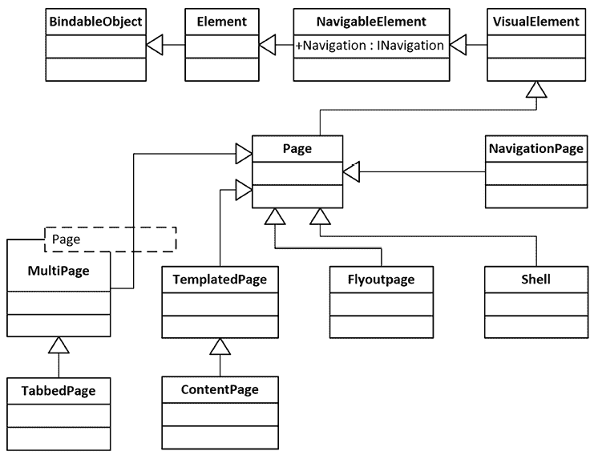

# 使用.NET MAUI Shell 和 NavigationPage 进行导航

在前面的章节中，我们处理了**用户界面**（**UI**）设计、MVVM 模式和数据绑定。这些元素使我们能够在页面级别设计 UI。对于现实世界的应用，页面间的导航能力至关重要。因此，大多数应用框架都包括它们自己的独特导航机制，.NET MAUI 也不例外。在本章中，我们将介绍.NET MAUI 中的导航机制。我们将首先演示如何使用 NavigationPage 完成最基本的导航，然后我们将深入探讨一个更结构化的导航机制——`Shell`。

随后，我们将使用`Shell`增强我们应用的导航功能。在*第二章*，*构建我们的第一个.NET MAUI 应用*中，我们使用`Shell`模板创建了我们的应用。尽管如此，我们的应用尚未达到多级导航所需的复杂性。通过集成`Shell`，我们将执行多级导航。为了实现这一点，有必要完善我们的模型以支持导航实现。到本章结束时，我们的应用将能够支持登录、从飞出菜单中选择页面以及切换到项目详情或导航到子组。在深入导航设计之后，我们将了解导航在.NET MAUI 中的工作方式。

本章将涵盖以下主题：

+   实现导航

+   使用 `Shell`

+   改进设计和导航

# 技术要求

要测试和调试本章的源代码，您需要在您的 PC 或 Mac 上安装 Visual Studio 2022。有关详细信息，请参阅*第一章*，*使用.NET MAUI 入门*中的*开发环境设置*部分。

本章的源代码可在以下 GitHub 分支中找到：[`github.com/PacktPublishing/.NET-MAUI-Cross-Platform-Application-Development-Second-edition/tree/main/2nd/chapter05`](https://github.com/PacktPublishing/.NET-MAUI-Cross-Platform-Application-Development-Second-edition/tree/3e70eadfc910ef454ba068dc2bceb6b8e3437678)。

要检查本章的源代码，我们可以使用以下命令：

```swift
$ git clone -b 2nd/chapter05 https://github.com/PacktPublishing/.NET-MAUI-Cross-Platform-Application-Development-Second-edition.git PassXYZ.Vault2 
```

要了解更多关于本书源代码的信息，请参阅*第二章*，*构建我们的第一个.NET MAUI 应用*中的*管理本书的源代码*部分。

# 实现导航

在本章中，我们将实现密码管理器应用的导航逻辑。这包括以下功能：

+   登录并连接到数据库

+   在密码数据库中探索数据

导航设计对用户体验有重大影响。在 .NET MAUI 中，有一个内置机制可以帮助开发者高效地实现导航。正如我们在前面的章节中看到的，我们可以在我们的应用程序中使用 `Shell`。在本章中，我们将学习 `Shell` 并使用 `Shell` 提供的功能增强我们的应用程序。在我们深入 `Shell` 之前，我们将探索 .NET MAUI 中的基本导航机制。

实现导航最常见的方式是层次结构和模态：

+   **层次结构导航**提供了一种用户可以向前和向后导航页面的导航体验。这种模式通常在屏幕顶部使用工具栏或导航栏来显示左上角的上一个或返回按钮。它通常维护一个后进先出（LIFO）的页面堆栈来处理导航。**LIFO** 代表 **last in, first out**，意味着最后进入的页面是第一个弹出的页面。

+   **模态导航**在用户如何响应它方面与层次结构导航不同。如果屏幕上显示模态页面，用户必须在完成或取消所需任务之前才能执行其他操作。在完成或取消所需任务之前，用户不能从模态页面导航离开。

## INavigation 接口和 NavigationPage

在 .NET MAUI 中，通过 `INavigation` 接口支持层次结构和模型导航。`INavigation` 接口由一个称为 `NavigationPage` 的特殊页面支持。`NavigationPage` 用于管理其他页面的导航堆栈。`NavigationPage` 的继承层次结构如下所示：

+   **对象** | **可绑定对象** | **元素** | **可导航元素** | **可视元素** | **页面** | **NavigationPage**

`NavigableElement` 定义了一个名为 `Navigation` 的属性，该属性实现了 `INavigation` 接口。这个继承属性可以从任何 `VisualElement` 或 `Page` 用于导航目的，如下所示：

```swift
public Microsoft.Maui.Controls.INavigation Navigation { get; } 
```

要使用 `NavigationPage`，我们必须将第一个页面添加到导航堆栈中，作为应用程序的根页面。我们可以在下面的代码片段中看到一个例子：

```swift
public partial class App : Application
{
  ...
  public App ()
  {
    InitializeComponent();
    MainPage = new NavigationPage (new TheFirstPage());
  }
  ...
} 
```

我们在 `App` 类的构造函数中构建导航堆栈，`App` 类是 `Application` 的派生类。`TheFirstPage` 是 `ContentPage` 的派生类，被推入导航堆栈。

## 使用导航堆栈

有两种方式可以导航到或从页面。当我们想要浏览新页面时，我们可以将新页面添加到导航堆栈中。这个动作称为 **推**。如果我们想回到上一个页面，我们可以从堆栈中 **弹** 出上一个页面：


图 5.1：推和弹

如 *图 5.1* 所示，我们可以使用 `INavigation` 接口中的 `PushAsync()` 或 `PopAsync()` 方法分别切换到新页面或返回到上一个页面。

如果我们处于 **Page1** 页面，我们可以通过 `GotoPage2()` 事件处理器切换到 **Page2**。在这个函数中，我们将新页面 **Page2** 推送到堆栈：

```swift
async void GotoPage2 (object sender, EventArgs e) {
         await Navigation.PushAsync(new Page2());
} 
```

一旦我们处于 **Page2** 页面，我们可以通过 `BackToPage1()` 事件处理器返回。在这个函数中，我们从堆栈中弹出前一页：

```swift
async void BackToPage1 (object sender, EventArgs e) {
        await Navigation.PopAsync();
} 
```

在前面的例子中，我们使用分层导航方法导航到一个新页面。要显示模态页面，我们可以使用模态堆栈。例如，在我们的应用程序中，如果我们想在 `ItemsPage` 中创建一个新项目，我们可以在 `ItemsViewModel` 中调用 `PushModalAsync()`：

```swift
await Shell.Current.Navigation.PushModalAsync(NewItemPage(type)); 
```

在创建新项目后，我们可以在 `NewItemViewModel` 中调用 `PopModalAsync()` 来关闭模态页面：

```swift
_ = await Shell.Current.Navigation.PopModalAsync(); 
```

在 `NewItemPage` 模型页面中，在完成任务或取消任务之前，我们无法导航到其他页面。`PopAsync()` 和 `PopModalAsync()` 都返回一个 `Task<Page>` 类型的可等待任务。

要获取有关 `NavigationPage` 的更多信息，请参阅以下 Microsoft 文档：

[`learn.microsoft.com/en-us/dotnet/maui/user-interface/pages/navigationpage`](https://learn.microsoft.com/en-us/dotnet/maui/user-interface/pages/navigationpage)

## 操作导航堆栈

在分层导航中，我们不仅可以从堆栈中推送或弹出页面，还可以操作导航堆栈。

### 插入页面

我们可以使用 `InsertPageBefore` 方法将页面插入到堆栈中：

```swift
public void InsertPageBefore (Page page, Page before); 
```

`InsertPageBefore` 方法需要两个参数：

+   `page`: 这是将要添加的页面。

+   `before`: 这是插入页面之前的那一页。

在 *图 5.1* 中，当我们处于 **Page2** 页面时，我们可以在它之前插入另一个页面，**Page1**：

```swift
Navigation.InsertPageBefore(new Page1(), this); 
```

### 移除页面

我们还可以使用 `RemovePage()` 方法从堆栈中移除特定的页面：

```swift
public void RemovePage (Page page); 
```

在 *图 5.1* 中，假设我们在 **Page3** 页面时有一个 **Page2** 的引用，我们可以从堆栈中移除 **Page2**。调用 `PopAsync()` 后，我们将返回到 **Page1**：

```swift
// the reference page2 is an instance of Page2
Navigation.RemovePage(page2);
await Navigation.PopAsync(); 
```

总结来说，我们学习了如何使用 `NavigationPage` 构建导航堆栈。在创建导航堆栈后，我们可以利用 `INavigation` 接口来执行导航操作。对于简单的应用程序，这种方法可能足够。然而，对于更复杂的应用程序，这种方法可能需要大量的工作。幸运的是，.NET MAUI 提供了一个结构化的替代方案，称为 `Shell`。`Shell` 通过提供用于定义飞出菜单、标签栏和其他导航 UI 的统一、声明性语法来设计，以改善应用程序的导航结构。利用 `Shell` 可以让我们以更少的努力为用户提供增强的导航体验。

# 使用 Shell

`INavigation` 接口和 `NavigationPage` 提供基本的导航功能。仅依赖它们将需要我们自行创建复杂的导航机制。幸运的是，.NET MAUI 提供了内置的页面模板供选择，可以提供各种导航体验。

如 *图 5.2* 中的类图所示，根据不同的用例提供了内置的页面。所有这些页面 – `TabbedPage`、`ContentPage`、`FlyoutPage`、`NavigationPage` 和 `Shell` – 都是 `Page` 的派生类：



图 5.2：.NET MAUI 内置页面的类图

`ContentPage`、`TabbedPage` 和 `FlyoutPage` 可以根据您的需求创建各种 UI：

+   `ContentPage` 是最常用的页面类型，可以包含任何布局和视图元素。它适用于单页设计。

+   `TabbedPage` 可以用来托管多个页面。每个子页面可以通过位于页面顶部或底部的标签系列进行选择。

+   `FlyoutPage` 可以显示项目列表，类似于桌面应用程序中的菜单项。用户可以通过菜单中的项目导航到单个页面。

虽然 `Shell` 也是 `Page` 的派生类，但它包括一个通用的导航用户体验，这简化了开发者的任务。`Shell` 通过减少应用程序开发的复杂性并集中高度可定制的丰富功能在一个位置来帮助开发者。

`Shell` 提供以下功能：

+   一个地方来描述应用程序的视觉层次结构

+   一个高度可定制的通用导航用户体验

+   一种基于 URI 的导航方案，与我们网页浏览器中的非常相似

+   集成搜索处理程序

`Shell` 的顶级构建块是弹出菜单和标签。我们可以使用弹出菜单和标签来创建我们应用程序的导航结构。

## 弹出菜单

弹出菜单可以用作 `Shell` 应用程序的最高级菜单。在我们的应用程序中，我们必须同时使用弹出菜单和标签来创建最高级导航设计。在本节中，我们将探讨弹出菜单；在下一节中，我们将讨论在我们的应用程序中使用标签。

在 *图 5.3* 中，我们可以看到在我们的应用程序中弹出菜单的外观。从弹出菜单中，我们可以切换到 `AboutPage`、`ItemsPage` 或 `LoginPage`。要访问弹出菜单，我们可以从屏幕左侧边缘滑动或点击弹出图标，即汉堡图标 **(1)**。当我们点击弹出菜单中的 **根组** **(2)** 时，我们将看到密码条目或组列表。


图 5.3：弹出菜单

弹出菜单由弹出项或菜单项组成。在 *图 5.3* 中，**关于** 和 **根** **组** 是弹出项，而 **注销** 是菜单项。

### 弹出菜单项

每个弹出菜单项都是一个 `FlyoutItem` 对象，它包含一个 `ShellContent` 对象。我们可以在 `AppShell.xaml` 文件中这样定义弹出菜单项。我们将一个 `string` 资源分配给 `Title` 属性 **(1**) 并将 `ImageSource` 分配给 `Icon` 属性 **(2**)。这些对应于 `FlyoutItem` 类的属性：

```swift
<FlyoutItem
  Title="{x:Static resources:Resources.About}"                    //(1)
  Icon="tab_info.png" >                                           //(2)
  <Tab>
    <ShellContent Route="AboutPage" ContentTemplate=
        "{DataTemplate local:AboutPage}" />
  </Tab>
</FlyoutItem>
<FlyoutItem x:Name="RootItem" Title="Browse"
    Icon="tab_home.png">
  <Tab>
    <ShellContent Route="RootPage" ContentTemplate=
        "{DataTemplate local:ItemsPage}" />
  </Tab>
</FlyoutItem> 
```

`Shell` 有隐式转换运算符，可以用来移除 `FlyoutItem` 和 `Tab` 对象，这样前面的 XAML 代码也可以简化，如下所示：

```swift
<ShellContent Title="{x:Static resources:Resources.About}"  
  Icon="tab_info.png" Route="AboutPage" 
  ContentTemplate="{DataTemplate local:AboutPage}" />
<ShellContent x:Name="RootItem" Title="Browse" 
  Icon="tab_home.png" Route="RootPage"  
  ContentTemplate="{DataTemplate local:ItemsPage}" /> 
```

### 菜单项

在某些情况下，使用弹出菜单项导航到内容页面可能不是必要的；相反，我们可能希望执行一个动作。在这种情况下，可以使用菜单项。对于我们的场景，我们已将`Logout`指定为执行动作的菜单项，而不是导航到另一个内容页面：

```swift
<MenuItem Text="Logout" IconImageSource="tab_login.png"
    Clicked="OnMenuItemClicked">
</MenuItem> 
```

从前面的 XAML 代码中我们可以看到，每个菜单项都是一个`MenuItem`对象。`MenuItem`类有一个`Clicked`事件和一个`Command`属性。当`MenuItem`被点击时，我们可以执行一个动作。在前面的菜单项中，我们将`OnMenuItemClicked`作为事件处理程序。

让我们更仔细地看看*清单 5.1*中所示的`AppShell.xaml`。在这个文件中，我们定义了两个弹出菜单项和一个菜单项。弹出菜单项允许我们选择`AboutPage` **(1)** 和`ItemsPage` **(2)**，而菜单项允许我们注销 **(3)**。

```swift
<Shell 
  xmlns="http://schemas.microsoft.com/dotnet/2021/maui"
  ...
  Title="PassXYZ.Vault"
  x:Class="PassXYZ.Vault.AppShell" 
  FlyoutIcon="{FontImage FontFamily=FontAwesomeSolid, 
  Color=White, 
  Glyph={x:Static style:FontAwesomeSolid.Bars}}"
  FlyoutBackgroundColor="{StaticResource Secondary}">
  <TabBar>                                                       //(4)
    <ShellContent Title="Login" Route="LoginPage" 
      Icon="{FontImage FontFamily=FontAwesomeSolid, 
      Color=Black,
      Glyph={x:Static style:FontAwesomeSolid.UserAlt}}"
      ContentTemplate="{DataTemplate local:LoginPage}" />
    <ShellContent Title="SignUp" Route="SignUpPage" 
      Icon="{FontImage FontFamily=FontAwesomeSolid, 
      Color=Black,
      Glyph={x:Static style:FontAwesomeSolid.Users}}"
      ContentTemplate="{DataTemplate local:SignUpPage}" />
  </TabBar>
  <FlyoutItem Title="About"                                      //(1)
    Icon="{FontImage FontFamily=FontAwesomeSolid, Color=Black,
    Glyph={x:Static style:FontAwesomeSolid.Question}}">
    <ShellContent Route="AboutPage" 
      ContentTemplate="{DataTemplate local:AboutPage}">
    </ShellContent>
  </FlyoutItem>

  <FlyoutItem x:Name="RootItem" Title="Browse"                   //(2)
    Icon="{FontImage FontFamily=FontAwesomeSolid, Color=Black, 
    Glyph={x:Static style:FontAwesomeSolid.Home}}">
    <ShellContent Route="RootPage" 
      ContentTemplate="{DataTemplate local:ItemsPage}">
    </ShellContent>
  </FlyoutItem>
  <MenuItem Text="Logout" Clicked="OnMenuItemClicked"            //(3)
    IconImageSource="{FontImage FontFamily=FontAwesomeSolid, 
    Color=Black, 
    Glyph={x:Static style:FontAwesomeSolid.SignOutAlt}}">
  </MenuItem>
</Shell> 
```

清单 5.1：PassXYZ.Vault 中的`AppShell.xaml` ([`epa.ms/AppShell5-1`](https://epa.ms/AppShell5-1))

还为`LoginPage`和`SignUpPage`定义了一个`TabBar` **(4)**。现在让我们来回顾一下标签。

## 标签

在`Shell`中使用标签可以创建类似于`TabbedPage`的导航体验。如图*图 5.4*所示，Android 和 iOS 平台在底部的标签栏上都有两个标签。然而，当在 Windows 平台上实现时，标签的显示方式会有所不同。


图 5.4：Android 上的标签栏和标签

如*图 5.5*所示，在 Windows 上，标签栏位于顶部：


图 5.5：Windows 上的标签栏和标签

为了将标签页集成到我们的应用中，我们需要创建一个`TabBar`对象。这个`TabBar`对象可以包含一个或多个`Tab`对象，每个`Tab`对象代表标签栏上的一个单独的标签。此外，每个`Tab`对象可以包含一个或多个`ShellContent`对象。接下来的 XAML 代码展示了它与定义弹出菜单时使用的代码的相似性：

```swift
<TabBar>
  <Tab Title="{x:Static resources:Resources.action_id_login}" 
    Icon="tab_login.png">
    <ShellContent Route="LoginPage" 
    ContentTemplate="{DataTemplate local:LoginPage}" />
  </Tab>
  <Tab Title="{x:Static resources:Resources.menu_id_users}"
    Icon="tab_users.png">
    <ShellContent Route="SignUpPage" 
    ContentTemplate="{DataTemplate local:SignUpPage}" />
  </Tab>
</TabBar> 
```

与我们在弹出菜单 XAML 代码中采取的方法类似，我们可以通过删除`Tab`标签来简化之前的代码。通过使用`Shell`的隐式转换运算符，我们可以删除`Tab`对象。如所示，我们可以省略`Tab`标签，并在`ShellContent`标签内直接定义`Title`和`Icon`属性：

```swift
<TabBar>
  <ShellContent Title="{x:Static resources:Resources.action_id_login}" 
                Icon="tab_login.png"
                Route="LoginPage" 
                ContentTemplate="{DataTemplate local:LoginPage}" />
  <ShellContent Title="{x:Static resources:Resources.menu_id_users}" 
                Icon="tab_users.png"
                Route="SignUpPage" 
                ContentTemplate="{DataTemplate local:SignUpPage}" />
</TabBar> 
```

在我们同时在`AppShell.xaml`中定义`TabBar`对象和`FlyoutItem`对象的情况下，`TabBar`对象将禁用弹出菜单项。这就是为什么在我们启动应用时，我们看到的是一个显示登录或注册页面的标签页界面。一旦用户成功登录，我们可以将他们导航到`RootPage`，这是在*清单 5.1*中展示的已注册路由。在下一节中，我们将深入了解注册路由和使用这些已注册路由进行导航的过程。

## Shell 导航

在`Shell`中，通过注册的路由来实现页面导航。类似于网页浏览器，.NET MAUI 使用基于 URI 的导航。URI 可能看起来像以下这样：

```swift
//RootPage/ItemDetailPage?ID="your entry ID" 
```

或者，它可能看起来像以下这样：

```swift
Group1/ItemDetailPage1 
```

如您所见，URI 格式允许我们指定应用程序界面中的路径，并且可能包括额外的参数。以双斜杠“//”开始 URI 表示导航的根。就像在文件系统导航中一样，我们也可以使用“..”来执行向后导航。这样，程序员可以以直观且高效的方式导航导航堆栈。

注册路由有两种方法。第一种方法是在 Shell 的可视层次结构内注册路由。第二种方法需要通过使用`Routing`类中找到的`RegisterRoute`静态方法显式地注册它们。

### 注册绝对路由

我们可以选择在 Shell 的视觉层次结构中注册路由，如*列表 5.1*所示。路由可以通过`FlyoutItem`、`TabBar`、`Tab`或`ShellContent`的`Route`属性来指定。

在`AppShell.xaml`文件中，我们注册了以下路由。

| **路由** | **页面** | **描述** |
| --- | --- | --- |
| `LoginPage` | `LoginPage` | 此路由显示用户登录页面 |
| `SignUpPage` | `SignUpPage` | 此路由显示用户注册页面 |
| `AboutPage` | `AboutPage` | 此路由显示有关我们应用程序的页面 |
| `RootPage` | `ItemsPage` | 此路由显示用于导航密码数据库的页面 |

表 5.1：视觉层次结构中注册的路由

要在 Shell 的可视层次结构中导航到某个路由，我们可以使用绝对路由 URI。绝对 URI 以双斜杠“//”开头，例如`//LoginPage`。

### 注册相对路由

也可以在不预先在视觉层次结构中定义的情况下导航到页面。例如，密码输入详细页面`ItemDetailPage`可以在密码组的任何层次结构级别导航到。在我们的应用程序中，我们可以通过在代码后文件`AppShell.xaml.cs`中使用`RegisterRoute`显式注册以下路由：

```swift
public static AppShell? CurrentAppShell 
{ get; private set; } = default!;
public AppShell()
{
  InitializeComponent();
  Routing.RegisterRoute(nameof(ItemDetailPage), 
    typeof(ItemDetailPage));
  Routing.RegisterRoute(nameof(NewItemPage), 
    typeof(NewItemPage));
  Routing.RegisterRoute(nameof(ItemsPage), 
    typeof(ItemsPage));
  CurrentAppShell = this;
} 
```

在前面的代码中，我们定义了以下路由。

| **路由** | **页面** | **描述** |
| --- | --- | --- |
| `ItemDetailPage` | `ItemDetailPage` | 这是显示密码条目详细信息的路由 |
| `NewItemPage` | `NewItemPage` | 这是添加新项目（条目或组）的路由 |
| `ItemsPage` | `ItemsPage` | 这是显示用于导航密码数据库的页面的路由 |

表 5.2：注册的详细页面路由

为了说明相对路由的使用，我们将通过添加一个新项目来继续。当需要添加新项目时，我们可以使用相对路由导航到`NewItemPage`，如下所示：

```swift
await Shell.Current.GoToAsync(nameof(NewItemPage)); 
```

在此场景中，搜索`NewItemPage`路由，如果识别到该路由，页面将被显示并添加到导航堆栈中。这个导航堆栈与我们解释基本导航时使用的`INavigation`接口所讨论的是相同的。当定义一个相对路由并导航到它时，我们传递一个字符串作为路由的名称。为了防止错误，我们可以通过使用`nameof`表达式来使用类名作为路由名称。

一旦我们在`NewItemPage`中输入了新项目的详细信息，我们可以点击**保存**或**取消**按钮。在**保存**或**取消**按钮的事件处理程序中，我们可以使用提供的代码返回到上一页：

```swift
await Shell.Current.Navigation.PopModalAsync(); 
```

或者，我们也可以使用以下代码返回：

```swift
await Shell.Current.GoToAsync(".."); 
```

就像在文件系统导航中一样，这里的“..”代表导航堆栈中的父页面。

如前述代码所示，有两种返回的方法。第一种选项是使用`INavigation`接口的`PopModalAsync`方法。由于`Shell`是`Page`的派生类，它通过继承的`Navigation`属性实现了`INavigation`接口。我们可以调用`PopModalAsync`模态导航方法来返回，其中`NewItemPage`作为模态页面。

第二种方法涉及使用`GoToAsync`函数返回。由于`NewItemPage`是一个模态页面，你可能想知道在调用`GoToAsync`时如何区分模态页面和非模态页面。在`Shell`导航中，这种区分由页面展示模式确定。`NewItemPage`的内容页面定义如下：

```swift
<?xml version="1.0" encoding="UTF-8"?>
<ContentPage 
  xmlns="http://schemas.microsoft.com/dotnet/2021/maui"
  xmlns:x="http://schemas.microsoft.com/winfx/2009/xaml"
  x:Class="PassXYZ.Vault.Views.NewItemPage"
  **Shell.PresentationMode**="ModalAnimated"                   //(1)
  Title="New Item">
  <ContentPage.Content...>
</ContentPage > 
```

如观察所示，`Shell.PresentationMode` **(1**) 属性是在内容页面中定义的。根据我们实现动画的偏好，我们可以为这个属性分配不同的值。对于标准内容页面，我们可以将其设置为`NotAnimated`或`Animated`。对于模态页面，选项是`Modal`、`ModalAnimated`或`ModalNotAnimated`。如果保持不变，默认值设置为`Animated`。

要返回上一级，使用`GoToAsync`方法并指定路由为“..”。这种方法让人联想到文件系统导航或浏览器 URL 导航。相对路由“..”表示返回到父路由。它也可以与一个路由结合使用，以访问父级页面，如下所示：

```swift
await Shell.Current.GoToAsync("../AboutPage"); 
```

在*表 5.1*和*表 5.2*中，你会注意到`ItemsPage`既注册为绝对路由`RootPage`，也注册为相对路由`ItemsPage`。重要的是要注意，`ItemsPage`可能包含不同级别的密码组。当位于顶级时，它作为绝对路由，而在所有后续的导航层次级别中，它作为相对路由。

### 向页面传递数据

为了阐述将 `ItemsPage` 注册为绝对和相对路由背后的原因，让我们检查我们应用的导航层次结构，如图 *5.6* 所示。


图 5.6：导航层次结构

在我们的应用中，一旦用户成功登录，主页将展示位于密码数据库顶层的一组条目和组，被称为根组。这类似于文件系统的导航结构，在根目录下显示顶级文件和文件夹。

第一个 `ItemsPage` 实例使用 `RootPage` 路由，可以通过飞出项访问。假设根组内部有名为 **Group1** 和 **Group2** 的子组，如图 *5.6* 所示。我们可以导航到这些子组，这些子组也代表 `ItemsPage` 的实例。由于这些实例使用相对路由并依赖于按需推入的导航堆栈，因此它们不能预先定义。这些导航堆栈可以延伸到密码数据库中实际数据的深度。

`ItemsPage` 的两个不同路由在 `AppShell.xaml` 和 `AppShell.xaml.cs` 中定义如下：

`RootPage` 路由（绝对路由）：

```swift
<FlyoutItem x:Name="RootItem" Title="Browse" 
  Icon="{FontImage FontFamily=FontAwesomeSolid, 
  Color=Black, 
  Glyph={x:Static style:FontAwesomeSolid.Home}}">
  <ShellContent Route="RootPage" 
    ContentTemplate="{DataTemplate local:ItemsPage}">
  </ShellContent>
</FlyoutItem> 
```

`ItemsPage` 路由（相对路由）：

```swift
Routing.RegisterRoute(nameof(ItemsPage),
    typeof(ItemsPage)); 
```

在本节中，你可能想知道如何从根组导航到 **Group1** 或 **Group2**。如果 `ItemsPage` 能够显示 **Group1** 或 **Group2** 的内容，我们如何通知 `ItemsPage` 需要显示哪个组？

在 `Shell` 导航中，可以使用查询参数将数据传输到内容页面。语法类似于在网页浏览器中传递的 URL 参数。例如，以下 URL 可以用于在 Google 上搜索 **.net**：[`www.google.com.hk/search?q=.net.`](https://www.google.com.hk/search?q=.net.)

通过在路由后附加一个问号（`?`），以及一对查询参数 ID 和它们的相应值，可以实现所需的结果。在上面的例子中，键是 `q`，值是 `.net`。

在根组列表中选择一个项目后，它可以是条目或组。点击事件激活 `ItemsViewModel` 中的 `OnItemSelection` 方法，如 *Listing 5.2* 所示：

```swift
using System.Collections.ObjectModel;
using CommunityToolkit.Mvvm.ComponentModel;
using CommunityToolkit.Mvvm.Input;
using Microsoft.Extensions.Logging;
using KPCLib;
using PassXYZ.Vault.Services;
using PassXYZ.Vault.Views;
namespace PassXYZ.Vault.ViewModels {
  [QueryProperty(nameof(ItemId), nameof(ItemId))]                   //(1)
  public partial class ItemsViewModel : BaseViewModel {
    readonly IDataStore<Item> dataStore;
    ILogger<ItemsViewModel> logger;
    public ObservableCollection<Item> Items { get; }
    public ItemsViewModel(IDataStore<Item> dataStore, 
      ILogger<ItemsViewModel> logger) {
      this.dataStore = dataStore;
      this.logger = logger;
      Title = "Browse";
      Items = new ObservableCollection<Item>();
      IsBusy = false;
    }
    [ObservableProperty]
    private Item? selectedItem = default;
    [ObservableProperty]
    private string? title;
    [ObservableProperty]
    private bool isBusy;
    [RelayCommand]
    private async Task AddItem(object obj) {
      await Shell.Current.GoToAsync(nameof(NewItemPage));
    }
    public override async void OnItemSelecteion(object sender) {
      Item? item = sender as Item;
      if (item == null)
      {
        logger.LogWarning("item is null.");
        return;
      }
      logger.LogDebug($"Selected item is {item.Name}");
      if (item.IsGroup)
      {
        await Shell.Current.GoToAsync(                          //(3)
          $"{nameof(ItemsPage)}?
          {nameof(ItemsViewModel.ItemId)}={item.Id}");
      }
      else
      {
        await Shell.Current.GoToAsync(                          //(4)
          $"{nameof(ItemDetailPage)}?
          {nameof(ItemDetailViewModel.ItemId)}={item.Id}");
      }
    }
    [RelayCommand]
    private async Task LoadItems() {
      try {
        Items.Clear();
        var items = await dataStore.GetItemsAsync(true);
        foreach (var item in items) {
            Items.Add(item);
        }
        logger.LogDebug($"IsBusy={IsBusy}, 
          added {Items.Count()} items");
      }
      catch (Exception ex) {
        logger.LogError("{ex}", ex);
      }
      finally {
        IsBusy = false;
        logger.LogDebug("Set IsBusy to false");
      }
    }
    public string ItemId {                                      //(2)
      get {
          return SelectedItem == null ? 
            string.Empty : SelectedItem.Id;
      }
      set {
        if (string.IsNullOrEmpty(value))
        {
          SelectedItem = null;
        }
        else {
          var item = dataStore.GetItem(value);
          if (item != null) {
              SelectedItem = item;
          }
          else {
            throw new ArgumentNullException(nameof(ItemId), 
              "cannot find the selected item");
          }
        }
      }
    }
    public void OnAppearing() {
      if (SelectedItem == null) {
        Title = dataStore.SetCurrentGroup();
      }
      else {
        Title = dataStore.SetCurrentGroup(SelectedItem);
      }
      // load items
      logger.LogDebug($"Loading group {Title}");
      IsBusy = true;
    }
  }
} 
```

列表 5.2：`ItemsViewModel.cs` ([`epa.ms/ItemsViewModel5-2`](https://epa.ms/ItemsViewModel5-2))

根据项目类型，我们可能导航到 `ItemsPage` **（3**）或 `ItemDetailPage` **（4**）。在这两种情况下，我们将项目的 `Id` 传递给 `ItemId` 查询参数，该参数在 `ItemsViewModel` 和 `ItemDetailViewModel` 中定义。

在 *Listing 5.2* 的上下文中，**（1**）`ItemId` 在 `ItemsViewModel` 中被设置为 `QueryPropertyAttribute`。`QueryPropertyAttribute` 的第一个参数对应于接收数据的属性名称，在这个例子中是 `ItemId` **（2**）。

第二个参数对应于`id`参数。在选择列表中的一个组后，视图模型的`OnItemSelected`方法**（3**）被触发，并将所选组的`Id`作为`ItemId`查询参数的值传递。

当`ItemsPage`与`ItemId`查询参数一起加载时，`ItemId`属性**（2**）被设置。在`ItemId`属性的设置器中，我们检查查询参数值是否为空。如果为空，这可能意味着我们初始导航到没有查询参数的`RootPage`路由。在这种情况下，我们只需将`SelectedItem`设置为`null`。

如果它不为空，我们将找到项目并将其设置为`SelectedItem`。

**（4**）如果我们从列表中选择一个条目，我们可以导航到带有项目`Id`作为查询参数值的`ItemDetailPage`。为了适应这个查询参数，我们可以修改`ItemDetailViewModel`的`ItemId`属性如下：

```swift
[QueryProperty(nameof(ItemId), nameof(ItemId))]
public partial class ItemDetailViewModel : BaseViewModel
{
  readonly IDataStore<Item> dataStore;
  ILogger<ItemDetailViewModel> logger;
  public ObservableCollection<Field> Fields { get; set; }
  public ItemDetailViewModel(IDataStore<Item> dataStore, 
    ILogger<ItemDetailViewModel> logger) {
      this.dataStore = dataStore;
      this.logger = logger;
      Fields = new ObservableCollection<Field>();
  }
  [ObservableProperty]
  private string? title;
  [ObservableProperty]
  private string? id;
  [ObservableProperty]
  private string? description;
  [ObservableProperty]
  private bool isBusy;
  private string? itemId;
  public string ItemId {                                       //(1)
    get {
      if(itemId == null) { 
        throw new NullReferenceException(nameof(itemId)); 
      }
      return itemId;
    }
    set {
      itemId = value;
      LoadItemId(value);                                       //(2)
    }
  }
  public override void OnItemSelecteion(object sender) {
      logger.LogDebug("OnItemSelecteion is invoked.");
  }
  public void LoadItemId(string itemId) {
    if (itemId == null) { 
      throw new ArgumentNullException(nameof(itemId)); }
    var item = dataStore.GetItem(itemId);                      //(3)
if (item == null) { 
  throw new NullReferenceException(itemId); }
    Id = item.Id;
    Title = item.Name;
    Description = item.Description;
    if (!item.IsGroup)
    {
      PwEntry dataEntry = (PwEntry)item;                       //(4)
      Fields.Clear();
      List<Field> fields = dataEntry.GetFields(
        GetImage: FieldIcons.GetImage);                        //(5)
      foreach (Field field in fields) {
          Fields.Add(field);
      }
      logger.LogDebug($"ItemDetailViewModel:
        Name={dataEntry.Name}.");
    }
  }
} 
```

在`ItemDetailViewModel`类中，我们实现以下逻辑：

+   `ItemId`**（1**）作为接受查询参数的属性。

+   当设置`ItemId`时，调用`LoadItemId`方法**（2**）来加载项目。

+   在`LoadItemId`中，数据服务方法`GetItem`**（3**）被调用，以使用其相应的`Id`获取项目。

+   在这种情况下，项目是一个`PwEntry`实例**（4**），可以相应地进行转换。

+   PassXYZLib 扩展方法`GetFields`**（5**）被用来更新字段列表。

在前两个章节中，我们了解了基本导航和`Shell`导航，并使用`Shell`增强了我们的导航设计。此时，重新审视 MVVM 模式并进一步细化我们的数据模型，以改善密码管理器应用的质量至关重要。

# 改进我们的应用

在*第四章*，*探索 MVVM 和数据绑定*中，我们分析了各种用例并开发了一些。在本节中，利用我们所获得的知识，我们将增强现有的用例并引入新的用例。

我们将致力于以下用例：

+   **用例 1**：作为密码管理器用户，我想登录到密码管理器应用，以便我可以访问我的密码数据。

在这个用例中，我们尚未完全实现用户登录；我们计划在下一章中完成这项工作。目前，我们将实现一个伪逻辑，涵盖所有方面，除了数据层。

在之前的*第四章*，*探索 MVVM 和数据绑定*中，我们介绍了一个支持一级导航的用例。

+   **用例 3**：作为密码管理器用户，我想看到一组和条目的列表，以便我可以探索我的密码数据。

为了适应多级导航，我们将在本节中实现以下用例：

+   **用例 6**：作为密码管理器用户，当我点击当前列表中的一个组时，我想看到属于该组的组和条目。

+   **用例 7**：作为密码管理器用户，当我在密码数据中导航时，我希望能够返回到上一个组或父组。

在之前的实现（用例 1）中，登录后，我们使用绝对路径实现了对根页面的导航。然而，`LoginService` 的实现尚未完成。我们需要在本章中实现它。

在加载根页面（用例 3）后，目前我们只能浏览根级别的条目和组。我们还没有从根级别进入子组的能力。为了解决这个限制，我们在本章中引入了用例 6 和 7。在用例 6 和 7 中，我们的目标是使用相对路径进行前后导航。

使用 MVVM 模式，我们通过服务访问我们的模型，这些服务通常被抽象为接口，与实际实现分离。`IDataStore` 接口就是这样一个例子。为了支持用例 6 并增强用例 1，我们需要开发一个新的接口，称为 `IUserService`，以支持用户登录。

## 理解改进的设计

为了理解服务和增强的模型，让我们回顾 *图 5.7* 中的增强设计：


图 5.7：MVVM 中的模型和服务

*图 5.7* 展示了一个类图，说明了我们设计的大部分内容。为了简化，我排除了某些元素。例如，你可以自己将 `NewItemPage` 或 `SignUpPage` 添加到 *图 5.7* 和 *表 5.3* 中。

| **模型** | **视图** | **视图模型** |
| --- | --- | --- |
| **数据模型** | **服务** |
| `User` | `IUserService` | `LoginPage` | `LoginViewModel` |
| `Field` | `ItemDetailPage` | `ItemDetailViewModel` |
| `Field` | `ItemDetailPage` | `ItemDetailViewModel` |

表 5.3：MVVM 模式中的类和接口

### 注册绝对路径和相对路径

在本节中，当介绍页面和路径时，你可能注意到页面和路径的名称可能是相同的。为了区分它们，我将使用粗体字体来标识页面，使用斜体字体来标识路径。

在我们的应用中，`AppShell` 类内部注册了绝对路径和相对路径。绝对路径，如 `LoginPage`、`SignUpPage`、`RootPage` 和 `AboutPage`，作为 `Shell` 的部分创建。相反，相对路径——`ItemsPage`、`ItemDetailPage` 和 `NewItemPage`——在 `AppShell` 的构造函数中定义。

为了便于多级导航，页面 `ItemsPage` 被注册为绝对路径 `RootPage` 和相对路径 `ItemsPage`。

在应用程序加载时，使用*LoginPage*路由。登录后，应用导航到*RootPage*。如果用户选择子组，将加载相关的*ItemsPage*路由，从而允许在多级结构中进行更深入的导航。当用户选择条目时，将加载相关的*ItemsDetailPage*路由。

### 模型和服务

为了保存应用程序数据，我们通常将其存储在数据库中，这可以是关系型数据库或 NoSQL 数据库。在我们的案例中，我们的密码数据库不是关系型数据库。然而，在我们设计的过程中，我们可以使用关系型数据库的类似逻辑来制定我们的业务逻辑。我们的模型由三个不同的类表示——`User`、`Item`和`Field`。

在我们的设计背景下，`Item`和`Field`分别代表密码条目和该条目中的内容。一个条目可以想象成表格中的一行，字段作为单元格。为了模拟密码条目，我们使用 KeePassLib 中的`PwEntry`。在这个例子中，组指的是条目的集合，`PwGroup`用于模拟这个组。组可以比作数据库中的表，而共享相同键值的字段可以比作列。为了开发我们的数据服务接口，我们可以在数据库中处理数据时采用类似的方法。

我们如何在数据库中管理数据？你可能熟悉 CRUD 操作这个术语。在我们的情况下，我们可以使用增强的`创建`、`读取`、`更新`、`删除`和`列表`（**CRUDL**）操作来定义我们服务的接口。

为了处理密码条目和组，我们可以使用以下`IDataStore`接口：

```swift
public interface IDataStore<T>
{
    T? GetItem(string id, bool SearchRecursive = false);
    Task<T?> GetItemAsync(string id, bool SearchRecursive =
        false);
    Task AddItemAsync(T item);
    Task UpdateItemAsync(T item);
    Task<bool> DeleteItemAsync(string id);
    Task<IEnumerable<T>> GetItemsAsync(bool forceRefresh =
        false);
} 
```

在`IDataStore`接口中，我们定义了以下 CRUDL 操作：

+   **创建**：我们使用`AddItemAsync`来添加条目或组

+   **读取**：我们使用`GetItem`或`GetItemAsync`来读取条目或组

+   **更新**：我们使用`UpdateItemAsync`来更新条目或组

+   **删除**：我们使用`DeleteItemAsync`来删除条目或组

+   **列表**：我们使用`GetItemsAsync`来获取当前组中的条目和组列表

为了管理用户，我们可以使用以下`IUserService`接口：

```swift
public interface IUserService<T>
{
    T GetUser(string username);
    Task AddUserAsync(T user);
    Task DeleteUserAsync(T user);
    List<string> GetUsersList();
    Task<bool> LoginAsync(T user);
    void Logout();
} 
```

我们可以定义一组 CRUDL 操作来处理用户：

+   **创建**：我们可以使用`AddUserAsync`创建新用户

+   **读取**：我们可以使用`GetUser`获取用户信息

+   **删除**：我们可以使用`DeleteUserAsync`删除用户

+   **列表**：我们可以使用`GetUsersList`获取用户列表

+   **登录**和**登出**：我们可以使用`User`实例来登录或登出

```swift
IDataStore into ItemsViewModel using constructor injection as an example:
```

```swift
readonly IDataStore<Item> dataStore;
ILogger<ItemsViewModel> logger;
public ObservableCollection<Item> Items { get; }
public ItemsViewModel(IDataStore<Item> dataStore, ILogger<ItemsViewModel> logger)
{
  this.dataStore = dataStore;
  this.logger = logger;
  Title = "Browse";
  Items = new ObservableCollection<Item>();
  IsBusy = false;
} 
```

在`ItemsViewModel`类的构造函数中，我们通过依赖注入初始化了`IDataStore`和`ILogger`服务。

## `IUserService`的实现

在我们的应用程序中，`UserService` 类是 `IUserService` 接口的实现。这个代码可以在 *列表 5.3* 中找到。为了简化测试过程，我们没有在本章实现所有功能，因为我们继续使用模拟数据存储：

```swift
using KPCLib;
using Microsoft.Extensions.Logging;
using System.Collections.ObjectModel;
using User = PassXYZLib.User;
namespace PassXYZ.Vault.Services;
public class UserService : IUserService<User>
{
  readonly IDataStore<Item> dataStore;
  ILogger<UserService> logger;
  private User? _user = default;
  public UserService(IDataStore<Item> dataStore,                //(1)
    ILogger<UserService> logger) {
    this.dataStore = dataStore;
    this.logger = logger;
  }
  public User GetUser(string username) {
    User user = new User();
    user.Username = username;
    logger.LogDebug($"Path={user.Path}");
    return user;
  }
  public async Task DeleteUserAsync(User user) {
    await Task.Run(() => {
      logger.LogDebug($"Remove Path={user.Path}");
    });
  }
  public List<string> GetUsersList() {
    return User.GetUsersList();
  }
  public async Task AddUserAsync(User user) {
    if (user == null) { 
        throw new ArgumentNullException(nameof(user), "User cannot be 
          null"); }
    _user = user;
    await dataStore.SignUpAsync(user);
  }
  public async Task<bool> LoginAsync(User user) {
    if (user == null) { 
        throw new ArgumentNullException(nameof(user), "User cannot be 
          null"); }
    _user = user;
    return await dataStore.ConnectAsync(user);
  }
  public void Logout() {
    dataStore.Close();
    logger.LogDebug("Logout");
  }
} 
```

列表 5.3: `UserService.cs` ([`epa.ms/UserService5-3`](https://epa.ms/UserService5-3))

在 `UserService` 构造函数 **(1)** 中，通过依赖注入初始化 `IDataStore` 实例。可用的功能可以分为两种类型。例如 `GetUser`、`DeleteUserAsync` 和 `GetUserList` 等功能可以使用 `User` 类的方法实现。同时，`AddUserAsync`、`LoginAsync` 和 `Logout` 等方法使用 `IDataStore` 实例实现。

# 改进登录过程

在用户管理的过程中，我们可能需要向系统中添加新用户或删除过时的用户。对于我们的应用程序，它一次只允许一个用户登录。为了支持这个功能，我们可以通过单例模式实现一个类。或者，我们可以实现一个类并利用依赖注入来达到类似单例模式的效果。例如，我们可以创建一个继承自 `User` 类的 `LoginService` 类，如 *列表 5.4* 所示：

```swift
using System.Diagnostics;
using PassXYZLib;
namespace PassXYZ.Vault.Services;
public class LoginService : PxUser {                             //(1)
  private IUserService<User> _userService;
  private const string PrivacyNotice = "Privacy Notice";
  public static bool IsPrivacyNoticeAccepted {
    get => Preferences.Get(PrivacyNotice, false);
    set => Preferences.Set(PrivacyNotice, value);
  }
  public LoginService(IUserService<User> userService) {
    _userService = userService;                                  //(2)
  }
  public async Task<bool> LoginAsync() {
    return await _userService.LoginAsync(this);                  //(3)
  }
  public async Task SignUpAsync() {
    await _userService.AddUserAsync(this);                       //(4)
  }
  public override void Logout() {
    _userService.Logout();
  }
  public async Task<string> GetSecurityAsync() {
    if (string.IsNullOrWhiteSpace(Username)) { 
      return string.Empty; }
    string data = await SecureStorage.GetAsync(Username);
    return data;
  }
  public async Task SetSecurityAsync(string password) {
    if (string.IsNullOrWhiteSpace(Username) || 
      string.IsNullOrWhiteSpace(password)) { return; }
    await SecureStorage.SetAsync(Username, password);
  }
  public async Task<bool> DisableSecurityAsync() {
    ...
  }
} 
```

列表 5.4: `LoginService.cs` ([`epa.ms/LoginService5-4`](https://epa.ms/LoginService5-4))

**(1)** `LoginService` 类是从 `PxUser` 子类派生的，而 `PxUser` 子类又继承自 `User` 类。

**(2)** 在 `LoginService` 中，我们通过依赖注入初始化 `IUserService` 接口。

**(3)** 要执行用户登录，我们可以通过传递一个 `LoginService` 实例作为参数来调用 `IUserService` 方法。**(4)** 同样的过程也适用于用户注册的情况。

## 登录视图模型

在介绍了模型和服务层之后，我们现在可以专注于登录和注册功能的视图模型和视图。让我们首先检查视图模型的实现，如 *列表 5.5* 所示：

```swift
using CommunityToolkit.Mvvm.ComponentModel;
using CommunityToolkit.Mvvm.Input;
using Microsoft.Extensions.Logging;
using PassXYZLib;
using PassXYZ.Vault.Views;
using PassXYZ.Vault.Services;
using System.Diagnostics;
namespace PassXYZ.Vault.ViewModels
{
  public partial class LoginViewModel : ObservableObject
  {
    private LoginService _currentUser;
    ILogger<LoginViewModel> _logger;
    public LoginViewModel(LoginService user,                    //(1)
      ILogger<LoginViewModel> logger)
    { 
      _currentUser = user;
      _logger = logger;
    }
    [RelayCommand(CanExecute = nameof(ValidateLogin))]
    private async Task Login(object obj)
    {
      ...
      bool status = await _currentUser.LoginAsync();            //(2)
      ...
    }
    private bool ValidateLogin()
    {
      var canExecute = !String.IsNullOrWhiteSpace(Username)
          && !String.IsNullOrWhiteSpace(Password);
      return canExecute;
    }
    [RelayCommand(CanExecute = nameof(ValidateSignUp))]
    private async Task SignUp()
    {
      ...
      await _currentUser.SignUpAsync();                         //(3)
      ...
    }
    private bool ValidateSignUp()
    {
      var canExecute = !String.IsNullOrWhiteSpace(Username)
          && !String.IsNullOrWhiteSpace(Password)
          && !String.IsNullOrWhiteSpace(Password2);

      if (canExecute) {
          return Password!.Equals(Password2);
      }
      return canExecute;
    }
    [ObservableProperty]
    private bool isBusy = false;
    [ObservableProperty]
    [NotifyCanExecuteChangedFor(nameof(LoginCommand))]         //(4)
    [NotifyCanExecuteChangedFor(nameof(SignUpCommand))]
    private string? username = default;
    [ObservableProperty]
    [NotifyCanExecuteChangedFor(nameof(LoginCommand))]
    [NotifyCanExecuteChangedFor(nameof(SignUpCommand))]
    private string? password = default;
    [ObservableProperty]
    [NotifyCanExecuteChangedFor(nameof(SignUpCommand))]
    private string? password2 = default;
    public bool IsDeviceLockEnabled
    {
      ...
    }
    public List<string> GetUsersList() {
        return User.GetUsersList();
    }
    public void Logout() {
      _currentUser.Logout();
    }
  }
} 
```

列表 5.5: `LoginViewModel.cs` ([`epa.ms/LoginViewModel5-5`](https://epa.ms/LoginViewModel5-5))

**(1)** 在 `LoginViewModel` 中，我们通过依赖注入注入一个 `LoginService` 实例，并将其保存到私有成员变量 `_currentUser` 中。这个变量用于跟踪所有登录和注册活动。

随后，我们创建了 `LoginCommand` **(2)** 和 `SignUpCommand` **(3)**，使用 .NET Community Toolkit 中的 `RelayCommand` 属性。在这些函数中，我们调用 `LoginAsync` 和 `SignUpAsync` 方法从 `LoginService`。

为了验证这两个命令，我们创建了`ValidateLogin`和`ValidateSignUp`方法来执行必要的检查。在`ValidateLogin`中，我们在允许登录过程继续之前确保用户名和密码都不为空。在`ValidateSignUp`中，我们不仅验证用户名和密码，还确认密码和确认密码字段匹配。**（4**）为了触发验证方法，我们添加了`NotifyCanExecuteChangedFor`属性来装饰属性。这是 MVVM 工具包实现的一部分，我们在**第四章**，探索 MVVM 和数据绑定中讨论了它。

现在，我们已经升级了我们的模型和服务以优化登录过程。通过查看*图 5.7*中的类图，我们已经修改了视图、视图模型和服务层的源代码来改进我们的应用。实际模型包含在两个库中，`KPCLib`和`PassXYZLib`。我们通过`IDataStore`和`IUserService`接口公开了这些库的功能。通过为这两个接口创建实现类，我们进一步增强了我们的模型。在下一节中，我们将重点关注视图层并检查升级的 UI。

## 登录 UI

现在，我们可以增强登录和注册 UI。目前，登录页面只包含一个按钮。让我们向`LoginPage.xaml`添加用户名字段和密码字段，如图*图 5.8*所示。

![img/B21554_05_08.png]

图 5.8：LoginPage

在这个新的 UI 设计中，我们做了以下更改：

+   我们在框架内创建了一个 4x3 的网格布局**（1**）。

+   在前两行中，我们添加了两个`Entry`控件来保存用户名**（2**）和密码**（3**）。我们在`Entry`控件的`Text`字段和`LoginViewModel`的属性之间建立了数据绑定。

+   在第三行，我们引入了一个`ActivityIndicator`控件**（4**）来显示登录状态，它与视图模型的`IsBusy`属性绑定。

+   在最后一行中，我们定义了一个`Button`控件**（5**）用于登录操作。`Button`控件有一个实现`ICommand`接口的`Command`属性。我们使用数据绑定将这个`Command`属性链接到视图模型中负责执行登录操作的方法。

# 摘要

在本章中，我们专注于基本导航原则和`Shell`框架。我们选择`Shell`作为我们应用设计的导航基础，检查了其功能，并讨论了如何将其集成到我们应用的 UI 中。

在我们完成大部分 UI 设计后，我们通过修改两个服务接口`IDataStore`和`IUserService`来增强了我们的模型。我们在视图、视图模型和服务层进行更改后改进了登录过程。在服务层，我们仍然使用`MockDataStore`类。然而，我们还没有在`IDataStore`服务中完成实际登录活动的实现。我们将把这个留到下一章。

在完成大部分 UI 设计后，我们通过修改两个服务接口 `IDataStore` 和 `IUserService` 来细化我们的模型。通过在视图、视图模型和服务层中进行修改，我们增强了登录过程。在服务层中，我们继续使用 `MockDataStore` 类。然而，用于执行实际登录活动的 `IDataStore` 服务实现尚未完成，我们将在下一章中解决这个问题。

在下一章中，我们将深入探讨 .NET MAUI 中的依赖注入，这与 Xamarin.Forms 的做法大不相同。我们将指导您如何使用依赖注入注册我们的服务，以及如何通过构造函数注入或属性注入初始化我们的服务。此外，我们将开发实际的服务以取代 `MockDataStore`。

# 在 Discord 上了解更多信息

加入我们社区的 Discord 空间，与作者和其他读者进行讨论：

[`packt.link/cross-platform-app`](https://packt.link/cross-platform-app)


