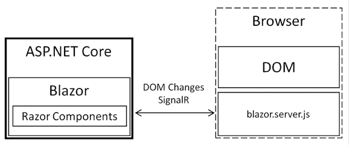
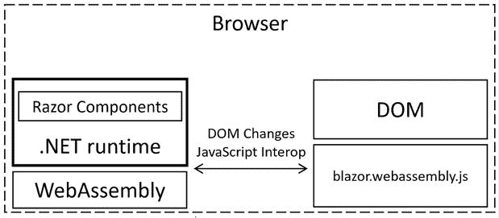
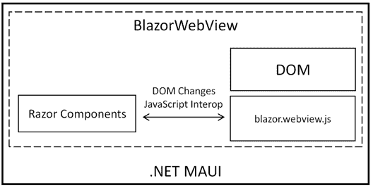
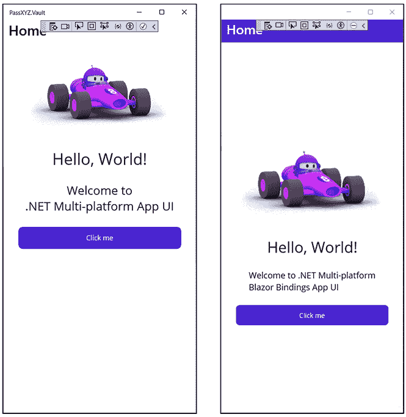
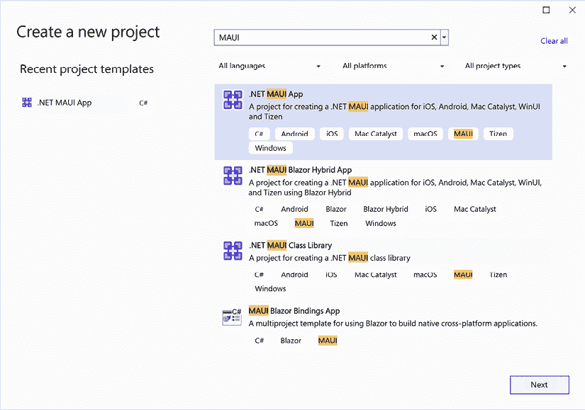
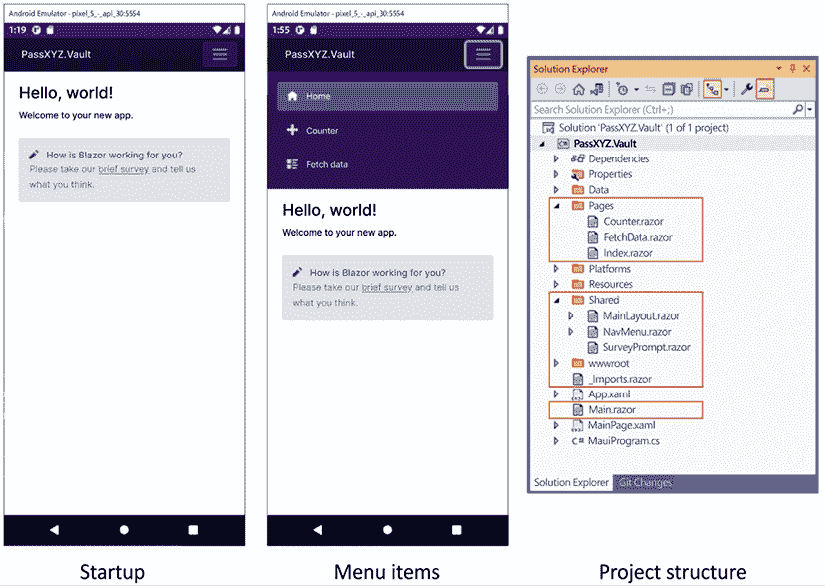
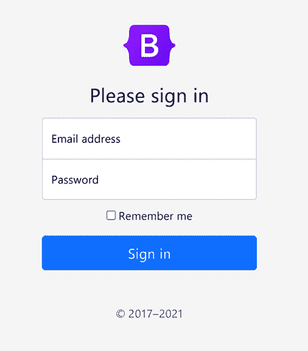
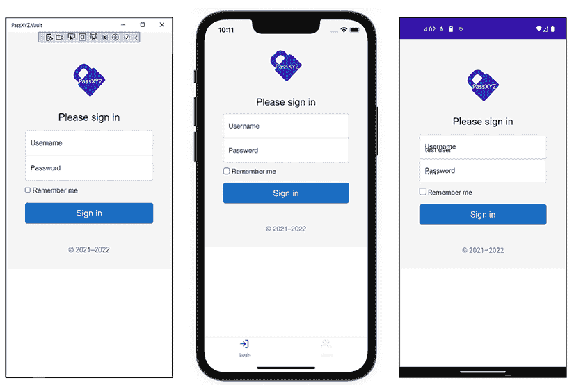

# 8

# 介绍 Blazor 混合应用程序开发

在.NET MAUI 中，构建**用户界面**（**UI**）的另一种方法是使用 Blazor。Blazor 是由微软开发的现代 Web 框架，允许开发人员使用 C#和 Razor 语法而不是 JavaScript 来创建交互式 Web 应用程序。此外，Blazor 还可以用于.NET MAUI 应用程序的开发，作为 Blazor 混合应用程序的一部分。Blazor 的基本构建块是 Razor 组件，当使用 Blazor 和 Blazor 混合时，这些组件可以在原生和 Web 应用程序之间重用。与 XAML UI 相比，Blazor UI 提供了更高的可重用性，包括原生和 Web 应用程序。在本章中，我们将介绍 Blazor 及其在各种场景中的实现。此外，我们将介绍 Razor 组件，并解释如何使用这些组件开发 Blazor 混合应用程序。

本章我们将涵盖以下主题：

+   Blazor 是什么？

+   如何创建一个.NET MAUI Blazor 项目

+   如何创建一个新的 Razor 组件

# 技术要求

要测试和调试本章中的源代码，您需要在您的 PC 或 Mac 上安装 Visual Studio 2022。请参阅*第一章*，*使用.NET MAUI 入门*中的*开发环境设置*部分以获取详细信息。

本章的源代码可在以下 GitHub 仓库中找到：[`github.com/PacktPublishing/.NET-MAUI-Cross-Platform-Application-Development-Second-edition/tree/main/2nd/chapter08`](https://github.com/PacktPublishing/.NET-MAUI-Cross-Platform-Application-Development-Second-edition/tree/41dfc374525657f3c09c3870733ddaccff3c3412)。

要查看本章的源代码，我们可以使用以下命令：

```swift
$ git clone -b 2nd/chapter08 https://github.com/PacktPublishing/.NET-MAUI-Cross-Platform-Application-Development-Second-edition.git PassXYZ.Vault2 
```

要了解更多关于本书中源代码的信息，请参阅*第二章*，*构建我们的第一个.NET MAUI 应用程序*中的*管理本书中的源代码*部分。

# Blazor 是什么？

Blazor 是一个用于使用 HTML、CSS 和 C#构建 Web 应用程序的框架。当使用 Blazor 在 ASP.NET Core 中开发 Web 应用程序时，您有两个选项可以考虑：Blazor Server 和 Blazor **WebAssembly**（**Wasm**）。此外，.NET MAUI 使 Blazor 能够创建原生应用程序，引入了第三种变体——Blazor 混合应用程序。

在 Web 应用程序开发中，任务通常涉及创建前端 UI 和后端服务。后端服务可以通过 RESTful API 或**远程过程调用**（**RPCs**）访问。由 HTML、CSS 和 JavaScript 组成的 UI 组件在浏览器中加载并显示为网页。在 ASP.NET Core 架构中，与用户交互相关的组件可以在服务器上渲染。这种托管模型被称为 Blazor Server。或者，我们可以在浏览器中执行大多数 UI 组件，这被称为 Blazor Wasm 托管模型。

在某些情况下，应用程序可能需要访问特定于设备的特性，例如传感器或摄像头；为了满足这些需求，开发者通常创建原生应用程序。然而，Blazor 提供了一个额外的解决方案——Blazor 混合应用程序。现在，让我们更详细地讨论 Blazor 托管模型。

## 托管模型

Blazor 是一个用于构建 Web UI 组件的 Web 框架，通常被称为 Razor 组件，可以通过各种方法进行托管。这些组件可以在 ASP.NET Core（Blazor 服务器）的服务器端或 Web 浏览器的客户端（Blazor Wasm）中运行。

此外，Razor 组件可以通过在嵌入的 Web View 控件中渲染来实现，用于原生移动和桌面应用程序（Blazor 混合）。尽管托管模型有所不同，但构建 Razor 组件的过程保持一致。因此，相同的 Razor 组件可以在所有托管模型中无需修改地使用。

### Blazor 服务器

在传统的 Web 应用程序开发中，用户交互的逻辑是在服务器端执行的。在 MVC 设计模式中，处理用户交互是应用程序架构的一个组成部分。当浏览器中发生用户交互时，它会被发送回服务器进行处理。因此，整个页面可能会根据用户的请求重新加载。

为了提高性能，Blazor 服务器采用了一种类似于**单页应用程序**（SPA）框架的设计。当响应用户请求时，Blazor 服务器处理它，并且只将涉及用户操作的**文档对象模型**（DOM）更改发送到浏览器。如图 8.1 所示，Blazor 服务器的处理逻辑与 SPA 类似，关键区别在于 Razor 组件是在服务器上渲染，而不是在浏览器上。为了促进客户端和服务器之间的实时通信，使用了开源库 SignalR 作为服务器和浏览器之间的连接。



图 8.1：Blazor 服务器

**Razor 组件与 Blazor 组件**

人们可能会在 Blazor 和 Razor 之间感到困惑。Razor 作为 ASP.NET 的模板引擎在 2010 年被引入。Razor 语法是一种标记语法，开发者可以在其中将 C#代码嵌入到 HTML 页面中。Blazor 是一个使用 Razor 语法作为编程语言的 Web 框架，大约在 2018 年被引入。Blazor 是一个基于组件的框架，一个 Blazor 应用程序由 Razor 组件组成。换句话说，Blazor 是 Razor 组件的托管模型。Blazor 组件和 Razor 组件被广泛互换使用，但正确的术语是 Razor 组件。

一个 Razor 组件位于具有 `.razor` 扩展名的文件中，并在运行时编译为 .NET 类。这个 `.razor` 文件也可以拆分为两个文件，分别具有 `.razor` 和 `.razor.cs` 扩展名。这个想法与我们在本书第一部分学到的 XAML 和代码后置非常相似。

在 Blazor 服务器中，应用的状态在服务器上维护，客户端不需要 .NET 运行时。这种模型可以导致初始加载时间更快，因为浏览器只下载一个小型的初始负载。然而，它需要与服务器保持持续连接，这可能会影响可伸缩性并引入 UI 更新的延迟。

### Blazor Wasm

Blazor Wasm 是一种托管模型，它将 Razor 组件渲染到网页浏览器中。如图 8.2 所示，Razor 组件被加载到浏览器中，并使用 .NET 运行时编译成 Wasm：



图 8.2：Blazor Wasm

在浏览器中，启动页面加载 .NET 环境和 Razor 组件。这些 Razor 组件在运行时通过 .NET **中间语言**（**IL**）解释器编译成 Wasm，该解释器管理 DOM 变化。这个过程通常被称为 **即时**（**JIT**）编译。使用 JIT，编译在运行时进行，与 **预编译**（**AOT**）编译相比，性能较慢。Blazor Wasm 应用可以编译成 AOT Wasm 以提高运行时性能，但代价是下载大小大大增加。

随着 .NET 8 的引入，.NET 8 中引入了一个名为 jiterpreter 的新运行时功能，该功能使 .NET IL 解释器能够实现部分 JIT 支持，从而提高运行时性能。

Blazor Wasm 应用可以作为静态文件部署，托管在各种网络服务器平台或静态站点托管提供商上。可选地，Blazor Wasm 还可以通过 API 调用来与服务器通信，以检索数据或卸载复杂操作。

**Wasm**

Wasm 是一种基于栈的虚拟机的二进制指令格式。Wasm 被大多数现代网页浏览器支持。使用 Wasm，我们可以使用许多编程语言来开发客户端组件。

作为单页应用（SPA）框架，Blazor 可以与其他基于 JavaScript 的 SPA 框架进行比较，例如 React、Angular 和 Vue。存在许多 JavaScript SPA 框架，*表 8.1* 包含了 Blazor 和 React 的比较。尽管也可以使用其他 JavaScript 框架进行比较，但选择 React 的决定是基于 React Native 可以用于开发混合应用的事实。这与其他 .NET MAUI Blazor 的一些相似之处，将在下一节讨论：

| **功能** | **React** | **Blazor Wasm** | **Blazor 服务器** |
| --- | --- | --- | --- |
| 语言 | JavaScript/JSX/TypeScript | C# | C# |
| 运行时 | JavaScript 引擎 | Wasm | ASP.NET Core |
| 支持渐进式网络应用（PWA） | 是 | 是 | 否 |
| 托管 | 可灵活选择 | 可灵活选择 | ASP.NET Core |
| 静态站点托管 | 是 | 是 | 否 |
| 将处理卸载到客户端 | 是 | 是 | 否 |
| 性能 | 轻量级且性能出色 | 由于.NET 运行时的额外下载时间，首次加载较重 | 与 JavaScript 框架类似性能 |

表 8.1：Blazor 与 React 的比较

JavaScript 和 Wasm 都是现代浏览器的基本功能。使用 JavaScript 或 Wasm 的 SPA 框架在浏览器中运行无需额外的依赖。Blazor Wasm 支持 JavaScript Interop，允许使用 JavaScript 组件与 Blazor 一起使用。

Blazor 和 React 都支持 PWA 开发，这使得单页应用（SPA）能够在离线模式下运行。

Blazor Wasm 和 React 都在客户端运行，使用**客户端渲染**（**CSR**）。因此，仅依赖这些库构建 Web 应用可能会对**搜索引擎优化**（**SEO**）和初始加载性能产生负面影响。这是因为屏幕上内容的正确渲染需要相当长的时间。实际上，为了显示完整的 Web 应用，浏览器必须下载整个应用包，解析其内容，执行它，然后渲染结果。这个过程对于大型应用可能需要几秒钟。

另一方面，Blazor Server 采用**服务器端渲染**（**SSR**）来提升网页的性能和用户体验，尤其是对于网络连接或设备较慢的用户。SSR 通过仅发送首次渲染所需的 HTML 和 CSS 来减少网页的初始加载时间和带宽消耗，而 CSR 则需要下载并执行大量 JavaScript 代码才能开始渲染。此外，SSR 还能加快页面间的交互和过渡，因为服务器可以在用户点击链接后立即预渲染即将显示的页面并将其传输到浏览器。

SSR 的另一个优点是它可以提高网页的 SEO 和社交媒体分享效果，因为服务器可以为每个页面提供完整的 HTML 内容和元数据给爬虫和机器人。CSR 可能会使爬虫和机器人更难访问和索引网页内容，因为它们可能无法执行 JavaScript 或等待异步数据获取。

SSR 还可以确保网页的内容和布局在不同浏览器和设备上保持一致，因为服务器可以处理浏览器兼容性和响应性问题。

在最近的发展中，Blazor 和 JavaScript 框架都已转向混合渲染模式，以利用 CSR 和 SSR 的双重优势。随着.NET 8 的引入，现在有了自动渲染模式。此模式在.NET Wasm 运行时可以快速加载（在 100 毫秒内）时使用基于 Wasm 的渲染。这通常发生在运行时已经被下载并缓存，或者当使用高速网络连接时。如果这些条件不满足，自动渲染模式将默认切换到服务器渲染模式，同时后台下载.NET Wasm 运行时。

### Blazor 混合

我们还可以将 Blazor 用作桌面或移动原生框架的 UI 层，这些框架被称为 Blazor 混合应用。在这样的应用中，Razor 组件通过集成的 WebView 控件在设备上以原生方式渲染。Wasm 不参与其中，因此应用程序具有与原生应用相同的性能。

在*图 8.3*中，我们可以观察到混合应用允许我们利用**BlazorWebView**控件在嵌入的 WebView 中构建和执行 Razor 组件。**BlazorWebView**控件可以在.NET MAUI 和 Windows 桌面环境中访问。通过结合使用.NET MAUI 和 Blazor，我们可以在移动、桌面和 Web 平台之间使用一套 Web UI 组件。



图 8.3：BlazorWebView

Blazor 混合应用可以使用.NET MAUI、WPF 或 Windows Forms 进行开发。这意味着我们可以创建一个作为 WPF、Windows Forms 或.NET MAUI 应用的 Blazor 混合应用。在*第二部分*中，我们将专注于构建.NET MAUI Blazor 混合应用。

我们已经介绍了三种 Blazor 主机模型。在这些模型中，Blazor 服务器和 Blazor 混合应用都提供了对.NET API 的全面支持。然而，Blazor Wasm 应用仅限于使用.NET API 的子集。

## Blazor 绑定

除了我们之前介绍的主机模型之外，还有一种特殊的 Blazor 应用类型，称为 Blazor 绑定。Blazor 绑定或移动 Blazor 绑定是微软的一个实验性项目，旨在扩展 Blazor 的功能，使其不仅成为创建 Web 应用的跨平台技术，而且最终也成为移动开发的技术。

Blazor 是一个框架，允许您使用 C#而不是 JavaScript 构建交互式 Web 界面，适用于客户端和服务器代码。它依赖于 Wasm 在浏览器中直接运行 C#代码。

使用移动 Blazor 绑定，开发者可以编写 Blazor 语法和组件，但它们将在 iOS、macOS、Windows 和 Android 上以原生控件的形式渲染——类似于.NET MAUI XAML 应用的操作。

移动 Blazor 绑定的关键组件包括：

+   **.NET 运行时**：自.NET 5 以来，我们在所有支持平台上都有一个共同的 BCL。

+   **Blazor**：Blazor 允许在浏览器中使用 Wasm 运行 .NET Standard 兼容的代码。它还提供了一种使用 Razor 文件（`.razor`）定义 UI 组件的方法。

+   **.NET MAUI**：.NET MAUI 是一个用于从单个共享代码库构建 iOS、macOS、Android 和 Windows 的原生 UI 的框架。

+   **BlazorBindings.Maui**：这是 Oleksandr Liakhevych 发布的 NuGet 包。此包提供了基本的 Blazor Bindings 功能。

Mobile Blazor Bindings 允许开发者在移动应用程序开发中使用现有的 Blazor 开发技能，其中开发者可以使用 Razor 语法与 C# 构建用于 Web UI 或原生 UI 的 UI 组件。

重要的是要注意，截至 2024 年 1 月，Mobile Blazor Bindings 仍然处于实验阶段，不建议用于生产应用程序。Microsoft 的原始源代码仓库可以在这里找到：[`github.com/dotnet/MobileBlazorBindings/`](https://github.com/dotnet/MobileBlazorBindings/)。

目前，该项目处于预览阶段，并且没有处于活跃维护状态。然而，一些更新已从 Oleksandr Liakhevych 的 GitHub 仓库合并。Oleksandr Liakhevych 正在积极开发和维护他自己的仓库：[`github.com/Dreamescaper/BlazorBindings.Maui`](https://github.com/Dreamescaper/BlazorBindings.Maui)。

我已经在实现本书第一、二章节的源代码时应用了 Oleksandr Liakhevych 的 Blazor Bindings。实现的代码可以在指定的分支中找到：`BlazorBindings/chapter01` 和 `BlazorBindings/chapter02`：[`github.com/PacktPublishing/.NET-MAUI-Cross-Platform-Application-Development-Second-edition`](https://github.com/PacktPublishing/.NET-MAUI-Cross-Platform-Application-Development-Second-edition)。

要了解 Blazor Bindings，让我们比较 `2nd/chapter01` 和 `BlazorBindings/chapter01` 分支中的代码和截图，如下面的代码和 *图 8.4* 所示。`2nd/chapter01` 分支的代码是从 .NET MAUI 项目模板创建的，而 `BlazorBindings/chapter01` 分支中的代码是使用 Blazor 的等效实现。

`MainPage.xaml` (`2nd/chapter01`) – [`epa.ms/MainPage-CH01`](https://epa.ms/MainPage-CH01)

```swift
<?xml version="1.0" encoding="utf-8" ?>
<ContentPage xmlns="http://schemas.microsoft.com/dotnet/2021/maui"
             xmlns:x="http://schemas.microsoft.com/winfx/2009/xaml"
             x:Class="PassXYZ.Vault.MainPage">
  <ScrollView>
    <VerticalStackLayout
      Padding="30,0"
      Spacing="25">
      <Image Source="dotnet_bot.png" HeightRequest="185"
        Aspect="AspectFit"
        SemanticProperties.Description=
          "dot net bot in a race car number eight" />
      <Label Text="Hello, World!"
        Style="{StaticResource Headline}"
        SemanticProperties.HeadingLevel="Level1" />
      <Label Text="Welcome to &#10;.NET Multi-platform App UI"
        Style="{StaticResource SubHeadline}"
        SemanticProperties.HeadingLevel="Level2"
        SemanticProperties.Description=
          "Welcome to dot net Multi platform App U I" />
      <Button x:Name="CounterBtn" Text="Click me"
        SemanticProperties.Hint=
          "Counts the number of times you click"
        Clicked="OnCounterClicked"
        HorizontalOptions="Fill" />
    </VerticalStackLayout>
  </ScrollView>
</ContentPage> 
```

在 `MainPage.xaml` 中，包含了一个 `ScrollView` 控件。这个 `ScrollView` 包含了一个 `Image`、两个 `Label` 实例和一个 `Button`，所有这些都被包含在 `VerticalStackLayout` 控件中。

`MainPage.Razor` (`BlazorBindings/chapter01`) – [`epa.ms/MainPage-BlazorBindings`](https://epa.ms/MainPage-BlazorBindings)

```swift
@page "/main"
<ContentPage>
  <ScrollView>
    <VerticalStackLayout Spacing="25"
      Padding="new(30,0)"
      VerticalOptions="LayoutOptions.Center">
      <Image Source="dotNetBotSource" HeightRequest="200"
          HorizontalOptions="LayoutOptions.Center" />
      <Label Text="Hello, World!" FontSize="32"
        HorizontalOptions="LayoutOptions.Center" />
      <Label Text=
        "Welcome to .NET Multi-platform Blazor Bindings App UI"
        FontSize="18"
        HorizontalOptions="LayoutOptions.Center" />
      <Button Text="@ButtonText"
        HorizontalOptions="LayoutOptions.Fill"
        OnClick="OnCounterClicked" />
    </VerticalStackLayout>
  </ScrollView>
</ContentPage>
@code {
  ImageSource dotNetBotSource = 
    ImageSource.FromFile("dotnet_bot.png");
  int count = 0;
  string ButtonText => count switch
  {
    0 => "Click me",
    1 => $"Clicked 1 time",
    _ => $"Clicked {count} times"
  };
  void OnCounterClicked()
  {
    count++;
  }
} 
```

在 `MainPage.razor` 中，我们复制了相同的 UI，但使用了 Razor 语法。我们将在本章后面更深入地探讨 Razor 语法的细节。同时，我们可以比较 *图 8.4* 中的 UI。它们看起来似乎是相同的：



图 8.4：使用 Razor 语法重新创建主页面 UI

## .NET 8 Blazor 托管模型的新特性

在我们之前关于 Blazor 托管模型的讨论中，我们提到了 Blazor 渲染模式的话题。在.NET 8 之前，ASP.NET Core 支持两种渲染模式：SSR 和 CSR。这些渲染模式在编译时与项目类型相关联。

然而，.NET 8 引入了一个新功能，以利用 SSR 和 CSR 的双重优势——交互式自动渲染。这种新的渲染模式最初使用服务器端的 ASP.NET Core 进行内容渲染和交互。

在 Blazor 捆绑包下载并激活 Wasm 运行时之后，它将切换到客户端的.NET Wasm 运行时进行后续的渲染和交互。交互式自动渲染通常提供最快的应用程序启动体验。

这与之前的 ASP.NET Core 版本有显著的不同。使用.NET 8，开发者可以在编译时和运行时指定单个组件的渲染模式。此外，这些渲染模式可以在组件和页面级别进行定义。

为了说明这一点，在以下示例中，我们将 SSR 应用于`Dialog`组件：

```swift
<Dialog @rendermode="InteractiveServer" /> 
```

要在页面级别指定渲染模式，请参考以下代码片段：

```swift
@page "..."
@rendermode InteractiveServer 
```

在此代码中，整个页面将在服务器端进行渲染。

支持在运行时指定渲染模式后，SSR 和 CSR 之间的界限变得模糊。开发者现在可以在单个应用程序内灵活切换渲染模式。

在.NET 8 之前，开发者可以使用 Visual Studio 模板创建 Blazor 服务器应用或 Blazor Wasm 应用。但.NET 8 引入了一个新的项目模板——Blazor Web 应用。我们将在下一部分进一步探讨这些项目模板。

## .NET MAUI 和 Blazor 应用的项目模板

Blazor 服务器、Blazor Wasm 和 Blazor 混合应用在运行时使用不同的托管模型，因此它们具有不同的功能。Blazor Web 应用是.NET 8 中引入的新项目模板。使用此模板，我们可以在运行时混合渲染模式。在这本书中，我们的重点是 Blazor 混合应用。

我们可以使用命令行或 Visual Studio 创建不同的项目类型。

为了节省空间，我们将仅使用命令行来检查项目模板。要列出已安装的项目模板，我们可以运行以下命令：

```swift
dotnet new --list
These templates matched your input:
Template Name       Short Name           Language
------------------  -------------------  ----------
.NET MAUI App       maui                 [C#]
.NET MAUI Blazo...  maui-blazor          [C#]
.NET MAUI Class...  mauilib              [C#]
Blazor Server App   blazorserver         [C#]
Blazor Web App      blazor               [C#]
Blazor WebAssem...  blazorwasm           [C#]
Razor Class Lib...  razorclasslib        [C#]
Class Library       classlib             [C#],F#,VB 
```

在前面的列表中，我们过滤掉了不相关的项目类型。为了更好地理解不同的项目类型，我们可以回顾*表 8.2*中描述的摘要：

| **模板名称/简称** | **SDK** | **目标框架** |
| --- | --- | --- |
| Blazor Wasm 应用（blazorwasm） | Microsoft.NET.Sdk.BlazorWebAssembly | net8.0 |
| Blazor 服务器应用（blazorserver） | Microsoft.NET.Sdk.Web | net8.0 |
| Blazor Web 应用（blazor） | Microsoft.NET.Sdk.WebMicrosoft.NET.Sdk.BlazorWebAssembly | net8.0 |
| .NET MAUI 应用（maui） | Microsoft.NET.Sdk | net8.0-androidnet8.0-iosnet8.0-maccatalystnet8.0-windows10.0.19041.0 |
| .NET MAUI Blazor 应用程序 (maui-blazor) | Microsoft.NET.Sdk.Razor | net8.0-androidnet8.0-iosnet8.0-maccatalystnet8.0-windows10.0.19041.0 |
| .NET MAUI 类库 (mauilib) | Microsoft.NET.Sdk | net8.0-androidnet8.0-iosnet8.0-maccatalystnet8.0-windows10.0.19041.0 |
| Razor 类库 (razorclasslib) | Microsoft.NET.Sdk.Razor | net8.0 |
| 类库 (classlib) | Microsoft.NET.Sdk | net8.0 |

表 8.2：.NET MAUI 和 Blazor 相关的项目类型

*表 8.2* 中所示的项目类型可以分为两组——Blazor 应用程序和 .NET MAUI 应用程序。让我们更详细地研究这些组。

### Blazor 应用程序

在 Blazor Server 和 Blazor Wasm 模板中，目标框架都是 net8.0，但它们使用不同的 SDK。Blazor Server 应用程序可以使用 `Microsoft.NET.Sdk.Web` 完全利用服务器的功能，而 Blazor Wasm 通过 `Microsoft.NET.Sdk.BlazorWebAssembly` 只能访问有限的 .NET API。在 Blazor Web 应用程序的模板中，它混合了 Blazor Server 和 Blazor Wasm。

要在 Blazor Server 和 Blazor Wasm 之间共享 Razor 组件，可以使用 Razor 类库。这个库使用 `Microsoft.NET.Sdk.Razor`。此外，可以跨所有 .NET 8.0 应用程序共享的标准 .NET 类库使用 `Microsoft.NET.Sdk`。

### .NET MAUI 应用程序

在 .NET MAUI 应用程序中，可以使用 `Microsoft.NET.Sdk` 创建基于 XAML 的 .NET MAUI 应用程序，而对于 .NET MAUI Blazor 应用程序，则使用 `Microsoft.NET.Sdk.Razor`。这两种项目类型针对相同的目标框架集合。

为了共享组件，可以使用标准的 .NET 类库。如果需要在共享组件中集成 .NET MAUI 功能，可以使用 .NET MAUI 类库。例如，`PassXYZLib` 是一个 .NET MAUI 类库。尽管 .NET 类库和 .NET MAUI 类库都使用相同的 `Microsoft.NET.Sdk`，但它们针对不同的框架。

# 创建新的 .NET MAUI Blazor 项目

要学习如何开发 Blazor 混合应用程序，我们需要将我们的 `PassXYZ.Vault` 项目升级以适应基于 Blazor 的用户界面。幸运的是，我们不需要从头开始——我们可以简单地修改我们的现有项目以支持 Blazor UI。通过这样做，我们可以在同一个项目中高效地构建基于 XAML 的应用程序和混合应用程序。在我们将 Blazor UI 集成到我们的应用程序之前，让我们首先创建一个具有相同应用程序名称的新 .NET MAUI Blazor 项目。这将允许我们在将我们的当前项目转换为 .NET MAUI Blazor 项目时引用新项目。

我们可以选择通过命令行或 Visual Studio 创建此新的 .NET MAUI Blazor 项目。在本节中，我们将演示这两种方法。

## 使用 dotnet 命令行生成 .NET MAUI Blazor 项目

让我们先使用.NET 命令行创建一个新项目。这可以在 Windows 和 macOS 平台上完成。要创建新项目，我们将使用*表 8.2*中提到的简称`maui-blazor`：

```swift
dotnet new maui-blazor -o PassXYZ.Vault
The template ".NET MAUI Blazor Hybrid App" was created successfully. 
```

在之前的命令中，我们通过指定简称`maui-blazor`来选择项目模板，并将`PassXYZ.Vault`指定为项目名称。创建项目后，它可以构建和执行：

```swift
C:\ > dotnet build -t:Run -f net8.0-android
MSBuild version 17.8.0-preview-23367-03+0ff2a83e9 for .NET
  Determining projects to restore...
  All projects are up-to-date for restore.
  PassXYZ.Vault -> C:\PassXYZ.Vault\bin\Debug\net8.0-android\PassXYZ.Vault.dll
Build succeeded.
    0 Warning(s)
    0 Error(s)
Time Elapsed 00:01:43.79 
```

在`build`命令中，我们将`net8.0-android`指定为目标框架来测试我们的新应用。我们可以将目标框架替换为其他支持的框架，如`net8.0-ios`、`net8.0-maccatalyst`或`net8.0-windows10.0.19041.0`。

参考图 8.6 查看此新应用的屏幕截图及其项目结构。通过这种方式，我们已经使用命令行成功创建了一个新项目。现在，让我们探讨如何使用 Windows 上的 Visual Studio 完成相同的任务。

## 在 Windows 上使用 Visual Studio 创建.NET MAUI Blazor 混合应用

要使用 Visual Studio 在 Windows 上创建.NET MAUI Blazor 混合应用项目，首先启动 Visual Studio 并选择“创建新项目”，然后在搜索框中输入`MAUI`以过滤可用选项。如图 8.5 所示，从项目模板列表中选择“.NET MAUI Blazor 混合应用”：



图 8.5：创建新的.NET MAUI Blazor 混合应用项目

使用向导完成项目创建后，我们可以选择`net8.0-android`作为构建和运行项目的目标框架。为了节省空间，本节中将使用 Android 平台作为我们的主要示例；然而，如果您愿意，也可以探索和测试其他目标框架。

## 运行新项目

要执行项目，请在 Visual Studio 中按*F5*或*Ctrl* + *F5*，或从命令行使用`dotnet`命令。请参考图 8.6 中的截图，说明此过程和项目结构。



图 8.6：屏幕截图和项目结构

使用模板创建的应用 UI 类似于 SPA，顶部有导航菜单，适用于 Android 设备。在屏幕更大的 Windows 上执行时，导航菜单以并排方式显示在屏幕左侧。项目结构紧密模仿标准.NET MAUI 应用，但有以下显著差异：

+   `wwwroot/`：此文件夹是网页静态文件的根目录。

+   `Pages/`：此文件夹包含应用中的 Razor 页面。

+   `Shared/`：此文件夹包含可共享的 Razor 组件。

+   `Main.razor`：这是 Blazor 应用的主页。

+   `_Imports.razor`：这是一个在文件夹或项目级别导入 Razor 组件的辅助工具。

要了解`.NET MAUI`应用和`.NET MAUI Blazor`应用之间的区别，分析它们各自的启动代码是有帮助的。

## .NET MAUI Blazor 混合应用的启动代码

所有.NET MAUI 应用都包含一个名为`MauiProgram.cs`的文件，该文件处理它们的启动和配置。让我们检查.NET MAUI Blazor 混合应用的启动代码：

```swift
namespace PassXYZ.Vault;
public static class MauiProgram {
  public static MauiApp CreateMauiApp() {
    var builder = MauiApp.CreateBuilder();
    builder.UseMauiApp<App>()
      .ConfigureFonts(fonts => {
        fonts.AddFont("OpenSans-Regular.ttf",
            "OpenSansRegular");
      });
    builder.Services.AddMauiBlazorWebView();                       //(1)
#if DEBUG
    builder.Services.AddBlazorWebViewDeveloperTools();             //(2)
#endif
    builder.Services.AddSingleton<WeatherForecastService>();
    return builder.Build();
  }
} 
```

在.NET MAUI Blazor 混合应用中，我们可以看到以下 Blazor 配置已被添加：

**（1）** `BlazorWebView`是通过调用`AddMauiBlazorWebView()`添加的。

**（2）** 通过调用`AddBlazorWebViewDeveloperTools()`添加开发者工具以进行调试。

启动过程的其余部分与基于 XAML 的.NET MAUI 应用的启动过程相同。在`App.xaml.cs`文件中，从`App`类继承的`MainPage`属性被分配给`MainPage.xaml`的一个实例，如下所示：

```swift
namespace PassXYZ.Vault;
public partial class App : Application {
  public App() {
    InitializeComponent();
    MainPage = new MainPage();
  }
} 
```

XAML 应用和 Blazor 混合应用之间的主要区别在于`MainPage.xaml`中使用的 UI 控件。让我们仔细检查`MainPage.xaml`的代码，以更好地理解这种差异：

```swift
<?xml version="1.0" encoding="utf-8" ?>
<ContentPage 
  xmlns="http://schemas.microsoft.com/dotnet/2021/maui"
  xmlns:x="http://schemas.microsoft.com/winfx/2009/xaml"
  xmlns:local="clr-namespace:PassXYZ.Vault"
  x:Class="PassXYZ.Vault.MainPage"
  BackgroundColor="{DynamicResource PageBackgroundColor}">
  <BlazorWebView HostPage="wwwroot/index.xhtml">                   //(1)
    <BlazorWebView.RootComponents>                                //(2)
      <RootComponent Selector="#app"                              //(3)
        ComponentType="{x:Type local:Main}" />                    //(4)
    </BlazorWebView.RootComponents>
  </BlazorWebView>
</ContentPage> 
```

在`MainPage.xaml`中，只定义了一个名为`BlazorWebView`的 UI 元素。通过`HostPage`属性和嵌套节点`RootComponent`，我们可以有效地自定义`BlazorWebView`。

我们可以将`BlazorWebView`视为类似于浏览器。在浏览器中，UI 通常是从 HTML 文件加载的。`HostPage`属性**（1）**用于指示应在 web 视图控件中加载的静态 HTML 页面。在我们的特定情况下，这指的是`wwwroot/index.xhtml`，我们将在*列表 8.1*中对其进行检查。

在这个静态 HTML 文件中，我们必须指定 Razor 组件的位置并确定根组件。这两个都可以通过嵌套节点`RootComponent`的属性来指定**（2）**。

在上一章中，我们发现 XAML 标签最终映射到一个 C#类。在这种情况下，`BlazorWebView`和`RootComponent`也都是 C#类。

在`RootComponent`中，我们利用`Selector`属性**（3）**定义一个 CSS 选择器，该选择器确定根 Razor 组件在我们应用程序中的位置。在我们的具体实例中，我们使用`index.xhtml`文件中定义的`#app` CSS 选择器。`ComponentType`属性**（4）**建立了根组件的类型，在我们的例子中是`Main`。

最后，让我们重新审视一下之前提到的 HTML 文件（`index.xhtml`）。

```swift
<!DOCTYPE html>
<html lang="en">
<head>
  <meta charset="utf-8" />
  <meta name="viewport" content="width=device-width,
      initial-scale=1.0, maximum-scale=1.0, 
      user-scalable=no, viewport-fit=cover" />
  <title>PassXYZ.Vault</title>
  <base href="/" />
  <link rel="stylesheet" 
     href="css/bootstrap/bootstrap.min.css" />                    //(1)
  <link href="css/app.css" rel="stylesheet" />
  <link href="PassXYZ.Vault.styles.css" rel="stylesheet" />
</head>
<body>
  <div class="status-bar-safe-area"></div>
  <div id="app">Loading...</div>                                  //(2)
  <div id="blazor-error-ui">
    An unhandled error has occurred.
    <a href="" class="reload">Reload</a>
    <a class="dismiss"></a>
  </div>
  <script src="img/blazor.webview.js"
      autostart="false">                                          //(3)
  </script>
</body>
</html> 
```

列表 8.1：`index.xhtml` ([`epa.ms/index8-1`](https://epa.ms/index8-1))

我们可以看到`index.xhtml`是一个简单的 HTML 文件：

**（1）** 它使用了 Bootstrap 框架的 CSS 样式表。

**（2）** `id`选择器指定为`app`，然后传递到`MainPage.xaml`文件中`RootComponent`的`Selector`属性。

**（3）** 在`index.xhtml`的末尾加载了一个名为`blazor.webview.js`的 JavaScript 文件。这是负责初始化`BlazorWebView`运行时环境的部分。

有了这些，我们已经提供了 .NET MAUI Blazor 混合应用的概述。在下一节中，我们将用利用 Blazor 的 UI 替换基于 XAML 的 UI。

# 迁移到 .NET MAUI Blazor 混合应用

在上一节中，我们创建了一个新的混合应用，该应用将作为迁移现有应用程序的参考。我们不必从头开始，可以通过调整项目配置来利用我们当前应用程序中的 XAML 和 Blazor UI。目前，我们将在单个应用程序中实现 XAML 和 Blazor UI 的组合，并在下一章中完全过渡到 Blazor。

要将我们的应用程序转换为 .NET MAUI Blazor 混合应用程序，必须实施以下修改。

通过在项目文件中将 `Microsoft.NET.Sdk` 替换为 `Microsoft.NET.Sdk.Razor` 来更改 SDK，因为 .NET MAUI Blazor 混合应用程序依赖于不同的 SDK。

1.  在 `PassXYZ.Vault.csproj` 项目文件中，存在以下行：

    ```swift
    <Project Sdk="Microsoft.NET.Sdk"> 
    ```

1.  这行需要替换为以下内容：

    ```swift
    <Project Sdk="Microsoft.NET.Sdk.Razor"> 
    ```

1.  将新建立的项目中的后续文件夹转移到我们的应用程序中：

    +   `wwwroot`

    +   `Shared`

1.  将新项目中的后续文件转移到我们的应用程序中：

    +   `_Imports.razor`

    +   `MainPage.xaml`

    +   `MainPage.xaml.cs`

    +   `Main.razor`

1.  通过添加以下代码来修改 `MauiProgram.cs`：

    ```swift
     Builder.Services.AddMauiBlazorWebView();
    #if DEBUG
        builder.Services.AddBlazorWebViewDeveloperTools();
    #endif 
    ```

要查看这些更改的提交历史，请访问 [`epa.ms/Blazor7-1`](https://epa.ms/Blazor7-1)。

通过这些调整，我们已经对配置进行了所有必要的修改，现在可以继续下一步。然而，在我们深入这些更改的工作之前，让我们首先熟悉基本的 Razor 语法。

# 理解 Razor 语法

Blazor 应用程序由 Razor 组件组成。如第三章*使用 XAML 进行用户界面设计*中讨论的，XAML 是一种起源于 XML 的语言。基于 XAML 的 UI 元素由 XAML 页面及其相应的 C# 代码隐藏文件组成。Razor 组件与此模式相似，主要区别在于 Razor 使用 HTML 作为其标记语言，C# 代码可以直接嵌入到 HTML 中。或者，我们可以选择将 C# 代码分离到代码隐藏文件中，从而在 UI 和其底层逻辑之间保持清晰的区分。

## Razor 中的代码块

要创建最简单的 Razor 组件，它看起来如下所示：

```swift
<h3>Hello World!</h3>
@code {
  // Put your C# code here
} 
```

在上一个示例中，我们可以将页面设计得类似于 HTML 页面，同时在代码块中包含编程逻辑。Razor 页面或 Razor 组件作为 C# 类生成，文件名作为类名。新创建的 Razor 组件可以用作另一个 Razor 页面中的 HTML 标签。

## 隐式 Razor 表达式

在 Razor 语法中，我们可以使用 `@` 符号从 HTML 切换到 C#。这些被称为隐式 Razor 表达式。例如，我们可以使用以下隐式表达式设置 `label` 标签的文本为 C# 变量 `currentUser.Username`：

```swift
<label>@currentUser.Username</label> 
```

隐式表达式之间不应有空格。在隐式表达式中使用 C# 泛型是不可能的，因为尖括号（`<>`）内的字符被解释为 HTML 标签。

## 显式 Razor 表达式

为了解决隐式表达式（例如，空白或使用泛型）带来的挑战，我们可以使用显式 Razor 表达式。这些显式表达式由一个 `@` 符号后跟括号组成。可以像以下示例中那样调用泛型方法：

```swift
<p>@(GenericMethod<int>())</p> 
```

当我们打算将文本与表达式连接时，必须使用显式表达式，如下所示：

```swift
<p>@(currentUser.FirstName)_@(currentUser.LastName)</p> 
```

在更复杂的场景中，我们可以利用显式 Razor 表达式，例如将 lambda 表达式传递给事件处理器。让我们考察一个在 C# 代码中嵌入 HTML 时使用显式 Razor 表达式的另一个实例。

## 表达式编码

有时，我们可能需要在 C# 代码中嵌入 HTML 字符串；然而，结果可能与我们的预期不同。

假设我们编写以下 C# 表达式：

```swift
@("<span>Hello World!</span>") 
```

渲染后的结果将如下所示：

```swift
&lt;span&gt;Hello World&lt;/span&gt; 
```

为了保留 HTML 字符串，必须使用 `MarkupString` 关键字，如下所示：

```swift
@((MarkupString)"<span>Hello World</span>") 
```

上述 C# 表达式的结果是：

```swift
<span>Hello World!</span> 
```

这是期望的输出。随着我们创建 Razor 组件的进展，我们将更深入地探讨显式 Razor 表达式。

## 指令

除了 HTML 代码和 C# 代码块之外，还有一些保留关键字专门用于作为 Razor 指令。这些 Razor 指令由跟随 `@` 符号的隐式表达式表示，并包含特定的保留关键字。在前一节中，我们遇到了表示为 `@code` 的代码块。在这个例子中，`@code` 作为指令，包含保留关键字 `code`。在本书中，我们将使用以下指令：

+   `@attribute`：此用于向类添加指定的属性。

+   `@code`：此用于定义代码块。

+   `@implements`：此用于为生成的类实现接口。

+   `@inherits`：此用于指定生成的类的父类。

+   `@inject`：此用于通过依赖注入注入服务。

+   `@layout`：此用于指定可路由的 Razor 组件的布局。

+   `@namespace`：此用于为生成的类定义命名空间。

+   `@page`：此用于定义页面的路由。

+   `@using`：此类似于 C# 中的 `using` 关键字，用于导入命名空间。

## 指令属性

在 Razor 页面中，HTML 标签可以充当类，属性可以作为类的成员。让我们考察以下示例：

```swift
<input type="text" @bind="currentUser.Username"> 
```

在这里，`input`是一个 HTML 标签，它是一个类。属性`type`作为`input`标签的属性，其值是`text`，这表示这个`input`标签的类型。你可能已经注意到了另一个属性，`@bind`，它看起来与常规属性有些不同。

它看起来像是一个 Razor 隐式表达式。实际上，它是一个隐式表达式，其中`bind`是一个保留关键字。这个属性作为一个指令属性。Razor 指令和 Razor 指令属性之间的区别在于后者作为 HTML 标签的属性。在这本书中，我们将使用以下指令属性：

+   `@bind`：这个指令用于数据绑定。

+   `@on{EVENT}`：这个指令用于事件处理。

+   `@on{EVENT}:preventDefault`：这个指令用于防止事件的默认行为。

+   `@on{EVENT}:stopPropagation`：这个指令用于停止事件传播。

+   `@ref`：这个指令用于提供一个引用组件实例的方法。

+   `@typeparam`：这个指令用于声明一个泛型类型参数。

在熟悉了 Razor 标记语言的语法基础之后，是时候通过在我们应用程序中开发一个 Razor 组件来将其付诸实践了。

# 创建一个 Razor 组件

在开发.NET MAUI Blazor 混合应用程序时，我们有两种选择：要么完全使用 Blazor 构建整个 UI，要么将 Razor 组件与 XAML 组件结合。我们将首先探索第二种选择，因为我们已经在本书的第一部分完成了一个密码管理器应用程序。

## 使用 Razor 组件重新设计登录页面

我们旨在替换的第一个 UI 是登录页面。我们可以通过使用 Razor 页面而不是 XAML 页面来实现这一点，从而保持相同的功能。

在 Blazor 混合应用程序中，`BlazorWebView`作为承载 Razor 组件的控件。我们可以将`LoginPage.xaml`修改为以下内容：

```swift
<?xml version="1.0" encoding="utf-8" ?>
<ContentPage 
  xmlns="http://schemas.microsoft.com/dotnet/2021/maui"
  xmlns:x="http://schemas.microsoft.com/winfx/2009/xaml"
  xmlns:b="clr-namespace:Microsoft.AspNetCore.Components.
      WebView.Maui;
    assembly=Microsoft.AspNetCore.Components.WebView.Maui"
  xmlns:local="clr-namespace:PassXYZ.Vault.Pages"
  x:Class="PassXYZ.Vault.Views.LoginPage"
  Shell.NavBarIsVisible="False">
  <b:BlazorWebView HostPage="wwwroot/login.xhtml">                  //(1)
    <b:BlazorWebView.RootComponents>
      <b:RootComponent Selector="#login-app"                       //(3)
         ComponentType="{x:Type local:Login}" />                   //(2)
    </b:BlazorWebView.RootComponents>
  </b:BlazorWebView>
</ContentPage> 
```

在上一页中，只有一个`BlazorWebView`控件。我们应该关注以下方面：

**（1）** `HostPage`属性被用来指示应该加载到`BlazorWebView`中的 HTML 页面。在这个例子中，`login.xhtml`（如*清单 8.2*所示）是指定的页面。

`RootComponent`的属性指定了要使用的 Razor 组件和 CSS 选择器：

**（2）** `ComponentType`属性指示我们将详细讨论的 Razor `Login`组件。

**（3）** `Selector`属性指示我们的 Web UI 将被加载的 CSS 选择器。我们在`login.xhtml`中定义了 CSS `#login-app` ID。这个`login.xhtml` HTML 页面是在`wwwroot`文件夹中创建和保存的。让我们在*清单 8.2*中看看它：

```swift
<!DOCTYPE html>
<html lang="en">
<head>
  <meta charset="utf-8" />
  <meta name="viewport" content="width=device-width,
    initial-scale=1.0, maximum-scale=1.0, user-scalable=no,
      viewport-fit=cover" />
  <title>PassXYZ.Vault Login</title>
  <base href="/" />
  <link rel="stylesheet" 
     href="css/bootstrap/bootstrap.min.css" />
  <link href="css/app.css" rel="stylesheet" />
  <link href="PassXYZ.Vault.styles.css" rel="stylesheet" />
</head>
<body class="text-center">
  <div id="login-app">Loading...</div>                           //(1)
  <div id="blazor-error-ui">
    An unhandled error has occurred.
    <a href="" class="reload">Reload</a>
    <a class="dismiss"></a>
  </div>
  <script src="img/blazor.webview.js"
      autostart="false">
  </script>
</body>
</html> 
```

清单 8.2：`login.xhtml` ([`epa.ms/Login8-2`](https://epa.ms/Login8-2))

在 *清单 8.2* 中，我们可以看到它与之前考察过的 `index.xhtml` 非常相似。这里定义了 CSS ID `"``login-app"` **(1**），其目的是加载我们的 Razor 组件：

```swift
 <div id="login-app">Loading…</div> 
```

在 .NET MAUI Blazor 混合应用模板中，默认的 CSS 框架是 Bootstrap (`bootstrap.min.css`)。在撰写本文时，嵌入式 Bootstrap 版本是 5.1。然而，你可能在项目中找到更新的版本。

Bootstrap 是一个著名的 Web 开发框架，它提供了许多其使用的示例。例如，Bootstrap 网站上有一个创建登录页面的登录示例，如图 8.7 所示。我们将利用这个示例来构建我们的 `Login` 组件：



图 8.7：引导登录示例

你可以在 [`getbootstrap.com/docs/5.1/examples/sign-in/`](https://getbootstrap.com/docs/5.1/examples/sign-in/) 找到这个登录示例。

此登录示例包括两个文件：

`index.xhtml` (*清单 8.3*) 是登录页面的 UI。它定义了以下内容：

+   两个 `<input>` 标签用于用户名 **(1**) 和密码 **(2**)

+   一个 `<input>` 标签 **(3**）用于记住用户名

+   一个 `<button>` 标签 **(4**）用于处理登录活动

它使用 Bootstrap CSS 样式和 `signin.css` 中定义的自身样式。

`signin.css` (*清单 8.4*) 定义了特定于登录页面的 CSS 样式：

```swift
<!doctype html>
<html lang="en">
  <head> ... </head>
  <body class="text-center">
<main class="form-signin">                                
  <form>

    <h1 class="h3 mb-3 fw-normal">Please sign in</h1>
    <div class="form-floating">
      <input type="email" class="form-control"
        id="floatingInput" placeholder="name@example.com">         //(1)
      <label for="floatingInput">Email address</label>
    </div>
    <div class="form-floating">
      <input type="password" class="form-control"
        id="floatingPassword" placeholder="Password">              //(2)
      <label for="floatingPassword">Password</label>
    </div>
    <div class="checkbox mb-3">
      <label>
        <input type="checkbox" value="remember-me">                //(3)
        Remember me
      </label>
    </div>
<button class="w-100 btn btn-lg btn-primary"
  type="submit">Sign in</button>                                   //(4)
    <p class="mt-5 mb-3 text-muted">&copy; 2017–2021</p>
  </form>
</main>
  </body>
</html> 
```

清单 8.3：`index.xhtml`（Bootstrap 登录示例）

在 `signin.css` (*清单 8.4*）中，我们修改了用于 `index.xhtml` 登录部分的 `form-signin` CSS 类：

```swift
html,
body {
  height: 100%;
}
body {
  display: flex;
  align-items: center;
  padding-top: 40px;
  padding-bottom: 40px;
  background-color: #f5f5f5;
}
.form-signin {
  width: 100%;
  max-width: 330px;
  padding: 15px;
  margin: auto;
}
.form-signin .checkbox {
  font-weight: 400;
}
.form-signin .form-floating:focus-within {
  z-index: 2;
}
.form-signin input[type="email"] {
  margin-bottom: -1px;
  border-bottom-right-radius: 0;
  border-bottom-left-radius: 0;
}
.form-signin input[type="password"] {
  margin-bottom: 10px;
  border-top-left-radius: 0;
  border-top-right-radius: 0;
} 
```

清单 8.4：`signin.css`（Bootstrap 登录示例）

要创建一个新的 Razor 组件，首先需要在项目内创建一个名为 `Pages` 的文件夹。接下来，在 Visual Studio 中右键单击新创建的 `Pages` 文件夹，选择 **添加** | **Razor 组件**…。将此组件命名为 `Login.razor` 并继续创建文件。创建完成后，将 `<main>` 标签之间的部分从 *清单 8.3* 复制并粘贴到 Razor 页面内的 `<div>` 标签中，如 *清单 8.5* 中所示：

```swift
@using System.Diagnostics
@using PassXYZ.Vault.Services
@using PassXYZ.Vault.ViewModels
@inject LoginViewModel viewModel                                  //(1)
@inject LoginService currentUser                                  //(2)
<div>
  <main class="form-signin">
    <form>
      
      <h1 class="h3 mb-3 fw-normal">Please sign in</h1>
      <div class="form-floating">
        <label for="floatingInput">Username</label>
        <input type="text" @bind="@currentUser.Username"          //(3)
          class="form-control" id="floatingInput"
          placeholder="Username">
      </div>
      <div class="form-floating">
        <label for="floatingPassword">Password</label>
        <input type="password" 
          @bind="@currentUser.Password" class="form-control"
          id="floatingPassword" placeholder="Password">           //(4)
      </div>
      <div class="checkbox mb-3">
        <label>
          <input type="checkbox" value="remember-me">
              Remember me
        </label>
      </div>
      <button class="w-100 btn btn-lg btn-primary"
          type="submit" @onclick="OnLogin">Sign in</button>
      <p class="mt-5 mb-3 text-muted">&copy; 2017–2021</p>
    </form>
  </main>
</div>
@code {
  protected override void OnInitialized() { 
  }
  private void OnLogin(MouseEventArgs e) {
viewModel.Username = currentUser.Username;
viewModel.Password = currentUser.Password;
    viewModel.LoginCommand.Execute(null);                 
  }
} 
```

清单 8.5：`Login.razor`

我们使用指令注入将 `LoginViewModel` 实例化为 `viewModel` 变量 **(1**），并将 `LoginService` 实例化为 `currentUser` 变量 **(2**）。这使得我们能够通过 `@` 符号在 HTML 中引用 `currentUser` 的 `Username` **(3**）和 `Password` **(4**）属性。同样，我们可以定义 `OnLogin` 事件处理程序并将其与 `onclick` 事件关联。

在输入用户名和密码后，`currentUser` 属性会相应地填充。当点击登录按钮时，会触发 `OnLogin` 函数。因此，会执行视图模型的 `LoginCommand` 以启动登录过程。

## Blazor 中的模型-视图-视图模型 (MVVM) 模式

利用 Blazor 进行 UI 设计的一个好处是，它允许我们最初使用 HTML 创建大部分 UI。在确保 UI 设计符合我们的预期后，我们再实现编程逻辑。通过采用我们在 *第三章*，*使用 XAML 进行用户界面设计* 中探讨的 MVVM 模式，我们可以在 Razor 组件开发中有效地分离责任。对于一个 Razor 组件，我们可以将 HTML 标记视为视图，将代码块视为 ViewModel。如果代码块中的逻辑变得过于复杂，我们可以选择将其分离到一个 C# 代码后文件中。

在登录页面上，我们可以继续使用来自 XAML 域的 `LoginViewModel`。这是通过 `LoginViewModel` 中从 Blazor 到 XAML UI 的转换实现的。主要目标是展示在单个应用程序中 Blazor 和 XAML UI 的无缝集成。在下一章中，我们将完全用 Blazor UI 替换 XAML UI。

在一个 Razor 组件中，可以在单个文件中结合 HTML 和 C#，或者将它们分别放在一个 Razor 文件和一个 C# 代码后文件中，类似于 XAML。

让我们将这个概念应用到 `Login.razor` 上。通过将其拆分为两个文件，组件将被拆分为两个部分类，分别位于 `Login.razor` 和 `Login.razor.cs` 中，如 *列表 8.6* 和 *列表 8.7* 所示：

```swift
@namespace PassXYZ.Vault.Pages
<div>
  <main class="form-signin">
    <form>
      
      <h1 class="h3 mb-3 fw-normal">Please sign in</h1>
      <div class="form-floating">
        <label for="floatingInput">Username</label>
        <input type="text" @bind="@currentUser.Username"
            class="form-control" id="floatingInput"
                placeholder="Username">
      </div>
      <div class="form-floating">
        <label for="floatingPassword">Password</label>
        <input type="password" @bind="@currentUser.
            Password" class="form-control"
              id="floatingPassword" placeholder="Password">
      </div>
      <div class="checkbox mb-3">
        <label>
          <input type="checkbox" value="remember-me"> Remember me
        </label>
      </div>
      <button class="w-100 btn btn-lg btn-primary"
          type="submit" @onclick="OnLogin">Sign in</button>
      <p class="mt-5 mb-3 text-muted">&copy; 2021–2022</p>
    </form>
  </main>
</div> 
```

列表 8.6: `Login.razor` ([`epa.ms/Login8-6`](https://epa.ms/Login8-6))

在 *列表 8.6* 中，HTML 标记仅存在于 `Login.razor` 中，这有效地将 UI 与底层逻辑分离，从而实现了更清晰的设计。现在，让我们来检查 *列表 8.7* 中的相应 C# 代码：

```swift
using Microsoft.AspNetCore.Components;
using System.Diagnostics;
using PassXYZ.Vault.Services;
using PassXYZ.Vault.ViewModels;
using Microsoft.AspNetCore.Components.Web;
namespace PassXYZ.Vault.Pages;
public partial class Login : ComponentBase {
  [Inject]
  LoginViewModel viewModel { get; set; } = default!;
  [Inject]
  LoginService currentUser { get; set; } = default!;
  protected override void OnInitialized()
  {
  }
  private void OnLogin(MouseEventArgs e)
  {
      viewModel.Username = currentUser.Username;
      viewModel.Password = currentUser.Password;
      viewModel.LoginCommand.Execute(null);
  }
} 
```

*列表 8.7*: `Login.razor.cs` ([`epa.ms/Login8-7`](https://epa.ms/Login8-7))

在 *列表 8.7* 中，我们将所有代码从 `@code` 块转移到了 `Login` 类中的 C# 文件，该类继承自 `ComponentBase` 类。所有 Razor 组件都继承自 `ComponentBase`。

你可能已经注意到了在 `viewModel` 和 `currentUser` 属性声明中使用 `Inject` 属性。这些属性是通过依赖注入进行初始化的。

## Blazor 中的依赖注入

在 *第六章*，*使用依赖注入进行软件设计* 中，我们介绍了如何在 .NET MAUI 开发中使用依赖注入。该章节中提出的所有概念在这里同样适用；然而，Blazor 提供了额外的功能。使用 Blazor，我们可以在 HTML 和 C# 代码中利用依赖注入。

如 *列表 8.5* 所示，以下声明位于 `Login.razor` 文件的开始部分：

```swift
@inject LoginViewModel viewModel 
```

在前面的代码中，我们通过依赖注入初始化了 `viewModel` 属性。这种方法使用 Razor 指令进行属性注入，在 Blazor 中比之前的版本使用起来更加简单。

当我们将它移动到 C#代码背后文件时，我们可以使用`Inject`属性来完成同样的操作：

```swift
 [Inject]
    LoginViewModel viewModel { get; set; } = default!; 
```

在 Web 开发中，我们经常结合使用 HTML 和 CSS 来设计网站的 UI。在 Bootstrap 示例中，存在一个`signin.css`文件。现在，我们应该在哪里存储我们的 CSS 样式？我们将在下一节探讨这个话题。

## CSS 隔离

在之前对 Bootstrap 登录示例的讨论中，我们提到了 HTML 文件和 CSS 文件的存在。现在，问题来了——CSS 文件应该放在哪里才能有效地在我们的登录页面上重用登录 CSS 样式？

在 HTML 设计中，使用像 Bootstrap 这样的 CSS 框架可能需要在页面级别进行样式定制。为了在 Blazor 中实现这一点，采用了一种称为 Razor 组件 CSS 隔离的技术。对于特定于组件或页面的 CSS 样式，我们可以将它们存储在具有`.razor.css`扩展名的文件中。文件名应与同一文件夹中的`.razor`文件相对应。例如，在我们的登录页面上，我们可以将 Bootstrap 示例中的`sign-in.css`文件复制到`Login.razor.css`，并根据*列表 8.8*中展示的进行调整：

```swift
div {
    display: flex;
    align-items: center;
    background-color: #f5f5f5;
}
.form-signin {
    width: 100%;
    max-width: 330px;
    padding: 15px;
    margin: auto;
}
.form-signin .checkbox {
    font-weight: 400;
}
.form-signin .form-floating:focus-within {
    z-index: 2;
}
.form-signin input[type="email"] {
    margin-bottom: -1px;
    border-bottom-right-radius: 0;
    border-bottom-left-radius: 0;
}
.form-signin input[type="password"] {
    margin-bottom: 10px;
    border-top-left-radius: 0;
    border-top-right-radius: 0;
}
#first {
    margin-top: 3em;
} 
```

列表 8.8：`Login.razor.css` ([`epa.ms/Login8-8`](https://epa.ms/Login8-8))

在`Login.razor.css`中定义的样式仅应用于`Login`组件的渲染输出。最后，让我们看看 Blazor 中的这个新登录 UI：



图 8.8：登录页面

在*图 8.8*中，从左到右，我们可以看到 Windows、iOS 和 Android 上的登录页面。我们观察到这个新 UI 的外观和感觉与 Bootstrap 登录示例非常相似，除了修改了图标。登录功能保持不变；然而，我们使用了 Blazor 来开发新的 UI。

由于 Blazor UI 是使用 Web 技术构建的，因此在不同平台上的一致性和用户体验保持一致。例如，在 Android 截图上，您可以看到在输入用户名和密码时输入字段与占位符的重叠。这种行为与您在所有三个平台上遇到的情况相符。尽管这个问题在桌面浏览器上不存在，但 BlazorWebView 的行为与传统桌面浏览器相比确实存在一些差异。因此，虽然 Blazor UI 在各个平台上保持一致性，但通过不同的浏览器访问时可能会有不同的行为。

使用这个 Razor 页面登录后，后续的编程逻辑继续与*第六章*中演示的依赖注入软件设计保持一致。在登录过程之后，UI 框架恢复到 XAML，因为没有进行其他修改。

本章中的代码展示了在单个应用程序中将 Blazor UI 和基于 XAML 的 UI 结合起来的潜力。然而，除非没有其他替代方案，否则建议避免这种做法。如图 8.8 所示，Blazor 和 XAML UI 使用不同的技术，这可能在开发过程中带来独特的挑战。通过混合它们，我们本质上继承了这两种类型 UI 的问题。这可能会在 UI 的设计和开发过程中引入未预见的复杂性。

# 摘要

本章中，我们探讨了 Blazor 以及如何开发 Blazor 混合应用程序。Blazor 是 .NET MAUI 中 UI 设计的替代解决方案。Blazor 与 XAML 之间的主要区别在于它们的外观：XAML UI 与原生界面非常相似，而 Blazor UI 则采用了 Web 应用程序的美学。在功能方面，两者提供类似的能力。此外，还可能将 Blazor 和 XAML 集成到单个应用程序中，并在两者中利用 MVVM 模式。

使用 Blazor 的一个优点是能够在 Blazor 混合应用程序和 Web 应用程序之间共享 UI 代码。如果您正在寻找兼容原生和 Web 应用程序的解决方案，.NET MAUI Blazor 可能是一个理想的选择。

在接下来的章节中，我们将过渡到在应用程序的所有 UI 中使用 Blazor。此外，我们还将讨论使用布局和路由技术进行的初始 UI 设计。

# 进一步阅读

+   .NET 8 预览版 2 中的 ASP.NET Core 更新：[`devblogs.microsoft.com/dotnet/asp-net-core-updates-in-dotnet-8-preview-2/#improved-blazor-webassembly-performance-with-the-jiterpreter`](https://devblogs.microsoft.com/dotnet/asp-net-core-updates-in-dotnet-8-preview-2/#improved-blazor-webassembly-performance-with-the-jiterpreter)

+   .NET 8 预览版 7 中的 ASP.NET Core 更新：[`devblogs.microsoft.com/dotnet/asp-net-core-updates-in-dotnet-8-preview-7/#auto-render-mode`](https://devblogs.microsoft.com/dotnet/asp-net-core-updates-in-dotnet-8-preview-7/#auto-render-mode)

+   ASP.NET Core 8.0 的新特性：[`learn.microsoft.com/en-us/aspnet/core/release-notes/aspnetcore-8.0?view=aspnetcore-8.0`](https://learn.microsoft.com/en-us/aspnet/core/release-notes/aspnetcore-8.0?view=aspnetcore-8.0)

+   ASP.NET Core Blazor 托管模型：[`learn.microsoft.com/en-us/aspnet/core/blazor/hosting-models?view=aspnetcore-8.0`](https://learn.microsoft.com/en-us/aspnet/core/blazor/hosting-models?view=aspnetcore-8.0)

+   ASP.NET Core Blazor 渲染模式：[`learn.microsoft.com/en-us/aspnet/core/blazor/components/render-modes?view=aspnetcore-8.0`](https://learn.microsoft.com/en-us/aspnet/core/blazor/components/render-modes?view=aspnetcore-8.0)

# 在 Discord 上了解更多

加入我们社区的 Discord 空间，与作者和其他读者进行讨论：

[`packt.link/cross-platform-app`](https://packt.link/cross-platform-app)


