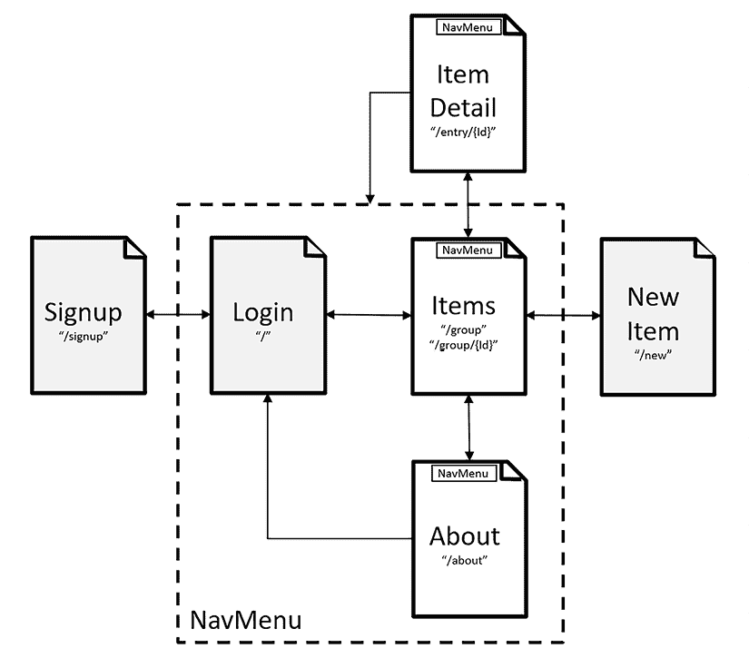
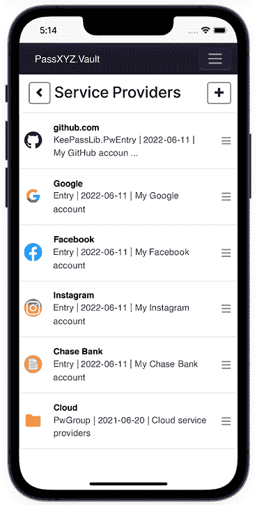
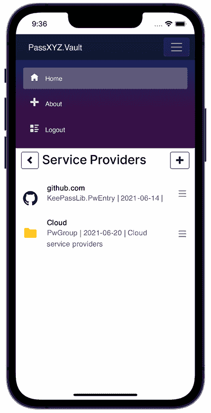
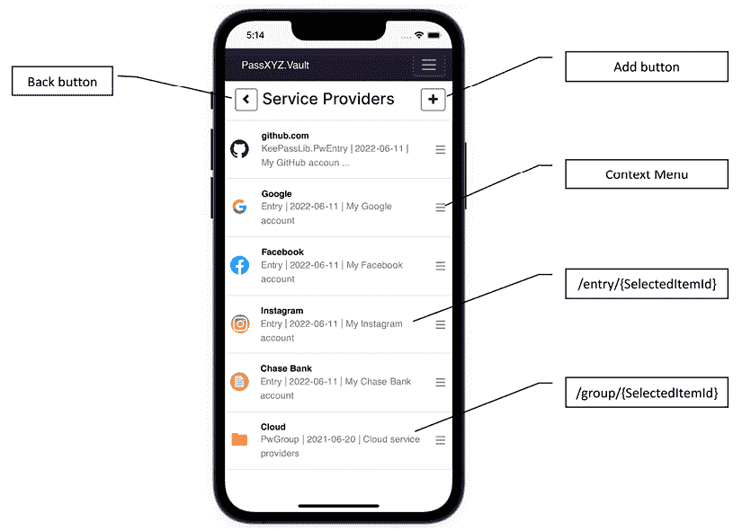
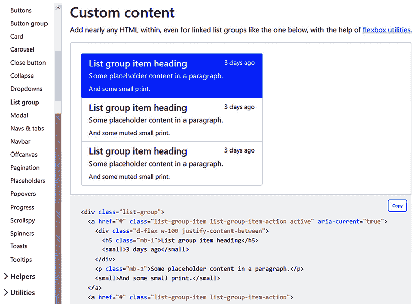
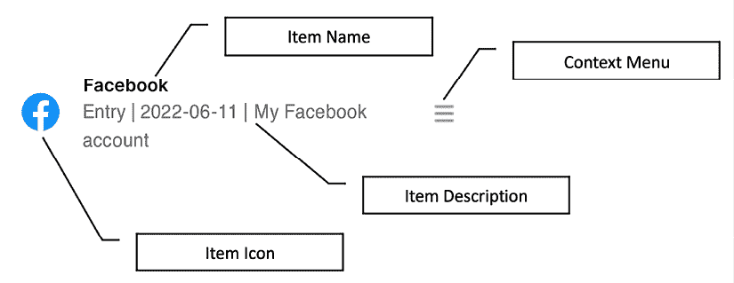
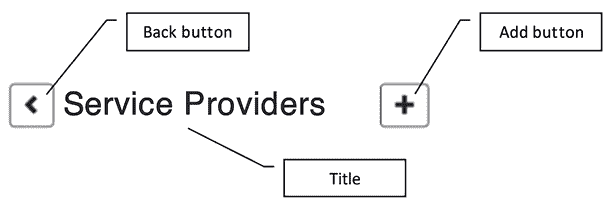

# 9

# 理解 Blazor 路由和布局

在上一章中，我们探讨了使用 Blazor 设计登录页面的过程。尽管应用程序布局和导航层次结构仍然是基于 XAML 的，但我们的应用程序利用了结合了 Blazor 和 XAML 的混合 UI 实现。Blazor 为 .NET MAUI 应用程序提供了一种替代的 UI 设计方法。在本书的第二部分，我们将仅使用 Blazor 重建整个 UI。由于 UI 设计的初始步骤通常涉及布局和导航的实现，因此本章将介绍 Blazor 中的布局和路由概念。

我们在本章中将涵盖以下主题：

+   客户端 Blazor 路由

+   使用 Blazor 布局组件

+   实现导航元素

# 技术要求

要测试和调试本章的源代码，您需要在您的 PC 或 Mac 上安装 Visual Studio 2022。有关详细信息，请参阅第一章，*Getting Started with .NET MAUI* 中的 *Development environment setup* 部分。

本章的源代码可在以下 GitHub 仓库中找到：[`github.com/PacktPublishing/.NET-MAUI-Cross-Platform-Application-Development-Second-edition/tree/main/2nd/chapter09`](https://github.com/PacktPublishing/.NET-MAUI-Cross-Platform-Application-Development-Second-edition/tree/dcbd1d8d55bea3adccb3153f59b2d0152c282dd2)。

要查看本章的源代码，我们可以使用以下命令：

```swift
$ git clone -b 2nd/chapter09 https://github.com/PacktPublishing/.NET-MAUI-Cross-Platform-Application-Development-Second-edition.git PassXYZ.Vault2 
```

要了解更多关于本书源代码的信息，请参阅第二章，*Building Our First .NET MAUI App* 中的 *Managing the source code in this book* 部分。

# 理解客户端路由

Blazor 的路由和布局与 XAML 领域中的 Shell 和导航概念相似。在第五章，*Navigation Using .NET MAUI Shell and NavigationPage* 中，我们讨论了 Shell 的路由策略时介绍了导航和 Shell。Shell 提供了一种基于 URI 的导航体验，它依赖于路由来导航到指定的页面。Blazor 的路由与此方法非常相似。

Blazor 路由允许在 Razor 页面之间实现无缝过渡。在 `BlazorWebView` 中渲染 Razor 页面类似于在浏览器中运行的 Web 应用程序。

在传统的 Web 应用程序中，在浏览器中加载 HTML 页面是从 Web 服务器获取页面。选择不同的路由随后会从服务器检索新页面。然而，对于 **单页应用程序**（**SPAs**）来说，这个过程略有不同。

Blazor WebAssembly 应用程序属于 SPAs 的范畴。当启动应用程序时，它会被加载到浏览器中，并且任何后续的页面导航都仅发生在客户端。这种方法被称为客户端路由，Blazor 混合应用程序也采用了这种方法。

## 设置 BlazorWebView

要实现客户端路由，必须在应用程序启动时安装路由器。在 .NET MAUI 应用程序中，XAML 和 Blazor 入口点都在 `App.xaml.cs` 中配置。要切换 UI 实现从 XAML 到 Blazor，请参考提供的代码中对 `App.xaml.cs` 所做的修改。

Blazor 混合应用程序在 `BlazorWebView` 中运行。要启动 Blazor 混合应用程序，首先需要创建一个 `BlazorWebView` 实例。在前一章中，我们在 `LoginPage` 中完成了此设置，并在登录后成功导航回 Shell。

要为整个应用程序配置 `BlazorWebView` 实例，需要替换 `App` 类中分配给 `MainPage` 属性的实例。为此，我们修改了 `App` 类的构造函数（位于 `App.xaml.cs`），如下所示：

```swift
public App()
{
  InitializeComponent();
#if MAUI_BLAZOR
  MainPage = new MainPage();                              //(1)
#else
  Routing.RegisterRoute(nameof(ItemsPage),
      typeof(ItemsPage));
  Routing.RegisterRoute(nameof(ItemDetailPage),
    typeof(ItemDetailPage));
  Routing.RegisterRoute(nameof(NewItemPage),
      typeof(NewItemPage));
  MainPage = new AppShell();
#endif
} 
```

我们可以使用一个符号，`MAUI_BLAZOR`，来简化条件编译，使我们在构建过程中能够在 XAML 和 Blazor UI 之间切换。为了使用 Blazor UI，我们将 `MainPage` 属性分配给一个 `MainPage` 实例 **(1)**。在 `MainPage` 类中，我们定义了 `BlazorWebView` 控件如下：

```swift
<BlazorWebView HostPage="wwwroot/index.xhtml">
  <BlazorWebView.RootComponents>
    <RootComponent Selector="#app" ComponentType="{x:Type
        local:Main}" />
  </BlazorWebView.RootComponents>
</BlazorWebView> 
```

在 `BlazorWebView` 中，加载一个 HTML 页面（`index.xhtml`）以启动 Blazor UI 设置。让我们看看路由器配置是如何工作的。

## 设置 Router 组件

Blazor UI 采用基于 HTML 页面的设计，类似于从静态 HTML 页面起源的 SPA 结构。在 `BlazorWebView` 中，要加载的初始 HTML 页面是 `index.xhtml`。这与我们在前一章中讨论的 `login.xhtml` 页面非常相似。

在 `RootComponent` 中加载的顶级 Razor 组件看起来像是 `Main` 组件，可以在此查看：

```swift
<Router AppAssembly="@typeof(Main).Assembly">                      //(1)
  <Found Context="routeData">                                      //(2)
    <RouteView RouteData="@routeData"
      DefaultLayout="@typeof(MainLayout)" />
      <FocusOnNavigate RouteData="@routeData" Selector="h1" />
  </Found>
  <NotFound>                                                       //(3)
    <LayoutView Layout="@typeof(MainLayout)">
      <p role="alert">Sorry, there's nothing at this
          address.</p>
    </LayoutView>
  </NotFound>
</Router> 
```

列表 9.1：`Main.razor` ([`epa.ms/Main9-1`](https://epa.ms/Main9-1))

如我们在 *列表 9.1* 中所见，我们在 `Main.razor` 中设置了 `Router` 组件 **(1)**。

`Router` 组件使用反射来扫描所有页面组件并构建一个路由表。`AppAssembly` 参数决定了哪些程序集将被扫描。在遇到导航事件时，路由器会查阅路由表以找到相应的路由。本质上，`Router` 组件是一个模板组件，我们将在下一章中进一步探讨。当找到匹配的路由时，将使用 `Found` 模板。相反，如果没有匹配的路由，则使用 `NotFound` 模板。

`Found` 模板 **(2)** 使用 `RouteView` 组件来渲染所选组件及其布局。布局在 `DefaultLayout` 属性中指定，我们将在下一节中对其进行检查。此外，要加载的新页面以及任何路由参数都通过 `RouteData` 类的实例传递。

如果找不到匹配项，将渲染 `NotFound` 模板，**（3）**。此模板使用 `LayoutView` 组件来显示错误消息。`LayoutView` 使用的布局通过 `Layout` 属性指定。

## 定义路由

在设置好路由器之后，我们可以继续创建页面并在这些页面内定义路由模板。然后，路由器将扫描页面中定义的路由模板以构建路由表。

在我们应用的顶层，可以通过参考 *图 9.1* 来建立导航层次结构和路由模板：



图 9.1：Razor 页面的导航层次结构

我们在 *图 9.1* 中展示了我们应用的主要页面。每个页面都有一个名称，该名称对应于 Razor 页面的类名。名称下方是路由模板。例如，对于 `About` 页面，路由模板可以声明如下：

```swift
@page "/about" 
```

`@page` 指令包含两个组件——指令名称和路由模板。在此示例中，路由模板是 `/about`，必须用引号括起来，并且始终以正斜杠 (`/`) 开头。鉴于 Razor 页面的最终输出是一个 HTML 页面，导航到 Razor 页面可以像使用锚点标签 `<a>` 导航到网页一样处理，如下所示：

```swift
<a href="/about">About</a> 
```

### 使用路由参数传递数据

当使用路由模板导航到页面时，可以通过路由参数将数据传递到页面。如果我们回想一下在 Shell 中使用查询参数传递数据的过程，路由参数的使用相当类似。

如 *图 9.1* 所示，在成功登录后，将显示 `Items` 页面，显示根组中的项目列表，如 *图 9.2* 所示。在此页面上，点击项目可以根据项目类型进行导航。为了识别选定的项目，将项目 `Id` 值作为参数传递到新页面。



图 9.2：Blazor 混合应用中的项目页面

在 `Items` 页面中，我们定义了以下路由模板：

```swift
@page "/group"
@page "/group/{SelectedItemId}" 
```

第一个路由模板用于显示根页面，而第二个路由模板在选择一个组时生效。组 `Id` 值通过 `SelectedItemId` 路由参数传递到 `Items` 页面。为了指定路由参数的类型，我们可以结合数据类型相关的约束，如下所示：

```swift
@page "/user/{Id:int}" 
```

在前面的页面指令中，我们将 `Id` 的数据类型定义为整数。有关路由约束的更多信息，请参阅相关的 Microsoft 文档。您可以通过以下链接访问相关文档：[`learn.microsoft.com/en-us/aspnet/core/blazor/fundamentals/routing?view=aspnetcore-8.0#route-constraints`](https://learn.microsoft.com/en-us/aspnet/core/blazor/fundamentals/routing?view=aspnetcore-8.0#route-constraints)。

### 使用 NavigationManager 导航

在 Razor 页面中，导航到另一个页面通常涉及使用 `<a>` 锚点标签。然而，在某些情况下，可能需要通过代码执行操作。这种情况之一是在处理事件时，在事件处理器中发生页面重定向。这正是我们的 `Login` 页面所面临的情况。让我们探讨如何在成功登录后使用 `NavigationManager` 导航到 `Items` 页面。

在我们的应用程序中，登录后，我们必须将用户重定向到 `Items` 页面以显示根组。`Login` 页面的用户界面与上一章保持不变；然而，我们已经修改了 `Login.razor.cs` 中的事件处理器，如下所示：

```swift
namespace PassXYZ.Vault.Pages;
public partial class Login : ComponentBase {
  [Inject]
  private IUserService<User> userService { get; set; } =
      default!;
  [Inject]
  private IDataStore<Item> dataStore { get; set; } =
      default!;
  [Inject]
  private NavigationManager navigationManager {get; set;} //(1)
  private LoginService currentUser { get; set; } =
      default!;
  private async void OnLogin(MouseEventArgs e) {
    bool status = await userService.LoginAsync
        (currentUser);
    if (status) {
      navigationManager.NavigateTo("/group");             //(2)
    }
  }
} 
```

我们通过依赖注入 **(1**) 获取 `NavigationManager` 的实例。

然后，我们调用 `NavigationManager` 的 `NavigateTo("/group")` 方法以方便导航到 `Items` 页面 **(2)**。

在本节中，我们探讨了路由和导航。作为下一步，我们可以在 Blazor UI 中实现类似于 Shell 导航的导航层次结构。

HTML 页面导航层次结构的顶层包括标题、工具栏、菜单和页脚。我们可以使用 Blazor 布局组件来设计此布局，它与 Shell 中的弹出和菜单项类似。我们之前在 *第五章* 中介绍了这些概念，即使用 .NET MAUI Shell 和 NavigationPage 进行导航。

# 使用 Blazor 布局组件

大多数网页通常具有固定元素，如标题、页脚或菜单。通过将布局与内容结合设计页面，我们可以最小化冗余代码。页面本身显示用户 intended 的内容，而布局则帮助构建视觉样式并提供导航方法。

Blazor 布局组件是从 `LayoutComponentBase` 派生的类。任何适用于常规 Razor 组件的功能也可以应用于布局组件。

在 *清单 9.1* 中，我们可以看到 `MainLayout` 是页面的默认布局。其定义可以在 *清单 9.2* 中找到，如下所示：

```swift
@inherits LayoutComponentBase                             //(1)
<div class="page">
  <div class="sidebar">
    <NavMenu />                                           //(2)
  </div>
  <main>
    @Body                                                 //(3)
  </main>
</div> 
```

清单 9.2：`MainLayout.razor` ([`epa.ms/MainLayout9-2`](https://epa.ms/MainLayout9-2))

**MainLayout** 组件 **(1**) 继承自 `LayoutComponentBase` 类。该组件具有一个 **NavMenu** **(2**) 用于概述导航菜单。在 `<main>` 标签 **(3**) 内，`@Body` Razor 语法指定了布局标记中渲染内容的位置。

仔细检查 `NavMenu` 组件非常重要，因为它作为应用程序中的主要导航方法。在审查代码之前，请参考 *图 9.3* 以查看 **NavMenu** 接口的视觉表示。**NavMenu** 包含三个菜单项：**主页**、**关于**和**注销**。



图 9.3：NavMenu

`NavMenu`是一个 Razor 组件，负责定义导航中使用的链接。`NavMenu`的源代码可以在*清单 9.3*中找到，如下所示：

```swift
<div class="top-row ps-3 navbar navbar-dark">                      //(1)
  <div class="container-fluid">
    <a class="navbar-brand" href="">PassXYZ.Vault</a>
<button title="Navigation menu" class="navbar-toggler"
  @onclick="ToggleNavMenu">                                        //(2)
      <span class="navbar-toggler-icon"></span>
    </button>
  </div>
</div>
<div class="@NavMenuCssClass" @onclick="ToggleNavMenu">
  <nav class="flex-column">
    <div class="nav-item px-3">                                    //(3)
      <NavLink class="nav-link" href="/group">                     //(4)
        <span class="oi oi-home" aria-hidden="true"></span>
            Home
      </NavLink>
    </div>
    <div class="nav-item px-3">
      <NavLink class="nav-link" href="/about">
        <span class="oi oi-plus" aria-hidden="true"></span>
             About
      </NavLink>
    </div>
    <div class="nav-item px-3">
      <NavLink class="nav-link" href="" Match=
           "NavLinkMatch.All">
        <span class="oi oi-list-rich" aria-hidden="true">
            </span>
        Logout
      </NavLink>
    </div>
  </nav>
</div>
@code {
  private bool collapseNavMenu = true;
  private string NavMenuCssClass => collapseNavMenu ?
      "collapse" : null;
  private void ToggleNavMenu() {
    collapseNavMenu = !collapseNavMenu;
  }
} 
```

清单 9.3: `NavMenu.razor` ([`epa.ms/NavMenu9-3`](https://epa.ms/NavMenu9-3))

在`NavMenu`组件的源代码中，我们可以观察到它由一个 Bootstrap `navBar`组件和一些代码块内的 C#逻辑组成。`NavBar`在以下`<div>`标签中使用`navbar` Bootstrap 类定义**（1）**：

```swift
<div class="top-row ps-3 navbar navbar-dark"> 
```

如*图 9.3*所示，一个汉堡图标**（2）**位于屏幕的右上角，使用`<button>`标签来切换`NavMenu`。汉堡按钮 UI 使用 Bootstrap 类`navbar-toggler`实现，如下详细说明：

```swift
 <button title="Navigation menu" class="navbar-toggler"
    @onclick="ToggleNavMenu">
    <span class="navbar-toggler-icon"></span>
  </button> 
```

定义了三个链接作为菜单项，使用`nav-item` Bootstrap 类**（3）**。而不是使用锚标签`<a>`，我们使用`NavLink`**（4）**。`NavLink`组件的功能类似于`<a>`。然而，它根据其`href`是否与当前 URL 匹配来切换一个`active` CSS 类，如下所示：

```swift
 <div class="nav-item px-3">
      <NavLink class="nav-link" href="/group">
        <span class="oi oi-home" aria-hidden="true"></span>
            Home
      </NavLink>
    </div> 
```

我们之前讨论了`MainLayout`，它是我们应用中的默认布局。现在，让我们看看如何将此布局应用于组件。

## 将布局应用于组件

`MainLayout`作为默认布局组件，适用于所有页面，除非指定了其他布局。在某些情况下，我们可能需要使用一个独特的布局而不是默认布局。

例如，在我们的应用中，我们为`登录`页面使用了一个独特的布局组件，而不是默认布局（参考*清单 9.4*）。`MainLayout`包含一个`NavMenu`组件，我们不想在`登录`页面上显示它，因为用户在登录之前不应该访问其他内容。让我们查看在应用特定布局后对`登录`页面所做的修改，如*清单 9.4*所示：

```swift
@page "/"
@layout LogoutLayout                                         //(1)
@namespace PassXYZ.Vault.Pages
<div class="text-center">
  <main class="form-signin">
    <form>
      
      <h1 class="h3 mb-3 fw-normal">Please sign in</h1>
      <div class="form-floating">
        <label for="floatingInput">Username</label>
        <input type="text"
            @bind="@currentUser.Username"...>
      </div>
      <div class="form-floating">
        <label for="floatingPassword">Password</label>
        <input type="password" @bind=
            "@currentUser.Password"...>
      </div>
      <div class="checkbox mb-3">
        <label>
          <input type="checkbox" value="remember-me">
                Remember me
        </label>
      </div>
      <button...>Sign in</button>
      <p class="mt-5 mb-3 text-muted">&copy; 2021–2022</p>
    </form>
  </main>
</div> 
```

清单 9.4: `Login.razor` ([`epa.ms/Login9-4`](https://epa.ms/Login9-4))

要应用特定的布局，我们可以使用`@layout` Razor 指令**（1）**。在`登录`页面上，我们实现了`LogoutLayout`。`LogoutLayout`的代码在*清单 9.5*中展示，如下所示：

```swift
@inherits LayoutComponentBase
<div class="page">
  <main>
    <div class="top-row px-4">
      <a href="#" target="_blank">Sign-in</a>
    </div>
    <article class="content px-4">
      @Body
    </article>
  </main>
</div> 
```

清单 9.5: `LogoutLayout.razor` ([`epa.ms/LogoutLayout9-5`](https://epa.ms/LogoutLayout9-5))

在`LogoutLayout`中，我们移除了`NavMenu`元素，并加入了一个登录链接，允许新用户注册账户。

## 嵌套布局

布局组件也可以嵌套。在`MainLayout`中，我们没有为内容指定任何边距。虽然这个布局适合项目页面或项目详情页面上的内容列表视图，但它可能不适合像`关于`页面这样的内容页面。为了改进这一点，我们可以为`关于`页面使用一个嵌套在`MainLayout`中的独特布局。让我们称它为`PageLayout`，其实现可以在*清单 9.6*中找到：

```swift
@inherits LayoutComponentBase
@layout MainLayout
<article class="content px-4">
  @Body
</article> 
```

清单 9.6: `PageLayout.razor` ([`epa.ms/PageLayout9-6`](https://epa.ms/PageLayout9-6))

`PageLayout`是一个布局组件，它使用`MainLayout`。它将`@Body`放置在一个应用了`"content px-4"`样式的`<article>`标签内，从而使内容采用适合段落文本的样式。

在`About`页面上，我们可以以下方式指定布局为`PageLayout`：

```swift
@page "/about"
@layout PageLayout 
```

我们现在已经涵盖了 Blazor 中路由和布局的基础知识。有了这些知识，我们可以继续在我们的应用中实现导航元素。

# 实现导航元素

在*第五章*中，*使用.NET MAUI Shell 和 NavigationPage 进行导航*，我们介绍了 Shell 中的绝对和相对路由的概念。绝对路由可以在视觉导航层次结构中定义，而相对路由可以通过查询参数进行导航。

这种导航方法与我们在 Blazor 版本的应用中采用的策略相似。如图*图 9.4*所示，我们以类似于 XAML 版本的方式实现 Blazor UI 元素。



图 9.4：导航元素

`Items`页面是用户登录应用后的主页面。在这个显示项目列表的页面上，以下 UI 元素与导航相关：

+   **列表视图** – 用户可以浏览列表并选择一个项目。

+   **上下文菜单** – 与列表视图中的每个项目相关联，使用户能够编辑或删除项目。

+   **返回按钮** – 允许用户返回上一级。

+   **添加按钮** – 允许用户添加新项目。

在本节中，我们将利用我们所学的知识来实现上述导航元素。

## 实现列表视图

在 XAML 版本中，用户登录应用后，导航从项目列表开始。列表视图是通过使用.NET MAUI `ListView`控件实现的，该控件利用特定平台的 UI 组件以实现跨平台的一致外观和感觉。在 Blazor 版本中，我们使用基于 Web 的 UI，确保在不同平台上具有统一的外观。

当涉及到使用 Web UI 实现列表视图时，我们有众多选项可供选择。在本书中，我们遵循 Bootstrap 框架。我们的方法，如前一章所示，涉及重用 Bootstrap 示例中的 UI 设计。由于我们在本书中使用 Bootstrap 5.1，我们可以参考*图 9.5*中展示的列表组示例。



图 9.5：Bootstrap 列表组

之前的示例可以通过以下 URL 访问：[`getbootstrap.com/docs/5.1/components/list-group/`](https://getbootstrap.com/docs/5.1/components/list-group/)。

可以使用 Bootstrap 列表组来构建一个类似于 XAML 中的 `ListView` 的 UI 组件。为了实现这一点，我们可以将 CSS 类 `"list-group"` 应用到 HTML 标签，如 `<ul>` 或 `<div>`，以创建列表组。在列表组内，将 `"list-group-item"` CSS 类应用于组中的单个列表项。

在 XAML 版本中，我们使用上下文菜单来执行 CRUD 操作。然而，Bootstrap 列表组没有内置的上下文菜单，因此我们必须自己实现它。要在列表组内创建上下文菜单，我们可以使用 Bootstrap `dropdown` 组件。

为了使用 `dropdown` 组件，需要在 `index.xhtml` 中包含 JavaScript 依赖项，如下所示：

```swift
<script src="img/blazor.webview.js"
  autostart="false"></script>
<script src="img/bootstrap.bundle.min.js">
  </script> 
```

我们在 `blazor.webview.js` 之后包含了 JavaScript 文件 `bootstrap.bundle.min.js`。`bootstrap.bundle.min.js` 文件是 Bootstrap 发布包的一部分。

要创建一个名为 `Items` 的新 Razor 组件，只需在 Visual Studio 中的 **Pages** 文件夹上右键单击，然后选择 **Add** -> **Razor Component**`…`。之后，插入 *Listing 9.7* 中提供的代码，并将 Razor 文件命名为 `Items.razor`：

```swift
@page "/group"
@page "/group/{SelectedItemId}"
<!-- Back button and title -->
<div class="container">...
<!-- List view with context menu -->
<div class="list-group">                                        //(1)
  @foreach (var item in items) {
   <div class="dropdown list-group-item
       list-group-item-action...>                               //(2)
      
      <a href="@item.GetActionLink()"
           class="list-group-item...>
        <div class="d-flex">
          <div>
            <h6 class="mb-0">@item.Name</h6>
            <p class="mb-0 opacity-75">@item.Description
            </p>
          </div>
        </div>
      </a>
      <button class="opacity-50 btn btn-light
           dropdown-toggle"
        type="button" id="itemsContextMenu"
        data-bs-toggle="dropdown" aria-expanded="false">
        <span class="oi oi-menu" aria-hidden="true"></span>
      </button>                                                 //(3)
      <ul class="dropdown-menu"
        aria-labelledby="itemsContextMenu">                     //(4)
        <li>
          <button class="dropdown-item"
              data-bs-toggle="modal"
            data-bs-target="#editModel"> Edit </button>
        </li>
        <li>
          <button class="dropdown-item"
               data-bs-toggle="modal"
            data-bs-target="#deleteModel"> Delete </button>
        </li>
      </ul>
    </div>
  }
</div>
<!-- Editing Modal -->
<div class="modal fade" id="editModel" tabindex="-1"
  aria-labelledby="editModelLabel" aria-hidden="true">...
<!-- Deleting Modal -->
<div class="modal fade" id="deleteModel" tabindex="-1"
  aria-labelledby="deleteModelLabel" aria-hidden="true">...
<!-- New Modal -->
<div class="modal fade" id="newItemModel" tabindex="-1" aria-labelledby="newItemModelLabel" aria-hidden="true">... 
```

列表 9.7：`Items.razor` ([`epa.ms/Items9-7`](https://epa.ms/Items9-7))

在 `Items.razor` **(1**) 中，我们可以复制使用具有 `list-group` CSS 类的 `<div>` 标签的 Bootstrap 列表组示例代码。

我们根据我们的要求 **(2**) 定制了列表组项，如图 9.6 所示。列表组项是在 `foreach` 循环中使用 `<div>` 标签创建的，包含一个图标、一个名称、一个描述和一个上下文菜单：

```swift
<div class="dropdown list-group-item list-group-item-action...> 
```

我们将 `dropdown`、`list-group-item` 和 `list-group-item-action` CSS 类应用到 `<div>` 标签上，将其转换为一个包含下拉菜单的列表组项。



图 9.6：列表组项

在列表组项中，我们使用 `` 标签来显示项目的图标：

```swift
  
```

我们可以通过从 `Item` 类中调用名为 `GetIcon` 的扩展方法来获取图标源。要创建此扩展方法，我们需要在 `Shared` 文件夹下添加一个新的类文件，并将其命名为 `ItemEx.cs`，如图 *Listing 9.8* 所示。

使用 `<a>` 锚标签来显示项目的名称和描述。名称和描述在 `<a>` 标签中定义如下：

```swift
 <a href="@item.GetActionLink()" class=
           "list-group-item...>
        <div class="d-flex">
          <div>
            <h6 class="mb-0">@item.Name</h6>
            <p class="mb-0 opacity-75">@item.Description
            </p>
          </div>
        </div>
      </a> 
```

可以使用 `GetActionLink` 扩展方法获取项目的链接，该方法也在 *Listing 9.8* 中定义。

上下文菜单是一个 Bootstrap 下拉组件，由一个 `<button>` 标签 **(3**) 和使用 `<ul>` 标签创建的无序列表组成 **(4)**。利用 Open Iconic 图标，此按钮显示为汉堡图标。

**开源图标**

在 Blazor UI 设计中，我们使用 Open Iconic 图标。Open Iconic 是一个开源图标集，包含 223 个 SVG、网络字体和位图格式的图标。对于 XAML 设计，使用 FontAwesome，它也可以在 Blazor 中与 Bootstrap 一起实现。然而，在使用之前需要额外的配置。Open Iconic 与 Blazor 模板捆绑在一起，并包含在 Bootstrap 中。因此，我们可以直接使用它而无需任何额外配置。例如，要在上下文菜单中显示汉堡图标，可以使用以下 HTML 标签：

```swift
<span class="oi oi-menu" aria-hidden="true"></span> 
```

在下拉菜单中，有两个上下文动作按钮：`Edit` 和 `Delete`。我们给这些按钮应用了 `dropdown-item` CSS 类。上下文动作按钮触发一个对话框来执行 CRUD 操作，因此包含了两个 Bootstrap 模态 CSS 属性，`data-bs-toggle` 和 `data-bs-target`。我们将在下一章讨论处理 CRUD 操作。

现在，让我们回顾一下我们将用于支持列表视图 UI 的 `Item` 扩展方法，如图 *清单 9.8* 所示：

```swift
using KeePassLib;
using KPCLib;
using PassXYZLib;
namespace PassXYZ.Vault.Shared {
  public static class ItemEx {
    public static string GetIcon(this Item item) {                 //(1)
      if(item.IsGroup) {
        // Group
        if(item is PwGroup group) {          
          if(group.CustomData.Exists(
            PxDefs.PxCustomDataIconName)) {
            return $"/images/{group.CustomData.Get
                (PxDefs.PxCustomDataIconName)}";
          }
        }
      }
      else {
        // Entry
        if(item is PwEntry entry) {
          if(entry.CustomData.Exists
            (PxDefs.PxCustomDataIconName)) {
            return $"/images/{entry.CustomData.Get
               (PxDefs.PxCustomDataIconName)}";
          }
        }
      }
      // 2\. Get custom icon
      return item.GetCustomIcon();
    }
    /// <summary>
    /// Get the action link of an item.
    /// </summary>
    public static string GetActionLink(this Item
        item, string? action = default) {                          //(2)
      string itemType = (item.IsGroup) ?
          PxConstants.Group : PxConstants.Entry;
      return (action == null) ? $"/{itemType}/{item.Id}" :
          $"/{itemType}/{action}/{item.Id}";
    }
    /// <summary>
    /// Get the parent link of an item.
    /// </summary>
    public static string? GetParentLink(this Item item) {          //(3)
      Item? parent = default;
      if (item == null) return null;
      if(item.IsGroup) {
        PwGroup group = (PwGroup)item;
        if (group.ParentGroup == null) return null;
        parent = group.ParentGroup;
      }
      else {
        PwEntry entry = (PwEntry)item;
        if (entry.ParentGroup == null) return null;
        parent = entry.ParentGroup;
      }
      return $"/{PxConstants.Group}/{parent.Id}";
    }
  }
} 
```

清单 9.8：`ItemEx.cs` ([`epa.ms/ItemEx9-8`](https://epa.ms/ItemEx9-8))

在 *清单 9.8* 中，我们创建了一个名为 `ItemEx` 的静态类，用于实现 `Item` 类的扩展方法。在这个类中，我们定义了三个扩展方法来获取必要的导航 URL：

+   `GetIcon` **(1)** – 返回图标图像的 URL

+   `GetActionLink` **(2)** – 根据项目类型返回所选项目的 URL

+   `GetParentLink` **(3)** – 返回父项目的 URL

在之前实现的列表视图 UI 中，我们创建了一个包含密码条目和组的列表。当选择一个项目时，实际上点击了一个锚点标签 `<a>`。`<a>` 的 `href` 属性设置为 `GetActionLink` 方法的返回值。此返回值遵循 `"/{itemType}/{item.Id}"` 路由模板格式，允许导航到所需的项目。此外，每个项目右侧都有一个上下文菜单按钮。点击它时，会出现一个上下文动作列表，允许用户选择一个动作来编辑或删除当前项目。

我们现在已经成功处理了大部分的导航操作；然而，还有两个操作尚未实现。在进入子组后，我们无法进行回退导航，也无法添加新项目。在下一节中，我们将解决这两个功能。

## 添加新项目和回退导航

为了方便导航回上一页和添加新项目，我们可以在标题栏中添加一个 `Back` 按钮和一个 `Add` 按钮。这模拟了 XAML 版本的导航页面，如图 *图 9.7* 所示：



图 9.7：项目页面标题栏

如标题栏所示，包括三个 UI 元素：

+   **标题** – 表示当前项目组的标题

+   **返回** 按钮 – 促进回退导航；然而，在没有父组时保持隐藏

+   **添加** 按钮 – 启用添加新项的功能

要检查实现，让我们扩展 `Back` 按钮和 `Title` 部分的代码，如下所示，如 *Listing 9.7* 中所示：

```swift
<!-- Back button and title -->
<div class="container">
  <div class="row">
    <div class="col-12">
      <h1>
        @if (selectedItem!.GetParentLink() != null) {
          <a class="btn btn-outline-dark" href=
              "@selectedItem!.GetParentLink()"><span
                  class="oi oi-chevron-left"
                      aria-hidden="true"></span></a>               //(1)
        }
        @(" " + Title)
        <button type="button" class="btn btn-outline-dark
            float-end" data-bs-toggle="modal" data-bs-
            target="#newItemModel"><span class="oi
            oi-plus" aria-hidden="true"></span></button>           //(2)
      </h1>
    </div>
  </div>
</div> 
```

**返回按钮** **(1**) 是通过一个锚标签 `<a>` 实现的。这个锚标签的 `href` 属性被设置为 `Item` 扩展方法的返回值，即 `GetParentLink`。这个函数返回父项的链接，以路由模板格式，从而可以通过这个链接进行导航回退。如果没有父组，例如根组，则“返回”按钮保持不可见。

**添加按钮** **(2**) 是通过一个 `<button>` 标签实现的，并显示在标题栏的右侧。为了将按钮定位在屏幕的右侧，我们可以利用 Bootstrap 类，`float-end`。当用户点击此按钮时，会出现一个新的项目对话框。此对话框使用以下属性进行配置：

```swift
data-bs-toggle="modal" data-bs-target="#newItemModel" 
```

在 `Items.razor` 中，如 *Listing 9.7* 所示，使用了三个 Bootstrap 模态对话框：

```swift
<!-- Editing Modal -->
<div class="modal fade" id="editModel" tabindex="-1"
  aria-labelledby="editModelLabel" aria-hidden="true">...
<!-- Deleting Modal -->
<div class="modal fade" id="deleteModel" tabindex="-1"
  aria-labelledby="deleteModelLabel" aria-hidden="true">...
<!-- New Modal -->
<div class="modal fade" id="newItemModel" tabindex="-1" aria-labelledby="newItemModelLabel" aria-hidden="true">... 
```

这些对话框用于执行 CRUD 操作。为了实现它们，我们还重用了 Bootstrap 中的代码。虽然这种方法相对简单，但它确实涉及大量的代码重复。为了节省空间，细节已在 *Listing 9.7* 中折叠。在下一章中，我们将深入研究模态对话框的实现，并展示如何将代码转换为可重用的 Razor 组件。

# 摘要

在本章中，我们探讨了 Blazor 的路由和布局，这些是构建我们应用程序导航层次结构的基本组件。到本章结束时，我们现在能够执行基本的导航，类似于我们应用程序的 XAML 版本提供的功能。

在本章的整个 UI 构建过程中，我们观察到 Blazor 的 UI 设计技术与传统 Web UI 设计实践相一致。这允许重用来自现有框架（如 Bootstrap）的代码。

在创建自定义用户界面时，首先在游乐场中设计初始布局通常是有益的。一旦对 UI 设计感到满意，可以将 HTML 和 CSS 代码复制到 Razor 文件中，以构建 Razor 组件。Blazor 开发者也可以利用几个在前端开发者中流行的游乐场，包括 CodePen、JSFiddle、CodeSandbox 和 StackBlitz。

在本章中，我们使用了 Bootstrap 示例来构建我们的 UI。虽然这种方法为实施 Web UI 提供了一个简单的方法，但它导致了大量的代码重复。在下一章中，我们将简化我们的代码，并将其转换为可重用的 Razor 组件。通过使用这些 Razor 组件，我们将执行 CRUD 操作以添加、编辑和删除项。

# 在 Discord 上了解更多

加入我们社区的 Discord 空间，与作者和其他读者进行讨论：

[`packt.link/cross-platform-app`](https://packt.link/cross-platform-app)


