# 实现 Razor 组件

在上一章中，我们探讨了 Blazor 路由和布局，并随后通过设置应用程序的路由和布局来构建导航框架。在设置导航框架之后，我们创建了顶级页面。Razor 页面的实现允许进行密码数据库导航，类似于 XAML 版本。虽然 Razor 页面确实是 Razor 组件，但它们是不可重用的。在本章中，我们将介绍创建可重用 Razor 组件。此外，我们将深入研究数据绑定和 Razor 组件的生命周期，以全面理解这些方面。掌握这些知识后，我们将通过将重复代码转换为可重用 Razor 组件来优化我们的代码。最终，我们将使用 Razor 组件在我们的应用程序中实现 CRUD 操作。

本章我们将涵盖以下主题：

+   理解 Razor 组件

+   创建 Razor 类库

+   创建可重用 Razor 组件

+   理解 Razor 组件的生命周期

+   重构 Razor 组件

+   使用模板化组件

# 技术要求

要测试和调试本章的源代码，您需要在您的 PC 或 Mac 上安装 Visual Studio 2022。有关详细信息，请参阅 *第一章*，*开始使用 .NET MAUI* 中的 *开发环境设置* 部分。

本章的源代码可在以下 GitHub 仓库中找到：[`github.com/PacktPublishing/.NET-MAUI-Cross-Platform-Application-Development-Second-edition/tree/main/2nd/chapter10`](https://github.com/PacktPublishing/.NET-MAUI-Cross-Platform-Application-Development-Second-edition/tree/d5302ca26a3c362a291785a9771d87ad8552bdb2)。

要查看本章的源代码，可以使用以下命令：

```swift
$ git clone -b 2nd/chapter10 https://github.com/PacktPublishing/.NET-MAUI-Cross-Platform-Application-Development-Second-edition.git PassXYZ.Vault2 
```

要了解更多关于本书中源代码的信息，请参阅本书 *第二章*，*构建我们的第一个 .NET MAUI 应用程序* 中的 *管理源代码* 部分。

# 理解 Razor 组件

尽管我们在前两章中开发和使用了 Razor 组件，但我们还没有深入探讨它们。在本节中，我们将继续完善上一章的应用程序，同时更深入地探索 Razor 组件，从而更好地理解这些组件周围的关键概念。

Blazor 应用程序使用 Razor 组件构建。我们应用程序中的第一个 Razor 组件是 `Main`，它定义在 `Main.razor` 文件中，如下所示：

```swift
<Router AppAssembly="@typeof(Main).Assembly">
  <Found Context="routeData">
    <RouteView RouteData="@routeData"
      DefaultLayout="@typeof(MainLayout)" />
    <FocusOnNavigate RouteData="@routeData" Selector="h1" />
  </Found>
  <NotFound>
    <LayoutView Layout="@typeof(MainLayout)">
      <p role="alert">
        Sorry, there's nothing at this address.
      </p>
    </LayoutView>
  </NotFound>
</Router> 
```

安装在 `Main` 组件内的 `Router` 组件负责处理页面路由和选择默认布局组件。所有其他 Razor 页面都由 `Router` 组件管理。这些由 `Router` 加载的 Razor 页面定义了路由模板，用于显示用户界面。在我们的项目中，Razor 页面位于 `Pages` 文件夹中。

要了解 Blazor 混合应用的启动顺序，可以参考下面的 *图 10.1*：

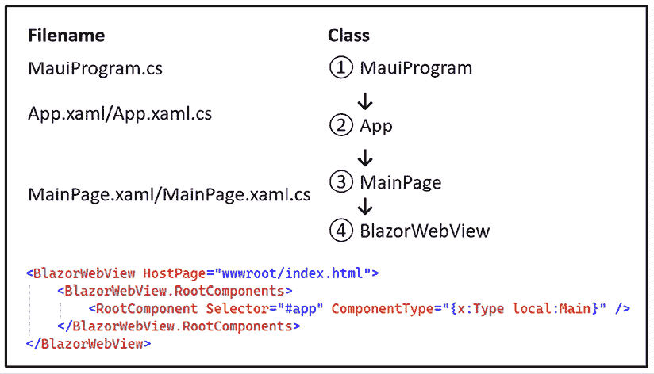

图 10.1：Blazor 混合应用程序的启动

作为 .NET MAUI 应用程序，Blazor 混合应用程序的起点也是 `MauiProgram` 类 **(1)**。在 `MauiProgram` 类中，创建了一个 `App` 类的实例 **(2)**。第一个要加载到该实例中的 XAML 页面是 `MainPage` 类 **(3)**。这个 `MainPage` 包含了一个 `BlazorWebView` 的实例 **(4)**，它托管了 Blazor 页面。有关如何将 Razor 组件 `Main` 加载到 `BlazorWebView` 的更多信息，请参阅 *第八章*，介绍 Blazor 混合应用程序开发。一旦 `Main` 组件被加载到 `BlazorWebView` 中，它就展示了导航堆栈的根。在这种情况下，导航堆栈的根页面是 `Login` 页面。

此外，还有一些可重用的 Razor 组件，它们是 Razor 页面的构建块。这些 Razor 组件存储在 `Shared` 文件夹中。

本质上，每个具有 `.razor` 扩展名的文件代表一个 Razor 组件，它在执行时被编译成一个 C# 类。文件名作为类名，而文件夹名则贡献于命名空间。例如，`Login` Razor 组件位于 `Pages` 文件夹中，因此文件夹名 `Pages` 被包含在命名空间中。因此，`Login` 类的完整名称是 `PassXYZ.Vault.Pages.Login`。

Razor 组件可以编写在一个单独的文件中，也可以分为一个 Razor 文件（`.razor`）和一个代码后 C# 文件（`.cs`）。代码后 C# 文件定义了一个包含所有编程逻辑的部分类。这种方法在我们创建 *第八章*，介绍 Blazor 混合应用程序开发中的 `Login` 组件时被采用。

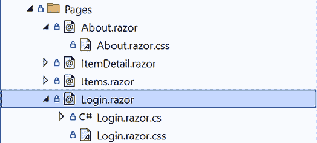

图 10.2：Razor 组件命名约定

如 *图 10.2* 所示，在创建 `Login` 组件时，我们加入了 Bootstrap CSS 风格以用于样式化。Razor 组件提供了 CSS 隔离，这简化了 CSS 的使用，并防止了与其他组件或库的冲突。此外，Razor 组件可以在 `.razor.css` 文件中包含它们自己的 CSS 风格。

## 继承

由于 Razor 组件是一个 C# 类，它包含了 C# 类固有的所有功能。因此，Razor 组件可以作为另一个 Razor 组件的子类。在 *第九章*，理解 Blazor 布局和路由中，我们观察到在创建布局组件时，所有布局组件都是 `LayoutComponentBase` 的派生类。如下面的 `MainLayout.razor` 代码所示，我们使用 `@inherits` 指令指定 `LayoutComponentBase` 作为基类：

```swift
@inherits LayoutComponentBase
<div class="page">
  <div class="sidebar"><NavMenu/></div>
  <main>@Body</main>
</div> 
```

每个 Razor 组件都是 `ComponentBase` 类的派生类。因此，可以使用 C# 文件创建一个从 `ComponentBase` 类派生的 Razor 组件，而不需要 Razor 标记文件。例如，我们可以在一个 C# 类中创建一个 `AppName` Razor 组件，如下所示：

```swift
using Microsoft.AspNetCore.Components;
using Microsoft.AspNetCore.Components.Rendering;
namespace PassXYZ.Vault.Pages;
public class AppName : ComponentBase
{
  protected override void BuildRenderTree
    (RenderTreeBuilder builder)
  {
    base.BuildRenderTree(builder);
    builder.OpenElement(0, "div");
    builder.AddContent(1, "PassXYZ.Vault");
    builder.CloseElement();
  }
} 
```

`AppName` 是一个没有 Razor 标记文件（`.razor`）设计的 Razor 组件；然而，它与其他 Razor 组件的功能相同，如下所示：

```swift
...
<AppName/>
... 
```

上述示例用于演示如何在 C# 代码中创建 Razor 组件。然而，通常建议使用 Razor 标记而不是 C# 代码来创建 UI 组件。

在本节中，我们介绍了 Razor 组件。我们可以将可重用的 Razor 组件放在共享文件夹中，以确保它们在整个项目中可访问。此外，可以创建一个 Razor 类库来在多个项目中共享 Razor 组件。在下一节中，我们将深入了解将这些 Razor 组件打包成库的过程。

# 创建 Razor 类库

在我们的项目中，我们创建可重用组件并将它们存储在 `Shared` 文件夹中。这些组件可以被其他组件使用，例如布局组件或 `NavMenu`。此外，我们可以在 Razor 类库中封装 Razor 组件，使它们可以在各种项目中使用。

Razor 类库中的组件不特定于单个项目，这使得它们适用于任何 Blazor 项目，无论是 Blazor 混合应用、Blazor WebAssembly 还是 Blazor 服务器应用。

在这本书中，我们使用 Bootstrap 构建了 Razor 组件。你可以在 GitHub 上找到许多基于 Bootstrap 构建的开放源码 Razor 类库。其中一些库足够健壮，适用于商业产品开发。以下是一些示例：

+   `BootstrapBlazor`：[`github.com/dotnetcore/BootstrapBlazor`](https://github.com/dotnetcore/BootstrapBlazor)

+   `Blazorise`：[`github.com/Megabit/Blazorise`](https://github.com/Megabit/Blazorise)

+   `Havit.Blazor`：[`github.com/havit/Havit.Blazor/`](https://github.com/havit/Havit.Blazor/)

这些开源项目被构建为 Razor 类库，使得它们可以像其他 .NET 库一样被重用。Razor 类库可以作为 `NuGet` 包发布，从而能够无缝集成到我们的 Blazor 项目中。例如，`BootstrapBlazor` 库可以在以下链接找到：[`www.nuget.org/packages/BootstrapBlazor/`](https://www.nuget.org/packages/BootstrapBlazor/)。

在本节中，我们将开发一个类似于上述开源项目的 Razor 类库。我们将在我们的 Razor 类库中包含可重用的 Razor 组件。然后，这个库可以发布为 NuGet 包。我们有选择使用 Visual Studio 或 .NET 命令行创建 Razor 类库的选项。

要使用 Visual Studio 创建 Razor 类库，我们可以按照以下步骤在我们的解决方案中添加一个新的项目，如图 10.3 所示：

1.  在项目模板中搜索并选择**Razor 类库**。

1.  点击**下一步**，并将项目命名为**PassXYZ.BlazorUI**。

1.  在下一屏上，点击**创建**以建立库。

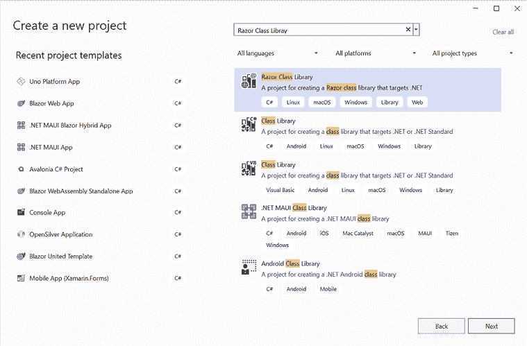

图 10.3：创建 Razor 类库

要使用 dotnet 命令行创建项目，我们可以导航到解决方案文件夹，并在命令提示符中执行以下命令：

```swift
dotnet new razorclasslib -n PassXYZ.BlazorUI 
```

`dotnet new` 命令使用 `razorclasslib` 模板创建一个新的项目，并将项目命名为 `PassXYZ.BlazorUI`。为了将项目包含在解决方案中，我们可以执行以下命令：

```swift
dotnet sln add PassXYZ.BlazorUI\PassXYZ.BlazorUI.csproj 
```

为了使用这个骨架项目创建我们的 Razor 组件，我们必须从 `PassXYZ.BlazorUI` 项目中删除未使用的 `Component1.*` 和 `ExampleJsInterop.cs` 文件。

要在 `PassXYZ.BlazorUI` 项目中使用 Razor 组件，我们必须在 `PassXYZ.Vault` 项目中包含项目引用。为此，我们可以在 Visual Studio 中右键单击项目节点并选择 `Add -> Project Reference`。或者，我们可以直接修改 `PassXYZ.Vault.csproj` 项目文件，添加以下行：

```swift
<ItemGroup>
  <ProjectReference
    Include="..\PassXYZ.BlazorUI\PassXYZ.BlazorUI.csproj"
      />
</ItemGroup> 
```

为了创建一个使用此库的新 Razor 组件，我们必须通过添加以下行更新 `PassXYZ.Vault_Imports.razor` 文件：

```swift
@using PassXYZ.BlazorUI 
```

## 在 Razor 类库中使用静态资产

我们在我们的 Razor 组件中使用了 Bootstrap，因此有必要在 Razor 类库中包含 Bootstrap CSS 和 JavaScript 文件。从 Blazor 应用的角度来看，我们可以将这些静态资产放置在项目的 `wwwroot` 文件夹或组件库的 `wwwroot` 文件夹中。以 Bootstrap CSS 文件为例，如果我们将其存储在项目的 `wwwroot` 目录中，我们可以在 `index.xhtml` 中使用以下路径引用它：

```swift
<script src="img/bootstrap.bundle.min.js"/> 
```

如果我们选择将其存储在组件库的 `wwwroot` 文件夹中，我们可以使用以下路径引用它：

```swift
<script src="_content/PassXYZ.BlazorUI/css/bootstrap/
  bootstrap.bundle.min.js"/> 
```

区别在于在组件库中引用 URL 的必要性，该 URL 应以 `_content/{LibraryProjectName}` 开头。

一旦我们建立了 Razor 类库项目，我们就可以继续在其中包含额外的组件。

# 创建可重用的 Razor 组件

在本节中，我们将重构我们的代码以开发可重用组件。这个过程将使我们能够更深入地了解 Razor 组件的功能，并学习如何优化它们以提高可重用性。

在 *第八章* 中，我们介绍了 Blazor 混合应用开发。此外，我们在 *第九章* 中引入了布局和路由功能，即理解 Blazor 路由和布局。因此，我们的应用现在可以浏览和更新密码数据库。然而，我们尚未实现大多数 CRUD 操作。在本章中完善 Razor 组件后，我们将继续添加这些功能。

为了导航密码数据库，我们开发了两个 Razor 组件——`Items`和`ItemDetail`。`Items`类用于展示当前组内的密码条目和分组列表，而`ItemDetail`类用于展示单个密码条目的内容。

通过查看`Items`和`ItemDetail`的布局，如图 10.4 所示，我们可以观察到两个页面在外观和整体设计上具有相似性。

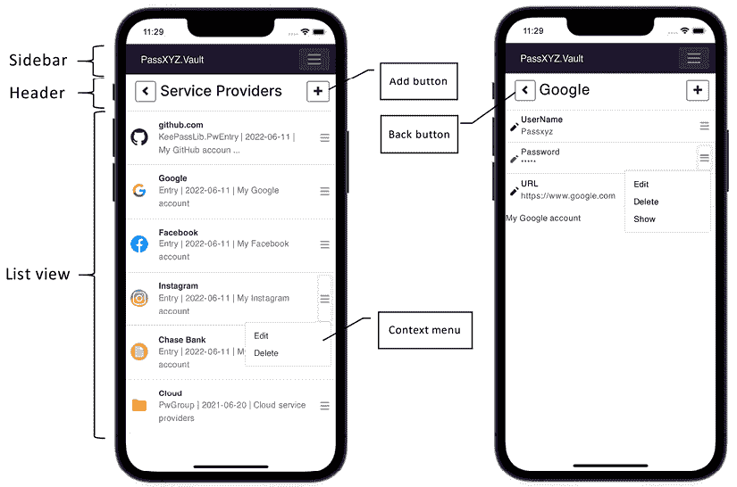

图 10.4：Items 和 ItemDetail 的 UI 布局

两个页面的布局都包含侧边栏、页眉和列表视图。侧边栏在`layout`组件中定义，而页眉和列表视图在`Items`和`ItemDetail`中实现，部分代码是重复的。在本章中，我们将通过将重复的部分抽象为可重用组件来优化我们的代码。

在页眉中有两个按钮：`添加`和`返回`。`返回`按钮允许用户导航回父组，而`添加`按钮允许用户添加新条目或字段。

在列表视图条目中，我们可以使用上下文菜单来执行条目级操作，如编辑或删除。上下文菜单包含针对所选条目或字段特定操作的菜单项。当执行编辑或删除 CRUD 操作时，选择菜单项后，将出现与所选操作相关的模态对话框。

在当前实现中，`Items`和`ItemDetail`将所有 UI 元素都包含在一个单独的 Razor 标记中。我们将开始通过将其分解为更小的、可重用的组件来简化代码，这将导致更清晰的实现。

在本章中，我们将把模态对话框、页眉和列表视图转换为 Razor 组件。让我们从模态对话框开始。为了方便添加、编辑和删除操作，我们需要两种类型的对话框：

+   编辑对话框：用于添加或编辑条目或字段

+   确认对话框：在删除条目或字段之前进行确认

在*第九章*，*理解 Blazor 路由和布局*中，我们通过利用 Bootstrap 示例中的 HTML 和 CSS 代码实现了模态对话框。然而，我们没有对这些元素进行彻底检查，因为我们的标记文件看起来既长又复杂。在本章中，我们将分析代码并将其转换为 Razor 组件。

## 创建基本模态对话框组件

为了改进编辑和确认对话框，我们首先可以构建一个基本模态对话框。通过利用这个基本模态对话框，我们可以根据需要创建编辑器或确认对话框。

要在`PassXYZ.BlazorUI`项目中创建一个新的 Razor 组件，请右键单击项目节点，然后从项目模板中选择`添加` -> `新建项…` -> `Razor 组件`。将 Razor 组件命名为`ModalDialog`，并为它创建一个 C#代码后文件。接下来，将*列表 10.1*中的代码输入到`ModalDialog.razor`中，将*列表 10.2*中的代码输入到`ModalDialog.razor.cs`中。

UI 代码是从*第九章*中找到的`Items`和`ItemDetail`代码派生出来的，如*列表 10.1*所示：

```swift
<div class="modal fade" id=@Id tabindex="-1"
    aria-labelledby="ModelLabel" aria-hidden="true">
  <div class="modal-dialog"><div class="modal-content">
    <div class="modal-header">                                      //(1)
      <h5 class="modal-title" id="ModelLabel">@Title</h5>           //(2)
      <button type="button" class="btn-close"                       //(3)
        data-bs-dismiss="modal" aria-label="Close"/>
    </div>
    <div class="modal-body">                                        //(4)
      <form class="row gx-2 gy-3">
        @ChildContent                                               //(5)
        <div class="col-12">
          <button type="button" class="btn btn-secondary"
            data-bs-dismiss="modal" @onclick=
              "OnClickClose">
            @CloseButtonText                                        //(6)
          </button>
            <button type="submit" class="btn btn-primary"
              data-bs-dismiss="modal" @onclick=
                "OnClickSave">
            @SaveButtonText                                         //(7)
          </button>
        </div>
      </form>
    </div>
  </div></div>
</div> 
```

列表 10.1: `ModalDialog.razor` ([`epa.ms/ModalDialog10-1`](https://epa.ms/ModalDialog10-1))

在*列表 10.1*中显示的标记代码中，我们观察到带有 Bootstrap 样式的典型 HTML 代码片段。我们在 HTML 中加入了 C#变量来构建组件 UI。

此基本对话框 UI 包含一个标题栏 **(1)** 和一个主体 **(4)**。在标题栏中，有一个标题 **(2)** 和一个关闭按钮 **(3)**。主体包含一个子内容区域 **(5)** 和两个按钮（**关闭** **(6)**/**保存** **(7)**）。

为了查看此基本模态对话框的布局的视觉表示，请参阅*图 10.5*：

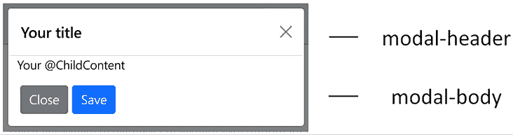

图 10.5：基本对话框

虽然 HTML 和 CSS 代码与 Bootstrap 示例非常相似，但我们已将所有硬编码的内容替换为 C#变量。如果我们使用此模态对话框组件来构建新的组件，以下将作为示例：

```swift
<ModalDialog Id=@id Title="Please confirm" 
  OnSaveAsync=@OnSaveClicked
  SaveButtonText="Save" CloseButtonText="Close">
    Do you want to delete UserName?
</ModalDialog>
<button class="dropdown-item" data-bs-toggle="modal"
  data-bs-target="#@Id">Please confirm</button> 
```

在上述标记代码中，我们使用`<ModalDialog>`组件标签定义了模态对话框。每个模态对话框都分配了一个唯一的 ID 以供识别。我们可以通过点击按钮来显示对话框，其中模态对话框 ID 被提供以方便其识别。

在`<ModalDialog>`组件标签内，我们为`ModalDialog`组件中定义的多个属性赋值，包括`ID`、`标题`、`按钮文本`、`事件处理器`等。

## 数据绑定

而不是直接将字符串或数据分配给 HTML 元素的属性，我们可以选择将变量分配给它。这种能力是 Razor 组件提供的数据绑定功能。在本节中，我们将探讨如何有效地使用数据绑定。在数据绑定中，将变量分配给 DOM 元素的属性会导致从 Razor 组件到 DOM 元素的数据流。相反，响应 DOM 事件会导致数据从 DOM 元素流向 Razor 组件。

由于我们可以像使用 DOM 元素一样使用 Razor 组件，因此子 Razor 组件和父 Razor 组件之间的数据流类似于 Razor 组件和 DOM 元素之间的数据交换。

例如，我们可以将`id`变量绑定到`ModalDialog`的`Id`属性上，通过`OnSaveClicked`事件处理器来管理按钮点击事件：

```swift
<ModalDialog Id=@id Title="Please confirm" 
  OnSaveAsync=@OnSaveClicked
  SaveButtonText="Save" CloseButtonText="Close"> 
```

在前面的示例中，数据从 `id` 变量流向 `ModalDialog` 的 `Id` 属性。当 `OnSaveClicked` 事件处理器被调用时，数据从 `ModalDialog` 流回当前上下文。`ModalDialog` 的属性 `Id` 和 `OnSaveAsync` 在 C# 代码隐藏文件中定义。在下一节中，我们将检查 `ModalDialog` 的 C# 代码隐藏文件。

## 组件参数

Razor 组件的属性可以使用组件参数定义。为了建立组件参数，我们需要创建带有 `[Parameter]` 属性的公共属性。

在 *列表 10.2* 中所示的 `ModalDialog` 类中，我们声明了七个组件参数：`Id`、`Title`、`ChildContent`、`OnClose`、`OnSaveAsync`、`CloseButtonText` 和 `SaveButtonText`。这些组件参数可以用于数据绑定：

```swift
using Microsoft.AspNetCore.Components;
using System.Diagnostics;
using System.Diagnostics.CodeAnalysis;
namespace PassXYZ.BlazorUI;
public partial class ModalDialog : IDisposable
{
  [Parameter]
  public string? Id { get; set; }                                 //(1)
  [Parameter]
  public string? Title { get; set; }                              //(2)
  [Parameter]
  public RenderFragment ChildContent { get; set; }                //(3)
  [Parameter]
  public Func<Task>? OnClose { get; set; }                        //(4)
  [Parameter]
  public Func<Task<bool>>? OnSaveAsync { get; set; }                //(5)
  [Parameter]
  [NotNull]
  public string? CloseButtonText { get; set; }                      //(6)
  [Parameter]
  [NotNull]
  public string? SaveButtonText { get; set; }                       //(7)
  private async Task OnClickClose() {
    if (OnClose != null) { await OnClose(); }
  }
  private async Task OnClickSave() {
    if (OnSaveAsync != null) { await OnSaveAsync(); }
  }
  void IDisposable.Dispose() {
      GC.SuppressFinalize(this);
  }
} 
```

列表 10.2: `ModalDialog.razor.cs` ([`epa.ms/ModalDialog10-2`](https://epa.ms/ModalDialog10-2))

`ModalDialog` 组件的参数定义如下：

+   `Id` **(1)**: 这个标识符用于区分模态对话框。

+   `Title` **(2)**: 这代表模态对话框的标题。

+   `ChildContent` **(3)**: 这是为了插入子组件的内容而指定的。我们指的是的数据类型是 `RenderFragment` 委托，它代表一段 UI 内容。有关更多详细信息，请参阅以下 Microsoft 文档。我们将在第 *11 章* 中更深入地探讨这个主题：[`learn.microsoft.com/en-us/aspnet/core/blazor/performance?view=aspnetcore-8.0#define-reusable-renderfragments-in-code`](https://learn.microsoft.com/en-us/aspnet/core/blazor/performance?view=aspnetcore-8.0#define-reusable-renderfragments-in-code).

定义了两个事件处理器 – `OnClose` **(4)** 和 `OnSaveAsync` **(5)** – 用于管理按钮点击操作。我们可以使用 `CloseButtonText` **(6)** 和 `SaveButtonText` **(7)** 来自定义两个按钮上的文本。

我们可以像处理 HTML 属性一样处理组件参数。C# 字段、属性或方法返回值可以被分配给 `ModalDialog` 的组件参数。一旦我们创建了基本的 `ModalDialog` 组件，我们就可以用它来开发 `Editor` 和 `Confirmation` 对话框组件。

让我们创建一个新的模态对话框，`ConfirmDialog`，它将提示用户确认删除项目。要在 `PassXYZ.BlazorUI` 项目中创建新的 `ConfirmDialog` 组件，您可以在项目节点上右键单击，然后从项目模板中选择 `Add` -> `New Item…` -> `Razor Component`。我们可以将 Razor 组件命名为 `ConfirmDialog` 并输入 *列表 10.3* 中提供的以下代码：

```swift
<ModalDialog Id=@Id Title=@($w"Deleting {Title}")   
  OnSaveAsync=@OnSave
  SaveButtonText="Confirm" CloseButtonText="Cancel">
  Please confirm to delete @Title?
</ModalDialog>
@code {
  [CascadingParameter(Name = "Id")]
  public string Id { get; set; } = "confirmDialog";                //(1)
  [Parameter]
  public string? Title { get; set; }                               //(2)
  [Parameter]
  public Action? OnConfirmClick { get; set; }
  async Task<bool> OnSave() {
    OnConfirmClick?.Invoke();
    return await Task.FromResult(true);
  }
} 
```

列表 10.3: `ConfirmDialog.razor` ([`epa.ms/ConfirmDialog10-3`](https://epa.ms/ConfirmDialog10-3))

我们在`ConfirmDialog`中定义了`Id` **(1)** 和`Title` **(2)** 组件参数，并通过数据绑定将它们的值传递给基类。此外，我们通过使用`OnSave`事件处理器来订阅`OnSaveAsync`事件。我们还定义了自己的事件处理器`OnConfirmClick`作为组件参数，允许其他组件订阅它。

在`ConfirmDialog`中，我们实际上是通过嵌套组件来绑定参数的。在这种情况下，数据流应遵循以下建议的方向：

+   变更通知应向上通过层次结构传播。

+   新参数值应向下通过层次结构传播。

`Id`和`Title`属性值由使用`ConfirmDialog`的组件分配，并且它们的值会级联到`ModalDialog`。`Save`或`Close`按钮事件在`ModalDialog`组件内部启动，然后通过链向上传播到`ConfirmDialog`和更高层次的组件。以`Save`按钮为例，事件遵循此处所示的上行方向：

```swift
onclick (DOM) -> OnSaveAsync (ModalDialog) -> OnConfirmClick (ConfirmDialog) 
```

流程从 DOM 中的`onclick`事件开始。`ModalDialog`定义了自己的事件`OnSaveAsync`，该事件由`onclick`事件处理器激活。另一方面，`ConfirmDialog`建立了一个名为`OnConfirmClick`的事件，该事件由`OnSaveAsync`事件处理器启动。

## 嵌套组件

`ConfirmDialog`是嵌套组件的一个例子。如所示，我们可以通过使用 HTML 语法声明它们来在其他组件内嵌入组件。嵌入的组件看起来像 HTML 标签，标签名对应组件类型。例如，我们可以在`ConfirmDialog`内部使用`ModalDialog`，如下所示：

```swift
<ModalDialog ...>Please confirm to delete @Title?</ModalDialog> 
```

嵌套组件是构建 Blazor 组件层次结构的一种手段。在面向对象的编程语言中，继承和组合是扩展和重用类的方法。在 Blazor 中，嵌套组件内部使用组合来增强功能。继承代表了一个`'is-a'`关系，而组合则代表了一个`'has-a'`关系。在嵌套组件的情况下，父组件包含子组件。

在 Microsoft Blazor 和 ASP.NET Core 文档中，使用`"ancestor"`和`"descendant"`或`"parent"`和`"child"`等术语来描述嵌套组件之间的关系。在这种情况下，父子和关系不是继承关系，而是组合关系。一个更合适的术语可能是“外部组件”或“内部组件”。然而，为了与 Microsoft 文档保持一致，我将在我们的讨论中不选择替代术语。请注意，当我们讨论嵌套组件和数据绑定时，祖先和后代关系代表了一种“有”关系或组合关系。

在我们之前的例子中，`ConfirmDialog` 组件作为外部组件，而 `ModalDialog` 作为内部组件。它们之间的关系是 `ConfirmDialog` 在其中包含 `ModalDialog`。

### 子内容渲染

当构建嵌套组件时，经常会出现一个组件设置另一个组件内容的情况。外部组件提供位于内部组件打开和关闭标签之间的内容。在 `ConfirmDialog` 的情况下，`ModalDialog` 的内容配置如下：

```swift
<ModalDialog Id=@Id Title=@($"Deleting {Title}")
  OnSaveAsync=@OnSave
    SaveButtonText="Confirm" CloseButtonText="Cancel">
    Please confirm to delete @Title?
</ModalDialog> 
```

这是通过使用一个独特的组件参数 `ChildContent` 来实现的，它属于 `RenderFragment` 类型。在之前的代码中，将 `"请确认删除 @Title?"` 字符串分配给 `ModalDialog` 的 `ChildContent` 参数。

`ConfirmDialog` 代表了嵌套组件的一个相对简单的例子。让我们考虑另一个例子，`EditorDialog`，以进一步检查 Razor 组件的功能。如前所述，我们需要两个对话框来管理添加、编辑和删除操作。`ConfirmDialog` 用于在删除项目或字段之前寻求用户确认。为了添加或编辑项目或字段，我们需要一个具有编辑功能的对话框。

我们可以遵循相同的步骤来创建一个新的组件，`EditorDialog`。在项目模板中选择 `添加` -> `新建项…` -> `Razor 组件` 后，我们可以将 `EditorDialog` 命名给 Razor 组件并创建相应的 C# 后置代码文件。随后，我们可以将 *清单 10.4* 中的代码输入到 `EditorDialog.razor` 中，将 *清单 10.5* 中的代码输入到 `EditorDialog.razor.cs` 中。

让我们检查 `EditorDialog` 的 Razor 标记代码，如 *清单 10.4* 所示：

```swift
<ModalDialog Id=@Id Title=@Key OnSaveAsync=@OnSaveClicked
  SaveButtonText ="Save" CloseButtonText="Close">
  @if (IsKeyEditingEnable) {                                        //(1)
    <input type="text" class="form-control" id="keyField"
       @bind="Key" placeholder=@KeyPlaceHolder required>            //(2)
  }
  @ChildContent
  <div>
    <textarea class="form-control" id="valueField"
      style="height: 100px"
      placeholder=@ValuePlaceHolder
      @bind="Value" required />                                     //(3)
  </div>
</ModalDialog> 
```

清单 10.4: `EditorDialog.razor` ([`epa.ms/EditorDialog10-4`](https://epa.ms/EditorDialog10-4))

使用 `ModalDialog` 构建的 `EditorDialog` 旨在编辑键值对。我们希望通过此组件支持两种用例：创建新的键值对，其中键和值都是可编辑的，以及修改现有的键值对，其中可能只需要更改值字段。

为了便于这些场景，我们使用一个名为 `IsKeyEditingEnabled` 的组件参数 **(1**) 来检测条件。为了创建新的键值对，键输入被渲染为一个 `<input>` 元素 **(2**)，而为了编辑现有的键值对，键在标题区域显示。在两种情况下，值都可以使用 `<textarea>` 元素 `(3)` 进行编辑。这构成了我们 `EditorDialog` 组件的核心功能。

如 *图 10.6* 所示，UI 描述了两个不同的对话框。在左侧，当我们打算添加新字段时，会出现一个对话框，要求我们输入字段名称和内容。同时，在右侧，当我们打算编辑现有的 URL 字段时，会显示一个对话框。字段名称显示在标题中，内容可以在 `<textarea>` 元素中修改。

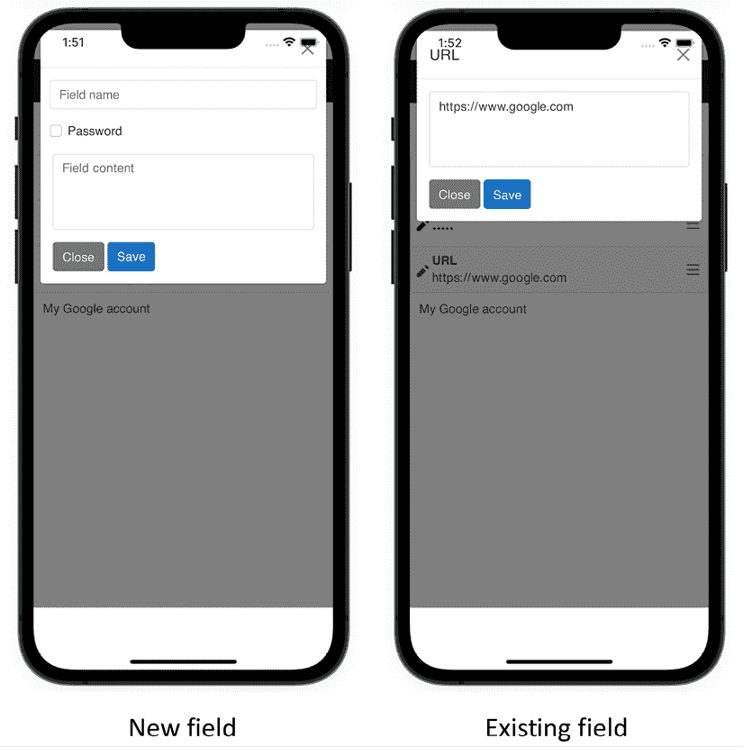

图 10.6：编辑字段

在 `EditorDialog` 组件中，当我们使用 `<input>` 和 `<textarea>` HTML 元素编辑键和值时，会显示初始值。这个初始值是从 Razor 组件设置到 DOM 的。一旦我们做出更改，数据就会从 DOM 流回 Razor 组件，这展示了双向数据绑定的例子。

## 双向数据绑定

可以使用 `@bind` Razor 指令属性来建立双向数据绑定。这种语法允许 HTML 元素属性绑定到一个字段、属性、表达式值或方法的结果。在 *清单 10.4* 中，`<input>` 元素的值绑定到了 `EditorDialog` 组件内的 `Key` 属性：

```swift
 <input type="text" class="form-control" id="keyField"
       @bind="Key" placeholder=@KeyPlaceHolder required> 
```

在双向数据绑定的情况下，每当 `Key` 属性发生变化时，DOM 元素 `<input>` 的值都会更新。同样，当用户在 DOM 中修改 `<input>` 的值时，`Key` 属性也会相应地更新。

在上一个示例中，我们有选择用两种单向数据绑定来替换 `@bind` 指令属性，如下面的代码所示：

```swift
<input type="text" class="form-control" id="keyField"
  value="@Key"
  @onchange="@((ChangeEventArgs e) => Key = e?.Value?
    .ToString())"
  placeholder=@KeyPlaceHolder required> 
```

当渲染 `EditorDialog` 组件时，`<input>` 元素的值是从 `Key` 属性派生出来的。当用户在文本框中输入值并改变元素焦点时，会触发 `onchange` 事件，随后用修改后的值更新 `Key` 属性。

对于 `<input>` 元素，`@bind` 指令属性的默认事件是 `onchange` 事件。我们可以使用 `@bind:event="{event}"` 属性来修改事件。`{event}` 占位符应代表一个 DOM 事件。例如，我们可以使用以下代码片段将 `onchange` 事件替换为 `oninput` 事件：

```swift
<input type="text" class="form-control" id="keyField"
  @bind="Key" @bind:event="oninput" placeholder=@KeyPlaceHolder required> 
```

### 绑定到组件参数

在前一个部分，我们探讨了 Razor 组件和 DOM 元素之间的双向数据绑定。由于 Razor 组件可以像 DOM 元素一样工作，因此也可以在两个 Razor 组件之间建立双向数据绑定。这通常发生在需要父组件和子组件之间进行通信的情况下。

我们可以使用`@bind-{PROPERTY}`语法将内部组件的组件参数绑定到外部组件的属性。在这种情况下，`{PROPERTY}`指的是要绑定的属性。我们已解释过，`@bind`指令属性可以被两个单向数据绑定设置替代，这涉及到将变量分配给`<input>`的值属性，并将事件处理程序分配给`onchange`事件。虽然编译器可以自动添加`@bind`的事件处理程序，但它不能为`@bind-{PROPERTY}`做同样的事情。因此，我们需要定义自己的`EventCallback<TValue>`类型的事件来与组件参数绑定。事件名称必须遵循`{PARAMETER NAME}Changed`格式。为了说明`@bind-{PROPERTY}`指令属性的使用，让我们以我们的`EditorDialog`组件为例。

在我们的代码中，我们在`ItemDetail`组件中使用`EditorDialog`来编辑字段，或者在`Items`组件中编辑项目。让我们以字段编辑为例进行考察：

```swift
<EditorDialog Id=@_dialogEditId
  @bind-Key="listGroupField.Key"                                   //(1)
  @bind-Value="listGroupField.Value"                               //(2)
  IsKeyEditingEnable=@_isNewField 
  OnSave="UpdateFieldAsync"
  KeyPlaceHolder="Field name" 
  ValuePlaceHolder="Field content">
  @if (_isNewField) {
    <div class="form-check">
      <input class="form-check-input" type="checkbox"
        @bind="listGroupField.IsProtected"
          id="flexCheckDefault">
      <label class="form-check-label"
        for="flexCheckDefault">
        Password
      </label>
    </div>
  }
</EditorDialog> 
```

在`ItemDetail`组件的前一个代码中，我们可以为`Key` **(1**) 和 `Value` **(2**) 创建与`Field`类型的`listGroupField`的数据绑定。我们需要在`EditorDialog`的 C#代码后部分实现`{PARAMETER NAME}Changed`事件，如下所示 *清单 10.5*：

```swift
namespace PassXYZ.BlazorUI;
public partial class EditorDialog {
  [Parameter]
  public string? Id { get; set; }
  bool _isKeyEditingEnable = false;
  [Parameter]
  public bool IsKeyEditingEnable ...
  [Parameter]
  public EventCallback<bool>? IsKeyEditingEnableChanged {
    get; set; }
  string _key = string.Empty;
  [Parameter]
  public string Key {                                               //(1)
    get => _key;
    set {
      if(_key != value) {
        _key = value;
        KeyChanged?.InvokeAsync(_key);                              //(3)
      }
    }
  }
  [Parameter]
  public EventCallback<string>? KeyChanged { get; set; }            //(2)
  [Parameter]
  public string? KeyPlaceHolder { get; set; }
  string _value = string.Empty;
  [Parameter]
  public string Value ...
  [Parameter]
  public EventCallback<string>? ValueChanged { get; set; }
  [Parameter]
  public string? ValuePlaceHolder { get; set; }
  [Parameter]
  public RenderFragment ChildContent { get; set; } =
    default!;
  [Parameter]
  public Action<string, string>? OnSave { get; set; }
  async Task<bool> OnSaveClicked() {
      OnSave?.Invoke(Key, Value);
      return true;
  }
} 
```

清单 10.5: `EditorDialog.razor.cs` ([`epa.ms/EditorDialog10-5`](https://epa.ms/EditorDialog10-5))

在 *清单 10.5* 中，我们利用`Key`属性作为示例来说明组件参数绑定过程。`Key`属性定义为具有`[Parameter]`属性的组件参数。相关的事件`KeyChanged`定义为`EventCallback<TValue>`类型。当用户修改文本输入并且元素焦点改变时，`Key`属性的 setter 被调用。在`Key`属性的 setter 中，触发`KeyChanged`事件，该事件通知外部的`ItemDetail`组件。因此，链接变量`listGroupField.Key`被更新。

## 与级联值和参数通信

我们可以利用数据绑定在父组件和子组件之间传递数据。当向中间子组件传递数据时，数据绑定非常有效。然而，可能存在需要将数据传递到位于几层深度的组件的情况。在这种情况下，利用数据绑定需要创建多个级别的链式数据绑定，随着链式级别的扩展，复杂性也随之增加。例如，当从`Items`传递数据到`ModalDialog`时，我们首先需要与`ConfirmDialog`建立数据绑定。然后，必须在`ConfirmDialog`和`ModalDialog`之间创建另一个级别的数据绑定。

在 `Items` 组件中，我们需要将对话框的 `Id` 传递给 `ModalDialog`。`Id` 是必要的，用于识别我们希望显示的特定对话框实例。如下所示，我们在 `Items` 组件中定义 `ConfirmDialog`。`Id` 在 `Items` 中定义，并通过组件参数传递给 `ConfirmDialog`：

```swift
<ConfirmDialog Id="@_dialogDeleteId" 
  Title=@listGroupItem.Name
  OnConfirmClick="DeleteItemAsync" /> 
```

然后，`ConfirmDialog` 必须将 `Id` 传递给 `ModalDialog`：

```swift
<ModalDialog Id=@Id Title=@($"Deleting {Title}")
  OnSaveAsync=@OnSave
  SaveButtonText="Confirm" CloseButtonText="Cancel">
  Please confirm to delete @Title?
</ModalDialog> 
```

在 `ModalDialog` 中，`Id` 被用作 `<div>` 元素的属性：

```swift
<div class="modal fade" id=@Id tabindex="-1"
  aria-labelledby="ModelLabel" aria-hidden="true"> ... 
```

为了防止多级数据绑定，我们可以使用级联值和参数作为技术，以促进通过组件层次结构的数据流。

`CascadingValue` 是 Blazor 框架中的一个组件。外部组件通过使用 `CascadingValue` 提供级联值，而内部组件可以通过使用 `[CascadingParameter]` 属性来获取它。为了演示其用法，我们可以修改 `Items` 组件的代码如下：

```swift
<CascadingValue Value="@_dialogDeleteId" Name="Id">
  <ConfirmDialog Title=@listGroupItem.Name
    OnConfirmClick="DeleteItemAsync" />
</CascadingValue> 
```

我们使用 `<CascadingValue>` 标签来使用级联值。在 `<CascadingValue>` 标签内，我们将 `_dialogDeleteId` 变量分配给 `Value` 属性，将 `Id` 字符串分配给 `Name` 属性。由于此 `Id` 并未直接由 `ConfirmDialog` 使用，因此可以安全地删除 `ConfirmDialog` 中的 `Id` 组件参数。

在 `ModalDialog` 中，我们通过使用 `[CascadingParameter]` 属性将 `Id` 属性修改为参数，而不是组件参数：

```swift
[CascadingParameter(Name = "Id")]
public string Id { get; set; } = default!; 
```

当只使用一个级联值时，指定其名称不是强制性的，因为编译器可以通过数据类型定位它。然而，为了防止歧义，我们可以使用 `Name` 属性给级联值赋予一个名称。接下来，我们将检查 `Items` 组件的最终修改，该组件为 `ConfirmDialog` 和 `EditorDialog` 都使用了级联值：

```swift
<CascadingValue Value="@_dialogEditId" Name="Id">
  <EditorDialog @bind-Key="listGroupItem.Name"
      @bind-Value="listGroupItem.Notes"
      IsKeyEditingEnable=true
      OnSave="UpdateItemAsync" KeyPlaceHolder="Item name"
      ValuePlaceHolder="Please provide a description">
    @if (_isNewItem) {
      <select @bind="newItem.SubType" class="form-select"
        aria-label="Group">
        <option selected value=@ItemSubType.Group>
          @ItemSubType.Group</option>
        <option value=@ItemSubType.Entry>
          @ItemSubType.Entry</option>
        <option value=@ItemSubType.PxEntry>
          @ItemSubType.PxEntry</option>
        <option value=@ItemSubType.Notes>
          @ItemSubType.Notes</option>
      </select>
    }
  </EditorDialog>
</CascadingValue>
<CascadingValue Value="@_dialogDeleteId" Name="Id">
  <ConfirmDialog Title=@listGroupItem.Name
    OnConfirmClick="DeleteItemAsync" />
</CascadingValue> 
```

如所示，在实现级联值之后，`ConfirmDialog` 和 `EditorDialog` 就不再需要直接处理 `Id` 字段。因此，与之前的版本相比，代码更加紧凑。

在本节中，我们探讨了可重用组件的创建。一些 Razor 组件可能依赖于数据或网络服务，在它们的创建或销毁过程中需要额外的步骤。我们可以将这些操作作为 Razor 组件生命周期管理的一部分来完成。

在下一节中，让我们更详细地考察 Razor 组件的生命周期。

# 理解 Razor 组件生命周期

Razor 组件，就像任何其他对象一样，具有生命周期。它由一系列同步和异步的生命周期方法组成，开发者可以重写这些方法以在组件初始化和渲染期间执行额外的操作。

请参阅 *图 10.7* 以了解 Razor 组件生命周期的概述：

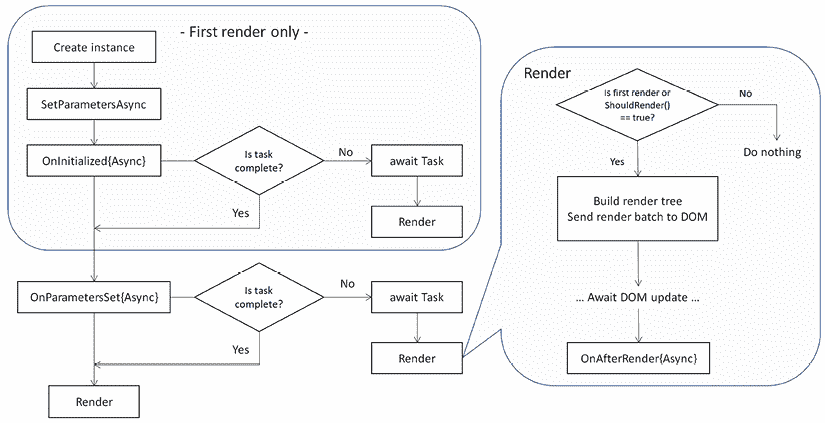

图 10.7：Razor 组件生命周期

在图 10.7 中，很明显，我们有能力在初始化和渲染阶段添加钩子。以下方法可以被重写以捕获初始化事件：

+   `SetParametersAsync`

+   `OnInitialized` 和 `OnInitializedAsync`

+   `OnParametersSet` 和 `OnParametersSetAsync`

`SetParametersAsync` 和 `OnInitializedAsync` 只在第一次渲染时被调用。`OnParametersSetAsync` 每次参数更改时都会被调用。

以下方法可以被重写以自定义渲染：

+   `ShouldRender`

+   `OnAfterRender` 和 `OnAfterRenderAsync`

我们将详细检查这些生命周期方法，并演示如何在我们的代码中利用它们。

## SetParametersAsync

`SetParametersAsync` 是对象创建后的第一个钩子，其签名如下：

```swift
public override Task SetParametersAsync(ParameterView parameters) 
```

`ParameterView` 参数包括组件参数或级联参数值。`SetParametersAsync` 方法通过 `[Parameter]` 或 `[CascadingParameter]` 属性将值分配给每个属性。此函数可以被重写以包含在设置参数之前必须执行的任何逻辑。`SetParametersAsync` 后续的钩子是 `OnInitializedAsync`。

## OnInitialized 和 OnInitializedAsync

`OnInitialized` 和 `OnInitializedAsync` 在组件初始化时被调用。它们的签名分别如下：

```swift
protected override void OnInitialized()
protected override async Task OnInitializedAsync() 
```

通过重写这两个函数，我们可以在这一阶段将逻辑集成到我们的组件中。然而，请注意，这些函数仅在组件创建后立即调用一次。对于资源密集型的初始化任务，可以使用异步方法，例如通过 RESTful API 调用下载数据。如图 10.7 所示，一旦异步方法完成，DOM 需要重新渲染。

## OnParametersSet 和 OnParametersSetAsync

当组件参数被设置或修改时，会调用 `OnParametersSet` 和 `OnParametersSetAsync`。我们注意到有两种版本以适应同步和异步场景。异步版本 `OnParametersSetAsync` 可以用于管理耗时任务。异步任务完成后，必须重新渲染 DOM 以显示任何更新。

这些方法的签名分别如下：

```swift
protected override void OnParametersSet()
protected override async Task OnParametersSetAsync() 
```

这两种方法在组件参数或级联参数更改时都会被调用，并且可能被多次调用。相比之下，`OnInitializedAsync` 只会被调用一次。

如图 10.7 所示，在初始化阶段，DOM 可能会进行多次渲染，从而导致异步调用的调用。涉及此渲染过程的方法包括 `ShouldRender` 和 `OnAfterRenderAsync`。

## ShouldRender

`ShouldRender`方法返回一个布尔值，指示组件是否应该被渲染。如图*图 10.7*所示，第一次渲染会忽略此方法。因此，组件至少需要渲染一次。此方法具有以下签名：

```swift
protected override bool ShouldRender() 
```

## OnAfterRender 和 OnAfterRenderAsync

`OnAfterRender`和`OnAfterRenderAsync`在组件完成其渲染过程后调用。它们的相应签名如下：

```swift
protected override void OnAfterRender(bool firstRender)
protected override async Task OnAfterRenderAsync(bool
  firstRender) 
```

这些方法可以用来执行与渲染内容相关的附加初始化任务，例如在组件中调用 JavaScript 代码。此方法具有一个布尔型`firstRender`参数，使我们能够仅附加一次 JavaScript 事件处理器。尽管此方法有一个异步版本，但在异步任务完成后，框架不会安排另一个渲染周期。

要检查生命周期方法的影响，我们可以通过将所有生命周期方法集成到`ConfirmDialog`组件中来进行测试，如下所示：

```swift
public ConfirmDialog()
{
  Debug.WriteLine($"ConfirmDialog-{Id}: is created");
}
public override Task SetParametersAsync
  (ParameterView parameters)
{
  Debug.WriteLine($"ConfirmDialog-{Id}:
    SetParametersAsync called");
  return base.SetParametersAsync(parameters);
}
protected override void OnInitialized()
  => Debug.WriteLine($"ConfirmDialog-{Id}: OnInitialized
    called - {Title}");
protected override async Task OnInitializedAsync() =>
  await Task.Run(() => {
  Debug.WriteLine($"ConfirmDialog-{Id}: OnInitializedAsync
    called - {Title}");
});
protected override void OnParametersSet()
  => Debug.WriteLine($"ConfirmDialog-{Id}: OnParametersSet
    called - {Title}");
protected override async Task OnParametersSetAsync() =>
  await Task.Run(() => {
Debug.WriteLine($"ConfirmDialog-{Id}:
  OnParametersSetAsync called - {Title}");
});
protected override void OnAfterRender(bool firstRender)
  => Debug.WriteLine($"ConfirmDialog-{Id}: OnAfterRender
    called with firstRender = {firstRender}");
protected override async Task OnAfterRenderAsync(bool
  firstRender) => await Task.Run(() => {
    Debug.WriteLine($"ConfirmDialog-{Id}:
      OnAfterRenderAsync called - {Title}");
});
protected override bool ShouldRender() {
  Debug.WriteLine($"ConfirmDialog-{Id}: ShouldRender called
    - {Title}");
  return true;
} 
```

我们已覆盖了`ConfirmDialog`中的所有生命周期方法，并添加了调试输出以显示进度。在启动我们的应用程序后，我们可以观察到以下输出：

```swift
ConfirmDialog-: is created
ConfirmDialog-: SetParametersAsync called
ConfirmDialog-deleteModel: OnInitialized called -
ConfirmDialog-deleteModel: OnInitializedAsync called -
ConfirmDialog-deleteModel: OnParametersSet called -
ConfirmDialog-deleteModel: OnParametersSetAsync called -
ConfirmDialog-deleteModel: ShouldRender called -
ConfirmDialog-deleteModel: ShouldRender called -
ConfirmDialog-deleteModel: OnAfterRender called with
  firstRender = True
ConfirmDialog-deleteModel: OnAfterRenderAsync called -
ConfirmDialog-deleteModel: OnAfterRender called with
  firstRender = False
ConfirmDialog-deleteModel: OnAfterRenderAsync called -
ConfirmDialog-deleteModel: OnAfterRender called with
  firstRender = False
ConfirmDialog-deleteModel: OnAfterRenderAsync called - 
```

当我们首次启动应用程序并且`Items`页面出现时，会显示之前的输出。我们可以观察到在调用`SetParametersAsync`方法之前，`Id`级联参数尚未设置。由于我们已覆盖了异步方法，因此同时安排了多个渲染周期。因此，由于并行渲染，`ShouldRender`和`OnAfterRenderAsync`方法被多次调用。

现在，让我们考虑另一种情况，即当我们点击`Items`页面上的上下文菜单时发生的情况。点击项目上下文菜单（例如 Google 图标）时，`ConfirmDialog`将再次初始化。结果输出如下：

```swift
ConfirmDialog-deleteModel: SetParametersAsync called
ConfirmDialog-deleteModel: OnParametersSet called - Google
ConfirmDialog-deleteModel: ShouldRender called - Google
ConfirmDialog-deleteModel: OnParametersSetAsync called –
  Google
ConfirmDialog-deleteModel: ShouldRender called - Google
ConfirmDialog-deleteModel: OnAfterRender called with
  firstRender = False
ConfirmDialog-deleteModel: OnAfterRenderAsync called –
  Google
ConfirmDialog-deleteModel: OnAfterRender called with
  firstRender = False
ConfirmDialog-deleteModel: OnAfterRenderAsync called –
  Google 
```

由于`Title`组件参数已更改，因此再次调用了`SetParametersAsync`方法。在后续调用中，我们可以观察到`Title`组件参数被设置为`Google`。

在我们的代码中，我们使用`OnParametersSet`在`Items.razor.cs`中加载项目列表，以及在`ItemDetail.razor.cs`中加载字段列表。让我们检查`ItemDetail.razor.cs`中的`OnParametersSet`：

```swift
protected override void OnParametersSet() {
  base.OnParametersSet();
  if (SelectedItemId == null) {                                     //(1)
    throw new InvalidOperationException(
    "ItemDetail: SelectedItemId is null");
  }
  selectedItem = DataStore.GetItem(SelectedItemId, true);           //(2)
  if (selectedItem == null) {
    throw new InvalidOperationException(
  "ItemDetail: entry cannot be found with SelectedItemId");
  }
  else {
    if (selectedItem.IsGroup) {
      throw new InvalidOperationException(
        "ItemDetail: SelectedItemId should not be a group
          here.");
    }
    fields.Clear();
    List<Field> tmpFields = selectedItem.GetFields();               //(3)
    foreach (Field field in tmpFields) {
      fields.Add(field);
    }
    notes = selectedItem.GetNotesInHtml();
  }
} 
```

**(1)** 在`OnParametersSet`中，我们检查`SelectedItemId`组件参数是否为`null`。这代表所选项目的`ID`。**(2)** 如果它不是`null`，我们可以通过调用名为`GetItem`的`IDataStore`方法来定位项目。**(3)** 一旦我们获得了所选项目的实例，我们可以通过调用`GetFields`方法来检索字段列表。

`Items.razor.cs`中`OnParametersSet`的实现与此非常相似。有关更多详细信息，您可以参考以下 GitHub 链接：[`epa.ms/Items10-6`](https://epa.ms/Items10-6)。

到目前为止，我们已经开发了一个几乎完整的密码管理器应用程序，其 UI 使用 Blazor 构建。我们已经建立了可重用的模态对话框组件来适应上下文菜单，使我们能够执行 CRUD 操作。我们需要解决的最后一个组件是实现这些 CRUD 操作的实际实现。

# 实现 CRUD 操作

在前几节中讨论了为 CRUD 操作准备模态对话框之后，我们现在可以继续在本节中实现这些 CRUD 操作。

## 项目的 CRUD 操作

要添加或更新项目，我们可以利用`Items.razor.cs`中的`UpdateItemAsync`方法来适应这两种情况。为了区分创建新项目和更新现有项目，我们定义了一个私有`_isNewItem`字段，如下所示：

```swift
 bool _isNewItem = false; 
```

接下来，我们将看到如何添加或编辑项目。

### 添加新项目

要添加新项目，只需点击`Items`页面标题栏中的`+`按钮，如*图 10.8*所示：

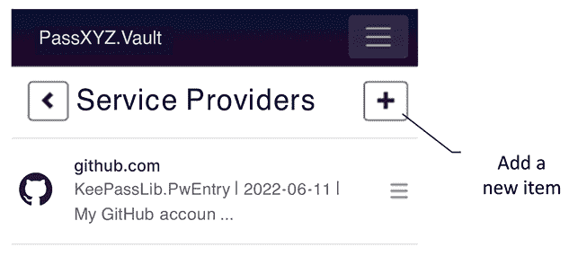

图 10.8：添加新项目

可以在这里查看此页眉的 Razor 标记：

```swift
<div class="container"><div class="row">
  <div class="col-12"><h1>
    @if (selectedItem?.GetParentLink() != null) {
      <a class="btn btn-outline-dark"
        href="@selectedItem?.GetParentLink()">
        <span class="oi oi-chevron-left"
          aria-hidden="true"></span></a>                           //(1)
    }
    @(" " + Title)                                                 //(2)
<button type="button"
  class="btn btn-outline-dark float-end"
      data-bs-toggle="modal"
      data-bs-target="#@_dialogEditId"
      @onclick="@(() => _isNewItem=true)">
      <span class="oi oi-plus" aria-hidden="true">
    </span></button>                                               //(3)
  </h1></div>
</div></div> 
```

页眉部分包括`Back`按钮**（1**），`Title`**（2**）和`Add`按钮**（3**）。`Back`按钮仅在存在父链接时显示。

点击`Add`按钮后，将显示一个具有在`_dialogEditId`变量中定义的`Id`的模态对话框。`onclick`事件处理器将`_isNewItem`设置为`true`，使得模态对话框事件处理器能够识别该操作是添加新项目。

### 编辑或删除项目

要编辑或删除一个项目，请点击项目上的上下文菜单，如*图 10.9*所示：

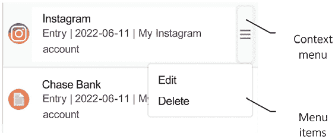

图 10.9：编辑或删除项目

点击上下文菜单按钮后，将显示一个菜单项列表。让我们检查`Items.razor`中找到的上下文菜单的标记：

```swift
<div class="list-group">
  @foreach (var item in items) {
<div class="dropdown list-group-item list-group-item-action
  d-flex gap-1 py-2" aria-current="true">
      
      <a href="@item.GetActionLink()" class="..."> ...
      <button class="opacity-50 btn btn-light
          dropdown-toggle" type="button"
            id="itemsContextMenu"
          data-bs-toggle="dropdown" aria-expanded="false"
          @onclick="@(() => listGroupItem=item)">                  //(1)
        <span class="oi oi-menu" aria-hidden="true"></span>
      </button>
      <ul class="dropdown-menu" aria-labelledby=
        "itemsContextMenu">
        <li><button class="dropdown-item"
          data-bs-toggle="modal"
              data-bs-target="#@_dialogEditId"
              @onclick="@(() => _isNewItem=false)">                //(2)
              Edit</button></li>
        <li><button class="dropdown-item"
          data-bs-toggle="modal"
              data-bs-target="#@_dialogDeleteId">                  //(3)
              Delete</button></li>
      </ul>
    </div>
  }
</div> 
```

在前面的标记代码中，定义了一个上下文菜单按钮**（1**）。点击此按钮后，将显示两个菜单项，`Edit`**（2**）和`Delete`**（3**）。由于上下文菜单标记代码在`foreach`循环中运行，我们需要获取要编辑或删除的项目的引用。在 C#代码后逻辑中，使用`listGroupItem`变量来引用所选项目。

我们可以通过上下文菜单按钮的`onclick`事件处理器来捕获这个引用。

在选择`Edit`菜单项时，将`_isNewItem`变量设置为`false`至关重要。这种调整使得模态对话框的事件处理器能够识别我们正在修改现有项目。

在完成所有之前的设置后，现在是时候检查模态对话框中的事件处理器了。首先，让我们看看`Items.razor.cs`中的`UpdateItemAsync`事件处理器：

```swift
private async void UpdateItemAsync(string key, string value) {
  if (listGroupItem == null) { return; }
  if (string.IsNullOrEmpty(key) || string.IsNullOrEmpty(value))
  { return; }
  listGroupItem.Name = key;
  listGroupItem.Notes = value;
  if (_isNewItem) {                                               //(1)
      // Add new item
    if (listGroupItem is NewItem aNewItem) {
      Item? newItem = DataStore.CreateNewItem
        (aNewItem.SubType);
      if (newItem != null) {
        newItem.Name = aNewItem.Name;
        newItem.Notes = aNewItem.Notes;
        items.Add(newItem);
        await DataStore.AddItemAsync(newItem);
      }
    }
  }
  else {
    // Update the current item
    await DataStore.UpdateItemAsync(listGroupItem);
  }
} 
```

`UpdateItemAsync` 事件处理器可以管理添加和编辑项的操作。它检查 `_isNewItem` 变量 **(1)** 以确定我们是要添加还是编辑项。随后，它调用 `IDataStore` 方法来执行添加或更新操作。

现在，让我们检查删除项的事件处理器：

```swift
private async void DeleteItemAsync() {
  if (listGroupItem == null) return;
  if (items.Remove(listGroupItem)) {
      _ = await DataStore.DeleteItemAsync
         (listGroupItem.Id);
  }
} 
```

在 `DeleteItemAsync` 事件处理器中，项只是从列表中移除，并调用 `IDataStore` 方法来执行删除操作。

## 字段的 CRUD 操作

字段的 CRUD 操作与我们在项中实现的操作相似。要添加或更新字段，我们可以使用 `ItemDetail.razor.cs` 中的 `UpdateFieldAsync` 方法来管理这两种情况。为了确定我们是要创建新字段还是更新现有字段，我们定义一个私有 `_isNewField` 字段如下：

```swift
 bool _isNewField = false; 
```

CRUD 操作的 UI 与我们在上一节中讨论的内容相似。要查看 `添加` 按钮和上下文菜单项，请参阅 *图 10.10*。

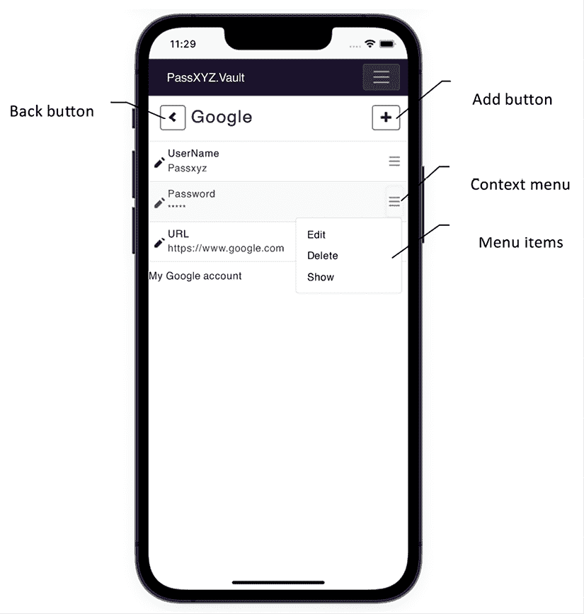

图 10.10：添加、编辑或删除字段

我们可以按照以下方式检查 `ItemDetail.razor` 中页面标题的 Razor 标记代码：

```swift
<div class="container">
  <div class="row"><div class="col-12">
    <h1>
      @if (selectedItem?.GetParentLink() != null) {
        <a class="btn btn-outline-dark"
          href="@selectedItem?.GetParentLink()">
        <span class="oi oi-chevron-left"
          aria-hidden="true"></span></a>
      }
      @(" " + selectedItem!.Name)
      <button type="button" class="btn btn-outline-dark
        float-end"
        data-bs-toggle="modal" data-bs-
          target="#@_dialogEditId"
        @onclick="@(() => _isNewField=true)">
          <span class="oi oi-plus"
            aria-hidden="true"></span></button>
    </h1>
  </div></div>
</div> 
```

如我们所观察到的，上述源代码与 `Items.razor` 中的源代码非常相似，只是将 `_isNewItem` 变量替换为 `_isNewField`。我们可以考虑稍后将其页面标题精炼成一个可重用的组件。

与上一节类似，现在让我们检查列表组和上下文菜单的源代码：

```swift
<div class="list-group">
  @foreach (var field in fields) {
    @if(field.ShowContextAction == null) {
      <div class="dropdown list-group-item ...
        aria-current="true">
        <span class="oi oi-pencil" aria-hidden="true">
         </span>
        <div class="d-flex gap-2 w-100
          justify-content-between"> ...
        <button class="opacity-50 btn btn-light
          dropdown-toggle" type="button"
          id="itemDetailContextMenu"
          data-bs-toggle="dropdown" aria-expanded="false"
          @onclick="@(() => listGroupField=field)">                //(1)
            <span class="oi oi-menu" aria-hidden="true">
            </span>
        </button>
        <ul class="dropdown-menu"
          aria-labelledby="itemDetailContextMenu">
          <li><button class="dropdown-item"
            data-bs-toggle="modal"
            data-bs-target="#@_dialogEditId"
            @onclick="@(() => _isNewField=false)">                 //(2)
                Edit
          </button></li>
          <li><button class="dropdown-item"
            data-bs-toggle="modal"
            data-bs-target="#@_dialogDeleteId">                    //(3)
                Delete
          </button></li>
          @if (field.IsProtected) {
            <li><button class="dropdown-item"
              @onclick="OnToggleShowPassword">                     //(4)
                @if (field.IsHide) { <span>Show</span> }
                else { <span>Hide</span> }
            </button></li>
          }
        </ul>
      </div>
    }
  }
</div> 
```

上述 `ItemDetail.razor` 的源代码具有一个上下文 **菜单** 按钮 **(1)** 和用于 **添加** **(2)**、**编辑** **(3)** 和 **显示** **(4)** 菜单项的三个按钮。你可能已经注意到，源代码与 `Items.razor` 中的源代码相当相似，包括一个列表组和上下文菜单。

我们将在本章后面进一步将其开发成一个可重用的组件。上下文菜单的变化在于添加了一个显示或隐藏字段的菜单项，如果它是像密码这样的受保护字段。我们利用 `onclick` 事件处理器 `OnToggleShowPassword` 来设置 `IsHide` 字段属性，从而切换密码字段的可见性。

最后，让我们来检查 `ItemDetail.razor.cs` 中模态对话框的事件处理器：

```swift
private async void UpdateFieldAsync(string key, string
  value) {
  if (selectedItem == null || listGroupField == null) {
      throw new NullReferenceException("Selected item is
        null");
  }
  if (string.IsNullOrEmpty(key) ||
      string.IsNullOrEmpty(value)) { return; }
  listGroupField.Key = key;
  listGroupField.Value = value;
  if (_isNewField) {
    // Add a new field
    Field newField = selectedItem.AddField
      (listGroupField.Key,
      ((listGroupField.IsProtected) ?
        listGroupField.EditValue : listGroupField.Value),
          listGroupField.IsProtected);
    fields.Add(newField);
  }
  else {
    // Update the current field
    var newData = (listGroupField.IsProtected) ?
      listGroupField.EditValue : listGroupField.Value;
    selectedItem.UpdateField(listGroupField.Key, newData, 
      listGroupField.IsProtected);
  }
  await DataStore.UpdateItemAsync(selectedItem);
} 
```

`UpdateFieldAsync` 事件处理器管理字段的添加和编辑。它接收两个参数 – `key` 和 `value` – 这些参数从模态对话框传递过来，并用于设置 `listGroupField` 的字段。通过检查 `_isNewField` 变量，处理器确定意图是添加还是编辑字段。随后，它调用 `IDataStore` 方法来执行添加或更新操作。

要删除字段，下面的 `DeleteFieldAsync` 事件处理器被触发：

```swift
private async void DeleteFieldAsync() {
  if (listGroupField == null || selectedItem == null) {
    throw new NullReferenceException(
      "Selected item or field is null");
  }
  listGroupField.ShowContextAction = listGroupField;
  selectedItem.DeleteField(listGroupField);
  await DataStore.UpdateItemAsync(selectedItem);
} 
```

在 `DeleteFieldAsync` 事件处理器中，我们只需从所选项中删除字段，并调用 `IDataStore` 方法来更新数据库。

在实现了 CRUD 操作后，我们现在已经成功完成了密码管理器功能的实现。我们利用 Blazor UI 开发了一个新的密码管理器应用程序。与本书*第一部分*中描述的版本相比，本版本的差异在于我们使用 Blazor 构建所有用户界面。Blazor UI 的外观和功能与 Web 应用程序相似，而 XAML UI 则保留了原生应用程序的特性。

尽管我们已经成功实现了所有必需的功能，但我们可以在当前实现中观察到一些重复的代码。为了解决这个问题，我们可以重构我们的代码，将重复的部分转换为 Razor 组件。

# 重构 Razor 组件

在当前实现中，我们可以观察到大部分重复的代码都出现在`Items`和`ItemDetail`页面中。在本章的剩余部分，我们将将这些重复的代码转换为 Razor 组件。

我们将创建以下组件：

+   `Navbar`：此组件显示导航栏。

+   `Dropdown`：此组件支持上下文菜单。

+   `ListView`：此组件显示项目列表。

`ListView`组件是最复杂的，所以我们将在本节末尾处理它。现在，让我们首先关注`Navbar`和`Dropdown`组件。

## 创建 Navbar 组件

让我们检查*图 10.11*中的导航栏 UI。我们可以观察到导航栏具有一个**Back**按钮、一个**Title**和一个**Add**按钮：

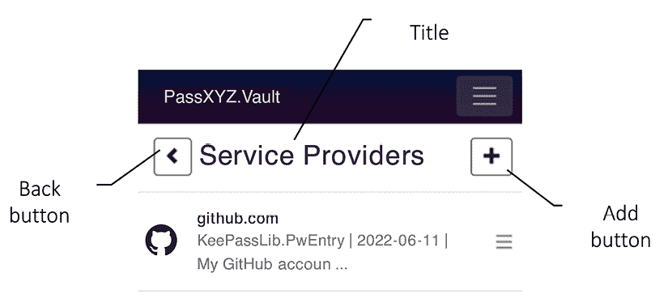

图 10.11：导航栏

```swift
Items and ItemDetail pages, resulting in a duplication:
```

```swift
<div class="container">
  <div class="row">
    <div class="col-12">
      <h1>
        @if (selectedItem?.GetParentLink() != null) {             //(1)
          <a class="btn btn-outline-dark"
            href="@selectedItem?.GetParentLink()">
            <span class="oi oi-chevron-left"
              aria-hidden="true"></span></a>                      //(2)
        }
        @(" " + Title)                                            //(3)
        <button type="button"
          class="btn btn-outline-dark float-end"
          data-bs-toggle="modal"
          data-bs-target="#@_dialogEditId"
          @onclick="@(() => _isNewItem=true)">                    //(4)
          <span class="oi oi-plus" aria-hidden="true">
          </span>
        </button>
      </h1>
    </div>
  </div>
</div> 
```

在前面的代码中，**(1)** 当存在父级链接时，会显示`Back`按钮。**(2)** `Back`按钮是通过一个`<a>`标签实现的。**(3)** `Title`作为一个字符串，出现在`<h1>`标签内。**(4)** `Add`按钮是通过一个`<button>`标签实现的。`Back`和`Add`按钮的样式都采用了 Bootstrap 格式化。

为了将前面的代码转换为 Razor 组件，我们可以在`PassXYZ.BlazorUI`项目中生成一个新的 Razor 组件，并将其命名为`Navbar`。`Navbar`组件将显示*图 10.11*中所示的用户界面元素，包括一个`Back`按钮、一个标题和一个`Add`按钮。为了分离 UI 和逻辑，我们将创建一个`Navbar.razor.cs` C#代码后文件和一个 Razor 标记文件，`Navbar.razor`。我们将在 C#代码后文件中定义组件参数和事件处理器，如*列表 10.6*所示：

```swift
public partial class Navbar
{
  [Parameter]
  public string? ParentLink { get; set; }                         //(1)
  [Parameter]
  public string? DialogId { get; set; }                           //(2)
  [Parameter]
  public string? Title { get; set; }                              //(3)
  [Parameter]
  public EventCallback<MouseEventArgs> OnAddClick { get;
  set; }                                                          //(4)
  private void OnClickClose(MouseEventArgs e) {
      OnAddClick.InvokeAsync();
  }
} 
```

列表 10.6：`Navbar.razor.cs` ([`epa.ms/Navbar10-7`](https://epa.ms/Navbar10-7))

在`Navbar`中，定义了四个组件参数和一个事件处理器。我们可以使用`ParentLink`参数 **(1)** 为`Back`按钮分配父链接。`Title`的值根据`Title`参数 **(3)** 设置。对于`Add`按钮，需要提供一个`Id`和对话框的事件处理器；因此，使用了`DialogId` **(2)** 和`OnAddClick` **(4)** 参数。

现在，让我们检查`Navbar`的 Razor 文件，它展示在*Listing 10.7*中：

```swift
@namespace PassXYZ.BlazorUI
<div class="container">
  <div class="row">
    <div class="col-12">
      <h1>
        @if (ParentLink != null) {                                //(1)
          <a class="btn btn-outline-dark"
            href="@ParentLink">                                   //(1)
            <span class="oi oi-chevron-left"
              aria-hidden="true"></span>
          </a>
        }
        @(" " + Title)                                            //(3)
        <button type="button"
          class="btn btn-outline-dark float-end"
          data-bs-toggle="modal"
          data-bs-target="#@DialogId"                             //(2)
          @onclick="OnClickClose">                                //(4)
          <span class="oi oi-plus" aria-hidden="true">
          </span>
        </button>
      </h1>
    </div>
  </div>
</div> 
```

列表 10.7: `Navbar.razor` ([`epa.ms/Navbar10-8`](https://epa.ms/Navbar10-8))

我们可以观察到代码与`Items`和`ItemDetail`中使用的代码非常相似。关键的区别在于，我们将硬编码的值替换为组件参数（`ParentLink` **(1)**，`DialogId` **(2)**，`Title` **(3)**，和`OnClickClose` **(4)**）。通过整合这个新的`Navbar`组件，我们可以通过使用`Navbar`组件来修改`Items`中的代码，如下所示：

```swift
<Navbar ParentLink="@selectedItem?.GetParentLink()"
  Title="@Title" DialogId="@_dialogEditId"
  OnAddClick="@(() => {_isNewItem=true;})" /> 
```

然后，我们可以按照以下方式替换`ItemDetail`中的代码：

```swift
<Navbar ParentLink="@selectedItem?.GetParentLink()"
  Title="@selectedItem?.Name" DialogId="@_dialogEditId"
  OnAddClick="@(() => {_isNewField=true;})" /> 
```

如观察到的，我们通过消除重复来简化了代码，从而实现了更优雅和简洁的展示。

完成了`Navbar`的工作后，我们现在将注意力转向`Dropdown`组件。

## 创建上下文菜单的 Dropdown 组件

要开发一个类似于上下文菜单的组件，我们可以重用 Bootstrap 的`Dropdown`组件。如图 10.12 所示，上下文菜单包括一个上下文菜单按钮和一系列菜单项。点击上下文菜单按钮后，用户将看到菜单项的显示。

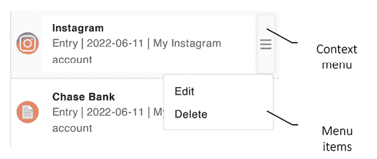

图 10.12: 上下文菜单

当前上下文菜单的代码在`Items`和`ItemDetail`页面中都有复制，如下所示：

```swift
<button class="opacity-50 btn btn-light dropdown-toggle"
  type="button" id="itemsContextMenu"
  data-bs-toggle="dropdown"
  aria-expanded="false"
  @onclick="@(() => listGroupItem=item)">
    <span class="oi oi-menu" aria-hidden="true"></span>
</button>
<ul class="dropdown-menu"
  aria-labelledby="itemsContextMenu">
  <li><button class="dropdown-item" data-bs-toggle="modal"
        data-bs-target="#@_dialogEditId"
        @onclick="@(() => _isNewItem=false)">
        Edit
  </button></li>
  <li><button class="dropdown-item" data-bs-toggle="modal"
        data-bs-target="#@_dialogDeleteId">
      Delete
  </button></li>
</ul> 
```

Bootstrap 的`Dropdown`组件包括一个按钮和无序列表。我们必须为按钮定义一个事件处理器以执行必要的操作。在前面的代码中，我们将`item`变量设置为`listGroupItem`。关于菜单项，每个都实现为一个`<button>`标签，并接受一个对话框 ID 和事件处理器作为参数。当点击菜单项时，将显示相应的模态对话框。

我们可以在`PassXYZ.BlazorUI`项目中创建两个新的 Razor 组件，分别命名为`Dropdown`和`MenuItem`。为了分离 UI 和逻辑，我们可以在 C#代码后文件（*Listing 10.9*）和 Razor 文件（*Listing 10.8*）中实现它们，我们现在将演示这些。

让我们先检查列表 10.8 中的`Dropdown`组件 UI：

```swift
@namespace PassXYZ.BlazorUI
<button class="opacity-50 btn btn-light dropdown-toggle"
  type="button" id="itemDetailContextMenu"
  data-bs-toggle="dropdown"
  aria-expanded="false" @onclick="OnClick">
  <span class="oi oi-menu" aria-hidden="true"></span>
</button>                                                         //(1)
<ul class="dropdown-menu"
  aria-labelledby="itemDetailContextMenu">
  @ChildContent
</ul>                                                            //(2) 
```

列表 10.8: `Dropdown.razor` ([`epa.ms/Dropdown10-9`](https://epa.ms/Dropdown10-9))

在 `Dropdown` 组件中，我们定义了一个按钮 **(1)** 和一个无序列表 **(2)**。按钮的点击事件被设置为 `OnClick` 事件处理器。无序列表中的项作为 `Dropdown` 组件的子内容出现。组件参数可以在 C# 的 `Dropdown.razor.cs` 代码隐藏文件中找到，如 *列表 10.9* 所示：

```swift
namespace PassXYZ.BlazorUI;
public partial class Dropdown
{
  [Parameter]
  public EventCallback<MouseEventArgs> OnClick {get;set;}        //(1)
  [Parameter]
  public RenderFragment ChildContent { get; set; }               //(2)
} 
```

列表 10.9: `Dropdown.razor.cs` ([`epa.ms/Dropdown10-10`](https://epa.ms/Dropdown10-10))

在 `Dropdown.razor.cs` 中，定义了两个组件参数 `OnClick` **(1)** 和 `ChildContent` **(2)**。`MenuItem` 组件可以作为 `Dropdown` 组件的子内容。`MenuItem` 的 UI 代码可以在 *列表 10.10* 中查看：

```swift
@namespace PassXYZ.BlazorUI
<li>
  <button class="dropdown-item" data-bs-toggle="modal"
    data-bs-target="#@Id" @onclick="OnClick">
    @ChildContent
  </button>
</li> 
```

列表 10.10: `MenuItem.razor` ([`epa.ms/MenuItem10-11`](https://epa.ms/MenuItem10-11))

`MenuItem` 组件指定了三个组件参数：`Id`、`OnClick` 和 `ChildContent`。这些参数在 `MenuItem.razor.cs` 中定义，如 *列表 10.11* 所示：

```swift
namespace PassXYZ.BlazorUI;
public partial class MenuItem
{
  [Parameter]
  public string? Id { get; set; }                                  //(1)
  [Parameter]
  public EventCallback<MouseEventArgs> OnClick {get; set;}         //(2)
  [Parameter]
  public RenderFragment ChildContent { get; set; }                 //(3)
} 
```

列表 10.11: `MenuItem.razor.cs` ([`epa.ms/MenuItem10-12`](https://epa.ms/MenuItem10-12))

**(1)** `Id` 参数用于指定当菜单项被点击时的对话框 ID。**(2)** `OnClick` 用于为按钮点击事件注册事件处理器。**(3)** `ChildContent` 用于显示子内容，例如菜单项的名称。

我们已经成功实现了上下文菜单的组件。现在，我们可以用这些上下文菜单组件替换 `Items` 和 `ItemDetail` 页面中的冗余代码。在 `Items` 页面上实现上下文菜单的步骤如下：

```swift
<Dropdown OnClick="@(() => currentItem.Data=listGroupItem=item)">
  <MenuItem Id="@_dialogEditId"
    OnClick="@(() => _isNewItem=false)">Edit</MenuItem>
  <MenuItem Id="@_dialogDeleteId">Delete</MenuItem>
</Dropdown> 
```

在 `ItemDetail` 页面上，上下文菜单的实现方式如下：

```swift
<Dropdown OnClick="@(() = >
  {currentField.Data=listGroupField=field;})">
  <MenuItem Id="@_dialogEditId"
    OnClick="@(() => _isNewField=false)">Edit</MenuItem>
  <MenuItem Id="@_dialogDeleteId">Delete</MenuItem>
  @if (field.IsProtected) {
    <MenuItem OnClick="OnToggleShowPassword">
      @(field.IsHide ? "Show":"Hide")
    </MenuItem>
  }
</Dropdown> 
```

在对 `Items` 和 `ItemDetail` 页面的代码进行精炼后，我们实现了模态对话框、导航栏和上下文菜单组件。因此，代码看起来更加优雅和简洁。尽管如此，仍有进一步优化的空间。在 `Items` 和 `ItemDetail` 页面中，主要的 UI 逻辑都围绕列表视图展开。我们可以通过实现 `ListView` 组件来优化这部分代码。为了创建 `ListView` 组件，我们需要利用一个称为模板组件的高级功能。

# 使用模板组件

在构建 Razor 组件时，组件参数是父组件和子组件之间的通信渠道。在讨论嵌套组件时，我们提到了一个特殊的 `ChildContent` 组件参数，其类型为 `RenderFragment`。该参数允许父组件设置子组件的内容。例如，以下代码中 `MenuItem` 的内容可以分配一个 HTML 字符串：

```swift
<MenuItem Id="@_dialogDeleteId">
  <strong>Delete</strong>
</MenuItem> 
```

我们可以通过 `MenuItem` 定义的以下组件参数来实现这一点，如 *列表 10.11* 所示：

```swift
[Parameter]
public RenderFragment ChildContent { get; set; } 
```

如果我们想显式指定 `ChildContent` 参数，可以按照以下方式实现：

```swift
<MenuItem Id="@_dialogDeleteId">
  <ChildContent>
    <strong>Delete</strong>
  </ChildContent>
</MenuItem> 
```

`ChildContent`是一个独特的组件参数，可以在标记语言中隐式使用。要使用`ChildContent`，我们需要创建一个能够接受`RenderFragment`类型 UI 模板作为其参数的组件。此外，我们可以在开发新组件时定义多个 UI 模板作为参数。这种类型的组件被称为模板组件。

一个`RenderFragment`类型的渲染片段表示为渲染而指定的 UI 的一部分。此外，还有一个泛型版本，`RenderFragment<TValue>`，它接受一个类型参数。在调用`RenderFragment`时可以提供一个特定类型。

## 创建 ListView 组件

要创建`ListView`，我们需要使用多个 UI 模板作为组件参数。我们可以在`PassXYZ.BlazorUI`项目中创建一个新的 Razor 组件，并将其命名为`ListView`。类似于我们对`Navbar`和上下文菜单所做的那样，我们可以将 UI 和代码分离到 Razor 文件(*列表 10.12*)和 C#代码后文件(*列表 10.13*)中：

```swift
@namespace PassXYZ.BlazorUI
@typeparam TItem
<div class="list-group">
  @if (Header != null) {
      @Header                                                     //(1)
  }
  @if (Row != null && Items != null) {
    @foreach (var item in Items) {
      <div class="dropdown list-group-item
        list-group-item-action
        d-flex gap-1 py-2" style="border: none"
        aria-current="true">
          @Row.Invoke(item)                                       //(2)
      </div>
    }
  }
  @if (Footer != null) {
      <div class="container">
        <article>@Footer</article>
      </div>                                                      //(3)
  }
</div> 
```

列表 10.12: `ListView.razor` ([`epa.ms/ListView10-13`](https://epa.ms/ListView10-13))

在`ListView`Razor 文件中，我们定义了三个 UI 模板，`Header` **(1)**、`Row` **(2)** 和 `Footer` **(3)**。我们像`ChildContent`一样渲染`Header`和`Footer`，但`Row`组件参数看起来是不同的。`Row`组件的渲染过程如下：

```swift
@Row(item) 
```

或者，我们可以这样渲染：

```swift
@Row.Invoke(item) 
```

我们使用`item`参数来渲染它。`Row`的类型是`RenderFragment<TValue>`，正如我们在*列表 10.13*中展示的那样：

```swift
namespace PassXYZ.BlazorUI;
public partial class ListView<TItem>
{
  [Parameter]
  public RenderFragment? Header { get; set; }                    //(1)
  [Parameter]
  public RenderFragment<TItem>? Row { get; set; }                //(2)
  [Parameter]
  public IEnumerable<TItem>? Items { get; set; }                 //(3)
  [Parameter]
  public RenderFragment? Footer { get; set; }                    //(4)
} 
```

列表 10.13: `ListView.razor.cs` ([`epa.ms/ListView10-14`](https://epa.ms/ListView10-14))

我们将`ListView`定义为具有`TItem`类型参数的泛型`ListView<TItem>`类型。在`ListView`组件中，我们可以使用`Header` **(1)** 参数指定列表视图的标题，使用`Footer` **(4)** 参数指定页脚。`ListView`可以通过`Items`参数 **(3)** 绑定到任何`IEnumerable<TItem>`类型的数据集合。`Row` **(2)** 参数可以用来为`foreach`循环中的单个项目建立 UI 模板。

## 使用 ListView 组件

到目前为止，让我们来检查`Items`和`ItemDetail`页面中`ListView`组件的使用情况。我们将以`ItemDetail`页面作为我们讨论的例子：

```swift
<ListView Items="fields">                                        //(1)
  <Row Context="field">                                          //(2)
    @if (field.ShowContextAction == null) {
      <span class="oi oi-pencil" aria-hidden="true"></span>
      <div class="d-flex gap-2 w-100
        justify-content-between">
        <div>
          <h6 class="mb-0">@field.Key</h6>
          <p class="mb-0">@field.Value</p>
        </div>
      </div>
      <Dropdown
       OnClick="@(() =>
       {currentField.Data=listGroupField=field;})">
         <MenuItem Id="@_dialogEditId"
           OnClick="@(() => _isNewField=false)">
           Edit
         </MenuItem>
         <MenuItem Id="@_dialogDeleteId">Delete</MenuItem>
        @if (field.IsProtected) {
          <MenuItem OnClick="OnToggleShowPassword">
            @(field.IsHide ? "Show":"Hide")
          </MenuItem>
        }
      </Dropdown>
    }
  </Row>
  <Footer>
    @((MarkupString)notes)
  </Footer>
</ListView> 
```

由于我们已经将`Header`、`Row`和`Footer`定义为可选参数，因此没有必要指定所有这些参数。在`ItemDetail`页面中，我们使用`Row`和`Footer`。**(1)** 首先，我们需要将字段列表传递给`Items`参数。**(2)** 在`foreach`循环中，每个字段都被传递给`ListView`作为`Row`的参数，`Row`的定义如下：

```swift
<Row Context="field"> 
```

`Context`属性的`"field"`值被用来指定`Row`的参数。在`Row`的 UI 模板中，我们展示了`field`的关键值，并使用`Dropdown`和`MenuItem`组件创建了一个上下文菜单，这些组件在上一节中已实现。

通过使用`ListView`组件，我们显著提升了`ItemDetail`页面的实现。这一改进是通过创建我们自己的 Razor 组件来实现的。

完成代码重构后，我们完成了`.NET MAUI Blazor Hybrid`应用的引入。在第二部分中，我们使用 Blazor 重新创建了我们的应用，同时保持了相同的功能。

如果你有过 Blazor Web 应用开发的经验，你可能不会在 Blazor Hybrid 应用和 Blazor Web 应用之间看到太大的差异。这正是 Blazor Hybrid 应用的优点。你现在可能想知道，我们如何在 Blazor Hybrid 应用中访问原生 API？让我们在下一节中简要概述。

# 从 Blazor Hybrid 应用访问原生 API

当涉及到访问原生 API 时，.NET MAUI 应用和 Blazor Hybrid 应用之间没有显著差异。正如我们在*第七章*中学习的*使用平台特定功能*，始终创建一个封装平台层原生访问的抽象层是至关重要的。因此，我们在.NET MAUI 或 Blazor Hybrid 应用中不会直接从跨平台代码中访问原生 API。在我们的应用中，虽然我们需要访问原生 API，但我们将通过一个抽象层来访问原生 API。

从.NET 访问平台 API 随着时间的推移经历了显著的发展，从 Xamarin 插件过渡到 Xamarin.Essentials 提供的统一 NuGet 依赖项。正如*第七章*中讨论的*使用平台特定功能*，Xamarin.Essentials 旨在将所有原生访问标准化到一个库中。最初，.NET MAUI 的计划是将所有内容迁移到.NET MAUI Essentials。然而，.NET MAUI 团队后来意识到，将它们分解成更逻辑上细粒度的命名空间，如`Microsoft.Maui.Storage`或`Microsoft.Maui.Devices`等，更有意义。

在我们的应用中，我们通过`Services`文件夹中定义的类访问平台级别的 API，例如`LoginService.cs`。例如，我们在`LoginService`中定义了一个属性`IsPrivacyNoticeAccepted`，用来存储用户是否接受了隐私通知。我们使用`Preferences` API 将数据存储在平台特定的持久存储中。`Preferences` API 定义在`Microsoft.Maui.Storage`命名空间中，如下面的代码所示：

```swift
Public static bool IsPrivacyNoticeAccepted
{
get => Preferences.Get(PrivacyNotice, false);
set => Preferences.Set(PrivacyNotice, value);
} 
```

`Preferences`等 API 由 Microsoft 作为.NET MAUI 库的一部分提供。如果我们发现某些内容不支持 Microsoft API，我们必须创建自己的插件或使用社区提供的插件。请参阅*第七章*了解如何创建和使用.NET MAUI 插件。

# 摘要

在本章中，我们解释了创建 Razor 组件的过程。我们涵盖了数据绑定和组件生命周期等主题。随后，我们开发了一套模态对话框组件以优化我们的代码。通过利用 Razor 组件，我们可以消除重复代码并增强 UI 设计。我们在模态对话框的事件处理程序中集成了 CRUD 操作。因此，我们现在有了密码管理器应用的新版本。

在下一章中，我们将过渡到本书的*第三部分*。在*第三部分*中，我们将介绍单元测试的实现以及将.NET MAUI 应用程序发布到应用商店的过程。

# 留下评论！

*喜欢这本书吗？帮助像你这样的读者留下亚马逊评论。扫描下面的二维码获取 40%的折扣码。*


**限时优惠*
