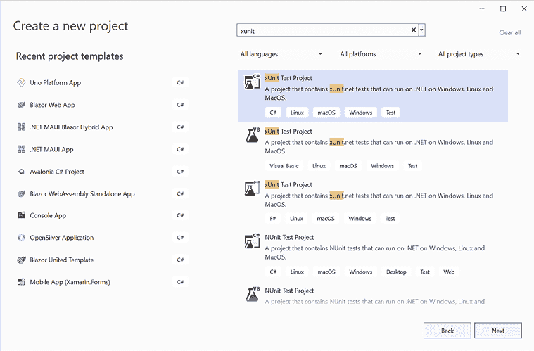
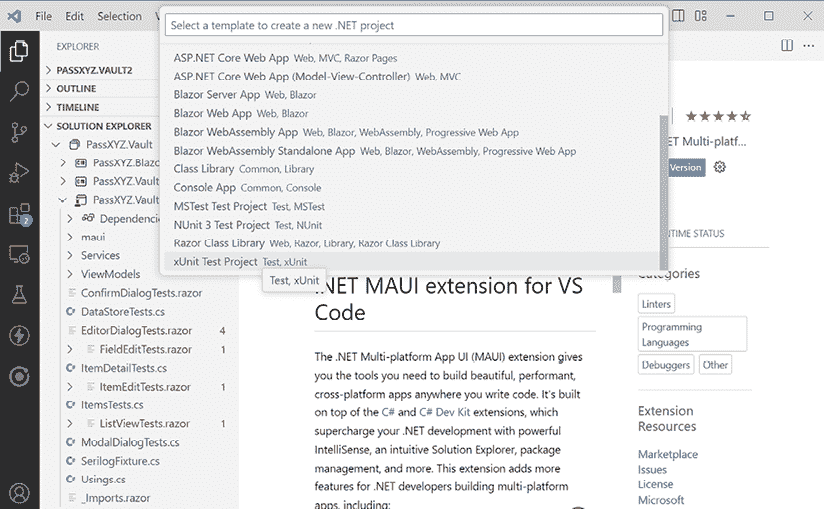

# 第十一章：开发单元测试

测试在当代软件开发中确保软件质量方面发挥着至关重要的作用。软件开发生命周期中涉及多种类型的测试，包括单元测试、集成测试和系统测试。单元测试用于在隔离环境中检查软件模块或组件，通常由开发人员执行。通过一个精心设计的单元测试策略，可以在软件开发生命周期的早期阶段发现编程问题，使单元测试成为保证软件质量最有效和最经济的途径。

在 .NET MAUI 应用程序开发中，我们可以利用 .NET 生态系统中的现有单元测试框架或库。通过使用测试框架或库，我们可以加快单元测试的开发。一个有效的测试框架通常是设计用于与 **持续集成** (**CI**) 和 **持续部署** (**CD**) 环境无缝集成的。在本章中，我们将演示如何设置单元测试并在 .NET MAUI 应用程序开发生命周期中执行单元测试用例。

本章将涵盖以下主题：

+   .NET 中的单元测试

+   模拟 .NET MAUI 组件

+   使用 bUnit 进行 Razor 组件测试

# 技术要求

要测试和调试本章的源代码，您需要设置 .NET 8 环境。您可以通过以下 Microsoft 链接中的说明在 Windows、macOS 或 Linux 上安装 .NET 8：[`dotnet.microsoft.com/en-us/download/dotnet/8.0`](https://dotnet.microsoft.com/en-us/download/dotnet/8.0)。

单元测试可以使用 `dotnet` 命令从命令行执行，或者如果您使用的是 Windows，可以通过 Visual Studio 中的测试资源管理器执行。

要设置 Visual Studio 2022，请参阅 *第一章*，*使用 .NET MAUI 入门* 中的 *开发环境设置* 部分，以获取详细信息。

本章的源代码可在以下 GitHub 仓库中找到：[`github.com/PacktPublishing/.NET-MAUI-Cross-Platform-Application-Development-Second-edition/tree/main/2nd/chapter11`](https://github.com/PacktPublishing/.NET-MAUI-Cross-Platform-Application-Development-Second-edition/tree/ae2e0ad9324ff4e05b1508090fe3cda77ad47ccf)。

要查看本章的源代码，我们可以使用以下命令：

```swift
$ git clone -b 2nd/chapter11 https://github.com/PacktPublishing/.NET-MAUI-Cross-Platform-Application-Development-Second-edition.git PassXYZ.Vault2 
```

要了解更多关于本书源代码的信息，请参阅 *第二章*，*构建我们的第一个 .NET MAUI 应用程序* 中的 *管理本书中的源代码* 部分。

# .NET 中的单元测试

要开发单元测试用例，通常使用单元测试框架来提高效率。在 .NET 环境中，有几种单元测试框架可供选择，如下所示：

+   **Microsoft 测试框架**（**MSTest**）与 Visual Studio 一起捆绑提供。MSTest（V1）的初始版本不是一个开源产品，它首次与 Visual Studio 2005 的发布一同出现。有关 MSTest（V1）的更多信息，请参阅 Lars Powers 和 Mike Snell 合著的《Microsoft Visual Studio 2005 Unleashed》一书。后来，Microsoft 将 MSTest（V2）开源，托管在 GitHub 上，首个版本大约在 2017 年发布。

+   **NUnit** 是一个从 JUnit 转移过来的开源测试框架。它是 .NET 的首个单元测试框架，其最早的版本于 2004 年在 SourceForge 上发布。有关 2.0 版本的信息，请参阅“进一步阅读”部分的发布说明。最新的版本已经转移到 GitHub 上。

+   **xUnit** 是由 NUnit 的创造者 Jim Newkirk 和 Brad Wilson 开发的一个现代且可扩展的框架。与 NUnit 相比，他们对这个新的测试框架进行了重大改进。要了解更多关于这些改进的信息，请参阅 Jim 的博客，*Why Did we Build xUnit 1.0*？xUnit 的第一个稳定版本大约在 2015 年发布。

所有这些框架都非常受欢迎，可以根据项目需求进行选择。在本章中，我们将使用 xUnit 来开发单元测试用例，因为它是一个更新的框架，与 NUnit 相比提供了许多增强功能。

无论你选择哪个单元测试框架，开发单元测试的过程都非常一致。即使你在项目中使用不同的框架，本章的内容仍然适用。单元测试用例旨在仅在跨平台目标框架上运行，而不是在特定平台上的框架。在这本书中，我们使用 .NET 8.0；因此，单元测试的目标框架是 `net8.0`，而不是 `net8.0-android` 或 `net8.0-ios`。

在本章中，我们将首先为模型层开发单元测试，该层对 XAML 和 Blazor 都适用。随后，我们将介绍使用 bUnit 为 Blazor 应用进行单元测试的开发。bUnit 是一个兼容所有三个测试框架（xUnit、NUnit 和 MSTest）的多功能测试库。

## 设置单元测试项目

为了获得一些实践经验，让我们创建一个单元测试项目。我们可以使用 Visual Studio 或 .NET 命令行来创建 xUnit 项目：

1.  要使用 Visual Studio 开始，我们可以向当前解决方案添加一个新项目，如图 *图 11.1* 所示：



图 11.1 – 使用 Visual Studio 创建 xUnit 项目

1.  首先，在搜索框中输入 `xunit` 并选择 C# 的 **xUnit 测试项目**。

1.  在下一屏上，将项目命名为 `PassXYZ.Vault.Tests` 并点击 **下一步**。

1.  随后，将框架设置为 .NET 8.0 并点击 **创建**。

如果你正在使用 Visual Studio Code，第一步是在你的环境中安装.NET MAUI 扩展。一旦扩展安装完成，你就可以使用解决方案资源管理器导航你的项目，就像在 Visual Studio 中做的那样。请注意，截至 2024 年 3 月，.NET MAUI 扩展仍处于预览阶段。

要创建一个 xUnit 项目，请点击位于解决方案中的**+**按钮。此操作将显示以下所示的项目模板列表：



图 11.1a – 使用 Visual Studio Code 创建 xUnit 项目

要使用命令行创建项目，我们首先应创建文件夹，然后使用.NET 命令来建立项目，如下所示：

```swift
mkdir PassXYZ.Vault.Tests
cd PassXYZ.Vault.Tests
dotnet new xunit
dotnet test 
```

创建项目后，我们可以使用`dotnet test`命令来运行测试用例。模板中的默认测试用例将被执行，然后我们将继续向该项目添加更多测试用例。我们的测试目标包含来自`PassXYZ.Vault`和`PassXYZ.BlazorUI`项目的组件，因此我们需要将这些两个项目作为引用项目包含在内。`PassXYZ.BlazorUI`的目标框架是`net8.0`，这允许我们直接添加它。然而，由于`PassXYZ.Vault`的目标框架是平台特定的，我们必须在将其作为引用包含到`PassXYZ.Vault.Tests`之前进行一些修改。

由于我们需要针对目标框架`net8.0`构建单元测试，因此有必要修改`PassXYZ.Vault.csproj`文件，将`net8.0`作为目标框架之一包含在内：

```swift
<TargetFrameworks>**net8.0**;net8.0-android;net8.0-ios;net8.0-
  maccatalyst</TargetFrameworks> 
```

在支持的平台构建`PassXYZ.Vault`项目时，我们预期会生成一个可执行文件，因为它是一个应用程序。然而，当为`net8.0`目标框架构建`PassXYZ.Vault`时，我们的目标是进行测试。`PassXYZ.Vault`应生成为一个库，以便测试框架可以利用它来运行测试用例。在这种情况下，我们期望构建一个具有`.dll`扩展名的文件，而不是`.exe`，这需要以下修改：

```swift
<OutputType **Condition****=****"'****$(TargetFramework)'!='net8.0'"**>
  Exe</OutputType> 
```

在前面的构建设置中，已添加一个条件来验证输出类型的目标框架。如果目标框架不是`net8.0`，则构建输出将生成一个可执行文件。相反，如果目标框架设置为`net8.0`，则将生成一个库。

在进行这些更改后，我们可以通过右键单击解决方案节点并选择**添加** -> **项目引用**，或者通过编辑`PassXYZ.Vault.Tests`的项目文件来包含这些行，将引用项目添加到`PassXYZ.Vault.Tests`中：

```swift
<ItemGroup>
  <ProjectReference 
    Include="..\PassXYZ.BlazorUI\PassXYZ.BlazorUI.csproj" />
  <ProjectReference 
    Include="..\PassXYZ.Vault\PassXYZ.Vault.csproj" />
</ItemGroup> 
```

为了测试 MAUI 项目，还需要将以下配置添加到`PassXYZ.Vault.Tests`项目中：

```swift
<UseMaui>true</UseMaui> 
```

我们现在已经成功设置了 xUnit 项目。接下来，让我们继续添加我们的测试用例。

## 为模型开发测试用例

我们使用 xUnit 作为我们应用的单元测试工具。它提供了一种全面且高效的方式来顺序运行测试，彼此之间相互独立，支持桌面和移动应用。

xUnit 中的两个基本概念是 `Fact` 和 `Theory`。

在 xUnit 中，`Fact` 指的是一个无参数的测试方法，用于确认代码中某些条件的正确性。它声明某事应该是始终正确的。一个“事实”测试在测试套件每次运行时都会运行，因为它们应该是不可变条件，无论执行时的数据状态如何。

另一方面，`Theory` 允许进行参数化测试。它允许开发者使用不同的数据集多次运行单个测试方法，减少代码冗余，同时提高覆盖率。它基于这样一个想法：如果测试方法的合同对于特定的数据集是正确的，那么它应该对所有数据集都是正确的。

我们将首先添加测试用例来检查模型层，因为模型层的测试用例设置在 XAML 和 Blazor 版本的应用中是相同的。

在模型层，主要实现位于 `PassXYZLib` 库中。有关模型层的单元测试的更多信息，请参阅 `PassXYZLib` 源代码：[`github.com/shugaoye/PassXYZLib`](https://github.com/shugaoye/PassXYZLib)。

在我们的应用中，`IDataStore` 是用于导出 `PassXYZLib` 的接口。因此，让我们在 `PassXYZ.Vault.Tests` 项目中创建一个新的测试类 `DataStoreTest` 来测试这个接口，`IDataStore`。为了评估 `IDataStore` 接口，我们可以创建一个新的测试用例，如下测试“添加项目”：

```swift
public class DataStoreTests
{
  [Fact]                                                            //(1)
  public async void Add_Item()
  {
      // Arrange                                                    //(2)
      IDataStore<Item> datastore = new MockDataStore();
      ItemSubType itemSubType = ItemSubType.Entry;
      // Act                                                        //(3)
      var newItem = datastore.CreateNewItem(itemSubType);
      newItem.Name = $"{itemSubType.ToString()}01";
      await datastore.AddItemAsync(newItem);
      var item = datastore.GetItem(newItem.Id);
      // Assert                                                     //(4)
      Assert.Equal(newItem.Id, item.Id);
  }
} 
```

xUnit 使用属性来通知框架关于测试用例配置。在这个测试用例中，我们使用 `[Fact]` 属性 **(1)** 来指定这个方法为一个测试用例。为了定义一个测试用例，我们可以遵循一个常见的模式 – `Arrange`、`Act` 和 `Assert`：

+   `Arrange` **(2)** – 我们将为测试准备所有必要的设置。为了添加一个项目，我们首先需要初始化 `IDataStore` 接口，然后我们将定义一个变量来保存项目类型。

+   `Act` **(3)** – 我们执行我们想要测试的方法，这些方法是 `CreateNewItem` 和 `AddItemAsync`。

+   `Assert` **(4)** – 我们检查我们期望的结果。在我们的例子中，我们尝试使用 `item.Id` 来检索新项目。之后，我们检查确保检索到的项目 ID 与我们期望的相同。

正如你可能已经注意到的，我们在上一个测试用例中测试了 `Entry` 类型。`Entry` 类型只是项目类型之一 – 我们有很多。为了测试所有这些类型，我们需要创建许多测试用例。xUnit 支持另一种测试用例类型 `[Theory]`，它帮助我们使用一个测试用例测试不同的场景。

我们可以使用“删除项目”测试用例来演示如何使用 `[Theory]` 属性在一个测试用例中测试不同的场景。在这个测试用例中，我们可以在一个测试用例中删除不同项目类型的项目：

```swift
public class DataStoreTests
{
  ...
  [Theory]                                                          //(1)
  [InlineData(ItemSubType.Entry)]                                   //(2)
  [InlineData(ItemSubType.Group)]
  [InlineData(ItemSubType.Notes)]
  [InlineData(ItemSubType.PxEntry)]
  public async void Delete_Item(ItemSubType itemSubType)
  {
      // Arrange
      IDataStore<Item> datastore = new MockDataStore();
      var newItem = datastore.CreateNewItem(itemSubType);           //(3)
      newItem.Name = $"{itemSubType.ToString()}01";
      await datastore.AddItemAsync(newItem);
      // Act
      bool result = await
        datastore.DeleteItemAsync(newItem.Id);                      //(4)
      Debug.WriteLine($"Delete_Item: {newItem.Name}");
      // Assert
      Assert.True(result);                                          //(5)
  }
  ...
} 
```

当我们使用 `[Theory]` 属性创建测试用例时，**（1）**，我们可以通过 `itemSubType` 参数传递不同的项目类型。`itemSubType` 参数的值使用 `[InlineData]` 属性定义，**（2）**。

为了安排测试数据，我们使用 `itemSubType` 参数创建一个新的项目，**（3）**。然后，我们执行 `DeleteItemAsync` 方法，**（4）**，这是我们想要测试的方法。

最后，我们检查返回值，**（5）**。如果项目成功删除，则结果为真。否则，结果为假。

我们已经学习了使用 `[Fact]` 属性创建测试用例的过程，以及如何使用 `[Theory]` 属性处理不同的场景。在下一节中，我们将深入探讨与测试用例开发相关的进一步主题。

## 在测试之间共享上下文

在我们之前的测试用例中，我们为每个测试创建了一个新的 `IDataStore` 实例。是否有可能共享一个 `IDataStore` 实例，而不是为每个测试重复创建相同的实例？通过在 xUnit 中将测试设置共享到一组测试用例中，我们可以最小化重复。

在 xUnit 中，有三种方法可以在测试之间共享设置和清理代码：

+   **构造函数** 和 **Dispose**：我们可以使用类构造函数来共享设置和清理代码，而不共享实例。

+   **类固定器**：我们可以使用固定器在单个类中共享对象实例。

+   **集合固定器**：我们可以使用集合固定器在多个测试类中共享对象实例。

### 使用构造函数进行共享

为了从之前的测试中移除重复的设置代码，我们可以将 `IDataStore` 实例的创建移动到 `DataStoreTests` 测试类的构造函数中，如下所示：

```swift
public class DataStoreTests
{
  IDataStore<Item> datastore;
  public DataStoreTests()
  {
    datastore = new MockDataStore();
    Debug.WriteLine("DataStoreTests: Created");
  }
  ...
} 
```

在此代码中，我们添加了一个私有成员变量 `datastore`，并在 `DataStoreTests` 的构造函数中创建了一个 `IDataStore` 实例。我们还添加了调试输出，以便我们可以监控 `IDataStore` 接口的创建。让我们调试 `DataStoreTests` 类的执行，以便我们可以在这里看到调试输出：

```swift
DataStoreTests: Created
Delete_Item: Entry01
DataStoreTests: Created
Delete_Item: Group01
DataStoreTests: Created
Delete_Item: PxEntry01
DataStoreTests: Created
Delete_Item: Notes01
DataStoreTests: Created
Create_Item: PxEntry
DataStoreTests: Created
Create_Item: Group
DataStoreTests: Created
Create_Item: Entry
DataStoreTests: Created
Create_Item: Notes
DataStoreTests: Created
Add_Item: Done 
```

我们可以从调试输出中看到，为每个测试用例创建了一个 `DataStoreTests` 类。我们在测试方法内部或构造函数中创建 `IDataStore` 实例没有区别。所有测试用例仍然彼此隔离。当我们使用 `[Theory]` 属性使用一个方法测试不同的场景时，每个场景在运行时都像是一个单独的测试用例。为了更好地理解这一点，我们可以使用 `dotnet` 命令列出所有定义的测试：

```swift
dotnet test -t
  Determining projects to restore...
  All projects are up-to-date for restore.
Microsoft (R) Test Execution Command Line Tool Version 17.3.0
  (x64)
Copyright (c) Microsoft Corporation.  All rights reserved.
The following Tests are available:
    PassXYZ.Vault.Tests.DataStoreTests.Add_Item
    PassXYZ.Vault.Tests.DataStoreTests.Delete_Item(itemSubType:
      Entry)
    PassXYZ.Vault.Tests.DataStoreTests.Delete_Item(itemSubType:
      Group)
    PassXYZ.Vault.Tests.DataStoreTests.Delete_Item(itemSubType:
      Notes)
    PassXYZ.Vault.Tests.DataStoreTests.Delete_Item(itemSubType:
      PxEntry)
    PassXYZ.Vault.Tests.DataStoreTests.Create_Item(itemSubType:
      Entry)
    PassXYZ.Vault.Tests.DataStoreTests.Create_Item(itemSubType:
      Group)
    PassXYZ.Vault.Tests.DataStoreTests.Create_Item(itemSubType:
      Notes)
   PassXYZ.Vault.Tests.DataStoreTests.Create_Item(itemSubType:
      PxEntry) 
```

我们可以看到，由 `[InlineData]` 属性定义的每个参数都显示为单独的测试用例。它们在运行时都是隔离的测试用例。

在列出所有测试后，我们可以使用 `dotnet` 命令选择性地执行它们。

如果我们想运行 `DataStoreTests` 类中的所有测试，我们可以使用此命令：

```swift
dotnet test --filter DataStoreTests 
```

如果我们只想运行 `Add_Item` 测试，我们可以使用此命令：

```swift
dotnet test --filter DataStoreTests.Add_Item 
```

如我们从调试输出中可以看到的，尽管我们在构造函数中创建了一个 `IDataStore` 的实例，但每个测试都会重新创建该实例。在测试类构造函数中创建的实例不会在测试之间共享。尽管效果仍然相同，但代码看起来更简洁。

然而，在某些场景下，我们可能希望在不同测试之间共享实例。为了实现这一点，我们可以利用类固定器。在下一节中，我们将检查这些特定的情况。

### 使用类固定器共享

当在所有测试案例中使用工具时，共享设置可能比每次都创建相同的设置更有效。让我们用一个日志函数作为例子来说明这种方法。

为了生成测试报告，我们的目标是创建一个测试日志，用于监控单元测试的执行。`Serilog` 库是用于此目的的库。`Serilog` 允许我们将消息记录到不同的通道。为了使用 `Serilog`，我们首先必须设置它，然后在所有测试执行完毕后清理它。在这种情况下，我们更倾向于在所有测试之间共享单个 `Serilog` 实例，而不是为每个测试创建一个。这种设置使我们能够为所有测试生成一个综合的日志文件，而不是为每个单独的测试生成多个日志文件。

要集成 `Serilog`，我们需要将 `Serilog` 包添加到项目中。这可以通过在项目的 `PassXYZ.Vault.Tests` 文件夹中执行以下 `dotnet` 命令来完成：

```swift
dotnet add package Serilog
dotnet add package Serilog.Sinks.File 
```

在将 `Serilog` 库添加到项目中后，我们现在可以创建一个用于演示目的的类固定器，`SerilogFixture`：

```swift
public class SerilogFixture : IDisposable {                         //(1)
  public ILogger Logger { get; private set; }
  public SerilogFixture() {
    Logger = new LoggerConfiguration()                              //(2)
        .MinimumLevel.Debug()
        .WriteTo.File(@"logs\xunit_log.txt")
        .CreateLogger();
    Logger.Debug("SerilogFixture: initialized");
  }
  public void Dispose() {
    Logger.Debug("SerilogFixture: closed");
    Log.CloseAndFlush();                                            //(3)
  }
}
public class IDataStoreTests : IClassFixture<SerilogFixture> {      //(4)
  IDataStore<Item> datastore;
  SerilogFixture serilogFixture;
  public DataStoreTests(SerilogFixture fixture) {                   //(5)
      serilogFixture = fixture;                                     //(6)
      datastore = new MockDataStore();
      serilogFixture.Logger.Debug("DataStoreTests: Created");
  }
  [Fact]
  public async void Add_Item() ...
  ...
} 
```

如果我们想使用类固定器，我们可以按照以下步骤创建它们：

+   我们可以创建一个新的类作为固定器类，并将设置代码添加到构造函数中。在这里，我们创建了一个固定器类，`SerilogFixture` **(1**)，并在构造函数中初始化了 `ILogger` 接口，**(2**)。

+   由于我们需要在测试用例执行后清理设置，我们需要为固定器类实现 `IDisposable` 接口，并将清理代码放在 `Dispose` 方法中。我们在 `SerilogFixture` 中实现了 `IDisposable`，并在 `Dispose` 方法中调用了 `Serilog` 函数，`Log.CloseAndFlush` **(3**)。

+   要使用固定器，测试用例需要实现 `IClassFixture<T>` 接口。我们在 `DataStoreTests` 测试类中实现了这一点，**(4**)。

+   要访问固定件实例，我们可以将其作为构造函数参数添加，它将自动提供。在 `DataStoreTests` 的构造函数 **(5)** 中，我们将参数分配给私有成员变量 `serilogFixture` **(6)**。在测试用例中，我们可以使用这个变量访问 `Serilog`。

为了验证此设置，我们将所有调试输出替换为 `Serilog` 的 `Debug`。在执行 `DataStoreTests` 中的测试后，我们可以在 `xunit_log.txt` 日志文件中看到这里的日志消息：

```swift
2022-08-28 10:25:39.273 +08:00 [DBG] SerilogFixture: initialized
2022-08-28 10:25:39.332 +08:00 [DBG] DataStoreTests: Created
2022-08-28 10:25:39.350 +08:00 [DBG] Delete_Item: Entry01
2022-08-28 10:25:39.355 +08:00 [DBG] DataStoreTests: Created
2022-08-28 10:25:39.355 +08:00 [DBG] Delete_Item: Group01
2022-08-28 10:25:39.356 +08:00 [DBG] DataStoreTests: Created
2022-08-28 10:25:39.357 +08:00 [DBG] Delete_Item: PxEntry01
2022-08-28 10:25:39.358 +08:00 [DBG] DataStoreTests: Created
2022-08-28 10:25:39.358 +08:00 [DBG] Delete_Item: Notes01
2022-08-28 10:25:39.359 +08:00 [DBG] DataStoreTests: Created
2022-08-28 10:25:39.359 +08:00 [DBG] Create_Item: PxEntry
2022-08-28 10:25:39.360 +08:00 [DBG] DataStoreTests: Created
2022-08-28 10:25:39.360 +08:00 [DBG] Create_Item: Group
2022-08-28 10:25:39.361 +08:00 [DBG] DataStoreTests: Created
2022-08-28 10:25:39.361 +08:00 [DBG] Create_Item: Entry
2022-08-28 10:25:39.362 +08:00 [DBG] DataStoreTests: Created
2022-08-28 10:25:39.362 +08:00 [DBG] Create_Item: Notes
2022-08-28 10:25:39.362 +08:00 [DBG] DataStoreTests: Created
2022-08-28 10:25:39.364 +08:00 [DBG] Add_Item: Done
2022-08-28 10:25:39.367 +08:00 [DBG] SerilogFixture: closed 
```

如预期，`SerilogFixture` 类仅初始化一次，使其实例可以在 `DataStoreTests` 中的所有测试中使用。这与为每个单独的测试初始化的 `IDataStore` 接口形成对比。

### 使用集合固定件的共享

如前节所示，利用类固定件允许我们在单个测试类中共享测试设置上下文。然而，可能存在需要跨多个测试类共享测试设置的情况。在这种情况下，我们可以使用集合固定件来实现这一点。

在 `Serilog` 的情况下，我们可以在多个测试类之间使用它，使我们能够在一个日志文件中查看所有日志消息。为了为所有测试类实现统一的 `Serilog` 设置，我们可以在项目中实现集合固定件。通过使用集合固定件，我们可以在 `PassXYZ.Vault.Tests` 项目中创建两个新类，`SerilogFixture` 和 `SerilogCollection`，如 *Listing 11.1* 所示：

```swift
namespace PassXYZ.Vault.Tests;
public class SerilogFixture : IDisposable {
  public ILogger Logger { get; private set; }
  public SerilogFixture() {
      Logger = new LoggerConfiguration()
          .MinimumLevel.Debug()
          .WriteTo.File(@"logs\xunit_log.txt")
          .CreateLogger();
      Logger.Debug("SerilogFixture: initialized");
  }
  public void Dispose() {
      Logger.Debug("SerilogFixture: closed");
      Log.CloseAndFlush();
  }
}
[CollectionDefinition("Serilog collection")]                       //(1)
public class SerilogCollection:ICollectionFixture<SerilogFixture>
{
}                                                                  //(2) 
```

列表 11.1: `SerilogFixture.cs` ([`epa.ms/SerilogFixture11-1`](https://epa.ms/SerilogFixture11-1))

要实现集合固定件，我们可以遵循以下步骤：

+   创建一个新的类文件，`SerilogFixture.cs`，其中包含 `SerilogFixture` 和 `SerilogCollection` 类。

+   使用 `[CollectionDefinition]` 属性 **(1)** 装饰集合定义类 `SerilogCollection` 并为其分配一个唯一名称，以帮助识别测试集合。

+   确保集合定义类 `SerilogCollection` 实现了 `ICollectionFixture<T>` 接口 **(2)**。

要使用集合固定件，我们可以对我们的测试类进行以下修改：

+   我们可以将 `[Collection]` 属性附加到所有将被包含在集合中的测试类。我们在属性中将测试集合定义命名为 `Serilog collection`。在我们的例子中，如 *Listing 11.2* 所示，我们向 `DataStoreTests` 类添加了 `[Collection("Serilog collection")]` 属性 **(1)**。

+   要访问固定件实例，我们可以遵循与上一节中类固定件相同的做法，将其包括为构造函数参数。然后它将自动提供。在 `DataStoreTests` 的构造函数中，我们将 `fixture` 参数分配给 `serilogFixture` 变量 **(2)**。

+   为了节省空间，*列表 11.2* 中没有提供完整的代码。缺失的部分用“...”符号表示。`Add_Item` 测试用例是用 `Fact` 构建的，用于检查条目的创建。`Create_Item` 和 `Delete_Item` 测试用例都使用了 `Theory`，使我们能够测试各种条目。

```swift
namespace PassXYZ.Vault.Tests;
[Collection("Serilog collection")]                                 //(1)
public class DataStoreTests {
  IDataStore<Item> datastore;
  SerilogFixture serilogFixture;
  public DataStoreTests(SerilogFixture fixture) {
    datastore = new MockDataStore();
    serilogFixture = fixture;                                      //(2)
    serilogFixture.Logger.Debug("DataStoreTests
      initialized");
  }
  [Fact]
  public async void Add_Item() {
    // Arrange
    ItemSubType itemSubType = ItemSubType.Entry;
    // Act
    var newItem = datastore.CreateNewItem(itemSubType);
    newItem.Name = $"{itemSubType.ToString()}01";
    await datastore.AddItemAsync(newItem);
    var item = datastore.GetItem(newItem.Id);
    // Assert
    Assert.Equal(newItem.Id, item.Id);
    serilogFixture.Logger.Debug("Add_Item done");
  }
  [Theory]
  [InlineData(ItemSubType.Entry)]
  [InlineData(ItemSubType.Group)]
  [InlineData(ItemSubType.Notes)]
  [InlineData(ItemSubType.PxEntry)]
  public async void Delete_Item(ItemSubType itemSubType)...
  [Theory]
  [InlineData(ItemSubType.Entry)]
  [InlineData(ItemSubType.Group)]
  [InlineData(ItemSubType.Notes)]
  [InlineData(ItemSubType.PxEntry)]
  public void Create_Item(ItemSubType itemSubType) ...
} 
```

列表 11.2: `DataStoreTests.cs` ([`epa.ms/DataStoreTests11-2`](https://epa.ms/DataStoreTests11-2))

通过这些示例，我们展示了如何在模型层创建单元测试。我们迄今为止获得的知识也可以应用于其他 .NET 应用程序的单元测试。

在介绍了模型层单元测试之后，我们将继续探讨本章下一部分使用 bUnit 库进行 Razor 组件单元测试。

# 模拟 .NET MAUI 组件

在为 .NET MAUI 开发单元测试时，我们将展示基于 XAML 和基于 Blazor 的应用程序的测试用例开发。在这两种情况下，我们都会在设计时采用 MVVM 模式。模型层的单元测试用例对于两者都是相同的；然而，对视图和视图模型的测试存在显著差异。在基于 XAML 的应用程序中开发视图和视图模型的单元测试可能相当复杂。为了测试视图模型，需要解决 XAML 组件的依赖关系。例如，在我们的应用程序的 XAML 版本中，我们需要在视图模型中调用 `Shell` 导航方法，如下面的代码所示：

```swift
await Shell.Current.GoToAsync(
  $"{nameof(ItemsPage)}?{nameof(ItemsViewModel.ItemId)}={item
  .Id}"); 
```

为了解决开源项目 `Xamarin.Forms` 中的依赖关系，有一个名为 `Xamarin.Forms.Mocks` 的项目可以帮助模拟 `Xamarin.Forms` 组件。对于 .NET MAUI XAML 应用程序，我们需要一个类似解决方案来开发视图模型的单元测试用例，但目前似乎还没有等效的解决方案。此外，还有一个针对 Android 和 iOS 的本地用户界面测试框架 `Xamarin.UITest`。然而，它目前还不兼容 .NET MAUI。另外，由于 `Xamarin.UITest` 不是一个跨平台解决方案，因此本书中不会讨论它。

为了部分解决本书中关于视图模型测试的依赖问题，我们可以直接引用 .NET MAUI 源代码。位于 [`github.com/dotnet/maui`](https://github.com/dotnet/maui)，该源代码包括包含模拟 .NET MAUI 组件的原始单元测试代码。

我已经将 .NET MAUI 源代码的一些元素纳入到单元测试项目 `PassXYZ.Vault.Tests` 中。为了解决视图模型中的 `Shell` 导航问题，包含了来自 `PassXYZ.Vault.Tests/maui/ShellTestBase.cs` 的以下代码：

+   在 `NewItemViewModel` 测试中，我们可以使用以下命名空间将 `ShellTestBase` 类纳入：

    ```swift
    using Microsoft.Maui.Controls.Core.UnitTests; 
    ```

+   实现上述命名空间后，可以使用以下代码创建模拟的 `Shell`：

    ```swift
    TestShell shell = new TestShell(); 
    ```

+   一旦我们有一个模拟的 `Shell` 实例，我们就可以在以下测试用例中使用这个模拟的 `Shell` 实例：

    ```swift
    [Fact]
    public async void CancelNewItem()  {
    NewItemViewModel vm = new(dataStore, logger);
    await shell.GoToAsync("//About/Maui/");
    vm.CancelCommand.Execute(null);
    Assert.Equal("//About/Maui/content", Shell.Current.CurrentState.Location.ToString());
    } 
    ```

对于 Blazor 混合应用，我们没有上述问题。我们可以访问一个可靠的测试库 bUnit，它可以用于测试 Razor 组件。这使我们能够为 Blazor 应用程序的视图、视图模型和模型层开发单元测试用例。

# 使用 bUnit 进行 Razor 组件测试

在 .NET MAUI 开发中，我们无法为所有基于 XAML 的 UI 组件的所有视图和视图模型层创建单元测试用例；然而，使用 Blazor 是可以做到的。bUnit 是一个出色的测试库，可以用于为 Razor 组件开发单元测试。bUnit 库简化了使用 xUnit、NUnit 或 MSTest 为 Razor 组件创建单元测试用例的过程。在本章的剩余部分，我们将结合使用 xUnit 和 bUnit。使用 bUnit 的单元测试用例结构与我们在上一节中讨论的 xUnit 测试用例类似。

在本章的剩余部分，我们将专注于测试以下 Razor 组件，这些组件是在本书的第二部分创建的：

+   `PassXYZ.BlazorUI` 项目的 Razor 组件

+   `PassXYZ.Vault` 项目的 Razor 组件

要使用 bUnit 测试 Razor 组件，需要修改 `PassXYZ.Vault.Tests` 的项目配置。

## 更改 bUnit 的项目配置

为了建立测试环境，我们必须添加 bUnit 和 Moq 包，以及更新 SDK 类型。以下修改可以应用于 xUnit `PassXYZ.Vault.Tests` 测试项目：

1.  将 bUnit 添加到项目中。

    要将 bUnit 库集成到项目中，首先导航到项目文件夹，然后在控制台中执行以下命令：

    ```swift
    cd PassXYZ.Vault.Tests
    dotnet add package bunit 
    ```

    此外，我们还需要包含 Moq 包，这是一个在测试设置过程中将使用的模拟库。

    ```swift
    dotnet add package Moq 
    ```

1.  更改项目配置。

    要测试 Razor 组件，我们还需要将项目的 SDK 更改为 `Microsoft.NET.Sdk.Razor`。

    在 `PassXYZ.Vault.Tests.csproj` 项目文件中，我们需要替换以下行：

    ```swift
    <Project Sdk="Microsoft.NET.Sdk"> 
    ```

    with

    ```swift
    <Project Sdk="Microsoft.NET.Sdk.Razor"> 
    ```

一旦项目配置就绪，我们可以使用 bUnit 创建一个简单的单元测试用例来测试我们的 Razor 组件。

## 创建 bUnit 测试用例

在我们的 PassXYZ.Vault 应用中，有两种类型的 Razor 组件可以进行测试。共享的 Razor 组件位于 `PassXYZ.BlazorUI` 项目中，作为通用 Razor 组件，可以在不同的项目中使用。第二组 Razor 组件可以在 `PassXYZ.Vault` 项目的 `Pages` 文件夹中找到。这些组件特定于 `PassXYZ.Vault` 应用，并使用来自 `PassXYZ.BlazorUI` 项目的共享组件。

要测试 `PassXYZ.BlazorUI` 项目中的 Razor 组件，我们可以单独检查每个组件。这些测试用例是单元测试用例。位于 `PassXYZ.Vault` 项目 `Pages` 文件夹中的 Razor 组件作为 UI 页面。由于这些页面使用了来自其他包的 UI 组件，它们具有更多的依赖项。因此，这些测试用例可以被视为集成测试用例。

首先，让我们在 `PassXYZ.BlazorUI` 项目中为 `ModalDialog` Razor 组件创建一个测试用例。要测试 `ModalDialog`，我们可以生成一个名为 `ModalDialogTests` 的 xUnit 测试类，如 *列表 11.3* 所示：

```swift
namespace PassXYZ.Vault.Tests {
  [Collection("Serilog collection")]
  public class ModalDialogTests : TestContext {                     //(1)
    SerilogFixture serilogFixture;
    public ModalDialogTests(SerilogFixture serilogFixture) {
      this.serilogFixture = serilogFixture;
    }
    [Fact]
    public void ModalDialogInitTest() {
      string title = "ModalDialog Test";                            //(2)
      var cut = RenderComponent<ModalDialog>(                       //(3)
        parameters => parameters.Add(p => p.Title, title)           //(4)
        .Add(p => p.CloseButtonText, "Close")
        .Add(p => p.SaveButtonText, "Save"));
      cut.Find("h5").TextContent.MarkupMatches(title);              //(5)
      serilogFixture.Logger.Debug("ModalDialogInitTest:
        done");
    }
    ...
  }
} 
```

列表 11.3：`ModalDialogTests.cs` ([`epa.ms/ModalDialogTests11-3`](https://epa.ms/ModalDialogTests11-3))

如在 `ModalDialogTests` 单元测试类中所示，它与为模型层创建的单元测试类有很强的相似性。我们重用了之前建立的集合固定装置，并在构造函数中初始化它。在 `ModalDialogInitTest` 测试用例中，我们继续使用 `Arrange`、`Act` 和 `Assert` 模式来实现测试用例。

所有 bUnit 测试类都继承自 `TestContext` **（1**）。在 `Arrange` 阶段，我们使用预定义的字符串初始化一个局部 `title` 变量，**（2**）。在 `Act` 阶段，我们调用一个泛型方法 `RenderComponent<T>` **（3**），并使用 `ModalDialog` 类型作为类型参数。我们将 `title` 变量，**（4**），作为组件参数传递。`RenderComponent<T>` 的结果存储在 `cut` 变量中。在 `Assert` 阶段，我们确认渲染后的标题文本与传递的参数一致，利用 bUnit 方法 `Find` **（5**）。bUnit 方法 `Find` 可以用来查找任何 HTML 标签。在 `ModalDialog` 中，标题被渲染为 `<h5>` HTML 标签。

在 `ModalDialogInitTest` 测试用例中，我们观察了 bUnit 测试的结构。对于 bUnit 测试，我们首先渲染被测试的组件。渲染结果存储在 `cut` 变量中，**（3**），这是一个 `IRenderedComponent` 接口的实例。为了验证结果，我们可以参考 `IRenderedComponent` 实例的属性或调用其方法。

当 Razor 组件在 `TestContext` 中渲染时，它们表现出与其他任何 Razor 组件相同的生命周期。我们可以向被测试的组件传递参数，并且它们可以生成类似于在浏览器中的行为的输出。

在前面的示例中，当渲染 `ModalDialog` 组件时，我们可以使用 `Add` 方法将其参数传递给它，该方法属于 `ComponentParameterCollectionBuilder<TComponent>` 类型的参数构建器。

使用 C# 代码渲染简单组件可能不会引起问题。然而，当向组件传递多个参数时，使用 C# 代码可能不太方便。通过使用 bUnit，我们可以在 Razor 文件中开发测试用例，这显著提高了单元测试开发的经验。

## 在 Razor 文件中创建测试用例

要在 Razor 标记文件中直接创建测试用例，我们可以使用 Razor 标记声明组件，类似于我们在 Razor 页面中使用它们的方式。这种方法消除了在 C#代码中调用 Razor 组件或使用函数调用传递参数的需要。对于 Razor 页面，我们可以使用**Razor 模板**来渲染 Razor 组件。

我们可以通过为更复杂的`EditorDialog`组件开发测试用例来展示在 Razor 标记文件中创建测试的过程。我们之前在*第十章*，*实现 Razor 组件*中创建了`EditorDialog`组件。在*列表 11.4*中，我们将检查此组件的单元测试：

```swift
@inherits TestContext                                               //(1)
<h3>EditorDialogTests</h3>
@code {
  bool _isOnCloseClicked = false;
  string _key = string.Empty;
  string _value = string.Empty;
  string updated_key = "key updated";
  string updated_value = "value udpated";
  void OnSaveClicked(string key, string value) {
    _key = key; _value = value;
  }
  void OnCloseHandler() {
    _isOnCloseClicked = true;
  }
  [Fact]
  public void EditorDialog_Init_WithoutArgument() ...
  [Fact]
  public void Edit_OnClose_Clicked() {
    var cut = Render(@<EditorDialog Key="@_key"
                                    Value="@_value" 
                                    OnSave=@OnSaveClicked
                                    OnClose=@OnCloseHandler>
                     </EditorDialog>);                              //(2)
    cut.Find("button[class='btn btn-secondary']").Click();          //(3)
    Assert.True(_isOnCloseClicked);                                 //(4)
  }
  [Fact]
  public void Edit_With_KeyEditingEnabled() {                       //(5)
     var cut = Render(@<EditorDialog Key="@_key"
                                     Value="@_value"
                                     IsKeyEditingEnable="true" 
                                     OnSave=@OnSaveClicked>
                      </EditorDialog>);
    cut.Find("input").Change(updated_key);
    cut.Find("textarea").Change(updated_value);
    cut.Find("button[type=submit]").Click();
    Assert.Equal(_key, updated_key);
    Assert.Equal(_value, updated_value);
  }
  [Fact]
  public void Edit_With_KeyEditingDisabled() ...
} 
```

列表 11.4：`EditorDialogTests.razor` ([`epa.ms/EditorDialogTests11-4`](https://epa.ms/EditorDialogTests11-4))

我们可以在`PassXYZ.Vault.Tests`项目中开发一个新的 Razor 组件，称为`EditorDialogTests`。作为 bUnit 测试类，它是`TestContext`的子类**（1**）。在这个类中，我们通过利用**Razor 模板**在代码块中生成测试用例。

让我们首先检查`Edit_OnClose_Clicked`测试用例。在这种情况下，我们首先渲染`EditorDialog`组件，然后测试关闭按钮。

要渲染`EditorDialog`组件，我们调用`TestContext`的`Render`方法**（2**）。与上一个示例相比，在这种情况下，我们可以直接渲染 Razor 标记而不是调用 C#函数。这里使用的 Razor 标记被称为**Razor 模板**。有关 Razor 模板的更多信息，请参阅以下 Microsoft 文档：[`learn.microsoft.com/en-us/aspnet/core/blazor/components/?view=aspnetcore-5.0#razor-templates-1`](https://learn.microsoft.com/en-us/aspnet/core/blazor/components/?view=aspnetcore-5.0#razor-templates-1)。

`Razor 模板`可以按以下格式定义：

```swift
@<{HTML tag}>…</{HTML tag}> 
```

它由一个`@`符号和一对开闭 HTML 标签组成。Razor 模板可以在 Razor 文件的代码块中使用。它们不能在 C#或 C#代码隐藏文件中使用。

```swift
RenderFragment or RenderFragment<TValue>. In *Listing 11.4*, we use Razor templates to pass parameters to the EditorDialog, as demonstrated in the subsequent code:
```

```swift
var cut = Render(@<EditorDialog Key="@_key"
Value="@_value" OnSave=@OnSaveClicked
OnClose=@OnCloseHandler>
                  </EditorDialog>); 
```

`EditorDialog`渲染后，我们可以找到关闭按钮并模拟点击操作**（3**）：

```swift
cut.Find("button[class='btn btn-secondary']").Click(); 
```

在`OnCloseHandler`事件处理程序中，`_isOnCloseClicked`变量**（4**）被设置为`true`，这样我们就可以断言结果。

在`Edit_With_KeyEditingEnabled`测试用例**（5**）中，组件渲染后，我们可以模拟用户交互来设置组件中的键和值字段。之后，我们可以模拟点击保存按钮，如下所示：

```swift
 cut.Find("input").Change(updated_key);
    cut.Find("textarea").Change(updated_value);
    cut.Find("button[type=submit]").Click(); 
```

点击按钮后，事件处理程序被触发。在`OnSaveClicked`事件处理程序中，我们接收修改后的键和值，使我们能够断言结果。

```swift
 Assert.Equal(_key, updated_key);
    Assert.Equal(_value, updated_value); 
```

如这两个测试案例所示，在 Razor 文件中创建测试时，设计 bUnit 测试变得更加简单。通过利用 Razor 模板，我们可以渲染组件，并模拟各种用户交互，使我们能够交互式地测试组件。

Razor 模板作为结合 Razor 标记和 C#代码的优秀工具，使我们能够从两种方法的优势中受益。然而，在使用 Razor 模板时存在某些限制。在下一节中，我们将探讨如何克服这些限制。

## 使用`RenderFragment`委托

尽管 Razor 模板可以帮助简化测试设置，但它们有其局限性，尤其是在复杂的测试案例场景中。对于复杂的测试案例，Razor 模板可能会变得相当长。如果我们打算在其他测试案例中重用相同的 Razor 模板，我们就需要复制它们，这可能会导致大量的代码重复。这是使用 Razor 模板的主要缺点之一。

在这种情况下，我们可以使用一个`RenderFragment`委托。正如其名称所示，它是`RenderFragment`或`RenderFragment<TValue>`的委托类型。Razor 模板的数据类型是`RenderFragment`或`RenderFragment<TValue>`。`RenderFragment`委托是 Razor 模板的委托类型。

你可以在以下 Microsoft 文档中找到有关`RenderFragment`委托的更多信息：[`learn.microsoft.com/en-us/aspnet/core/blazor/performance?view=aspnetcore-3.1#define-reusable-renderfragments-in-code-2`](https://learn.microsoft.com/en-us/aspnet/core/blazor/performance?view=aspnetcore-3.1#define-reusable-renderfragments-in-code-2)。

为了演示如何使用`RenderFragment`委托，让我们为`EditorDialog`组件设置一个更复杂的测试。`EditorDialog`可以用来编辑`Item`或`Field`。我们可以使用一个项目编辑案例来展示如何使用`RenderFragment`委托。

我们有选择在`PassXYZ.Vault.Tests`项目中创建一个新的测试类，名为`ItemEditTests`。为了区分 Razor 标记和 C#代码，我们可以将`ItemEditTests`测试类分为一个 Razor 文件（`ItemEditTests.razor`）和一个 C#代码后文件（`ItemEditTests.razor.cs`）。用于测试的标记可以在 Razor 文件中声明，如*列表 11.5*所示：

```swift
@inherits TestContext
@namespace PassXYZ.Vault.Tests
<h3>ItemEditTests</h3>
@code {
  private RenderFragment _editorDialog => __builder =>
  {
    <CascadingValue Value="@_dialogId" Name="Id">
    <EditorDialog IsKeyEditingEnable=@isNewItem
    OnSave=@OnSaveClicked Key=@testItem.Name
    Value=@testItem.Notes>
      @if (isNewItem) {
        <select id="itemType" @bind="testItem.ItemType"
          class="form-select" aria-label="Group">
            <option selected value="Group">Group</option>
            <option value="Entry">Entry</option>
            <option value="PxEntry">PxEntry</option>
            <option value="Notes">Notes</option>
        </select>
        }
    </EditorDialog>
    </CascadingValue>
  };
} 
```

列表 11.5: `ItemEditTests.razor` ([`epa.ms/ItemEditTests11-5`](https://epa.ms/ItemEditTests11-5))

我们在`ItemEditTests.razor`的`@code`块中定义了一个`RenderFragment`委托，名为`_editorDialog`。`RenderFragment`委托必须接受一个名为`__builder`的`RenderTreeBuilder`类型的参数。在标记代码中，我们可以访问测试类中定义的变量。

现在，让我们看看*列表 11.6*中 C#代码后文件中`_editorDialog`的使用：

```swift
namespace PassXYZ.Vault.Tests;
[Collection("Serilog collection")]
public partial class ItemEditTests : TestContext {
  readonly SerilogFixture serilogFixture;
  bool isNewItem { get; set; } = false;
  NewItem testItem { get; set; }
  string _dialogId = "editItem";
  string updated_key = "Updated item";
  string updated_value = "This item is updated.";
  public ItemEditTests(SerilogFixture fixture) {
    testItem = new() {
        Name = "New item",
        Notes = "This is a new item."
    };
    serilogFixture = fixture;
  }
  void OnSaveClicked(string key, string value) {
    testItem.Name = key; testItem.Notes = value;
  }
  [Fact]
  public void Edit_New_Item() {
    isNewItem = true;
    var cut = Render(_editorDialog);                                //(1)
    cut.Find("#itemType").Change("Entry");
    cut.Find("input").Change(updated_key);
    cut.Find("textarea").Change(updated_value);
    cut.Find("button[type=submit]").Click();
    Assert.Equal(updated_key, testItem.Name);
    Assert.Equal(updated_value, testItem.Notes);
  }
  [Fact]
  public void Edit_Existing_Item() {
    isNewItem = false;                                              //(3)
    var cut = Render(_editorDialog);                                //(1)
    var ex = Assert.Throws<ElementNotFoundException>(() =>
      cut.Find("#itemType").Change("Entry"));                       //(2)
    Assert.Equal("No elements were found that matches the
      selector '#itemType'", ex.Message);                           //(4)
    cut.Find("textarea").Change(updated_value);
    cut.Find("button[type=submit]").Click();
    Assert.Equal(updated_value, testItem.Notes);
  }
} 
```

列表 11.6: `ItemEditTests.razor.cs` ([`epa.ms/ItemEditTests11-6`](https://epa.ms/ItemEditTests11-6))

由于`_editorDialog`定义了`Item`编辑，我们可以为它开发多个测试用例。我们可以看到，为了多个测试用例，例如`Edit_New_Item`和`Edit_Existing_Item`，我们渲染了`_editorDialog`**（1）**。通过使用`RenderFragment`委托，我们的测试代码看起来更加优雅和简洁。如果不采取这种方法，我们可能需要在多个位置复制大量的标记代码。直接使用 C#代码可能会导致更多的代码重复。

在这两个测试用例中，我们通过设置值然后点击`Save`按钮来测试`EditorDialog`，采用了一个类似的过程。在标记代码中，我们定义了一个`<select>`标签。我们可以在测试代码中更改`<select>`标签的选项，**（2）**。这个`<select>`标签是根据`isNewItem`变量的值有条件地渲染的。

在`Edit_Existing_Item`测试中，我们还可以检查当`isNewItem`变量**（3）**设置为`false`时的负面情况。在这种情况下，由于`<select>`标签没有被渲染，会抛出一个异常。我们可以观察到 bUnit 也可以通过验证异常的内容**（4）**来利用测试负面情况。

在前面的示例中，我们为`PassXYZ.BlazorUI`项目中的共享组件开发了 bUnit 测试。由于这些共享组件作为高级 UI 的可重用构建块，其中许多声明了多个组件参数。利用`RenderFragment`委托或**Razor 模板**可以帮助简化测试设置过程。

在检查`PassXYZ.Vault`项目的`Pages`文件夹中的 Razor 页面时，我们发现`Items`、`ItemDetail`和`Login`也充当 Razor 组件。然而，它们并不是为重用而设计的。这些 Razor 页面具有定义的路由模板，并且缺乏广泛的组件参数。这些 Razor 页面中存在的组件参数用于路由目的。在为这些 Razor 页面设计测试用例时，建议在 C#类中而不是在 Razor 文件中实现测试。

## 测试 Razor 页面

在开发测试 Razor 页面期间，我们将熟悉一些非常有用的 bUnit 功能。由于我们无法审查我们应用中所有 Razor 页面的测试，我们将使用`ItemDetail`作为示例。`ItemDetail`是一个设计用来显示密码条目内容的 Razor 页面，并且它有一个定义的路由。

```swift
@page "/entry/{SelectedItemId}" 
```

当我们想要显示`ItemDetail`页面时，我们需要传递一个`Item`实例的`Id`信息给它，并且这个实例不能是一个组。`ItemDetail`页面的初始化是在`OnParametersSet()`生命周期方法中完成的，正如我们在这里可以看到的：

```swift
protected override void OnParametersSet() {
  base.OnParametersSet();
  if (SelectedItemId != null) {
    selectedItem = DataStore.GetItem(SelectedItemId, true);
    if (selectedItem == null) {
        throw new InvalidOperationException(                        //(2)
  "ItemDetail: entry cannot be found with SelectedItemId");
    }
    else {
      if (selectedItem.IsGroup) {
          throw new InvalidOperationException(                      //(3)
   "ItemDetail: SelectedItemId should not be group here.");
      }
      else {                                                        //(4)
        fields.Clear();
        List<Field> tmpFields = selectedItem.GetFields();
        foreach (Field field in tmpFields) {
            fields.Add(field);
        }
        notes = selectedItem.GetNotesInHtml();
      }
    }
  }
  else {
    throw new InvalidOperationException(                            //(1)
      "ItemDetail: SelectedItemId is null");
  }
} 
```

我们将开发一个`ItemDetailTests`测试类来覆盖`OnParametersSet()`中的所有执行路径。为了覆盖所有执行路径，我们可以找到以下测试用例：

+   `测试用例 1`：初始化没有选择项目`Id`的`ItemDetail`实例。在这种情况下，我们将得到一个`InvalidOperationException`异常，**（1）**。

+   `测试用例 2`：使用错误的项目`Id`初始化`ItemDetail`实例。在这种情况下，我们将得到一个`InvalidOperationException`异常，**（2）**。

+   `测试用例 3`：使用有效的项目`Id`初始化`ItemDetail`实例，但项目类型为分组。在这种情况下，我们将得到一个`InvalidOperationException`异常，**（3）**。

+   `测试用例 4`：使用有效的项目`Id`和项目类型为条目初始化`ItemDetail`实例，**（4）**。

我们可以在`ItemDetailTests` bUnit 测试类中实现这些测试用例，如下所示在*列表 11.7*中：

```swift
namespace PassXYZ.Vault.Tests;
[Collection("Serilog collection")]
public class ItemDetailTests : TestContext {
  SerilogFixture serilogFixture;
  Mock<IDataStore<Item>> dataStore;
  public ItemDetailTests(SerilogFixture fixture) {
      serilogFixture = fixture;
      dataStore = new Mock<IDataStore<Item>>();                    //(1)
      Services.AddSingleton<IDataStore<Item>>
        (dataStore.Object);                                        //(2)
  }
  [Fact]
  public void **Init_Empty_ItemDetail**() {                            //(3)
      var ex = Assert.Throws<InvalidOperationException>(
        () => RenderComponent<ItemDetail>());
      Assert.Equal(
        "ItemDetail: SelectedItemId is null", ex.Message);
  }
  [Fact]
  public void **Load_ItemDetail_WithWrongId**() {
    var ex = Assert.Throws<InvalidOperationException>(() =>
      RenderComponent<ItemDetail>(parameters =>
      parameters.Add(p => p.SelectedItemId, "Wrong Id")));
    Assert.Equal("ItemDetail: entry cannot be found with
        SelectedItemId", ex.Message);
  }
  [Fact]
  public void **Load_ItemDetail_WithGroup**() {
    Item testGroup = new PwGroup(true, true) {
      Name = "Default Group",
      Notes = "This is a group in ItemDetailTests."
    };
    dataStore.Setup(x => x.GetItem(It.IsAny<string>(),
      It.IsAny<bool>())).Returns(testGroup);
    var ex = Assert.Throws<InvalidOperationException>(() =>
      RenderComponent<ItemDetail>(parameters =>
     parameters.Add(p => p.SelectedItemId, testGroup.Id)));
    Assert.Equal("ItemDetail: SelectedItemId should not be
      group here.", ex.Message);
  }
  [Fact]
  public void **Load_ItemDetail_WithEmptyFieldList**() {
    Item testEntry = new PwEntry(true, true) {
      Name = "Default Entry",
      Notes = "This is an entry with empty field list."
    };
    dataStore.Setup(x => x.GetItem(It.IsAny<string>(),
        It.IsAny<bool>())).Returns(testEntry);
    var cut = RenderComponent<ItemDetail>(parameters =>
      parameters.Add(p => p.SelectedItemId, testEntry.Id));
    cut.Find("article").MarkupMatches(
      $"<article><p>{testEntry.Notes}</p></article>");
  }
} 
```

列表 11.7：`ItemDetailTests.cs` ([`epa.ms/ItemDetailTests11-7`](https://epa.ms/ItemDetailTests11-7))

第一个测试用例在`Init_Empty_ItemDetail` **（3）**中实现。在测试设置期间，我们尝试直接渲染`ItemDetail`组件而不提供选择的项目`Id`。我们预计会遇到`InvalidOperationException`异常。

在执行测试用例之前，我们必须首先解决`IDataStore`依赖项。`ItemDetail`依赖于`IDataStore<Item>`接口，我们可以通过依赖注入来解决这个问题。在我们的应用程序中，这个依赖项在`MauiProgram.cs`文件中注册。

使用 bUnit，可以通过`TestContext`支持依赖注入。我们可以使用`AddSingleton` **（2）**来注册依赖项。为了隔离测试，我们使用`Moq`模拟框架 **（1）**来替换`IDataStore`的实际实现，这样我们可以减少测试设置的复杂性。

使用`Moq`，我们只需要在我们的测试设置中模拟所需的方法或属性。这有助于将我们的测试与其依赖项隔离。要使用`Moq`框架，我们可以使用所需的接口或类作为类型参数创建一个`Moq`对象。稍后，当我们使用它时，我们可以定义目标接口或类的行为。在构造函数中，我们创建一个`Mock`对象，并使用`dataStore.Object`注册`IDataStore<Item>`接口：

```swift
dataStore = new Mock<IDataStore<Item>>();
Services.AddSingleton<IDataStore<Item>>(
  dataStore.Object); 
```

在我们在构造函数中注册`IDataStore`之后，我们可以再次执行第一个测试用例。这次，我们可以获取异常并验证消息是否如我们所期望：

```swift
[Fact]
public void Init_Empty_ItemDetail() {
  var ex = Assert.Throws<InvalidOperationException>(
    () => RenderComponent<ItemDetail>());
  Assert.Equal("ItemDetail: SelectedItemId is null",
    ex.Message);
} 
```

接下来，让我们看看第二个测试用例。在第二个测试用例中，我们向`ItemDetail`传递一个无效的`Id`并尝试渲染它：

```swift
[Fact]
public void Load_ItemDetail_WithWrongId() {
  var ex = Assert.Throws<InvalidOperationException>(() =>
    RenderComponent<ItemDetail>(parameters =>
    parameters.Add(p => p.SelectedItemId, "Wrong Id")));
    Assert.Equal("ItemDetail: entry cannot be found with
      SelectedItemId", ex.Message);
} 
```

在这种情况下，我们也得到了预期的异常，我们可以使用`Assert.Equal`来验证其内容。

在第三个测试用例中，我们向`ItemDetail`提供有效的`Id`，但项目是分组类型。这是一个在集成测试或用户验收测试期间可能难以重现的场景。然而，在单元测试中，验证这一点相对简单，如下所示：

```swift
[Fact]
public void Load_ItemDetail_WithGroup() {
  Item testGroup = new PwGroup(true, true) {
    Name = "Default Group",
    Notes = "This is a group in ItemDetailTests."
  };
  dataStore.Setup(x => x.GetItem(It.IsAny<string>(),
    It.IsAny<bool>())).Returns(testGroup);
  var ex = Assert.Throws<InvalidOperationException>(() =>
    RenderComponent<ItemDetail>(parameters =>
    parameters.Add(p => p.SelectedItemId, testGroup.Id)));
    Assert.Equal("ItemDetail: SelectedItemId should not be
    group here.", ex.Message);
  } 
```

为了测试这一点，我们需要创建一个组并将其分配给 `testGroup` 变量。在这个测试用例中，我们必须调用 `IDataStore` 的 `GetItem` 方法。由于我们在设置中模拟了 `IDataStore`，因此我们在这里也需要模拟 `GetItem` 方法。当调用时，`Moq` 方法返回 `testGroup`。一旦测试设置准备就绪，我们就可以用 `testGroup.Id` 渲染 `ItemDetail`。这个测试的预期结果是预期的异常。

在最后的测试用例中，我们将传递一个有效的项目 `Id`，并且项目类型是一个条目：

```swift
[Fact]
public void Load_ItemDetail_WithEmptyFieldList() {
  Item testEntry = new PwEntry(true, true) {
    Name = "Default Entry",
    Notes = "This is an entry with empty field list."
  };
  dataStore.Setup(x => x.GetItem(It.IsAny<string>(),
    It.IsAny<bool>())).Returns(testEntry);
  var cut = RenderComponent<ItemDetail>(parameters =>
    parameters.Add(p => p.SelectedItemId, testEntry.Id));
  cut.Find("article").MarkupMatches(
    $"<article><p>{testEntry.Notes}</p></article>");
  Debug.WriteLine($"{cut.Markup}");
} 
```

这个测试用例与第三个测试用例类似，除了我们可以创建一个条目并将其分配给 `testEntry` 变量。在用 `testEntry.Id` 渲染 `ItemDetail` 之后，我们可以验证渲染的 `<article>` HTML 标签是我们预期的。

到目前为止，我们已经探讨了使用 bUnit 测试 Razor 组件。很明显，我们可以使用 bUnit 达到令人印象深刻的测试覆盖率。这成为 Blazor UI 设计的优势之一。

我们现在已经解决了本章中我们打算探索的所有与 .NET MAUI 单元测试开发相关的话题。

# 摘要

在本章中，我们讨论了 .NET MAUI 应用程序的单元测试开发。尽管有多个测试框架可用，但我们选择了 xUnit 作为本章的框架。在 MVVM 模式下，模型层的单元测试与任何其他 .NET 应用程序一致。我们为 `IDataStore` 接口开发了测试用例来评估我们的模型层。对于视图和视图模型的单元测试，我们专注于使用 bUnit 测试库的 Blazor 混合应用程序。通过结合 xUnit 框架和 bUnit 库，我们可以为 Blazor 混合应用程序开发端到端的单元测试。使用 bUnit，我们解决了有关 Razor 模板、`RenderFragment` 委托、依赖注入和 Moq 框架等问题。

通过在本章中获得的单元测试理解，你现在应该能够开发自己的单元测试。有关 .NET 单元测试开发的更多信息，请参阅 *进一步阅读* 部分。

单元测试可以集成到 CI/CD 流程中。这种设置允许在开发过程中自动执行单元测试。我们将在下一章中更详细地探讨这个主题。

# 进一步阅读

+   *《Microsoft Visual Studio 2005 Unleashed》* by 拉尔斯·鲍尔斯和迈克·斯奈尔: [`www.amazon.com/Microsoft-Visual-Studio-2005-Unleashed/dp/0672328194`](https://www.amazon.com/Microsoft-Visual-Studio-2005-Unleashed/dp/0672328194)

+   MSTest: [`github.com/microsoft/testfx`](https://github.com/microsoft/testfx)

+   *《强化 Visual Studio 单元测试》* by 约翰·罗宾斯: [`learn.microsoft.com/en-us/archive/msdn-magazine/2006/march/bugslayer-strengthening-visual-studio-unit-tests`](https://learn.microsoft.com/en-us/archive/msdn-magazine/2006/march/bugslayer-strengthening-visual-studio-unit-tests)

+   《*NUnit 快速参考*》由比尔·汉密尔顿著：[`www.amazon.com/NUnit-Pocket-Reference-Running-OReilly/dp/0596007396`](https://www.amazon.com/NUnit-Pocket-Reference-Running-OReilly/dp/0596007396)

+   SourceForge 上的 NUnit 发布：[`sourceforge.net/projects/nunit/`](https://sourceforge.net/projects/nunit/)

+   *为什么我们构建 xUnit 1.0:* [`xunit.net/docs/why-did-we-build-xunit-1.0`](https://xunit.net/docs/why-did-we-build-xunit-1.0)

+   xUnit 文档：[`xunit.net/`](https://xunit.net/)

+   xUnit.NET 2.0 版本发布说明：[`xunit.net/releases/2.0`](https://xunit.net/releases/2.0)

# 在 Discord 上了解更多

加入我们社区的 Discord 空间，与作者和其他读者进行讨论：

[`packt.link/cross-platform-app`](https://packt.link/cross-platform-app)


