# 在应用商店中部署和发布

在完成开发工作后，我们的目标是将在各种应用商店发布我们的应用程序。由于.NET MAUI 是一个跨平台框架，我们可以为 Android、iOS、macOS 和 Windows 构建相同的源代码。虽然可以将我们的应用程序部署到 GitHub 等仓库，但大多数平台用户依赖于应用商店。因此，我们需要了解如何为不同的应用商店准备我们的应用程序。这正是本章的重点。在本章中，我们将讨论在发布前准备应用程序包所需的步骤。

本章我们将涵盖以下主题：

+   准备应用程序包以供发布

+   使用 GitHub Actions 自动化构建过程

# 技术要求

为了测试和调试本章的源代码，我们需要在 Windows 和 macOS 上安装.NET MAUI。关于环境设置的完整细节，请参阅第一章“*开始使用.NET MAUI*”中的“*开发环境设置*”部分。

我们将使用 Windows 构建 Windows 和 Android 包，而 iOS 和 macOS 包将使用 macOS 构建。

本章的源代码可以在以下 GitHub 仓库中找到：[`github.com/PacktPublishing/.NET-MAUI-Cross-Platform-Application-Development-Second-edition/tree/main/2nd/chapter12`](https://github.com/PacktPublishing/.NET-MAUI-Cross-Platform-Application-Development-Second-edition/tree/65b2d502abe294c0e121ef0536b9bd1c6a7b79f3)。

要查看本章的源代码，请使用以下命令：

```swift
$ git clone -b 2nd/chapter12 https://github.com/PacktPublishing/.NET-MAUI-Cross-Platform-Application-Development-Second-edition.git PassXYZ.Vault2 
```

关于本书中源代码的更多信息，请参阅第二章“*本书源代码的管理*”部分。

# 准备应用程序包以供发布

在前面的章节中，进行.NET MAUI 开发只需要最少的平台特定知识。然而，当准备将我们的应用程序发布到各个应用商店时，我们无法避免处理平台特定的信息。在本章中，我们将讨论准备应用程序发布所需的必要步骤，然后我们将展示如何使用 GitHub Actions 自动化此过程。

有许多 CI/CD 工具可用于自动化构建和部署过程。对于.NET MAUI，GitHub Actions 和 Azure DevOps 都是可行的选项。您可以参考“*进一步阅读*”部分以获取有关其他替代方案的更多详细信息。然而，在本章中，我们的主要重点是使用 GitHub Actions 作为构建和部署工具。

## 准备发布

为了准备发布，我们将关注在提交包到应用商店之前需要完成的任务。有关实际发布过程的详细信息，请参阅每个应用商店提供的文档。

在准备发布的过程中，我们的目标是回答以下问题：

+   应用程序如何在应用商店中识别？

+   应用程序开发者是如何被识别的？

+   应用程序支持哪些设备？

在不同平台上构建和签名应用程序包需要特定平台的配置。在 .NET MAUI 中，特定平台的信息包含在 Visual Studio 项目文件和特定平台的配置文件中。在 Visual Studio 项目文件中使用条件编译来指定特定平台的信息。请参阅 *表 12.1* 了解每个平台所需更改的概述。

| **项目** | **Android** | **Windows** | **iOS** | **macOS** |
| --- | --- | --- | --- | --- |
| 包格式 | `.apk/.aab` | `.msix` | `.ipa` | `.app/.pkg` |
| 签名 | `Keystore` | 签名证书`Package.StoreAssociation.xml` | 分发证书分发配置文件 |
| 应用标识符 | `package="com.passxyz.vault2"` | `Publisher="CN=F81DB 4B-AF4A-473E-ADEA-A55EE7432C05"` | `<key>CFBundleIdentifier</key>``<string>com.passxyz.vault2</string>` |
| 应用版本 | `android:versionCode="1"` | `Version="0.3.8.0"` | `<key>CFBundleVersion</key>``<string>2</string>` |
| 配置文件 | `AndroidManifest.xml` | `Package.appxmanifest` | `Info.plist` |

表 12.1：构建配置

*表 12.1* 列出了如何使用在 Visual Studio 项目文件中定义的 `ApplicationId` 和 `ApplicationVersion` 变量来识别应用程序。对于每个平台，都使用特定的平台配置文件。

对于 Android 的分发，会生成一个 `.apk` 文件或 `.aab` 文件。`.apk` 文件是原始的 Android 包格式，用于在设备或模拟器上安装应用程序包，而 `.aab` 文件用于提交到 Google Play 商店。在提交之前，我们需要使用密钥库对包进行签名。`ApplicationId` 和 `ApplicationVersion` 映射到 Android 配置文件 `AndroidManifest.xml` 中的包 ID 和版本码。

对于 iOS 或 macOS 的分发，会生成一个 `.ipa` 文件用于 iOS，以及一个 `.app` 或 `.pkg` 文件用于 macOS。为了对 iOS 或 macOS 的包进行签名，我们需要一个分发证书和一个分发配置文件。`ApplicationId` 映射到包标识符，而 `ApplicationVersion` 映射到 `Info.plist` 中的包版本。

对于 Windows 的分发，使用 MSIX 包格式，并且使用 `.msix` 文件扩展名构建包。Windows 使用 **全局唯一标识符**（**UUID**）作为 `ApplicationId`，它作为 `ApplicationGuid` 生成。

`ApplicationVersion` 映射到 `Package.appxmanifest` 中 `Identity` 标签的 `Version` 属性。

**什么是 MSIX？**

MSIX 是一种为所有 Windows 应用设计的现代 Windows 应用程序包格式。它旨在提供更可靠和安全的安装过程，以及增强的系统资源使用和简化更新。MSIX 允许开发者通过各种渠道打包和分发他们的应用程序，包括 Microsoft Store、网页或第三方平台。

有关 MSIX 的更多信息，请参阅 Microsoft 文档：[`learn.microsoft.com/en-us/windows/msix/overview`](https://learn.microsoft.com/en-us/windows/msix/overview)。

在以下章节中，我们将解释如何为每个平台生成发布包。我们将在 Windows 上构建 Windows 和 Android 包，而 iOS 和 macOS 包将在 macOS 上构建。我们将演示如何使用 Visual Studio 和命令行来完成此操作。

## 发布到 Microsoft Store

我们可以使用 Visual Studio 或 Windows 命令行来为 Microsoft Store 构建一个 `.msix` 包。

在 Visual Studio 中，我们需要将目标框架设置为 `net8.0-windows10.0.19041.0` 并将构建类型设置为 `发布`。

然后，我们可以右键单击项目节点并选择“发布...”菜单项。

将出现一个带有 **选择分发方法** 选项的窗口 (*图 12.1*)。在此处，选择 **使用新应用名称的 Microsoft Store** 并单击 **下一步** 按钮：

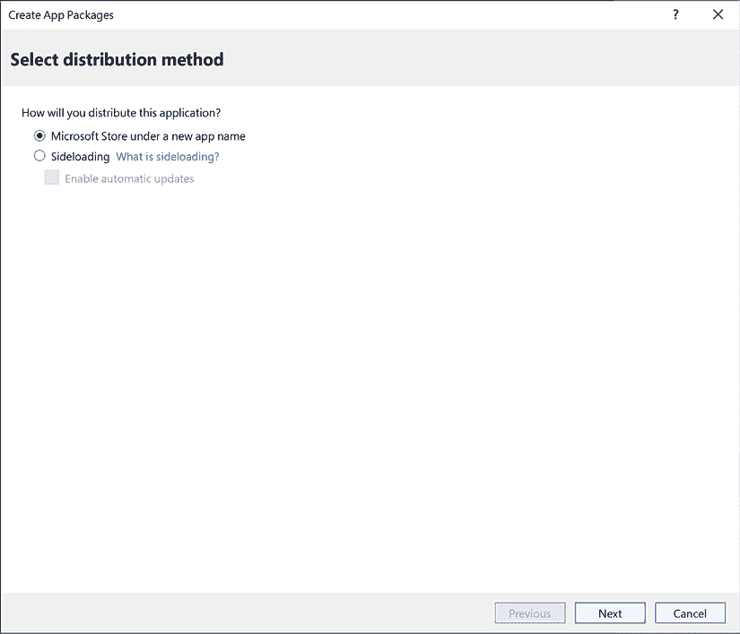

图 12.1：选择分发方法

在进行下一步之前，如 *图 12.2* 所示，我们需要准备好一个应用名称。

要创建一个新的应用名称，请按照以下步骤操作：

1.  访问以下 URL 的 **Microsoft Store 开发者仪表板**：[`partner.microsoft.com/en-us/dashboard/`](https://partner.microsoft.com/en-us/dashboard/)。

1.  注册并创建一个新的应用名称。

一旦我们有了应用名称，我们就可以将其与我们的应用关联，如 *图 12.2* 所示：

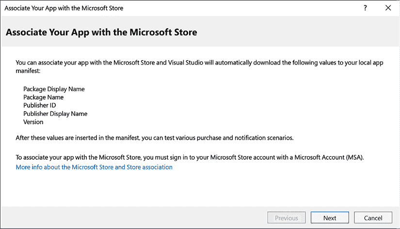

图 12.2：将您的应用与 Microsoft Store 关联

单击 **下一步** 按钮后，Visual Studio 将在 Microsoft Store 中搜索应用名称。Microsoft Store 中创建的应用名称，如 *图 12.3* 所示，将被检索以继续发布过程：

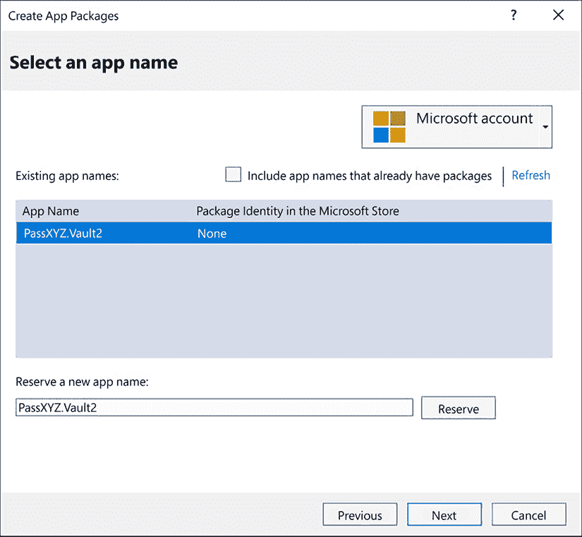

图 12.3：选择应用名称

选择应用名称后，单击 **下一步** 按钮。将出现一个选择和配置包的屏幕，如 *图 12.4* 所示。在此处，我们可以选择我们的应用包并配置其他设置，然后再进行发布过程。

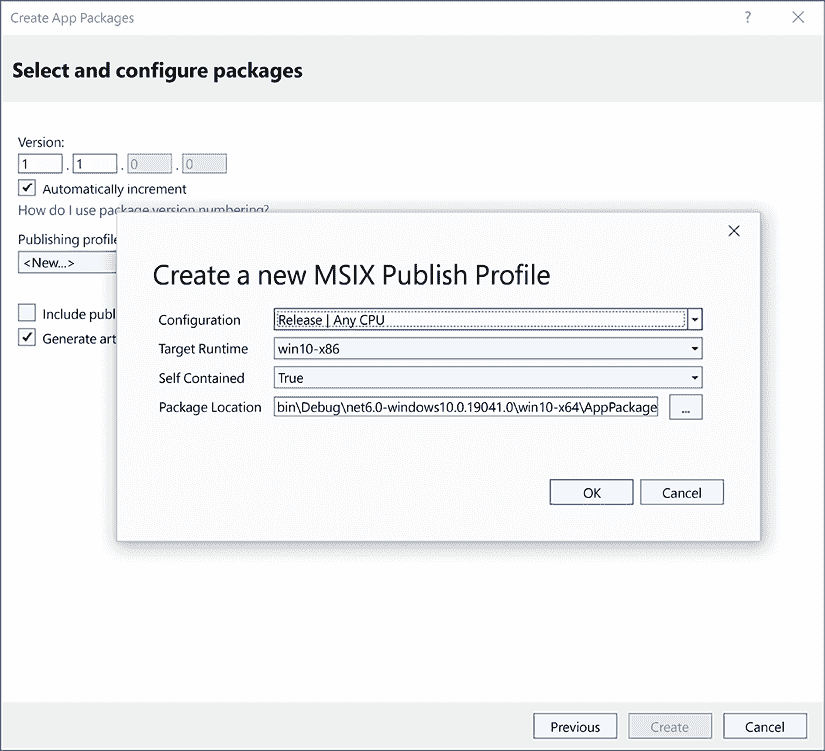

图 12.4：选择和配置包

要继续此过程，我们需要在此处创建一个发布配置文件。要创建 MSIX 发布配置文件，请按照以下步骤操作：

1.  在 **发布配置文件** 下单击下拉菜单。将显示一个对话框，如 *图 12.4* 所示。

1.  在对话框中单击 **确定** 按钮以创建一个新的 MSIX 发布配置文件。

一旦我们有了发布配置文件，点击**创建**按钮（现在将变为可用状态）以创建包。构建和包创建过程可能需要一些时间。完成后，我们将看到一个类似于*图 12.5*中所示的画面，表明 MSIX 包已准备好提交。

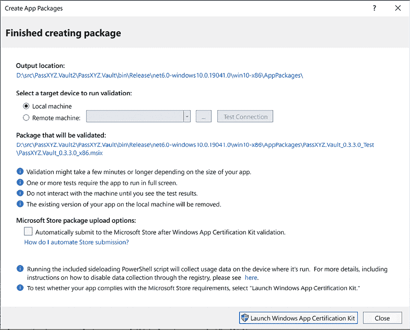

图 12.5：MSIX 包

新包的位置如*图 12.5*所示。有一个选项可以通过运行**Windows 应用认证工具包**来验证包。

在前面的步骤中，`project` 文件夹中已经创建了两个与应用程序发布相关的文件：

+   `Package.StoreAssociation.xml`：此文件将应用程序与 Microsoft Store 关联。

+   `Properties\PublishProfiles\MSIX-win10-x86.pubxml`：这是发布配置文件。

这两个文件可能包含敏感信息，因此它们不应被检入 Git 仓库。

要将构建过程集成到 CI/CD 环境中，我们需要使用命令行执行构建过程。要从项目文件夹中构建 `.msix` 包，请执行以下命令：

```swift
dotnet publish PassXYZ.Vault/PassXYZ.Vault.csproj -c Release -f net8.0-windows10.0.19041.0 
```

一旦构建了 `.msix` 包，我们就可以将其上传到 Microsoft Store 的应用程序提交的“包”部分。

## 发布到 Google Play 商店

为了准备提交到 Google Play 商店，您需要在 Google Play 控制台中创建一个新的应用程序。创建新的应用程序需要 Google 账户。

每个 Android 应用都有一个独特的应用程序 ID 或包 ID，它在配置文件 `AndroidManifest.xml` 中定义。此配置文件由 Visual Studio 从项目文件生成，可在 `Platforms/Android/AndroidManifest.xml` 中找到。让我们回顾一下我们的应用程序的 `AndroidManifest.xml`，如*清单 12.1*所示：

```swift
<?xml version="1.0" encoding="utf-8"?>
<manifest
  xmlns:android="http://schemas.android.com/apk/res/android"
  package="com.passxyz.vault2"                                    //(1)
  android:installLocation="auto"
  android:versionCode="1">                                        //(2)
  <application
    android:allowBackup="true"
    android:icon="@mipmap/appicon"
    android:roundIcon="@mipmap/appicon_round"
    android:supportsRtl="true"></application>
  <uses-permission
    android:name="android.permission.ACCESS_NETWORK_STATE" />
  <uses-permission android:name=
    "android.permission.INTERNET" />
</manifest> 
```

清单 12.1：`AndroidManifest.xml` ([`epa.ms/AndroidManifest12-1`](https://epa.ms/AndroidManifest12-1))

在我们的应用程序中，应用程序 ID 是 `"com.passxyz.vault2"` **(1**)，它由 `ApplicationId` 生成，版本是 `android:versionCode` 的值 **(2**)，它由 `ApplicationVersion` 生成。

应用程序标识符和版本的声明可以在 `PassXYZ.Vault.csproj` 项目文件中找到：

```swift
<!-- App Identifier -->
<ApplicationId>com.passxyz.vault2</ApplicationId>
<ApplicationIdGuid>8606B3B5-C03C-41D7-825F-B33718CF791C
  </ApplicationIdGuid>
<!-- Versions -->
<ApplicationDisplayVersion>1.0</ApplicationDisplayVersion>
<ApplicationVersion>1</ApplicationVersion> 
```

要对 Android 包进行签名，我们需要创建一个密钥库文件。有关创建密钥库文件和签名 Android 应用程序的更多信息，请参阅以下 Android 文档：[`developer.android.com/studio/publish/app-signing`](https://developer.android.com/studio/publish/app-signing)。

一旦我们有了密钥库文件并准备好了所需的配置，请在 Visual Studio 中按照以下步骤操作：

1.  将目标框架设置为 `net8.0-android`，将构建类型设置为 `Release`。

1.  右键单击项目节点，并选择**发布…**。

完成这些步骤后，构建将开始，并将创建存档，如*图 12.6*所示：

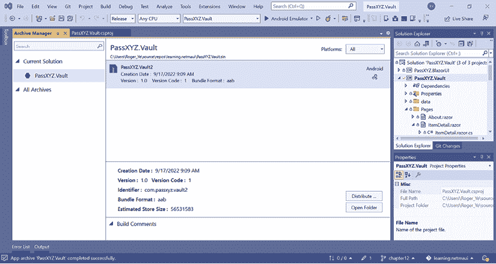

图 12.6：为 Android 创建存档

包创建完成后，我们可以通过点击**分发…**按钮来签名它。然后，我们需要选择一个分发渠道，如图*图 12.7*所示：

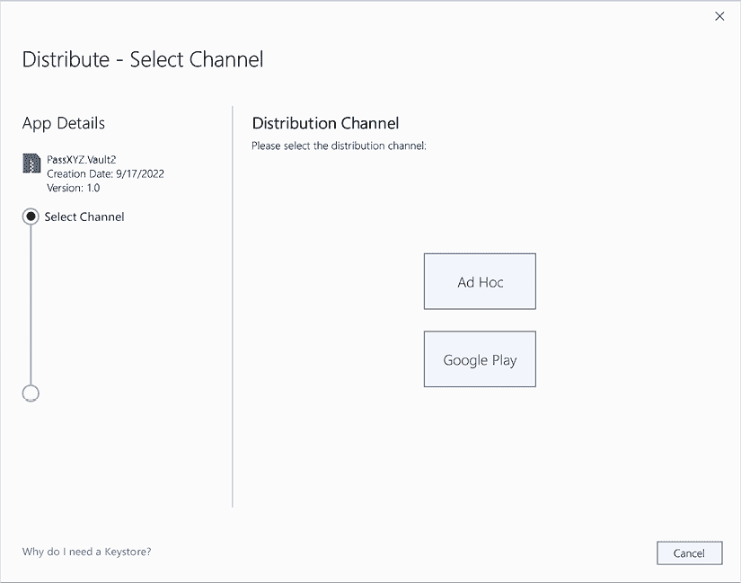

图 12.7：选择渠道

虽然可以选择**Google Play**来签名和提交包，但我们将选择**Ad Hoc**进行签名。稍后我们将手动将签名的包提交到 Google Play。

选择`Ad Hoc`后，我们将看到一个不同的屏幕，如图*图 12.8*所示，在那里我们可以继续签名我们的 Android 包的过程：

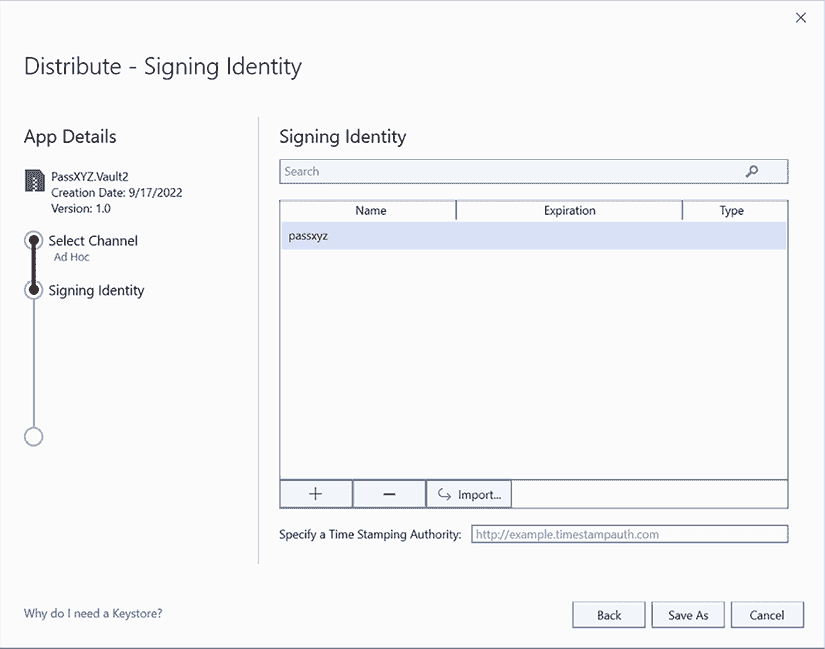

图 12.8：使用密钥库文件进行签名

如*图 12.8*所示，点击**+**按钮添加密钥库文件。添加密钥库文件后，点击**另存为**按钮来签名包。

签名的`.aab`文件可以通过 Google Play Console 提交到 Google Play Store。

如果你没有现有的密钥库文件，你可以按照前面提到的指南创建一个新的。密钥库文件的默认位置是`%USERPROFILE%\AppData\Local\Xamarin\Mono for Android\Keystore\`。

安全存储你的密钥库文件和密码至关重要，因为当你提交应用程序更新版本到 App Store 时，它们将再次被需要。

如果你选择*图 12.7*中的**Google Play**选项，显示的屏幕如图*图 12.9*所示。然后，你需要使用你的**客户端 ID**和**客户端密钥**访问 Google Play API。尽管**Google Play**和**Ad Hoc**选项有很强的相似性，但选择**Google Play**允许你自动将构建结果提交到 Google Play Store：

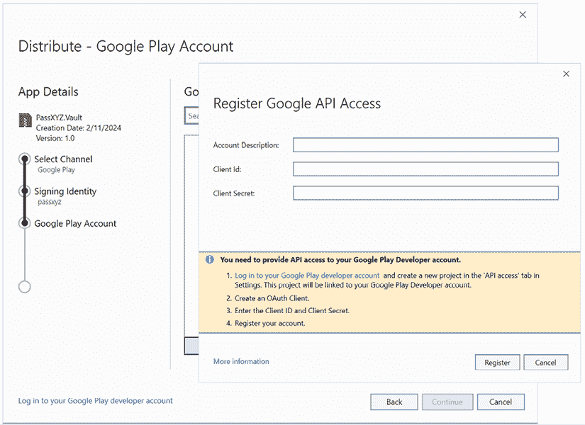

图 12.9：使用客户端 ID 和客户端密钥连接到 Google Play Store

要从命令行创建包，请在项目文件夹中执行以下命令：

```swift
dotnet publish PassXYZ.Vault/PassXYZ.Vault.csproj -c Release -f net8.0-android 
```

要了解如何将签名的 Android 应用程序包上传到 Google Play Store，请参阅以下 Android 文档：[`developer.android.com/studio/publish/upload-bundle`](https://developer.android.com/studio/publish/upload-bundle)。

## 发布到苹果的 App Store

我们可以同时讨论将 iOS 或 macOS 应用程序提交到 App Store 的过程，因为它们有很多相似之处。

在本节中，我们将讨论在 macOS 环境中构建、签名和部署.NET MAUI 应用程序到 iOS 和 macOS 的过程。

由于苹果的要求，构建、签名和部署.NET MAUI 应用程序到 iOS 或 macOS 需要特定的工具和环境。以下是你需要的：

+   **macOS**: 由于 Apple 的限制，您必须在 Mac 上构建 iOS 和 macOS 应用。这可以是一个本地机器，或者您可以使用 GitHub Actions 或 Azure Pipelines 等云 macOS 环境，这些环境提供托管 macOS 代理。

+   **Xcode**: 安装最新稳定的 Xcode 版本。这是 iOS SDK 和模拟器所必需的。

+   **.NET 8**: .NET MAUI 是基于 .NET 8 构建的，因此您需要安装 .NET 8 SDK。

+   **MAUI**: 安装最新稳定的 .NET MAUI 版本，包括 .NET MAUI 工作负载和模板。

+   **Apple 开发者账号**: 要签名并将应用部署到 App Store，您需要一个 Apple 开发者账号。这需要年度订阅费用，但这是将您的应用分发给用户所必需的。

+   **配置文件和证书**: 要签名您的应用，您需要一个配置文件和相应的分发证书。您可以在 Apple 开发者门户中创建和管理这些文件，或者通过 Xcode 自动管理它们。有关如何创建签名证书和配置文件的详细信息，请参阅以下文档：[`learn.microsoft.com/en-us/dotnet/maui/ios/deployment/provision`](https://learn.microsoft.com/en-us/dotnet/maui/ios/deployment/provision)。

为了同时满足 Xamarin 和 .NET MAUI 构建的需求，您可能在 macOS 上安装了多个 Xcode。您可以使用以下命令检查您 Mac 上的所有 Xcode 安装：

```swift
% ls /Applications | grep 'Xcode'
Xcode.app
Xcode_14.3.1.app
Xcode_15.2.app 
```

要检查当前选定的 Xcode，您可以使用此命令：

```swift
% xcrun xcode-select–print-path
/Applications/Xcode_15.2.app/Contents/Developer 
```

如果您需要选择特定的 Xcode 版本，可以使用以下命令：

```swift
% sudo xcode-select -s /Applications/Xcode.app 
```

一旦安装并设置好这些工具，您就可以使用 .NET CLI 进行命令行构建和部署，来构建、签名和部署您的 .NET MAUI iOS 或 macOS 应用。

在 iOS 或 macOS 应用中，捆绑标识符和捆绑版本用于标识一个应用。这些信息存储在 `Info.plist` 配置文件中。捆绑标识符由 `ApplicationId` 生成，而捆绑版本由 Visual Studio 项目文件中的 `ApplicationVersion` 生成。

iOS 应用可以通过 App Store 独家分发。提交的包是一个具有 `.ipa` 扩展名的文件。尽管 macOS 应用也可以通过 App Store 分发，但它们的包可以直接安装。

虽然一些发布步骤可以在 Windows 环境中执行，但您仍然需要连接到一个可网络访问的 macOS 计算机。为了减少复杂性，我们使用 macOS 环境来构建 iOS 和 macOS 应用。在构建包之前，我们需要更新 Visual Studio 项目文件以配置我们自己的签名证书和分发配置文件：

```swift
<PropertyGroup Condition="$(TargetFramework.Contains('-ios')) and '$(Configuration)' == 'Release'">
  <RuntimeIdentifier>ios-arm64</RuntimeIdentifier>
  <CodesignKey>iPhone Distribution: Shugao Ye (W9WL9WPD24)
  </CodesignKey>
  <CodesignProvision>passxyz_2023</CodesignProvision>
</PropertyGroup>
<PropertyGroup Condition="$(TargetFramework.Contains('-
  maccatalyst')) and '$(Configuration)' == 'Release'">
  <CodesignEntitlement>Entitlements.plist
  </CodesignEntitlement>
  <CodesignKey>
    3rd Party Mac Developer Application: Shugao Ye
      (W9WL9WPD24)
  </CodesignKey>
  <CodesignProvision>passxyz.maccatalyst</CodesignProvision>
</PropertyGroup> 
```

如上图所示，您可以为 iOS 和 macOS 构建使用条件配置。iOS 和 macOS 使用不同的签名证书和分发配置文件。

如果您不确定设置是否正确，可以使用`Xcode`进行验证。在 Xcode 中创建一个应用涉及使用与我们的应用相同的`"com.passxyz.vault2"`捆绑 ID。之后，检查**签名**配置，如图 12.10 所示。这个过程允许您比较 Visual Studio 项目和 Xcode 中相应的签名配置，帮助识别任何设置上的差异或问题。

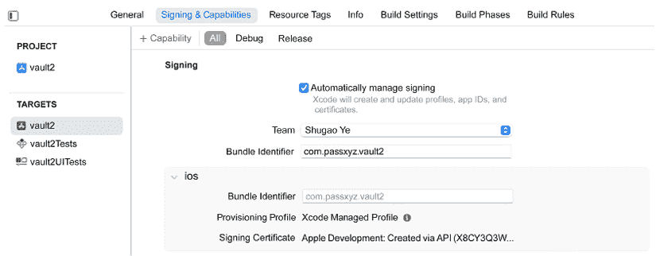

图 12.10：Xcode 中的 iOS 签名设置

如果签名证书或配置文件存在问题，Xcode 将报告错误信息。一旦 Xcode 中的设置正确，就可以在 Visual Studio 项目中使用相同的设置而不会出现任何问题。

在所有配置就绪后，我们可以使用以下命令在项目文件夹中构建`.ipa`文件：

```swift
dotnet publish PassXYZ.Vault/PassXYZ.Vault.csproj -c Release -f net8.0-ios /p:CreatePackage=true /p:ArchiveOnBuild=True 
```

一旦命令执行成功，将生成一个`.ipa`文件。我们可以将此文件提交到 App Store。有三种方法可以用来将包上传到 App Store。有关更多详细信息，请参阅以下文档：[`developer.apple.com/help/app-store-connect/manage-builds/upload-builds`](https://developer.apple.com/help/app-store-connect/manage-builds/upload-builds)。

从文档中我们知道，我们可以使用**Xcode**、**altool**或**Transporter**上传一个包。

由于我们没有直接使用 Xcode 来构建.NET MAUI 应用，因此我们不会使用 Xcode 将构建上传到 Apple Store。如果目标是建立一个全面的 CI/CD 解决方案，可以使用**altool**将构建上传到 Apple Store。

然而，在本章中，我们的主要关注点是**持续集成**（**CI**），将**持续交付**（**CD**）留给你独立深入研究。CD 的设置通常需要更多的账户特定配置。

我们将在这里使用 Transporter 应用。在登录到 Transporter 应用后，我们可以将包上传到 App Store，如图 12.11 所示：

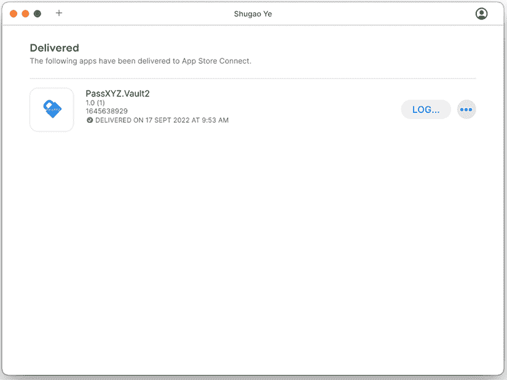

图 12.11：使用 Transporter 应用上传包

macOS 包的构建和上传过程与 iOS 应用类似。有三种不同的框架（AppKit、Mac Catalyst 和 SwiftUI）可以用来构建 macOS 应用。在.NET MAUI 中，Mac Catalyst 用于平台特定的实现。

默认情况下，Mac Catalyst 应用中未启用 App 沙盒，因此我们需要启用它。要在 macOS 应用中启用它，我们需要将一个`Entitlements.plist`文件添加到构建配置中。

我们可以查看列表 12.2 中的`Entitlements.plist`文件：

```swift
<?xml version="1.0" encoding="UTF-8"?>
<!DOCTYPE plist PUBLIC "-//Apple//DTD PLIST 1.0//EN"
  "http://www.apple.com/DTDs/PropertyList-1.0.dtd">
<plist version="1.0">
<dict>
  <key>com.apple.security.app-sandbox</key>
  <true/>
  <key>com.apple.security.files.user-selected.read-only
    </key>
  <true/>
  <key>com.apple.security.network.client</key>
  <true/>
</dict>
</plist> 
```

列表 12.2：`Entitlements.plist` ([`epa.ms/Entitlements12-2`](https://epa.ms/Entitlements12-2))

就像在 iOS 构建中一样，我们可以在 Xcode 中验证 macOS 构建的配置，如图*图 12.12*所示。通过这样做，您确保在构建和提交到 App Store 之前，我们的 macOS 应用程序已正确设置签名和配置。

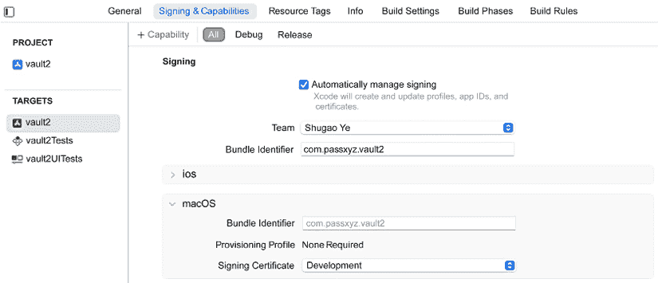

图 12.12：Xcode 中 macOS 应用程序的签名设置

在所有配置就绪后，我们可以使用以下命令在我们的项目文件夹中构建包：

```swift
dotnet publish PassXYZ.Vault/PassXYZ.Vault.csproj -c Release -f net8.0-maccatalyst  /p:CreatePackage=true /p:EnablePackageSigning=true" 
```

在成功构建包之后，我们可以使用 Transporter 应用程序将`.pkg`文件上传到 App Store，如图*图 12.13*所示。这将证明 iOS 和 macOS 包已成功上传到 App Store。然后，您可以继续到 App Store Connect 完成剩余的提交过程。

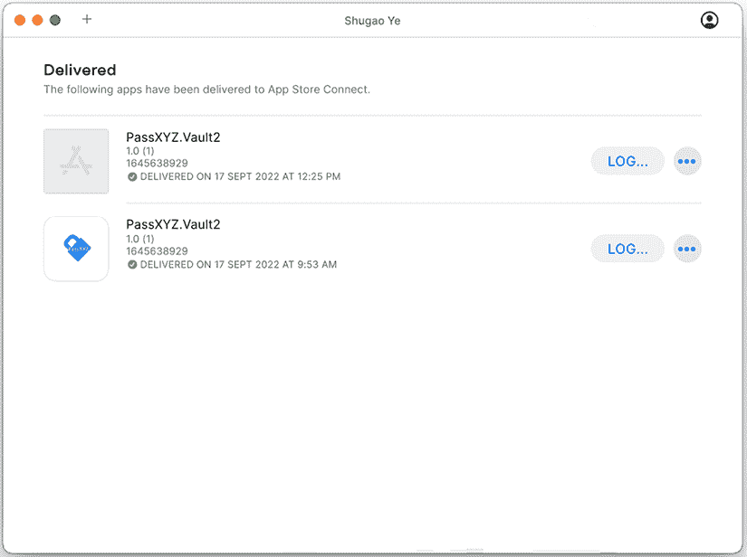

图 12.13：使用 Transporter 应用程序上传 macOS 应用程序

在将包上传到 Microsoft Store、Google Play Store 和 Apple App Store 之后，我们可以在最终发布之前使用商店提供的测试工具测试上传的包：

+   **Apple App Store**：**TestFlight**可以在生产发布之前用于测试 iOS/macOS 应用程序

+   **Google Play Store**：在生产发布之前可以设置 Alpha 或 beta 测试

+   **Microsoft Store**：包航班可以在 Microsoft Store 上用于测试上传的包

现在我们已经学会了为支持的平台准备应用程序包的基本步骤，我们可以探索在`CI/CD`环境中设置.NET MAUI 应用程序的自动化构建，例如 GitHub Actions 或 Azure DevOps。实施 CI/CD 可以简化开发和部署过程，确保您的应用程序在您进行更新和改进时持续进行测试、构建和准备发布。

# GitHub Actions

由于我们的源代码托管在 GitHub 上，让我们以 GitHub Actions 为例，向您介绍如何设置.NET MAUI 开发的 CI 工作流程。GitHub Actions 是一个自动化平台，可以帮助简化并自动化与项目相关的关键任务，如构建、测试和部署代码更新。这个强大的功能确保您的代码始终保持验证状态，随时准备部署，使开发者能够专注于编写新功能和修复错误，同时保持质量保证。

## 理解 GitHub Actions

对于.NET MAUI 应用程序开发，我们的目标是构建、测试并将我们的应用程序部署到应用商店或指定的发布渠道。在本节中，我们将专注于使用 GitHub Actions 进行 CI，而不是同时进行 CI 和 CD。要将应用程序部署到各种商店，有许多针对特定账户的设置步骤；请参阅.NET MAUI 文档以获取详细信息：[`learn.microsoft.com/en-us/dotnet/maui/deployment/`](https://learn.microsoft.com/en-us/dotnet/maui/deployment/).

GitHub Actions 工作流程是一个自动构建和部署项目交付成果的过程。工作流程通常从`push`或`pull_request`事件等事件开始，或者当提交问题。一旦工作流程被触发，定义的作业将在运行者内部开始执行某些任务。每个作业由一个或多个步骤组成，这些步骤要么运行脚本，要么执行操作。

总结来说，GitHub Actions 包括事件、运行者、作业/步骤、操作和运行者。这些组件协同工作，以自动化你的开发和部署过程中的各种任务，使其更加高效且错误率更低。

### 工作流程

GitHub Actions 工作流程由`.github/workflows`目录中的 YAML 文件定义。YAML 是 JSON 的超集，提供了一种更易于阅读的语言。一个仓库可以有一个或多个工作流程来执行不同的作业。参考*图 12.14*了解`PassXYZ.Vault`项目中定义的工作流程。

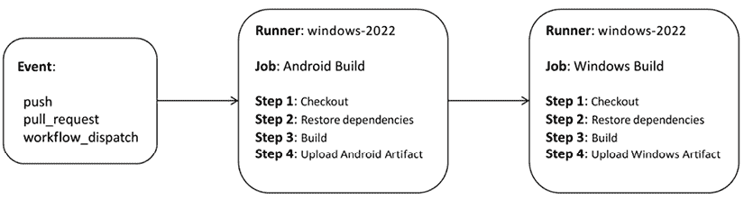

图 12.14：Windows 运行者的工作流程

如*图 12.14*所示，此示例说明了工作流程如何执行 Android 和 Windows 构建。工作流程由`push`或`pull_request`事件触发，或手动触发。它在一个 Windows 运行者内部运行以执行构建。当工作流程被触发时，两个作业**Android Build**和**Windows Build**开始执行。每个作业包括四个步骤来执行构建，如*图 12.14*所示。

在我们的项目中，我们定义了以下两个工作流程：

+   `passxyz-ci-macos.yml`: 这是一个在 macOS 运行者上构建 iOS 和 macOS 的工作流程。

+   `passxyz-ci-windows.yml`: 这是一个在 Windows 运行者上构建 Android 和 Windows 的工作流程。

我们可以在*列表 12.3*和*列表 12.4*中看到 YAML 文件：

```swift
name: PassXYZ.Vault CI Build (Windows)
on:                                                                //(1)
  push:                                                            //(2)
    branches: [ chapter12 ]
    paths-ignore:
      - '**/*.md'
      - '**/*.gitignore'
      - '**/*.gitattributes'
  pull_request:                                                    //(3)
    branches: [ chapter12 ]
  workflow_dispatch:                                               //(4)
permissions:
  contents: read
env:
  DOTNET_NOLOGO: true
  DOTNET_SKIP_FIRST_TIME_EXPERIENCE: true
  DOTNET_CLI_TELEMETRY_OPTOUT: true
  DOTNETVERSION: 8.0.x
  DOTNETSDK: 'net8.0'
  PROJECT_NAME: PassXYZ.Vault
jobs:                                                              //(5)
# MAUI Android Build
  build-android:                                                   //(6)
    runs-on: windows-latest                                        //(7)
    name: Android Build
    steps:                                                         //(8)
      - name: Checkout
        uses: actions/checkout@v3                                  //(9)
      - name: Setup .NET
        uses: actions/setup-dotnet@v2
        with:
          dotnet-version: ${{env.DOTNETVERSION}}
      - name: Install MAUI workload
        run: dotnet workload install maui   
      - name: Restore Dependencies
        run: dotnet restore ${{env.PROJECT_NAME}}/$
          {{env.PROJECT_NAME}}.csproj
      - name: Build MAUI Android
        run: dotnet publish ${{env.PROJECT_NAME}}/$
          {{env.PROJECT_NAME}}.csproj -c Release -f ${{env.DOTNETSDK}}-android --no-restore
      - name: Upload Android Artifact
        uses: actions/upload-artifact@v3
        with:
          name: passxyz-android-ci-build
          path: ${{env.PROJECT_NAME}}/bin/Release/
${{env.DOTNETSDK}}-android/*Signed.a*
# MAUI Windows Build
  build-windows:
    runs-on: windows-latest
    name: Windows Build
    steps:
      - name: Checkout
        uses: actions/checkout@v3
      - name: Setup .NET
        uses: actions/setup-dotnet@v2
        with:
          dotnet-version: ${{env.DOTNETVERSION}}
      - name: Install MAUI workload
        run: dotnet workload install maui   
      - name: Restore Dependencies
        run: dotnet restore ${{env.PROJECT_NAME}}
          /${{env.PROJECT_NAME}}.csproj
      - name: Build MAUI Windows
        run: dotnet publish ${{env.PROJECT_NAME}}/
${{env.PROJECT_NAME}}.csproj -c Release -f ${{env.DOTNETSDK}}-windows10.0.19041.0
      - name: Upload Windows Artifact
        uses: actions/upload-artifact@v3
        with:
          name: passxyz-windows-ci-build
          path: ${{env.PROJECT_NAME}}/... 
```

列表 12.3: `passxyz-ci-windows.yml` ([`epa.ms/passxyz-ci-windows12-3`](https://epa.ms/passxyz-ci-windows12-3))

这些工作流程文件定义了自动化不同目标平台构建过程的必要步骤，有助于确保我们的.NET MAUI 应用始终准备好部署。

在接下来的会话中，我们将详细分析它，提供关于这些工作流程如何帮助自动化你的.NET MAUI 应用构建过程的见解。了解这些工作流程文件的结构和功能将使你能够自定义和增强你的开发流程，确保你的应用始终准备好部署并满足你的特定要求。

### 事件

事件对于触发工作流程至关重要，并且它们在`on:`关键字**（1**）之后定义。在先前的流程中，我们定义了`push`**（2**），`pull_request`**（3**）和`workflow_dispatch`**（4**）事件。对于`push`和`pull_request`事件，我们监控主分支的活动，并且也不忽略任何与构建相关的提交，例如 Markdown 文件或配置文件。

有关可用于触发工作流程的事件的更多信息，请参阅以下 GitHub 文档：[`docs.github.com/en/actions/using-workflows/events-that-trigger-workflows`](https://docs.github.com/en/actions/using-workflows/events-that-trigger-workflows)。

理解触发工作流程的事件可以使您自定义在项目更改时执行特定操作的时间。这有助于在适应您独特的开发流程需求的同时维护应用程序的质量。

### 任务

当工作流程被触发时，它将启动定义的任务的执行。任务在 `jobs`: **(5)** 关键字之后定义。一个或多个任务可以在工作流程中定义，每个任务通过一个任务 ID 来标识，例如 `build-android` **(6)**。在 *Listing 12.3* 中有两个任务，`build-android` 和 `build-windows`。每个任务都可以定义一个名称、一个运行器和多个步骤。

任务是工作流程的核心组件，包含在特定事件发生时需要执行的任务序列。通过定义针对您应用程序开发需求特定的任务，您可以在构建过程中确保采取正确的操作，从而实现更流畅、更高效的开发流程。

### 运行器

运行器是执行任务的平台类型。在我们的配置中，Android 和 Windows 任务都使用 Windows 运行器执行。运行器在 `runs-on`: **(7)** 关键字之后定义。有关运行器配置的更多信息，请参阅 GitHub Actions 文档。我们使用的运行器是 `windows-latest`，这是运行器镜像的标签。

选择适合您任务的正确运行器对于确保您的应用程序正确且高效地构建至关重要。通过了解可用的运行器选项及其预安装的工具，您可以更好地根据您的 .NET MAUI 应用程序的独特需求定制您的开发流程。

### 步骤

在任务中可以定义多个步骤，它们在 `steps`: **(8)** 关键字之后定义。在 Android 和 Windows 构建中，存在多个步骤：*checkout*、*install .NET MAUI workload*、*restore dependencies*、*build* 和 *upload*。每个步骤都可以运行一个脚本或操作。在 checkout 步骤中，在 `uses:` **(9)** 关键字之后使用 `checkout` 动作。操作是 GitHub Actions 平台上的自定义应用程序，用于执行复杂但频繁重复的任务。使用操作允许代码重用，类似于面向对象编程中组件的功能。要使用操作，只需指定操作名称和可选的版本号。在我们的脚本中，我们可以将 checkout 操作指定为 `actions/checkout@v3`。

`checkout` 动作的源代码托管在 GitHub 上，可以在以下网站找到：[`github.com/actions/checkout`](https://github.com/actions/checkout)。

一旦检出源代码，我们需要在 `run` 语法之后使用以下命令安装 .NET MAUI 工作负载：

```swift
dotnet workload install maui 
```

在恢复和构建步骤中，我们可以在 `run` 语法之后的 `dotnet` 命令运行以下内容：

```swift
dotnet restore ${{env.PROJECT_NAME}}/${{env.PROJECT_NAME}}.csproj 
```

构建完成后，我们可以使用另一个 `upload-artifact` 动作上传工件。

我们已经引入了 `passxyz-ci-windows.yml` 工作流程，该工作流程执行 Android 和 Windows 构建。现在，让我们回顾 `passxyz-ci-macos.yml` 工作流程，该工作流程执行 iOS 和 macOS 构建，如*清单 12.4*所示：

```swift
name: PassXYZ.Vault CI Build (MacOS)
on:
  push:
    branches: [ chapter12 ]
    paths-ignore:
      - '**/*.md'
      - '**/*.gitignore'
      - '**/*.gitattributes'
  pull_request:
    branches: [ chapter12 ]
  workflow_dispatch:
permissions:
  contents: read
env:
  DOTNET_NOLOGO: true
  DOTNET_SKIP_FIRST_TIME_EXPERIENCE: true
  DOTNET_CLI_TELEMETRY_OPTOUT: true
  DOTNETVERSION: 8.0.x
  DOTNETSDK: 'net8.0'
  PROJECT_NAME: PassXYZ.Vault
jobs:
# MAUI iOS Build
  build-ios:
    runs-on: macos-14                                            //(1)
    name: iOS Build
    steps:
      - name: Setup Xcode
        run: sudo xcode-select -s /Applications/Xcode_15.1.0.app
      - name: Checkout
        uses: actions/checkout@v3
      - name: Setup .NET
        uses: actions/setup-dotnet@v2
        with:
          dotnet-version: ${{env.DOTNETVERSION}}
      - name: Install MAUI workload
        run: dotnet workload install maui   
      - name: Restore Dependencies
        run: dotnet restore ${{env.PROJECT_NAME}}
          /${{env.PROJECT_NAME}}.csproj
      - name: Build MAUI iOS
        run: dotnet build ${{env.PROJECT_NAME}}
          /${{env.PROJECT_NAME}}.csproj -c Release -f
${{env.DOTNETSDK}}-ios --no-restore /p:buildForSimulator=True
/p:packageApp=True /p:ArchiveOnBuild=False
      - name: Upload iOS Artifact
        uses: actions/upload-artifact@v3
        with:
          name: passxyz-ios-ci-build
          path: ${{env.PROJECT_NAME}}/bin/Release/
${{env.DOTNETSDK}}-ios/iossimulator-x64/**/*.app
# MAUI MacCatalyst Build
  build-mac:
    runs-on: macos-14
    name: MacCatalyst Build
    steps:
      - name: Checkout
        uses: actions/checkout@v3
      - name: Setup .NET
        uses: actions/setup-dotnet@v2
        with:
          dotnet-version: ${{env.DOTNETVERSION}}
      - name: Install MAUI workload
        run: dotnet workload install maui   
      - name: Restore Dependencies
        run: dotnet restore ${{env.PROJECT_NAME}}
          /${{env.PROJECT_NAME}}.csproj
      - name: Build MAUI MacCatalyst
        run: dotnet publish ${{env.PROJECT_NAME}}
          /${{env.PROJECT_NAME}}.csproj -c Release 
-f${{env.DOTNETSDK}}-maccatalyst --no-restore -p:BuildIpa=True
      - name: Upload MacCatalyst Artifact
        uses: actions/upload-artifact@v3
        with:
          name: passxyz-macos-ci-build
          path: ${{env.PROJECT_NAME}}/bin/Release/${{env.DOTNETSDK}}-
            maccatalyst/maccatalyst-x64/publish/*.pkg 
```

清单 12.4：`passxyz-ci-macos.yml` ([`epa.ms/passxyz-ci-macos12-4`](https://epa.ms/passxyz-ci-macos12-4))

此工作流程遵循类似的原则，包括恢复、安装、构建和上传 iOS 和 macOS 版本的 .NET MAUI 应用的工件步骤。这里的区别在于使用了 `macos-14` **(1)** 运行器。其余步骤与 Windows 或 Android 构建类似。

我们现在已经介绍了在 GitHub Actions 中配置所有构建的过程。您可以在 GitHub 上检查构建状态，以查看应用构建在 .NET MAUI 项目中的进展和成功情况。监控构建状态可以帮助您在开发过程中识别任何潜在的应用问题，并保持代码质量。


图 12.15：Android 和 Windows 构建状态

如*图 12.15*所示，Android 和 Windows 构建均成功完成。构建工件可以在构建完成后从 GitHub 下载。这确保了您能够访问最新的应用构建版本，使得分发它们进行测试或部署变得更加容易。

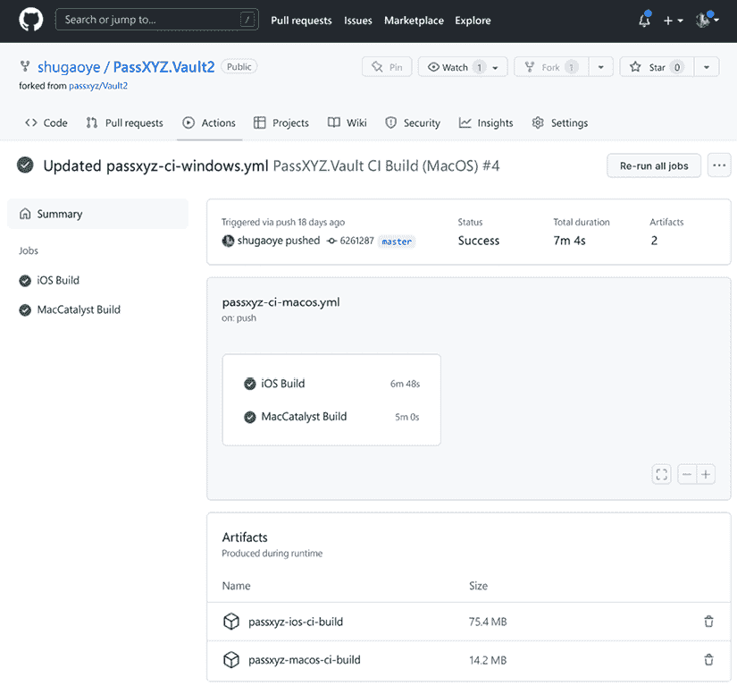

图 12.16：iOS 和 MacCatalyst 构建状态

如*图 12.16*所示，iOS 和 Mac Catalyst 构建均成功完成。

通过成功配置 GitHub Actions 以支持您的 .NET MAUI 项目，您可以维护一个持续集成（CI）流程，确保代码质量并简化开发过程。此外，这个自动化工作流程简化了应用构建的管理，使开发者能够专注于功能开发和错误修复。

我们现在已经介绍了如何使用 GitHub Actions 自动化打包应用以供应用商店提交的过程。有了这些技术，您可以确保您的 .NET MAUI 应用开发流程更加顺畅和高效，从而实现代码质量更高，应用商店部署更快。

# 摘要

CI/CD 是当今开发过程中的常见实践。在本章中，我们介绍了如何准备构建，以便生成的包可以用于提交到各种应用商店。构建包提交之后的流程没有涵盖，因为这些是特定于平台和账户的话题。请参阅*进一步阅读*部分，了解更多关于如何将应用程序发布到 Google Play、Apple Store 和 Microsoft Store 的信息。

在讨论了每个平台的构建过程之后，我们展示了如何使用 GitHub Actions 自动化此过程。

通过本书您所学的所有技能，您应该能够开发自己的 .NET MAUI 应用程序，并准备好将您的应用程序提交到支持的 App Store。随着您作为开发者的成长，请记住探索新技术并深化对 .NET MAUI 的理解，以创建更好的应用程序并简化您的开发流程。

这里有一些在线资源，可以帮助您学习 .NET MAUI 并了解最新的趋势和新闻：

+   **官方 .NET 博客**：微软 .NET 团队经常发布关于 .NET MAUI 的更新和教程。

+   **.NET MAUI GitHub 仓库**：这是 .NET MAUI 的官方仓库。您在这里可以找到最新的代码、问题和关于 .NET MAUI 的讨论。

+   **Microsoft 文档**：这是微软的官方文档，它提供了学习 .NET MAUI 的全面指南。

+   **Microsoft Learn**：一个可以找到各种学习路径和模块的平台。您可以找到关于 .NET 的资源，以及可能关于 .NET MAUI 的未来内容。

+   .**NET 社区站立会议**：由微软工程师主持的定期社区站立会议，他们在这里讨论最新的趋势和 .NET MAUI 的更新。

+   **Stack Overflow**：一个专业和爱好者程序员的问答网站。

+   .**NET MAUI YouTube 教程**：您可以通过在 YouTube 上观看分步教程来学习 .NET MAUI。例如，Xamarin 开发者 YouTube 频道发布了关于 .NET MAUI 的教程和讨论。

+   **Twitter**：关注官方 .NET 账号 (`@dotnet`) 和其他微软开发者，获取最新的更新和发展动态。

# 进一步阅读

+   开始使用 DevOps 和 .NET MAUI：[`devblogs.microsoft.com/dotnet/devops-for-dotnet-maui/`](https://devblogs.microsoft.com/dotnet/devops-for-dotnet-maui/)

+   将您的应用程序上传到 Play Console：[`developer.android.com/studio/publish/upload-bundle`](https://developer.android.com/studio/publish/upload-bundle)

+   发布 iOS 平台的 .NET MAUI 应用程序：[`learn.microsoft.com/en-us/dotnet/maui/ios/deployment/?view=net-maui-8.0`](https://learn.microsoft.com/en-us/dotnet/maui/ios/deployment/?view=net-maui-8.0)

+   发布 Mac Catalyst 平台的 .NET MAUI 应用程序：[`learn.microsoft.com/en-us/dotnet/maui/mac-catalyst/deployment/?view=net-maui-8.0`](https://learn.microsoft.com/en-us/dotnet/maui/mac-catalyst/deployment/?view=net-maui-8.0)

+   发布 Android 平台的 .NET MAUI 应用程序：[`learn.microsoft.com/en-us/dotnet/maui/android/deployment/overview?view=net-maui-8.0`](https://learn.microsoft.com/en-us/dotnet/maui/android/deployment/overview?view=net-maui-8.0)

+   发布 Windows 平台的 .NET MAUI 应用程序：[`learn.microsoft.com/en-us/dotnet/maui/windows/deployment/overview?view=net-maui-8.0`](https://learn.microsoft.com/en-us/dotnet/maui/windows/deployment/overview?view=net-maui-8.0)

+   将 iOS 构建上传到 Apple Store: [`developer.apple.com/help/app-store-connect/manage-builds/upload-builds`](https://developer.apple.com/help/app-store-connect/manage-builds/upload-builds)

# 留下评论！

*喜欢这本书吗？通过留下亚马逊评论来帮助像你一样的读者。扫描下面的二维码获取 40% 的折扣码。*


**限时优惠**
