# 2

# iPhone 项目 – 税收计算器设计

在上一章中，我们对 Swift 和 SwiftUI 进行了回顾。我们研究了要求、使用的编码标准和 SwiftUI 组件的基础。我们将在以下章节中使用这些内容。

在本章中，我们将着手设计我们的第一个项目，一个税收计算器。我们将评估设计此类应用程序的要求，并讨论设计规格，以便我们更好地理解所需的内容以及它们如何相互配合。然后，我们将开始我们的应用程序编码过程，构建 UI，这将连接在一起，使应用程序在下一章中完全运行。这个项目将教会我们 SwiftUI 组件的基础以及如何与外部代码库交互。我们将在以下章节中讨论所有这些内容：

+   技术要求

+   理解设计规格

+   构建“计算器”UI

到本章结束时，您将更好地理解所需的内容和我们的应用程序设计。您还将拥有一个骨架 UI，它将作为下一章使计算器工作的基础。

在下一节中，我们将提供我们应用程序设计规格的详细说明，并查看应用程序的外观原型。

# 技术要求

本章要求您从 Apple 的 App Store 下载 Xcode 版本 14 或更高版本。

要安装 Xcode，只需在 App Store 中搜索`Xcode`，然后选择并下载最新版本。打开 Xcode 并遵循任何额外的安装说明。一旦 Xcode 打开并启动，你就可以开始了。

Xcode 14 版本具有以下功能/要求：

+   包含适用于 iOS 16、iPadOS 16、macOS 12.3、tvOS 16 和 watchOS 9 的 SDK。

+   支持 iOS 11 或更高版本、tvOS 11 或更高版本和 watchOS 4 或更高版本的设备调试。

+   需要运行 macOS Monterey 12.5 或更高版本的 Mac。

从以下 GitHub 链接下载示例代码：

[`github.com/PacktPublishing/Elevate-SwiftUI-Skills-by-Building-Projects`](https://github.com/PacktPublishing/Elevate-SwiftUI-Skills-by-Building-Projects)

在下一节中，我们将提供我们应用程序设计规格的详细说明，并查看应用程序的外观原型。

# 理解设计规格

在本节中，我们将查看我们的税收计算器应用程序的设计规格。本节描述了我们将实现的功能。确定所需功能的最佳方法是站在用户的角度，确定他们将如何使用应用程序，并将其分解为单独的步骤。

我们应用程序的功能如下：

+   收入录入 – 输入收入的能力。

+   工资摘要 – 将被征税的金额摘要以及剩余的收入。

+   税收分解 – 指定工资所缴纳的税额分解，即税率。

+   不同类型的税收 – 能够计算不同类型税收的分解，例如收入、房地产交易、遗产和印花税。

+   税收地理区域 – 能够计算不同地理区域（包括国家和州）的税收分解。

+   前两个的结合 – 在不同地理区域计算不同税种的分解能力。

+   用户系统 – 允许用户创建账户以存储税收计算，查看税收如何随着新税法的变化而变化，等等。

现在我们已经列出了我们希望的理想功能，接下来，对我们来说，确定哪些功能是绝对必要的非常重要。为了做到这一点，我们必须了解我们产品的最终用途。对我来说，创建这个税收计算器的目的不是为了发布它并使其服务于数百万的人，而是作为一个个人项目供我们使用。这是为了展示在本书的背景下 SwiftUI 的基本实现。基于这一点，我知道并不是所有功能都是必需的；实际上，如果某些功能被省略并分配给你作为开发者的额外任务，那将是有用的。基于所有这些，以下是我们将实现的核心功能：

+   收入输入

+   工资摘要

+   税收分解

其余的功能将留给你在完成这一章和下一章后作为练习来实现。下一节将涵盖我们应用程序的验收标准。

## 验收标准

我们将在下一章的末尾讨论我们应用程序的强制性要求，我们绝对希望在最终产品中看到这些要求。如果可能的话，我们应该尝试使它们可衡量。让我们现在就来做这件事：

+   错误检测：

    +   **非数字**（**NaN**）值

    +   等于或小于 0 的值

+   提供税前和税后的工资

+   一个饼图来直观地展示分解

+   进度条来进一步扩展分解

+   导航，使用户能够轻松地在页面之间切换

开发测试用例，以测试应用程序的验收标准。使用这种方法可以让你看到最终用户将使用应用程序的条件以及需要达到的功能水平，以便被认为是成功的。

### 线框

设计布局最有用的工具之一是线框。线框是布局外观的概述。以下图显示了我们的应用程序首页使用线框将看起来是什么样子：

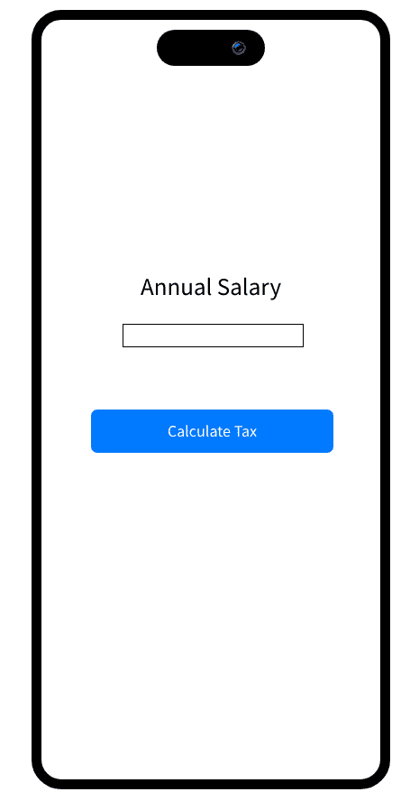

图 2.1 – 封面线框预览

以下图显示了我们的结果页面将如何看起来：

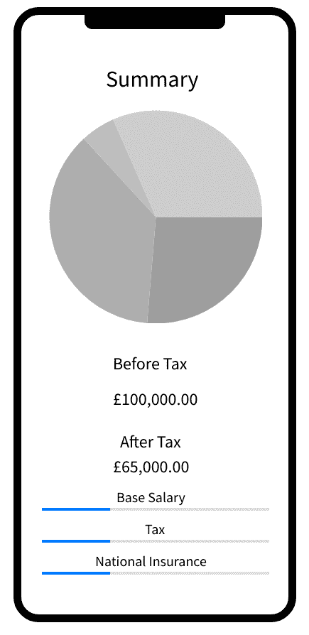

图 2.2 – 结果页面线框预览

在下一节中，我们将构建我们应用程序的界面，并确保它看起来与我们在线框图中设计的一样。虽然我们将以相同的方式构建它，但可能会有一些小的差异。这将为下一章中将其全部连接在一起奠定基础。

## 构建计算器 UI

我们现在将构建计算器应用程序的 UI。计算器有两个主要部分，第一部分是封面页，在启动时加载。一旦用户输入收入并点击**计算税**，他们将被带到结果页，这是第二部分。在这个页面上，将显示税计算的结果及其分解。自然地，我们将从第一部分，封面页开始，但在那之前，我们将创建我们的项目。按照以下步骤操作：

1.  打开 Xcode 并选择**创建新的** **Xcode 项目**：

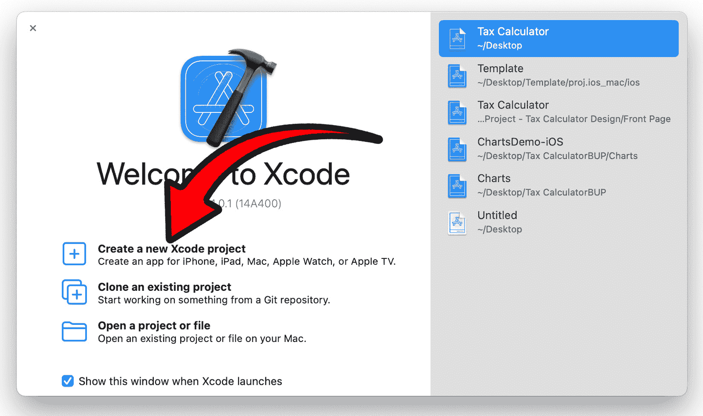

图 2.3 – 创建新的 Xcode 项目

1.  现在，我们将为我们的应用程序选择模板。由于我们正在创建一个 iPhone 应用程序，我们将从顶部选择**iOS**，然后选择**App**并点击**下一步**：

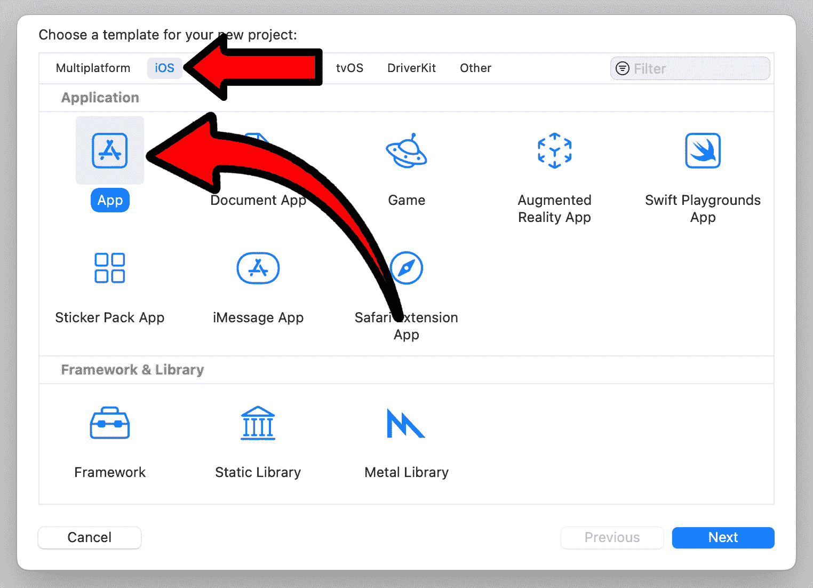

图 2.4 – Xcode 项目模板选择

1.  我们现在将选择我们的项目选项。在这里，只有两个关键的事情需要选择/设置。确保**界面**设置为**SwiftUI**；这将是我们系统使用的 UI。将**语言**设置为**Swift**；这是我们应用程序使用的编程语言：

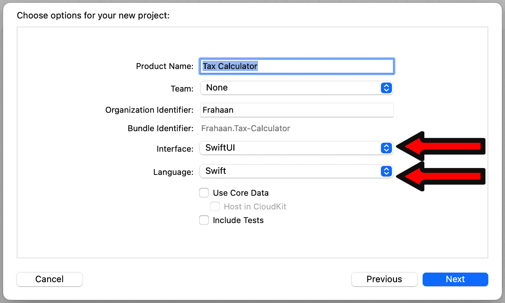

图 2.5 – Xcode 项目选项

1.  一旦你按下**下一步**，你可以选择在哪里创建你的项目，如下截图所示：

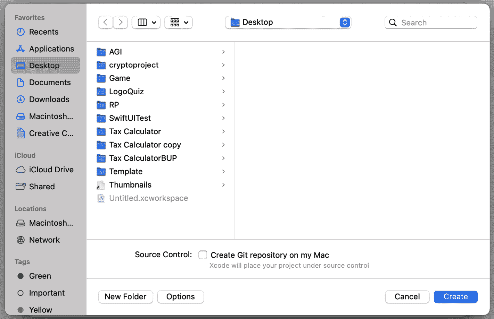

图 2.6 – Xcode 项目保存目录

1.  一旦你找到了你想要创建项目的位置，点击右下角的**创建**。Xcode 会以如下截图所示的方式展示你的项目：

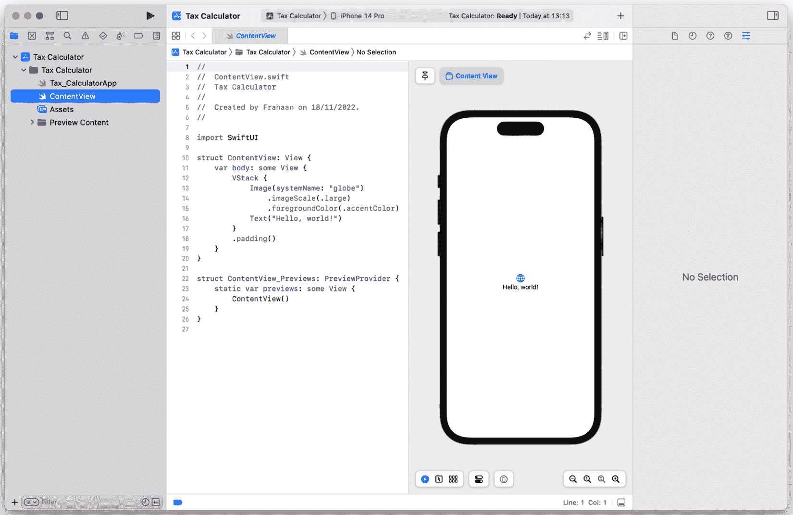

图 2.7 – 新 Xcode 项目概览

在下一节中，我们将使用 SwiftUI 实现我们的应用程序的封面页，并在实现过程中进一步了解 Xcode IDE。

### 封面页

在本节中，我们将实现封面页的 UI。作为一个提醒，以下是它的样子：

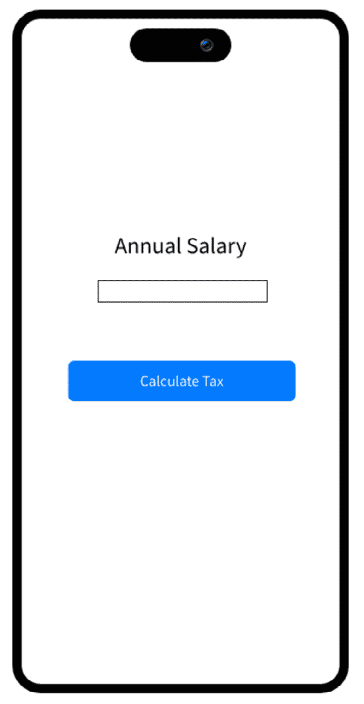

图 2.8 – 封面页线框预览

封面页上有三个主要元素。作为一个小任务，看看你是否能找出它们是什么。如果你不知道确切的 UI 组件名称，不用担心；我们将在接下来的章节中查看这些组件。

### 文本

文本组件是 SwiftUI 提供的最简单的组件之一。它允许你显示一串字符/数字，这对于标题和信息提供非常有用。我们将使用它为下一个组件`TextField`提供上下文。如果没有文本组件，用户不知道`TextField`的用途。以下图显示了首页上的标签，告诉用户以下文本输入字段用于什么：


图 2.9 – 首页标签

### 文本字段

文本字段允许用户输入可以由数字和任何字符组成的文本。我们的文本字段将用于输入一个数字，因此它只会接受数字。这是一个我们将配置的功能。一些应用程序在文本字段中放置背景文本，为`TextField`的用途提供上下文；然而，我们选择使用标签组件来提供上下文，因此不需要这个。以下图显示了用户可以使用它来输入他们的薪水的`TextField`：

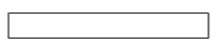

图 2.10 – 首页 TextField

### 按钮

当你想让用户明确触发某些功能时，会使用按钮。在我们的案例中，我们希望用户在准备好计算他们的税计算时按下按钮。自然地，作为开发者，我们必须进行错误检查，以检查按钮是否可以在`TextField`为空或输入了错误类型的数据时被按下。我们将通过错误消息来处理这个问题，而不是显示税计算。如果你查看以下截图，你会看到这个按钮的样子：


图 2.11 – 首页按钮

在下一节中，我们将把之前讨论的元素使用 SwiftUI 添加到我们的应用程序中。

### 添加首页组件

在本节中，我们将把之前列出的组件添加到我们的首页中。寻找`ContentView`文件，它通常可以在**项目导航器**中找到，通常在左侧，如下面的截图所示：

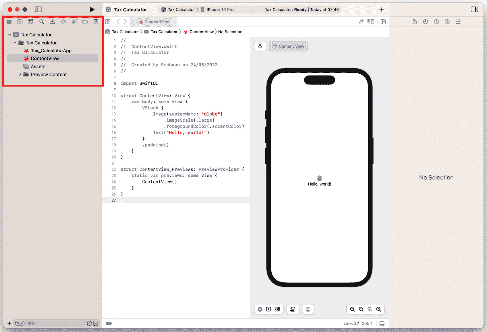

图 2.12 – 项目导航器

查看以下代码并将其添加到`ContentView`文件中：

```swift
import SwiftUIstruct ContentView: View
{
    @State private var salary: String = ""
    var body: some View
    {
        VStack
        {
            Text( "Annual Salary" )
            TextField( "Salary", text: $salary )
            Button
            { }
            label:
            { Text("Calculate Tax") }
        }
        .padding( )
    }
}
struct ContentView_Previews: PreviewProvider
{
    static var previews: some View
    {
        ContentView( )
    }
}
```

使用前面的代码，我们能够渲染一个`Text`、`TextField`和`Button`。这将形成允许用户输入他们的薪水并点击按钮来计算税项分解的基础。我们使用一个名为`salary`的变量来存储`TextField`的数据。让我们看看最终的结果：

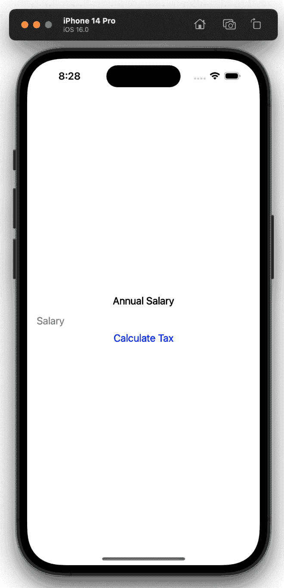

图 2.13 – 未添加样式的元素预览

如您所见，`Text`组件看起来相当不错，但`TextField`没有明显的边界。我在里面放了一个占位符，因为没有它，用户甚至不知道`TextField`在哪里。接下来，`Button`的样式不正确。让我们通过以下更新的代码修复这两个问题：

```swift
VStack{
    Text( "Annual Salary" )
    TextField( "", text: $salary )
        .border( Color.black, width: 1 )
    Button
    { }
    label:
    { Text("Calculate Tax") }
        .buttonStyle( .borderedProminent )
}
.padding( )
```

使用前面的代码，我们在`TextField`上添加了一个宽度为`1`的黑色边框，并移除了占位符文本。接下来，我们为按钮的`Text`组件添加了按钮样式。我们使用了`borderedProminent`样式，这正是我们需要的。所有这些更改导致以下结果：

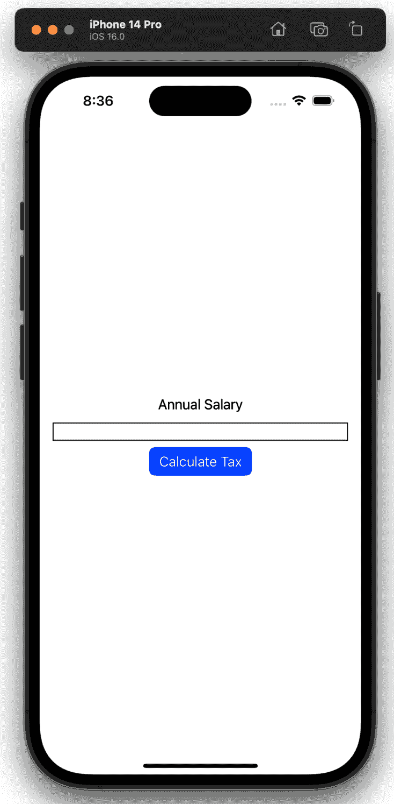

图 2.14 – 更新后的代码预览

预览显示我们非常接近了。对于我们插入到`TextField`中的数据类型，它不需要这么宽。让我们将其缩小。按照以下方式修改`TextField`：

```swift
TextField( "", text: $salary )                .frame( width: 200.0 )
                .border( Color.black, width: 1 )
```

我们为`TextField`添加了宽度`200`，使其更适合我们的需求。到目前为止，我们已经以编程方式更改了应用组件的属性。然而，您也可以使用 Xcode UI 调整属性。这样做很简单：通过将鼠标光标悬停在代码中的组件上并单击代码（就像您要编辑它一样）来在代码中选择一个组件。现在，在右侧，将出现一个包括**属性检查器**的面板。

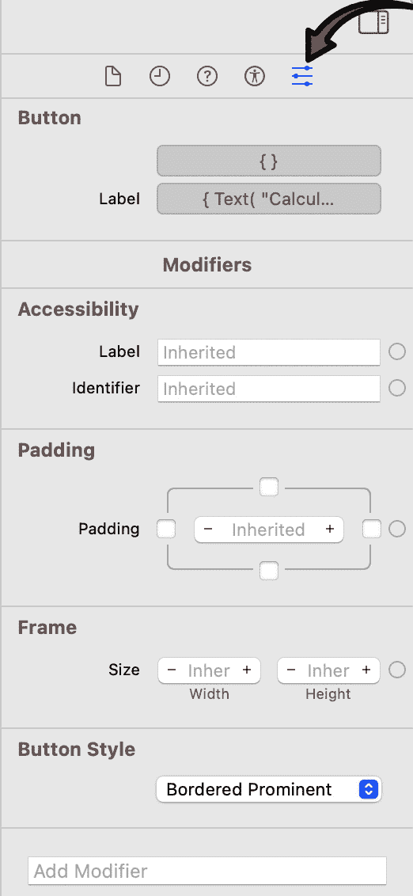

图 2.15 – 属性检查器

如果**属性检查器**面板没有出现，请转到**视图** | **检查器** | **属性**。

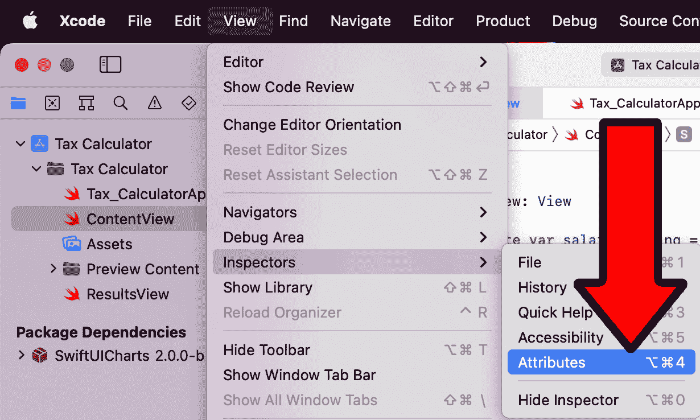

图 2.16 – 手动打开属性检查器

我们几乎完成了；我们只剩下三个 UI 组件。界面目前相当紧凑。让我们将组件展开，使其看起来更美观。添加以下代码以分散组件：

```swift
VStack{
    Text( "Annual Salary" )
        .padding(.bottom, 75.0)
    TextField( "", text: $salary )
        .frame( width: 200.0 )
        .border( Color.black, width: 1 )
        .padding( .bottom, 75.0 )
    Button
    { }
    label:
    { Text( "Calculate Tax" ) }
        .buttonStyle( .borderedProminent )
}
.padding( )
```

在前面的代码中，我们在`Text`和`TextField`组件的底部添加了填充，以便均匀分布所有三个项目。请随意尝试填充值，以使 UI 看起来符合您的需求。

重要提示

如果你有四个组件，并且想要为前三个添加填充，那么在均匀分布需要填充的组件数量方面，公式将是`n - 1`。`n`是组件的总数。

我们的前页现在看起来如下：

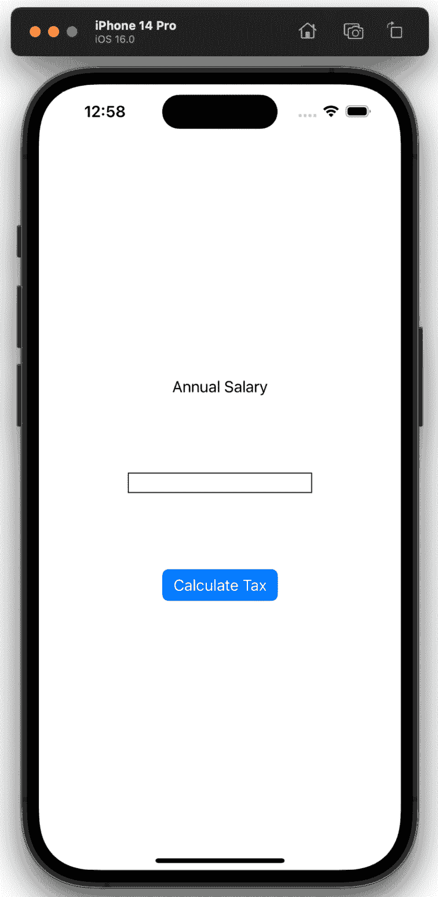

图 2.17 – 带填充的预览

目前，如果我们启动我们的应用并点击`TextField`，将出现一个常规键盘，如下面的截图所示：

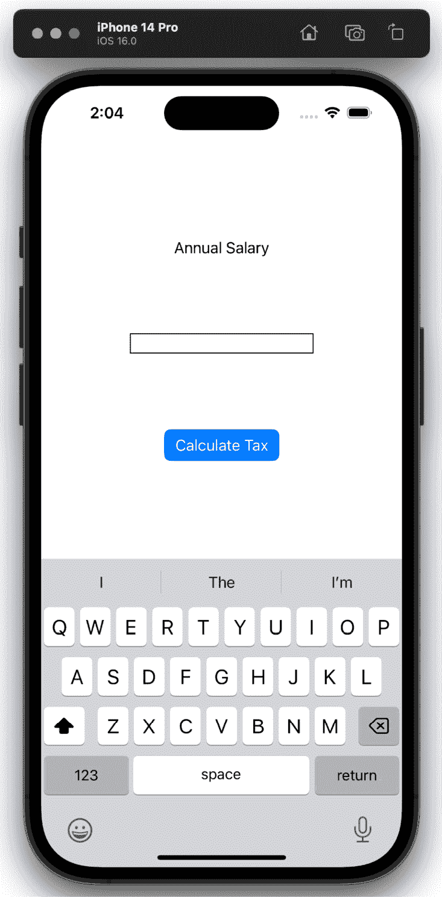

图 2.18 – 常规键盘预览的首页

对于需要输入姓名或地址的文本字段来说，这没问题，但这个字段只需要输入薪资，因此只需要数字输入。让我们更新我们的代码，将键盘类型设置为`decimalPad`：

```swift
TextField( "", text: $salary )    .frame( width: 200.0 )
    .border( Color.black, width: 1 )
    .padding( .bottom, 75.0 )
    .keyboardType( .decimalPad )
```

重要提示

有一个 `numberPad` 选项，但它不允许输入小数，所以我们将继续使用 `decimalPad` 类型。

如果你现在运行这个应用，它会显示以下内容：

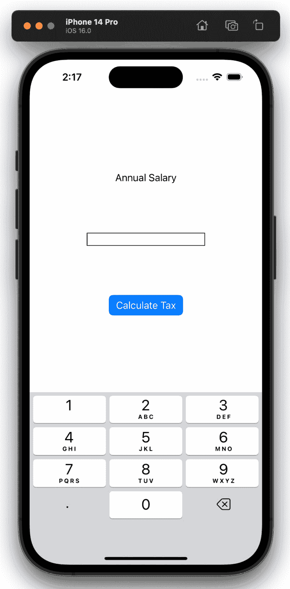

图 2.19 – 前页面小数键盘预览

键盘类型也可以在 **属性检查器** 中更改。这是一个快速查看所有可用键盘类型的好地方：

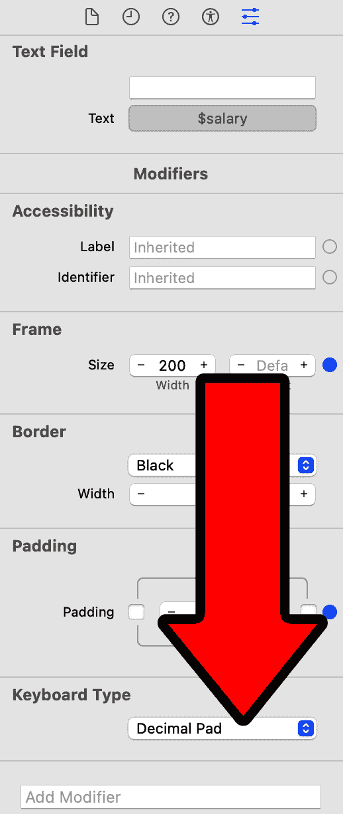

图 2.20 – 键盘类型

重要提示

想了解更多关于键盘类型的信息，请查看[`developer.apple.com/documentation/swiftui/view/keyboardtype(_)`](https://developer.apple.com/documentation/swiftui/view/keyboardtype(_))。

如果键盘在模拟器中没有显示，这是因为你的 Mac 已经有一个键盘，模拟器决定你不需要显示它。但这是可以覆盖的。你可以使用 ** + *K* 键盘快捷键来打开，或者 ***+* ** + *K* 来关闭它，或者前往 **I/O** | **键盘** | **切换** **软件键盘**：

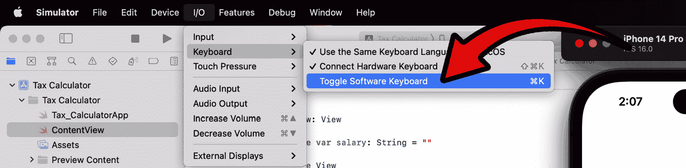

图 2.21 – 切换软件键盘

现在模拟器中的软件键盘将出现。这应该只需要做一次。我们已经完成了主页面的设计。目前，这里没有功能，但将在下一章中实现。但我们还没有完成设计。我们现在将实现结果页面的设计。

### 实现结果页面

在本节中，我们将实现结果页面的 UI。作为提醒，这里是这样看的：

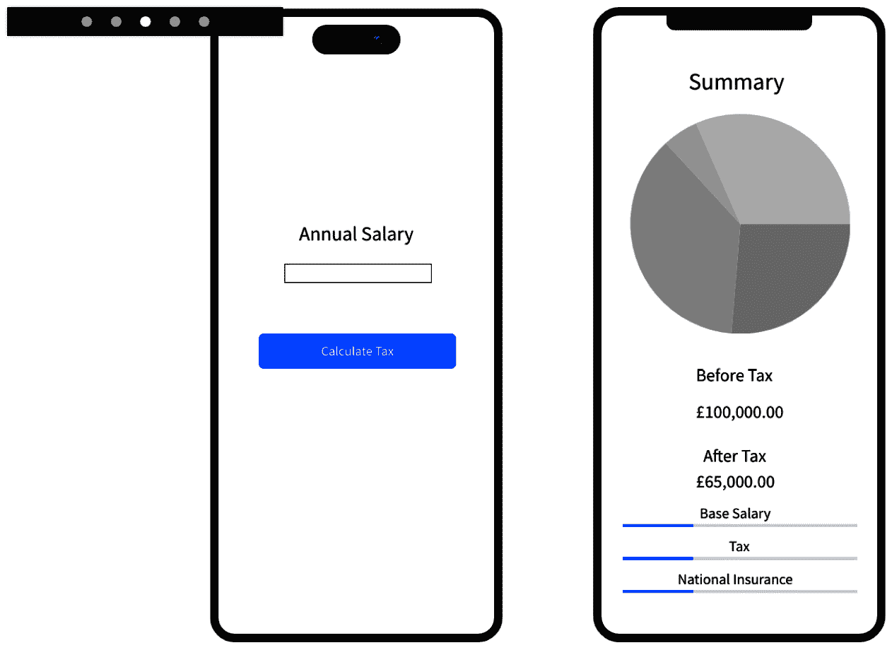

图 2.22 – 结果页面线框预览

结果页面有三个主要部分。每个部分由两个或更多组件组成。作为一个小任务，看看你是否能弄清楚它们是什么。如果你不知道确切的 UI 组件名称，不要担心，我们将在下一节中查看它们。

### 图表摘要部分

图表摘要部分由两个主要组件组成，一个文本组件和一个饼图。SwiftUI 不提供饼图，所以我们将使用外部库。我们将使用由 *Andras Samu* 创建的 `ChartView` 库，可以在以下位置找到：[`github.com/AppPear/ChartView`](https://github.com/AppPear/ChartView)。

本节将直观展示税收计算的简单分解。

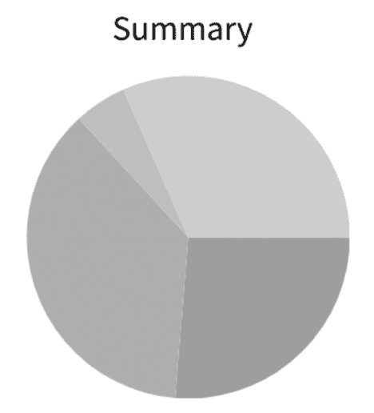

图 2.23 – 图表摘要线框

### 文本摘要部分

在文本摘要部分，有四个文本组件。第一个组件通知用户以下 `Text` 组件用于显示 **税前** 薪资标题。第二个组件告诉用户以下文本组件用于显示 **税后** 薪资标题。这并不包括税收如何分割的分解。这将在下一节中介绍：

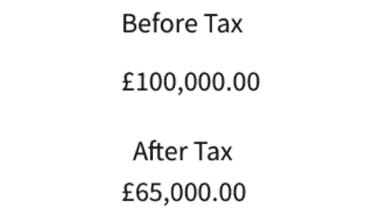

图 2.24 – 文本摘要线框

### 单个分解部分

单个分解部分显示税和工资的分解情况。有六个组成部分，三个 `Text` 组成部分和三个 `ProgressView` 组成部分。每个部分配对在一起形成三个子部分，**基本工资**、**税**和**国家保险**。这种设计简单但可扩展。一旦创建，我给你一个任务，添加税的进一步分解，例如学生贷款和养老金：

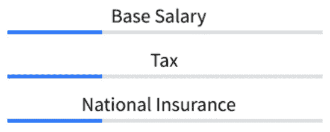

图 2.25 – 单个分解线框

在下一节中，我们将添加构成结果页面的元素，然后结束本章。

### 添加结果页面组件

在本节中，我们将添加之前讨论的组件到我们的结果页面。然而，首先我们必须通过 *Andras Samu* 集成 `ChartView` 框架。按照以下步骤操作：

1.  前往 **文件 |** **添加包…**：

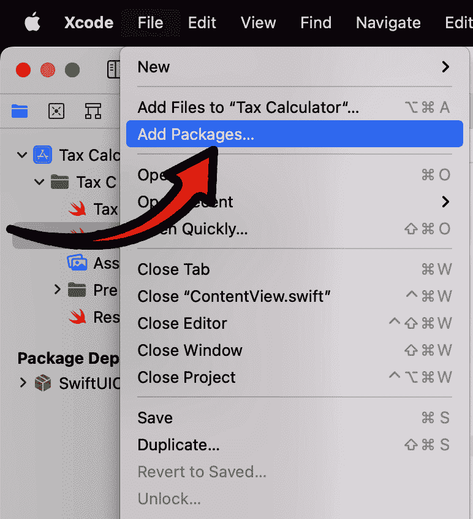

图 2.26 – Xcode 添加包…选项

1.  使用以下网址搜索 `ChartView` 框架：[`github.com/AppPear/ChartView`](https://github.com/AppPear/ChartView)。

1.  选择 `2.0.0-beta.2`，或您最新的版本。然后，点击右下角的 **添加包**。在我的例子中，它被灰色显示，因为我已经添加了它：

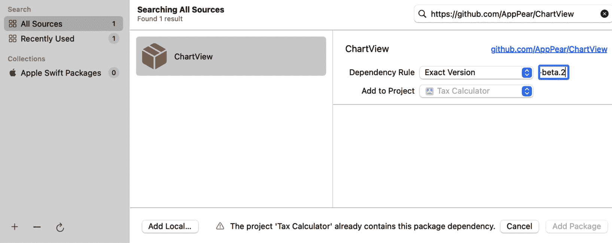

图 2.27 – 搜索 ChartView 包

1.  点击 **添加包** 将成功将包添加到项目中。

1.  现在，我们将为结果页面创建一个新的 SwiftUI 视图。在您的 **项目导航器** 面板内右键点击计算器文件夹，并选择 **新建文件…**：

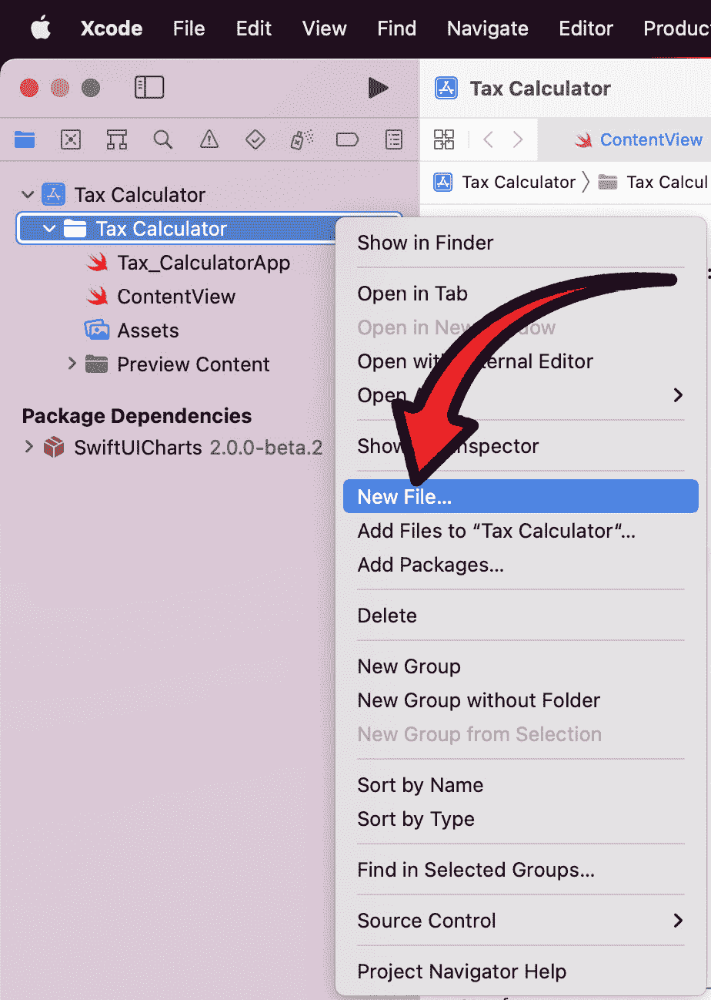

图 2.28 – 新文件…

1.  接下来，我们将选择我们想要添加的文件类型，对我们来说是一个 SwiftUI 视图（选择此选项提供了一个 SwiftUI 模板，这节省了我们每次重新输入 SwiftUI 文件结构的时间和精力），在 **用户界面** 部分：

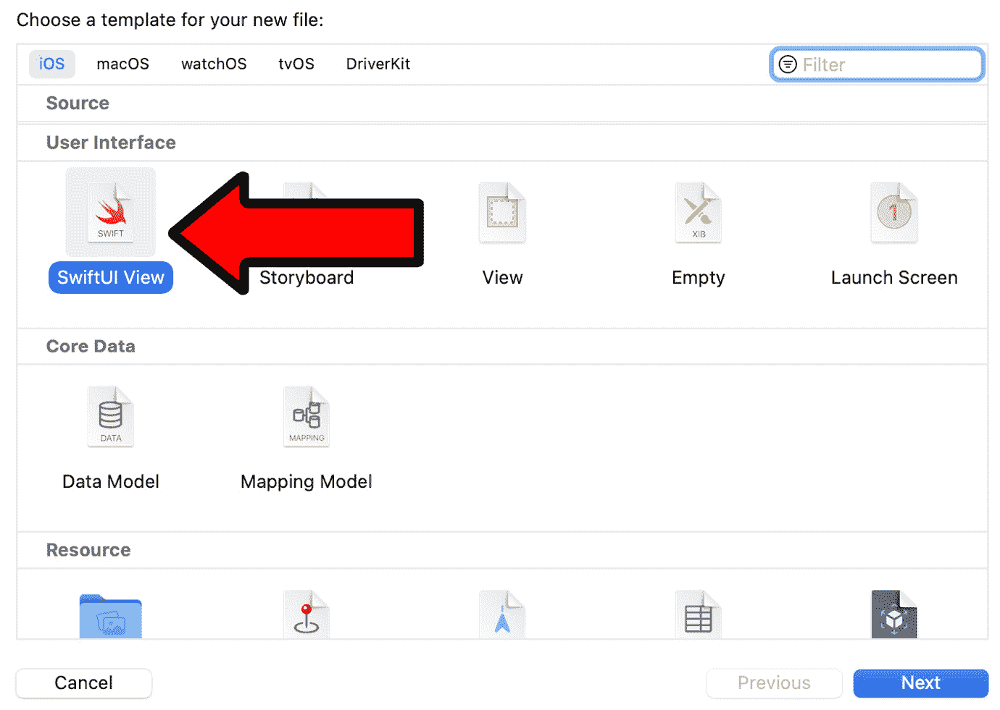

图 2.29 – SwiftUI 视图选择

1.  最后，我们必须重命名我们的 `ResultsView` 并点击 **创建**：

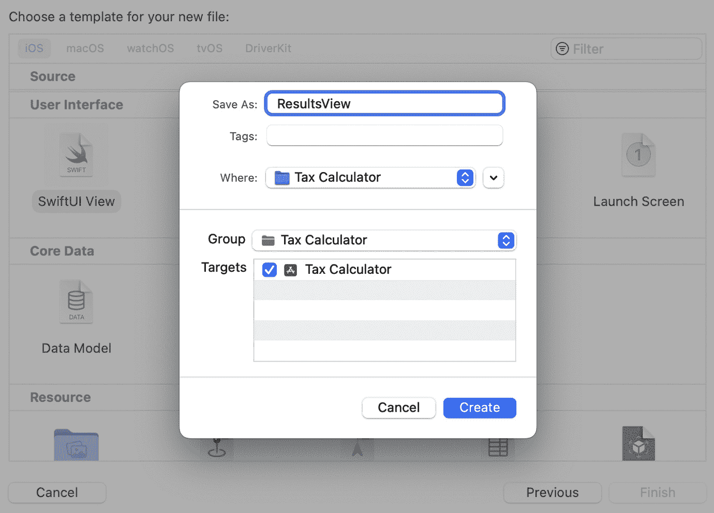

图 2.30 – 视图命名

1.  打开 `ResultsView` 文件，通过在文件顶部添加以下代码来导入 `SwiftUICharts` 框架：

    ```swift
    import SwiftUICharts
    ```

1.  接下来，我们需要创建图表本身。这样做非常简单，多亏了 `ChartView` 库。首先，添加图表将使用的数据。目前，我们将添加一些硬编码的测试数据：

    ```swift
    struct ResultsView: View{    var taxBreakdown: [Double] = [5, 10, 15]    var body: some View    {    }}
    ```

数组中的值将代表基本工资、税和国家保险。

1.  接下来，我们将使用 `ChartView` 实现我们的饼图：

    ```swift
    struct ResultsView: View{    var taxBreakdown: [Double] = [5, 10, 15]    var body: some View    {        PieChart( )            .data( taxBreakdown )            .chartStyle( ChartStyle( backgroundColor: .white,                                     foregroundColor: ColorGradient( .blue, .purple) ) )    }}
    ```

上述代码将产生以下结果：

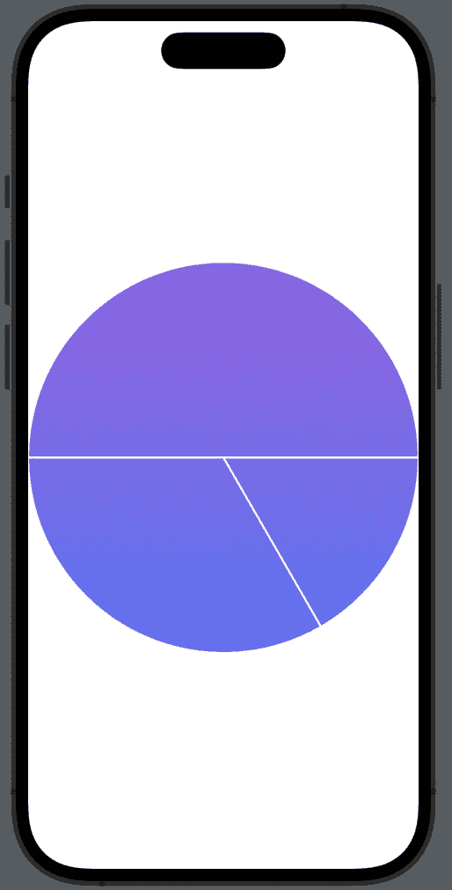

图 2.31 – 添加饼图

1.  要查看`ResultsView`，您需要使用**实时预览窗口**。默认情况下，它应该出现。如果它没有出现，请使用以下键盘快捷键：*+ + Return*。现在，Xcode 将看起来像以下截图：

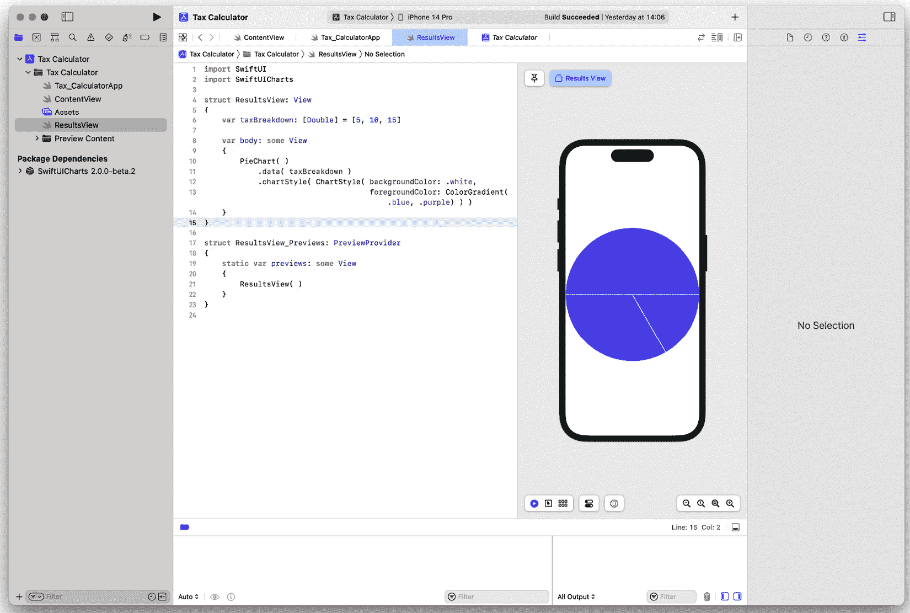

图 2.32 – 实时预览窗口位置

1.  目前，饼图延伸到边缘。让我们将饼图放入一个带有填充的`VStack`中。按照以下方式编辑代码：

    ```swift
    struct ResultsView: View{    var taxBreakdown: [Double] = [5, 10, 15]    var body: some View    {        VStack        {            PieChart( )                .data( taxBreakdown )                .chartStyle( ChartStyle( backgroundColor: .white,                                         foregroundColor: ColorGradient( .blue, .purple ) ) )        }.padding( )    }}
    ```

上述代码中的更改现在将使图表看起来像以下这样：

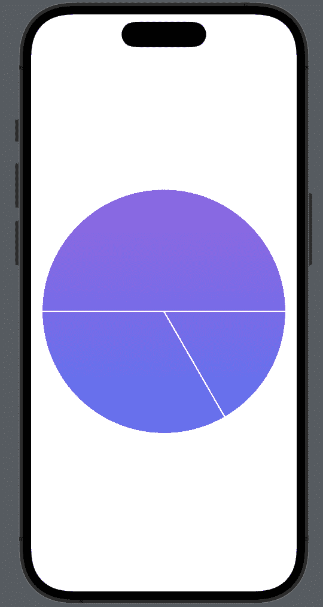

图 2.33 – 带填充的饼图

1.  让我们添加一个显示`36`的`Text`组件。将以下代码添加到主体中：

    ```swift
    var body: some View{    VStack    {        Text( "Summary" )            .font( .system( size: 36 ) )            .fontWeight( .bold )        PieChart( )            .data( taxBreakdown )            .chartStyle( ChartStyle( backgroundColor: .white,                                     foregroundColor: ColorGradient(.blue, .purple ) ) )    }.padding( )}
    ```

以下输出显示了我们在饼图上方添加的新摘要文本。

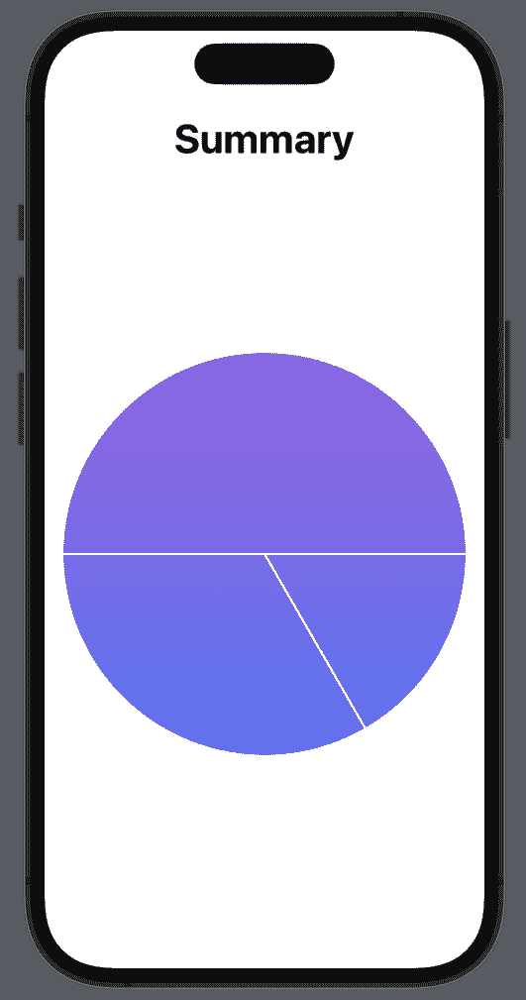

图 2.34 – 摘要标题

1.  在饼图下方，我们将添加四个更多的文本组件，用于**税前**和**税后**：每个子部分的标题和一个实际的数字。目前，我们将使用硬编码的值。按照以下方式更新代码：

    ```swift
    var body: some View{    VStack    {        Text( "Summary" )            .font( .system( size: 36 ) )            .fontWeight( .bold )        PieChart( )            .data( taxBreakdown )            .chartStyle( ChartStyle( backgroundColor: .white,                                     foregroundColor: ColorGradient(.blue, .purple ) ) )        Text( "Before Tax" )            .font( .system( size: 32 ) )        Text( "£100,000.00" )            .font( .system( size: 32 ) )        Text( "After Tax" )            .font( .system( size: 32 ) )        Text( "£65,000.00" )            .font( .system( size: 32 ) )    }.padding( )}
    ```

上述代码将显示以下内容：

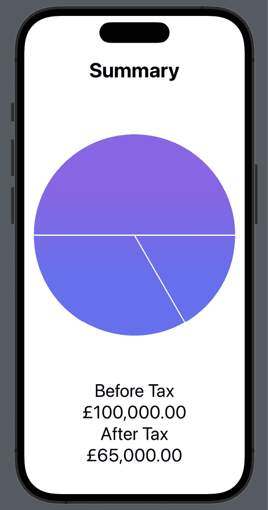

图 2.35 – 税前和税后文本

1.  目前，页面底部的文本组件挤在一起。让我们在每个文本组件的顶部和底部添加填充以分散它们。显然，您可以使用**属性检查器**来完成此操作，但我们将以编程方式完成：

    ```swift
    Text( "Before Tax" )    .font( .system( size: 32 ) )    .padding(.vertical)Text( "£100,000.00" )    .font( .system( size: 32 ) )    .padding(.vertical)Text( "After Tax" )    .font( .system( size: 32 ) )    .padding(.vertical)Text( "£65,000.00" )    .font( .system( size: 32 ) )    .padding(.vertical)
    ```

在上述代码中添加填充后，我们将有一个看起来像这样的结果页面：

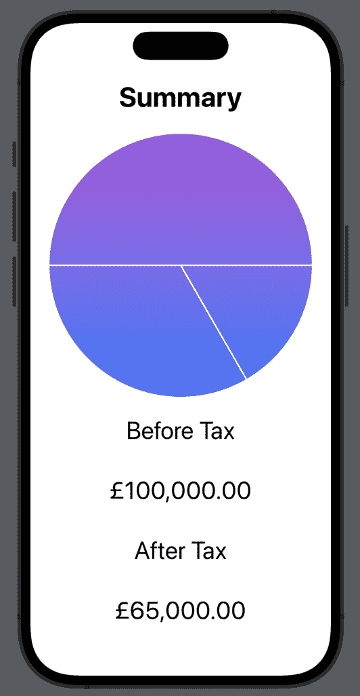

图 2.36 – 填充后的结果

1.  接下来，我们需要添加进度条，这些进度条将代表工资、税收和国民保险。我们将使用`ProgressView`组件与一个`Text`组件结合来显示税收分解。在之前添加的`Text`组件之后，添加以下代码：

    ```swift
    Text( "Post Tax Salary" )ProgressView( "", value: 20, total: 100 )Text( "Tax" )ProgressView( "", value: 20, total: 100 )
    ```

上述代码添加了两个`ProgressView`和`Text`组件对，显示了税后工资和税收。这将导致以下结果：

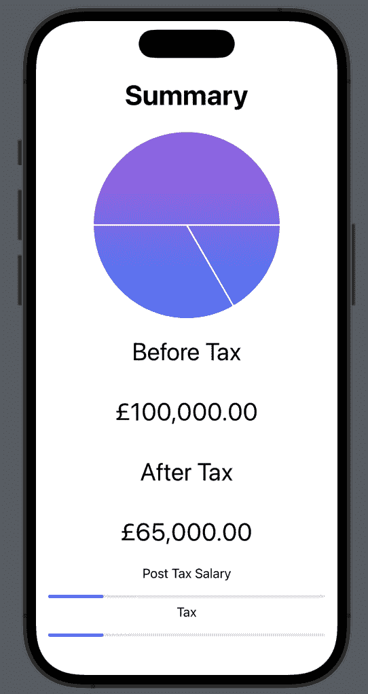

图 2.37 – 添加的分解组件

1.  你可能已经注意到我们只添加了三个`ProgressView`组件中的两个。这样做的原因是为了展示一个错误。所以，现在在之前添加的代码之后添加以下代码：

    ```swift
    Text( "National Insurance" )ProgressView( "", value: 20, total: 100 )
    ```

这将导致以下错误：`Group`组件，这将使视图将其检测为一个整体。

1.  我们将按照以下方式将三个`ProgressView`和`Text`组件分组：

    ```swift
    Group{    Text( "Post Tax Salary" )    ProgressView( "", value: 20, total: 100 )    Text( "Tax" )    ProgressView( "", value: 20, total: 100 )    Text( "National Insurance" )    ProgressView( "", value: 20, total: 100 )}
    ```

这将解决令人烦恼的 10 限制错误，并导致以下结果：

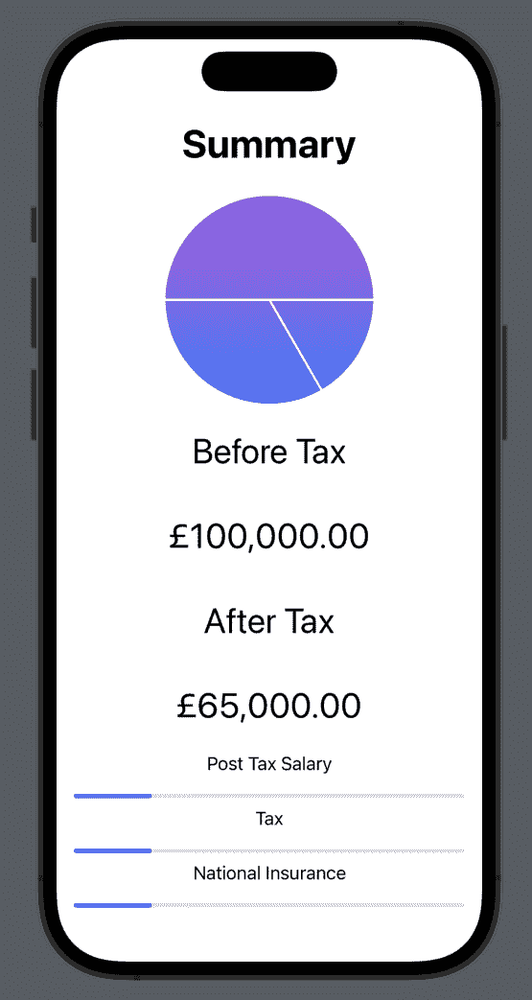

图 2.38 – 分组的组件

现在我们完成这个部分后，来看看整个代码：

```swift
import SwiftUIimport SwiftUICharts
struct ResultsView: View
{
    var taxBreakdown: [Double] = [5, 10, 15]
    var body: some View
    {
        VStack
        {
            Text( "Summary" )
                .font( .system( size: 36 ) )
                .fontWeight( .bold )
            PieChart( )
                .data( taxBreakdown )
                .chartStyle( ChartStyle( backgroundColor: .white,
                                         foregroundColor: ColorGradient( .blue, .purple ) ) )
            Text( "Before Tax" )
                .font( .system( size: 32 ) )
                .padding(.vertical)
            Text( "£100,000.00" )
                .font( .system( size: 32 ) )
                .padding(.vertical)
            Text( "After Tax" )
                .font( .system( size: 32 ) )
                .padding(.vertical)
            Text( "£65,000.00" )
                .font( .system( size: 32 ) )
                .padding(.vertical)
            Group
            {
                Text( "Post Tax Salary" )
                ProgressView( "", value: 20, total: 100 )
                Text( "Tax" )
                ProgressView( "", value: 20, total: 100 )
                Text( "National Insurance" )
                ProgressView( "", value: 20, total: 100 )
            }
        }.padding( )
    }
}
struct ResultsView_Previews: PreviewProvider
{
    static var previews: some View
    {
        ResultsView( )
    }
}
```

在这个庞大的章节中，我们涵盖了大量的内容。我们首先添加了一个外部框架，我们发现它非常容易集成且功能强大。这个框架使我们能够轻松实现饼图。这非常有用，因为苹果在 Swift 和 SwiftUI 中并没有提供所有基本功能，因此能够添加外部代码库使得开发过程更加轻松。之后，我们实现了饼图、文本摘要和进度视图，以进一步说明税收分解。

# 摘要

在本章中，我们讨论了我们的税收计算器应用程序的设计。我们研究了线框图，并将每个元素分解为 SwiftUI 组件。然后，我们将 SwiftUI 组件实现以匹配线框图中的设计。我们还审视了构建此应用程序的要求以及设计规范，这些规范探讨了税收计算器应用程序可能具有的功能。然后，我们将这些功能简化为我们应用程序将提供的核心功能。我们在设计规范中进一步推进，以确定我们希望应用程序执行的操作的验收标准。我们还探讨了如何集成外部库以提供额外的功能。

在下一章中，我们将探讨实现税收计算后端功能并将两个视图结合起来的方法。
