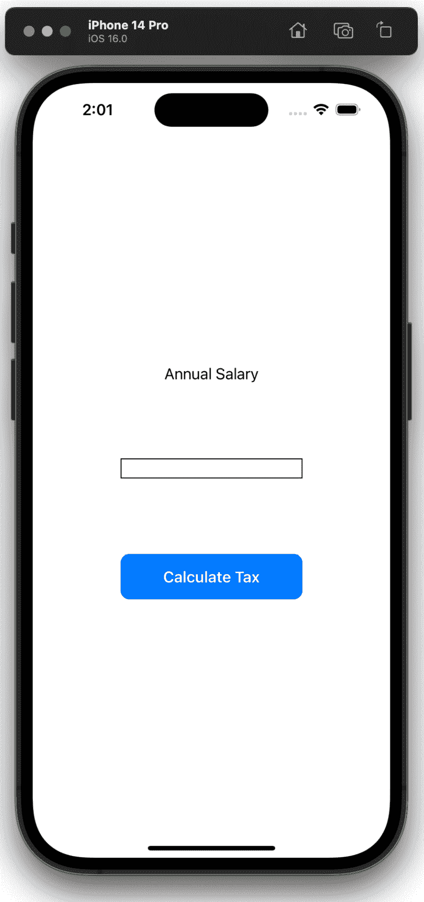
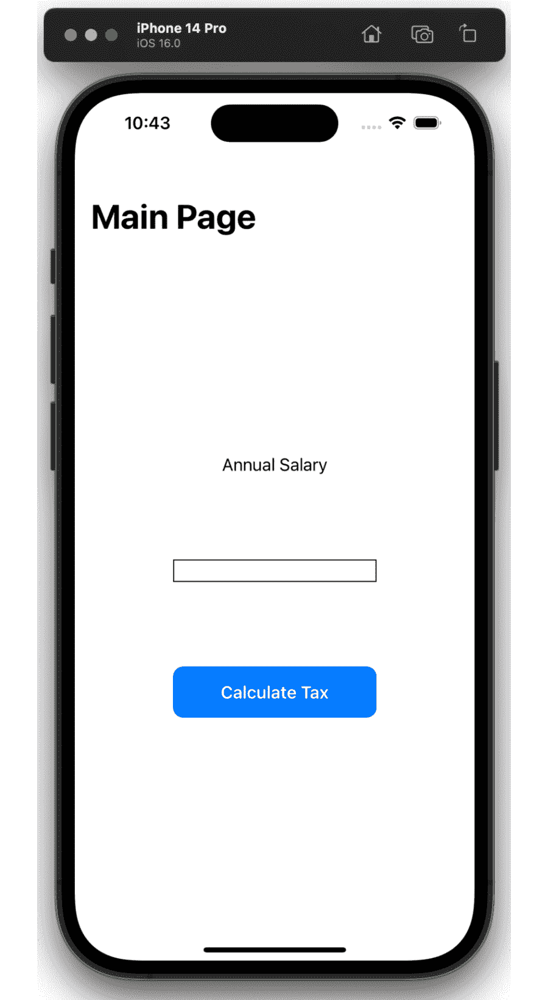
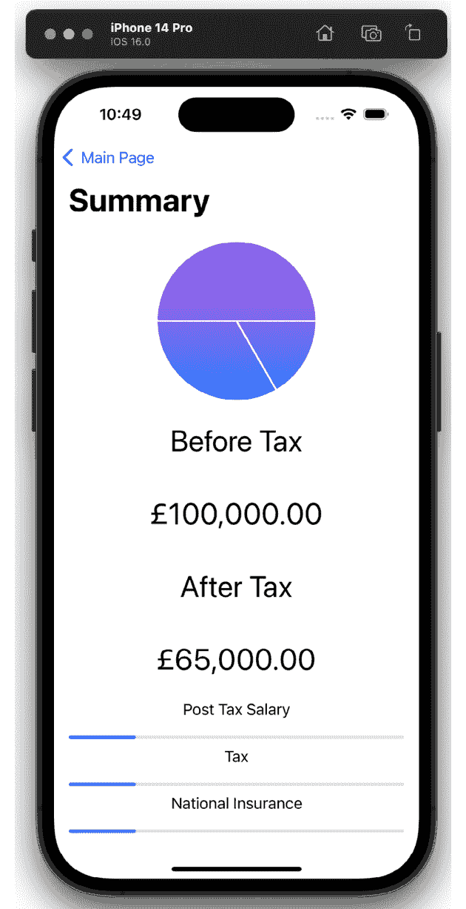
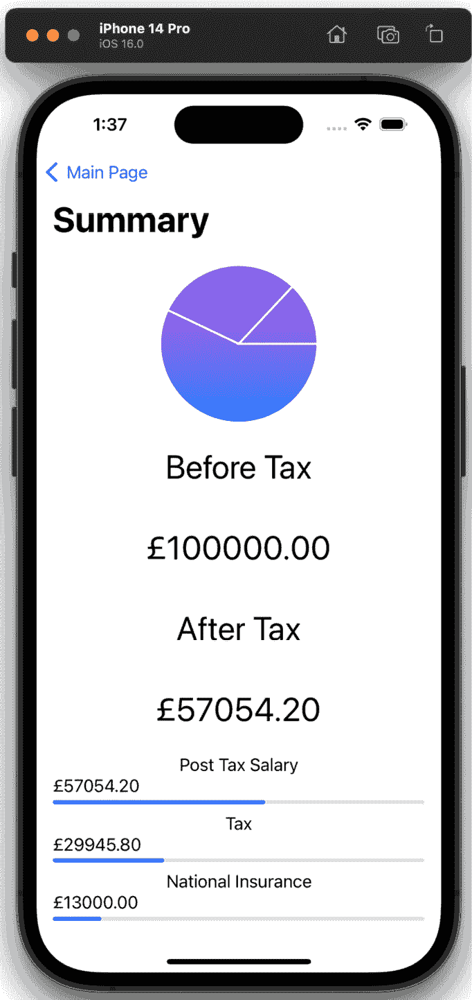

# 第三章：iPhone 项目 – 税费计算器功能

在本章中，我们将致力于在我们的第一个项目——税费计算器中实现税费计算和页面导航功能。在前一章中，我们探讨了计算器的设计，并将其分解为两个视图以及所有所需的组件。然后，我们使用 SwiftUI 实现了所有组件。在前一章的结尾，我们实际上只拥有一个花哨的线框图。现在，我们将实现所有功能，以在两个视图之间提供导航，计算税费分解并显示计算结果。

本章将分为以下部分：

+   从 `ContentView` 导航到 `ResultsView`

+   输入验证

+   计算税费分解

+   额外任务

到本章结束时，你将创建一个功能齐全的税费计算器，可以作为基础。当达到本章的结尾时，我将提供练习来在税费计算器中实现更多高级功能。代码由你使用、修改和按需分发。这将很好地过渡到我们的下一个项目，即 iPad 图库应用。

# 技术要求

本章要求您从 Apple 的 App Store 下载 Xcode 版本 14 或更高版本。

要安装 Xcode，只需在 App Store 中搜索 `Xcode`，选择并下载最新版本。打开 Xcode 并遵循任何额外的安装说明。一旦 Xcode 打开并启动，你就可以开始了。

Xcode 14 版本具有以下功能/要求：

+   包含 iOS 16、iPadOS 16、macOS 12.3、tvOS 16 和 watchOS 9 的 SDK

+   支持 iOS 11 或更高版本、tvOS 11 或更高版本和 watchOS 4 或更高版本的设备上的调试

+   需要 macOS Monterey 12.5 或更高版本的 Mac

+   有关技术细节的更多信息，请参阅 *第一章*。

本章和前一章使用的代码文件，作为基础，可以在此处找到：[`github.com/PacktPublishing/Elevate-SwiftUI-Skills-by-Building-Projects`](https://github.com/PacktPublishing/Elevate-SwiftUI-Skills-by-Building-Projects)

# 从 ContentView 导航到 ResultsView

在本节中，我们将最终实现从 `ContentView` 到 `ResultsView` 以及返回的导航系统。

如果你回忆起前一章，当查看 `ResultsView` 的 UI 时，我们被迫使用实时预览窗口而不是运行应用程序。原因是没有任何从 `ContentView` 导航到 `ResultsView` 的功能。我们已添加了计算税费的按钮，但我们需要实现触发导航的按钮代码。

首先，我们需要将 `ContentView` 中的 `VStack` 包装在 `NavigationView` 中。`NavigationView` 允许我们展示一系列视图，这对于导航非常有用，因为它实际上记录了所有之前视图的历史，从而允许一个简单且可扩展的导航系统：

```swift
import SwiftUIstruct ContentView: View
{
    @State private var salary: String = ""
    var body: some View
    {
        NavigationView
        {
            VStack
            {
                Text( "Annual Salary" )
                    .padding(.bottom, 75.0)
                TextField( "", text: $salary )
                    .frame( width: 200.0 )
                    .border( Color.black, width: 1 )
                    .padding( .bottom, 75.0 )
                    .keyboardType( .decimalPad )
                Button
                { }
                label:
                { Text( "Calculate Tax" ) }
                    .buttonStyle( .borderedProminent )
            }
            .padding( )
        }
    }
    func GoToResultsView( )
    {
        ResultsView( )
    }
}
struct ContentView_Previews: PreviewProvider
{
    static var previews: some View
    {
        ContentView( )
    }
}
```

我们现在已经实现了`NavigationView`，这允许我们使用现有的代码和设计进行导航。我们需要一个额外的代码片段 – 一个`GoToResultsView`函数。一个空版本已经被添加到前面的代码中。我们将在本章的后面使用它。

到目前为止，这不会对我们的应用程序产生任何影响，因为我们需要修改按钮以成为`NavigationLink`，它基本上是一个高级按钮，允许我们在视图之间导航。幸运的是，它可以以我们希望的方式样式化，但首先让我们实现一个基本的`NavigationLink`。为此，将`ContentView`中的按钮代码替换为以下代码：

```swift
NavigationLink( destination: ResultsView( ), label:{
    Text( "Calculate Tax" )
} )
```

让我们分解我们刚刚添加的代码。它接受的第一个参数是应用程序视图系统的目标，即将被推入堆栈的新视图。我们指定了`ResultsView`，但你也可以轻松指定一个简单的组件，这将创建它自己的视图。下一个参数称为`label`；这与按钮本身中指定的标签类似。目前，我们有一个`Text`组件，它看起来像这样：


图 3.1 – 基本 NavigationLink 按钮

让我们为`NavigationLink`按钮添加样式并修改代码，使其看起来如下：

```swift
NavigationLink( destination: ResultsView( ), label:{
    Text( "Calculate Tax" )
        .bold( )
        .frame( width: 200, height: 50 )
        .background( Color.blue )
        .foregroundColor( Color.white )
        .cornerRadius( 10 )
} )
```

我们为按钮添加了五个主要样式方面。让我们看看每一个：

+   `.bold()`: 使文本加粗

+   `.frame(width: 200, height: 50)`: 设置按钮的大小

+   `.background(Color.blue)`: 将背景颜色设置为蓝色

+   `.foregroundColor(Color.white)`: 将文本颜色设置为白色

+   `.cornerRadius(10)`: 使按钮的角落圆润，给人一种更自然、类似 iOS 的感觉

在将这些样式应用到应用程序以及更具体地说，按钮上之后，它将看起来像以下图示：



图 3.2 – 导航 Link 按钮样式

现在我们将添加一个导航标题。这提供了一个很好的统一方法来为视图添加标题/头部。这很简单 – 将以下代码添加到`VStack`的底部，紧接在填充之后：

```swift
.padding( ).navigationTitle( "Main Page" )
```

运行应用程序将显示以下内容：



图 3.3 – 导航标题

通过点击**计算税费**按钮导航到`ResultsView`将显示，左上角的返回按钮文本现在与添加的导航标题相同。这可以在以下屏幕截图中看到：


图 3.4 – 更新后的返回按钮文本

现在我们将更新`ResultsView`以使用导航标题而不是`Text`组件作为页面的标题。首先，我们需要从`ResultsView`中移除以下代码中的`Text`组件：

```swift
Text( "Summary" )    .font( .system( size: 36 ) )
    .fontWeight( .bold )
```

现在，由于`ResultsView`没有标题，让我们添加导航链接。像之前一样，在`VStack`之后，紧接在填充之后添加以下代码：

```swift
.padding( ).navigationBarTitle( "Summary" )
```

这个小小的添加将使 `ResultsView` 发生如下变化：



图 3.5 – ResultsView 导航标题

因此，我们已经添加了大量代码。这是我们继续之前，`ContentView` 和 `ResultsView` 代码应该看起来的样子：

ContentView

```swift
import SwiftUIstruct ContentView: View
{
    @State private var salary: String = ""
    var body: some View
    {
        NavigationView
        {
            VStack
            {
                Text( "Annual Salary" )
                    .padding(.bottom, 75.0)
                TextField( "", text: $salary )
                    .frame( width: 200.0 )
                    .border( Color.black, width: 1 )
                    .padding( .bottom, 75.0 )
                    .keyboardType( .decimalPad )
                NavigationLink( destination: ResultsView( ), label:
                {
                    Text( "Calculate Tax" )
                        .bold( )
                        .frame( width: 200, height: 50 )
                        .background( Color.blue )
                        .foregroundColor( Color.white )
                        .cornerRadius( 10 )
                } )
            }
            .padding( )
            .navigationTitle( "Main Page" )
        }
    }
}
struct ContentView_Previews: PreviewProvider
{
    static var previews: some View
    {
        ContentView( )
    }
}
```

ResultsView

```swift
import SwiftUIimport SwiftUICharts
struct ResultsView: View
{
    var taxBreakdown: [Double] = [5, 10, 15]
    var body: some View
    {
        VStack
        {
            PieChart( )
                .data( taxBreakdown )
                .chartStyle( ChartStyle( backgroundColor: .white,
                                         foregroundColor: ColorGradient( .blue, .purple ) ) )
            Text( "Before Tax" )
                .font( .system( size: 32 ) )
                .padding(.vertical)
            Text( "£100,000.00" )
                .font( .system( size: 32 ) )
                .padding(.vertical)
            Text( "After Tax" )
                .font( .system( size: 32 ) )
                .padding(.vertical)
            Text( "£65,000.00" )
                .font( .system( size: 32 ) )
                .padding(.vertical)
            Group
            {
                Text( "Post Tax Salary" )
                ProgressView( "", value: 20, total: 100 )
                Text( "Tax" )
                ProgressView( "", value: 20, total: 100 )
                Text( "National Insurance" )
                ProgressView( "", value: 20, total: 100 )
            }
        }
        .padding( )
        .navigationBarTitle( "Summary" )
    }
}
struct ResultsView_Previews: PreviewProvider
{
    static var previews: some View
    {
        ResultsView( )
    }
}
```

哇，我们做了很多。花点时间给自己鼓掌。所有这些都使我们能够实现一个无缝且熟悉的导航系统。我们学习了如何实现导航系统，以便轻松地导航到 `ResultsView` 并返回 `ContentView`。

在下一节中，我们将验证薪水以确保我们不会传递任何错误的数据。

# 验证薪水输入

到目前为止，如果您按下 **计算税** 按钮，它会将用户从首页带到结果页面。然而，它不考虑输入，所以即使没有薪水，它也会转到下一页。以下验证检查必须完成，才能使其成为一个可接受的价值：

+   它是否包含一个数值？

+   该值是否大于 0（这排除了负数）？

你可能想知道为什么我们不能只检查薪水是否大于 0，因为我们选择了十进制键盘。这主要有两个原因：

+   用户可以以使输入变为 `4.5.6..` 的方式插入小数点。

+   尽管由于键盘是十进制键盘，用户不能直接输入文本，但他们仍然可以从其他应用程序复制并粘贴到我们的计算器中，从而破坏只允许数字的 `TextField`。您可能认为禁用粘贴是值得的，但保留此功能很重要，因为用户可能确实希望粘贴一个数字而不是手动输入，尤其是如果它不是一个简单的较小数字。

如果没有正确处理，当用户按下 **计算税** 按钮时，应用程序将崩溃。我们将如何在以下章节中解释实现这些条件的方式。

## 使用变量跟踪薪水是否有效

我们将在薪水字符串后面添加一个布尔变量来跟踪薪水是否有效；如果是，则显示 `ResultsView`。只有当按下 **计算税** 按钮时，才会检查薪水字符串。在主体之前添加以下代码：

```swift
@State private var isSalaryValid: Bool = false
```

## isActive 导航链接

现在我们将之前创建的 `isSalaryValid` 变量与 `NavigationLink` 通过 `isActive` 参数链接起来。更新 `NavigationLink` 代码如下：

```swift
NavigationLink( destination: ResultsView( ), isActive: $isSalaryValid, label:
```

`isActive` 是一个简单的概念——如果为 `true`，则立即带您到目标视图，如果为 `false`，则不发生任何操作。

在以下部分，我们将验证薪水。

## 验证薪水

首先，我们将重写点击手势并调用一个名为 `GoToResultsView` 的自定义函数。将以下代码添加到所有文本属性的最后：

```swift
.onTapGesture{
    GoToResultsView( )
}
```

最后，我们必须检查字符串是否有效，然后导航到结果视图。添加以下函数来处理此操作：

```swift
func GoToResultsView( ){
    if ( Float( salary ) != nil )
    {
        if ( Float( salary )! > 0 )
        { isSalaryValid = true }
    }
}
```

让我们展开这个函数来看看它做了什么：

+   `if ( Float( salary ) != nil )`：检查薪水是否是一个数字。这是通过将字符串转换为 `Float` 来实现的。如果失败，它将是 `nil` – 这允许我们检查这一点。这也包括验证空字符串。

+   `if ( Float( salary )! > 0 )`：检查薪水是否大于零。感叹号表示变量薪水肯定是一个 `Float`，以避免任何问题，因为我们已经检查过我们可以这样做。

+   `isSalaryValid = true`：将 `isSalaryValid` 检查变量设置为 `true`，这会触发 `ResultsView` 并加载它。

所有这些添加都应该在以下 `ContentView` 文件中产生以下代码：

```swift
import SwiftUIstruct ContentView: View
{
    @State private var salary: String = ""
    @State private var isSalaryValid: Bool = false
    var body: some View
    {
        NavigationView
        {
            VStack
            {
                Text( "Annual Salary" )
                    .padding(.bottom, 75.0)
                TextField( "", text: $salary )
                    .frame( width: 200.0 )
                    .border( Color.black, width: 1 )
                    .padding( .bottom, 75.0 )
                    .keyboardType( .decimalPad )
                NavigationLink( destination: ResultsView( ), isActive: $isSalaryValid, label:
                {
                    Text( "Calculate Tax" )
                        .bold( )
                        .frame( width: 200, height: 50 )
                        .background( Color.blue )
                        .foregroundColor( Color.white )
                        .cornerRadius( 10 )
                        .onTapGesture
                        {
                            GoToResultsView( )
                        }
                } )
            }
            .padding( )
            .navigationTitle( "Main Page" )
        }
    }
    func GoToResultsView( )
    {
        if ( Float( salary ) != nil )
        {
            if ( Float( salary )! > 0 )
            { isSalaryValid = true }
        }
    }
}
struct ContentView_Previews: PreviewProvider
{
    static var previews: some View
    {
        ContentView( )
    }
}
```

使用前面的代码，我们验证了薪水，并使用一个变量来跟踪验证状态，这使得当它被验证时，我们可以导航到 `ResultsView`。

在下一节中，我们将把薪水在 `ContentView` 和 `ResultsView` 之间传递。

## 将薪水传递到 ResultsView

到目前为止，当我们点击 `ResultsView` 时，它仍然使用的是虚拟数据。让我们通过传递上一节中验证的薪水来改变这一点。当使用 State 和 Bind 时，这样做很简单。`ContentView` 中的薪水变量已经是一个状态变量，这意味着当它改变时，与之关联的视图部分也会改变，反之亦然。当我们更改 `TextField` 中的薪水文本时，我们的应用程序会更新状态变量。我们可以在 `ResultsView` 中使用一个绑定变量，这允许我们在视图之间传递数据。

首先，在 `ResultsView` 中，在 `taxBreakdown` 数组上方添加以下行：

```swift
@Binding var salary: String
```

这只是声明了一个类型为 `String` 的 `salary` 变量，其格式与 `ContentView` 中的 `salary` 变量相同。`@Binding` 只是表明它期望传递这个值。

现在，我们必须更新 `NavigationLink` 以将 `salary` 变量从 `ContentView` 传递到 `ResultsView`，如下所示：

```swift
NavigationLink( destination: ResultsView( salary: $salary ), isActive: $isSalaryValid, label:
```

尽管我们已经完成了所有的绑定，如果我们尝试运行应用程序，将会抛出以下错误：


图 3.6 – 预览错误

这个错误与预览视图有关，通常它出现在代码的右侧。没有这个，预览无法运行。为了修复这个错误，我们可以为预览提供一个默认的硬编码值。按照以下方式更新代码：

```swift
struct ResultsView_Previews: PreviewProvider{
    static var previews: some View
    {
        ResultsView( salary: .constant( "100" ) )
    }
}
```

现在我们运行应用程序后，我们没有得到任何错误，因为我们解决了缺失参数的错误，可以继续从我们传递的薪水计算税项分解。

注意

如果你想要测试确保变量已经传递，你可以使用断点或 `print` 语句。我将让你作为一个额外任务来完成这个。

# 计算税项分解

在上一章中，我们传递了`salary`变量，但我们仍然需要计算税款。我将按照 2023/2024 年的英国所得税率进行计算，但这可以很容易地适应任何其他税制。以下表格中列出了 2023/2024 年的税率：

| **收入** | **税率** |  |
| --- | --- | --- |
| 低于£12,570 | 0% | 个人免税额 |
| £12,571 至£37,700 | 20% | 基本税率 |
| £37,701 至£150,000 | 40% | 高税率 |
| 超过£150,000 | 45% | 附加税率 |

表 3.1 – 税率区间

由于存在括号且没有单一的固定税率，我们需要进行一些计算来确定应扣除的确切税款。除了所得税外，还有国家保险税。国家保险税并不简单，因为存在不同的类别，但让我们将其保持在简单的 13%，这大致就是其数值。

注意

计算税款肯定还有更多方面，例如养老金缴纳、学生贷款等；然而，我们将就此为止。

## 税款计算

让我们在`ResultsView`中实现一个公式来计算所得税。在主体开始处添加以下代码：

```swift
var body: some View {let salaryNum = Double( salary )!
var incomeTax: Double = 0
if ( salaryNum > 12570 )
{
    if ( salaryNum > 37700 )
    {
        if ( salaryNum > 150000 )
        {
            incomeTax += ( 37700 - 12571 ) * 0.2
            incomeTax += ( 150000 - 37701 ) * 0.4
            incomeTax += ( salaryNum - 150000 ) * 0.45
        }
        else
        {
            incomeTax += ( 37700 - 12571 ) * 0.2
            incomeTax += ( salaryNum - 37700 ) * 0.4
        }
    }
    else
    { incomeTax += ( salaryNum - 12570 ) * 0.2 }
}
return VStack {
….
}
}
```

我们检查每个税率区间并相应地计算税款。接下来，我们将计算国家保险。首先，在`incomeTax`下方添加另一个 double 变量：

```swift
let salaryNum = Double( salary )!var incomeTax: Double = 0
var nationalInsuranceTax: Double = 0
```

现在，我们可以简单地通过将工资乘以`0.13`来计算`13%`。在所得税计算下方添加以下代码：

```swift
nationalInsuranceTax = salaryNum * 0.13
```

现在我们已经计算了所有税款，我们可以继续计算税后工资。这很简单——我们只需从工资中减去所得税和国家保险税。在之前的代码下方添加以下代码：

```swift
let postTaxSalary = salaryNum - incomeTax - nationalInsuranceTax
```

让我们将这些值格式化为字符串，这些字符串将在显示税款时使用。在`post-tax` `salary`计算下方添加以下代码：

```swift
let salaryString = String( format:"£%.2F", salaryNum )let postTaxSalaryString = String( format: "£%.2F", postTaxSalary )
let incomeTaxString = String( format: "£%.2F", incomeTax )
let nationalInsuranceTaxSting = String( format: "£%.2F",
nationalInsuranceTax )
```

这将从相应的数字中创建一个字符串，四舍五入到两位小数。接下来，将硬编码的饼图数组`taxBreakdown`移动到格式化字符串下方，并按如下方式更新：

```swift
let taxBreakdown: [Double] = [postTaxSalary, incomeTax, nationalInsuranceTax]
```

我们使用 let 而不是 var，因为它不需要被更改。

现在，我们终于准备好开始更新 UI 中的每个组件。首先，我们将更新`Text`组件，这些组件显示`税前`和`税后`金额，如下所示：

```swift
Text( "Before Tax" )    .font( .system( size: 32 ) )
    .padding(.vertical)
Text( salaryString )
    .font( .system( size: 32 ) )
    .padding(.vertical)
Text( "After Tax" )
    .font( .system( size: 32 ) )
    .padding(.vertical)
Text( postTaxSalaryString )
    .font( .system( size: 32 ) )
    .padding(.vertical)
```

最后，更新`ProgressView`以显示税款和工资的正确百分比和值：

```swift
Text( "Post Tax Salary" )ProgressView( postTaxSalaryString, value: postTaxSalary / salaryNum * 100, total: 100 )
Text( "Tax" )
ProgressView( incomeTaxString, value: incomeTax / salaryNum * 100, total: 100 )
Text( "National Insurance" )
ProgressView( nationalInsuranceTaxSting, value: 13, total: 100 )
```

将`postTaxSalary`和`incomeTax`变量除以`salaryNum`并乘以`100`的原因是为了计算出`ProgressView`的百分比。在运行之前，更新要返回的`VStack`。似乎代码中存在一个问题，导致编译器出现冲突。为了解决这个问题，我们需要明确指出要绘制的内容，通过返回它来解决问题：

```swift
return VStack
```

如果我们运行我们的应用程序并插入£100,000 的工资，`ResultsView`将如下所示：



图 3.7 – 结果视图已更新

那肯定很累，这么多代码。为了参考，以下是移动到下一步之前 `ContentView` 和 `ResultsView` 代码应该看起来像什么：

ContentView：

```swift
import SwiftUIstruct ContentView: View
{
    @State private var salary: String = ""
    @State private var isSalaryValid: Bool = false
    var body: some View
    {
        NavigationView
        {
            VStack
            {
                Text( "Annual Salary" )
                    .padding(.bottom, 75.0)
                TextField( "", text: $salary )
                    .frame( width: 200.0 )
                    .border( Color.black, width: 1 )
                    .padding( .bottom, 75.0 )
                    .keyboardType( .decimalPad )
                NavigationLink( destination: ResultsView( salary: $salary ), isActive: $isSalaryValid, label:
                {
                    Text( "Calculate Tax" )
                        .bold( )
                        .frame( width: 200, height: 50 )
                        .background( Color.blue )
                        .foregroundColor( Color.white )
                        .cornerRadius( 10 )
                        .onTapGesture
                        {
                            GoToResultsView( )
                        }
                } )
            }
            .padding( )
            .navigationTitle( "Main Page" )
        }
    }
    func GoToResultsView( )
    {
        if ( nil != Float( salary ) )
        {
            if ( Float( salary )! > 0 )
            { isSalaryValid = true }
        }
    }
}
struct ContentView_Previews: PreviewProvider
{
    static var previews: some View
    {
        ContentView( )
    }
}
```

ResultsView：

```swift
import SwiftUIimport SwiftUICharts
struct ResultsView: View
{
    @Binding var salary: String
    var body: some View
    {
        let salaryNum = Double( salary )!
        var incomeTax: Double = 0
        var nationalInsuranceTax: Double = 0
        if ( salaryNum > 12570 )
        {
            if ( salaryNum > 37700 )
            {
                if ( salaryNum > 150000 )
                {
                    incomeTax += ( 37700 - 12571 ) * 0.2
                    incomeTax += ( 150000 - 37701 ) * 0.4
                    incomeTax += ( salaryNum - 150000 ) * 0.45
                }
                else
                {
                    incomeTax += ( 37700 - 12571 ) * 0.2
                    incomeTax += ( salaryNum - 37700 ) * 0.4
                }
            }
            else
            { incomeTax += ( salaryNum - 12570 ) * 0.2 }
        }
        nationalInsuranceTax = salaryNum * 0.13
        let postTaxSalary = salaryNum - incomeTax - nationalInsuranceTax
        let salaryString = String( format:"£%.2F", salaryNum )
        let postTaxSalaryString = String( format: "£%.2F", postTaxSalary )
        let incomeTaxString = String( format: "£%.2F", incomeTax )
        let nationalInsuranceTaxSting = String( format: "£%.2F", nationalInsuranceTax )
        let taxBreakdown: [Double] = [postTaxSalary, incomeTax, nationalInsuranceTax]
        return VStack
        {
            PieChart( )
                .data( taxBreakdown )
                .chartStyle( ChartStyle( backgroundColor: .white,
                                         foregroundColor: ColorGradient( .blue, .purple ) ) )
            Text( "Before Tax" )
                .font( .system( size: 32 ) )
                .padding(.vertical)
            Text( salaryString )
                .font( .system( size: 32 ) )
                .padding(.vertical)
            Text( "After Tax" )
                .font( .system( size: 32 ) )
                .padding(.vertical)
            Text( postTaxSalaryString )
                .font( .system( size: 32 ) )
                .padding(.vertical)
            Group
            {
                Text( "Post Tax Salary" )
                ProgressView( postTaxSalaryString, value: postTaxSalary / salaryNum * 100, total: 100 )
                Text( "Tax" )
                ProgressView( incomeTaxString, value: incomeTax / salaryNum * 100, total: 100 )
                Text( "National Insurance" )
                ProgressView( nationalInsuranceTaxSting, value: 13, total: 100 )
            }
        }
        .padding( )
        .navigationBarTitle( "Summary" )
    }
}
struct ResultsView_Previews: PreviewProvider
{
    static var previews: some View
    {
        ResultsView( salary: .constant( "100" ) )
    }
}
```

在下一节中，我们将修复 `ContentView` 中出现的错误；看看您是否能找出错误是什么。

## 修复 ContentView 绑定错误

`ContentView` 中存在一个错误。可以通过以下步骤触发：

1.  通过点击 **计算** **税** 按钮导航到 `ResultsView`。

1.  通过点击左上角的返回箭头回到 `ContentView`。

1.  输入无效数据，可以是以下任何一种：

    1.  删除 `TextField` 中的所有文本

    1.  空格字符

    1.  任何非数字字符

    1.  两个或多个小数点

完成这些步骤后，将出现以下错误：


图 3.8 – 无效输入错误

这是因为变量绑定到 `ResultsView`，它使用数值来使用该值。由于输入不再是数值，它崩溃了。问题是 `Double( salary )` 返回 `nil` 并强制使用 `!` 来分配，这导致它崩溃。我们将默认将 `salaryNum` 变量的值设置为 `0`，如果它不是 `nil`，则将工资字符串作为 `Double` 进行转换。按照以下方式更新代码：

```swift
var salaryNum: Double = 0if ( nil != Double( salary ) )
{
    salaryNum = Double( salary )!
}
```

或者，您可以使用合并运算符来减少前面的检查，如下所示：`let salaryNum = Double( salary ) ?? 0`。有关合并运算符的更多信息，请访问 [`docs.swift.org/swift-book/documentation/the-swift-programming-language/basicoperators/#Nil-Coalescing-Operator`](https://docs.swift.org/swift-book/documentation/the-swift-programming-language/basicoperators/#Nil-Coalescing-Operator)。

首先，我们将变量更改为 `var` 而不是 `let`，因为它需要可修改性，以便检查是否等于 `nil`。然后，我们检查它不是 `nil` 并相应地分配值。*分配 0 不会产生任何影响，因为此时视图不可见*。现在，如果您按照前面的步骤运行应用程序，它不会崩溃。

在下一节中，我们将重命名 `ContentView`。

## 将 ContentView 重命名为 FrontView

在这个小节中，我们将把 `ContentView` 的名称改为 `FrontView`。`ContentView` 的默认名称对我们来说没有提供太多信息。我们将将其重命名为 `FrontView`。您可以将文件重命名并手动将 `ContentView` 的每个实例更改为 `FrontView`，这在这样一个规模的应用程序中不会太繁琐。然而，在一个更大、更复杂的应用程序中，这将耗费很多宝贵的开发时间。我们可以使用 Xcode 的重命名工具来帮助我们。

简单地转到应用程序代码中任何对 `ContentView` 的引用，右键单击它，然后转到 **重构** | **重命名…**：


图 3.9 – 重命名… 按钮

在下一个视图中，将名称设置为 `FrontView` 并按 *Enter* 键：


图 3.10 – Xcode 重命名工具

重命名文件和更新所有引用就像那样简单。这也适用于变量和函数；请随时使用。

我们现在已经完成了计算器应用程序；在下一节中，您将看到一些额外的任务，供您完成。

# 额外任务

现在应用程序已经完成，以下是一些任务列表，用于增强您的应用程序并测试您对本章所学概念的理解：

+   提交无效薪水时显示错误

+   使用逗号格式化薪水和税收组件

+   抽象税级和百分比以使应用程序更具动态性

+   饼图标签

+   不同的税收类型

+   公司税

+   税收继承

+   为当前薪水计算器提供更多输入，例如养老金贡献和助学贷款

+   返回按钮样式

备注

如果在任何时候您需要帮助，请随时加入我的 Discord 群组 [`discord.gg/7e78FxrgqH`](https://discord.gg/7e78FxrgqH)。

我们将总结本章所涵盖的内容。然而，在总结之前，我将提供额外的代码，供您在空闲时自行实现额外任务。

## 不同的税收选项

要将不同的税收选项添加到您的代码中，您可以通过修改 `ResultsView` 来包括选择不同税收选项的拾取器或分段控件。以下是如何修改您的代码以添加税收选项拾取器的示例：

```swift
import SwiftUIstruct FrontView: View {
    @State private var salary: String = ""
    @State private var isSalaryValid: Bool = false
    @State private var selectedTaxOption: TaxOption = .option1 // Default tax option
    enum TaxOption: String, CaseIterable {
        case option1 = "Income Tax"
        case option2 = "Dividen Tax"
        case option3 = "Corporation Tax"
        // You can add more tax options if needed
    }
    var body: some View {
        NavigationView {
            VStack {
                Text("Annual Salary")
                    .padding(.bottom, 75.0)
                TextField("", text: $salary)
                    .frame(width: 200.0)
                    .border(Color.black, width: 1)
                    .padding(.bottom, 75.0)
                    .keyboardType(.decimalPad)
                Picker("Tax Option", selection: $selectedTaxOption) {
                    ForEach(TaxOption.allCases, id: \.self) { option in
                        Text(option.rawValue)
                    }
                }
                .pickerStyle(SegmentedPickerStyle())
                .padding(.bottom, 75.0)
                NavigationLink(destination: ResultsView(salary: $salary, taxOption: selectedTaxOption), isActive: $isSalaryValid) {
                    Text("Calculate Tax")
                        .bold()
                        .frame(width: 200, height: 50)
                        .background(Color.blue)
                        .foregroundColor(Color.white)
                        .cornerRadius(10)
                        .onTapGesture {
                            goToResultsView()
                        }
                }
            }
            .padding()
            .navigationTitle("Main Page")
        }
    }
    func goToResultsView() {
        if let salaryFloat = Float(salary), salaryFloat > 0 {
            isSalaryValid = true
        }
    }
}
struct ResultsView: View {
    var salary: String
    var taxOption: FrontView.TaxOption
    var body: some View {
        VStack {
            Text("Results")
                .font(.title)
                .padding()
            Text("Salary: \(salary)")
                .padding()
            Text("Tax Option: \(taxOption.rawValue)")
                .padding()
            // Calculate and display tax results based on the selected tax option
            Spacer()
        }
        .navigationTitle("Results")
    }
}
struct ContentView_Previews: PreviewProvider {
    static var previews: some View {
        FrontView()
    }
}
```

```swift

In this example, I’ve added the `TaxOption` enum to define different tax options. The `selectedTaxOption` property is used to store the selected tax option. I’ve added a picker (using a segmented control style) to allow the user to select the tax option.

When the user taps `ResultsView`, where you can calculate and display the tax results based on the selected option.

## Tax geography

To add the ability to calculate tax breakdowns for different geographies, including countries and states, you can modify `ResultsView` and introduce a selection mechanism for geographies. Here’s an example of how you can modify your code to achieve that:

```

import SwiftUIstruct FrontView: View {

@State private var salary: String = ""

@State private var isSalaryValid: Bool = false

@State private var selectedGeography: Geography = .country("USA") // 默认地理位置

enum Geography {

case country(String)

case state(String, String) // 国家，州

var displayText: String {

switch self {

case .country(let country):

return country

case .state(let country, let state):

return "\(state), \(country)"

}

}

}

var body: some View {

NavigationView {

VStack {

Text("年度薪水")

.padding(.bottom, 75.0)

TextField("", text: $salary)

.frame(width: 200.0)

.border(Color.black, width: 1)

.padding(.bottom, 75.0)

.keyboardType(.decimalPad)

Picker("地理位置", selection: $selectedGeography) {

Text("USA").tag(Geography.country("USA"))

Text("加利福尼亚，美国").tag(Geography.state("USA", "California"))

// 根据需要添加更多地理位置选项

}

.pickerStyle(SegmentedPickerStyle())

.padding(.bottom, 75.0)

NavigationLink(destination: ResultsView(salary: $salary, geography: selectedGeography), isActive: $isSalaryValid) {

Text("计算税")

.bold()

.frame(width: 200, height: 50)

.background(Color.blue)

.foregroundColor(Color.white)

.cornerRadius(10)

.onTapGesture {

goToResultsView()

}

}

}

.padding()

.navigationTitle("主页")

}

}

func goToResultsView() {

if let salaryFloat = Float(salary), salaryFloat > 0 {

isSalaryValid = true

}

}

}

struct ResultsView: View {

var salary: String

var geography: FrontView.Geography

var body: some View {

VStack {

Text("结果")

.font(.title)

.padding()

Text("工资: \(salary)")

.padding()

Text("地区: \(geography.displayText)")

.padding()

// 根据所选地区计算并显示税收分解

Spacer()

}

.navigationTitle("结果")

}

}

struct ContentView_Previews: PreviewProvider {

static var previews: some View {

FrontView()

}

}

```swift

In this example, I’ve introduced the `Geography` enum, which represents different geographies. It can be either a country or a state within a country. The `selectedGeography` property is used to store the selected geography.

In `FrontView`, I’ve added a picker (using a segmented control style) to allow the user to select the geography. You can add more geography options as needed.

When the user taps `ResultsView`, where you can calculate and display the tax breakdown based on the selected geography.

In `ResultsView`, I’ve added a `displayText` computed property to format and display the selected geography. You can modify the code to calculate and display the tax breakdown based on the selected geography.

Note

This code provides a basic structure for adding tax breakdowns based on geographies. The actual tax calculations and breakdowns would need to be implemented based on the tax laws and rules of the specific countries and states involved.

Here’s the updated code for `ResultsView` with the tax breakdown based on the given logic and the addition of the `Geography` selection:

ResultsView

```

import SwiftUIimport SwiftUICharts

struct ResultsView: View {

@Binding var salary: String

var geography: FrontView.Geography

var body: some View {

let salaryNum: Double = Double(salary) ?? 0

let taxBreakdown = calculateTaxBreakdown(for: salaryNum, in: geography)

let salaryString = formatCurrency(salaryNum)

let postTaxSalaryString = formatCurrency(taxBreakdown.postTaxSalary)

let incomeTaxString = formatCurrency(taxBreakdown.incomeTax)

let nationalInsuranceTaxString = formatCurrency(taxBreakdown.nationalInsuranceTax)

return VStack {

PieChart()

.data(taxBreakdown.chartData)

.chartStyle(ChartStyle(backgroundColor: .white, foregroundColor: ColorGradient(.blue, .purple)))

Text("税前")

.font(.system(size: 32))

.padding(.vertical)

Text(salaryString)

.font(.system(size: 32))

.padding(.vertical)

Text("税后")

.font(.system(size: 32))

.padding(.vertical)

Text(postTaxSalaryString)

.font(.system(size: 32))

.padding(.vertical)

Group {

Text("税后工资")

ProgressView(postTaxSalaryString, value: taxBreakdown.postTaxPercentage, total: 100)

Text("税收")

ProgressView(incomeTaxString, value: taxBreakdown.incomeTaxPercentage, total: 100)

Text("国家保险")

ProgressView(nationalInsuranceTaxString, value: taxBreakdown.nationalInsurancePercentage, total: 100)

}

}

.padding()

.navigationBarTitle("总结")

}

private func calculateTaxBreakdown(for salary: Double, in geography: FrontView.Geography) -> TaxBreakdown {

var incomeTax: Double = 0

var nationalInsuranceTax: Double = 0

if salary > 12570 {

if salary > 37700 {

if salary > 150000 {

incomeTax += (37700 - 12571) * 0.2

incomeTax += (150000 - 37701) * 0.4

incomeTax += (salary - 150000) * 0.45

} else {

incomeTax += (37700 - 12571) * 0.2

incomeTax += (salary - 37700) * 0.4

}

} else {

incomeTax += (salary - 12570) * 0.2

}

}

nationalInsuranceTax = salary * 0.13

let postTaxSalary = salary - incomeTax - nationalInsuranceTax

let chartData: [(String, Double)] = [("税后工资", postTaxSalary), ("税收", incomeTax), ("国家保险", nationalInsuranceTax)]

let totalSalary = salary + nationalInsuranceTax

let postTaxPercentage = postTaxSalary / totalSalary * 100

let incomeTaxPercentage = incomeTax / totalSalary * 100

let nationalInsurancePercentage = nationalInsuranceTax / totalSalary * 100

return TaxBreakdown(postTaxSalary: postTaxSalary, incomeTax: incomeTax, nationalInsuranceTax: nationalInsuranceTax, chartData: chartData, postTaxPercentage: postTax

Percentage, incomeTaxPercentage: incomeTaxPercentage, nationalInsurancePercentage: nationalInsurancePercentage)

}

private func formatCurrency(_ value: Double) -> String {

let formatter = NumberFormatter()

formatter.numberStyle = .currency

formatter.currencySymbol = "£"

return formatter.string(from: NSNumber(value: value)) ?? ""

}

}

struct TaxBreakdown {

var postTaxSalary: Double

var incomeTax: Double

var nationalInsuranceTax: Double

var chartData: [(String, Double)]

var postTaxPercentage: Double

var incomeTaxPercentage: Double

var nationalInsurancePercentage: Double

}

struct ResultsView_Previews: PreviewProvider {

static var previews: some View {

ResultsView(salary: .constant("100"), geography: .country("USA"))

}

}

```

在这个更新的代码中，`ResultsView`现在接受一个类型为`FrontView.Geography`的`geography`参数。添加了`calculateTaxBreakdown(for:in:)`函数，用于根据工资和选定的地理位置计算税收分解。

税收分解存储在`TaxBreakdown`结构体中，该结构体包括税后工资、所得税、国家保险税、图表数据和每个税类百分比。

`formatCurrency(_:)`函数用于使用英镑符号（£）格式化货币值。

计算出的税收分解用于填充`PieChart`和`ProgressView`组件，以显示税收分解和百分比。

请注意，提供的代码中的税收计算逻辑基于初始逻辑，可能不准确或不适用于现实世界的税收计算。它作为将税收分解计算集成到您的 SwiftUI 代码中的示例结构。

# 摘要

在本章中，我们实现了计算器的所有功能。我们将上一章中实现的所有 UI 组件链接起来。首先，我们提供了一种导航到`ResultsView`和从`ResultsView`返回的方法。然后，我们检查工资输入以确保它大于零且不包含任何无效字符。一旦验证通过，我们就将从`ContentView`传递工资到`ResultsView`。使用工资，我们在`ResultsView`中计算税收分解，修复了一个令人烦恼的错误，并将`ContentView`重命名为`FrontView`。最后，我们还为我们的税收计算器应用实现了一些额外的任务。

在下一章中，我们将开始我们的下一个应用，这将是一个适用于 iPad 的相册。我们将利用已经学到的许多技能，所以请随时花点时间回顾一下你还没有完全理解的内容。
