# 4

# iPad 项目 – 照片库概述

在前两章中，我们为 iPhone 创建了一个税务计算器应用程序。我们从零开始实现它，并查看技术要求、设计规范、线框和代码实现。我们将在本章和下一章中使用这些新获得的知识，但请放心，我们将回顾所有必要的方面，以防你直接跳到本章。

在本章中，我们将着手设计我们的第二个项目，一个用于展示大屏幕的 iPad 照片库应用程序。我们将评估设计此类应用程序的要求，并讨论设计规范，以便我们更好地了解所需内容以及它们如何组合在一起。然后我们将开始编码我们的应用程序，构建 UI，这将在下一章中与画廊的增强视图连接。本项目将涵盖 SwiftUI 组件的基础。我们将在以下章节中讨论所有这些内容：

+   要求

+   设计规范

+   构建画廊 UI

到本章结束时，你将更好地了解我们照片库应用程序中所需的功能/组件，我们将如何利用 iPad 的更大屏幕（与 iPhone 相比），以及我们应用程序的设计。到本章结束时，我们将实现第一页的线框，这将为下一章奠定基础。

# 技术要求

本章要求您从 Apple 的 App Store 下载 Xcode 14 或更高版本。

要安装 Xcode，只需在 App Store 中搜索 Xcode 并下载最新版本。打开 Xcode 并按照安装说明进行操作。一旦 Xcode 打开并启动，你就可以开始了。

Xcode 14 版本具有以下功能/要求：

+   包含 iOS 16、iPadOS 16、macOS 12.3、tvOS 16 和 watchOS 9 的 SDK。

+   支持在 iOS 11 或更高版本、tvOS 11 或更高版本和 watchOS 4 或更高版本中进行设备调试。

+   需要 macOS Monterey 12.5 或更高版本的 Mac。

+   如需有关技术细节的更多信息，请参阅*第一章*。

本章的代码文件可以在以下位置找到：[`github.com/PacktPublishing/Elevate-SwiftUI-Skills-by-Building-Projects`](https://github.com/PacktPublishing/Elevate-SwiftUI-Skills-by-Building-Projects)。

在下一节中，我们将阐明我们应用程序设计规范的具体内容，并查看应用程序外观的草图。

# 理解设计规范

在本节中，我们将查看我们画廊应用程序的设计规范。本节描述了我们将要在我们的画廊应用程序中实现的功能。确定所需功能的最有效方法是站在用户的角度，确定他们将如何使用该应用程序，并将其分解为单独的步骤。

我们希望展示的应用程序功能如下：

+   **高亮视图**：这是用户将看到的主要视图，展示了所有图像。

+   **增强视图**：这显示了图像的较大版本，以及如描述和日期等信息。

+   **全屏模式**：在全屏模式下查看图像，没有任何额外信息。

+   **全屏点击查看更多信息**：在全屏模式下单次点击将显示照片的标题。

+   **集合**：不同的图像集合或相册：

    +   **侧面板**：以水平模式显示所有集合名称。

+   **删除和重命名**：这允许用户删除图像并重命名它。

+   **编辑**：图像编辑功能：

    +   使用 Apple Pencil 进行绘图。

+   **分享**：分享图像的能力。

+   **显示模式切换**：更改在突出显示页面上的图像显示方式，作为列表或使用瓷砖。

+   **注释和高亮**：允许用户注释和高亮图像的部分。

+   图像和信息来自外部源，如本地数据库或在线。

现在我们已经列出了我们希望拥有的理想功能，对我们来说，确定哪些功能是至关重要的非常重要。为此，我们必须了解我们产品的目的。对我来说，创建这个照片画廊应用的目的是为了展示一些图像并提供一个增强模式，以提供更多信息。我知道并非所有功能都是必需的，如果某些功能被省略，并作为额外的任务分配给你作为开发者去完成，这可能是有用的。这些额外任务是可选的，并且只有在完成此项目后才能执行。考虑到这一点，以下是我们将实现的核心功能：

+   高亮视图

+   增强视图

+   分享

在完成本章和下一章之后，其余的功能将留给你作为练习。下一节将涵盖我们应用的接受标准。

## 接受标准

我们将讨论我们希望在最终产品中看到的接受标准，这些标准将在下一章的结尾完成。如果可能的话，我们应该尝试使它们可衡量。让我们现在就做这件事：

+   在画廊视图中使用小图像，提供整个画廊的概览。

+   一个可滚动的视图，用于浏览所有我们的图像。

+   一种增强视图，用于显示额外信息，从而允许可选参数。

+   在分享图像时应该出现一个本机共享菜单。

+   从高亮视图导航到增强视图。

+   从增强视图导航到全屏视图。

开发测试用例，以测试应用的接受标准。使用这种方法，我们可以看到最终用户将使用应用的条件以及需要达到的成功水平。

## 线框图

设计布局最有用的工具之一是线框设计。线框是布局的概述。以下图像显示了我们的应用突出显示页面将如何使用线框来呈现：

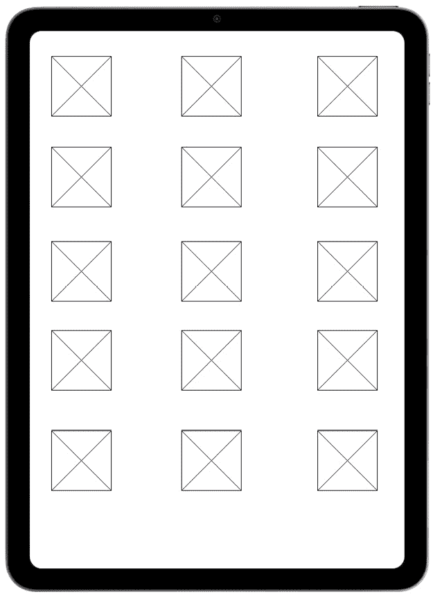

图 4.1 – 竖屏模式的突出显示视图线框

在 iPad 应用程序中，拥有横屏模式非常重要。以下图像显示了我们的突出显示视图在横屏模式下的线框：

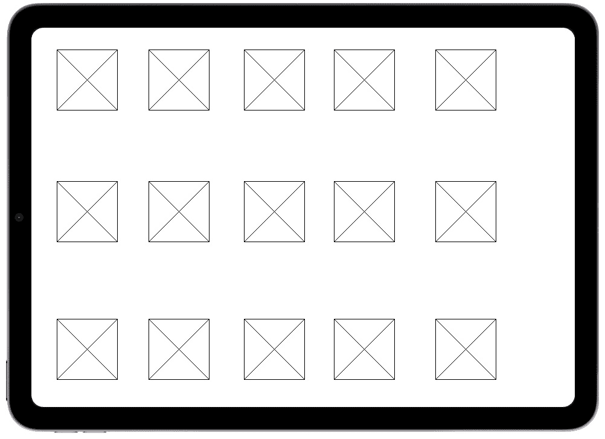

图 4.2 – 横屏模式的突出显示视图线框

以下两幅图像显示了增强视图的横屏和竖屏线框：


图 4.3 – 竖屏模式的增强视图线框


图 4.4 – 横屏模式的增强视图线框

在下一节中，我们将构建我们应用程序的界面，并确保它看起来与我们设计在线框图中的样子一致。虽然我们将以相同的方式构建它，但可能会有一些小的差异。这将为下一章中将其全部连接起来奠定基础。

# 构建画廊 UI

我们现在将构建画廊应用程序的 UI。画廊有三个主要部分，首先是突出显示页面，它在启动时加载并显示所有图片。一旦用户点击图片，用户将被带到增强页面，这是第二部分。在这个页面上，显示图片的大版本以及更多信息。最后，最后一部分是全屏模式，它简单地以全屏显示所选图片。自然地，我们将从第一部分，突出显示页面开始，但在那之前，我们将创建我们的项目。按照以下步骤操作：

1.  打开 Xcode 并选择**创建一个新的** **Xcode 项目**：


图 4.5 – 创建新的 Xcode 项目

1.  现在，我们将选择我们应用程序的模板。由于我们正在创建 iPad 应用程序，我们将从顶部选择**iOS**，然后选择**App**，点击**下一步**：

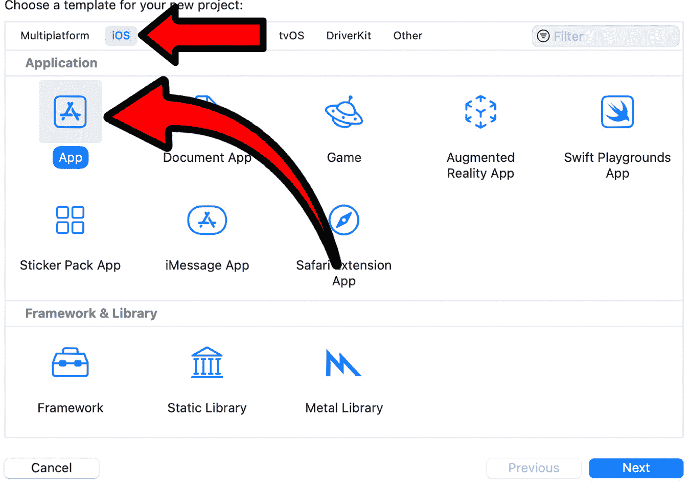

图 4.6 – Xcode 项目模板选择

1.  现在，我们将选择我们项目的选项。只有两个关键的事情需要设置。确保**界面**设置为**SwiftUI**。这将是我们系统将使用的 UI。将**语言**设置为**Swift**；这是我们应用程序使用的编程语言：

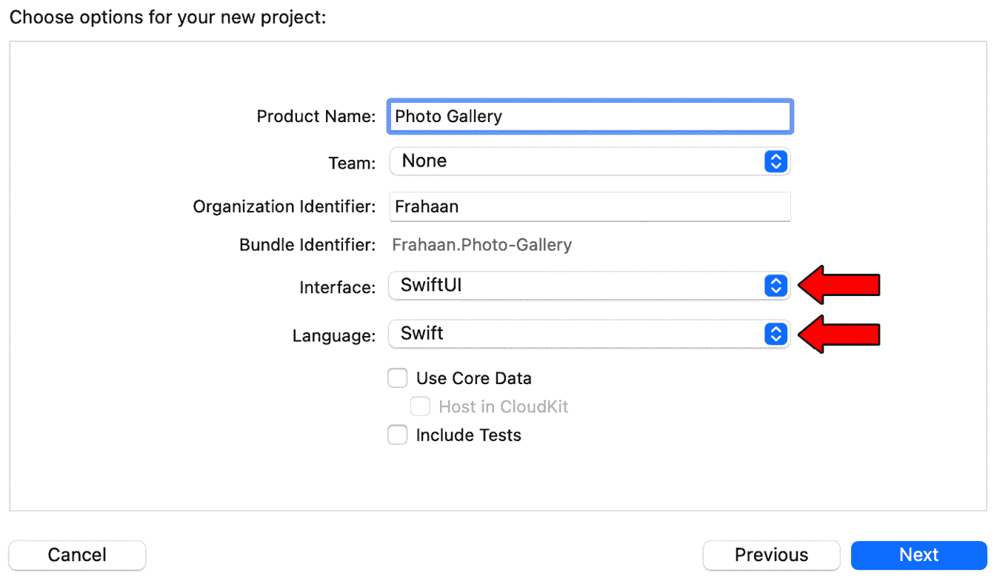

图 4.7 – Xcode 项目选项

1.  一旦点击**下一步**，您可以选择在哪里创建您的项目：

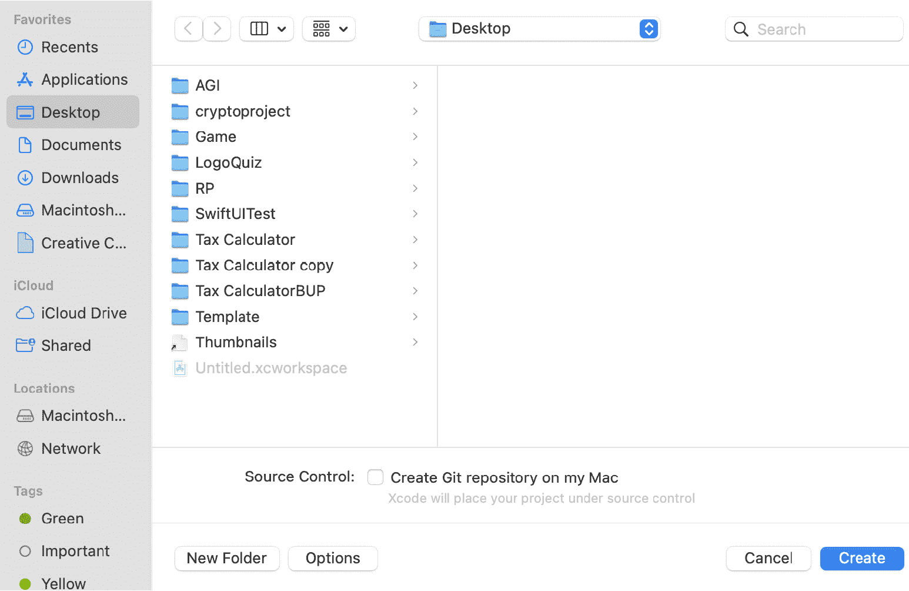

图 4.8 – Xcode 项目保存目录

1.  一旦你选择了位置，点击右下角的 **创建**。Xcode 以其全部荣耀显示你的项目：

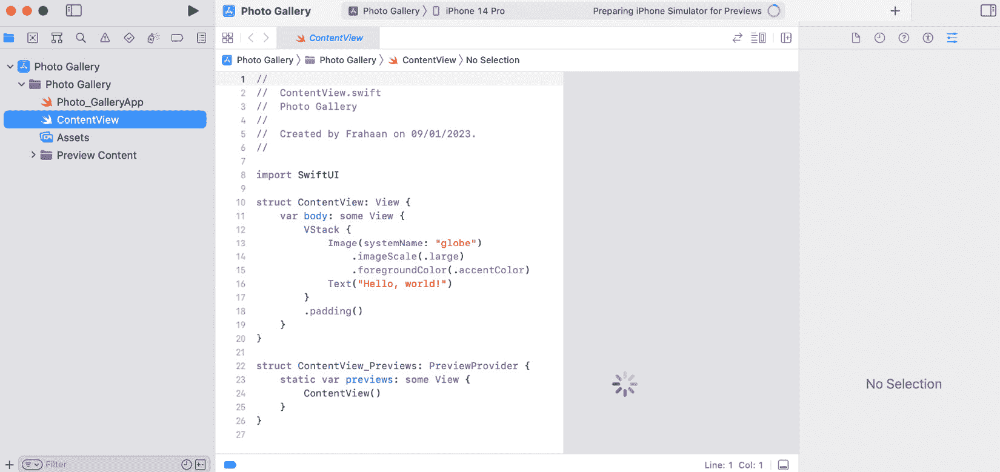

图 4.9 – 新 Xcode 项目的概述

在下一节中，我们将设置我们的项目为仅限 iPad。

## 设置项目为 iPad

你可能已经注意到在预览中，它目前设置为 iPhone 项目，或者更准确地说，是 iOS 项目。这意味着它在 iPhone 和 iPad 上运行，并且默认预览显示 iPhone 视图。我们希望我们的项目仅限 iPad，因此按照以下步骤将我们的项目设置为仅限 iPad：

1.  让我们立即更改它。在 **项目导航器** 中选择项目：

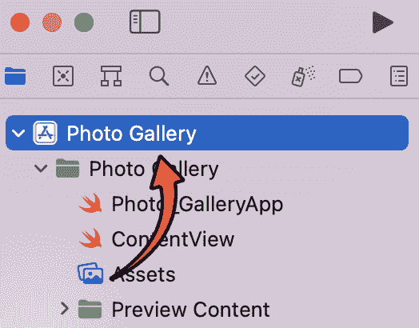

图 4.10 – 项目在项目导航器中

1.  现在从 **TARGETS** 部分选择 **Photo Gallery**：


图 4.11 – 目标选择

1.  下一步是移除 iPhone 和 Mac 目的地。这样做很简单；选择每个目的地并按减号按钮：

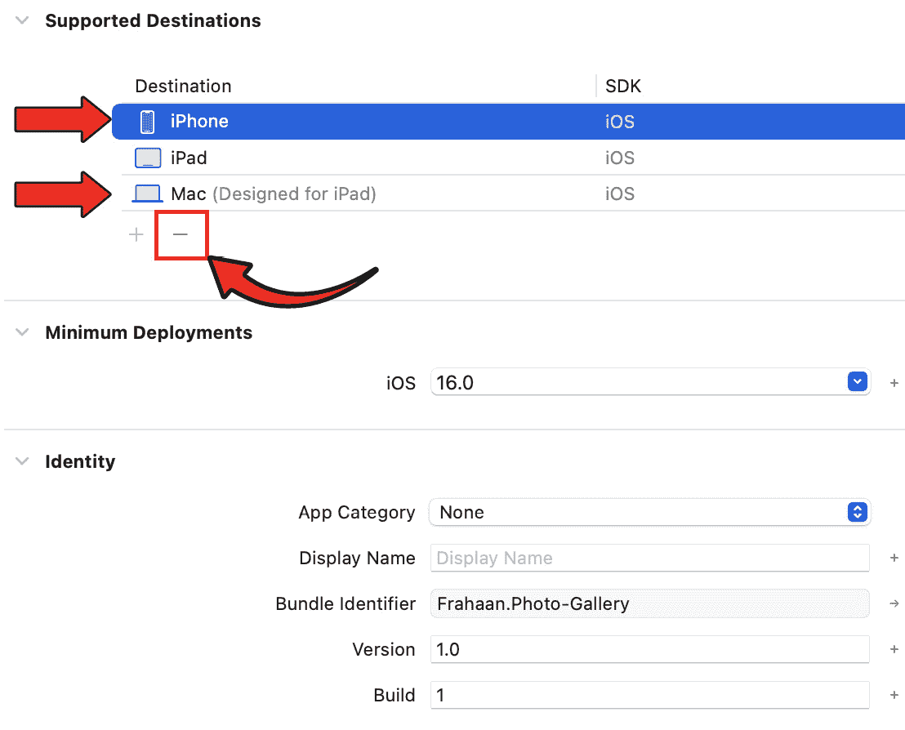

图 4.12 – 移除目的地

1.  在从目的地中移除 iPhone 和 Mac 之后，它应该看起来如下：

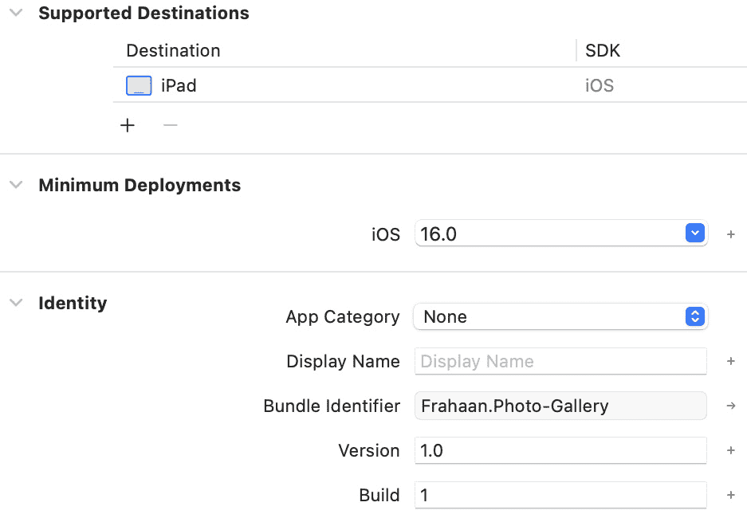

图 4.13 – 支持的目的地

在下一节中，我们将使用 SwiftUI 实现我们应用程序的高亮页面。

## 高亮页面

在本节中，我们将实现高亮页面的 UI。作为一个提醒，它将看起来像这样：


图 4.14 – 竖屏模式下高亮视图的线框

高亮页面上有一个主要元素。作为一个小任务，看看你是否能找出它是什么。如果你不知道确切的 UI 组件名称，不用担心；我们将在下一节中查看它。

### 图像组件

图像组件是 SwiftUI 提供的核心组件之一。它允许你显示图像，可以用来提供某物的视觉表示或装饰一段文本。我们将使用它来显示我们画廊中的所有图像作为高亮页面上的高亮。以下图像显示了高亮页面上的图像。正如你从 *图 4**.14* 记忆的那样，高亮页面充满了小图像。这些图像将是可点击的，将用户带到增强视图。

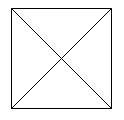

图 4.15 – 高亮视图中的图像组件

在下一节中，我们将使用 SwiftUI 将我们之前讨论过的图像组件添加到我们的应用程序中。

## 添加高亮页面组件

在本节中，我们将向我们的高亮页面添加图像组件，该页面目前命名为 **ContentView**：

1.  首先，让我们重命名 `HighlightView`。这样做很简单：打开 **ContentView**，在代码中右键单击任何对 **ContentView** 的引用，然后转到 **重构 | 重命名**。我将使用第一个引用，如下面的截图所示：

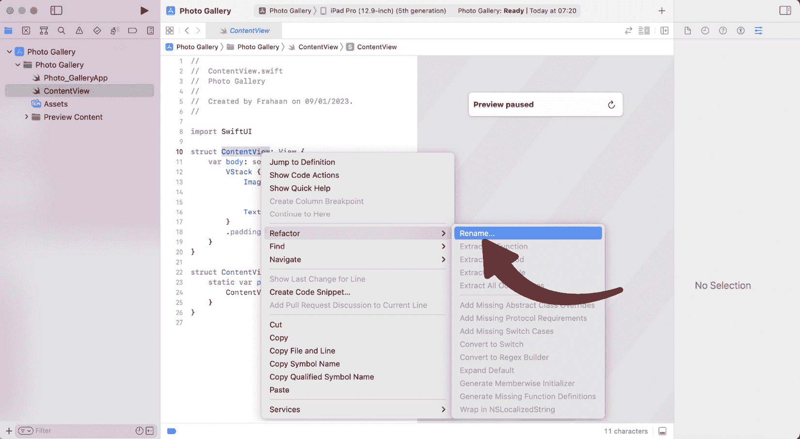

图 4.16 – 重命名按钮

1.  接下来，将显示以下屏幕：

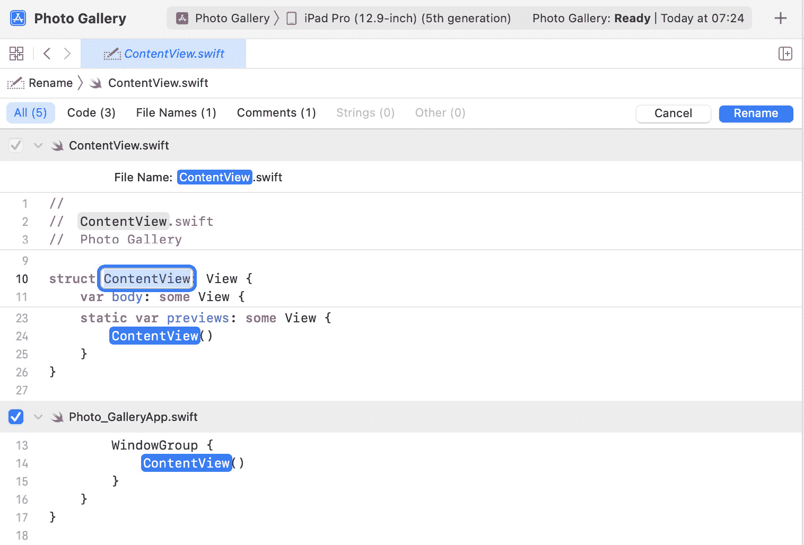

图 4.17 – 重命名屏幕

1.  将名称从 `HighlightView` 改变，如您所见，所有对 **ContentView** 的其他引用都会自动更新。最后，点击右上角的 **重命名** 按钮：

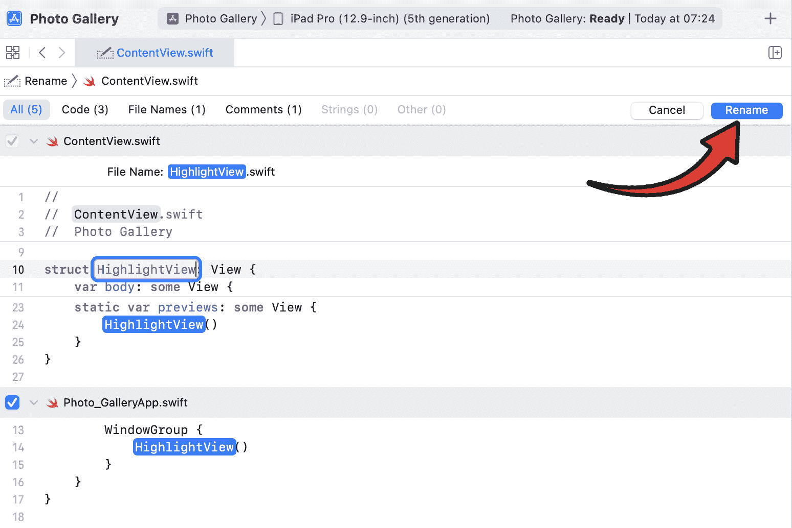

图 4.18 – 更改视图名称

1.  我们已经将视图重命名，包括文件名，如下所示，在**项目导航器**中：

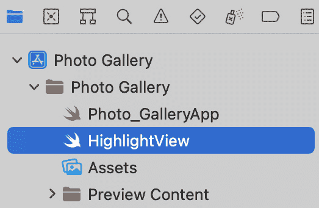

图 4.19 – 项目导航器中更新的文件名

1.  有一个额外的步骤，这是可选的。那就是重命名 `ContentView_Previews` 结构。虽然这不是关键，但我强烈建议重命名它，以保持所有名称引用的一致性。使用之前的过程，重命名 `ContentView_Previews` 为 `HighlightView_Previews`。该结构的位置在 `HighlightView` 文件的底部（之前命名为 `ContentView`）：

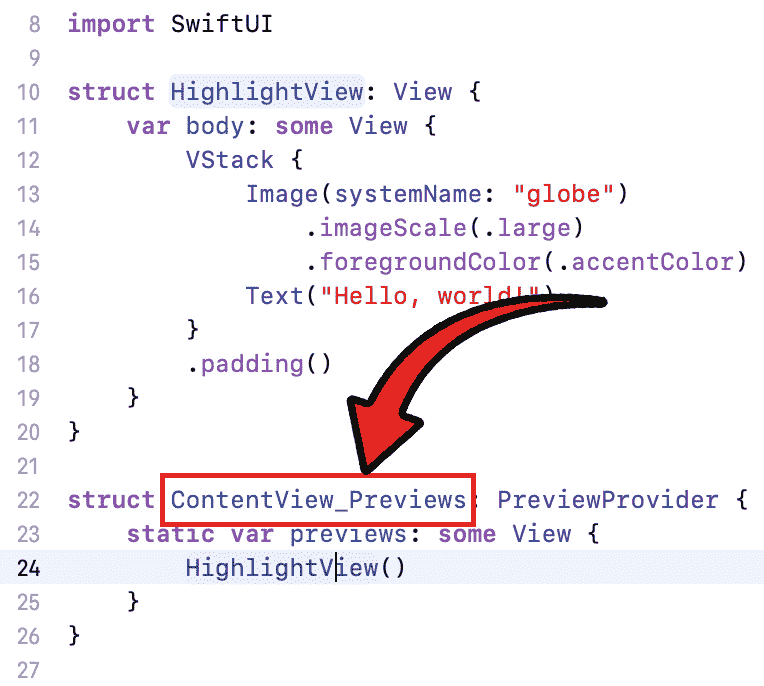

图 4.20 – 重命名预览结构

在下一节中，我们将查看列布局并确定哪一种最适合我们的应用程序。

### 列布局

在我们开始编写高亮页面代码之前，让我们讨论三种主要的列布局类型：

+   **灵活布局**：允许你指定列数，并根据屏幕大小动态地分配空间。

+   **固定布局**：创建具有固定尺寸的列，这比较受限。

+   **自适应列**：正如其名所示，它们会根据内容的大小进行调整。你设置最小尺寸，自适应系统会根据屏幕大小计算单行可以放置多少项。自然地，当 iPad 处于横屏模式时，显示的项数会比竖屏模式多。

每种布局都有其用例，但为了真正展示我们的照片库，我们将使用自适应列系统。在下一节中，我们将以编程方式实现高亮视图。

## 实现高亮视图

由于我们创建了一个新的项目，编码标准并不符合我的个人偏好。因此，首先，我将更改标准。请随意花几分钟时间做同样的事情：

1.  首先，我们需要将图片添加到我们的项目中。这样做很简单。从 **项目导航器** 中选择 **Assets**：

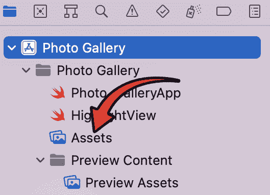

图 4.21 – 项目导航器中的资源位置

1.  现在**Assets**视图将出现。导入图像/资产可以通过以下两种方式之一完成：

    1.  将文件拖放到**Assets**部分：

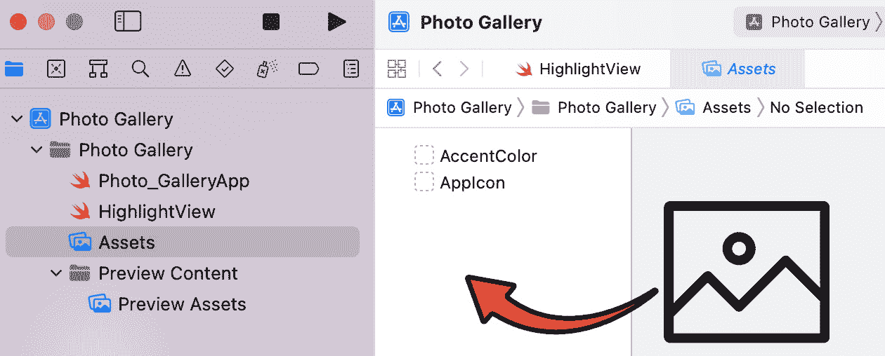

图 4.22 – 拖放 Assets

1.  右键点击**Assets**部分并选择**导入**：

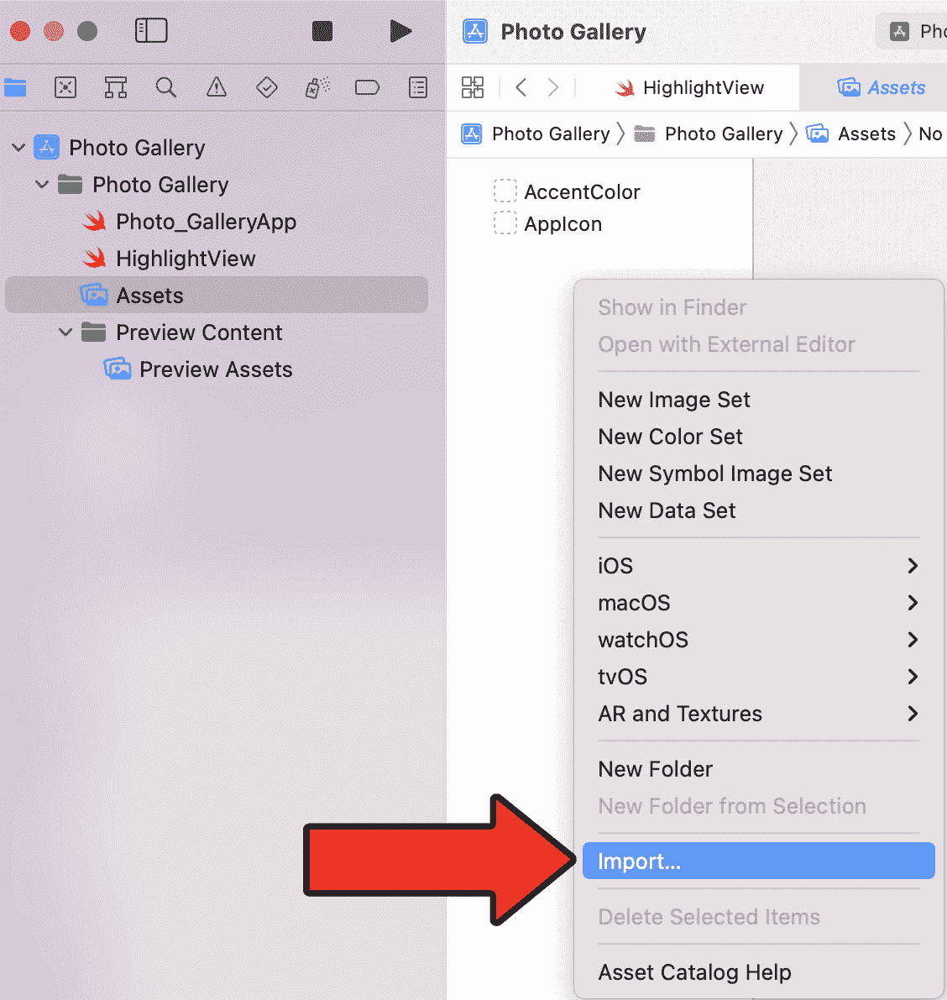

图 4.23 – 导入按钮

1.  一旦导入资产，**Assets**视图将如下所示：

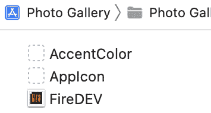

图 4.24 – 导入的 Asset(s)

小贴士

我只导入了一张图像，并将多次使用它，但您可以使用不同的图像。

接下来，我们将创建一个字符串数组。每个字符串将是我们图库中图像的名称。如前所述，我将使用相同的图像，因此所有字符串都将相同。根据您的需求进行更新。

注意

我正在使用缩略图作为我的以开发者为中心的播客 FireDEV。请随意使用，并每周四通过以下链接收听我的播客：

Spotify: [`open.spotify.com/show/387RiHksQE33KYHTitFXhg`](https://open.spotify.com/show/387RiHksQE33KYHTitFXhg)

Apple Podcasts: [`podcasts.apple.com/us/podcast/firedev-fireside-chat-with-industry-professionals/id1602599831`](https://podcasts.apple.com/us/podcast/firedev-fireside-chat-with-industry-professionals/id1602599831)

Google Podcasts: [`podcasts.google.com/feed/aHR0cHM6Ly9hbmNob3IuZm0vcy83Yjg2YTNiNC9wb2RjYXN0L3Jzcw`](https://podcasts.google.com/feed/aHR0cHM6Ly9hbmNob3IuZm0vcy83Yjg2YTNiNC9wb2RjYXN0L3Jzcw).

1.  在`HighlightView`结构体的开头添加以下代码，在主体之前：

    ```swift
    private let images: [String] =[    "FireDEV", "FireDEV", "FireDEV", "FireDEV", "FireDEV","FireDEV", "FireDEV", "FireDEV", "FireDEV", "FireDEV","FireDEV", "FireDEV", "FireDEV", "FireDEV", "FireDEV","FireDEV", "FireDEV", "FireDEV", "FireDEV", "FireDEV"]
    ```

我们添加的代码只是一个与图像文件对应的字符串数组。在 Swift 中指定资源时，不需要包含文件类型，例如，`.png`。

1.  接下来，我们将创建一个变量，用于设置列的排列方式。之前，我们讨论了不同的列布局，并选择了自适应列。在之前的代码下方添加以下代码：

    ```swift
    private let adaptiveColumns =[    GridItem( .adaptive( minimum: 300 ) )]
    ```

此代码将网格项设置为自适应，最小尺寸为 300 像素，这意味着无论 iPad 的大小如何，图像都易于查看，不会太小或太大。

1.  现在，我们将显示图像。在主体内部添加以下代码，我们将介绍每一部分的作用：

    ```swift
    ScrollView{    LazyVGrid( columns: adaptiveColumns, spacing: 20 )    {        ForEach( images.indices )        { i in            Image( images[i] )                .resizable( )                .scaledToFill( )                .frame( width: 300, height: 300 )        }    }}
    ```

在我们运行它之前，让我们看看代码的每一部分都做了什么：

+   `LazyVGrid( columns: adaptiveColumns, spacing: 20 )`: 创建一个具有自适应列且每项之间间隔为 20 的懒加载垂直网格。

+   `ForEach(` `images.indices )`

`{ i in`: 遍历每个图像文件名，`i`代表索引号，从 0 开始，稍后将用于引用图像。

+   `Image(` `images[i] )`

`.``resizable( )`

`.``scaledToFill( )`

`.frame(width: 300, height: 300)`: 使用`images`数组中的文件名创建一个图像。`resizable`允许修改图像的大小。在应用任何缩放或尺寸之前设置`resizable()`修饰符很重要，否则它将不起作用。`scaledToFill`用于保持图像的宽高比并将其缩放以填充其父元素。最后，使用`frame`参数设置图像的宽度和高度。

1.  运行应用程序将产生以下结果：

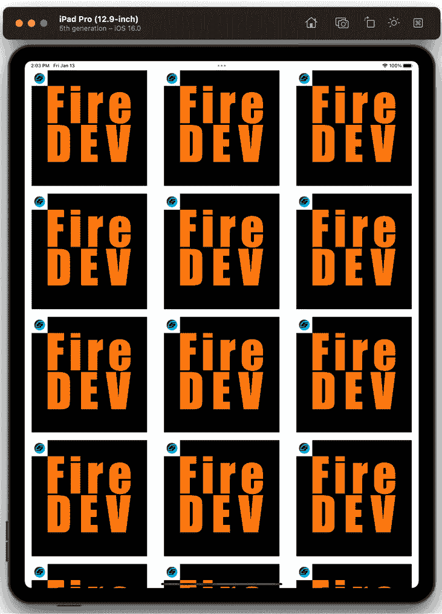

图 4.25 – 高亮视图预览

1.  现在让我们旋转我们的设备/模拟器，看看它看起来如何：

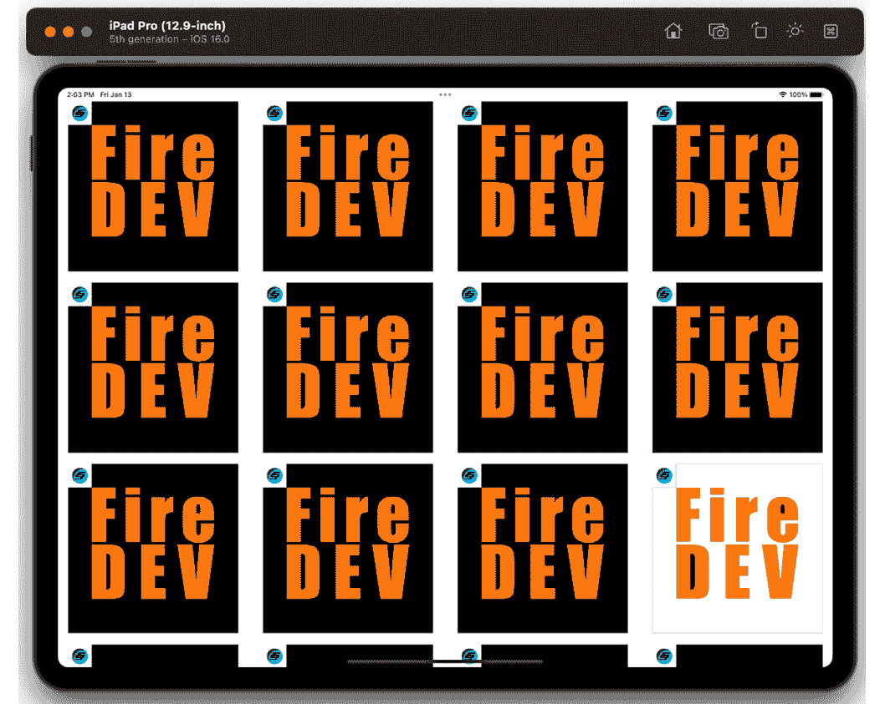

图 4.26 – 横向布局预览

1.  通过按*⌘* *+ 左/右箭头键*或通过按模拟器顶部的旋转按钮，如图下所示，可以实现模拟器的旋转：


图 4.27 – 旋转按钮

如我们所见，我们画廊应用的高亮视图看起来非常好。它在纵向和横向模式下都能完美工作。使用网格而不是自定义实现的美妙之处在于它处理了旋转，这节省了时间和精力，同时保持了与用户习惯的设计标准一致。

这就是本章的最后一段代码。以下是`HighlightView`文件的全部代码：

```swift
import SwiftUIstruct HighlightView: View
{
    private let images: [String] =
    [
        "FireDEV", "FireDEV", "FireDEV", "FireDEV", "FireDEV", "FireDEV", "FireDEV", "FireDEV", "FireDEV", "FireDEV", "FireDEV", "FireDEV", "FireDEV", "FireDEV", "FireDEV", "FireDEV", "FireDEV", "FireDEV", "FireDEV", "FireDEV"
    ]
    private let adaptiveColumns =
    [
        GridItem( .adaptive( minimum: 300 ) )
    ]
    var body: some View
    {
        ScrollView
        {
            LazyVGrid( columns: adaptiveColumns, spacing: 20 )
            {
                ForEach( images.indices )
                { i in
                    Image( images[i] )
                        .resizable( )
                        .scaledToFill( )
                        .frame( width: 300, height: 300 )
                }
            }
        }
    }
}
struct ContentView_Previews: PreviewProvider
{
    static var previews: some View
    {
        HighlightView( )
    }
}
```

我们首先研究了我们的照片画廊应用的设计。由于它是在 iPad 上，从设计角度来看它是独特的。我们研究了高亮视图、增强视图和全屏模式的线框图。我们使用 SwiftUI 实现了高亮视图，并确保它正确旋转。

# 摘要

在本章中，我们讨论了 iPad 上我们的照片画廊应用的设计。我们研究了线框图，并将每个元素分解为 SwiftUI 组件。然后我们实现了 SwiftUI 组件以匹配高亮视图线框图的设计。我们还研究了构建此应用程序的要求，以及照片画廊应用可能具有的设计规范。然后我们将其简化为应用的核心功能。我们通过验收标准扩展了设计规范，以展示我们希望我们的应用能够做什么。

在我们下一章中，我们将探讨基于本章讨论的线框图实现增强视图，并将其与高亮视图连接起来。
