# 6

# Mac 项目 – 应用商店侧边栏

在前四章中，我们为 iPhone 创建了一个税务计算器应用程序，为 iPad 创建了一个照片画廊应用程序。我们从零开始实现它们，考虑了技术要求、设计规范、线框和代码实现。我们将使用本章和下一章中涵盖的技能来创建应用商店侧边栏，但请放心：我们将回顾所有必要的方面，以防你直接跳到本章。

在本章中，我们将着手设计我们的第三个项目，一个展示其大屏幕且保持单一方向的 Mac 应用商店应用程序。我们将评估设计此类应用程序的要求，并讨论设计规范，以便我们更好地理解所需内容以及如何将这些内容整合在一起。然后，我们将开始本章应用程序的编码过程，构建侧边栏，下一章将涵盖应用商店应用程序的主体。本项目将涵盖 SwiftUI 组件的基础。

本章涵盖了以下主要主题：

+   理解设计规范

+   可接受标准

+   构建侧边栏 UI

到本章结束时，你将更好地理解我们应用程序的设计和所需内容，以及一个将作为下一章中画廊工作基础的骨架用户界面。

# 技术要求

本章要求你从 Apple 的应用商店下载 Xcode 14 或更高版本。要在应用商店中安装 Xcode，只需在应用商店中搜索 Xcode，然后选择并下载最新版本。打开 Xcode 并遵循任何额外的安装说明。一旦 Xcode 打开并启动，你就可以开始了。

Xcode 14 版本具有以下功能/要求：

+   包含 iOS 16、iPadOS 16、macOS 12.3、tvOS 16 和 watchOS 9 的 SDK

+   支持 iOS 11 或更高版本、tvOS 11 或更高版本和 watchOS 4 或更高版本的设备调试

+   需要运行 macOS Monterey 12.5 或更高版本的 Mac

如需有关技术细节的更多信息，请参阅*第一章*。

本章的代码文件可在此处找到：[`github.com/PacktPublishing/Elevate-SwiftUI-Skills-by-Building-Projects`](https://github.com/PacktPublishing/Elevate-SwiftUI-Skills-by-Building-Projects)

在下一节中，我们将提供关于我们应用程序设计规范的清晰说明，并查看应用程序的外观原型。

# 理解设计规范

在本节中，我们将查看我们应用商店应用程序的设计规范，并描述我们将要实现的功能。确定所需功能的最有效方法是站在用户的角度，确定他们将如何使用应用程序，然后将其分解为单独的步骤。

我们的应用程序可能有许多功能，如下所示：

+   侧边栏 – 用于应用程序的不同部分。

+   突出横幅 - 展示每日应用。

+   特色瓷砖 - 展示较少的应用或更具体的类别应用。

+   新应用和更新部分。

+   搜索 - 能够在整个集合中搜索特定应用。

+   账户管理。

+   应用审查。

+   应用报告。

+   应用页面 - 显示所选应用的描述和日期等信息，类似于我们之前创建的相册应用中的`EnhancedView`。

+   来自外部源的应用图像和信息，例如本地数据库或在线。

+   分享 - 能够分享图片。

+   创建收藏/稍后下载列表。

现在我们已经列出了我们希望的理想功能，接下来，对我们来说，确定哪些功能是绝对必要的非常重要。为了做到这一点，我们必须了解我们产品的最终用途。对我来说，创建这个应用商店应用的目的在于展示侧边栏及其与主体部分的集成。我们不会实现应用页面，因为它与相册的`EnhancedView`非常相似，这将被设定为一个额外任务，你可以使用前两章的内容作为辅助。基于这一点，我知道并非所有功能都是必需的，有些如果省略并作为额外任务分配给你作为开发者去完成，将会很有用。因此，以下是我们将实施的核心功能：

+   侧边栏 - 用于应用的各个部分。

+   突出横幅 - 展示每日应用。

+   特色瓷砖 - 展示较少的应用或更具体的类别应用。

+   新应用和更新部分。

其余的功能将在你完成这一章和下一章后成为你的练习。下一节将涵盖我们应用的验收标准。

# 理解验收标准

我们将在下一章的末尾讨论我们应用必须满足的要求，我们绝对希望在最终产品中看到这些要求。如果可能的话，我们应该尝试使它们具有可衡量性，所以现在就让我们列出它们：

+   带有文本组件及其旁边图标的侧边栏，以增强视觉上下文。

+   可滚动的主体视图，用于滚动浏览应用和主体中的突出显示应用。

+   突出横幅将占据其父容器的全部宽度，以展示应用。

+   展示特定类别中其他特定应用的瓷砖。

+   显示其余应用的图像和文本。

开发测试用例，以测试应用的验收标准。使用这种方法可以让我们看到应用将被最终用户使用的条件以及需要达到的成功水平。

我们将开发测试方法来检查可测试和最终可衡量的验收标准。这将使我们能够看到应用将被用于哪些用例，以及需要达到的水平才能被认为是成功的。

# 线框设计

设计布局最有用的工具之一是线框设计。线框是布局外观的概述。以下图显示了我们将使用线框实现的整个应用程序的前页面：

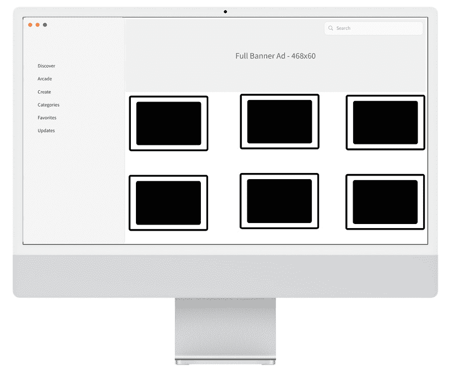

图 6.1 – App Store 线框图

在下一节中，我们将构建我们应用程序的界面，并确保它看起来与我们设计在线框图中的样子一致。虽然我们将以相同的方式构建它，但可能会有一些细微的差异。在本章中，我们将重点关注侧边栏，并在下一章完成主体部分。

# 构建 SideBar UI

现在，我们将构建侧边栏的 UI。首先，让我们创建我们的项目。按照以下步骤操作：

1.  打开 Xcode 并选择 **创建新的** **Xcode 项目**：

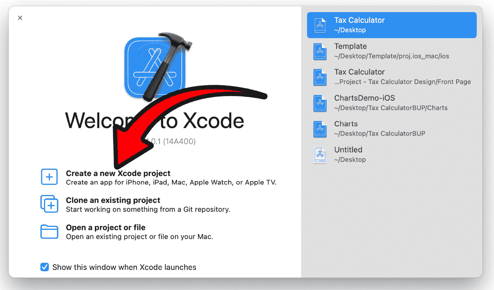

图 6.2 – 创建新的 Xcode 项目

1.  现在，我们将选择我们应用程序的模板。由于我们正在创建一个 iPad 应用程序，我们将从顶部选择 **iOS**，选择 **App**，然后点击 **下一步**：

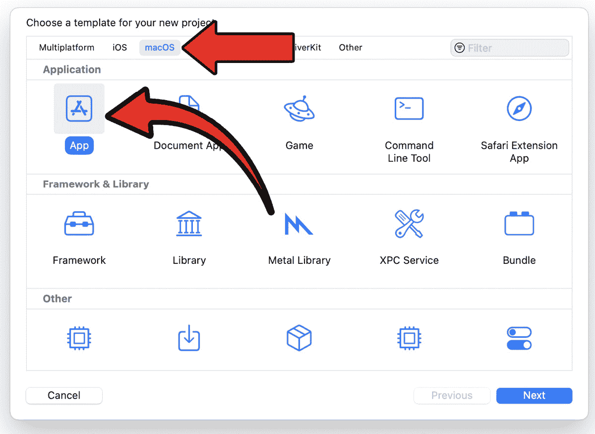

图 6.3 – Xcode 项目模板选择

1.  现在，我们将选择我们项目的选项。在这里，只有两个关键的事情需要选择/设置。确保界面设置为 **SwiftUI**，这是我们系统将使用的 UI，并且**语言**设置为**Swift**，这是我们应用程序显然使用的编程语言：

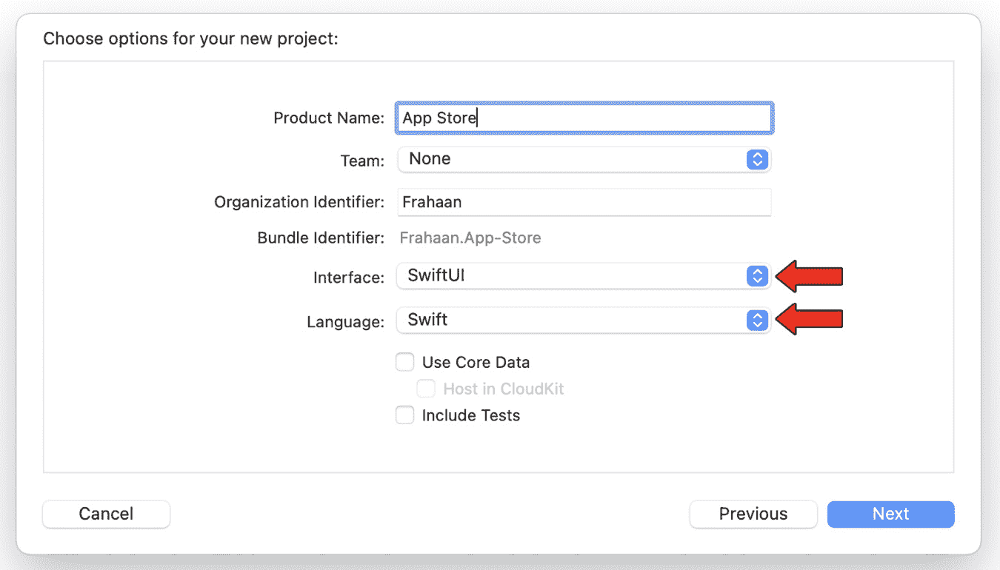

图 6.4 – Xcode 项目选项

1.  一旦你按下 **下一步**，你可以选择创建项目的地方，如下面的图所示：

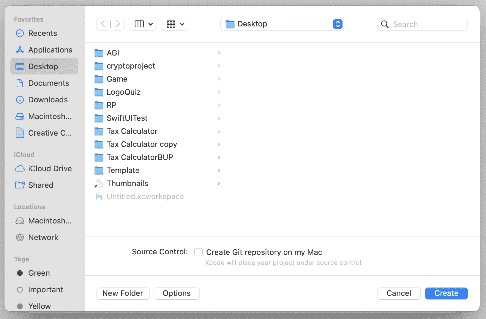

图 6.5 – Xcode 项目保存目录

1.  一旦你找到了你想要创建的位置，就点击右下角的**创建**，如图 *图 6**.5* 所示。Xcode 以其全部的荣耀显示了你的项目，如下面的图所示：

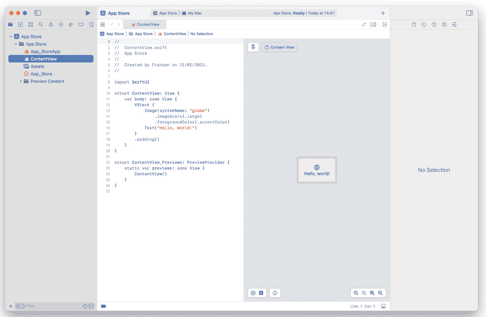

图 6.6 – 新 Xcode 项目概览

在下一节中，我们将使用 SwiftUI 实现我们应用程序的侧边栏。

# 探索侧边栏组件

在本节中，我们将实现侧边栏的用户界面。作为提醒，它将看起来如下：

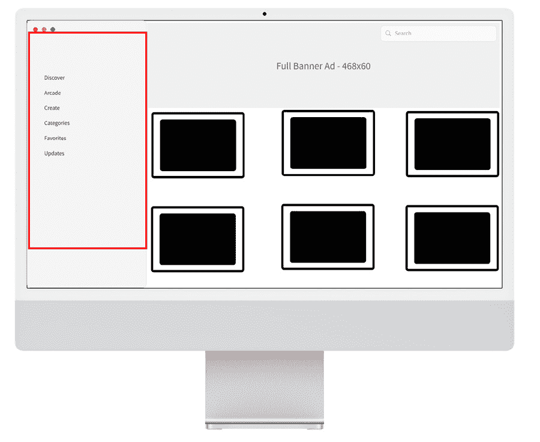

图 6.7 – App Store 线框图

侧边栏有两个主要元素。作为一个小任务，看看你是否能找出它们是什么。如果你不知道确切的 UI 组件名称，不要担心；我们将在接下来的几节中查看这些组件。

## 标签项

标签项组件简单地显示侧边栏中的项目，可以用作按钮来导航应用程序。它允许您显示一串字符、数字，甚至图标，所有这些都可以相互结合使用。对我们来说，我们将它们用作侧边栏内的虚拟按钮：

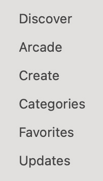

图 6.8 – 侧边栏项

## 搜索栏

`SearchBar` 组件允许用户在一系列组件中进行搜索。对我们来说，我们将使用它作为虚拟搜索组件，该组件将在 App Store 中的所有应用中进行搜索。虽然搜索栏本身不是侧边栏的一部分，但我们将在实现侧边栏的同时实现它：

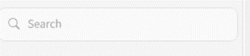

图 6.9 – 搜索栏

### 重命名视图

在本节中，我们将向我们的高亮页面添加图像组件，该页面目前命名为 `ContentView`，将其重命名为 `MainView`。如果您已经知道如何重命名，请随意跳过这些步骤。这样做很简单：打开 `ContentView`，在代码中右键单击任何对 `ContentView` 的引用，然后转到 **重构** | **重命名**...，如图下所示：

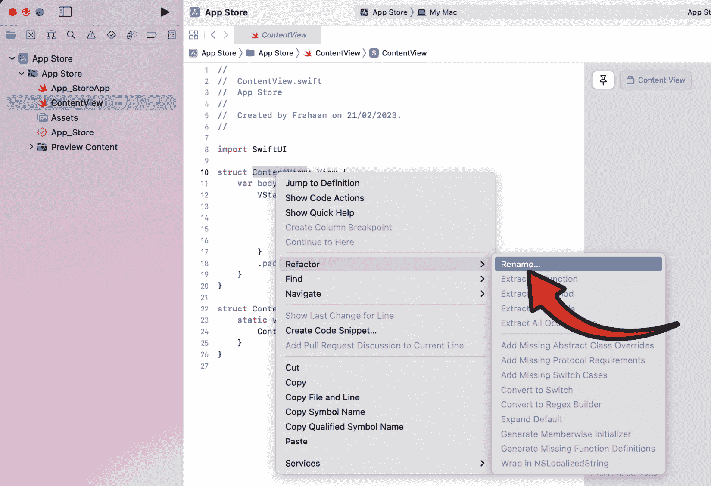

图 6.10 – 重命名按钮

接下来，将显示以下屏幕：

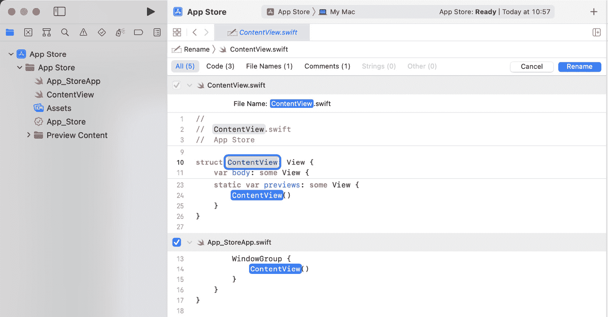

图 6.11 – 重命名屏幕

将名称从 `MainView` 更改。您可以看到所有其他需要更改的引用，这很有用。最后，按下右上角的 **重命名** 按钮，如图下所示：

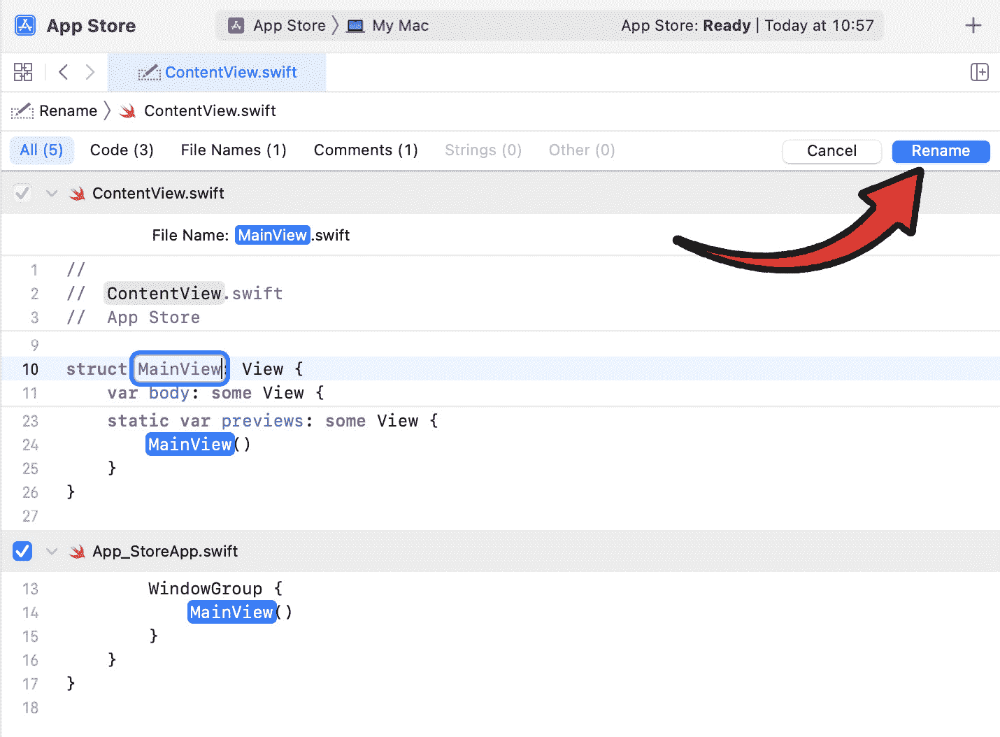

图 6.12 – 重命名按钮

我们现在已经重命名了我们的视图，包括文件，如图 **项目导航器** 中所示：

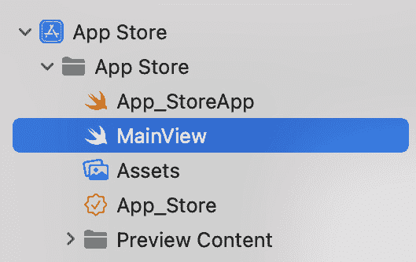

图 6.13 – 项目导航器中更新的文件名

有一个额外的步骤是可选的。这个步骤是将 `ContentView_Previews` 结构重命名。虽然不是至关重要，但我强烈建议将其重命名为 `MainView_Previews`，以保持所有名称引用的一致性。使用前面的步骤，将 `ContentView_Previews` 结构重命名为 `MainView_Previews`。该结构位于 `MainView` 文件（之前命名为 `ContentView`）的底部：

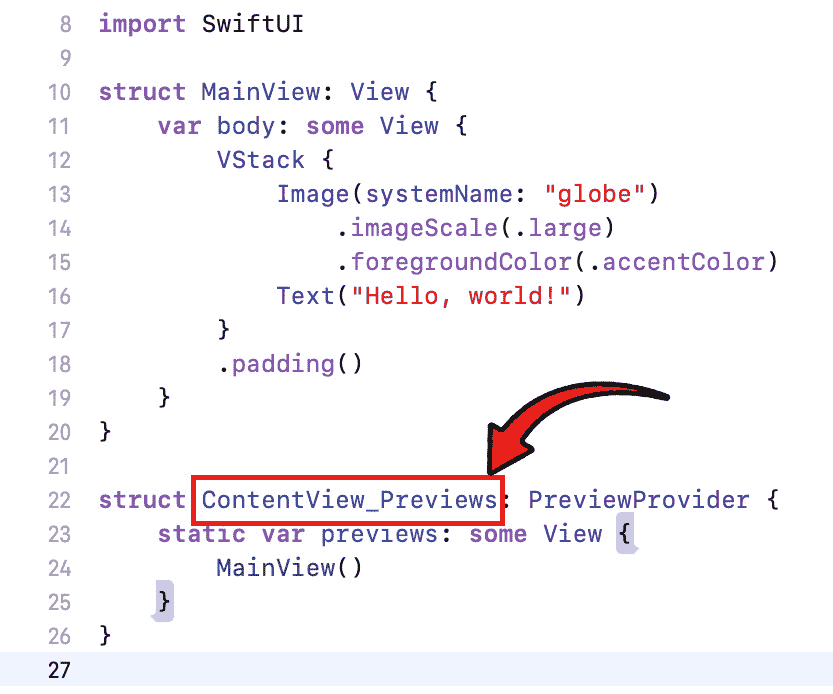

图 6.14 – 重命名预览结构

在本节中，我们查看了一下应用程序的设计，特别是 `SideBar` UI 的设计。我们还重命名了 `ContentView`。在下一节中，我们将实现侧边栏的代码。

# 实现侧边栏

由于我们创建了一个全新的项目，编码标准并不符合我的个人偏好。因此，首先，我将更改标准。请随意花几分钟时间做同样的事情。

## 导航视图

让我们实现一个`NavigationView`来提供一个分屏布局，这将允许我们编写侧边栏代码。这样做很简单。删除当前的主体代码，并用以下代码替换：

```swift
var body: some View{
    NavigationView
    {
        List
        {
            Label( "Discover", systemImage: "" )
            Label( "Arcade", systemImage: "" )
            Label( "Create", systemImage: "" )
            Label( "Categories", systemImage: "" )
            Label( "Favorites", systemImage: "" )
            Label( "Updates", systemImage: "" )
        }
    }
}
```

在我们的`NavigationView`中，我们创建了一个`List`，其中包含一组`Labels`，这些标签将作为我们的虚拟按钮。默认情况下，我们不提供系统图像，但我们需要指定一些内容，否则将导致错误。

上述代码将导致以下结果：

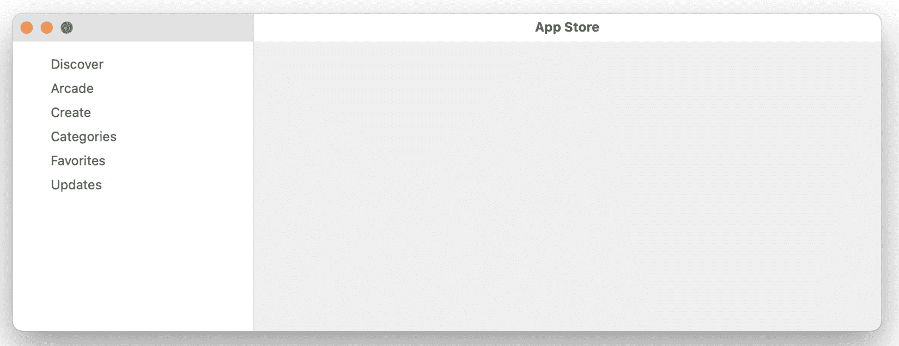

图 6.15 – 标签预览

虽然我们不需要实现图标，但应用程序将极大地受益于它们的加入。添加图片很容易；你只需使用`systemImage`参数。或者，你可以按照*第四章*中“实现 HighlightView”部分的步骤提供自己的图片，并使用`image`参数实现它们。找到/搜索系统图像的最佳方法是下载**SF Symbols**，你可以在[`developer.apple.com/sf-symbols/`](https://developer.apple.com/sf-symbols/)找到它。一旦安装，你可以轻松地搜索系统图像。要使用系统图像，只需复制以下系统图像的名称：

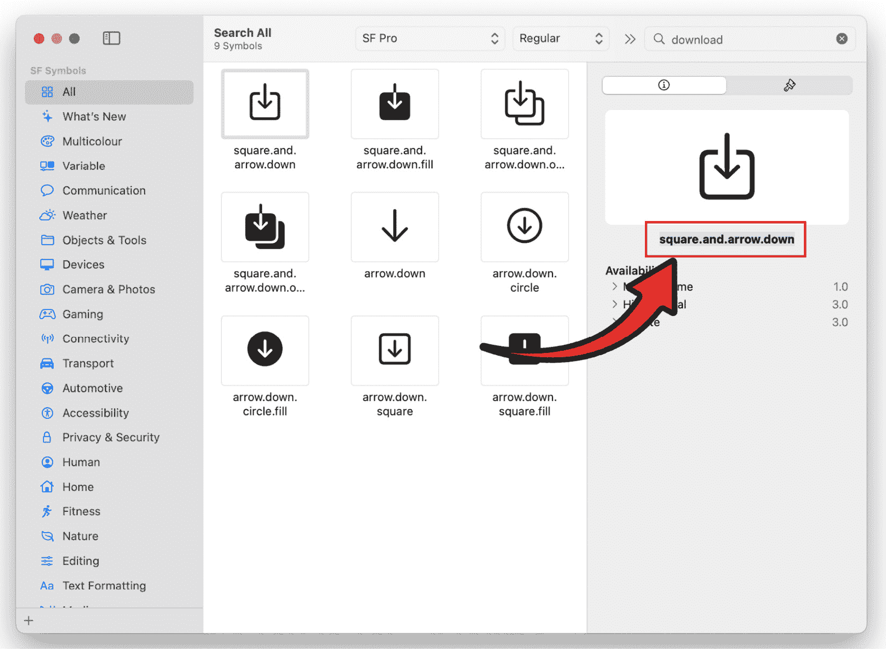

图 6.16 – 系统图像名称

随意使用你认为最适合你应用程序的系统图像。我选择了以下图像：

```swift
List{
    Label( "Discover", systemImage: "star" )
    Label( "Arcade", systemImage: "gamecontroller" )
    Label( "Create", systemImage: "paintbrush" )
    Label( "Categories", systemImage: "square.grid.3x3.square" )
    Label( "Favorites", systemImage: "heart" )
    Label( "Updates", systemImage: "square.and.arrow.down" )
}
```

运行应用程序将显示以下结果：

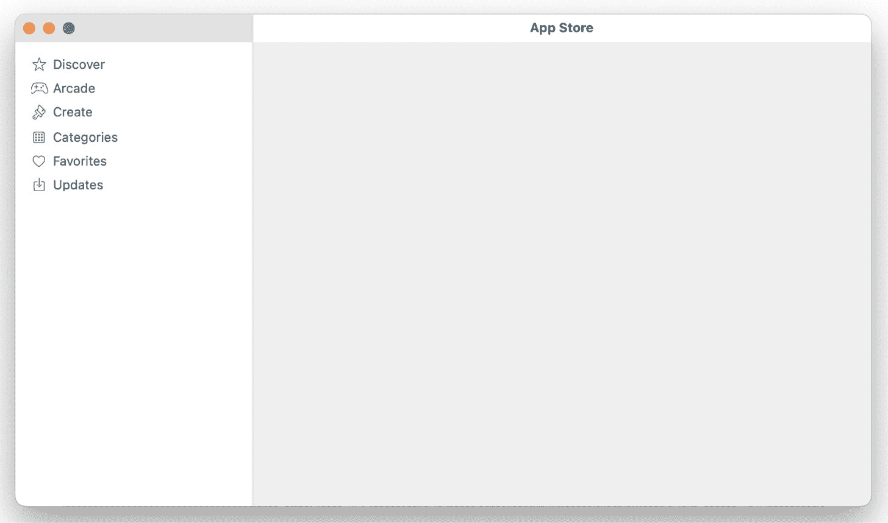

图 6.17 – 系统图标

## 搜索栏

虽然`SearchBar`将被放置在顶部栏中，但它包含在侧边栏代码中。添加搜索栏非常简单。首先，在主体之前添加以下代码，这将存储`SearchBar`的用户输入：

```swift
@State private var searchText = ""
```

接下来，将以下代码添加到`List`组件中：

```swift
.searchable( text: $searchText )
```

我们刚刚添加的代码添加了一个`SearchBar`并将其文本链接到我们创建的`searchText`变量。列表组件代码现在将如下所示：

```swift
List{
    Label( "Discover", systemImage: "star" )
    Label( "Arcade", systemImage: "gamecontroller" )
    Label( "Create", systemImage: "paintbrush" )
    Label( "Categories", systemImage:
"square.grid.3x3.square" )
    Label( "Favorites", systemImage: "heart" )
    Label( "Updates", systemImage: "square.and.arrow.down" )
}.searchable( text: $searchText )
```

运行应用程序将产生以下结果：

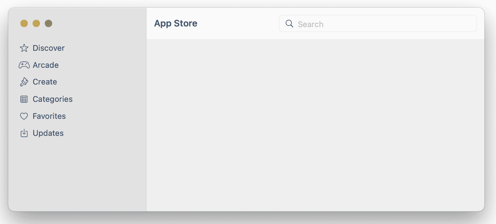

图 6.18 – 搜索栏

在本节中，我们实现了`SearchBar` UI 的代码。在下一节中，我们将探讨一些额外功能，这些功能将有助于使应用程序焕发生机。

# 实现额外功能

尽管在这个项目的范围内我们已经完成了`SideBar`，但我还想向你展示如何实现按下`SearchBar`上的*Enter*键的事件，以及如何使`SideBar`标签可点击。

## 搜索栏 Enter 事件

我们希望用户在选择了`SearchBar`后能够按下*Enter*键来触发一个事件。这个事件可以弹出一个结果列表或新页面。请随意将其作为一个额外任务来实现。

实现这一点的代码非常简单。在`.``searchable`代码之后添加以下代码：

```swift
}.searchable( text: $searchText )    .onSubmit( of: .search )
    {
        print( searchText )
    }
```

当用户提交搜索时，括号内的代码将会执行。为了测试，我们打印了 `searchText` 变量，它将打印出你输入的内容。请随意运行它。

## 可点击标签事件

目前，侧边栏内的标签没有事件功能。在本章的范围内，我们不需要它，但我将向你展示如何使标签可点击。实际上非常简单。只需为每个标签添加一个 `onTapGesture` 函数，如下所示：

```swift
Label( "Discover", systemImage: "star" ).onTapGesture
{
    print( "Discover" )
}
```

我只将其添加到了第一个标签上，但你可以随意将其添加到其他标签上。

在本节中，我们实现了代码，允许用户在搜索栏中按下 *Enter* 键时触发 `Submit` 事件。我们还添加了检测标签被点击的代码。

# 摘要

在本章中，我们讨论了我们的应用商店应用程序的设计。我们研究了线框图，并将每个元素分解为 SwiftUI 组件。然后我们实现了 SwiftUI 组件，以匹配线框图中的 `SideBar` UI 设计。我们还研究了构建此应用程序的要求和设计规范。然后我们将它们简化为核心功能，这是我们应用将提供的功能。我们还实现了额外功能，以允许额外的输入，使应用程序更加完善。

在下一章中，我们将探讨实现我们的应用商店应用程序的主体。
