# 7

# Mac 项目 – 应用商店主体

在本章中，我们将致力于实现应用商店项目的主体部分。在前一章中，我们研究了应用商店的设计，特别是侧边栏设计。然后，我们将侧边栏分解为我们应用程序需求所需的所有必要组件。然后，我们使用 SwiftUI 实现了所有组件。在前一章的结尾，我们只有一个带有一些可选事件跟踪的侧边栏，但主体部分没有内容。主要部分将是可滚动的，并使用图标和横幅展示应用程序。现在，我们将分析主体部分，将其分解为其包含的所有组件，并实现所有组件以提供类似应用商店的感觉。

本章将分为以下部分：

+   主体部分概述

+   实现主体部分

+   额外任务

到本章结束时，您将创建一个具有可滚动视图的应用商店模板来展示应用程序。这将为进一步扩展应用商店应用程序或使用我们已实现的内核结构将项目转向完全不同的东西提供一个坚实的基础。随着本章的结束，我将提供练习以在应用商店中实现更高级的功能。这将很好地过渡到我们的第四个也是最后一个项目，即 Apple Watch 健身伴侣应用程序。

# 技术要求

本章要求您从 Apple 的 App Store 下载 Xcode 版本 14 或更高版本。

要安装 Xcode，只需在 App Store 中搜索 Xcode，选择并下载最新版本。打开 Xcode 并遵循任何额外的安装说明。一旦 Xcode 打开并启动，您就可以开始了。

Xcode 版本 14 具有以下功能/要求：

+   包含适用于 iOS 16、iPadOS 16、macOS 12.3、tvOS 16 和 watchOS 9 的 SDK

+   支持 iOS 11 或更高版本、tvOS 11 或更高版本和 watchOS 4 或更高版本在设备上进行调试

+   需要 macOS Monterey 12.5 或更高版本的 Mac

有关技术细节的更多信息，请参阅 *第一章*。

本章的代码文件可在此处找到：

[`github.com/PacktPublishing/Elevate-SwiftUI-Skills-by-Building-Projects`](https://github.com/PacktPublishing/Elevate-SwiftUI-Skills-by-Building-Projects)

在下一节中，我们将阐明我们应用程序设计的规范，并查看应用程序的外观原型。

# 主体部分概述

在本节中，我们将再次查看第六章 * 的线框，并将它们分解为其单个组件。本节提供了应用商店和主体部分的线框图像。这些图像描述了应用商店和主体部分的布局和设计。

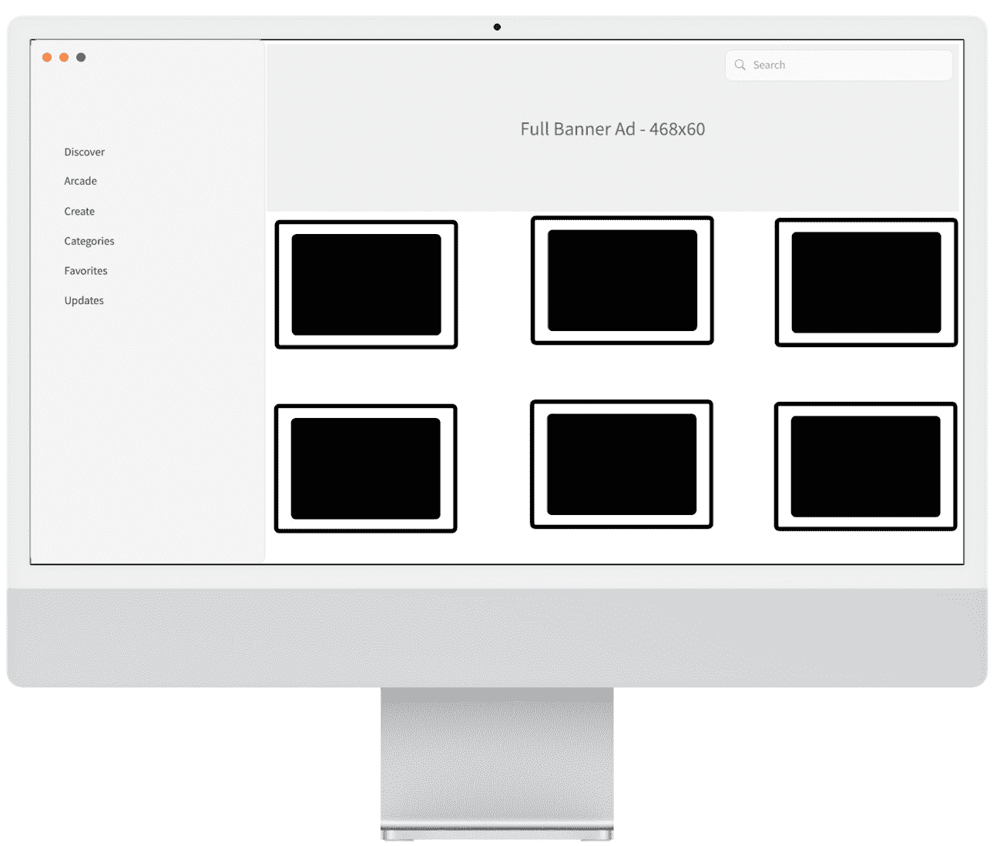

图 7.1 – App Store 视图

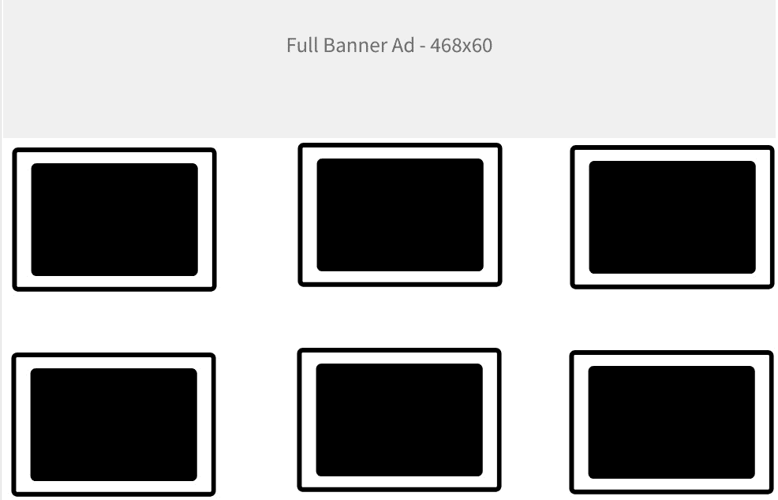

图 7.2 – 应用商店主体

在我们编写应用程序代码之前，我们将把主体分解成构成它的元素。作为一个小任务，看看你是否能弄清楚这些是什么，但如果你不知道确切的 UI 组件名称，也不要担心。我们将在下一节中查看这些组件。

# 图像组件

图像组件是 SwiftUI 提供的核心组件之一。它允许你显示图像，可以用来提供视觉表示或辅助文本内容。我们将以两种主要方式使用它，首先是通过高亮横幅展示特定的应用程序，其次是通过显示应用程序列表/网格。

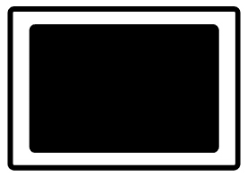

图 7.3 – 应用图标

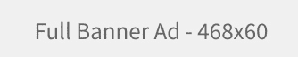

图 7.4 – 横幅

# 文本组件

文本组件是 SwiftUI 提供的最简单的组件之一。它允许你显示一串字符/数字，这对于标题和信息提供非常有用。我们将用于以下内容：

+   应用标题

+   章节描述

在接下来的章节中，我们将继续使用我们之前讨论的 SwiftUI 组件来开发应用程序的主体。这个实现将非常精确，并注重细节。

# 实现主体

在本节中，我们将通过实现应用程序的主体来完成本书的第三个项目。我们的第一步将是编写高亮横幅的代码，然后是应用程序图标。

## 编写高亮横幅

首先，我们将添加高亮横幅的代码。横幅将简单地覆盖整个页面的宽度；我们将为它添加一些间距以增加美观。在页面中添加多个横幅以突出不同的应用，并使用轮播横幅，通过滑动等过渡效果在一个部分中展示多个横幅是很常见的。我们将实现一个单独的横幅；然而，添加更多是非常简单的。按照以下步骤操作：

1.  让我们先添加一个横幅图片。我的图片是 **728x90** 像素。请随意修改以适应你的需求。从 **项目导航器** 中选择 **资产**：

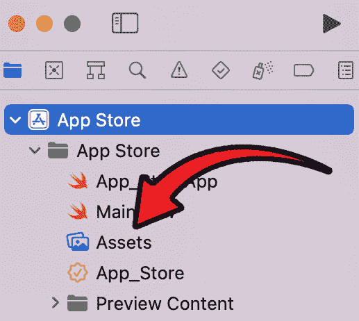

图 7.5 – 项目导航器中的资产位置

1.  现在，**资产** 视图将出现。将图像导入 **资产** 可以有两种方式

    1.  将文件拖放到 **资产** 部分中：

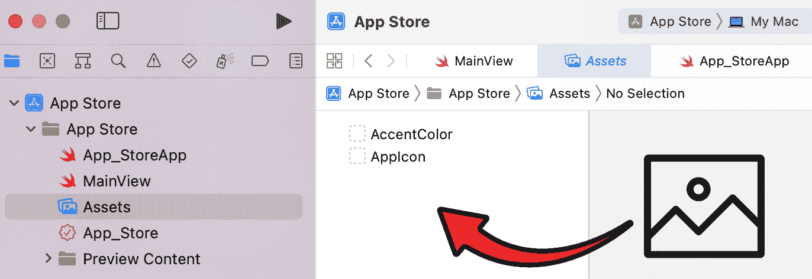

图 7.6 – 拖放资产

1.  右键单击 **资产** 部分并选择 **导入…**：

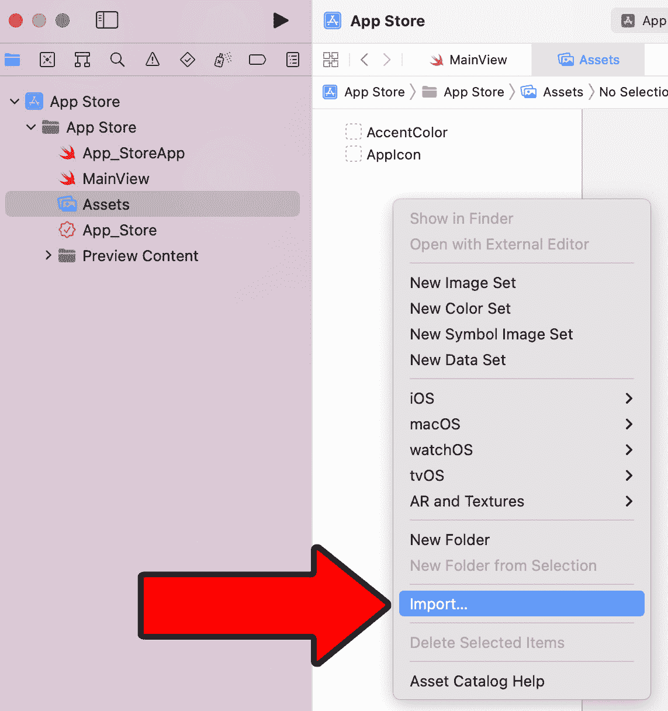

图 7.7 – 导入… 按钮

一旦导入资产，**资产** 视图将如下所示：

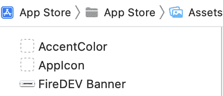

图 7.8 – 导入的资产

注意

我正在使用横幅为我的面向开发者的播客 FireDEV。你可以自由使用，并请在以下链接中收听我的播客，每周四更新：

+   **Spotify**：[`open.spotify.com/show/387RiHksQE33KYHTitFXhg`](https://open.spotify.com/show/387RiHksQE33KYHTitFXhg)

+   **Apple** **播客**：[`podcasts.apple.com/us/podcast/firedev-fireside-chat-with-industry-professionals/id1602599831`](https://podcasts.apple.com/us/podcast/firedev-fireside-chat-with-industry-professionals/id1602599831)

+   **Google** **播客**：[`podcasts.google.com/feed/aHR0cHM6Ly9hbmNob3IuZm0vcy83Yjg2YTNiNC9wb2RjYXN0L3Jzcw`](https://podcasts.google.com/feed/aHR0cHM6Ly9hbmNob3IuZm0vcy83Yjg2YTNiNC9wb2RjYXN0L3Jzcw)

1.  我们将在`List`代码之后添加一个`Image`组件：

    ```swift
    }.searchable( text: $searchText )    .onSubmit( of: .search )    {        print( searchText )    }Image( "FireDEV Banner" )
    ```

这将导致以下结果：

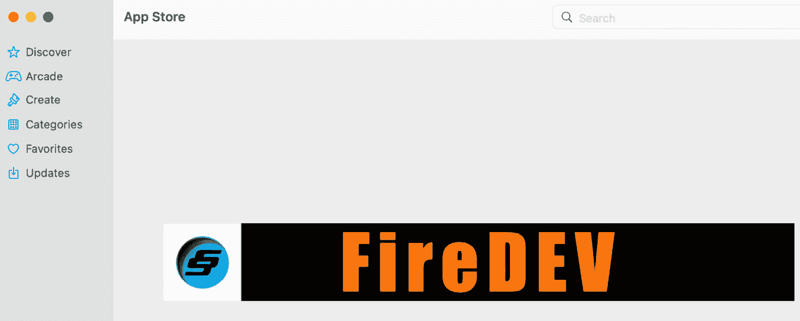

图 7.9 – 添加了横幅

1.  如果你尝试调整窗口大小，会有一些限制。我们需要使横幅可调整大小并保持其原始宽高比。更新图像代码如下：

    ```swift
    Image( "FireDEV Banner" )    .resizable( )    .padding( .horizontal )    .scaledToFit( )
    ```

我们使图像可调整大小，这样它可以根据窗口的大小改变大小。这对于用户在运行应用商店时在不同屏幕尺寸上运行非常有用，他们可能不会总是全屏显示。然后我们添加了水平填充以确保它不接触左右边缘。如果你喜欢，可以省略此步骤，或者你可以指定一个固定的填充量。最后，我们将它设置为`scaledToFit`，这保持了原始宽高比。扭曲从来都不是一个好主意。所有这些结果如下：

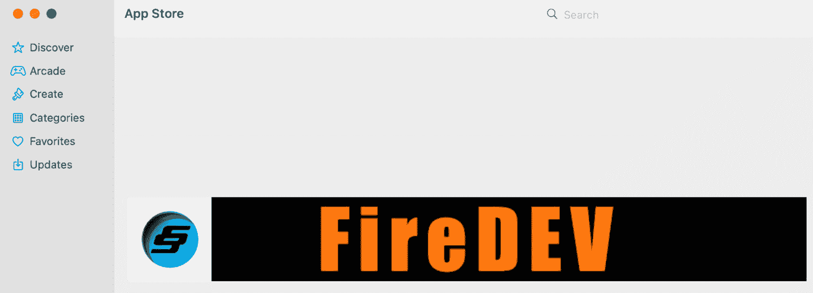

图 7.10 – 横幅已更新

1.  目前，横幅始终位于中心。我们希望将其置于视图顶部。为了实现这一结果，我们将之前添加的图像代码包裹在一个具有`topLeading`对齐方式的`ScrollView`中。更新代码如下：

    ```swift
    ScrollView{    Color.clear    Image( "FireDEV Banner" )        .resizable( )        .padding( .horizontal )        .scaledToFit( )}
    ```

我们还添加了一个`Color.clear`指令以确保没有背景颜色，所有这些结果都产生了一个很棒的横幅：

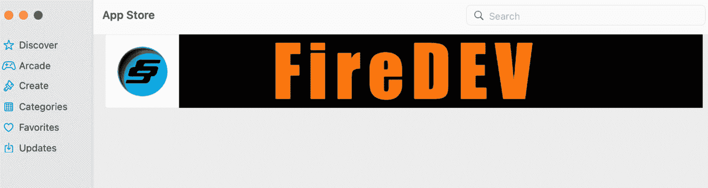

图 7.11 – 横幅定位在顶部

突出横幅已完成，可以将其转换为轮播图。接下来，应用组将被编码以展示应用图标列表。

# 编写应用组代码

我们现在将实现显示应用组的代码。这些将包含代表应用图标的图像和一个代表应用名称的标签。你可以自由地向每个组添加更多组件，并按你的喜好排列。我已经将应用图标添加到资源中。我遵循了之前的步骤来添加图像。你可以自由地参考那些步骤：

1.  首先，在正文之前添加以下代码：

    ```swift
    private let adaptiveColumns =[    GridItem( .adaptive( minimum: 300 ) )]
    ```

这将在我们的网格中使用，并确保项目具有至少 300 像素的最小尺寸。这对于我们不想让它们变得太小以至于用户看不到它们来说非常有用。

1.  在上一节中添加的横幅代码下方添加以下代码：

    ```swift
    LazyVGrid( columns: adaptiveColumns, spacing: 20 ){    ForEach ( 0..<20 )    { index in        VStack( alignment: .leading )        {            Image( "FireDEV Logo" )            Label( "FireDEV", systemImage: "" )        }    }}
    ```

在我们运行应用程序之前，让我们分解代码。

+   我们使用`adaptiveColumns`创建一个`LazyVGrid`，并将`spacing`设置为`20`。你可以根据需要更改列大小的间距。

+   接下来，我们使用一个运行 20 次的`ForEach`循环。你可以随意用上一个项目中使用的方法，将代码替换为一个项目数组。

+   然后，我们在图像下方创建了一个`Label`组件。该标签将用作应用程序的名称。

+   最后，我们创建了一个`Image`组件和一个`Label`组件，并省略了`systemImage`参数，因为我们不需要它。然而，你必须放些东西，因此使用了空引号。

运行应用程序将产生以下结果：

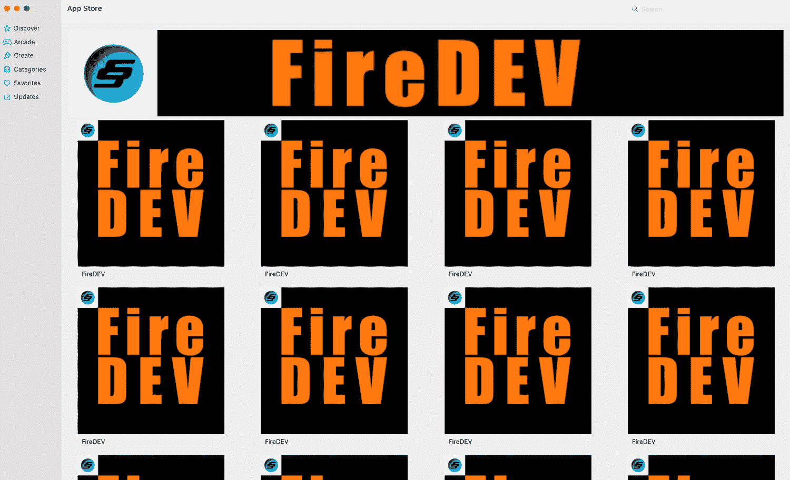

图 7.12 – 应用程序组

1.  我们几乎完成了这个应用程序。应用程序的名称有点小。让我们把它做得更大，并更新`Label`如下：

    ```swift
    Label( "FireDEV", systemImage: "" )    .font( .system( size: 36 ) )
    ```

最后，运行这将产生以下图示：

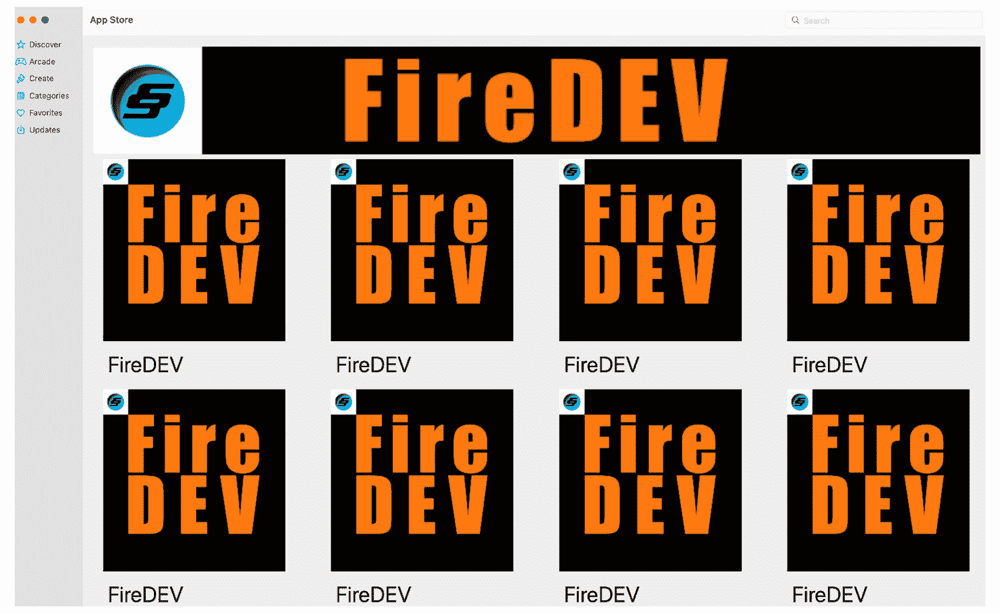

图 7.13 – 标签字体大小增加

作为回顾，以下是`MainView`的完整代码：

```swift
////  ContentView.swift
//  App Store
//
//  Created by Frahaan on 21/02/2023.
//
import SwiftUI
struct MainView: View
{
    @State private var searchText = ""
    private let adaptiveColumns =
    [
        GridItem( .adaptive( minimum: 300 ) )
    ]
    var body: some View
    {
        NavigationView
        {
            List
            {
                Label( "Discover", systemImage: "star" )
                .onTapGesture
                {
                    print( "Discover" )
                }
                Label( "Arcade", systemImage: "gamecontroller" )
                Label( "Create", systemImage: "paintbrush" )
                Label( "Categories", systemImage: "square.grid.3x3.square" )
                Label( "Favorites", systemImage: "heart" )
                Label( "Updates", systemImage: "square.and.arrow.down" )
            }.searchable( text: $searchText )
                .onSubmit( of: .search )
                {
                    print( searchText )
                }
            ScrollView
            {
                Color.clear
                Image( "FireDEV Banner" )
                    .resizable( )
                    .padding( .horizontal )
                    .scaledToFit( )
                LazyVGrid( columns: adaptiveColumns, spacing: 20 )
                {
                    ForEach ( 0..<20 )
                    { index in
                        VStack( alignment: .leading )
                        {
                            Image( "FireDEV Logo" )
                            Label( "FireDEV", systemImage: "" )
                                .font( .system( size: 36 ) )
                        }
                    }
                }
            }
        }
    }
}
struct MainView_Previews: PreviewProvider
{
    static var previews: some View
    {
        MainView( )
    }
}
```

代码也包含在本书的 GitHub 仓库中。

在本节中，我们实现了 App Store 应用程序的主体，从而完成了我们的第三个项目。主要有两个部分 – 首先，我们实现了一个高亮横幅，可以在整个视图中多次使用来展示不同的应用程序。然后，我们实现了一个应用程序组的网格。尽管应用程序信息是硬编码的，但它可以被抽象成一个数组，可以存储每个应用程序的更多信息。在下一节中，我们将总结本章内容。

# 额外任务

现在应用程序已经完成，以下是一些额外的任务列表，供你完成以增强你的应用程序：

+   一个应用程序页面，用户点击应用程序图标时将导航到该页面

+   多个高亮横幅

+   将横幅更新为轮播图

+   侧边栏中该部分的多个页面

+   从数组或外部源（如数据库）中提取数据用于应用程序元数据

在下一节中，我们将总结本章所涵盖的内容，但首先，我们将回顾代码以帮助完成本项目的额外任务。

## 搜索功能

要向应用程序添加搜索功能，你可以使用 SwiftUI 提供的`.searchable`修饰符。以下是添加了搜索功能的修改后的代码：

```swift
////  ContentView.swift
//  App Store
//
//  Created by Frahaan on 21/02/2023.
//
import SwiftUI
struct MainView: View {
    @State private var searchText = ""
    private let adaptiveColumns = [
        GridItem(.adaptive(minimum: 300))
    ]
    var body: some View {
        NavigationView {
            List {
                Label("Discover", systemImage: "star")
                    .onTapGesture {
                        print("Discover")
                    }
                Label("Arcade", systemImage: "gamecontroller")
                Label("Create", systemImage: "paintbrush")
                Label("Categories", systemImage: "square.grid.3x3.square")
                Label("Favorites", systemImage: "heart")
                Label("Updates", systemImage: "square.and.arrow.down")
            }
            .searchable(text: $searchText) // Add searchable modifier
            .onSubmit(of: .search) {
                print(searchText)
            }
            ScrollView {
                Color.clear
                Image("FireDEV Banner")
                    .resizable()
                    .padding(.horizontal)
                    .scaledToFit()
                LazyVGrid(columns: adaptiveColumns, spacing: 20) {
                    ForEach(0..<20) { index in
                        VStack(alignment: .leading) {
                            Image("FireDEV Logo")
                            Label("FireDEV", systemImage: "")
                                .font(.system(size: 36))
                        }
                    }
                }
            }
        }
    }
}
struct MainView_Previews: PreviewProvider {
    static var previews: some View {
        MainView()
    }
}
```

在这个修改后的代码中，我在`List`视图中添加了`.searchable(text: $searchText)`修饰符，这启用了搜索功能。`searchText`变量用作搜索文本输入的绑定。

我还向`List`视图添加了`.onSubmit(of: .search)`修改器来处理搜索提交。在这个示例中，它将搜索文本打印到控制台，但你可以根据需求自定义操作。

通过这些修改，用户将能够输入搜索查询并根据输入的文本过滤列表中的项目。

## 应用页面

当用户点击应用时，为了提供一个包含更多信息的高级页面，你可以创建一个新的视图来显示所选应用的详细信息。以下是一个如何修改代码以实现此功能的示例：

```swift
import SwiftUIstruct AppDetailsView: View {
    let appName: String
    var body: some View {
        VStack {
            Text(appName)
                .font(.largeTitle)
                .padding()
            // Add more detailed information about the app here
            Spacer()
        }
        .navigationBarTitle(appName)
    }
}
struct MainView: View {
    @State private var searchText = ""
    @State private var selectedApp: String? = nil
    private let adaptiveColumns = [
        GridItem(.adaptive(minimum: 300))
    ]
    var body: some View {
        NavigationView {
            List {
                Label("Discover", systemImage: "star")
                    .onTapGesture {
                        print("Discover")
                    }
                Label("Arcade", systemImage: "gamecontroller")
                    .onTapGesture {
                        selectedApp = "Arcade"
                    }
                Label("Create", systemImage: "paintbrush")
                    .onTapGesture {
                        selectedApp = "Create"
                    }
                Label("Categories", systemImage: "square.grid.3x3.square")
                    .onTapGesture {
                        selectedApp = "Categories"
                    }
                Label("Favorites", systemImage: "heart")
                    .onTapGesture {
                        selectedApp = "Favorites"
                    }
                Label("Updates", systemImage: "square.and.arrow.down")
                    .onTapGesture {
                        selectedApp = "Updates"
                    }
            }
            .searchable(text: $searchText)
            .onSubmit(of: .search) {
                print(searchText)
            }
            ScrollView {
                Color.clear
                Image("FireDEV Banner")
                    .resizable()
                    .padding(.horizontal)
                    .scaledToFit()
                LazyVGrid(columns: adaptiveColumns, spacing: 20) {
                    ForEach(0..<20) { index in
                        VStack(alignment: .leading) {
                            Image("FireDEV Logo")
                            Label("FireDEV", systemImage: "")
                                .font(.system(size: 36))
                                .onTapGesture {
                                    selectedApp = "FireDEV"
                                }
                        }
                    }
                }
            }
        }
        .sheet(item: $selectedApp) { app in
            AppDetailsView(appName: app)
        }
    }
}
struct MainView_Previews: PreviewProvider {
    static var previews: some View {
        MainView()
    }
}
```

在这个修改后的代码中，我添加了一个新的`AppDetailsView`，它接受所选应用名称作为参数，并显示关于应用的更多详细信息。你可以根据需求自定义此视图的内容。

我还添加了一个新的`@State`变量`selectedApp`来跟踪所选应用名称。当用户在列表或标签中点击应用时，相应的应用名称被分配给`selectedApp`，并且使用`.sheet(item: $selectedApp)`以表单的形式展示`AppDetailsView`。当用户关闭表单时，`selectedApp`被设置回`nil`。

在`AppDetailsView`中，我仅为了演示目的显示了应用名称。你可以添加更多信息并根据你应用的需求自定义布局。

通过这些修改，当用户点击应用时，将出现一个新的表单，显示有关所选应用的增强页面。

# 摘要

在本章中，我们成功实现了应用商店应用的主体。我们首先分析了线框图，并将每个元素分解成 SwiftUI 组件。然后，我们仔细实现了 SwiftUI 组件，以匹配线框图中的设计。我们实现了一个可滚动的堆叠，带有高亮横幅和应用图标。我们还在本章的末尾查看了一些额外的任务实现。

在下一章中，我们将开始着手我们的第四个也是最后一个应用，这是一个适用于 Apple Watch 的健身伴侣应用。我们的重点将放在分析其设计和将其分解，以便更好地理解我们如何在下一个平台上实现这个应用。
