# 9

# 智能手表项目 – 健身伴侣 UI

在本章中，我们将为健身伴侣项目实现活动按钮屏幕。在前一章中，我们研究了健身伴侣的设计，特别是 **当前活动** 屏幕设计。然后我们将屏幕分解为所有必需的组件。然后我们使用 SwiftUI 实现了所有组件。在前一章的结尾，我们只有一个无法滑动的单屏。主要部分将是可滑动的，向用户提供控制当前活动的按钮列表。然后，我们将分析活动按钮屏幕，将其分解为其组成的所有组件，并实现所有组件以提供类似健身应用程序的感觉。

本章将分为以下部分：

+   活动按钮屏幕概述

+   实现活动按钮屏幕

+   额外任务

到本章结束时，你将创建一个适用于 WatchOS 的健身伴侣应用程序。这将作为一个模板，带有可滑动的屏幕，向用户展示活动信息。它将作为进一步扩展健身应用程序或使用我们已实现的内核结构将项目转向不同方向的一个坚实基础。随着我们接近本章的结尾，我将提供练习，以在健身伴侣应用程序中实现更多高级功能。这将本书的第四个也是最后一个项目，为你提供一个使用 Swift 进行 iOS UI 开发的 360 度视角。

# 技术要求

本章要求你从 Apple 的 App Store 下载 Xcode 14 或更高版本。

要安装 Xcode，只需在 App Store 中搜索 Xcode，选择并下载最新版本。打开 Xcode 并遵循任何额外的安装说明。一旦 Xcode 打开并启动，你就可以开始了。

Xcode 14 版本具有以下功能/要求：

+   它包括 iOS 16、iPadOS 16、macOS 12.3、tvOS 16 和 watchOS 9 的 SDK

+   它支持在 iOS 11 或更高版本、tvOS 11 或更高版本和 watchOS 4 或更高版本上的设备调试

+   你需要一个运行 macOS Monterey 12.5 或更高版本的 Mac

从以下 GitHub 链接下载示例代码：

[`github.com/PacktPublishing/Elevate-SwiftUI-Skills-by-Building-Projects`](https://github.com/PacktPublishing/Elevate-SwiftUI-Skills-by-Building-Projects)

# 活动按钮屏幕概述

在本节中，我们将再次查看第 *8 章* 中的线框，并将其分解为其组成部分。以下图展示了活动按钮屏幕：

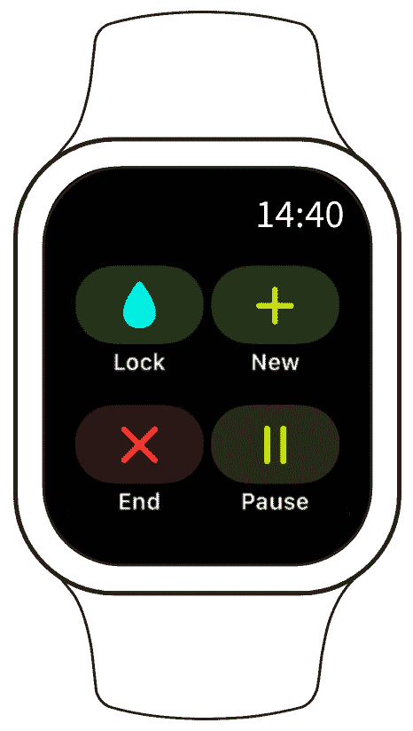

图 9.1 – 活动按钮屏幕

在我们编写应用程序代码之前，我们将把活动按钮屏幕分解成构成它的元素。作为一个小任务，看看你是否能弄清楚这些是什么。如果你不知道确切的 UI 组件名称，不要担心；我们将在下一节中查看组件。

## 图像组件

图像组件是 SwiftUI 提供的核心组件之一。它允许你显示图像，可以用来提供视觉表示或辅助文本内容。我们将使用它来显示控制当前活动的按钮图标。以下图示显示了应用程序中的图标：

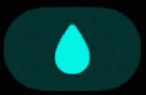

图 9.2 – 锁定图像

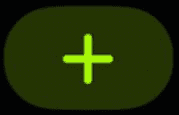

图 9.3 – 新图像

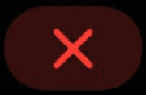

图 9.4 – 结束图像

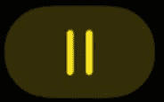

图 9.5 – 暂停图像

这些图像不仅包含图标，还包含背景。这是在本章后面将进一步探讨的内容。

## 文本组件

我们将使用文本组件来显示按钮标题。有关更多信息，请参阅*第二章*。

在下一节中，我们将使用前几节中讨论的组件来实现活动按钮屏幕的代码。

# 实现活动按钮屏幕

在本节中，我们将实现我们的应用程序的活动按钮屏幕，从而完成本书的第四个也是最后一个项目。在我们这样做之前，我们必须实现一个可滑动页面系统。第一页将包含上一章的实现，第二页将是活动按钮。当然，你可以使用它扩展到所需的任何页面数。

## 可滑动页面

在本节中，我们将实现我们的可滑动页面。幸运的是，在 SwiftUI 中实现尽可能多的功能非常简单。只需将我们的当前`VStack`包裹在`MainView`内部的`TabView`中，如下所示：

```swift
TabView{
    VStack( alignment: .leading )
    {
        Text( timerString )
            .font( .title2 )
            .foregroundColor( Color.yellow )
            .padding( .bottom )
            .onReceive( timer )
        { time in
            counter += 1
            let hours = counter / 3600
            let minutes = ( counter % 3600 ) / 60
            let seconds = counter % 3600 % 60
            timerString = String( format: "%02d", hours ) + ":"
+ String( format: "%02d", minutes ) + ":" +
String( format: "%02d", seconds )
        }
        Text( String( bpm ) + " BPM" )
        Text( String( calories ) + " Calories" )
        Text( activity )
    }
    .padding( )
}
```

在前面的代码中，我们实现了一个`TabView`，用于在我们的健身伴侣应用程序中创建多个页面。

现在，如果你运行它，看起来会一样。然而，如果你尝试滑动屏幕，你会注意到一点反弹。这是因为只有一个页面。现在，让我们添加一个虚拟的第二页来帮助我们测试我们新的`TabView`。在`VStack`之后，添加一个`Text`组件，如下所示：

```swift
TabView{
    VStack( alignment: .leading )
    {
        …
    }
    .padding( )
    Text( "Second Page" )
}
```

现在我们已经在我们的`TabView`中实现了第二页。如果你尝试在页面上滑动，它会跳转到下一页。

`TabView`内的每个视图都被视为一个单独的页面。老实说，就这么简单。运行我们的应用程序将产生以下结果，显示底部有两个点，表示有两个页面：

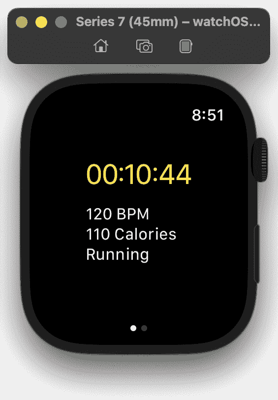

图 9.6 – 第一页

从右向左滑动将显示第二页，如下所示：

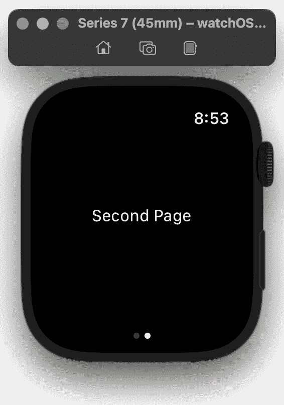

图 9.7 – 第二页

在本节中，我们使用 `TabView` 组件添加了一个额外的页面。这使得我们能够添加另一个用户可以通过滑动手势导航的页面。在下一节中，我们将添加活动按钮。

## 活动按钮

在本节中，我们将实现 `TabView` 的第二页上的活动按钮。我们将为每个按钮的背景和图标本身使用自定义颜色。

让我们继续创建这些自定义颜色：

1.  导航到**项目导航器**中的**资产**部分：

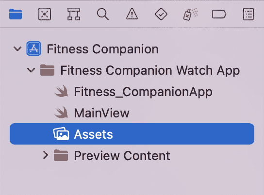

图 9.8 – 资产文件夹

1.  在**资产**部分，右键单击空白区域并选择**新建** **颜色集**：

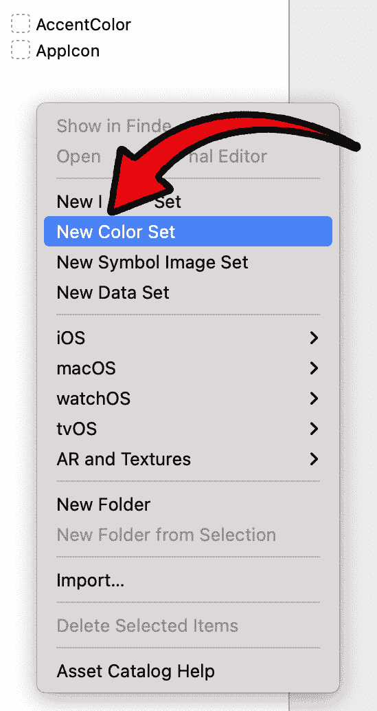

图 9.9 – 新建颜色集按钮

1.  在**属性检查器**中设置颜色的名称：

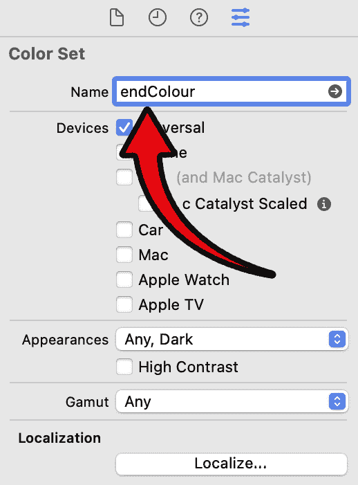

图 9.10 – 新建颜色集按钮

1.  选择**任何外观**或**深色**来设置颜色。这确保了在所有颜色模式下，将使用所需的颜色：

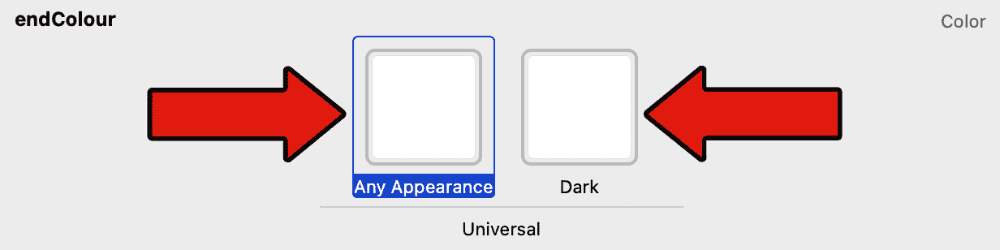

图 9.11 – 任何外观

1.  现在确保**内容**设置为**sRGB**，**输入方法**设置为**8 位十六进制**。然后设置**十六进制**值：

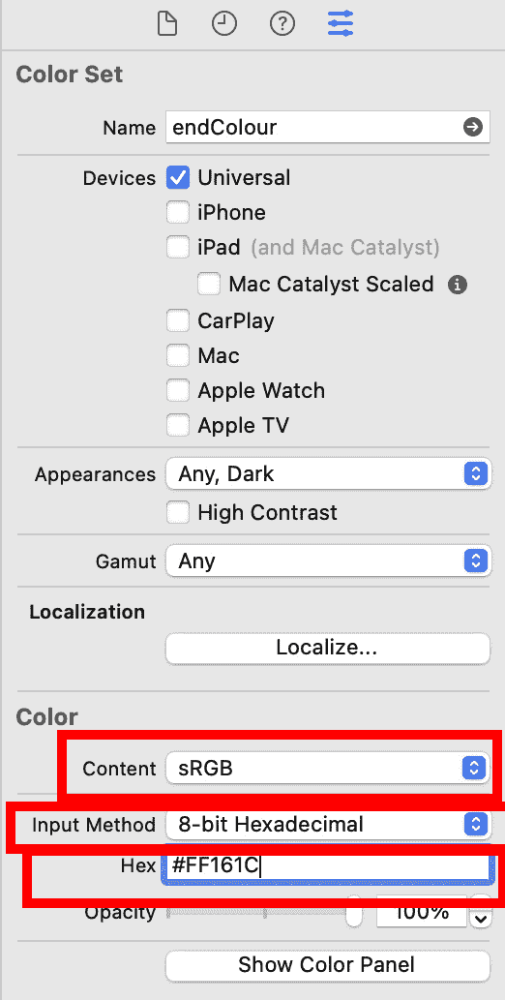

图 9.12 – 设置颜色

1.  重复以上步骤为所有列出的颜色：

    +   `endColour`

    +   十六进制颜色值：`#FF161C`

1.  `endColourBackground`

1.  十六进制颜色值：`#390B0C`

1.  `lockColour`

1.  十六进制颜色值：`#06F5E7`

1.  `lockColourBackground`

1.  十六进制颜色值：`#113330`

1.  `newColour`

1.  十六进制颜色值：`#86FE01`

1.  `newColourBackground`

1.  十六进制颜色值：`#1E3400`

1.  `pauseColour`

1.  十六进制颜色值：`#BBA700`

1.  `pauseColourBackground`

1.  十六进制颜色值：`#342F00`

1.  完成后，**资产**屏幕应如下所示：

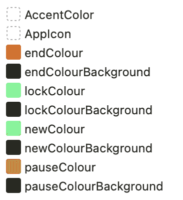

图 9.13 – 添加的颜色

尽管颜色已经创建，但我们不能直接在我们的代码中使用它们。让我们解决这个问题。这样做相当简单。在 `MainView` 中，我们将扩展 `Color` 功能以支持我们的颜色。在这样做之前，我认为提到为什么我在提到功能时将颜色拼写成这样是谨慎的。这是美式拼写，并且在 Swift 中使用。为了扩展功能，我们必须这样拼写，但因为我来自英国，我个人使用的拼写是 *Colour*。现在澄清了这一点。让我们扩展 Swift 颜色。在 `MainView` 结构之上添加以下代码：

```swift
extension Color{
    static let lockColour = Color( "lockColour" )
    static let lockColourBackground = Color( "lockColourBackground" )
    static let newColour = Color( "newColour" )
    static let newColourBackground = Color( "newColourBackground" )
    static let endColour = Color( "endColour" )
    static let endColourBackground = Color( "endColourBackground" )
    static let pauseColour = Color( "pauseColour" )
    static let pauseColourBackground = Color( "pauseColourBackground" )
}
```

尽管我们已经将其添加到`MainView`中，但扩展 Swift 颜色允许我们在项目的任何地方使用它。这也值得提一下，这意味着仅限于我们的项目，并且不会超出我们项目的范围扩展到其他项目。我们的项目很小，所以将其放在`MainView`内部是完全可以接受的。然而，将此类扩展放在特定文件中是常见的做法。如果有许多颜色扩展，它们可以有自己的颜色文件。这超出了本项目范围。

下面是对前面代码的简要概述：我们通过使用之前在资产中设置的名称的静态变量扩展了颜色。

重要提示

变量名称不需要与颜色名称相同。但保持它们相同是良好的实践。这使得它们更容易维护。

每个按钮由三个组件组成：

+   背景

+   图标

+   文本

对于背景，我们将使用一个`矩形`组件。更具体地说，我们将使用`圆角矩形`组件，因为它允许我们设置圆角半径。请随意更改设计并使用`矩形`或任何其他形状。对于图标，我们将使用`图像`组件并使用内置图标。请随意使用您自己的图像或查看之前讨论的 SF Symbols，在*第六章*，*实现侧边栏*，查看所有内置图标。文本是所有组件中最简单的，将使用基本的`文本`组件。

按钮最难的部分是背景和图标。这是因为它们是重叠的。文本放置在图像下方，这使得添加变得容易。我们最初将专注于获取背景和图标的代码。我们将使用`ZStack`将图标放置在背景上方。用以下代码替换第二页的占位符`文本`组件：

```swift
ZStack{
    RoundedRectangle( cornerRadius: 18, style:
.continuous )
}
```

我们创建了一个圆角半径为 18 的`圆角矩形`。请随意增加数字以获得更圆滑的圆角，或降低它。将样式设置为`.continuous`会使圆角看起来更平滑，这始终是好事。让我们看看这会产生什么：

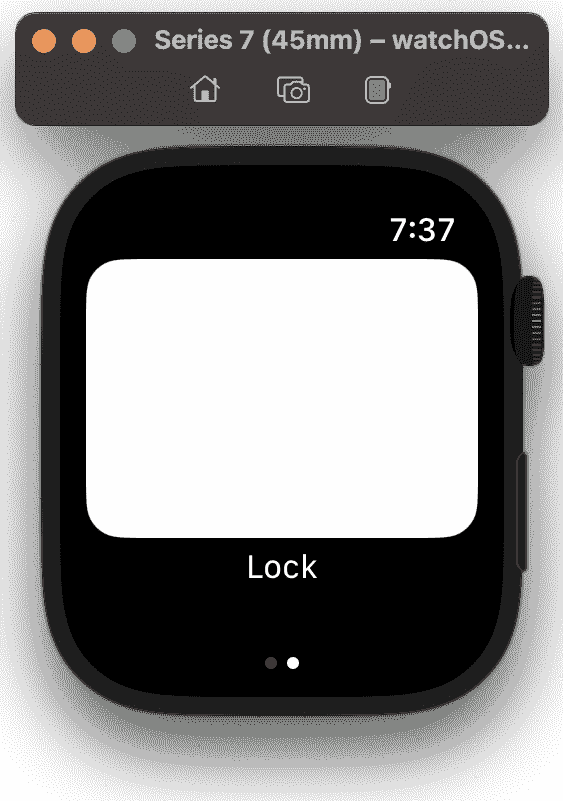

图 9.14 – 简单圆角矩形

目前，它看起来与本章开头所示图中的按钮没有任何相似之处。只是缺少两件事——背景颜色和使尺寸更小。我们将使用之前创建的`lockColourBackground`颜色，并将尺寸设置为宽度`70`和高度`64`：

```swift
ZStack{
    RoundedRectangle( cornerRadius: 18, style:
.continuous )
        .foregroundColor( .lockColourBackground )
        .frame( width: 70, height: 64 )
}
```

下面的图显示了图像背景：

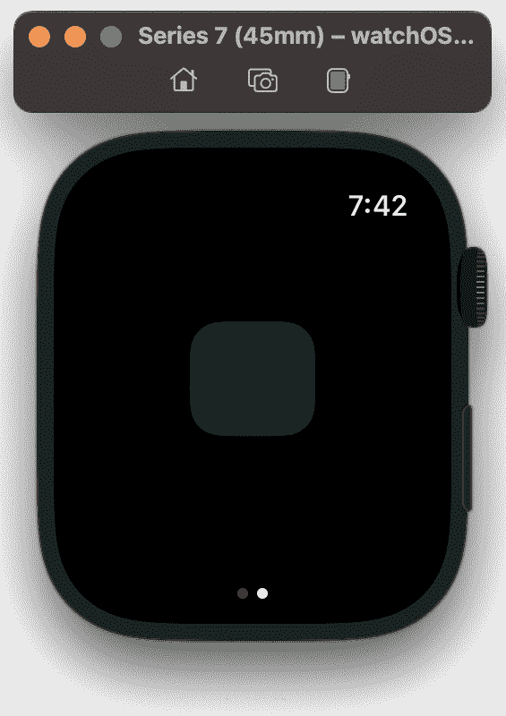

图 9.15 – 圆角颜色样式

背景现在看起来更像我们的设计。下一步是向矩形内添加图标。这样做很简单。在`圆角矩形`组件之后添加带有图标的图像：

```swift
ZStack{
    RoundedRectangle( cornerRadius: 18, style:
.continuous )
        .foregroundColor( .lockColourBackground )
        .frame( width: 70, height: 64 )
    Image( systemName: "drop.fill" )
}
```

运行应用程序现在将产生以下结果：

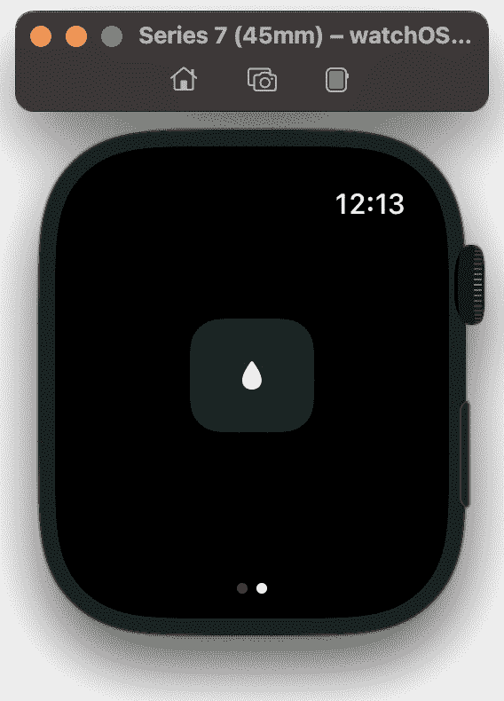

图 9.16 – 背景中的泪滴图标

我们使用**SF Symbols**获取泪滴图标。请随意使用您认为合适的任何图标，甚至您自己的图像。我们需要更改图标样式。有两个主要方面需要更新，即颜色和大小。按照以下方式更新图像：

```swift
Image( systemName: "drop.fill" )    .resizable( )
    .foregroundColor( .lockColour )
    .aspectRatio( contentMode: .fit )
    .frame( width: 16 )
```

我们首先将其设置为`resizable`，这允许我们更改大小。接下来，我们使用之前创建的一种颜色设置颜色。然后，我们确保宽高比设置为适合，这样我们就可以在不扭曲图像的情况下调整大小。最后，我们设置大小，因为我们有一个固定的宽高比。设置宽度会自动设置相应的高度。运行应用程序会产生以下结果：

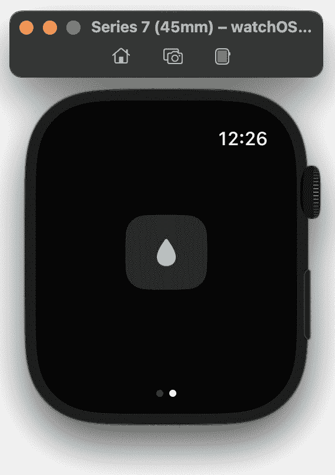

图 9.17 – 锁定按钮

接下来，我们将为我们的按钮添加文本。文本不在图标或矩形内部，而是位于其下方。但我们仍然希望它可点击，因此我们将所有按钮内容包裹在一个`VStack`中，并添加`Text`组件，如下所示：

```swift
VStack{
    ZStack
    {
        RoundedRectangle( cornerRadius: 18, style:
.continuous )
            .foregroundColor( .lockColourBackground )
            .frame( width: 70, height: 64 )
        Image( systemName: "drop.fill" )
            .resizable( )
            .foregroundColor( .lockColour )
            .aspectRatio( contentMode: .fit )
            .frame( width: 16 )
    }
    Text( "Lock" )
}
```

将按钮包裹在`VStack`中的原因有两个：

+   我们希望所有内容都可点击（将在下一部分实现）。

+   由于将有多个按钮，`VStack`在技术上是没有图标的按钮，没有矩形或文本组件。非常酷！

让我们使`VStack`可点击，然后我们将查看结果。首先，我们需要一个函数来调用它。我们可以使用内联函数，但我们将创建一个专用函数。这为我们提供了代码库中的良好抽象。在主体之前，添加以下代码：

```swift
func Lock( ){ print( "Lock button is pressed" ); }
var body: some View
{
     ...
}
```

这个函数很简单。点击时，会在终端记录一条消息。现在用`onTapGesture`函数更新`VStack`：

```swift
VStack{
    ZStack
    {
        RoundedRectangle( cornerRadius: 18, style:
.continuous )
            .foregroundColor( .lockColourBackground )
            .frame( width: 70, height: 64 )
        Image( systemName: "drop.fill" )
            .resizable( )
            .foregroundColor( .lockColour )
            .aspectRatio( contentMode: .fit )
            .frame( width: 16 )
    }
    Text( "Lock" )
}.onTapGesture { Lock( ) }
```

这已经很多了。让我们运行我们的应用程序并查看结果：

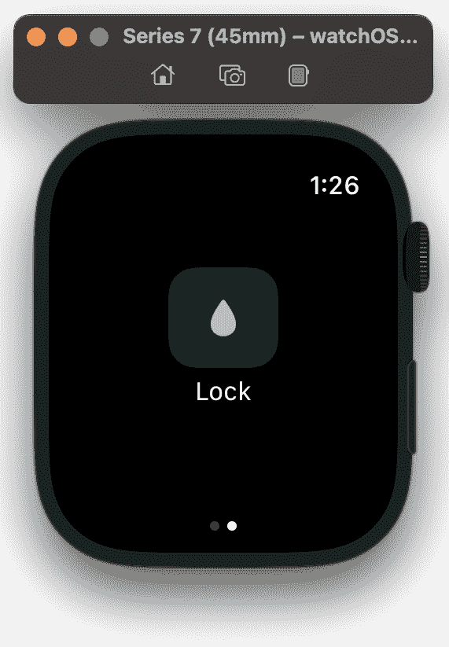

图 9.18 – 完成的锁定按钮

随意点击按钮。它将记录一条消息。在完成这个项目并实现剩余的按钮之前，以下是到目前为止的代码：

```swift
////  ContentView.swift
//  Fitness Companion Watch App
//
//  Created by Frahaan on 03/04/2023.
//
import SwiftUI
extension Color
{
    static let lockColour = Color( "lockColour" )
    static let lockColourBackground = Color( "lockColourBackground" )
    static let newColour = Color( "newColour" )
    static let newColourBackground = Color( "newColourBackground" )
    static let endColour = Color( "endColour" )
    static let endColourBackground = Color( "endColourBackground" )
    static let pauseColour = Color( "pauseColour" )
    static let pauseColourBackground = Color( "pauseColourBackground" )
}
struct MainView: View
{
    @State private var counter = 0
    @State private var timerString = "00:00:00"
    @State private var bpm = 120
    @State private var calories = 110
    @State private var activity = "Running"
    let timer = Timer.publish( every: 1, on: .main, in: .common ).autoconnect( )
    func Lock( )
    { print( "Lock button is pressed" ); }
    var body: some View
    {
        TabView
        {
            VStack( alignment: .leading )
            {
                Text( timerString )
                    .font( .title2 )
                    .foregroundColor( Color.yellow )
                    .padding( .bottom )
                    .onReceive( timer )
                { time in
                    counter += 1
                    let hours = counter / 3600
                    let minutes = ( counter % 3600 ) / 60
                    let seconds = counter % 3600 % 60
                    timerString = String( format: "%02d", hours ) + ":" + String( format: "%02d", minutes ) + ":" + String( format: "%02d", seconds )
                }
                Text( String( bpm ) + " BPM" )
                Text( String( calories ) + " Calories" )
                Text( activity )
            }
            .padding( )
            VStack
            {
                ZStack
                {
                    RoundedRectangle( cornerRadius: 18, style: .continuous )
                        .foregroundColor( .lockColourBackground )
                        .frame( width: 70, height: 64 )
                    Image( systemName: "drop.fill" )
                        .resizable( )
                        .foregroundColor( .lockColour )
                        .aspectRatio( contentMode: .fit )
                        .frame( width: 16 )
                }
                Text( "Lock" )
            }.onTapGesture { Lock( ) }
        }
    }
}
struct MainView_Previews: PreviewProvider
{
    static var previews: some View
    {
        MainView( )
    }
}
```

我们几乎完成了这一章；唯一剩下的事情是添加剩余的按钮。首先，让我们在主体上方添加剩余的功能回调，如下所示：

```swift
func Lock( ){ print( "Lock button is pressed" ); }
func New( )
{ print( "New button is pressed" ); }
func End( )
{ print( "End button is pressed" ); }
func Pause( )
{ print( "Pause button is pressed" ); }
var body: some View
{
    ...
}
```

现在我们已经实现了回调函数，我们将实现按钮。每个按钮本身实际上很简单，因为它与锁定按钮相同，但有一些以下更改：

+   `RoundedRectangle`的`foregroundColor`

+   图像的图标

+   图像的`foregroundColor`

+   文本

+   `onTapGesture`回调

仅复制`VStack`代码实际上就是复制按钮。我们会得到以下结果：

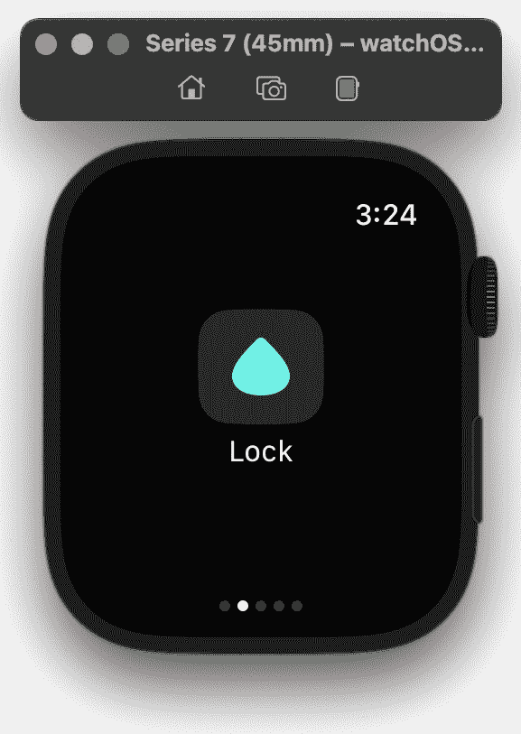

图 9.19 – 添加的额外按钮

如果你没有看到差异，我不怪你。很难看到实际上发生了什么，但如果你看屏幕底部，有五个点，表示现在有五个页面。记住，在实现第二个页面时，我们声明根中的每个组件都将是一个页面。因此，我们想要通过将它们放入一个 2x2 网格中来将这些按钮组合在一起。为了在同一行上组织组件，我们可以使用`HStack`。我们只需要一行上的两个，所以首先，我们将前两个按钮，即`VStacks`放入一个`HStack`中。这将导致三个页面，第一个是上一章中实现的页面，以及每个`HStack`的两个页面，这不是我们想要的。一个小改动就可以修复。你能猜到是什么吗？只需将两个`HStacks`放入一个单独的`VStack`中。这将使它们堆叠在一起，从而形成一个网格。这个代码如下：

```swift
VStack{
    HStack
    {
        VStack
        {
            ZStack
            {
                RoundedRectangle( cornerRadius: 18, style: .continuous )
                    .foregroundColor( .lockColourBackground )
                    .frame( width: 70, height: 64 )
                Image( systemName: "drop.fill" )
                    .resizable( )
                    .foregroundColor( .lockColour )
                    .aspectRatio( 1.0, contentMode: .fit )
                    .frame( width: 32 )
            }
            Text( "Lock" )
        }.onTapGesture { Lock( ) }
        VStack
        {
            ZStack
            {
                RoundedRectangle( cornerRadius: 18, style: .continuous )
                    .foregroundColor( .newColourBackground )
                    .frame( width: 70, height: 64 )
                Image( systemName: "plus" )
                    .resizable( )
                    .foregroundColor( .newColour )
                    .aspectRatio( 1.0, contentMode: .fit )
                    .frame( width: 32 )
            }
            Text( "New" )
        }.onTapGesture { New( ) }
    }
    HStack
    {
        VStack
        {
            ZStack
            {
                RoundedRectangle( cornerRadius: 18, style: .continuous )
                    .foregroundColor( .endColourBackground )
                    .frame( width: 70, height: 64 )
                Image( systemName: "xmark" )
                    .resizable( )
                    .foregroundColor( .endColour )
                    .aspectRatio( 1.0, contentMode: .fit )
                    .frame( width: 32 )
            }
            Text( "End" )
        }.onTapGesture { End( ) }
        VStack
        {
            ZStack
            {
                RoundedRectangle( cornerRadius: 18, style: .continuous )
                    .foregroundColor( .pauseColourBackground )
                    .frame( width: 70, height: 64 )
                Image( systemName: "pause" )
                    .resizable( )
                    .foregroundColor( .pauseColour )
                    .aspectRatio( 1.0, contentMode: .fit )
                    .frame( width: 32 )
            }
            Text( "Pause" )
        }.onTapGesture { Pause( ) }
    }
}
```

是时候运行我们的应用程序了：

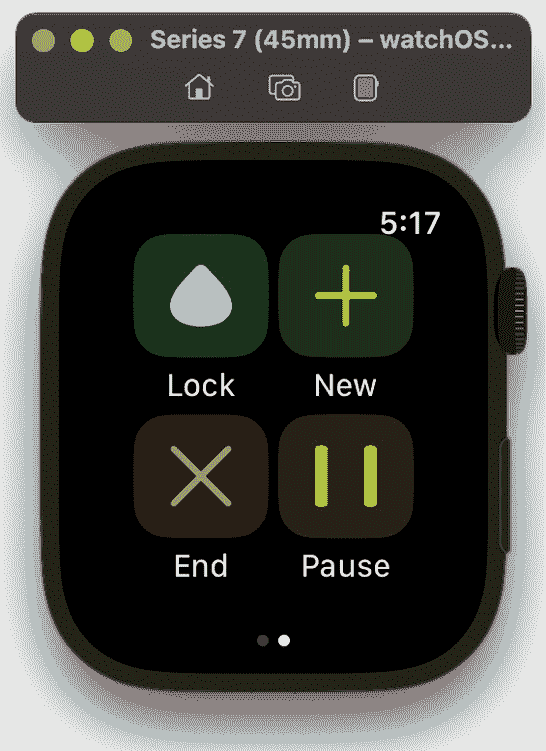

图 9.20 – 按钮网格系统

你可能已经准备好完成这一章，然后结束这一天。请耐心等待——网格的顶部对我来说太靠近时间了。让我们添加我们刚刚实现的顶部`VStack`：

```swift
.padding( .top, 20.0 )
```

这就是它，我们应用程序的最终构建和运行——鼓掌，请！

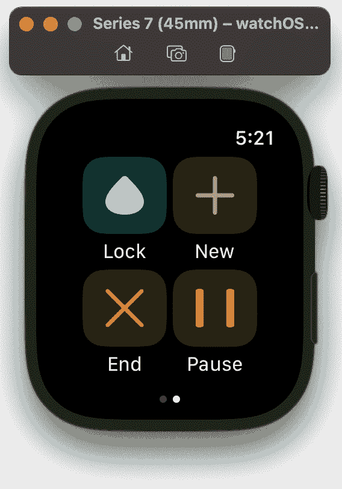

图 9.21 – 按钮网格系统

我们现在到了项目的结尾，我们的应用程序看起来很棒。在我们总结之前，请随意访问 GitHub 仓库以双重检查你的代码库：[`github.com/PacktPublishing/Elevate-SwiftUI-Skills-by-Building-Projects`](https://github.com/PacktPublishing/Elevate-SwiftUI-Skills-by-Building-Projects)。

在本节中，我们添加了活动按钮。我们通过在我们的健身应用程序中实现另一个页面来做到这一点。我们利用基于网格的系统来布局我们的按钮。我们使用了各种核心组件与堆叠相结合来组织它们。在下一节中，我们将总结本章，最终总结这本书。但首先，我们将查看一些代码来帮助你完成额外任务。

## 不同的练习

要将不同的练习添加到健身伴侣应用程序中，你可以通过引入一个新的数据结构来存储练习信息并相应地更新 UI 来修改`MainView`。以下是如何进行这些更改的示例：

```swift
import SwiftUIextension Color {
    static let lockColour = Color("lockColour")
    static let lockColourBackground = Color("lockColourBackground")
    static let newColour = Color("newColour")
    static let newColourBackground = Color("newColourBackground")
    static let endColour = Color("endColour")
    static let endColourBackground = Color("endColourBackground")
    static let pauseColour = Color("pauseColour")
    static let pauseColourBackground = Color("pauseColourBackground")
}
struct Exercise {
    let name: String
    let image: String
}
struct MainView: View {
    @State private var counter = 0
    @State private var timerString = "00:00:00"
    @State private var bpm = 120
    @State private var calories = 110
    @State private var activity = "Running"
    let timer = Timer.publish(every: 1, on: .main, in: .common).autoconnect()
    let exercises = [
        Exercise(name: "Running", image: "person.running"),
        Exercise(name: "Cycling", image: "bicycle"),
        Exercise(name: "Swimming", image: "figure.walk"),
        // Add more exercises here
    ]
    func Lock() {
        print("Lock button is pressed")
    }
    func New() {
        print("New button is pressed")
    }
    func End() {
        print("End button is pressed")
    }
    func Pause() {
        print("Pause button is pressed")
    }
    var body: some View {
        TabView {
            VStack(alignment: .leading) {
                Text(timerString)
                    .font(.title2)
                    .foregroundColor(Color.yellow)
                    .padding(.bottom)
                    .onReceive(timer) { time in
                        counter += 1
                        let hours = counter / 3600
                        let minutes = (counter % 3600) / 60
                        let seconds = counter % 3600 % 60
                        timerString = String(format: "%02d", hours) + ":" + String(format: "%02d", minutes) + ":" + String(format: "%02d", seconds)
                    }
                Text(String(bpm) + " BPM")
                Text(String(calories) + " Calories")
                Text(activity)
            }
            .padding()
            VStack {
                HStack {
                    ForEach(exercises, id: \.name) { exercise in
                        VStack {
                            ZStack {
                                RoundedRectangle(cornerRadius: 18, style: .continuous)
                                    .foregroundColor(.newColourBackground)
                                    .frame(width: 70, height: 64)
                                Image(systemName: exercise.image)
                                    .resizable()
                                    .foregroundColor(.newColour)
                                    .aspectRatio(contentMode: .fit)
                                    .frame(width: 32)
                            }
                            Text(exercise.name)
                        }
                        .onTapGesture {
                            activity = exercise.name
                        }
                    }
                }
                HStack {
                    VStack {
                        ZStack {
                            RoundedRectangle(cornerRadius: 18, style: .continuous)
                                .foregroundColor(.lockColourBackground)
                                .frame(width: 70, height: 64)
                            Image(systemName: "lock.fill")
                                .resizable()
                                .foregroundColor(.lockColour)
                                .aspectRatio(contentMode: .fit)
                                .frame(width: 32
)
                        }
                        Text("Lock")
                    }.onTapGesture { Lock() }
                    VStack {
                        ZStack {
                            RoundedRectangle(cornerRadius: 18, style: .continuous)
                                .foregroundColor(.endColourBackground)
                                .frame(width: 70, height: 64)
                            Image(systemName: "xmark")
                                .resizable()
                                .foregroundColor(.endColour)
                                .aspectRatio(contentMode: .fit)
                                .frame(width: 32)
                        }
                        Text("End")
                    }.onTapGesture { End() }
                    VStack {
                        ZStack {
                            RoundedRectangle(cornerRadius: 18, style: .continuous)
                                .foregroundColor(.pauseColourBackground)
                                .frame(width: 70, height: 64)
                            Image(systemName: "pause")
                                .resizable()
                                .foregroundColor(.pauseColour)
                                .aspectRatio(contentMode: .fit)
                                .frame(width: 32)
                        }
                        Text("Pause")
                    }.onTapGesture { Pause() }
                }
            }
            .padding(.top, 20.0)
        }
    }
}
struct MainView_Previews: PreviewProvider {
    static var previews: some View {
        MainView()
    }
}
```

在这个修改后的代码中，我们引入了一个新的`Exercise`结构体，用于存储每个练习的名称和图片名称。你可以通过创建新的`Exercise`实例来向`exercises`数组添加更多练习。

在视图中，我们使用了`ForEach`循环来遍历练习并动态显示它们。每个练习由一个包含图片和文本标签的`VStack`表示。当点击一个练习时，活动状态会更新为所选练习的名称。

你可以根据具体需求自定义练习图片，并向`Exercise`结构体添加更多属性。

## 活动计时器

要添加一个可以启动、停止和暂停的活动计时器的功能，您可以通过引入额外的状态变量和操作来修改`MainView`。以下是如何进行这些更改的示例：

```swift
import SwiftUIstruct Exercise {
    let name: String
    let image: String
}
struct MainView: View {
    @State private var counter = 0
    @State private var isTimerRunning = false
    @State private var isTimerPaused = false
    @State private var timerString = "00:00:00"
    @State private var bpm = 120
    @State private var calories = 110
    @State private var activity = "Running"
    let timer = Timer.publish(every: 1, on: .main, in: .common).autoconnect()
    let exercises = [
        Exercise(name: "Running", image: "person.running"),
        Exercise(name: "Cycling", image: "bicycle"),
        Exercise(name: "Swimming", image: "figure.walk"),
        // Add more exercises here
    ]
    func lock() {
        print("Lock button is pressed")
    }
    func startTimer() {
        isTimerRunning = true
        isTimerPaused = false
    }
    func pauseTimer() {
        isTimerRunning = false
        isTimerPaused = true
    }
    func stopTimer() {
        isTimerRunning = false
        isTimerPaused = false
        counter = 0
        timerString = "00:00:00"
    }
    var body: some View {
        TabView {
            VStack(alignment: .leading) {
                Text(timerString)
                    .font(.title2)
                    .foregroundColor(Color.yellow)
                    .padding(.bottom)
                    .onReceive(timer) { time in
                        if isTimerRunning && !isTimerPaused {
                            counter += 1
                            let hours = counter / 3600
                            let minutes = (counter % 3600) / 60
                            let seconds = counter % 3600 % 60
                            timerString = String(format: "%02d", hours) + ":" + String(format: "%02d", minutes) + ":" + String(format: "%02d", seconds)
                        }
                    }
                Text(String(bpm) + " BPM")
                Text(String(calories) + " Calories")
                Text(activity)
            }
            .padding()
            VStack {
                HStack {
                    ForEach(exercises, id: \.name) { exercise in
                        VStack {
                            ZStack {
                                RoundedRectangle(cornerRadius: 18, style: .continuous)
                                    .foregroundColor(.newColourBackground)
                                    .frame(width: 70, height: 64)
                                Image(systemName: exercise.image)
                                    .resizable()
                                    .foregroundColor(.newColour)
                                    .aspectRatio(contentMode: .fit)
                                    .frame(width: 32)
                            }
                            Text(exercise.name)
                        }
                        .onTapGesture {
                            activity = exercise.name
                        }
                    }
                }
                HStack {
                    VStack {
                        ZStack {
                            RoundedRectangle(cornerRadius: 18, style: .continuous)
                                .foregroundColor(.lockColourBackground)
                                .frame(width: 70, height: 64)
                            Image(systemName: "lock.fill")
                                .resizable()
                                .foregroundColor(.lockColour)
                                .aspectRatio(contentMode: .fit)
                                .frame(width: 32)
                        }
                        Text("Lock")
                    }
                    .onTapGesture { lock() }
                    VStack {
                        if isTimerRunning
 {
                            Button(action: pauseTimer) {
                                ZStack {
                                    RoundedRectangle(cornerRadius: 18, style: .continuous)
                                        .foregroundColor(.pauseColourBackground)
                                        .frame(width: 70, height: 64)
                                    Image(systemName: "pause")
                                        .resizable()
                                        .foregroundColor(.pauseColour)
                                        .aspectRatio(contentMode: .fit)
                                        .frame(width: 32)
                                }
                            }
                            .buttonStyle(PlainButtonStyle())
                        } else {
                            Button(action: startTimer) {
                                ZStack {
                                    RoundedRectangle(cornerRadius: 18, style: .continuous)
                                        .foregroundColor(.pauseColourBackground)
                                        .frame(width: 70, height: 64)
                                    Image(systemName: "play.fill")
                                        .resizable()
                                        .foregroundColor(.pauseColour)
                                        .aspectRatio(contentMode: .fit)
                                        .frame(width: 32)
                                }
                            }
                            .buttonStyle(PlainButtonStyle())
                        }
                        Text(isTimerRunning ? "Pause" : "Start")
                    }
                    VStack {
                        ZStack {
                            RoundedRectangle(cornerRadius: 18, style: .continuous)
                                .foregroundColor(.endColourBackground)
                                .frame(width: 70, height: 64)
                            Image(systemName: "xmark")
                                .resizable()
                                .foregroundColor(.endColour)
                                .aspectRatio(contentMode: .fit)
                                .frame(width: 32)
                        }
                        Text("End")
                    }
                    .onTapGesture { stopTimer() }
                }
            }
            .padding(.top, 20.0)
        }
    }
}
struct MainView_Previews: PreviewProvider {
    static var previews: some View {
        MainView()
    }
}
```

在这个修改后的代码中，我们进行了以下更改：

+   我们引入了`isTimerRunning`和`isTimerPaused`状态变量来跟踪计时器的状态。

+   我们添加了`startTimer()`、`pauseTimer()`和`stopTimer()`操作来分别处理启动、暂停和停止计时器。

+   我们修改了“开始/暂停”按钮，使其在`isTimerRunning`状态之间切换。

+   我们更新了计时器的`onReceive`闭包，使其仅在计时器正在运行且未暂停时增加计数器并更新计时器字符串。

+   当按下**结束**按钮时，我们添加了重置计数器和计时器字符串的功能。

通过这些更改，您现在可以在您的健身伴侣应用程序中启动、暂停和停止计时器。

# 摘要

在本章中，我们成功地将活动按钮屏幕添加到我们的健身伴侣应用程序中。我们首先分析了线框图，并将每个元素分解为 SwiftUI 组件。从那里，我们实现了这些组件以匹配线框图中的设计。通过这个过程，我们更深入地理解了如何使用堆栈组合核心 SwiftUI 组件来创建复杂的按钮。我们最终还查看了一些额外任务的实现。

我想表达我对您花时间阅读这本书的感激之情。有时候我会质疑写另一本编程书的目的是什么，但最终，这是一项值得的努力。我真诚地希望您能从中获得一些东西。如果您有任何问题或想直接联系我，请随时使用以下列出的任何平台：

+   Twitter: [`twitter.com/SonarSystems`](https://twitter.com/SonarSystems)

+   邮箱: support@sonarsystems.co.uk

+   Discord: [`discord.gg/7e78FxrgqH`](https://discord.gg/7e78FxrgqH)

+   FireDEV 播客: [`open.spotify.com/show/387RiHksQE33KYHTitFXhg`](https://open.spotify.com/show/387RiHksQE33KYHTitFXhg)
