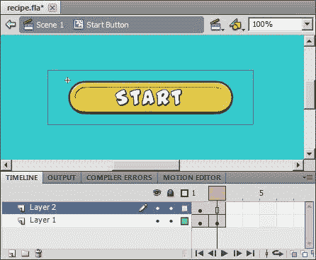
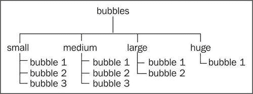
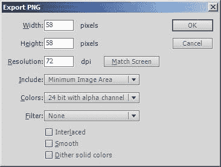
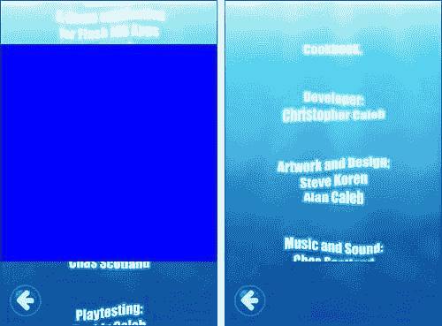
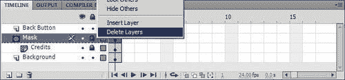
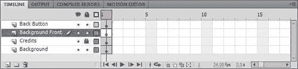
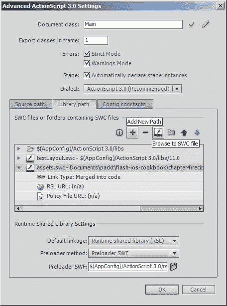

# 第四章. 将 Flash 项目移植到 iOS

在本章中，我们将涵盖：

+   处理用户交互

+   保存应用程序状态

+   展示列表扁平化

+   将矢量图转换为位图

+   调整位图大小

+   遮罩内容

+   与外部 SWF 文件一起工作

# 简介

苹果禁止在 iOS 上安装第三方插件，这阻止了 Safari 或其他任何浏览器运行 Flash 内容。不幸的是，这阻止了使用 iOS 设备的用户访问那些流行的基于 Web 的 Flash 游戏和应用。

直到最近，iOS 日益增长的流行度让希望将现有内容发布到苹果平台的 Flash 开发者处于困境之中。唯一现实的解决方案是完全用 Objective-C 重写他们的项目以适应 iOS，同时继续维护其他平台上的 Web 用户现有的 ActionScript 代码库。

然而，AIR for iOS 的一个主要优势是开发者可以将现有的 Flash 内容重新发布为原生 iOS 应用，同时保留项目的大部分代码库不变。Adobe 对 Flash 平台的跨平台目标意味着 Flash 开发者可以在使用他们熟悉的相同开发环境的同时针对 iOS。

本章将带你了解在将现有 Flash 项目移植到 iOS 平台时将帮助你的菜谱。这些应该让你迈出正确的步伐，并在继续使用 iOS AIR 工作时增强你的信心。记住，这里学到的不仅仅是适用于移植现有内容；你也应该将相同的技巧和原则应用到任何你计划创建的新应用程序中。

当然，仅凭本章内容并不能保证你的 Flash 项目能够成功移植，但选定的菜谱应该能给你一个成功的味道。移动平台的限制可能会使开发变得令人畏惧。然而，随着你对 iOS AIR 的了解不断增长，你识别应用程序中可以优化以适应这些限制的区域的技能也会提高。

# 处理用户交互

鼠标交互允许达到手指无法实现的精确度。以菜单屏幕中的一个简单按钮为例。使用鼠标，用户将能够以几乎像素级的精确度进行选择。然而，手指会遮挡屏幕的一部分，包括被选中的项目，并且还会与更大的区域接触。

如果你的现有 Flash 应用程序主要是为鼠标交互设计的，那么你需要重新设计你的用户界面以适应触摸。你可以做出的最有益的更改是增加按钮的大小，并在它们周围创建更大的点击目标。

## 准备工作

已提供 FLA 文件作为本菜谱的起点。

如果你还没有这样做，请从本书的配套网站下载这本书的代码包。

将`chapter4\recipe1\recipe.fla`打开到 Flash Professional 中。

在其库中包含您将用于创建按钮的位图。此外，其 AIR for iOS 设置已应用，节省了您在最终需要将菜谱构建和部署到设备时的时间和精力。

今后，将为所有菜谱提供一个起始 FLA，其中每个菜谱的大多数 AIR for iOS 设置已预先配置。

## 如何操作...

我们将把这个菜谱分成两部分。首先，我们将创建一个代表按钮的电影剪辑，然后再编写并链接一个自定义类。

### 创建按钮电影剪辑

让我们从创建电影剪辑开始：

1.  选择**插入** | **新符号** *(Ctrl + F8* | *Cmd* + *F8)*。在**创建新符号**面板中，将`Start Button`输入到**名称**字段，并从**类型**字段的下拉框中选择**电影剪辑**。点击**确定**按钮。

    在库中创建一个空的电影剪辑符号，并将您移动到其时间轴。

1.  将**button-normal.png**位图从库拖动到舞台。从**属性**面板中展开**位置和大小**部分，并将位图定位在(0, 0)。

1.  点击时间轴的第 2 帧，选择**插入** | **时间轴** | **空白关键帧**。同时将**button-select.png**从库拖动到舞台，并定位在(0,0)。

1.  通过从 Flash Professional 的下拉菜单中选择**插入** | **时间轴** | **层**来在时间轴上创建一个新层。该层默认命名为**层 2**，并位于**层 1**之上。

1.  从**工具**面板中选择**矩形工具 (R)**。在**层 2**上绘制一个宽度为 290 像素、高度为 77 像素的矩形。将其定位在(-28,-14)。该矩形应跨越时间轴的两个帧，代表按钮的点击区域。

1.  最后，通过双击矩形来选择它，然后从**属性**面板将矩形填充和描边的 alpha 设置为**0%**，使其不可见。

    您现在应该有一个按钮电影剪辑，其时间轴与以下截图相同：

    

1.  从**Start Button**电影剪辑符号中移出，回到您的 FLA 根时间轴。

1.  保存 FLA。

### 将类链接到按钮

在处理完按钮的视觉后，是时候添加一些使用 ActionScript 的交互性了：

1.  选择**文件** | **新建**并创建一个新的**ActionScript 3.0 类**。将类命名为`Button`。

1.  将以下代码添加到类中：

    ```swift
    package {
    import flash.display.MovieClip;
    import flash.events.MouseEvent;
    public class Button extends MovieClip {
    public function Button() {
    addEventListener(MouseEvent.ROLL_OVER, touched);
    addEventListener(MouseEvent.ROLL_OUT, released);
    gotoAndStop(1);
    }
    private function touched(e:MouseEvent):void {
    gotoAndStop(2);
    }
    private function released(e:MouseEvent):void {
    gotoAndStop(1);
    }
    }
    }

    ```

1.  将类保存为`Button.as`到与您的 FLA 相同的目录。

1.  返回到您的 FLA。现在您可以将类链接到您的按钮。

1.  在 **库** 中，右键单击 **Start Button** 电影剪辑符号并选择 **属性**。勾选 **导出为 ActionScript** 复选框。在 **类** 字段中输入 `StartButton`，在 **基类** 字段中输入 `Button`。单击 **确定** 按钮。Flash 将通知您将生成 `StartButton` 类的定义。单击 **确定** 按钮。

1.  现在，将 **Start Button** 电影剪辑符号实例从 **库** 拖到舞台。将其定位在 (43,217)。

1.  使用 ADL 测试您的 FLA 以确保没有编译错误。（Ctrl + Enter | Cmd + Enter）

1.  最后发布您的 iOS 应用。

FLA 将被编译，并创建一个名为 `c4-r1.ipa` 的文件。将文件部署到您的设备上并测试它。

### 注意

本书剩余的食谱将遵循其 IPA 文件命名的约定。IPA 的名称将包含食谱所属的章节编号，后跟该食谱在章节中的位置。

例如，此食谱属于第四章（c4）并且是该章节的第一个食谱（r1）。因此，由该食谱的 FLA 生成的 IPA 文件将命名为 `c4-r1.ipa`。为了确保您可以在设备上轻松找到已安装的应用，每个应用的名字都将反映 IPA 的名字。您将在主屏幕上找到前一个食谱的示例应用，名为 `c4 r1`。

## 它是如何工作的...

通过一些简单的时间轴工作和少量 ActionScript，您已经构建了一个适用于 iOS 设备的双状态按钮。

由于尺寸较大且具有宽裕的矩形点击目标，按钮易于点击。即使那些用一只手操作设备并用拇指进行选择的人也应该没有问题。

`Button.as` 类仅管理按钮两个状态之间的时间轴移动。当按钮未被按下时，显示时间轴的第一帧。当用户的指尖触摸按钮时，显示其时间轴的第二帧。其状态也会根据用户的指尖在按钮上或离开按钮时进行更新。

强烈的用户体验对您应用的成功至关重要。当将现有的 Flash 项目移植到 iOS 时，请花费必要的时间调整您的按钮和其他 UI 元素以适应该平台。

## 还有更多...

以下是一些关于用户交互的更多有趣点。

### 重新使用按钮类

您可以重新使用此食谱中提供的类，将其链接到您自己的项目库中的任何按钮。该类仅更新按钮的视觉状态，但您可以轻松地为任何按钮实例添加事件监听器以响应用户的选择。

作为一个快速示例，将您舞台上的按钮实例命名为 `startButton`。现在，为您的 FLA 创建一个文档类。将类命名为 `Main` 并向其中添加以下代码：

```swift
package {
import flash.display.MovieClip;
import flash.events.MouseEvent;
public class Main extends MovieClip {
public function Main() {
startButton.addEventListener(MouseEvent.MOUSE_UP,
buttonPressed);
}
private function buttonPressed(e:MouseEvent):void {
startButton.visible = false;
}
}
}

```

上述代码只是监听 `startButton` 实例分发 `MouseEvent.MOUSE_UP` 事件。当它这样做时，`buttonPressed()` 处理程序被调用，该程序将按钮从视图中隐藏。当然，对于你自己的应用程序，你将在处理程序中添加自己的功能。

### 处理键盘控制

除了鼠标交互之外，许多为网络设计的启用 Flash 的项目还期望存在物理键盘以某种方式或形式控制应用程序。虽然 iOS 设备支持虚拟键盘，但它仅在文本字段被编辑时才出现。你的应用程序不应依赖于键盘事件作为控制机制。在将其移植到 iOS 之前，你可能需要重新设计用户与应用程序交互的方式。

## 参见

+   *将类链接到电影剪辑符号，第三章*

+   *创建基本文档类第三章*

# 保存应用程序状态

当为 iOS 编写应用程序时，你应该预计应用程序可能在任何时候被关闭。这可能是由于多种原因，例如用户故意退出应用程序、接收到来电或 iOS 由于内存限制而关闭应用程序。

当应用程序意外关闭时，用户会期望它在他们最终返回时从其先前状态恢复。对于你正在将其移植到 iOS 的任何 Flash 项目，在应用程序的生命周期中方便的点上添加保存应用程序状态的功能非常重要。

此菜谱将指导你完成维护应用程序状态所需的步骤。我们将使用 Flash 的 `SharedObject` 类将数据本地保存到您的设备。

## 准备工作

从本书的配套代码包中，将 `chapter4\recipe2\recipe.fla` 打开到 Flash Professional 中。

在舞台上，你会找到一个动态文本字段和一个代表按钮的电影剪辑。已经编写了一个最小的文档类，每次按钮被按下时都会增加计数器，并在文本字段中显示其值。

电影剪辑的库符号链接到一个名为 `Button` 的类，该类在先前的菜谱中介绍，即处理用户交互。

使用 ADL 测试应用程序 *(Ctrl + Enter* | *Cmd* + *Enter)*。通过点击按钮几次来增加计数器几次，然后关闭窗口。如果你再次测试应用程序，你会注意到计数器已重置为零——应用程序尚未记住其状态。

文档类 `Main.as` 可以在 FLA 的同一位置找到。打开它，熟悉代码。

已经在舞台上的按钮上添加了一个 `MOUSE_UP` 事件监听器。其处理函数简单地增加一个 `counter` 成员变量，然后将值写入动态文本字段。

让我们更新文档类，使其能够管理应用程序的状态。

## 如何做...

你将需要使用 `SharedObject` 类来完成此菜谱。

1.  在 `Main.as` 中添加一个导入语句：

    ```swift
    import flash.net.SharedObject;

    ```

1.  声明一个成员变量，该变量将用于存储对共享对象的引用：

    ```swift
    private var so:SharedObject;

    ```

1.  现在，添加一个私有方法，用于初始化共享对象或检索它已存储的任何数据：

    ```swift
    private function initSharedObject():void {
    so = SharedObject.getLocal("savedData");
    if(so.data.counter == null)
    {
    so.data.counter = counter;
    }
    else
    {
    counter = so.data.counter;
    }
    }

    ```

1.  在构造函数中调用`initSharedObject()`：

    ```swift
    public function Main() {
    initSharedObject(); 
    counterField.text = String(counter);
    btn.addEventListener(MouseEvent.MOUSE_UP, buttonPressed);
    }

    ```

1.  添加一个私有方法，将`counter`成员变量的值保存到共享对象中：

    ```swift
    private function saveSharedObject():void {
    so.data.counter = counter;
    so.flush();
    }

    ```

1.  在`buttonPressed()`事件处理程序中，调用`saveSharedObject()`方法：

    ```swift
    private function buttonPressed(e:MouseEvent):void {
    ++counter;
    counterField.text = String(counter);
    saveSharedObject(); 
    }

    ```

1.  保存您的类文件。

1.  使用 ADL 测试您的 FLA。当您关闭窗口并重新测试 FLA 时，您将看到计数器的值已成功恢复。

1.  将您的应用程序发布到 iOS 并部署到您的设备。增加计数器然后关闭应用程序。如果您的设备正在使用 iOS 4.0 或更高版本，那么您还需要从 iOS 的应用程序切换器中强制关闭应用程序。当您重新启动它时，计数器的值将恢复。

### 小贴士

要访问快速应用程序切换器，请双击主按钮。要关闭应用程序，请轻触并保持其图标，直到图标角落出现减号符号。轻触减号符号，应用程序将从后台移除。应用程序切换器适用于运行 iOS 4 或更高版本的设备。

## 它是如何工作的...

本地共享对象是存储在您的设备上的数据文件。`SharedObject`类提供了一个 API，可以用来轻松地将数据保存到文件并从中检索数据。

在您可以使用共享对象之前，您必须通过调用静态`getLocal()`方法来获取`SharedObject`实例。如果共享对象尚不存在，则创建一个。当您调用`getLocal()`时，您必须传递一个字符串，该字符串用于命名写入设备文件系统的数据文件。这已在配方中的`initSharedObject()`方法中完成：

```swift
so = SharedObject.getLocal("savedData");

```

一旦您获得了`SharedObject`的引用，您可以通过其`data`属性添加或检索属性。每个属性代表您想要保存的数据，可以是任何 ActionScript 类型的对象，包括`Array, ByteArray`和`XML`。您甚至可以通过使用`flash.net.registerClassAlias()`包级函数首先注册它来保存自定义类的实例。

我们通过创建一个名为`counter`的属性并将其设置为成员变量的值来存储`counter`成员变量的值。这是在`initSharedObject()`方法中初始化持久数据时完成的，并在`saveSharedObject()`中再次完成以存储计数器的最新值。以下代码行用于实现此操作：

```swift
so.data.counter = counter;

```

了解你的共享对象是否包含数据或刚刚被创建也是有用的。你可以通过简单地检查你已知属性的存在来确定这一点。这是在`initSharedObject()`中完成的，我们检查了`counter`属性是否为`null`。如果是，我们就将其设置为`counter`成员变量的当前默认值；否则，我们使用存储的值来实际设置`counter`成员变量。以下代码再次作为提醒：

```swift
so = SharedObject.getLocal("savedData");
if(so.data.counter == null)
{
so.data.counter = counter;
}
else
{
counter = so.data.counter;
}

```

在数据对象内设置属性实际上并不会保存它们。你必须通过调用`flush()`方法来显式地这样做，这是在我们的`saveSharedObject()`方法中完成的。

调用`flush()`可能会很昂贵，因为数据必须写入文件系统。对于本食谱的示例代码，当应用程序的状态改变时，重复调用`flush()`是可以接受的。然而，对于现实世界的应用程序，你应该尽可能频繁地保存数据，但不要降低应用程序的性能。尝试找到方便的时刻来保存，例如，在关卡之间或用户不活跃期间。

关于`SharedObject`类的更多信息，请在 Adobe 社区帮助中搜索`flash.net.SharedObject`。

## 参见

+   *处理多任务，第三章*

+   *优雅地退出应用程序，第三章*

# 展平显示列表

Flash 的绘图工具和渲染引擎使得创建一个深度嵌套的显示列表变得方便。当检查在 Flash 中创建的艺术作品时，通常需要深入到顶级剪辑的几个层级，并通过复杂的层次结构导航，直到找到目标显示对象。

不幸的是，虽然台式电脑可以轻松渲染复杂场景，但在 iOS 设备上运行相同的内容可能会降低性能。深度嵌套的显示列表也会导致长事件链，这可能会进一步损害性能。例如，一个触摸事件必须遍历显示列表，以确定要接收事件的显示对象。

当移植到 iOS 时，渲染通常是最大的性能瓶颈。考虑展平你的显示列表，以保持你的应用程序的帧率尽可能高。

我们将通过完全展平一个示例嵌套显示列表来了解这是如何完成的。

## 准备工作

从本书的配套代码包中，将`chapter4\recipe3\recipe.fla`打开到 Flash Professional 中。

FLA 的场景应该很熟悉。它是第二章和第三章示例气泡应用程序中使用的内容，除了这个 FLA 中的资产已经被安排在层次结构中。

在顶级是一个名为`bubbles`的单个容器电影剪辑，它包含所有气泡剪辑。在`bubbles`内部有四个额外的容器剪辑，分别命名为`small`、`medium`、`large`和`huge`。这些容器用于按大小存储气泡集合。例如，所有小气泡都包含在`small`容器中。

下面的图示显示了完整的层次结构：



探索 Flash Professional 中的显示列表。它与大多数基于 Flash 的网站和游戏中的场景构建方式并不太相似。

让我们现在通过分解电影剪辑来简化这个显示列表。

## 如何操作...

确保您处于根时间轴上，并按照以下步骤操作：

1.  使用**选择工具 (V**)，点击舞台上坐着的`bubbles`电影剪辑。

1.  选择**修改** | **分解** *(Ctrl + B* | *Cmd* + *B)*。

    现在，`small`、`medium`、`large`和巨大的电影剪辑将从`bubbles`中取消组合，`bubbles`现在将从显示列表中移除。

1.  通过单击舞台上坐着的任何小气泡来选择`small`电影剪辑容器。现在选择**修改** | **分解** *(Ctrl + B* | *Cmd* + *B)*来分解`small`电影剪辑容器，取消组合其中包含的**Bubble Small**实例。

1.  重复前面的步骤来分解`medium`、`large`和`huge`容器剪辑。

1.  现在，您需要将每个气泡实例重命名，以确保它们都具有唯一的名称。当剪辑在容器内分组时，这不是问题，但现在它们都处于同一级别，它们的名称需要是唯一的。从小的气泡开始，一直工作到最大的，将电影剪辑实例命名为`bubble1`到`bubble9`。

1.  最后，从库中删除不再需要的符号。为此，转到**库**面板，并从面板菜单中选择**选择未使用项**。在库中右键单击一个突出显示的符号，并选择**删除**。所有突出显示的符号都将被删除。

    ### 小贴士

    库的面板菜单由面板右上角的小图标表示。单击它将显示一个选项的下拉列表。

1.  保存您的 FLA 文件。

## 它是如何工作的...

分解电影剪辑实例是简化显示列表的理想方式。当然，您可以减少显示列表的深度，而不是完全简化它。您希望走多远，实际上取决于您追求的性能和您希望渲染的场景的复杂性。

然而，实例命名可能会变得稍微复杂一些。分层结构允许具有相同名称的多个剪辑共存。例如，这个示例中的`small`和`medium`电影剪辑都包含一个名为`bubble1`的剪辑。尽管这两个剪辑具有相同的名称，但它们属于不同的父剪辑，避免了命名冲突。然而，一旦展开，我们留下了几个具有相同名称的剪辑坐在舞台上。

如果你决定合并你的显示列表，那么仔细考虑这将对你的代码产生的影响。任何目标路径引用都需要更新，并且你需要花费时间重命名显示对象实例以避免潜在的命名冲突。合并显示列表也会影响显示对象的相对 `x` 和 `y` 位置。然而，如果你正在移植的应用程序需要一致且高帧率的性能，那么这可能是你的唯一选择，尤其是在针对旧设备时。

# 将矢量转换为位图

大多数 Flash 项目都充分利用了 Flash 的矢量渲染引擎和时间轴动画系统。然而，渲染矢量内容可能会计算成本高昂，尤其是包含大量控制点、渐变和 alpha 透明度的复杂矢量形状。

尽管即使是普通的台式电脑也能轻松渲染大多数 Flash 项目中找到的矢量图形；但移动设备优化了位图图形，这意味着有时需要做出妥协。绘制位图通常比矢量便宜。

在性能至关重要的地方，考虑将复杂的矢量艺术品转换为位图。如果你的项目已经包含现有的矢量内容，那么你可以使用 Flash Professional 从每个库符号生成位图。然后你可以用位图渲染版本替换你的矢量内容。

让我们看看这是如何操作的。

## 准备工作

已提供 FLA 文件作为本菜谱的起点。

使用 Flash Professional，从书籍的配套代码包中打开 `chapter4\recipe4\recipe.fla`。

你将使用上一章示例 Bubbles 应用程序中的资源。尽管该应用程序之前使用了位图，但此 FLA 库中的气泡资源现在由矢量表示。

在 **库** 面板中，你会找到一个名为 **Bubble Vector** 的电影剪辑符号。这是一个在四种气泡类型（**Bubble Small、Bubble Medium、Bubble Large** 和 **Bubble Huge**）中使用并调整大小的母剪辑。

我们现在将使用 Flash Professional 将每个气泡的矢量表示转换为位图。

## 如何操作...

让我们先从将 **Bubble Small** 转换为位图开始：

1.  从 **库** 面板中，双击 **Bubble Small**。这将把你带到该符号的时间轴。

1.  从 Flash Professional 的下拉菜单中选择 **文件** | **导出** | **导出图像**。

    将出现一个文件浏览器窗口。

1.  使用浏览器窗口，导航到你的 FLA 的根文件夹。在 **保存类型** 字段中，选择 **PNG** 并在 **文件名** 字段中输入 **bubble-small.png**。点击 **保存** 按钮。

    将出现一个 **导出 PNG** 对话框，提供 Flash 即将创建的 PNG 的导出选项，如下截图所示：

    

1.  对于**包含**字段，从下拉框中选择**最小图像区域**。确保**颜色**字段设置为**24 位带 alpha 通道**，并且**过滤器**字段设置为**无**。此外，确保**平滑**复选框未选中。

1.  点击**确定**以导出 PNG。

1.  现在，从**库**面板中双击**Bubble Medium**。再次，选择**文件** | **导出** | **导出图像**，并输入文件名为**bubble-medium.png**。在**导出 PNG**面板中，使用之前的相同设置。

1.  重复此过程，对于**Bubble Large**和**Bubble Huge**，分别导出为**bubble-large.png**和**bubble-huge.png**。

## 它是如何工作的...

现在，您有四个位图图像——每个气泡一个——可以导入到您的 FLA 中，并用它们替换矢量版本。

移动设备上，如 iPhone 上发现的**图形处理单元（GPU）**，针对渲染位图进行了优化；在许多情况下，如果您选择使用位图而不是矢量，您应该会看到显著的性能提升。

无论您使用 CPU 还是 GPU 渲染模式，您的位图图像看起来都将保持一致，除了平滑处理外，它们将相对不受舞台渲染质量的影响。这与矢量形成鲜明对比，矢量会受到渲染模式和舞台质量的双重影响。

使用 CPU 渲染模式利用与安装在桌面计算机上的 Flash Player 相同的软件渲染器，并产生相同的高质量结果。然而，这是以性能为代价的，与使用 GPU 渲染管道相比。

虽然渲染矢量使用 GPU 很快，但总是会得到源艺术作品的近似值。对于快速移动的内容，这可能是可以接受的，但对于静止物体，差异可能很明显。

实际上，每种渲染路径在处理矢量时都会产生不同的结果。CPU 渲染准确但较慢，而 GPU 渲染速度快但不够准确。然而，这两种选项通常比使用位图计算成本更高。

在适当的情况下，将您的复杂矢量艺术品替换为位图。然而，请注意，与矢量相比，位图可能会显著增加您的最终`.ipa`文件的大小。您的 IPA 越大，您的应用加载所需的时间就越长，消耗的内存就越多。内存消耗的增加本身可能会导致性能下降。

此外，苹果目前对空中下载设置了 20 MB 的限制。确保您的 IPA 不超过此限制，因为它会阻止用户通过运营商网络下载您的应用，并可能影响销售。

查看`chapter4\recipe4-final\recipe.fla`，以查看导出的 PNG 文件正在替代原始矢量艺术品使用。

## 还有更多...

智能使用位图对于最大化您应用的性能至关重要。您可能会发现以下选项和信息有助于实现这一点。

### 导出为位图

对于使用 Flash Professional CS5.5 的用户，有一个更方便的选项，允许您在发布时指示 Flash 导出矢量电影剪辑的位图表示。这不仅为您提供了针对应用的优化位图内容，而且还在 FLA 中保留了原始矢量图形。

要将符号导出为位图，首先从舞台中选择符号。然后从**属性**面板，展开**显示**部分，并从**渲染**字段的下拉菜单中选择**导出为位图**。如果您的剪辑需要透明度，请确保位于下拉菜单下方的选项设置为**透明**。

在 Flash CS5 中不可用**导出为位图**。

### 转换为位图

从 Flash Professional CS5.5 中提供了一个名为**转换为位图**的附加选项，该选项将矢量符号转换为位图。尽管**导出为位图**不会更改 FLA 的显示列表，但此选项将舞台上的实例替换为位图表示。新的位图表示将添加到库中，允许您使用 Adobe Photoshop 等图像编辑器进行进一步编辑。

要将符号转换为位图，只需在舞台上的实例上右键单击，然后从上下文菜单中选择**转换为位图**。

在 Flash CS5 中不可用**转换为位图**。

### 与时间轴动画一起工作

基于矢量的时间轴动画可能会进一步影响性能。这尤其适用于复杂的补间动画，这些操作可能非常昂贵。在低端设备上，如第一代和第二代 iPhone 和 iPod touch，即使是相对简单的补间也可能表现不佳。然而，随着从 AIR 2.6 以来的巨大渲染改进以及每一代 iOS 设备硬件规格的不断提高，这个问题正在逐渐减少。记住，苹果公司本身也不再支持第一代和第二代设备。

如果您在使用时间轴动画时遇到性能问题，那么考虑将动画的每一帧导出为 PNG 格式。其长度将是一个重要因素，因为基于位图的动画可能会消耗大量内存并增加加载时间。在这种情况下，您可能需要使用矢量实现，或者考虑重新设计动画以使其适合移动设备。

### 针对多个屏幕尺寸

屏幕分辨率在 iOS 设备之间有所不同。例如，iPhone 3GS 的分辨率为 320x480，而 iPhone 4 支持 640x960 像素。

当针对多个屏幕尺寸时，考虑创建不同尺寸的位图版本——每个屏幕分辨率一个。这将避免由于位图缩放导致的图像质量下降，并防止与内容缩放相关的任何性能问题。

创建每个位图的多个版本将增加 IPA 的最终文件大小，但如果性能是首要考虑，那么这可能值得付出努力。

如果你希望避免在应用程序中捆绑多个位图的额外开销，那么在将位图表示存储在内存中之前，也可以在运行时缩放矢量艺术作品。这种技术被称为位图缓存，在第六章（ch06.html "第六章. 图形和硬件加速"）中详细探讨。

### 预渲染滤镜和混合

滤镜通常在 Flash 项目中用于向显示对象添加视觉效果，如阴影、斜边和模糊。虽然滤镜可以为你的应用程序增添影响，但它们可能会严重影响性能。这在 iOS 设备上尤其如此，因为与桌面计算机相比，CPU 速度有限。此外，在 Flash Professional CS5.5 中，当使用 GPU 渲染管道时，滤镜不再受支持。

建议你将图形效果预渲染到艺术作品中，而不是使用 Flash 在运行时应用滤镜。这将有助于设备性能，并确保你的效果在 CPU 和 GPU 渲染模式下都能正常工作。

与从头开始完全重新创建效果的图像编辑器相比，你可以使用 Flash Professional 创建舞台上显示对象应用到的任何滤镜的位图表示。有各种方法可以做到这一点，包括将实例的渲染属性设置为**导出为位图**，将整个库剪辑转换为位图，或者导出 PNG 图像后再将其重新导入 Flash。

非正常混合模式也是昂贵的操作，应该以类似滤镜的方式将其'烘焙'到你的艺术作品中。

## 参见

+   *在舞台上添加内容，第二章*

+   *比较矢量图形和位图图形，第六章*

+   *使用缓存为位图，第六章*

+   *针对 Retina 显示屏，第八章*

+   *支持多分辨率，第八章*

# 调整位图大小

在 Flash 项目中，常见到不必要地对位图进行缩放的情况。在运行时调整位图大小可能会消耗大量计算资源并降低图像质量。这样做还可能导致包含的艺术作品实际大小超过预期显示尺寸时，IPA 文件变得更大。

让我们看看如何在 Flash Professional 中调整现有的位图艺术作品的大小。

## 准备工作

从 Flash Professional 中，打开书籍附带代码包中的`chapter4\recipe5\recipe.fla`。

再次，你将使用第二章和第三章示例 Bubbles 应用程序的熟悉视觉元素。这个食谱的资产由矢量和位图组成。气泡本身是矢量，而背景图像和 Flash 标志是位图。位图已缩放以适应屏幕。为了比较舞台上的缩放实例和库中存储的原始位图的大小，你可能想要将**background.png**和**flash-logo.png**都拖到舞台上。在继续之前，从舞台上删除这两个文件。

让我们使用 Flash Professional 调整库中存储的位图的大小，以防止 Flash 在运行时进行此操作。

## 如何做到这一点...

按以下步骤调整位图大小：

1.  在**库**面板中，双击**Bubble Huge**。这将把你带到该符号的时间轴，在那里你会看到一个**带有标志的巨型气泡**符号的实例。

1.  再次双击此符号以进入其中。

    在其时间轴上，你会看到两个图层——**Bubble**和**Logo**。**Logo**层包含 Flash 标志的位图表示。此剪辑已从 894x894 像素缩小到 200x200 像素。让我们创建一个已经缩放到正确大小的位图的新版本。

1.  在**库**中，右键单击**flash-logo.png**，从上下文菜单中选择**使用**编辑。当提示时，浏览并选择一个外部编辑器，例如 Adobe Photoshop。

1.  在您的编辑器中，将图像大小调整为 200x200 像素并保存。

1.  返回到 Flash Professional。

    现在，你应该能在气泡中看到新版本的标志，然而，标志现在将比预期的大小小得多。这是因为最初应用于 894x894 版本的缩放变换现在仍然应用于新的位图。

1.  锁定**Bubble**层，然后单击位于**Logo**层上的位图。从**属性**面板，更改宽度和高度设置到源位图的精确尺寸 200x200。

1.  在库中双击**Background**电影剪辑符号。

    此剪辑使用名为**background.png**的位图，实际上它是 640x960 像素缩小到 320x480。再次让我们在图像编辑器中调整此位图的大小，以防止在应用程序运行时对其进行缩放。

1.  在库中找到**background.png**。右键单击它，并选择使用您选择的图像编辑器编辑位图。将图像大小调整为 320x480 并保存。

1.  返回到 Flash Professional。使用**选择工具 (V**)，单击位于**背景**电影剪辑符号中的**background.png**，并将其宽度设置为 320，高度设置为 480。

1.  保存您的 FLA 文件。

## 它是如何工作的...

你已经成功用预渲染到预期观看大小的版本替换了 FLA 中现有的位图。这将节省宝贵的 CPU 周期，因为不需要在运行时缩放位图。只要这些位图最初是在运行时缩小而不是增大，调整位图大小也可以显著减小你的 SWF 的整体大小。

查看`chapter4\recipe5-final\recipe.fla`，以了解正在使用的调整大小的位图替代原始过大的位图。在较新的设备上运行时，可能难以察觉原始版本（`recipe5\recipe.fla`）和最终版本（`recipe5-final\recipe.fla`）之间在性能上的任何明显差异，但对于低端设备或更复杂的项目，这种改进可能是显著的。

## 还有更多...

以下信息在调整或优化资源时也会对你有所帮助。

### 针对多个屏幕尺寸

iOS 设备的屏幕分辨率各不相同。例如，iPhone 3GS 的分辨率为 320x480，而 iPhone 4 支持 640x960 像素。

当编写针对多个屏幕尺寸的应用程序时，你可能倾向于简单地通过运行时缩放位图内容来适应每个分辨率。如果你采取这种方法，那么请注意，如果你的应用程序尝试以高帧率渲染复杂场景，你可能会遇到性能问题。此外，随着位图的缩放，其质量也会受到影响。

相反，考虑为每个资产创建不同的版本——每个你希望支持的屏幕尺寸一个。当然，拥有每个资产的多个版本会增加你 IPA 的最终文件大小，但最终结果可能值得付出的努力。

如果你必须在运行时调整图像大小，那么你可以利用硬件加速来缩放位图，从而对性能的影响更小。你可以在第六章中了解更多信息。

### 优化矢量形状

虽然这个配方主要关注位图，但很容易创建不必要的详细矢量内容，这会影响渲染时间，并使你的`.ipa`文件体积膨胀。

为了减少绘制矢量艺术品所需的计算量，花时间移除不必要的控制点。通过智能使用**子选择工具（A）**和**删除锚点工具（-）**，你可以在不降低图像质量的情况下简化资产内的路径。

屏幕的像素密度使得用户难以看到他们在标准显示器上通常能注意到的许多细节。移除不必要的控制点可以减少你的 IPA 最终大小，并提高渲染性能。

### 阶段质量

您可以通过降低应用程序使用的阶段渲染质量来进一步提高性能。目前 iOS 提供了三种质量设置——低、中、高（AIR 2.0-2.7 仅支持低和中）。默认情况下，AIR for iOS 使用中等设置，但您可以通过在 ActionScript 中设置`Stage.quality`属性为`flash.display.StageQuality`类提供的常量之一来更改此设置。

例如，将以下代码行添加到您的文档类中，将使用最低的渲染质量设置：

```swift
stage.quality = StageQuality.LOW;

```

阶段渲染质量是一个全局设置，并应用于应用程序中的所有矢量内容。然而，位图相对不受影响，除了平滑处理外，在所有质量设置下看起来都相同。这方便地让您在不影响应用程序中任何位图质量的情况下，从矢量资产中获得最高性能。

## 参见

+   *将矢量转换为位图*

+   *比较矢量图形和位图图形，第六章*

+   *使用缓存为位图矩阵，第六章*

+   *针对视网膜显示屏，第八章*

+   *支持多分辨率，第八章*

# 蒙版内容

在整个 Flash 项目中，蒙版层经常被用来部分显示位于蒙版层直接下方的图层上的内容。蒙版本身可以是填充形状、文本、图形符号的实例或电影剪辑。甚至可以通过对蒙版应用形状或运动补间来创建动态效果。

这种灵活性和复杂性可能会对 CPU 提出很高的要求，导致帧率下降。尽管桌面计算机可以处理大多数蒙版操作，但相同的效果会降低您的 iOS 应用程序的性能。在可能的情况下，限制您对蒙版的用途。对于现有项目，而不是使用蒙版，可以用位于其上的其他剪辑来遮蔽内容。

在这个菜谱中，我们将做的是；移除蒙版层，而是使用两个电影剪辑来遮蔽之前由蒙版剪辑的内容。

## 准备工作

从本书的配套代码包中，将`chapter4\recipe6\recipe.fla`打开到 Flash Professional 中。

FLA 显示了一个游戏的信用屏幕。使用蒙版层来剪辑滚动向上的信用文本，确保只显示屏幕中央矩形区域内的文本。

要自己查看被遮罩的区域，请解锁 FLA 时间轴中的**遮罩**层。任何滚动进入此区域的文本都将显示在屏幕上。位于此区域之外的文本将被隐藏。文本本身是一个位于**字幕**层上的电影剪辑，并直接位于遮罩层下方。再次锁定图层以重新应用遮罩。以下截图显示了遮罩区域以及当遮罩应用于字幕文本时屏幕将呈现的样子：



通过选择**控制** | **测试影片** | **在 AIR 调试启动器（移动）** *(Ctrl + Enter* | *Cmd* + *Enter)* 来测试 FLA 在 ADL 中的效果。

现在发布 FLA 以供 iOS 使用，并将生成的 IPA 部署到你的设备上。在旧款 iOS 设备，如第一代和第二代 iPhone 以及 iPod touch 上，你可能发现性能严重受损。遮罩在旧硬件上尤其有问题。在继续之前，请从你的设备上删除该应用。

现在我们将逐步说明如何移除遮罩，并使用电影剪辑来遮挡字幕文本。

## 如何操作...

我们将首先移除遮罩层。

1.  在时间轴上右键点击**遮罩**层，然后从上下文菜单中选择**删除图层**。

    +   现在我们将复制一些新的库符号到你的 FLA 中。

1.  选择**文件** | **打开**，浏览到 `chapter4\recipe6\resources\resources.fla`。点击**打开**以加载 FLA。

1.  从 `resources.fla` 复制所有库符号并将其粘贴到 `recipe.fla` 的库中。

    你复制的两个新的电影剪辑符号——**背景顶部**和**背景底部**——将被用来遮挡任何位于之前由遮罩定义的矩形区域之外的字幕文本。

1.  在**字幕**层上方直接创建一个新图层，并将其命名为**背景前**。

1.  从库中将**背景顶部**的一个实例拖动到**背景前**图层上。从**属性**面板中，将实例的 x 和 y 位置分别设置为 `0`。如果你使用的是 Flash Professional CS5，那么你也应该展开**显示**部分并勾选**缓存为位图**复选框。

1.  此外，从库中将**背景底部**的一个实例拖动到**背景前**图层上。将其 x 位置设置为 `0`，y 位置设置为 `385`。再次提醒，如果你使用的是 Flash Professional CS5，那么在**显示**部分，请勾选**缓存为位图**复选框。

1.  保存你的 FLA 并使用 ADL 测试 *(Ctrl + Enter* | *Cmd* + *Enter)*。

1.  最后，发布并部署到你的设备上。如果你使用的是旧一代设备，那么性能提升将会非常显著。

## 它是如何工作的...

虽然实现方式不同，但最终结果应该与原始遮罩层实现相同。然而，使用电影剪辑来遮挡内容相比使用遮罩裁剪要计算成本低。

隐藏是一个相当简单的技术。在本例中，使用了两个包含 FLA 背景图像位图内容的新剪辑。然后，将字幕文本夹在原始背景图像和两个新剪辑之间，给人一种正在对文本应用遮罩的错觉。

您可能不熟悉**缓存为位图**渲染选项。在本例中，它用于利用 Flash Professional CS5 构建的应用程序的 GPU 加速。缓存为位图和 GPU 加速将在第六章中更详细地介绍。

## 参见

+   *使用缓存为位图，第六章*

+   *使用缓存为位图矩阵，第六章*

# 使用外部 SWF

为了减少初始加载时间，基于 Web 的 Flash 项目通常将资源（如图形）保存在单独的`.swf`文件中，这些文件在需要时加载。例如，跨越多个级别的游戏可能每个级别都有一个外部 SWF。当玩家完成一个级别时，包含下一个级别资源的 SWF 将在运行时加载。

由于苹果公司实施的限制，iOS 应用程序不能从外部源运行解释代码。这给希望加载包含类文件或嵌入在库符号时间线中的 ActionScript 的外部 SWF 的人带来了问题。目前还没有创建包含原生 ARM 机器代码的外部 SWF 的方法。

如果您正在尝试移植加载包含 ActionScript 的外部 SWF 的 Flash 项目，那么您需要将资源直接包含在您的 iOS 应用程序中。任何资源文件都需要作为 SWC 文件发布，而不是 SWF，以便它们可以静态链接并与您的 iOS 应用程序编译。

让我们看看如何做到这一点。

## 准备工作

我们将需要使用书籍配套代码包中的各种文件。在`chapter4\recipe7\resources\assets.fla`中提供了一个资源 FLA。我们将将其发布为`.swc`文件，并将其静态链接到第二个 FLA，即`chapter4\recipe7\recipe.fla`。

## 如何操作...

本菜谱分为两个主要步骤。首先，我们将从资源 FLA 发布一个 SWC，然后我们将静态链接 SWC 到我们的应用程序 FLA。

### 发布 SWC

让我们先从创建`assets.fla`的 SWC 开始。

1.  将`chapter4\recipe7\resources\assets.fla`导入到 Flash Professional 中。

    本 FLA 包含一组资源，旨在由`recipe.fla`加载和使用。FLA 的舞台是空的，但在其库中您将找到具有链接 ID 的电影剪辑符号，允许它们在运行时实例化并添加到显示列表中。

    现在，让我们配置 FLA 的发布设置，允许从其 SWF 导出`.swc`文件。

1.  从下拉菜单中选择**文件** | **发布设置**。

    您的下一步取决于您使用的 Flash Professional 版本。对于 Flash CS5.5，取消选择 **Flash (.swf)** 复选框，并在 **发布** 部分内选中 **SWC** 复选框。如果您使用的是 CS5，则在点击 **SWF 设置** 部分的 **导出 SWC** 复选框之前，先点击 **Flash** 选项卡。

1.  点击 **确定** 以设置更改并关闭 **发布设置** 面板。

1.  保存 FLA 的更改，然后通过从下拉菜单中选择 **文件** | **发布** *(Alt + Shift* + *F12* | *Shift* + *Cmd* + *F12)* 来发布它。一个名为 `assets.swc` 的文件将被输出到与您的 FLA 相同的文件夹中。

### 静态链接 SWC 文件

现在，让我们编写一个简单的 iOS 应用程序，并将资产 SWC 静态链接到它。

1.  首先，在 Flash Professional 中打开 `chapter4\recipe7\recipe.fla`。

1.  创建一个文档类。将类命名为 `Main` 并向其中添加以下代码：

    ```swift
    package {
    import flash.display.Sprite;
    public class Main extends Sprite {
    public function Main() {
    var background:Background = new Background();
    background.x = 0;
    background.y = 0;
    addChild(background);
    var bubble:BubbleHuge = new BubbleHuge();
    bubble.x = stage.stageWidth / 2;
    bubble.y = stage.stageHeight / 2;
    addChild(bubble);
    }
    }
    }

    ```

1.  保存文档类。

1.  返回到 FLA 文件，从下拉菜单中选择 **文件** | **动作脚本设置**。这将打开 **高级动作脚本 3.0 设置** 面板，您可以在其中将 `assets.swc` 静态链接到您的应用程序。

1.  要这样做，首先点击 **库路径** 选项卡，然后点击表示为 **+** 符号的 **添加新路径** 图标。现在点击 **浏览到 SWC 文件** 图标。浏览并选择您的 `assets.swc` 文件。它将被添加到要随应用程序发布的 SWC 文件列表中。通过点击其路径左侧的图标展开资产 SWC 条目。确保其 **链接类型** 设置为 **合并到代码**。

1.  通过点击底部的 **确定** 按钮关闭 **高级动作脚本 3.0 设置** 面板。

1.  保存您的 FLA。

1.  在 ADL 中发布并测试您的 FLA *(Ctrl + Enter* | *Cmd* + *Enter)*。应用程序应该实例化并将 `assets.swc` 中的 **Background** 和 **Bubble Huge** 符号添加到其显示列表中。

1.  最后，发布并部署应用程序到 iOS，并确保它在您的设备上按预期工作。

## 它是如何工作的...

我们从资产 FLA 创建了一个 SWC 文件，并将其静态链接到我们的 iOS 应用程序。SWC 文件是一个包含预编译的 Flash 符号和动作脚本代码的包。虽然 SWC 文件通常可以在运行时加载，但在编写针对 iOS 的应用程序时，您必须静态链接 SWC 文件。这保证了 Flash Professional 将 SWC 的动作脚本字节码编译成本机 ARM 机器代码。

本食谱示例中的文档类简单地使用与资产 SWC 库符号关联的链接 ID 来实例化和向应用程序的显示列表添加对象。具体来说，该类创建并显示 `Background` 和 `BubbleHuge` 的实例，它们来自 `assets.swc`。

您应该考虑您将链接到您的 iOS 应用中的资源文件的总大小。所有静态链接的内容都必须预先加载，这将影响您应用的初始加载时间和它消耗的内存量。在大型项目中，如果内存消耗过高，iOS 可能会关闭应用。内存阈值会因设备而异，并且还取决于后台保留的应用数量。

## 还有更多...

加载外部 SWF 文件并非不可能，但您能做的事情有限。

SWF 文件不能包含任何 ActionScript，包括将链接 ID 分配给库符号。这阻止了您从您的应用中动态实例化 SWF 的任何库符号。同样，您也无法在 SWF 的时间线上嵌入 ActionScript 以执行简单的程序控制您的动画。

然而，您可以在 SWF 的舞台上放置内容；将 SWF 加载到您的应用中；然后将 SWF 添加到显示列表中。您还可以在外部 SWF 的时间线上嵌入声音并播放它。此外，您可以从您的应用中调用 ActionScript 到外部 SWF，允许对显示列表中的实例进行程序控制。与许多 Flash 开发者习惯的相比，这有限制，但在 iOS 项目中仍然有外部 SWF 的用途。

## 参见

+   *创建基本文档类，第三章*

+   *将类链接到电影剪辑符号，第三章*
