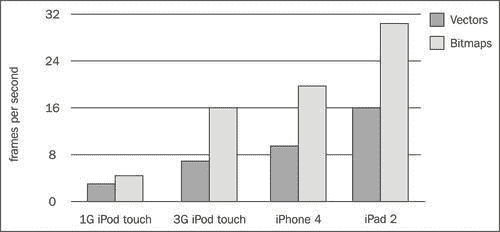
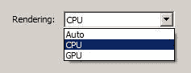
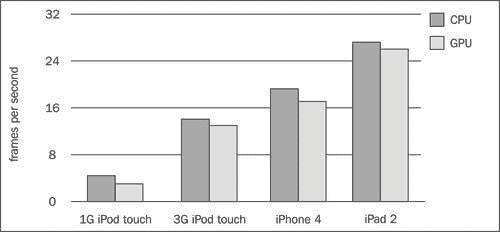
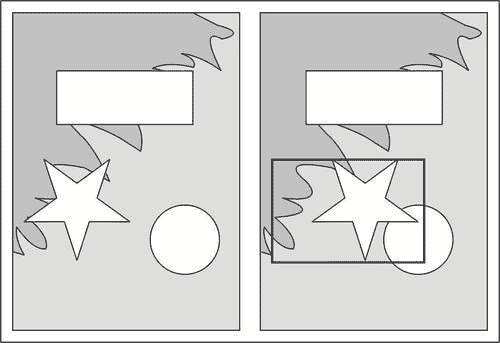
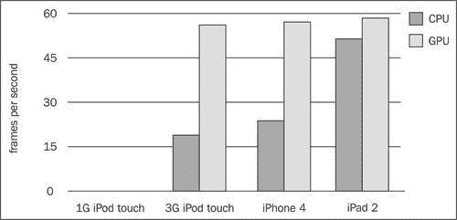
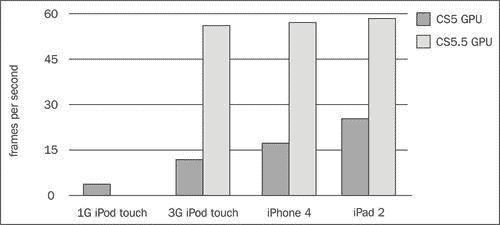
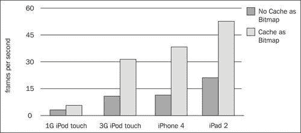
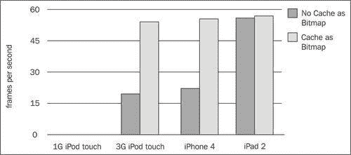

# 第六章. 图形和硬件加速

在本章中，我们将涵盖：

+   比较矢量图形和位图图形

+   理解 GPU-混合模式

+   理解 GPU-矢量模式

+   使用缓存作为位图

+   使用缓存作为位图矩阵

+   使用 ActionScript 访问位图

+   在运行时加载位图

+   使用精灵图集工作

+   使用 ActionScript 执行位图动画

# 简介

CS5 的发布使得 Flash 开发者能够在不改变工作流程的情况下为 iOS 设备创建令人兴奋的内容。然而，由于现代桌面或笔记本电脑计算能力的只有一小部分，为 iPhone 等设备开发需要特殊的设计和编码考虑。

最大的瓶颈之一是图形渲染，它已经成为许多人的烦恼之源。简单地构建与桌面交付相同的图形密集型 FLA，并期望它们在移动设备上运行良好，这是不现实的。即使看似简单的图形操作，如果实现不当，在 iOS 设备上也可能表现不佳。

通过提供你已熟悉的强大绘图和动画工具，Flash IDE 实际上可能会让你产生一种虚假的安全感。例如，复杂的矢量图形、蒙版、时间轴动画、深度嵌套的显示列表和 alpha 透明度都很容易创建，但可能会对你的应用程序性能产生负面影响。针对移动设备需要仔细规划、分析和了解你正在为哪个硬件开发。

在本章中，我们将探讨许多优化渲染性能的技术。我们将涵盖 Flash 的渲染管道以及你将在其中工作的硬件限制。此外，我们还将了解如何利用硬件加速，将大部分渲染工作量从 CPU 卸载到图形处理单元（GPU）。

# 比较矢量图形和位图图形

尽管 Flash 提供了位图支持，但它主要被视为矢量动画工具。矢量内容可以直接在 IDE 中创建和编辑，这使得矢量图形成为比必须在外部编辑的位图更明显的选择。

然而，考虑到移动设备如 iPhone 的硬件限制，矢量图形是否合适，或者你应该考虑使用位图以最大化性能？

## 准备工作

为此配方提供了两个 FLA，可以在书的配套代码包中找到，位于`chapter6\recipe1\`。

两者都执行一个简单的渲染性能测试。每个都尝试渲染十个动画电影剪辑的实例。五秒后，测试将结束，并显示达到的平均每秒帧数（FPS）。这个数字越高，测试的渲染性能就越快。

第一个 FLA`— recipe-vectors.fla —`为每个电影剪辑的动画帧使用矢量图形。第二个`—recipe-bitmaps.fla—`则使用位图表示。

## 如何做...

按以下步骤在你的设备上运行这两个测试：

1.  将`recipe-vectors.fla`打开到 Flash Professional 中。

1.  在库中，你会找到一个名为**Monkey**的符号，它包含一个四帧的矢量动画。双击该符号并探索其显示列表。其结构对于 Flash 项目来说是典型的，包含许多嵌套的矢量图形剪辑。

1.  发布 FLA 文件并部署`c6-r1-v.ipa`。在你的设备主屏幕上找到名为**c6 r1 v**的应用并启动它。等待五秒钟，然后记录达到的帧率。

1.  现在打开`recipe-bitmaps.fla`。双击**Monkey**库符号并探索其时间轴。这个 FLA 执行与第一个相同的测试，但它使用位图而不是矢量作为每个动画帧。

1.  发布 FLA 并部署`c6-r1-b.ipa`到你的设备。启动**c6 r1 b**并记录帧率。

## 它是如何工作的...

每个 iOS 设备的渲染性能可能会有所不同，但无论你使用什么设备，基于位图的动画都将优于基于矢量的等效动画。

为了确认这一点，让我们看看从 Flash Professional CS5 编译的两个 FLA 在多个设备上运行的结果。以下图表显示了每个测试达到的平均帧率，以每秒帧数衡量：



### 注意

图表中显示的结果是从每个测试的五次运行中得出的平均值。每个设备都运行 iOS 5，除了第一代 iPod touch，它安装了 iOS 3.1。

使用这些结果作为粗略的指南，因为它们可能在不同的运行中略有差异。

那么为什么位图渲染到屏幕上的速度比矢量快？

矢量图形由线条、填充、颜色和渐变组合而成，渲染它们需要昂贵的数学计算。另一方面，位图只是图像所需每种颜色的像素逐个表示。由于位图的每个点都已经知道，它可以快速绘制到屏幕上。

这是否意味着你应该在为 iOS 开发时专门使用位图代替矢量？不一定。与位图不同，矢量图形可以无失真地缩放和转换。这是由于矢量图形是数学上表示的。矢量的另一个优点是文件大小。在许多情况下，矢量比它们的位图对应物消耗的空间要少得多。

然而，如果帧率对你的应用程序的成功至关重要，那么你应该始终尝试选择最快的渲染选项。此外，请注意，这样做可能会以增加内存使用、更大的文件大小和延长开发时间为代价。

## 还有更多...

无论你选择使用矢量还是位图，调整渲染质量都可以帮助提高性能。

### 阶段质量

您可以通过降低应用程序使用的渲染质量来进一步提高性能。这在您试图在操作复杂矢量图形的同时最大化帧率时特别有用。

使用 ActionScript，将`Stage.quality`属性设置为以下常量之一：

+   `StageQuality.HIGH:` 提供位图平滑和抗锯齿

+   `StageQuality.MEDIUM:` 提供位图平滑并使用较低质量的抗锯齿

+   `StageQuality.LOW:` 不平滑位图或抗锯齿图形

从 AIR 3.0 开始，所有三个质量设置都可用，而 AIR 2.0-2.7 仅支持低质量和中等质量。iOS 的所有版本都将`StageQuality.MEDIUM`作为默认设置。

渲染质量应用于应用程序中的所有内容。然而，位图却相对不受影响，除了平滑处理外，在所有质量设置下看起来都相同。这方便您在不影响应用程序中任何位图质量的情况下，从矢量资源中获得最高性能。您可以在应用程序的生命周期内重复更改质量设置，以最好地适应任何特定时刻的需求。

尝试在此菜谱的 FLA 中降低舞台的渲染质量。只需打开由两者共享的`Main.as`文档类，并在构造函数的开始处添加以下代码行：

```swift
stage.quality = StageQuality.LOW;

```

此外，添加以下导入语句：

```swift
import flash.display.StageQuality;

```

发布并重新部署两个`.ipa`文件。

尽管矢量图形的质量将明显降低，但渲染速度现在应该更快。对于许多情况，这种牺牲可能是可以接受的，尤其是在紧凑的移动设备屏幕上，任何质量的降低可能都难以察觉。

## 参见

+   *将矢量转换为位图，第四章*

+   *调整位图大小，第四章*

# 理解 GPU-混合模式

与为 Flash 桌面播放器开发不同，针对 iOS 的 AIR 提供了两种渲染模式。与桌面播放器中存在的相同软件渲染器作为第一个选项提供，并由设备的 CPU 处理。第二个选项允许您利用设备的 GPU，并在某些情况下显著提高渲染性能。

在编译 iOS 的 FLA 之前必须选择渲染模式，且在运行时无法更改。因此，了解两种模式之间的差异并在早期做出决定，关于您希望支持哪种模式，是非常重要的。渲染器的选择可以决定您如何构建应用程序。

虽然 Flash Professional CS5 和 CS5.5 都提供了一个在 GPU 上执行渲染的选项，但实际上实现渲染模式的方式不同。

在这个菜谱中，我们将发布和部署一些示例 FLA，以帮助您了解两种模式之间的差异。特别是，我们将重点关注 Flash Professional CS5 提供的 GPU 渲染模式。

## 准备工作

本书附带代码包中提供了两个 FLA——“render-test-cpu.fla”和“render-test-gpu.fla”——可以在 `chapter6\recipe2\` 中找到。

两个 FLA 都是相同的，每个在每一帧更新时都会随机重新定位十个电影剪辑实例。五秒后，测试将结束，并显示达到的平均每秒帧数（FPS）。这个数字越高，测试的渲染性能就越快。

对于这个菜谱，FLA 应仅使用 Flash Professional CS5 编译。但是，如果您使用的是 CS5.5，请在进入下一个菜谱之前阅读这里涵盖的材料。

## 如何操作...

让我们为每个 FLA 选择一个渲染模式，并看看它们在实际设备上的表现。

1.  在 Flash Professional CS5 中打开 `render-test-cpu.fla`。

1.  选择 **文件** | **iPhone OS 设置**。

1.  从 **iPhone OS 设置** 面板中，从 **渲染** 字段的下拉菜单中选择 **CPU**。点击 **确定** 以确认更改。

1.  保存 FLA。

1.  发布 FLA 并将 `c6-r2-cpu.ipa` 部署到您的设备上。在您的设备主屏幕上找到名为 **c6 r2 cpu** 的应用程序并启动它。记录测试达到的帧率，然后关闭应用程序。

1.  现在，打开 `render-test-gpu.fla`。

1.  选择 **文件** | **iPhone OS 设置**。这次，将面板的 **渲染** 字段设置为 **GPU**。

1.  点击 **确定** 关闭面板。

1.  保存 FLA。

1.  将 `c6-r2-gpu.ipa` 发布并部署到您的设备上。启动名为 **c6 r2 gpu** 的应用程序。记录达到的帧率。

## 工作原理...

从 iPhone OS 设置面板中，我们为每个 FLA 设置了不同的渲染模式。两个 FLA 执行了相同的测试，但使用了不同的渲染路径。第一个使用 CPU 渲染所有图形内容，而第二个我们选择了 GPU。

下面的图表显示了在一系列设备上运行测试的结果。结果显示了每个测试达到的帧率，以每秒帧数（fps）来衡量。



### 注意

图表中显示的结果是从每个测试的五次运行中取出的平均值。每个设备都运行 iOS 5，除了第一代 iPod touch，它安装了 iOS 3.1。

将这些结果作为大致的指南，因为它们可能在不同的运行中略有差异。

如您所见，实际结果在不同设备上有所不同，但令人惊讶的是，两种模式之间的性能差异非常小，CPU 略快。您可能预计 GPU 渲染会比 CPU 显著更好，但为了理解为什么情况并非如此，我们需要更详细地检查渲染过程。特别是，我们需要查看 AIR 2.0 在 Flash Professional CS5 中如何实现 GPU 渲染。

### 渲染过程

渲染被分为以下两个不同的部分：

+   光栅化

+   场景合成

在**光栅化**过程中，您显示列表中的每个元素都会绘制到一个单独的离屏像素缓冲区中。

一旦光栅化完成，那些像素缓冲区就会被取出并排列以重新创建由显示列表表示的场景。这被称为**场景合成**。

无论您使用的是 Flash CS5 还是 CS5.5，CPU 和 GPU 模式都会执行此渲染过程。然而，每种渲染模式如何实现这一点是不同的。

### CPU 模式与 GPU-混合模式

当使用 CPU 模式时，光栅化和场景合成完全由 CPU 在软件中执行。

在 Flash CS5 中，当选择 GPU 模式时，设备的 GPU 将用于合成场景。然而，光栅化仍然由 CPU 执行，每个离屏像素缓冲区都会上传到 GPU 进行合成。换句话说，渲染过程只在 GPU 上部分执行。这种实现被称为 GPU 混合，与 CS5.5 中使用的实现不同：


下表可以帮助您了解 Flash CS5 中 AIR 2.0 使用的 CPU 和 GPU-混合模式之间的区别：

| 渲染模式 | 光栅化 | 场景合成 |
| --- | --- | --- |
| CPU | CPU | CPU |
| GPU 混合 | CPU | GPU |

iOS 设备上发现的 GPU 可以比 CPU 更快地合成场景。然而，由于需要发送的数据量，从 CPU 上传像素缓冲区到 GPU 的过程可能非常昂贵。因此，为了在使用 Flash CS5 时从 GPU 加速中受益，您必须最小化从 CPU 到 GPU 的位图流量。换句话说，您需要减少显示对象重新光栅化的频率。

### 重新绘制脏区域

当场景中的内容发生变化时，会发生重新光栅化。每当发生变化时，Flash 都会记录下场景中需要重新绘制的矩形区域。这些区域被称为脏区域，并用作仅重新渲染整个屏幕的替代方案。以下图示中星形剪辑的位置移动说明了这一点：



在这个例子中，星星电影剪辑在帧之间改变位置，从而创建了一个脏区域。脏区域表示为一个矩形区域，它包含了星星之前和当前位置所消耗的空间。圆形、背景图像以及星星本身都触及这个脏区域，这意味着所有三个都需要重新光栅化。任何与脏区域相交的显示对象都需要重新光栅化。

当使用 GPU 混合时，需要将每个重新光栅化的显示对象的位图数据上传到 GPU，以便进行合成。正如所述，上传到 GPU 可能很昂贵。

对于经常变化的场景，当使用 GPU 加速时，你的应用程序的性能可能会受到影响。这就是为什么 `render-test-gpu.fla` 的表现不如你预期的那么好。每一帧都有很多变化，将重新绘制的像素缓冲区传输到 GPU 的带宽惩罚实际上抵消了利用 GPU 获得的许多性能。

可以采用技术直接在 GPU 上缓存位图数据，而不是从 CPU 持续重新光栅化和上传。我们很快就会讨论这些，但应该清楚的是，充分利用 AIR 2.0 的硬件加速并不像在 iPhone OS 设置面板中更改渲染模式那样简单。

## 更多内容...

还有一件事，你可能在选择渲染模式时已经注意到了：

### 自动渲染

除了 CPU 和 GPU，还有一个名为 **Auto** 的额外渲染选项可用。目前，**Auto** 实际上默认为 CPU 渲染器，因此与选择 **CPU** 没有区别。这在 Flash Professional CS5 和 CS5.5 中都是如此。

## 参见

+   *理解 GPU-矢量模式*

+   *使用缓存为位图*

+   *使用缓存为位图矩阵*

# 理解 GPU-矢量模式

在 *理解 GPU-混合模式* 菜谱中，我们花费时间介绍了 Flash Professional CS5 提供的 GPU 渲染模式的复杂性。尽管 Flash Professional CS5.5 也支持 GPU 渲染，但其实现方式与 CS5 不同。

在这个菜谱中，我们将介绍如何使用 CS5.5 选择渲染模式，并使用 *理解 GPU-混合模式* 菜谱中的相同测试，以便查看两个 GPU 渲染器之间的性能差异。

## 准备工作

提供了两个 FLA 文件`—render-test-cpu.fla` 和 `render-test-gpu.fla`，可以在本书的配套代码包中找到，位于 `chapter6\recipe3\`。

两个 FLA 文件完全相同，每个在每一帧更新时都会随机重新定位十个电影剪辑实例。五秒后，测试将结束，并显示达到的平均每秒帧数（FPS）。这个数字越高，测试的渲染性能就越快。

FLA 应仅使用 Flash Professional CS5.5 编译。然而，对于使用 CS5 的用户，建议阅读此处涵盖的材料，而不是跳到下一个菜谱。

## 如何操作...

让我们为每个 FLA 选择不同的渲染模式，并查看在实际设备上两种模式之间的性能差异。

1.  在 Flash Professional CS5.5 中打开 `render-test-cpu.fla`。

1.  从 Flash 的下拉菜单中选择 **文件** | **AIR for iOS 设置**。

1.  从 AIR for iOS 设置面板中，从 **渲染** 字段的下拉框中选择 **CPU**。点击 **确定**。

1.  保存 FLA。

1.  发布 FLA 并将 `c6-r3-cpu.ipa` 部署到您的设备上。从主屏幕上，启动标有 **c6 r3 cpu** 的应用程序。让应用程序运行五秒钟，然后记录帧率。

1.  现在，打开 `render-test-gpu.fla`。

1.  移动到 **AIR for iOS 设置** 面板，并将这次 **渲染** 字段设置为 **GPU**。

1.  保存 FLA。

1.  将 `c6-r3-gpu.ipa` 发布并部署到您的设备上。启动 **c6 r3 gpu** 并记录应用程序的帧率。

## 工作原理...

从 AIR for iOS 设置面板中，我们为每个测试 FLA 设置了不同的渲染模式。两个 FLA 执行了相同的测试，但使用了不同的渲染路径。第一个使用 CPU 渲染所有图形内容，而第二个我们选择了 GPU。

下面的图表显示了在一系列设备上运行测试的结果。每个结果都显示了每个测试达到的平均帧率。



### 备注

本菜谱中显示的结果是从每个测试的五次运行中取出的平均值。每个设备都运行 iOS 5。

使用这些结果作为大致指南，因为它们在运行之间可能会有所不同。

显然，当在 Flash Professional CS5.5 中设置 GPU 渲染时，可以获得令人印象深刻的性能提升。这与使用 Flash Professional CS5 的 *理解 GPU-混合模式* 菜单的结果形成鲜明对比。以 **iPhone 4** 为例。当从 CS5 发布时，使用 GPU 没有带来任何好处，但从 CS5.5 发布的相同测试显示了 252% 的渲染性能提升——CPU 使用时每秒 23 帧，而 GPU 使用时为 58 帧。

下面的图表让您可以轻松比较 `render-test-gpu.fla` 在 Flash Professional 两个版本中的 GPU 渲染结果：



当从 CS5 发布并在 iPhone 4 上运行时，在五秒钟内平均只达到了 17 帧/秒。使用 CS5.5 发布的 FLA 在同一设备上达到了 58 帧/秒。这是一个相当大的改进！

### 备注

您可能已经注意到，在这个图表中，从 Flash CS5.5 编译的 GPU 测试没有在第一代 iPod touch 上运行。在 AIR 2.6 中取消了第一代 iPod touch 等 ARM v6 设备的支持。

那么，为什么 GPU 渲染在 CS5.5 中比 CS5 产生了如此巨大的提升？这归因于自 AIR 2.6 以来 GPU 渲染实现的改变，我们现在将介绍这一点。

### GPU-Vector 模式

Flash CS5 支持的 GPU 混合渲染模式实际上只在实际的 GPU 上执行场景合成——光栅化完全在 CPU 上进行。然而，CS5.5 支持的 GPU 渲染模式既在 GPU 上执行光栅化也在 GPU 上执行场景合成，从而消除了从 CPU 到 GPU 转移位图数据的需求。这种实现被称为 GPU 向量，并且比 GPU 混合快得多。

当选择 GPU 渲染时，从 Flash Professional CS5.5 发布的 AIR for iOS 应用将使用 GPU 向量，而从 CS5 发布的应用将使用 GPU 混合。

以下表格总结了各种渲染模式以及它们在 Flash 和 AIR 中各自的可用版本：

| 渲染模式 | 光栅化 | 场景合成 | Flash | AIR |
| --- | --- | --- | --- | --- |
| CPU | CPU | CPU | CS5 和 CS5.5 | 2.0 - 3.x |
| GPU 混合 | CPU | GPU | CS5 | 2.0 |
| GPU 向量 | GPU | GPU | CS5.5 | 2.6 - 3.x |

当使用 Flash Professional CS5 时，即使是一个普通的 FLA 文件，如果没有理解 GPU 混合并知道如何最小化 CPU 和 GPU 之间的位图流量，要获得高帧率也是困难的。另一方面，使用 Flash Professional CS5.5 的人不必过于担心。GPU-Vector 模式大大减少了困难，使得为 iOS 应用编写 AIR 的过程更接近于桌面应用编写。

使用 GPU 模式而不是 CPU 模式可以获得更好的性能。这对 CS5 和 CS5.5 都适用，尽管使用 CS5 的人需要付出更多努力才能利用 GPU 提供的硬件加速。

GPU 向量是从 Flash Professional CS5 升级到 CS5.5 的一个非常有力的理由。当然，如果你针对的是旧款 iOS 设备，如第二代 iPod touch 或 iPhone 3G，那么你仍然需要依赖于 CS5 和 GPU 混合。

## 更多...

GPU-Vector 模式的惊人性能确实是有代价的。

### 使用 GPU-Vector 模式渲染向量

GPU-Blend 和 GPU-Vector 模式之间的性能差异并非唯一显著的差异。虽然 GPU 混合和 CPU 会产生相同的向量艺术作品渲染效果，但 GPU 向量并不总是那么精确。

GPU 优化用于渲染位图，并且在重新创建 Flash 使用的复杂向量形状时，并不提供与软件渲染器相同的保真度。GPU-Vector 模式要求 Flash 的向量形状被转换为 GPU 可以快速渲染的简单三角形。另一方面，GPU 混合在 CPU 上执行所有光栅化，从而可以利用软件渲染器，但以牺牲性能为代价。

当使用 Flash Professional CS5.5 时，请注意，在 GPU 上渲染矢量图形不会像在 CPU 上渲染那样精确。CPU 渲染准确但速度慢，而 GPU 速度快但不够准确。然而，两者之间的任何差异可能都难以察觉。

### 使用 Flash Professional CS5 的 GPU-Vector 模式

尽管 Flash Professional CS5 只支持 AIR 2.0，但实际上可以利用 AIR 2.6 及以上版本支持的 GPU-Vector 渲染模式。为此，您需要首先从 Flash CS5 发布一个 SWF 文件，然后使用 AIR 开发工具（ADT）从命令行将该 SWF 文件打包成一个原生 iOS 应用程序。ADT 包含在最新的 AIR SDK 中，并可以从 [www.adobe.com/products/air/sdk](http://www.adobe.com/products/air/sdk) 下载。

命令行打包超出了本书的范围；然而，Adobe 在此主题上提供了详细的文档，可在以下地址找到：[`help.adobe.com/en_US/air/build/WS901d38e593cd1bac35eb7b4e12cddc5fbbb-8000.html`](http://help.adobe.com/en_US/air/build/WS901d38e593cd1bac35eb7b4e12cddc5fbbb-8000.html)。

### Stage 3D

除了 AIR 的现有渲染模式之外，Adobe 最近发布了一种名为 Stage 3D 的新渲染模型（之前代号为 Molehill），它利用 GPU 硬件提供高级的 2D 和 3D 功能。

在撰写本文时，Stage 3D 仅在桌面上的 Flash 和 AIR 中可用。然而，Adobe 正在积极努力将其引入移动设备。当它到来时，Stage 3D 的性能应该远超目前通过 AIR for iOS 的现有渲染管线所能实现的。

您可以在 Adobe 开发者连接处了解更多关于 Stage 3D 的信息：[www.adobe.com/devnet/flashplayer/stage3d.html](http://www.adobe.com/devnet/flashplayer/stage3d.html)。

## 参见

+   *使用缓存位图*

+   *使用缓存位图矩阵*

# 使用缓存位图

光栅化可能很昂贵，应该尽量减少。对于仅在 X 和 Y 轴上经历平移的显示对象，有一种技术可以消除该对象需要重新光栅化的需求。这种技术被称为缓存位图，并且在大多数情况下可以加速应用程序的渲染性能。

缓存位图从显示对象中提取并生成其内部的位图表示。然后使用缓存的位图进行渲染，而不是重新光栅化原始显示对象。这可能导致巨大的性能提升，尤其是在处理复杂矢量图形时，这些图形的光栅化可能对 CPU 来说非常耗时。

通常，当一个显示对象改变位置时，它需要重新光栅化。然而，一旦被缓存，任何二维平移都不会导致该对象被重新绘制。相反，将使用其缓存的位图。

让我们看看如何使用 ActionScript 和 Flash IDE 两种方式应用缓存位图。

## 准备工作

在继续之前，您应该了解矢量图形和位图图形之间的区别，并且对开发 iOS 应用程序时可用各种渲染路径有牢固的理解。如果您还没有这样做，请完成以下菜谱：

+   *比较矢量图形和位图图形*

+   *理解 GPU-混合模式*

+   *理解 GPU-矢量模式*

为此菜谱提供了一个 FLA，可以在本书的配套代码包中找到，位于`chapter6\recipe4\recipe.fla`。

其文档类将十个**猴子**电影剪辑实例放置在**背景**电影剪辑的上方。在每一帧更新时，十个猴子被随机重新定位。经过五秒钟后，显示平均帧率。

用于此菜谱的电影剪辑是由矢量图形而不是位图构建的。此外，此菜谱的 FLA 已被设置为使用 GPU 渲染。

## 如何做到这一点...

我们将首先查看现有版本的 FLA 的性能，然后再利用位图缓存。

1.  打开`recipe.fla`。

1.  发布当前版本的 FLA 并将其部署到您的设备上。

1.  从您的设备主屏幕启动应用程序。

1.  记录帧率；然后从您的设备中删除应用程序。

1.  现在，回到 Flash 中的`recipe.fla`。

    让我们将缓存作为位图应用于 FLA 中使用的显示对象。使用**选择工具（V）**，点击舞台上的**背景**电影剪辑。从**属性**面板，展开**显示**部分并启用缓存作为位图。如果您使用的是 Flash Professional CS5，那么这通过勾选**缓存为位图**复选框来完成。对于 CS5.5，从**渲染**字段的下拉框中选择**缓存为位图**。

1.  打开 FLA 的文档类，并在构造函数中添加以下代码行：

    ```swift
    for(var i:uint = 0; i < 10; i++)
    {
    var monkey:MovieClip = new Monkey();
    monkey.x = Math.random() * stage.stageWidth;
    monkey.y = Math.random() * stage.stageHeight;
    monkey.cacheAsBitmap = true;
    monkeys.push(monkey);
    addChild(monkey);
    }

    ```

1.  保存类。

1.  发布并部署新版本到您的设备上。

1.  将帧率与应用程序的先前版本进行比较。应用程序的性能应该有明显的提升。

## 它是如何工作的...

`DisplayObject`类提供了`cacheAsBitmap`属性，该属性从任何扩展`DisplayObject`的类中可用，例如`Sprite`和`MovieClip`。

我们使用 ActionScript 为每个**猴子**实例设置了`cacheAsBitmap`属性：

```swift
monkey.cacheAsBitmap = true;

```

对于位于舞台上的**背景**电影剪辑，通过**属性**面板激活了缓存。

要了解位图缓存为何有益，让我们首先检查当未设置缓存为位图时，此菜谱示例中发生的情况。

在每一帧更新时，十个**猴子**电影剪辑实例的位置都会改变，迫使每个剪辑创建一个脏区域。尽管**背景**电影剪辑的位置没有改变，但它位于脏区域中。因此，在每一帧更新时，**背景**和所有十个**猴子**实例都需要在合成为场景之前重新光栅化。

通过利用缓存为位图，可以减少每帧的渲染时间。在设置缓存为位图后，每个剪辑最初都会进行光栅化，并存储一个内部表示。现在在每次帧更新时，将不需要重新光栅化任何**Monkey**电影剪辑或**背景**电影剪辑，因为每个都有缓存的位图表示，可以在场景组成期间使用。

在除了第一次之外的所有帧更新中，我们已经成功完全跳过了光栅化。

不论是使用 Flash Professional CS5 还是 CS5.5，你应该已经通过使用缓存为位图体验到了显著的性能提升。以下图表显示了使用 CS5 发布此示例配方并在一些设备上测试的结果：



以下图表显示了使用 CS5.5 和 AIR 3.0 发布的相同测试：



### 注意

这些图表中显示的结果是从每个测试的五次运行中取的平均值。每个设备都运行 iOS 5，除了第一代 iPod touch，它安装了 iOS 3.1。

将这些结果作为粗略的指南，因为它们可能在不同的运行中略有差异。

如图表所示，缓存为位图可以在使用复杂矢量图形时显著提高你应用程序的帧率。这确实是以内存为代价的；然而，因为每个显示对象必须存储额外的位图。

尽管我们在本配方中使用了 GPU 渲染，但与 CPU 渲染结合使用缓存为位图也会在处理复杂矢量图形时提高性能。然而，直接在 GPU 上缓存会产生最大的性能提升。

## 更多内容...

缓存为位图功能非常强大，并且当正确使用时可以带来巨大的好处。然而，并不总是明显何时使用它，并且有一些陷阱你应该注意。

### 其他变换更改

位图缓存只有在缓存的位图不需要频繁重新生成时才有优势。虽然沿 X 轴或 Y 轴的变化是可以接受的，但其他变化将使缓存的位图无效，迫使显示对象重新缓存。

对于不经常变化的对象，你可能愿意承受性能损失。然而，频繁的变化可能会降低你应用程序的性能，因为每次新的更改都会进行光栅化，然后复制回内部像素缓冲区。

以下是一个列表，列出了将强制显示对象重新缓存的更改：

+   可见性

+   透明度

+   变换—缩放和旋转

+   在对象的时线上移动播放头

+   对子对象的任何更改

持续重新缓存非常昂贵，并且会减慢你的应用程序。如果你需要频繁更改对象，那么要么避免使用缓存为位图，要么在这些期间将其停用。不正确地使用缓存为位图将降低你的应用程序的渲染性能，而不是提高它。

### 缓存包含子对象的显示对象

在设置包含子对象的显示对象的缓存为位图时要小心。

将整个容器及其所有子对象创建为内部位图。如果这些子对象相对于容器有任何变化，那么整个容器剪辑就需要重新缓存。即使子对象只改变了其`x`或`y`位置，也是如此。只有容器剪辑才能成功平移而不使缓存的位图无效。

对于嵌套剪辑，将缓存为位图应用于相对于其容器发生变化的最低叶节点。不要将缓存为位图应用于容器本身。

这是一个常见的错误，可能会损害你应用程序的性能。

### 利用 GPU 混合的优势

如果你正在使用 Flash Professional CS5 并希望利用 GPU 渲染，那么使用缓存为位图对于 GPU 混合的有效性是必不可少的。不仅矢量可以从中受益，位图性能也可以得到加速。

缓存的位图存储位置很重要。当使用 GPU 渲染时，缓存的位图将直接存储在 GPU 上作为纹理。这在使用 GPU 混合时尤为重要，因为它消除了当位图数据反复从 CPU 传输到 GPU 时遇到的带宽瓶颈。

通过结合使用位图缓存和 GPU 混合，渲染性能将大大提高。位图数据将从 CPU 传输到 GPU 的唯一时间是在每个显示对象最初缓存时，或者当缓存的位图需要重新生成时。

对于 GPU 混合，缓存为位图将加速使用矢量的显示对象和使用位图的显示对象。尽可能利用它。

### 位图和 GPU 矢量

虽然将缓存为位图应用于位图可以加速 GPU 混合，但对于 GPU 矢量来说并不适用，实际上可能会略微降低性能。

当你缓存一个显示对象时，你实际上是在创建一个像素缓冲区。然而，位图本质上就是这样。在使用 GPU 矢量时缓存位图，你只是在创建位图的副本来，这只会消耗更多的内存并花费时间来执行第二次复制。

在 GPU-混合模式下，缓存为位图用于将位图复制到 GPU 内存中。在 GPU-矢量模式下，位图已经位于 GPU 内存中，因此不需要缓存为位图。

### 在位图之前使用矢量

当处理矢量图形时，可以使用“缓存为位图”来产生与位图通常相关的性能优势。只需使用 Flash 的绘图工具创建您的图形作品，然后为包含该矢量图形的每个电影剪辑设置“缓存为位图”。从那时起，剪辑将被光栅化，并使用缓存的位图版本。

这种技术几乎与直接使用您作品的位图表示一样快。唯一的区别是，矢量版本首先必须转换为位图，这将在对象首次出现在屏幕上时产生轻微的性能影响。如果您的 IPA 大小是问题，或者您确实需要使用矢量图形，那么这个选项是理想的。

## 参见

+   *将内容添加到舞台，第二章*

+   *遮罩内容，第四章*

+   *使用缓存为位图矩阵*

# 使用缓存为位图矩阵

“缓存为位图”对于仅受二维平移影响的显示对象非常有用。然而，在应用其他更改到显示对象（如缩放和旋转）时，也可以从位图缓存中受益。这是通过结合使用变换矩阵和缓存的位图来实现的，被称为“缓存为位图矩阵”。

让我们通过一个示例来操作。

## 准备工作

已提供一个 FLA 作为起点。从本书的配套代码包中，在 Flash Professional 中打开`chapter6\recipe5\recipe.fla`。

10 个**Monkey**电影剪辑被放置在**背景**电影剪辑的上方。所有 10 个电影剪辑都在持续旋转，并在五秒后，显示达到的平均帧率。

用于此菜谱的电影剪辑是由矢量图形构成的，并且 FLA 已设置为使用 GPU 渲染。

## 如何做到...

按照以下步骤操作，以查看“缓存为位图矩阵”为每个旋转电影剪辑提供的性能优势。

1.  发布当前的 FLA 版本并将其部署到设备上。

1.  启动应用，并在五秒后记录报告的帧率。

1.  从您的设备中删除该应用。

1.  返回 Flash Professional 中的`recipe.fla`。

1.  打开 FLA 的`Main.as`文档类，并在构造函数中添加以下代码行：

    ```swift
    var matrix:Matrix = new Matrix();
    for(var i:uint = 0; i < 10; i++)
    {
    var monkey:MovieClip = new Monkey(); 
    monkey.x = Math.random() * stage.stageWidth;
    monkey.y = Math.random() * stage.stageHeight;
    monkey.rotation = Math.random() * 360;
    monkey.cacheAsBitmap = true;
    monkey.cacheAsBitmapMatrix = matrix; 
    monkeys.push(monkey);
    addChild(monkey);
    }

    ```

1.  最后，添加对`Matrix`类的导入语句：

    ```swift
    import flash.geom.Matrix;

    ```

1.  保存文档类。

1.  发布并部署到您的设备。

1.  将渲染的帧数与应用的上一版本进行比较。应该有所改进。

## 它是如何工作的...

“缓存为位图矩阵”可以防止在应用任何二维变换时，显示对象的缓存的位图变得无效。同样，对于可见性或 alpha 透明度的更改也是如此。因此，对于这些更改中的任何一种，缓存的位图都不会被重新生成；更改将直接应用于缓存的位图的内部像素缓冲区，这有利于显示对象不需要重新光栅化。

与“缓存为位图”不同，“缓存为位图矩阵”不能从 Flash 的**属性**面板中设置。相反，请使用 ActionScript 来设置由`DisplayObject`类提供的`cacheAsBitmapMatrix`属性。

通过传递一个`Matrix`对象来设置`cacheAsBitmapMatrix`属性，并用于生成缓存的位图。对于本食谱，我们传递了单位矩阵，这强制显示对象以不改变外观的方式被光栅化。

### 注意

在数学中，矩阵是一个数字的矩形数组，可以用于将变换应用于 2D 或 3D 空间中的点。矩阵可以用于将各种图形变换应用于 Flash 显示对象，例如平移、旋转、缩放和扭曲。单位矩阵是一个特殊的矩阵，它不会改变其应用到的任何点的外观。

`flash.geom.Matrix`类由 Flash API 提供，这使得创建可用于在显示对象上执行变换的矩阵变得容易。当实例化`Matrix`对象时，如果您没有向构造函数提供任何参数，将创建一个单位矩阵。

`cacheAsBitmapMatrix`属性不能单独使用，必须始终与`cacheAsBitmap`属性一起设置。您可以在以下代码片段中看到这一点，该片段取自本食谱的示例代码：

```swift
monkey.cacheAsBitmap = true;
monkey.cacheAsBitmapMatrix = matrix;

```

如果您已经在显示对象上应用了“缓存为位图”，那么再应用“缓存为位图矩阵”也不会有任何惩罚。实际上，这是推荐的做法，因为它可以防止在除了对象的`x`和`y`属性之外进行更改时出现性能惩罚。

以下表格通过突出显示不会使缓存的位图无效的更改，显示了使用“缓存为位图矩阵”的好处。

|   | 平移 | 缩放 | 旋转 | 扭曲 | 透明度 | 可见性 |
| --- | --- | --- | --- | --- | --- | --- |
| `cacheAsBitmap` |  |   |   |   |   |   |
| `cacheAsBitmap` 和 `cacheAsBitmapMatrix` |  |  |  |  |  |  |

当缩放或旋转一个已经被缓存的矢量显示对象时，由于变换将应用于缓存的位图而不是原始矢量艺术品，因此可能会出现保真度损失。因此，最终呈现的效果将显示出与缩放或旋转位图图像相关的伪影。

设置 `cacheAsBitmapMatrix` 属性即使在显示对象在屏幕外或其 `visible` 属性设置为 `false` 时也会生成缓存的位图。

如果您对矩阵感兴趣，请在 Adobe Community Help 中搜索 `flash.geom.Matrix`。为了更好地理解矩阵数学，请参考维基百科：[`en.wikipedia.org/wiki/Matrix_(mathematics)`](http://en.wikipedia.org/wiki/Matrix_(mathematics))。

## 更多内容...

现在，让我们更详细地探讨缓存为位图矩阵。

### 选择矩阵变换

您将 `cacheAsBitmapMatrix` 属性设置为的矩阵变换将用于生成缓存的位图。

例如，您可以选择使用缩放矩阵来创建一个缓存的向量电影剪辑版本，其实际大小是原始电影剪辑的两倍。尽管缓存的位图将消耗更多内存，但它允许电影剪辑在缩放到最大两倍大小时保持其保真度。或者，您也可以缓存一个大小为原始大小一半的版本，以减少内存开销，但会牺牲保真度。

重要的一点是，创建与实际显示对象大小不同的缓存的位图不会改变屏幕上对象的大小。换句话说，如果您的显示对象大小为 100x100 像素，其缓存的位图大小为 50x50 像素，对象在屏幕上仍然保持 100x100 像素的大小。AIR 会将 50x50 的缓存位图实际加倍其尺寸，以确保以正确的尺寸显示。

以下代码示例展示了如何创建一个大小为实际显示对象一半的缓存的位图：

```swift
var matrix:Matrix = new Matrix();
matrix.scale(0.5, 0.5);
displayObject.cacheAsBitmap = true;
displayObject.cacheAsBitmapMatrix = matrix;

```

然而，通常情况下，单位矩阵就足够了：

```swift
displayObject.cacheAsBitmap = true;
displayObject.cacheAsBitmapMatrix = new Matrix();

```

### 修改矩阵对象

一个常见的陷阱是尝试通过改变 `cacheAsBitmapMatrix` 变换来对显示对象应用二维变换。对这个矩阵的更改实际上会无效化缓存，迫使生成新的位图。

要应用缩放和旋转等变换到您的显示对象，只需使用其二维变换属性，如 `scaleX, scaleY` 和 `rotation`。

对于大多数用例，`cacheAsBitmapMatrix` 属性应为一个显示对象设置一次，然后保持不变。

### 重复使用矩阵对象

如果您要将相同的变换矩阵应用到一系列显示对象上，则创建一个 `Matrix` 对象的单例并重复使用它。每次都重新创建 `Matrix` 对象是一个常见的错误：

```swift
for(var i:uint = 0; i < 100; i++)
{
displayObjects[i].cacheAsBitmap = true; 
displayObjects[i].cacheAsBitmapMatrix = new Matrix(); 
}

```

此代码将编译并运行，但会创建 100 个单位矩阵的副本。这将无谓地消耗内存，并由于内存分配和最终垃圾回收的数量而降低性能。

相反，在循环外部创建矩阵，并如以下代码片段所示重复使用它：

```swift
var matrix:Matrix = new Matrix(); 
for(var i:uint = 0; i < 100; i++)
{
displayObjects[i].cacheAsBitmap = true;
displayObjects[i].cacheAsBitmapMatrix = matrix; 
}

```

### 3D 属性

当一个显示对象应用了 3D 属性时，该对象会自动被缓存，并且你无法控制用于生成缓存位图的变换矩阵。`cacheAsBitmapMatrix` 属性只能用于没有设置任何 3D 属性的显示对象。如果你在一个应用了位图缓存的显示对象上设置了 3D 属性，例如 `z` 或 `rotationX`，那么你的缓存位图将被禁用，并将生成一个新的位图。

使用 3D 属性提供了手动设置 `cacheAsBitmapMatrix` 属性的大部分好处。唯一的例外是，将 3D 对象的 `visible` 属性设置为 `false` 将使其缓存的位图无效。

### 使用 GPU 混合

当使用 AIR 2.0 的 GPU-Blend 渲染模式时，一些最大的性能提升再次出现。

如果你一直在使用 Flash Professional CS5 并在较旧的 iOS 设备上开发，那么 第五章 中 *旋转对象* 和 *缩放对象* 菜谱的示例可能表现不佳。设置 `cacheAsBitmap` 和 `cacheAsBitmapMatrix` 属性将确保每个示例中使用的电影剪辑被存储并直接在 GPU 上变换。

如果性能是个问题，那么重新查看这些菜谱，并在每个 FLA 文档类的构造函数中添加以下两行代码：

```swift
bubble.cacheAsBitmap = true;
bubble.cacheAsBitmapMatrix = new Matrix();

```

此外，记得导入 `Matrix` 类：

```swift
import flash.geom.Matrix;

```

值得注意的是，当使用 GPU 混合时，受益于 Cache as Bitmap Matrix 的不仅仅是矢量图形。Cache as Bitmap Matrix 也会加速应用了二维变换的位图的渲染。然而，对于 GPU 矢量来说，Cache as Bitmap Matrix 实际上会损害性能，当使用位图时。

## 参见

+   *旋转对象，第五章*

+   *缩放对象，第五章*

# 使用 ActionScript 访问位图

iOS 设备上找到的 GPU 优化于渲染位图，而不是使用 Flash 可以生成的复杂矢量形状。这使得位图在构建高性能应用程序时成为首选的图形选项。虽然位图可以存储在库中，并在开发期间简单地拖放到时间轴上，但它们也可以使用 ActionScript 在运行时直接操作。

这个菜谱将展示如何在运行时向显示列表添加位图。

## 准备工作

从本书的配套代码包中，打开 `chapter6\recipe6\recipe.fla` 到 Flash Professional。

在库中有一个名为 **monkey.png** 的位图。我们将编写代码将这个位图添加到显示列表中。

## 如何操作...

我们将把这个菜谱分成两部分。首先，我们将导出位图以供 ActionScript 使用，然后再实际编写一些 ActionScript 代码在运行时显示它。

### 导出位图

让我们先导出位图数据以供 ActionScript 使用。

1.  在库中，右键单击**monkey.png**，然后从上下文菜单中选择**属性**。

1.  在**位图属性**对话框中，将**压缩**字段设置为**无损（PNG/GIF）**。如果您使用的是 Flash Professional CS5.5，请确保首先选中**选项**选项卡。

1.  现在勾选**导出为 ActionScript**复选框，并将**类**字段中的文本更改为`MonkeyBitmapData`。如果您使用的是 Flash Professional CS5.5，则应从面板的**ActionScript**选项卡中执行此操作。

    将会弹出一个包含以下文本的警告面板：

    **在类路径中找不到此类的定义，因此将在导出时在 SWF 文件中自动生成。**

    这是预期的行为。点击**确定**。

1.  保存 FLA 文件。

### 使用 ActionScript 显示位图

现在位图的数据对 ActionScript 可访问后，让我们继续编写一些代码来显示它。

1.  创建一个文档类，并将其命名为`Main`。

1.  添加以下导入语句：

    ```swift
    import flash.display.Bitmap; 
    import flash.display.MovieClip;

    ```

1.  在构造函数中添加一行 ActionScript 来创建库中位图数据的实例：

    ```swift
    public function Main() {
    var bitmapData:MonkeyBitmapData = new MonkeyBitmapData();
    ,
    }

    ```

1.  现在，创建一个使用位图数据的`Bitmap`对象：

    ```swift
    public function Main() {
    var bitmapData:MonkeyBitmapData = new MonkeyBitmapData();
    var bitmap:Bitmap = new Bitmap(bitmapData); 
    }

    ```

1.  最后，定位位图并将其添加到显示列表：

    ```swift
    public function Main() {
    var bitmapData:MonkeyBitmapData = new MonkeyBitmapData();
    var bitmap:Bitmap = new Bitmap(bitmapData);
     bitmap.x = 23;
    bitmap.y = 57;
    addChild(bitmap); 
    }

    ```

1.  将类保存为`Main.as`。

1.  保存您的 FLA 文件并使用 ADL 进行测试。库中存储的位图图像将在屏幕上显示。

1.  发布 FLA 并将其部署到您的设备。

## 它是如何工作的...

为了在库中访问图像，您需要明确导出图像的位图数据以供 ActionScript 使用。我们通过从**位图属性**对话框中将位图分配一个唯一的类名`MonkeyBitmapData`来实现这一点。使用这个类名，就可以使用 ActionScript 创建该位图数据的实例。

一旦获取了位图数据，我们只需创建一个`Bitmap`显示对象，并将其传递位图数据的引用。然后，显示它就变成了在将其添加到显示列表之前简单地设置位图的`x`和`y`属性。

应该注意的是，您链接到位图的类将在发布 SWF 时自动生成——您不需要编写代码，因为这是为您完成的。生成时，它将继承自`flash.display.BitmapData`，这使得您可以将其任何实例视为`BitmapData`对象。

您为 ActionScript 导出的每个位图都将直接包含在您的应用程序的二进制文件中，这将增加其初始加载时间和内存占用。请注意，一旦您完成这些位图，就无法从内存中释放它们——例如，支持标准图形和 Retina 图形的应用程序可能会很容易地通过此技术耗尽内存。然而，由于位图数据直接存储在应用程序的二进制文件中，访问这些数据将会很快。

有关位图的更多信息，请在 Adobe Community Help 中搜索 `flash.display.Bitmap` 和 `flash.display.BitmapData`。

## 更多内容...

使用位图可以获得性能提升。以下信息将帮助您在直接使用位图时充分利用 GPU 加速。

### 管理图像大小

如果您使用 GPU 渲染并处理位图图像，那么您可以执行一些优化以最大化性能。

GPU 使用 2 的幂次为每个位图的维度分配内存。例如，一个 31x15 的位图将分配与 32x16 位图相同的内存量，而一个 33x17 的位图将消耗与 64x32 位图相同的内存量。每个位图的大小也会影响渲染性能，因为内存复制对于较大的位图来说会更耗时。

使用接近 2 的幂次的位图尺寸，但不要更大。尺寸不必是 2 的精确幂次，因为 Flash 会为您填充位图。

### 大小限制

GPU 施加了一个大小限制。实际大小取决于您使用的 iOS 硬件。对于旧设备，您的显示对象的大小不能超过 1024x1024 像素。较新的设备允许显示对象的最大大小为 2048x2048 像素。以下表格总结了这一点：

|   | iPhone | iPod touch | iPad |   |   |
| --- | --- | --- | --- | --- | --- |
|   | 原版和 3G | 3GS 和 4/4S | 第 1 代和第 2 代 | 第 3 代和第 4 代 | 第 1 代和第 2 代 |
| 1024x1024 |  |   |  |   |   |
| 2048x2048 |   |  |   |  |  |

如果您需要处理一个比 GPU 允许的大小更大的显示对象，那么考虑使用 Cache as Bitmap Matrix 来缓存其较小的表示形式。

### 在 GPU 上存储位图数据

当使用 GPU 渲染时，您为 ActionScript 导出的任何 `BitmapData` 都将在实例化时直接存储在 GPU 内存中作为纹理。这适用于 Flash Professional CS5 的 GPU-Blend 模式和 CS5.5 的 GPU-Vector 模式，为两者提供最快的渲染路径。

没有必要显式设置 `Bitmap` 对象的 `cacheAsBitmap` 和 `cacheAsBitmapMatrix` 属性，因为它使用的位图数据已经进行了 GPU 加速。实际上，这样做只会创建一个已经在 GPU 上的数据的副本，这将浪费内存。

当应用位图缓存的显示对象成为纹理时，`BitmapData` 对象 *是* GPU 上的纹理。这种区别很重要，并且在管理内存时有影响。当与多个 `Bitmap` 实例一起工作时，每个位图都可以指向完全相同的 `BitmapData` 对象，这意味着 GPU 上只需要一个纹理，并由所有实例共享。然而，将位图缓存应用于同一显示对象的多个实例时，将为每个实例上传一个单独的纹理，消耗更多内存。

## 参见

+   *将类链接到电影剪辑符号，第三章*

+   *使用缓存作为位图矩阵*

+   *在运行时加载位图*

# 在运行时加载位图

通过按需加载图形资源，这是一种常见的做法，可以最小化应用程序的前端加载时间和内存占用。当使用位图时，可以将它们存储在应用程序的二进制文件之外，并使用 ActionScript 在需要时在运行时加载它们。

让我们看看这是如何操作的。

## 准备工作

已提供一个 FLA 文件作为起点。

从本书的配套代码包中，将 `chapter6\recipe7\recipe.fla` 打开到 Flash Professional 中。其 AIR for iOS 设置已应用，并在舞台底部添加了一个动态文本字段。

此外，`chapter6\recipe7\monkey.png` 已经提供，这是我们将在运行时加载的位图。

## 如何操作...

此配方分为两部分。首先，我们将位图与应用程序捆绑在一起，然后我们将编写一些 ActionScript 来加载它。

### 捆绑位图

执行以下步骤以将位图与应用程序捆绑在一起。

1.  打开 **AIR for iOS 设置** 面板并确保已选择面板的 **常规** 选项卡。

1.  在面板底部是 **包含的文件** 列表。点击列表上方的 **+** 符号，然后从 FLA 的根文件夹中选择 **monkey.png**。点击 **打开** 选择文件。现在你应该在 **包含的文件** 列表中看到 **monkey.png**。

1.  点击 **OK** 关闭 **AIR for iOS 设置** 面板。

### 在运行时加载位图

现在，让我们编写加载位图并显示它的 ActionScript。

1.  创建一个文档类并命名为 `Main`。

1.  添加以下导入语句：

    ```swift
    import flash.display.MovieClip;
     import flash.display.Bitmap;
    import flash.display.Loader;
    import flash.events.Event;
    import flash.net.URLRequest; 

    ```

1.  在构造函数中，创建 `Loader` 类的实例；监听位图加载时发出的 `Event.COMPLETE` 事件；并开始加载：

    ```swift
    public function Main() {
    var loader:Loader = new Loader();
    loader.contentLoaderInfo.addEventListener(Event.COMPLETE,
    bitmapLoaded);
    loader.load(new URLRequest("monkey.png")); 
    }

    ```

1.  最后，添加一个处理 `Event.COMPLETE` 的事件处理器。

    ```swift
    private function bitmapLoaded(e:Event):void {
    var b:Bitmap = e.target.content as Bitmap;
    b.x = 23;
    b.y = 57;
    addChild(b);
    msgField.text = "loaded";
    }

    ```

1.  `bitmapLoaded()` 事件处理器会将加载的位图添加到舞台。位图从事件处理器的参数中获取，然后定位并添加到显示列表中。

1.  保存类；当提示时，将文件命名为 `Main.as`。

1.  保存 FLA 并使用 ADL 测试以确保没有编译器错误。位图应该加载并定位在屏幕上。此外，文本字段应填充单词 **loaded**，表示成功。

1.  最后，发布您的应用程序以供 iOS 使用并将它部署到设备上。

## 它是如何工作的...

您可以通过将文件添加到 AIR for iOS 设置面板的**包含文件**列表中来将资源打包到应用程序中。您可以单独添加文件或包含文件夹的内容。对于此配方，我们仅选择了`monkey.png`文件，确保它将与 IPA 打包在一起。

由于打包的资源不是其二进制的一部分，因此这不会影响您的应用程序的启动时间。相反，在安装过程中，它们将被复制到与应用程序相同的目录中，允许应用程序在运行时从设备的文件系统中加载它们。

实际加载位图时，使用了`Loader`类的实例并调用了其`load()`方法。加载操作是异步的——从设备的文件系统中加载可能需要时间——这意味着在尝试访问位图之前，我们必须监听`Event.COMPLETE`事件。

由于`monkey.png`与应用程序本身打包在同一文件夹中，因此传递给`load()`的是相对文件路径，而不是绝对路径：

```swift
loader.load(new URLRequest("monkey.png"));

```

一旦位图加载完成，`COMPLETE`事件的处理程序就会被调用，位图就会显示在屏幕上。

要实际获取位图，只需从`Event`对象中提取加载的内容并将其转换为`Bitmap`。以下代码行执行此操作：

```swift
var b:Bitmap = e.target.content as Bitmap;

```

然后，您可以自由地操作位图并将其添加到显示列表中。

在运行时加载位图而不是直接将其包含在 FLA 库中，可以减小应用程序二进制文件的整体大小，从而提高启动时间。此外，与直接嵌入到应用程序二进制文件中的资源相比，您将能够通过在完成使用后释放这些位图来管理应用程序的内存使用。虽然直接包含在应用程序中的位图将立即可用，但您实际上需要等待从文件系统中加载的位图。

`Loader`类异步加载内容。这很方便，因为它可以防止在资源加载时阻塞应用程序的执行。

您可以从 Adobe 社区帮助中获取有关此配方中使用的类的更多详细信息。具体来说，请查看`flash.display.Loader, flash.display.Bitmap`和`flash.display.BitmapData`。

## 更多内容...

在继续之前，让我们再讨论一些与位图数据相关的问题。

### 处理加载错误

在加载位图时，您还应该监听`IOErrorEvent.IO_ERROR`，当加载操作失败时将触发此事件。这通常发生在文件路径不正确或您尝试加载的资源缺失时。

### 访问位图的数据

您可以通过`Bitmap.bitmapData`属性轻松访问位图的数据。以下代码片段说明了这一点：

```swift
private function bitmapLoaded(e:Event):void {
var b:Bitmap = e.target.content as Bitmap;
var bd:BitmapData = b.bitmapData; 
}

```

您还可以将`bitmapData`属性指向不同的`BitmapData`对象，从而改变位图的外观。这对于通过编程创建动画非常有用，并且可以用于充分利用 GPU 上的硬件加速。

### 处理位图数据

虽然你通常依赖垃圾回收器来释放内存，但你可以在运行时强制 AIR 立即释放 `BitmapData` 对象占用的位图数据内存。这是通过调用 `BitmapData.dispose()` 来实现的，如下面的代码片段所示：

```swift
private function bitmapLoaded(e:Event):void {
var b:Bitmap = e.target.content as Bitmap;
var bd:BitmapData = b.bitmapData;
bd.dispose(); 
}

```

`BitmapData` 对象本身并没有被释放，只是它的位图数据。实际的 `BitmapData` 对象所占用的内存最终会被垃圾回收器释放。

当你不再需要位图时，请记住释放其数据。这将释放内存，允许你加载其他无法加载和存储的位图。然而，在释放位图数据内存时，你应该小心。内存管理可能会消耗宝贵的 CPU 周期，并阻碍应用程序的性能。你应该在应用程序性能不是关键的时候，尝试在方便的机会释放内存。

## 相关内容

+   *处理外部 SWF 文件，第四章*

+   *使用 ActionScript 访问位图*

+   *处理精灵图集*

# 处理精灵图集

当处理多个位图资源时，你可能想要考虑使用精灵图集。**精灵图集**是一个包含多个单独图像的单个位图。通常，图集被分割成一个网格，每个图像占据相同大小的槽位。

一旦精灵图集被加载到内存中，其单个图像的位图数据可以被提取并单独存储。这允许应用程序快速访问每个图像的数据。

让我们看看这是如何完成的。

## 准备工作

从本书的配套代码包中打开 `chapter6\recipe8\recipe.fla`。FLA 的大多数 AIR for iOS 设置都已应用为起点。

此外，在同一文件夹中提供了名为 `sprite-sheet.png` 的位图。使用 Adobe Photoshop 等图像编辑器查看位图。它包含我们将从中提取并存储在内存中的图像集合。

## 如何操作...

首先，将位图捆绑到你的应用程序中。

1.  要完成此操作，请打开**AIR for iOS 设置**面板，并确保已选择面板的**常规**选项卡。在**包含文件**列表上方单击**+**符号，并从 FLA 的根文件夹中选择`sprite-sheet.png`。最后，单击**确定**以关闭**AIR for iOS 设置**面板。

    现在，让我们编写一些 ActionScript 代码来在切割成单个位图之前加载精灵图集。

1.  创建一个文档类并命名为 `Main`。

1.  添加以下导入语句：

    ```swift
    import flash.display.Bitmap;
     import flash.display.BitmapData;
    import flash.display.Loader; 
    import flash.display.MovieClip;
     import flash.events.Event;
    import flash.geom.Point;
    import flash.geom.Rectangle;
    import flash.net.URLRequest; 

    ```

1.  精灵图集包含四个图像，它们在 2x2 网格中排列。每个图像的大小为 192x256 像素。通过在类中添加以下常量来存储这些信息：

    ```swift
    public class Main extends MovieClip {
     static private const GRID_W:uint = 2;
    static private const GRID_H:uint = 2;
    static private const FRAME_W:uint = 192;
    static private const FRAME_H:uint = 256; 

    ```

1.  添加一个类型为 `Array` 的成员变量，用于存储从精灵图集中提取后的每个图像的位图数据：

    ```swift
    private var bitmaps:Array = [];

    ```

1.  让我们再添加一个类型为`Bitmap`的成员变量，它将用于验证位图是否已提取，通过在屏幕上显示其中一个位图来实现：

    ```swift
    private var monkey:Bitmap = new Bitmap();

    ```

1.  在构造函数中，使用`Loader`类来加载精灵图集：

    ```swift
    public function Main() {
     var loader:Loader = new Loader();
    loader.contentLoaderInfo.addEventListener(Event.COMPLETE, bitmapLoaded);
    loader.load(new URLRequest("sprite-sheet.png"));
    }

    ```

1.  编写当精灵图集加载时将被调用的处理程序。处理程序本身将调用两个方法`—sliceSpriteSheet()`和`createMonkey()`。第一个将提取精灵图集中的位图数据，而第二个将创建并显示一个使用提取图像之一位图数据的位图对象：

    ```swift
    private function bitmapLoaded(e:Event):void {
    sliceSpriteSheet(e.target.content.bitmapData);
    createMonkey();
    }

    ```

1.  现在，添加一个方法，用于实际提取精灵图集每个图像的位图数据：

    ```swift
    private function sliceSpriteSheet(sheet:BitmapData):void {
    for(var y:uint = 0; y < GRID_H; y++)
    {
    for(var x:uint = 0; x < GRID_W; x++)
    {
    var bd:BitmapData = new BitmapData(
    FRAME_W, FRAME_H, true);
    var srcRect:Rectangle = new Rectangle(
    (x * FRAME_W), (y * FRAME_H), FRAME_W, FRAME_H);
    bd.copyPixels(sheet, srcRect, new Point(0,0));
    bitmaps.push(bd);
    }
    }
    sheet.dispose();
    }

    ```

1.  最后，添加一个创建使用从精灵图集中裁剪的第一个图像的位图数据的方法：

    ```swift
    private function createMonkey():void {
    monkey = new Bitmap(bitmaps[0]);
    monkey.x = 64;
    monkey.y = 112;
    addChild(monkey);
    }

    ```

1.  将你的文档类保存为`Main.as`。

1.  将你的 FLA 保存并使用 ADL 进行测试。

    SWF 将加载精灵图集，提取所有四个图像的数据，然后在屏幕上显示这些图像中的第一个。

1.  一旦满意，发布 iOS 版本并将应用部署到设备上进行测试。

## 它是如何工作的...

这道菜谱的大部分工作是在`sliceSpriteSheet()`方法中完成的。使用嵌套的`for`循环，它遍历图集的位图数据，将每个图像的数据复制到它们自己的`BitmapData`对象中。这些`BitmapData`对象中的每一个都被添加到`bitmaps`数组中以便以后使用。

一旦数据被提取，精灵图集自己的位图数据将从内存中释放。由于每个图像的位图数据现在都存储在`bitmaps`数组中，并且可以轻松访问，因此不再需要精灵图集本身。

将`bitmaps`数组想象成一个库，每个索引位置代表一个不同的图像。如果你正在使用 GPU 渲染模式，那么每个图像的数据将作为纹理存储在视频内存中，从而在渲染时提供硬件加速。

使用这些图像就像创建一个`Bitmap`对象并将它的`bitmapData`属性指向`bitmaps`数组中存储的`BitmapData`对象之一一样简单。或者，你也可以将`BitmapData`引用之一传递给`Bitmap`对象的构造函数。在`createMonkey()`方法中，我们只是创建了一个使用`bitmaps`数组中存储的第一个图像（索引位置`0`）的`Bitmap`对象。尽管，我们同样可以使用其他三个图像中的任何一个的位图数据。

与精灵图集一样，你可以对存储在`bitmaps`数组中的任何`BitmapData`对象调用`dispose()`方法，以将其从内存中释放。当任何`BitmapData`对象不再需要时，执行此操作非常重要。

精灵图集有许多优点。当处理在运行时加载的多个位图图像时，精灵图集只需要一个加载请求。这比从文件系统中加载单个位图要快得多。此外，除了为每个位图使用相同大小的槽位外，还可以将任意大小的位图紧密打包到精灵图集中。这样做可以在内存中保存精灵图集时节省空间，与存储每个单独的位图相比。

在许多开发环境和框架中，精灵图集的使用是处理位图的既定标准。例如，原生 iOS 和 Android 框架如 Cocos2D、Sparrow 和 Corona 都利用了精灵图集。建立在 Stage 3D 之上的 Starling 和 ND2D ActionScript 3.0 框架，在使用其硬件加速的 2D 图形 API 时，也依赖于精灵图集。

最后，不要将精灵图集与 Flash 的`Sprite`类混淆。Flash 中支持位图的任何显示对象都可以用来渲染来自精灵图集的内容，而不仅仅是`Sprite`类。

您可以从 Adobe 社区帮助中获取有关此配方中使用的类的更多详细信息。具体来说，请查看`flash.display.Loader, flash.display.Bitmap`和`flash.display.BitmapData`。花些时间看看`BitmapData.copyPixels()`，它用于将精灵图集中的数据复制到每个单独的`BitmapData`对象中。

## 更多内容...

在使用精灵图集时，以下是一些需要考虑的额外事项。

### 创建精灵图集

有许多优秀的工具可以创建精灵图集。看看 TexturePacker，它可以在 Mac OS X 和 Microsoft Windows 上免费使用，网址为[www.texturepacker.com](http://www.texturepacker.com)。

### 比较性能和内存消耗

提取和存储每个单独图像的位图数据，可以在最终需要时提供最快的访问速度。然而，将精灵图集切割成单独的`BitmapData`对象可能会以内存为代价，尤其是在直接在 GPU 上渲染时。

GPU 为每个位图的每个维度使用 2 的幂来分配内存。在创建精灵图集时，您可以使用这一知识来提高效率，将图像打包并排列到图集中，直到其尺寸是 2 的精确幂。然而，对于图集中的单个图像来说，情况可能并非如此，一旦所有图像的位图数据都被提取出来，可能会导致显著的内存开销。

在创建位图图像时，仔细考虑你的艺术作品。如果性能至关重要，那么你可能需要接受这些内存开销。否则，考虑一种替代方法——也许是将精灵表保持在内存中，并在特定时刻提取所需的数据。当然，这会比预先提取所有图像数据慢，但这是一个可行的选项，通常被专业开发者所采用。

## 参见

+   *处理外部 SWF，第四章*

+   *使用 ActionScript 访问位图*

+   *在运行时加载位图*

+   *使用 ActionScript 进行位图动画*

# 使用 ActionScript 进行位图动画

对于大多数情况来说，这可能是显而易见的选择，但时间轴并不是执行帧帧动画的唯一方法。在内存中存储一系列 `BitmapData` 对象的情况下，使用 ActionScript 应用动画到 `Bitmap` 对象是完全可能的。

我们将在本食谱中看到如何做到这一点。

## 准备工作

你可以继续使用你在 *使用精灵表* 食谱中编写的代码。或者，从书籍的配套代码包中打开 `chapter6\recipe9\recipe.fla` 并从那里开始工作。你还可以在同一个文件夹中找到 FLA 的文档类和精灵表。精灵表已经添加到 FLA 的 **包含文件** 列表中，在 **AIR for iOS 设置** 面板中。

## 如何做到这一点...

我们将通过循环遍历从精灵表中切割出的每个位图来执行动画。

1.  打开 FLA 的文档类。

1.  添加一个存储动画中帧数的常量：

    ```swift
    static private const MAX_FRAMES:uint = GRID_W * GRID_H;

    ```

1.  我们还需要一个成员变量来跟踪当前显示的帧：

    ```swift
    private var frame:uint = 0;

    ```

1.  在 `bitmapLoaded()` 方法中，监听 `Event.ENTER_FRAME` 事件。其事件处理程序将充当应用程序的主循环：

    ```swift
    private function bitmapLoaded(e:Event):void {
    sliceSpriteSheet(e.target.content.bitmapData);
    createMonkey();
    addEventListener(Event.ENTER_FRAME, update);
    }

    ```

1.  现在，让我们添加主循环的方法。在每次调用时，它将 `monkey` 位图指向不同的 `BitmapData` 对象，从而本质上使位图动画化：

    ```swift
    private function update(e:Event):void {
    monkey.bitmapData = bitmaps[frame];
    if(++frame == MAX_FRAMES)
    {
    frame = 0;
    }
    }

    ```

1.  保存你的文档类和 FLA 文件。

1.  在 ADL 中测试 FLA。你现在应该看到 `monkey` 位图通过一系列图像进行动画循环。

1.  发布你的应用程序并在设备上测试它。

## 它是如何工作的...

一旦你有一系列 `BitmapData` 对象，使用它们进行动画并不需要太多的努力。

`frame` 成员变量被用作 `bitmaps` 数组的索引位置，以检索用于动画的下一个 `BitmapData` 对象。你可以在以下代码片段中看到这一点，其中 `bitmapData` 属性被更新为指向一个新的 `BitmapData` 对象：

```swift
monkey.bitmapData = bitmaps[frame];

```

还添加了一些额外的逻辑来确保动画循环回到第一帧。这是通过比较 `frame` 的值与 `MAX_FRAMES` 常量的值来实现的，当这两个值匹配时，将 `frame` 设置回 `0`。

对于一个相对快速完成的任务来说，这似乎是一项相当多的工作。然而，即使是简单的基于时间轴的动画，在较旧的 iOS 设备上也会在性能上遇到困难。这尤其在使用 GPU 混合时更为明显，每当播放头的位置改变时，每一帧都需要从 CPU 复制到 GPU。

使用 ActionScript 进行程序化动画可以非常快，特别是 GPU 混合从中受益。记住，`BitmapData`对象直接存储在视频内存中作为纹理，因此不会像时间轴动画那样遇到相同的渲染瓶颈。

如果您使用 Flash Professional CS5，那么如果您想最大限度地提高动画的性能，这可能确实是唯一的选择。利用 GPU 混合模式并使用 ActionScript 执行位图动画可以将性能提高五到十倍。为了比较，从*比较矢量图形和位图图形*配方发布`recipe-bitmaps.fla`。当在设备上运行时，它与这个配方示例 FLA 之间的性能差异应该是相当大的。

## 还有更多...

下面是一些关于精灵表和动画的最终要点。

### 动画序列

您可能会发现现有的动画运行得太快，并倾向于降低 FLA 的帧率来纠正这个问题。更好的方法是，在移动到下一个之前，让每个位图保持几帧。这提供了对动画的更多控制，而不会降低 SWF 的帧率。

我们可以通过创建一个包含动画帧索引序列的数组来实现这一点。数组中的每个元素代表一个动画帧。因此，我们可以通过存储每个帧索引的重复副本来减慢动画。看看以下序列：

`[ 0, 0, 0, 0, 1, 1, 1, 1, 2, 2, 2, 2, 3, 3, 3, 3 ]`

每个整数代表一个帧索引，其中 0 是动画的第一个位图，3 是最后一个。因此，这个序列在移动到下一个之前，在每一个位图上保持动画，进行四次屏幕重绘。让我们在您的代码中实现这一点。

首先，添加一个包含动画序列的常量：

```swift
static private const SEQUENCE:Array = [0, 0, 0, 0, 1, 1, 1, 1, 2, 2, 2, 2, 3, 3, 3, 3];

```

最后，用这个新版本替换`update()`方法，它循环遍历序列中列出的帧索引：

```swift
private function update(e:Event):void {
monkey.bitmapData = bitmaps[SEQUENCE[frame]];
if(++frame == SEQUENCE.length)
{
frame = 0;
}
}

```

保存您的文档类并测试您 FLA 的新版本。

虽然这个例子使用基于帧的方法进行动画，但实际上没有任何阻止您编写自己的基于时间的 ActionScript 动画库。

### 运行时加载资源

使用基于位图动画的 ActionScript 的另一个原因是运行时加载资源。如果您无法一次性将所有资源放入内存，或者只想减少应用程序的初始加载时间，那么您应该考虑这一点，而不是基于时间轴的动画。

记住，目前无法在您加载到 iOS AIR 应用程序中的外部 SWF 中实例化任何库符号。因此，作为替代方案，您可能希望在运行时加载精灵表单，从中提取图像，然后使用 ActionScript 执行应用程序显示对象所需的动画。

### Stage 3D

使用精灵表单的最有说服力的理由可能是 Adobe 的 Stage 3D API。Stage 3D（之前代号为 Molehill）在 GPU 硬件上提供了高级的 2D 和 3D 硬件加速。它的 API 故意设计为低级，以最大化性能，但您可以使用建立在 Stage 3D 之上的各种 ActionScript 3.0 框架，这些框架仍然能够产生远超 Flash 传统显示列表的效果。

针对 2D 图形的两个这样的 API 是 Starling 和 ND2D，它们大量使用精灵表单。Flash 的传统显示列表不能与这些框架一起使用。相反，所有操作都必须通过 ActionScript 和每个框架提供的图形元素进行编程实现。

在撰写本文时，Stage 3D 尚未对移动设备可用。然而，Adobe 正在积极工作，将其引入到 iOS 的 AIR 中。如果您想在 Stage 3D 可用时利用它，那么您应该考虑在当前项目中使用精灵表单。这应该会使将它们移植到 Stage 3D 的过程相对简单。

您可以在 Adobe 开发者连接处了解更多关于 3D 舞台的信息：[www.adobe.com/devnet/flashplayer/stage3d.html](http://www.adobe.com/devnet/flashplayer/stage3d.html)。在那里也可以找到 Starling 和 ND2D 的链接。

## 参见

+   *使用更新循环，第三章*

+   *处理外部 SWF，第四章*

+   *处理精灵表单*
