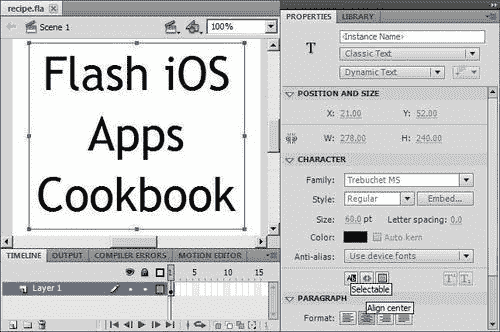
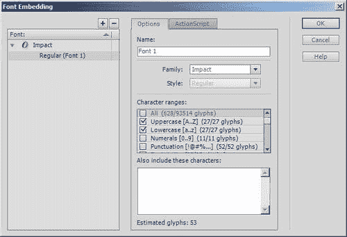
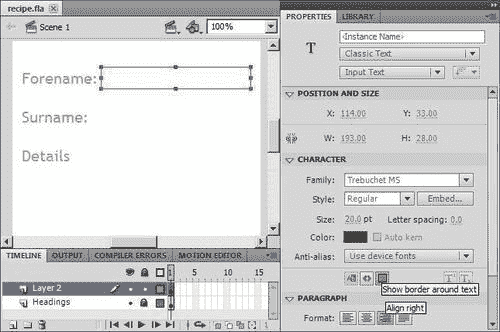
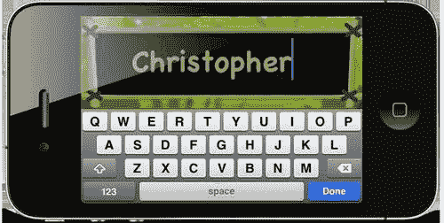

# 第七章. 使用文本和虚拟键盘

在本章中，我们将涵盖：

+   在文本字段中使用设备字体

+   在文本字段中使用嵌入式字体

+   提供文本输入

+   捕获文本输入

+   可配置的平移与虚拟键盘激活

+   更新动态文本字段

+   使用原生 iOS 文本控件

# 简介

由于没有物理按钮，iPhone 永远改变了我们输入文本的方式。之前的手机上的固定键盘配置已经消失；取而代之的是适应不同应用的触摸屏键盘。此外，iOS 附带了一个全面的字体库和令人印象深刻的文本渲染能力，允许用户输入以清晰的细节显示。

在本章中，您将探索 Flash 对原生 iOS 虚拟键盘的支持，并学习如何处理文本。

# 在文本字段中使用设备字体

iOS 设备上安装了全面的字体列表，可以直接在您的 AIR for iOS 应用中使用。

这个菜谱将指导您完成创建使用设备字体的文本字段的步骤。

## 准备工作

从本书的配套代码包中，在 Flash Professional 中打开`chapter7\recipe1\recipe.fla`。FLA 的舞台是空的，但其 AIR for iOS 设置已经应用，这为您在构建和部署到设备时节省了时间和精力。

## 如何做到...

执行以下步骤以利用设备字体：

1.  使用**文本工具（T）**在舞台上绘制一个文本字段。

1.  在文本字段中输入**Flash iOS Apps Cookbook**。

1.  从**属性**面板中，确保从最上面的两个下拉框中选择**经典文本**和**动态文本**。

1.  将文本字段定位在(21,52)。将其宽度和高度分别设置为 278 和 240。

1.  在属性面板中展开**字符**部分。将**家族**下拉框设置为**Trebuchet MS**，将**大小**设置为**60.0** pt，并将字体颜色更改为黑色。此外，选择**使用设备字体**作为**抗锯齿**字段，并确保直接下方的**可选中**图标未被选中。所有这些设置都在前面的屏幕截图中显示。

1.  最后，展开**段落**部分。将**格式**字段选择为**居中对齐**，并将**行为**字段的下拉框选择为**多行**。

1.  保存您的 FLA。

1.  发布 FLA 并在您的设备上安装 IPA。

## 它是如何工作的...

虽然 Flash 可以直接在您的 SWF 中嵌入字体，但 iOS 提供了自己的字体，可以替代使用。这些被称为**设备字体**，使用它们具有许多优点：

+   您应用的最终大小将会减小，因为不再需要 Flash 将字体符号直接包含在您的 SWF 中。

+   这将确保字体渲染与其他使用它的 iOS 应用完全相同

+   设备字体比 Flash 嵌入的字体在屏幕上渲染得更快

设备字体也有一些缺点，这可能会决定您是否可以在项目中使用它们：

+   无法直接将透明度应用于您的文本

+   如果文本字段已旋转，则嵌入的字体将无法渲染

如果您选择设备上可用的字体，请确保从**抗锯齿**字段中选择**使用设备字体**。字体还必须安装到您的开发计算机上，否则您将无法从 Flash Professional 中选择它们。

Flash 无法阻止您选择未实际安装到设备上的字体——它无法判断。如果您选择的字体不可用，则所有需要使用该字体的文本字段将默认为**_ 无衬线**。

设备字体可以与所有三种经典文本类型一起使用：静态、动态和输入文本。

## 还有更多...

为您的应用程序选择正确的字体很重要。首先，您需要知道哪些字体实际上是可用的。

### iOS 上的设备字体

无法从 Flash Professional 的 IDE 中判断哪些字体实际上已嵌入到您的设备中可能会带来问题。幸运的是，有几个应用程序可以列出设备上安装的字体，并允许您以各种点大小预览它们。大多数应用程序还允许您输入并预览自己的文本。

值得一看的两个应用程序是**Fast Fonts**和**Fonts**。两者都是免费的，可以从 iTunes 或 App Store 下载。

请注意，安装的字体数量在不同设备和 iOS 版本之间有所不同。例如，在 iOS 4.3 中，iPhone 上安装了 40 种字体家族，而 iPad 则有 57 种。在使用之前，请检查您希望针对的所有设备上字体的可用性。

以下是一些常用设备字体：

+   宋体：Times New Roman, Georgia, 和 _ 宋体

+   无衬线：Helvetica, Arial, Verdana, Trebuchet, Tahoma, 和 _ 无衬线

+   等宽：Courier, Courier New, 和 _ 打字机

要获取 iOS 最新版本上支持的所有字体的完整列表，请查看[iOS Fonts 网站](http://iosfonts.com.)。

### 列举可用的设备字体

可以确定设备上安装的字体。以下是一个简单的代码示例：

```swift
var f:Font;
var fonts:Array = Font.enumerateFonts(true);
for(var i:int = 0; i < fonts.length; i++)
{
f = fonts[i];
trace(f.fontName + "," + f.fontStyle + "," + f.fontType);
}

```

通过将`true`传递给静态`Font.enumerateFonts()`方法，您可以检索一个表示设备嵌入字体的`Font`实例数组。只需查询实例的`fontName, fontStyle`, 和 `fontType`属性，就可以了解更多关于该字体代表的信息。

此外，您在使用`Font`类之前需要导入`flash.text.Font`。要了解更多关于每个属性的信息，请在 Adobe Community Help 中搜索`Font`类。

### 像素密度

您的 iOS 设备的像素密度可能比典型监视器要高。在 Flash Professional 中工作时看起来合适的字体大小，在实际设备上可能太小。这尤其适用于针对 iPhone 4/4S 的 Retina 显示屏。Fast Fonts 等应用程序可以帮助您直接从您的设备中选择合适的大小。尽量不使用小于 14 磅的点大小。

### TLF 文本

Flash Professional CS5 引入了一个名为**文本布局框架（TLF）**的新文本引擎。虽然 TLF 与之前的经典文本引擎相比提供了更优越的文本布局功能，但由于框架的性能限制较重，不建议在针对 iOS 时使用它。本书不会涉及 TLF 文本。

## 参见

+   *在文本字段中使用嵌入的字体*

# 在文本字段中使用嵌入的字体

您最终可能需要使用未安装在您的设备上的字体。在这种情况下，您可以嵌入字体，使其在您的应用中正确渲染。

让我们看看如何做到这一点。

## 准备工作

启动 Flash Professional，并从书籍配套代码包中打开`chapter7\recipe2\recipe.fla`。FLA 的舞台是空的，但其 AIR for iOS 设置已经应用，一旦您准备好，您可以轻松发布。

## 如何做到这一点...

iOS 设备上未安装 Impact 字体。让我们创建一个文本字段，通过直接在您的应用中嵌入字体来使用它。

1.  选择**文本工具（T）**并在舞台上绘制一个文本字段。

1.  在文本字段中输入**Flash iOS Apps Cookbook**。

1.  在**属性**面板中，从最上面的两个下拉框中选择**经典文本**和**动态文本**。

1.  将文本字段定位在(21,52)。将其宽度和高度分别设置为 278 和 240。

1.  在属性面板中展开**字符**部分。将**家族**字段设置为**Impact**，将**大小**设置为**60.0** pt，并将字体颜色更改为黑色。同时，确保未选中**可选取**图标。

1.  在**字符**部分中保持，将**抗锯齿**字段设置为**可读性抗锯齿**。可能会出现一个**字体嵌入警告**对话框，指出您需要选择要嵌入的字体和字符。如果是这样，请点击其**嵌入**按钮打开**字体嵌入**面板。如果不是，请简单地点击**样式**字段旁边的**嵌入**按钮打开面板，如图所示：

1.  在**字体嵌入**面板中，在**字符范围**列表中检查**大写[A..Z]**和**小写[a..z]**复选框。点击**确定**按钮关闭面板。

1.  现在在**属性**面板中展开**段落**部分。将**格式**字段选择为**居中对齐**，并将**行为**字段的下拉框选择为**多行**。

1.  保存您的 FLA 文件。

1.  发布 FLA 并在您的设备上安装 IPA。

## 它是如何工作的...

您计算机上安装的任何字体都可以嵌入到您的 SWF 中。这将允许字体在您的应用程序中正确渲染，即使它无法直接从您的设备获取。

您可以从字体嵌入面板管理您想要嵌入的字体，该面板通过在属性面板上单击**嵌入**按钮启动。从这里，您还可以设置您希望包含的特定字体的字符范围。您只选择所需的字符非常重要，因为随着您添加的字形符号数量的增加，您的应用程序文件大小会增加。此外，您还可以从该面板导出用于 ActionScript 的字体。

嵌入的字体可以与所有经典文本字段类型一起使用。然而，当使用静态文本字段时，您无法控制嵌入到您的 SWF 中的字符范围。相反，Flash 只是包括字段中出现的字符。

当使用嵌入的字体时，请确保文本字段的**抗锯齿**选项设置为除**使用设备字体**之外的内容。将其设置为**使用设备字体**实际上不会嵌入字体，而是假设该字体已安装在与设备一起。

只有当字体在设备上不可用且没有合适的替代设备字体可以使用时，才嵌入字体。嵌入的字体会增加应用程序的大小，并且在大多数情况下不如设备字体渲染得快。

## 更多内容...

您应该仔细管理嵌入的字体，并尽量保持您的应用程序文件大小尽可能小。

### 大小考虑

当该字体无法直接从设备获取时，嵌入字体是有用的。然而，嵌入的字体可能会影响您应用程序的最终大小。

您可以从 Flash 生成大小报告，该报告提供了您 SWF 中所有资产的分析以及它们消耗的 SWF 文件大小。此报告还将包括每个嵌入字体的尺寸信息。只需转到**发布设置**面板并勾选**生成大小报告**复选框。Flash CS5 用户应首先在**发布设置**面板中的**Flash**选项卡上单击。

当您发布 FLA 时，将生成一个大小报告，并在**输出**面板中显示。在报告中有一个部分，您可以查看嵌入的字体及其字符集的列表。每个字体使用的字节数也会显示出来。

以下是从该食谱的 FLA 的大小报告中获取的结果：

```swift
Font Name Bytes Characters
--------- ---------- ----------
Impact 6606 ABCDEFGHIJKLMNOPQRSTUVWXYZabcdefghijk lmnopqrstuvwxyz

```

如您所见，大约需要 7 KB 来存储这个字体的字符集。

返回字体嵌入面板，通过检查**字符范围**列表中的第一个复选框来包含所有字体的字形。

重新发布 FLA 并查看新的大小报告。现在字体几乎消耗了 47 KB！

### 注意

重要的是，您只需包含所需的字体，并且将每个字体的字符集保持到绝对最小。由于对嵌入字体的管理不善，您的应用程序最终文件大小可能会迅速增加。

## 相关内容

+   *在文本字段中使用设备字体*

# 提供文本输入

所有 iOS 设备都放弃了物理键盘，转而使用虚拟触摸屏等效物。AIR 提供了虚拟键盘支持，使用户能够在输入文本字段中输入文本。

让我们看看这是如何操作的。

## 准备工作

已提供一个 FLA 文件作为此菜谱的起点。

从书籍的配套代码包中，在 Flash Professional 中打开`chapter7\recipe3\recipe.fla`。

阶段上已经放置了三个静态文本字段，将作为标签使用。我们将在舞台上添加三个输入文本字段，将每个标签与一个字段关联。

## 如何操作...

执行以下步骤以创建三个输入文本字段：

1.  通过选择**插入** | **时间轴** | **图层**在时间轴上创建一个新的图层。

1.  从工具面板中选择**文本工具（T）**。

1.  在新创建的图层上，绘制一个文本字段，紧邻**名字**文本字段，如图所示：

1.  从**属性**面板中，从最上面的两个下拉框中选择**经典文本**和**输入文本**。

1.  扩展属性面板的**字符**部分。将**家族**下拉框设置为**Trebuchet MS**，将**大小**设置为**20.0** pt，并将文本颜色设置为黑色。此外，将**抗锯齿**字段设置为**使用设备字体**，并选择**显示文本周围的边框**图标。

1.  将文本字段定位在（114,33）处，并设置其大小为 193x28。

1.  扩展**段落**部分。通过选择**右对齐**图标设置**格式**，并从**行为**下拉框中选择**单行**。

1.  创建一个与第一个类似的第二个输入文本字段。将其定位在**姓氏**标签旁边（114,83），并将**格式**字段设置为**居中对齐**。

1.  最后，在**详情**标签下方直接绘制第三个输入文本字段。将其定位在（11,174）处，并设置其大小为 298x154。在**段落**部分中，为**格式**字段选择**左对齐**图标，并从**行为**下拉框中选择**多行**。

1.  保存您的 FLA 文件。

1.  发布 FLA 并在您的设备上安装 IPA。

1.  运行应用程序并输入每个字段中的文本。

## 它是如何工作的...

当用户触摸任何输入文本字段时，虚拟键盘将自动出现。许多原生 iOS 应用程序提供的相同功能也直接来自您的输入文本字段，包括预测文本和清除字段的按钮。在 iOS 4 或更高版本上运行的应用程序也将受益于复制和粘贴支持。

前两个字段是单行的，如果已输入文本，将在右侧提供清除按钮。然而，如果文本字段太窄，则不会显示按钮。

当您完成在单行文本字段中输入文本后，您可以通过点击**完成**键或点击文本字段外部的任何地方来关闭虚拟键盘。

### 注意

如果您使用 Flash Professional CS5 构建了您的应用，那么您会注意到，当输入文本时，**名**和**姓**字段的对齐设置被忽略。当使用 AIR 2.0 SDK 时，iOS 中的输入文本字段仅支持左对齐。因此，当与 CS5 一起工作时，建议您不要选择其他对齐方式。

当编辑多行的**详细信息**字段时，虚拟键盘不提供**完成**键。取而代之的是，在其位置上有一个**回车**键，允许用户跳到下一行。要关闭编辑多行输入文本字段时的虚拟键盘，用户必须点击字段外的任何地方。不幸的是，这并不是 iOS 应用的常规做法，可能会让用户感到困惑。另外，请确保包含一个用户可以点击的区域。如果字段太大，那么用户可能无法关闭键盘。

输入文本字段的位置很重要。如果您要编辑的字段位于虚拟键盘使用的区域，那么 AIR 将在运行时调整舞台的位置。您可以通过尝试编辑**详细信息**输入文本字段来看到这一点。舞台将被平移，以确保字段不被遮挡。然而，**名**和**姓**输入字段却被推出了视图，为**详细信息**腾出空间。

### 小贴士

在设计您的应用程序时，请考虑键盘所占用的区域以及在此区域内编辑文本字段的影响。

您还应该确保您的多行文本字段的高度不超过虚拟键盘升起后剩余的高度，因为文本字段滚动不是直接提供的。

### 小贴士

为了提高性能和渲染质量，请在您的输入文本字段中使用设备字体而不是嵌入的字体。

## 更多内容...

虚拟键盘及其许多文本编辑功能的激活是免费的。但如果你想要更多的控制呢？

### 键盘类型

与使用 iOS SDK 开发原生应用的开发者可以配置显示的键盘类型不同，当与输入文本字段一起工作时，AIR 目前不提供此类控制。您只能限制为两种非常相似的布局——一个用于单行输入字段，另一个用于多行。

如果虚拟键盘不符合您的要求，那么请考虑使用 AIR 3.0 提供的原生 iOS 文本控件。这样做将为您提供访问更多键盘配置的权限。有关更多详细信息，请参阅本章末尾的*使用原生 iOS 文本控件*配方。

### 以编程方式启动虚拟键盘

当用户点击输入文本字段时，虚拟键盘会自动启动。但是，有时您可能需要使用 ActionScript 代码来程序化地启动键盘。

在 AIR 2.6 及以上版本中，您可以通过将文本字段的 `needsSoftKeyboard` 属性设置为 `true` 并调用其 `requestSoftKeyboard()` 方法来强制虚拟键盘出现。以下是一个示例代码，通过将焦点设置到实例名为 `forename` 的文本字段上来启动虚拟键盘。

```swift
forename.needsSoftKeyboard = true;
var success:Boolean = forename.requestSoftKeyboard();

```

`requestSoftKeyboard()` 方法返回一个布尔值，指示虚拟键盘是否成功弹出。

如果您正在使用 Flash Professional CS5 和 AIR 2.0，则可以通过使用 `Stage` 类的 `focus` 属性来强制虚拟键盘出现。以下是一个使用实例名为 `forename:` 的文本字段的示例代码：

```swift
stage.focus = forename;

```

记住，您可以从任何 `DisplayObject`（包括您的文档类）中检索到舞台的引用。`DisplayObject` 类提供了一个 `stage` 属性，您可以访问它。

## 相关内容

+   *捕获文本输入*

+   *可配置的滚动与虚拟键盘激活*

+   *使用原生 iOS 文本控件*

# 捕获文本输入

您可以获取任何非静态文本字段中存储的文本。这对于输入文本字段尤其有用，因为应用程序可能希望立即响应用户的输入或收集信息以供以后使用。

本食谱将向您展示如何捕获用户输入。

## 准备工作

从书籍的配套代码包中，将 `chapter7\recipe4\recipe.fla` 打开到 Flash Professional 中。

一个名为 `submit` 的输入文本字段位于舞台上。在其下方是一个名为 `echo` 的动态文本字段。

我们将编写一些 ActionScript 代码来捕获用户在 `submit` 字段中输入的任何文本，并在 `echo` 字段中显示它。

## 如何操作...

执行以下步骤：

1.  创建一个名为 `Main` 的文档类。

1.  在类中监听 `submit` 输入字段发出的 `FocusEvent.FOCUS_OUT` 事件。您还需要添加对 `FocusEvent` 类的导入语句：

    ```swift
    package {
    import flash.display.MovieClip;
    import flash.events.FocusEvent;
    public class Main extends MovieClip {
    public function Main() {
    submit.addEventListener(FocusEvent.FOCUS_OUT,
    focusLost);
    }
    }
    }

    ```

1.  现在，添加一个处理 `FOCUS_OUT` 事件的处理器：

    ```swift
    private function focusLost(e:FocusEvent):void {
    echo.text = e.target.text;
    }

    ```

1.  保存类，并在提示时将文件命名为 `Main.as`。

1.  最后保存并编译 FLA 文件。在您的设备上测试应用程序。

您在输入文本字段中输入的任何文本都会被回显到下面的动态文本字段中。这将在您点击输入字段外部时发生。

## 它是如何工作的...

动态字段和输入字段都提供了一个 `text` 属性，可以用来获取或设置它们的当前文本。然而，在我们能够获取 `submit` 字段的文本之前，我们需要知道用户是否已经完成输入。我们可以通过监听 `FOCUS_OUT` 事件来判断，该事件是由输入文本字段在用户执行以下操作时触发的：

+   用户在文本字段边界之外的屏幕上触摸

+   用户点击虚拟键盘的 **完成** 键

在这个食谱的代码中，`focusLost()`处理程序响应`submit`字段的`FOCUS_OUT`事件。它将`echo`字段中的文本设置为`submit`字段的文本。以下又是处理程序的代码：

```swift
private function focusLost(e:FocusEvent):void {
echo.text = e.target.text;
}

```

`submit`字段实际上是通过`FocusEvent`参数的`target`属性访问的。我们可以这样做，因为`FOCUS_OUT`事件是从`submit`字段发出的，使其成为事件的目标。或者，我们也可以忽略实际的`FocusEvent`参数，直接使用以下代码片段直接访问`submit`字段：

```swift
private function focusLost(e:FocusEvent):void {
echo.text = submit.text;
}

```

如食谱所示，在字段中检索和设置文本的机制是微不足道的。然而，在捕获用户的文本输入时，您首先需要确保用户已经完成输入。

如需更多信息，请在 Adobe 社区帮助中搜索`flash.text.TextField`和`flash.events.FocusEvent`。

## 更多内容...

在我们继续之前，以下是一些额外的信息。

### 监听焦点

除了`FocusEvent.FOCUS_OUT`，您还可以监听`FOCUS_IN`事件，这会告诉您用户何时触摸输入文本字段。如果您需要在用户开始输入文本之前执行任何准备工作，这很理想。例如，您可能想在用户开始键入之前清除字段中的当前文本。让我们继续实现这一点。

在您的文档类的构造函数中，监听`FOCUS_IN`事件：

```swift
submit.addEventListener(FocusEvent.FOCUS_IN, clearField);

```

现在添加一个事件处理程序，它简单地清除文本字段：

```swift
private function clearField(e:FocusEvent):void {
e.target.text = "";
}

```

保存类并测试您设备上最新版本的 app。

## 参见

+   *提供文本输入*

# 配置虚拟键盘激活时的平移

当用户触摸输入文本字段时，虚拟键盘会自动出现。如果文本字段位于键盘使用的区域中，则舞台将自动平移以防止文本字段被遮挡。然而，可以关闭此默认行为并自行修改布局以响应键盘的激活。

这里涵盖的步骤仅适用于使用 Flash Professional CS5.5 和 AIR 2.6 或更高版本的用户。

## 准备工作

已提供一个 FLA 作为起点。

从本书的配套代码包中，将`chapter7\recipe5\recipe.fla`打开到 Flash Professional 中。

舞台中心是一个名为`field`的输入文本字段。我们将编写一些 ActionScript 来在虚拟键盘激活时重新定位此文本字段。

## 如何操作...

首先，您需要从应用程序描述文件中关闭自动平移。

1.  从 Flash Professional CS5.5 中选择**文件** | **打开**。从文件浏览器中，选择与 FLA 相同的文件夹中的`recipe-app.xml`。

1.  将以下行添加到描述文件的 XML 中：

    ```swift
    <initialWindow>
    <content>recipe.swf</content>
    <systemChrome>standard</systemChrome>
    <transparent>false</transparent>
    <visible>true</visible>
    <fullScreen>true</fullScreen>
    <aspectRatio>portrait</aspectRatio>
    <renderMode>gpu</renderMode>
    <autoOrients>false</autoOrients>
    <softKeyboardBehavior>none</softKeyboardBehavior>
    </initialWindow>

    ```

1.  保存文件。

1.  现在，为您的 FLA 创建一个文档类，并将其命名为`Main`。

1.  添加以下导入语句：

    ```swift
    import flash.display.MovieClip;
    import flash.events.SoftKeyboardEvent;
    import flash.geom.Rectangle;

    ```

1.  在构造函数中，监听虚拟键盘的激活和关闭：

    ```swift
    public function Main() {
    stage.addEventListener(
    SoftKeyboardEvent.SOFT_KEYBOARD_ACTIVATE, activate);
    stage.addEventListener(
    SoftKeyboardEvent.SOFT_KEYBOARD_DEACTIVATE, deactivate);
    }

    ```

1.  为`SOFT_KEYBOARD_ACTIVATE`事件添加一个处理程序。当虚拟键盘被激活时，它将被调用，并将输入文本字段定位在键盘边界之外：

    ```swift
    private function activate(e:SoftKeyboardEvent):void {
    var keysRect:Rectangle = stage.softKeyboardRect;
    if(field.y + field.height > keysRect.top)
    {
    offset = field.y + field.height - keysRect.top;
    field.y -= offset;
    }
    else
    {
    offset = 0;
    }
    }

    ```

1.  `activate()`处理程序计算文本字段需要垂直移动多少像素才能定位在键盘边界区域外。这个值存储在一个名为`offset`的成员变量中。在你的类中声明`offset`成员变量：

    ```swift
    public class Main extends MovieClip {
    private var offset:Number;
    public function Main() {

    ```

1.  最后，当键盘移除时，我们需要将文本字段放回其原始位置。`SOFT_KEYBOARD_DEACTIVATE`事件的处理程序将使用`offset`成员变量来处理这个问题：

    ```swift
    private function deactivate(e:SoftKeyboardEvent):void {
    field.y += offset;
    }

    ```

1.  保存该类，并在提示时将文件命名为`Main.as`。也要保存您的 FLA 文件。

1.  发布应用程序并在您的设备上测试它。

当您选择输入文本字段时，虚拟键盘将会显示，并且字段将被重新定位在它上方。在字段外轻触会将它放回键盘离开屏幕后的原始位置。

## 它是如何工作的...

通常，如果虚拟键盘遮挡了具有焦点的输入文本字段，舞台会自动平移。然而，我们通过将应用程序描述文件中的`softKeyboardBehavior`元素设置为`none:`来禁用了这种默认行为：

```swift
<softKeyboardBehavior>none</softKeyboardBehavior>

```

### 注意

**软键盘**这个术语指的是软件键盘，它是 AIR 对 iOS 使用的虚拟键盘的通用术语。

关闭自动平移后，我们可以在用户轻触输入文本字段时更改应用程序的布局，并在用户完成输入后将其改回。

为了做到这一点，我们监听了以下两个从舞台发出的事件：

+   `SoftKeyboardEvent.SOFT_KEYBOARD_ACTIVATE`

+   `SoftKeyboardEvent.SOFT_KEYBOARD_DEACTIVATE`

当虚拟键盘出现在屏幕上时，会触发`SOFT_KEYBOARD_ACTIVATE`事件。正是响应这个事件，我们重新定位输入文本字段。当用户在输入文本字段外轻触或按下**完成**键时，虚拟键盘会被关闭，并发出`SOFT_KEYBOARD_DEACTIVATE`事件。当我们捕获这个事件时，我们将输入文本字段放回其原始位置。

虽然为这两个事件硬编码文本字段的定位是完全可以接受的，但我们的示例代码更进一步，在键盘关闭后动态地将文本字段移出键盘占据的区域，然后再将其移回。

它首先检查输入文本字段是否在键盘的边界区域内。如果是的话，它会通过计算需要偏移多少来将文本字段定位在键盘上方。以下又是代码：

```swift
private function activate(e:SoftKeyboardEvent):void {
var keysRect:Rectangle = stage.softKeyboardRect;
if(field.y + field.height > keysRect.top)
{
offset = field.y + field.height - keysRect.top;
field.y -= offset;
}
else
{
offset = 0;
}
}

```

虚拟键盘的边界区域是从 `Stage.softKeyboardRect` 获取的，它表示被虚拟键盘覆盖的舞台区域。使用此属性时要小心，因为它在键盘不可见时将返回零的大小。此外，请注意，偏移量存储在我们的 `offset` 成员变量中，如果文本字段不在键盘的边界内，它将被设置为零。

最后，当虚拟键盘关闭时，我们使用 `offset` 成员变量的值将文本字段移回：

```swift
private function deactivate(e:SoftKeyboardEvent):void {
field.y += offset;
}

```

更多信息，请在 Adobe Community Help 中搜索 `flash.events.SoftKeyboardEvent` 和 `Stage.softKeyboardRect`。

## 还有更多...

你可能会对以下信息感兴趣。

### 相关对象

`SoftKeyboardEvent` 类提供了 `relatedObject` 属性，它包含之前有焦点的 `InteractiveObject`。当你监听 `SoftKeyboardEvent.DEACTIVATE` 时，这很有用，因为你将能够确定用户最后编辑的是哪个输入文本字段。

# 更新动态文本字段

渲染文本很昂贵，可能会降低应用程序的整体性能。这在第一代和第二代 iPhone 和 iPod touch 等较老设备上尤为明显，因为每个 CPU 周期都很重要。尽量减少更新的文本数量和更新频率。

让我们看看如何实现这一点。

## 准备工作

在书籍的配套代码包中，提供了一个 FLA 文件，位于 `chapter7\recipe6\recipe.fla`。

你会在舞台上找到两个文本字段。第一个是静态的，包含文本 **已过时间:**。第二个是动态的，包含一个零，并且有一个实例名称 `timerField`。

我们将编写一些 ActionScript 代码，以持续更新 `timerField`，显示自应用程序启动以来已过的秒数。

## 如何实现...

让我们按照以下步骤进行操作：

1.  创建一个文档类，并将其命名为 `Main`。

1.  我们将需要两个成员变量。一个用于存储应用程序启动时的时间，另一个用于存储已过秒数。让我们也在类的构造函数中初始化这两个变量：

    ```swift
    package {
    import flash.display.MovieClip;
    public class Main extends MovieClip {
     private var startTime:Date;
    private var elapsed:uint; 
    public function Main() {
     startTime = new Date();
    elapsed = 0; 
    }
    }
    }

    ```

1.  我们将使用循环来计算已过的秒数，并使用该值更新 `timerField`。该循环将在每一帧重绘时被调用。

    首先，添加一个监听器 `Event.ENTER_FRAME`，并添加一个对 `Event` 类的导入语句：

    ```swift
    package {
    import flash.display.MovieClip;
    import flash.events.Event;
    public class Main extends MovieClip {
    private var startTime:Date;
    private var elapsed:uint;
    public function Main() {
    startTime = new Date();
    elapsed = 0;
    addEventListener(Event.ENTER_FRAME, update);
    }
    }
    }

    ```

1.  现在，添加将作为更新循环的事件处理程序：

    ```swift
    private function update(e:Event):void {
    var currTime:Date = new Date();
    var prevElapsed:uint = elapsed;
    elapsed = (currTime.getTime()-startTime.getTime()) / 1000;
    if(elapsed != prevElapsed)
    {
    timerField.text = String(elapsed);
    }
    }

    ```

1.  保存类，并在提示时将文件命名为 `Main.as`。保存 FLA 文件。

1.  编译应用程序并将其部署到您的设备上。

当你测试应用程序时，你应该看到动态文本字段持续更新为已过秒数。

## 工作原理...

虽然在每次`ENTER_FRAME`事件上都会调用`update()`处理程序，但我们只在实际改变时在文本字段中设置经过的时间。一个常见的错误是反复将相同的字符串写入文本字段，这是不必要的，并且会降低性能。我们通过以下`if`语句来防止这种情况：

```swift
if(elapsed != prevElapsed)
{
timerField.text = String(elapsed);
}

```

基本上，只有当经过的秒数与上一次循环调用中使用的值不同时，文本字段才会更新。对于此配方来说，这意味着文本字段每秒只更新一次，而不是每秒 24 次（FLA 的帧率）。这是一个重大的节省。

除了减少文本字段更新的频率外，我们还可以通过仅设置需要更改的字符来提高性能。此配方中的两个文本字段可以很容易地用一个字段表示。如果我们采取这种方法，那么更新字段所需的代码将看起来像这样：

```swift
timerField.text = "Elapsed Time: " + elapsed;

```

当然，这是浪费的，因为**经过时间**字符串会每次都写入文本字段。仅在其自己的单独文本字段中显示和更新时间有助于进一步提高此配方应用的性能。

虽然这些建议可能看起来很明显，但习惯于针对 Flash 和 AIR 桌面运行时的开发者往往会忽略它们。在为 iOS 开发时，每一项节省都很重要，这对于文本同样适用，即使是少量文本也可能对性能产生重大影响。

## 还有更多...

以下可能有助于你获得更多的性能提升。

### 设备字体

此配方使用了嵌入式字体。然而，通过使用直接安装在 iOS 设备上的字体，可以进一步节省空间。这不仅会减小你的 SWF 文件大小，还会提高性能，因为设备字体渲染到屏幕上的速度比嵌入式字体快。此外，在嵌入字体之前，检查该字体是否在设备上可用。

### 追加文本

将字符串追加到文本字段末尾是另一个常见的任务，可能会很昂贵。这通常使用连接赋值运算符（+=）来完成，以下是一个简单的示例：

```swift
textField.text = "Hello ";
textField.text += "Christopher";

```

然而，`TextField`类提供了`appendText()`方法，它执行此操作的速度要快得多：

```swift
textField.text = "Hello ";
textField.appendText("Christopher");

```

如果你正在追加文本，那么请使用这种方法而不是连接赋值运算符。

### 用位图替换文本字段

在性能至关重要的地方，使用位图来表示文本。

例如，考虑一个用户得分不断更新的游戏。使用动态文本字段可能会损害性能。相反，编写一些 ActionScript 来显示和排列每个数字的位图表示。虽然这需要更多的编码工作，但通常使用位图会比使用由复杂矢量形状构成的字体表现更好。

### 缓存为位图

文本字段可以被缓存为位图，防止它在某些情况下被重新渲染，并提供性能提升。文本字段的缓存不能从 Flash IDE 中应用，而必须使用 ActionScript 来完成。使用`cacheAsBitmap`和`cacheAsBitmapMatrix`属性，这些属性对`TextField`类可用。位图缓存不能直接应用于静态文本字段。

更多信息，请参阅第六章中的*使用位图缓存*和*使用位图缓存矩阵*配方。

## 参见

+   *使用更新循环，第三章*

+   *在文本字段中使用设备字体*

+   *在文本字段中使用嵌入式字体*

# 使用原生 iOS 文本控件

AIR 3.0 引入了`StageText`类，它提供了对 iOS 原生文本输入控件和自定义虚拟键盘的能力。

让我们看看如何创建一个原生文本输入字段并指定在执行文本输入时启动的虚拟键盘类型。

这里涵盖的步骤仅适用于使用 AIR 3.0 及以上版本的用户。如果你使用 Flash Professional CS5，那么你将无法尝试这个配方，因为它仅支持 AIR 2.0。

## 准备工作

已提供一个 FLA 作为起点。从本书的配套代码包中，将`chapter7\recipe7\recipe.fla`打开到 Flash Professional CS5.5 中。

阶段上有一个背景位图图像。我们将编写一些 ActionScript 来叠加一个原生文本输入字段，当点击时将启动一个配置为输入人名的虚拟键盘。

## 如何做到这一点...

我们将通过以下步骤大量使用`flash.text`包中找到的类：

1.  创建一个文档类并将其命名为`Main`。

1.  将以下导入语句添加到类中：

    ```swift
    import flash.display.MovieClip;
     import flash.events.FocusEvent;
    import flash.geom.Rectangle;
    import flash.text.ReturnKeyLabel;
    import flash.text.SoftKeyboardType;
    import flash.text.StageText;
    import flash.text.TextFormatAlign;
    import flash.text.engine.FontWeight; 

    ```

1.  声明一个`StageText`成员变量：

    ```swift
    private var nativeText:StageText;

    ```

1.  现在在构造函数中创建并初始化一个原生文本输入字段。作为初始化的一部分，我们将确保它包含提示用户输入他们名字的文本：

    ```swift
    public function Main() {
    nativeText = new StageText();
    nativeText.stage = stage;
    nativeText.viewPort = new Rectangle(30, 28, 420, 116);
    nativeText.fontFamily = "ChalkboardSE-Bold";
    nativeText.fontSize = 50;
    nativeText.color = 0xB88858;
    nativeText.fontWeight = FontWeight.BOLD;
    nativeText.textAlign = TextFormatAlign.CENTER;
    nativeText.text = "enter name";
    nativeText.maxChars = 11;
    nativeText.softKeyboardType = SoftKeyboardType.CONTACT;
    nativeText.returnKeyLabel = ReturnKeyLabel.DONE;
    }

    ```

1.  此外，通过添加以下高亮代码来监听用户触摸时文本字段获得焦点的事件：

    ```swift
    nativeText.returnKeyLabel = ReturnKeyLabel.DONE;
    nativeText.addEventListener(FocusEvent.FOCUS_IN, focusIn);
    }

    ```

1.  当它获得焦点时，我们将移除字段的默认文本，使用户能够直接输入他们的名字，而无需先删除字符。以下代码片段是该事件处理程序：

    ```swift
    private function focusIn(e:FocusEvent):void {
    if(nativeText.text == "enter name")
    {
    nativeText.text = "";
    }
    }

    ```

1.  保存类，并在提示时将文件命名为`Main.as`。

1.  返回到你的 FLA 并保存它。现在发布应用程序并在你的设备上测试它。



点击**输入名字**文本字段并使用虚拟键盘输入文本。按**完成**键提交更改。

## 它是如何工作的...

`StageText` 类允许将原生 iOS 文本输入字段添加到应用程序中。与 Flash 的 Classic 和 TLF 文本字段类型不同，`StageText` 提供了在 iOS 上找到的相同用户交互行为，例如放大、文本选择、自动大写、自动更正和虚拟键盘自定义。

然而，尽管可以使用 IDE 的工具面板添加 Classic 和 TLF 文本字段，但每个 `StageText` 实例都必须通过编程方式添加、定位和调整大小。以下代码片段展示了这一点：

```swift
nativeText = new StageText();
nativeText.stage = stage;
nativeText.viewPort = new Rectangle(30, 28, 420, 116);

```

在此代码片段中，使用 `stage` 属性添加文本字段——`StageText` 对象不能添加到显示列表中，而必须直接附加到舞台。通过传递一个 `Rectangle` 对象到其 `viewPort` 属性来指定文本字段的位置和大小。此外，所有 `StageText` 实例都将出现在显示列表中的内容上方，并且它们的深度无法排序。因此，建议您避免重叠原生文本字段。

`fontFamily` 属性用于指定要使用的设备字体——不能使用嵌入的 Flash 字体。在指定设备字体时，请确保它在您希望针对的所有 iOS 设备上可用。

可以使用 `text` 属性设置原生文本字段中显示的当前文本，如果字段允许用户输入，则可以使用 `maxChars` 限制字符数。

最后，使用 `softKeyboardType` 属性设置输入文本时要使用的键盘类型。可以通过使用 `returnKeyLabel` 来进一步配置键盘，以指定其返回键的标签：

```swift
nativeText.softKeyboardType = SoftKeyboardType.CONTACT;
nativeText.returnKeyLabel = ReturnKeyLabel.DONE;

```

`SoftKeyboardType` 类提供的常量用于指定键盘类型，而 `ReturnKeyLabel` 类表示可用于返回键的各种不同标签。此代码指定了一个配置为姓名输入的键盘，其返回标签设置为**完成**。

如果字段的 `editable` 属性设置为 `true`（默认情况下是如此），则当用户触摸它时将显示虚拟键盘。

如需更多信息，请在 Adobe Community Help 中搜索 `flash.text.StageText`。

## 还有更多...

在我们离开这一章之前，这里有一些关于原生文本输入字段和虚拟键盘的附加细节。

### 虚拟键盘类型

支持的虚拟键盘类型在 `flash.text.SoftKeyboardType` 类中指定为公共常量，以下列出以供您方便参考：

+   `CONTACT:` 适用于输入人名或电话号码

+   `DEFAULT:` 默认键盘配置

+   `EMAIL:` 此配置适用于电子邮件地址的输入

+   `NUMBER:` 数字键盘

+   `PUNCTUATION:` 适用于包含标点的文本输入

+   `URL:` 优化用于 URL 输入

### 返回键标签类型

`flash.text.ReturnKeyLabel` 类提供了以下常量，可用于设置虚拟键盘的返回键：`DEFAULT, DONE, GO, NEXT` 和 `SEARCH`。

### 枚举设备字体

通过将 `true` 传递给 `flash.text.Font.enumarateFonts()` 静态方法，您可以枚举设备的可用字体。这将让您知道，在设置原生文本输入字段的 `fontFamily` 属性时，您可以从哪些字符串中进行选择。

### 事件

与 `StageText` 实例交互时，可能会触发以下事件：

+   `FocusEvent.FOCUS_IN:` 原生文本输入字段已获得焦点

+   `FocusEvent:FOCUS_OUT:` 原生文本输入字段已失去焦点

+   `KeyboardEvent.KEY_DOWN:` 一个虚拟键已被按下

+   `KeyboardEvent.KEY_UP:` 一个虚拟键已被释放

+   `SoftKeyboardEvent.SOFT_KEYBOARD_ACTIVATING:` 虚拟键盘正在被激活，并且目前正在进入视图

+   `SoftKeyboardEvent.SOFT_KEYBOARD_ACTIVATE:` 虚拟键盘已被激活，现在可以与 `SoftKeyboardEvent.SOFT_KEYBOARD_ACTIVATE` 进行交互

+   `SoftKeyboardEvent.SOFT_KEYBOARD_DEACTIVATE:` 虚拟键盘已被停用

### 自动更正和自动大写

您可以通过将您的 `StageText` 对象的 `autoCorrect` 和 `autoCapitalize` 属性设置为 `true` 来启用 iOS 的自动更正和自动大写功能。

## 参见

+   *在文本字段中使用设备字体*

+   *配置虚拟键盘激活时的可滚动*
