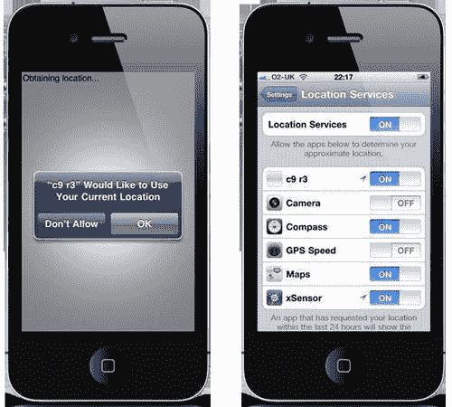

# 第九章。地理位置和加速度计 API

在本章中，我们将介绍：

+   确定当前位置

+   确定速度和航向

+   检查地理位置访问权限

+   响应加速度计变化

+   检测震动

# 简介

iOS 系列设备使用许多内置传感器，包括三轴加速度计、数字指南针、摄像头、麦克风和全球定位系统（GPS）。它们的加入为开发者创造了一个世界，并导致了一系列创新、创意和有趣的应用程序，这些应用程序为 App Store 的压倒性成功做出了贡献。

本章将重点介绍两种最流行的传感器——加速度计和 GPS；两者都由 AIR 为 iOS 提供支持。

加速度计测量重力加速度，能够检测物理方向、运动和振动。虽然最初被许多人视为一种花招，但随着平台的演变，其用途变得越来越复杂。从游戏到遥控器，从绘图软件到声音生成，加速度计已成为许多应用程序的首选输入方法。

像 iPhone 这样的设备也具有位置感知功能；其 GPS 接收器能够确定其在世界上的位置。可以跟踪运动，获取当前速度，甚至可以确定设备面向的方向。除了地图服务外，位置服务还在各种领域找到其应用，从摄影到消息客户端。

AIR 提供了 API，允许访问设备传感器收集的加速度计和位置数据。加速度计的支持由`flash.sensors.Accelerometer`类提供，而`flash.sensors.Geolocation`用于编写位置感知应用程序。

# 确定当前位置

iOS 系列设备具有位置感知功能，允许确定你的大致地理位置。这是如何实现的取决于设备中存在的硬件。例如，原始 iPhone、所有型号的 iPod touch 和仅 Wi-Fi 的 iPad 使用 Wi-Fi 网络三角测量法来提供位置信息。其余设备可以使用内置的 GPS 芯片或手机塔三角测量法更精确地计算其位置。

AIR SDK 提供了一层抽象，允许你以硬件无关的方式提取位置信息，这意味着你可以使用相同的代码在任何 iOS 设备上访问信息。

此配方将指导你完成确定当前位置所需的步骤。

## 准备工作

已提供 FLA 作为此配方的起点。

从 Flash Professional 中，打开书附带代码包中的`chapter9\recipe1\recipe.fla`。

你将找到六个动态文本字段，它们位于舞台上。我们将用从设备获取的位置数据填充每个字段。

## 如何操作...

执行以下步骤以监听和显示地理位置数据：

1.  创建一个文档类并将其命名为`Main`。

1.  导入以下类并添加一个类型为`Geolocation`的成员变量：

    ```swift
    package {
    import flash.display.MovieClip;
     import flash.events.GeolocationEvent;
    import flash.sensors.Geolocation; 
    public class Main extends MovieClip {
     private var geo:Geolocation; 
    public function Main() {
    // constructor code
    }
    }
    }

    ```

1.  在类的构造函数中，实例化一个`Geolocation`对象并监听它的更新：

    ```swift
    public function Main() {
    if(Geolocation.isSupported)
    {
    geo = new Geolocation();
    geo.setRequestedUpdateInterval(1000);
    geo.addEventListener(GeolocationEvent.UPDATE, geoUpdated);
    }
    }

    ```

1.  现在，编写一个事件处理程序，它将获取更新的地理位置数据并将其填充到动态文本字段中：

    ```swift
    private function geoUpdated(e:GeolocationEvent):void {
    latitudeField.text = e.latitude.toString();
    longitudeField.text = e.longitude.toString();
    altitudeField.text = e.altitude.toString();
    hAccuracyField.text = e.horizontalAccuracy.toString();
    vAccuracyField.text = e.verticalAccuracy.toString();
    timestampField.text = e.timestamp.toString();
    }

    ```

1.  将类文件保存为`Main.as`，位于与 FLA 相同的文件夹中。返回到 FLA 并保存它。

1.  在您的设备上发布和测试应用。

1.  首次启动时，将出现一个带有以下提示的原生 iOS 对话框：

    **"c9 r1" 希望使用您的当前位置**

    点击**确定**按钮以授予您的应用访问设备位置数据的权限。

### 小贴士

运行 iOS 4 或更高版本的设备将记住您的选择，而运行较旧版本 iOS 的设备将在每次应用启动时提示您。

位置数据将在屏幕上显示并定期更新。带着您的设备移动，您将看到数据随地理位置变化而变化。

## 它是如何工作的...

AIR 在`flash.sensors`包中提供了`Geolocation`类，允许从您的设备检索位置数据。要访问数据，创建一个`Geolocation`实例并监听它派发的`GeolocationEvent.UPDATE`事件。

我们在文档类的构造函数中这样做，使用`geo`成员变量来保存对对象的引用：

```swift
geo = new Geolocation();
geo.setRequestedUpdateInterval(1000);
geo.addEventListener(GeolocationEvent.UPDATE, geoUpdated);

```

可以通过调用`Geolocation.setRequestedUpdateInterval()`方法来设置获取位置数据的频率。您可以在之前的代码中看到这一点，我们请求了 1000 毫秒的更新间隔。这仅作为对设备的提示，意味着实际更新之间的时间可能大于或小于您的请求。省略此调用将导致设备使用默认的更新间隔。默认间隔可以是毫秒到秒之间的任何值，具体取决于设备的硬件能力。

每个`UPDATE`事件都会派发一个`GeolocationEvent`对象，该对象包含描述您当前位置的属性。我们的`geoUpdated()`方法通过将几个属性输出到舞台上的动态文本字段来处理此事件：

```swift
private function geoUpdated(e:GeolocationEvent):void {
latitudeField.text = e.latitude.toString();
longitudeField.text = e.longitude.toString();
altitudeField.text = e.altitude.toString();
hAccuracyField.text = e.horizontalAccuracy.toString();
vAccuracyField.text = e.verticalAccuracy.toString();
timestampField.text = e.timestamp.toString();
}

```

输出了以下信息：

+   经纬度

+   海拔

+   水平和垂直精度

+   时间戳

经纬度位置用于识别您的地理位置。您的海拔也会被获取，并以米为单位进行测量。随着您使用设备移动，这些值将更新以反映您的新位置。

位置数据的精度也会显示，并取决于设备的硬件能力。水平和垂直精度都以米为单位进行测量。

最后，每个派发的`GeolocationEvent`对象都会关联一个时间戳，这允许您确定每个事件之间的实际时间间隔。时间戳指定了自应用启动以来经过的毫秒数。

一些不包含 GPS 单元的较旧设备只会偶尔分发 `UPDATE` 事件。最初，会分发一个或两个 `UPDATE` 事件，只有在位置信息明显变化时才会分发额外的事件。

还请注意在构造函数中使用的静态 `Geolocation.isSupported` 属性。尽管目前所有 iOS 设备都将返回 `true`，但未来设备不能保证。在编写跨平台代码时，检查地理位置支持也是建议的。

如需更多信息，请在 Adobe 社区帮助中搜索 `flash.sensors.Geolocation` 和 `flash.events.GeolocationEvent`。

## 更多内容...

可用信息和信息的准确性取决于设备的性能。

### 准确度

位置数据的准确性取决于设备计算您位置所采用的方法。通常，带有内置 GPS 芯片的 iOS 设备将比依赖 Wi-Fi 三角测量的设备有优势。

例如，在包含 GPS 单元的 iPhone 4 上运行此配方应用程序，其水平精度约为 10 米。在依赖 Wi-Fi 网络的第三代 iPod touch 上运行相同的应用程序，报告的水平精度约为 100 米。差别相当大！

### 高度支持

当前高度只能从带有 GPS 功能的设备中获取。在没有 GPS 单元的设备上，`GeolocationEvent.verticalAccuracy` 属性将返回 `-1`，而 `GeolocationEvent.altitude` 将返回 `0`。垂直精度为 `-1` 表示无法检测到高度。

在开发提供基于位置服务的应用程序时，您应该注意并针对这些限制进行编码。不要对设备的性能做出假设。

如果您的应用程序依赖于 GPS 硬件的存在，那么您可以在应用程序描述文件中声明这一点。这样做将防止没有必要硬件的用户从 App Store 下载您的应用程序。

如需更多信息，请查看第十三章中的 *声明设备性能* 章节配方。

### 映射您的位置

获取地理位置数据的最明显用途是映射。通常，应用程序将获取地理位置并显示其周边地区的地图。有几种实现方式，但启动并将位置数据传递给设备的原生地图应用程序可能是最简单的方法。查看第十三章中的 *启动地图应用程序*（Chapter 13）以了解如何实现。

如果您更喜欢 ActionScript 解决方案，那么有 UMap ActionScript 3.0 API，它可以与包括必应、谷歌和雅虎在内的广泛地图数据提供商的地图数据集成。您可以在[www.umapper.com](http://www.umapper.com)上注册并下载 API。同时，在[www.afcomponents.com/tutorials/umap_as3](http://www.afcomponents.com/tutorials/umap_as3)上也有教程可用。

### 计算地理位置之间的距离

当两个不同位置的地理坐标已知时，可以确定它们之间的距离。AIR 不提供相应的 API，但在 Adobe 开发者连接网站上可以找到一个 AS3 解决方案：[`cookbooks.adobe.com/index.cfm?event=showdetails&postId=5701`](http://cookbooks.adobe.com/index.cfm?event=showdetails&postId=5701)。

UMap ActionScript 3.0 API 也可以用来计算距离。请参阅[www.umapper.com](http://www.umapper.com)。

### 地理编码

地图服务提供商，如谷歌和雅虎，提供地理编码和反向地理编码的 Web 服务。地理编码是将地址转换为经纬度的过程，而反向地理编码则是将经纬度对转换为可读的地址。

您可以从您的 AIR for iOS 应用程序向这些服务中的任何一个发送 HTTP 请求。例如，查看雅虎 PlaceFinder Web 服务[`developer.yahoo.com/geo/placefinder`](http://developer.yahoo.com/geo/placefinder)。

或者，UMap ActionScript 3.0 API 可以与许多这些服务集成，直接在您的 Flash 项目中提供地理编码功能。请参阅 uMapper 网站。

### 陀螺仪支持

另一个流行的传感器是陀螺仪，它出现在较新的 iOS 设备中。虽然 AIR SDK 不直接支持陀螺仪访问，但 Adobe 为 AIR 3.0 提供了一种原生扩展，它提供了一个`Gyroscope` ActionScript 类。

您可以在 Adobe 开发者连接网站上找到下载链接和使用示例，网址为[www.adobe.com/devnet/air/native-extensions-for-air/extensions/gyroscope.html](http://www.adobe.com/devnet/air/native-extensions-for-air/extensions/gyroscope.html)。

## 参见

+   *确定您的速度和航向*

+   *启动地图应用程序，第十三章*

# 确定您的速度和航向

由于内置了 GPS 单元，因此可以确定您的速度和航向。在本食谱中，我们将编写一个简单的应用程序，使用`Geolocation`类获取和使用这些信息。此外，我们将通过利用用户的当前航向来添加指南针功能。

## 准备工作

您需要一个带有 GPS 功能的 iOS 设备。自 3G 发布以来，iPhone 就内置了 GPS 单元。所有支持蜂窝网络功能的 iPad 也配备了 GPS 硬件。

从 Flash Professional 中，打开书籍附带代码包中的`chapter9\recipe2\recipe.fla`。

舞台上坐着三个动态文本字段。前两个（`speed1Field`和`speed2Field`）将分别用于显示以米/秒和英里/小时为单位的当前速度。我们将把设备的当前航向写入第三个`—headingField`。

此外，一个名为`compass`的电影剪辑被放置在舞台底部附近，它代表了一个带有北、南、东和西清晰标记的指南针。我们将根据航向变化更新这个剪辑的旋转，以确保它始终指向真正的北方。

## 如何做到这一点...

要获取设备的速度和航向，执行以下步骤：

1.  创建一个文档类并命名为`Main`。

1.  添加必要的导入语句、一个常量和类型为`Geolocation`的成员变量：

    ```swift
    package {
    import flash.display.MovieClip;
     import flash.events.GeolocationEvent;
    import flash.sensors.Geolocation; 
    public class Main extends MovieClip {
     private const CONVERSION_FACTOR:Number = 2.237;
    private var geo:Geolocation; 
    public function Main() {
    // constructor code
    }
    }
    }

    ```

1.  在构造函数中，实例化一个`Geolocation`对象并监听更新：

    ```swift
    public function Main() {
     if(Geolocation.isSupported)
    {
    geo = new Geolocation();
    geo.setRequestedUpdateInterval(50);
    geo.addEventListener(GeolocationEvent.UPDATE, geoUpdated);
    } 
    }

    ```

1.  我们需要一个事件监听器来监听`Geolocation`对象的`UPDATE`事件。这是我们获取和显示当前速度和航向的地方，并更新`compass`电影剪辑以确保它指向真正的北方。添加以下方法：

    ```swift
    private function geoUpdated(e:GeolocationEvent):void {
    var metersPerSecond:Number = e.speed;
    var milesPerHour:uint = getMilesPerHour(metersPerSecond);
    speed1Field.text = String(metersPerSecond);
    speed2Field.text = String(milesPerHour);
    var heading:Number = e.heading;
    compass.rotation = 360 - heading;
    headingField.text = String(heading);
    }

    ```

1.  最后，添加这个支持方法将米/秒转换为英里/小时：

    ```swift
    private function getMilesPerHour(metersPerSecond:Number):uint
    {
    return metersPerSecond * CONVERSION_FACTOR;
    }

    ```

1.  将类文件保存为`Main.as`。回到 FLA 并保存它。

1.  编译 FLA 并将 IPA 部署到您的设备上。

1.  启动应用程序。当提示时，授予您的应用程序访问 GPS 单元的权限。

将设备放在您面前并开始原地转动。**航向（度**）字段将更新以显示您面对的方向。`compass`电影剪辑也将更新，显示相对于您当前航向的真正北方在哪里。

将您的设备拿到户外，开始行走，或者更好的是，开始跑步。平均每 50 毫秒，您将看到顶部两个文本字段更新并显示您的当前速度，以每秒米和每小时英里为单位进行测量。

## 它是如何工作的...

在这个菜谱中，我们创建了一个`Geolocation`对象并监听它派发`UPDATE`事件。我们指定了 50 毫秒的更新间隔，试图频繁地接收速度和航向信息。

速度和航向信息都是从`GeolocationEvent`对象中获得的，该对象在每个`UPDATE`事件上派发。事件被捕获并由我们的`geoUpdated()`处理程序处理，该处理程序显示来自加速度计的速度和航向信息。

当前速度以米/秒为单位进行测量，通过查询`GeolocationEvent.speed`属性获得。我们的处理程序还在显示每个值之前将速度转换为英里/小时。以下代码执行此操作：

```swift
var metersPerSecond:Number = e.speed;
var milesPerHour:uint = getMilesPerHour(metersPerSecond);
speed1Field.text = String(metersPerSecond);
speed2Field.text = String(milesPerHour);

```

航向，表示相对于真正北方的运动方向（以度为单位），从`GeolocationEvent.heading`属性中检索。该值用于设置`compass`电影剪辑的`rotation`属性，并也写入`headingField`文本字段：

```swift
var heading:Number = e.heading;
compass.rotation = 360 - heading;
headingField.text = String(heading);

```

剩余的方法是`getMilesPerHour()`，它用于`geoUpdated()`中，将当前速度从米每秒转换为每小时英里。注意使用了在您的文档类中声明的`CONVERSION_FACTOR`常量：

```swift
private function getMilesPerHour(metersPerSecond:Number):uint
{
return metersPerSecond * CONVERSION_FACTOR;
}

```

尽管从 GPS 单元获取的速度和航向对于大多数应用来说已经足够，但不同设备之间的精度可能会有所不同。你的周围环境也可能产生影响；在高层建筑街道或树下移动可能会影响读数。

你可以在 Adobe Community Help 中找到有关`flash.sensors.Geolocation`和`flash.events.GeolocationEvent`的更多信息。

## 还有更多...

以下信息提供了一些额外的细节。

### 确定支持

你的当前速度和航向只能由拥有 GPS 接收器的设备确定。

尽管你可以将此配方的应用安装在任何 iOS 设备上，但你不会从任何型号的 iPod touch、原始 iPhone 或仅 Wi-Fi 的 iPad 上收到有效的读数。相反，`GeolocationEvent.speed`属性将返回`-1`，而`GeolocationEvent.heading`将返回`NaN`。

如果你的应用依赖于 GPS 硬件的存在，那么你可以在应用描述符文件中声明这一点。这样做将防止没有必要硬件的用户从 App Store 下载你的应用。

更多信息，请参阅第十三章中的*声明设备能力*配方 Chapter 13。

### 模拟 GPS 接收器

在开发周期中，在实时环境中不断测试你的应用是不切实际的。相反，你可能希望从你的设备中记录实时数据，并在测试期间重新使用它。有各种应用程序可以记录设备上的传感器数据。

其中一个这样的应用是 xSensor，可以从 iTunes 或 App Store 下载，并且是免费的。其数据传感器日志限制为 5KB，但可以通过购买 xSensor Pro 来解除此限制。

### 防止屏幕空闲

本章中的许多应用不需要你经常触摸屏幕。因此，在测试它们时，你可能会遇到背光变暗或屏幕锁定的情况。这可能会很麻烦，可以通过禁用屏幕锁定来防止这种情况。更多详情，请参阅第三章中的*防止屏幕空闲*配方 Chapter 3。

## 参见

+   *确定你的当前位置*

+   *检查地理位置访问*

# 检查地理位置访问

使用设备位置数据的应用程序必须获得用户的许可。当应用首次尝试访问位置数据时，会提示用户。运行 iOS 4 或更高版本的设备将记住这个选择，而较旧版本的 iOS 每次启动应用时都会请求访问权限。此外，访问权限可以在任何时候从设备的设置中更改。

重要的是您的应用程序能够检测地理位置数据的可用性，并且能够在运行时响应权限更改。让我们看看这是如何完成的。

## 准备中

已提供一个 FLA 文件作为起点。

从本书的配套代码包中，将`chapter9\recipe3\recipe.fla`文件打开到 Flash Professional 中。

已在舞台上添加一个名为`output`的动态文本字段。

我们将编写一个应用程序，监听地理位置数据的可用性，并将任何更改报告到`output`文本字段。

## 如何操作...

执行以下步骤：

1.  创建一个名为`Main`的文档类。

1.  添加以下导入语句和一个类型为`Geolocation`的成员变量：

    ```swift
    package {
    import flash.display.MovieClip;
     import flash.events.GeolocationEvent;
    import flash.events.StatusEvent;
    import flash.sensors.Geolocation; 
    public class Main extends MovieClip {
    private var geo:Geolocation; 
    public function Main() {
    // constructor code
    }
    }
    }

    ```

1.  在构造函数中，创建一个`Geolocation`对象并监听它发出`GeolocationEvent.UPDATE`和`StatusEvent.STATUS`：

    ```swift
    public function Main() {
     output.text = "Obtaining location...";
    if(Geolocation.isSupported)
    {
    geo = new Geolocation();
    geo.setRequestedUpdateInterval(1000);
    geo.addEventListener(GeolocationEvent.UPDATE, geoUpdated);
    geo.addEventListener(StatusEvent.STATUS, statusUpdated);
    }
    else
    {
    output.text = "Geolocation is not supported.";
    } 
    }

    ```

1.  最后，为每个事件添加处理程序：

    ```swift
    private function geoUpdated(e:GeolocationEvent):void {
    output.text = "Location received.";
    }
    private function statusUpdated(e:StatusEvent):void {
    if(e.code == "Geolocation.Muted")
    {
    output.text = "Geolocation access denied.";
    }
    }

    ```

1.  将类文件保存为`Main.as`。

1.  保存 FLA 文件并发布它。安装 IPA 文件并在您的设备上启动它。

    将出现一个带有以下提示的原生 iOS 对话框：

    **"c9 r3" 希望使用您的当前位置**

1.  点击**不允许**按钮以拒绝应用程序访问设备的地理位置数据。

    屏幕上会出现以下文本：

    **获取位置...**

    它将很快被替换为：

    **地理位置访问被拒绝。**

1.  现在重新启动应用程序。如果您使用 iOS 4 或更高版本，您的先前设置将被记住，并且对地理位置数据的访问将再次被拒绝。如果您使用的是 iOS 的早期版本，那么每次都会提示您授权访问。

    ### 小贴士

    要在 iOS 4 或更高版本中重新启动应用程序，您首先需要使用快速应用程序切换器将其终止。有关如何操作的详细信息，请参阅第三章中的*优雅地退出应用程序*菜谱。

    +   在运行 iOS 4 或更高版本的设备上，可以从设备的设置中更改应用程序的访问权限。让我们为我们的应用程序做这件事。

1.  通过按主按钮退出应用程序。从设备的设置中，转到**位置服务**。您将看到一个列表，其中包含尝试访问位置数据的应用程序。向下滚动，直到找到**c9 r3**。点击旁边的按钮以允许访问它。

1.  现在返回主屏幕并再次启动此菜谱的应用程序。

    这次您将看到以下文本：

    **获取位置...**

    它将很快被替换为：

    **位置已接收。**

## 它是如何工作的...

当用户阻止 AIR for iOS 应用程序访问位置数据时，`GeolocationEvent.UPDATE`事件将停止，并且从`Geolocation`对象发出`StatusEvent.STATUS`。因此，只需监听`STATUS`事件即可确定何时撤销对位置数据的访问：

```swift
geo = new Geolocation();
geo.setRequestedUpdateInterval(1000);
geo.addEventListener(GeolocationEvent.UPDATE, geoUpdated);
geo.addEventListener(StatusEvent.STATUS, statusUpdated);

```

在`statusUpdated()`处理程序中执行最终检查：

```swift
private function statusUpdated(e:StatusEvent):void {
if(e.code == "Geolocation.Muted")
{
output.text = "Geolocation access denied.";
}
}

```

在这个方法中，我们查询`StatusEvent`对象的`code`属性。如果它的字符串值为`Geolocation.Muted`，那么我们知道不再可以访问地理位置数据。

最后，尽管这个示例中没有使用，但你也可以访问`Geolocation.muted`属性以确定地理位置数据是否可用。当一个新安装的应用程序首次启动时，`muted`将被设置为`true`，直到用户从原生 iOS 对话框中授予权限。

关于`flash.events.StatusEvent`的更多信息可以在 Adobe 社区帮助中找到。

## 参见

+   *确定你的当前位置*

# 响应加速度计变化

加速度计提供了访问表示设备在三维轴上位置或移动的数据。当检测到运动时，它作为数据返回，可以通过 ActionScript 访问。

这个食谱将向你展示如何利用 iOS 设备中发现的加速度计。

## 准备工作

已提供一个 FLA 文件作为起点。

将书附带代码包中的`chapter9\recipe4\recipe.fla`文件打开到 Flash Professional 中。

你将在舞台上找到五个动态文本字段，它们下方是一个实例名为`arrow`的电影剪辑。我们将用从设备加速度计检索到的数据填充每个文本字段，并将电影剪辑旋转以反映设备方向的物理变化。

此外，请注意舞台的尺寸设置为 480x320。对于这个食谱，将使用横屏方向。

## 如何操作...

执行以下步骤以监听和响应加速度计变化：

1.  创建一个文档类并将其命名为`Main`。

1.  添加以下两个导入语句和一个类型为`Accelerometer`的成员变量：

    ```swift
    package {
    import flash.display.MovieClip;
     import flash.events.AccelerometerEvent;
    import flash.sensors.Accelerometer; 
    public class Main extends MovieClip {
    private var acc:Accelerometer; 
    public function Main() {
    // constructor code
    }
    }
    }

    ```

1.  在构造函数中，实例化一个`Accelerometer`对象并监听它的更新：

    ```swift
    public function Main() {
     if(Accelerometer.isSupported)
    {
    acc = new Accelerometer();
    acc.setRequestedUpdateInterval(50);
    acc.addEventListener(AccelerometerEvent.UPDATE, accUpdated);
    } 
    }

    ```

1.  最后，编写一个事件处理程序以获取和使用更新的加速度计数据：

    ```swift
    private function accUpdated(e:AccelerometerEvent):void {
    var radians:Number = Math.atan2(e.accelerationY, e.accelerationX);
    var degrees:Number = (radians * (180 / Math.PI)) - 90;
    arrow.rotation = -degrees;
    accXField.text = e.accelerationX.toString();
    accYField.text = e.accelerationY.toString();
    accZField.text = e.accelerationZ.toString();
    timeField.text = e.timestamp.toString();
    rotField.text = degrees.toString();
    }

    ```

1.  将类文件保存为`Main.as`。

1.  此外，保存你的 FLA 文件，然后发布它。将应用安装到你的设备上并启动它。

当设备的运动传感器检测到活动时，文本字段将更新。将设备放在自己面前并顺时针和逆时针倾斜将更新`arrow`电影剪辑的旋转，确保它始终向上指。

## 它是如何工作的...

我们通过创建`Accelerometer`类的实例并监听它分发`AccelerometerEvent.UPDATE`事件来访问加速度计的数据：

```swift
acc = new Accelerometer();
acc.setRequestedUpdateInterval(50);
acc.addEventListener(AccelerometerEvent.UPDATE, accUpdated);

```

接收`UPDATE`事件的频率可以通过调用`Accelerometer.setRequestedUpdateInterval()`方法来设置。您可以在之前的代码中看到这一点，我们请求每 50 毫秒更新一次。这仅作为对设备的提示，意味着实际更新之间的时间可能大于或小于您的请求。省略此调用将导致设备使用默认的更新间隔。默认间隔可以是毫秒到秒之间的任何值，具体取决于设备的硬件能力。

`UPDATE`事件是一个`AccelerometerEvent`对象，并提供访问以下属性：

+   `accelerationX` —沿 x 轴的加速度。当设备直立时，x 轴从左到右运行。如果设备向右移动，加速度为正。

+   `accelerationY`—沿 y 轴的加速度。当设备直立时，y 轴从底部到顶部运行。如果设备向上移动，加速度为正。

+   `accelerationZ`—沿 z 轴的加速度。如果设备移动到使其面向上方的位置，加速度为正。如果设备面向地面，加速度为负。

+   `timestamp` —自应用程序启动以来经过的毫秒数。

### 提示

加速度以“g”为单位进行测量，其中 1g 是标准重力加速度，大约为每秒 9.8 米。

我们在`accUpdated()`处理程序中获取这些属性，并将它们写入我们的动态文本字段：

```swift
accXField.text = e.accelerationX.toString();
accYField.text = e.accelerationY.toString();
accZField.text = e.accelerationZ.toString();
timeField.text = e.timestamp.toString();

```

此外，`accelerometerX`和`accelerometerY`属性用于计算设备被持有的角度（屏幕朝向您）。这用于更新`arrow`电影剪辑的旋转。以下是执行此操作的代码：

```swift
var radians:Number = Math.atan2(e.accelerationY, e.accelerationX);
var degrees:Number = (radians * (180 / Math.PI)) - 90;
arrow.rotation = -degrees;

```

知道设备倾斜的角度对于许多应用很有用。特别是游戏，其中倾斜设备可能用于在平台上移动角色或模拟方向盘的运动。

最后，在构造函数中，注意使用静态只读属性`Accelerometer.isSupported`来检查加速度计的可用性。加速度计在所有现有的 iOS 设备上都受支持，但未来设备不一定保证。因此，检查支持是一个好习惯，并且在编写跨平台代码时也有益。

## 还有更多...

以下是一些有关加速度计及其数据处理的更多信息。

### 方向和加速度计轴

加速度计轴的重新定向与设备的显示方向而不是设备的物理方向一致。换句话说，当自动方向检测处于活动状态时，y 轴将垂直，当在正常直立位置查看显示内容时。这对默认为纵向宽高比的应用程序和默认为横向宽高比的应用程序都适用。然而，如果自动方向检测未激活，则当设备旋转时，加速度计轴不会重新定向。

### 确定设备方向

加速度计的数据受重力影响，可用于确定设备的当前方向。以下是需要检查的值：

+   `accelerationX` > 0.5—逆时针旋转 90 度

+   `accelerationX` < -0.5—顺时针旋转 90 度

+   `accelerationY` > 0.5—正常直立位置

+   `accelerationY` < -0.5—颠倒

+   `accelerationZ` > 0.5—向上面对

+   `accelerationZ` < -0.5—向下面对

这为通过监听从舞台派发的 `StageOrientationEvent` 对象来确定方向提供了另一种方法。此外，使用加速度数据使得确定设备屏幕显示是向上还是朝向地面成为可能。

### 应用低通滤波器

加速度计的数据受重力和运动突然变化的影响。如果您使用这些数据来检测设备的方向，那么您应该通过应用低通滤波器从数据中隔离重力分量。

这可以通过随时间平滑数据来实现。为此，首先创建一个滤波因子和三个成员变量来存储每个轴的先前值：

```swift
private const FACTOR:Number = 0.1;
private var accX:Number = 0;
private var accY:Number = 0;
private var accZ:Number = 0;

```

现在针对每个 `AccelerometerEvent.UPDATE` 事件，应用低通滤波器以保留每个轴的仅重力分量：

```swift
accX = (e.accelerationX * FACTOR) + (accX * (1 - FACTOR));
accY = (e.accelerationY * FACTOR) + (accY * (1 - FACTOR));
accZ = (e.accelerationZ * FACTOR) + (accZ * (1 - FACTOR));

```

本质上，此代码为每个轴生成一个值，该值使用其当前数据的 10%和先前过滤数据的 90%。这将确保数据对突然和短暂的运动变化响应缓慢。

### 应用高通滤波器

许多类型的应用程序使用加速度计数据来检测运动的突然变化。高通滤波器可以用来隔离由运动突然变化引起的数据部分。

与低通滤波器的实现类似，使用一个滤波因子和三个成员变量来存储每个轴的先前值。然后在每个 `AccelerometerEvent.UPDATE` 事件响应中应用过滤器：

```swift
accX = e.accelerationX - ((e.accelerationX * FACTOR) + (accX * (1 - FACTOR)));
accY = e.accelerationY - ((e.accelerationY * FACTOR) + (accY * (1 - FACTOR)));
accZ = e.accelerationZ - ((e.accelerationZ * FACTOR) + (accZ * (1 - FACTOR)));

```

在此示例中，为每个轴计算一个低通滤波器值，并将其从当前值中减去。这样做可以保留运动的突然变化，同时移除重力分量。

### “muted”属性

`Accelerometer` 类有一个名为 `muted` 的静态只读属性。它用于确定用户是否已授予应用程序访问加速度计数据的权限。在 iOS 中，此属性不是必需的，因为目前没有方法拒绝应用程序访问加速度计。

## 参见

+   *设置默认纵横比，第八章*

+   *启用自动方向，第八章*

+   *响应方向变化，第八章*

# 检测摇晃

加速度计的常见用途是检测摇晃，这已成为游戏和应用程序中的一种流行交互方法。例如，许多随 iOS 提供的应用程序允许用户通过摇晃设备来执行撤销操作。

此配方将向您展示如何通过检查来自加速度计的数据来确定用户是否在摇晃设备。

## 准备工作

从本书的配套代码包中，将 `chapter9\recipe5\recipe.fla` 打开到 Flash Professional 中。

您将在舞台中心找到一个名为 `shake` 的电影剪辑。其时间轴由两个关键帧组成。

我们将编写一些 ActionScript 代码，以响应设备三个轴上的变化来移动剪辑。当运动明显时，我们将通过跳转到电影剪辑的第二帧来向用户指示已检测到摇晃。

本配方中舞台使用的是横向纵横比。

## 如何实现...

执行以下步骤来检测摇晃：

1.  创建一个文档类并命名为 `Main.`

1.  导入与加速度计一起工作的类，并添加以下成员变量：

    ```swift
    package {
    import flash.display.MovieClip;
     import flash.events.AccelerometerEvent;
    import flash.sensors.Accelerometer; 
    public class Main extends MovieClip {
     private const THRESHOLD:Number = 0.8;
    private var acc:Accelerometer;
    private var prevX:Number;
    private var prevY:Number;
    private var prevZ:Number;
    private var startX:Number;
    private var startY:Number; 
    public function Main() {
    // constructor code
    }
    }
    }

    ```

1.  初始化成员变量和 `shake` 电影剪辑。同时，实例化一个 `Accelerometer` 对象并监听它派发的 `UPDATE` 事件：

    ```swift
    public function Main() {
     prevX = prevY = prevZ = 0;
    shake.gotoAndStop(1);
    startX = shake.x;
    startY = shake.y;
    if(Accelerometer.isSupported)
    {
    acc = new Accelerometer();
    acc.setRequestedUpdateInterval(50);
    acc.addEventListener(AccelerometerEvent.UPDATE, accUpdated);
    } 
    }

    ```

1.  添加 `UPDATE` 事件的处理器：

    ```swift
    private function accUpdated(e:AccelerometerEvent):void {
    var changeX:Number = prevX - e.accelerationX;
    var changeY:Number = prevY - e.accelerationY;
    var changeZ:Number = prevZ - e.accelerationZ;
    prevX = e.accelerationX;
    prevY = e.accelerationY;
    prevZ = e.accelerationZ;
    shake.x = startX + (changeX * 100);
    shake.y = startY + (changeY * 100);
    shake.z = (changeZ * 100);
    if(Math.abs(changeX) > THRESHOLD || Math.abs(changeY) > THRESHOLD || Math.abs(changeZ) > THRESHOLD)
    {
    shake.gotoAndStop(2);
    }
    else
    {
    shake.gotoAndStop(1);
    }
    }

    ```

1.  保存类文件，并在提示时将其命名为 `Main.as`。

1.  现在保存 FLA 文件并发布它。在您的设备上测试应用程序。

轻轻摇晃设备会将电影剪辑从屏幕中心移开。更剧烈的动作也会改变其外观，表明检测到了足够大的摇晃。

## 它是如何工作的...

此示例将当前加速度数据与之前的数据进行比较，以查看是否发生了足够大的变化。

前一个加速度数据存储在 `prevX, prevY` 和 `prevZ` 成员变量中，并与当前数据比较以确定每个轴的变化：

```swift
var changeX:Number = prevX - e.accelerationX;
var changeY:Number = prevY - e.accelerationY;
var changeZ:Number = prevZ - e.accelerationZ;
prevX = e.accelerationX;
prevY = e.accelerationY;
prevZ = e.accelerationZ;

```

如果三个轴中的任何一个轴的变化足够大，那么可以安全地假设设备正在被摇晃。通过将 `shake` 电影剪辑移动到第二帧，将此信息反馈给用户。以下是实现此功能的代码：

```swift
if(Math.abs(changeX) > THRESHOLD || Math.abs(changeY) > THRESHOLD || Math.abs(changeZ) > THRESHOLD)
{
shake.gotoAndStop(2);
}
else
{
shake.gotoAndStop(1);
}

```

`THRESHOLD` 常量简单地规定了任何轴上需要发生的变化量，以便将运动视为摇晃。降低此值将减少用户触发摇晃所需的努力，而增加它将使其更难。

为了提供更大的视觉反馈，我们还根据加速度计的变化更新了`shake`电影剪辑的`x, y`和`z`位置。摇晃动作越剧烈，剪辑与其原始起始位置的距离就越大：

```swift
shake.x = startX + (changeX * 100);
shake.y = startY + (changeY * 100);
shake.z = (changeZ * 100);

```

在构造函数中初始化并设置为`shake`电影剪辑原始位置的`startX`和`startY`成员变量。

在本例中，大部分工作是在`accUpdated()`事件处理程序中完成的，该处理程序在每次从`Accelerometer`对象发出`AccelerometerEvent.UPDATE`时被调用。为了确保应用响应，会调用`setRequestedUpdateInterval()`方法请求频繁更新。

## 更多内容...

让我们看看一些选项，以进一步改进这个示例的配方。

### 检查多个轴

在决定用户正在摇晃设备之前，我们只检查了一个轴的足够大的变化。另一种方法是等待三个轴中的两个轴有显著变化。这个代码看起来如下：

```swift
var changeX:Number = Math.abs(e.accelerationX);
var changeY:Number = Math.abs(e.accelerationY);
var changeZ:Number = Math.abs(e.accelerationZ);
if((changeX > THRESHOLD && changeY > THRESHOLD) || (changeX > THRESHOLD && changeZ > THRESHOLD) || (changeY > THRESHOLD && changeZ > THRESHOLD))
{
// Shake detected.
}

```

对于多个轴，你可能需要稍微降低`THRESHOLD`值，以补偿用户必须做出更夸张的动作才能启动摇晃的事实。

### 平滑加速度计数据

你可能已经注意到，即使手持设备不动，`shake`电影剪辑也会轻微颤抖。加速度计并不完全准确，返回的数据将包含一些噪声。

这种噪声可以通过在数据上应用高通滤波器随时间减少，这在*响应加速度计变化*配方中有详细说明。尝试调整滤波因子和阈值常数，直到找到让你满意的结果。

## 参见

+   *响应加速度计变化*
