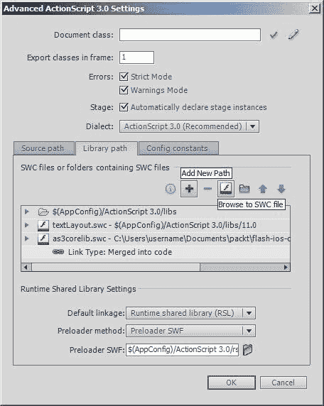

# 第十一章。渲染网页

在本章中，我们将涵盖：

+   在 Safari 中打开网页

+   在应用内渲染网页

+   导航浏览历史记录

+   渲染本地网页

+   动态生成本地网页

+   捕获网页快照

# 简介

互联网已经成为我们生活中不可或缺的一部分，以至于 iOS 应用也经常使用网络浏览器技术来执行某些任务。本章将探讨 AIR for iOS 的 HTML 功能；从简单地通过 Safari 启动网页，到更集成的体验，其中网页内容直接在应用本身中渲染。

我们将主要关注在 AIR 2.6 中引入的 `StageWebView` 类。然而，那些使用 Flash Professional CS5 和 AIR 2.0 的人会发现 *在 Safari 中打开网页* 的配方很有用。

# 在 Safari 中打开网页

AIR for iOS 使得向用户显示网页成为可能。对于许多情况，最简单的解决方案是从您的应用中启动 Safari（设备的原生网络浏览器）。许多应用程序采用这种方法，一旦用户完成页面，他们可以使用应用切换器回到他们的应用。

让我们看看如何从 AIR for iOS 应用中加载网页到 Safari。

## 准备工作

从本书的配套代码包中，将 `chapter11\recipe1\recipe.fla` 打开到 Flash Professional 中，并将其作为起点使用。

阶段上有一个名为 `twitterBtn` 的动画剪辑。动画剪辑的库符号链接到一个名为 `Button` 的类，该类是在第四章 *处理用户交互* 的配方中引入的 Chapter 4。

让我们编写一些 ActionScript 代码，在按钮被按下时将 [www.twitter.com](http://www.twitter.com) 加载到 Safari 中。

## 如何做到...

我们将利用包级 `navigateToURL()` 函数来启动 Safari。执行以下步骤：

1.  创建一个新的文档类并将其命名为 `Main`。

1.  将以下三个导入语句添加到类中：

    ```swift
    import flash.events.MouseEvent;
    import flash.net.navigateToURL;
    import flash.net.URLRequest;

    ```

1.  在构造函数中，监听 `twitterBtn` 动画剪辑被按下：

    ```swift
    public function Main() {
    twitterBtn.addEventListener(MouseEvent.MOUSE_UP, pressed); 
    }

    ```

1.  现在添加一个事件监听器，它将启动 Safari 并将其加载到 Twitter 的网站中：

    ```swift
    private function pressed(e:MouseEvent):void {
    var url:URLRequest = new URLRequest(
    "http://www.twitter.com");
    navigateToURL(url);
    }

    ```

1.  保存类并按提示将文件命名为 `Main.as`。

1.  返回 FLA 并也保存它。

1.  发布 FLA 并在您的设备上测试它。点击 **twitter** 按钮将在 Safari 中启动并加载 [www.twitter.com](http://www.twitter.com)。如果您使用的是 iOS 4 或更高版本，请使用应用切换器查找并回到您的应用。

## 它是如何工作的...

`flash.net` 包含一个名为 `navigateToURL()` 的包级函数，可以用于在 Safari 浏览器中直接打开网站。

它接受一个参数，即表示要加载的 URL 的 `URLRequest`：

```swift
var url:URLRequest = new URLRequest("http://www.twitter.com");

```

一旦创建了请求，就可以启动 Safari 并加载请求的 URL：

```swift
navigateToURL(url);

```

请求 URL 中的 `http` URI 方案很重要。`navigateToURL()` 函数可以用来启动许多外部 iOS 应用程序，Safari 只是其中之一。通过在 URL 前缀添加 `http://`，AIR 知道要启动 Safari。

此外，作为包级函数，`navigateToURL()` 必须明确添加到您类的导入语句列表中：

```swift
import flash.net.navigateToURL;

```

当从运行 iOS 4 或更高版本的设备上启动 Safari 时，您的应用程序将被挂起并移动到后台。当用户完成网页后，他们需要从主屏幕或应用程序切换器中选择您的应用程序以恢复它。然而，从 iOS 3 设备启动 Safari 将关闭您的应用程序而不是挂起它——多任务处理直到 iOS 4 才被引入。如果您计划支持 iOS 3，则在启动 Safari 之前保存应用程序的状态。

如需更多信息，请在 Adobe Community Help 中搜索 `flash.net.navigateToURL` 和 `flash.net.URLRequest`。

## 参考信息

+   *在应用程序内渲染网页*

+   *处理多任务，第三章*

+   *优雅地退出应用程序，第三章*

+   *保存应用程序状态，第四章*

+   *启动系统应用程序，第十三章*

# 在应用程序内渲染网页

自从 AIR 2.6 以来，已经在 AIR for iOS 应用程序中直接加载和显示 HTML 内容成为可能。这很方便，因为它可以防止用户离开应用程序来查看网页。它还提供了其他好处，例如更紧密的 OAuth（开放授权）集成，以及包含 HTML 横幅广告的能力。

此配方将向您展示如何直接将远程网页加载到您的应用程序中。

## 准备工作

这里介绍的方法仅适用于使用 Flash Professional CS5.5 和 AIR 2.6 或更高版本的用户。AIR 2.0 SDK 不提供在应用程序中加载 HTML 的 API。

从本书的配套代码包中，将 `chapter11\recipe2\recipe.fla` 打开到 Flash Professional CS5.5 中。FLA 的舞台是空的，但其 AIR for iOS 设置已经应用，这为您发布时节省了精力。

## 如何操作...

我们将利用 `StageWebView` 类来渲染网页。

1.  创建一个文档类并命名为 `Main`。

1.  添加以下两个导入语句：

    ```swift
    import flash.geom.Rectangle;
    import flash.media.StageWebView;

    ```

1.  声明一个 `StageWebView` 成员变量：

    ```swift
    private var webView:StageWebView;

    ```

1.  在构造函数中，使用 `StageWebView` 实例来加载网页：

    ```swift
    public function Main() {
     webView = new StageWebView();
    webView.stage = stage;
    webView.viewPort = new Rectangle(
    0, 0, stage.stageWidth, stage.stageHeight);
    webView.loadURL("http://www.yeahbutisitflash.com"); 
    }

    ```

1.  保存类并将文件命名为 `Main.as`。

1.  现在发布 FLA 并将 `.ipa` 文件部署到您的设备上。

1.  当启动时，[www.yeahbutisitflash.com](http://www.yeahbutisitflash.com) 网站将被加载并在您的应用程序中显示。您还可以与页面进行交互。试试看！

## 工作原理...

`StageWebView` 类允许在您的应用中使用 iOS 的原生 WebKit 渲染引擎显示本地和远程的 HTML 内容。

`StageWebView` 实际上不是一个正常的显示对象，因此不能添加到 Flash 的显示列表中。相反，它是一个绘制在您的应用程序之上的窗口，下面的项目被隐藏。不幸的是，这意味着您不能在 `StageWebView` 对象使用的区域上放置显示对象。

在创建 `StageWebView` 对象时，您必须直接将其附加到舞台，并指定一个视口以在其中渲染其 HTML 内容。为此，分别设置其 `stage` 和 `viewPort` 属性。使用 `Rectangle` 对象来定义视口的大小和位置。

一旦 `StageWebView` 对象被实例化并设置好，您可以通过传递一个 URL 给其 `loadURL()` 方法来加载一个网页。使用一个字符串来定义 URL，并在其前加上相关的 URI 方案，对于大多数情况将是 `http://`。省略 URI 方案将阻止页面加载。

您可以通过将 `stage` 属性设置为 `null` 来隐藏 `StageWebView` 对象。当您完成使用 `StageWebView` 对象时，调用其 `dispose()` 方法。这样做将帮助垃圾回收器更快地回收内存。

更多信息，请在 Adobe Community Help 中搜索 `flash.media.StageWebView`。

## 更多...

以下信息提供了更多详细信息。

### 页面加载事件

您可以通过监听来自 `StageWebView` 对象的以下两个事件来确定页面加载请求的成功或失败：

+   `Event.COMPLETE:` 请求的页面及其内容已加载

+   `ErrorEvent.ERROR:` 在尝试加载页面时发生错误

由于多种原因可能会发生加载错误，其中之一是省略了 URL 中的 URI 方案。有关加载错误的详细信息可以从 `ErrorEvent` 对象的 `errorID` 和 `text` 属性中获取。

### 多个实例

可以同时创建并使用多个 `StageWebView` 对象；然而，您对它们的深度排序控制有限。虽然无法动态更改深度，但最近实例化的对象将位于其他 `StageWebView` 实例之上。但是，Adobe 建议您避免重叠实例。

### 检查支持情况

静态的 `StageWebView.isSupported` 属性可以用来确定 `StageWebView` 类是否受支持。尽管这个属性对所有 iOS 设备都返回 `true`，但在编写跨平台代码时您应该查询它。

### 在标准屏幕分辨率内的 Retina 网页页面

在 Retina 显示设备上，即使 AIR for iOS 应用本身设置为使用标准的非 Retina 分辨率，`StageWebView` 对象也会利用设备的更高分辨率。

### 包含横幅广告

许多开发者直接在他们的应用中包含 HTML 横幅广告。这允许开发者免费向用户分发应用，并通过应用内显示的广告来生成收入。

`StageWebView`类使得显示由 AdMob 等服务提供的横幅广告成为可能。有关更多信息，请访问 AdMob 网站：[www.admob.com](http://www.admob.com)。

### OAuth 支持

第三方如 Twitter 和 Google 允许开发者访问其服务器端 API。然而，许多这些 API 提供对受保护数据的访问，并需要使用用户名和密码。许多第三方现在使用 OAuth 协议，该协议使用户能够访问数据，同时保护其账户凭证。

例如，如果您打算创建一个允许用户登录 Twitter 的应用，那么 OAuth 将是必需的。为了使过程尽可能安全，用户实际上将从 Twitter 托管的一个网页上登录，这意味着您需要将`StageWebView`对象作为客户端实现的一部分来使用。

Adobe 开发者传教士 Piotr Walczyszyn 在 Adobe TV 上提供了一个两部分的视频教程，演示了如何在 Adobe AIR 应用中使用 OAuth：[`tv.adobe.com/watch/adc-presents/introduction-to-oauth-for-secure-user-and-application-authorization`](http://tv.adobe.com/watch/adc-presents/introduction-to-oauth-for-secure-user-and-application-authorization)。有关使用`StageWebView`的更具体的移动示例，请查看 Adobe 平台传教士 Mark Doherty 的视频：[www.flashmobileblog.com/2010/07/17/air2-5-stagewebview-demo-oauth-support](http://www.flashmobileblog.com/2010/07/17/air2-5-stagewebview-demo-oauth-support)。

OAuth ActionScript 3.0 库可在以下地址找到：[`code.google.com/p/oauth-as3`](http://code.google.com/p/oauth-as3).

## 参见

+   *浏览历史记录导航*

+   *动态生成本地网页*

+   *在 Safari 中打开网页*

+   *捕获网页快照*

# 浏览历史记录导航

当用户浏览时，访问过的页面会存储在浏览历史记录堆栈中。`StageWebView`类使得浏览历史记录的导航和检测位置变化成为可能。

本食谱将指导您完成创建一个简单应用的必要步骤，该应用允许用户在浏览时导航其页面历史记录。

## 准备工作

您需要 Flash Professional CS5.5 来完成此食谱。

已提供 FLA 作为起点。从本书的配套代码包中，将`chapter11\recipe3\recipe.fla`打开到 Flash Professional CS5.5 中。

阶段上放置了两个代表导航按钮的电影剪辑。我们将使用这些按钮在用户的历史记录堆栈中前后移动。第一个的实例名称为`backBtn`，而第二个命名为`forwardBtn`。

这两个电影剪辑都链接到一个名为 `Button` 的基类。这个类是在第四章 *处理用户交互* 的配方中引入的 第四章。

## 如何实现...

让我们通过以下步骤使用与 `StageWebView` 类相关的各种方法和事件：

1.  创建一个文档类，并将其命名为 `Main`。

1.  添加以下导入语句：

    ```swift
    import flash.events.MouseEvent;
    import flash.events.LocationChangeEvent;
    import flash.geom.Rectangle;
    import flash.media.StageWebView;

    ```

1.  声明一个 `StageWebView` 成员变量：

    ```swift
    private var webView:StageWebView;

    ```

1.  在构造函数中，设置按钮电影剪辑和 `StageWebView` 对象：

    ```swift
    public function Main() {
     backBtn.addEventListener(MouseEvent.MOUSE_UP, prevPage);
    forwardBtn.addEventListener(MouseEvent.MOUSE_UP, nextPage);
    backBtn.visible = false;
    forwardBtn.visible = false;
    webView = new StageWebView();
    webView.stage = stage;
    webView.viewPort = new Rectangle(
    0, 62, stage.stageWidth, stage.stageHeight-62);
    webView.addEventListener(
    LocationChangeEvent.LOCATION_CHANGE, locationChanged);
    webView.loadURL("http://www.yeahbutisitflash.com"); 
    }

    ```

1.  `StageWebView` 对象的视口已定位在按钮下方，并添加了对 URL 变化的监听器。由于用户的浏览历史堆栈最初为空，导航按钮已被设置为不可见。

1.  现在添加一个 `locationChanged()` 方法来处理 `StageWebView` 对象 URL 的变化：

    ```swift
    private function locationChanged(e:LocationChangeEvent):void {
    backBtn.visible = webView.isHistoryBackEnabled;
    forwardBtn.visible = webView.isHistoryForwardEnabled;
    }

    ```

1.  此方法根据用户在历史记录堆栈中的位置设置每个按钮的可见性。如果他们无法进一步后退，则 `backBtn` 将被隐藏。如果他们无法前进，则 `forwardBtn` 将被隐藏。

1.  最后添加处理每个按钮被按下的方法：

    ```swift
    private function prevPage(e:MouseEvent):void {
    webView.historyBack();
    backBtn.visible = webView.isHistoryBackEnabled;
    }
    private function nextPage(e:MouseEvent):void {
    webView.historyForward();
    forwardBtn.visible = webView.isHistoryForwardEnabled;
    }

    ```

1.  这两个方法根据按下的按钮将用户移动到浏览历史记录中的前一页或后一页。类似于 `locationChanged()` 方法，每个按钮的可见性也由其相应的处理程序管理。

1.  保存类并将其命名为 `Main.as`。

1.  现在发布 FLA 并将应用部署到您的设备上。

1.  启动应用并选择网站内的任意超链接。访问几页后，通过按导航按钮在历史记录中导航。

## 它是如何工作的...

在浏览过程中，访问的页面将被存储在浏览历史记录堆栈中。这包括通过超链接导航到的页面或使用 `loadURL()` 程序性加载的页面。

`StageWebView` 类提供了导航浏览历史记录的方法。调用 `historyBack()` 方法可跳转到之前访问的页面，或调用 `historyForward()` 跳转到堆栈中的下一页。在调用这些方法之前，您需要确定实际上是否有可以移动到的网页。`isHistoryBackEnabled` 属性返回 `true` 表示您能够后退，而 `isHistoryForwardEnabled` 返回 `true` 表示您能够前进。

当用户按下导航按钮时，`historyBack()` 和 `historyForward()` 都被调用来响应。

我们还监听了 `LocationChangeEvent.LOCATION_CHANGE` 事件，该事件由 `StageWebView` 对象在 URL 发生变化时触发。在此事件的处理程序中，查询了 `isHistoryBackEnabled` 和 `isHistoryForwardEnabled`，每个值都用于设置 `backBtn` 和 `forwardBtn` 的可见性。

关于管理浏览历史记录的更多信息，请在 Adobe Community Help 中搜索 `flash.media.StageWebView` 和 `flash.events.LocationChangeEvent`。

## 还有更多...

现在让我们谈谈处理浏览历史记录时的一些其他选项。

### 获取当前位置

你可以通过查询`StageWebView`对象的只读`location`属性来确定当前页面的 URL。URL 将以字符串的形式返回。

### 停止和重新加载页面

`StageWebView`类在页面加载方面提供了有限的控制。提供了一个`stop()`方法来停止当前页面的加载，而可以通过调用`reload()`来重新加载页面。

### 检测 URL 即将更改时

除了`LOCATION_CHANGE`，还有一个`LOCATION_CHANGING`事件，表示页面的 URL 即将更改。当选择超链接或页面内运行的脚本更改 URL 时，会触发`LOCATION_CHANGING`事件。这个事件很方便，因为你可以通过调用`LocationChangeEvent`对象的`preventDefault()`方法来阻止新 URL 的加载。

要看到这个动作，首先在你的构造函数中添加以下事件监听器：

```swift
webView.addEventListener(
LocationChangeEvent.LOCATION_CHANGING, locationChanging);

```

现在为该事件添加一个处理程序：

```swift
private function locationChanging(e:LocationChangeEvent):void
{
e.preventDefault();
}

```

发布并测试应用。你的代码更改将有效地阻止你选择的任何超链接。

在调用`loadURL()`、`loadString()`、`historyBack()`、`historyForward()`或`reload()`之后，`LOCATION_CHANGING`事件不会触发。

## 参见

+   *在应用内渲染网页*

# 渲染本地网页

除了远程网页，还可以使用`StageWebView`类加载和显示本地 HTML 文件。

让我们将网页与应用程序捆绑在一起，并在运行时加载。

## 准备工作

这个菜谱需要 Flash Professional CS5.5 和 AIR 2.6 或更高版本。

从书籍的配套代码包中打开`chapter11\recipe4\recipe.fla`，并将其作为起点。

与 FLA 相同的目录下有一个名为`html`的文件夹，其中包含你的应用必须加载的 HTML 页面。使用 Windows 资源管理器或 Finder，查看文件夹的内容。在`index.html`文件中，你还会找到一个 PNG 图像和一个样式表，这两个都是 HTML 所使用的。

## 如何做到这一点...

我们将把这个菜谱分成两部分。首先，我们将使用 AIR for iOS 设置面板将本地 HTML 与应用程序捆绑在一起。然后，我们将编写加载和渲染所需的 ActionScript。

### 捆绑 HTML

让我们从将 HTML 内容与 FLA 捆绑在一起开始。

1.  通过选择 Flash 的下拉菜单中的**文件** | **AIR for iOS 设置**来移动到 AIR for iOS 设置面板。

1.  如果它尚未选中，请点击面板的**常规**选项卡。

1.  在面板底部是**包含文件**列表。点击列表上方的文件夹图标；浏览到并选择`chapter11\recipe4\html`。现在你将在**包含文件**列表中看到**html**。

1.  现在点击**确定**以关闭**AIR for iOS 设置**面板。

### 加载捆绑的 HTML

现在 HTML 已经包含在你的 FLA 中，我们可以专注于编写 ActionScript。

1.  创建一个新的文档类，并将其命名为`Main`。

1.  向类中添加以下三个额外的导入语句：

    ```swift
    import flash.geom.Rectangle;
    import flash.media.StageWebView;
    import flash.filesystem.File;

    ```

1.  声明一个 `StageWebView` 成员变量：

    ```swift
    private var webView:StageWebView;

    ```

1.  最后，在构造函数中，设置并加载本地网页：

    ```swift
    public function Main() {
     var url:String = File.applicationDirectory.resolvePath(
    "html/index.html").nativePath;
    webView = new StageWebView();
    webView.stage = stage;
    webView.viewPort = new Rectangle(
    0, 0, stage.stageWidth, stage.stageHeight);
    webView.loadURL(url); 
    }

    ```

1.  保存类并在提示时，将文件命名为 `Main.as`。

1.  返回到你的 FLA 并保存它。

1.  现在发布 FLA 并在你的设备上测试它。HTML 页面将从你的设备文件系统加载。

## 它是如何工作的...

在你的设备上加载存储的网页与加载远程页面并没有太大区别。唯一需要额外的一步是首先获取你想要加载的本地 HTML 文件的本地路径。将相对路径传递给 `StageWebView.loadURL()` 将导致 `ErrorEvent.ERROR` 被分发。

所有 iOS 应用都存储在其自己的主目录中，应用本身可以读取和写入存在于其中的各种子文件夹。其中一个这样的子文件夹是应用程序目录，用于存储应用程序及其捆绑的任何文件。这就是你将找到 `index.html` 及其相关文件的地方。

AIR SDK 提供了 `flash.filesystem.File` 类，它允许你引用包括应用程序目录在内的常用目录。然后可以使用 `File` 类的 `resolvePath()` 方法来细化路径。以下代码行获取了存储在应用程序目录中的 `index.html` 文件的引用：

```swift
File.applicationDirectory.resolvePath("html/index.html")

```

`resolvePath()` 方法返回一个 `File` 对象。通过调用其 `nativePath` 属性，我们可以获得一个可以传递给 `StageWebView` 对象的 `loadURL()` 方法的字符串。以下是一行完整的代码：

```swift
var url:String = File.applicationDirectory.resolvePath(
"html/index.html").nativePath;

```

与你希望与应用捆绑的任何本地内容一样，确保你包含的任何文件都位于 FLA 的根文件夹中。

如需更多信息，请在 Adobe Community Help 中搜索 `flash.filesystem.File` 和 `flash.media.StageWebView`。

## 更多内容...

在 `StageWebView` 实例内渲染的网页不必与你的应用完全隔离。

### 双向 ActionScript/JavaScript 通信

虽然有限，但可以使用 `StageWebView` 类执行双向 ActionScript/JavaScript 通信。这样做允许在应用和 `StageWebView` 实例内渲染的 HTML 页面之间传递数据。

可以在 Adobe 开发者 Sean Voisen 的个人博客上找到概述该过程的文档：[`sean.voisen.org/blog/2010/10/making-the-most-of-stagewebview`](http://sean.voisen.org/blog/2010/10/making-the-most-of-stagewebview)。

## 参考以下内容

+   *在应用内渲染网页*

+   *动态生成本地网页*

+   *引用应用的常用目录，第十三章*

# 动态生成本地网页

我们已经介绍了如何使用`StageWebView`类显示远程和本地网页。还可以在 iOS 应用程序中动态生成 HTML 并直接渲染它。

让我们通过动态创建一个使用 PNG 图像和样式表的网页来看看这是如何完成的。

## 准备工作

这里介绍的操作仅适用于使用 Flash Professional CS5.5 和至少 AIR SDK 2.6 版本的用户。AIR 2.0 不支持`StageWebView`类。

我们将需要使用**as3corelib** API。这是一个包含各种不可多得的 ActionScript 3.0 类和工具的库，包括散列、图像编码和字符串操作。在这个菜谱中，我们将使用库的 PNG 编码器。

as3corelib API 可在 GitHub 上获取：[`github.com/mikechambers/as3corelib`](http://github.com/mikechambers/as3corelib)。单击页面上的**下载**链接，从**下载包**部分选择**as3corelib-.93.zip**。将`.zip`文件解压缩到您的文档文件夹：`packt\flash-ios-cookbook\`。

### 注意

如果您使用的是 Windows，则您的文档文件夹的位置取决于您运行的 Windows 版本。对于 Windows Vista 和 Windows 7，它可以在以下位置找到：`C:\Users\<username>\Documents\`。如果您使用的是 Windows XP，则它位于：`C:\Documents and Settings\<username>\My Documents\`。

现在从书籍的配套代码包中打开`chapter11\recipe5\recipe.fla`到 Flash Professional CS5.5 中。在库面板中有一个被分配了`Image`链接名称的 PNG 图像。我们将在这个网页中包含这个图像。在接下来的这个菜谱中，我们将从这个 FLA 开始工作。

## 如何操作...

这个菜谱分为两个主要步骤。我们将首先将 as3corelib API 链接到我们的 FLA。一旦完成，我们将使用 API 编写生成页面的 ActionScript。

### 链接到 as3corelib API

as3corelib API 以`.swc`文件的形式提供，必须将其静态链接到您的 FLA。

1.  从 Flash Professional 的下拉菜单中选择**文件** | **ActionScript 设置**。这将打开**高级 ActionScript 3.0 设置**面板，您可以在其中添加 SWC。

1.  选择**库路径**选项卡，然后单击表示为**+**符号的**添加新路径**图标。

1.  现在点击**浏览 SWC 文件**图标，从您的文档文件夹中选择以下文件：`packt\flash-ios-cookbook\as3corelib-.93\as3corelib-.93\lib\as3corelib.swc`。它将被添加到要随应用程序发布的 SWC 文件列表中。通过单击其路径左侧的图标展开其条目，并确保其**链接类型**设置为**合并到代码**。

1.  通过单击底部的**确定**按钮关闭**高级 ActionScript 3.0 设置**面板。

### 生成 HTML

将 SWC 链接到你的 FLA 后，你现在可以使用它提供的 API。让我们写一些 ActionScript 来生成一个 HTML 文件并显示它。

1.  首先创建一个文档类，并将其命名为`Main`。

1.  添加以下导入语句，包括 as3corelib 的 PNG 编码器类：

    ```swift
    import flash.display.BitmapData;
    import flash.filesystem.File;
    import flash.filesystem.FileStream;
    import flash.filesystem.FileMode;
    import flash.geom.Rectangle;
    import flash.media.StageWebView;
    import flash.utils.ByteArray;
    import com.adobe.images.PNGEncoder;

    ```

1.  声明一个`StageWebView`成员变量：

    ```swift
    private var webView:StageWebView;

    ```

1.  在类的构造函数中，调用创建 HTML 页面并将其加载到`StageWebView`对象中的方法：

    ```swift
    public function Main() {
     createHtml();
    loadHtml(); 
    }

    ```

1.  现在添加创建 HTML 页面的方法，包括它所使用的样式表和 PNG 图像：

    ```swift
    private function createHtml():void {
    var cssString:String = "body" +
    "{ padding:0px; border:0px; margin:0px; " +
    "background-color:#cdc0af }";
    var htmlString:String = "<!DOCTYPE HTML>" +
    "<html>" +
    "<head>" +
    "<link rel='stylesheet' type='text/css' " +
    "href='styles.css' />" +
    "<meta name='viewport' " +
    "content='width=device-width; " +
    "height=device-height; initial-scale=1.0; " +
    "maximum-scale=1.0; user-scalable=0;' />" +
    "</head>" +
    "<body>" +
    "" +
    "</body>" +
    "</html>";
    var image:BitmapData = new Image();
    writeFile(htmlString, "index.html");
    writeFile(cssString, "styles.css");
    writePng(image, "image.png");
    }

    ```

1.  `createHtml()`方法调用两个支持方法——`writeFile()`和`writePng()`。将这两个方法都添加到类中：

    ```swift
    private function writeFile(text:String, name:String):void {
    var file:File = File.documentsDirectory.resolvePath(name);
    var stream:FileStream = new FileStream();
    stream.open(file, FileMode.WRITE);
    stream.writeUTFBytes(text);
    stream.close();
    }
    private function writePng(bd:BitmapData, name:String):void {
    var pngBytes:ByteArray = PNGEncoder.encode(bd);
    var file:File = File.documentsDirectory.resolvePath(name);
    var stream:FileStream = new FileStream();
    stream.open(file, FileMode.WRITE);
    stream.writeBytes(pngBytes);
    stream.close();
    }

    ```

1.  最后，添加加载和显示生成的 HTML 页面的方法：

    ```swift
    private function loadHtml():void {
    var url:String = File.documentsDirectory.resolvePath(
    "index.html").nativePath;
    webView = new StageWebView();
    webView.stage = stage;
    webView.viewPort = new Rectangle(
    0, 0, stage.stageWidth, stage.stageHeight);
    webView.loadURL(url);
    }

    ```

1.  保存这个类，并在提示时将其文件命名为`Main.as`。

1.  返回到你的 FLA 并保存它。

1.  现在发布 FLA 并在你的设备上测试它。应用将动态生成 HTML 页面并在屏幕上显示。

## 它是如何工作的...

这个配方大量使用了 Flash 的`File`和`FileStream`类。在动态创建 HTML 页面时，生成的 HTML 必须首先写入设备的文件系统，然后才能被`StageWebView`实例加载。HTML 使用的任何本地资源，如样式表和图像，也必须写入文件系统，并且与 HTML 使用的相对路径相匹配。

在`createHtml()`方法中，我们声明并初始化了一个包含我们 HTML 的字符串。以下是由它生成的 HTML：

```swift
<html>
<head>
<link rel='stylesheet' type='text/css' href='styles.css' />
<meta name='viewport' content='width=device-width;
height=device-height; initial-scale=1.0;
maximum-scale=1.0; user-scalable=0;' />
</head>
<body>

</body>
</html>

```

注意它引用了一个名为`styles.css`的本地样式表和一个名为`image.png`的图像。这个图像是 FLA 库中的 PNG，而表示样式表的字符串也是在`createHtml()`方法中生成的。

HTML 字符串、样式表字符串和 PNG 都写到了设备的文件系统中的同一目录。这是通过我们的`writeFile()`和`writePng()`方法完成的。

当 iOS 应用安装时，在应用的主目录中创建了一些常见的目录。其中一个这样的目录是 Documents 目录，可以用来存储应用程序特定的数据和临时文件。可以通过`flash.filesystem.File`类的静态`documentsDirectory`属性来获取对这个目录的引用。这就是我们写入本地网页的地方。

`writeFile()`方法在 Documents 目录中创建一个指定的文件，并将数据字符串写入其中。我们调用这个方法两次。首先写入 HTML 文件，然后再次写入样式表。文件是通过使用`File`对象声明其位置来创建的，然后该对象被传递给`FileStream`对象的`open()`方法：

```swift
var file:File = File.documentsDirectory.resolvePath(name);
var stream:FileStream = new FileStream();
stream.open(file, FileMode.WRITE);

```

一旦`FileStream`对象被打开，实际的文件是通过调用`writeUTFBytes()`并将字符串传递给它来写入的。然后通过调用`close()`来结束这个过程：

```swift
stream.writeUTFBytes(htmlString);
stream.close();

```

使用 `writePng()` 方法将 PNG 文件写入 Documents 目录，这与 `writeHtml()` 类似。首先使用 as3corelib 库的 `PNGEncoder` 类将 `Image` 对象的位图数据编码为 PNG 格式：

```swift
var pngBytes:ByteArray = PNGEncoder.encode(bd);

```

然后使用 `FileStream` 对象将 PNG 写入文件系统。HTML 和样式表都由字符串表示。PNG 的数据存储在一个 `ByteArray` 对象中。因此，而不是使用 `writeUTFBytes()`，我们调用 `FileStream` 对象的 `writeBytes()` 方法。

最后一步是创建一个 `StageWebView` 对象，并将 Documents 目录中的 `index.html` 加载到其中。这由 `loadHtml()` 方法处理。

关于 `flash.filesystem.File, flash.filesystem.FileStream` 和 `flash.utils.ByteArray` 的更多信息，可以从 Adobe 社区帮助中获取。

## 还有更多...

在动态生成 HTML 内容时，以下是一些额外的考虑因素。

### 清理

如果你正在使用应用的 Documents 文件夹来存储临时文件，那么请记住在完成后删除它们。这可以通过 `File` 类的 `deleteFile()` 或 `deleteFileAsync()` 方法完成。

### 使用 loadString()

`StageWebView` 类有一个 `loadString()` 方法，允许显示指定的 HTML 字符串。虽然这种方法可能比本食谱中概述的步骤更容易，但使用 `loadString()` 显示的 HTML 内容无法加载本地资源，如图像文件或样式表。

## 参见

+   *在应用内渲染网页*

+   *在应用内渲染本地网页*

# 捕获网页快照

可以将 `StageWebView` 对象视口的内 容复制到位图中。

在本食谱中，我们将捕获网页快照并在页面视口下方显示位图的缩略图。

## 准备工作

本食谱中涵盖的步骤仅适用于使用 Flash Professional CS5.5 和 AIR 2.6 或更高版本的用户。Flash Professional CS5 和 AIR 2.0 不支持 `StageWebView` 类。

从本书的配套代码包中，将 `chapter11\recipe6\recipe.fla` 打开到 Flash Professional CS5.5 中。FLA 的舞台是空的，但其 AIR for iOS 设置已经应用。

## 如何操作...

除了 `StageWebView`，我们还将使用 `Bitmap` 和 `BitmapData` 类来存储和显示快照。

1.  创建一个新的文档类，并将其命名为 `Main`。

1.  添加以下导入语句并声明一个 `StageWebView` 成员变量：

    ```swift
    package {
     import flash.display.Bitmap;
    import flash.display.BitmapData; 
    import flash.display.MovieClip;
     import flash.events.Event;
    import flash.geom.Rectangle;
    import flash.media.StageWebView; 
    public class Main extends MovieClip {
    private var webView:StageWebView; 
    public function Main() {
    // constructor code
    }
    }
    }

    ```

1.  在构造函数中，设置 `StageWebView` 对象并监听其网页成功加载：

    ```swift
    public function Main() {
     webView = new StageWebView();
    webView.stage = stage;
    webView.viewPort = new Rectangle(
    0, 0, stage.stageWidth, stage.stageWidth);
    webView.addEventListener(Event.COMPLETE, loaded);
    webView.loadURL("http://www.yeahbutisitflash.com"); 
    }

    ```

1.  最后，添加一个事件处理器，捕获加载页面的位图并显示其缩略图：

    ```swift
    private function loaded(e:Event):void {
    var bd:BitmapData = new BitmapData(
    webView.viewPort.width, webView.viewPort.height);
    webView.drawViewPortToBitmapData(bd);
    var b:Bitmap = new Bitmap(bd);
    b.x = 0;
    b.y = 320;
    b.width = 160;
    b.height = 160;
    addChild(b);
    }

    ```

1.  当提示保存类时，将其文件命名为 `Main.as`。

1.  返回到 FLA 并保存它。

1.  现在发布 FLA 并在你的设备上测试它。一旦网页加载完成，它的快照将被捕获并显示在屏幕左下角的缩略图位置。

## 它是如何工作的...

`StageWebView`类提供了`drawViewPortToBitmapData()`方法，该方法将`StageWebView`对象视口中的像素数据写入`BitmapData`对象。

首先，需要实例化一个`BitmapData`对象：

```swift
var bd:BitmapData = new BitmapData(
webView.viewPort.width, webView.viewPort.height);

```

然后，可以通过调用`drawViewPortToBitmapData():`将视口的可见部分绘制到`BitmapData`对象上。

```swift
webView.drawViewPortToBitmapData(bd);

```

必须注意确保`BitmapData`对象的尺寸与视口的尺寸相匹配。如果不匹配，则`drawViewPortToBitmapData()`将抛出`ArgumentError`异常。`StageWebView.viewPort`属性返回一个`Rectangle`，您可以使用它来确定视口的宽度和高度。

关于`flash.display.Bitmap`和`flash.display.BitmapData`类的更多信息，请参阅 Adobe 社区帮助。

## 还有更多...

以下是一个捕捉网页快照的实际用途。

### 铺设显示对象

虽然`StageWebView`对象在 Flash 的显示列表之上渲染，但在不需要与 HTML 进行用户交互的情况下，可以在 HTML 内容之上放置显示对象。这是通过捕获`StageWebView`的位图图像并将其替换为位图来实现的。然后，您可以在位图表示之上添加按钮、面板和菜单等显示对象。要隐藏一个`StageWebView`对象，请将其`stage`属性设置为`null`。

## 参见

+   *在应用内渲染网页*
