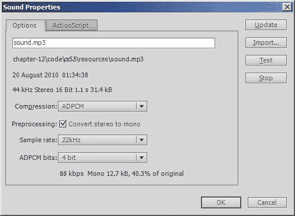

# 第十二章. 处理视频和音频

在本章中，我们将涵盖：

+   播放本地 FLV 视频

+   播放本地 H.264 视频

+   控制视频

+   嵌入音频

+   播放嵌入音频

+   流式音频

+   控制音频播放

# 简介

随着载体能够支持更大的下载，iOS 硬件不断向前发展，开发者能够构建更大的应用程序。苹果公司本身也承认了这一点，将其空中下载限制翻倍，使得包括更多带宽密集型内容（如视频和高质量音频）成为可能。

在互联网上，Flash 平台多年来一直是视频和音频播放的领导者。Adobe AIR 将这些功能带到了 iOS，使得开发者能够创建能够吸引、启发和沉浸用户的 app。

本章将探讨处理视频和声音的许多选项。它将首先指导您完成包括和播放视频所需的步骤，然后转向处理嵌入和流式音频。

# 播放本地 FLV 视频

多年来，Flash 平台成功的关键是其 FLV 文件格式，它提供本地和互联网上的 Sorenson Spark 或 ON2 VP6 编码视频。

在这个菜谱中，我们将看到如何加载与 AIR for iOS 应用程序捆绑在一起的 FLV 视频。

## 准备工作

使用书中附带代码包中的`chapter12\recipe1\recipe.fla`作为起点。

此外，还有一个 FLV 视频可以从`chapter12\resources\video.flv`获取，并且在继续之前应该复制到`chapter12\recipe1\`。

视频旨在在横向放置的设备上观看。为了满足这一要求，FLA 的舞台大小已被设置为 480x320 像素，而不是默认的纵向模式 320x480。

## 如何做到这一点...

这个菜谱分为两个主要步骤。首先我们将 FLV 视频与应用程序捆绑在一起，然后我们将编写一些 ActionScript 来播放它。

### 捆绑 FLV 视频

执行以下步骤将视频与应用程序捆绑在一起：

1.  通过从 Flash 的下拉菜单中选择**文件** | **AIR for iOS 设置**来打开 AIR for iOS 设置面板。

1.  如果尚未选中，请点击面板的**常规**选项卡。

1.  将**渲染**字段设置为**CPU**。

1.  在面板底部是**包含文件**列表。点击列表上方的**+**符号，并选择`chapter12\recipe1\video.flv`。当 FLA 发布时，视频现在将与您的 IPA 文件捆绑在一起。

1.  点击**确定**关闭 AIR for iOS 设置面板。

### 播放 FLV 视频

现在 FLV 已经包含在您的 FLA 中，我们可以将注意力转向播放它所需的 ActionScript。

1.  创建一个文档类并命名为`Main`。

1.  将以下导入语句添加到类中：

    ```swift
    import flash.desktop.NativeApplication;

    import flash.desktop.SystemIdleMode; 
    import flash.display.MovieClip;
     import flash.media.Video;
    import flash.net.NetConnection;
    import flash.net.NetStream; 

    ```

1.  声明一个常量来存储 FLV 视频的名称：

    ```swift
    static private const VIDEO_URL:String = "video.flv";

    ```

1.  创建三个播放视频所需的成员变量：

    ```swift
    private var netConnection:NetConnection;
    private var netStream:NetStream;
    private var video:Video;

    ```

1.  在构造函数中，加载并播放 FLV 视频：

    ```swift
    public function Main() {
     NativeApplication.nativeApplication.systemIdleMode = SystemIdleMode.KEEP_AWAKE;
    netConnection = new NetConnection();
    netConnection.connect(null);
    netStream = new NetStream(netConnection);
    netStream.client = this;
    netStream.play(VIDEO_URL);
    video = new Video();
    video.attachNetStream(netStream);
    video.width = 480;
    video.height = 320;
    addChildAt(video, 0); 
    }

    ```

1.  您还需要提供回调方法来捕获 FLV 播放时的元数据和提示点事件。将以下两个空方法添加到您的文档类中：

    ```swift
    public function onMetaData(dataObj:Object):void {
    ; // Do nothing.
    }
    public function onXMPData(dataObj:Object):void {
    ; // Do nothing.
    }

    ```

1.  保存类文件和 FLA 文件。

1.  发布 FLA 并将 IPA 部署到您的设备上。

当应用程序启动时，它将从文件系统加载并播放 FLV 文件。

## 它是如何工作的...

我们的代码从设备本地加载 `video.flv` 文件，并将其播放给用户。应用程序捆绑的所有文件在安装期间都会复制到其应用程序目录中。这是应用程序本身所在的文件夹，也是 FLV 视频存储的位置。

加载和播放视频是一个涉及 `NetConnection`、`NetStream` 和 `Video` 类的三阶段过程。

首先创建一个 `NetConnection` 对象，并将 `null` 传递给其 `connect()` 方法。这表示我们不会连接到 Flash 媒体服务器，而是打算连接到存储在设备文件系统中的文件或托管在 Web 服务器上的文件。对于这个示例，我们使用了与应用程序捆绑的本地 FLV 文件：

```swift
netConnection = new NetConnection();
netConnection.connect(null);

```

接下来创建一个 `NetStream` 对象，并用于播放实际的视频。将 `NetConnection` 对象传递给 `NetStream` 对象的构造函数，使其能够从设备流式传输本地视频：

```swift
netStream = new NetStream(netConnection);
netStream.client = this;
netStream.play(VIDEO_URL);

```

最后，将 `NetStream` 对象附加到 `Video` 对象上，允许视频显示给用户：

```swift
video = new Video();
video.attachNetStream(netStream);
video.width = 480;
video.height = 320;
addChildAt(video, 0);

```

`Video` 类继承自 `flash.display.DisplayObject`，这意味着它可以被添加到显示列表中，并以与其他所有显示对象相同的方式进行操作。我们使用的两个 `DisplayObject` 属性是 `width` 和 `height`，用于设置屏幕上视频的大小。为了最大化播放性能，确保尺寸与 FLV 完全匹配。缩放 FLV 视频会降低性能。

注意，在这个示例中选择了 CPU 渲染。虽然可以使用 GPU，但硬件视频解码器无法解码任意分辨率，这有时会导致您的 `Video` 对象尺寸不正确。此外，如果您正在使用 Flash Professional CS5 和 AIR 2.0，则应完全避免视频的 GPU 渲染。

如需更多信息，请在 Adobe Community Help 中搜索 `flash.net.NetConnection`、`flash.net.NetStream` 和 `flash.media.Video`。 

## 还有更多...

现在，让我们回到元数据和提示点的话题。在继续之前，我们还将涉及一些其他考虑因素。

### 元数据和提示点事件

当视频播放时，可以使用其 `NetStream` 对象来捕获和处理提示点和各种元数据事件，包括 `onMetaData` 和 `onXMPData`。

虽然这个示例不需要这些事件，但我们仍然必须为每个事件编写空回调处理程序。如果不这样做，当事件被触发时，将抛出一个运行时异常。

要处理这些事件，将`NetStream`对象的`client`属性设置为包含每个事件的回调方法的对象。方法名称必须与事件名称完全匹配。对于这个菜谱，我们简单地设置`client`属性为`this`，并将处理程序添加到文档类中。

有关如何实际使用提示点和元数据事件的数据的详细信息，请参阅[`help.adobe.com/en_US/as3/dev/WSD30FA424-950E-43ba-96C8-99B926943FE7.html`](http://help.adobe.com/en_US/as3/dev/WSD30FA424-950E-43ba-96C8-99B926943FE7.html)。

### 播放远程 FLV 视频

除了本地播放外，FLV 视频还可以从远程位置通过 HTTP 进行渐进式流式传输。只需将视频的 URL 传递给`NetStream.play()`方法即可开始播放。你还可以通过监听`NetStream`对象内部回放缓冲区的状态来确定`NetStream`对象的状态，方法是监听它分发`NetStatusEvent.NET_STATUS`。 

你可以在[`help.adobe.com/en_US/as3/dev/WS901d38e593cd1bac-3d11a09612fffaf8447-8000.html`](http://help.adobe.com/en_US/as3/dev/WS901d38e593cd1bac-3d11a09612fffaf8447-8000.html)找到有关可用`NetStream`事件的更多信息。

### 屏幕锁定

当观看视频时，如果用户在一段时间内没有活动，屏幕将会变暗。在这个菜谱的构造函数中，我们通过将`NativeApplication.systemIdleMode`设置为`SystemIdleMode.KEEP_AWAKE`来防止这种情况发生。

虽然无限期地防止屏幕锁定在演示目的上是可接受的，但可能不适合实际应用。更好的做法是在视频播放期间禁用屏幕锁定，然后在视频暂停或停止时重新启用。

### 最大化播放性能

为了最大化性能，最小化你的显示列表，并在播放期间尽量避免在视频上方叠加其他图形元素。还尝试限制在播放期间执行的 ActionScript 的数量。这对于较老的第一代和第二代硬件尤其如此，因为 FLV 的性能可能会遇到困难。

如果你使用的是 AIR 3.0 SDK 或更高版本，那么考虑使用硬件加速的 H.264 视频，因为它的回放性能和视频质量显著更好。

### *捆绑多个视频*

可以单独将文件添加到**包含文件**列表中，或者你可以指定一个包含文件夹。当你编写具有多个视频的应用程序时，这很方便，因为你可以在单个位置简单地分组文件。文件夹中的每个文件都将与你的 IPA 捆绑在一起。

## 参见

+   *播放本地 H.264 视频*

+   *控制视频*

+   *防止屏幕空闲，第三章*

+   *理解 GPU 混合模式，第六章*

# 播放本地 H.264 视频

AIR for iOS 现在支持高质量的、低比特率的 H.264 视频格式，通过`StageVideo`类实现最佳级别的高清播放。通过利用硬件加速，H.264 视频比 FLV 等类似格式减少了 CPU 使用率，并消耗更少的内存。

在本食谱中，我们将播放已与应用程序本地捆绑的 H.264 视频。

## 准备工作

这里所述的步骤仅适用于使用 AIR 3.0 及以上版本的用户。如果您使用的是 Flash Professional CS5，那么您将无法尝试此食谱。

从章节的配套代码包中，以`chapter12\recipe2\recipe.fla`作为起始点。

从`chapter12\resources\video.mp4`提供的 H.264 编码视频，在继续之前应将其复制到`chapter12\recipe2\`。

该视频旨在在横向持握的设备上观看。为了满足这一要求，FLA 的舞台大小已设置为 480x320 像素，而不是默认的纵向方向 320x480。

## 如何操作...

此食谱分为两个主要步骤。首先，我们将捆绑 H.264 视频与应用程序，然后编写一些 ActionScript 来播放它。

### 打包 H.264 视频

执行以下步骤以将视频与应用程序捆绑：

1.  通过从 Flash 的下拉菜单中选择**文件** | **AIR for iOS 设置**来打开 AIR for iOS 设置面板。

1.  如果该选项尚未选中，请点击面板的**常规**选项卡。

1.  将**渲染**字段设置为**GPU**。

1.  在面板底部是**包含的文件**列表。点击列表上方的**+**符号，并选择`chapter12\recipe2\video.mp4`。当 FLA 发布时，该文件将捆绑到您的 IPA 文件中。

1.  点击**确定**以关闭 AIR for iOS 设置面板。

### 播放 H.264 视频

现在视频已包含在您的 FLA 中，我们可以将注意力转向播放视频所需的 ActionScript。

1.  创建一个文档类，并将其命名为`Main`。

1.  将以下导入语句添加到类中：

    ```swift
    import flash.desktop.NativeApplication;
    import flash.desktop.SystemIdleMode; 
    import flash.display.MovieClip;
    import flash.geom.Rectangle;
    import flash.media.StageVideo;
    import flash.net.NetConnection;
    import flash.net.NetStream; 

    ```

1.  声明一个常量以存储视频的名称：

    ```swift
    static private const VIDEO_URL:String = "video.mp4";

    ```

1.  创建三个用于播放视频的成员变量：

    ```swift
    private var netConnection:NetConnection;
    private var netStream:NetStream;
    private var video:StageVideo;

    ```

1.  在构造函数中设置并播放视频：

    ```swift
    public function Main() {
     NativeApplication.nativeApplication.systemIdleMode = SystemIdleMode.KEEP_AWAKE;
    netConnection = new NetConnection();
    netConnection.connect(null);
    netStream = new NetStream(netConnection);
    netStream.client = this;
    video = stage.stageVideos[0];
    video.attachNetStream(netStream);
    video.viewPort = new Rectangle(0, 25, 480, 270);
    netStream.play(VIDEO_URL); 
    }

    ```

1.  您还需要提供一个回调方法，以捕获视频播放时的元数据事件。将以下空方法添加到您的文档类中：

    ```swift
    public function onMetaData(dataObj:Object):void {
    ; // Do nothing.
    }

    ```

1.  保存类文件和您的 FLA。

    ### 注意

    AIR 调试启动器（ADL）目前不支持 H.264 视频播放。如果您尝试使用 ADL 测试此食谱，则将收到运行时错误。

1.  发布 FLA 并将 IPA 部署到您的设备上。

当启动时，应用程序将从文件系统加载并播放 H.264 视频。

## 它是如何工作的...

我们的代码从设备本地加载`video.mp4`并播放给用户。应用程序捆绑的所有文件在安装期间都会复制到其应用程序目录中。这是应用程序本身所在的文件夹，也是 H.264 视频存储的位置。

加载和播放视频是一个涉及 `NetConnection, NetStream` 和 `StageVideo` 类的四步过程。

首先创建一个 `NetConnection` 对象，并将 `null` 传递给其 `connect()` 方法。这表示我们不会连接到 Flash 媒体服务器，而是打算连接到设备文件系统上存储的文件或托管在 Web 服务器上的文件。对于这个配方，我们使用了与应用程序捆绑的本地 FLV 文件：

```swift
netConnection = new NetConnection();
netConnection.connect(null);

```

接下来创建一个 `NetStream` 对象，并将用于播放实际视频。将 `NetConnection` 对象传递给 `NetStream` 对象的构造函数，允许它从设备流式传输本地视频：

```swift
netStream = new NetStream(netConnection);
netStream.client = this;

```

为了将视频显示给用户，`NetStream` 对象需要附加到 `StageVideo` 对象上。然而，你不需要自己显式创建一个。相反，可以从 `Stage` 对象的 `stageVideos` 属性提供的向量数组中获取一个 `StageVideo` 对象。在 iOS 设备上，这个向量将包含一个能够渲染视频的 `StageVideo` 实例：

```swift
video = stage.stageVideos[0];
video.attachNetStream(netStream);

```

最后一步是为视频创建一个视口并开始播放。由 `StageVideo` 类渲染的视频是硬件加速的，并且不是显示列表的一部分。相反，`StageVideo` 实例在显示列表后面的一个矩形区域内渲染，该区域指定了视频的绝对位置和大小。一旦定义了视口，就调用 `NetStream` 对象的 `play()` 方法：

```swift
video.viewPort = new Rectangle(0, 25, 480, 270);
netStream.play(VIDEO_URL);

```

用于此配方的视频大小为 400x224 像素，但你可能已经注意到，在上面的代码中，视口已被分配了一个 480x270 的矩形区域。这会将视频缩放到覆盖屏幕的整个水平宽度，同时仍然保持视频的宽高比。此外，视口向下移动了 25 像素，以确保它在屏幕上垂直居中。

对于这个配方，选择了 GPU 渲染。解码 H.264 视频计算成本高，需要硬件来确保在 iOS 设备上播放性能可接受。尽管视频不是显示列表的一部分，但它位于显示列表的后面，这意味着显示对象，如 UI 组件，可以叠加在顶部。

如需更多信息，请在 Adobe 社区帮助中搜索 `flash.net.NetConnection, flash.net.NetStream` 和 `flash.media.StageVideo`。

## 还有更多...

现在，让我们回到元数据的话题。在继续之前，我们还将讨论一些其他注意事项。

### 元数据和提示点事件

当视频播放时，可以使用其 `NetStream` 对象捕获和处理提示点和各种元数据事件，包括 `onMetaData, onCuePoint` 和 `onXMPData`。

虽然这个配方不需要 `onMetaData` 事件，但我们仍然必须为它编写一个空的回调处理程序。如果不这样做，当事件被触发时，将会抛出一个运行时异常。

为了处理此类事件和其他事件，将 `NetStream` 对象的 `client` 属性设置为包含每个事件的回调方法的对象。方法名称必须与事件名称完全匹配。对于本菜谱，我们只需将 `client` 属性设置为 `this` 并将处理程序添加到文档类中。

有关如何实际使用提示点和元数据事件的数据的详细信息，请参阅 [`help.adobe.com/en_US/as3/dev/WSD30FA424-950E-43ba-96C8-99B926943FE7.html`](http://help.adobe.com/en_US/as3/dev/WSD30FA424-950E-43ba-96C8-99B926943FE7.html)。

### 播放默认相机捕获的视频

使用 `CameraUI` 类成功捕获的视频暂时存储在设备的文件系统中。通过 `CameraUI` 分发的 `MediaEvent` 对象，可以确定视频的 URL 以便播放。以下是一个示例：

```swift
private function captured(e:MediaEvent):void {
var mediaPromise:MediaPromise = e.data;
var videoUrl:String = mediaPromise.file.url; 
playVideo(videoUrl);
}

```

一旦你有了 URL，你可以简单地将它传递给 `NetStream` 对象的 `play()` 方法以启动播放。

`CameraUI` 类在 第十章 的 *使用默认相机应用捕获* 菜单中有所介绍。

### 确定视频的大小

你可以从 `StageVideo` 对象的只读属性 `videoWidth` 和 `videoHeight` 中检索编码视频的宽度和高度。但是，首先你需要等待这些信息可用，通过监听从你的 `StageVideo` 实例分发的 `StageVideoEvent.RENDER_STATE` 事件来实现。

此外，在播放从设备相机捕获的视频时也要小心。在 iOS 上，相机以横向模式捕获视频。如果你的应用程序使用纵向宽高比，那么在指定视口尺寸时需要交换 `videoWidth` 和 `videoHeight` 属性的值。

更多信息，请在 Adobe Community Help 中搜索 `flash.events.StageVideoEvent`。

### 播放远程 H.264 视频

除了本地播放外，H.264 视频还可以从远程位置通过 HTTP 逐步流式传输。只需将视频的 URL 传递给 `NetStream.play()` 方法即可开始播放。你还可以通过监听 `NetStream` 对象内部播放缓冲区的状态来确定 `NetStream` 对象的状态，该状态通过分发 `NetStatusEvent.NET_STATUS` 事件来实现。

你可以在 [`help.adobe.com/en_US/as3/dev/WS901d38e593cd1bac-3d11a09612fffaf8447-8000.html`](http://help.adobe.com/en_US/as3/dev/WS901d38e593cd1bac-3d11a09612fffaf8447-8000.html) 找到更多关于可用 `NetStream` 事件的信息。

### 编码 H.264 视频

H.264 视频播放可能计算成本较高。由于 iOS 设备种类繁多，硬件配置广泛，因此采用正确的编码策略至关重要，以确保在最低的共同基数上播放。Adobe 在 [www.adobe.com/devnet/devices/articles/mobile_video_encoding.html](http://www.adobe.com/devnet/devices/articles/mobile_video_encoding.html) 提供了一些 H.264 编码建议。

您可以使用 Adobe Media Encoder 对视频进行编码，该编码器是 Flash Professional 的可选安装程序，并使用 H.264 编解码器。Adobe Media Encoder 的介绍可以在 Adobe 开发者连接网站上找到，网址为[www.adobe.com/devnet/flash/quickstart/video_encoder.html](http://www.adobe.com/devnet/flash/quickstart/video_encoder.html)。

### 捆绑多个视频

可以单独将文件添加到**包含文件**列表中，或者指定一个文件夹以包含文件。当编写具有多个视频的应用程序时，这很方便，因为您只需将文件分组在单个位置即可。文件夹中的每个文件都将与您的 IPA 捆绑在一起。

## 参见

+   *控制视频*

+   *防止屏幕空闲，第三章*

+   *理解 GPU-Vector 模式，第六章*

# 控制视频

除了开始播放外，`NetStream`类还提供了对视频的额外控制。在本菜谱中，我们将添加用户暂停、恢复和重新启动 FLV 或 H.264 视频的能力。

## 准备工作

从本书的配套代码包中，打开`chapter12\recipe3-flv\recipe.fla`或`chapter12\recipe3-mp4\recipe.fla`，并将其作为起点。第一个 FLA 的文档类包含为**播放本地 FLV 视频**菜谱编写的代码，而第二个 FLA 包含**播放本地 H.264 视频**菜谱的代码。

已将两个电影剪辑添加到舞台。第一个被赋予了实例名称`blocker`。第二个被命名为`controls`，位于`blocker`之前。这两个电影剪辑都将位于 FLV 或 H.264 视频之前。

在`controls`电影剪辑中包含三个按钮，分别命名为`playBtn`、`restartBtn`和`resumeBtn`。这些按钮将分别用于播放、重新开始和取消暂停视频。在播放过程中，点击屏幕上的任何位置都会暂停视频。

`blocker`电影剪辑具有 60%的透明度，当视频处于暂停状态时将用于降低视频亮度。在播放过程中，`blocker`将变为不可见，确保视频不被遮挡。以下截图显示了由`blocker`电影剪辑降低亮度的视频：


在继续之前，您还需要将 FLV 或 H.264 视频复制到 FLA 的根目录。如果您正在使用 FLV 视频，则将`chapter12\resources\video.flv`复制到`chapter12\recipe3-flv\`。对于 H.264 视频，将`chapter12\resources\video.mp4`复制到`chapter12\recipe3-mp4\`。

好的，让我们编写这个菜谱所需的 ActionScript。

## 如何操作...

打开 FLA 的文档类，并对其进行以下更改：

1.  添加两个新的导入语句：

    ```swift
    import flash.events.MouseEvent;
    import flash.events.NetStatusEvent;

    ```

1.  在构造函数中，监听`NetStream`实例分发`NetStatusEvent.NET_STATUS`事件：

    ```swift
    netStream = new NetStream(netConnection);
    netStream.client = this;
    netStream.addEventListener(NetStatusEvent.NET_STATUS, statusUpdated); 

    ```

1.  此外，从构造函数中删除以下代码行：

    ```swift
    netStream.play(VIDEO_URL);

    ```

    ### 注意

    在上面的行以及整个配方中，`VIDEO_URL` 是一个包含要播放的本地视频 URL 的常量。它将指向 `video.flv` 或 `video.mp4`，具体取决于你是在处理 FLV 还是 H.264 视频。

    +   我们不再希望视频立即开始播放。相反，我们将等待用户轻触播放按钮。

1.  最后，在构造函数的末尾，调用一个支持方法来设置播放控件：

    ```swift
    setupControls();

    ```

1.  现在添加实际的 `setupControls()` 方法。为每个控制按钮添加一个事件监听器，并最初只显示播放按钮——我们将在视频暂停时显示其他按钮。

    ```swift
    private function setupControls():void {
    controls.playBtn.addEventListener(MouseEvent.MOUSE_UP, playVideo);
    controls.restartBtn.addEventListener(MouseEvent.MOUSE_UP, restartVideo);
    controls.resumeBtn.addEventListener(MouseEvent.MOUSE_UP, resumeVideo);
    stage.addEventListener(MouseEvent.MOUSE_UP, pauseVideo);
    showBtns(["playBtn"]);
    }

    ```

1.  当按下播放按钮时，我们将开始播放视频并隐藏控件。添加以下事件处理程序来完成此操作：

    ```swift
    private function playVideo(e:MouseEvent):void {
    netStream.play(VIDEO_URL);
    hideBtns();
    e.stopPropagation();
    }

    ```

1.  用户可以在播放期间通过在屏幕上任何地方轻触来暂停视频。当暂停时，控制面板的重置和恢复按钮将显示。为这个添加一个事件处理程序并暂停 `NetStream` 对象的视频流：

    ```swift
    private function pauseVideo(e:MouseEvent):void {
    if(controls.visible == false)
    {
    netStream.pause();
    showBtns(["resumeBtn", "restartBtn"]);
    }
    }

    ```

1.  现在为重置按钮添加一个事件处理程序。此处理程序将使 `NetStream` 对象的视频回到开始，并隐藏控件：

    ```swift
    private function restartVideo(e:MouseEvent):void {
    netStream.seek(0);
    netStream.resume();
    hideBtns();
    e.stopPropagation();
    }

    ```

1.  为重置按钮编写一个类似的处理程序，取消暂停 `NetStream` 对象的视频流：

    ```swift
    private function resumeVideo(e:MouseEvent):void {
    netStream.resume();
    hideBtns();
    e.stopPropagation();
    }

    ```

1.  我们还希望用户在视频播放完成后有机会再次观看视频。为 `NetStream` 对象的 `NET_STATUS` 事件编写一个处理程序，如果视频已停止则显示播放按钮：

    ```swift
    private function statusUpdated(e:NetStatusEvent):void {
    if(e.info.code == "NetStream.Play.Stop")
    {
    showBtns(["playBtn"]);
    }
    }

    ```

1.  我们即将完成。添加以下两个支持方法来管理控制按钮和遮挡器的可见性：

    ```swift
    private function hideBtns():void {
    controls.visible = false;
    blocker.visible = false;
    }
    private function showBtns(btns:Array):void {
    controls.visible = true;
    blocker.visible = true;
    for(var instName:String in controls)
    {
    if(btns.indexOf(instName) != -1)
    {
    controls[instName].visible = true;
    }
    else
    {
    controls[instName].visible = false;
    }
    }
    }

    ```

1.  保存你的文档类并回到 FLA。

1.  在你的设备上发布并测试应用程序。

## 它是如何工作的...

以下三个 `NetStream` 类的方法被用来控制视频播放：

+   `pause():` 暂停当前视频流

+   `resume():` 恢复暂停的视频流的播放

+   `seek():` 移动到视频流中的特定时间点

`seek()` 方法期望一个时间，以秒为单位，用于移动到。实际上这是一个近似值，因为 `NetStream` 对象将移动到最接近该时间的键帧。

应注意，不应使用 `play()` 方法来恢复播放。它仅用于开始播放。相反，调用 `resume()` 以继续播放暂停的视频。

`NetStream` 类不提供 `stop()` 方法。在我们的代码示例中，暂停的视频是通过定位到第一个关键帧然后恢复播放从开始重新启动的。

## 还有更多...

在我们离开视频并转到音频之前，这里有一些最后的话。

### NetStream 状态

`NetStatusEvent` 对象在响应大量有用的状态变化、错误和警告时被触发。以下是一些可以查询 `info.code` 属性的字符串：

+   `NetStream.Play.Start:` 播放已开始

+   `NetStream.Play.Stop:` 播放已停止

+   `NetStream.Play.StreamNotFound:` 无法找到视频文件

+   `NetStream.Play.InsufficientBW:` 客户端没有足够的带宽以期望的帧率播放视频

+   `NetStream.Pause.Notify:` 流已暂停

+   `NetStream.Unpause.Notify:` 流已暂停

+   `NetStream.Buffer.Flush:` 播放结束，缓冲区现在为空

您可以通过检查 `info.level` 属性来确定代码的类型，该属性将被设置为以下字符串之一：`status, error` 或 `warning`。要获取支持字符串的完整列表，请在 Adobe Community Help 中搜索 `flash.events.NetStatusEvent`。

`flash.net.NetConnection` 对象也会派发 `NetStatusEvent` 对象，您可以监听这些对象。

### 关闭视频流

当您完成视频并不再需要它时，调用 `NetStream` 对象的 `close()` 方法。这将停止视频播放并使流可用于其他用途。

# 嵌入音频

声音是任何应用程序的重要组成部分，并且当正确应用时，可以沉浸用户于交互体验中。为了提供这种体验，在播放过程中最小化延迟是很重要的。例如，在播放游戏音效或从用户界面提供音频反馈时，不应有延迟。

Flash 允许将声音文件直接嵌入到库中，为您的音频提供最快的播放路径。让我们一步步了解完成此操作所需的步骤。

## 如何操作...

在 FLA 库中嵌入声音的步骤如下：

1.  从 Flash Professional 中，通过选择 **文件** | **新建** *(Ctrl + N* | *Cmd* + *N)* 创建一个新的 AIR for iOS 文档。从 **新建文档** 面板中选择 **AIR for iOS** 文档类型，然后点击 **确定** 按钮。

    ### 注意

    如果您是 Flash Professional CS5 用户，那么它被称为 **iPhone OS** 文档而不是 **AIR for iOS** 文档。

1.  从 Flash 的下拉菜单中选择 **文件** | **导入** | **导入到库**。将出现一个文件浏览器窗口。

1.  从浏览器窗口中，导航到并选择 `chapter12\resources\sound.mp3`。点击 **打开** 按钮。声音文件将被导入并在库面板中列出为 **sound.mp3**。

1.  在库面板中，右键单击 **sound.mp3** 并从下拉菜单中选择 **属性**。将打开 **声音属性** 面板。

1.  在 **声音属性** 面板中，从 **压缩** 下拉框中选择 **ADPCM**。确保选中 **将立体声转换为单声道** 复选框；将 **采样率** 设置为 **22kHz** 和 **ADPCM 位** 为 **4 位**。如果您使用的是 Flash Professional CS5.5，那么，如以下截图所示，请确保首先选中面板的 **选项** 选项卡。

1.  现在检查**导出为 ActionScript**复选框，并将**类**字段中的文本更改为`SoundEffect`。如果您使用的是 Flash Professional CS5.5，则应从面板的**ActionScript**选项卡执行此操作。

1.  单击**确定**按钮关闭面板。

1.  根据您在 Flash Professional 中的首选项设置，可能会出现包含以下文本的警告面板：

    **无法在类路径中找到此类定义，因此将在导出 SWF 文件时自动生成。**

    这是预期的。单击**确定**按钮继续。声音文件已被分配了一个名为 SoundEffect 的 ActionScript 类名。

1.  保存您的 FLA 文件。

## 它是如何工作的...

在您的库中嵌入声音文件将它们直接放置在应用程序的二进制文件中，使它们立即可用于播放。然而，以这种方式添加声音文件将增加您的应用程序文件大小。您的应用程序越大，加载所需的时间就越长，消耗的内存就越多。在嵌入声音文件之前，请仔细考虑您是否真的需要立即访问它。

选择合适的音频编解码器对于您的嵌入声音也很重要。Flash 提供两种类型的编解码器：压缩和非压缩。压缩声音，如 MP3，比非压缩声音，如 ADPCM，占用更少的空间。然而，设备需要在播放时解码音频，这可能会很耗时，尤其是如果您试图同时播放多个压缩声音。

如果您需要同时播放多个声音文件并且具有最小延迟，则使用非压缩编解码器。Flash 提供 ADPCM 和 RAW 用于此目的。当然，使用非压缩音频会增加您的应用程序内存占用。

如果您一次只播放一个声音，则选择 MP3。这样做将减少您的应用程序内存占用。

如果您想使用 ActionScript 访问您的嵌入音频，则必须为库中的每个声音分配一个唯一的类名。在本菜谱中，我们将类名`SoundEffect`分配给了我们的嵌入声音。

## 参见

+   *创建 iOS 的 AIR 文档，第二章*

+   *播放嵌入音频*

# 播放嵌入音频

可以使用 ActionScript 播放 FLA 库中嵌入的声音文件。声音必须有一个与之关联的唯一类名。

在本菜谱中，我们将介绍如何播放此类嵌入声音。

## 准备工作

从书籍的代码包中，将`chapter12\recipe5\recipe.fla`打开到 Flash Professional 中，并将其作为起点使用。

来自“嵌入音频”菜谱的嵌入声音可以在 FLA 的库中找到，并且有一个名为`SoundEffect`的类名与之关联。

此外，舞台上还有一个名为`playBtn`的按钮。我们将在此按钮被按下时播放嵌入的声音。

## 如何操作...

执行以下步骤以播放与`SoundEffect`类关联的声音：

1.  创建一个名为`Main`的文档类。

1.  导入`MouseEvent`类并监听`playBtn`被按下：

    ```swift
    package {
    import flash.display.MovieClip;
    import flash.events.MouseEvent; 
    public class Main extends MovieClip {
    public function Main() {
    playBtn.addEventListener(MouseEvent.MOUSE_UP, playSound); 
    }
    }
    }

    ```

1.  现在为按钮添加一个事件处理程序，并在其中创建嵌入声音的`SoundEffect`类的实例：

    ```swift
    private function playSound(e:MouseEvent):void {
    var soundEffect:SoundEffect = new SoundEffect();
    }

    ```

1.  在处理程序内部，调用`SoundEffect`对象的`play()`方法：

    ```swift
    private function playSound(e:MouseEvent):void {
    var soundEffect:SoundEffect = new SoundEffect();
    soundEffect.play(); 
    }

    ```

1.  保存您的类文件和 FLA 文件。

1.  发布应用程序并在您的设备上测试它。轻触按钮以启动声音的播放。重复轻触按钮以启动多个实例。

## 它是如何工作的...

使用`flash.media.Sound`对象播放音频。所有用于 ActionScript 的链接嵌入声音都将继承自这个类。

要使用嵌入的声音，只需实例化它，然后调用它的`play()`方法。这只是`Sound`类提供的许多方法和属性之一。

在此菜谱中，我们使用了一个具有`SoundEffect`类名的嵌入声音文件。以下两行代码就足以播放它：

```swift
var soundEffect:SoundEffect = new SoundEffect();
soundEffect.play();

```

当调用`play()`时，会创建一个`SoundChannel`对象来播放声音。连续调用`play()`会创建新的`SoundChannel`对象，它们独立地播放自己的声音副本。您可以通过在此菜谱示例应用程序中重复轻触播放按钮来听到这个效果。

虽然在这个菜谱中我们没有用到它，但`play()`方法返回一个对新实例化的`SoundChannel`对象的引用，该对象可以用来控制声音的播放。这在本章的*控制音频播放*菜谱中有详细说明。

## 更多内容...

让我们看看在播放声音时可供选择的一些更多选项。

### 播放位置

`play()`方法有几个默认参数，其中第一个参数从声音中的指定位置开始播放。以下示例显示了从开始点 500 毫秒处开始播放：

```swift
soundEffect.play(500);

```

如果省略，声音将从开头播放。

### 循环

可以通过将值传递给`play()`方法的第二个参数来循环播放声音。在以下示例中，声音从开始点 200 毫秒处连续播放六次：

```swift
soundEffect.play(200, 6);

```

如果省略，播放将只发生一次。

## 相关内容

+   *嵌入音频*

+   *控制音频播放*

# 流式音频

当处理大型声音文件时，您可能希望将它们放在应用程序的二进制文件之外，以减少其加载时间和内存消耗。`Sound`类可以从网络或从设备的文件系统流式传输 MP3 文件，从而无需直接在 FLA 中嵌入音频。

在此菜谱中，我们将 MP3 文件与应用程序捆绑在一起，并逐步播放它。

## 准备工作

为此菜谱提供了一个`.mp3`文件。使用 Windows 资源管理器或 Finder，将`chapter12\resources\music.mp3`从书籍的配套代码包中复制到`chapter12\recipe6\`。

在 Flash Professional 中打开`chapter12\recipe6\recipe.fla`。位于舞台中央的是一个名为`playBtn`的按钮。我们将编写一些 ActionScript，以便在按下此按钮时流式传输`music.mp3`。

## 如何做到...

此配方将分为两部分。首先，我们将与应用程序捆绑一个 MP3 文件，然后我们将编写播放它所需的 ActionScript。

### 捆绑 MP3 文件

按照以下步骤将`.mp3`文件与应用程序捆绑：

1.  通过从 Flash 的下拉菜单中选择**文件** | **AIR for iOS 设置**来打开 AIR for iOS 设置面板。

1.  如果尚未选中，请单击面板的**常规**选项卡。

1.  在面板底部是**包含的文件**列表。在列表上方点击**+**符号，并选择`chapter12\recipe6\music.mp3`。当 FLA 发布时，该文件将与应用程序捆绑在一起。

1.  点击**确定**关闭 AIR for iOS 设置面板。

### 播放 MP3 文件

现在 MP3 已包含在您的 FLA 中，让我们将注意力转向流式传输它所需的 ActionScript。

1.  创建一个名为`Main`的文档类。

1.  将以下导入语句添加到类中：

    ```swift
    package {
    import flash.display.MovieClip;
     import flash.events.MouseEvent;
    import flash.media.Sound;
    import flash.net.URLRequest; 
    public class Main extends MovieClip {
    public function Main() {
    // constructor code
    }
    }
    }

    ```

1.  在构造函数中，监听`playBtn`被按下：

    ```swift
    public function Main() {
    playBtn.addEventListener(MouseEvent.MOUSE_UP, playSound); 
    }

    ```

1.  现在，让我们添加按钮的事件处理程序。在其内部，为本地`music.mp3`文件创建一个`URLRequest`对象：

    ```swift
    private function playSound(e:MouseEvent):void {
    var url:URLRequest = new URLRequest("music.mp3");
    }

    ```

1.  最后，将请求传递给一个新的`Sound`对象，并调用其`play()`方法：

    ```swift
    private function playSound(e:MouseEvent):void {
    var url:URLRequest = new URLRequest("music.mp3");
    var sound:Sound = new Sound(url);
    sound.play(); 
    }

    ```

1.  保存您的类文件和 FLA。

1.  发布应用程序并在您的设备上进行测试。轻触按钮以启动`.mp3`文件的流式传输。重复轻触按钮以启动多个实例。

## 它是如何工作的...

除了播放嵌入式音频外，`flash.media.Sound`类还可以流式传输外部声音文件。所采用的技术与播放 FLV 或 H.264 视频时使用的渐进式下载技术相同，可用于与应用程序捆绑或存储在网络上存储的声音文件。

虽然 Flash 支持压缩和非压缩嵌入式音频，但只有`.mp3`文件可以使用`Sound`类直接流式传输。因此，建议将同时流式传输的外部文件数量保持在最低，因为解码音频可能计算成本高昂。

使用`Sound`类播放`.mp3`文件很简单。首先需要创建一个声音文件的`URLRequest`：

```swift
var url:URLRequest = new URLRequest("music.mp3");

```

然后将请求传递给一个新的`Sound`实例。当调用`Sound`对象的`play()`方法时，文件开始流式传输：

```swift
var sound:Sound = new Sound(url);
sound.play();

```

一旦调用`play()`，`Sound`对象就不能与另一个`.mp3`文件一起使用。要流式传输不同的文件，请创建一个新的`Sound`对象。

## 更多...

以下细节适用于 Flash 中的一般声音，但在处理存储在设备文件系统或网络上的 MP3 文件时尤其重要。

### 增加缓冲时间

如果音频数据消耗速度超过加载速度，则播放将暂停，直到`Sound`对象的内部缓冲区再次填满。

为了帮助防止缓冲区下溢，您可以在播放开始之前增加已收集的数据的毫秒数。使用 `flash.media.SoundLoaderContext` 对象来指定缓冲时间，并将其传递给 `Sound` 对象的构造函数：

```swift
var context:SoundLoaderContext = new SoundLoaderContext(9000);
var sound:Sound = new Sound(request, context);

```

此示例指定缓冲区必须包含 9000 毫秒的音频数据，播放才能继续。默认值为 5000 毫秒。

您可以查询`Sound`对象的`isBuffering`属性以确定音频是否在加载更多数据时被暂停。

### 监控加载进度

在加载过程中，`Sound`对象会触发多个事件，可以帮助您监控其进度：

+   `Event.COMPLETE:` 声音的数据已完全加载

+   `ProgressEvent.PROGRESS:` 随着数据的接收定期触发

+   `IOErrorEvent.IO_ERROR:` 声音文件找不到

此外，`ProgressEvent` 类提供了 `bytesLoaded` 和 `bytesTotal` 属性，可以用来确定文件加载了多少。

### 声音长度

`Sound` 类提供了一个 `length` 属性，可以用来确定当前声音的长度（以毫秒为单位）。当处理流式声音时，请注意，此属性将仅返回已加载的数据的长度。如果您想了解完整声音文件的持续时间，那么请先等待 `Sound` 对象触发 `Event.COMPLETE` 事件。

### 声音元数据

MP3 音频可以包含以 ID3 标签形式存在的元数据，这些标签包含诸如标题、艺术家、专辑和曲目编号等信息。如果一个文件包含 ID3 元数据，那么其`Sound`对象将触发`Event.ID3`事件。您可以监听此事件，然后使用`Sound`对象的`id3`属性来读取标签。

以下代码示例显示了如何枚举`id3`属性以发现声音文件中嵌入的所有标签：

```swift
private function ID3InfoReceived(e:Event):void {
var id3:ID3Info = e.target.id3;
for(var prop:String in id3)
{
trace(prop + ": " + id3[prop]);
}
}

```

`ID3Info` 类可以在 `flash.media` 包中找到。

### 处理原始 PCM 声音数据

虽然`Sound`类主要允许加载和播放外部 MP3 文件，但 AIR 3.0 提供了一种新的方法来处理未压缩的 PCM 声音数据。`loadPCMFromByteArray()`方法将来自`ByteArray`对象的 PCM 32 位浮点声音数据注入到`Sound`对象中。

### 在后台播放音频

从 AIR 3.0 开始，您可以编写可以在后台继续播放音频的多任务应用程序。这是通过在您的应用程序描述符文件中插入 `UIBackgroundModes` 键来实现的：

```swift
<iPhone>
<InfoAdditions>
<![CDATA[<key>UIDeviceFamily</key>
<array><string>1</string></array>
<key>UIBackgroundModes</key>
<array><string>audio</string></array>]]> 
</InfoAdditions>

```

当应用程序关闭时，任何正在播放的音频将继续播放。

## 参见

+   *嵌入音频*

+   *控制音频播放*

+   *编辑应用程序描述符文件，第三章*

# 控制音频播放

为每个播放的声音创建一个`SoundChannel`对象。使用类的 API，你可以控制声音的播放。

在这个食谱中，我们将学习如何暂停和恢复声音。

## 准备工作

书籍附带代码包中提供了一个`.mp3`文件和一个 FLA 文件。

将`chapter12\recipe7\recipe.fla`打开到 Flash Professional 中。在舞台中央有一个名为`playBtn`的按钮。在直接位于其下的图层中是另一个名为`pauseBtn`的按钮。在这个食谱中，我们将编写 ActionScript 在两个按钮之间切换，以指示 MP3 是否正在播放。

我们将要使用的 MP3 文件可以在`chapter12\resources\music.mp3`中找到。在继续之前，将其复制到 FLA 的根文件夹`chapter12\recipe7\`中。

## 如何操作...

这个食谱分为两个主要步骤。首先，我们将 MP3 与应用程序捆绑在一起，然后我们将编写用于控制其播放的 ActionScript。

### 捆绑 MP3 文件

让我们先捆绑`.mp3`文件到你的应用程序中：

1.  通过从 Flash 的下拉菜单中选择**文件** | **AIR for iOS 设置**来打开 AIR for iOS 设置面板。

1.  如果尚未选择，请点击面板的**常规**选项卡。

1.  在面板底部是**包含的文件**列表。点击列表上方的**+**符号，并选择`chapter12\recipe7\music.mp3`。当 FLA 发布时，该文件将捆绑到你的 IPA 文件中。

1.  点击**确定**关闭 AIR for iOS 设置面板。

### 控制播放

现在 MP3 文件已经包含在内，让我们专注于 ActionScript：

1.  创建一个文档类，并将其命名为`Main`。

1.  导入此食谱所需的类：

    ```swift
    import flash.display.MovieClip;
     import flash.events.Event;
    import flash.events.MouseEvent;
    import flash.media.Sound;
    import flash.media.SoundChannel;
    import flash.net.URLRequest; 

    ```

1.  声明以下成员变量，我们将使用它们来控制声音：

    ```swift
    private var sound:Sound;
    private var channel:SoundChannel;
    private var pausePosition:int;

    ```

1.  在构造函数中，为每个按钮添加事件监听器，并最初隐藏暂停按钮：

    ```swift
    public function Main() {
     pausePosition = 0;
    playBtn.addEventListener(MouseEvent.MOUSE_UP, playSound);
    pauseBtn.addEventListener(MouseEvent.MOUSE_UP, pauseSound);
    pauseBtn.visible = false; 
    }

    ```

1.  注意，`pausePosition`成员变量已经被初始化。每次 MP3 暂停时，我们将使用停止的时间更新此变量。

1.  当按下播放按钮时，MP3 的播放应从第一次开始，或者从上次暂停的地方继续。我们还需要监听 MP3 播放完成。此外，应显示暂停按钮，使用户能够在某个点停止 MP3。

    为了管理所有这些，添加以下事件处理程序：

    ```swift
    private function playSound(e:MouseEvent):void {
    if(sound == null)
    {
    var url:URLRequest = new URLRequest("music.mp3");
    sound = new Sound(url);
    }
    channel = sound.play(pausePosition);
    channel.addEventListener(Event.SOUND_COMPLETE, complete);
    toggleBtn();
    }

    ```

1.  当暂停 MP3 播放时，需要获取并存储达到的当前时间点。此外，应再次提供播放按钮，使用户能够方便地继续播放。以下代码块处理此操作：

    ```swift
    private function pauseSound(e:MouseEvent):void {
    pausePosition = channel.position;
    channel.stop();
    channel.removeEventListener(Event.SOUND_COMPLETE, complete);
    toggleBtn();
    }

    ```

1.  添加一个事件处理程序，当 MP3 播放完成时被调用。这将重置`pausePosition`成员变量，并再次使播放按钮可见，使用户能够重新开始 MP3 的播放：

    ```swift
    private function complete(e:Event):void {
    channel.removeEventListener(Event.SOUND_COMPLETE, complete);
    audio playbackcontrollingpausePosition = 0;
    toggleBtn();
    }

    ```

1.  最后添加以下支持方法，用于在播放和暂停按钮之间切换：

    ```swift
    private function toggleBtn():void {
    playBtn.visible = !playBtn.visible;
    pauseBtn.visible = !pauseBtn.visible;
    }

    ```

1.  现在保存你的类文件和 FLA 文件。

1.  发布应用并在您的设备上测试它。通过按下播放和暂停按钮切换播放。

## 它是如何工作的...

当调用 `Sound.play()` 方法时，会创建并返回一个 `SoundChannel` 对象。`SoundChannel` 对象负责单个声音的播放。连续调用 `Sound.play()` 将返回额外的 `SoundChannel` 对象，每个对象播放 `Sound` 对象的独立副本。

虽然 `play()` 调用最初会从头到尾播放声音，但 `SoundChannel` 类的 API 可以用于执行其他操作。在这个菜谱中，我们利用该类为用户提供暂停和恢复功能。

在播放过程中，无法真正暂停声音；`SoundChannel` 类仅提供停止播放的方法。然而，您可以存储声音停止时的位置，稍后从该位置重新播放声音。

这是通过在停止声音之前存储 `position` 属性来实现的。`position` 属性返回声音的时间位置，以毫秒为单位：

```swift
pausePosition = channel.position;
channel.stop();

```

通过传递存储的位置到 `Sound.play()` 来恢复播放。这样做会从指定的时间点播放 MP3，并返回一个表示它的新的 `SoundChannel` 对象：

```swift
channel = sound.play(pausePosition);

```

记住，`pausePosition` 成员变量在构造函数中被初始化为 `0`。这保证了第一次按下播放按钮时，MP3 的播放将从开头开始。

当声音播放完毕时，其 `SoundChannel` 对象将触发一个 `Event.SOUND_COMPLETE` 事件。

虽然我们在这个菜谱中使用了外部 MP3，但嵌入到库中的声音播放也是以相同的方式进行控制的。

更多信息，请在 Adobe Community Help 中搜索 `flash.media.Sound` 和 `flash.media.SoundChannel`。

## 还有更多...

这里有一些关于声音控制的相关信息。

### 音量和声像

声音的音量和立体声声像也可以进行控制。为此，创建一个 `flash.media.SoundTransform` 对象，并将其传递给 `SoundChannel` 对象的 `play()` 方法或对象的 `soundTransform` 属性。

`SoundTransform` 对象的构造函数接受两个参数：声音的音量和指定其左右声像的值。音量范围从 `0`（静音）到 `1`（全音量），而声像范围从 `-1`（完全左偏）到 `1`（完全右偏）。

以下是一个示例，其中声音以全音量播放并硬声像左偏：

```swift
soundTransform = new SoundTransform(1, -1);
soundChannel = sound.play(0, 1, soundTransform);

```

在播放过程中，可以调整声音的音量和声像。只需更改您的 `SoundTransform` 对象并将其分配给 `SoundChannel` 对象的 `soundTransform` 属性：

```swift
soundTransform.pan = 0;
soundTransform.volume = 0.5;
soundChannel.soundTransform = soundTransfrom;

```

注意使用 `SoundTransform` 对象的 `pan` 和 `volume` 属性来进行所需的更改。

在测试立体声声像时，请注意您需要使用耳机，因为 iOS 设备上发现的扬声器仅提供单声道声音。

### 全球音量

除了个别声音外，还可以使用`flash.media.SoundMixer`类全局控制音量和声像。它有一个自己的`soundTransform`属性，当设置该属性时，会影响所有正在播放的声音。

## 参见

+   *播放嵌入音频*

+   *流式音频*
