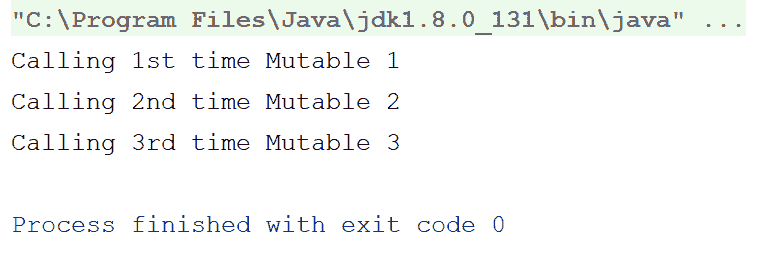
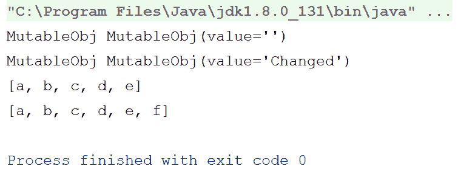
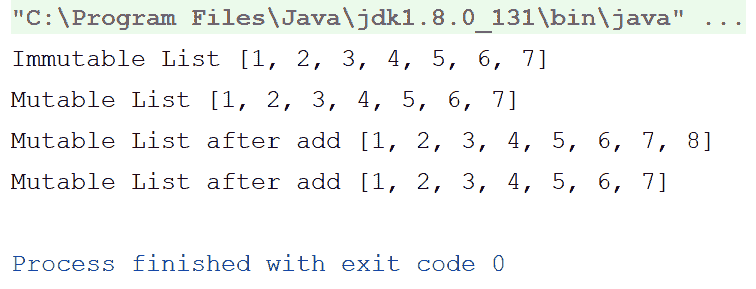
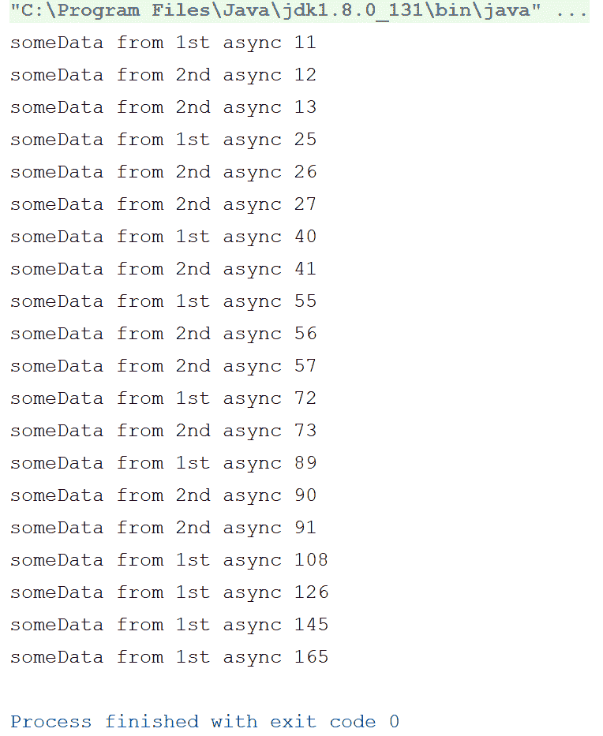
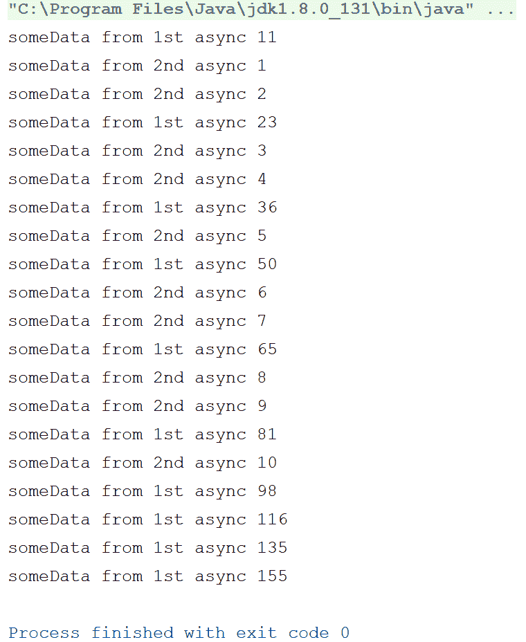

# 第三章：不可变性 - 它很重要

因此，我们现在进入了《函数式 Kotlin》的第三章。在本章中，我们将讨论不可变性。不可变性可能是函数式编程最重要的方面；实际上，不仅在函数式编程中，面向对象编程也通过不可变对象为培养不可变性留出了一些空间。那么，为什么它如此重要？这意味着什么？我们如何在 Kotlin 中实现不可变性？让我们在本章中回答这些问题。

以下是我们将在本章中讨论的要点：

+   什么是不可变性？

+   不可变性的优点

+   Kotlin 中如何实现不可变性？

+   变量中的不可变性

+   `val` 与 `var`

+   `val` 和 `const val`——它们真的是不可变的吗？

+   编译器优化

+   不可变集合

+   不可变性的缺点

# 什么是不可变性？

函数式编程由于其本质是线程安全的；不可变性在使其线程安全方面起着重要作用。如果你按照词典的定义，**不可变性**意味着某物是不可改变的。所以，按照词典，一个**不可变变量**是一个不能改变的变量。那么，这如何有助于线程安全？

以下示例展示了一个简单的类，没有额外的线程安全保护措施：

```java
class MutableObject { 
    var mutableProperty:Int = 1 
} 
```

想象一下同时从多个线程调用这个类的情况。这里没有保证完整性，对吧？

现在，假设将 `mutableProperty` 变为不可变的；问题部分解决了，对吧？

然而，如果你认为不可变性就是创建一个类并使其所有变量为只读，那么这样的简化解释不仅错误，而且糟糕。实际上，不可变性不是关于禁止改变，而是关于处理改变。不是直接改变属性的底层值，而是创建一个新的属性，并应用更改后复制值。这适用于 Kotlin 和 Java（甚至 C）中的原始数据类型。例如，在以下示例中，当我们编写 `var y = x.capitalize()` 时，`x` 的值保持不变，而是将应用更改后的 `x` 值复制到 `y`：

```java
fun main(args: Array<String>) { 
    var x:String = "abc" 
    var y = x.capitalize() 
    println("x = $x, y = $y") 
} 
```

大多数原始类型都以相同的方式操作；这就是所谓的**不可变性**。现在，让我们看看如何在 Kotlin 中实现不可变性，然后我们将探讨其优点和缺点。

# 在 Kotlin 中实现不可变性

与 Clojure、Haskell、F# 等语言不同，Kotlin 不是一个纯函数式编程语言，其中不可变性是强制性的；相反，我们可以将 Kotlin 称为函数式编程和面向对象语言完美融合的典范。它包含了两个世界的重大好处。因此，与纯函数式编程语言强制不可变性不同，Kotlin 鼓励不可变性，并在可能的情况下自动优先考虑它。

换句话说，Kotlin 有不可变变量（`val`），但没有保证状态真正深度不可变的语言机制。如果一个 `val` 变量引用了一个可变对象，其内容仍然可以被修改。我们将对此进行更详细的讨论和深入探讨，但首先让我们看看如何在 Kotlin 中实现引用不可变性和 `var`、`val` 和 `const val` 之间的区别。

通过真正的状态深度不可变性，我们指的是一个属性在每次被调用时都会返回相同的值，并且该属性永远不会改变其值；如果我们有一个具有自定义获取器的 `val` 属性，我们就可以轻松避免这种情况。更多详细信息，请参阅以下链接：[`artemzin.com/blog/kotlin-val-does-not-mean-immutable-it-just-means-readonly-yeah/`](https://artemzin.com/blog/kotlin-val-does-not-mean-immutable-it-just-means-readonly-yeah/)

# `var` 和 `val` 的区别

因此，为了鼓励不可变性，同时仍然让开发者有选择权，Kotlin 引入了两种类型的变量。第一种是 `var`，它只是一个简单的变量，就像在任何命令式语言中一样。另一方面，`val` 让我们更接近不可变性；再次强调，它并不保证不可变性。那么，`val` 变量究竟为我们提供了什么？它强制只读，初始化后你不能写入 `val` 变量。所以，如果你使用没有自定义获取器的 `val` 变量，你可以实现引用不可变性。

让我们看看；以下程序将无法编译：

```java
fun main(args: Array<String>) { 
    val x:String = "Kotlin" 
    x+="Immutable"//(1) 
} 
```

如我之前提到的，前面的程序将无法编译；它将在注释 `(1)` 处产生错误。因为我们已将变量 `x` 声明为 `val`，所以 `x` 将是只读的，一旦我们初始化 `x`，之后就不能修改它。

所以，你现在可能想知道为什么我们不能用 `val` 保证不可变性？让我们通过以下示例来检查：

```java
object MutableVal { 
    var count = 0 
    val myString:String = "Mutable" 
        get() {//(1) 
            return "$field ${++count}"//(2) 
        } 
} 

fun main(args: Array<String>) { 
    println("Calling 1st time ${MutableVal.myString}") 
    println("Calling 2nd time ${MutableVal.myString}") 
    println("Calling 3rd time ${MutableVal.myString}")//(3) 
} 
```

在这个程序中，我们将 `myString` 声明为一个 `val` 属性，但实现了一个自定义的 `get` 函数，我们在返回之前修改了 `myString` 的值。首先看看输出，然后我们将进一步查看程序：



如你所见，尽管 `myString` 属性是 `val`，但它每次被访问时都返回不同的值。现在，让我们查看代码以了解这种行为。

在注释 `(1)` 中，我们为 `val` 属性 `myString` 声明了一个自定义获取器。在注释 `(2)` 中，我们预增加了 `count` 的值，并将其添加到 `field` 值，即 `myString` 的值之后，并从获取器返回相同的值。所以，每次我们请求 `myString` 属性时，`count` 都会增加，在下一次请求时，我们得到不同的值。因此，我们破坏了 `val` 属性的不可变行为。

# 编译时常量

那么，我们如何克服这个问题？如何强制不可变性？`const val`属性就是为了帮助我们而存在的。只需将`val myString`修改为`const val myString`，您就不能实现自定义获取器。

虽然`val`属性是只读变量，但另一方面，`const val`是编译时常量。您不能将函数的结果（结果）分配给`const val`。让我们讨论一下`val`和`const val`之间的一些区别：

+   `val`属性是只读变量，而`const val`是编译时常量

+   `val`属性可以有自定义获取器，但`const val`不能

+   我们可以在 Kotlin 代码的任何地方拥有`val`属性，在函数内部，作为类成员，任何地方，但`const val`必须是一个类/对象的顶层成员

+   您不能为`const val`属性编写委托

+   我们可以拥有任何类型的`val`属性，无论是我们的自定义类还是任何原始数据类型，但只有原始数据类型和`String`可以使用`const val`属性

+   我们不能在`const val`属性中使用可空数据类型；因此，`const val`属性也不能有 null 值

因此，`const val`属性保证了值的不可变性，但灵活性较低，并且您必须仅使用原始数据类型与`const val`一起使用，这并不总是能满足我们的需求。

现在，我已经多次使用了“引用不可变性”这个词，让我们现在检查它的含义以及有多少种不可变性类型。

# 不可变性的类型

基本上有以下两种不可变性类型：

+   引用不可变性

+   不可变值

# 不可变引用（引用不可变性）

**引用不可变性**强制规定，一旦分配了引用，就不能将其分配给其他对象。想想看，就像它是一个自定义类的`val`属性，甚至是`MutableList`或`MutableMap`；初始化属性后，您不能从该属性引用其他对象，除非是对象的基本值。例如，考虑以下程序：

```java
class MutableObj { 
    var value = "" 

    override fun toString(): String { 
        return "MutableObj(value='$value')" 
    } 
} 

fun main(args: Array<String>) { 
    val mutableObj:MutableObj = MutableObj()//(1) 
    println("MutableObj $mutableObj") 
    mutableObj.value = "Changed"//(2) 
    println("MutableObj $mutableObj") 

    val list = mutableListOf("a","b","c","d","e")//(3) 
    println(list) 
    list.add("f")//(4) 
    println(list) 
} 
```

在我们解释程序之前，先看看输出结果：



因此，在这个程序中，我们有两个`val`属性——`list`和`mutableObj`。我们使用`MutableObj`的默认构造函数初始化`mutableObj`，因为它是一个`val`属性，它将始终引用那个特定的对象；但是，如果您关注注释（2），我们已经改变了`mutableObj`的`value`属性，因为`MutableObj`类的`value`属性是可变的（`var`）。

与 `list` 属性类似，我们可以在初始化后向列表中添加项目，改变其底层值。`list` 和 `mutableObj` 都是不可变引用的完美例子；一旦初始化，属性就不能被分配给其他东西，但它们的底层值可以改变（你可以参考输出）。背后的原因是分配给这些属性的 数据类型。`MutableObj` 类和 `MutableList<String>` 数据结构本身都是可变的，因此我们无法限制其实例的值变化。

# 不可变值

另一方面，**不可变值**同样不允许对值进行更改；维护起来非常复杂。在 Kotlin 中，`const val` 属性强制值的不可变性，但它们缺乏灵活性（我们已讨论过它们）并且你只能使用原始类型，这在实际场景中可能会带来麻烦。

# 不可变集合

Kotlin 在可能的情况下会优先考虑不可变性，但将选择权留给开发者，决定是否以及何时使用它。这种选择权使语言更加强大。与大多数语言不同，它们要么只有可变集合（如 Java、C# 等），要么只有不可变集合（如 F#、Haskell、Clojure 等），Kotlin 两者都有，并且区分它们，让开发者有选择使用不可变或可变集合的自由。

Kotlin 为集合对象提供了两个接口——`Collection<out E>` 和 `MutableCollection<out E>`；所有集合类（例如 `List`、`Set` 或 `Map`）都实现了这两个接口之一。正如其名所示，这两个接口是为不可变和可变集合分别设计的。让我们举一个例子：

```java
fun main(args: Array<String>) { 
    val immutableList = listOf(1,2,3,4,5,6,7)//(1) 
    println("Immutable List $immutableList") 
    val mutableList:MutableList<Int> = immutableList.toMutableList()//(2) 
    println("Mutable List $mutableList") 
    mutableList.add(8)//(3) 
    println("Mutable List after add $mutableList") 
    println("Mutable List after add $immutableList") 
} 
```

输出如下：



因此，在这个程序中，我们通过 Kotlin 的 `listOf` 方法创建了一个不可变列表，注释（1）中提到。`listOf` 方法使用传递给它的元素（可变参数）创建一个不可变列表。此方法还有一个泛型类型参数，如果元素数组不为空，则可以省略。`listOf` 方法还有一个可变版本——`mutableListOf()`，除了返回 `MutableList` 而外，其余都相同。我们可以使用 `toMutableList()` 扩展函数将不可变列表转换为可变列表，注释（2）中我们就是这样做的，以便在注释（3）中向其添加一个元素。然而，如果你检查输出，原始的 `Immutable List` 没有任何变化，而项目已经被添加到了新创建的 `MutableList` 中。

# 不可变性的优势

我们已经多次提到，不可变性带来了安全性，但这并非全部；以下是一个简短的列表，列出了不可变性带来的优势，我们将逐一讨论：

+   线程安全

+   低耦合

+   引用透明性

+   失败原子性

+   编译器优化

+   纯函数

让我们逐一讨论这些优点，以便更好地理解它们。

# 线程安全

我们可能已经看到过一千次不可变性如何带来线程安全。这实际上意味着什么？不可变性是如何实现线程安全的？与多个线程一起工作本身就是一项复杂的工作。当你从多个线程访问一个类时，你需要确保某些事情，比如锁定和释放对象以及同步，但如果你从多个线程访问任何不可变数据，则不需要这些。

感到困惑？让我们用一个关于线程和可变数据的例子来说明：

```java
class MyData { 
    var someData:Int = 0 
} 

fun main(args: Array<String>) { 
    val myData:MyData = MyData() 

    async(CommonPool) { 
        for(i in 11..20) { 
            myData.someData+=i 
            println("someData from 1st async ${myData.someData}") 
            delay(500) 
        } 
    } 

    async(CommonPool) { 
        for(i in 1..10) { 
            myData.someData++ 
            println("someData from 2nd async ${myData.someData}") 
            delay(300) 
        } 
    } 

    runBlocking { delay(10000) } 
} 
```

在这个程序中，我们使用了两个协程（我们将在第七章中详细讨论协程，*使用协程的异步处理*），它们在相同的数据上工作。让我们看看以下输出，然后我们将描述和讨论这个程序中的问题：



因此，仔细观察输出。由于两个协程同时在工作`myData.someData`上，数据一致性在任何一个中都没有得到保证。

解决这个问题的传统方法是使用锁定-释放技术和同步，但这样你也需要为它编写大量的代码，并且为了避免在实现锁定和释放数据时出现死锁。

函数式编程通过不可变性提供了一个一站式解决方案来解决这个问题。让我们看看不可变性和局部变量如何在多线程中拯救你：

```java
class MyDataImmutable { 
    val someData:Int = 0 
} 

fun main(args: Array<String>) { 
    val myData: MyDataImmutable = MyDataImmutable() 

    async(CommonPool) { 
        var someDataCopy = myData.someData 
        for (i in 11..20) { 
            someDataCopy += i 
            println("someData from 1st async $someDataCopy") 
            delay(500) 
        } 
    } 

    async(CommonPool) { 
        var someDataCopy = myData.someData 
        for (i in 1..10) { 
            someDataCopy++ 
            println("someData from 2nd async $someDataCopy") 
            delay(300) 
        } 
    } 

    runBlocking { delay(10000) } 
} 
```

我们修改了之前的程序，将`someData`设置为不可变（因为我们不使用这个变量的自定义获取器，所以它将保持不可变）并在两个协程内部使用了局部变量。

看看以下输出；它清楚地表明问题已解决：



# 低耦合

线程之间的代码依赖性被称为耦合。我们应该尽量降低耦合度，以避免复杂性并使代码库易于阅读和维护。现在，这实际上意味着什么？请参考我们访问和修改`someData`值的程序，该程序使用了线程。这可以被称为**耦合**，因为两个线程都相互依赖。为了您的参考，我们复制了以下代码片段：

```java
async(CommonPool) { 
        for(i in 11..20) { 
            myData.someData+=i 
            println("someData from 1st async ${myData.someData}") 
            delay(500) 
        } 
    } 

    async(CommonPool) { 
        for(i in 1..10) { 
            myData.someData++ 
            println("someData from 2nd async ${myData.someData}") 
            delay(300) 
        } 
    } 
```

在下一个程序中，我们引入了不可变性，耦合度降低了。在这里，两个线程都在读取相同的元素，但一个线程的操作和更改没有影响到另一个线程。

# 引用透明性

**引用透明性**的概念表明，一个表达式总是评估为相同的值，无论上下文或任何其他变化。更具体地说，你可以用一个函数的返回值来替换该函数。

通过纯函数的帮助，不可变性可以建立引用透明性。引用透明性强烈否认数据的可变状态。

# 失败原子性

在传统编程中，一个线程的失败很容易影响另一个线程。由于不可变性强制低耦合，即使我们在任何模块/线程上有异常，应用程序的内部状态也将保持一致。

原因很简单，不可变对象永远不会改变状态。因此，即使某个部分/模块/线程发生故障，它就会停止，并且没有机会传播到应用程序的其他部分。

# 缓存

由于不可变对象不会改变，它们可以很容易地缓存以提高性能。因此，你可以轻松避免对同一函数/变量进行多次调用，而是将其本地缓存，从而节省大量处理时间。以下是一些缓存的优势：

+   它减少了服务器资源的开销

+   通过提供缓存的输出，它提高了应用程序的性能

+   通过在内存中持久化数据，它减少了从数据库获取数据的 CPU 循环次数

+   它增加了可靠性

# 编译器优化

不可变性和引用透明性有助于编译器执行广泛的优化，取代了手动优化代码的需要，并使程序员从这种权衡中解脱出来。

例如，当你使用编译时常量（`const val`）时，这适用，因为编译器知道这些变量的值永远不会改变。

# 纯函数

通过使用不可变性，我们可能得到的最大礼物是*纯函数*（下一章将介绍）。基本上，纯函数和不可变性不仅是伴侣，而且是互补的。

没有不可变性，我们无法实现纯函数，而没有纯函数，不可变性也不完整。

因此，既然我们已经了解了不可变性和其优点，那么现在让我们关注另一方面：不可变性的缺点，并检查它们是否真的是缺点。

# 不可变性的缺点

世界上没有只带来好处的东西。

有一个伟大的谚语：一切皆有其价。

你能听到的唯一反对不可变性的说法是，每次你想修改它时都需要创建一个新的对象。在某些情况下这是真的，尤其是在你处理大量对象时。然而，当你处理小数据集或对象时，它没有任何影响。

# 摘要

在本章中，我们学习了不可变性和如何使用 Kotlin 实现不可变性。我们了解到 Kotlin 为我们提供了根据需求选择不可变对象或可变对象的自由。我们不仅讨论了不可变性的优点，还讨论了其局限性。

下一章将重点介绍函数、函数类型和副作用。我们还将学习纯函数，它们不仅是不可变性的伴侣，而且是不可变性的补充部分，将在下一章中介绍。

那你还在等什么？现在就翻页吧。
