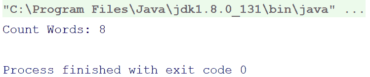
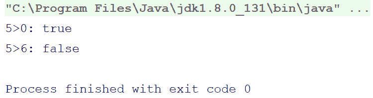
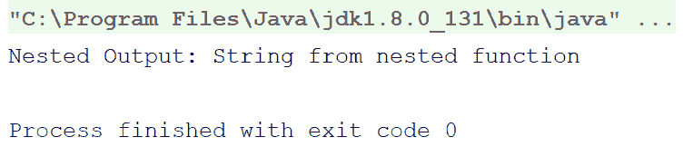
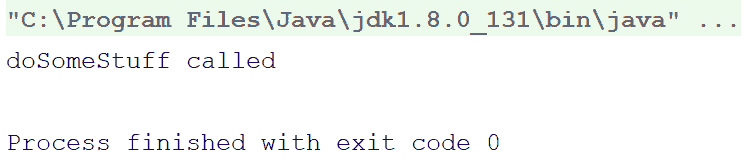
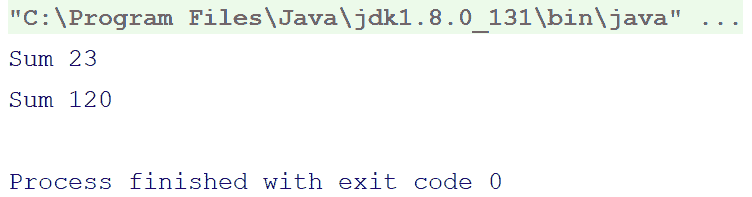
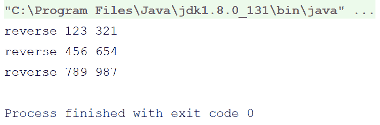
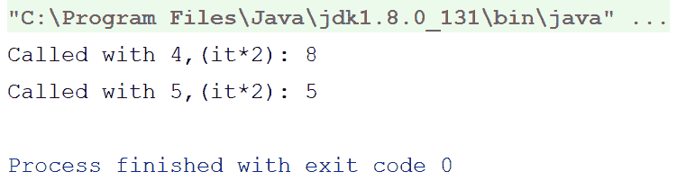
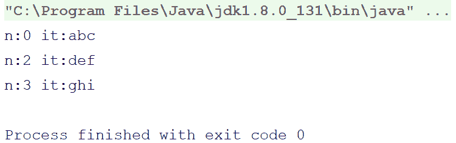

# 函数、函数类型和副作用

函数式编程围绕不可变性和函数的概念展开。我们在上一章学习了不可变性；在讨论不可变性时，我们也对纯函数有了一定的了解。纯函数基本上是函数式编程提供的许多类型（但可能是最重要的一种）之一。

本章将围绕函数展开。要深入了解函数式编程，你需要对函数有坚实的基础。为了使你的概念清晰，我们将从普通的 Kotlin 函数开始，然后逐步讨论函数式编程定义的抽象函数概念。我们还将看到它们在 Kotlin 中的实现。

在本章中，我们将涵盖以下主题：

+   Kotlin 中的函数

+   函数类型

+   Lambda

+   高阶函数

+   理解副作用和纯函数

因此，让我们从定义函数开始。

# Kotlin 中的函数

函数是编程中最重要的一部分。我们每周都要为我们的项目编写大量的函数。函数也是编程基础的一部分。为了学习函数式编程，我们必须对函数的概念有清晰的认识。在本节中，我们将介绍函数的基础知识，以便让你为下一节做好准备，在下一节中，我们将讨论抽象的函数概念及其在 Kotlin 中的实现。

因此，让我们先定义函数。

**函数**是一块组织良好、可重用的代码块，用于执行单个、相关的操作。

不太清楚？我们将解释，但首先，让我们了解为什么我们应该编写函数。简而言之，函数的功能是什么？看看：

+   函数允许我们将程序分解成一系列步骤和子步骤

+   函数鼓励代码重用

+   如果正确使用，函数可以帮助我们保持代码的整洁、有序和易于理解

+   函数使测试（单元测试）变得容易，测试程序的小部分比一次性测试整个程序要容易

在 Kotlin 中，函数通常看起来像以下这样：

```kt
fun appropriateFunctionName(parameter1:DataType1, parameter2:DataType2,...): ReturnType { 
    //do your stuff here 
    return returnTypeObject 
} 
```

在 Kotlin 中，函数声明以 `fun` 关键字开头，后跟函数名，然后是括号。在括号内，我们可以指定函数参数（可选）。括号之后，会有一个冒号（`:`）和返回类型，它指定了要返回的值/对象的类型（如果你不打算从函数中返回任何内容，可以省略返回类型；在这种情况下，函数将被分配默认返回类型 `Unit`）。之后，会有函数体，用花括号括起来（对于单表达式函数，花括号是可选的，将在第五章中介绍，*更多关于函数的内容*)。

`Unit` 是 Kotlin 中的一个数据类型。`Unit` 是其自身的单例实例，并持有 `Unit` 自身的值。`Unit` 对应于 Java 中的 `void`，但它与 `void` 非常不同。虽然 `void` 在 Java 中意味着没有东西，且 `void` 不能包含任何东西，但在 Kotlin 中我们有 `Nothing` 用于此目的，它表示函数永远不会成功完成（由于异常或无限循环）。

现在，那些返回类型、参数（参数）和函数体是什么？让我们来探索它们。

以下是一个比之前展示的抽象函数更现实的函数示例：

```kt
fun add(a:int, b:Int):Int { 
   val result = a+b 
   return result 
} 
```

现在，让我们看看以下关于函数各部分的解释：

+   **函数参数/参数**：这些是函数要处理的数据（除非是 lambda）。在我们的例子中，`a` 和 `b` 是函数参数。

+   **函数体**：我们写在函数花括号内的所有内容都称为 **函数体**。它是函数的一部分，我们在其中编写逻辑或指令集以完成特定任务。在前面的例子中，花括号内的两行是函数体。

+   **返回语句，数据类型**：如果我们愿意从函数中返回某个值，我们必须声明我们愿意返回的值的类型；这个类型被称为 `return` 类型——在这种情况下，`Int` 是 `return` 类型，`return result` 是返回语句，它使您能够向调用函数返回一个值。

我们可以通过删除 `val result = a+b` 并用 `return a+b` 替换返回语句来使前面的例子更短。在 Kotlin 中，我们可以进一步缩短这个例子，正如我们将在第五章 更多关于函数 中看到的。

虽然编写函数很容易，但 Kotlin 使之更加容易。

Kotlin 将各种功能捆绑到函数中，使开发者的生活更加轻松。以下是 Kotlin 捆绑的特性的简要列表：

+   单表达式函数

+   扩展函数

+   内联函数

+   中缀表示法及其他

我们将在第五章 更多关于函数 的 *Lambda，泛型，递归，核心递归* 部分详细介绍它们。

# 从函数中返回两个值

虽然，通常函数只能返回单个值，但在 Kotlin 中，通过利用 `Pair` 类型的优势和结构化声明的优势，我们可以从函数中返回两个变量。考虑以下示例：

```kt
fun getUser():Pair<Int,String> {//(1) 
    return Pair(1,"Rivu") 
} 
fun main(args: Array<String>) { 
    val (userID,userName) = getUser()//(2) 
     println("User ID: $userID t User Name: $userName") 
} 
```

在前面的程序中，在注释 `(1)` 处，我们创建了一个将返回 `Pair<Int,String>` 值的函数。

在注释`(2)`中，我们以似乎返回两个变量的方式使用了该函数。实际上，解构声明允许你解构一个`data class`/`Pair`并获取其底层值作为独立的变量。当这个特性与函数一起使用时，它似乎函数返回多个值，尽管它只返回一个值，这个值是一个`Pair`值或另一个`data class`。

# 扩展函数

Kotlin 为我们提供了扩展函数。它们是什么？它们是在现有数据类型/类之上的一种临时函数。

例如，如果我们想计算字符串中的单词数，以下是一个传统的函数来完成这个任务：

```kt
fun countWords(text:String):Int { 
    return text.trim() 
            .split(Pattern.compile("\s+")) 
            .size 
} 
```

我们会将一个`String`传递给一个函数，让我们的逻辑计算单词数，然后我们会返回这个值。

但你不觉得如果有一种方法可以直接在`String`实例上调用这个函数会更好吗？Kotlin 允许我们执行这样的操作。

看看以下程序：

```kt
fun String.countWords():Int { 
    return trim() 
            .split(Pattern.compile("\s+")) 
            .size 
} 
```

仔细看看函数声明。我们声明了函数为`String.countWords()`，而不是像之前那样只是`countWords`；这意味着现在应该在一个`String`实例上调用它，就像`String`类的成员函数一样。就像以下代码：

```kt
fun main(args: Array<String>) { 
    val counts = "This is an example StringnWith multiple words".countWords() 
    println("Count Words: $counts") 
} 
```

你可以查看以下输出：



# 默认参数

我们可能有一个要求，即希望函数有一个可选参数。考虑以下示例：

```kt
fun Int.isGreaterThan(anotherNumber:Int):Boolean { 
    return this>anotherNumber 
} 
```

我们希望`anotherNumber`参数是可选的；如果我们没有将其作为参数传递，我们希望它是`0`。传统的方法是有一个没有参数的重载函数，它会用`0`调用这个函数，如下所示：

```kt
fun Int.isGreaterThan(anotherNumber:Int):Boolean { 
    return this>anotherNumber 
} 
fun Int.isGreaterThan():Boolean { 
    return this.isGreaterThan(0) 
} 
```

然而，在 Kotlin 中，事情相当简单直接，并且它们不需要我们再次定义函数来仅使参数可选。为了使参数可选，Kotlin 为我们提供了默认参数，通过它我们可以在声明函数时立即指定默认值。

以下是被修改后的函数：

```kt
fun Int.isGreaterThan(anotherNumber:Int=0):Boolean { 
    return this>anotherNumber 
} 
```

我们会使用`main`函数如下：

```kt
fun main(args: Array<String>) { 
    println("5>0: ${5.isGreaterThan()}") 
    println("5>6: ${5.isGreaterThan(6)}") 
} 
```

对于第一个，我们跳过了参数，对于第二个，我们提供了`6`。所以，对于第一个，输出应该是 true（因为`5`确实大于`0`），而对于第二个，它应该是 false（因为`5`不大于`6`）。

以下截图输出确认了相同的结果：



# 嵌套函数

Kotlin 允许你在函数内部嵌套函数，我们可以在另一个函数内部声明和使用函数。

当你在另一个函数内部声明一个函数时，嵌套函数的可见性将仅限于父函数，并且不能从外部访问。

因此，让我们举一个例子：

```kt
fun main(args: Array<String>) { 
    fun nested():String { 
        return "String from nested function" 
    } 
    println("Nested Output: ${nested()}") 
} 
```

在前面的程序中，我们在`main`函数内部声明并使用了一个函数——`nested()`。

以下是你好奇的输出：



因此，我们在函数的基本知识上已经做好准备，让我们继续学习函数式编程。在下一节中，我们将学习函数类型。

# 函数式编程中的函数类型

函数式编程的主要目标之一是实现模块化编程。副作用（一个将在本章后面定义的功能性术语）通常是 bug 的来源；函数式编程希望你能完全避免副作用。

为了实现这一点，函数式编程定义了以下类型的函数：

+   Lambda 函数作为属性

+   高阶函数

+   纯函数

+   部分函数

在本节中，我们将按顺序讨论这些概念，以便对函数式编程范式有一个牢固的把握。

那么，让我们从 lambda 开始吧。

# Lambda

Lambda，也可以称为**匿名函数**，在 Kotlin 中具有一等公民的支持。而 Java 中，lambda 的支持是从 Java 8 开始的，在 Kotlin 中，你可以从 JVM 6 开始使用 Kotlin，因此在 Kotlin 中实际上没有 lambda 的障碍。

现在，我们正在谈论 lambda、匿名类（或对象）和匿名函数，但它们究竟是什么呢？让我们来探索一下。

为了通用，lambda 或 lambda 表达式通常指的是**匿名函数**，即没有名称的函数，可以被赋值给变量、作为参数传递或从另一个函数返回。它是一种嵌套函数，但更灵活、更灵活。你还可以说所有的 lambda 表达式都是函数，但并非所有函数都是 lambda 表达式。匿名和无名称给 lambda 表达式带来了很多好处，我们将在下面讨论。

如我之前提到的，并非所有语言都支持 lambda，Kotlin 是其中最罕见的一种语言，它为 lambda 提供了广泛的支持。

那么，为什么叫 lambda 呢？现在让我们挖掘一点历史吧。

Lambda，Λ，**λ**（大写Λ，小写λ）是希腊字母的第 11 个字母。发音：lám(b)da。

来源：[`en.wikipedia.org/wiki/Lambda`](https://en.wikipedia.org/wiki/Lambda)

在 20 世纪 30 年代，当时在普林斯顿大学学习数学的 Alonzo Church，使用希腊字母，特别是 lambda，来表示他所称的**函数**。需要注意的是，当时计算机中只有匿名函数；现代命名函数的概念尚未出现。

因此，随着 Alonzo Church 的这种实践，lambda 这个词就与匿名函数（那时唯一的函数类型）联系在了一起，时至今日，它仍然以同样的方式被引用。

阿隆佐·丘奇（1903 年 6 月 14 日-1995 年 8 月 11 日），是一位美国数学家和逻辑学家，他对数学逻辑和理论计算机科学的基础做出了重大贡献。他最著名的是λ演算、*丘奇-图灵*猜想、证明*决定问题*的不可判定性、*弗雷格-丘奇*本体论和*丘奇-罗素*定理。他还从事语言哲学的研究（例如，丘奇，1970 年）。

来源：[`en.wikipedia.org/wiki/Alonzo_Church`](https://en.wikipedia.org/wiki/Alonzo_Church)

你不觉得我们已经对理论足够了吗？我们不应该现在专注于学习 lambda 实际上是什么，或者它究竟看起来像什么吗？我们将查看 Kotlin 中 lambda 的样子，但我们更愿意先向您介绍 Java 中的 lambda，然后在 Kotlin 中介绍，以便您完全理解 lambda 在 Kotlin 中拥有多大的力量，以及“一等公民”支持的确切含义。您还将了解 Java 和 Kotlin 中 lambda 的区别。

考虑以下 Java 示例。这是一个简单的例子，其中我们将接口的一个实例传递给一个方法，并在该方法中调用该实例的方法：

```kt
public class LambdaIntroClass { 
    interface SomeInterface { 
        void doSomeStuff(); 
    } 
    private static void invokeSomeStuff(SomeInterface someInterface) { 
        someInterface.doSomeStuff(); 
    } 
    public static void main(String[] args) { 
        invokeSomeStuff(new SomeInterface() { 
            @Override 
            public void doSomeStuff() { 
                System.out.println("doSomeStuff invoked"); 
            } 
        }); 
    } 
} 
```

因此，在这个程序中，`SomeInterface`是一个接口（`LambdaIntroClass`的内部接口），只有一个方法——`doSomeStuff()`。静态方法`invokeSomeStuff`（为了使它可以通过`main`方法轻松访问而设置为静态）接受`SomeInterface`的一个实例，并调用其`doSomeStuff()`方法。

这只是一个简单的例子；现在，让我们让它更简单：让我们给它添加 lambda 表达式。看看以下更新的代码：

```kt
public class LambdaIntroClass { 
    interface SomeInterface { 
        void doSomeStuff(); 
    } 
    private static void invokeSomeStuff(SomeInterface someInterface) { 
        someInterface.doSomeStuff(); 
    }   
    public static void main(String[] args) { 
        invokeSomeStuff(()->{ 
                System.out.println("doSomeStuff called"); 
        }); 
    } 
} 
```

因此，在这里，`SomeInterface`和`invokeSomeStuff()`的定义保持不变。唯一的不同之处在于传递`SomeInterface`的实例。我们不是用一个新的`SomeInstance`创建`SomeInstance`的实例，而是写了一个表达式（粗体），这个表达式看起来非常像数学函数表达式（除了显然的`System.out.println()`）。这个表达式被称为**lambda 表达式**。

难道这不是很棒吗？你不需要创建接口的实例，然后重写方法等所有这些操作。你所做的是一个非常简单的表达式。这个表达式将被用作接口内部`doSomeStuff()`方法的主体。

两个程序输出的结果相同；如下截图所示：



Java 没有 lambda 的类型；你只能使用 lambda 在运行时创建类和接口的实例。Java 中 lambda 的唯一好处是它使 Java 程序更容易阅读（对人类来说），并减少了行数。

我们实际上不能责怪 Java。毕竟，Java 基本上是一种纯面向对象的语言。另一方面，Kotlin 是面向对象和函数式编程范式的完美结合；它将这两个世界更紧密地联系在一起。用我们的话说，如果你想在了解面向对象编程的基础上开始函数式编程，Kotlin 是最好的语言。

所以，不再有讲座了，让我们继续看代码。现在让我们看看同样的程序在 Kotlin 中的样子：

```kt
fun invokeSomeStuff(doSomeStuff:()->Unit) { 
    doSomeStuff() 
} 
fun main(args: Array<String>) { 
    invokeSomeStuff({ 
        println("doSomeStuff called"); 
    }) 
} 
```

是的，这就是完整的程序（好吧，除了 `import` 语句和包名）。我知道你有点困惑；你在问这真的是同一个程序吗？接口定义在哪里呢？嗯，在 Kotlin 中实际上并不需要。

`invokeSomeStuff()` 函数实际上是一个高阶函数（将在下一节中介绍）；我们向那里传递我们的 lambda，它直接调用该函数。

太棒了，不是吗？Kotlin 有很多与 lambda 相关的特性。让我们看看它们。

# 函数作为属性

Kotlin 还允许我们将函数作为属性。函数作为属性意味着函数可以用作属性。

例如，看看以下示例：

```kt
fun main(args: Array<String>) { 
    val sum = { x: Int, y: Int -> x + y }  
    println("Sum ${sum(10,13)}") 
    println("Sum ${sum(50,68)}") 
} 
```

在前面的程序中，我们创建了一个属性 `sum`，它实际上将持有一个用于添加传递给它的两个数字的函数。

虽然 `sum` 是一个 `val` 属性，但它持有的是一个函数（或 lambda），我们可以像调用常规函数一样调用这个函数；这里没有任何区别。

如果你好奇，以下就是输出：



现在，让我们讨论 lambda 的语法。

在 Kotlin 中，lambda 总是包含在大括号内。这使得 lambda 很容易识别，与 Java 不同，在 Java 中参数/参数位于大括号之外。在 Kotlin 中，参数/参数位于大括号内，由 (`->`) 与函数的逻辑分开。lambda 中的最后一个语句（可能只是一个变量/属性名或另一个函数调用）被视为返回语句。所以，lambda 最后一个语句的评估结果就是 lambda 的返回值。

此外，如果你的函数是单参数函数，你也可以省略属性名。那么，如果你不指定名称，你如何使用那个参数呢？Kotlin 为你提供了一个默认的 `it` 属性，用于单参数 lambda，其中你未指定属性名。

因此，让我们修改之前的 lambda 来添加它。看看下面的代码：

```kt
reverse = { 
        var n = it 
        var revNumber = 0 
        while (n>0) { 
            val digit = n%10 
            revNumber=revNumber*10+digit 
            n/=10 
        } 
        revNumber 
} 
```

我们跳过了完整的程序和输出，因为它们保持不变。

你一定注意到了，我们将函数参数的值赋给了另一个 `var` 属性（无论是当参数被命名还是用 `it` 表示时）。原因是，在 Kotlin 中，函数参数是不可变的，但与反向数字程序相比，我们需要一种改变值的方法；因此，我们将值赋给一个可变的 `var` 属性。

现在，你有了 lambda 作为属性，但它们的数据类型是什么呢？每个属性/变量都有一个数据类型（即使类型是推断的），那么 lambda 呢？让我们看看以下示例：

```kt
fun main(args: Array<String>) { 
    val reverse:(Int)->Int//(1) 
    reverse = {number -> 
        var n = number 
        var revNumber = 0 
        while (n>0) { 
            val digit = n%10 
            revNumber=revNumber*10+digit 
            n/=10 
        } 
        revNumber 
    }// (2) 
    println("reverse 123 ${reverse(123)}") 
    println("reverse 456 ${reverse(456)}") 
    println("reverse 789 ${reverse(789)}") 
} 
```

在前面的程序中，我们声明了一个`reverse`属性作为函数。在 Kotlin 中，当你将属性声明为函数时，你应该在括号内提及参数/参数的数据类型，然后是一个箭头，然后是函数的返回类型；如果函数不打算返回任何内容，你应该提及`Unit`。在将函数声明为属性时，你不需要指定参数/参数的名称，而在定义/分配函数到属性时，你可以省略提供属性的数据类型。

以下是输出结果：



因此，我们在 Kotlin 中对 lambda 和函数作为属性有了一个很好的理解。现在，让我们继续探讨高阶函数。

# 高阶函数

高阶函数是一个接受另一个函数作为参数或返回另一个函数的函数。我们刚刚看到我们可以如何将函数用作属性，所以很容易看出我们可以接受另一个函数作为参数，或者我们可以从函数中返回另一个函数。如前所述，技术上接收或返回另一个函数（可能不止一个）或两者兼而有之的函数被称为**高阶****函数**。

在 Kotlin 的第一个 lambda 示例中，`invokeSomeStuff`函数是一个高阶函数。

以下是一个高阶函数的另一个示例：

```kt
fun performOperationOnEven(number:Int,operation:(Int)->Int):Int { 
    if(number%2==0) { 
        return operation(number) 
    } else { 
        return number 
    } 
} 
fun main(args: Array<String>) { 
    println("Called with 4,(it*2): ${performOperationOnEven(4, 
            {it*2})}") 
    println("Called with 5,(it*2): ${performOperationOnEven(5, 
            {it*2})}") 
} 
```

在前面的程序中，我们创建了一个高阶函数——`performOperationOnEven`，它将接受一个`Int`和一个对那个`Int`执行的操作的 lambda 表达式。唯一的限制是，如果该`Int`是偶数，该函数才会执行该操作。

这不是足够简单吗？让我们看看以下输出：



在我们之前的所有示例中，我们看到了如何将一个函数（lambda）传递给另一个函数。然而，这并不是高阶函数的唯一特性。高阶函数还允许你从它返回一个函数。

那么，让我们来探索一下。看看以下示例：

```kt
fun getAnotherFunction(n:Int):(String)->Unit { 
    return { 
        println("n:$n it:$it") 
    } 
} 
fun main(args: Array<String>) { 
    getAnotherFunction(0)("abc") 
    getAnotherFunction(2)("def") 
    getAnotherFunction(3)("ghi") 
} 
```

在前面的程序中，我们创建了一个函数`getAnotherFunction`，它将接受一个`Int`参数，并返回一个接受一个`String`值并返回`Unit`的函数。该`return`函数打印其参数（一个`String`）及其父参数（一个`Int`）。

看看以下输出：



在 Kotlin 中，技术上你可以有嵌套的高阶函数到任何深度。然而，这样做可能会造成更多的伤害而不是帮助，甚至可能破坏可读性。所以，你应该避免它们。

# 纯函数和副作用

因此，我们已经学习了 lambda 函数和高阶函数。它们是函数式编程中最有趣和最重要的主题之一。在本节中，我们将讨论副作用和纯函数。

因此，让我们首先定义副作用。然后我们将逐步转向纯函数。

# 副作用

在计算机程序中，当一个函数修改其自身作用域之外的任何对象/数据时，这被称为**副作用**。例如，我们经常编写修改全局或静态属性的函数，修改其参数之一，抛出异常，将数据写入显示或文件，甚至调用具有副作用的另一个函数。

例如，看看以下程序：

```kt
class Calc { 
    var a:Int=0 
    var b:Int=0 
    fun addNumbers(a:Int = this.a,b:Int = this.b):Int {  
        this.a = a 
        this.b = b 
        return a+b 
    } 
} 
fun main(args: Array<String>) { 
    val calc = Calc() 
    println("Result is ${calc.addNumbers(10,15)}") 
} 
```

前面的程序是一个简单的面向对象程序。然而，它包含副作用。`addNumbers()` 函数修改了 `Calc` 类的状态，这在函数式编程中是一种不良做法。

虽然我们无法避免一些函数的副作用，尤其是在我们访问 IO 和/或数据库等情况时，但应尽可能避免副作用。

# 纯函数

纯函数的定义表明，如果一个函数的返回值完全依赖于其参数/参数，那么这个函数可以被称为**纯函数**。所以，如果我们声明一个函数为 `fun func1(x:Int):Int`，那么它的返回值将严格依赖于其参数 `x`；比如说，如果你用 *3 N* 次调用 `func1`，那么每次调用的返回值都将相同。

定义还说明，纯函数不应主动或被动地引起副作用，也就是说，它不应直接引起副作用，也不应调用任何引起副作用的函数。

纯函数可以是 lambda 函数或命名函数。

那么，为什么它们被称为纯函数呢？原因很简单。编程函数起源于数学函数。随着时间的推移，编程函数演变成了包含多个任务并执行与传递参数处理无直接关系的匿名操作。因此，那些仍然类似于数学函数的函数被称为纯函数。

那么，让我们修改我们之前的程序，使其成为一个纯函数：

```kt
fun addNumbers(a:Int = 0,b:Int = 0):Int { 
    return a+b 
} 

fun main(args: Array<String>) { 
    println() 
} 
```

非常简单，不是吗？我们跳过了输出，因为这个程序真的很简单。

# 概述

在本章中，我们学习了函数，如何使用它们以及它们的分类。我们还介绍了 lambda 函数和高阶函数。我们学习了纯函数和副作用。

下一章将带你深入了解函数。正如我已经提到的，你需要掌握函数才能正确学习函数式编程。那么，你在等什么呢？现在就翻到下一页。
