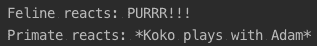

# 第五章：更多关于函数的内容

在前面的章节中，我们介绍了 Kotlin 函数的许多特性。但现在我们将扩展这些特性，其中大多数是从其他语言借用的，但它们在 Kotlin 的整体目标和风格中有一个新的转折——类型安全和实用简洁。

一些特性，例如**领域特定语言**（**DSLs**），允许开发者扩展语言以适应在 Kotlin 最初设计时未考虑到的领域。

在本章结束时，你将有一个关于所有函数特性的整体概念，包括：

+   扩展函数

+   操作符重载

+   类型安全的构建器

+   内联函数

+   递归和核心递归

# 单表达式函数

到目前为止，所有我们的例子都是以常规方式声明的。

`sum`函数接受两个`Int`类型的值并将它们相加。以常规方式声明，我们必须提供一个带有花括号和显式`return`的主体：

```kt
fun sum(a:Int, b:Int): Int {
   return a + b
}
```

我们的`sum`函数其主体在花括号内声明，并包含一个`return`子句。但如果我们的函数只是一个表达式，它也可以写成一行：

```kt
fun sum(a:Int, b:Int): Int = a + b
```

所以，没有花括号，没有`return`子句，并且有一个等于（`=`）符号。如果你注意的话，它看起来与 lambda 非常相似。

如果你想要减少更多字符，你还可以使用类型推断：

```kt
fun sum(a:Int, b:Int) = a + b
```

当返回类型非常明显时，可以使用类型推断来指定函数的返回类型。一个很好的经验法则是对于简单类型，如数值、布尔值、字符串和简单的`data class`构造函数使用它。任何更复杂的事情，特别是如果函数执行任何转换，都应该有显式的类型。你未来的自己会为此感到高兴！

# 参数

一个函数可以有零个或多个参数。我们的函数`basicFunction`接受两个参数，如下面的代码所示：

```kt
fun basicFunction(name: String, size: Int) {

}
```

每个参数都定义为`parameterName: ParameterType`，在我们的例子中，`name: String`和`size: Int`。这里没有什么新的。

# vararg

当参数有两种我们已经讨论过的类型时，事情变得有趣——`vararg`和 lambda：

```kt
fun aVarargFun(vararg names: String) {
   names.forEach(::println)
}

fun main(args: Array<String>) {
   aVarargFun()
   aVarargFun("Angela", "Brenda", "Caroline")
}
```

一个带有`vararg`修饰符的参数的函数可以用零个或多个值来调用：

```kt
fun multipleVarargs(vararg names: String, vararg sizes: Int) {
// Compilation error, "Multiple vararg-parameters are prohibited"
}
```

一个函数不能有多个`vararg`参数，即使是不同类型的也不行。

# Lambda

我们已经讨论了如果函数的最后一个参数是一个 lambda，它不能放在括号外和花括号内，就像 lambda 本身是控制结构的主体一样。

我们在第二章“开始函数式编程”的“一等和高级函数”部分介绍了这个`unless`函数。让我们看看以下代码：

```kt
fun unless(condition: Boolean, block: () -> Unit) {
   if (!condition) block()
}

unless(someBoolean) {
   println("You can't access this website")
}
```

现在，如果我们结合`vararg`和 lambda 会发生什么？让我们在下面的代码片段中检查一下：

```kt
fun <T, R> transform(vararg ts: T, f: (T) -> R): List<R> = ts.map(f)
```

Lambda 可以放在带有`vararg`参数的函数的末尾：

```kt
transform(1, 2, 3, 4) { i -> i.toString() }
```

让我们稍微冒险一点，一个 lambda 的`vararg`参数：

```kt
fun <T> emit(t: T, vararg listeners: (T) -> Unit) = listeners.forEach { listener ->
    listener(t)
}

emit(1){i -> println(i)} //Compilation error. Passing value as a vararg is only allowed inside a parenthesized argument list
```

我们不能将 lambda 放在括号外，但我们可以将多个 lambda 放在括号内：

```kt
emit(1, ::println, {i -> println(i * 2)})
```

# 命名参数

理想情况下，我们的函数不应该有太多的参数，但这并不总是如此。一些函数倾向于很大，例如，`data class` 构造函数（构造函数在技术上是一个返回新实例的函数）。

参数众多的函数有什么问题？

+   它们很难使用。这可以通过下一节中将要介绍的默认参数来缓解或修复。

+   它们很难阅读——命名参数来拯救。

+   它们可能做得太多。你确定你的函数不是太大了吗？尝试重构它并清理。寻找可能的副作用和其他有害做法。一个特殊情况是 `data class` 构造函数，因为它们只是自动生成的赋值。

使用命名参数，你可以增加任何函数调用的可读性。

让我们以 `data class` 构造函数为例：

```kt
typealias Kg = Double
typealias cm = Int

data class Customer(val firstName: String,
               val middleName: String,
               val lastName: String,
               val passportNumber: String,
               val weight: Kg,
               val height: cm)
```

正常调用将看起来像这样：

```kt
val customer1 = Customer("John", "Carl", "Doe", "XX234", 82.3, 180)
```

但包括命名参数将增加读者/维护者可获得的信息量，并减少心理工作。我们也可以以更方便或更有意义的顺序传递参数：

```kt
val customer2 = Customer(
      lastName = "Doe",
      firstName = "John",
      middleName = "Carl",
      height = 180,
      weight = 82.3,
      passportNumber = "XX234")
```

当与 `vararg` 参数结合使用时，命名参数非常有用：

```kt
fun paramAfterVararg(courseId: Int, vararg students: String, roomTemperature: Double) {
    //Do something here
}

paramAfterVararg(68, "Abel", "Barbara", "Carl", "Diane", roomTemperature = 18.0)
```

# 高阶函数上的命名参数

通常当我们定义高阶函数时，我们从不为 lambda(s) 命名参数：

```kt
fun high(f: (Int, String) -> Unit) {
   f(1, "Romeo")
}

high { q, w ->
    //Do something
}
```

但可以添加它们。因此，`f` lambda 现在有了命名的参数——`age` 和 `name`：

```kt
fun high(f: (age:Int, name:String) -> Unit) {
   f(1, "Romeo")
}
```

这不会改变任何行为，只是为了更清晰地说明这个 lambda 的预期用途：

```kt
fun high(f: (age:Int, name:String) -> Unit) {
   f(age = 3, name = "Luciana") //compilation error
}
```

但使用命名参数调用 lambda 是不可能的。在我们的例子中，使用名称调用 `f` 会导致编译错误。

# 默认参数

在 Kotlin 中，函数参数可以有默认值。对于 `Programmer`，`favouriteLanguage` 和 `yearsOfExperience` 数据类有默认值（记住，构造函数也是一个函数）：

```kt
data class Programmer(val firstName: String,
                 val lastName: String,
                 val favouriteLanguage: String = "Kotlin",
                 val yearsOfExperience: Int = 0)
```

因此，`Programmer` 可以只使用两个参数来创建：

```kt
val programmer1 = Programmer("John", "Doe")
```

但如果你想要传递 `yearsOfExperience`，它必须作为一个命名参数：

```kt
val programmer2 = Programmer("John", "Doe", 12) //Error

val programmer2 = Programmer("John", "Doe", yearsOfExperience = 12) //OK
```

如果你想要传递所有参数，你仍然可以这样做，但如果你不使用命名参数，它们必须以正确的顺序提供：

```kt
val programmer3 = Programmer("John", "Doe", "TypeScript", 1)
```

# 扩展函数

毫无疑问，Kotlin 最好的特性之一是扩展函数。扩展函数允许你使用新函数修改现有类型：

```kt
fun String.sendToConsole() = println(this)

fun main(args: Array<String>) {
   "Hello world! (from an extension function)".sendToConsole()
}
```

要向现有类型添加扩展函数，你必须将函数的名称写在类型名称旁边，并用点 (`.`) 连接。

在我们的例子中，我们向 `String` 类型添加了一个扩展函数 (`sendToConsole()`)。在函数体内部，`this` 指的是 `String` 类型的实例（在这个扩展函数中，`string` 是接收器类型）。

除了点（`.`）和`this`，扩展函数与普通函数具有相同的语法规则和功能。实际上，在幕后，扩展函数是一个普通函数，其第一个参数是接收者类型的值。因此，我们的`sendToConsole()`扩展函数等同于以下代码：

```kt
fun sendToConsole(string: String) = println(string)

sendToConsole("Hello world! (from a normal function)")
```

因此，实际上我们并没有通过新函数修改类型。扩展函数是一种非常优雅地编写实用函数的方法，易于编写，使用起来非常有趣，阅读起来也很愉快——双赢。这也意味着扩展函数有一个限制——它们不能访问`this`的私有成员，而一个合适的成员函数可以访问实例内的所有内容：

```kt
class Human(private val name: String)

fun Human.speak(): String = "${this.name} makes a noise" //Cannot access 'name': it is private in 'Human'
```

调用扩展函数与调用普通函数相同——使用接收者类型的实例（在扩展函数内部将引用为`this`），通过名称调用函数。

# 扩展函数与继承

当我们谈论继承时，成员函数和扩展函数之间有很大的区别。

开放类`Canine`有一个子类`Dog`。一个独立的函数`printSpeak`接收一个类型为`Canine`的参数，并打印函数`speak(): String`的结果内容：

```kt
open class Canine {
   open fun speak() = "<generic canine noise>"
}

class Dog : Canine() {
   override fun speak() = "woof!!"
}

fun printSpeak(canine: Canine) {
   println(canine.speak())
}
```

我们已经在第一章，“Kotlin – 数据类型、对象和类”，在*继承*部分中讨论了这一点。具有`open`方法的开放类（成员函数）可以被扩展并改变其行为。调用`speak`函数的行为将根据实例的类型而有所不同。

`printSpeak`函数可以用任何`is-a` `Canine`类的实例调用，无论是`Canine`本身还是任何子类：

```kt
printSpeak(Canine())
printSpeak(Dog())
```

如果我们执行此代码，我们可以在控制台上看到以下内容：


虽然两者都是`Canine`，但在两种情况下`speak`的行为都不同，因为子类覆盖了父类实现。

但与扩展函数不同，许多事情都不同。

与前面的示例一样，`Feline`是一个由`Cat`类扩展的开放类。但现在`speak`是一个扩展函数：

```kt
open class Feline

fun Feline.speak() = "<generic feline noise>"

class Cat : Feline()

fun Cat.speak() = "meow!!"

fun printSpeak(feline: Feline) {
   println(feline.speak())
}
```

扩展函数不需要标记为`override`，因为我们没有覆盖任何内容：

```kt
printSpeak(Feline())
printSpeak(Cat()
```

如果我们执行此代码，我们可以在控制台上看到以下内容：


在这种情况下，两次调用都产生相同的结果。虽然一开始看起来很混乱，但一旦分析清楚，就会变得清晰。我们调用了两次`Feline.speak()`函数；这是因为我们传递给`printSpeak(Feline)`函数的每个参数都是一个`Feline`：

```kt
open class Primate(val name: String)

fun Primate.speak() = "$name: <generic primate noise>"

open class GiantApe(name: String) : Primate(name)

fun GiantApe.speak() = "${this.name} :<scary 100db roar>"

fun printSpeak(primate: Primate) {
 println(primate.speak())
}

printSpeak(Primate("Koko"))
printSpeak(GiantApe("Kong"))
```

如果我们执行此代码，我们可以在控制台上看到以下内容：


在这种情况下，行为与前面的示例相同，但使用了正确的`name`值。说到这里，我们可以用`name`和`this.name`来引用`name`；两者都是有效的。

# 扩展函数作为成员

扩展函数可以声明为类的成员。声明了扩展函数的类的实例称为**调度接收器**。

`Caregiver`公开类内部定义了针对两个不同类`Feline`和`Primate`的扩展函数：

```kt
open class Caregiver(val name: String) {
   open fun Feline.react() = "PURRR!!!"

   fun Primate.react() = "*$name plays with ${this@Caregiver.name}*"

   fun takeCare(feline: Feline) {
      println("Feline reacts: ${feline.react()}")
   }

   fun takeCare(primate: Primate){
      println("Primate reacts: ${primate.react()}")
   }
}
```

这两个扩展函数都打算在`Caregiver`的实例内部使用。实际上，如果它们不是公开的，将成员扩展函数标记为私有是一个好习惯。

在`Primate.react()`的情况下，我们使用了`Primate`和`Caregiver`中的`name`值。要访问具有名称冲突的成员，扩展接收器（`this`）具有优先级，要访问调度接收器的成员，必须使用限定`this`语法。调度接收器的其他没有名称冲突的成员可以使用而不需要限定`this`。

不要被我们已经覆盖的各种`this`的用法所迷惑：

+   在类内部，`this`意味着该类的实例

+   在扩展函数内部，`this`意味着接收器类型的实例，就像我们工具函数中第一个参数的优雅语法一样：

```kt
class Dispatcher {
   val dispatcher: Dispatcher = this

   fun Int.extension(){
      val receiver: Int = this
      val dispatcher: Dispatcher = this@Dispatcher
   }
}
```

回到我们的*动物园*示例，我们实例化了一个`Caregiver`，一个`Cat`和一个`Primate`，并且我们使用这两个动物实例调用了`Caregiver.takeCare`函数：

```kt
val adam = Caregiver("Adam")

val fulgencio = Cat()

val koko = Primate("Koko")

adam.takeCare(fulgencio)
adam.takeCare(koko)
```

如果我们执行此代码，我们可以在控制台上看到以下内容：



任何动物园都需要兽医。类`Vet`扩展了`Caregiver`：

```kt
open class Vet(name: String): Caregiver(name) {
   override fun Feline.react() = "*runs away from $name*"
}
```

我们使用不同的实现覆盖了`Feline.react()`函数。我们还直接使用了`Vet`类的名称，因为`Feline`类没有属性名：

```kt
val brenda = Vet("Brenda")

listOf(adam, brenda).forEach { caregiver ->
   println("${caregiver.javaClass.simpleName} ${caregiver.name}")
   caregiver.takeCare(fulgencio)
   caregiver.takeCare(koko)
}

```

之后，我们得到以下输出：


# 具有冲突名称的扩展函数

当扩展函数与成员函数具有相同的名称时会发生什么？

`Worker`类有一个`work(): String`函数和一个私有函数`rest(): String`。我们还有两个具有相同签名的扩展函数，`work`和`rest`：

```kt
class Worker {
   fun work() = "*working hard*"

   private fun rest() = "*resting*"
}

fun Worker.work() = "*not working so hard*"

fun <T> Worker.work(t:T) = "*working on $t*"

fun Worker.rest() = "*playing video games*"
```

具有相同签名的扩展函数不会导致编译错误，但会发出警告：“扩展函数被成员覆盖：public final fun work(): String”

声明一个与成员函数具有相同签名的函数是合法的，但成员函数始终具有优先级，因此扩展函数永远不会被调用。当成员函数是私有的时，这种行为会改变，在这种情况下，扩展函数具有优先级。

使用扩展函数也可以重载现有的成员函数：

```kt
val worker = Worker()

println(worker.work())

println(worker.work("refactoring"))

println(worker.rest())
```

在执行时，`work()`调用成员函数，而`work(String)`和`rest()`是扩展函数：


# 对象的扩展函数

在 Kotlin 中，对象是一种类型，因此它们可以有函数，包括扩展函数（以及其他一些功能，如扩展接口等）。

我们可以向对象 `Builder` 添加一个 `buildBridge` 扩展函数：

```kt
object Builder {

}

fun Builder.buildBridge() = "A shinny new bridge"
```

我们可以包含伴随对象。类 `Designer` 有两个内部对象，`companion` 对象和 `Desk` 对象：

```kt
class Designer {
   companion object {

   }

   object Desk {

   }
}

fun Designer.Companion.fastPrototype() = "Prototype"

fun Designer.Desk.portofolio() = listOf("Project1", "Project2")
```

调用此函数的工作方式与任何正常对象成员函数一样：

```kt
Designer.fastPrototype()
Designer.Desk.portofolio().forEach(::println)
```

# 中缀函数

只有一个参数的函数（普通或扩展）可以标记为 `中缀` 并使用 `中缀` 表示法。对于某些领域，例如数学和代数运算，`中缀` 表示法有助于自然地表达代码。

让我们在 `Int` 类型上添加一个 `中缀` 扩展函数，`superOperation`（这只是一个带有花哨名称的常规求和）：

```kt
infix fun Int.superOperation(i: Int) = this + i

fun main(args: Array<String>) {
   1 superOperation 2
   1.superOperation(2)
}
```

我们可以使用 `superOperation` 函数以及 `中缀` 表示法或常规表示法。

另一个 `中缀` 表示法常用领域是断言库，例如 **HamKrest** ([`github.com/npryce/hamkrest`](https://github.com/npryce/hamkrest)) 或 **Kluent** ([`github.com/MarkusAmshove/Kluent`](https://github.com/MarkusAmshove/Kluent))。用自然、易于理解的语言编写规范代码是一个巨大的优势。

Kluent 断言看起来像自然的英语表达：

```kt
"Kotlin" shouldStartWith "Ko"
```

Kluent 还提供了一个反引号版本，以增强可读性：

```kt
"Kotlin" `should start with` "Ko"
```

反引号（`` ` ``）允许你编写任意标识符，包括 Kotlin 中保留的单词。现在，你可以编写自己的表情包函数：


你可以将许多 `中缀` 函数链式调用以生成内部 DSL，或者重新创建经典梗：

```kt
object All {
   infix fun your(base: Pair<Base, Us>) {}
}

object Base {
   infix fun are(belong: Belong) = this
}

object Belong

object Us

fun main(args: Array<String>) {
   All your (Base are Belong to Us)
}
```

`your` 函数接收 `Pair<Base, Us>` 作为参数（这是一种元组，它随 Kotlin 标准库提供并广泛使用）和 `中缀` 扩展函数 `<K, V> K.to(v: V)` 使用接收者作为第一个成员，参数作为第二个参数（`to` 可以用任何类型的组合调用）。

# 操作符重载

**操作符重载** 是一种多态形式。一些操作符在不同类型上会改变行为。经典的例子是操作符加 (`+`)。在数值上，加是求和操作，在 `String` 上是连接。操作符重载是提供自然表面 API 的有用工具。假设我们正在编写 `Time` 和 `Date` 库；在时间单位上定义加法和减法操作符将是自然的。

Kotlin 允许你使用函数定义自己的或现有类型的操作行为，无论是普通函数还是扩展函数，只要使用 `operator` 修饰符标记即可：

```kt
class Wolf(val name:String) {
   operator fun plus(wolf: Wolf) = Pack(mapOf(name to this, wolf.name to wolf))
}

class Pack(val members:Map<String, Wolf>)

fun main(args: Array<String>) {
   val talbot = Wolf("Talbot")
   val northPack: Pack = talbot + Wolf("Big Bertha") // talbot.plus(Wolf("..."))
}
```

操作符函数加返回一个 `Pack` 值。要调用它，你可以使用 `中缀` 操作符方式（`Wolf + Wolf`）或常规方式（`Wolf.plus(Wolf)`）。

关于 Kotlin 中操作符重载需要注意的一点是——你可以在 Kotlin 中重载的操作符是有限的；你不能创建任意的操作符。

# 二元操作符

二元操作符接收一个参数（有一些例外——`invoke` 和索引访问）。

`Pack.plus` 扩展函数接收一个 `Wolf` 参数并返回一个新的 `Pack`。注意，`MutableMap` 也具有加号（`+`）操作符：

```kt
operator fun Pack.plus(wolf: Wolf) = Pack(this.members.toMutableMap() + (wolf.name to wolf))

val biggerPack = northPack + Wolf("Bad Wolf")
```

下表将展示所有可能的可重载的二进制操作符：

| **操作符** | **等效** | **说明** |
| --- | --- | --- |
| `x + y` | `x.plus(y)` |  |
| `x - y` | `x.minus(y)` |  |
| `x * y` | `x.times(y)` |  |
| `x / y` | `x.div(y)` |  |
| `x % y` | `x.rem(y)` | 从 Kotlin 1.1 版本开始，之前为 `mod`. |
| `x..y` | `x.rangeTo(y)` |  |
| `x in y` | `y.contains(x)` |  |
| `x !in y` | `!y.contains(x)` |  |
| `x += y` | `x.plussAssign(y)` | 必须返回 `Unit`. |
| `x -= y` | `x.minusAssign(y)` | 必须返回 `Unit`. |
| `x *= y` | `x.timesAssign(y)` | 必须返回 `Unit`. |
| `x /= y` | `x.divAssign(y)` | 必须返回 `Unit`. |
| `x %= y` | `x.remAssign(y)` | 从 Kotlin 1.1 版本开始，之前为 `modAssign`。必须返回 `Unit`. |
| `x == y` | `x?.equals(y) ?: (y === null)` | 检查 `null`. |
| `x != y` | `!(x?.equals(y) ?: (y === null))` | 检查 `null`. |
| `x < y` | `x.compareTo(y) < 0` | 必须返回 `Int`. |
| `x > y` | `x.compareTo(y) > 0` | 必须返回 `Int`. |
| `x <= y` | `x.compareTo(y) <= 0` | 必须返回 `Int`. |
| `x >= y` | `x.compareTo(y) >= 0` | 必须返回 `Int`. |

# 调用

回到 第二章，*开始函数式编程*，在 *一等和高级函数* 部分，当我们介绍 lambda 函数时，展示了 `Function1` 的定义：

```kt
/** A function that takes 1 argument. */
public interface Function1<in P1, out R> : Function<R> {
    /** Invokes the function with the specified argument. */
    public operator fun invoke(p1: P1): R
}
```

`invoke` 函数是一个操作符，一个有趣的操作符。`invoke` 操作符可以在没有 `name` 的情况下被调用。

`Wolf` 类有一个 `invoke` 操作符：

```kt
enum class WolfActions {
   SLEEP, WALK, BITE
}

class Wolf(val name:String) {
   operator fun invoke(action: WolfActions) = when (action) {
      WolfActions.SLEEP -> "$name is sleeping"
      WolfActions.WALK -> "$name is walking"
      WolfActions.BITE -> "$name is biting"
   }
}

fun main(args: Array<String>) {
   val talbot = Wolf("Talbot")

   talbot(WolfActions.SLEEP) // talbot.invoke(WolfActions.SLEEP)
}
```

正因如此，我们可以直接用括号调用 lambda 函数；实际上，我们是在调用 `invoke` 操作符。

下表将展示 `invoke` 函数的不同声明及其不同参数数量：

| **操作符** | **等效** | **说明** |
| --- | --- | --- |
| `x()` | `x.invoke()` |  |
| `x(y)` | `x.invoke(y)` |  |
| `x(y1, y2)` | `x.invoke(y1, y2)` |  |
| `x(y1, y2..., yN)` | `x.invoke(y1, y2..., yN)` |  |

# 索引访问

索引访问操作符是使用方括号（`[]`）的数组读写操作，用于具有类似 C 语法语法的语言。在 Kotlin 中，我们使用 `get` 操作符进行读取，使用 `set` 进行写入。

使用 `Pack.get` 操作符，我们可以将 `Pack` 当作数组使用：

```kt
operator fun Pack.get(name: String) = members[name]!!

val badWolf = biggerPack["Bad Wolf"]
```

大多数 Kotlin 数据结构都有一个 `get` 操作符的定义，在这种情况下，`Map<K, V>` 返回一个 `V?`。

下表将展示 `get` 函数的不同声明及其不同参数数量：

| **操作符** | **等效** | **说明** |
| --- | --- | --- |
| `x[y]` | `x.get(y)` |  |
| `x[y1, y2...]` | `x.get(y1, y2...)` |  |
| `x[y1, y2...]` | `x.get(y1, y2...)` |  |

`set` 操作符具有类似的语法：

```kt
enum class WolfRelationships {
   FRIEND, SIBLING, ENEMY, PARTNER
}

operator fun Wolf.set(relationship: WolfRelationships, wolf: Wolf) {
   println("${wolf.name} is my new $relationship")
}

talbot[WolfRelationships.ENEMY] = badWolf
```

`get` 和 `set` 运算符可以包含任意代码，但有一个非常著名且古老的约定，即索引访问用于读写。当你编写这些运算符（顺便说一下，所有其他运算符也是如此）时，使用“最小惊讶”原则。将运算符限制在其特定领域的自然含义上，从长远来看，使它们更容易使用和阅读。

下表将展示不同数量参数的 `set` 的不同声明：

| **运算符** | **等效** | **说明** |
| --- | --- | --- |
| `x[y] = z` | `x.set(y, z)` | 返回值被忽略 |
| `x[y1, y2] = z` | `x.set(y1, y2, z)` | 返回值被忽略 |
| `x[y1, y2..., yN] = z` | `x.set(y1, y2..., yN, z)` | 返回值被忽略 |

# 一元运算符

**一元运算符**没有参数，并直接作用于分发器。

我们可以向 `Wolf` 类添加一个 `not` 运算符：

```kt
operator fun Wolf.not() = "$name is angry!!!"

!talbot // talbot.not()

```

下表将展示所有可能被重载的一元运算符：

| **运算符** | **等效** | **说明** |
| --- | --- | --- |
| `+x` | `x.unaryPlus()` |  |
| `-x` | `x.unaryMinus()` |  |
| `!x` | `x.not()` |  |
| `x++` | `x.inc()` | 后缀，它必须是对 `var` 的调用，应该返回与分发器类型兼容的类型，不应该修改分发器。 |
| `x--` | `x.dec()` | 后缀，它必须是对 `var` 的调用，应该返回与分发器类型兼容的类型，不应该修改分发器。 |
| `++x` | `x.inc()` | 前缀，它必须是对 `var` 的调用，应该返回与分发器类型兼容的类型，不应该修改分发器。 |
| `--x` | `x.dec()` | 前缀，它必须是对 `var` 的调用，应该返回与分发器类型兼容的类型，不应该修改分发器。 |

后缀（递增和递减）返回原始值，然后更改变量为运算符返回的值。前缀返回运算符的返回值，然后更改变量为该值。

# 类型安全的构建器

在前两个部分（中缀函数和运算符重载）之后，我们为构建出色的 DSL 打下了良好的基础。**DSL** 是一种针对特定领域专门化的语言，与 **通用语言**（**GPL**）相对。经典的 DSL 示例（即使人们没有意识到）是 HTML（标记）和 SQL（关系数据库查询）。

Kotlin 提供了许多功能来创建内部 DSL（在宿主 GPL 内部运行的 DSL），但我们仍需要介绍一个特性，即类型安全的构建器。类型安全的构建器允许我们以（半）声明性的方式定义数据，并且对于定义 GUI、HTML 标记、XML 等非常有用。

一个漂亮的 Kotlin DSL 示例是 TornadoFX。**TornadoFX** ([`tornadofx.io/`](https://tornadofx.io/)) 是用于创建 JavaFX 应用程序的 DSL。

我们编写一个 `FxApp` 类，它扩展了 `tornadofx.App` 并接收一个 `tornadofx.View` 类（一个类引用，而不是一个实例）：

```kt
import javafx.application.Application
import tornadofx.*

fun main(args: Array<String>) {
   Application.launch(FxApp::class.java, *args)
}

class FxApp: App(FxView::class)

class FxView: View() {
   override val root = vbox {
      label("Functional Kotlin")
      button("Press me")
   }
}
```

在不到 20 行代码中，包括导入和主函数，我们可以创建一个 GUI 应用程序：


当然，现在它什么也不做，但用 TornadoFX 创建一个 JavaFX 应用程序很简单，如果你与 Java 进行比较。有 JavaFX 经验的人可能会说，你可以用 FXML（一种用于构建 JavaFX 布局的声明性 XML 语言）达到类似的效果，但就像任何其他 XML 文件一样，编写和维护都很困难，而 TornadoFX 的 DSL 更简单、更灵活，并且使用 Kotlin 的类型安全性进行编译。

但类型安全的构建器是如何工作的呢？

让我们从 Kotlin 标准库的一个例子开始：

```kt
val joinWithPipe = with(listOf("One", "Two", "Three")){
   joinToString(separator = "|")
}
```

我们可以在其他语言中找到 `with` 块，例如 JavaScript 和 Visual Basic（包括 .Net）。`with` 块是一种语言结构，它允许我们使用传递为参数的值上的任何属性或方法。但在 Kotlin 中，`with` 不是一个保留关键字，而是一个具有特殊参数类型的普通函数。

让我们看看 `with` 声明：

```kt
public inline fun <T, R> with(receiver: T, block: T.() -> R): R {
    return receiver.block()
}
```

第一个参数是类型 `T` 的任何值，一个接收器（就像扩展函数一样？），第二个参数 `block` 是类型 `T.() -> R` 的函数。在 Kotlin 的文档中，这种函数被称为具有接收器的 **函数类型**，并且对于 `T` 的任何实例，我们都可以调用 `block` 函数。不用担心 `inline` 修饰符，我们将在下一节中介绍它。

理解具有接收器的函数类型的一个技巧是将它想象成一个扩展函数。看看那个熟悉的点（`.`）声明，并在函数内部，我们可以使用 `this` 来使用接收器类型的任何成员，就像扩展函数一样。

再举一个例子怎么样？让我们看看它：

```kt
val html = buildString {
   append("<html>\n")
   append("\t<body>\n")
   append("\t\t<ul>\n")
   listOf(1, 2, 3).forEach { i ->
      append("\t\t\t<li>$i</li>\n")
   }
   append("\t\t<ul>\n")
   append("\t</body>\n")
   append("</htm

l>")
}
```

`buildString` 函数接收一个 `StringBuilder.() -> Unit` 参数并返回一个 `String`；其声明非常简单：

```kt
public inline fun buildString(builderAction: StringBuilder.() -> Unit): String =
        StringBuilder().apply(builderAction).toString()
```

`apply` 函数是一个类似于 `with` 的扩展函数，但它返回的是接收器实例，而不是 `R`。通常，`apply` 用于 *初始化* 和 *实例*：

```kt
public inline fun <T> T.apply(block: T.() -> Unit): T {    
    block()
    return this
}
```

如您所见，所有这些函数都非常容易理解，但它们极大地增加了 Kotlin 的实用性和可读性。

# 创建 DSL

我的一大爱好是骑自行车。运动的情感、努力、健康益处以及欣赏风景都是一些好处（我可以继续说下去）。

我想创建一种方式来记录我的自行车及其组件。在原型阶段，我会使用 XML，但以后我们可以改为不同的实现：

```kt
<bicycle description="Fast carbon commuter">
    <bar material="ALUMINIUM" type="FLAT">
    </bar>
    <frame material="CARBON">
        <wheel brake="DISK" material="ALUMINIUM">
        </wheel>
    </frame>
    <fork material="CARBON">
        <wheel brake="DISK" material="ALUMINIUM">
        </wheel>
    </fork>
</bicycle>  
```

这是在 Kotlin 中创建类型安全构建器的完美场景。

最后，我的 `bicycle` DSL 应该看起来像这样：

```kt
fun main(args: Array<String>) {
   val commuter = bicycle {
      description("Fast carbon commuter")
      bar {
         barType = FLAT
         material = ALUMINIUM
      }
      frame {
         material = CARBON
         backWheel {
            material = ALUMINIUM
            brake = DISK
         }
      }
      fork {
         material = CARBON
         frontWheel {
            material = ALUMINIUM
            brake = DISK
         }
      }
   }

   println(commuter)
}
```

我的 DSL 是常规的 Kotlin 代码，编译速度快，我的 IDE 会帮我自动完成代码，并在我出错时提醒我——这是一个双赢的局面。

让我们从程序开始：

```kt
interface Element {
   fun render(builder: StringBuilder, indent: String)
}
```

在我的 DSL 中的 `bicycle` 的所有部分都将扩展/实现 `Element` 接口：

```kt
@DslMarker
annotation class ElementMarker

@ElementMarker
abstract class Part(private val name: String) : Element {
   private val children = arrayListOf<Element>()
   protected val attributes = hashMapOf<String, String>()

   protected fun <T : Element> initElement(element: T, init: T.() -> Unit): T {
      element.init()
      children.add(element)
      return element
   }

   override fun render(builder: StringBuilder, indent: String) {
      builder.append("$indent<$name${renderAttributes()}>\n")
      children.forEach { c -> c.render(builder, indent + "\t") }
      builder.append("$indent</$name>\n")
   }

   private fun renderAttributes(): String = buildString {
      attributes.forEach { attr, value -> append(" $attr=\"$value\"") }
   }

   override fun toString(): String = buildString {
      render(this, "")
   }
}
```

`Part` 是所有我的部分的基类；它有 `children` 和 `attributes` 属性；它还继承了具有 XML 实现的 `Element` 接口。改为不同的格式（JSON、YAML 等）不应太难。

`initElement` 函数接收两个参数，一个元素 `T` 和一个接收器为 `T.() -> Unit` 的 `init` 函数。内部，`init` 函数被执行，并将元素添加为子元素。

`Part` 使用 `@ElementMarker` 注解，该注解本身使用 `@DslMarker` 注解。它防止内部元素到达外部元素。

在这个例子中，我们可以使用 `frame`：

```kt
val commuter = bicycle {
   description("Fast carbon commuter")
   bar {
      barType = FLAT
      material = ALUMINIUM
      frame {  } //compilation error
   }
```

仍然可以使用 `this` 来显式执行：

```kt
val commuter = bicycle {
   description("Fast carbon commuter")
   bar {
      barType = FLAT
      material = ALUMINIUM
      this@bicycle.frame{ }
   }
```

现在，几个枚举来描述材料、杆类型和刹车：

```kt
enum class Material {
   CARBON, STEEL, TITANIUM, ALUMINIUM
}

enum class BarType {
   DROP, FLAT, TT, BULLHORN
}

enum class Brake {
   RIM, DISK
}
```

其中一些部分有 `material` 属性：

```kt
abstract class PartWithMaterial(name: String) : Part(name) {
   var material: Material
      get() = Material.valueOf(attributes["material"]!!)
      set(value) {
         attributes["material"] = value.name
      }
}
```

我们使用 `Material` 枚举的 `material` 属性，并将其存储在 `attributes` 映射中，转换值来来回回：

```kt
class Bicycle : Part("bicycle") {

   fun description(description: String) {
      attributes["description"] = description
   }

   fun frame(init: Frame.() -> Unit) = initElement(Frame(), init)

   fun fork(init: Fork.() -> Unit) = initElement(Fork(), init)

   fun bar(init: Bar.() -> Unit) = initElement(Bar(), init)
}
```

`Bicycle` 定义了一个 `description` 函数和 `frame`、`fork` 和 `bar` 的函数。每个函数接收一个 `init` 函数，我们直接将其传递给 `initElement`。

`Frame` 有一个后轮的函数：

```kt
class Frame : PartWithMaterial("frame") {
   fun backWheel(init: Wheel.() -> Unit) = initElement(Wheel(), init)
}
```

`Wheel` 有一个使用 `Brake` 枚举的 `brake` 属性：

```kt
class Wheel : PartWithMaterial("wheel") {
   var brake: Brake
      get() = Brake.valueOf(attributes["brake"]!!)
      set(value) {
         attributes["brake"] = value.name
      }
}
```

`Bar` 有一个用于其类型的属性，使用 `BarType` 枚举：

```kt
class Bar : PartWithMaterial("bar") {

   var barType: BarType
      get() = BarType.valueOf(attributes["type"]!!)
      set(value) {
         attributes["type"] = value.name
      }
}
```

`Fork` 定义了一个前轮的函数：

```kt
class Fork : PartWithMaterial("fork") {
   fun frontWheel(init: Wheel.() -> Unit) = initElement(Wheel(), init)
}
```

我们接近完成，我们现在需要的只是我们的 DSL 的入口函数：

```kt
fun bicycle(init: Bicycle.() -> Unit): Bicycle {
   val cycle = Bicycle()
   cycle.init()
   return cycle
}
```

就这样。在 Kotlin 中使用 `infix` 函数、操作符重载和类型安全的构建器，DSL 非常强大，Kotlin 社区每天都在创建新的和令人兴奋的库。

# 内联函数

高阶函数非常有用且复杂，但它们伴随着一个缺点——性能惩罚。记住，从 第二章，“开始使用函数式编程”，在“一等和高级函数”部分，lambda 在编译时被转换为一个分配的对象，我们调用它的 `invoke` 操作符；这些操作消耗 CPU 力和内存，无论它们有多小。

这样的函数：

```kt
fun <T> time(body: () -> T): Pair<T, Long> {
   val startTime = System.nanoTime()
   val v = body()
   val endTime = System.nanoTime()
   return v to endTime - startTime
}

fun main(args: Array<String>) {
   val (_,time) = time { Thread.sleep(1000) }
   println("time = $time")
}
```

一旦编译，它将看起来像这样：

```kt
val (_, time) = time(object : Function0<Unit> {
   override fun invoke() {
      Thread.sleep(1000)
   }
})
```

如果性能对你来说很重要（关键任务应用、游戏、视频流），你可以将高阶函数标记为 `inline`：

```kt
inline fun <T> inTime(body: () -> T): Pair<T, Long> {
   val startTime = System.nanoTime()
   val v = body()
   val endTime = System.nanoTime()
   return v to endTime - startTime
}

fun main(args: Array<String>) {
   val (_, inTime) = inTime { Thread.sleep(1000) }
   println("inTime = $inTime")
}

```

一旦编译，它将看起来像这样：

```kt
val startTime = System.nanoTime()
val v = Thread.sleep(1000)
val endTime = System.nanoTime()
val (_, inTime) = (v to endTime - startTime)
```

整个函数执行被高阶函数的体和 lambda 的体所替换。`inline` 函数更快，尽管会生成更多的字节码：


每次执行 2.3 毫秒看起来并不多，但长期来看，并且随着更多的优化，可以产生明显的复合效应。

# 内联限制

内联 lambda 函数有一个重要的限制——它们不能以任何方式被操作（存储、复制等）。

`UserService` 存储了一个监听器列表 `(User) -> Unit`：

```kt
data class User(val name: String)

class UserService {
   val listeners = mutableListOf<(User) -> Unit>()
   val users = mutableListOf<User>() 

   fun addListener(listener: (User) -> Unit) {
      listeners += listener
   }
}
```

将`addListener`改为内联函数将产生编译错误：

```kt
inline fun addListener(listener: (User) -> Unit) {
   listeners += listener //compilation error: Illegal use of inline-parameter listener
}
```

如果你仔细想想，这是有道理的。当我们内联一个 lambda 表达式时，我们实际上是在替换它的主体，而这并不是我们可以在`Map`上存储的东西。

我们可以使用`noinline`修饰符来解决这个问题：

```kt
//Warning: Expected performance impact of inlining addListener can be insignificant
inline fun addListener(noinline listener: (User) -> Unit) { 
   listeners += listener
}
```

在内联函数上使用`noinline`只会内联高阶函数的主体，但不会内联`noinline` lambda 参数（内联高阶函数可以同时有：`inline`和`noinline` lambda）。生成的字节码不如完全内联的函数快，编译器会显示警告。

内联 lambda 函数不能用于另一个执行上下文中（局部对象，嵌套 lambda）。

在这个例子中，我们无法在`buildUser` lambda 中使用`transform`：

```kt
inline fun transformName(transform: (name: String) -> String): List<User> {

   val buildUser = { name: String ->
      User(transform(name)) //compilation error: Can't inline transform here
   }

   return users.map { user -> buildUser(user.name) }
}
```

为了解决这个问题，我们需要一个`crossinline`修饰符（或者我们可以使用`noinline`，但会损失相关的性能）：

```kt
inline fun transformName(crossinline transform: (name: String) -> String): List<User> {

   val buildUser = { name: String ->
      User(transform(name)) 
   }

   return users.map { user -> buildUser(user.name) }
}

fun main(args: Array<String>) {
   val service = UserService()

   service.transformName(String::toLowerCase)
}
```

生成的代码相当复杂。生成了许多部分：

+   一个扩展`(String) -> User`的类来表示`buildUser`，并在内部使用`String::toLowerCase`来转换名称

+   一个普通的内联代码，用于执行使用`buildUser`类的实例来执行`List<User>.map()`

+   `List<T>.map()`是内联的，所以相应的代码也会被生成

一旦你意识到它的限制，内联高阶函数是提高你代码执行速度的绝佳方式。确实，Kotlin 标准库中的许多高阶函数都是`inline`的。

# 递归和核心递归

在第二章，“函数式编程入门”，在“递归”部分，我们广泛地介绍了递归（尽管本书的范围不包括所有递归主题）。

我们使用递归编写了经典算法，如斐波那契（我们正在重用第二章，“函数式编程入门”中的`tailrecFib`）：

```kt
fun tailrecFib(n: Long): Long {
   tailrec fun go(n: Long, prev: Long, cur: Long): Long {
      return if (n == 0L) {
         prev
      } else {
         go(n - 1, cur, prev + cur)
      }
   }

   return go(n, 0, 1)
}
```

以及阶乘（同样，这里重用第二章，“函数式编程入门”中的`tailrecFactorial`）：

```kt
fun tailrecFactorial(n: Long): Long {
   tailrec fun go(n: Long, acc: Long): Long {
      return if (n <= 0) {
         acc
      } else {
         go(n - 1, n * acc)
      }
   }

   return go(n, 1)
}
```

在这两种情况下，我们从一个数字开始，并减少它以达到基本条件。

我们还考虑了另一个例子，即`FunList`：

```kt
sealed class FunList<out T> {
   object Nil : FunList<Nothing>()

   data class Cons<out T>(val head: T, val tail: FunList<T>) : FunList<T>()

   fun forEach(f: (T) -> Unit) {
      tailrec fun go(list: FunList<T>, f: (T) -> Unit) {
         when (list) {
            is Cons -> {
               f(list.head)
               go(list.tail, f)
            }
            is Nil -> Unit//Do nothing
         }
      }

      go(this, f)
   }

   fun <R> fold(init: R, f: (R, T) -> R): R {
      tailrec fun go(list: FunList<T>, init: R, f: (R, T) -> R): R = when (list) {
         is Cons -> go(list.tail, f(init, list.head), f)
         is Nil -> init
      }

      return go(this, init, f)
   }

   fun reverse(): FunList<T> = fold(Nil as FunList<T>) { acc, i -> Cons(i, acc) }

   fun <R> foldRight(init: R, f: (R, T) -> R): R = this.reverse().fold(init, f)

   fun <R> map(f:(T) -> R): FunList<R> = foldRight(Nil as FunList<R>){ tail, head -> Cons(f(head), tail) }

}
```

函数`forEach`和`fold`是递归的。从完整的列表开始，我们减少它直到达到末尾（用`Nil`表示），这是基本条件。其他函数——`reverse`、`foldRight`和`map`只是使用不同变体的`fold`。

因此，一方面，递归将一个复杂值减少到所需的答案，另一方面，核心递归从一个值开始，在此基础上构建以产生复合值（包括可能的无穷数据结构，如`Sequence<T>`）。

由于我们使用`fold`函数进行递归操作，我们可以使用`unfold`函数：

```kt
fun <T, S> unfold(s: S, f: (S) -> Pair<T, S>?): Sequence<T> {
   val result = f(s)
   return if (result != null) {
      sequenceOf(result.first) + unfold(result.second, f)
   } else {
      sequenceOf()
   }
}
```

`unfold` 函数接受两个参数，一个初始的 `S` 值，它表示起始或基本步长，以及一个 `f` lambda，该 lambda 接受该 `S` 步长并生成一个 `Pair<T, S>?`（一个可空的 `Pair`），其中包含要添加到序列中的 `T` 值和下一个 `S` 步长。

如果 `f(s)` 的结果是 `null`，我们返回一个空序列，否则我们创建一个单值序列并添加 `unfold` 的新步长的结果。

使用 `unfold`，我们可以创建一个函数，多次重复单个元素：

```kt
fun <T> elements(element: T, numOfValues: Int): Sequence<T> {
   return unfold(1) { i ->
      if (numOfValues > i)
         element to i + 1
      else
         null
   }
}

fun main(args: Array<String>) {
   val strings = elements("Kotlin", 5)
   strings.forEach(::println)
}
```

`elements` 函数接受一个元素并重复任意数量的值。内部，它使用 `unfold`，传递 `1` 作为初始步长和一个 lambda，该 lambda 接受当前步长并与 `numOfValues` 进行比较，返回包含相同元素和当前步长 `+ 1` 或 `null` 的 `Pair<T, Int>`。

这是可以的，但并不非常有趣。那么返回一个阶乘序列怎么样？我们为你准备好了：

```kt
fun factorial(size: Int): Sequence<Long> {
   return sequenceOf(1L) + unfold(1L to 1) { (acc, n) ->
      if (size > n) {
         val x = n * acc
         (x) to (x to n + 1)
      } else
         null
   }
}
```

同样的原理，唯一的区别是，我们的初始步长是 `Pair<Long, Int>`（第一个元素用于携带计算，第二个用于与大小进行比较）因此，我们的 lambda 应该返回 `Pair<Long, Pair<Long, Int>>`。

斐波那契序列看起来类似：

```kt
fun fib(size: Int): Sequence<Long> {
   return sequenceOf(1L) + unfold(Triple(0L, 1L, 1)) { (cur, next</span>, n) ->
      if (size > n) {
         val x = cur + next
         (x) to Triple(next, x, n + 1)
      }
      else
         null
   }
}
```

除了这个情况，我们使用 `Triple<Long, Long, Int>`。

生成阶乘和斐波那契序列的核心递归实现是计算阶乘或斐波那契数的递归实现的镜像——有些人可能会认为这更容易理解。

# 概述

通过本章，我们已经涵盖了 Kotlin 函数式编程的大部分特性。我们回顾了如何使用单表达式函数编写更短的函数，不同类型的参数，如何使用扩展函数扩展我们的类型，以及如何使用 `infix` 函数和运算符编写自然易读的代码。我们还涵盖了使用类型安全构建器的 DSL 基础知识以及如何编写高效的高阶函数。最后，但同样重要的是，我们学习了递归和核心递归。

在下一章中，我们将学习 Kotlin 代理。
