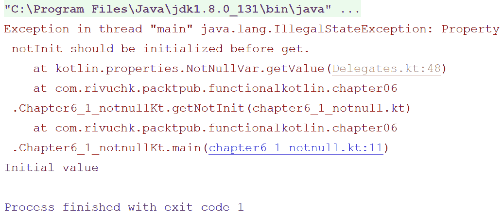
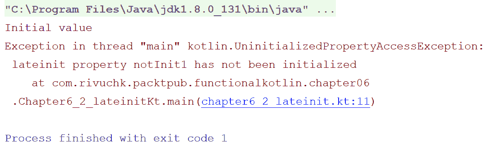
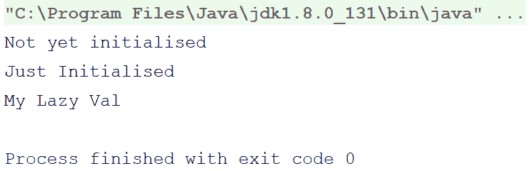
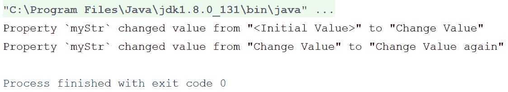
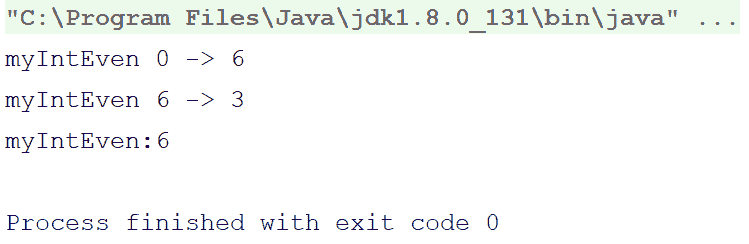
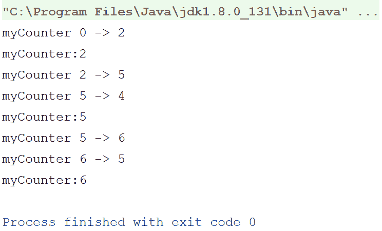
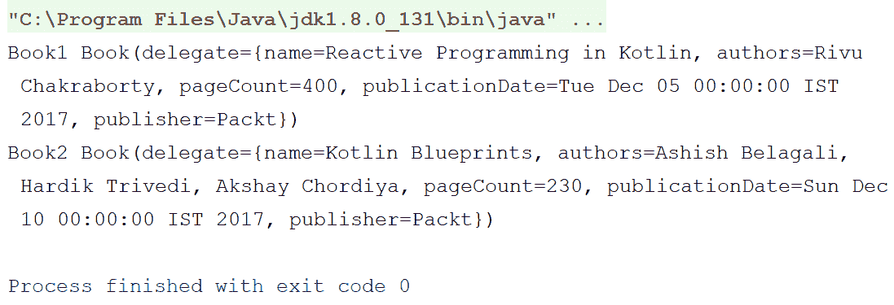
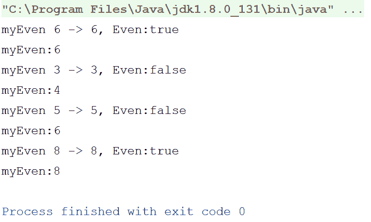
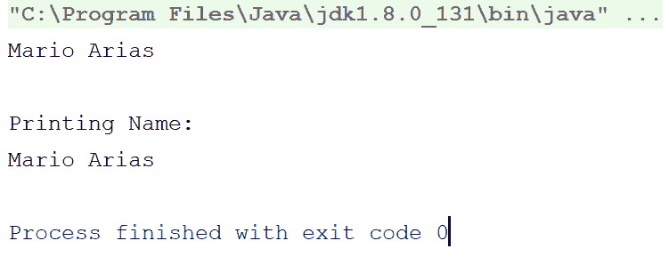

# Kotlin 中的委托

在前两章中，我们学习了函数和函数类型在函数式编程中的应用。我们还学习了 Kotlin 提供的各种函数类型。

本章基于 Kotlin 中的委托。委托是 Kotlin 在函数式编程方面的优秀特性。如果你来自非 FP 背景，如 Java，你可能第一次听说委托。因此，在本章中，我们将尽力为你解开这些谜团。

我们将首先学习委托的基础知识，然后逐步过渡到 Kotlin 中委托的实现。

以下列表包含本章将涉及的主题：

+   委托简介

+   Kotlin 中的委托

+   委托属性

+   标准委托

+   自定义委托

+   委托映射

+   本地委托

+   类委托

那么，让我们开始学习委托。

# 委托简介

编程中委托的起源来自对象组合。对象组合是将简单对象组合成复杂对象的一种方式。对象组合是许多基本数据结构的关键构建块，包括标签联合、链表和二叉树。

为了使对象组合更可重用（尽可能像继承一样可重用），引入了一种新的模式——**委托模式**。

这种模式允许一个对象拥有一个辅助对象，而这个辅助对象被称为**委托**。这种模式允许原始对象通过委托给委托辅助对象来处理请求。

虽然委托是一种面向对象的设计模式，但并非所有语言都隐式支持委托（例如 Java，它不隐式支持委托）。在这些情况下，您仍然可以通过显式地将原始对象传递给委托方法作为参数/参数来使用*委托*。

但是，有了语言支持（例如在 Kotlin 中），委托变得更容易，通常感觉就像使用原始变量本身一样。

# 理解委托

随着时间的推移，委托模式已被证明是继承的更好替代方案。继承是代码重用的强大工具，尤其是在*Liskov 替换*模型中。此外，面向对象语言对它的直接支持使其更加强大。

然而，继承仍然有一些局限性，例如，一个类在程序执行期间不能动态地更改其超类；此外，如果你对超类进行小的修改，它将直接传播到子类，而这并不是我们每次都想要的。

另一方面，委托是灵活的。你可以把委托看作是多个对象的组合，其中一个对象将其方法调用传递给另一个对象，并称之为委托。如我之前提到的，委托是灵活的；你可以在运行时更改委托。

例如，考虑 `Electronics` 类和 `Refrigerator` 类。使用继承时，`Refrigerator` 应该实现/覆盖 `Electronics` 的方法调用和属性。然而，使用委托时，`Refrigerator` 对象将保持对 `Electronics` 对象的引用，并将方法调用与其一起传递。

既然我们知道 Kotlin 提供了对委托的支持，那么让我们开始学习 Kotlin 中的委托。

# Kotlin 中的委托

Kotlin 提供了开箱即用的委托支持。Kotlin 为大多数常见的编程需求提供了某些标准委托。大多数时候，你会发现自己在使用这些标准委托，而不是创建自己的；然而，Kotlin 也允许你根据需求创建自己的委托。

Kotlin 不仅允许对属性进行委托，还允许有委托类。

因此，基本上，Kotlin 中有两种类型的委托，如下所示：

+   属性委托

+   类委托

因此，我们先来看一下属性委托，然后我们将继续讨论类委托。

# 属性委托（标准委托）

在上一节中，我们讨论委托时，我们了解到委托是一种方法传递/转发的技术。

对于属性委托，它几乎做了同样的事情。一个属性可以将它的获取器和设置器调用传递给委托，委托可以代表属性本身处理这些调用。

你可能正在想，将获取器和设置器调用传递给委托有什么好处？只有你使用的委托才能回答这个问题。Kotlin 为大多数常见用例提供了多个预定义的标准委托。让我们看一下以下列表，其中包含可用的标准委托：

+   `Delegates.notNull` 函数和 `lateinit`

+   `lazy` 函数

+   `Delegates.Observable` 函数

+   `Delegates.vetoble` 函数

# `Delegates.notNull` 函数和 `lateinit`

想象一个场景，你需要在一个类级别上声明一个属性，但你没有那里变量的初始值。你将在稍后某个时刻得到这个值，但在属性实际使用之前，你确信属性将在使用之前初始化，并且它不会是 null。但是，根据 Kotlin 语法，你必须初始化属性。快速修复方法是将其声明为 `nullable var` 属性，并分配一个默认的 null 值。但是，如我们之前提到的，由于你确信变量在使用时不会是 null，你不愿意将其声明为可空。

`Delegates.notNull` 函数就是为了在这种情况下帮助你。看看以下程序：

```kt
var notNullStr:String by Delegates.notNull<String>() 

fun main(args: Array<String>) { 
    notNullStr = "Initial value" 
    println(notNullStr) 
} 
```

关注第一行——`var notNullStr:String by Delegates.notNull<String>()`，我们声明了一个非空的 `String var` 属性，但没有初始化它。相反，我们写了 `by Delegates.notNull<String>()`，但这是什么意思？让我们检查一下。`by` 操作符是 Kotlin 中的一个保留关键字，用于与委托一起使用。`by` 操作符与两个操作数一起工作，`by` 的左侧将是需要委托的属性/类，而右侧将是委托。

委托——`Delegates.notNull` 允许你在不初始化属性的情况下暂时使用。它必须在使用之前初始化（就像我们在 `main` 方法的第一行所做的那样），否则它将抛出异常。

因此，让我们通过添加另一个属性来修改程序，我们将在使用之前不初始化它，看看会发生什么：

```kt
var notNullStr:String by Delegates.notNull<String>() 
var notInit:String by Delegates.notNull<String>() 

fun main(args: Array<String>) { 
    notNullStr = "Initial value" 
    println(notNullStr) 
    println(notInit) 
} 
```

输出看起来如下：



因此，`notInit` 属性导致了异常——`属性 notInit 应在使用前初始化`。

但是，变量声明——`by Delegates.notNull()`听起来不是很顺耳吗？Kotlin 团队也这样认为。这就是为什么从 Kotlin 1.1 开始，他们添加了一个简单的关键字——`lateinit`，以实现相同的目标。正如它简单说明了延迟初始化，它应该简单地是 `lateinit`。

因此，让我们通过将 `by Delegates.notNull()` 替换为 `lateinit` 来修改最后一个程序。以下是修改后的程序：

```kt
lateinit var notNullStr1:String 
lateinit var notInit1:String 

fun main(args: Array<String>) { 
    notNullStr1 = "Initial value" 
    println(notNullStr1) 
    println(notInit1) 
} 
```

在这个程序中，我们必须重命名变量，因为你不能有两个同名的顶级（包级变量，没有任何类/函数）。除了变量名外，唯一改变的是我们添加了 `lateinit`，而不是 `by Delegates.notNull()`。

因此，现在让我们看一下以下输出，以确定是否有任何变化：



输出也是相同的，除了它稍微改变了错误信息。现在它说，`lateinit 属性 notInit1 尚未初始化`。

# 懒加载函数

`lateinit` 关键字仅适用于 `var` 属性。`Delegates.notNull()` 函数也仅与 `var` 属性配合使用。

那么，当使用 `val` 属性时，我们应该怎么做呢？Kotlin 为你提供了另一个委托——`lazy`，它仅适用于 `val` 属性。但它的工作方式略有不同。

与 `lateinit` 和 `Delegates.notNull()` 不同，你必须在声明变量时指定你想要如何初始化变量。那么，有什么好处呢？初始化将不会在变量实际使用之前调用。这就是为什么这个委托被称为 `lazy`；它允许属性的延迟初始化。

以下是一个代码示例：

```kt
val myLazyVal:String by lazy { 
    println("Just Initialised") 
    "My Lazy Val" 
} 

fun main(args: Array<String>) { 
    println("Not yet initialised") 
    println(myLazyVal) 
} 
```

因此，在这个程序中，我们声明了一个 `String val` 属性——`myLazyVal`，并使用（打印）了该属性在 `main` 函数的第二行。

现在，让我们专注于变量声明。`lazy` 委托接受一个 lambda，该 lambda 预期返回属性的值。

那么，让我们看看输出结果：



注意，输出清楚地显示，属性是在 `main` 方法的第一行执行后初始化的，即当属性实际上被使用时。这种属性的 `lazy` 初始化可以显著节省内存。在某些情况下，它也是一个方便的工具，例如，想象一下你想要使用其他属性/上下文来初始化属性，而这些属性/上下文只有在某个特定点之后才可用（但你已经有了属性名）；在这种情况下，你可以简单地保持属性为 `lazy`，然后当确认初始化将成功时再使用它。

# 使用 `Delegates.observable` 观察属性值变化

委托不仅用于最近/延迟初始化属性。正如我们所学的，委托允许将属性的获取器和设置器调用转发到委托。这使得委托能够提供比最近/延迟初始化更多的酷炫功能。

这样一个酷炫的功能来自于 `Delegates.observable`。想象一下，你需要监视一个属性值的改变，并在这种改变发生时立即执行某些操作。我们首先想到的解决方案是重写设置器，但这会使代码显得很糟糕，并且使代码变得复杂，而委托正是为了拯救我们。

看看下面的例子：

```kt
var myStr:String by Delegates.observable("<Initial Value>") { 
    property, oldValue, newValue -> 
    println("Property `${property.name}` changed value from "$oldValue" to "$newValue"") 
} 

fun main(args: Array<String>) { 
    myStr = "Change Value" 
    myStr = "Change Value again" 
} 
```

这是一个简单的例子，我们使用 `Delegates.observable` 声明了一个 `String` 属性——`myStr`（我们将在查看输出后不久描述这种初始化），然后，在 `main` 函数内部，我们两次改变了 `myStr` 的值。

看看下面的输出：



在输出中，我们可以看到，每次我们更改值时，都会打印出属性的旧值和新值。这个程序中的 `Delegates.observable` 块负责输出中的日志。所以现在，让我们仔细看看 `Delegates.observable` 块，并了解它是如何工作的：

```kt
var myStr:String by Delegates.observable("<Initial Value>") { 
    property, oldValue, newValue -> 
    println("Property `${property.name}` changed value from "$oldValue" to "$newValue"") 
} 
```

`Delegates.observable` 函数接受两个参数来创建委托。第一个参数是属性的初始值，第二个参数是每当检测到值变化时应执行的 lambda。

`Delegates.observable` 的 lambda 预期有三个参数：

+   第一个是一个 `KProperty<out R>` 的实例

`KProperty` 是 Kotlin `stdlib` 和 `kotlin.reflect` 包中的一个接口，它是一个属性；例如一个命名的 `val` 或 `var` 声明。这个类的实例可以通过 `::` 操作符获取。更多信息，请访问：[`kotlinlang.org/api/latest/jvm/stdlib/kotlin.reflect/-k-property/`](https://kotlinlang.org/api/latest/jvm/stdlib/kotlin.reflect/-k-property/)

+   第二个参数包含属性的旧值（分配前的最后一个值）

+   第三个参数是分配给属性的最新值（在分配中使用的新值）

因此，既然我们已经了解了`Delegates.observable`的概念，那么让我们继续使用一个新的委托，`Delegates.vetoable`。

# 否决权 - Delegates.vetoable

`Delegates.vetoable`是另一个标准委托，它允许我们否决值的变化。

**否决权**，拉丁语为“我禁止”，是指单方面停止官方行动的权力（例如，由国家官员使用）。更多信息请参阅：[`en.wikipedia.org/wiki/Veto`](https://en.wikipedia.org/wiki/Veto)。

这种否决权允许我们对属性的每一项分配进行逻辑检查，我们可以决定是否继续分配。

以下是一个示例：

```kt
var myIntEven:Int by Delegates.vetoable(0) { 
    property, oldValue, newValue -> 
    println("${property.name} $oldValue -> $newValue") 
    newValue%2==0 
} 

fun main(args: Array<String>) { 
    myIntEven = 6 
    myIntEven = 3 
    println("myIntEven:$myIntEven") 
} 
```

在这个程序中，我们创建了一个`Int`属性—`myIntEven`；这个属性应该只接受偶数作为分配。`Delegates.vetoable`委托的工作方式几乎与`Delegates.observable`函数相同，只是在 lambda 中有细微的变化。在这里，lambda 预期返回一个布尔值；如果返回的布尔值为`true`，则分配会被传递，否则分配会被拒绝。

回顾一下程序。当我们使用`Delegates.vetoable`委托声明变量时，我们传递了`0`作为初始值，然后在 lambda 中记录了一个分配调用，然后如果新值是偶数，我们将返回`true`，如果是奇数则返回`false`。

这里是输出：



因此，在输出中，我们可以看到两个分配日志，但当我们打印最后分配后的`myIntEven`属性时，我们可以看到最后的分配并没有成功。

有趣，不是吗？让我们看看`Delegates.vetoable`的另一个示例。看看以下代码：

```kt
var myCounter:Int by Delegates.vetoable(0) { 
    property, oldValue, newValue -> 
    println("${property.name} $oldValue -> $newValue") 
    newValue>oldValue 
} 

fun main(args: Array<String>) { 
    myCounter = 2 
    println("myCounter:$myCounter") 
    myCounter = 5 
    myCounter = 4 
    println("myCounter:$myCounter")  
    myCounter++ 
    myCounter-- 
    println("myCounter:$myCounter") 
} 
```

这个程序有一个属性—`myCounter`，它预期在每次分配时增加。

在 lambda 中，我们检查`newValue`值是否大于`oldValue`值。以下是输出：



显示那些值增加的分配的输出是成功的，但那些值减少的分配被拒绝了。

即使当我们使用了递增和递减运算符时，递增运算符是成功的，但递减运算符却没有。没有委托，这个特性不会那么容易实现。

# 委托映射

因此，我们学习了如何使用标准委托，但 Kotlin 必须提供更多关于委托的功能。映射委托是委托带来的那些令人惊叹的功能之一。那么，它是什么呢？它是在函数/类构造函数中传递一个映射作为单个参数，而不是传递多个参数的自由。让我们看看。以下是一个应用*映射委托*的程序：

```kt
data class Book (val delegate:Map<String,Any?>) { 
    val name:String by delegate 
    val authors:String by delegate 
    val pageCount:Int by delegate 
    val publicationDate:Date by delegate 
    val publisher:String by delegate 
} 

fun main(args: Array<String>) { 
    val map1 = mapOf( 
            Pair("name","Reactive Programming in Kotlin"), 
            Pair("authors","Rivu Chakraborty"), 
            Pair("pageCount",400), 
            Pair("publicationDate",SimpleDateFormat("yyyy/mm/dd").parse("2017/12/05")), 
            Pair("publisher","Packt") 
    ) 
    val map2 = mapOf( 
            "name" to "Kotlin Blueprints", 
            "authors" to "Ashish Belagali, Hardik Trivedi, Akshay Chordiya", 
            "pageCount" to 250, 
            "publicationDate" to SimpleDateFormat("yyyy/mm/dd").parse("2017/12/05"), 
            "publisher" to "Packt" 
    ) 

    val book1 = Book(map1) 
    val book2 = Book(map2) 

    println("Book1 $book1 nBook2 $book2") 
} 
```

程序足够简单；我们定义了一个 `Book` 数据类，并在构造函数中，我们不是逐个取成员值，而是取一个映射，然后将所有值委托给映射代理。

这里需要注意的一点是，在映射中提到所有成员变量，并且键名应与属性名完全匹配。

这里是输出结果：



简单吧？是的，代理就是这样强大。但你有没有好奇如果我们省略了映射中提到的任何属性会发生什么？它将简单地跳过你省略的属性，如果你明确尝试访问它们，那么它将抛出一个异常—`java.util.NoSuchElementException`。

# 自定义代理

到目前为止，在本章中，我们已经看到了 Kotlin 中可用的标准代理。然而，Kotlin 允许我们编写自己的自定义代理，以满足我们的特定需求。

例如，在程序中，当我们使用 `Delegates.vetoable` 检查 `Even` 时，我们只能丢弃值赋值，但无法自动将下一个偶数赋值给变量。

在下面的程序中，我们使用了 `makeEven`，一个自定义代理，如果传递给赋值的数字是奇数，它会自动分配下一个偶数，否则如果传递给赋值的数字是偶数，它会传递那个数字。

看看下面的程序：

```kt
var myEven:Int by makeEven(0) { 
    property, oldValue, newValue, wasEven -> 
    println("${property.name} $oldValue -> $newValue, Even:$wasEven") 
} 

fun main(args: Array<String>) { 
    myEven = 6 
    println("myEven:$myEven") 
    myEven = 3 
    println("myEven:$myEven") 
    myEven = 5 
    println("myEven:$myEven") 
    myEven = 8 
    println("myEven:$myEven") 
} 
```

这里是输出结果：



输出清楚地显示，每次我们将偶数分配给 `myEven` 时，它都会被分配，但当我们分配奇数时，下一个偶数（`+1`）会被分配。

对于这个代理，我们使用了与 `Delegates.observable` 几乎相同的 lambda 表达式，只是增加了一个额外的参数—`wasEven:Boolean`，如果分配的数字是偶数，则包含 `true`，否则包含 `false`。

想知道我们是如何创建代理的吗？以下是代码：

```kt
abstract class MakeEven(initialValue: Int):ReadWriteProperty<Any?,Int> { 
    private var value:Int = initialValue 

    override fun getValue(thisRef: Any?, property: KProperty<*>) = value 

    override fun setValue(thisRef: Any?, property: KProperty<*>, newValue: Int) { 
        val oldValue = newValue 
        val wasEven = newValue %2==0 
        if(wasEven) { 
            this.value = newValue 
        } else { 
            this.value = newValue +1 
        } 
        afterAssignmentCall(property,oldValue, newValue,wasEven) 
    } 

    abstract fun afterAssignmentCall (property: KProperty<*>, oldValue: Int, newValue: Int, wasEven:Boolean):Unit 
} 
```

为了在 `var` 属性上创建代理，你需要实现 `ReadWriteProperty` 接口。

该接口有两个需要重写的方法—`getValue` 和 `setValue`。这些函数实际上是属性的获取器和设置器的委托函数。你可以从 `getValue` 函数返回你想要的价值，然后它将被转发为属性的返回值。每次访问属性时，都会调用 `getValue` 函数。同样，每次属性被分配值时，`setValue` 函数都会被调用，我们从 `setValue` 函数返回的任何内容实际上就是属性最终分配的值。例如，假设属性 `a` 被分配了 `X`，但从 `setValue` 函数返回了 `Y`，那么在赋值语句之后，属性 `a` 实际上会持有 `Y` 而不是 `X`。

所以，如果你想从委托的 `getValue` 函数返回属性的值，你必须将属性的值存储在某个地方（是的，你将无法从原始属性中获取值，可能是因为原始属性甚至不会存储值，因为属性知道它将被委托）。在这个程序中，我们使用了一个可变的 `var` 属性——`value`，来存储属性的值。我们从 `getValue` 函数返回 `value`。

在 `setValue` 函数内部，我们检查分配的 `newValue` 是否为偶数。如果是偶数，我们将 `newValue` 分配给 `value` 属性（它将来自 `getValue` 函数），如果 `newValue` 是奇数，我们将 `newValue+1` 分配给 `value` 属性。

在 `MakeEven` 类中，我们有一个抽象方法——`afterAssignmentCall`。我们在 `setValue` 函数的末尾调用了这个方法。这个方法是为了日志记录目的。

因此，委托几乎已经准备好了，但抽象方法怎么办？我们需要扩展这个类来应用委托，对吧？但记住我们使用它的代码，像 `by makeEven(0) {...}`，所以那里必须有一个函数，不是吗？是的，有一个函数，以下是其定义：

```kt
 inline fun makeEven(initialValue: Int, crossinline onAssignment:(property: KProperty<*>, oldValue: Int, newValue: Int, wasEven:Boolean)->Unit):ReadWriteProperty<Any?, Int> 
        =object : MakeEven(initialValue){ 
    override fun afterAssignmentCall(property: KProperty<*>, oldValue: Int, newValue: Int, wasEven: Boolean) 
            = onAssignment(property,oldValue,newValue,wasEven) 
} 
```

我们创建了一个 `MakeEven` 的匿名对象，并将其作为委托传递，并将参数 lambda——`onAssignment`，作为抽象函数——`afterAssignmentCall` 传递。

所以，我们必须掌握委托，让我们继续前进，尝试一些关于委托的更有趣的方面。

# 局部委托

委托很强大，我们已经看到了这一点，但想想一个常见的情况，在方法内部我们声明并初始化一个属性，然后应用一个逻辑，这个逻辑要么使用属性，要么不使用它继续执行。例如，以下是这样的程序：

```kt
fun useDelegate(shouldPrint:Boolean) { 
    val localDelegate = "Delegate Used" 
    if(shouldPrint) { 
        println(localDelegate) 
    } 

    println("bye bye") 
} 
```

在这个程序中，我们将使用 `localDelegate` 属性，只有当 `shouldPrint` 的值为 `true` 时，否则我们不会使用它。但因为它被声明并初始化，所以它总是会占用内存空间。避免这种内存阻塞的一个选项是将属性放在 `if` 块内部，但这是一个简单的示例程序，在这里我们可以轻松地将变量声明移动到 `if` 块内部，而在许多现实场景中，将变量声明移动到 `if` 块内部是不可能的。

那么，解决方案是什么？是的，使用 `lazy` 委托可以拯救我们的生命。但在 Kotlin 1.1 之前，这是不可能的。

所以，以下是一个更新的程序：

```kt
fun useDelegate(shouldPrint:Boolean) { 
    val localDelegate by lazy { 
        "Delegate Used" 
    } 
    if(shouldPrint) { 
        println(localDelegate) 
    } 

    println("bye bye") 
} 
```

尽管我们在这个例子中只使用了 `lazy`，但从 Kotlin 1.1 开始，我们可以在局部属性中应用任何委托。

# 类委托

类委托是 Kotlin 的另一个有趣特性。如何？只需想想以下情况。

你有一个接口，`I`，以及两个类，`A` 和 `B`。`A` 和 `B` 都实现了 `I` 接口。在你的代码中，你有一个 `A` 的实例，并且想要从这个 `A` 实例创建一个 `B` 的实例。

在传统的继承中，这是不可能直接实现的；你必须编写一大堆糟糕的代码才能达到这个目的，但类委托（class delegation）就是为了解决这个问题而存在的。

下面是相应的代码：

```kt
interface Person { 
    fun printName() 
} 

class PersonImpl(val name:String):Person { 
    override fun printName() { 
        println(name) 
    } 
} 

class User(val person:Person):Person by person { 
    override fun printName() { 
        println("Printing Name:") 
        person.printName() 
    } 
} 

fun main(args: Array<String>) { 
    val person = PersonImpl("Mario Arias") 
    person.printName() 
    println() 
    val user = User(person) 
    user.printName() 
} 
```

在这个程序中，我们创建了 `User` 的实例，其中包含其成员属性——`person`，它是一个 `Person` 接口的实例。在主函数中，我们将 `PersonImpl` 的实例传递给 `user` 以创建 `User` 的实例。

现在，让我们看看 `User` 的声明。在颜色（`:`）之后，短语 `Person by person` 表示类 `User` 继承自 `Person` 类，并且期望从提供的 `person` 实例复制 `Person` 的行为。

下面是输出结果：



输出显示了覆盖（overriding）工作如预期进行，我们还可以访问 `person` 的属性和函数，就像访问一个普通属性一样。

真的是一个很棒的功能，不是吗？

# 摘要

在本章中，我们学习了代理（delegates），并看到了如何以各种方式使用代理来使我们的代码高效且整洁。我们学习了代理的不同特性和组成部分，以及如何使用它们。

下一章将介绍协程，这是 Kotlin 的一个开创性特性，它能够在保持开发者生活简单直接的同时，实现无缝的异步处理。

所以，不要等待太久，现在就开始下一章吧。
