# Kotlin 中的集合和数据操作

在前面的章节中，我们已经涵盖了广泛的主题，从 Kotlin 中的数据类型、类和对象开始，到上一章中的不可变性、函数、委托和协程。在本章中，我们将讨论 Kotlin 中的集合框架和数据操作。Kotlin 从 Java 继承了集合框架，但在函数式编程方面与之有显著的不同。

Kotlin 提供的集合框架比 Java 更函数式，作为 Kotlin 的签名，它更容易使用和理解。

我们将从这个章节的集合基础知识开始，然后逐渐过渡到 Kotlin 中集合支持的数据操作。以下是本章将要涵盖的主题列表：

+   集合简介

+   `Iterator` 和 `Iterable` 接口

+   Kotlin 中的集合类型—`Array`、`List`、`Map` 和 `Set`

+   可变性和不可变性

+   与列表一起工作

+   各种数据操作—`map`、`sort`、`filter`、`flatMap`、`partition`、`fold` 和 `group by`

那么，我们还在等什么呢？让我们开始学习集合。

# 集合简介

**集合框架**是一组类和接口，它提供了一种统一的架构来执行常见的数据相关操作，如下所示：

+   搜索

+   排序

+   插入

+   删除

+   操作

我们在日常生活中使用的所有列表、映射和集合都是这个集合框架的一部分。

所有集合框架都包含以下内容：

+   **接口**：这些是抽象数据类型，用于表示集合。接口允许独立于其表示的细节来操作集合。在面向对象的语言中，这些通常形成层次结构。

+   **实现**：这些是实现接口集合的具体实现。本质上，这些是可重用的数据结构。

+   **算法**：执行有用计算的方法，例如搜索和排序（如前所述），在实现集合接口的对象上。这些算法被称为 **多态**。同一个方法可以用于许多不同实现的相关集合接口。简而言之，算法是可重用的功能。

除了 Java 和 Kotlin 集合框架之外，最著名的集合框架示例是 **C++ 标准模板库**（**STL**）和 Smalltalk 的集合层次结构。

# 集合框架的优势

那么，拥有集合框架有什么好处呢？有几个好处，但最重要的是，它减少了编程时间和努力。集合框架为开发者提供了高质量（在性能和代码优化方面）的有用数据结构和算法的实现，同时提供了与无关 API 之间的互操作性。您可以在程序中使用这些实现，从而减少编程努力和时间。

因此，既然我们已经了解了集合框架是什么，那么现在让我们来看看集合框架中类和接口的层次结构。

那么，让我们看一下以下图：

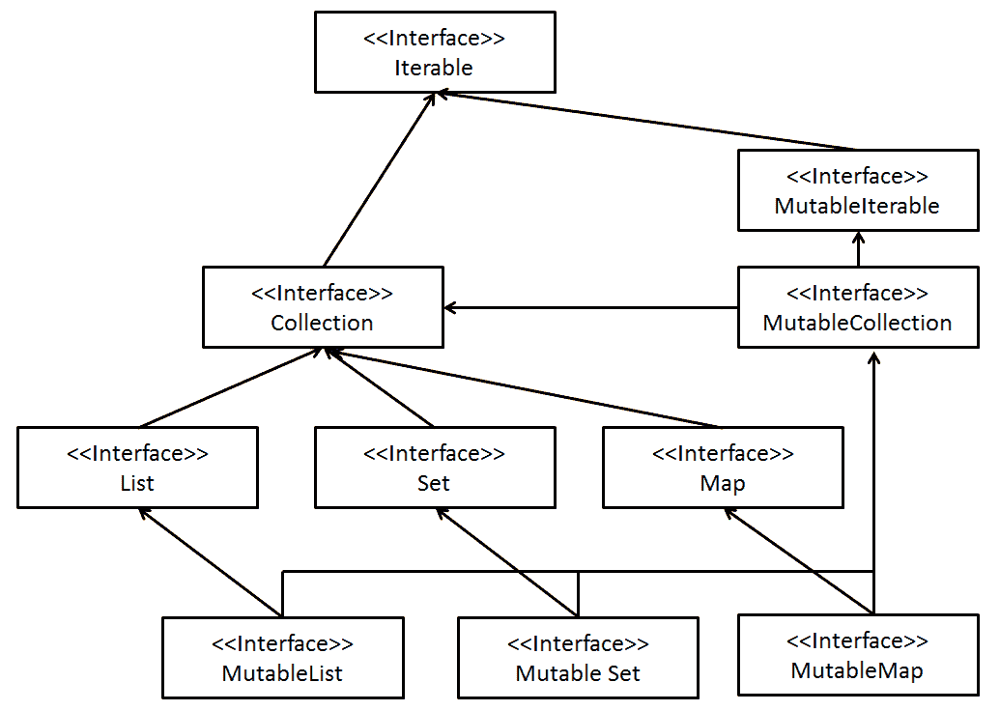

正如我们之前提到的，集合框架是一组数据类型和类，它使我们能够处理一组（或几组）数据。这组数据可能是一个简单的列表/映射/集合，或者任何其他数据结构。

上述图表示了 Kotlin 的集合框架。就像 Java 一样，Kotlin 中的所有集合接口都起源于`Iterable`接口。然而，Kotlin 的集合框架与 Java 的不同；Kotlin 区分可变和不可变集合。

Kotlin 有两个基本集合接口，即`Iterable`和`MutableIterable`。`Iterable`接口被`Collection`接口扩展，该接口定义了基本的只读集合操作（如`size`、`isEmpty()`、`contains()`等）。

`MutableCollection`接口扩展了`Collection`接口和`MutableIterable`接口，增加了读写特性。

在 Java 引入集合框架之前，开发者通常使用数组、向量以及哈希表来处理一组数据。这种方法的缺点是它们都没有一些共同的方法。因此，集合框架被创建出来，通过提供跨各种类型集合的通用方法和操作，使开发者的生活变得更简单。

集合框架是在 Kotlin 语言形成之前在 Java 中引入的，并且从一开始就被包含在 Kotlin 中。

您难道不好奇为什么有这么多集合类型吗？让我们在接下来的章节中介绍它们时，找出一些最常用集合类型的目的。

# List 和 MutableList

List 是使用最广泛的集合数据类型之一。它是一个`Collection`接口的实现，用于处理一组有序数据。

列表中的数据可以根据添加的顺序进行排序（例如，如果我们将`3`添加到`Int List`中，那么`4`将出现在列表中，在`3`之前，就像数组一样）或者甚至可以根据其他排序算法进行排序。

正如我们之前提到的，Kotlin 区分可变和只读集合类型；因此，只读的`List`接口只包含只读函数，如下所示：

+   `fun get(index: Int):E`: 此方法用于从给定索引的列表中获取元素。

+   `fun indexOf(element: @UnsafeVariance E):Int`: 此方法用于识别列表中元素的索引。此方法将在整个列表中搜索指定的元素，如果它在列表中，则返回元素的位位置。否则，它将返回`-1`。

+   `fun listIterator(): ListIterator<E>`: 如果您想获取`ListIterator`的实例（这将在本章后面讨论，当我们讨论`Iterator`和`Iterable`时）。

+   `fun subList(fromIndex: Int, toIndex: Int): List<E>`: 返回具有指定`fromIndex`和`toIndex`值的列表的一部分。

考虑到这一点，它只包含只读函数，我们如何有一个包含数据的列表？虽然您不能在创建后向不可变列表中添加数据，但您当然可以创建一个预填充数据的不可变列表（显然，否则拥有不可变列表就没有任何意义了）。您可以通过多种方式实现这一点，但最流行的方式是使用`listOf`函数。

`listOf`函数声明如下（可以在`Collections.kt`中的`kotlin.collections`包内找到）：

```kt
public fun <T> listOf(vararg elements: T): List<T> 
```

正如我们在函数声明中看到的，该函数接受一个泛型类型的`vararg`参数作为元素；函数将返回一个包含这些元素的`list`实例。正如您已经知道的，`vararg`参数的重要性在于它可以包含 0 到几乎 64K 个参数（如果每个参数是 1 字节，一个函数可以有最大 64K 字节的分配，所以实际上会更少）；因此，在用`listOf`函数创建`list`时，您甚至可以不传递任何参数来创建一个空列表，或者传递尽可能多的参数（假设您不需要超过 64K 字节）来创建包含这些参数的只读`list`。

以下程序是`listOf`函数的一个示例：

```kt
fun main(args: Array<String>) { 
 val list = listOf<Int>(1,2,3,4,5,6,7,8,9,10) 

    for (i in list) { 
        println("Item $i") 
    } 
} 
```

在前面的程序中，我们创建了一个包含数字`1`到`10`的`list`值。然后我们使用`for`循环遍历`list`值中的每个元素并打印它。

让我们看一下以下输出以验证这一点：

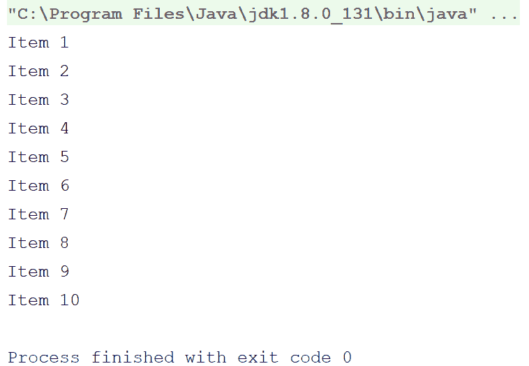

`for`循环花括号内的`i in list`告诉`for`循环遍历`list`值中的所有元素，并将每个迭代中的元素复制到临时变量`i`。

我们将在本章后面部分探讨更多与集合操作的方法，但首先让我们学习不同类型的集合。

因此，继续我们关于列表的讨论，我们已经看到了如何使用预定义元素创建不可变列表；现在，我们将探讨如何创建和操作可变列表，但在那之前，让我们看看创建空列表的方法。

让我们逐一分析以下程序：

```kt
fun main(args: Array<String>) { 
 val emptyList1 = listOf<Any>() val emptyList2 = emptyList<Any>() 

    println("emptyList1.size = ${emptyList1.size}") 
    println("emptyList2.size = ${emptyList2.size}") 
} 
```

因此，在前面的程序中，我们创建了空列表，一个使用不带参数的`listOf`函数，另一个使用`emptyList`函数。请注意，如果`listOf`函数不带任何参数调用，则它内部调用`emptyList`函数。

以下是输出截图：

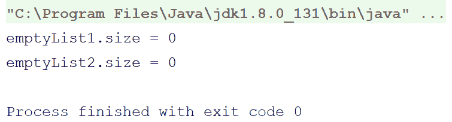

因此，我们已经看到了如何使用预定义的一组元素与不可变列表一起工作，但如果我们需要动态地向`list`值中添加项目怎么办？Kotlin 为此提供了可变列表。

以下示例将帮助您理解不可变列表：

```kt
fun main(args: Array<String>) { 
 val list = mutableListOf(1,2,4)//(1) 

    for (i in list) { 
        println("for1 item $i") 
    } 

    println("-----Adding Items-----") 

 list.add(5)//(2) list.add(2,3)//(3) list.add(6)//(4) 

    for (i in list) { 
        println("for2 item $i") 
    } 
} 
```

以下是程序的输出：

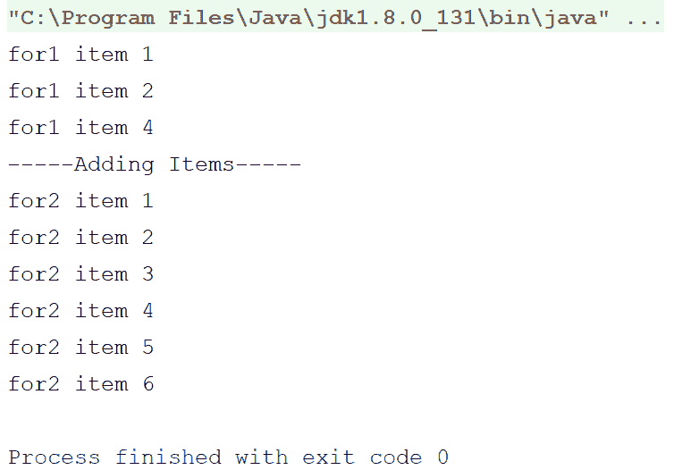

现在，让我们解释一下程序。首先，我们在注释`(1)`处使用`mutableListOf`函数创建了`list`值，其中包含项目`1`、`2`和`4`。请注意，这里我们跳过了类型参数，如果您将元素传递给函数，则这不是很重要，因为 Kotlin 有类型推断。我们在添加项目之前打印了`list`值。

对于`listOf`或其他任何集合函数，类型推断是一个问题。因此，如果您传递了元素或已提供集合的类型，则不需要指定正在使用的集合的泛型类型。

在注释`(2)`处，我们使用`List$add()`函数向`list`中添加了项目`5`，该函数将提供的项目追加到`list`数组中。

然后，在注释`(3)`处，我们使用带有索引参数的`add`函数将项目`4`添加到第二个位置（从`0`开始计数，如通常一样）。

然后，我们又用`5`向`list`数组中添加了元素。

因此，我们在`list`数组中添加了元素，并通过`for`循环访问所有项目，但如何访问单个元素呢？让我们通过以下示例来了解如何在 Kotlin 中访问和修改单个元素。请看以下示例：

```kt
fun main(args: Array<String>) { 
    val list = listOf( 
            "1st Item", 
            "2nd Item", 
            "3rd Item", 
            "4th Item", 
            "5th Item" 
    ) 

    println("3rd Item on the list - ${list.get(2)}") 
    println("4rd Item on the list - ${list[3]}") 
} 
```

我们使用索引`2`访问了第三个元素，使用索引`3`访问了第四个元素。原因很简单，因为在数组和列表中，计数从`0`开始。

这里要注意的事情是，Kotlin 为列表提供了开箱即用的支持，并提供了一个方括号运算符（`[]`）来访问`list`值的元素，就像数组一样。在第一个`get`语句中，我们使用带有索引的`get`函数来获取该索引的元素；在第二个`get`语句中，我们使用了方括号，它反过来调用那个`get`函数。

由于列表按顺序/索引存储项目，因此很容易通过索引从列表中获取项目；如果您只想从列表中获取特定元素并且知道该元素的索引，则可以轻松跳过循环。只需将元素传递给`get`函数，您就有该元素了。

通过索引获取元素不支持其他集合接口，如`set`（尽管`OrderedSet`支持它们），它不支持元素的排序。

因此，既然我们已经对列表有了些许了解，让我们继续前进，看看集合。

# 集合和 MutableSet

就像 `List` 一样，`Set` 在 Kotlin 中也有以下两种变体：

+   `Set`

+   `MutableSet`

`Set` 是只读的，而 `MutableSet` 是 `Set` 的可变版本，它包含读写功能。

就像列表一样，集合的值也有只读函数和属性，如 `size`、`iterator()` 等。我们在这里省略了它们的提及，以避免在这本书中重复内容。请注意，集合不像列表那样进行排序（除非你使用 `OrderedSet`）。因此，它缺少涉及排序的函数，如 `indexOf(item)`、`add(index, item)` 等。

集合中的集合表示数学集合（如集合论中的集合）。

以下是一个使用 `MutableSet` 的示例：

```kt
fun main(args: Array<String>) { 
    val set = mutableSetOf(1,2,3,3,2) 

    println("set $set") 

    set.add(4) 
    set.add(5) 
    set.add(5) 
    set.add(6) 

    println("set $set") 
} 
```

以下是输出：

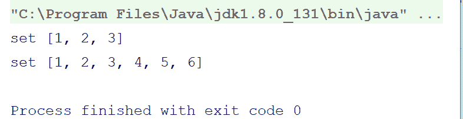

输出清楚地显示，尽管我们在初始化和之后都向 `set` 中添加了多个重复项，但只有唯一的项被插入，所有重复的项都被忽略了。

现在，你可能很好奇，这与自定义类和数据类会发生什么；让我们通过以下示例来检查：

```kt
data class MyDataClass (val someNumericValue:Int, val someStringValue:String)
class MyCustomClass (val someNumericValue:Int, val someStringValue:String) {
    override fun toString(): String {
      return "MyCustomClass(someNumericValue=$someNumericValue, someStringValue=$someStringValue)"
    }
  }
fun main(args: Array<String>) {
    val dataClassSet = setOf(
         MyDataClass(1,"1st obj"),
         MyDataClass(2,"2nd obj"),
         MyDataClass(3,"3rd obj"),
         MyDataClass(2,"2nd obj"),
         MyDataClass(4,"4th obj"),
         MyDataClass(5,"5th obj"),
         MyDataClass(2,"will be added"),
         MyDataClass(3,"3rd obj")
    )
    println("Printing items of dataClassSet one by one")
    for(item in dataClassSet) {
      println(item)
    }
    val customClassSet = setOf(
      MyCustomClass(1,"1st obj"),
      MyCustomClass(2,"2nd obj"),
      MyCustomClass(3,"3rd obj"),
      MyCustomClass(2,"2nd obj"),
      MyCustomClass(4,"4th obj"),
      MyCustomClass(5,"5th obj"),
      MyCustomClass(5,"5th Obj"),
      MyCustomClass(3,"3rd obj")
    )
    println("Printing items of customClassSet one by one")
    for(item in customClassSet) {
      println(item)
    }
 }
```

在这个程序中，我们首先创建了一个数据类和一个自定义类，然后使用它们创建了集合并插入了重复项。

让我们查看以下输出以检查集合是否没有重复项：

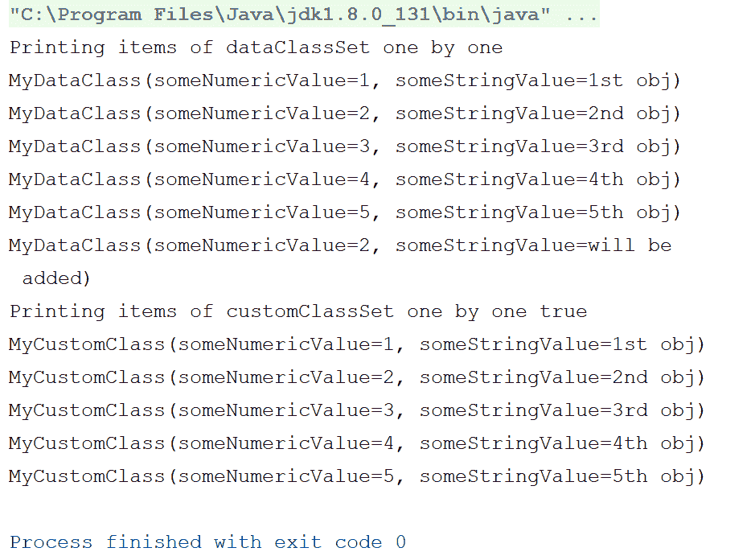

仔细查看前面的输出。虽然与数据类的情况一样，`set` 忽略了重复项，但在尝试与普通类做同样的事情时，它无法检测到重复插入并保留了它们。

在 `dataClassSet` 中最后添加的项是 `MyDataClass(2,"will be added")`，如果你认为它是一个重复项，那么请再次检查，尽管这个对象的 `someNumericValue` 值与之前的相同，但 `someStringValue` 值与之前对象的 `someStringValue` 不同。

为什么这是一个异常？答案是简单明了——集合框架在向 `set` 值添加项时内部使用 `hashCode()` 和 `equals()` 函数来执行相等性检查，而自定义类中缺少这些函数。

在 Kotlin 中，编译器会自动提取 `hashCode()` 和 `equals()` 函数。因此，`set` 值能够区分重复项，而无需自定义这些函数的实现。有关数据类的更多信息，请访问以下链接：[`kotlinlang.org/docs/reference/data-classes.html`](https://kotlinlang.org/docs/reference/data-classes.html)

因此，如果我们实现这些函数，那么 `set` 也将能够区分 `customClassSet` 值中的重复项。显然，这对于数据类也是这样工作的。只需将以下代码添加到 `MyCustomClass` 定义中并运行程序，自己看看效果：

```kt
override fun hashCode() = someStringValue.hashCode()+someNumericValue.hashCode() 

    override fun equals(other: Any?): Boolean { 
        return other is MyCustomClass && other.someNumericValue == someNumericValue && other.someStringValue==someStringValue 
    } 
```

很酷，不是吗？所以，我们已经完成了`List`和`Set`。现在让我们看看`Map`接口；然后，我们将讨论集合框架提供的数据操作函数。

# Map 和 MutableMap

集合框架中的`Map`接口与其他所有我们之前覆盖的接口略有不同；与其他接口不同，它使用键值对。不，这并不类似于`Pair`；`Pair`只是两个值组合在一起，而映射是一组键值对。

在映射中，键是唯一的，不能重复。如果你添加两个具有相同键的值，那么后面的值将替换前面的值。另一方面，值可以是冗余的/重复的。这种行为背后的原因是，在映射中，值是根据其键存储和检索的，因此冗余的键将使得无法区分它们，也无法获取它们的值。

Kotlin 中`Map`的声明读起来像接口`Map<K, out V>`，`K`值是键的泛型类型，而`V`是值的泛型类型。

要了解更多关于集合的信息，让我们看看一些函数和属性。查看以下列表：

+   `val size: Int`: 这个函数表示`Map`接口的大小，即映射中驻留的键值对数量。

+   `fun isEmpty(): Boolean`: 这个函数有助于检查`Map`接口是否为空。

+   `fun containsKey(key: K): Boolean`: 这个函数检查提供的`key`是否在它拥有的键值对集合中，如果找到则返回`true`。

+   `operator fun get(key: K): V?`: 这个函数兼操作符（如果像数组一样使用方括号`[]`）返回与键对应的值，如果键不存在则返回 null。

+   `val keys: Set<K>`: 这个函数表示在该映射的某个时间点可用的键集合。由于键不能重复且无序，`Set`值是存储它们的最佳数据结构。

+   `val values: Collection<V>`: 包含`map`值的所有值作为一个集合。

+   `interface Entry<out K, out V>`: 这个函数定义在`Map`接口内部。`Entry`表示`Map`接口中的单个键值对。键值对作为条目存储在`map`值中。

+   `val entries: Set<Map.Entry<K, V>>`: 这个函数可以获取映射中的所有条目。

之前的都是只读接口的`Map`，因为它只支持只读操作。对于读写访问，你必须使用`mutableMap`函数。因此，现在让我们看看`mutableMap`提供的读写接口，如下所示：

+   `fun put(key: K, value: V): V?` : 这个接口向`Map`添加键值对，并返回与键关联的先前值（如果有，则为 null，如果键之前不在`Map`中）。

+   `fun remove(key: K): V?`：此接口从 `Map` 接口中删除具有键的键值对，并返回值。如果键不存在于 `Map` 接口中，则返回 null。

+   `fun putAll(from: Map<out K, V>): Unit`：此接口从提供的 `map` 值添加键值对。

+   `fun clear(): Unit`：正如其名所示，此实例清除 `map` 值。它移除 `map` 值包含的每一项——每个键和每个值。

因此，既然我们现在知道了 `Map` 接口提供的接口和函数，让我们现在通过一个 `Map` 的例子来展示。

让我们通过以下示例进行说明：

```kt
fun main(args: Array<String>) { 
    val map = mapOf( 
            "One".to(1), 
            "Two".to(2), 
            "Three".to(3), 
            "Four".to(4), 
            "Five".to(0),//(1) We placed 0 instead of 5 here, will be replaced later 
            "Six".to(6), 
            "Five".to(5)//(2) This will replace earlier map of "Five".to(0) 
            ) 

    println("The value at Key `Four` is ${map["Four"]}") 

    println("Contents in map") 
    for(entry in map) { 
        println("Key ${entry.key}, Value ${entry.value}") 
    } 

    val mutableMap = mutableMapOf<Int,String>() 

    mutableMap.put(1,"Item 1") 
    mutableMap.put(2,"Item 2") 
    mutableMap.put(3,"Item 3") 
    mutableMap.put(4,"Item 4") 

    println("Replacing value at key 1 - ${mutableMap.put(1,"Item 5")}")//(3) 

    println("Contents in mutableMap") 
    for(entry in mutableMap) { 
        println("Key ${entry.key}, Value ${entry.value}") 
    } 
} 
```

因此，我们展示了以下两种类型映射的使用：

+   只读 `Map`

+   可读写 `MutableMap`

Kotlin 为你提供了一个接受 `Pair` 类型的 `vararg` 参数的 `mapOf()` 函数版本。这使得你可以轻松地创建只读映射——只需将键值对作为 `Pair` 实例传递给 `mapOf()` 函数。

在进一步检查和讨论程序之前，让我们看看输出。请看以下截图：

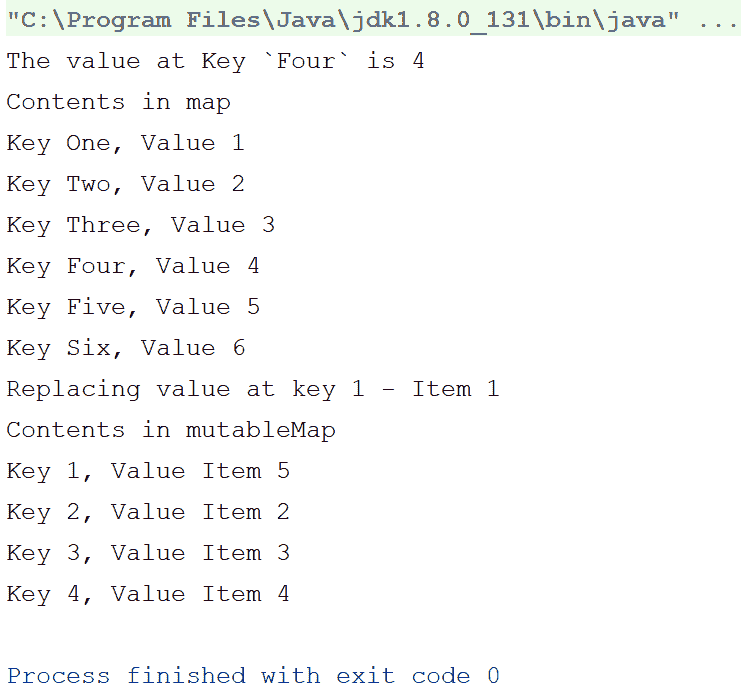

在创建地图时，在注释 `(1)` 中，我们传递了一个 `"Five".to(0)` 对，在注释 `(2)` 中，我们传递了 `"Five".to(5)` 对到同一个 `mapOf` 函数，以检查 `map` 为 `"Five"` 键存储的值；输出表明 `map` 采用了第二个值——`5`，正如我们之前所描述的，`map` 的值总是取相同键的最后一个值。

还要注意，Kotlin 还支持在 `Map` 中使用类似数组的方括号。你可以传递键而不是索引。

因此，当我们熟悉了 Kotlin 集合框架中的三个最重要的接口：`List`、`Set` 和 `Map` 后，现在让我们继续前进，了解集合中的数据操作。

# 集合中的数据操作

Kotlin 为其集合框架提供了开箱即用的支持。因此，Kotlin 的集合框架充满了有趣的功能，使其与其他语言的集合框架（如 Java）区别开来。你已经接触到了其中的一些功能，例如为只读和可变集合提供单独的接口、类似方框操作符的数组等。我现在要介绍的是 Kotlin 集合框架中最有趣的功能之一，但通常被忽视——数据操作函数。

Kotlin 支持其所有集合框架接口、对象和类的数据操作函数。数据操作函数是指我们可以通过它们访问、处理或操作集合中的数据的操作符和函数；如果你熟悉 ReactiveX 框架/RxJava/RxKotlin，你会发现它们很相似，因为 Kotlin 主要从那里借鉴了它们。

下面是我们将要介绍的一些集合数据操作函数列表：

+   `map` 函数

+   `filter` 函数

+   `flatMap` 函数

+   `drop` 函数

+   `take`函数

+   `zip`函数

那么，我们还在等什么呢？让我们开始吧。

尽管如此，使用集合的数据操作函数会让你感觉像在使用流/Rx，但它们在本质上与流/Rx 没有任何相似之处。它们所做的只是使用高阶函数和扩展函数为你提供类似流的接口，并且在内部它们操作在相同的循环中（是的，你读对了，它们使用循环来产生结果，然后像简单的帝国程序一样从函数中返回它）。建议你在程序中避免使用这些函数的大链，因为最终你会得到多个循环。在这种情况下使用`forEach`或你自己的循环是更好的选择，因为你可以使用`forEach`或你自己的循环在一个循环中执行多个操作。然而，对于单个操作或小的链，你当然可以使用这些函数来使你的代码更有组织性。

# 地图函数

`map`函数允许你将算法应用于整个集合，并作为结果集获得结果。这对于使你的代码更有组织性和编写循环很有帮助（尽管它会在内部使用循环，但你将免于编写那些样板代码）。

`map`函数接收集合中的所有元素作为每次迭代的元素，并应返回应放置在结果列表中替代传递项的计算结果项。

以下是一个示例：

```kt
fun main(args: Array<String>) { 
    val list = listOf<Int>(1,2,3,4,5,6,7,8,9,10) 
    val modifiedList = list.map { it*2 } 

    println("modifiedList -> $modifiedList") 
} 
```

因此，我们有一个`Int`列表，我们需要将列表中的每个项乘以`2`，我们只需一行代码就能轻松完成——`list.map { it*2 }`，这通常需要我们多两到三行样板代码。疯狂，不是吗？

以下是程序的输出：

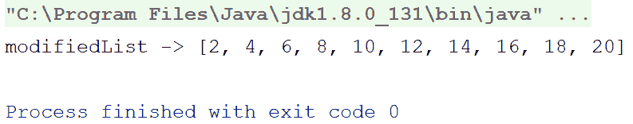

如预期的那样，`map`函数将提供的 lambda 函数应用于列表的每个元素，并返回结果列表。

# `filter`函数

想象一下你需要过滤集合中的项的情况。例如，当你想从整数列表中获取仅偶数时。`filter`函数就是为了帮助你在这些场景中。

`filter`函数接收集合中的所有元素作为每次迭代的元素，并应根据其确定是否应将传递的项放在结果列表中来返回`true`或`false`。

以下是一个程序示例：

```kt
fun main(args: Array<String>) { 
    val list = 1.until(50).toList()//(1) 
    val filteredListEven = list.filter { it%2==0 }//(2) 

    println("filteredListEven -> $filteredListEven") 

    val filteredListPSquare = list.filter { 
        val sqroot = sqrt(it.toDouble()).roundToInt() 
        sqroot*sqroot==it 
    }//(3) 

    println("filteredListPSquare -> $filteredListPSquare") 
} 
```

在这个程序中，我们首先使用`IntRange`帮助获取一个包含从`1`到`50`数字的`Int`列表。然后，我们在注释`(2)`中过滤列表以获取偶数并打印它们。在注释`(3)`中，我们过滤包含从`1`到`50`的`Int`值的原始列表以获取完全平方数并打印它们。

以下是程序的输出：

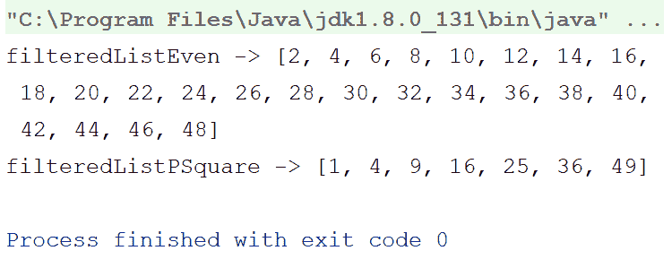

之前的代码片段及其输出显示了这些数据操作函数可以消除多少样板代码。

# 平滑映射函数

集合框架中可用的另一个令人惊叹的函数是`flatMap`函数。

就像`map`函数一样，它将集合中的每个项目作为迭代接收，但与`map`函数不同，它应该为传递的每个项目返回另一个集合。然后，这些返回的集合被组合起来创建结果集合。

看看以下示例：

```kt
fun main(args: Array<String>) { 
    val list = listOf(10,20,30) 

    val flatMappedList = list.flatMap { 
        it.rangeTo(it+2).toList() 
    } 

    println("flatMappedList -> $flatMappedList") 
} 
```

输出看起来如下：

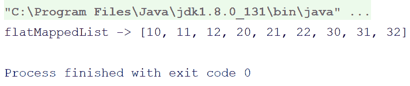

尽管原始列表中只包含三个数字——`10`、`20`和`30`，但结果列表中每个原始列表中的数字都增加了三个数字，这都要归功于`flatMap`函数。

# 删除函数

可能存在一些场景，当你想要丢弃集合的一部分（比如说，前 5 个或最后 10 个）并处理剩余的部分时。Kotlin 的集合框架为你提供了一组`drop`函数，这些函数可以帮助你在这些场景下。看看以下程序：

```kt
fun main(args: Array<String>) { 
    val list = 1.until(50).toList() 

    println("list.drop(25) -> ${list.drop(25)}")//(1) 
    println("list.dropLast(25) -> ${list.dropLast(25)}")//(2) 
} 
```

在前面的程序中，我们在注释`(1)`中从列表中删除了前`25`个项目，在注释`(2)`中，我删除了最后`25`个项目。

以下截图显示了程序的输出：

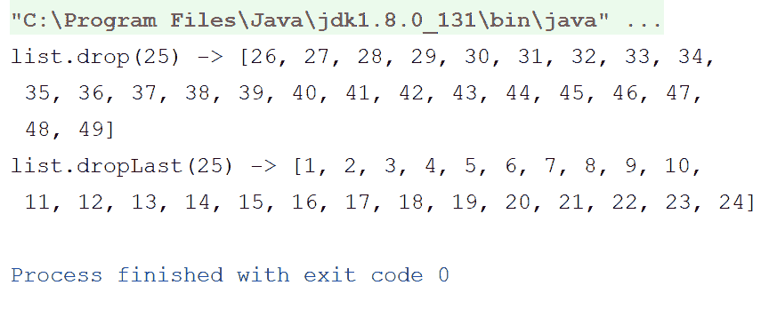

工作得完美，不是吗？

# `take`函数

`take`函数与`drop`函数的工作方式正好相反。你可以从集合中选择一部分，忽略其余部分。

看看以下程序：

```kt
fun main(args: Array<String>) { 
    val list = 1.until(50).toList() 

    println("list.take(25) -> ${list.take(25)}")//(1) 
    println("list.takeLast(25) -> ${list.takeLast(25)}")//(2) 
    println("list.takeWhile { it<=10 } -> ${list.takeWhile { it<=10 }}")//(3) 
    println("list.takeLastWhile { it>=40 } -> ${list.takeLastWhile { it>=40 }}")//(4) 
} 
```

而在注释`(1)`和注释`(2)`中的 while 语句与之前的`drop`函数相反，它们只是从列表中取出并打印`25`个项目。

注释`(3)`中的语句有点不同，这里我们使用了`takeWhile`函数。`takeWhile`函数接受一个谓词，并在谓词返回`true`时继续在结果集合中取项目；一旦谓词返回`false`，`takeWhile`值将停止检查更多项目，并返回结果集合。

`takeLastWhile`值的工作方式与它相反。

以下是一个输出截图：

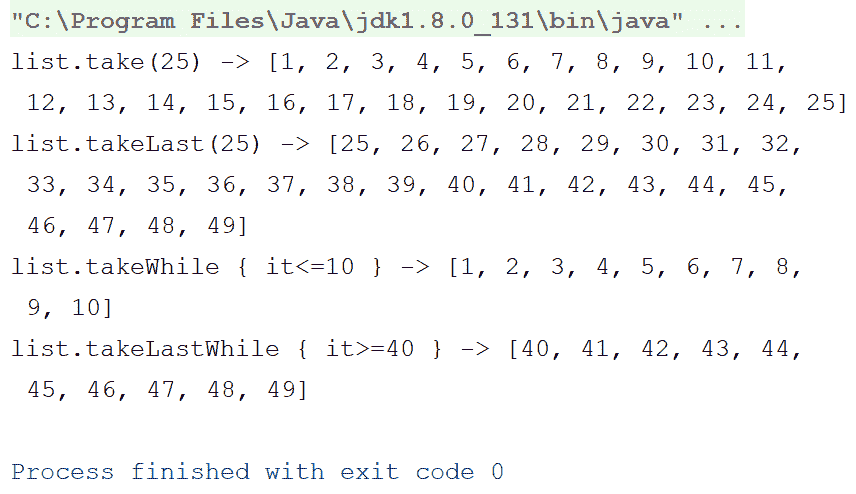

现在我们继续使用`zip`函数。

# `zip`函数

`zip`函数确实如其名所示，它将集合“压缩”在一起。令人困惑？让我们看看以下示例：

```kt
fun main(args: Array<String>) { 
    val list1 = listOf(1,2,3,4,5) 
    val list2 = listOf( 
            "Item 1", 
            "Item 2", 
            "Item 3", 
            "Item 4", 
            "Item 5" 
    ) 

    val resultantList = list1.zip(list2) 

    println(resultantList) 
} 
```

我们创建了两张列表——一张是`Int`类型的，另一张是`String`类型的。然后我们通过将`Int`列表与`String`列表进行`zip`操作创建了一个结果列表，并打印了这个结果列表。

那么，`resultantList`值包含什么？`zip`函数执行了什么操作？

让我们通过查看以下输出自行决定：

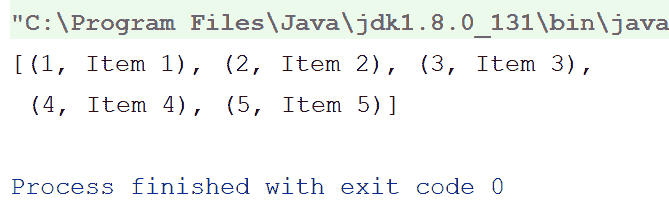

太棒了，不是吗？`zip`函数接受另一个集合，将源集合与提供的集合组合起来，并为每个项目创建一个`Pair`值。但如果集合的项目数量不同怎么办？如果我们想将列表中的每个项目与同一列表中的下一个项目组合起来呢？

让我们再举一个例子。看看以下代码：

```kt
fun main(args: Array<String>) { 
    val list1 = listOf(1,2,3,4,5,6,7,8) 
    val list2 = listOf( 
            "Item 1", 
            "Item 2", 
            "Item 3", 
            "Item 4", 
            "Item 5" 
    ) 

    println("list1.zip(list2)-> ${list1.zip(list2)}") 

    println("list1.zipWithNext() -> ${list1.zipWithNext()}") 
} 
```

因此，这里的第一个`println`语句回答了我们的第一个问题——它试图将两个项目数量不对称的列表组合起来。

在第二个`println`语句中，我们使用了`zipWithNext`函数，该函数将集合中的一个项目与同一集合的下一个项目进行压缩。那么，让我们看一下输出结果，以了解发生了什么。

以下为输出结果：

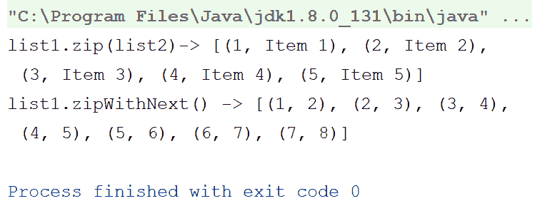

因此，`zip`操作符仅将`list1`中的那些项目与`list2`中的配对项进行压缩，并跳过了剩余的项。另一方面，`zipWithNext`操作符则按预期工作。

因此，我们已经完成了 Kotlin 集合框架中的数据操作函数。然而，Kotlin 为您提供了更多关于集合的能力；所以，让我们继续前进，看看它还能提供什么。

# 分组集合

Kotlin 的集合框架允许您根据需求对集合进行分组。例如，如果您有一个字符串列表，并希望根据它们的长度进行分组，您可以使用`groupBy`函数轻松实现，该函数根据提供的逻辑对集合进行分组，并返回包含该组集合的`Map`。

因此，以下是一个简短的示例：

```kt
fun main(args: Array<String>) { 
    val list = 1.rangeTo(50).toList() 

    println(list.groupBy { it%5 }) 
} 
```

因此，我们在这里所做的是：我们创建了一个包含从`1`到`50`（包括两端）的数字的`Int`列表，然后我们尝试根据它们除以`5`的余数来分组它们。

因此，应该有五个组，从`0`到`5`，每个组都应该包含 10 个数字。让我们检查以下输出结果，看看这是否发生了。

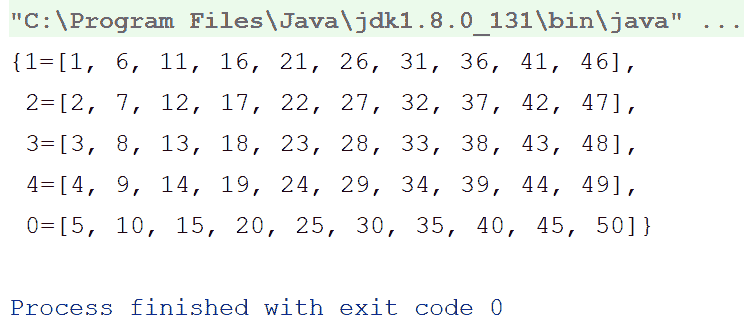

因此，`groupBy`函数按预期工作，并返回包含分组列表的`Map<Int,List<Int>>`。

# 摘要

因此，本章是关于 Kotlin 中的集合和数据操作。我们通过探索 Kotlin 的集合框架和数据结构开始本章，然后逐渐转向学习 Kotlin 集合框架提供的开箱即用的数据操作和函数。

在下一章中，我们将学习如何一起处理函数式编程、响应式编程和面向对象编程。我们相信 Kotlin 是做这件事的最佳语言，因为它让您能够同时获得函数式编程和面向对象编程的好处。在下一章中，我们将看到如何利用这一点。

在下一章中，我们还将介绍 ReactiveX 框架，这是功能响应式编程中最受欢迎的框架之一。

因此，让我们继续前进；下一章就在眼前。
