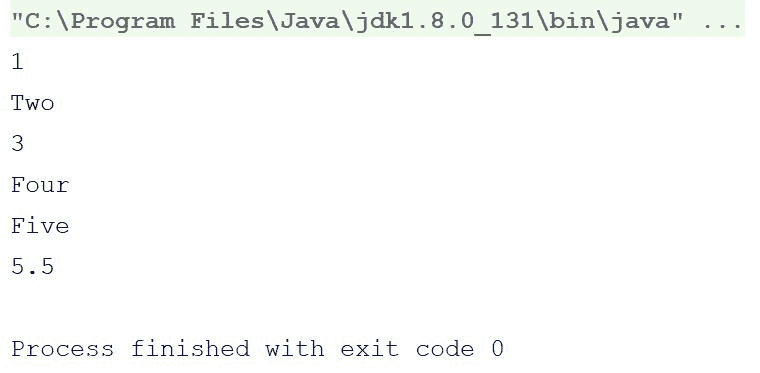
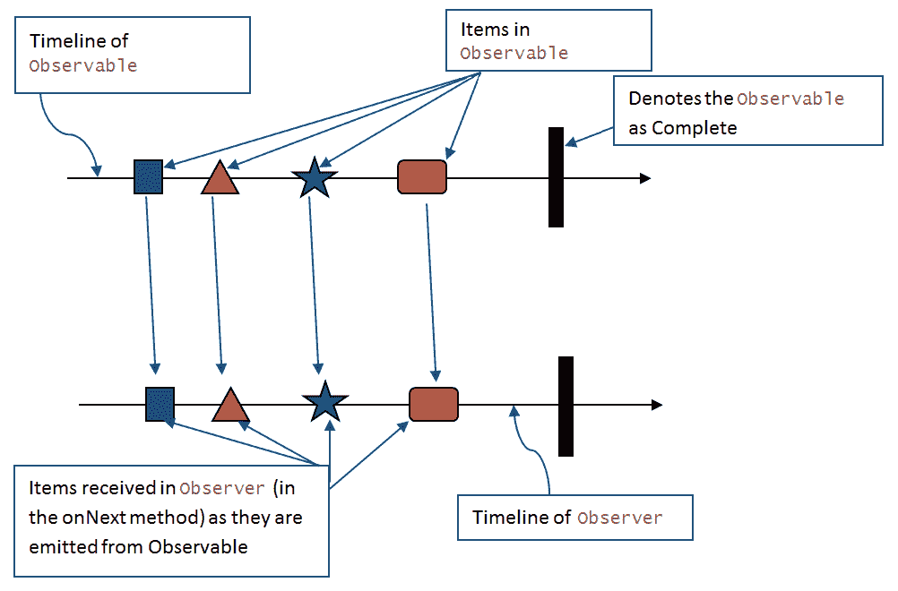
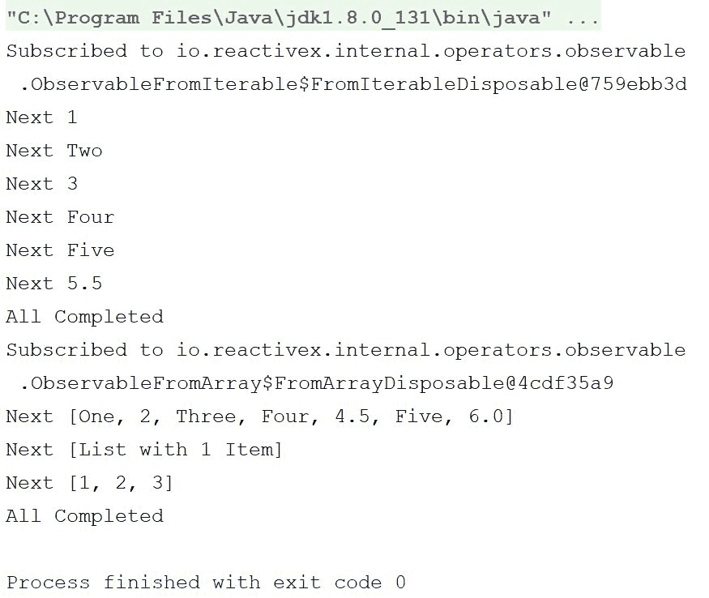
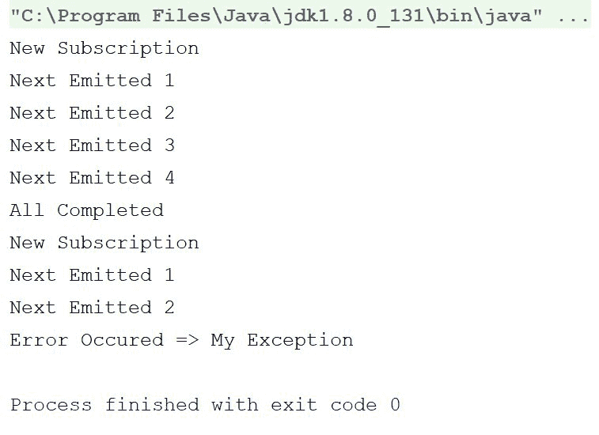
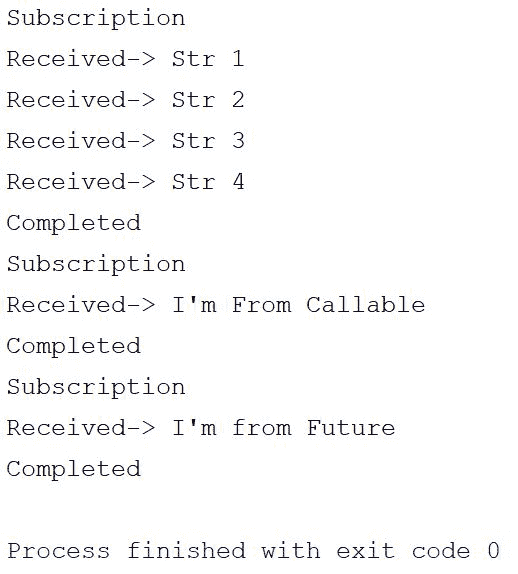
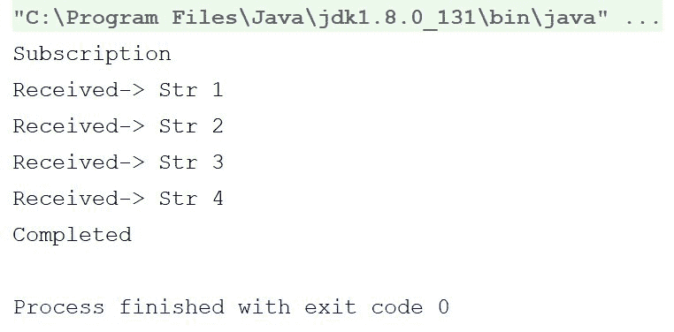
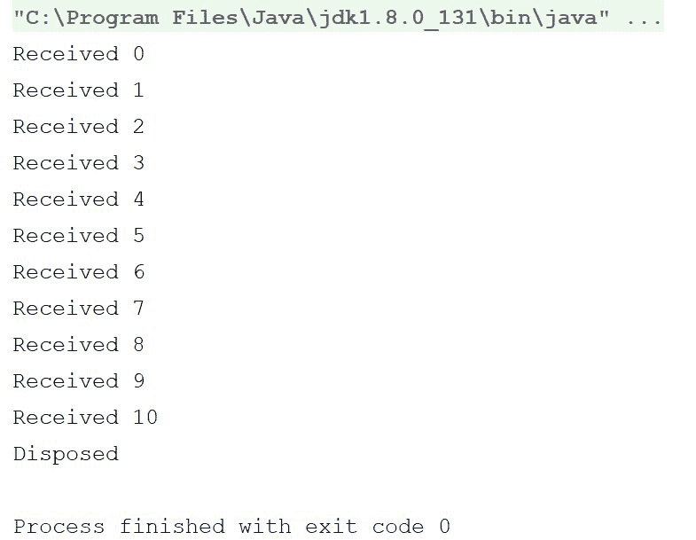

# 第九章：函数式编程和响应式编程

到目前为止，我们在过去的八章中取得了良好的进展。你已经学习了**函数式编程**（**FP**）的概念，以及一些令人惊叹的 Kotlin 特性，如协程和委托，它们并不完全来自 FP 理论（实际上，委托来自 OOP 范式），但所有这些都能使我们从 FP 中获得更多好处。

这篇简短的章节致力于将其他编程原则/范式与 FP 结合，以从它们中获得最佳输出。以下是本章我们将涵盖的主题列表：

+   将 FP 与 OOP 结合

+   函数式响应式编程

+   RxKotlin 简介

那么，让我们开始吧。

# 将 FP 与 OOP 结合

FP 和 OOP 都是老牌的编程范式，各有其优势和劣势。例如，在 FP 中严格遵循无副作用和所有纯函数是很困难的，尤其是对于 FP 初学者和面对复杂项目需求时。然而，在 OOP 系统中，很难避免副作用；此外，OOP 系统通常被称为并发程序的噩梦。

FP 不承认状态，而在现实生活中，状态是无法避免的。

通过使用/结合 OOP 和 FP，可以避免所有这些麻烦。最普遍的混合 OOP 和 FP 的风格可以概括为：在细节上函数式，在整体上面向对象。这是将 OOP 与 FP 结合的简单而高效的方法。这个概念讨论的是在代码中以更高的层次使用 OOP，即在模块化架构中，你可以使用 OOP 来定义类和接口，而在较低层次，即在编写方法/函数时，使用 FP。

为了打破这个概念，考虑一个结构，其中你像使用 OOP 一样编写类和接口，然后在编写函数/方法时，遵循 FP 风格的纯函数、单子和不变性。

如本书前面所述，我们相信如果你想要 OOP 和 FP 的混合，Kotlin 是最好的语言。

# 函数式响应式编程

函数式响应式编程的概念是通过将 FP 范式与响应式编程相结合而出现的。

**函数式响应式编程**的定义表明，它是一种用于响应式编程（异步数据流编程）的编程范式，使用 FP 的构建块（例如，`map`、`reduce`和`filter`）。

因此，让我们从定义响应式编程开始，然后我们将讨论将它们与 FP 结合。

**响应式编程**是一种现代编程范式，它讨论的是变化的传播，也就是说，不是将世界表示为一系列状态，而是响应式编程模型行为。

响应式编程是一种异步编程范式，它围绕数据流和变化的传播。简单来说，那些将影响其数据/数据流的所有变化传播给所有相关方（如最终用户、组件和子部分，以及其他以某种方式相关的程序）的程序被称为**响应式程序**。

响应式编程最好通过以下章节中描述的《响应式宣言》来定义。

# 《响应式宣言》

《**响应式宣言**》([`www.reactivemanifesto.org`](http://www.reactivemanifesto.org))是一份文件，定义了四个响应式原则，如下所述：

+   **响应性**：系统及时响应。响应性系统侧重于提供快速和一致的反应时间，因此它们提供一致的服务质量。

+   **弹性**：如果系统遇到任何故障，它仍然保持响应。通过复制、遏制、隔离和委派来实现弹性。故障被包含在每个组件内部，使组件彼此隔离，因此当某个组件发生故障时，它不会影响其他组件或整个系统。

+   **弹性**：响应式系统可以响应变化，并在不同的工作负载下保持响应。响应式系统以成本效益的方式在通用硬件和软件平台上实现弹性。

+   **消息驱动**：为了建立弹性原则，响应式系统需要通过依赖异步消息传递来在组件之间建立边界。

通过实现前面提到的四个原则，系统变得可靠且响应迅速，因此是响应式的。

# Kotlin 的功能响应式框架

为了编写响应式程序，我们需要一个库。目前有几种针对 Kotlin 的响应式编程库可以帮助我们。以下是可用库的列表：

+   RxKotlin

+   Reactor-Kotlin

+   Redux-Kotlin

+   RxKotlin/RxJava 和其他响应式 Java（ReactiveX）框架也可以与 Kotlin 一起使用（因为 Kotlin 与 Java 双向 100%兼容）

在这本书中，我们将重点关注 RxKotlin。

# 开始使用 RxKotlin

**RxKotlin**是针对 Kotlin 的响应式编程的具体实现，它受到 FP 的影响。它倾向于函数组合、避免全局状态和副作用。它依赖于生产者/消费者观察者模式，并有许多操作符允许组合、调度、节流、转换、错误处理和生命周期管理。ReactiveX 框架得到了一个大型社区和 Netflix 的支持。

Reactor-Kotlin 也是基于 FP 的；它被广泛接受，并得到 Spring 框架的支持。RxKotlin 和 Reactor-Kotlin 有很多相似之处（可能是因为**Reactive Streams**规范）。

# 下载和设置 RxKotlin

您可以从 GitHub 下载并构建 RxKotlin（[`github.com/ReactiveX/RxKotlin`](https://github.com/ReactiveX/RxKotlin)）。它不需要任何其他依赖项。GitHub 维基百科页面上的文档结构良好。以下是您如何从 GitHub 检出项目并运行构建的步骤：

```kt
    $ git clone https://github.com/ReactiveX/RxKotlin.git
    $ cd RxKotlin/
    $ ./gradlew build

```

您也可以使用 Maven 和 Gradle，如页面上的说明。

我们在这本书中使用 RxKotlin 版本 2.2.0。

现在，让我们看看 RxKotlin 究竟是什么。我们将从一个众所周知的事物开始，然后逐渐深入到库的秘密。

# 将拉取机制与 RxJava 推送机制进行比较

RxKotlin 围绕表示现实生活事件和数据系统的`Observable`类型，旨在用于推送机制，因此它是懒加载的，可以以同步和异步两种方式使用。

如果我们从与数据列表一起工作的简单示例开始，这将更容易理解：

```kt
fun main(args: Array<String>) { 
    var list:List<Any> = listOf(1, "Two", 3, "Four", "Five", 5.5f) // 1 
    var iterator = list.iterator() // 2 
    while (iterator.hasNext()) { // 3 
        println(iterator.next()) // Prints each element 4 
    } 
} 
```

输出如下：



让我们逐行分析程序，了解它是如何工作的。

在注释`1`中，我们创建了一个包含七个项目的`list`（`list`通过`Any`类帮助包含混合数据类型的数据）。在注释`2`中，我们从`list`创建了一个`iterator`，这样我们就可以遍历数据。在注释`3`中，我们创建了一个`while`循环，使用`iterator`从`list`中拉取数据，然后在注释`4`中打印它。

这里需要注意的事情是，我们在当前线程阻塞直到收到并准备好数据时从`list`中拉取数据。例如，想象一下从网络调用/数据库查询而不是从列表中获取数据，在这种情况下，线程将被阻塞多长时间。显然，您可以为此操作创建一个单独的线程，但这也会增加复杂性。

仔细思考一下，哪种方法更好，让程序等待数据，还是当数据可用时将数据推送到程序？

ReactiveX 框架（无论是 RxKotlin 还是 RxJava）的构建块是可观察的。`Observable`类与迭代器相反。它有一个底层集合或计算，产生可以被消费者消费的值。但不同之处在于，消费者不像在迭代器模式中那样从生产者那里拉取这些值；相反，生产者将值作为通知推送到消费者。

因此，让我们再次使用相同的示例，这次使用`observable`：

```kt
fun main(args: Array<String>) { 
    var list = listOf(1, "Two", 3, "Four", "Five", 5.5f) // 1 
    var observable = list.toObservable(); 

    observable.subscribeBy(  // named arguments for lambda Subscribers 
            onNext = { println(it) }, 
            onError =  { it.printStackTrace() }, 
            onComplete = { println("Done!") } 
    ) 
} 
```

这个程序的结果与上一个相同；它打印出列表中的所有项目。不同之处在于其方法。因此，让我们看看它实际上是如何工作的：

1.  创建了一个列表（与上一个相同）

1.  通过`list`创建了一个`Observable`实例

1.  我们订阅了观察者（我们使用 lambda 的命名参数；我们将在后面详细讨论它们）

当我们订阅`observable`变量时，每个数据都会在准备好后推送到`onNext`；当所有数据都推送后，它会调用`onComplete`，如果发生任何错误，则会调用`onError`。

因此，你学习了如何使用`Observable`实例，并且它们与我们所熟悉的迭代器实例相当相似。我们可以使用这些`Observable`实例来构建异步流并将数据更新推送到它们的订阅者（甚至是多个订阅者）。这是一个简单的响应式编程范式实现。数据正在传播到所有感兴趣的各方——订阅者。

# 可观察对象

如我们之前讨论的，在响应式编程中，`Observable`有一个底层计算，产生可以被消费者（`Observer`）消费的值。这里最重要的东西是，消费者（`Observer`）在这里不是拉取值；而是`Observable`将值推送到消费者。因此，我们可以说`Observable`接口是一个基于推送、可组合的迭代器，通过一系列操作符将项目发射到最后一个`Observer`，最终消费这些项目。现在让我们按顺序分解这些内容，以更好地理解：

+   `Observer`订阅`Observable`

+   `Observable`开始发出它所包含的项目

+   `Observer`对`Observable`发出的任何项目做出反应

那么，让我们深入了解`Observable`是如何通过其事件/方法工作的，即`onNext`、`onComplete`和`onError`。

# `Observable`的工作原理

如我们之前所述，一个`Observable`值有以下三个最重要的事件/方法：

+   `onNext`：`Observable`接口将所有项目逐个传递给此方法

+   `onComplete`：当所有项目都通过`onNext`方法后，`Observable`调用`onComplete`方法

+   `onError`：当`Observable`遇到任何错误时，它调用`onError`方法来处理错误，如果已定义

这里需要注意的一点是，我们所说的`Observable`中的项目可以是任何东西；它定义为`Observable<T>`，其中`T`可以是任何类。甚至可以将数组/列表分配为`Observable`。

让我们看看下面的图示：



下面是一个代码示例，以更好地理解它：

```kt
fun main(args: Array<String>) { 

    val observer = object :Observer<Any>{//1 
    override fun onComplete() {//2 
        println("All Completed") 
    } 

        override fun onNext(item: Any) {//3 
            println("Next $item") 
        } 

        override fun onError(e: Throwable) {//4 
            println("Error Occured $e") 
        } 

        override fun onSubscribe(d: Disposable) {//5 
            println("Subscribed to $d") 
        } 
    } 

    val observable = listOf(1, "Two", 3, "Four", "Five", 5.5f).toObservable() //6 

    observable.subscribe(observer)//7 

    val observableOnList = Observable.just(listOf("One", 2, "Three", "Four", 4.5, "Five", 6.0f), 
            listOf("List with 1 Item"), 
            listOf(1,2,3))//8 

    observableOnList.subscribe(observer)//9 
} 
```

在前面的示例中，我们在注释`1`处声明了`Any`数据类型的观察者实例。

在这里，我们利用了`Any`数据类型的好处。在 Kotlin 中，每个类都是`Any`类的子类。此外，在 Kotlin 中，一切都是类和对象；没有单独的原始数据类型。

`Observer` 接口中有四个声明的方法。注释 `2` 中的 `onComplete()` 方法在 `Observable` 完成所有项目且没有任何错误时被调用。在注释 `3` 中，我们定义了 `onNext(item: Any)` 函数，这个函数将由 `observable` 值对每个要发射的项目调用。在这个方法中，我们将数据打印到控制台。在注释 `4` 中，我们定义了 `onError(e: Throwable)` 方法，当 `Observable` 接口遇到错误时将被调用。在注释 `5` 中，`onSubscribe(d: Disposable)` 方法将在 `Observer` 订阅到 `Observable` 时被调用。在注释 `6` 中，我们从一个列表中创建了一个 `Observable` (`val observable`) 并使用注释 `7` 中的 `observer` 值订阅了 `observable` 值。在注释 `8` 中，我们再次创建 `observable` (`val observableOnList`)，它包含列表作为项目。

程序的输出如下：



因此，正如你在输出中看到的，对于第一次订阅（注释 `7`），当我们订阅到 `observable` 值时，它调用 `onSubscribe` 方法，然后 `Observable` 属性开始发射项目，因为 `observer` 开始在 `onNext` 方法中接收它们并将它们打印出来。当 `Observable` 属性的所有项目都被发射出来后，它调用 `onComplete` 方法来表示所有项目都已成功发射。第二个也是同样的，只是这里的每个项目都是一个列表。

随着我们逐渐掌握了 `Observables`，你现在可以学习一些创建 `Observable` 工厂方法的方法。

# Observable.create 方法

在任何时候，你都可以使用 `Observable.create` 方法创建自己的自定义 `Observable` 实现。这个方法接受一个 `ObservableEmitter<T>` 接口的实例作为观察的来源。看看下面的代码示例：

```kt
fun main(args: Array<String>) { 

    val observer: Observer<String> = object : Observer<String> { 
        override fun onComplete() { 
            println("All Completed") 
        } 

        override fun onNext(item: String) { 
            println("Next $item") 
        } 

        override fun onError(e: Throwable) { 
            println("Error Occured => ${e.message}") 
        } 

        override fun onSubscribe(d: Disposable) { 
            println("New Subscription ") 
        } 
    }//Create Observer 

    val observable:Observable<String> = Observable.create<String> {//1 
        it.onNext("Emitted 1") 
        it.onNext("Emitted 2") 
        it.onNext("Emitted 3") 
        it.onNext("Emitted 4") 
        it.onComplete() 
    } 

    observable.subscribe(observer) 

    val observable2:Observable<String> = Observable.create<String> {//2 
        it.onNext("Emitted 1") 
        it.onNext("Emitted 2") 
        it.onError(Exception("My Exception")) 
    } 

    observable2.subscribe(observer) 
} 
```

首先，我们创建了一个 `Observer` 接口的实例，就像之前的例子一样。我不会详细解释 `observer` 值，因为我们已经在之前的例子中看到了概述，并且将在本章后面详细讨论。在注释 `1` 中，我们使用 `Observable.create` 方法创建了一个 `Observable` 值。我们通过 `onNext` 方法从这个 `Observable` 值中发射了四个字符串，然后使用 `onComplete` 方法通知它完成。在注释 `2` 中，我们几乎做了同样的事情，只是在这里，我们不是调用 `onComplete`，而是调用带有自定义 `Exception` 函数的 `onError`。

下面是程序的输出：



`Observable.create` 方法很有用，尤其是在你使用自定义数据结构并且想要控制哪些值被发射出来时。你还可以从不同的线程向观察者发射值。

**Observable 合约** ([`reactivex.io/documentation/contract.html`](http://reactivex.io/documentation/contract.html)) 指出，Observables 必须按顺序（而不是并行）向观察者发出通知。它们可以从不同的线程发出这些通知，但通知之间必须存在正式的“发生之前”关系。

# The Observable.from methods

`Observable.from` 方法相对于 `Observable.create` 方法来说比较简单。您可以使用 from 方法从几乎任何 Kotlin 结构中创建 `Observable` 实例。

在 RxKotlin 1 中，你将拥有 `Observale.from` 作为一种方法；然而，从 RxKotlin 2.0（与 RxJava2.0 相同），操作符重载已被重命名为后缀，例如 `fromArray`、`fromIterable` 和 `fromFuture`。

让我们看看以下代码：

```kt
fun main(args: Array<String>) { 

    val observer: Observer<String> = object : Observer<String> { 
        override fun onComplete() { 
            println("Completed") 
        } 

        override fun onNext(item: String) { 
            println("Received-> $item") 
        } 

        override fun onError(e: Throwable) { 
            println("Error Occured => ${e.message}") 
        } 

        override fun onSubscribe(d: Disposable) { 
            println("Subscription") 
        } 
    }//Create Observer 

    val list = listOf("Str 1","Str 2","Str 3","Str 4") 
    val observableFromIterable: Observable<String> = Observable.fromIterable(list)//1 
    observableFromIterable.subscribe(observer) 

    val callable = object : Callable<String> { 
        override fun call(): String { 
            return "I'm From Callable" 
        } 

    } 
    val observableFromCallable:Observable<String> = Observable.fromCallable(callable)//2 
    observableFromCallable.subscribe(observer) 

    val future:Future<String> = object : Future<String> { 
        val retStr = "I'm from Future" 

        override fun get() = retStr 

        override fun get(timeout: Long, unit: TimeUnit?)  = retStr 

        override fun isDone(): Boolean = true 

        override fun isCancelled(): Boolean = false 

        override fun cancel(mayInterruptIfRunning: Boolean): Boolean = false 

    } 
    val observableFromFuture:Observable<String> = Observable.fromFuture(future)//3 
    observableFromFuture.subscribe(observer) 
} 
```

在注释 `1` 中，我们使用了 `Observable.fromIterable` 方法从 `Iterable` 实例（此处为 `list`）创建 `Observable`。在注释 `2` 中，我们调用了 `Observable.fromCallable` 方法从 `Callable` 实例创建 `Observable`，在注释 `3` 中，我们调用了 `Observable.fromFuture` 方法从 `Future` 实例派生出 `Observable`。

这里是输出：



# Iterator<T>.toObservable

多亏了 Kotlin 的扩展函数，您可以将任何 `Iterable` 实例（如 `list`）轻松地转换为 `Observable`。我们已经在 第一章，*Kotlin – 数据类型、对象和类* 中使用了此方法，但再次看看这个：

```kt
fun main(args: Array<String>) { 
    val observer: Observer<String> = object : Observer<String> { 
        override fun onComplete() { 
            println("Completed") 
        } 

        override fun onNext(item: String) { 
            println("Received-> $item") 
        } 

        override fun onError(e: Throwable) { 
            println("Error Occured => ${e.message}") 
        } 

        override fun onSubscribe(d: Disposable) { 
            println("Subscription") 
        } 
    }//Create Observer 
    val list:List<String> = listOf("Str 1","Str 2","Str 3","Str 4") 

    val observable: Observable<String> = list.toObservable() 

    observable.subscribe(observer) 

} 
```

输出如下：



因此，您难道不好奇想看看 `toObservable` 方法吗？让我们来做这件事。您可以在 `RxKotlin` 包提供的 `observable.kt` 文件中找到此方法：

```kt
fun <T : Any> Iterator<T>.toObservable(): Observable<T> = toIterable().toObservable() 
fun <T : Any> Iterable<T>.toObservable(): Observable<T> = Observable.fromIterable(this) 
fun <T : Any> Sequence<T>.toObservable(): Observable<T> = asIterable().toObservable() 

fun <T : Any> Iterable<Observable<out T>>.merge(): Observable<T> = Observable.merge(this.toObservable()) 
fun <T : Any> Iterable<Observable<out T>>.mergeDelayError(): Observable<T> = Observable.mergeDelayError(this.toObservable()) 
```

因此，它内部使用 `Observable.from` 方法，这要归功于 Kotlin 的扩展函数。

# Subscriber – the Observer interface

在 RxKotlin 1.x 中，`Subscriber` 操作符在 RxKotlin 2.x 中本质上变成了 `Observer` 类型。在 RxKotlin 1.x 中有一个 `Observer` 类型，但 `Subscriber` 值是你传递给 `subscribe()` 方法的，并且实现了 `Observer`。在 RxJava 2.x 中，`Subscriber` 操作符仅在谈论 `Flowables` 时存在。

如您在本章前面的示例中所见，`Observer` 类型是一个接口，其中包含四个方法，即 `onNext(item:T)`、`onError(error:Throwable)`、`onComplete()` 和 `onSubscribe(d:Disposable)`。如前所述，当我们连接 `Observable` 到 `Observer` 时，它会在 `Observer` 类型中寻找这四个方法并调用它们。以下是以下四个方法的简要描述：

+   `onNext`：`Observable` 调用此方法将每个项逐个传递给 `Observer`

+   `onComplete`：当 `Observable` 想表示它已经完成了向 `onNext` 方法传递项的操作时，它调用 `Observer` 的 `onComplete` 方法

+   `onError`：当`Observable`遇到任何错误时，它会调用`onError`方法来处理错误，如果`Observer`类型中定义了错误处理，否则它将抛出异常

+   `onSubscribe`：每当一个新的`Observable`订阅到`Observer`时，都会调用此方法

# 订阅和处置

所以，我们有`Observable`（应该观察的事物）和`Observer`类型（应该观察的类型），现在怎么办？我们如何将它们连接起来？`Observable`和`Observer`就像一个输入设备（无论是键盘还是鼠标）和计算机；我们需要某种东西来连接它们（即使是无线输入设备也有一些连接通道，无论是蓝牙还是 Wi-Fi）。

`subscribe`操作符的作用是连接`Observable`接口和`Observer`，充当媒体的作用。我们可以向`subscribe`操作符传递一到三个方法（`onNext`、`onComplete`和`onError`），或者我们可以向`subscribe`操作符传递`Observer`接口的实例，以获取与`Observer`连接的`Observable`接口。

那么，现在让我们来看一个例子：

```kt
fun main(args: Array<String>) { 
    val observable = Observable.range(1,5)//1 

    observable.subscribe({//2 
        //onNext method 
        println("Next-> $it") 
    },{ 
        //onError Method 
        println("Error=> ${it.message}") 
    },{ 
        //onComplete Method 
        println("Done") 
    }) 

    val observer: Observer<Int> = object : Observer<Int> {//3 
    override fun onComplete() { 
        println("All Completed") 
    } 

        override fun onNext(item: Int) { 
            println("Next-> $item") 
        } 

        override fun onError(e: Throwable) { 
            println("Error Occurred=> ${e.message}") 
        } 

        override fun onSubscribe(d: Disposable) { 
            println("New Subscription ") 
        } 
    } 

    observable.subscribe(observer) 
} 
```

在这个例子中，我们创建了一个`Observable`实例（在注释`1`处），并使用不同的重载`subscribe`操作符使用了两次。在注释`2`中，我们将三个方法作为参数传递给了`subscribe`方法。第一个参数是`onNext`方法，第二个是`onError`方法，最后一个是`onComplete`。在注释`2`中，我们传递了`Observer`接口的实例。

输出很容易预测，所以我们跳过它。

所以，我们已经了解了订阅的概念，现在可以这样做。如果你想在订阅一段时间后停止发射，怎么办？肯定有办法，对吧？那么，让我们检查一下。

记得`Observer`的`onSubscribe`方法吗？在那个方法中有一个我们还没有讨论过的参数。当你订阅时，如果你传递方法而不是`Observer`实例，那么`subscribe`操作符将返回一个`Disposable`实例，或者如果你使用`Observer`实例，那么你将在`onSubscribe`方法的参数中得到`Disposable`实例。

你可以使用`Disposable`接口的实例在任何给定时间停止发射。让我们来看一个例子：

```kt
fun main(args: Array<String>) { 

    val observale = Observable.interval(100, TimeUnit.MILLISECONDS)//1 
    val observer = object : Observer<Long> { 

        lateinit var disposable: Disposable//2 

        override fun onSubscribe(d: Disposable) { 
            disposable = d//3 
        } 

        override fun onNext(item: Long) { 
            println("Received $item") 
            if (item >= 10 && !disposable.isDisposed) {//4 
                disposable.dispose()//5 
                println("Disposed") 
            } 
        } 

        override fun onError(e: Throwable) { 
            println("Error ${e.message}") 
        } 

        override fun onComplete() { 
            println("Complete") 
        } 

    } 
    runBlocking { 
        observale.subscribe(observer) 
        delay(1500)//6 
    } 
} 
```

这里，我们使用了`Observable.interval`工厂方法。此方法接受两个参数，描述间隔期间和时间单位；然后按顺序发射从零开始的整数。使用`interval`创建的`Observable`永远不会完成，也永远不会停止，除非你取消它们，或者程序停止执行。我认为它非常适合这个场景，因为我们想在中间停止`Observable`。

因此，在这个例子中，在注释`1`处，我们使用`Observable.interval`工厂方法创建了`Observable`，该方法将在每个`100`毫秒间隔后发射一个整数。

在注释`2`中，我声明了`lateinit var disposable`为`Disposable`类型（`lateinit`意味着变量将在稍后的时间点初始化）。在注释`3`中，在`onSubscribe`方法内部，我们将接收到的参数值分配给`disposable`变量。

我们打算在序列达到`10`后停止执行，也就是说，在`10`被发出后，应立即停止发射。为了实现这一点，我们在`onNext`方法内部放置了一个检查，在那里我们检查发出的项的值。我们检查它是否等于或大于`10`，如果发射尚未停止（未处置），那么我们就处置发射（注释`5`）。

这里是输出结果：



从输出中，我们可以看到在调用`disposable.dispose()`方法后，没有整数被发出，尽管执行等待了 500 毫秒更多（100*10 = 1000 毫秒来打印序列直到`10`，我们使用`1500`调用延迟方法，因此是在发出`10`后的 500 毫秒）。

如果你好奇想了解`Disposable`接口，那么以下是其定义：

```kt
interface Disposable { 
  /** 
 * Dispose the resource, the operation should be idempotent. 
 */ 
  fun dispose() 
  /** 
 * Returns true if this resource has been disposed. 
 * @return true if this resource has been disposed 
 */ 
  val isDisposed:Boolean 
} 
```

它有一个属性表示发射已经被通知停止（已处置），以及一个通知发射停止（处置）的方法。

# 摘要

在本章中，你学习了如何将 FP 概念与 OOP 和响应式编程相结合。我们甚至讨论了 RxKotlin，并涵盖了 RxKotlin 的设置和基本用法。

下一章将介绍更高级的 FP 概念——单子、函子、应用，以及如何使用 Kotlin 实现它们。单子、函子和应用是一些必须了解的概念，通常被称为 FP 的构建块。所以，如果你真正想学习 FP，不要跳过下一章。现在就翻到下一页。
