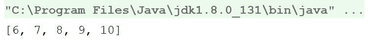
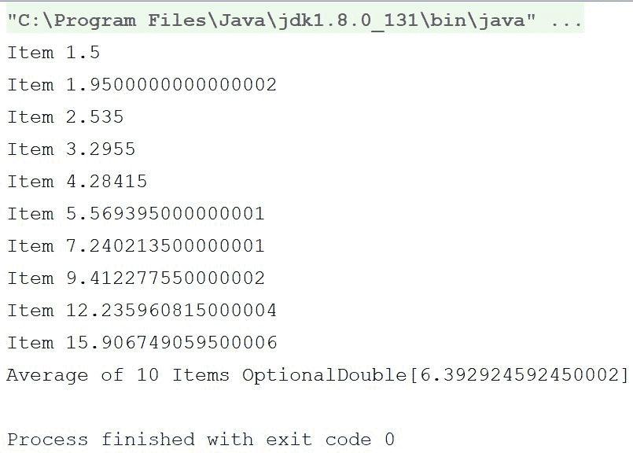
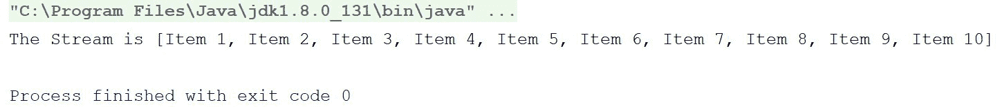
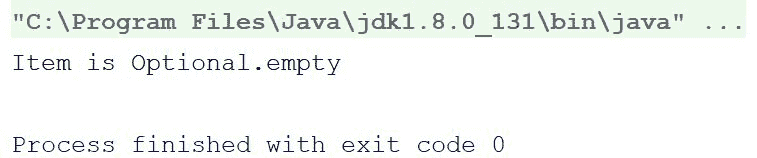
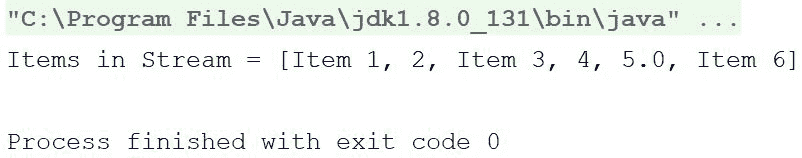
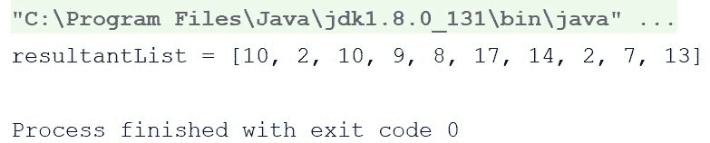
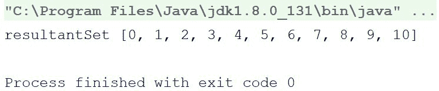
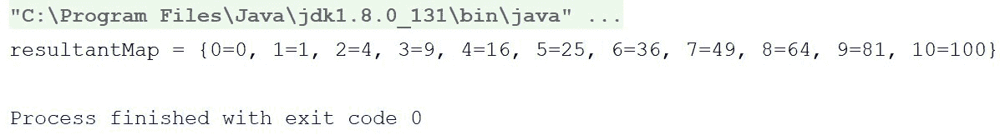
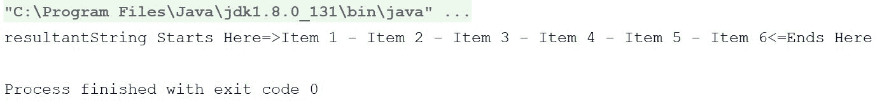
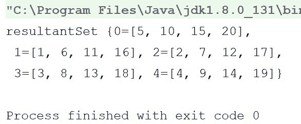

# 第十一章：在 Kotlin 中使用流

因此，我们正在逐步完成这本书。在本章中，我们将介绍 Kotlin 中的流以及如何使用它们。

流首次在 Java 8 中被引入。Kotlin 中的 Stream API 几乎与 Java API 相同，但包含了一些小的补充和扩展函数。

这是本章我们将要涵盖的内容：

+   流的介绍

+   集合与流

+   流与可观察对象（ReactiveX-RxKotlin/RxJava）

+   流的使用

+   创建流的多种方式

+   流的收集

那么，让我们开始吧。

# 流的介绍

如我们之前提到的，流（Streams）首次在 Java 8 中被引入。从 Java 8 开始，Java 开始更加关注函数式编程，并逐渐添加了函数式特性。

相反，Kotlin 从第一天开始就添加了函数式特性。Kotlin 添加了函数式特性和接口。当使用 Java 时，只有在使用 Java 8 及更高版本时才能使用流，但使用 Kotlin，即使在与 JDK 6 一起工作时，你仍然可以使用流。

那么，什么是流呢？你可以将流想象为一个抽象层，它覆盖了一系列元素以执行聚合操作。困惑吗？让我们通过一个代码示例来尝试理解：

```java
  fun main(args: Array<String>) { 
      val stream = 1.rangeTo(10).asSequence().asStream() 
      val resultantList = stream.skip(5).collect(Collectors.toList()) 
      println(resultantList) 
  } 
```

输出结果如下：



在之前的程序中，我们所做的是创建一个`IntRange`值，从它创建一个`Sequence`值，然后从它获取`stream`值。然后我们跳过了前五个元素，并将其收集回一个`List`实例。我们将在本章后面详细查看之前代码中使用的所有函数。

之前的程序使用了 Stream API 的函数式接口。

Stream API 拥有丰富的函数式接口，就像我们在集合中看到的那样。

# 集合与流

读到这儿，你可能正在想，在那个程序中我们执行的所有操作在 Kotlin 的集合中也是可能的，那么为什么我们要使用流呢？为了回答这个问题，我们首先应该了解流和集合之间的区别。让我们看一下以下列出的集合和流之间的区别列表：

+   正如集合的定义所说，**集合**是一个数据结构，它存储并允许你处理一组数据。另一方面，**流**不是数据结构，不存储任何东西；它们像管道或 IO 通道一样工作，按需从其源获取数据。

+   每个数据结构都必须有一个有限的大小限制，集合也是如此。但是，由于流不是数据结构，它们不需要有特定的尺寸限制。

+   当直接访问集合的元素时，你可以随时进行，即使是相同的位置，也不需要重新创建集合。但是，当与流（Streams）一起工作时，流中的元素在流的生命周期内只会被访问一次。就像迭代器一样，必须生成一个新的流来重新访问源中的相同元素。

+   集合 API 以急切的方式构建对象，总是准备好被消费。流 API 以懒加载、按需的方式创建对象。

+   集合（Collection）API 用于在多种数据结构中存储数据。流（Stream）API 用于在大量对象上计算数据。

因此，这些是集合 API 和流 API 之间非常基本的不同之处。乍一看，流（Streams）似乎像是 RxKotlin 的可观察者（Observables），它们提供了一种消费数据的方式，但流（Streams）和可观察者（Observables）之间有很多显著的差异。这些是流（Streams）和可观察者（Observables）之间的差异：

+   第一个值得注意的区别是，流（Streams）是基于拉取的，而可观察者（Observables）是基于推送的。这可能听起来过于抽象，但它有非常具体的重大影响。

+   使用可观察者（Observables），由于调度器（Schedulers）的存在，很容易更改线程或轻松指定链的线程池。但是，使用流（Streams）则有点棘手。

+   可观察者（Observables）在整个过程中都是同步的。这让你不必总是检查这些基本操作是否线程安全。

+   另一个显著的区别是，可观察者（Observables）比流（Streams）API 拥有更多的功能接口，这使得可观察者易于使用，并且有更多选项来完成特定任务。

因此，我们了解到了流（Streams）不是数据结构，而是数据源（可能是集合或其他任何东西）上方的抽象层，尽管流（Streams）以懒加载、按需的方式构建对象，但它们仍然是基于拉取的，并在其中使用循环。

要了解更多关于基于推送的架构和可观察者（Observables）的信息，你可以阅读 Rivu Chakraborty 所著的《Kotlin 中的响应式编程》一书。

# 处理流（Streams）

因此，我们学习了许多关于流（Streams）的理论，我们还了解到流（Streams）有一组功能接口来与之交互（实际上，功能接口是唯一与流（Streams）交互的方式），但正如我之前提到的，它们的工作方式与集合 API 略有不同。

为了更清楚地说明，请回顾以下示例：

```java
  fun main(args: Array<String>) { 
      val stream = 1.rangeTo(10).asSequence().asStream() 
       val resultantList = stream.filter{ 
          it%2==0 
      }.collect(Collectors.toList()) 
      println(resultantList) 
  } 
```

上述程序是一个简单的例子；我们只是抓取了一个从`1`到`10`的数字流，并从该流中过滤出奇数，然后将结果收集到一个新的`List`中。

但让我们尝试理解它是如何工作的机制。我们已经熟悉了函数式接口和 `filter` 函数，因为我们已经在前面的章节中介绍了它们，但这里不同的是 `collect` 函数和 `Collectors` 值，它们有助于将结果数据收集到新的 `List` 中。我们将在本章后面更详细地讨论 `collect` 方法以及 `Collectors` 值，但现在，让我们看看 Streams 提供的函数式接口和流类型。

因此，以下是从 Stream API 中提取的操作/函数式接口及其描述：

+   `filter()`: 与 Kotlin 中的 `Collection.filter` 功能相同。它返回一个由与此 `stream` 中匹配给定谓词的元素组成的 `stream` 值。

+   `map()`: 与 Kotlin 中的 `Collection.map` 功能相同。它返回一个由将给定函数应用于此 `stream` 的每个元素的结果组成的 `stream` 值。

+   `mapToInt()`/`mapToLong()`/`mapToDouble()`: 与 `map` 的功能相同，但返回的不是 `stream` 值，而是分别返回 `IntStream`、`LongStream` 和 `DoubleStream` 值。我们将在本章后面详细讨论 `IntStream`、`LongStream` 和 `DoubleStream`。

+   `flatMap()`: 与 Kotlin 中的 `Collection.flatMap` 功能相同。

+   `flatMapToInt()`/`flatMapToLong()`/`flatMapToDouble()`: 与 `flatMap` 的功能相同，但返回的不是 `stream` 值，而是分别返回 `IntStream`、`LongStream` 和 `DoubleStream` 值。

+   `distinct()`: 与 `Collection.distinct` 的功能相同。它返回一个包含不同元素的 `stream` 值。

+   `peek()`: 这个函数在 Kotlin 集合中没有对应的函数，然而在 RxKotlin/RxJava 中有对应的函数。这个函数返回由这个 `stream` 的元素组成的 `stream` 值，并在每个元素被消费的同时执行提供的操作，就像 RxJava 中的 `doOnNext` 操作符一样。

+   `anyMatch()`: 与 `Collection.any()` 类似，它返回此 `stream` 的任何元素是否都匹配提供的谓词。如果不需要评估所有元素来确定结果，则可能不会评估谓词。如果 `stream` 值为空，则返回 `false` 值，并且不会评估谓词。

+   `allMatch()`: 与 `Collection.all` 类似，它返回此 `stream` 的所有元素是否都匹配提供的谓词。如果不需要评估所有元素来确定结果，则可能不会评估谓词。如果 `stream` 值为空，则返回 `true` 值，并且不会评估谓词。

+   `noneMatch()`：类似于`Collection.none`，它返回此`stream`中是否有元素匹配提供的谓词。如果不需要确定结果，则可能不会评估谓词。如果`stream`为空，则返回`false`值，并且不会评估谓词。

我们省略了这些函数的示例，因为它们与`Collection`函数和 RxJava/RxKotlin 操作符类似。

如果你对此有所疑问，那么是的，如果你的项目完全是 Kotlin（没有任何 Java 或其他语言代码），你可以安全地放弃 Streams，转而使用 Collections 和协程。

现在，让我们来看看之前提到的`IntStream`、`DoubleStream`和`LongStream`值，并探讨它们的作用。

# 原始流

**原始流**是在 Java 8 中引入的，以便在使用 Streams 的同时利用 Java 中的原始数据类型（再次强调，Streams 基本上来自 Java，而 Kotlin 只是为 Streams API 添加了一些扩展函数）。`IntStream`、`LongStream`和`DoubleStream`是这些原始流的一部分。

这些原始流的工作方式与普通 Stream 类似，但增加了一些原始数据类型的功能。

那么，让我们举一个例子；看看以下程序：

```java
  fun main(args: Array<String>) { 
      val intStream = IntStream.range(1,10) 
      val result = intStream.sum() 
      println("The sum of elements is $result") 
  } 
```

因此，我们使用`IntStream.range()`函数创建了一个`IntStream`值，`range`函数接受两个整数作为起始点和结束点，并创建一个从指定整数开始的 Stream，包括这两个整数。然后我们计算了总和并打印出来。程序看起来相当简单，显然要归功于`IntStream`，为什么？想想用这种方式轻松计算元素的总和；没有`IntStream`，我们就必须遍历所有元素来计算总和。

下面是另一个原始流的例子：

```java
  fun main(args: Array<String>) { 
      val doubleStream = DoubleStream.iterate(1.5,{item ->     item*1.3})//(1) 
      val avg = doubleStream 
              .limit(10)//(2) 
              .peek { 
                  println("Item $it") 
              }.average()//(3) 
      println("Average of 10 Items $avg") 
  } 
```

在我们解释程序之前，先看看以下输出：



那么，让我们来解释一下这个程序：

+   在注释`(1)`中，我们使用`iterate()`工厂方法创建了一个`DoubleStream`值。`iterate`方法接受一个`double`作为 Stream 的种子，以及一个操作符，该操作符将被迭代应用以生成 Stream 的元素，例如，如果你传递*x*作为种子和*f*作为操作符，Stream 将返回*x*作为第一个元素，*f(x)*作为第二个元素，*f(f(x))*作为第三个元素，依此类推。此函数创建了一个无限大小的 Stream。

+   我们在注释`(2)`处使用了`limit`操作符，因为我们只想从这个 Stream 中获取 10 个元素，而不是无限多的所有元素。在注释`(3)`处，我们计算了`average`。

那么，让我们来看看创建 Stream 的不同方法。

# Stream 工厂方法

Streams API 提供了多种获取`Stream`实例的方法。以下是创建 Streams 的几种方式，我们将对其进行介绍：

+   `Stream Builder`

+   `Stream.empty()`

+   `Stream.of()`

+   `Stream.generate()`

+   `Stream.iterate()`

+   Kotlin 扩展——`asStream()`

在前面的列表中，我们已经看到了 Kotlin 扩展`asStream`和`Stream.iterate`函数的工作方式（它将以与前面示例中覆盖的`DoubleStream.iterate`值相同的方式工作）。我们将查看其余部分。

# Stream Builder

`Stream Builder`接口使得轻松创建流实例变得非常容易。看看以下示例：

```java
  fun main(args: Array<String>) { 
      val stream = Stream.builder<String>() 
              .add("Item 1") 
              .add("Item 2") 
              .add("Item 3") 
              .add("Item 4") 
              .add("Item 5") 
              .add("Item 6") 
              .add("Item 7") 
              .add("Item 8") 
              .add("Item 9") 
              .add("Item 10") 
              .build() 
      println("The Stream is ${stream.collect(Collectors.toList())}") 
  } 
```

输出如下：



`Stream.builder()`方法返回一个`Streams.Builder`实例。然后，我们使用了`Builder.add`函数；`add`函数接受要构建的`stream`值的项，并返回相同的`Stream.Builder`实例。然后`build`函数使用提供给构建器的项创建`stream`实例。

# 创建空流 – Stream.empty()

使用`Streams.empty()`工厂方法创建空流非常简单。考虑以下示例：

```java
  fun main(args: Array<String>) { 
      val emptyStream = Stream.empty<String>() 
      val item = emptyStream.findAny() 
      println("Item is $item") 
 } 
```

在前面的示例中，我们使用`Stream.empty()`创建了`emptyStream`值，然后使用`findAny()`函数随机从该流中获取任何元素。`findAny()`方法返回一个包含从流中随机选择的项的`Optional`值，如果流为空，则返回一个空的`Optional`。

以下是为前一个程序生成的输出：



# 通过传递元素创建流 – Stream.of()

我们还可以通过将元素提供给`of`函数来获取流的一个实例。`of`函数的工作方式与 RxJava/RxKotlin 中的`Observable.just`方法类似。

看看以下示例：

```java
 fun main(args: Array<String>) { 
      val stream = Stream.of("Item 1",2,"Item 3",4,5.0,"Item 6") 
      println("Items in Stream =            ${stream.collect(Collectors.toList())}") 
  } 
```

输出如下：



简单直接，不是吗？

# 生成流 – Stream.generate()

我们还可以通过使用`Stream.generate()`工厂方法来创建流。它接受一个 lambda/supplier 实例作为参数，并在每次需要项时使用它来生成项。此方法也会创建一个无限流。

考虑以下示例：

```java
  fun main(args: Array<String>) { 
      val stream = Stream.generate { 
          //return a random number 
          (1..20).random() 
      } 
      val resultantList = stream 
              .limit(10) 
              .collect(Collectors.toList()) 
      println("resultantList = $resultantList") 
  } 
```

输出如下：



因此，Stream API 调用了 lambda 来获取流中的每个元素——太棒了。

因此，现在我们相当熟悉如何使用流以及原始流，让我们继续前进，看看如何使用`Collectors`。

# 收集器和 Stream.collect – 收集流

我们可以使用流执行许多操作，但我们可能会遇到需要将流中的元素重新包装到数据结构中的情况。`Stream.collect()`方法帮助我们实现这一点。它是 Streams API 的终端方法之一。它允许你在流实例中持有的数据元素上执行可变的`fold`操作（将元素重新包装到某些数据结构中并应用一些附加逻辑，连接它们等）。

`collect()` 方法接受一个 `Collector` 接口实现作为参数，用于收集策略（是否将它们重新包装到数据结构中、连接它们，或其他任何操作）。

那么，我们是否需要编写自己的 `Collector` 接口实现来将 Stream 重新包装成 `List`/`Set` 值？当然不需要，Streams API 为一些最常见的用例提供了一些预定义的 `Collector` 实现。

`Collectors` 类包含预定义的 `Collector` 实现。所有这些都可以通过以下行导入：

```java
import java.util.stream.Collectors 
```

以下列表包含预定义的 `Collector` 实现：

+   `Collectors.toList()`

+   `Collectors.toSet()`

+   `Collectors.toMap()`

+   `Collectors.toCollection()`

+   `Collectors.joining()`

+   `Collectors.groupingBy()`

因此，让我们简要地看一下每个方法。

# `Collectors.toList()`、`Collectors.toSet()` 和 `Collectors.toCollection()` 方法

我们已经看到了 `Collectors.toList()` 的实现。`Collectors.toList()` 方法帮助将 Stream 的元素收集到 `List` 中。这里需要注意的是，你不能指定要使用哪个 `List` 实现；相反，它将始终使用默认的实现。

`Collectors.toSet()` 与 `Collectors.toList()` 方法类似，只是它将元素重新包装到集合中。同样，使用 `Collectors.toSet()`，你将无法指定要使用哪个集合实现。

`Collectors.toCollection()` 方法是 `toList()` 和 `toSet()` 的补充版本；它允许你提供一个自定义的 Collection 来累积列表。

考虑以下示例来解释它：

```java
  fun main(args: Array<String>) { 
      val resultantSet = (0..10).asSequence().asStream() 
              .collect(Collectors.toCollection{LinkedHashSet<Int>()}) 
      println("resultantSet $resultantSet") 
  } 
```

输出如下所示：



# 收集到 Map – Collectors.toMap()

`Collectors.toMap()` 函数帮助我们重新包装 Stream 成 `Map` 实现。此函数提供了许多自定义选项。最简单的版本接受两个 lambda 表达式；第一个用于确定 Map Entry 的键，第二个用于确定 Map Entry 的值。请注意，Stream 中的每个元素都将表示为 `Map` 中的一个条目。

这两个 lambda 表达式将在单独的迭代中获取 Stream 的每个元素，并基于它们生成键/值。

看一下以下示例：

```java
  fun main(args: Array<String>) { 
      val resultantMap = (0..10).asSequence().asStream() 
              .collect(Collectors.toMap<Int,Int,Int>({ 
                  it 
              },{ 
                  it*it 
              })) 
      println("resultantMap = $resultantMap") 
  } 
```

在这个程序中，我们使用了 `Collectors.toMap()` 函数的最简单版本。我们向其传递了两个 lambda 表达式，第一个用于确定条目的键，将返回传递给它的相同值，第二个则相反，计算并返回传递值的平方。这里需要注意的是，这两个 lambda 表达式将具有相同的参数。

输出如下所示：



# 字符串 Stream 的连接 – Collectors.joining()

`Collectors.joining()` 函数帮助您将包含字符串的 Stream 的元素连接起来。它有三个可选参数，即——`delimiter`（分隔符）、`prefix`（前缀）和`postfix`（后缀）。

考虑以下程序的示例：

```java
  fun main(args: Array<String>) { 
      val resultantString = Stream.builder<String>() 
              .add("Item 1") 
              .add("Item 2") 
              .add("Item 3") 
              .add("Item 4") 
              .add("Item 5") 
              .add("Item 6") 
              .build() 
              .collect(Collectors.joining(" - ","Starts Here=>","<=Ends   Here")) 

      println("resultantString $resultantString") 
  } 
```

输出如下：



# Stream 元素分组 – Collectors.groupingBy()

此函数允许我们在分组的同时将 Stream 的元素收集到一个 `Map` 函数中。此函数与 `Collectors.toMap` 的基本区别在于，此函数允许您创建一个 `Map<K,List<T>>` 函数，也就是说，它允许您创建一个 `Map` 函数，该函数将为每个组保留一个 `List` 值作为其值。

考虑以下示例：

```java
  fun main(args: Array<String>) { 
      val resultantSet = (1..20).asSequence().asStream() 
              .collect(Collectors.groupingBy<Int,Int> { it%5 }) 
      println("resultantSet $resultantSet") 
  } 
```

输出如下：



# 摘要

因此，在本章中，我们学习了关于 Streams 的内容。我们学习了如何创建 Streams，学习了如何与 Streams 一起工作，以及如何将 Stream 打包成 Collections。

在下一章中，我们将开始学习 Arrow 库，它使得在 Kotlin 中实现函数式编程变得容易。所以，不要只是等待，翻到下一页，开始学习 Arrow。
