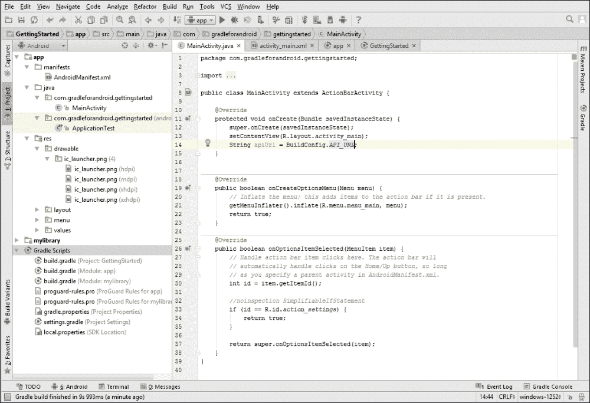
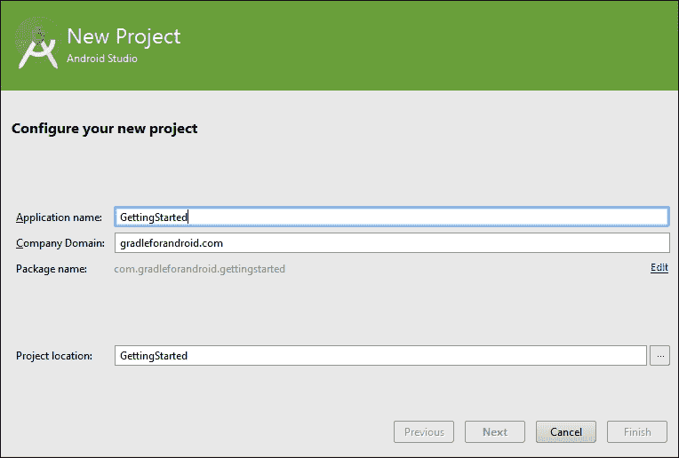
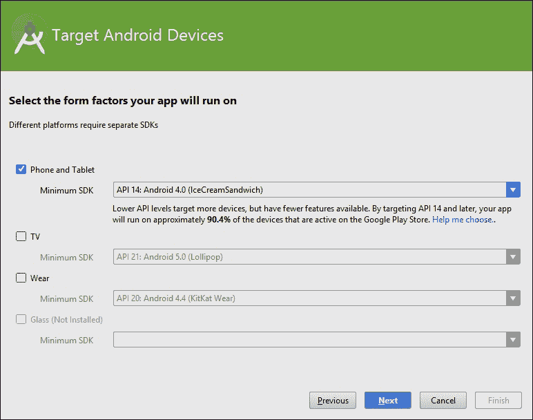
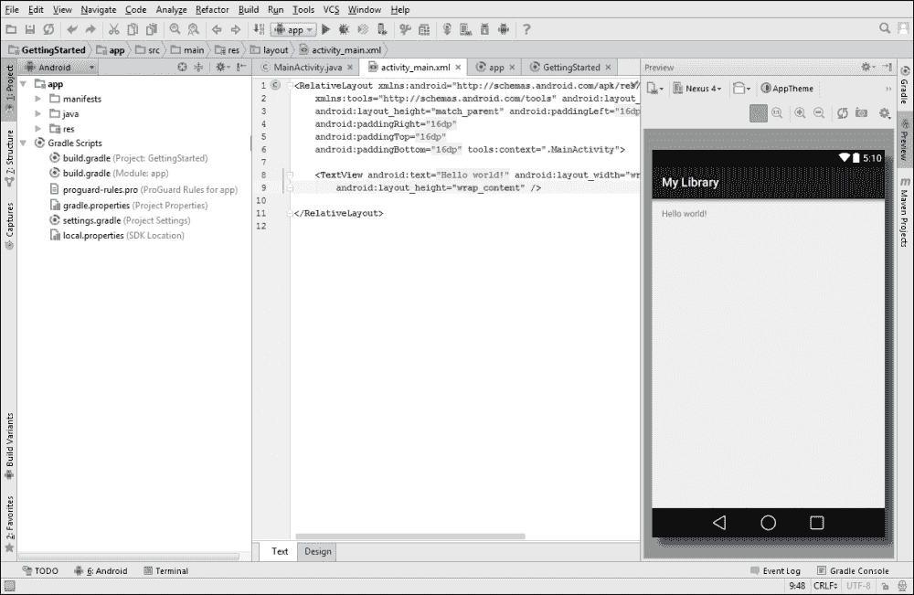
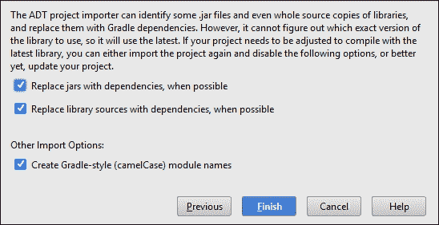

# 第一章. 使用 Gradle 和 Android Studio 入门

当 Google 引入 Gradle 和 Android Studio 时，他们心中有一些目标。他们希望使代码重用、创建构建变体以及配置和自定义构建过程变得更加容易。在此基础上，他们还希望有良好的 IDE 集成，但又不希望构建系统依赖于 IDE。从命令行或持续集成服务器运行 Gradle 将始终产生与从 Android Studio 运行构建相同的结果。

在本书中，我们将不时提及 Android Studio，因为它经常提供一种更简单的方式来设置项目、处理更改等。如果你还没有安装 Android Studio，你可以从 Android 开发者网站下载它（[`developer.android.com/sdk/index.html`](http://developer.android.com/sdk/index.html)）。

在本章中，我们将涵盖以下主题：

+   了解 Android Studio

+   理解 Gradle 基础知识

+   创建新项目

+   使用 Gradle 包装器入门

+   从 Eclipse 迁移

# Android Studio

Android Studio 于 2013 年 5 月由 Google 宣布并发布（作为一个早期访问预览），同时支持 Gradle。Android Studio 基于 JetBrains 的 IntelliJ IDEA，但专门为 Android 开发设计。它对 Linux、Mac OS X 和 Microsoft Windows 免费提供。

与 Eclipse 相比，Android Studio 拥有改进的用户界面设计师、更好的内存监控器、用于字符串翻译的出色编辑器、针对可能的 Android 特定问题的警告以及许多针对 Android 开发者的功能。它还特别为 Android 项目提供了一个项目结构视图，除了 IntelliJ IDEA 中存在的常规项目视图和包视图之外。这个特殊视图以方便的方式将 Gradle 脚本、可绘制资源和其它资源分组。一旦 Android Studio 的稳定版 1.0 发布，Google 就废弃了 Eclipse 的**Android 开发者工具**（**ADT**），并建议所有开发者切换到 Android Studio。这意味着 Google 将不再为 Eclipse 提供新功能，所有与 IDE 相关的工具开发现在都集中在 Android Studio 上。如果你仍在使用 Eclipse，现在是时候更换了，否则你可能会落后。

这张截图显示了 Android Studio 对于一个简单的 Android 应用程序项目的样子：



## 保持更新

Android Studio 有四个不同的更新通道：

+   Canary 版本带来最新的更新，但可能包含一些错误

+   Dev 通道大约每个月更新一次

+   Beta 版本使用功能完整的更新，但这些更新可能仍然包含错误

+   稳定通道（默认通道）提供经过彻底测试的发布版本，应该没有错误

默认情况下，Android Studio 每次启动时都会检查是否有可用的更新，并通知你。

当你第一次启动 Android Studio 时，它会启动一个向导来设置你的环境，并确保你有最新的 Android SDK 和必要的 Google 仓库。它还提供了创建 **安卓虚拟设备（AVD**）的选项，这样你就可以在模拟器上运行应用。

# 理解 Gradle 基础

为了使用 Gradle 构建安卓项目，你需要设置一个构建脚本。按照惯例，这个脚本总是被命名为 `build.gradle`。当你学习基础知识时，你会注意到 Gradle 优先考虑惯例而非配置，并且通常为设置和属性提供默认值。这使得与 Ant 或 Maven 等系统相比，配置更少，更容易开始使用，而 Ant 和 Maven 一直是安卓项目的实际构建系统。尽管如此，你不必绝对遵守这些惯例，因为通常在需要时可以覆盖它们。

Gradle 构建脚本不是用传统的 XML 编写的，而是基于 Groovy 的 **领域特定语言（DSL**），Groovy 是一种用于 **Java 虚拟机（JVM**）的动态语言。Gradle 背后的团队认为，使用基于动态语言的声明式、DSL 风格的方法比使用 Ant 的更程序化、自由浮动的风格或许多其他构建系统使用的基于 XML 的方法具有显著优势。

这并不意味着你需要了解 Groovy 才能开始编写构建脚本。它很容易阅读，如果你已经熟悉 Java，学习曲线也不会太陡峭。如果你想开始创建自己的任务和插件（我们将在后面的章节中讨论），对 Groovy 有更深入的了解是有用的。然而，由于它基于 JVM，你可以用 Java 或任何其他 JVM 语言编写自定义插件的代码。

## 项目和任务

在 Gradle 中，最重要的两个概念是项目和任务。每个构建至少包含一个项目，每个项目包含一个或多个任务。每个 `build.gradle` 文件代表一个项目。任务在构建脚本内部简单地定义。在初始化构建过程时，Gradle 根据构建文件组装 `Project` 和 `Task` 对象。一个 `Task` 对象由需要按顺序执行的 `Action` 对象列表组成。`Action` 对象是一段被执行的代码块，类似于 Java 中的方法。

## 构建生命周期

执行 Gradle 构建，在最简单的形式中，只是对任务执行操作，这些任务依赖于其他任务。为了简化构建过程，构建工具创建了一个工作流程的动态模型，作为一个**有向无环图**（**DAG**）。这意味着所有任务都是依次处理的，并且不可能有循环。一旦任务被执行，它将不会被再次调用。没有依赖关系的任务将始终在其他任务之前运行。依赖关系图是在构建配置阶段生成的。Gradle 构建有三个阶段：

+   **初始化**：这是创建 `Project` 实例的地方。如果有多个模块，每个模块都有自己的 `build.gradle` 文件，则会创建多个项目。

+   **配置**：在这个阶段，执行构建脚本，为每个项目对象创建和配置所有任务。

+   **执行**：这是 Gradle 确定哪些任务应该被执行的阶段。应该执行哪些任务取决于启动构建时传递的参数以及当前目录是什么。

## 构建配置文件

为了让 Gradle 构建项目，总需要有一个 `build.gradle` 文件。Android 的构建文件有几个必需的元素：

```java
buildscript {
    repositories {
        jcenter()
    }
    dependencies {
        classpath 'com.android.tools.build:gradle:1.2.3'
    }
}
```

这是在这里配置实际的构建。在仓库块中，JCenter 仓库被配置为构建脚本的依赖项来源。JCenter 是一个预配置的 Maven 仓库，无需额外设置；Gradle 已经为你准备好了。Gradle 提供了几个直接可用的仓库，并且添加自己的仓库（无论是本地还是远程的）都很简单。

构建脚本块还定义了对 Android 构建工具的依赖，作为一个类路径 Maven 艺术品。这就是 Android 插件的来源。Android 插件提供了构建和测试应用程序所需的一切。每个 Android 项目都需要使用以下行应用 Android 插件：

```java
apply plugin: 'com.android.application'
```

插件用于扩展 Gradle 构建脚本的特性。将插件应用于项目使得构建脚本能够定义属性和使用插件中定义的任务。

### 注意

如果你正在构建一个库，你需要应用 `'com.android.library'`。你无法在同一个模块中使用两者，因为这会导致构建错误。一个模块可以是 Android 应用程序或 Android 库，但不能同时是两者。

当使用 Android 插件时，可以配置 Android 特定的约定，并且只会生成适用于 Android 的任务。以下代码片段中的 Android 块是由插件定义的，并且可以按项目进行配置：

```java
android {
    compileSdkVersion 22
    buildToolsVersion "22.0.1"
}
```

这是配置 Android 构建特定部分的区域。Android 插件提供了一个针对 Android 需求定制的 DSL。唯一必需的属性是编译目标和构建工具。编译目标由 `compileSdkVersion` 指定，是用于编译应用应使用的 SDK 版本。使用最新的 Android API 版本作为编译目标是良好的实践。

`build.gradle` 文件中有许多可自定义的属性。我们将在第二章*基本构建自定义*中讨论最重要的属性，并在本书的其余部分探讨更多可能性。

### 项目结构

与旧版本的 Eclipse 项目相比，Android 项目的文件夹结构已经发生了很大变化。如前所述，Gradle 倾向于使用约定而非配置，这同样适用于文件夹结构。

这是 Gradle 预期的一个简单应用的文件夹结构：

```java
MyApp
├── build.gradle
├── settings.gradle
└── app
    ├── build.gradle
    ├── build
    ├── libs
    └── src
        └── main
            ├── java
            │   └── com.package.myapp
            └── res
                ├── drawable
                ├── layout
                └── etc.
```

Gradle 项目通常在根目录有一个额外的层级。这使得在以后添加额外的模块变得更容易。所有应用源代码都放入 `app` 文件夹中。默认情况下，该文件夹也是模块的名称，不需要命名为 app。例如，如果您使用 Android Studio 创建一个包含移动应用和 Android Wear 智能手表应用的项目，默认情况下模块名称为 application 和 wearable。

Gradle 使用一个称为源集的概念。官方 Gradle 文档解释说，源集是*一组源文件，它们一起编译和执行*。对于 Android 项目，`main` 是包含默认版本应用所有源代码和资源的源集。当您开始为 Android 应用编写测试时，您将测试的源代码放入一个名为 `androidTest` 的单独源集中，该源集只包含测试。

下面是 Android 应用最重要的文件夹的简要概述：

| 目录 | 内容 |
| --- | --- |
| `/src/main/java` | 应用的源代码 |
| `/src/main/res` | 这些是与应用相关的资源（可绘制元素、布局、字符串等） |
| `/libs` | 这些是外部库（`.jar` 或 `.aar`） |
| `/build` | 构建过程输出 |

# 创建新项目

您可以通过点击启动屏幕上的**开始新的 Android Studio 项目**或在 IDE 本身导航到**文件** | **新建项目…**来在 Android Studio 中启动一个新项目。

在 Android Studio 中创建新项目从向导开始，该向导帮助设置一切。第一个屏幕是设置应用程序名称和公司域名。应用程序名称是安装时用作应用名称的名称，默认情况下用作工具栏标题。公司域名与应用程序名称结合使用，以确定包名，这是任何 Android 应用的唯一标识符。如果您希望包名不同，您仍然可以通过点击 **编辑** 来更改它。您还可以更改项目在您的硬盘上的位置。



在完成向导的所有步骤之前，不会生成任何文件，因为接下来的几个步骤将定义需要创建哪些文件。

Android 不仅在手机和平板电脑上运行，还支持广泛的设备形态，例如电视、手表和眼镜。下一个屏幕帮助您设置项目中想要针对的所有设备形态。根据您的选择，将包括用于开发的依赖项和构建插件。这就是您决定是否只想制作手机和平板电脑应用，或者是否还想包括 Android TV 模块、Android Wear 模块或 Google Glass 模块的地方。您仍然可以在以后添加这些模块，但向导通过添加所有必要的文件和配置使这个过程变得简单。这也是您选择想要支持的 Android 版本的地方。如果您选择低于 21 的 API 版本，Android Support Library（包括 `appcompat` 库）将自动添加为依赖项。



### 小贴士

**下载示例代码**

您可以从 [`www.packtpub.com`](http://www.packtpub.com) 下载您购买的所有 Packt 出版物的示例代码文件。如果您在其他地方购买了这本书，您可以访问 [`www.packtpub.com/support`](http://www.packtpub.com/support) 并注册，以便将文件直接通过电子邮件发送给您。

以下屏幕建议添加一个活动并提供许多选项，所有这些选项都会生成代码，使开始工作变得更容易。如果您选择让 Android Studio 为您生成活动，下一步是输入活动类的名称、布局文件和菜单资源，并为活动提供一个标题：



在您完成整个向导后，Android Studio 会根据您在向导期间所做的选择生成活动（activity）和片段（fragment）的源代码。Android Studio 还会生成基本的 Gradle 文件以使项目可构建。您将在项目的顶层找到一个名为 `settings.gradle` 的文件和一个名为 `build.gradle` 的文件。在应用模块文件夹内，还有一个 `build.gradle` 文件。我们将在 第二章 *基本构建自定义* 中更详细地介绍这些文件的内容和目的。

您现在有几种选项可以在 Android Studio 内触发构建：

+   在 **构建** 菜单中，您可以点击 **构建项目**，或者可以使用键盘快捷键，在 PC 上是 *Ctrl* + *F9*，在 Mac OS X 上是 *Cmd* + *F9*。

+   工具栏有一个与相同的 **构建项目** 的快捷键

+   列出所有可用 Gradle 任务的 Gradle 工具窗口

在 Gradle 工具窗口中，您可以尝试执行 `assembleDebug` 来构建，或者执行 `installDebug` 来在设备或模拟器上安装应用。我们将在本章的下一部分讨论这些任务，该部分涉及 Gradle Wrapper。

# 开始使用 Gradle Wrapper

Gradle 是一个持续发展的工具，新版本可能会破坏向后兼容性。使用 Gradle Wrapper 是避免问题和确保构建可重复的好方法。

Gradle Wrapper 在 Microsoft Windows 上提供了一个批处理文件，在其他操作系统上提供了一个 shell 脚本。当您运行脚本时，所需的 Gradle 版本将被下载（如果尚未存在）并自动用于构建。背后的想法是，每个需要构建应用的开发人员或自动化系统都可以运行 Wrapper，然后它会处理其余部分。这样，就不需要在开发机器或构建服务器上手动安装正确的 Gradle 版本。因此，也建议将 Wrapper 文件添加到您的版本控制系统中。

运行 Gradle Wrapper 与直接运行 Gradle 并无太大区别。您只需在 Linux 和 Mac OS X 上执行 `gradlew`，在 Microsoft Windows 上执行 `gradlew.bat` 而不是常规的 `gradle` 命令。

## 获取 Gradle Wrapper

为了方便起见，每个新的 Android 项目都包含 Gradle Wrapper，因此当您创建一个新项目时，您根本不需要做任何事情就可以获取必要的文件。当然，您可以在计算机上手动安装 Gradle 并将其用于您的项目，但 Gradle Wrapper 可以做同样的事情，并确保使用正确的 Gradle 版本。在没有 Android Studio 的情况下使用 Gradle 时，没有不使用 Wrapper 的好理由。

您可以通过导航到项目文件夹并在终端中运行`./gradlew –v`或从命令提示符中运行`gradlew.bat –v`来检查 Gradle 包装器是否存在于您的项目中。运行此命令将显示 Gradle 的版本以及有关您设置的额外信息。如果您正在转换 Eclipse 项目，默认情况下包装器将不存在。在这种情况下，您可以使用 Gradle 生成它，但您需要首先安装 Gradle 以获取包装器。

### 注意

Gradle 下载页面([`gradle.org/downloads`](http://gradle.org/downloads))提供了二进制文件和源代码的链接，如果您在 Mac OS X 上，可以使用包管理器，如 Homebrew。所有安装说明都在安装页面([`gradle.org/installation`](http://gradle.org/installation))上。

在您下载并安装 Gradle 并将其添加到您的`PATH`后，创建一个包含以下三行的`build.gradle`文件：

```java
task wrapper(type: Wrapper) {
    gradleVersion = '2.4'
}
```

之后，运行`gradle wrapper`以生成包装文件。

在 Gradle 的较新版本中，您也可以不修改`build.gradle`文件就运行包装任务，因为它默认包含为任务。在这种情况下，您可以使用`--gradle-version`参数指定版本，如下所示：

```java
$ gradle wrapper --gradle-version 2.4

```

如果您没有指定版本号，包装器配置为使用执行任务时使用的 Gradle 版本。

这些都是由包装任务生成的文件：

```java
myapp/
├── gradlew
├── gradlew.bat
└── gradle/wrapper/
    ├── gradle-wrapper.jar
    └── gradle-wrapper.properties
```

您可以看到，Gradle 包装器有三个部分：

+   在 Microsoft Windows 上的批处理文件和在 Linux 以及 Mac OS X 上的 shell 脚本

+   一个由批处理文件和 shell 脚本使用的 JAR 文件

+   一个`properties`文件

`gradle-wrapper.properties`文件是包含配置并确定使用 Gradle 哪个版本的文件：

```java
#Sat May 30 17:41:49 CEST 2015
distributionBase=GRADLE_USER_HOME
distributionPath=wrapper/dists
zipStoreBase=GRADLE_USER_HOME
zipStorePath=wrapper/dists
distributionUrl=https\://services.gradle.org/distributions/gradle-2.4-all.zip
```

如果您想使用定制的 Gradle 分发，您可以更改分发 URL。这也意味着您使用的任何应用程序或库都可能具有不同的 Gradle URL，所以在运行包装器之前，请确保您信任这些属性。

Android Studio 非常体贴，当项目中使用的 Gradle 版本不是最新版本时，它会显示一个通知，并会自动建议为您更新它。基本上，Android Studio 会更改`gradle-wrapper.properties`文件中的配置并触发构建，以便下载最新版本。

### 注意

Android Studio 使用属性中的信息来确定使用哪个版本的 Gradle，并从您项目中的 Gradle Wrapper 目录运行包装器。然而，它并不使用 shell 或 bash 脚本，因此您不应自定义这些脚本。

## 运行基本构建任务

在终端或命令提示符中，导航到项目目录并使用`tasks`命令运行 Gradle 包装器：

```java
$ gradlew tasks

```

这将打印出所有可用任务的列表。如果您添加`--all`参数，您将获得每个任务的依赖关系的更详细概览。

### 注意

在 Microsoft Windows 上，你需要运行 `gradlew.bat`，在 Linux 和 Mac OS X 上，完整的命令是 `./gradlew`。为了简洁起见，我们将在整本书中只写 `gradlew`。

在开发过程中构建项目时，使用调试配置运行 assemble 任务：

```java
$ gradlew assembleDebug

```

此任务将创建一个包含应用调试版本的 APK。默认情况下，Gradle 的 Android 插件将 APK 保存到目录 `MyApp/app/build/outputs/apk`。

### 小贴士

**缩写任务名称**

为了避免在终端中输入太多，Gradle 还提供了缩写的驼峰式任务名称作为快捷方式。例如，你可以通过运行 `gradlew assDeb` 来执行 `assembleDebug`，或者甚至从命令行界面运行 `gradlew aD`。

虽然如此，这里有一个需要注意的地方。只有当驼峰式缩写是唯一的时候，这个方法才会工作。一旦有其他任务使用了相同的缩写，这个技巧就不再适用于这些任务了。

除了 `assemble` 之外，还有三个其他基本任务：

+   `check` 执行所有检查，这通常意味着在连接的设备或模拟器上运行测试

+   `build` 触发 `assemble` 和 `check`

+   `clean` 清除项目的输出

我们将在第二章*基本构建自定义*中详细讨论这些任务。

# 从 Eclipse 迁移

从 Eclipse 项目迁移到基于 Gradle 的项目有两种方式：

+   在 Android Studio 中使用导入向导来自动处理迁移

+   将 Gradle 脚本添加到 Eclipse 项目中，并手动设置一切

大多数项目足够简单，导入向导能够自动转换所有内容。如果向导无法确定某些内容，它甚至可能会给你一些提示，告诉你需要更改什么才能使其工作。

然而，有些项目可能非常复杂，需要手动转换。如果你有一个很大的项目，并且你更喜欢分步转换项目而不是一次性转换，你可以执行 Ant 任务，甚至从 Gradle 执行整个 Ant 构建。这样做，你可以按照你喜欢的节奏进行过渡，并缓慢地转换所有组件。

## 使用导入向导

要启动导入向导，你需要打开 Android Studio，点击 **文件** 菜单然后点击 **导入项目...**，或者在 Android Studio 启动屏幕上点击 **导入非 Android Studio 项目**。

如果你将包含 JAR 文件或库源的项目进行转换，导入向导会建议用 Gradle 依赖项替换它们。这些依赖项可以来自本地 Google 仓库（例如 Android 支持库）或甚至来自已知的在线仓库中心。如果没有找到匹配的 Google 或在线依赖项，将使用 JAR 文件，就像之前一样。导入向导至少会为你的应用创建一个模块。如果你在项目中还有包含源代码的库，这些库也会被转换为模块。

这就是导入向导的外观：



Studio 创建了一个新文件夹，以确保在转换过程中您不会丢失任何内容，您可以轻松地比较导入向导的结果与原始内容。转换完成后，Android Studio 将打开项目并显示导入摘要。

摘要列出了导入向导决定忽略的任何文件，并且没有复制到新项目中。如果您仍然想包含这些文件，您必须手动将它们复制到新项目中。在忽略的文件下方，摘要显示了导入向导能够用 Gradle 依赖项替换的任何 JAR 文件。Android Studio 尝试在 JCenter 上找到这些依赖项。如果您正在使用 Support Library，它现在包含在通过 SDK 管理器下载到您机器上的 Google 仓库中，而不是 JAR 文件。最后，摘要列出了导入向导移动的所有文件，显示了它们的来源和目的地。

导入向导还会添加三个 Gradle 文件：根目录下的 `settings.gradle` 和 `build.gradle`，以及模块中的另一个 `build.gradle`。

如果您有任何包含源代码的库，导入向导也会将其转换为 Gradle 项目，并根据需要将所有内容链接在一起。

项目现在应该可以无问题地构建，但请注意，您可能需要互联网连接来下载一些必要的依赖项。

对于更复杂的项目可能需要额外的工作，因此接下来我们将探讨如何手动进行转换。

### 小贴士

**Eclipse 导出向导**

Eclipse 也有一个导出向导，但由于 Google 的 Android Tools 团队停止了 Eclipse Android 开发工具的开发，因此它已经完全过时。因此，建议始终在 Android Studio 中使用导入向导。

## 手动迁移

有多种方法可以手动将项目迁移到基于 Gradle 的 Android 项目。不需要更改到新的目录结构，甚至可以从 Gradle 脚本中运行 Ant 脚本。这使得迁移过程非常灵活，并且可以使大型项目的过渡更加容易。我们将在第九章 高级构建自定义中查看运行 Ant 任务。

### 保持旧项目结构

如果您不想移动文件，可以在项目中保留 Eclipse 文件夹结构。为此，您需要更改源集配置。我们在讨论项目结构时提到了源集。Gradle 和 Android 插件有它们的默认设置，但通常情况下，您也可以覆盖这些设置。

您需要做的第一件事是在项目目录中创建一个 `build.gradle` 文件。此文件应应用 Android 插件并定义 Gradle 和 Android 插件所需的所有属性。在其最简单的形式中，它看起来像这样：

```java
buildscript {
    repositories {
        jcenter()
    }
    dependencies {
        classpath 'com.android.tools.build:gradle:1.2.3'
    }
}

apply plugin: 'com.android.application'

android {
    compileSdkVersion 22
    buildToolsVersion "22.0.1"
}
```

然后，你可以从更改源集开始。通常，覆盖主源集以符合 Eclipse 结构看起来像这样：

```java
android {
  sourceSets {
    main {
      manifest.srcFile 'AndroidManifest.xml'
      java.srcDirs = ['src']
      resources.srcDirs = ['src']
      aidl.srcDirs = ['src']
      renderscript.srcDirs = ['src']
      res.srcDirs = ['res']
      assets.srcDirs = ['assets']
    }

  androidTest.setRoot('tests')
  }
}
```

在 Eclipse 文件夹结构中，所有源文件都将位于同一个文件夹中，因此你需要告诉 Gradle 所有这些组件都可以在 `src` 文件夹中找到。你只需要包含你项目中的组件，但添加所有组件并不会造成伤害。

如果你依赖于 JAR 文件，你需要告诉 Gradle 依赖项的位置。假设 JAR 文件位于名为 `libs` 的文件夹中，配置看起来像这样：

```java
dependencies {
    compile fileTree(dir: 'libs', include: ['*.jar'])
}
```

这行代码将 `libs` 目录中所有扩展名为 `.jar` 的文件作为依赖项包含在内。

### 转换到新的项目结构

如果你决定手动转换为新的项目结构，你需要创建一些文件夹并移动一些文件。此表概述了最重要的文件和文件夹，以及你需要将它们移动到何处以转换为新的项目结构：

| 旧位置 | 新位置 |
| --- | --- |
| `src/` | `app/src/main/java/` |
| `res/` | `app/src/main/res/` |
| `assets/` | `app/src/main/assets/` |
| `AndroidManifest.xml` | `app/src/main/AndroidManifest.xml` |

如果你有任何单元测试，你需要将这些测试的源代码移动到 `app/src/test/java/` 以便 Gradle 自动识别。功能测试应位于 `app/src/androidTest/java/` 文件夹中。

下一步是在项目的根目录中创建一个 `settings.gradle` 文件。此文件只需包含一行，其目的是告诉 Gradle 包含 `app` 模块：

```java
include: ':app'
```

当这一切准备就绪后，你需要两个 `build.gradle` 文件才能成功进行 Gradle 构建。第一个文件位于项目的根目录（与 `settings.gradle` 处于同一级别）并用于定义项目级别的设置：

```java
buildscript {
    repositories {
        jcenter()
    }
    dependencies {
        classpath 'com.android.tools.build:gradle:1.2.3'
    }
}
```

这为项目中的所有模块设置了一些属性。第二个 `build.gradle` 文件位于 `app` 文件夹中，包含模块特定的设置：

```java
apply plugin: 'com.android.application'

android {
    compileSdkVersion 22
    buildToolsVersion "22.0.1"
}
```

这些是绝对的基础。如果你有一个不依赖于第三方代码的简单 Android 应用程序，这将足够。如果你有任何依赖项，你也需要将这些依赖项迁移到 Gradle。

### 迁移库

如果你项目中的任何库包含 Android 特定的代码，这些库也需要使用 Gradle，以便它们能与应用程序模块良好地协同工作。基本原理相同，但你需要使用 Android 库插件而不是 Android 应用程序插件。此过程的详细信息在 第五章 *管理多模块构建* 中讨论。

# 摘要

我们从本章开始，探讨了 Gradle 的优势以及为什么它比目前使用的其他构建系统更有用。我们简要地介绍了 Android Studio 以及它是如何通过生成构建文件来帮助我们。

在介绍之后，我们查看了一下 Gradle Wrapper，它使得维护和共享项目变得容易得多。我们在 Android Studio 中创建了一个新项目，现在您已经知道如何将 Eclipse 项目迁移到 Android Studio 和 Gradle，无论是自动还是手动。您还能够在 Android Studio 中使用 Gradle 构建项目，或者直接从命令行界面进行构建。

在接下来的几章中，我们将探讨如何自定义构建过程，以便您可以进一步自动化构建流程，并使维护变得更加简单。我们首先将检查所有标准 Gradle 文件，探索基本的构建任务，并在下一章中定制构建的部分。
