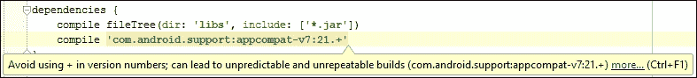
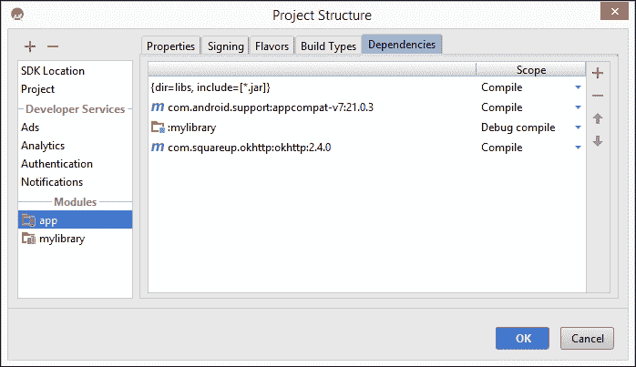
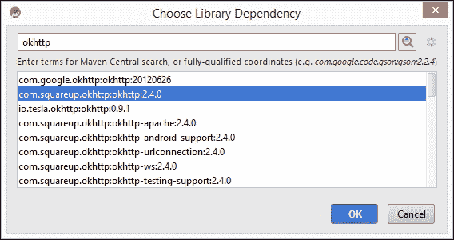

# 第三章 管理依赖项

依赖管理是 Gradle 真正发光的领域之一。在最佳情况下，您只需在构建文件中添加一行，Gradle 就会从远程仓库下载依赖项，并确保其类对您的项目可用。Gradle 甚至更进一步。如果您的项目依赖项有自己的依赖项，Gradle 将解决这些依赖项，并处理一切。这些依赖项的依赖项被称为**传递依赖项**。

本章介绍了依赖管理的概念，并解释了将依赖项添加到 Android 项目的多种方式。以下是我们将要讨论的主要主题：

+   仓库

+   本地依赖项

+   依赖概念

# 仓库

当我们讨论依赖项时，通常指的是外部依赖项，例如由其他开发者提供的库。手动管理依赖项可能是一项繁琐的工作。您需要找到库，下载 JAR 文件，将其复制到您的项目中，并引用它。通常这些 JAR 文件在其名称中没有版本号，因此您需要记住自己添加它，以便知道何时更新。您还需要确保库存储在源控制系统中，这样团队成员就可以在没有手动下载依赖项的情况下与代码库一起工作。

使用仓库可以解决这些问题。仓库可以看作是一组文件的集合。Gradle 默认不会为您的项目定义任何仓库，因此您需要将它们添加到`repositories`块中。如果您使用 Android Studio，这会为您完成。我们在前面的章节中简要提到了`repositories`块；它看起来像这样：

```java
repositories {
    jcenter()
}
```

Gradle 支持三种不同类型的仓库：Maven、Ivy 和静态文件或目录。依赖项在构建执行阶段从仓库中检索。Gradle 还保留了一个本地缓存，因此特定版本的依赖项只需下载到您的机器一次。

依赖项由三个元素标识：组、名称和版本。组指定了创建库的组织，通常是一个反向域名。名称是库的唯一标识符。版本指定了您想要使用的库版本。使用这三个元素，可以在`dependencies`块中使用以下结构声明依赖项：

```java
dependencies {
    compile 'com.google.code.gson:gson:2.3'
    compile 'com.squareup.retrofit:retrofit:1.9.0'
}
```

这是一种简写形式，完整的 Groovy 映射表示法看起来像这样：

```java
dependencies {
    compile group: 'com.google.code.gson', name: 'gson', version: '2.3'
    compile group: 'com.squareup.retrofit', name: 'retrofit' version: '1.9.0'
}
```

### 注意

依赖项的唯一必需字段是名称。组和版本是可选元素。尽管如此，建议添加组以提高清晰度，并添加版本以确保库不会自动更新，这可能会导致构建失败。

## 预配置的仓库

为了方便起见，Gradle 已经预配置了三个 Maven 仓库：JCenter、Maven Central 和本地 Maven 仓库。要将它们包含到你的构建脚本中，你需要包含以下这些行：

```java
repositories {
    mavenCentral()
    jcenter()
    mavenLocal()
}
```

Maven Central 和 JCenter 是两个知名的在线仓库。没有理由同时使用它们，并且始终建议使用 JCenter，这也是使用 Android Studio 创建的 Android 项目的默认仓库。JCenter 是 Maven Central 的超集，所以当你切换时，你可以保留已经定义的依赖项不变。此外，它支持 HTTPS，而 Maven Central 不支持。

本地 Maven 仓库是你使用过的所有依赖项的本地缓存，你也可以添加自己的依赖项。默认情况下，仓库可以在主目录下的一个名为`.m2`的文件夹中找到。在 Linux 或 Mac OS X 上，路径是`~/.m2`。在 Microsoft Windows 上，它是`%UserProfile%\.m2`。

除了这些预配置的仓库外，你还可以添加其他公共的，甚至是私有的仓库。

## 远程仓库

一些组织创建了有趣的插件或库，并倾向于将它们托管在自己的 Maven 或 Ivy 服务器上，而不是发布到 Maven Central 或 JCenter。要将这些仓库添加到你的构建中，你只需要将 URL 添加到一个`maven`块中。

```java
repositories {
    maven {
        url "http://repo.acmecorp.com/maven2"
    }
}
```

对于 Ivy 仓库也是如此。Apache Ivy 是 Ant 世界中流行的依赖管理器。Gradle 支持这些仓库的格式与 Maven 仓库使用的格式相同。将仓库 URL 添加到`ivy`块中，你就可以开始了：

```java
repositories {
    ivy {
        url "http://repo.acmecorp.com/repo"
    }
}
```

如果你的组织运行自己的仓库，那么它很可能是受保护的，并且你需要凭证来访问它。这是为仓库添加凭证的方法：

```java
repositories {
    maven {
        url "http://repo.acmecorp.com/maven2"
        credentials {
            username 'user'
            password 'secretpassword'
        }
    }
}
```

Maven 和 Ivy 的方法在这里也是一样的。你可以在 Ivy 仓库的配置中添加一个格式相同的`credentials`块。

### 小贴士

**存储凭证**

将凭证存储在构建配置文件中不是一个好主意。构建配置文件是纯文本，并且会被提交到源代码控制系统中。一个更好的主意是使用一个单独的 Gradle 属性文件，正如我们在第二章中看到的，*基本构建自定义*。

## 本地仓库

你可以在自己的硬盘或网络驱动器上运行 Maven 和 Ivy 仓库。要将这些添加到构建中，你只需要配置到驱动器上位置的相对或绝对路径的 URL：

```java
repositories {
    maven {
        url "../repo"
    }
}
```

新的 Android 项目默认依赖于 Android Support Library。当使用 SDK 管理器安装 Google 仓库时，会在你的硬盘上创建两个 Maven 仓库`ANDROID_SDK/extras/google/m2repository`和`ANDROID_SDK/extras/android/m2repository`。这就是 Gradle 获取 Google 提供的库的地方，例如 Android Support Library 和 Google Play Services。

您还可以使用 `flatDirs` 将常规目录作为存储库添加，这使您能够在 `dependency` 块中添加该目录中的文件。

```java
repositories {
    flatDir {
        dirs 'aars'
    }
}
```

在本章的后面部分，当我们讨论库项目时，我们将查看一个示例，说明如何使用它。

# 本地依赖

在某些情况下，您可能仍然需要手动下载 JAR 文件或本地库。也许您想创建自己的库，您可以在几个项目中重复使用它，而无需将其发布到公共或私有仓库。在这些情况下，无法使用任何在线资源，您将不得不使用不同的方式来添加依赖项。我们将描述如何使用文件依赖项，如何包含本地库，以及如何在您的项目中包含库项目。

## 文件依赖

要将 JAR 文件作为依赖项添加，您可以使用 Gradle 提供的 `files` 方法。它看起来是这样的：

```java
dependencies {
    compile files('libs/domoarigato.jar')
}
```

如果您有很多 JAR 文件，这可能会变得很繁琐，所以一次性添加整个文件夹可能更容易：

```java
dependencies {
    compile fileTree('libs')
}
```

默认情况下，新创建的 Android 项目将有一个名为 libs 的文件夹，并声明它用于依赖项。而不是简单地依赖文件夹中的所有文件，这里有一个过滤器确保只使用 JAR 文件：

```java
dependencies {
    compile fileTree(dir: 'libs', include: ['*.jar'])
}
```

这意味着在 Android Studio 中创建的任何 Android 项目中，您可以将 JAR 文件放入 libs 文件夹，它将自动包含在编译类路径和最终的 APK 中。

## 原生库

用 C 或 C++ 编写的库可以编译成特定平台的本地代码。这些库通常由几个 `.so` 文件组成，每个平台一个。Android 插件默认支持本地库，您需要做的只是在该模块级别创建一个名为 `jniLibs` 的目录，并为每个平台创建子目录。将 `.so` 文件放入相应的目录，然后您就可以使用了。

您的结构应该如下所示：

```java
app
├── AndroidManifest.xml
└── jniLibs
    ├── armeabi
    │   └── nativelib.so
    ├── armeabi-v7a
    │   └── nativelib.so
    ├── mips
    │   └── nativelib.so
    └── x86
        └── nativelib.so
```

如果这个约定不适合您，您可以直接在构建文件中设置位置：

```java
android {
    sourceSets.main {
        jniLibs.srcDir 'src/main/libs'
    }
}
```

## 库项目

如果您想共享一个使用 Android API 或包含 Android 资源的库，您需要创建一个库项目。库项目通常与应用程序项目表现相同。您可以使用相同的任务来构建和测试库项目，并且它们可以有不同的构建变体。区别在于输出。应用程序项目生成一个可以在 Android 设备上安装和运行的 APK，而库项目生成一个 `.aar` 文件。这个文件可以用作 Android 应用程序项目的库。

### 创建和使用库项目模块

与应用 Android 应用程序插件不同，构建脚本应用 Android 库插件：

```java
apply plugin: 'com.android.library'
```

在您的应用程序中包含库项目有两种方式。一种是将它作为项目内部的一个模块；另一种是创建一个 `.aar` 文件，该文件可以在多个应用程序中重复使用。

如果你将库项目作为你的项目中的一个模块设置，你需要将模块添加到 `settings.gradle` 中，并将其作为依赖项添加到应用程序模块中。设置文件应该看起来像这样：

```java
include ':app', ':library'
```

在这种情况下，库模块被命名为 `library`，这对应于一个具有相同名称的文件夹。要在 Android 模块中使用库，需要在 Android 模块的 `build.gradle` 文件中添加一个依赖项：

```java
dependencies {
    compile project(':library')
}
```

这将把库的输出包含在应用程序模块的类路径中。我们将在第五章 管理多模块构建 中更详细地探讨这种方法。

### 使用 `.aar` 文件

如果你创建了一个你希望在多个 Android 应用程序中重用的库，你可以构建一个 `.aar` 文件，并将其作为依赖项添加到你的项目中。当构建库时，`.aar` 文件将生成在模块目录的 `build/output/aar/` 文件夹中。要将 `.aar` 文件作为依赖项添加，你需要在应用程序模块中创建一个文件夹，将 `.aar` 文件复制到其中，并将该文件夹作为仓库添加：

```java
repositories {
    flatDir {
        dirs 'aars'
    }
}
```

这将使得可以添加该文件夹内的任何文件作为依赖项。你可以按照以下方式引用依赖项：

```java
dependencies {
    compile(name:'libraryname', ext:'aar')
}
```

这告诉 Gradle 查找具有特定名称且具有 `.aar` 扩展名的库。

# 依赖项概念

即使你可能今天不需要使用它们，也有一些与依赖项相关的概念值得理解。其中之一是配置的概念，它解释了我们在这章中一直使用的用于依赖项的 `compile` 关键字。

## 配置

有时你可能需要与仅在某些设备上存在的 SDK 一起工作，例如，一个特定供应商的蓝牙 SDK。为了能够编译代码，你需要将 SDK 添加到你的编译类路径中。不过，你不需要将 SDK 包含在 APK 中，因为它已经存在于设备上了。这就是依赖配置发挥作用的地方。

Gradle 将依赖项分组到配置中，这些配置只是命名文件集。这些是 Android 应用程序或库的标准配置：

+   `compile`

+   `apk`

+   `provided`

+   `testCompile`

+   `androidTestCompile`

`compile` 配置是默认配置，包含编译主应用程序所需的所有依赖项。此配置中的所有内容不仅被添加到类路径中，还被添加到生成的 APK 中。

`apk` 配置中的依赖项只会添加到包中，而不会添加到编译类路径中。`provided` 配置则相反，其依赖项不会被打包。这两个配置仅接受 JAR 依赖项。尝试将库项目添加到它们中会导致错误。

最后，`testCompile` 和 `androidTestCompile` 配置添加了专门用于测试的额外库。这些配置在运行与测试相关的任务时使用，当添加测试框架如 JUnit 或 Espresso 时非常有用。你只希望这些框架存在于测试 APK 中，而不是发布 APK 中。

除了这些标准配置之外，Android 插件还为每个构建变体生成配置，使得可以将依赖项添加到 `debugCompile`、`releaseProvided` 等配置中。如果你只想将日志框架添加到调试构建中，这非常有用。你可以在第四章 *创建构建变体* 中找到更多相关信息。

## 语义版本控制

版本控制是依赖项管理的重要方面。添加到 JCenter 等仓库的依赖项假定遵循一组版本控制规则，称为语义版本控制。在语义版本控制中，版本号始终具有 `major.minor.patch` 的格式，并且数字根据以下规则递增：

+   当你进行不兼容的 API 变更时，主版本号会上升

+   当你以向后兼容的方式添加功能时，次要版本会更新

+   当你进行错误修复时，补丁版本会增加

## 动态版本

在某些情况下，你可能希望在构建你的应用程序或库时每次都获取依赖项的最新版本。实现这一目标的最佳方式是使用动态版本。应用动态版本有几种方法，以下是一些示例：

```java
dependencies {
    compile 'com.android.support:support-v4:22.2.+'
    compile 'com.android.support:appcompat-v7:22.2+'
    compile 'com.android.support:recyclerview-v7:+'
}
```

在第一行，我们告诉 Gradle 获取最新的补丁版本。在第二行，我们指定我们想要获取每个新的次要版本，并且它至少要是次要版本 2。在最后一行，我们告诉 Gradle 总是获取库的最新版本。

使用动态版本时应该小心。如果你允许 Gradle 选择最新版本，它可能会选择一个不稳定的依赖项版本，导致构建失败。更糟糕的是，你可能会在构建服务器和个人机器上得到依赖项的不同版本，导致你的应用程序行为不一致。

当你在构建文件中尝试使用动态版本时，Android Studio 会警告你有关动态版本可能存在的问题，如以下截图所示：



# Android Studio 内部

添加新依赖项最简单的方法是使用 Android Studio 的 **项目结构** 对话框。从 **文件** 菜单打开对话框，并导航到 **依赖项** 选项卡以查看当前依赖项的概述：



从此对话框，你可以通过点击绿色加号图标添加新的依赖项。你可以添加其他模块、文件，甚至可以在 JCenter 中搜索库：



使用 Android Studio 对话框可以轻松地查看项目中依赖项的概览，并添加新的库。你不需要手动向 `build.gradle` 文件中添加行，并且可以直接从 IDE 中搜索 JCenter。

# 摘要

在本章中，我们探讨了向 Android 项目添加依赖项的几种方法。我们学习了仓库、它们可能出现的所有形式，以及我们如何在不需要使用仓库的情况下依赖文件。

现在，你也已经了解了一些关于依赖项的重要概念，即配置、语义版本和动态版本。

我们已经多次提到构建变体，在下一章中，我们将最终解释什么是构建变体，以及它们为什么有用。构建变体可以使开发、测试和分发应用变得更加容易。了解变体的工作原理可以显著加快你的开发和分发过程。
