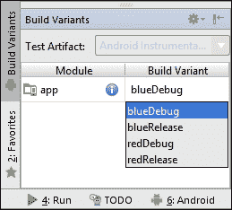
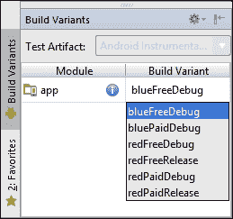

# 第四章 创建构建变体

当你在开发一个应用时，你通常有几个不同的版本。最常见的情况是，你有一个用于手动测试应用并确保其质量的预发布版本，以及一个生产版本。这些版本通常有不同的设置。例如，预发布 API 的 URL 可能不同于生产 API。此外，你可能有一个免费的基本版本的应用，以及一个具有一些额外功能的付费版本。在这种情况下，你已经在处理四个不同的版本：预发布免费、预发布付费、生产免费和生产付费。为每个版本设置不同的配置可能会变得非常复杂。

Gradle 有一些方便且可扩展的概念来解决这个常见问题。我们之前已经提到了 Android Studio 为每个新项目创建的`debug`和`release`构建类型。还有一个叫做产品风味的概念，它为管理应用或库的多个版本提供了更多的可能性。构建类型和产品风味总是结合使用，使得处理预发布和发布应用免费和付费版本的情况变得容易。将构建类型和产品风味结合的结果称为构建变体。

我们将从这个章节开始，先看看构建类型，它们如何让开发者的生活变得更轻松，以及如何充分利用它们。然后，我们将讨论构建类型和产品风味的区别以及它们的使用方法。我们还将探讨签名配置，这是发布应用所必需的，以及我们如何为每个构建变体设置不同的签名配置。

在本章中，我们将涵盖以下主题：

+   构建类型

+   产品风味

+   构建变体

+   签名配置

# 构建类型

在 Gradle 的 Android 插件中，构建类型用于定义应用或库应该如何构建。每个构建类型都可以指定是否包含调试符号，应用程序 ID 必须是什么，是否应该删除未使用的资源，等等。你可以在`buildTypes`块内定义构建类型。这是由 Android Studio 创建的构建文件中的标准`buildTypes`块的样子：

```java
android {
    buildTypes {
        release {
            minifyEnabled false
            proguardFiles getDefaultProguardFile('proguard-android.txt'), 'proguard-rules.pro'
        }
    }
}
```

新模块的默认`build.gradle`文件配置了一个名为`release`的构建类型。这个构建类型除了禁用删除未使用资源（通过将`minifyEnabled`设置为`false`）和定义默认 ProGuard 配置文件的位置之外，没有做更多的事情。这是为了让开发者能够方便地开始使用 ProGuard 进行他们的生产构建，无论何时他们准备好了。

虽然`release`构建类型不是为你的项目预先创建的唯一构建类型。默认情况下，每个模块都有一个`debug`构建类型。它被设置为合理的默认值，但你可以通过将其包含在`buildTypes`块中并覆盖你想要更改的属性来更改其配置。

### 注意

`debug`构建类型有自己的默认设置，以便于调试。当您创建自己的构建类型时，将应用不同的默认设置。例如，`debuggable`属性对于`debug`构建类型设置为`true`，但在您创建的任何其他构建类型中都设置为`false`。

## 创建构建类型

当默认设置不足时，创建自己的自定义构建类型很容易。对于新的构建类型，只需要在`buildTypes`块内创建一个新的对象。以下是一个名为`staging`的自定义构建类型的示例：

```java
android {
    buildTypes {
        staging {
            applicationIdSuffix ".staging"
            versionNameSuffix "-staging"
            buildConfigField "String", "API_URL", "\"http://staging.example.com/api\""
        }
    }
}
```

`staging`构建类型为应用程序 ID 定义了一个新的后缀，使其与调试和发布版本的应用程序 ID 不同。假设您有默认的构建配置，以及`staging`构建类型，构建类型的应用程序 ID 看起来像这样：

+   调试：`com.package`

+   发布：`com.package`

+   阶段配置：`com.package.staging`

这意味着您可以在同一设备上安装预发布版本和发布版本，而不会引起任何冲突。`staging`构建类型还有一个版本名称后缀，这有助于在同一设备上区分应用程序的多个版本。`buildConfigField`属性定义了一个用于 API 的自定义 URL，使用构建配置字段，正如我们在第二章中看到的，*基本构建自定义*。

在创建新的构建类型时，您不必总是从头开始。可以初始化一个构建类型，该类型复制另一个构建类型的属性：

```java
android {
    buildTypes {
        staging.initWith(buildTypes.debug)
        staging {
            applicationIdSuffix ".staging"
            versionNameSuffix "-staging"
            debuggable = false
        }
    }
}
```

`initWith()`方法创建一个新的构建类型，并将所有属性从现有构建类型复制到新创建的构建类型中。您可以通过在新的构建类型对象中简单地定义它们来覆盖属性或定义额外的属性。

## 源集

当您创建一个新的构建类型时，Gradle 也会创建一个新的源集。默认情况下，源集目录假定与构建类型具有相同的名称。尽管如此，当您定义一个新的构建类型时，目录不会自动创建。您必须自己创建源集目录，然后才能为构建类型使用自定义源代码和资源。

这就是标准`debug`和`release`构建类型，加上额外的预发布构建类型的目录结构可能看起来像这样：

```java
app
└── src
    ├── debug
    │   ├── java
    │   │   └── com.package
    │   │       └── Constants.java
    │   ├── res
    │   │   └── layout
    │   │       └── activity_main.xml
    │   └── AndroidManifest.xml
    ├── main
    │   ├── java
    │   │   └── com.package
    │   │       └── MainActivity.java
    │   ├── res
    │   │   ├── drawable
    │   │   └── layout
    │   │       └── activity_main.xml
    │   └── AndroidManifest.xml
    ├── staging
    │   ├── java
    │   │   └── com.package
    │   │       └── Constants.java
    │   ├── res
    │   │   └── layout
    │   │       └── activity_main.xml
    │   └── AndroidManifest.xml
    └── release
        ├── java
        │   └── com.package
        │       └── Constants.java
        └── AndroidManifest.xml
```

这些源集打开了一个无限可能的世界。例如，您可以针对特定的构建类型覆盖某些属性，为某些构建类型添加自定义代码，以及为不同的构建类型添加自定义布局或字符串。

### 注意

在向构建类型添加 Java 类时，重要的是要注意这个过程是互斥的。这意味着如果您将`CustomLogic.java`类添加到预发布源集，您将能够将该类添加到调试和发布源集，但不能添加到主源集。类将被定义两次，当您尝试构建时将抛出异常。

当使用不同的源集时，资源将以特殊方式处理。可绘制资源和布局文件将完全覆盖主源集中具有相同名称的资源，但`values`目录中的文件（如`strings.xml`）则不会。Gradle 将合并构建类型资源的内容与主资源。

例如，如果您在主源集中有一个`strings.xml`文件，如下所示：

```java
<resources>
    <string name="app_name">TypesAndFlavors</string>
    <string name="hello_world">Hello world!</string>
</resources>
```

如果您在`staging`构建类型源集中有一个`strings.xml`文件，如下所示：

```java
<resources>
    <string name="app_name">TypesAndFlavors STAGING</string>
</resources>
```

然后，合并后的`strings.xml`文件将看起来像这样：

```java
<resources>
    <string name="app_name">TypesAndFlavors STAGING</string>
    <string name="hello_world">Hello world!</string>
</resources>
```

当您构建非`staging`的构建类型时，最终的`strings.xml`文件将只是主源集中的`strings.xml`文件。

对于清单文件也是如此。如果您为构建类型创建了一个清单文件，您不需要从主源集中复制整个清单文件；您只需添加所需的标签即可。Android 插件将合并清单。

我们将在本章的后面部分更详细地讨论合并。

## 依赖项

每个构建类型都可以有自己的依赖项。Gradle 会自动为每个构建类型创建新的依赖配置。例如，如果您只想为`debug`构建添加日志框架，您可以这样做：

```java
dependencies {
    compile fileTree(dir: 'libs', include: ['*.jar'])
    compile 'com.android.support:appcompat-v7:22.2.0'
    debugCompile 'de.mindpipe.android:android-logging-log4j:1.0.3'
}
```

您可以使用这种方式将任何构建类型与任何依赖配置组合在一起。这使您能够对依赖项进行非常具体的配置。

# 产品风味

与用于配置同一应用或库的多个不同构建的构建类型不同，产品风味用于创建同一应用的不同版本。一个典型的例子是具有免费版和付费版的应用。另一个常见的场景是，一家机构为几个客户构建具有相同功能的应用，其中只有品牌发生变化。这在出租车行业或银行应用中非常常见，其中一家公司创建的应用可以用于同一类别的所有客户。唯一改变的是主要颜色、标志和后端 URL。产品风味极大地简化了基于相同代码的不同版本应用的过程。

如果您不确定是否需要新的构建类型或新的产品风味，您应该问自己是否想要为内部使用创建同一应用的新的构建版本，或者为发布到 Google Play 创建新的 APK。如果您需要完全新的应用，该应用需要独立于您已有的内容发布，那么产品风味就是您应该选择的方式。否则，您应该坚持使用构建类型。

## 创建产品风味

创建产品风味与创建构建类型非常相似。您可以通过将其添加到`productFlavor`块中来创建一个新的产品风味，如下所示：

```java
android {
    productFlavors {
        red {
            applicationId 'com.gradleforandroid.red'
            versionCode 3
        }
        blue {
            applicationId 'com.gradleforandroid.blue'
            minSdkVersion 14
            versionCode 4
        }
    }
}
```

产品香味与构建类型具有不同的属性。这是因为产品香味是 `ProductFlavor` 类的对象，就像所有构建脚本中存在的 `defaultConfig` 对象一样。这意味着 `defaultConfig` 和你的所有产品香味共享相同的属性。

## 源集

就像构建类型一样，产品香味可以有自己的源集目录。为特定香味创建一个文件夹就像创建一个带有香味名称的文件夹一样简单。你甚至可以更进一步，为特定构建类型和香味的组合创建一个文件夹。文件夹的名称将是香味名称后跟构建类型名称。例如，如果你想为蓝色香味的发布版本有特定的应用程序图标，文件夹名称必须是 `blueRelease`。组合文件夹的组件将比构建类型文件夹和产品香味文件夹的组件具有更高的优先级。

## 多香味变体

在某些情况下，你可能希望更进一步，创建产品香味的组合。例如，客户 A 和客户 B 可能各自希望他们的应用程序有免费和付费版本，这些应用程序基于相同的代码库，但有不同的品牌。创建四种不同的香味意味着会有几个重复的设置，所以这不是正确的方法。使用香味维度以高效的方式组合香味是可能的，如下所示：

```java
android {
    flavorDimensions "color", "price"

    productFlavors {
        red {
            flavorDimension "color"
        }

        blue {
            flavorDimension "color"
        }
        free {
            flavorDimension "price"
        }

        paid {
            flavorDimension "price"
        }
    }
}
```

一旦你添加了香味维度，Gradle 就期望你为每个香味指定一个维度。如果你忘记了，你会得到一个带有解释问题的构建错误。`flavorDimensions` 数组定义了维度，维度的顺序非常重要。当组合两个香味时，它们可能已经定义了相同的属性或资源。在这种情况下，香味维度数组的顺序决定了哪个香味配置覆盖了另一个。在早期示例中，颜色维度覆盖了价格维度。顺序还决定了构建变体的名称。在早期示例中，颜色维度覆盖了价格维度。顺序还决定了构建变体的名称。

假设默认的构建配置与调试和发布构建类型，按照前一个示例定义的香味将生成所有这些构建变体：

+   `blueFreeDebug` 和 `blueFreeRelease`

+   `bluePaidDebug` 和 `bluePaidRelease`

+   `redFreeDebug` 和 `redFreeRelease`

+   `redPaidDebug` 和 `redPaidRelease`

# 构建变体

构建变体仅仅是构建类型和产品香味的组合结果。每次你创建一个构建类型或产品香味时，也会创建新的变体。例如，如果你有标准的 `debug` 和 `release` 构建类型，并且创建了一个红色和蓝色产品香味，以下构建变体将被生成：



这是 Android Studio 中**构建变体**工具窗口的截图。你可以在编辑器的左下角找到该工具窗口，或者从**视图** | **工具窗口** | **构建变体**打开它。此工具窗口列出了所有构建变体，同时也允许你在它们之间切换。在此处更改选定的构建变体将影响点击**运行**按钮时运行的变体。

如果你没有产品风味，变体将仅由构建类型组成。不可能没有任何构建类型。即使你自己没有定义任何构建类型，Gradle 的 Android 插件也会为你的应用或库创建一个调试构建类型。

## 任务

Gradle 的 Android 插件将为你配置的每个构建变体创建任务。新的 Android 应用默认有`debug`和`release`构建类型，因此你已经有了`assembleDebug`和`assembleRelease`来分别构建 APK，以及`assemble`来通过单个命令创建它们。当你添加新的构建类型时，也会创建新的任务。一旦你开始添加风味，就会创建一系列全新的任务，因为每个构建类型的任务都会与每个产品风味的任务相结合。这意味着对于只有一个构建类型和一个风味的简单设置，你已经有了三个任务来构建所有变体：

+   `assembleBlue` 使用蓝色风味配置，并组装`BlueRelease`和`BlueDebug`。

+   `assembleDebug` 使用调试构建类型配置，并为每个产品风味组装一个调试版本。

+   `assembleBlueDebug` 将风味配置与构建类型配置相结合，并且风味设置会覆盖构建类型设置。

为每个构建类型、每个产品风味以及每个构建类型和产品风味的组合创建新任务。

## 源集

组合了构建类型和一个或多个产品风味的构建变体也可以有自己的源集目录。例如，由`debug`构建类型、蓝色风味和免费风味创建的变体可以在`src/blueFreeDebug/java/`中拥有自己的源集。可以使用我们在第一章中看到的`sourceSets`块来覆盖目录的位置，即*使用 Gradle 和 Android Studio 入门*。

## 资源和清单合并

源集的引入给构建过程增加了额外的复杂性。Gradle 的 Android 插件需要在打包应用程序之前将主源集和构建类型源集合并在一起。此外，库项目也可以提供额外的资源，这些资源也需要合并。清单文件也是如此。例如，你可能需要在应用程序的调试变体中声明额外的 Android 权限来存储日志文件。你不想在主源集上声明这个权限，因为这可能会吓到潜在的用户。相反，你会在`debug`构建类型源集中添加一个额外的清单文件来声明额外的权限。

资源和清单的优先级顺序如下：


如果一个资源在风味和主源集中声明，那么来自风味的资源将具有更高的优先级。在这种情况下，风味源集中的资源将被打包，而不是主源集中的资源。在库项目中声明的资源始终具有最低优先级。

### 注意

关于资源清单合并，还有很多东西要学习。这是一个极其复杂的话题，如果我们想要解释其细节，我们需要为它专门写一整章。相反，如果你想了解更多，阅读关于该主题的官方文档是一个好主意，请参阅[`tools.android.com/tech-docs/new-build-system/user-guide/manifest-merger`](http://tools.android.com/tech-docs/new-build-system/user-guide/manifest-merger)。

## 创建构建变体

Gradle 使得处理构建变体的复杂性变得简单。即使创建和配置两个构建类型和两个产品风味，构建文件仍然简洁：

```java
android {
    buildTypes {
        debug {
            buildConfigField "String", "API_URL", "\"http://test.example.com/api\""
        }

        staging.initWith(android.buildTypes.debug)
        staging {
            buildConfigField "String", "API_URL", "\"http://staging.example.com/api\""
            applicationIdSuffix ".staging"
        }
    }

    productFlavors {
        red {
            applicationId "com.gradleforandroid.red"
            resValue "color", "flavor_color", "#ff0000"
        }

        blue {
            applicationId "com.gradleforandroid.blue"
            resValue "color", "flavor_color", "#0000ff"
        }
    }
}
```

在这个例子中，我们创建了四个不同的构建变体：`blueDebug`、`blueStaging`、`redDebug`和`redStaging`。每个变体都有自己的 API URL 和风味颜色的组合。这是`blueDebug`在手机上的样子：


这是同一应用程序的`redStaging`变体：


第一张截图显示了`blueDebug`变体，它使用`debug`构建类型中定义的 URL，并根据为蓝色产品风味定义的`flavor_color`将文本设置为蓝色。第二张截图显示了`redStaging`，具有预发布 URL 和红色文本。红色预发布版本还有一个不同的应用程序图标，因为`staging`构建类型的源集中的可绘制文件夹有自己的应用程序图标图像。

## 变体过滤器

在构建过程中，你可以完全忽略某些变体。这样，你可以通过通用的`assemble`命令加快构建所有变体的过程，并且你的任务列表不会被不应该执行的任务所污染。这也确保了构建变体不会出现在 Android Studio 的构建变体切换器中。

您可以使用以下代码在应用的`build.gradle`文件根级别过滤变体：

```java
android.variantFilter { variant ->
    if(variant.buildType.name.equals('release')) {
        variant.getFlavors().each() { flavor ->
            if (flavor.name.equals('blue')) {
                variant.setIgnore(true);
            }
        }
    }
}
```

在此示例中，我们首先检查变体的构建类型是否有名称`release`。然后，我们提取所有产品变体的名称。当使用没有维度的变体时，变体数组中只有一个产品变体。一旦开始应用变体维度，变体数组将包含与维度数量一样多的变体。在示例脚本中，我们检查蓝色产品变体，并告诉构建脚本忽略这个特定的变体。

这是 Android Studio 中构建变体切换器中变体过滤器的结果：



您可以看到，两个蓝色的发布变体（`blueFreeRelease`和`bluePaidRelease`）被过滤出了构建变体列表。如果您现在运行`gradlew tasks`，您会注意到与这些变体相关的所有任务都不再存在。

# 签名配置

在您可以在 Google Play 或任何其他应用商店发布应用之前，您需要使用私钥对其进行签名。如果您有一个付费版和免费版或针对不同客户的不同应用，您需要为每个版本使用不同的密钥进行签名。这就是签名配置派上用场的地方。

签名配置可以定义如下：

```java
android {
    signingConfigs {
        staging.initWith(signingConfigs.debug)

        release {
            storeFile file("release.keystore")
            storePassword"secretpassword"
            keyAlias "gradleforandroid"
            keyPassword "secretpassword"
        }
    }
}
```

在此示例中，我们创建了两个不同的签名配置。

调试配置由 Android 插件自动设置，并使用一个具有已知密码的通用密钥库，因此不需要为这种构建类型创建签名配置。

示例中的预发布配置使用`initWith()`，它从另一个签名配置复制所有属性。这意味着预发布构建使用的是调试密钥，而不是定义自己的密钥。

发布配置使用`storeFile`指定密钥库文件的路径，然后定义密钥别名和两个密码。

### 注意

如前所述，将凭据存储在构建配置文件中不是一个好主意。更好的办法是使用 Gradle 属性文件。在第七章中，专门有一个部分介绍如何处理签名配置密码的任务。

在您定义签名配置后，您需要将它们应用到您的构建类型或变体上。构建类型和变体都有一个名为`signingConfig`的属性，可以像这样使用：

```java
android {
    buildTypes {
        release {
            signingConfig signingConfigs.release
        }
    }
}
```

此示例使用构建类型，但如果您想为每个创建的变体使用不同的证书，您需要创建不同的签名配置。您可以用完全相同的方式定义它们：

```java
android {
    productFlavors {
        blue {
            signingConfig signingConfigs.release
        }
    }
}
```

以这种方式使用签名配置会导致问题。当将配置分配给版本时，您实际上是在覆盖构建类型的签名配置。在使用版本时，您实际上想要为每个版本和构建类型使用不同的密钥：

```java
android {
    buildTypes {
        release {
            productFlavors.red.signingConfig signingConfigs.red
            productFlavors.blue.signingConfig signingConfigs.blue
        }
    }
}
```

示例展示了如何为使用发布构建类型的红色和蓝色版本使用不同的签名配置，而不会影响调试和预发布构建类型。

# 摘要

在本章中，我们讨论了构建类型、产品版本以及它们所有可能的组合。这些是非常强大的工具，可以在任何应用程序中使用。从具有不同 URL 和密钥的简单设置到更复杂的共享相同源代码和资源但具有不同品牌和多个版本的应用程序；构建类型和产品版本可以使您的生活大大简化。

我们还讨论了签名配置及其应用，并提到了在签名产品版本时常见的陷阱。

接下来，您将了解多模块构建。当您想要将代码提取到库或库项目中，或者想要将例如 Android Wear 模块包含到您的应用中时，这些非常有用。
