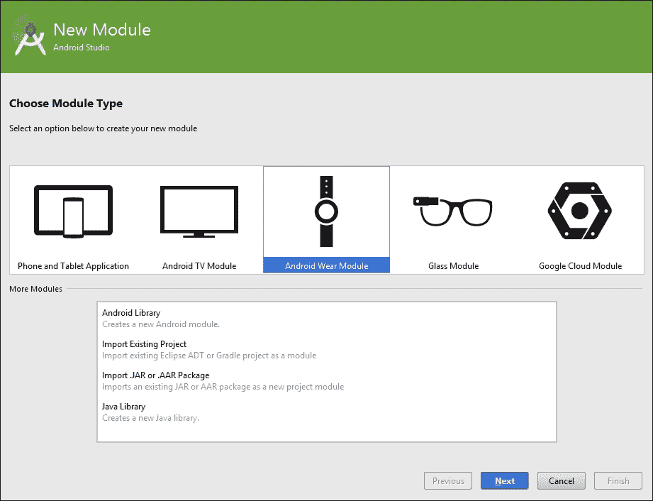
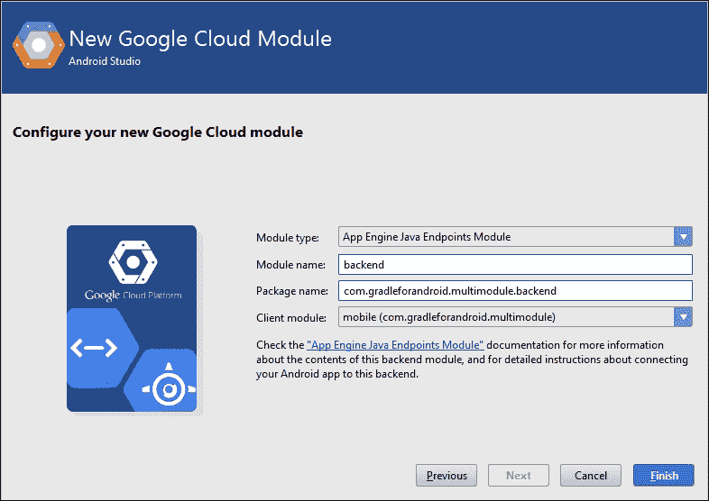
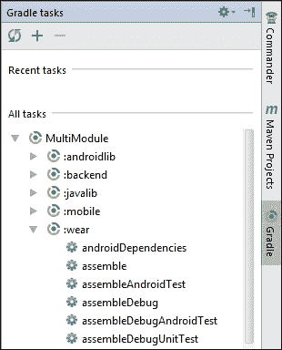

# 第五章。管理多模块构建

Android Studio 允许你创建不仅适用于应用和库，还适用于 Android Wear、Android TV、Google App Engine 等模块。所有这些模块都可以在单个项目中一起使用。例如，你可能想要创建一个使用 Google Cloud Endpoints 作为后端并包含 Android Wear 集成的应用。在这种情况下，你可以有一个包含三个不同模块的项目：一个用于应用，一个用于后端，一个用于 Android Wear 集成。了解多模块项目的结构和构建方式可以显著加快你的开发周期。

### 注意

Gradle 和 Gradle Android 插件的文档都使用了“多项目构建”这个术语。然而，在 Android Studio 中，模块和项目之间有一个区别。一个模块可以是 Android 应用或 Google App Engine 后端，例如。另一方面，项目是一组模块的集合。在这本书中，我们使用模块和项目这两个术语的方式与 IDE 相同，以避免混淆。当你浏览文档时，请记住这一点。

在本章中，我们将介绍多模块构建的理论，然后展示一些在实际项目中可能有用的示例：

+   多模块构建的解剖结构

+   向项目中添加模块

+   小贴士和最佳实践

# 多模块构建的解剖结构

通常，多模块项目通过一个根目录来工作，该目录包含所有模块的子目录。为了告诉 Gradle 项目的结构以及哪些目录包含模块，你需要在项目的根目录中提供一个 `settings.gradle` 文件。然后，每个模块可以提供自己的 `build.gradle` 文件。我们已经在 第二章 中学习了 `settings.gradle` 和 `build.gradle` 文件的工作方式，*基本构建定制*，所以在这里我们将只关注如何为多模块项目使用它们。

这就是多模块项目可能的样子：

```java
project
├─── setting.gradle
├─── build.gradle
├─── app
│    └─── build.gradle
└─── library
     └─── build.gradle
```

这是设置具有多个模块的项目最简单、最直接的方式。`settings.gradle` 文件声明了项目中的所有模块，其外观如下：

```java
include ':app', ':library'
```

这确保了应用和库模块被包含在构建配置中。你所需做的只是添加模块目录的名称。

要将库模块作为依赖添加到应用模块中，你需要在应用模块的 `build.gradle` 文件中添加以下内容：

```java
dependencies {
    compile project(':library')
}
```

为了添加对模块的依赖，你需要使用 `project()` 方法，并将模块路径作为参数。

如果你想要使用子目录来组织你的模块，Gradle 可以配置以适应你的需求。例如，你可以有一个看起来像这样的目录结构：

```java
project
├─── setting.gradle
├─── build.gradle
├─── app
│    └─── build.gradle
└─── libraries
     ├─── library1
     │    └─── build.gradle
     └─── library2
          └─── build.gradle
```

应用模块仍然位于根目录，就像之前一样，但现在项目有两个不同的库。这些库模块并不位于项目根目录中，而是在一个特定的库目录中。有了这种目录结构，你可以在`settings.gradle`中这样声明应用和库模块：

```java
include ':app', ':libraries:library1', ':libraries:library2'
```

注意声明子目录内模块的简单性。所有路径都是相对于根目录的（`settings.gradle`文件所在的目录）。冒号用作路径中正斜杠的替代。

当在子目录中添加一个模块作为另一个模块的依赖项时，你应该始终从根目录引用它。这意味着如果前一个示例中的应用模块依赖于`library1`，那么应用模块的`build.gradle`文件应该看起来像这样：

```java
dependencies {
    compile project(':libraries:library1')
}
```

如果你在一个子目录中声明依赖项，所有路径都应该相对于根目录。这是因为 Gradle 从项目的根目录开始构建你的项目的依赖模型。

## 重新审视构建生命周期

了解构建过程模型是如何构建的，使得理解多模块项目是如何组成的变得更容易。我们已经在第一章中讨论了构建生命周期，*使用 Gradle 和 Android Studio 入门*，所以你已经知道了基础知识，但一些细节对于多模块构建尤为重要。

在第一个阶段，初始化阶段，Gradle 寻找一个`settings.gradle`文件。如果这个文件不存在，Gradle 假设你有一个单模块构建。如果你有多个模块，设置文件就是你可以定义包含单个模块的子目录的地方。如果那些子目录包含它们自己的`build.gradle`文件，Gradle 将处理它们，并将它们合并到构建过程模型中。这就是为什么你应该始终使用相对于根目录的路径来声明模块依赖的原因。Gradle 总是会尝试从根目录中确定依赖项。

一旦你理解了构建过程模型是如何构建的，就会变得清楚，有几种策略可以配置多模块项目的构建。你可以在根目录的`build.gradle`文件中为所有模块配置设置。这使得你可以轻松地获得整个项目的构建配置概览，但可能会变得非常混乱，尤其是当你有需要不同插件的模块时，每个插件都有自己的 DSL。另一种方法是为每个模块单独创建`build.gradle`文件。这种策略确保模块之间不是紧密耦合的。它还使得跟踪构建更改变得更容易，因为你不需要弄清楚哪个更改适用于哪个模块。

最后一种策略是混合方法。你可以在项目根目录中有一个构建文件来定义所有模块的通用属性，并为每个模块有一个构建文件来配置仅适用于该特定模块的设置。Android Studio 遵循这种方法。它在根目录中创建一个`build.gradle`文件，并为每个模块创建另一个`build.gradle`文件。

## 模块任务

一旦你的项目中包含多个模块，在运行任务之前你需要三思。当你从项目根目录在命令行界面中运行任务时，Gradle 会确定哪些模块具有该名称的任务，并为每个模块执行它。例如，如果你有一个移动应用模块和一个 Android Wear 模块，运行`gradlew assembleDebug`将构建移动应用模块和 Android Wear 模块的调试版本。然而，当你更改目录到其中一个模块时，即使你在项目根目录中使用 Gradle 包装器，Gradle 也只会为该特定模块运行任务。例如，从 Android Wear 模块目录运行`../gradlew assembleDebug`将仅构建 Android Wear 模块。

切换目录以运行特定模块的任务可能会让人感到烦恼。幸运的是，还有另一种方法。你可以在任务名称前加上模块名称，以便只在该特定模块上运行该任务。例如，要仅构建 Android Wear 模块，可以使用`gradlew :wear:assembleDebug`命令。

# 将模块添加到项目中

添加新模块就像在 Android Studio 中通过向导一样简单。向导还会设置构建文件的基本设置。在某些情况下，添加模块甚至会导致 Android Studio 编辑你的应用模块的构建文件。例如，当添加 Android Wear 模块时，IDE 假设你想将其用于你的 Android 应用，并在构建文件中添加一行以引用 Android Wear 模块。

这就是 Android Studio 中的**新建模块**对话框的样子：



在以下章节中，我们将展示如何使用 Android Studio 将不同的模块添加到 Android 项目中，解释它们的自定义属性，并指定它们如何改变构建过程。

## 添加 Java 库

当你添加一个新的 Java 库模块时，Android Studio 生成的`build.gradle`文件看起来像这样：

```java
apply plugin: 'java'

dependencies {
    compile fileTree(dir: 'libs', include: ['*.jar'])
}
```

Java 库模块使用 Java 插件而不是我们习惯看到的 Android 插件。这意味着许多 Android 特定的属性和任务不可用，但无论如何你都不需要这些属性来创建 Java 库。

构建文件还设置了基本的依赖管理，因此你可以将 JAR 文件添加到你的`libs`文件夹中，而无需任何特殊配置。你可以添加更多依赖项，使用你在第三章中学到的知识，*管理依赖项*。依赖项配置不依赖于 Android 插件。

要将名为 `javalib` 的 Java 库模块作为依赖项添加到您的应用模块中，例如，只需将此行添加到应用模块的构建配置文件中：

```java
dependencies {
    compile project(':javalib')
}
```

这告诉 Gradle 在构建中导入名为 `javalib` 的模块。如果您在应用模块中添加此依赖项，则 `javalib` 模块将在启动应用模块本身的构建之前始终被构建。

## 添加 Android 库

我们在第三章中简要提到了 Android 库，称为库项目。这两个名称在文档和各个教程中都被使用。在本节中，我们将使用 `Androidlibrary` 这个名称，因为在 Android Studio 的 **新建模块** 对话框中使用的是这个名称。

Android 库的默认 `build.gradle` 文件以这一行开始：

```java
apply plugin: 'com.android.library'
```

以与 Java 库相同的方式添加对 Android 库模块的依赖项：

```java
dependencies {
    compile project(':androidlib')
}
```

Android 库不仅包含库的 Java 代码，还包含所有 Android 资源，如清单、字符串和布局。在您的应用中引用 Android 库后，您可以在应用中使用库的所有类和资源。

## 集成 Android Wear

如果您想将您的应用深度集成到 Android Wear 中，您需要添加一个 Android Wear 模块。值得注意的是，Android Wear 模块也使用 Android 应用程序插件。这意味着所有构建属性和任务都是可用的。

与常规 Android 应用模块不同的 `build.gradle` 文件的部分是依赖项配置：

```java
dependencies {
    compile fileTree(dir: 'libs', include: ['*.jar'])
    compile 'com.google.android.support:wearable:1.1.0'
    compile 'com.google.android.gms:play-services-wearable:6.5.87'
}
```

每个 Android Wear 应用都依赖于 Google 提供的几个特定于 Android Wear 的库。为了使用 Android Wear 应用与您的 Android 应用一起使用，您需要将其打包到应用中。您可以通过在 Android 应用中添加依赖项来实现这一点：

```java
dependencies {
    wearApp project(':wear')
}
```

`wearApp` 配置确保 Wear 模块的 APK 被添加到 Android 应用的最终 APK 中，并为您执行必要的配置。

## 使用 Google App Engine

**Google App Engine** 是一个云平台，您可以使用它来托管 Web 应用，而无需设置自己的服务器。在达到一定使用量之前，它是免费的，这使得它成为实验的好环境。Google App Engine 还提供了一种名为 Cloud Endpoints 的服务，用于创建 RESTful 服务。使用 Google App Engine 与 Cloud Endpoints 一起使用，可以轻松构建应用的后端。App Engine Gradle 插件通过为您的 Android 应用生成客户端库，使这变得更加容易，这意味着您不需要自己编写任何 API 相关的代码。这使得 Google App Engine 成为应用后端的一个有趣选择，因此，在下一节中，我们将探讨 App Engine Gradle 插件的工作原理以及我们如何利用 Cloud Endpoints。

要创建一个新的带有 Cloud Endpoints 的 Google App Engine 模块，请从 **文件** | **新建模块…** 打开 **新建模块** 对话框，并选择 **Google Cloud 模块**。在设置模块时，您可以更改类型以包括 Cloud Endpoints。然后，选择将使用此后端的客户端模块。



对 Google App Engine 和 Cloud Endpoints 的全面解释超出了本书的范围；我们只会查看 App Engine 模块和客户端应用模块中的 Gradle 集成。

### 分析构建文件

此模块的 `build.gradle` 文件变得相当大，所以我们只看最有趣的部分，从新的构建脚本依赖项开始：

```java
buildscript {
    dependencies {
        classpath 'com.google.appengine:gradle-appengine-plugin:1.9.18'
    }
}
```

App Engine 插件需要在构建脚本的 `classpath` 中定义。我们之前在添加 Android 插件时已经看到过这一点。当它就位后，我们可以应用 App Engine 插件以及另外两个插件：

```java
apply plugin: 'java'
apply plugin: 'war'
apply plugin: 'appengine'
```

Java 插件主要用于为 Cloud Endpoints 生成 JAR 文件。WAR 插件对于运行和分发整个后端是必要的。WAR 插件生成 WAR 文件，这是 Java 网络应用程序的分发方式。最后，App Engine 插件添加了构建、运行和部署整个后端的任务。

下一个重要的块定义了 App Engine 模块的依赖项：

```java
dependencies {
    appengineSdk 'com.google.appengine:appengine-java-sdk:1.9.18'
    compile 'com.google.appengine:appengine-endpoints:1.9.18'
    compile 'com.google.appengine:appengine-endpoints-deps:1.9.18'
    compile 'javax.servlet:servlet-api:2.5'
}
```

第一个依赖项使用 `appengineSdk` 来指定在此模块中应使用哪个 SDK。`endpoints` 依赖项对于 Cloud Endpoints 的工作是必要的。这些依赖项只有在您选择在模块中使用 Cloud Endpoints 时才会添加。servlet 依赖项是任何 Google App Engine 模块的要求。

在 `appengine` 块中配置任何特定于 App Engine 的设置：

```java
appengine {
    downloadSdk = true
    appcfg {
        oauth2 = true
    }
    endpoints {
        getClientLibsOnBuild = true
        getDiscoveryDocsOnBuild = true
    }
}
```

将 `downloadSdk` 属性设置为 true 可以轻松运行本地开发服务器，因为它会自动下载 SDK，如果它不存在的话。如果您已经在设备上设置了 Google App Engine SDK，可以将 `downloadSdk` 属性设置为 `false`。

`appcfg` 块用于配置 App Engine SDK。在典型的 Google App Engine 安装中，您可以使用 `appcfg` 命令行工具手动配置一些设置。使用 `appcfg` 块而不是命令行工具可以使配置更加便携，因为任何构建过此模块的人都将拥有相同的配置，而无需执行任何外部命令。

endpoints 块包含一些 Cloud Endpoints 特定的设置。

### 注意

本书中不包含对 Google App Engine 和 Cloud Endpoints 配置的详细解释。如果您想了解更多信息，请查看[`cloud.google.com/appengine/docs`](https://cloud.google.com/appengine/docs)上的文档。

### 在应用中使用后端

当您创建 App Engine 模块时，Android Studio 会自动将依赖项添加到 Android 应用模块的构建文件中。这个依赖项看起来是这样的：

```java
dependencies {
    compile project(path: ':backend', configuration: 'android-endpoints')
}
```

我们之前看到过这样的语法（在引用 Java 和 Android 库时），使用 `project` 来定义依赖关系，但有两个参数而不是一个。`path` 参数是默认参数。我们之前使用过它，但没有指定其名称。Google App Engine 模块可以有不同的输出类型。你可以使用 `configuration` 参数指定你想要的输出。我们需要 App Engine 模块生成 Cloud Endpoints，所以我们使用 `android-endpoints` 配置。内部，此配置运行 `_appengineEndpointsAndroidArtifact` 任务。此任务生成一个包含你可以用于你的 Android 应用模块的类的 JAR 文件。此 JAR 文件不仅包含 Cloud Endpoints 中使用的模型，还包括 API 方法。这种集成使得多模块项目易于工作，因为它可以加快开发时间。App Engine 模块中的 Gradle 任务也使得运行和部署你的后端变得容易。

### 自定义任务

App Engine 插件添加了许多任务，但你最常使用的是 `appengineRun` 和 `appengineUpdate`。

`appengineRun` 任务用于启动一个本地开发服务器，你可以用它来在将代码上传到 Google App Engine 之前本地测试你的整个后端。第一次运行此任务时，构建可能需要一些时间，因为 Gradle 需要下载 App Engine SDK。我们之前通过 `downloadSdk = true` 设置了这种行为。要停止服务器，你可以使用 `appengineStop`。

一旦你准备好将后端部署到 Google App Engine 并在生产中使用它，你可以使用 `appengineUpdate`。此任务处理所有部署细节。如果你在 `appengine` 配置块中设置了 `oauth2 = true`，此任务将打开一个浏览器窗口，以便你可以登录到你的 Google 账户并获取一个身份验证令牌。如果你不希望每次部署时都这样做，你可以使用你的 Google 账户登录到 Android Studio，并使用 IDE 部署后端。Android Studio 会运行相同的 Gradle 任务，但它将为你处理身份验证。

# 小贴士和最佳实践

有几种方法可以使处理多模块项目更容易，当与多个模块一起工作时，有一些事情需要记住。意识到这些可以节省你的时间和挫败感。

## 从 Android Studio 运行模块任务

正如我们在第二章中看到的，*基本构建自定义*，你可以直接从 Android Studio 运行 Gradle 任务。当你有多个模块时，Android Studio 会识别它们，并显示所有可用任务的分组概览。



Gradle 工具窗口使运行特定模块的任务变得更容易。没有选项可以同时为所有模块运行任务，所以如果你希望这样做，命令行界面仍然更快。

## 加速多模块构建

当你构建一个多模块项目时，Gradle 会按顺序处理所有模块。随着计算机中可用核心数量的增加，我们可以通过并行构建模块来使构建过程更快。这个特性在 Gradle 中已经存在，但默认情况下并未启用。

如果你想将并行构建执行应用于你的项目，你需要在项目根目录下的`gradle.properties`文件中配置`parallel`属性：

```java
org.gradle.parallel=true
```

Gradle 会尝试根据可用的 CPU 核心数选择合适的线程数。为了避免在并行执行同一模块的两个任务时可能出现的問題，每个线程都“拥有”整个模块。

### 注意

并行构建执行是一个孵化特性。这意味着它正在积极开发中，实现可能会随时更改。然而，这个特性已经存在于 Gradle 中一段时间了，并且已经被广泛使用。因此，可以假设实现不会消失或发生重大变化。

你的体验可能会有所不同，但通过简单地启用并行构建执行，你可能会从构建中节省大量的时间。然而，有一个注意事项。为了有效地工作，你需要确保你的模块是解耦的。

## 模块耦合

正如我们在第二章中看到的，*基本构建定制*，你可以使用`build.gradle`文件中的`allprojects`来为项目中的所有模块定义属性。当你有一个包含多个模块的项目时，你可以在任何模块中使用`allprojects`来将属性应用于项目中的所有模块。Gradle 甚至使得一个模块可以引用另一个模块的属性。这些强大的功能可以使多模块构建的维护变得更加容易。然而，缺点是，你的模块变得耦合了。

两个模块一旦互相访问对方的任务或属性，就被认为是耦合的。这有几个后果。例如，你放弃了可移植性。如果你决定从项目中提取库，你必须先复制所有全局设置，然后才能构建库。模块耦合也会影响并行构建。在任何一个模块中使用`allprojects`块将使并行构建执行变得无用。当你向任何模块添加全局属性时，请注意这一点。

你可以通过不直接从其他模块访问任务或属性来避免耦合。如果你需要这种行为，你可以使用根模块作为中介，这样模块就只与根模块耦合，而不是彼此耦合。

# 摘要

我们从查看多模块构建的结构开始本章。然后，我们探讨了如何在单个项目中设置多个模块。我们还看到，添加新模块会影响构建任务的执行方式。

我们随后查看了一些新模块的实际示例，以及它们如何被整合到项目中。最后，我们提到了一些技巧和窍门，这些技巧和窍门使得在一个项目中使用多个模块变得更加容易。

在下一章中，我们将设置各种类型的测试，并探讨如何使用 Gradle 来简化这些测试的运行。我们将查看如何在 Java 虚拟机上直接运行单元测试，同时也会探讨如何在真实设备或模拟器上运行测试。
