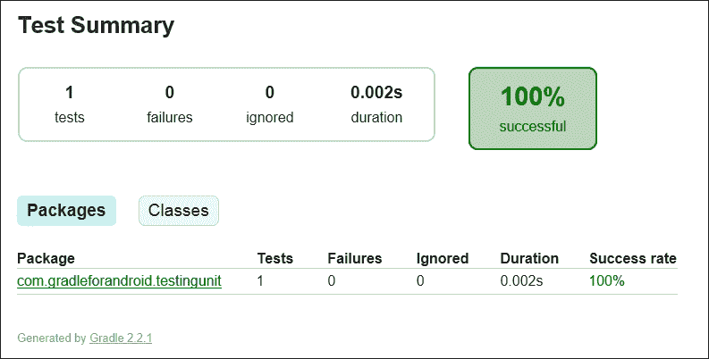
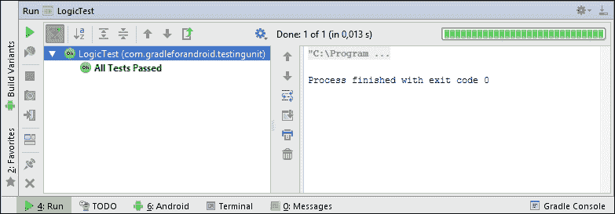
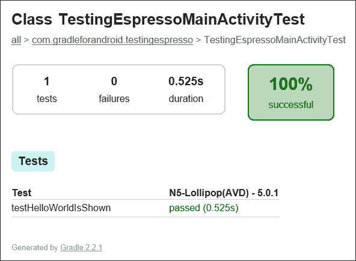
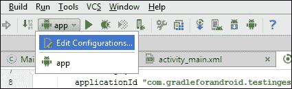
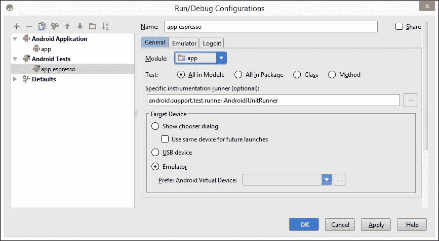
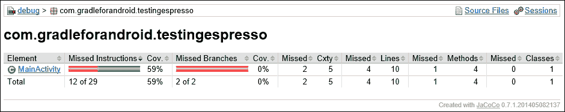

# 第六章。运行测试

为了确保任何应用程序或库的质量，拥有自动化测试是非常重要的。长期以来，Android 开发工具缺乏对自动化测试的支持，但最近，谷歌投入了大量努力，使开发者更容易开始测试。一些旧框架已经更新，并且添加了新框架，以确保我们可以彻底测试应用程序和库。我们不仅可以从 Android Studio 运行它们，还可以直接从命令行界面使用 Gradle 运行。

在本章中，我们将探讨测试 Android 应用程序和库的不同方法。我们还将探讨 Gradle 如何帮助自动化测试过程。

在本章中，我们将涵盖以下主题：

+   单元测试

+   功能测试

+   测试覆盖率

# 单元测试

在你的项目中拥有编写良好的单元测试不仅保证了质量，还使得检查新代码是否破坏了任何功能变得容易。Android Studio 和 Gradle Android 插件对单元测试有原生支持，但在使用它们之前，你需要配置一些设置。

## JUnit

**JUnit** 是一个极其流行的单元测试库，它已经存在十多年了。它使得编写测试变得容易，同时确保它们也易于阅读。请注意，这些特定的单元测试仅适用于测试业务逻辑，而不是与 Android SDK 相关的代码。

在你可以开始为你的 Android 项目编写 JUnit 测试之前，你需要为测试创建一个目录。按照惯例，这个目录被称为 `test`，它应该与你的主目录在同一级别。目录结构应该如下所示：

```java
app
└─── src
     ├─── main
     │    ├─── java
     │    │    └─── com.example.app
     │    └───res
     └─── test
          └─── java
               └─── com.example.app
```

你可以在 `src/test/java/com.example.app` 中创建测试类。

要使用 JUnit 的最新功能，请使用 JUnit 版本 4。你可以通过添加测试构建的依赖项来确保这一点：

```java
dependencies {
    testCompile 'junit:junit:4.12'
}
```

注意，我们在这里使用的是 `testCompile` 而不是 `compile`。我们使用这种配置来确保依赖项仅在运行测试时构建，而不是在打包应用程序进行分发时构建。使用 `testCompile` 添加的依赖项永远不会包含在常规的 assemble 任务生成的 APK 发布中。

如果你在一个构建类型或产品风味中有一个特殊条件，你可以为那个特定的构建添加一个仅测试的依赖项。例如，如果你只想将 JUnit 测试添加到你的付费风味中，你可以这样做：

```java
dependencies {
    testPaidCompile 'junit:junit:4.12'
}
```

当一切准备就绪时，就是开始编写测试的时候了。以下是一个测试添加两个数字方法的简单类示例：

```java
import org.junit.Test;

import static org.junit.Assert.assertEquals;

public class LogicTest {
    @Test
    public void addingNegativeNumberShouldSubtract() {
        Logic logic = new Logic();

        assertEquals("6 + -2 must be 4", 4, logic.add(6, -2));
        assertEquals("2 + -5 must be -3", -3, logic.add(2, -5));
    }
}
```

要使用 Gradle 运行所有测试，只需执行`gradlew test`。如果你只想在特定的构建变体上运行测试，只需简单地添加变体的名称。如果你想只在调试变体上运行测试，例如，执行`gradlew testDebug`。如果测试失败，Gradle 将在命令行界面中打印错误消息。如果所有测试都顺利运行，Gradle 将显示常规的**BUILD SUCCESSFUL**消息。

单个失败的测试会导致`test`任务失败，立即停止整个过程。这意味着在出现失败的情况下，并不是所有测试都会被执行。如果你想确保所有构建变体都执行整个测试套件，请使用`continue`标志：

```java
$ gradlew test --continue

```

你也可以通过将测试类存储在相应的目录中来为特定的构建变体编写测试。例如，如果你想测试应用程序付费版本中的特定行为，将测试类放在`src/testPaid/java/com.example.app`。

如果你不想运行整个测试套件，只想运行特定类的测试，可以使用测试标志，如下所示：

```java
$ gradlew testDebug --tests="*.LogicTest"

```

执行测试任务不仅运行所有测试，还会创建一个测试报告，该报告可以在`app/build/reports/tests/debug/index.html`找到。如果出现任何失败，这个报告可以轻松地找到问题，在测试自动执行的情况下尤其有用。Gradle 将为你在其上运行测试的每个构建变体创建一个报告。

如果所有测试都成功运行，你的单元测试报告将看起来像这样：



你也可以在 Android Studio 中运行测试。当你这样做时，你会在 IDE 中获得即时反馈，并且可以点击失败的测试导航到相应的代码。如果你的所有测试都通过了，**运行**工具窗口将看起来像这样：



如果你想要测试包含对 Android 特定类或资源的引用的代码部分，常规单元测试并不是理想的选择。你可能已经尝试过并遇到了`java.lang.RuntimeException: Stub!`错误。为了修复这个问题，你需要自己实现 Android SDK 中的每个方法，或者使用模拟框架。幸运的是，存在几个已经处理了 Android SDK 的库。其中最受欢迎的库是 Robolectric，它提供了一种简单的方式来测试 Android 功能，而无需设备或模拟器。

## Robolectric

使用 Robolectric，你可以在 Java 虚拟机内部运行测试，同时利用 Android SDK 和资源。这意味着你不需要运行中的设备或模拟器来在测试中使用 Android 资源，因此可以大大加快测试应用程序或库的 UI 组件行为。

要开始使用 Robolectric，你需要添加一些测试依赖项。除了 Robolectric 本身之外，你还需要包括 JUnit，如果你使用了支持库，还需要 Robolectric 阴影类来使用它：

```java
apply plugin: 'org.robolectric'
dependencies {
    compile fileTree(dir: 'libs', include: ['*.jar'])
    compile 'com.android.support:appcompat-v7:22.2.0'

    testCompile 'junit:junit:4.12'
    testCompile'org.robolectric:robolectric:3.0'
    testCompile'org.robolectric:shadows-support:3.0'
}
```

Robolectric 测试类应该创建在 `src/test/java/com.example.app` 目录下，就像常规单元测试一样。区别在于你现在可以编写涉及 Android 类和资源的测试。例如，这个测试验证了在点击特定的 `Button` 后，某个 `TextView` 的文本是否发生了变化：

```java
@RunWith(RobolectricTestRunner.class)
@Config(manifest = "app/src/main/AndroidManifest.xml", sdk = 18)
public class MainActivityTest {
    @Test
    public void clickingButtonShouldChangeText() {
        AppCompatActivity activity = Robolectric.buildActivity(MainActivity.class).create().get();
        Button button = (Button) activity.findViewById(R.id.button);
        TextView textView = (TextView) activity.findViewById(R.id.label);

        button.performClick();

        assertThat(textView.getText().toString(), equalTo(activity.getString(R.string.hello_robolectric)));
    }
}
```

### 注意

Robolectric 与 Android Lollipop 和兼容性库存在一些已知问题。如果你遇到提到缺少与兼容性库相关的资源的错误，有一个修复方案。

你需要向模块中添加一个名为 `project.properties` 的文件，并将以下行添加到其中：

```java
android.library.reference.1=../../build/intermediates/exploded-aar/com.android.support/appcompat-v7/22.2.0
android.library.reference.2=../../build/intermediates/exploded-aar/com.android.support/support-v4/22.2.0
```

这将帮助 Robolectric 找到兼容性库资源。

# 功能测试

**功能测试**用于测试应用中几个组件是否按预期协同工作。例如，你可以创建一个功能测试来确认点击某个按钮是否会打开一个新的 `Activity`。Android 有几个功能测试框架，但开始功能测试最简单的方法是使用 Espresso 框架。

## Espresso

Google 创建了 **Espresso** 以便开发者更容易编写功能测试。该库通过 Android 支持仓库提供，因此你可以使用 SDK 管理器进行安装。

为了在设备上运行测试，你需要定义一个测试运行器。通过测试支持库，Google 提供了 `AndroidJUnitRunner` 测试运行器，它可以帮助你在 Android 设备上运行 JUnit 测试类。测试运行器会将应用 APK 和测试 APK 加载到设备上，运行所有测试，然后根据测试结果生成报告。

假设你已经下载了测试支持库，这是设置测试运行器的方法：

```java
defaultConfig {
    testInstrumentationRunner "android.support.test.runner.AndroidJUnitRunner"
}
```

在开始使用 Espresso 之前，你还需要设置一些依赖项：

```java
dependencies {
    compile fileTree(dir: 'libs', include: ['*.jar'])
    compile 'com.android.support:appcompat-v7:22.2.0'

    androidTestCompile 'com.android.support.test:runner:0.3'
    androidTestCompile 'com.android.support.test:rules:0.3'
    androidTestCompile 'com.android.support.test.espresso:espresso-core:2.2'
    androidTestCompile 'com.android.support.test.espresso:espresso-contrib:2.2'
}
```

你需要引用测试支持库和 `espresso-core` 以开始使用 Espresso。最后一个依赖项 `espresso-contrib` 是一个具有补充 Espresso 功能但不是核心库一部分的库。

注意到这些依赖项使用的是 `androidTestCompile` 配置，而不是我们之前使用的 `testCompile` 配置。这是为了区分单元测试和功能测试。

如果你此时尝试运行测试构建，你会遇到这个错误：

```java
Error: duplicate files during packaging of APK app-androidTest.apk
  Path in archive: LICENSE.txt
  Origin 1: ...\hamcrest-library-1.1.jar
  Origin 2: ...\junit-dep-4.10.jar
```

错误本身非常详细。Gradle 由于文件重复无法完成构建。幸运的是，这只是一个许可描述，我们可以将其从构建中移除。错误本身还包含了如何做到这一点的信息：

```java
You can ignore those files in your build.gradle:
  android {
  packagingOptions {
      exclude 'LICENSE.txt'
    }
  }
```

一旦构建文件设置完成，你就可以开始添加测试。功能测试放置在与常规单元测试不同的目录中。就像依赖配置一样，你需要使用`androidTest`而不是仅仅`test`，因此功能测试的正确目录是`src/androidTest/java/com.example.app`。以下是一个测试类的示例，该类检查`MainActivity`中`TextView`的文本是否正确：

```java
@RunWith(AndroidJUnit4.class)
@SmallTest
public class TestingEspressoMainActivityTest {
    @Rule
    public ActivityTestRule<MainActivity> mActivityRule = new ActivityTestRule<>(MainActivity.class);

    @Test
    public void testHelloWorldIsShown() {
        onView(withText("Hello world!")).check(matches(isDisplayed()));
    }
}
```

在运行 Espresso 测试之前，你需要确保你有一个设备或模拟器。如果你忘记连接设备，尝试执行测试任务将抛出此异常：

```java
Execution failed for task ':app:connectedAndroidTest'.
>com.android.builder.testing.api.DeviceException: java.lang.RuntimeException: No connected devices!
```

一旦你连接了设备或启动了模拟器，你可以使用`gradlewconnectedCheck`来运行你的 Espresso 测试。此任务将执行`connectedAndroidTest`来在所有连接的设备上运行调试构建的所有测试，以及`createDebugCoverageReport`来创建测试报告。

你可以在应用目录下的`build/outputs/reports/androidTests/connected`中找到生成的测试报告。打开`index.html`来查看报告，它看起来像这样：



功能测试报告显示测试是在哪个设备和 Android 版本上运行的。你可以同时运行多个设备上的这些测试，因此设备信息使得查找设备或版本特定的错误变得更加容易。

如果你想在 Android Studio 中对你的测试获得反馈，设置一个运行/调试配置来直接从 IDE 中运行测试。运行/调试配置代表一组运行/调试启动属性。Android Studio 工具栏有一个配置选择器，你可以从中选择你想要使用的运行/调试配置。



要设置新的配置，通过点击**编辑配置…**来打开配置编辑器，然后创建一个新的 Android 测试配置。选择模块并指定仪器运行器为`AndroidJUnitRunner`，如下面的截图所示：



保存此新配置后，你可以在配置选择器中选择它，然后点击**运行**按钮来运行所有测试。

### 注意

从 Android Studio 运行 Espresso 测试有一个缺点：不会生成测试报告。原因是 Android Studio 执行的是`connectedAndroidTest`任务而不是`connectedCheck`，而`connectedCheck`是负责生成测试报告的任务。

# 测试覆盖率

一旦你开始为你的 Android 项目编写测试，了解你的代码库中有多少被测试覆盖是很重要的。Java 有很多测试覆盖率工具，但**Jacoco**是最受欢迎的一个。它默认包含在内，这使得入门变得容易。

## Jacoco

启用覆盖率报告非常简单。你只需在你要测试的构建类型上设置`testCoverageEnabled = true`。像这样启用调试构建类型的测试覆盖率：

```java
buildTypes {
  debug {
    testCoverageEnabled = true
  }
}
```

当你启用测试覆盖率时，当执行 `gradlew connectedCheck` 命令时将创建覆盖率报告。创建报告的任务本身是 `createDebugCoverageReport`。尽管它没有文档说明，且在运行 `gradlew tasks` 命令时不会出现在任务列表中，但你可以直接运行它。然而，由于 `createCoverageReport` 依赖于 `connectedCheck`，你不能单独执行它们。对 `connectedCheck` 的依赖还意味着你需要一个连接的设备或模拟器来生成测试覆盖率报告。

任务执行完成后，你可以在 `app/build/outputs/reports/coverage/debug/index.html` 目录中找到覆盖率报告。每个构建变体都有自己的报告目录，因为每个变体都可以有不同的测试。测试覆盖率报告看起来可能像这样：



报告显示了类级别的覆盖率概览，你可以点击查看更多信息。在最详细的视图中，你可以看到哪些行被测试了，哪些行没有被测试，以及在一个有用的颜色编码的文件视图中。

如果你想要指定 Jacoco 的特定版本，只需在构建类型中添加一个 Jacoco 配置块，并定义版本：

```java
jacoco {
  toolVersion = "0.7.1.201405082137"
}
```

然而，明确指定版本不是必要的；Jacoco 仍然可以正常工作。

# 摘要

在本章中，我们探讨了测试 Android 应用和库的几种选项。我们首先从简单的单元测试开始，然后探讨了使用 Robolectric 的更具体的 Android 测试。接着我们介绍了功能测试和 Espresso 的入门，最后我们探讨了启用测试覆盖率报告以查看测试套件需要改进的地方。现在你已经知道了如何使用 Gradle 和 Android Studio 运行整个测试套件，并且可以生成覆盖率报告，没有理由不编写测试。在 第八章 中，我们将探讨使用持续集成工具自动化测试的更多方法。

下一章将涵盖自定义构建过程最重要的一个方面：创建自定义任务和插件。本章还包括 Groovy 的简要介绍。这不仅有助于创建任务和插件，而且也有助于更容易地理解 Gradle 的工作原理。
