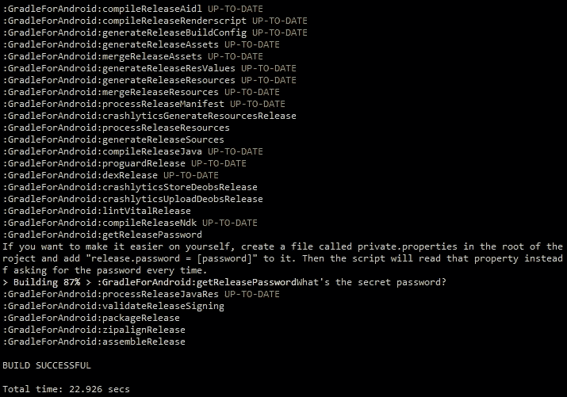

# 第七章：创建任务和插件

到目前为止，我们一直在操作 Gradle 构建的属性，并学习如何运行任务。在本章中，我们将更深入地了解这些属性，并开始创建自己的任务。一旦我们知道了如何编写自己的任务，我们就可以更进一步，看看如何创建可以在多个项目中重用的自定义插件。

在我们查看如何创建自定义任务之前，我们需要学习一些重要的 Groovy 概念。这是因为对 Groovy 工作方式的基本理解使得开始创建自定义任务和插件变得容易得多。了解 Groovy 还有助于理解 Gradle 是如何工作的，以及为什么构建配置文件看起来是这个样子。

在本章中，我们将探讨以下主题：

+   理解 Groovy

+   开始使用任务

+   集成到 Android 插件中

+   创建自己的插件

# 理解 Groovy

由于大多数 Android 开发者都是熟练的 Java 开发者，因此观察 Groovy 与 Java 相比的工作方式很有趣。如果你是 Java 开发者，Groovy 的阅读起来相当简单，但如果没有一点介绍，编写自己的 Groovy 代码将是一项艰巨的任务。

### 小贴士

使用 Groovy 进行实验的一个好方法是使用 Groovy 控制台。这个应用程序包含在 Groovy SDK 中，使得尝试 Groovy 语句并获得即时响应变得容易。Groovy 控制台还能够处理纯 Java 代码，这使得比较 Java 和 Groovy 代码变得容易。您可以从 Groovy 网站[`groovy-lang.org/download.html`](http://groovy-lang.org/download.html)下载 Groovy SDK，包括 Groovy 控制台。

## 简介

Groovy 是从 Java 衍生出来的，并在 Java 虚拟机上运行。它的目标是成为一个更简单、更直接的编程语言，既可以作为脚本语言使用，也可以作为完整的编程语言使用。在本节中，我们将比较 Groovy 和 Java，以便更容易理解 Groovy 的工作方式，并清楚地看到两种语言之间的区别。

在 Java 中，将字符串打印到屏幕上的样子如下：

```java
System.out.println("Hello, world!");
```

在 Groovy 中，你可以用这一行代码完成相同的事情：

```java
println 'Hello, world!'
```

你会立即注意到几个关键的区别：

+   没有使用`System.out`命名空间

+   方法参数周围没有括号

+   行尾没有分号

示例还使用了字符串的单引号。你可以为字符串使用单引号或双引号，但它们有不同的用法。双引号字符串还可以包含插值表达式。插值是评估包含占位符的字符串的过程，并用它们的值替换这些占位符。这些占位符表达式可以是变量，甚至是方法。包含方法或多个变量的占位符表达式需要用花括号包围并以前缀`$`开头。只包含单个变量的占位符表达式只需以前缀`$`开头。以下是一些 Groovy 中字符串插值的示例：

```java
def name = 'Andy'
def greeting = "Hello, $name!"
def name_size "Your name is ${name.size()} characters long."
```

`greeting`变量包含字符串"Hello, Andy"，而`name_size`是"您的名字长度为 4 个字符。"。

字符串插值允许您动态执行代码。以下是一个有效的代码示例，它会打印当前日期：

```java
def method = 'toString'
new Date()."$method"()
```

当您习惯于 Java 时，这看起来非常奇怪，但在动态编程语言中，这是一种正常的语法和行为。

## 类和成员

在 Groovy 中创建类的方式与在 Java 中创建类的方式非常相似。以下是一个包含一个成员的简单类的示例：

```java
class MyGroovyClass {
    String greeting

    String getGreeting() {
        return 'Hello!'
    }
}
```

注意，类和成员都没有显式的访问修饰符。Groovy 中的默认访问修饰符与 Java 不同。类本身是公开的，就像方法一样，而类成员是私有的。

要使用`MyGroovyClass`，请创建其新实例：

```java
def instance = new MyGroovyClass()
instance.setGreeting 'Hello, Groovy!'
instance.getGreeting()
```

您可以使用`def`关键字创建新变量。一旦您有一个类的实例，您就可以操作其成员。Groovy 会自动添加访问器。您仍然可以像我们在`MyGroovyClass`的定义中使用`getGreeting()`那样覆盖它们。如果您不指定任何内容，您仍然可以在类中的每个成员上使用 getter 和 setter。

如果您尝试直接调用成员，实际上会调用 getter。这意味着您不需要键入`instance.getGreeting()`，您可以直接使用更短的`instance.greeting`：

```java
println instance.getGreeting()
println instance.greeting
```

上述代码示例中的两行打印出完全相同的内容。

## 方法

就像变量一样，您不需要为您的函数定义特定的返回类型。您仍然可以这样做，即使只是为了清晰起见。Java 和 Groovy 方法之间的另一个区别是，在 Groovy 中，方法的最后一行默认返回，即使没有使用`return`关键字。

为了展示 Java 和 Groovy 之间的差异，考虑以下 Java 示例，该方法返回一个数字的平方：

```java
public int square(int num) {
    return num * num;
}
square(2);
```

您需要指定该方法是否公开可访问，返回类型是什么，以及参数的类型。在方法末尾，您需要返回一个与返回类型相对应的值。

在 Groovy 中，相同的方法定义看起来像这样：

```java
def square(def num) {
    num * num
}
square 4
```

返回类型和参数类型都没有明确定义。使用`def`关键字代替显式类型，并且方法隐式返回一个值，而不使用`return`关键字。然而，为了清晰起见，仍然建议使用`return`关键字。当您调用方法时，不需要括号或分号。

在 Groovy 中，还有另一种定义新方法的更简短的方法。相同的`square`方法也可以这样表示：

```java
def square = { num ->
    num * num
}
square 8
```

这不是一个普通的方法，而是一个闭包。闭包的概念在 Java 中并不以相同的方式存在，但在 Groovy 和 Gradle 中起着重要作用。

## 闭包

闭包是接受参数并可以返回值的匿名代码块。它们可以被分配给变量，也可以作为参数传递给方法。

你可以通过在花括号之间添加一个代码块来定义一个闭包，就像你在前面的例子中看到的那样。如果你想更明确一些，你可以在定义中添加类型，如下所示：

```java
Closure square = {
    it * it
}
square 16
```

添加 `Closure` 类型可以让所有与代码工作的人清楚地知道正在定义一个闭包。前面的例子还介绍了名为 `it` 的隐式无类型参数的概念。如果你没有显式地向闭包添加参数，Groovy 会自动添加一个。这个参数始终被称为 `it`，你可以在所有闭包中使用它。如果调用者没有指定任何参数，`it` 是 null。这可以使你的代码更加简洁，但只有在闭包只接受一个单一参数时才有用。

在 Gradle 的上下文中，我们一直在使用闭包。在这本书中，我们一直把闭包称为块。这意味着，例如，`android` 块和 `dependencies` 块都是闭包。

## 集合

在使用 Groovy 的 Gradle 上下文中，有两个重要的集合类型：列表和映射。

在 Groovy 中创建一个新的列表非常简单。不需要特殊的初始化器；你可以简单地创建一个列表，如下所示：

```java
List list = [1, 2, 3, 4, 5]
```

遍历列表也非常容易。你可以使用 `each` 方法遍历列表中的每个元素：

```java
list.each() { element ->
    println element
}
```

`each` 方法允许你访问列表中的每个元素。你可以通过使用前面提到的 `it` 变量来使这段代码更短。 

```java
list.each() {
    println it
}
```

在 Gradle 的上下文中，另一种重要的集合类型是 `Map`。映射在多个 Gradle 设置和方法中使用。简单来说，映射是一个包含键值对的列表。你可以这样定义一个映射：

```java
Map pizzaPrices = [margherita:10, pepperoni:12]
```

要访问映射中的特定项，请使用 `get` 方法或方括号：

```java
pizzaPrices.get('pepperoni')
pizzaPrices['pepperoni']
```

Groovy 也为此功能提供了一个快捷方式。你可以使用点符号来表示映射元素，使用键来检索值：

```java
pizzaPrices.pepperoni
```

## Groovy 在 Gradle 中

现在你已经了解了 Groovy 的基础知识，回顾一个 Gradle 构建文件并阅读它是一个有趣的练习。注意，配置的语法为什么是这样的已经变得更容易理解了。例如，看看应用 Android 插件的那一行：

```java
apply plugin: 'com.android.application'
```

这段代码充满了 Groovy 快捷方式。如果你不使用任何快捷方式来写它，它看起来像这样：

```java
project.apply([plugin: 'com.android.application'])
```

不使用 Groovy 快捷方式重写这一行，可以清楚地看出 `apply()` 是 `Project` 类的一个方法，这是每个 Gradle 构建的基本构建块。`apply()` 方法接受一个参数，它是一个包含键 `plugin` 和值 `com.android.application` 的 `Map`。

另一个例子是 `dependencies` 块。之前，我们是这样定义依赖项的：

```java
dependencies {
    compile 'com.google.code.gson:gson:2.3'
}
```

我们现在知道这个块是一个闭包，它被传递给`Project`对象上的`dependencies()`方法。这个闭包被传递给一个`DependencyHandler`，它包含`add()`方法。该方法接受三个参数：一个定义配置的字符串，一个定义依赖项表示法的对象，以及一个包含特定于此依赖项的属性的闭包。当你完整地写出来时，它看起来像这样：

```java
project.dependencies({
    add('compile', 'com.google.code.gson:gson:2.3', {
        // Configuration statements
    })
})
```

我们之前一直在看的构建配置文件，现在你应该已经对它们有了更多的了解，因为你已经知道了幕后的样子。

### 注意

如果你想了解更多关于 Gradle 在底层如何使用 Groovy 的信息，你可以将`Project`的官方文档作为起点。你可以在这里找到它：[`gradle.org/docs/current/javadoc/org/gradle/api/Project.html`](http://gradle.org/docs/current/javadoc/org/gradle/api/Project.html)。

# 开始使用任务

自定义 Gradle 任务可以显著提高开发者的日常工作效率。任务可以操作现有的构建过程，添加新的构建步骤，或影响构建的输出。你可以执行简单的任务，例如通过挂钩到 Gradle 的 Android 插件来重命名生成的 APK。任务还允许你运行更复杂的代码，例如在应用打包之前为多个密度生成图像。一旦你知道如何创建自己的任务，你就会发现自己能够改变构建过程的每一个方面。这尤其在你学习了如何挂钩到 Android 插件时更为明显。

## 定义任务

任务属于一个`Project`对象，并且每个任务都实现了`Task`接口。定义一个新任务的最简单方法是通过执行`task`方法，并将任务名称作为其参数：

```java
task hello
```

这会创建任务，但当你执行它时，它不会做任何事情。要创建一个稍微有用一些的任务，你需要向它添加一些动作。一个常见的初学者错误是创建像这样的任务：

```java
task hello {
  println 'Hello, world!'
}
```

当你执行此任务时，你会看到以下输出：

```java
$ gradlew hello
Hello, world!
:hello

```

从输出中，你可能会得到这样的印象，这好像是在工作，但实际上，“Hello, world!”在任务执行之前就已经打印出来了。为了理解这里发生了什么，我们需要回到基础。在第一章中，我们讨论了 Gradle 构建的生命周期。任何 Gradle 构建都有三个阶段：初始化阶段、配置阶段和执行阶段。当你以与上一个示例相同的方式向任务添加代码时，你实际上是在设置任务的配置。即使你要执行不同的任务，"Hello, world!"消息仍然会显示出来。

如果你想在任务的执行阶段添加动作，请使用以下标记：

```java
task hello << {
  println 'Hello, world!'
}
```

这里的唯一区别是闭包前的 `<<`。这告诉 Gradle 代码是用于执行阶段，而不是配置阶段。

为了展示差异，考虑以下构建文件：

```java
task hello << {
  println 'Execution'
}

hello {
  println 'Configuration'
}
```

我们定义了一个名为 `hello` 的任务，当它执行时会在屏幕上打印。我们还定义了 `hello` 任务的配置阶段代码，它会在屏幕上打印 `Configuration`。尽管配置块是在实际任务代码定义之后定义的，但它仍然会首先执行。这是前面示例的输出：

```java
$ gradlew hello
Configuration
:hello
Execution

```

### 小贴士

由于配置阶段的不当使用而导致任务失败是一个常见的错误。当你开始创建自己的任务时，请记住这一点。

由于 Groovy 有很多快捷方式，Gradle 中定义任务有几种方式：

```java
task(hello) << {
  println 'Hello, world!'
}

task('hello') << {
  println 'Hello, world!'
}

tasks.create(name: 'hello') << {
  println 'Hello, world!'
}
```

前两个块只是使用 Groovy 实现相同功能的不同方式。你可以使用括号，但不是必须的。参数周围也不需要单引号。在这两个块中，我们调用 `task()` 方法，它接受两个参数：一个用于任务名称的字符串和一个闭包。`task()` 方法是 Gradle 的 `Project` 类的一部分。

最后一个块没有使用 `task()` 方法。相反，它使用了一个名为 `tasks` 的对象，这是一个 `TaskContainer` 的实例，并且存在于每个 `Project` 对象中。这个类提供了一个 `create()` 方法，它接受一个 `Map` 和一个闭包作为参数，并返回一个 `Task`。

写简短的形式很方便，大多数在线示例和教程都会使用它们。然而，在学习的初期，写较长的形式可能很有用。这样，Gradle 似乎就不会那么像魔法一样，而且理解正在发生的事情会容易得多。

## 任务结构

`Task` 接口是所有任务的基础，定义了一系列属性和方法。所有这些都被一个名为 `DefaultTask` 的类实现。这是标准的任务类型实现，当你创建一个新的任务时，它基于 `DefaultTask`。

### 注意

从技术上来说，`DefaultTask` 并不是实现 `Task` 接口中所有方法的类。Gradle 有一个内部类型名为 `AbstractTask`，它包含了所有方法的实现。因为 `AbstractTask` 是内部的，所以我们不能覆盖它。因此，我们关注 `DefaultTask`，它继承自 `AbstractTask`，并且可以被覆盖。

每个 `Task` 都包含一个 `Action` 对象的集合。当任务执行时，所有这些动作都会按顺序执行。要向任务添加动作，你可以使用 `doFirst()` 和 `doLast()` 方法。这两个方法都接受一个闭包作为参数，然后为你将其包装成一个 `Action` 对象。

你总是需要使用 `doFirst()` 或 `doLast()` 来添加代码到任务中，如果你想这段代码成为执行阶段的一部分。我们之前用来定义任务的左移运算符 (`<<`) 是 `doFirst()` 方法的快捷方式。

下面是`doFirst()`和`doLast()`使用的一个示例：

```java
task hello {
  println 'Configuration'

  doLast {
    println 'Goodbye'
  }

  doFirst {
    println 'Hello'
  }
}
```

当你执行`hello`任务时，这是输出结果：

```java
$ gradlew hello
Configuration
:hello
Hello
Goodbye

```

即使打印"Goodbye"的代码行定义在打印"Hello"的代码行之前，但在任务执行时它们会以正确的顺序出现。你甚至可以使用`doFirst()`和`doLast()`多次，如本示例所示：

```java
task mindTheOrder {
  doFirst {
    println 'Not really first.'
  }

  doFirst {
    println 'First!'
  }

  doLast {
    println 'Not really last.'
  }

  doLast {
    println 'Last!'
  }
}
```

执行此任务将返回以下输出：

```java
$ gradlew mindTheOrder
:mindTheOrder
First!
Not really first.
Not really last.
Last!

```

注意`doFirst()`总是将操作添加到任务的开始部分，而`doLast()`则将操作添加到任务的末尾。这意味着在使用这些方法时，特别是当顺序很重要时，你需要格外小心。

在任务排序方面，你可以使用`mustRunAfter()`方法。此方法允许你影响 Gradle 构建依赖图的方式。当你使用`mustRunAfter()`时，你指定如果两个任务被执行，其中一个必须始终在另一个之前执行：

```java
task task1 << {
    println 'task1'
}
task task2 << {
    println 'task2'
}
task2.mustRunAfter task1
```

同时运行`task1`和`task2`将始终导致`task1`在`task2`之前执行，无论你指定的顺序如何：

```java
$ gradlew task2 task1
:task1
task1
:task2
task2

```

`mustRunAfter()`方法不会在任务之间添加依赖关系；仍然可以在不执行`task1`的情况下执行`task2`。如果你需要一个任务依赖于另一个任务，请使用`dependsOn()`方法。`mustRunAfter()`和`dependsOn()`之间的区别最好通过一个示例来解释：

```java
task task1 << {
    println 'task1'
}
task task2 << {
    println 'task2'
}
task2.dependsOn task1
```

这就是当你尝试在不执行`task1`的情况下执行`task2`时的样子：

```java
$ gradlew task2
:task1
task1
:task2
task2

```

使用`mustRunAfter()`，当你同时运行`task1`和`task2`时，`task1`总是先于`task2`执行，但它们仍然可以独立执行。使用`dependsOn()`，`task2`的执行总是触发`task1`，即使它没有被明确提及。这是一个重要的区别。

## 使用任务简化发布过程

在你能够将 Android 应用程序发布到 Google Play 商店之前，你需要使用证书对其进行签名。为此，你需要创建自己的密钥库，其中包含一组私钥。当你拥有密钥库和应用程序的私钥时，你可以在 Gradle 中定义签名配置，如下所示：

```java
android {
    signingConfigs {
        release {
            storeFile file("release.keystore")
            storePassword "password"
            keyAlias "ReleaseKey"
            keyPassword "password"
        }
    }

    buildTypes {
        release {
            signingConfig signingConfigs.release
        }
    }
}
```

这种方法的缺点是，你的密钥库密码以纯文本形式存储在仓库中。如果你正在从事开源项目，这绝对是不允许的；任何能够访问密钥库文件和密钥库密码的人都可以使用你的身份发布应用程序。为了防止这种情况，你可以在每次构建发布包时创建一个任务来请求发布密码。但这会稍微有些繁琐，并且使得你的构建服务器无法自动生成发布构建。存储密钥库密码的一个好方法是创建一个不包括在仓库中的配置文件。

首先，在项目的根目录下创建一个名为`private.properties`的文件，并将其添加到该文件中：

```java
release.password = thepassword
```

我们假设密钥库和密钥本身的密码是相同的。如果你有两个不同的密码，很容易添加第二个属性。

一旦设置好，你可以定义一个名为`getReleasePassword`的新任务：

```java
task getReleasePassword << {
    def password = ''

    if (rootProject.file('private.properties').exists()) {
        Properties properties = new Properties();
        properties.load( rootProject.file('private.properties').newDataInputStream())
        password = properties.getProperty('release.password')
    }
}
```

此任务将在项目的根目录中查找名为`private.properties`的文件。如果此文件存在，任务将加载其内容中的所有属性。`properties.load()`方法查找键值对，例如在属性文件中定义的`release.password`。

为了确保任何人都可以在没有私有属性文件的情况下运行脚本，或者处理属性文件存在但密码属性不存在的情况，请添加一个回退。如果密码仍然为空，请在控制台中请求密码：

```java
    if (!password?.trim()) {
        password = new String(System.console().readPassword("\nWhat's the secret password? "))
    }
```

使用 Groovy 检查一个字符串是否不为空或空是一个非常简洁的过程。`password?.trim()`中的问号执行空检查，如果`password`为空，则不会调用`trim()`方法。我们不需要显式检查空或空字符串，因为在 if 子句的上下文中，null 和空字符串都等于 false。

使用`new String()`是必要的，因为`System.readPassword()`返回一个字符数组，需要显式地将其转换为字符串。

一旦我们有了密钥库密码，我们可以配置发布构建的签名配置：

```java
android.signingConfigs.release.storePassword = password
android.signingConfigs.release.keyPassword = password
```

现在我们已经完成了任务，我们需要确保在执行发布构建时任务能够被执行。为此，请将这些行添加到`build.gradle`文件中：

```java
tasks.whenTaskAdded { theTask ->
    if (theTask.name.equals("packageRelease")) {
        theTask.dependsOn "getReleasePassword"
    }
}
```

此代码通过添加一个需要在任务被添加到依赖图时运行的闭包来集成到 Gradle 和 Android 插件中。密码不是必需的，直到执行`packageRelease`任务。因此，我们确保`packageRelease`依赖于我们的`getReleasePassword`任务。我们不能直接使用`packageRelease.dependsOn()`的原因是，Gradle 的 Android 插件根据构建变体动态生成打包任务。这意味着`packageRelease`任务在 Android 插件发现所有构建变体之前不存在。这个过程在每次构建之前启动。

添加任务和构建钩子后，执行`gradlew assembleRelease`的结果如下：



如前一个截图所示，`private.properties`文件不可用，因此任务在控制台中请求密码。在这种情况下，我们还添加了一条消息，解释如何创建属性文件并将密码属性添加到其中，以便使未来的构建更容易。一旦我们的任务获取了密钥库密码，Gradle 就能够打包我们的应用程序并完成构建。

为了使这个任务能够工作，集成到 Gradle 和 Android 插件中是至关重要的。这是一个强大的概念，因此我们将详细探讨这一点。

# 集成到 Android 插件中

在为 Android 开发时，我们想要影响的大多数任务都与 Android 插件相关。通过挂钩到构建过程，可以增强任务的行为。在前面的例子中，我们已经看到了如何添加一个自定义任务的依赖项，以便将其包含在常规构建过程中。在本节中，我们将探讨一些针对 Android 特定的构建钩子的可能性。

将钩子连接到 Android 插件的一种方法是通过操作构建变体。这样做相当直接；你只需要以下代码片段来遍历应用的所有构建变体：

```java
android.applicationVariants.all { variant ->
  // Do something
}
```

要获取构建变体的集合，你可以使用 `applicationVariants` 对象。一旦你有一个构建变体的引用，你可以访问并操作其属性，例如名称、描述等。如果你想要为 Android 库使用相同的逻辑，请使用 `libraryVariants` 而不是 `applicationVariants`。

### 注意

注意，我们使用 `all()` 方法而不是之前提到的 `each()` 方法来遍历构建变体。这是必要的，因为 `each()` 方法在构建变体由 Android 插件创建之前的评估阶段被触发。另一方面，`all()` 方法每次向集合中添加新项目时都会被触发。

此钩子可用于在 APK 保存之前更改其名称，将版本号添加到文件名中。这使得在没有手动编辑文件名的情况下维护 APK 存档变得容易。在下一节中，我们将看到如何实现这一点。

## 自动重命名 APKs

在操作构建过程的一个常见用例是将打包后的 APKs 重命名为包含版本号。你可以通过遍历应用的不同构建变体来实现这一点，并更改其输出的 `outputFile` 属性，如下面的代码片段所示：

```java
android.applicationVariants.all { variant ->
  variant.outputs.each { output ->
    def file = output.outputFile
    output.outputFile = new File(file.parent, file.name.replace(".apk", "-${variant.versionName}.apk"))
  }
}
```

每个构建变体都有一个输出集合。Android 应用的输出只是一个 APK。每个输出对象都有一个名为 `outputFile` 的 `File` 类型属性。一旦你知道输出路径，你就可以对其进行操作。在这个例子中，我们将变体的版本名称添加到文件名中。这将导致一个名为 `app-debug-1.0.apk` 的 APK，而不是 `app-debug.apk`。

将 Android 插件的构建钩子与 Gradle 任务的简单性相结合，打开了一个无限可能的世界。在下一节中，我们将看到如何为应用的所有构建变体创建任务。

## 动态创建新任务

由于 Gradle 的工作方式和任务的构建方式，我们可以在配置阶段轻松创建自己的任务，基于 Android 构建变体。为了演示这个强大的概念，我们将创建一个任务，不仅安装，还可以运行 Android 应用程序的任何构建变体。`install` 任务是 Android 插件的一部分，但如果您使用 `installDebug` 任务从命令行界面安装应用程序，那么在安装完成后，您仍然需要手动启动它。本节中我们将创建的任务将消除最后一步。

首先通过连接到我们之前使用的 `applicationVariants` 属性开始：

```java
android.applicationVariants.all { variant ->
  if (variant.install) {
    tasks.create(name: "run${variant.name.capitalize()}", dependsOn: variant.install) {
        description "Installs the ${variant.description} and runs the main launcher activity."
      }
  }
}
```

对于每个变体，我们检查它是否有一个有效的 `install` 任务。这是因为我们正在创建的新 `run` 任务将依赖于 `install` 任务。一旦我们验证了 `install` 任务的存在，我们就创建一个新的任务，并根据变体的名称命名它。我们还使我们的新任务依赖于 `variant.install`。这将触发在执行我们的任务之前执行 `install` 任务。在 `tasks.create()` 闭包内部，首先添加一个描述，当您执行 `gradlew tasks` 时会显示。

除了添加描述外，我们还需要添加实际的任务操作。在这个例子中，我们想要启动应用程序。您可以使用 **Android 调试工具**（**ADB**）在连接的设备或模拟器上启动应用程序：

```java
$ adb shell am start -n com.package.name/com.package.name.Activity

```

Gradle 有一个名为 `exec()` 的方法，它使得执行命令行进程成为可能。为了让 `exec()` 工作，我们需要提供一个存在于 `PATH` 环境变量中的可执行文件。我们还需要通过 `args` 属性传递所有参数，该属性接受一个字符串列表。下面是这个样子的：

```java
doFirst {
    exec {
        executable = 'adb'
        args = ['shell', 'am', 'start', '-n', "${variant.applicationId}/.MainActivity"]
    }
}
```

要获取完整的包名，请使用包含后缀（如果提供）的构建变体的应用程序 ID。不过，在这种情况下，后缀有一个问题。即使我们添加了后缀，活动的类路径仍然是相同的。例如，考虑以下配置：

```java
android {
    defaultConfig {
        applicationId 'com.gradleforandroid'
    }

    buildTypes {
        debug {
            applicationIdSuffix '.debug'
        }
   }
```

包名是 `com.gradleforandroid.debug`，但活动的路径仍然是 `com.gradleforandroid.Activity`。为了确保我们得到正确的类到活动，从应用程序 ID 中移除后缀：

```java
doFirst {
    def classpath = variant.applicationId
    if(variant.buildType.applicationIdSuffix) {
        classpath -= "${variant.buildType.applicationIdSuffix}"
}
    def launchClass = "${variant.applicationId}/${classpath}.MainActivity"
    exec {
        executable = 'adb'
        args = ['shell', 'am', 'start', '-n', launchClass]
    }
}
```

首先，我们创建一个名为 `classpath` 的变量，基于应用程序 ID。然后我们找到由 `buildType.applicationIdSuffix` 属性提供的后缀。在 Groovy 中，可以使用减号运算符从一个字符串中减去另一个字符串。这些更改确保在安装后运行应用程序时，使用后缀不会失败。

# 创建您自己的插件

如果您有一系列 Gradle 任务想要在多个项目中重用，将这些任务提取到一个自定义插件中是有意义的。这使得您可以自己重用构建逻辑，并与他人共享。

插件可以用 Groovy 编写，也可以用其他利用 JVM 的语言编写，例如 Java 和 Scala。实际上，Gradle 的 Android 插件的大部分代码是用 Java 和 Groovy 结合编写的。

## 创建一个简单的插件

要提取已存储在构建配置文件中的构建逻辑，您可以在 `build.gradle` 文件中创建一个插件。这是开始使用自定义插件的最简单方法。

要创建一个插件，创建一个新的类来实现 `Plugin` 接口。我们将使用本章之前编写的代码，该代码动态创建 `run` 任务。我们的插件类看起来像这样：

```java
class RunPlugin implements Plugin<Project> {
  void apply(Project project) {
    project.android.applicationVariants.all { variant ->
      if (variant.install) {
        project.tasks.create(name: "run${variant.name.capitalize()}", dependsOn: variant.install) {
            // Task definition
        }
      }
    }
  }
}
```

`Plugin` 接口定义了一个 `apply()` 方法。当插件在构建文件中使用时，Gradle 会调用此方法。项目作为参数传递，以便插件可以配置项目或使用其方法和属性。在前面的示例中，我们不能直接调用 Android 插件中的属性。相反，我们需要首先访问项目对象。请注意，这要求在应用我们的自定义插件之前，必须先应用 Android 插件。否则，`project.android` 将引发异常。

任务的代码与之前相同，除了一个方法调用：我们不再调用 `exec()`，而是现在需要调用 `project.exec()`。

为了确保插件应用于我们的构建配置，将此行添加到 `build.gradle`：

```java
apply plugin: RunPlugin
```

## 分发插件

为了分发插件并与他人共享，您需要将其移动到一个独立的模块（或项目）中。一个独立的插件有自己的构建文件来配置依赖项和分发方式。此模块生成一个 JAR 文件，其中包含插件类和属性。您可以使用此 JAR 文件在多个模块和项目中应用插件，并与他人共享。

与任何 Gradle 项目一样，创建一个 `build.gradle` 文件来配置构建：

```java
apply plugin: 'groovy'

dependencies {
    compile gradleApi()
    compile localGroovy()
}
```

由于我们是用 Groovy 编写插件的，我们需要应用 Groovy 插件。Groovy 插件扩展了 Java 插件，并使我们能够构建和打包 Groovy 类。Groovy 和纯 Java 都受支持，因此如果您喜欢，可以混合使用。您甚至可以使用 Groovy 扩展 Java 类，或者相反。这使得即使您不自信使用 Groovy 做所有事情，也能轻松开始。

我们的构建配置文件包含两个依赖项：`gradleApi()` 和 `localGroovy()`。Gradle API 是从我们的自定义插件访问 Gradle 命名空间所必需的，而 `localGroovy()` 是与 Gradle 安装一起提供的 Groovy SDK 的分发。Gradle 默认为我们提供了这些依赖项，以便于使用。如果 Gradle 没有提供这些依赖项，我们就必须手动下载并引用它们。

### 注意

如果您计划公开分发您的插件，请确保在构建配置文件中指定组和版本信息，如下所示：

```java
group = 'com.gradleforandroid'
version = '1.0'
```

要开始使用我们独立模块中的代码，我们首先需要确保使用正确的目录结构：

```java
plugin
└── src
    └── main
        ├── groovy
        │   └── com
        │       └── package
        │           └── name
        └── resources
            └── META-INF
                └── gradle-plugins
```

与任何其他 Gradle 模块一样，我们需要提供一个`src/main`目录。因为这是一个 Groovy 项目，所以`main`的子目录被称为`groovy`而不是`java`。还有一个名为`resources`的`main`子目录，我们将用它来指定插件的属性。

我们在包目录中创建一个名为`RunPlugin.groovy`的文件，在其中我们定义了插件对应的类：

```java
package com.gradleforandroid

import org.gradle.api.Project
import org.gradle.api.Plugin

class RunPlugin implements Plugin<Project> {
    void apply(Project project) {
        project.android.applicationVariants.all { variant ->
            // Task code
        }
    }
}
```

为了让 Gradle 能够找到插件，我们需要提供一个属性文件。将此属性文件添加到`src/main/resources/META-INF/gradle-plugins/`目录中。文件名需要与我们的插件 ID 匹配。对于`RunPlugin`，文件名为`com.gradleforandroid.run.properties`，以下是其内容：

```java
implementation-class=com.gradleforandroid.RunPlugin
```

属性文件中只包含实现`Plugin`接口的类的包和名称。

当插件和属性文件准备就绪后，我们可以使用`gradlew assemble`命令来构建插件。这将在构建输出目录中创建一个 JAR 文件。如果你想要将插件推送到 Maven 仓库，首先需要应用 Maven 插件：

```java
apply plugin: 'maven'
```

接下来，你需要配置`uploadArchives`任务，如下所示：

```java
uploadArchives {
    repositories {
        mavenDeployer {
          repository(url: uri('repository_url'))
}
    }
}
```

`uploadArchives`任务是一个预定义的任务。一旦你在任务中配置了仓库，你就可以执行它来发布你的插件。本书不会涵盖如何设置 Maven 仓库。

如果你想要使你的插件公开可用，考虑将其发布到 Gradleware 的插件门户([`plugins.gradle.org`](https://plugins.gradle.org))。插件门户拥有大量的 Gradle 插件（不仅限于 Android 开发），当你想要扩展 Gradle 的默认行为时，这里是必去之地。你可以在[`plugins.gradle.org/docs/submit`](https://plugins.gradle.org/docs/submit)的文档中找到有关如何发布插件的信息。

### 小贴士

本书不会涵盖为自定义插件编写测试，但如果你计划使你的插件公开可用，则强烈建议这样做。你可以在 Gradle 用户指南[`gradle.org/docs/current/userguide/custom_plugins.html#N16CE1`](https://gradle.org/docs/current/userguide/custom_plugins.html#N16CE1)中找到有关为插件编写测试的更多信息。

## 使用自定义插件

要使用插件，我们需要将其添加到`buildscript`块中作为依赖项。首先，我们需要配置一个新的仓库。仓库的配置取决于插件是如何分发的。其次，我们需要在`dependencies`块中配置插件的类路径。

如果我们想要包含在早期示例中创建的 JAR 文件，我们可以定义一个`flatDir`仓库：

```java
buildscript {
    repositories {
        flatDir { dirs 'build_libs' }
    }
    dependencies {
        classpath 'com.gradleforandroid:plugin'
    }
}
```

如果我们将插件上传到 Maven 或 Ivy 仓库，这会有所不同。我们已经在 第三章 中介绍了依赖管理，即 *管理依赖*，因此我们在此不会重复不同的选项。

在设置依赖之后，我们需要应用插件：

```java
apply plugin: com.gradleforandroid.RunPlugin
```

当使用 `apply()` 方法时，Gradle 会创建插件类的实例，并执行插件自己的 `apply()` 方法。

# 摘要

在本章中，我们发现了 Groovy 与 Java 的不同之处，以及 Groovy 在 Gradle 中的使用方法。我们看到了如何创建自己的任务，以及如何挂钩到 Android 插件，这给了我们很多操作构建过程或动态添加自己任务的权力。

在本章的最后部分，我们探讨了创建插件，并确保通过创建独立插件可以在多个项目中重用。关于插件还有很多东西要学习，但不幸的是，我们无法在这本书中涵盖所有内容。幸运的是，Gradle 用户指南在 [`gradle.org/docs/current/userguide/custom_plugins.html`](https://gradle.org/docs/current/userguide/custom_plugins.html) 中对所有可能性进行了详尽的描述。

在下一章中，我们将讨论持续集成（CI）的重要性。有了良好的持续集成系统，我们可以通过一键操作来构建、测试和部署应用程序和库。因此，持续集成是构建自动化的一般重要部分。
