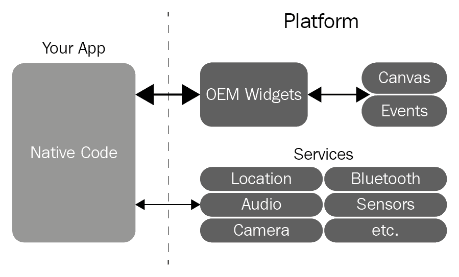
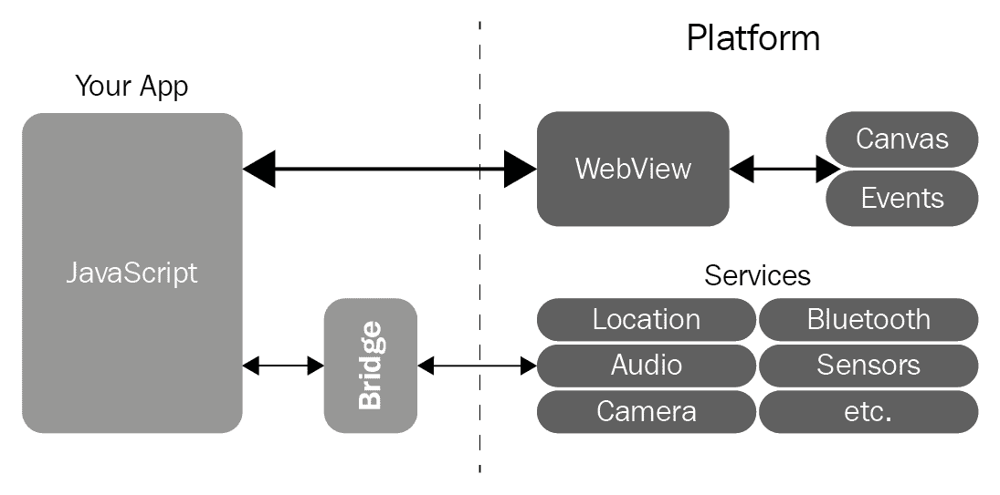
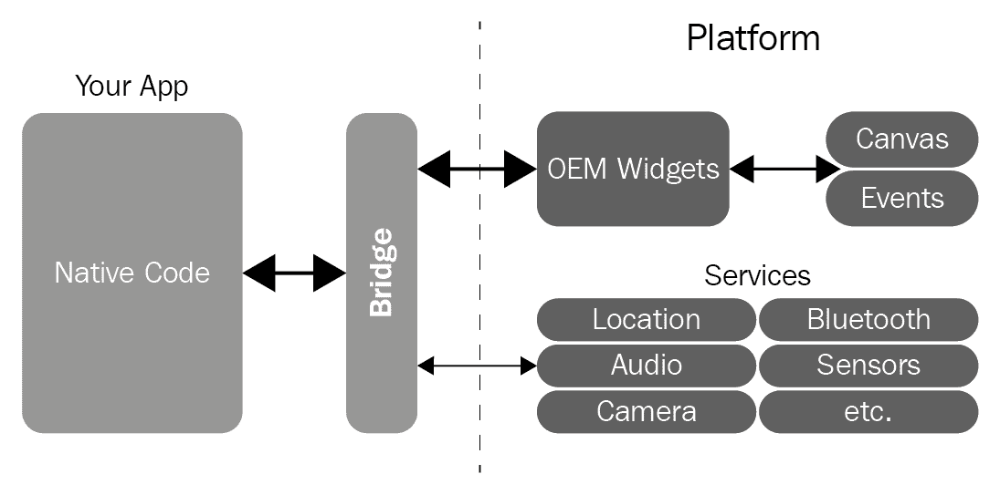
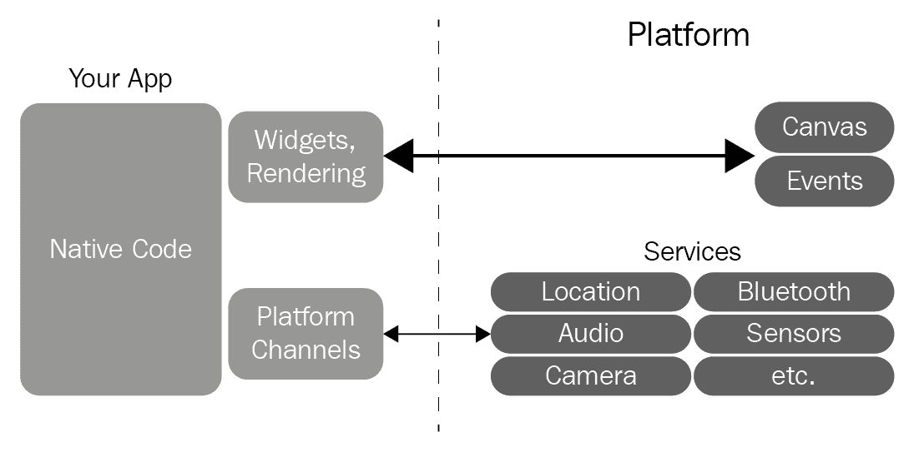

# 介绍 Flutter

**Flutter**是谷歌为创建跨平台移动应用程序（iOS 和 Android）而开发的应用程序开发框架。如官方网站[`flutter.io/`](https://flutter.io/)所述，它旨在使开发尽可能简单、快速和高效。诸如**热重载**、庞大的小部件目录、非常好的性能和坚实的社区等因素有助于实现这一目标，使 Flutter 成为一个相当不错的框架。

本书将指导你从开始使用 Flutter 到最终在它上面部署应用程序的旅程。但在那之前，让我们快速介绍一下 Flutter。

在本章中，我们将涵盖以下内容：

+   Flutter 的起源

+   什么是小部件？

+   将 Flutter 与现有框架进行比较

# Flutter 的起源

Flutter 的起源与许多著名软件的起源相似。它是在谷歌开发的。最初，Flutter 是一个实验，因为谷歌的开发人员试图从 Chrome 中移除一些兼容性支持，以尝试使其运行得更顺畅。几周后，在移除了许多兼容性支持之后，开发人员发现他们拥有一个比 Chrome 快 20 倍的渲染器，并看到它有成为伟大事物的潜力。

谷歌创建了一个分层框架，它直接与 CPU 和 GPU 通信，以便让开发者尽可能多地自定义应用程序。

# 什么是小部件？

Flutter 中的所有内容都可以使用小部件创建。方向、布局、不透明度、动画……一切都是小部件。这是 Flutter 的主要特点，从简单的按钮到动画或手势，所有操作都是通过小部件完成的。这很棒，因为它允许用户选择组合而不是继承，使构建应用程序的过程就像搭建乐高塔一样简单。你只需要挑选小部件并将它们组合起来以创建应用程序。

有许多基本的小部件可以帮助你使用 Flutter 构建应用程序。所有这些小部件都编入**Flutter 小部件目录**。因为 Flutter 中的所有内容都是由小部件组成的，所以你越了解如何使用、创建和组合它们，你使用 Flutter 的能力就越好、越快。在第三章“小部件，无处不在的小部件”中，我们将更详细地介绍小部件和小部件目录。

# 将 Flutter 与现有框架进行比较

当谈到移动应用开发时，我们可以找到许多不同的方法，但最终，一切归结为原生或跨平台方法。让我们看看不同的方法与 Flutter 相比看起来和运作如何。我们首先将看看原生平台，然后，在查看跨平台方法之前，我们将看看**WebView**系统，最后我们将看看 Flutter 在这个组合中的位置。

# 原生平台

原生框架，如 Android 和 iOS SDK，非常稳固。它们是移动应用开发的最佳稳定选择。它们有很多可用的应用，经过深度测试，拥有庞大的社区和公开可用的教程。以下图显示了原生移动应用开发框架的工作原理：

如前图所示，在这个框架中，**应用**直接与系统对话。这使得原生框架在功能方面成为最强大的选择。然而，它确实有一个缺点：你需要学习两种不同的语言，Android 的 Kotlin 或 Java，iOS 的 Obj-C 或 Swift，以及 SDK。这些语言用于编写具有相同功能的不同应用。每次修改都必须在两个平台上重复，这个过程可能并不那么顺畅。对于小型团队或需要开发速度的人来说，这并不是一个好的选择。

# WebView 系统

另一方面，我们有著名的跨平台方法，它以高效著称。在这个方法中，我们可以从单个代码库中获取 Android 和 iOS 的应用，就像在 Flutter 中一样。但每个框架都有一些缺点。

Cordova、Ionic、PhoneGap 和基于 WebView 的框架通常是跨平台框架的好例子，它们对于前端开发者来说尤其是一些好的解决方案。但它们在性能方面有所欠缺，在这些方法中，应用视图由 WebView 渲染的 HTML 组成；这意味着应用基本上是一个网站。

下面的图示展示了基于 WebView 的框架是如何工作的：

该系统使用一个桥接器来实现 JavaScript 与原生系统之间的切换。这个过程可能会非常慢，这取决于你需要的功能，这给这个系统增加了另一个缺点。

# 其他跨平台方法

让我们以另一个跨平台方法为例，看看它可能存在的不足。**Xamarin** 是 Windows 平台的跨平台开发解决方案，在我看来，它并不那么方便，尤其是在生产力和编译时间方面。

当查看其他平台时，**React Native** 可以被认为是跨平台框架中最好的之一，但它严重依赖于 OEM 组件。

让我们来看看 React Native 的工作原理：

React Native 在 WebView 系统中扩展了桥接概念，不仅用于服务，还用于构建小部件。从性能的角度来看，这确实很危险；例如，一个组件在动画过程中可能被构建数百次，但由于桥接概念的扩展，这个组件可能会大幅度减慢速度。这也可能导致其他问题，尤其是在 Android 上，这是最碎片化的操作系统。

# Flutter 的方法

在前面的章节中，我们探讨了移动应用开发的多种方法。我们简要地了解了这些方法的工作原理及其缺点。现在让我们来看看 Flutter。

与其他解决方案相比，Flutter 的表现要好得多，因为应用程序是编译**AOT**（**提前编译**）而不是像 JavaScript 解决方案那样的**JIT**（**即时编译**）。它还消除了桥接的概念，并且不依赖于 OEM 平台。它确实允许自定义组件使用屏幕上的所有像素。这意味着什么？这基本上意味着应用程序在 Android 和 iOS 的每个版本上显示效果相同。

我们确实研究了其他方法的工作原理，所以让我们也来看看 Flutter 的工作原理。您可以在以下图中看到 Flutter 框架的工作方式：

现在，您可以看到其他跨平台方法与 Flutter 之间的区别。如前所述，Flutter 消除了桥接和 OEM 平台，并使用**Widgets Rendering**来与画布和事件一起工作。它还使用**平台通道**来使用服务。此外，使用异步消息系统使用平台 API 并不困难，这意味着如果您需要使用特定的 Android 或 iOS 功能，可以轻松实现。

Flutter 还使得使用通道创建插件成为可能，这些插件可以被每个新开发者使用。简单来说：一次编写，到处使用！

# 为什么使用 Flutter？

Flutter 由于其众多特性和与其他方法不同的几个方面，是跨平台开发的一个好选择，正如我们所看到的。它不仅对开发者来说是一个好选择，对用户和设计师来说也是如此；让我们来看看为什么是这样的：

+   对于用户来说，Flutter 为应用程序提供了吸引人的用户界面，这增强了用户对这些应用程序的使用。

+   对于开发者来说，Flutter 使得新开发者进入构建移动应用的世界变得容易，因为使用 Flutter 构建应用程序非常简单。Flutter 不仅减少了应用程序的开发时间，还减少了创建应用程序的成本和复杂性。

+   对于使用 Flutter 的设计师来说，可以使用为应用程序构思的原设计来创建应用程序，而不会对其任何方面造成妥协。因此，设计师的原有愿景在开发过程中不会改变。

最重要的是，Flutter 是一个非常实用的工具，可以创建原型和模型，这是一个优点，因为它为设计师和开发者提供了一个良好的接触点，这两个角色通常非常疏远。

# 摘要

在本章中，我们首先对 Flutter 进行了简要介绍，以及本书将如何作为学习使用 Flutter 进行跨平台应用开发的指南。然后，我们讨论了 Flutter 的起源。在探讨为什么 Flutter 是一个好选择之前，我们考察了 Flutter 在现有移动应用开发世界中的位置。

现在，移动开发并不是一个全新的领域，但 Flutter 使得它变得更加有趣且快速。此外，通过改进开发者工作流程，它使移动应用开发更接近游戏体验。

在下一章中，我们将安装 Flutter 框架，并尽可能从示例应用中学习。
