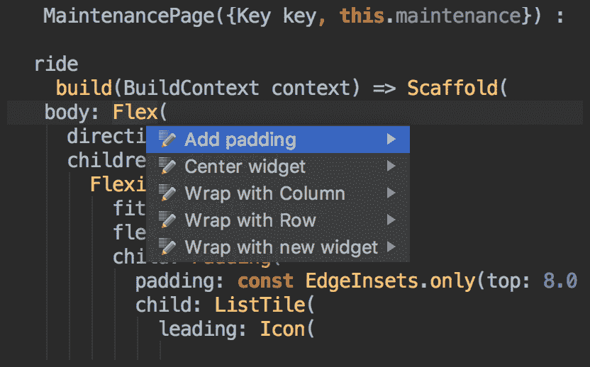
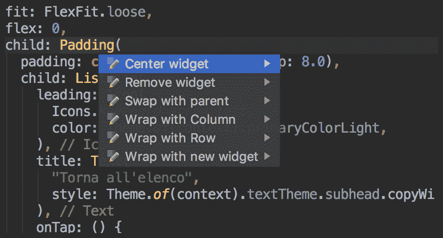
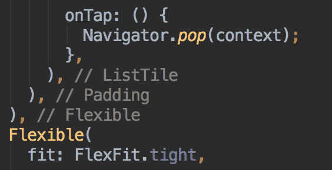
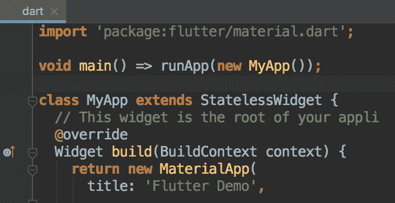
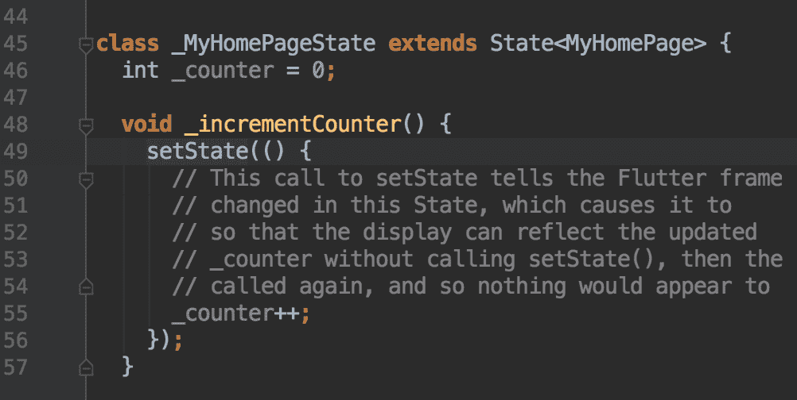
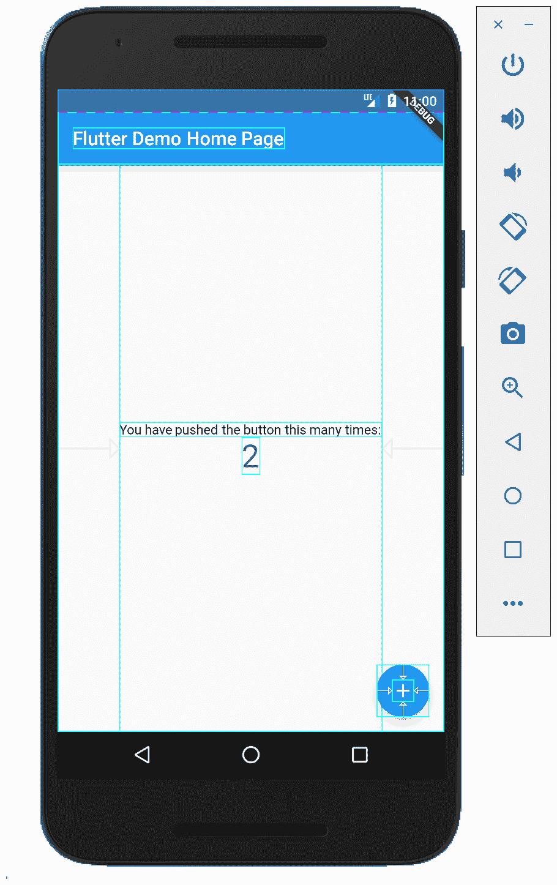
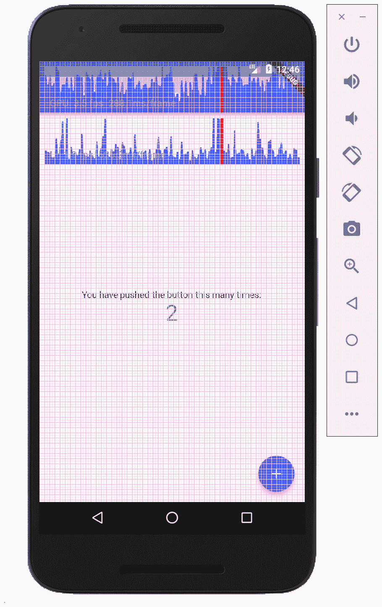
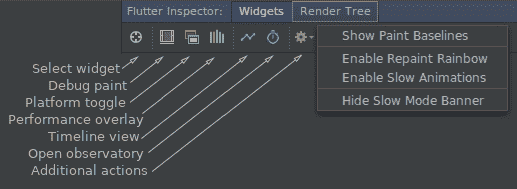
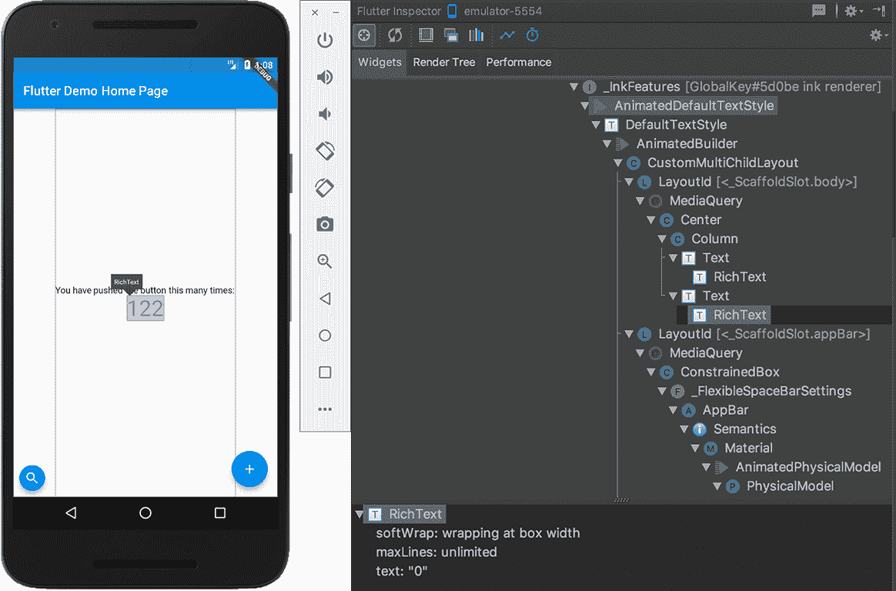

# 第二章：Flutter 入门

在开发任何应用程序之前，了解该系统的安装过程是理想的。在本章中，我们将首先查看如何在您的系统上安装 Flutter 并选择合适的 IDE。然后，我们将继续探索一个在屏幕上显示基本 `Hello World` 的示例应用程序。在我们查看如何调试和测试我们的应用程序之前，我们将快速了解一下什么是 **热重载**。

要开发 iOS 应用程序，我建议使用 Mac。我们始终可以在 Android 上使用和测试应用程序，并在部署这些应用程序时使用 macOS。然而，问题总是接踵而至，因此在构建过程中在相应平台上测试应用程序将非常推荐。

在本章中，我们将涵盖以下主题：

+   安装 Flutter

+   选择合适的 IDE

+   探索示例应用程序

+   热重载

+   了解 Flutter 工具及其使用方法

+   在 Flutter 中编写和执行测试

# 安装 Flutter

让我们从我们的主要应用开始，并在您的系统上安装 Flutter。根据您使用的操作系统，您可以按照以下步骤在您的系统上安装 Flutter。我们将查看如何在 Windows、Mac 和 Linux 上安装 Flutter。

# 在 Windows 上安装 Flutter

要在 Windows 上安装 Flutter，请按照以下步骤操作：

1.  从 [`storage.googleapis.com/flutter_infra/releases/stable/windows/flutter_windows_v1.2.1-stable.zip`](https://storage.googleapis.com/flutter_infra/releases/stable/windows/flutter_windows_v1.2.1-stable.zip) 下载 Flutter。

1.  解压下载的文件，并将其放置在您系统上的目标文件夹中。

1.  定位并运行 `flutter_console.bat` 以开始安装。

1.  我们接下来需要下载和设置 Node.js；您可以从 [`nodejs.org/en/download/`](https://nodejs.org/en/download/) 下载它。

1.  最后，我们需要下载和安装 Git For Windows 2.x：[`gitforwindows.org/`](https://gitforwindows.org/)

# 在 Mac 上安装 Flutter

要在 Mac 上安装 Flutter，请按照以下步骤操作：

1.  从 [`storage.googleapis.com/flutter_infra/releases/stable/macos/flutter_macos_v1.2.1-stable.zip`](https://storage.googleapis.com/flutter_infra/releases/stable/macos/flutter_macos_v1.2.1-stable.zip) 下载 Flutter for Mac。

1.  解压下载的文件，并使用 ```$ export PATH=`pwd`/flutter/bin:$PATH`` 命令将其放置在您系统上的目标文件夹中。

1.  运行 `$ flutter doctor` 以验证一切是否已正确设置。

1.  我们接下来需要下载和设置 Node.js；您可以从 [`www.npmjs.com/get-npm`](https://www.npmjs.com/get-npm) 下载它。

我们将使用以下命令：`bash`、`curl`、`git 2.x`、`mkdir`、`rm`、`unzip` 和 `which`。

1.  最后，我们需要下载和安装 Git：[`git-scm.com/download/mac`](https://git-scm.com/download/mac)

# 在 Linux 上安装 Flutter

要在 Linux 上安装 Flutter，请按照以下步骤操作：

1.  从 [`storage.googleapis.com/flutter_infra/releases/stable/linux/flutter_linux_v1.2.1-stable.tar.xz`](https://storage.googleapis.com/flutter_infra/releases/stable/linux/flutter_linux_v1.2.1-stable.tar.xz) 下载 Flutter。

1.  解压缩下载的文件，并将其放置在您系统上选择的文件夹中，使用 `$ tar xf ~/Downloads/flutter_linux_v1.2.1-stable.tar.xz`。

1.  然后，使用以下命令将 Flutter 添加到您的路径：`$ export PATH="$PATH:`pwd`/flutter/bin"`.

1.  接下来，我们需要下载并设置 Node.js；您可以从 [`git-scm.com/download/linux`](https://git-scm.com/download/linux) 下载。

这里是我们将要使用的命令：`bash`、`curl`、`git 2.x`、`mkdir`、`rm`、`unzip`、`which` 和 `xz-utils`。

# 熟悉 IDE

对于 Flutter，最好使用 Android Studio/IntelliJ 或 **Visual Studio**（**VS**）代码，操作系统为 Mac/Windows。这些 IDE 是您能找到的用于开发移动应用的最佳选择。但是，为了使用这些 IDE 与 Flutter 一起，我们需要使用一些插件。

我们需要一个 Dart 编译器的插件，另一个用于代码分析，还有一个用于 Flutter 开发者工作流程（构建、运行和调试）的插件。

这些插件可以在 Android Studio 和 VS code 上安装。您只需在相应的插件部分中搜索它们即可。这些 IDE 不仅提供了这些出色的插件选项来支持您的开发。让我们看看在开发应用程序时您可以使用的快速提示。

# 使用您想要的 IDE 的快速提示

当使用 Flutter 插件时，有一个非常好的选项可以在开发应用程序时使用；它被称为 **快速修复** 选项。要使用它，请按 *Alt* + *Enter*（在 VS code 上为 *Ctrl* + *.*）并会显示一个包含一些快速修复的弹出窗口。让我们看看它在屏幕上的样子。以下截图显示了它的外观：



在前面的截图中，快速修复提供了一个添加填充的选项：一个居中的 widget，使用 column 或 row 包裹它，并用新的 widget 包裹它。

这是一个非常有用的选项，因为它将在您嵌套多个 widget 的开发过程中帮助您节省大量时间。同时，保持代码整洁并不是一件容易的事情。

使用快速修复选项还可以做的一件很棒的事情是，您可以按列顺序排列子项以交换与父项的 widget 或完全快速地删除 widget。以下截图显示了这些选项：



谈到嵌套，插件中的一个非常有用的选项是在每个 widget 的末尾存在一些假注释。这有助于您一眼就能理解您所组成的 widget 树。以下截图显示了这些假注释的外观：



这些小贴士一开始可能看起来并不十分有用，但一旦你开始使用 Flutter 开发应用程序，它们将变得至关重要，并帮助你更快地工作。

# 探索示例应用程序

让我们看看 Flutter 中的代码是如何看起来，并探索其元素。首先，让我们创建一个新的项目；这样，Flutter-cli 将为我们创建一个示例应用程序以供探索。在我们开始查看代码之前，这是本书的 GitHub 仓库：[`github.com/PacktPublishing/Flutter-Quick-Start-Guide/tree/master/sample_app`](https://github.com/PacktPublishing/Flutter-Quick-Start-Guide/tree/master/sample_app)。

以下截图显示了 Flutter 代码的外观；让我们探索其元素：



正如你所见，应用程序的入口点是 `main` 函数，其中你可以看到对 `runApp` 的调用。这是第一条被执行的命令；其任务是设置 Flutter 框架并运行所选应用程序。当我们设置应用程序时，最初，它是一个普通的无状态小部件。

接下来，我们来到 `Build` 方法。它在之前的截图中被显示为 `Widget build(BuildContext context)`。`Build` 方法是返回 `MaterialAPP`、设置标题和设置通用主题的方法。除此之外，`Build` 方法还设置了应用程序的路由和主页。

接下来，让我们看看以下截图：



我们正在开发的示例应用程序由一个带有计数器的 Scaffold 组成，该计数器通过一个 **浮动操作按钮**（**FAB**）的压力来增加。正如我们在前面的截图中所见，这里没有 `setText`。计数器仅由一个变量描述，该变量通过 FAB 的 `onPressed` 动作的处理器进行更新。

让我们继续前进，看看代码中最重要的一行：前一个截图中的第 49 行。在 Flutter 中，你使用 `setState()` 方法来更新 UI 并与底层变量同步。在这种情况下，我们正在增加 `_counter` 变量，同时，我们还想让应用程序渲染显示数字的文本。这些是在你创建 Flutter 示例项目时能够使用的一些元素。我们将在下一节中查看 Flutter 的最佳特性之一：热重载。

# 热重载

在你开始实际在 Flutter 中开发应用程序之前，了解你可以使用哪些 Flutter 特性来使生活更轻松是很好的。热重载就是这样一种特性；它将使开发变得更加容易。它是如何做到这一点的呢？让我们看看。

为了理解热重载是如何成为祝福的，让我们考虑一个正常的开发流程，其中您正在构建一个用于设置应用程序页面的标签。当您导航到您的标签时，您发现某些文本太小。通常，您必须返回并更改代码中的字体大小，然后返回到该点并检查大小是否现在正确。如果不正确，您会再次这样做：返回到代码中更改字体大小，回到该点，并检查它现在是否正确。您将不得不反复这样做，直到您找到正确的字体大小。

这是非常耗时且令人沮丧的，对吧？但在 Flutter 中，我们不必这样做，因为我们有热重载功能。在这种情况下，您只需编辑字体大小并按 ⌘+S。一旦这样做，您的应用将显示代码的更新版本！我们不必重新编译或反复导航到那个特定的屏幕。

这怎么可能呢？热重载使用 Dart 的 JIT 编译功能。编辑的代码将在毫秒内注入到以调试模式运行的应用中，保持其状态在内存中。

这对开发者来说是一个惊人的特性，因为它改变了开发工作流程的方式。您在这里有机会以不同的方式编写代码，这有助于您在不害怕严格工作的情况下对 UI 代码进行更多修改。

# 调试应用程序

在学习开发任何应用程序时，调试是了解的最重要的事情之一。调试将帮助您识别并处理代码中的错误。错误总是潜伏在角落，了解如何处理它们是至关重要的。为了理解 Flutter 中的调试，我们必须了解以下三个概念：

+   **Dart 分析器**

+   **Dart 观测站**

+   **视觉调试**

在接下来的章节中，我们将详细说明它们是什么以及它们如何帮助进行调试。

# Dart 分析器

Dart 分析器检查 Dart 代码中的错误。它本质上是一个 Dart 的 linter，是 `dartanalyzer` 工具的简单包装。Dart 分析器也包含在 Flutter 插件中，适用于 Android Studio 和 VS code，因此您不必担心在您的 IDE 中单独包含它。

我们还可以创建一个名为 `analysis_options.yaml` 的文件，并指定一些额外的选项，这将引发错误/警告，并帮助您编写更好的 Flutter 代码。

# Dart 观测站

Dart 观测站是一个专门用于调试和分析 Flutter 应用的工具。要设置断点并逐步运行应用，您可以使用 IDE 的帮助。另一种选择是使用 `debugger()` 语句。这一行将在您放置它的位置中断执行。您还可以指定一个条件，并且只有当条件为真时，应用才会停止：

```kt
void function(int aNumber) {
 debugger(when: aNumber < 10);
 // ...
 }
```

当你运行 Flutter 应用程序时，你将在控制台看到一个指定观察器 URL 的行。该行看起来如下：

```kt
Observatory listening on http://127.0.0.1:8100/
```

你可以通过导航到这个 URL 执行许多操作。你可以打开观察器，使用它来分析应用程序，检查堆栈，分配内存等等。这是一个非常强大的工具；你可以在[`dart-lang.github.io/observatory/`](https://dart-lang.github.io/observatory/)上找到更多关于它的信息。

# 视觉调试

将会有一些情况，我们需要调试我们应用程序的布局。我们可能需要以某种特定方式对一些小部件进行对齐，或者有时我们可能不知道小部件之间的空间是边距还是填充。在这种情况下，我们需要对应用程序进行视觉调试。在这种情况下进行调试时，启用`debugPaintSize`选项。

要这样做，将`debugPaintSizeEnabled`变量设置为`true`，如下所示：

```kt
void main() {
 debugPaintSizeEnabled=true;
 runApp(MyApp());
 }
```

将会显示以下输出：



如前一张截图所示，每个小部件都被着色，现在可以很容易地区分了。

这是一个非常强大的功能，可以帮助你进行视觉调试，尤其是如果你不是一个那么“像素完美”的前端开发者。

# 材料网格变量

让我们看看另一个视觉调试变量：它被称为**材料网格**。在这里，你将通过将`debugShowMaterialGrid`设置为`true`来声明你的`MaterialApp`！你的应用程序将被材料像素网格覆盖——这对于研究应用程序布局非常完美。以下是你应用程序的外观：

# showPerformanceOverlay 变量

下一个有用的选项是`showPerformanceOverlay`。通过将其设置为`true`，你将在图表的上半部分看到应用程序的性能以图表的形式显示。你的屏幕上将会显示两个图表，如下面的截图所示：



上图显示了 GPU 线程花费的时间，下图显示了 CPU 线程花费的时间。它们还会显示应用程序是否以低于 60Hz 的速度运行；在这种情况下，你可能有一些性能问题。这个功能将帮助你了解应用程序的性能，并验证它是否按预期运行。

请务必仅在**发布**模式下使用此功能。在调试模式下，性能有意降低以提供热重载并引发更多警告。

# Flutter 小部件检查器

如果你是一个网页开发者，你可能会在许多浏览器中轻易错过**检查**选项。Flutter 以 Flutter 小部件检查器的形式将其带回给你。这是另一个帮助你进行视觉调试应用程序的功能。让我们看看一个显示它的截图：



这是我们在 Android Studio 中可以找到的 Flutter 小部件检查器。这个功能为我们提供了许多选项；其中一些是视觉调试部分中提到的功能的快捷键。要触发检查器，请执行以下步骤：

1.  点击 S<q>elect widget </q>选项。

1.  然后，点击你的设备上的一个小部件。你点击的小部件将在小部件树中被选中并突出显示，如下所示：



一旦触发，你可以看到小部件树，你可以查看小部件组合并了解布局中是否有任何问题。

我们已经探讨了调试以及应用的可视化调试。调试是找出你的应用中是否存在错误的好方法。另一种找出应用工作过程中任何异常或问题的好方法是测试你的应用。在下一节中，我们将探讨如何测试你的 Flutter 应用。

# 测试 Flutter 应用

随着你的应用越来越大，一套好的测试可以帮助你节省时间，因为测试可以发现正常修改中可能出现的新错误。甚至执行**测试驱动开发**（**TDD**）也是一个好主意，因为它可以帮助你定义项目结构并编写更少但更高效的代码。

在 Flutter 中，主要有三种自动化测试：

+   **单元测试**

+   **小部件测试**

+   **集成测试**

让我们详细看看它们。

# **单元测试**

正如其名所示，单元测试是一种用于测试单个代码单元的测试类型。这个小的单元可能是一个函数、一个方法或一个类。通常，在单元测试中，我们不需要写入磁盘、渲染到屏幕或接收外部输入。单元测试必须尽可能小，因此移除任何可能的外部依赖。

这些测试维护成本低，成本也低，并且在执行时间上非常快。单元测试的唯一缺点是，你永远不能完全依赖它，因为它并不测试整个系统。因此，应该使用其他类型的测试。让我们看看如何进行这种类型的测试：

1.  将`pubspec.yaml`导入到你的测试框架中，如下所示：

```kt
      dev_dependencies:
           flutter_test:
             sdk: flutter
```

1.  在`test/unit_test.dart`中编写测试代码：

```kt
      import 'package:test/test.dart';
      void main() {
         test('the answer to the question', () {
           var answer = 42;
           expect(answer, 42);
         });
       }
```

1.  在项目文件夹中运行`flutter test test/unit_test.dart`来运行测试。或者，你可以运行`flutter test`来运行所有测试。

单元测试是在本地 Dart VM 上运行的，使用 Flutter 引擎的无头版本。这使得过程更快，因为它不需要启动真实的 Flutter 引擎或编译真实的应用程序。

# 小部件测试

小部件测试也称为**组件测试**。正如其名所示，它用于测试单个小部件，这种测试的目标是验证小部件是否按预期工作并显示。

此外，您可以在测试期间使用`WidgetTester`实用工具进行多件事情，例如向组件发送输入、在组件树中查找组件、验证值等等。

让我们看看代码中的组件测试是如何看的：

```kt
import 'package:flutter/material.dart';
 import 'package:flutter_test/flutter_test.dart';
void main() {
   testWidgets('my first widget test', (WidgetTester tester) async {
     // You can use keys to locate the widget you need to test
     var sliderKey = UniqueKey();
     var value = 0.0;
    // Tells the tester to build a UI based on the widget tree passed to it
     await tester.pumpWidget(
     StatefulBuilder(
       builder: (BuildContext context, StateSetter setState) {
         return MaterialApp(
           home: Material(
             child: Center(
               child: Slider(
                 key: sliderKey,
                 value: value,
                 onChanged: (double newValue) {
                   setState(() {
                     value = newValue;
                       });
                     },
                   ),
                 ),
               ),
             );
           },
         ),
       );
     expect(value, equals(0.0));
    // Taps on the widget found by key
     await tester.tap(find.byKey(sliderKey));
    // Verifies that the widget updated the value correctly
     expect(value, equals(0.5));
   });
 }
```

在测试过程中，如果您需要查看 UI，您始终可以使用`debugDumpApp()`函数或使用`flutter test/widget_test.dart`运行测试。这样，您在测试期间也将能够与组件进行交互。

# 集成测试

现在，让我们来看看集成测试。这种测试用于测试整个应用程序或应用程序的较大部分。集成测试可以用来验证应用程序是否按预期执行，或者测试代码的性能。集成测试是在真实设备或模拟器上运行的，但它们不能像在组件测试中那样使用无头版本的 Dart VM 运行。

现在，让我们开始编写和运行测试：

1.  将`flutter_driver`包添加到`pubspec`：

```kt
      dev_dependencies:
           flutter_driver: 
             sdk: flutter
```

1.  启用 Flutter 驱动器扩展，并在`main.dart`中添加对`enableFlutterDriverExtension()`函数的调用。

1.  使用`flutter drive`命令运行集成测试：

```kt
 flutter drive --target=my_app/test_driver/my_test.dart 
```

# 概述

在本章中，我们安装了使用 Flutter 所需的工具；然后我们熟悉了用于我们的 IDE，并查看了一个 Flutter 中最好的功能之一——热重载。然后我们学习了每个应用程序开发工作流程中必需的两个基本概念，即调试和测试。

这些概念将帮助我们开始使用 Flutter，并开始用它来构建我们的应用程序。

在下一章中，我们将深入到组件的世界，了解组件目录为我们提供的不同类型的组件。
