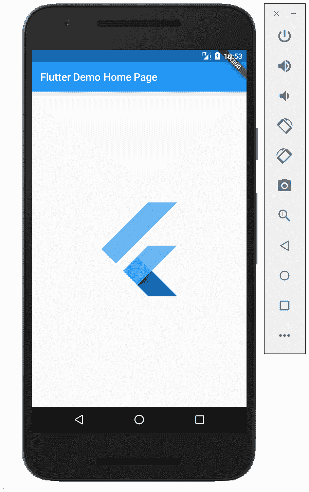
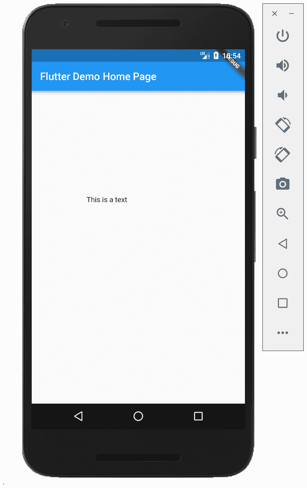
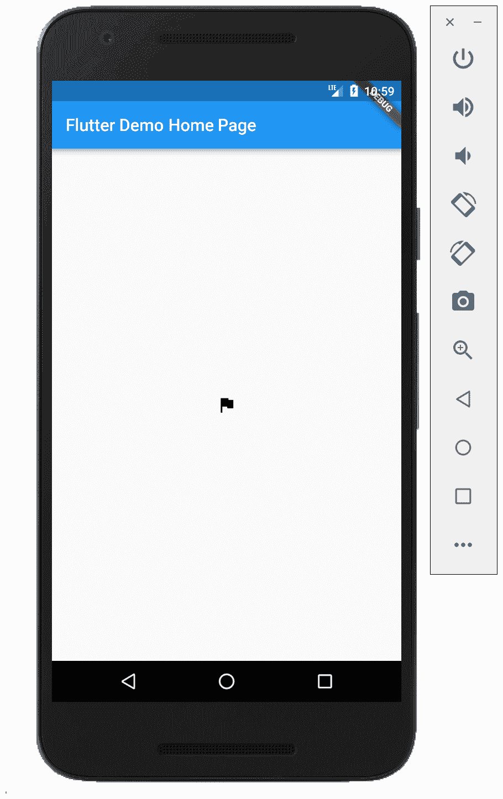
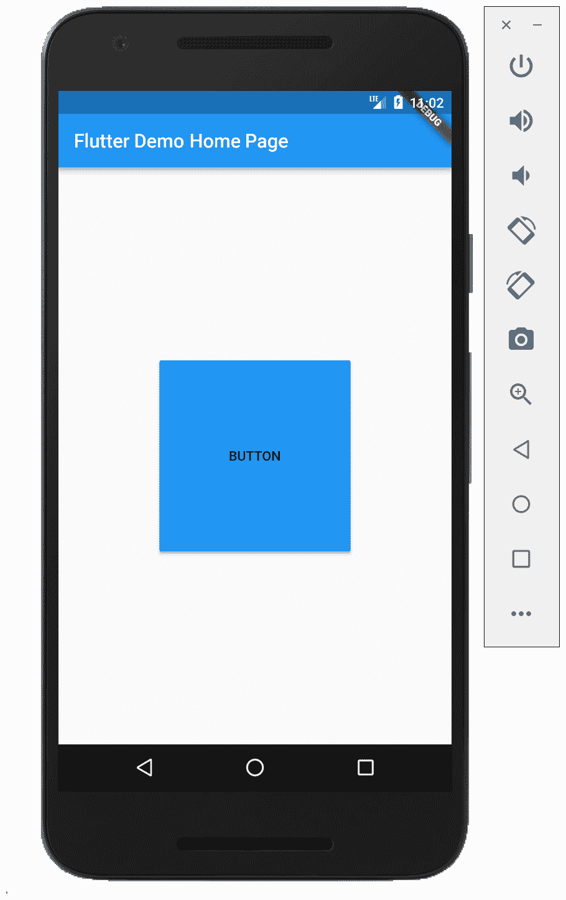
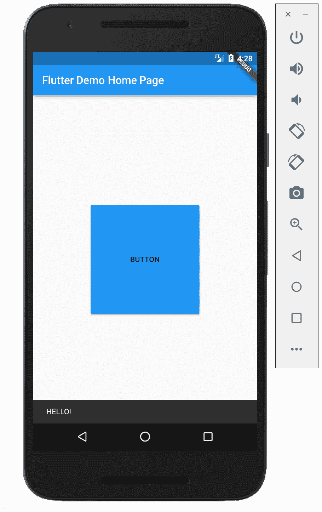
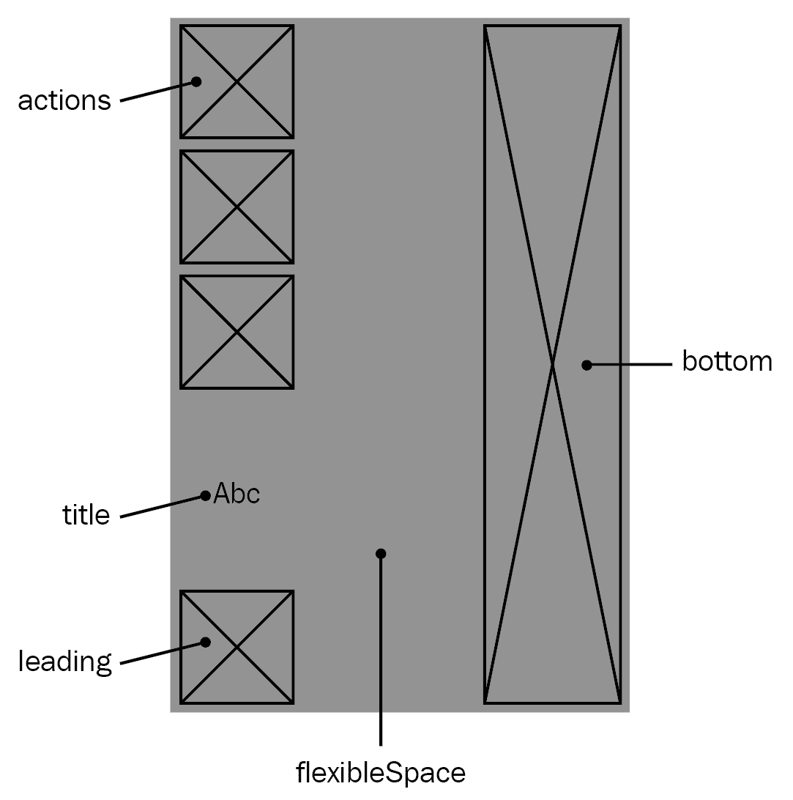
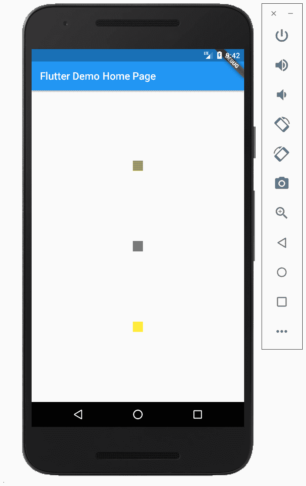
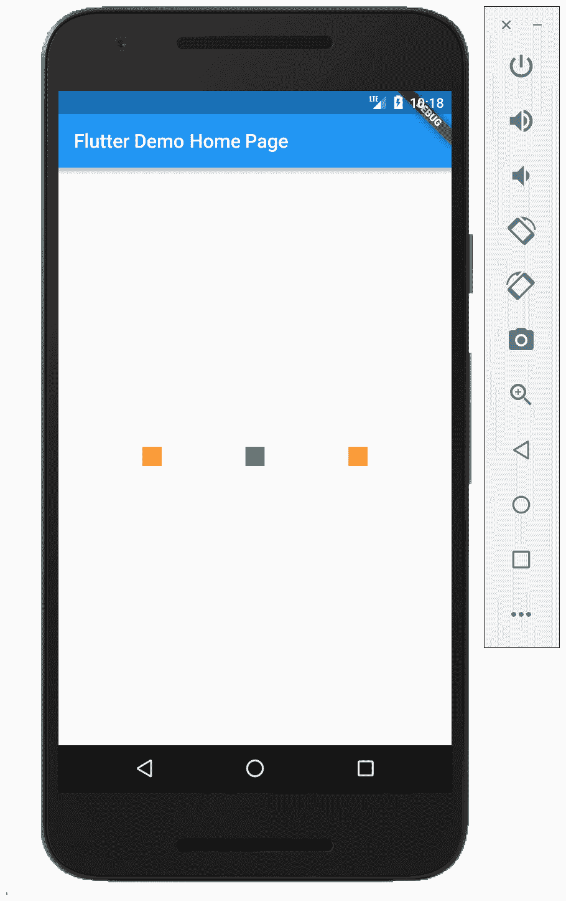
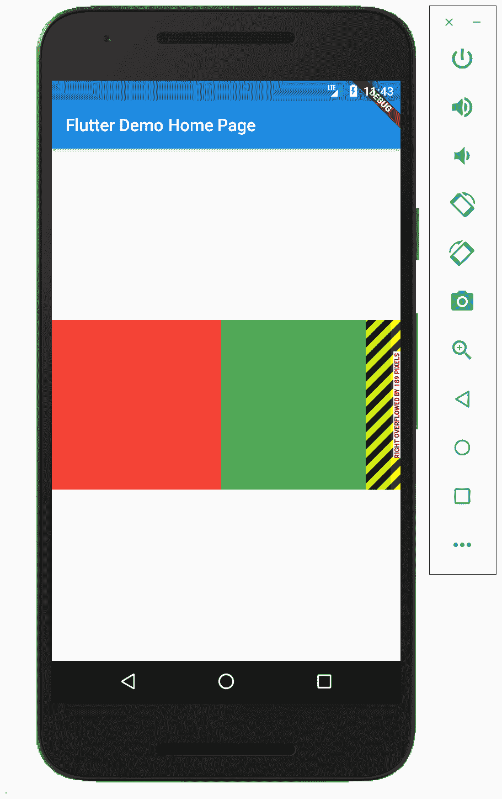

# 第三章：组件，无处不在的组件

在 Flutter 中，组件的概念非常重要。正如 第一章 中所述，*介绍 Flutter*，Flutter 中的所有内容都是一个组件。你可能会对组件有很多疑问，例如“组件的基本类型有哪些？”“我如何创建一个组件？”“有哪些好的组件示例？”等等。

在本章中，我们将一起探讨这些问题。我们首先将查看组件目录，了解将帮助你使用 Flutter 构建应用程序的基本组件。我们还将学习如何创建自定义组件，然后查看 Flutter 应用程序中路由和导航的概念。所有这些主题将在以下章节中介绍：

+   Widgets Catalog

+   创建组件

+   路由和导航

# Widgets Catalog

Flutter 团队构建了这个名为 **Widgets Catalog** 的非常好用的网站（[`flutter.io/widgets/`](https://flutter.io/widgets/))，在这里你可以探索 Flutter 中已经存在的各种组件，它们被按类别划分。你将在你的应用程序中使用很多这些组件，所以你对它们了解得越多，你就能在应用程序中使用得越高效。

然而，有一些基本的组件被列出，这将帮助你熟悉你在 Widgets Catalog 中将找到的组件类型。以下是一个这些组件的列表：

+   `Container`

+   `图片`

+   `Text`

+   `图标`

+   `RaisedButton`

+   `Scaffold`

+   `Appbar`

+   `PlaceHolder`

+   `Row`

+   `Column`

+   `ListView`

让我们逐一详细探索这些组件。

# 容器

这是目录中复杂组件之一。它用于在父组件中包含子组件，通过应用一些样式属性来实现。

容器使得应用各种功能成为可能，例如，设置背景颜色，在容器内对齐子组件，对子组件的大小设置一些约束，以及应用一些装饰或转换属性到子组件（例如，你可以旋转一个组件）。当我们查看你可以用这个组件做什么时，它可以被认为是一个复杂的组件。但在大多数情况下，我们只需要它的几个功能。

现在，让我们看看显示组件的代码。代码将如下所示：

```java
Center(
 child: Container(
   decoration: BoxDecoration(border: Border.all()),
    height: 200.0,
    width: 200.0,
  ),
),
```

将显示以下输出：


有时候，你需要根据条件表达式显示组件——例如，在这个例子中：

```java
function getIcon(bool condition) {
    if (condition == true) return Icon(Icons.edit);
    else return Container();  
 }
```

上述代码展示了容器条件表达式的示例。它的工作方式与大多数条件表达式类似，如果条件为真，你将得到你的常规组件。但如果条件为假，你将得到一个称为**null**组件的东西。

# 图片

在您的应用程序中显示图片是您必须拥有的一个功能。如今几乎没有应用程序缺少显示图片的功能。为此，图片小部件就派上用场了。我们可以使用以下代码来使用图片小部件：

```java
Center(
  child: Container(
    height: 200.0,
    width: 200.0,
    child: Image.network("https://flutter.io/images/flutter-mark-square-100.png"),
  ),
),
```

当您使用前面的代码时，将显示以下输出：



您可以探索它提供的几个构造函数，但我建议您根据您想要使用的源来尝试使用它们。例如，如果您有一个`imageProvider`，您将使用默认构造函数，但如果图片在`AssetBundle`中，您应该使用`Image.asset`构造函数。

这是一个显示图片的小部件，图片有几种不同的格式。以下是图像小部件支持的图像格式列表：

+   `JPEG`

+   `PNG`

+   `GIF`

+   `Animated GIF`

+   `WebP`

+   `Animated WebP`

+   `BMP`

+   `WBMP`

# `Text`

此小部件与上一个小部件一样简单易懂。它用于在屏幕上以单一样式显示文本。我们还可以在单行或多行上显示文本；这取决于布局约束。使用此小部件时的样式参数是可选的。如果没有提供样式参数，则小部件将使用包围的`DefaultTextStyle`的样式，如果提供的样式的`TextStyle.inherit`属性为 true，则给定样式将与默认样式合并。

以下代码可以用来使用文本小部件：

```java
Center(
  child: Container(
    height: 200.0,
    width: 200.0,
    child: Text("This is a text"),
  ),
),
```

以下截图将显示小部件在屏幕上的显示方式：



有时候您可能想要对这个文本小部件做更多的事情。例如，为了将多个样式（在行中显示一些粗体字）应用于文本，您可以使用`TextSpan.rich`构造函数，或者为了给文本添加交互性，您可以使用`GestureDetector`。

我建议使用`FlatButton`而不是文本小部件来进行交互。

# `Icon`

图标小部件用于使用`IconData`中描述的字体绘制图标，例如`Icon`类中预定义的材质`IconData`。

以下代码可以用来使用`Icon`小部件：

```java
Center(
  child: Container(
    height: 200.0,
    width: 200.0,
    child: Icon(Icons.flag),
  ),
),
```

以下截图显示了`Icon`小部件在屏幕上的外观：



就像文本小部件一样，我们也可以使用`Icon`小部件添加交互性。为此，我们可以使用`GestureDetector`。

# `RaisedButton`

此小部件用于显示一个简单的提升按钮。按钮是提升的，因为按钮基于一个材质小部件，当按钮被按下时，其提升会增加。如果`onPressed`回调为空，则按钮将被禁用，并且它将类似于`disabledColor`中的平面按钮。

以下代码可以用来使用`RaisedButton`小部件：

```java
Center(
  child: Container(
    height: 200.0,
    width: 200.0,
    child: RaisedButton(
      onPressed: () => print("on pressed"),
      child: Text("BUTTON"),
      color: Colors.blue,
    ),
  ),
),
```

当您使用前面的代码时，将显示以下截图：



建议使用`RaisedButton`在否则主要平坦的布局中添加维度。我建议不要在对话框或卡片中使用此类按钮。

# Scaffold

**Scaffold**是基于材料设计的基本布局结构。在实践中，如果你使用材料设计，你的应用中的每个屏幕都将有一个`Scaffold`作为其基础。`Scaffold`小部件通过提供 API 用于显示抽屉、snackbars、底部面板、浮动操作按钮等。要显示 snackbar 或底部面板，你必须使用`Scaffoldstate`当前上下文。我们可以通过`Scaffold.of`来使用它，并使用`ScaffoldState.showSnackbar`函数。

以下代码可以用于使用`Scaffold`显示`snackbar`：

```java
Center(
      child: Container(
        height: 200.0,
        width: 200.0,
        child: RaisedButton(
          onPressed: () {
            Scaffold.of(context).showSnackBar(SnackBar(
                  content: Text("HELLO!"),
                ));
          },
          child: Text("BUTTON"),
          color: Colors.blue,
        ),
      ),
    ), 
```

使用上述代码将显示以下输出：



# AppBar

`AppBar`基本上被用作`Scaffold`的一个属性，大多数`Scaffold`都有应用栏。应用栏由一个工具栏和可能的其他小部件组成。例如，它可以托管`TabBar`、`FlexibleSpaceBar`，或者可选地跟随`PopupMenuButton`以执行较少见的操作。

用于`AppBar`的属性是`Scaffold.appBar`。它看起来如下：



上述图表显示了`appBar`组件将放置每个小部件的位置。

如果省略了前导小部件，并且`Scaffold`有一个抽屉，那么`appBar`将放置一个按钮以打开抽屉。如果最近的导航器有任何之前的路由，将插入一个`BackButton`。

# PlaceHolder

`PlaceHolder`是另一个通过其名称解释自己的小部件。`PlaceHolder`小部件用于为小部件保留位置。它绘制一个表示稍后添加其他小部件的框。

以下代码可以用于`PlaceHolder`小部件：

```java
 Center(
      child: Container(
        height: 200.0,
        width: 200.0,
        child: Placeholder(),
      ),
    ),
```

上述代码将显示以下输出：


# Column

`Column`对于在 Flutter 应用中组合布局至关重要。它以垂直数组显示其子项。以下代码可以用于`Column`小部件：

```java
Center(
      child: Column(
        crossAxisAlignment: CrossAxisAlignment.center,
        mainAxisAlignment: MainAxisAlignment.spaceEvenly,
        children: <Widget>[
          Container(
            height: 20.0,
            width: 20.0,
            color: Colors.red,
          ),
          Container(
            height: 20.0,
            width: 20.0,
            color: Colors.green,
          ),
          Container(
            height: 20.0,
            width: 20.0,
            color: Colors.yellow,
          ),
        ],
      ),
    ),
```

将显示以下输出：



然而，`Column`小部件不支持滚动；为此，我们可以使用`ListView`。

注意，如果你在列中有更多的子项，而它们将适合可用的空间，系统会将其视为一个错误。这是因为列没有回收布局的能力。

# Row

`Row`小部件类似于`Column`小部件，但仍有不同。我们可以说是`column`的水平版本。它在水平数组中绘制子项。

以下代码可以用于`Row`小部件：

```java
enter(
      child: Row(
        crossAxisAlignment: CrossAxisAlignment.center,
        mainAxisAlignment: MainAxisAlignment.spaceEvenly,
        children: <Widget>[
Container(
            height: 20.0,
            width: 20.0,
            color: Colors.red,
          ),
          Container(
            height: 20.0,
            width: 20.0,
            color: Colors.green,
          ),
          Container(
            height: 20.0,
            width: 20.0,
            color: Colors.yellow,
          ),
        ],
      ),
    ),
```

将显示以下输出：



关于滚动的相关故事与`Column`小部件相同。如果你想要滚动子项，建议使用`ListView`。

# ListView

`ListView`的行为类似于列或行；唯一的区别是它的子项可以滚动。

`ListView`小部件有三个构造函数：

+   默认情况下，它在其子属性中接受小部件列表。这对于小列表来说是一个不错的选择，因为构建它时，列表将处理每个子项。

+   `ListView.builder`接受一个索引构建器，按需构建子项。如果你有很多子项，这是一个不错的选择，因为每次列表处理只有可见的子项。

+   `ListView.custom`接受`SliverChildDelegate`，它提供了自定义`ListView`更多方面的能力。

# 关于 Row、Column 和 ListView 的注意事项

有时，在构建放置在另一个行/列或任何未提供最大高度约束的场景中的行或列时，可能会在运行时遇到异常。

问题在于内部小部件应该填充所有剩余空间，但外部小部件没有特定的尺寸，也应该填充可用空间。因此，它们无法理解在哪里停止，然后抛出异常。

要解决这样的问题，你必须理解为什么内部列/行正在接收无界约束。考虑以下：

+   如果列/行被放置在另一个列/行中，你可以尝试将内部小部件包裹在一个 expanded 小部件中，表示它应该占用外部小部件的剩余空间，而不是它所希望的全部空间

+   如果小部件被放置在`Listview`中，并且被包裹在 expanded 或 flexible 中，那么关键是要移除那个包裹小部件，并手动设置内部小部件的尺寸

你可能还会遇到以下截图所示的黄色和黑色条纹横幅的问题：



这个横幅表明行或列超出了其大小。解决方案是使用`ListView`并让内容滚动，或者只是减少子项的大小。

# 创建小部件

我们在上一节中看到了许多小部件，但可能存在你找不到正确现成的你想要的小部件，或者你想要将更多小部件组合起来以创建一个可重用组的情况。因此，你必须创建一个自定义小部件。

在 Flutter 中，你可以使用两种类型的小部件来创建自己的自定义小部件：

+   无状态小部件

+   有状态小部件

让我们更详细地看看它们。

# 无状态小部件

**无状态小部件**即使在用户与之交互时也保持不变。这种小部件没有状态，因此它们不能根据内部状态改变。它们只能对更高层的小部件变化做出反应。

要构建无状态小部件，我们将扩展`StatelessWidget`抽象类，如下所示：

```java
class MyApp extends StatelessWidget {
  @override
  Widget build(BuildContext context) {
    return MaterialApp(
      title: 'Flutter Demo',
      theme: ThemeData(
        primarySwatch: Colors.blue,
      ),
      home: MyHomePage(title: 'Flutter Demo Home Page'),
    );
  }
}
```

# 有状态小部件

**有状态的组件**是具有内部状态以进行管理的动态组件。有状态的组件可以响应状态变化并相应地改变。状态存储在`State`对象中。要创建`StatefulWidget`，你必须扩展`StatefulWidget`抽象类，如下面的代码所示：

```java
class MyHomePage extends StatefulWidget {
  MyHomePage({Key key, this.title}) : super(key: key);
  final String title;

  @override
  _MyHomePageState createState() => new _MyHomePageState();
}
```

状态将是一个扩展了`State<T extends StatefulWidget>`抽象类的类。让我们看看一个示例，其中小部件根据其状态改变背景颜色。相应的代码如下：

```java
class _MyHomePageState extends State<MyHomePage> {
  bool value = false;

  @override
  Widget build(BuildContext context) {
    return new Scaffold(
      backgroundColor: value ? Colors.black : Colors.white,
      appBar: new AppBar(
        title: new Text(widget.title),
      ),
      body: Center(
        child: Switch(
            value: value,
            onChanged: (v) {
              setState(() {
                value = v;
              });
            }),
      ),
    );
  }
}
```

要触发框架重新构建小部件并应用更改，你必须调用`setState()`函数，否则它将看不到任何更改。

# 路由和导航

我们刚刚看了如何使用小部件，但你不会只使用一个小部件。在一个典型的应用程序中，通常会有多个屏幕。当应用程序有多个屏幕时，用户有一个清晰的路径来浏览这些页面变得非常重要，为此，在应用程序中通过路由和导航页面变得非常重要。

要做到这一点，如果你来自 Android 背景，你会使用更多的活动或片段，而在 iOS 中，你会创建新的`viewControllers`。

在 Flutter 的世界里，新屏幕是组件！要导航到新路由，我们可以使用`Navigator.push()`函数，将当前上下文和一个新的`MaterialPageRoute`作为参数传递：

```java
Within the `FirstScreen` Widget
 onPressed: () {
   Navigator.push(
     context,
     MaterialPageRoute(builder: (context) => SecondScreen()),
   );
 }
```

`SecondScreen`将是一个普通的小部件，用于构建屏幕。例如：

```java
class SecondScreen extends StatelessWidget {
   @override
   Widget build(BuildContext context) {
     return Scaffold(
       appBar: AppBar(
         title: Text("Second Screen"),
       ),
     );
   }
 }
```

要返回，我们将使用导航器的另一个函数：`Navigator.pop()`。此函数将从导航器管理的路由堆栈中删除当前路由。我们还可以使用此函数在浏览屏幕时向用户返回值。让我们在下一节中详细探讨这一点。

# 导航时返回值

在从一个屏幕切换到另一个屏幕时向读者返回值可以提高你应用程序的用户体验。例如，当打开应用程序时，屏幕上简单的`welcome`可以提高用户体验。为此目的，在 Flutter 中，我们有`Navigator.pop()`。

`Navigator.pop()`函数接受当前上下文作为参数，但它有一个可选的动态参数。这意味着在弹出屏幕时，你可以返回任何值。

查看一下`Navigator.push()`的返回值，你可以看到它返回一个`Future<dynamic>`。因此，在推送新屏幕时，你可以等待弹出的返回值。例如：

```java
function getConfirmation(BuildContext context) async {
  return await Navigator.push(context, MaterialPageRoute(
    builder: (context) => ConfirmationScreen(),
  ) ?? false;
}]
```

`ConfirmationScreen`将如下所示：

```java
class ConfirmationScreen extends StatelessWidget {
  Widget build(BuildContext context) => Scaffold(
    body: ButtonBar(
      children: <Widget>[
        RaisedButton(
          child: Text("OK"),
          onPressed: () => Navigator.pop(context, true),
        ),
        RaisedButton(
          child: Text("CANCEL"),
          onPressed: () => Navigator.pop(context, false),
        ),
      ],
    ),
  );
}
```

# 摘要

在本章中，我们浏览了小部件目录；这个目录包含了一些基本的小部件，我们可以在不构建自己的小部件的情况下立即在我们的应用程序中使用它们。了解这些基本小部件是很有好处的，因为你在你的应用程序中会大量使用它们。但有时你将需要定制化的小部件，为了帮助你，我们介绍了无状态和有状态的小部件，这将帮助你定制你的小部件。最后，我们学习了如何在这些小部件中进行导航和路由。

接下来是什么？你可以使用的更多小部件来构建你的应用程序。在下一章中，我们将看到一些可以用来构建美观布局的小部件。
