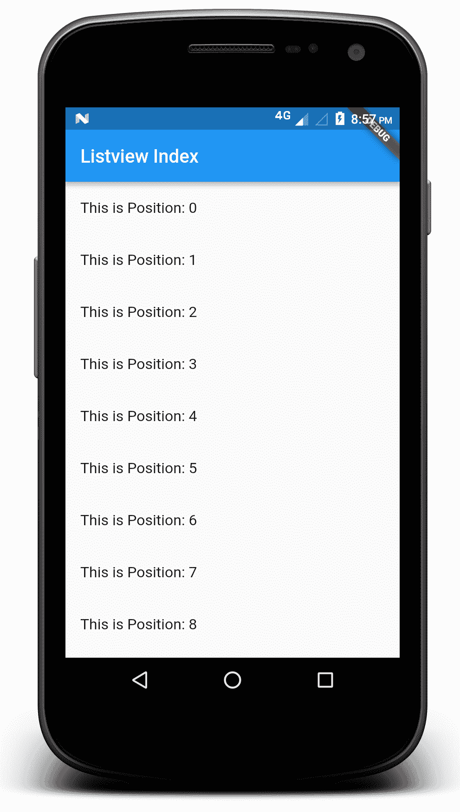
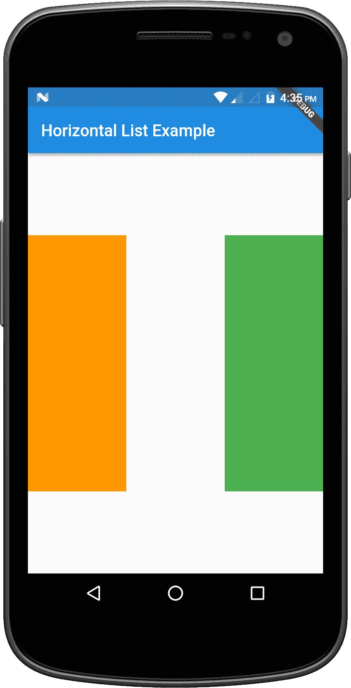
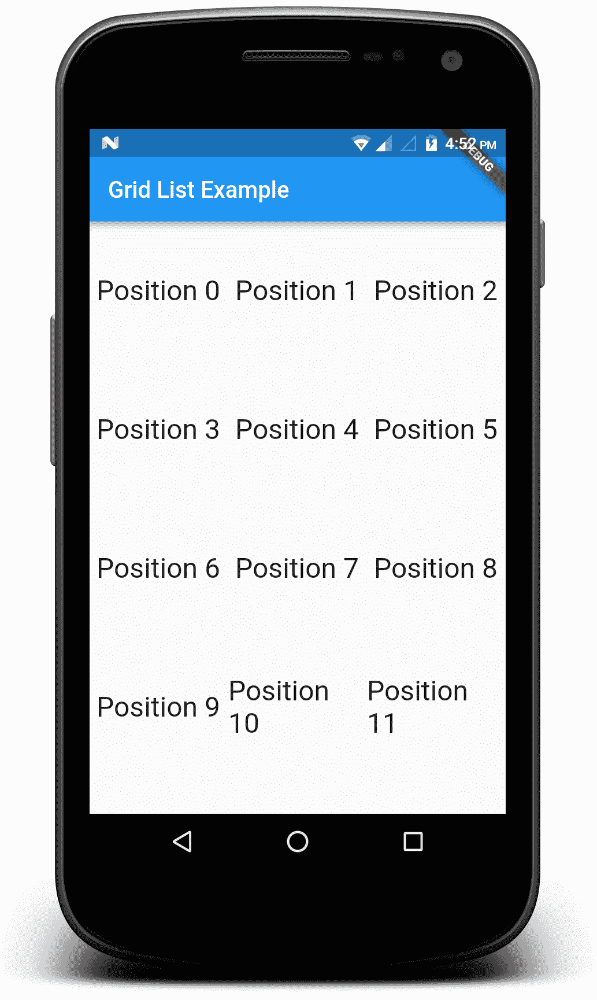

# 利用 Widgets 的多样性

在本章中，我们将首先了解 Flutter 中的约束以及它如何帮助您进行应用程序开发。然后，我们将简要介绍动画及其类别，并查看其中的常见模式。然后，我们将继续使用`ListView`和滚动小部件，最后简要介绍银色元素。所有这些主题将在以下章节中介绍：

+   Flutter 中的约束

+   在 Flutter 中引入动画

+   使用`ListView`和滚动小部件

+   引入银色元素

# Flutter 中的约束

Flutter 中的每个部件都是由一个`RenderBox`对象渲染的，该对象接受父级提供的约束并在这些约束内调整自身大小。

约束和大小之间的区别在于，前者给出了高度和宽度的最小值和最大值，而后者由特定的高度和宽度组成。

有三种类型的`RenderBox`，根据它们的行为区分如下：

+   那些试图尽可能大（`ListView`、居中等）的

+   那些试图与子项大小相同的

+   那些试图达到特定大小（图像、文本等）的

每条规则都有例外。

一些小部件的行为会根据它们的构造函数参数而变化。例如，容器小部件通常会尽可能大，但如果给它一个宽度（或高度），它会尝试达到那个特定的大小。

特定约束是无界的（或无限的）。在这种情况下，最大宽度或高度被设置为`double.INFINITY`。

尝试尽可能大的盒子在与无界约束一起使用时不会工作，并且框架将抛出异常。

这可能发生在弹性盒子（行/列）和可滚动区域（`ListView`和其他`ScrollView`子类）中。

约束可以是紧的。这意味着它不留给`RenderBox`对象选择大小的空间。一个例子是 App 小部件，它强制视图与屏幕大小相同。

弹性盒子（行和列）在有界或无界约束中的行为不同：

+   在有界约束中，它们会尝试在那个方向上尽可能大

+   在无界约束中，它们会尝试将子项适应那个方向

# 在 Flutter 中引入动画

动画是部件的一个重要特性。有时，开发者认为动画并不是很重要，但设计师知道一套好的动画可以吸引许多用户。它们还贡献于应用程序的外观和感觉，使其更具个性。

Flutter 具有出色的动画支持，使其轻松构建良好的效果和运动。许多小部件在其设计规范中带有标准运动效果，但您可以根据自己的需求进行自定义。

让我们看看动画类别，我们将看到 Flutter 中动画分为的两个类别，然后看看动画的常见模式。

# 动画类别

通常，动画分为两类：

+   **缓动动画**：简称 **in-betweening**。在这种情况下，我们定义开始和结束点、时间轴以及时间和速度的曲线。框架将完成其余的工作，计算过渡并执行它。

+   **基于物理的动画**：这类动画旨在代表现实世界的表现。

# 常见模式

作为用户，你可能已经注意到，大多数应用中经常使用某些类型的动画。这些类型的动画是动画中的常见模式。

在 Flutter 中，你可以找到三种常见模式：

+   **动画列表/网格**：在添加/删除元素时进行动画的简单列表或网格。

+   **共享元素过渡**：当在具有公共元素的两个页面之间导航时使用。例如，一个在一条路由中显示缩略图并在另一条路由中显示正常图片的图片。

+   **交错动画**：由一系列组成更大动画的动画序列。它们可以是顺序的或重叠的。

# 使用 ListView 和滚动组件

Flutter 支持多个滚动组件，例如 `Gridview`、`ListView` 和 `PageView`。列表是最常用的滚动组件，是一个可滚动的线性组件列表。它允许在滚动方向上依次显示其子组件。

# ListView

`ListView` 是一个可滚动的线性列表项，是最常用的组件之一。如果你在 Android 或 iOS 上工作过 `ListView`，这将非常直接。就像在所有情况下一样，`ListView` 会依次产生子列表项。构建 `ListView` 有几种方法，所以让我们逐一看看这些方法。

# 使用 List<Widget>

构建 `ListView` 最简单且最独立的方式是使用显式的 `List<Widget>` 子组件。这种方法适用于具有固定数量子组件的列表。看看下面的代码：

```kt
import 'package:flutter/material.dart';

void main() => runApp(MyApp());

class MyApp extends StatelessWidget {
  @override
  Widget build(BuildContext context) {
    final title = 'Travel Utilities';

    return MaterialApp(
      title: title,
      home: Scaffold(
        appBar: AppBar(
          title: Text(title),

        ),
        body: ListView(
          children: <Widget>[
            ListTile(
              leading: Icon(Icons.map),
              title: Text('Bookmarked Favorite Locations'),
            ),
            ListTile(
              leading: Icon(Icons.account_balance_wallet),
              title: Text('Expense Tracker'),
            ),
            ListTile(
              leading: Icon(Icons.photo_album),
              title: Text('Photo Album'),
            ),
            ListTile(
              leading: Icon(Icons.add_location),
              title: Text('Places To Visit Nearby'),
            ),
            ListTile(
              leading: Icon(Icons.audiotrack),
              title: Text('Podcast'),
            ),
            ListTile(
              leading: Icon(Icons.phone),
              title: Text('Emergency Contacts'),
            ),
            ],
            ),
    ),
    );
  }
}    
```

以下图像显示了运行上述代码后的预览效果：


# 使用 ListView.Builder

`ListView.builder` 构造函数需要 `IndexedWidgetBuilder`，这有助于开发者按需构建子列表项。这非常适合用于大量或无限数量的可见子项，与 `ListView` 构造函数不同。另一个区别是，在 `ListView` 的情况下，所有列表项必须首先定义，而在这种情况下，`ListView.builder` 构造函数将在列表项滚动到屏幕上时创建运行时。

定义 `ListView.builder` 简单直接，如下面的代码块所示：

```kt
ListView.builder(
  itemCount: 100,
  itemBuilder: (context, index) {
    return ListTile(
      title: Text("Index $index"),
    ); //ListTile 
  },
)//ListView.builder
```

使用前面的代码，你会看到一个`ListView`构造函数，它显示每个项目的索引，并附有粘合的文本。完整的代码如下：

```kt
import 'package:flutter/material.dart';

void main() => runApp(MyApp());

class MyApp extends StatelessWidget {
  @override
  Widget build(BuildContext context) {
    final title = 'ListView Index';

    return MaterialApp(
      title: title,
      home: Scaffold(
        appBar: AppBar(
          title: Text(title),
        ),
        body:

        ListView.builder(
          itemCount: 100,
          itemBuilder: (context, index) {
            return ListTile(
              title: Text("This is Position: $index"),
            ); //ListTile
          },    
        ) //ListView.builder
    ),//Scaffold
    );//MaterialApp
  }
}
```

运行代码后，应用将显示如下：



现在，我们可以添加一个数据源来工作。数据源可以是消息、搜索结果，或者你希望从中获取数据的互联网上的源。我们将使用`List<E>.generate`构造函数来生成值，如下定义：

```kt
List<L>.generate(int length,L generator(int index), {bool growable: true})
```

这将创建一个长度为`positions`的值列表，并用通过调用生成器为每个索引在 0 到长度-1 的范围内递增顺序创建的值填充它。创建的列表是固定的，除非将`growable`值设置为`true`。

下面是使用数据源生成`ListView`的完整代码示例：

```kt
import 'package:flutter/material.dart';

void main() {
  runApp(MyApp(
      items: List<String>.generate(100, (i) => "List Item $i"),
  ));
}

class MyApp extends StatelessWidget {
  final List<String> items;

  MyApp({Key key, @required this.items}) : super(key: key);

  Widget build(BuildContext context) {
    final title = 'ListView Index';

    return MaterialApp(
      title: title,
      home: Scaffold(
        appBar: AppBar(
          title: Text(title),

        ),
        body:

        ListView.builder(
          itemCount: 100,
          itemBuilder: (context, index) {
            return ListTile(
              title: Text('${items[index]}'),

        );//ListTile
 },
 )//ListView.builder
 ),//Scaffold
 );//MaterialApp
 }
}
```

前面代码的输出如下：


# 通过调用`ListView.separated`进行分隔的`ListView`

在之前的代码执行案例中，我们看到尽管`ListTiles`被列出，但它们之间没有分隔。为了在`ListTiles`之间创建分隔符，它还提供了一个辅助构造函数来创建`ListView`。这个构造函数是`ListView.separated`。这个分隔符由**分隔类**调用，以构建一个一设备像素厚的水平线，两侧都有填充。分隔符可以在列表、抽屉或独立内容中使用，垂直或水平使用，具体取决于`Axis`枚举的值，如下所示`ListView.separated`构造函数：

```kt
ListView.separated({
Key key,
Axis scrollDirection: Axis.vertical,
bool reverse: false,
ScrollController controller,
bool primary,
ScrollPhysics physics,
bool shrinkWrap: false,
EdgeInsetsGeometry padding,
@required IndexedWidgetBuilder itemBuilder,
@required IndexedWidgetBuilder separatorBuilder,
@required int itemCount,
bool addAutomaticKeepAlives: true,
bool addRepaintBoundaries: true,
bool addSemanticIndexes: true,
double cacheExtent
})
```

构造函数可以通过以下方式调用：

```kt
ListView.separated(   
itemCount: 25,   
separatorBuilder: (BuildContext context, int index) => Divider(),   
itemBuilder: (BuildContext context, int index) {     
return ListTile(      
title: Text('item $index'),     
);   
}, )
```

这构建了一个固定长度的可滚动线性数组，其中的列表项通过列表项`separators`分隔。`itemBuilder`回调将在索引大于或等于`0`且小于`itemCount`时被调用。分隔符在列表中的第一个项之后和最后一个项之前构建。`separatorBuilder`回调将在索引大于或等于`0`且小于`itemCount 1`时被调用。

下面是使用`ListView.separated`的`ListView`构造函数的示例：

```kt
import 'package:flutter/material.dart';

void main() {
  runApp(MyApp(
      items: List<String>.generate(100, (i) => "List Item $i"),
  ));
}

class MyApp extends StatelessWidget {
  final List<String> items;

  MyApp({Key key, @required this.items}) : super(key: key);

  Widget build(BuildContext context) {
    final title = 'ListView Index';

    return MaterialApp(
      title: title,
      home: Scaffold(
        appBar: AppBar(
          title: Text(title),

        ),
        body:

        ListView.separated(
          itemCount: 25,
          separatorBuilder: (BuildContext context, int index) => Divider(),
          itemBuilder: (BuildContext context, int index) {
            return ListTile(
              title: Text('${items[index]}'),
          );//ListTile
          },
        )//ListView.builder
    ),//Scaffold
    );//MaterialApp
  }
}
```

一旦运行前面的代码，你会看到带有分隔符的`ListView`。

# 使用`ListView.custom`构造函数

通过使用`SilverChildDelegate`，此方法提供了自定义子模型几个方面的能力，定义了它们构建的方式。为此所需的主要参数是`SliverChildDelegate`，它构建项目。`SliverChildDelegates`的类型如下：

+   `SliverChildListDelegate`

+   `SliverChildBuilderDelegate`

`SliverChildListDelegate`接受直接的孩子列表，而另一方面，`SliverChildBuiderDelegate`接受`IndexedWidgetBuilder`。看看`ListView.custom`构造函数：

```kt
const ListView.custom({
Key key,
Axis scrollDirection: Axis.vertical,
bool reverse: false,
ScrollController controller,
bool primary,
ScrollPhysics physics,
bool shrinkWrap: false,
EdgeInsetsGeometry padding,
double itemExtent,
@required SliverChildDelegate childrenDelegate,
double cacheExtent,
int semanticChildCount
}
)
```

# 水平列表

一旦你熟悉了垂直列表，水平列表就很简单了。在这种情况下，我们调用`ListView`构造函数，传递一个水平`scrollDirection`。这仅仅覆盖了默认的垂直方向。在这种情况下，我们使用了一个`Container`小部件，这是一个易于使用的组合了常见的绘制、定位和尺寸小部件的小部件。看看下面的代码：

```kt
import 'package:flutter/material.dart';

void main() => runApp(MyApp());

class MyApp extends StatelessWidget {
  @override
  Widget build(BuildContext context) {
    final title = 'Horizontal List Example';

    return MaterialApp(
      title: title,
      home: Scaffold(
        appBar: AppBar(
          title: Text(title),
        ),
        body: Container(
          margin: EdgeInsets.symmetric(vertical: 100.0),
          height: 300.0,
          child: ListView(
            scrollDirection: Axis.horizontal,
            children: <Widget>[
              Container(
                width: 120.0,
                color: Colors.orange,

              ),
              Container(
                width: 120.0,
                color: Colors.white,
              ),
              Container(
                width: 120.0,
                color: Colors.green,
              ),
              Container(
                width: 120.0,
                color: Colors.pink,
              ),
              Container(
                width: 120.0,
                color: Colors.lime,

            ), // Container
          ], // <Widget>[]
        ), //ListView
        ), //Container
 ), // Scaffold
 ); //MaterialApp
 }
  }
```

`ListView`的`scrollDirection: Axis.horizontal`属性确保列表可以水平滚动。一旦代码成功运行，你将看到以下结果：



# 网格列表

就像在水平列表的情况下，事件网格列表也很容易构建。它使用`GridView.count`构造函数，允许我们指定屏幕上需要多少行和列。在下面的例子中，我们构建了`100`个小部件，打印出它们的位置值：

```kt
import 'package:flutter/material.dart';

void main() {
  runApp(MyApp());
}

class MyApp extends StatelessWidget {
  @override
  Widget build(BuildContext context) {
    final title = 'Grid List Example';

    return MaterialApp(
      title: title,
      home: Scaffold(
        appBar: AppBar(
          title: Text(title),
        ),
        body: GridView.count(
          // Create a grid with 3 columns. 
          crossAxisCount: 3,
   // Generate 100 Widgets that display their positions in the List
          children: List.generate(100, (index) {
            return Center(
              child: Text(
                'Position $index',
                style: Theme.of(context).textTheme.headline,
            ), // Text
            ); //Center
          }), //List.Generate
        ), //GridView.count
      ), //Scaffold
    );   // MaterialApp
} 
}
```

上述代码将产生以下输出：



# 介绍 silvers

我们先看了看`ListView`，现在让我们快速了解一下什么是 silvers，通过从`ListView`中举一个简单的例子。如果你的布局设计得足够精美，那么视觉上会非常吸引人。这正是 silvers 能帮到你的地方。silvers 是可滚动区域的一部分，通过它你可以将自定义滚动引入你的视图。让我们以`ListView`为例来看一个简单的例子。如果一个应用栏保持静态，有时可能会遮挡视图，所以在这种情况下，可以使用 silvers 来隐藏应用栏，在你滚动时。

需要注意的一点是，所有的 silvers 组件都应该放在`CustomScrollView`内部。作为开发者，你可以将你的 silvers 列表组合起来，构建你自定义的可滚动区域。

# 摘要

在本章的开头，我们开始讨论 Flutter 中的约束。然后我们讨论了 Flutter 中的动画和动画形式。在下一节中，我们执行了一些不同类型列表的示例。在最后一节中，我们探讨了如何自定义动画部分。

在下一章中，我们将拓宽我们的 Flutter 视野，探讨 Flutter 中的网络和可访问性。
