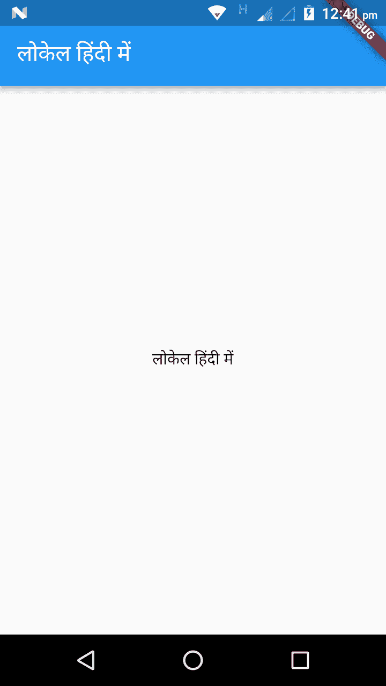

# 扩展 Flutter 视野

在本章中，我们将首先通过构建一个简单的应用程序来讨论 Flutter 中的网络，该应用程序使用 JSON 从服务器获取数据。每个应用程序都必须具备无障碍功能，以满足大量用户的需求，我们将在无障碍选项中介绍这一点。在最后一节中，我们将讨论本地化，以便您的应用程序在全球范围内增长，支持多种语言。

在本章中，我们将涵盖以下主题：

+   Flutter 中的网络

+   Flutter 中的无障碍功能

+   国际化 Flutter 应用程序

# Flutter 中的网络

网络是任何应用程序的骨架，了解如何进行网络调用至关重要。在 Flutter 中处理网络调用简单且遵循标准流程。Flutter 库和方法使开发者更容易构建具有网络功能的应用程序。本章将重点介绍制作网络请求。

# 使用包

与许多平台一样，Flutter 支持使用由开发者贡献给 Flutter 和 Dart 生态系统的共享包。这通过让开发者快速构建应用程序而不是担心从头开始编写代码来促进开发。一些最常用的包包括但不限于：进行网络请求（HTTP）；使用设备 API，例如设备信息（`device_info`）；查找信息并控制摄像头，包括对摄像头流和捕获图像的预览支持（camera）；使用 GPS 坐标查找和使用设备位置（geolocator）；以及使用第三方平台 SDK（如 Firebase）。您可以在[`pub.dartlang.org/packages`](https://pub.dartlang.org/packages)找到 Flutter 支持的完整包列表。

# 将现有包依赖项添加到应用程序中

一旦您确定要包含的包集，请按照以下步骤添加依赖项。为了本例的目的，我们选择了 HTTP 包添加到应用程序中。此包包含一组高级函数和类，可以帮助开发者在应用程序开发过程中消费 HTTP 资源，并且它是平台无关的。它支持命令行和浏览器：

1.  创建依赖项：打开位于您的应用程序文件夹内的`pubspec.yaml`文件，并在依赖项下添加`http:`。

    所有包都有一个版本号，在它们的`pubspec.yaml`文件中指定。包的当前版本显示在包名称旁边。当您提到`Plugin_Name_1:`时，它被解释为`Plugin_Name_1: any`。这表示可以使用包的任何版本。建议使用特定版本，以确保在更新时应用程序不会崩溃。

1.  安装已添加依赖的包。你可以通过运行`flutter packages get`命令来安装它。如果你使用 Android Studio/IntelliJ，你还可以点击`pubspecs.yaml`顶部的操作栏中的 Package Get 选项。如果你使用 VS code，请点击`pubspec.yaml`顶部操作栏右侧的 Get Packages。

1.  在你的 Dart 代码中包含相应的`import`语句。在这种情况下，是`import 'package:http/http.dart'`。如果你遗漏了任何内容，你总是可以在`Pub`上的包页面上的安装选项卡中进行交叉检查。

1.  在这一点上，最好停止并重新启动应用，以避免使用该包时出现`MissingPluginException`等错误。

# 升级现有包

当你在`pubspec.yaml`文件中添加了一个包后，第一次运行`flutter packages get`（在 IntelliJ 中将是`Packages Get`）时，Flutter 会保存`pubspec.lock`锁文件中找到的版本。要升级包，你可以运行 Flutter 包升级（在 IntelliJ 中是`Upgrade dependencies`）。使用此命令，Flutter 将检索包的最高可用版本。如果你在`pubspec.yaml`中指定了范围约束，它将根据约束的指定获取更新。

# 构建 REST 服务

对于开发者来说，最突出的任务之一是为项目构建 REST 服务，这些服务可以帮助你以 JSON 格式收集数据，你可以在应用的前端进行反映。想象一下你在开发一个应用，并想模拟一个 REST web 服务来获取你的演示数据。你当然可以使用 Node.js、MongoDB 或其他平台来构建后端服务器，但其中最简单的方法之一是使用 JSON 服务器。JSON 服务器是一个简单的项目，它通过 CRUD 操作模拟 REST API。这个项目几乎不需要设置时间，你可以快速处理数据以确保一切按预期工作。这对于学习构建 REST API 的开发者来说，了解数据如何通过后端进行原型设计和模拟处理是非常理想的。

# 设置 JSON 服务器

该项目的设置可以在[`github.com/typicode/json-server`](https://github.com/typicode/json-server)找到。请注意，此项目仅为了演示目的构建了一个完整的假 REST API。在我们开始设置之前，请确保以下组件已准备好在你的系统上：

1.  **Node.js**：JSON-Server 建立在 Node.js 之上。如果你已经安装了它，请确保保持其更新。要查看 Node 的版本，请运行`node -v`命令。

1.  **NPM 包**：NPM 代表 Node 包管理器，它便于轻松安装、更新、配置和卸载 Node JS 平台模块/包。确保系统上已安装 NPM。如果没有，请参考 [`www.npmjs.com/get-npm`](https://www.npmjs.com/get-npm)。在此阶段，引用 NPM 是一个独立于 Node 的项目，并且经常更新。要更新 NPM，请使用 `sudo npm install npm@latest -g` 命令。

1.  `cURL`：这是一个开源的命令行工具，它使用 URL 语法进行数据传输。如果你已经安装了 `cURL`，请使用 `curl -V` 命令（注意 `V` 是大写）。如果你需要安装 `cURL`，请运行 `brew install curl` 命令。

JSON 服务器作为一个 NPM 包提供，因此我们可以简单地运行以下命令来安装它：

```kt
$ npm install -g json-server
```

`-g` 选项使包能够在你的系统上全局安装。一旦安装成功，运行以下命令进行交叉检查：

```kt
$ json-server -v
```

# 构建资源文件

资源是与数据相关联的任何事物。例如，如果你正在制作一个电影评论网站，电影、评论者、用户等等，都是资源。你可以基于这些资源创建 API 端点。API 端点帮助你检索或更新服务器上的数据。在这种情况下，我们将使用资源作为 JSON 文件。这个 JSON 文件将作为你使用 `json-server` 设置的模拟服务器的配置和数据库文件。

`Json-server` 在 JSON 文件中工作，创建一个 JSON 文件很简单。创建一个新文件名为 `Books.json`，填充以下内容，并保存。注意，我们指定的数组名称是 `Movie`，因此 `json-server` 将基于此名称创建 REST API：

```kt
{
  "Movie": [
    {
      "id": 1,
      "Movie Name": "Avengers: Infinity War",
      "Year": "2018",
      "Category": "Science Fiction"
    },
    {
      "id": 2,
      "first_name": "Black Panther",
      "Year": "2018",
      "Category": "Science Fiction"
    },
    {
      "id": 3,
      "first_name": "Mission: Impossible – Fallout",
      "Year": "2018",
      "Category": "Action"
    },
    {
      "id": 4,
      "first_name": "Annihilation",
      "Year": "2018",
      "Category": "Fantasy"
    }
  ]
}
```

# 运行 json-server

最后一步是运行 `json-server` 以确保本地正在运行模拟服务器。运行以下命令：

```kt
$ json-server --watch db.json
```

恭喜！你现在已经成功设置了 `json-server`。打开 `http://localhost:3000/` URL 检查你是否能看到以下内容。在资源标签下，你将能够看到我们创建的 Movies JSON 文件。

不要关闭终端，因为这会杀死 `json-server`。如果你的端口 `3000` 被占用，你可以在 `json-server.json` 配置文件中设置新端口号的选项。

# 从服务器获取数据

从服务器获取数据是一个常用的功能。它使用我们在本章前面覆盖的 HTTP 包执行。要遵循的步骤如下：

1.  包含 HTTP 包并执行网络请求

1.  将响应转换为自定义 Dart 对象

1.  使用 Flutter 获取数据并显示

由于我们已经在*使用包*部分学习了如何添加 HTTP 包，我们现在将继续进行网络请求的制作。在下一步中，我们将使用 JSON-Server 和 `http.get()` 方法获取示例 JSON 内容。

我们使用 `Future` 函数，这是 Dart 的一个核心类，用于处理异步任务，并且与 `http` 一起使用可以返回成功的 `http` 调用的数据：

```kt
Future<http.Response> fetchPost() {
  return http.get('http://localhost:3000/Movie/1');
}
```

现在我们创建一个 `Post` 类，它将包含我们网络请求的数据。为了确保我们能够从 JSON 正确创建 `Post` 对象，我们将包括一个 `factory` 构造函数。在我们的示例中，我们为每个要获取的数组提供了四个数据类别，即 `id`、`movieName`、`year` 和 `category`：

```kt
class Post {
  final int id;
  final String movieName;
  final int year;
  final String category;

  Post({this.id, this.movieName, this.year, this.category});

  factory Post.fromJson(Map<String, dynamic> json) {
    return Post(
      id: json['id'],
      movieName: json['movieName'],
      year: json['year'],
      category: json['category'],
    );
  }
}
```

接下来，我们需要更新 `fetchPost` 函数以返回一个 `Future<Post>`，我们将遵循以下三个步骤：

1.  首先，使用 `dart:convert` 包将响应体转换为 JSON Map。这个包包含用于在不同数据表示之间转换的编码器和解码器。为了使用它，你首先必须在你的包的 `pubspec.yaml` 文件中添加依赖项：

```kt
dependencies: convert: ².1.1
```

现在，在你的 Dart 代码中使用 `package:convert/convert.dart` 导入。

1.  如果我们从服务器收到一个状态码为 `200` 的 `OK` 响应，这意味着数据已被获取，你可以使用 `fromJSON` 工厂将 JSON Map 转换为 `Post`。

1.  如果响应是意外的，你可以标记一个错误。

这里是检查之前提到的情况的代码片段：

```kt
Future<Post> fetchPost() async {
  final response =
  await http.get('http://localhost:3000/Movies/1');

  if (response.statusCode == 200) {
    // If the call to the server was successful, parse the JSON
    return Post.fromJson(json.decode(response.body));
  } else {
    // If that call was not successful, flag an error.
    throw Exception('Failed to load post');
  }
}

```

为了获取数据并显示它，我们使用 Flutter 内置的 `FutureBuilder` 小部件，它有助于轻松处理异步数据源。为了实现这一点，我们需要两个参数：

+   我们想要与之工作的未来的名称。在我们的示例中，我们称它为 `fetchPost()` 函数。

+   一个构建函数，它根据 Flutter 的状态（加载、成功或错误）告诉 Flutter 应该渲染什么：

```kt
FutureBuilder<Post>(
            future: post,
            builder: (context, snapshot) {
              if (snapshot.hasData) {
                return Text(snapshot.data.movieName);
              } else if (snapshot.hasError) {
                return Text("${snapshot.error}");
              }

              // By default, show a loading spinner
              return CircularProgressIndicator();
            },
);
```

通过在 `build()` 方法中调用 API 来构建代码是方便的，但并不推荐。这会使 Flutter 每次想要在视图中更改任何内容时都调用 `build()` 方法，这会导致你的应用因不必要的频繁 API 调用而变慢。更好的方法是，在页面最初加载时调用 API，并使用 `StatelessWidget`。

使用这种方法，你将使父级小部件负责调用获取方法，存储其结果，然后将它传递给你的小部件：

```kt
class MyApp extends StatelessWidget {
  final Future<Post> post;

  MyApp({Key key, this.post}) : super(key: key);
```

这是完整的代码，它将使用 `json-server` 通过读取 `Movies.json` 来获取 JSON 内容：

```kt
import 'dart:async';
import 'dart:convert';

import 'package:flutter/material.dart';
import 'package:http/http.dart' as http;

Future<Post> fetchPost() async {
  final response =
  await http.get('http://localhost:3000/Movies/1');

  if (response.statusCode == 200) {
    // If the call to the server was successful, parse the JSON
    return Post.fromJson(json.decode(response.body));
  } else {
    // If that call was not successful, throw an error.
    throw Exception('Failed to load post');
  }
}

class Post {
  final int id;
  final String movieName;
  final int year;
  final String category;

  Post({this.id, this.movieName, this.year, this.category});

  factory Post.fromJson(Map<String, dynamic> json) {
    return Post(
      id: json['id'],
      movieName: json['movieName'],
      year: json['year'],
      category: json['category'],
    );
  }
}

void main() => runApp(MyApp(post: fetchPost()));

class MyApp extends StatelessWidget {
  final Future<Post> post;

  MyApp({Key key, this.post}) : super(key: key);

  @override
  Widget build(BuildContext context) {
    return MaterialApp(
      title: 'JSON Fetch Data Example',
      theme: ThemeData(
        primarySwatch: Colors.blue,
      ),
      home: Scaffold(
        appBar: AppBar(
          title: Text('JSON Fetch Data Example'),
        ),
        body: Center(
          child: FutureBuilder<Post>(
            future: post,
            builder: (context, snapshot) {
              if (snapshot.hasData) {
                return Text(snapshot.data.movieName);
              } else if (snapshot.hasError) {
                return Text("${snapshot.error}");
              }

              // By default, show a loading spinner
              return CircularProgressIndicator();
            },
          ),
        ),
      ),
    );
  }
}
```

在本章的开头，我们讨论了包是什么以及如何使用它们。一旦包设置好，我们就讨论了如何构建 JSON Server 以获取测试数据。在最后一节，我们简要地看了一下如何将 JSON 数据获取到应用中，展示了我们创建并使用 JSON server 运行的 JSON 文件内容。

# Flutter 的可访问性

使您的应用对众多用户可访问可能是一个很好的举措。这也包括有残疾的人，如盲人、听力、语音或运动障碍。根据世界卫生组织关于残疾的报告，全球有超过一亿用户在日常生活中面临身体挑战。技术可以帮助人们实现革命性的变化，这就是当构建满足他们特定需求的应用程序时，可以很好地帮助他们的时候。

并非所有用户都以特定的方式使用应用程序，因此，关注可访问性不仅可以帮助用户下载和使用应用程序，而且还会传播到新的用户层面。

Google 提供了一个用于检查可访问性支持的应用程序，该应用程序作为 Google Play 上的可访问性扫描仪提供，网址为 [`play.google.com/store/apps/details?id=com.google.android.apps.accessibility.auditor`](https://play.google.com/store/apps/details?id=com.google.android.apps.accessibility.auditor)。此应用程序使您能够找到开发者可以在应用程序中实现的可访问性提供。对于 iOS，XCode 提供了可访问性检查器。

Flutter 支持三个用于可访问性支持的功能：

# 大字体

随着年龄的增长，很多人无法像年轻时那样看到内容。有些人阅读文本时遇到问题，尤其是当开发者考虑使用默认大小而没有考虑屏幕大小和方向等因素时。最快的方法之一是确保文本在可访问性选项中缩放时考虑消费者的设备规格。

Flutter 具有自动处理文本大小计算的特性。例如，`Text` 小部件有一个 `textScaleFactor` 属性，允许对文本进行缩放。字体大小通过乘以 `textScaleFactor` 值来确定在屏幕上渲染的新字体大小，该大小以逻辑像素为单位。例如，如果 `textScaleFactor` 是 `1.5`，文本将比指定的字体大小大 50%，如下所示：

```kt
Text(
  'Hello India, how are you?',
  textAlign: TextAlign.center,
  overflow: TextOverflow.ellipsis,
  style: TextStyle(fontWeight: FontWeight.normal),
  textScaleFactor: 1.5,
)
```

需要记住的一点是，如果您手动设置缩放值，用户的可访问性设置将被覆盖。您必须确保放大值不会导致文本过大，以至于用户会卸载应用程序。如果您没有指定值，它将检查最近的 `MediaQuery` 祖先（`MediaQueryData.textScaleFactor`）的 `textScaleFactor` 或 `1.0`，如果不存在这样的祖先。确保您在所有可访问性设置中测试文本是否正确显示。

# 屏幕阅读器

对于视力受损的用户，这个可访问性选项可能很有用。它使用户能够接收到关于屏幕内容的语音反馈。您可以在 iOS 中开启语音控制，或在您的设备上的 Android 应用程序中开启 TalkBack 来导航您的应用程序。例如，当使用 TalkBack 时，用户通过手势执行操作，每个操作都会伴随着可听到的输出，使用户知道他们的手势触发是成功的。TalkBack 有三种类型的手势：基本手势、往返手势和角度手势。请注意，用户应使用单一手势，即使是手指压力，以及稳定的速度，以获得无缝体验。

# 屏幕对比度

使用足够的颜色对比度指定背景和前景颜色，可以增强用户的可读性。此比率范围从 1 到 21，其中 21 表示最高。

W3C 推荐以下内容：

+   至少 4.5:1 的对比度用于较小的文本（小于 18 点常规字体，或 14 点粗体）

+   至少 3.0:1 的对比度用于较大的文本（18 点及以上常规字体，或 14 点及以上粗体）

可访问性是一个重要的功能，不应被忽视。它确保应用程序对更广泛的受众开放，增加了更好的应用程序使用机会。在向大众推出之前测试可访问性选项同样重要。

# 国际化 Flutter 应用

如其名所示，如果您的应用程序将由国际受众使用，您将需要考虑为特定语言提供 **区域** 支持。这意味着您需要以这种方式编写应用程序，以便应用程序根据应用程序支持的每种语言或区域渲染值，如文本和布局。Flutter 通过提供类和部件的支持使其变得简单。Flutter 支持 24 种语言的全球本地化类。

在开始国际化之前，必须在 `pubspec.yaml` 中添加依赖项：

```kt
dependencies:
  flutter:
    sdk: flutter
  flutter_localizations:
    sdk: flutter
```

下一步是导入 `flutter_localizations` 库，并为 `MaterialApp` 指定 `localizationsDelegates` 和 `supportedLocales`。同时，导入 `package:flutter_localizations/flutter_localizations.dart`：

```kt
Widget build(BuildContext context) {
  return MaterialApp(
    onGenerateTitle: (BuildContext context) => DemoLocalizations.of(context).title,
    localizationsDelegates: [

// ... app-specific localization delegate[s] here

      const DemoLocalizationsDelegate(),
      GlobalMaterialLocalizations.delegate,
      GlobalWidgetsLocalizations.delegate,
    ],
    supportedLocales: [
      const Locale('en', ''), //Supporting English
      const Locale('hi', ''), // Supporting Hindi
      const Locale('es', ''), // Supporting Spanish
    ],
```

`localizationsDelegates` 列表包含的是生产本地化值集合的工厂元素。`GlobalMaterialLocalizations.delegate` 提供了用于材料组件库的本地化字符串和其他值。小部件库的默认文本方向由 `GlobalWidgetsLocalizations.delegate`**定义**。

有三种方法需要关注：

+   `.load`：此方法必须返回一个包含相关资源集合的对象

+   `.isSupported`：如果找到对区域的支持，则返回 `True`。否则将返回 **`False`**

+   `shouldReload`：如果此方法返回 `True`，则在加载资源后，所有应用程序小部件都将被重建

以下是为您提供的完整代码：

```kt
import 'dart:async';

import 'package:flutter/material.dart';
import 'package:flutter/foundation.dart' show SynchronousFuture;
import 'package:flutter_localizations/flutter_localizations.dart';

class DemoLocalizations {
  DemoLocalizations(this.locale);

  final Locale locale;

  static DemoLocalizations of(BuildContext context) {
    return Localizations.of<DemoLocalizations>(context, DemoLocalizations);
  }

  static Map<String, Map<String, String>> _localizedValues = {
    'en': {
      'title': 'Locale in English',
    },
    'es': {
      'title': 'Local en españa',
    },
    'hi': {
      'title': 'लोकेल हिंदी में',
    },
  };

  String get title {
    return _localizedValues[locale.languageCode]['title'];
  }
}

class DemoLocalizationsDelegate extends LocalizationsDelegate<DemoLocalizations> {
  const DemoLocalizationsDelegate();

  @override
  bool isSupported(Locale locale) => ['en', 'es', 'hi'].contains(locale.languageCode);

  @override
  Future<DemoLocalizations> load(Locale locale) {
    // Returning a SynchronousFuture here because an async "load" operation
    // isn't needed to produce an instance of DemoLocalizations.
    return SynchronousFuture<DemoLocalizations>(DemoLocalizations(locale));
  }

  @override
  bool shouldReload(DemoLocalizationsDelegate old) => false;
}

class DemoApp extends StatelessWidget {
  @override
  Widget build(BuildContext context) {
    return Scaffold(
      appBar: AppBar(
        title: Text(DemoLocalizations.of(context).title),
      ),
      body: Center(
        child: Text(DemoLocalizations.of(context).title),
      ),
    );
  }
}

class Demo extends StatelessWidget {
  @override
  Widget build(BuildContext context) {
    return MaterialApp(
      onGenerateTitle: (BuildContext context) => DemoLocalizations.of(context).title,
      localizationsDelegates: [
        const DemoLocalizationsDelegate(),
        GlobalMaterialLocalizations.delegate,
        GlobalWidgetsLocalizations.delegate,
      ],
      supportedLocales: [
        const Locale('en', ''),
        const Locale('es', ''),
        const Locale('hi', ''),
      ],

      home: DemoApp(),
    );
  }
}

void main() {
  runApp(Demo());
}
```

在成功运行代码后，你将看到以下输出：



# 摘要

我们首先讨论了网络在应用程序中扮演的重要角色，以及设置和运行用于获取 JSON 代码的本地服务器的示例代码。这一部分之后，我们了解了为什么可访问性很重要，以及开发者可以为支持应用程序的可访问性提供哪些改进。下一节展示了如何使应用程序支持国际化。

在下一章中，我们将讨论如何使用平台功能来构建应用程序。
