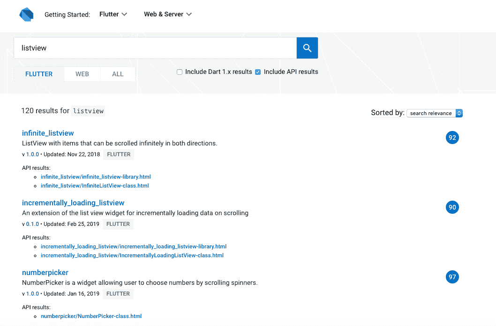
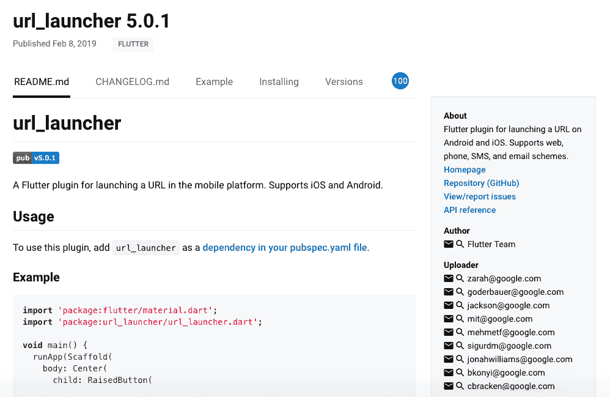
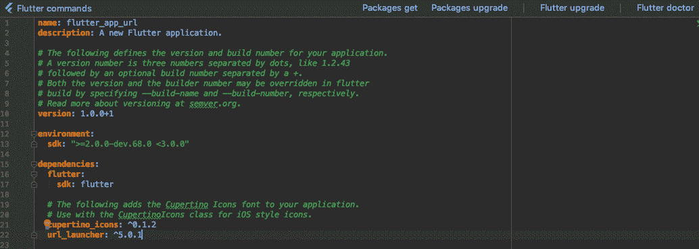
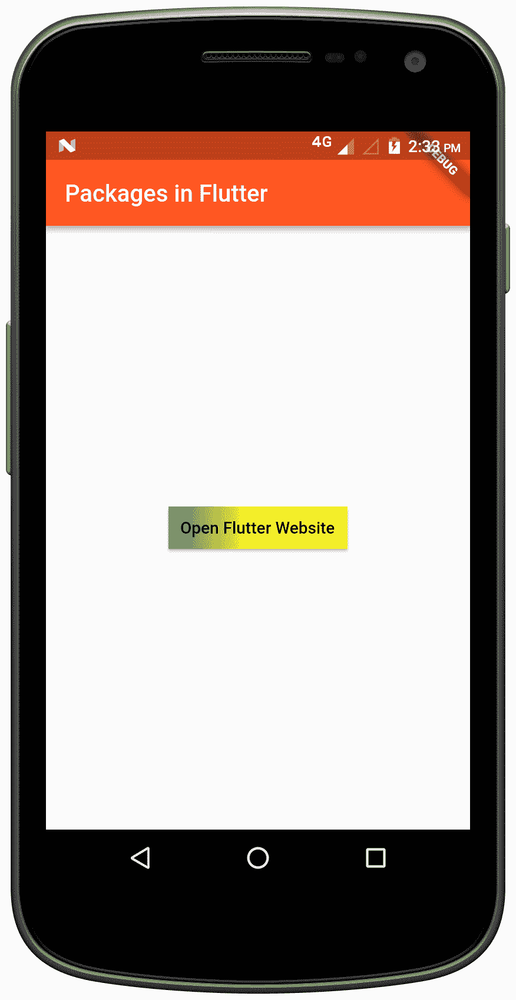
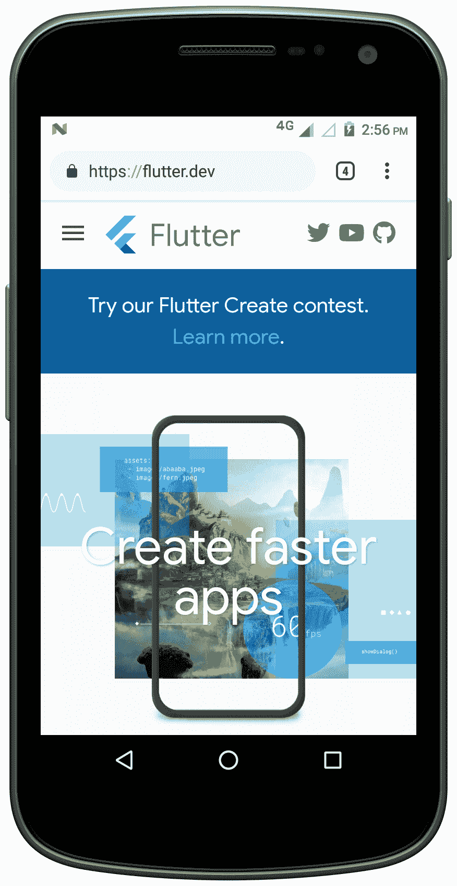
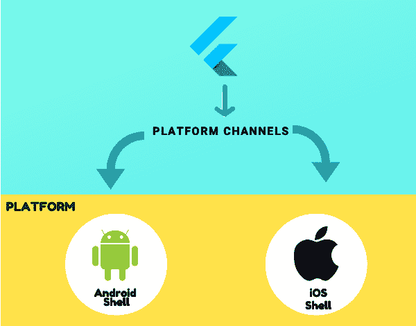
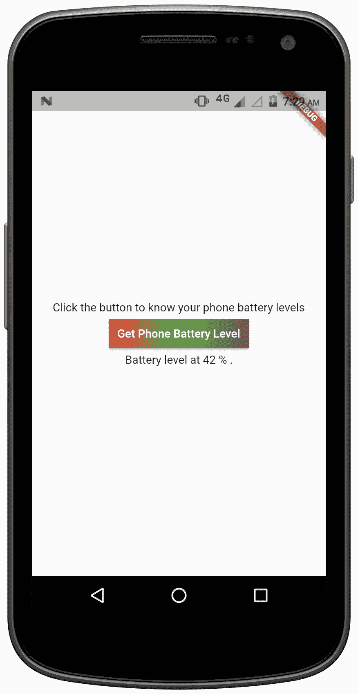

# 第六章：使用平台为 Flutter 应用提供动力

使用 Flutter，您可以同时为 Android 和 iOS 构建应用。它使用 Dart 编程语言来完成这一任务。然而，Dart 不会编译成 Android 的 Dalvik 字节码或 iOS 上的 Objective C 绑定。这表明 Dart 代码默认情况下没有直接访问平台特定 API 的能力。

在以下几组示例中，可能需要与宿主环境进行更深入的集成：

+   使用相机功能和地理标记功能的应用

+   读取设备信息，例如操作系统版本和设备规格

+   从设备读取文件夹和文件

+   向应用推送通知

+   与其他应用共享信息

+   位置跟踪

+   使用传感器

+   使用持久化首选项

根据环境提供的支持，列表将继续。使用 Flutter，启用调用平台特定 API 的功能，这些 API 在 Android 上的 Java/Kotlin 代码、iOS 上的 Objective C 或 Swift 中可用，并不是一个困难的任务。

在本章中，我们将学习如何包含包，然后学习如何进行平台特定的调用。我们将学习如何发布我们自己的插件。

我们将在本章中介绍以下主题：

+   使用 Flutter 包

+   使用平台通道

+   构建和发布您自己的插件

# 使用 Flutter 包

Flutter 的包网站列出了许多帮助我们快速开发应用的包，这些包避免了从头开始开发某些功能的需求。这些包要么是由 Flutter 团队贡献的，要么是由全球的开发者贡献给 Flutter 和 Dart 生态系统的。您可以通过访问发布网站（[`pub.dartlang.org/`](https://pub.dartlang.org/)）使用现有的包，或者您可以开发和发布自己的包。我们将在本章的“构建自己的包”部分学习如何构建自己的包。

# 搜索包

访问发布网站以搜索您在应用中想要使用的包。主页显示了一些开发者使用的流行包。您可以通过关键词搜索来显示结果。在选择插件之前，您可能想查看加权分数。搜索`email:@dartlang.org`或`email:flutter-dev@googlegroups.com`将给出官方 Flutter 包的结果：



点击任何结果项将打开包的扩展预览。在这种情况下，我们使用的是 url_launcher 包，这是一个由 Flutter 团队开发的官方 Dart 包。此插件用于在移动平台上启动 URL，如支持 Android 和 iOS 的 Web、电话、短信和电子邮件方案：



当你点击任何一个包时，你会看到插件的名称，以及它的最新版本和发布日期。随后，你会找到五个标签选项，具体如下：

+   `README.md`：关于插件的详细信息

+   `CHANGELOG.md`：关于此插件 Changelog 版本的信息，包括每个插件的详细信息

+   `Example`：演示如何使用插件

+   `安装`：显示设置插件的步骤

+   `版本`：显示插件的各个版本，以及以下选项：`版本`名称（例如 5.0.1*），* `上传`日期（例如 2019 年 2 月 8 日），`文档`，和`存档`

Flutter 插件支持在 Android 和 iOS 上启动 URL，包括 web、手机、SMS 和电子邮件方案。

# 将包依赖添加到应用程序中

一旦你决定了想要使用的包，你必须让程序依赖于它。在这种情况下，我们使用的是`url_launcher 5.0.1`包：

1.  打开位于你的`app`文件夹内的`pubspec.yaml`文件。

1.  查看包页面上的“安装”标签，你将有机会添加依赖项。在这个例子中，我们在依赖项下添加了`url_launcher: ⁵.0.1`。

1.  接下来，从终端运行以下命令，这将通过命令行安装包：

```kt
flutter packages get
```

如果你使用的是 Android Studio/IntelliJ 这样的编辑器，请点击`pubspec.yaml`顶部的“包获取”。在 VS code 的情况下，请点击`Pubspec**.**yaml`顶部的“**获取包**”：



1.  下一步是将相应的`import`片段添加到你的 Dart 代码中：

```kt
import 'package:url_launcher/url_launcher.dart';
```

如果你想要升级到包的新版本，请使用“包升级”选项。在包中有新功能可用且你希望将其包含到项目中时，可以使用此选项。在 IntelliJ 中，可以选择“升级依赖项”。

# 指定包依赖的方式

指定包依赖有两种方式。正如我们之前讨论的，包是通过使用缩写形式`plugin1:`添加到`pubspec.yaml`中的。这意味着**`plugin1:any_version`**。作为一个开发者，你总是可以查看`CHANGELOG.md`或包的最近版本来添加正确的值。为了确保应用程序不会崩溃，指定一个版本是至关重要的，这可以通过两种方式之一来完成：

1.  使用范围约束指定版本，如下所示，其中你指定最小和最大版本：

```kt
dependencies: 
url_launcher: '>=0.4.1 <5.0.1'
```

1.  使用`Carat Syntax`进行范围约束：

```kt
dependencies:
url_launcher: '⁵.0.1'
```

# 将代码添加到文件中

大多数包都提供了如何将包组件包含到代码中的见解。包的“示例”标签提供了关于代码执行的更多信息。在我们的例子中，我们使用一个梯度按钮来打开代码中指定的 URL：

```kt
import 'package:flutter/material.dart';
import 'package:url_launcher/url_launcher.dart';

void main() => runApp(MyApp());

class MyApp extends StatelessWidget {
  @override

  Widget build(BuildContext context) {
    return MaterialApp(
      title: 'Flutter Packages',
      theme: ThemeData(
        primarySwatch: Colors.deepOrange,
      ),
      home: MyStatelessWidget(),
    );
  }
}

class MyStatelessWidget extends StatelessWidget {
  MyStatelessWidget({Key key}) : super(key: key);

  @override
  Widget build(BuildContext context) {
    return Scaffold(
      appBar: AppBar(
        title: const Text('Packages in Flutter'),
      ),
      body: Center(
        child: Column(
          mainAxisSize: MainAxisSize.min,
          children: <Widget>[

            RaisedButton(
              onPressed: _initiateURL,
              textColor: Colors.black,
              padding: const EdgeInsets.all(0.0),
              child: Container(
                decoration: const BoxDecoration(
                  gradient: LinearGradient(
                    colors: <Color>[
                      Colors.green, Colors.yellow, Colors.yellowAccent],

                  ),
                ),

                padding: const EdgeInsets.all(10.0),
                child: Text('Open Flutter Website'),
              ),
            ),
          ],
        ),
      ),
    );

  }

  _initiateURL() async {
    const url = 'https://flutter.dev';
    if (await canLaunch(url)) {
      await launch(url);
    } else {
      throw 'Sorry, We could not launch the URL $url';
    }
  }

}
```

之前的代码允许用户简单地点击按钮并打开 Flutter Dev 官方网站。如您所注意到的，我们使用了`RaisedButton`小部件并指定了子属性，这使得我们能够为按钮提供渐变效果。`_initiateURL()`方法有一个启动函数，它接受定义的 URL 并解析指定的 URL。它还将处理委托给底层系统：



一旦您成功执行了代码并点击了按钮， 打开 Flutter 网站 将打开参数中指定的 URL。您将在手机的默认浏览器上看到结果，如下所示：



# 使用平台通道

如本章开头所述，Flutter 是一个跨平台框架，为了访问原生 API，您必须访问原生平台函数。在 Flutter 的情况下，它是通过创建到原生平台的平台通道来实现的。使用这些平台通道，开发者可以调用诸如设备信息、文件和文件夹访问、传感器访问、摄像头、共享首选项等原生函数。

如以下截图所示，平台通道可以简单地想象成 Flutter 中的 Dart 代码和宿主应用特定平台代码之间的通信机制。这确保了宿主服务可以通过 Flutter 的 Dart 代码被调用：



在这一点上，值得注意的是，您必须为每个平台设置一个平台通道。在 Android 的情况下，它们被称为`MethodChannels`，而在 iOS 中，它们被称为`FlutterMethodChannels`**。 **

在这一点上，了解平台数据类型支持和编解码器非常重要。标准平台通道采用支持高效二进制序列化的标准消息编解码器。它们看起来像 JSON。当您向它们发送和接收值时，序列化和反序列化会自动发生。

Google 的 Flutter 团队列出了以下表格（来源：[`flutter.dev/docs/development/platform-integration/platform-channels`](https://flutter.dev/docs/development/platform-integration/platform-channels)），展示了 Dart 值在宿主平台侧的接收方式，反之亦然：

| **Dart** | **Android** | **                                           iOS** |
| --- | --- | --- |
| `null` | `null` |                       `nil`（嵌套时为 NSNull） |
| `bool` | `java.lang.Boolean` | `NSNumber numberWithBool:` |
| `int` | `java.lang.Integer` | `NSNumber numberWithInt:` |
| `int`，`if 32 bits`，`not enough` | `java.lang.Long` | `NSNumber numberWithLong:` |
| `double` | `java.lang.Double` | `NSNumber numberWithDouble:` |
| `String` | `java.lang.String` | `NSString` |
| `Uint8List` | `byte[]` | `FlutterStandardTypedData typedDataWithBytes:` |
| `Int32List` | `int[]` | `FlutterStandardTypedData typedDataWithInt32:` |
| `Int64List` | `long[]` | `FlutterStandardTypedData typedDataWithInt64:` |
| `Float64List` | `double[]` | `FlutterStandardTypedData typedDataWithFloat64:` |
| `List` | `java.util.ArrayList` | `NSArray` |
| `Map` | `java.util.HashMap` | `NSDictionary` |

在以下示例中，我们将学习如何在 Android 中使用平台通道来计算 Android 手机的电池百分比，使用 Android 的 `BatteryManager` API。您可以在以下链接中了解更多关于 API 的信息：[`developer.android.com/reference/android/os/BatteryManager`](https://developer.android.com/reference/android/os/BatteryManager)

# 创建一个新的 Flutter 项目

请创建一个新的 Flutter 项目。确保 Android SDK 路径已正确设置并包含在项目设置中。

# 创建 Flutter 平台客户端

为了理解电池级别，可以编写 Android 代码并将其传递到 Dart 代码。应用程序的状态类持有应用程序的当前状态，我们需要扩展它以确保捕获当前的电池状态。

因此，我们将使用 `MethodChannel` 作为包含单个平台方法的通道，该方法将返回 Android 手机的电池级别。客户端和主机端通过传递给通道构造函数的唯一通道名称进行通信。在我们的案例中，我们将其命名为 `call.flutter.io/battery`：

```kt
import 'dart:async';
import 'package:flutter/material.dart';
import 'package:flutter/services.dart';

...
class _MyHomePageState extends State<MyHomePage> {
  static const platform = const MethodChannel('call.flutter.io/battery');

  // Get Android battery level.
}
```

下一步是调用方法通道上的方法，我们将使用返回的结果（电池级别）来更新 `setState` 内的值：

```kt
String _batteryLevel = 'Battery Levels are Unknown';

Future<void> _getPhoneBatteryLevel() async {
  String batteryLevel;
  try {
    final int result = await platform.invokeMethod('getBatteryLevel');
    batteryLevel = 'Battery level at $result % .';
  } on PlatformException catch (e) {
    batteryLevel = "Failed to get battery level: '${e.message}'.";
  }

  setState(() {
    _batteryLevel = _getBatteryLevel() asyncbatteryLevel;
  });
}
```

最后，将构建方法替换为具有动作 `onPressed` 的 `Button`，其结果将作为 `Text` 值显示电池级别。

完整的 `Main.Dart` 代码如下所示：

```kt
import 'package:flutter/material.dart';
import 'package:flutter/services.dart';

import 'dart:async';

void main() => runApp(MyApp());

class MyApp extends StatelessWidget {
  @override
  Widget build(BuildContext context) {
    return MaterialApp(
      title: 'Flutter Platform Channel API',
      theme: ThemeData(

        primarySwatch: Colors.yellow,
      ),

      home: MyHomePage(title: 'Flutter Platform Channel API'),
    );
  }
}

class MyHomePage extends StatefulWidget {
  MyHomePage({Key key, this.title}) : super(key: key);

  final String title;

  @override
  _MyHomePageState createState() => _MyHomePageState();
}

class _MyHomePageState extends State<MyHomePage> {

  static const platform = const MethodChannel('call.flutter.io/battery');
  String _batteryLevel = 'Battery Levels are Unknown';

  Future<void> _getPhoneBatteryLevel() async {
    String batteryLevel;
    try {
     final int result = await platform.invokeMethod('getBatteryLevel');
      batteryLevel = 'Battery level at $result % .';
    } on PlatformException catch (e) {
      batteryLevel = "Failed to get battery level: '${e.message}'.";
    }

    setState(() {
      _batteryLevel = batteryLevel;
    });
  }

  @override
  Widget build(BuildContext context) {
    return Material(
      child: Center(
        child: Column(
          mainAxisAlignment: MainAxisAlignment.center,
          children: [   

            Text ("Click the button to know your phone battery levels"),
            RaisedButton(
              child: Container(
                decoration: const BoxDecoration(
                  gradient: LinearGradient(
                    colors: <Color>[Colors.red, Colors.green, Colors.brown],
                  ),
                ),
                padding: const EdgeInsets.all(10.0),
                child: Text('Get Phone Battery Level'),
              ),
              onPressed: _getPhoneBatteryLevel,
              textColor: Colors.white,
              padding: const EdgeInsets.all(0.0),

            ),
            Text(_batteryLevel),

          ],
        ),
      ),
    );
  }
}
```

接下来，我们将对 Android 代码进行修改。

# 修改 `MainActivity.java` 文件

导航到项目中的 Android 文件夹，并在项目视图中找到 Java 文件夹中的 `MainActivity.java` 文件。接下来，在这个文件中的 `onCreate` 方法内，我们创建一个 `MethodChannel` 并在其中设置一个 `MethodCallHandler`。请注意，使用的通道名称应与 Flutter 客户端侧相同，正如我们的案例：`call.flutter.io/battery`。

包含以下导入：

```kt
package androcid.flutterapp1;

import android.os.Bundle;
import io.flutter.app.FlutterActivity;
import io.flutter.plugins.GeneratedPluginRegistrant;
import io.flutter.plugin.common.MethodCall;
import io.flutter.plugin.common.MethodChannel;
import io.flutter.plugin.common.MethodChannel.MethodCallHandler;
import io.flutter.plugin.common.MethodChannel.Result;

import android.content.ContextWrapper;
import android.content.Intent;
import android.content.IntentFilter;
import android.os.BatteryManager;
import android.os.Build.VERSION;
import android.os.Build.VERSION_CODES;
```

接下来，创建一个 `String` 来保存通道名称：

```kt
private static final String CHANNEL = "call.flutter.io/battery";
```

最后，添加 `MethodChannel` 方法：

```kt
new MethodChannel(getFlutterView(), CHANNEL).setMethodCallHandler(
                new MethodCallHandler() {
                    @Override
               public void onMethodCall(MethodCall call, Result result) {
                        // TODO
                    }
                }); 
```

在下一步中，我们必须编写 Android 的 `onCreate` 方法：

```kt
private int getBatteryLevel() {
    int phoneBatteryLevel = -1;
    if (VERSION.SDK_INT >= VERSION_CODES.LOLLIPOP) {
      BatteryManager batteryManager = (BatteryManager) getSystemService(BATTERY_SERVICE);
      phoneBatteryLevel = batteryManager.getIntProperty(BatteryManager.BATTERY_PROPERTY_CAPACITY);
    } else {
      Intent intent = new ContextWrapper(getApplicationContext()).
              registerReceiver(null, new IntentFilter(Intent.ACTION_BATTERY_CHANGED));
      phoneBatteryLevel = (intent.getIntExtra(BatteryManager.EXTRA_LEVEL, -1) * 100) /
              intent.getIntExtra(BatteryManager.EXTRA_SCALE, -1);
    }

    return phoneBatteryLevel;
  }
}
```

要使用 `BatteryManager`，最低 API 级别为 21，因此我们使用 `VERSION_CODES.LOLLIPOP`。

我们的最后一步是完成之前添加的 `onMethodCall` 方法。使用单个平台方法 `getbatteryLevel`，您可以简单地调用之前步骤中编写的 Android 代码，并使用响应参数在成功和错误情况下返回响应，如下所示：

```kt
protected void onCreate(Bundle savedInstanceState) {
  super.onCreate(savedInstanceState);
  GeneratedPluginRegistrant.registerWith(this);
  new MethodChannel(getFlutterView(), CHANNEL).setMethodCallHandler(
          new MethodCallHandler() {
            @Override
            public void onMethodCall(MethodCall call, Result result) {

                if (call.method.equals("getBatteryLevel")) {
                  int batteryLevel = getBatteryLevel();

                  if (batteryLevel != -1) {
                    result.success(batteryLevel);
                  } else {
              result.error("Currently unavailable", "Battery level not 
              available currently.", null);
                  }
                } else {
                  result.notImplemented();
                }

            }
          });
}
```

以下为完整的 Android 代码：

```kt
package androcid.flutterapp1;

import android.os.Bundle;
import io.flutter.app.FlutterActivity;
import io.flutter.plugins.GeneratedPluginRegistrant;
import io.flutter.plugin.common.MethodCall;
import io.flutter.plugin.common.MethodChannel;
import io.flutter.plugin.common.MethodChannel.MethodCallHandler;
import io.flutter.plugin.common.MethodChannel.Result;
import android.content.ContextWrapper;
import android.content.Intent;
import android.content.IntentFilter;
import android.os.BatteryManager;
import android.os.Build.VERSION;
import android.os.Build.VERSION_CODES;

public class MainActivity extends FlutterActivity {
  private static final String CHANNEL = "call.flutter.io/battery";
  @Override

  protected void onCreate(Bundle savedInstanceState) {
    super.onCreate(savedInstanceState);
    GeneratedPluginRegistrant.registerWith(this);
    new MethodChannel(getFlutterView(), CHANNEL).setMethodCallHandler(
            new MethodCallHandler() {
              @Override
              public void onMethodCall(MethodCall call, Result result) {

                  if (call.method.equals("getBatteryLevel")) {
                    int batteryLevel = getBatteryLevel();

                    if (batteryLevel != -1) {
                      result.success(batteryLevel);
                    } else {
                result.error("Currently unavailable", "Battery level not available currently.", null);
                    }
                  } else {
                    result.notImplemented();
                  }

              }
            });
  }

  private int getBatteryLevel() {
    int phoneBatteryLevel = -1;
    if (VERSION.SDK_INT >= VERSION_CODES.LOLLIPOP) {
      BatteryManager batteryManager = (BatteryManager) getSystemService(BATTERY_SERVICE);
      phoneBatteryLevel = batteryManager.getIntProperty(BatteryManager.BATTERY_PROPERTY_CAPACITY);
    } else {
      Intent intent = new ContextWrapper(getApplicationContext()).
              registerReceiver(null, new IntentFilter(Intent.ACTION_BATTERY_CHANGED));
      phoneBatteryLevel = (intent.getIntExtra(BatteryManager.EXTRA_LEVEL, -1) * 100) /
              intent.getIntExtra(BatteryManager.EXTRA_SCALE, -1);
    }

    return phoneBatteryLevel;
  }
}
```

代码运行成功后，您将看到以下输出：


当点击按钮时，手机的电池电量将被显示：



# 构建和发布你自己的插件

插件在 Flutter 生态系统中扮演着重要的角色。谷歌开发者和开源贡献者已经为几个发布的插件做出了贡献。我们在 第五章，*拓宽我们的 Flutter 视野*中，展示了如何在代码中包含插件。当构建插件时，以下是一些需要记住的技巧：

1.  **检查现有插件的可用性**：在你从头开始编码之前，查看是否有现有的插件以相同或类似的方式工作。

1.  **考虑 Dart**：由于 Flutter 代码是用 Dart 编写的，因此如果主要的逻辑是用 Dart 编写的，这将是非常理想的，这不仅使得导航变得容易，而且跨平台处理代码也更加容易。

1.  **避免构建仅支持特定平台的插件**：开发者可能会被诱惑开始构建一个包含他们可能需要的所有功能的插件，但只考虑单一平台可能不是一个好主意。这不仅会让用户对其在特定平台上的用例感到困惑，还可能导致应用以意想不到的方式运行。

1.  **避免构建特定平台的 API 方法**：作为开发者，你可能会被诱惑构建一个特定平台的函数，但这可能会导致过度设计。尝试将特定平台的逻辑包含在插件本身中。

1.  **为功能而构建**：确保你计划构建的插件具有特定的用例，提供功能，而不仅仅是调用现有的 API。使用现有的本地库没有问题，但问题在于这些 API 在不同平台之间可能无法按预期工作。更多地关注功能而不是 API 可能有助于你构建更好的插件。

1.  **详细说明功能和安装**：当你的插件发布时，通过提供更多关于插件功能和如何无缝将其包含在他们的代码中的详细信息来支持社区。插件的可视性很重要，因为如果社区喜欢这个插件，他们会对插件进行更高的评分，从而增加其可见性。使用示例，以确保在包含你的插件时没有问题。

要发布你自己的插件，请使用以下命令：

```kt
flutter packages pub publish --dry-run
```

如果执行过程中没有错误，你可以执行以下命令来发布插件，你的插件将在几分钟内上线：

```kt
flutter packages pub publish

```

# 摘要

在本章的开头，我们学习了如何在 Flutter 代码中包含包，接着是如何包含特定平台的通道以支持 Flutter 代码。我们还使用了 `BatteryManager` API 来了解安卓手机的电池状态。在最后一节中，我们介绍了一些构建你自己的插件时应该考虑的最佳技巧，随后是发布你自己的插件的方法。

在下一章中，我们将探讨如何使用 **Firebase** 与 Flutter 结合。
