# 第七章：Firebase - Flutter 的最佳伙伴

使用**Firebase**构建应用是世界上增长最快的科技趋势之一。使用 Firebase，开发者可以快速构建应用，无需管理基础设施，包括身份验证、存储和同步数据、安全托管 Web 资产和云存储。Firebase 有一个免费的基础计划，提供 1 GB 的存储空间和 100 个并发连接。如果您想升级，您可以在此查看计划：[`firebase.google.com/pricing/`](https://firebase.google.com/pricing/)。

在本章中，我们将涵盖以下主题：

+   与 Firebase 连接

+   创建 Cloud Firestore 数据库

+   Firebase 云消息传递

+   Firebase 远程配置

# 与 Firebase 连接

首先，让我们看看如何连接到 Firebase。我们首先需要确保与 Firebase 的连接是否正确建立；为此，请按照以下步骤操作：

1.  在您的 IDE 或编辑器中创建一个新的 Flutter 项目

1.  打开`pubspec.yaml`文件

1.  添加以下依赖项：

```kt
dependencies:
  flutter:
    sdk: flutter

  cloud_firestore: ⁰.9.5+2  //Add this line
```

有关 Flutter Cloud Firestore 插件的最新版本详情，请访问 Pub 网站：[`pub.dartlang.org/packages/cloud_firestore`](https://pub.dartlang.org/packages/cloud_firestore)。

1.  接下来，为了建立连接，在您的 IDE 或使用命令行运行以下命令：

```kt
flutter packages get
```

# 创建 Firebase 项目

一旦建立连接，下一步就是创建一个 Firebase 项目。那么，让我们开始吧。按照以下步骤创建您的项目：

1.  打开网站[`firebase.google.com`](https://firebase.google.com)并登录或注册。您可以使用您的 Google 凭证在此处登录。

1.  接下来，点击添加项目。

1.  一旦点击此选项，您将看到以下屏幕：

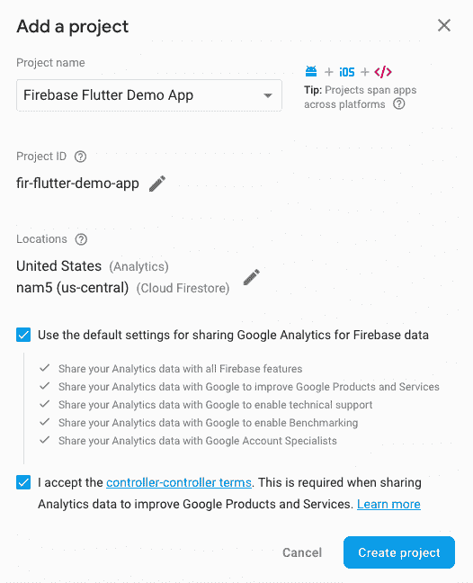

1.  添加项目名称（例如：在我们的案例中为`Firebase Flutter Demo App`）。**项目 ID**会自动生成，或者您可以输入您自己的唯一项目 ID。它们是全球唯一的标识符。

1.  在位置中选择国家，然后点击创建项目**。**之前接受条款和条件。

1.  点击创建项目选项，等待几秒钟，直到 Firebase 控制台显示以下截图中的消息：

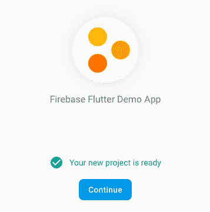

1.  如果您的屏幕显示**您的项目已准备好**文本，如前一张截图所示，您可以点击**继续**按钮。

1.  完成后，您将看到应用的以下项目设置仪表板：


1.  根据您将为哪个应用平台构建应用选择平台特定的 Firebase 配置，并点击相应的图标。在我们的案例中，因为我们正在构建 Android 应用，所以我们将点击 Android 图标继续。

# 使用包名注册应用

此步骤需要将您应用的平台特定 ID 注册到 Firebase。这将生成我们将添加到项目文件夹中的配置文件。请注意，在您的 Flutter 应用顶级目录中，iOS 和 Android 是包含相应平台特定配置文件的子目录之一：


在您的 Flutter 应用顶级目录中，您可以看到子目录；称为 Android 和 iOS。在这里，您将找到 iOS 和 Android 的平台特定配置文件。

在这里最重要的字段是 Android 包名**。**这通常是您 app-level `build.gradle`文件中的`applicationId`。另一种找到包名的方法是按照以下步骤操作：

1.  在 Flutter 应用目录中，检查`android/app/src/main/AndroidManifest.xml`文件。

1.  在 Manifest 标签下，找到包名的字符串值，这将是包名的值。

1.  在 Firebase 对话框中，将步骤 2 中复制的包名粘贴到 Android 包名字段中。

如果您正在为 iOS 和 Android 两个平台开发 Flutter 应用，您需要在同一个 Firebase 项目中注册 iOS 和 Android 版本。但如果您只为一个平台开发，您只需点击其中一个即可。

接下来，您可以添加应用昵称，这是一个可选字段。还有一个可选字段**调试签名证书 SHA-1**，如果应用使用如 Google Sign in 进行身份验证、Dynamic Links 和 Invites 等功能，则必须使用。在这种情况下，您必须找到调试证书指纹值，并将其复制粘贴到字段中。有关如何构建客户端身份验证的说明，请参阅此链接，[`developers.google.com/android/guides/client-auth`](https://developers.google.com/android/guides/client-auth)。由于在此示例中我们没有使用这些功能，我们将留空。点击注册应用。

# 下载和设置配置文件

下一步是下载并设置配置文件。按照以下步骤下载并设置配置文件：

1.  点击**注册应用**后，此步骤中的控制台将生成`google-services.json`文件。将此文件下载到您的计算机上。

1.  文件下载完成后，前往您的 Flutter 应用目录，并将之前下载的`google-services.json`文件移动到`android/app`目录中。

1.  文件移动后，在 Firebase 控制台中，点击下一步，如图所示：

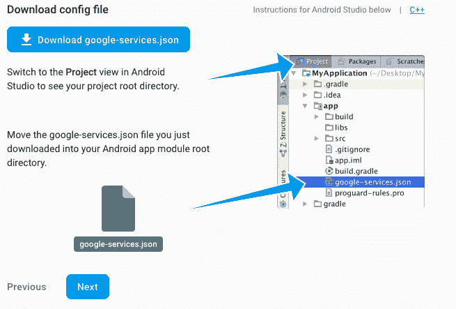

# 添加 Firebase SDK

现在我们已经下载并设置了配置文件，倒数第二步是将 Firebase SDK 添加到你的项目中。Gradle 的 Google 服务插件确保你下载的 JSON 文件被读取。为了在应用中启用 Google API 或 Firebase 服务，你必须添加一个 `google-services` 依赖项。需要对 `build.gradle` 文件进行两个小的修改以使用该插件。请看以下内容：

1.  项目级别的 `build.gradle` (`<project>/build.gradle`):

```kt
buildscript { 
dependencies 
{ 
// Add this line 
classpath 'com.google.gms:google-services:4.2.0' 
} 
}
```

1.  应用级别的 `build.gradle` (`<project>/<app-module>/build.gradle`):

```kt
dependencies {
  // Add this line
  *implementation 'com.google.firebase:firebase-core:16.0.1'* }
...
// Add to the bottom of the file
apply plugin: 'com.google.gms.google-services'
```

1.  点击**立即同步**选项以完成此过程。

# 验证配置

完成前面的步骤后，我们必须验证你的 Flutter 应用是否连接到 Firebase。为了确保这一点，请按照以下步骤操作：

1.  构建项目并在连接到你的计算机的设备上运行它。

1.  一旦应用在手机上运行，Firebase 控制台将自动检测配置并显示如下成功消息：

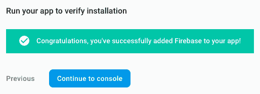

1.  点击继续到控制台后，你将被带到显示项目名称和其他设置的控制台：


在下一节中，我们将看到如何连接到云数据库。

# 创建 Cloud Firestore 数据库

一旦 Firebase-Flutter 设置完成，你就可以开始构建应用了。我们现在将设置 Cloud Firestore 数据库并初始化一些值。按照以下步骤操作：

1.  在开发选项下，点击数据库。

1.  在显示的面板中，点击创建数据库：

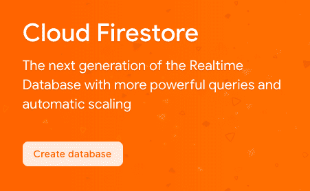

1.  点击后，你会看到一个弹出面板：Cloud Firestore 的安全规则。选择以测试模式启动并启用：

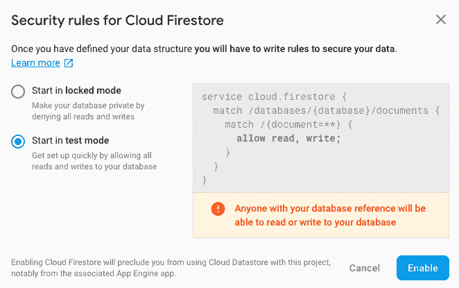

1.  我们选择测试模式，因为我们希望任何拥有数据库引用的人都能读取或写入数据库。当你构建应用的正式版本时，请确保你设置了安全规则。你可以在这里了解这些规则：[`firebase.google.com/docs/reference/rules/rules`](https://firebase.google.com/docs/reference/rules/rules)。点击启用后，Cloud Firestore 将配置安全规则并准备好使用。

1.  在以下面板中，点击添加集合：

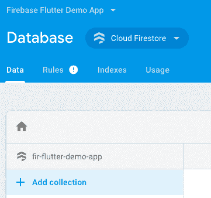

1.  我们假设在 Firestore 中我们只有一个集合，称为 Votes。**集合**是一组文档，构成了数据：

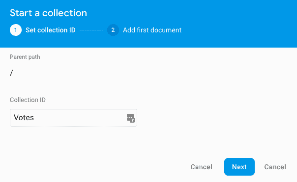

1.  点击下一步。

1.  一个集合必须至少包含一个文档，这是 Cloud Firestore 的存储单元。你可以使用自动生成的 ID 或自定义 ID。在我们的例子中，我们使用 partyvotes。

1.  对于现有的字段，输入名称的值（在我们的例子中，它是 VoteCount），选择数据类型，然后输入 partyvotes 的值。由于它是一个整数，我们选择数字并将其初始值设置为 0：

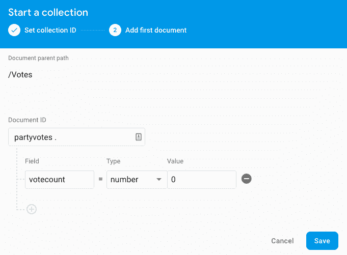

1.  点击 保存。

1.  在向你的集合添加了几个文档之后，你的数据库应该看起来像这样：


Firestore 是一个 NoSQL 数据库，这意味着我们不会与行和列一起工作。现在我们将构建应用的布局。使用 Firestore 的详细信息，我们将构建列表布局，这将根据 Firestore 中的值在运行时生成列表项，并在点击列表项时读取/更新 Firestore 数据库中的新值。以下是 `main.dart` 文件：

```kt
import 'package:cloud_firestore/cloud_firestore.dart';
import 'package:flutter/material.dart';

void main() => runApp(MyApp());

// Creating Object to temporary make the list items. We will replace it when we connect it to Firestore

final party = [
 {"partyname": "BJP", "rating": 1},
 {"partyname": "Congress", "rating": 3},
 {"partyname": "AAP", "rating": 5},
 {"partyname": "Janata Dal Party", "rating": 9},
 {"partyname": "NOTA", "rating": 11},
];

class MyApp extends StatelessWidget {
 @override
 Widget build(BuildContext context) {
   return MaterialApp(
     title: 'State Party Elections - Worker Profile',
     home: MyHomePage(),
   );
 }
}

class MyHomePage extends StatefulWidget {
 @override
 _MyHomePageState createState() {
   return _MyHomePageState();
 }
}

class _MyHomePageState extends State<MyHomePage> {
 @override
 Widget build(BuildContext context) {
   return Scaffold(
     appBar: AppBar(title: Text('Party Votes')),
     body: _buildBody(context),
   );
 }

 Widget _buildBody(BuildContext context) {
   // We will add the code here in the next section
   return _buildList(context, party);
 }

 Widget _buildList(BuildContext context, List<Map> snapshot) {
   return ListView(
     padding: const EdgeInsets.only(top: 22.0),
     children: snapshot.map((data) => _buildListItem(context, data)).toList(),
   );
 }

 Widget _buildListItem(BuildContext context, Map data) {
   final result = Record.fromMap(data);

// Adding the padding to ensure enough space is given
   return Padding(
     key: ValueKey(result.name),
     padding: const EdgeInsets.symmetric(horizontal: 15.0, vertical: 7.0),
     child: Container(
       decoration: BoxDecoration(
         border: Border.all(color: Colors.red),
         borderRadius: BorderRadius.circular(6.0),
       ),
// Showing the list item, with name towards the left and the votes to the right

       child: ListTile(
         title: Text(record.partyname),
         trailing: Text(record.partyvotes.toString()),
         onTap: () => print(record),
       ),
     ),
   );
 }
}

class Record {
 final String partyname;
 final int partyvotes;
 final DocumentReference reference;

 Record.fromMap(Map<String, dynamic> map, {this.reference})
     : assert(map['partyname'] != null),
       assert(map['partyvotes'] != null),
       name = map['partyname'],
       votes = map['partyvotes'];

 Record.fromSnapshot(DocumentSnapshot snapshot)
     : this.fromMap(snapshot.data, reference: snapshot.reference);

 @override
 String toString() => "Record<$partyname:$partyvotes>";
}
```

我们在 Firestore 云上准备好了集合。在前面的例子中，我们使用了 `party` 对象。现在是时候使用 Firestore 云数据从我们的集合中显示了。我们可以通过调用 Cloud Firestore 使用一个 `Firestore.instance` 引用来做到这一点。例如，如果你希望从你的 Firestore 云数据库中调用一个特定的集合，你可以使用以下命令来返回一个快照流：

```kt
Firestore.instance.collection('collection_name').snapshots()
```

流有两种类型：单订阅或广播。流负责提供异步数据序列。用户生成的事件和从文件中读取的数据是两种数据序列。现在，使用 `StreamBuilder` 小部件，我们将数据流注入我们创建的用户界面。`StreamBuilder` 的一个经典用例是，每当 Firestore 值发生变化时，列表会自动更新。

在前面的代码中查找 `_buildBody` 方法，并将内容替换为以下代码：

```kt
Widget _buildBody(BuildContext context) {
 return StreamBuilder<QuerySnapshot>(
   stream: Firestore.instance.collection('party').snapshots(),
   builder: (context, snapshot) {
     if (!snapshot.hasData) return LinearProgressIndicator();
     return _buildList(context, snapshot.data.documents);
   },
 );
}
```

添加前面的片段会产生一些错误。`_buildListItem` 方法仍然认为它正在获取一个映射。因此，我们需要做一些修改。

首先，将方法修改为接受 `DocumentSnapshot` 而不是映射列表：

```kt
Widget _buildList(BuildContext context, List<DocumentSnapshot> snapshot)
{ .... 
}
```

其次，使用构造函数 `Record.fromSnapshot()` 来构建记录。该方法更新的代码如下：

```kt
Widget _buildListItem(BuildContext context, DocumentSnapshot data) {
 final result = Record.fromSnapshot(data);
```

接下来，使用 `onTap: ()` 方法确保每次点击列表项时，投票都会更新到 Firestore 数据库中。每次点击列表项时，Cloud Firestore 都会通知所有监听器更新后的快照。应用通过 `StreamBuilder` 激活参与，该小部件用于更新新数据。对于单个用户来说，这是可以的，但是当有多个用户时，可能会发生 **竞态条件**。

`main.dart` 的完整代码如下：

```kt
import 'package:cloud_firestore/cloud_firestore.dart';
import 'package:flutter/material.dart';

void main() => runApp(MyApp());

class MyApp extends StatelessWidget {
 @override
 Widget build(BuildContext context) {
   return MaterialApp(
     title: 'State Party Elections - Worker Profile',
     home: MyHomePage(),
   );
 }
}

class MyHomePage extends StatefulWidget {
 @override
 _MyHomePageState createState() {
   return _MyHomePageState();
 }
}

class _MyHomePageState extends State<MyHomePage> {
 @override
 Widget build(BuildContext context) {
   return Scaffold(
     appBar: AppBar(title: Text('Party Votes')),
     body: _buildBody(context),
   );
 }

 Widget _buildBody(BuildContext context) {
   return StreamBuilder<QuerySnapshot>(
     stream: Firestore.instance.collection('party').snapshots(),
     builder: (context, snapshot) {
       if (!snapshot.hasData) return LinearProgressIndicator();

       return _buildList(context, snapshot.data.documents);
     },
   );
 }

 Widget _buildList(BuildContext context, List<DocumentSnapshot> snapshot) {
   return ListView(
     padding: const EdgeInsets.only(top: 22.0),
     children: snapshot.map((data) => _buildListItem(context, data)).toList(),
   );
 }

 Widget _buildListItem(BuildContext context, DocumentSnapshot data) {
   final result = Record.fromSnapshot(data);

   return Padding(
     key: ValueKey(result.name),
     padding: const EdgeInsets.symmetric(horizontal: 15.0, vertical: 
     7.0),
     child: Container(
       decoration: BoxDecoration(
         border: Border.all(color: Colors.red),
         borderRadius: BorderRadius.circular(6.0),
       ),
       child: ListTile(
         title: Text(record.name),
         trailing: Text(record.votes.toString()),
         onTap: () => Firestore.instance.runTransaction((transaction) 
         async {
           final freshFBsnapshot = await 
             transaction.get(record.reference);
            final updated = Record.fromSnapshot(freshFBsnapshot);

               await transaction
                   .update(record.reference, {'partyvotes': 
            updated.votes + 1});
             }),
       ),
     ),
   );
 }
}

class Record {
 final String partyname;
 final int partyvotes;
 final DocumentReference reference;

 Record.fromMap(Map<String, dynamic> map, {this.reference})
     : assert(map['partyname'] != null),
       assert(map['partyvotes'] != null),
       name = map['partyname'],
       votes = map['partyvotes'];

 Record.fromSnapshot(DocumentSnapshot snapshot)
     : this.fromMap(snapshot.data, reference: snapshot.reference);

 @override
 String toString() => "Record<$partyname:$partyvotes>";
}
```

一旦运行代码，尝试点击列表项，你将看到更新后的值映射在 Firestore 云数据库上。你也可以尝试在 Firestore 云数据库中更新列表项名称（在我们的例子中，是派对名称），你将看到列表项选项正在更新。

# Firebase Cloud Messaging

**Firebase Cloud Messaging** (**FCM**) 是一种通过应用通知来提高应用内参与度的有效方式。使用 FCM，你可以向客户端设备发送两种类型的消息：

1.  由 FCM SDK 直接处理的推送通知消息

1.  数据消息

这两条消息的最大有效载荷为 4KB。当从 Firebase 控制台发送消息时，字符限制为 1,024 个字符。Firebase 拥有云消息传递以及应用内消息传递，但在这个部分，我们将仅讨论 Firebase 云消息传递。

在 Firebase 控制台中，点击左侧面板中的**增长 | 云消息传递**。随后点击**发送第一条消息**，如图所示：

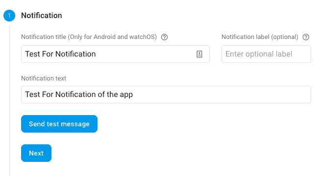

要在您的设备上测试消息，需要 FCM 令牌。使用以下 Android 代码生成这些令牌：

```kt
FirebaseInstanceId.getInstance().getInstanceId()
        .addOnCompleteListener(new OnCompleteListener<InstanceIdResult>
         () {
            @Override
            public void onComplete(@NonNull Task<InstanceIdResult> 
            actionable) {
                if (!actionable.isSuccessful()) {
                    Log.w(TAG, "getInstanceId failed", 
                    actionable.getException());
                    return;
                }

                // Get new Instance ID token
                String tokenID = actionable.getResult().getToken();

                // Log and toast
                String message = getString(R.string.msg_token_fmt, 
                tokenID);
                Log.d(TAG, message);
                Toast.makeText(MainActivity.this, message, 
               Toast.LENGTH_SHORT).show();
            }
        });
```

FCM 还允许针对特定目标配置消息，例如`GeoLocations`、应用的版本、语言和用户受众。当您希望向特定用户组发送通知时，这种情况非常理想。

# Firebase 远程配置

使用 Firebase 的远程配置 API，您可以在不实际下载应用更新的情况下更改应用。一个例子是在生产环境中推送新的应用更新时，当用户启动应用时，您可以向用户显示有关更新的弹出消息。

要设置 Firebase 远程配置，请转到 Firebase 控制台中的“增长”标签页，并点击“远程配置”，如图所示：

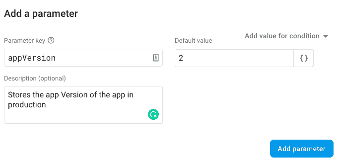

添加参数键和默认值。有一个可选字段用于添加描述。点击“添加参数”继续。请勿在远程配置中存储任何机密信息。Firebase 还允许为参数设置条件。例如，如果您想向印度的用户显示特定的欢迎消息，而向美国的用户显示不同的消息，远程配置将非常有用。

免责声明：一些代码文件是在[Apache 2.0 许可证](https://www.apache.org/licenses/LICENSE-2.0)下授权的，并且可在[`firebase.google.com/docs/cloud-messaging/android/client`](https://firebase.google.com/docs/cloud-messaging/android/client)上找到。

# 摘要

我们在本章开始时探讨了如何使用 Firestore 云数据库——NoSQL 方式帮助应用开发者实时构建应用，从而加快应用构建速度。我们还查看了一个使用 Firestore 云数据库捕获`ListView`的示例。本节之后，我们探讨了云消息传递的工作原理。在最后一节中，我们讨论了在您的应用中使用 Firebase 远程配置的一些用例。

在下一章中，我们将探讨如何部署您的 Flutter 应用程序。
