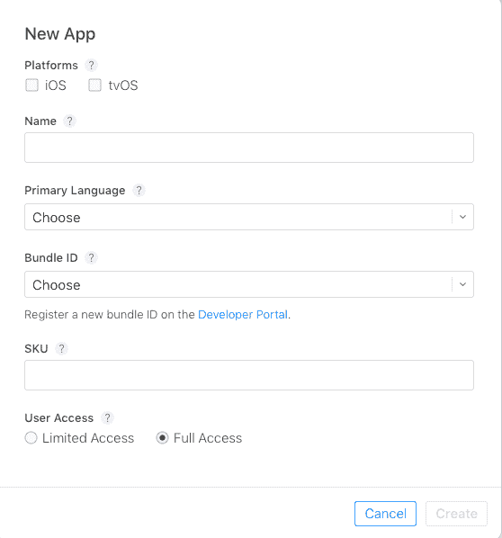

# 第八章：部署 Flutter 应用

部署 Flutter 应用是使开发者能够为应用商店发布准备应用程序的最简单过程之一。到目前为止，您必须已经了解到 Google 的移动应用 SDK 提供了在 iOS 和 Android 上创建高质量原生界面的几个功能，且速度非常快。

在本章中，我们将探讨以下主题：

+   在 Android 上部署

+   在 iOS 上部署

# 在 Android 上部署

在本书到目前为止的内容中，我们构建的是调试类型。理想情况下，这用于在生成要上传的应用程序的发布版本之前测试应用程序。Flutter 还允许创建应用程序的变体。如果您想构建您开发的应用程序的生产版本，请遵循下面的步骤。

# 检查 AndroidManifest.xml 文件

此文件包含了一些在构建应用程序的生产版本时非常有用的主要全局设置。它位于 `<app dir>/android/app/src/main`。当您点击 `AndroidManifest.xml` 文件时，您将在 `Application` 标签中找到以下片段：

```kt
…..
android:name="io.flutter.app.FlutterApplication"
android:label="flutter_app_battery"
android:icon="@mipmap/ic_launcher">
….
```

以下代码中可见的属性的说明如下：

+   `android.name`: 这个属性设置了应用程序的包名

+   `android.label`: 这个属性设置了应用程序的最终名称

+   `android:icon`: 这个属性设置了应用程序的启动图标

```kt
….
<uses-permission android:name="android.permission.INTERNET"/>
…..
```

`<uses-permission>` 标签允许开发者设置应用程序中开发者所需的权限。例如，如果您想使用互联网，必须使用前面的属性，或者如果您想访问相机，必须使用 `<uses-permission android:name="android.permission.CAMERA"/>`。这将影响所有相机功能。开发者还可以要求在 **运行时** 模式下请求用户权限。

# build.gradle 配置

下一步是检查位于 `<app dir>/android/app` 的 Gradle 构建文件，并确认以下参数中输入的值是否正确：

+   在以下片段中设置 `VersionCode` 和 `VersionName`。请注意，`VersionCode` 的值对于每个上传的构建必须是唯一的，并且它是一个绝对值。Google Play 商店允许的 `versionCode` 的最大值是 `2100000000`。另一方面，`VersionName` 是一个字符串值。`VersionName` 没有在 Play 商店上显示值的用途。字符串值可以作为 `<major>.<minor>.<point>` 字符串级联——例如，1.2.2：

```kt
…….
…….
def flutterVersionCode = localProperties.getProperty('flutter.versionCode')
if (flutterVersionCode == null)
{ flutterVersionCode = '1' }
 def flutterVersionName = localProperties.getProperty('flutter.versionName')
if (flutterVersionName == null)
{ flutterVersionName = '1.0' }
……
……
```

+   `applicationId`: 这允许开发者指定最终的、唯一的应用程序 ID。

+   `minSdkVersion` 和 `targetSdkVersion`: 这两个值指定了应用程序设计运行的最低 API 级别和目标 API 级别：

```kt
defaultConfig
{ // TODO: Specify your own unique Application ID (https://developer.android.com/studio/build/application-id.html).
applicationId "deviceinformation.flutterappbattery"
minSdkVersion 16
targetSdkVersion 27
versionCode flutterVersionCode.toInteger()
versionName flutterVersionName
testInstrumentationRunner "android.support.test.runner.AndroidJUnitRunner"
}
```

# 应用程序内的图标

一个时尚、引人注目的图标可以成为某人启动应用的绝佳触发器。默认情况下，启动器图标是一个默认图标。遵循 Android Launcher Icon 指南，你可以构建自己的图标，该图标可用于从移动屏幕启动应用：

1.  一旦你的图标文件准备就绪，检查 `<app dir>/android/app/src/main/res/` 目录并将文件放入相应的文件夹中，使用配置限定符。你可以在此处了解更多信息：[`developer.android.com/guide/topics/resources/providing-resources#AlternativeResources`](https://developer.android.com/guide/topics/resources/providing-resources#AlternativeResources)。

1.  将文件放置在文件夹中后，只需转到 `AndroidManifest.xml` 并更新应用程序标签的 `android:icon` 属性。

1.  为了确保图标已替换，使用 `Flutter run` 并检查启动器中的应用图标。

# 签名应用

这是发布应用到 Google Play 商店之前的关键步骤之一。要发布应用，使用数字签名对应用进行签名是关键部分。按照以下步骤对应用进行签名：

1.  **创建密钥库**：如果你已经有了 `keystore`，则跳到步骤 2。如果你希望构建新的 `keystore`，请使用 `KeyTool` 工具使用以下命令行代码生成一个：

```kt
keytool -genkey -v -keystore ~/appkey.jks -keyalg RSA -keysize 2048 -validity 10000 -alias appkey
```

`KeyTool` 是 Java JDK 的一部分，它是 Android Studio 安装的一部分。确保在运行命令行之前提供一个绝对路径。此外，请注意生成的文件必须保持私密。

1.  **从应用中引用密钥库**：接下来，创建一个名为

    `<app dir>/android/key.properties` 包含对 keystore 的引用。请保持此文件私密。查看以下代码：

```kt
storePassword=<password used in the previous step>
keyPassword=<password used in the previous step>
keyAlias=appkey
storeFile=<location of the key store file, e.g. /Users/<user name>/appkey.jks>
```

1.  **在 Gradle 中配置签名**：转到 `<app dir>/android/app/build.gradle` 文件并将 `**android {**` 替换为以下代码：

```kt
def keystoreProperties = new Properties()
def keystorePropertiesFile = rootProject.file('key.properties')
if (keystorePropertiesFile.exists()) {
    keystoreProperties.load(new FileInputStream(keystorePropertiesFile))
}
android {
```

1.  接下来，删除以下代码：

```kt
buildTypes {
    release {
        // TODO: Add your own signing config for the release build.
        // Signing with the debug keys for now, so `flutter run --     
        //release` works.
        signingConfig signingConfigs.debug
    }
}
```

用以下代码替换它：

```kt
signingConfigs {
    release {
        keyAlias keystoreProperties['keyAlias']
        keyPassword keystoreProperties['keyPassword']
        storeFile file(keystoreProperties['storeFile'])
        storePassword keystoreProperties['storePassword']
    }
}
buildTypes {
    release {
        signingConfig signingConfigs.release
    }
}
```

完成这些步骤后，你的应用的发布构建将自动签名。

# 使用 ProGuard

默认情况下，Flutter 构建生成器不会对 Android Host 进行混淆或精简。你可能想减小 APK 的大小或防止代码被逆向工程。**ProGuard** 是保护你的代码的一种方式：

1.  **配置 ProGuard**：创建一个名为 `**/**android/app/proguard-rules.pro` 的新文件并添加以下规则：

```kt
#Flutter Wrapper
-keep class io.flutter.app.** { *; }
-keep class io.flutter.plugin.**  { *; }
-keep class io.flutter.util.**  { *; }
-keep class io.flutter.view.**  { *; }
-keep class io.flutter.**  { *; }
-keep class io.flutter.plugins.**  { *; }
```

使用前面的代码，你可以仅保护 Flutter 中的引擎库。对于保护其他部分，根据你的开发需求添加代码。

1.  **启用混淆和/或精简**：打开 `/android/app/build.gradle` 文件并定位到 `buildTypes` 定义：

```kt
 …..
 …..
buildTypes {
        release {
            // TODO: Add your own signing config for the release build.
            // Signing with the debug keys for now, so `flutter run --release` works.
            signingConfig signingConfigs.debug
        }
…..
…..
```

在内部，将配置集的 `minifyEnabled` 和 `useProguard` 标志设置为 true。注意也将 ProGuard 指向你在步骤 1 中创建的文件。刷新后的代码将如下所示：

```kt
…
…
buildTypes {
        release {
            signingConfig signingConfigs.release
            minifyEnabled true
            useProguard true
            proguardFiles getDefaultProguardFile('proguard-android.txt'), 'proguard-rules.pro'
        }
…
…
```

# 构建发布 APK

在成功完成前面的步骤后，生成发布版本只是一个两步过程。使用命令行，执行以下操作：

1.  `cd <app dir>`（注意将`<app dir>`替换为您的应用程序目录路径）。

1.  运行 flutter build apk。这将创建一个发布 APK，位于`<app dir>/build/app/outputs/apk/release/app-release.apk`。

此构建可以在 Google Play 商店发布。确保在应用上传之前阅读发布指南。

# 在 iOS 上部署

就像 Google Play 商店一样，Apple 也有自己的应用发布指南。在构建应用之前，请务必阅读所有相关信息。以下是您可以查看以获取更多关于 Apple 应用发布的详细信息链接：[`developer.apple.com/app-store/review/`](https://developer.apple.com/app-store/review/)。一旦应用提交，就像 Google 一样，Apple 将检查应用是否符合其发布指南。请注意，Flutter 支持 iOS 8.0 及更高版本。在设置 Xcode 构建生成时，这一点很重要。

就像 Google 一样，我们使用**Google Play 开发者**控制台。在 Apple 的情况下，我们将使用**App Store Connect**，之前被称为 iTunes。此控制台用于管理您应用的生命周期。此控制台将帮助您设置应用名称、描述和与应用一起发布的应用截图，并管理定价和发布。

# 注册 Bundle ID

在 Apple 商店发布的每个应用都有一个唯一的 Bundle ID，与 Apple 相关联。要为您的应用注册新的 Bundle ID，请按照以下步骤操作：

1.  打开您的 Apple 开发者账户的 App IDs 页面。

1.  点击+图标创建新的 Bundle ID。

1.  输入应用名称并选择显式 App ID，然后输入一个 ID。

1.  选择您的应用将要使用的服务，然后点击继续。

1.  下一步确认详细信息。现在，点击注册以注册您的 Bundle ID。

# 在 App Store connect 上生成应用程序记录

要在 App Store connect 上注册应用，请按照以下步骤操作：

1.  在浏览器中打开 Apple App Store connect 并点击**我的应用**。

1.  点击 My Apps 页面左上角的+图标 | 新建应用。

1.  在弹出窗口中，填写您的应用详细信息。在“平台”部分，确保选中 iOS。此时，值得一提的是，Flutter 目前尚不支持 tvOS。因此，不要选中该复选框。应用名称不能超过 30 个字符。在 SKU 部分，添加一个在 App Store 中不可见的唯一 ID：



1.  选择创建。

1.  导航到使用之前步骤创建的应用程序详细信息，并在侧边栏中选择应用信息。

1.  在“通用信息”部分选择 Bundle ID。

# 验证 Xcode 设置

在 Xcode 中验证构建发布设置相对简单，与 Android Studio 相比。首先，导航到 Xcode 中目标设置，并执行以下操作：

1.  在 Xcode 中打开您的应用 ios 文件夹中的`Runner.xcworkspace`。

1.  从 Xcode 项目导航器中选择 Runner 项目，这会显示应用的设置。从主视图的侧边栏中选择 Runner 目标。

1.  选择“通用”选项卡。

显示的信息需要你注意交叉检查重要的设置；因此，在“身份”部分，查看以下详细信息：

+   显示名称：这是将在 App Store 以及任何其他使用名称的地方显示的应用名称

+   包标识符：这是你在 App Store Connect 上注册的应用 ID，如前所述

在“签名应用”部分，请查看以下详细信息：

+   自动管理签名：定义 Xcode 是否应该自动管理应用签名和配置。默认设置为`True`。

+   团队：选择与你的注册 Apple 开发者账户关联的团队。如果你希望添加更多成员，请点击添加账户，然后更新设置。

最后，在部署部分，检查部署目标：这包含你的应用将支持的最低 iOS 版本值。

# 选择应用图标

就像在 Android Studio 中一样，即使在 iOS 的情况下，也会创建一个占位符图标。如果你希望使用自己的图标，请在进行以下步骤之前阅读 iOS 应用图标指南：

1.  在`Runner`文件夹中选择`Assets.xcassets`；这将在 Xcode 项目导航器中显示

1.  如果你的图标已经准备好，请更新占位符图标为你的自定义应用图标

1.  要检查图标是否已更新，请使用 Flutter Run 运行你的应用

# 创建构建存档

这是创建构建存档并将其上传到 Apple Store 的最后一步。在命令行中，在你的应用目录中按照以下步骤操作：

1.  运行 flutter build iOS 以创建发布版本。

1.  仅当你的 Xcode 版本低于 8.3 时才执行此操作。为了确保 Xcode 刷新发布模式配置，请重新启动你的 Xcode 工作区。

在 Xcode 中，请按照以下步骤配置应用版本和构建：

1.  在 Xcode 中，在你的应用的`ios`文件夹中打开`Runner.xcworkspace`。

1.  选择产品 | 方案 | Runner。

1.  选择产品 | 目标 | 通用 iOS 设备。

1.  在 Xcode 项目导航器中选择 Runner，然后在设置视图侧边栏中选择 Runner 目标。

1.  在“身份”部分，更新版本号，并将构建标识符更新为唯一的构建编号。这用于跟踪上传的构建数量。每个构建都应该有一个唯一的构建编号。

最后一步是创建构建存档并将其上传到 App Store Connect：

1.  选择产品，然后生成构建存档

1.  在 Xcode 组织者窗口的侧边栏中 | 选择 iOS 应用 | 选择你刚刚生成的构建存档

1.  点击验证按钮

1.  存档验证后，你可以点击“上传到 App Store”选项

如果有任何错误，请重新生成构建并尝试再次重复此过程。

# 摘要

一旦你完成了你的出色应用，部署和发布是关键环节。我们已经介绍了如何在 Play Store 上发布安卓和 iOS 应用。重要的是要知道，应用上传只是列出应用。你还应该将 App Store 视为提高应用可见性的关键技术。
