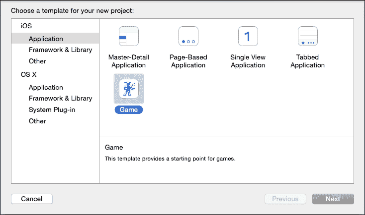
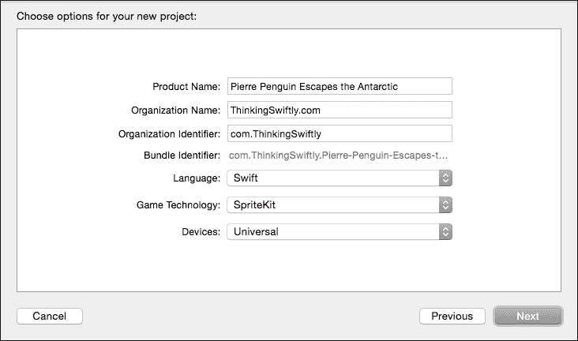
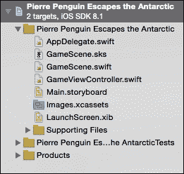
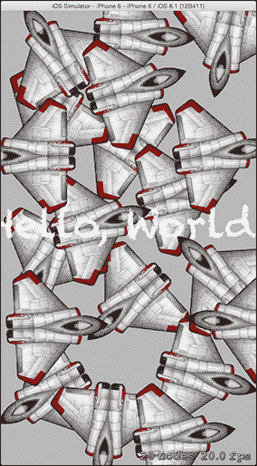

# 第一章：使用 Swift 设计游戏

苹果的新语言对于游戏开发者来说来得正是时候。**Swift**有独特的机遇成为特别的东西；一个革命性的工具，用于应用开发者。Swift 是开发者进入苹果生态系统中创建下一个大型游戏的门户。我们刚刚开始探索移动游戏的奇妙潜力，Swift 是我们工具集现代化的需要。Swift 快速、安全、现代，对来自其他语言的开发者有吸引力。无论您是苹果世界的初学者，还是**Objective-C**的老手，我相信您会喜欢用 Swift 制作游戏。

### 注意

苹果的网站表示：“Swift 是 C 和 Objective-C 语言的继承者。”

我在这本书中的目标是逐步引导您创建 iPhone 和 iPad 的 2D 游戏。我们将从安装必要的软件开始，逐步完成游戏开发的每一层，最终将我们的新游戏发布到 App Store。

我们在旅途中也会有一些乐趣！我们的目标是创建一款以一只壮丽的飞企鹅**皮埃尔**为主角的无限飞行游戏。什么是无限飞行游戏？想象一下像 iCopter、Flappy Bird、鲸鱼之旅、喷射背包冒险等游戏——这个列表相当长。

无限飞行游戏在 App Store 上很受欢迎，这个类型需要我们涵盖 2D 游戏设计的许多可重用组件；我将向您展示如何修改我们的机制以创建多种不同的游戏风格。我的希望是，我们的演示项目将成为您自己创意作品的模板。不久，您将能够使用我们共同探索的技术发布您自己的游戏想法。

本章包含以下主题：

+   为什么你会喜欢 Swift

+   您将在本书中学到什么

+   设置您的开发环境

+   创建您的第一个 Swift 游戏

# 为什么你会喜欢 Swift

作为一种现代编程语言，Swift 受益于编程社区的集体经验；它结合了其他语言的最佳部分，避免了不良的设计决策。以下是我最喜欢的几个 Swift 特性。

## 美观的语法

Swift 的语法现代且易于接近，无论您现有的编程经验如何。苹果在语法和结构之间取得了平衡，使 Swift 简洁易读。

## 互操作性

Swift 可以直接集成到您现有的项目中，并与您的 Objective-C 代码并行运行。

## 强类型

Swift 是一种强类型语言。这意味着编译器将在编译时捕获更多错误——而不是当您的用户在玩游戏时！编译器会期望您的变量属于某种类型（`int`、`string`等），如果您尝试分配不同类型的值，则会抛出编译时错误。虽然如果您来自弱类型语言，这可能看起来很严格，但增加的结构会导致更安全、更可靠的代码。

## 智能类型推断

为了使事情更简单，**类型推断**将自动检测变量和常量的类型，基于它们的初始值。您不需要显式声明变量的类型。Swift 足够智能，可以在大多数表达式中推断变量类型。

## 自动内存管理

如苹果 Swift 开发者指南所述，“在 Swift 中，内存管理就是如此简单。”Swift 使用一种称为**自动引用计数**（您将看到它被称为**ARC**）的方法来管理游戏内存的使用。除了少数边缘情况外，您可以依赖 Swift 安全地清理并关闭灯光。

## 一个公平的竞争环境

我最喜欢的 Swift 特性之一是它如何迅速地被主流接受。我们都在共同学习和成长，有巨大的机会开辟新的领域。

# Swift 有什么缺点吗？

Swift 是一种非常有趣的语言，但在开始新项目时，我们应该考虑这两个问题。

## 资源较少

由于 Swift 的历史较短，通过互联网搜索找到常见问题的答案确实更加困难。Objective-C 在 Stack Overflow 等有用的论坛上有多年讨论和答案。随着 Swift 社区的持续发展，这个问题每天都在改善。

## 操作系统兼容性

Swift 项目将在 iOS7 及以上版本和 OSX 10.9 及以上版本上运行。如果罕见地需要针对运行较旧操作系统的设备，Swift 不是正确的选择。

# 前置条件

我将努力使这篇文本对所有技能水平的人都容易理解：

+   我假设您作为语言对 Swift 是全新的

+   本书不需要先前的游戏开发经验，尽管它会有所帮助

+   我假设您对常见的编程概念有基本的理解

# 您将在本书中学到什么

到这本书的结尾，您将能够创建和发布自己的 iOS 游戏。您将知道如何结合我们学到的技术来创建自己的游戏风格，并且您将准备好在 2D 游戏设计的基础上深入更高级的主题。

## 拥抱 SpriteKit

**SpriteKit**是 Apple 的 2D 游戏开发框架，也是 iOS 游戏设计的主要工具。SpriteKit 将处理我们的图形渲染、物理和声音播放的机制。就游戏开发框架而言，SpriteKit 是一个极好的选择。它是 Apple 构建和支持的，因此与 Xcode 和 iOS 完美集成。您将学会熟练使用 SpriteKit——在我们的演示游戏中，我们将独家使用它。

我们将学习如何使用 SpriteKit 来驱动我们游戏的核心机制：

+   为我们的玩家、敌人和道具添加动画

+   绘制并移动侧边滚动环境

+   播放声音和音乐

+   应用类似物理的重力和冲量进行移动

+   处理游戏对象之间的碰撞

## 对玩家输入做出反应

移动游戏中的控制方案必须富有创意。移动硬件迫使我们模拟传统的控制器输入，例如方向垫和屏幕上的多个按钮。这占用了宝贵的可见区域，并且与物理设备相比，提供的精度和反馈更少。许多游戏只使用单一输入方式；在屏幕上的任何地方轻触一次。我们将学习如何充分利用移动输入，并通过感应设备运动和倾斜来探索新的控制形式。

## 结构化你的游戏代码

编写易于重用和修改的代码，以便随着你的游戏设计不可避免地变化，这是非常重要的。你将在开发和测试你的游戏时经常发现机械改进，并且你会感谢自己有一个干净的工作环境。尽管有许多方法可以接近这个主题，但我们将探索一些最佳实践来构建一个有组织的系统。

## 构建 UI/菜单/关卡

我们将学习如何在我们的游戏中通过菜单屏幕切换场景。在我们构建演示游戏的过程中，我们将涵盖用户体验设计和菜单布局的基础知识。

## 与 Game Center 集成

**Game Center**是苹果内置的社交游戏网络。你的游戏可以与 Game Center 集成，以存储和分享高分和成就。我们将学习如何注册 Game Center，将其集成到我们的代码中，并创建一个有趣的成就系统。

## 最大化乐趣

如果你像我一样，你脑海中会有数十个游戏想法。想法来得容易，但设计有趣的游戏玩法却很难！在你看到你的设计付诸实践后，发现你的想法需要游戏玩法增强是很常见的。我们将探讨如何避免死胡同，并确保你的项目能够顺利到达终点线。此外，我将分享我的技巧和窍门，以确保你的游戏能给你的玩家带来快乐。

## 冲刺终点线

创作一款游戏是你将珍藏的记忆。分享你的辛勤工作只会让满足感更甜。一旦我们的游戏经过打磨并准备好公开消费，我们将一起导航 App Store 提交流程。你将结束游戏，对自己使用 Swift 创建游戏并将其带到 App Store 的能力充满信心。

# 进一步研究

我将专注于 iOS 优秀游戏设计中的机制和编程。一些次要主题超出了本书的范围。

## 游戏营销和盈利

成功推广和营销你的游戏是一项重要的工作，但本文重点在于游戏开发机制和 Swift 代码。如果你对从你的游戏中赚钱感兴趣，我强烈建议你研究在独立游戏社区中推广自己的最佳方式，并在游戏发布前就开始营销你的游戏。

## 为 OSX 桌面制作游戏

我们将专注于 iOS。你也可以使用这本书中的技术来在 OSX 上进行游戏开发，但你可能需要研究发布和环境差异。

# 设置你的开发环境

学习新的开发环境可能会成为障碍。幸运的是，苹果为 iOS 开发者提供了一些出色的工具。我们将从安装 Xcode 开始我们的旅程。

## 介绍 Xcode

**Xcode** 是苹果公司的 **集成开发环境**（**IDE**）。您需要 Xcode 来创建您的游戏项目、编写和调试您的代码，以及为 App Store 构建您的项目。Xcode 还附带了一个 iOS 模拟器，可以在您的计算机上虚拟化 iPhone 和 iPad 来测试您的游戏。

### 注意

苹果公司将 Xcode 赞誉为“一个构建 Mac、iPhone 和 iPad 上令人惊叹应用的极具生产力的环境。”

要安装 Xcode，请在 App Store 中搜索 `xcode` 或访问 [`developer.apple.com`](http://developer.apple.com) 并点击 **Xcode** 图标。请注意您正在安装的 Xcode 版本。在撰写本文时，Xcode 的当前版本是 6.3.2。Swift 正在不断发展，每个新的 Xcode 版本都会为 Swift 带来语法变化。为了获得本书中代码的最佳体验，请使用 Xcode 6.3.x（Swift 版本 1.2）。

### 注意

苹果公司在 2015 年的 WWDC 上宣布了 Xcode 7 和 Swift 2，但在撰写本文时它仍然处于测试版。看起来会有一些小的语法变化。本书中的知识和技巧仍然适用。

Xcode 执行常见的 IDE 功能，以帮助您编写更好、更快的代码。如果您以前使用过 IDE，那么您可能熟悉自动完成、实时错误突出显示、运行和调试项目，以及使用项目管理面板创建和组织您的文件。然而，任何新的程序在开始时都可能显得令人不知所措。在接下来的几页中，我们将介绍一些常见的界面功能。我还发现 YouTube 上的教程视频特别有帮助，如果您遇到困难的话。

# 创建我们的第一个 Swift 游戏

您已经安装了 Xcode 吗？让我们直奔主题，看看模拟器中的一些游戏代码的实际效果！

1.  我们需要创建一个新的项目。启动 Xcode 并导航到 **文件** | **新建** | **项目**。您将看到一个屏幕，要求您选择您新项目的模板。在左侧面板中选择 **iOS** | **应用程序**，在右侧面板中选择 **游戏**。它应该看起来像这样：

1.  一旦你选择了**游戏**，点击**下一步**。接下来的屏幕会要求我们输入一些关于我们项目的基本信息。不要担心；我们很快就会进入有趣的部分。对于我们的演示游戏，我们将创建一个侧滚无限飞行的游戏，特色是一只惊人的飞企鹅，名叫皮埃尔。我打算把这个游戏命名为`皮埃尔企鹅逃离南极洲`，但你可以自由地给你的项目起任何名字。现在，名字并不重要。当你创建自己的游戏并发布时，你将想要选择一个有意义的**产品名称**和**组织标识符**。按照惯例，你的**组织标识符**应该遵循反向域名风格。我将使用`com.ThinkingSwiftly`，如下面的截图所示。

1.  在填写完名称字段后，请确保选择**Swift**作为**语言**，**SpriteKit**作为**游戏技术**，以及**通用**作为**设备**。以下是我的设置：

1.  点击**下一步**，你将看到最后的对话框。保存你的新项目。在电脑上选择一个位置并点击**下一步**。我们进来了！Xcode 已经用基本的 SpriteKit 模板预先填充了我们的项目。

## 导航我们的项目

现在我们已经创建了项目，你会在 Xcode 的左侧看到项目导航器。你将使用项目导航器来添加、删除、重命名文件，以及通常组织你的项目。你可能注意到 Xcode 在我们的新项目中创建了很多文件。我们会慢慢来；不要因为还不知道每个文件的作用而感到压力，但如果你好奇，可以自由地探索它们：



## 探索 SpriteKit 演示

使用项目导航器打开名为`GameScene.swift`的文件。Xcode 创建了`GameScene.swift`来存储我们新游戏的基本场景。

什么是场景？SpriteKit 使用场景的概念来封装游戏中的每个独特区域。想象一下电影中的场景；我们将为主菜单创建一个场景，为游戏结束屏幕创建一个场景，为我们的游戏中的每个关卡创建一个场景，等等。如果你在游戏的主菜单上点击“播放”，你会从菜单场景移动到 1 级场景。

### 小贴士

SpriteKit 在其类名前缀字母“SK”；因此，场景类是**SKScene**。

你会看到在这个场景中已经有一些代码了。SpriteKit 项目模板自带一个非常小的演示。让我们快速看一下这个演示代码，并使用它来测试 iOS 模拟器。

### 注意

请在此阶段不要担心理解演示代码。你的重点应该是学习开发环境。

在 Xcode 窗口的顶部寻找运行工具栏。它看起来可能像这样：


选择你偏好的 iOS 设备进行模拟，使用最右侧的下拉菜单。你应该模拟哪个 iOS 设备？你可以自由选择你喜欢的设备。在这本书的截图里，我会使用 iPhone 6，所以如果你想你的结果与我的图片完全匹配，请选择**iPhone 6**。

### 注意

很遗憾，你可能会在模拟器中看到你的游戏表现不佳。SpriteKit 在 iOS 模拟器中表现出的 FPS 很低。一旦我们的游戏变得相对复杂，我们甚至在高性能的电脑上也会看到我们的 FPS 下降。模拟器会帮你度过难关，但如果你能插入一个物理设备进行测试，那就更好了。

是时候看看 SpriteKit 的实际效果了！按下灰色播放箭头（方便的运行键盘快捷键：*command* + *r*）。Xcode 将构建项目并启动模拟器。模拟器在一个新窗口中启动，所以请确保将其带到前台。你应该看到一个灰色背景和粉笔白色的文本：**Hello, World**。在灰色背景上点击。

你会在你点击的任何地方看到旋转的战斗机生成：



我可能对战斗机有点过度了……

如果你已经走到这一步，恭喜你！你已经成功安装并配置了你制作第一个 Swift 游戏所需的一切。

一旦你生成了足够的战斗机，你可以关闭模拟器并返回 Xcode。注意：你可以使用键盘命令*command* + *q*退出模拟器，或者在 Xcode 中按停止按钮。如果你使用停止按钮，模拟器将保持打开状态，并更快地启动你的下一个构建。

## 检查演示代码

让我们快速探索一下演示代码。现在不必担心理解一切；我们将在稍后深入探讨每个元素。目前，我希望你能够适应开发环境，并在过程中学到一些东西。如果你遇到了困难，继续前进！实际上，在清除 SpriteKit 演示并开始我们自己的游戏后，下一章的内容将会变得简单。

确保你在 Xcode 中打开了`GameScene.swift`文件。

`GameScene`类实现了三个函数。让我们来检查这些函数。你可以随意阅读每个函数内部的代码，但我并不期望你立刻就能理解具体的代码。

1.  游戏在切换到`GameScene`时，会调用`didMoveToView`函数。你可以把它想象成场景的初始化或主函数。SpriteKit 演示使用它来在屏幕上绘制**Hello World**文本。

1.  `touchesBegan`函数处理 iOS 设备屏幕上的用户触摸输入。SpriteKit 演示使用这个函数来生成战斗机图形，并将其设置在我们触摸屏幕的任何地方旋转。

1.  `update`函数会在屏幕上绘制每一帧时运行一次。SpriteKit 演示没有使用这个函数，但我们可能以后会有理由实现它。

## 清理

我希望你已经吸收了一些 Swift 语法，并对 Swift 和 SpriteKit 有了一个大致的了解。现在是时候为我们的游戏腾出空间了；让我们把所有的示例代码都清理掉！我们想要保留一点模板代码，但我们可以删除函数内部的大部分内容。为了清楚起见，我不期望你现在就能理解这段代码。这只是一个开始我们旅程的必要步骤！请从你的 `GameScene.swift` 文件中删除行，直到它看起来像以下代码：

```swift
import SpriteKit

class GameScene: SKScene {
  override func didMoveToView(view: SKView) {
  }
}
```

一旦你的 `GameScene.swift` 看起来像前面的代码，你就可以继续前进到第二章，*精灵、相机、动作!*了。现在真正的乐趣开始了！

# 摘要

你已经取得了很大的进步。你获得了 Swift 的第一次实践经验，安装并配置了你的开发环境，成功地将代码启动到 iOS 模拟器中，并为你的游戏项目做好了第一步准备。做得好！

我们已经看到了足够的“Hello World”演示——你准备好在自己的游戏屏幕上绘制自己的图形了吗？在第二章，*精灵、相机、动作!*中，我们将使用精灵、纹理、颜色和动画。
