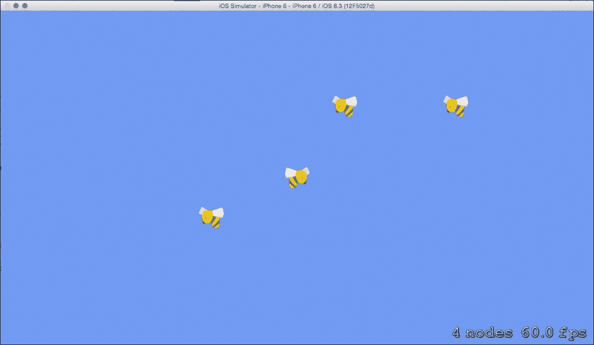
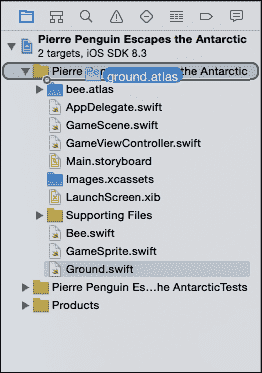
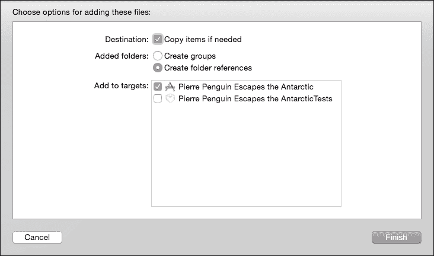
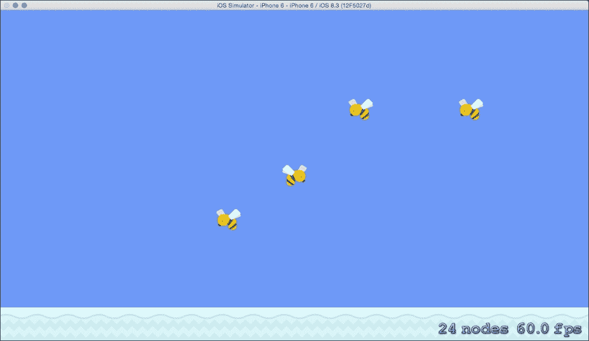
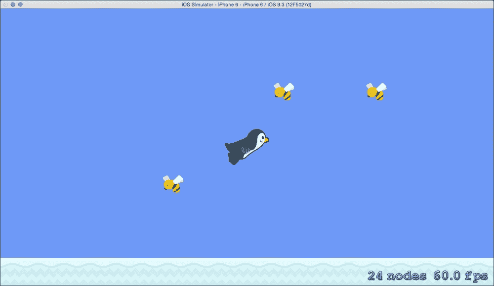
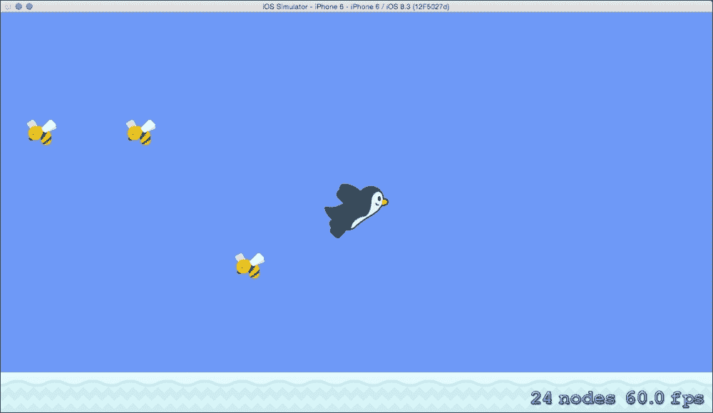

# 第三章：混合物理

SpriteKit 包含一个功能齐全的物理引擎。它易于实现且非常有用；大多数移动游戏设计都需要游戏对象之间一定程度的物理交互。在我们的游戏中，我们想知道玩家何时撞到地面、敌人或道具。物理系统可以跟踪这些碰撞，并在这些事件发生时执行我们的特定游戏代码。SpriteKit 的物理引擎还可以将重力应用于世界，使碰撞的精灵相互弹跳和旋转，并通过冲量创建逼真的运动——而且它会在屏幕上绘制每一帧之前完成所有这些。

本章包括以下主题：

+   为了保持一致性，采用协议

+   将游戏对象组织到类中

+   添加玩家的角色

+   重建 `GameScene` 类

+   物理体和重力

+   探索物理模拟机制

+   使用冲量和力进行移动

+   将蜜蜂撞进蜜蜂中

# 打好基础

到目前为止，我们通过向 `GameScene` 类逐个添加小块代码来学习。我们应用程序的复杂性即将增加。为了构建一个复杂的游戏世界，我们需要构建可重用的类并积极组织我们的新代码。

## 遵循协议

首先，我们想要为每个游戏对象创建单独的类（蜜蜂类、玩家企鹅类、道具类等）。此外，我们希望所有游戏对象类都共享一组一致的属性和方法。我们可以通过创建一个 **协议**，即我们游戏类的蓝图来强制这种一致性。协议本身不提供任何功能，但采用该协议的每个类都必须完全遵循其规范，Xcode 才能编译项目。如果您来自 Java 或 C# 背景，协议与接口非常相似。

将新文件添加到您的项目中（在项目导航器中右键单击并选择**新建文件**，然后选择**Swift 文件**），并将其命名为 `GameSprite.swift`。然后，将以下代码添加到您的新文件中：

```swift
import SpriteKit

protocol GameSprite {
    var textureAtlas: SKTextureAtlas { get set }
    func spawn(parentNode: SKNode, position: CGPoint, size: 
        CGSize)
    func onTap()
}
```

现在，任何采用 `GameSprite` 协议的类都必须实现一个 `textureAtlas` 属性、一个 `spawn` 函数和一个 `onTap` 函数。当我们用代码处理游戏对象时，我们可以安全地假设游戏对象提供了这些实现。

## 重新发明蜜蜂

我们的老蜜蜂工作得非常好，但我们想在世界的各个地方生成许多蜜蜂。我们将创建一个继承自 `SKSpriteNode` 的 `Bee` 类，这样我们就可以干净利落地将任意数量的蜜蜂印在世界上了。

将每个类单独分离到其自己的文件中是一种常见的约定。向您的项目中添加一个新的 `Swift` 文件，并将其命名为 `Bee.swift`。然后，添加以下代码：

```swift
import SpriteKit

// Create the new class Bee, inheriting from SKSpriteNode
// and adopting the GameSprite protocol:
class Bee: SKSpriteNode, GameSprite {
    // We will store our texture atlas and bee animations as
    // class wide properties.
    var textureAtlas:SKTextureAtlas = 
        SKTextureAtlas(named:"bee.atlas")
    var flyAnimation = SKAction()

    // The spawn function will be used to place the bee into
    // the world. Note how we set a default value for the size
    // parameter, since we already know the size of a bee
    func spawn(parentNode:SKNode, position: CGPoint, size: CGSize 
        = CGSize(width: 28, height: 24)) {
        parentNode.addChild(self)
        createAnimations()
        self.size = size
        self.position = position
        self.runAction(flyAnimation)
    }

    // Our bee only implements one texture based animation.
    // But some classes may be more complicated,
    // So we break out the animation building into this function:
    func createAnimations() {
        let flyFrames:[SKTexture] = 
            [textureAtlas.textureNamed("bee.png"), 
            textureAtlas.textureNamed("bee_fly.png")]
        let flyAction = SKAction.animateWithTextures(flyFrames, 
            timePerFrame: 0.14)
        flyAnimation = SKAction.repeatActionForever(flyAction)
    }

    // onTap is not wired up yet, but we have to implement this
    // function to adhere to our protocol.
    // We will explore touch events in the next chapter.
    func onTap() {}
}
```

现在可以轻松地生成我们想要的任意数量的蜜蜂。切换回 `GameScene.swift`，并在 `didMoveToView` 中添加以下代码：

```swift
// Create three new instances of the Bee class:
let bee2 = Bee()
let bee3 = Bee()
let bee4 = Bee()
// Use our spawn function to place the bees into the world:
bee2.spawn(world, position: CGPoint(x: 325, y: 325))
bee3.spawn(world, position: CGPoint(x: 200, y: 325))
bee4.spawn(world, position: CGPoint(x: 50, y: 200))
```

运行项目。蜜蜂，到处都是！我们的原始蜜蜂正在一群蜜蜂中来回飞行。您的模拟器应该看起来像这样：



根据你的看法，你可能觉得新蜜蜂在移动，而原始蜜蜂是静止的。我们需要添加一个参考点。接下来，我们将添加地面。

## 冰原

我们将在屏幕底部添加一些地面，作为玩家定位的约束和移动的参考点。我们将创建一个名为`Ground`的新类。首先，让我们将地面艺术纹理图集添加到我们的项目中。

### 另一种添加资源的方式

我们将使用不同的方法将文件添加到 Xcode 中。按照以下步骤添加新的艺术作品：

1.  在 Finder 中，导航到你在第二章下载的资产包，*精灵、相机、动作！*，然后到`Environment`文件夹。

1.  你之前已经学会了如何为我们的蜜蜂创建纹理图集。我已经为我们在游戏中使用的其余艺术作品创建了纹理图集。定位`ground.atlas`文件夹。

1.  将此文件夹拖放到 Xcode 的项目管理器中，在项目文件夹下，如图所示：

1.  在对话框中，确保你的设置与以下截图匹配，然后点击**完成**：

完美——你应该在项目导航器中看到地面纹理图集。

### 添加地面类

接下来，我们将添加地面代码。在你的项目中添加一个新的 Swift 文件，并将其命名为`Ground.swift`。使用以下代码：

```swift
import SpriteKit

// A new class, inheriting from SKSpriteNode and
// adhering to the GameSprite protocol.
class Ground: SKSpriteNode, GameSprite {
    var textureAtlas:SKTextureAtlas = 
        SKTextureAtlas(named:"ground.atlas")
    // Create an optional property named groundTexture to store 
    // the current ground texture:
    var groundTexture:SKTexture?

    func spawn(parentNode:SKNode, position:CGPoint, size:CGSize) {
        parentNode.addChild(self)
        self.size = size
        self.position = position
        // This is one of those unique situations where we use
        // non-default anchor point. By positioning the ground by
        // its top left corner, we can place it just slightly
        // above the bottom of the screen, on any of screen size.
        self.anchorPoint = CGPointMake(0, 1)

        // Default to the ice texture:
        if groundTexture == nil {
            groundTexture = textureAtlas.textureNamed("ice-
                tile.png");
        }

        // We will create child nodes to repeat the texture.
        createChildren()
    }

    // Build child nodes to repeat the ground texture
    func createChildren() {
        // First, make sure we have a groundTexture value:
        if let texture = groundTexture {
            var tileCount:CGFloat = 0
            let textureSize = texture.size()
            // We will size the tiles at half the size
            // of their texture for retina sharpness:
            let tileSize = CGSize(width: textureSize.width / 2, 
                height: textureSize.height / 2)

            // Build nodes until we cover the entire Ground width
            while tileCount * tileSize.width < self.size.width {
                let tileNode = SKSpriteNode(texture: texture)
                tileNode.size = tileSize
                tileNode.position.x = tileCount * tileSize.width
                // Position child nodes by their upper left corner
                tileNode.anchorPoint = CGPoint(x: 0, y: 1)
                // Add the child texture to the ground node:
                self.addChild(tileNode)

                tileCount++
            }
        }
    }

    // Implement onTap to adhere to the protocol:
    func onTap() {}
}
```

### 纹理平铺

为什么我们需要`createChildren`函数？SpriteKit 不支持内置方法来重复节点大小的纹理。相反，我们为每个纹理瓦片创建子节点，并将它们附加到父节点的宽度上。性能不是问题；只要我们将子节点附加到一个父节点上，并且所有纹理都来自同一个纹理图集，SpriteKit 就会通过一个绘制调用来处理它们。

### 将电线接到地面上

我们已经将地面艺术添加到项目中并创建了`Ground`类。最后一步是在场景中创建`Ground`的实例。按照以下步骤连接地面：

1.  打开`GameScene.swift`，并在`GameScene`类中添加一个新的属性以创建`Ground`类的实例。你可以将此放在实例化世界节点（新代码用粗体表示）的下面：

    ```swift
    let world = SKNode()
    let ground = Ground()

    ```

1.  定位`didMoveToView`函数。在蜜蜂孵化线下面添加以下代码：

    ```swift
    // size and position the ground based on the screen size.
    // Position X: Negative one screen width.
    // Position Y: 100 above the bottom (remember the ground's top
    // left anchor point).
    let groundPosition = CGPoint(x: -self.size.width, y: 100)
    // Width: 3x the width of the screen.
    // Height: 0\. Our child nodes will provide the height.
    let groundSize = CGSize(width: self.size.width * 3, height: 0)
    // Spawn the ground!
    ground.spawn(world, position: groundPosition, size: groundSize)
    ```

运行项目。你将看到冰原出现在我们的蜜蜂下方。这个小小的改动在很大程度上有助于营造我们的中心蜜蜂正在穿越空间的感受。你的模拟器应该看起来像这样：



## 一只野企鹅出现了！

在我们开始物理课程之前，还需要构建一个类：`Player`类！是时候用指定的玩家节点替换移动的蜜蜂了。

首先，我们将添加我们的企鹅艺术纹理图集。到现在为止，你应该熟悉通过项目导航器添加文件。像之前添加地面资产一样添加皮埃尔的美术。我将皮埃尔的纹理图集命名为 `pierre.atlas`。你可以在资产包中找到它，在 `Pierre` 文件夹内。

一旦你将皮埃尔的纹理图集添加到项目中，你就可以创建 `Player` 类。在你的项目中添加一个新的 Swift 文件，并将其命名为 `Player.swift`。然后添加以下代码：

```swift
import SpriteKit

class Player : SKSpriteNode, GameSprite {
    var textureAtlas:SKTextureAtlas = 
        SKTextureAtlas(named:"pierre.atlas")
    // Pierre has multiple animations. Right now we will
    // create an animation for flying up, and one for going down:
    var flyAnimation = SKAction()
    var soarAnimation = SKAction()

    func spawn(parentNode:SKNode, position: CGPoint,
        size:CGSize = CGSize(width: 64, height: 64)) {
        parentNode.addChild(self)
        createAnimations()
        self.size = size
        self.position = position
        // If we run an action with a key, "flapAnimation",
        // we can later reference that key to remove the action.
        self.runAction(flyAnimation, withKey: "flapAnimation")
    }

    func createAnimations() {
        let rotateUpAction = SKAction.rotateToAngle(0, duration: 
            0.475)
        rotateUpAction.timingMode = .EaseOut
        let rotateDownAction = SKAction.rotateToAngle(-1, 
            duration: 0.8)
        rotateDownAction.timingMode = .EaseIn

        // Create the flying animation:
        let flyFrames:[SKTexture] = [
            textureAtlas.textureNamed("pierre-flying-1.png"),
            textureAtlas.textureNamed("pierre-flying-2.png"),
            textureAtlas.textureNamed("pierre-flying-3.png"),
            textureAtlas.textureNamed("pierre-flying-4.png"),
            textureAtlas.textureNamed("pierre-flying-3.png"),
            textureAtlas.textureNamed("pierre-flying-2.png")
        ]
        let flyAction = SKAction.animateWithTextures(flyFrames, 
            timePerFrame: 0.03)
        // Group together the flying animation frames with a 
        // rotation up:
        flyAnimation = SKAction.group([
            SKAction.repeatActionForever(flyAction),
            rotateUpAction
        ])

        // Create the soaring animation, just one frame for now:
        let soarFrames:[SKTexture] = 
            [textureAtlas.textureNamed("pierre-flying-1.png")]
        let soarAction = SKAction.animateWithTextures(soarFrames, 
            timePerFrame: 1)
        // Group the soaring animation with the rotation down:
        soarAnimation = SKAction.group([
            SKAction.repeatActionForever(soarAction),
            rotateDownAction
        ])
    }

    func onTap() {}
}
```

太好了！在我们继续之前，我们需要用我们刚刚创建的新 `Player` 类的实例替换原始蜜蜂。按照以下步骤替换蜜蜂：

1.  在 `GameScene.swift` 文件中，靠近顶部，删除创建 `bee` 常量的行。相反，我们想要实例化一个 `Player` 实例。添加新行：`let player = Player()`.

1.  完全删除 `addTheFlyingBee` 函数。

1.  在 `didMoveToView` 方法中，删除调用 `addTheFlyingBee` 的行。

1.  在 `didMoveToView` 方法中，在底部添加一行以生成玩家：

    ```swift
    player.spawn(world, position: CGPoint(x: 150, y: 250))
    ```

1.  在下方，在 `didSimulatePhysics` 方法中，将蜜蜂的引用替换为 `player` 的引用。回想一下，我们在 第二章 中创建了 `didSimulatePhysics` 函数，当时我们在一个节点上居中相机。

我们已经成功地将原始蜜蜂转换成了企鹅。在我们继续之前，请确保你的 `GameScene` 类包含了本章中我们迄今为止所做的所有更改。之后，我们将开始探索物理系统。

## 修复 GameScene 类

我们对我们的项目做了一些更改。幸运的是，这是之前动画代码的最后一次重大修改。向前看，我们将使用本章中构建的出色结构。到现在为止，你的 `GameScene.swift` 文件应该看起来像这样：

```swift
class GameScene: SKScene {
    let world = SKNode()
    let player = Player()
    let ground = Ground()

    override func didMoveToView(view: SKView) {
        // Set a sky-blue background color:
        self.backgroundColor = UIColor(red: 0.4, green: 0.6, blue: 
            0.95, alpha: 1.0)

        // Add the world node as a child of the scene:
        self.addChild(world)

        // Spawn our physics bees:
        let bee2 = Bee()
        let bee3 = Bee()
        let bee4 = Bee()
        bee2.spawn(world, position: CGPoint(x: 325, y: 325))
        bee3.spawn(world, position: CGPoint(x: 200, y: 325))
        bee4.spawn(world, position: CGPoint(x: 50, y: 200))

        // Spawn the ground:
        let groundPosition = CGPoint(x: -self.size.width, y: 30)
        let groundSize = CGSize(width: self.size.width * 3, 
            height: 0)
        ground.spawn(world, position: groundPosition, size: 
            groundSize)

        // Spawn the player:
        player.spawn(world, position: CGPoint(x: 150, y: 250))
    }

    override func didSimulatePhysics() {
        let worldXPos = -(player.position.x * world.xScale – 
            (self.size.width / 2))
        let worldYPos = -(player.position.y * world.yScale – 
            (self.size.height / 2))
        world.position = CGPoint(x: worldXPos, y: worldYPos)
    }
}
```

运行项目。你会看到我们的新企鹅在蜜蜂附近悬浮。干得好；我们现在准备好使用所有新节点来探索物理系统。你的模拟器应该看起来像这样的截图：



# 探索物理系统

SpriteKit 使用 **物理体** 来模拟物理。我们将物理体附加到所有需要物理计算的节点上。在探索所有细节之前，我们将设置一个快速示例。

## 如飞般坠落

我们的蜜蜂需要成为物理模拟的一部分，因此我们将为它们的节点添加物理体。打开你的 `Bee.swift` 文件并定位到 `spawn` 函数。在函数底部添加以下代码：

```swift
// Attach a physics body, shaped like a circle
// and sized roughly to our bee.
self.physicsBody = SKPhysicsBody(circleOfRadius: size.width / 2)
```

向物理模拟中添加节点就这么简单。运行项目。你会看到我们的三个 `Bee` 实例从屏幕上掉落。它们现在受到重力的作用，默认情况下重力是开启的。

## 巩固地面

我们希望地面能够捕捉下落的游戏对象。我们可以给地面自己的物理体，这样物理模拟就可以阻止蜜蜂穿过它。打开您的`Ground.swift`文件，找到`spawn`函数，然后在函数底部添加以下代码：

```swift
// Draw an edge physics body along the top of the ground node.
// Note: physics body positions are relative to their nodes.
// The top left of the node is X: 0, Y: 0, given our anchor point.
// The top right of the node is X: size.width, Y: 0
let pointTopRight = CGPoint(x: size.width, y: 0)
self.physicsBody = SKPhysicsBody(edgeFromPoint: CGPointZero, 
    toPoint: pointTopRight)
```

运行项目。现在蜜蜂会迅速下落，然后一旦与地面碰撞就会停止。注意下落得更远的蜜蜂弹跳得更有力。蜜蜂着陆后，您的模拟器将看起来像这样：


# 检查点 3-A

到目前为止，工作做得很好。我们已经为我们的游戏添加了很多结构，并开始探索物理系统。如果您想下载到这一点的我的项目，请在此处操作：

[`www.thinkingswiftly.com/game-development-with-swift/chapter-3`](http://www.thinkingswiftly.com/game-development-with-swift/chapter-3)

# 探索物理模拟机制

让我们更详细地看看 SpriteKit 物理系统的具体细节。例如，为什么蜜蜂受到重力的作用，而地面却保持在原地？尽管我们为两个节点都附加了物理体，但实际上我们使用了两种不同的物理体样式。有三种类型的物理体，它们的行为略有不同：

+   **动态**物理体有体积，并且完全受系统中的力和碰撞的影响。我们将为游戏世界的绝大部分使用动态物理体：玩家、敌人、道具等。

+   **静态**物理体有体积但没有速度。物理模拟不会移动具有静态体的节点，但它们仍然可以与其他游戏对象发生碰撞。我们可以使用静态体来制作墙壁或障碍物。

+   **边缘**物理体没有体积，物理模拟永远不会移动它们。它们标记了运动边界；其他物理体永远不会越过它们。边缘可以交叉以创建小的封闭区域。

体积（动态和静态）体具有各种属性，这些属性可以修改它们对碰撞和空间移动的反应。这使我们能够创建各种逼真的物理效果。每个属性控制一个物体的物理特性的一个方面：

+   **恢复系数**决定了当一个物体弹入另一个物体时损失多少能量。这改变了物体的弹性。SpriteKit 在 0.0 到 1.0 的范围内测量恢复系数。默认值是 0.2。

+   **摩擦**描述了滑动一个物体相对于另一个物体所需的力。这个属性也使用 0.0 到 1.0 的刻度，默认值为 0.2。

+   **阻尼**决定了物体在空间中移动时减速的速度。你可以把阻尼想象成空气摩擦。线性阻尼决定了物体失去速度的速度，而角阻尼影响旋转。两者都从 0.0 到 1.0 测量，默认值为 0.1。

+   **质量**是以千克为单位的。它描述了碰撞物体推动物体的距离，并在运动中考虑动量。质量更大的物体在受到另一个物体的撞击时移动较少，并且在它们相互碰撞时会将其他物体推得更远。物理引擎会自动使用物体的质量和面积来确定 **密度**。或者，你可以设置密度，让物理引擎计算质量。通常设置质量更直观。

好的——教科书就到这里吧！让我们通过一些例子来巩固我们的学习。

首先，我们希望重力跳过我们的蜂。我们将手动设置它们的飞行路径。我们需要蜂成为动态物理体，以便与其他节点正确交互，但我们需要这些体忽略重力。对于这种情况，SpriteKit 提供了一个名为 `affectedByGravity` 的属性。打开 `Bee.swift`，在 `spawn` 函数的底部添加以下代码：

```swift
self.physicsBody?.affectedByGravity = false
```

### 小贴士

`physicsBody` 后面的问号是可选链。我们需要解包 `physicsBody`，因为它是一个可选值。如果 `physicsBody` 为 nil，整个语句将返回 nil（而不是触发错误）。你可以把它想象成用内联语句优雅地解包一个可选属性。

运行项目。蜂群现在应该像我们添加它们身体之前一样停留在原地。然而，SpriteKit 的物理模拟现在会影响它们；它们会对冲量和碰撞做出反应。太好了，让我们故意让蜂群相撞。

# 蜂遇蜂

你可能已经注意到我们在游戏世界中将 `bee2` 和 `bee3` 放在了相同的高度。我们只需要推动其中一个水平方向，以创建碰撞——完美的碰撞测试假人！我们可以使用 **冲量** 为外部蜂创建速度。

在 `GameScene.swift` 中找到 `didMoveToView` 函数。在所有生成代码的下方，添加这一行：

```swift
bee2.physicsBody?.applyImpulse(CGVector(dx: -3, dy: 0))
```

运行项目。你会看到最外层的蜂飞向中间并撞到内蜂。这会把内蜂推向左边，并减缓第一只蜂的接触速度。

用一个变量：增加质量，尝试相同的实验。在冲量行之前，添加以下代码来调整 `bee2` 的质量：

```swift
bee2.physicsBody?.mass = 0.2
```

运行项目。嗯，我们的重蜂在相同的冲量下移动不远（毕竟它是一只 200 克的蜂。）它最终撞到了内蜂，但碰撞并不令人兴奋。我们需要增加冲量来推动我们更重的蜂。将冲量行更改为使用 `-15` 的 `dx` 值：

```swift
bee2.physicsBody?.applyImpulse(CGVector(dx: -15, dy: 0))
```

再次运行项目。这次，我们的冲量提供了足够的能量，使重蜂以有趣的方式移动。注意重蜂在碰撞时传递给普通蜂的能量；轻蜂在接触后飞走。两只蜂都有足够的动量，最终完全滑出屏幕。你的模拟器应该看起来像这张截图，就在蜂群滑出屏幕之前：



在您继续之前，您可能希望尝试我在本章前面概述的各种物理属性。您可以创建许多碰撞变体；物理模拟只需付出很少的努力就能提供很多深度。

## 冲量还是力？

您有几种选项可以使用物理体移动节点：

+   冲量是对物理体速度的即时、一次性改变。在我们的测试中，冲量给了蜜蜂速度，并且它慢慢因为阻尼和碰撞而减速。冲量非常适合投射物：导弹、子弹、不高兴的鸟等等。

+   力只在一个物理计算周期内作用于速度。当我们使用力时，我们通常在每一帧之前应用它。力对于火箭船、汽车或其他持续自我推进的任何东西都很有用。

+   您还可以直接编辑物体的`velocity`和`angularVelocity`属性。这对于设置手动速度限制很有用。

# 检查点 3-B

在本章中，我们对我们的项目进行了多项结构性的更改。您可以随意下载我到目前为止的项目：

[Swift 游戏开发](http://www.thinkingswiftly.com/game-development-with-swift/chapter-3)

# 摘要

在本章中，我们取得了巨大的进步。我们新的类组织将在整本书的进程中为我们提供良好的服务。我们学习了如何使用协议在类之间强制一致性，将游戏对象封装到不同的类中，并探讨了在地面节点宽度上的平铺纹理。最后，我们从`GameScene`中清理了一些之前的学习代码，并使用新的类系统生成所有游戏对象。

我们还将物理模拟应用于我们的游戏。我们在 SpriteKit 中强大的物理系统中只是触及了表面——我们将在第七章实现碰撞事件中深入探讨自定义碰撞事件——但我们已经获得了相当多的功能。我们探索了三种类型的物理体，并研究了您可以使用来微调游戏对象物理行为的各种物理属性。然后，我们通过让蜜蜂相互碰撞并观察结果来将所有辛勤工作付诸实践。

接下来，我们将尝试几种控制方案，并将玩家移动到游戏世界中。这是一个令人兴奋的补充；我们的项目将开始感觉像一款真正的游戏。添加控制。
