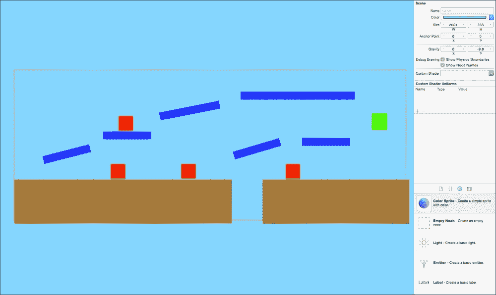
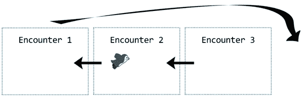
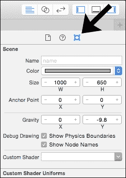
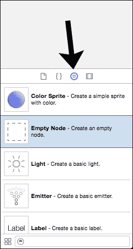
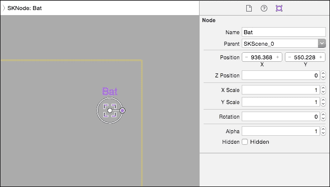
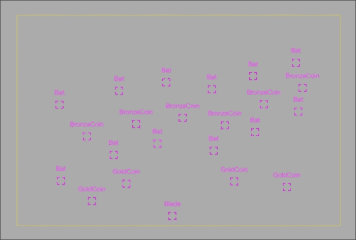
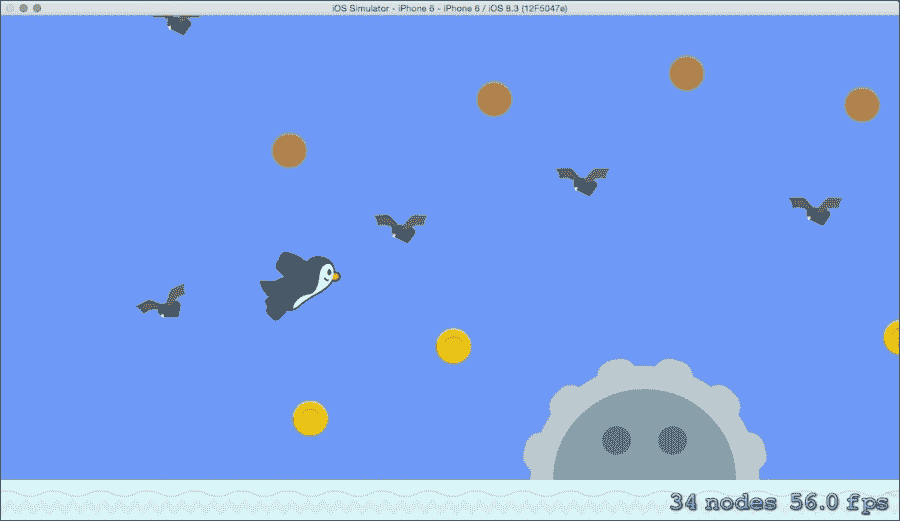
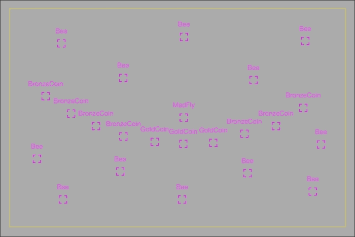
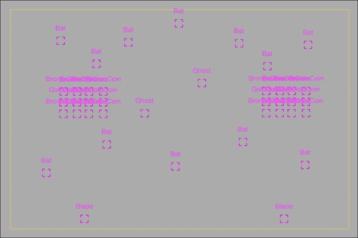
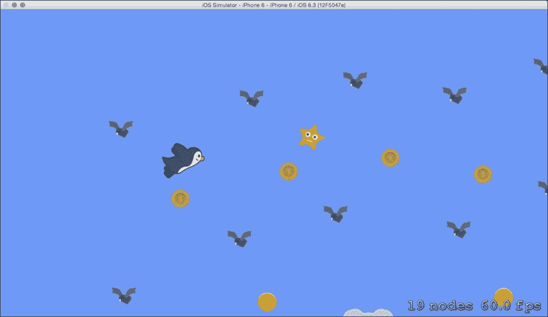

# 第六章. 生成无尽世界

无尽飞行游戏独特的挑战在于以程序方式生成丰富、有趣的游戏世界，其范围延伸到玩家可以飞行的距离。我们将首先探索 Xcode 中的关卡设计概念和工具；Apple 在 Xcode 6 中添加了一个内置关卡设计师，允许开发者在一个场景中直观地排列节点。一旦我们熟悉了 SpriteKit 关卡设计方法，我们将创建一个自定义解决方案来生成我们的世界。在本章中，您将为我们的企鹅游戏构建一个有趣的世界，并学习如何在 SpriteKit 中为任何类型的游戏设计和实现关卡。

本章包括以下主题：

+   使用 SpriteKit 场景编辑器设计关卡

+   为皮埃尔企鹅构建遭遇战

+   将场景集成到游戏中

+   为永无止境的世界循环遭遇战

+   随机添加星级提升

# 使用 SpriteKit 场景编辑器设计关卡

场景编辑器是 SpriteKit 的一个宝贵补充。以前，开发者被迫硬编码位置值或依赖第三方工具或自定义解决方案。现在，我们可以在 Xcode 中直接布局我们的关卡。我们可以创建节点，附加物理体和约束，创建物理场，并直接从界面中编辑属性。

随意尝试场景编辑器，熟悉其界面。要使用场景编辑器，请向您的游戏添加一个新的场景文件，然后在项目导航器中选择场景。以下是一个您可能为平台游戏构建的简单示例场景：



在这个例子中，我只是在场景中拖动并定位了**彩色精灵**。如果您正在制作一个简单的游戏，您可以直接在场景编辑器中绘制不需要基于纹理动画的节点。通过在编辑器中编辑物理体，您甚至可以在编辑器中创建整个基于物理的游戏，只需添加几行控制代码。

复杂的游戏需要为每个对象定制逻辑和纹理动画，因此我们将在我们的企鹅游戏中实现一个系统，该系统仅使用场景编辑器作为布局生成工具。我们将编写代码来解析编辑器中的布局数据，并将其转换为本书中创建的游戏类的完整功能版本。这样，我们将以最小的努力将游戏逻辑与数据分离。

## 将关卡数据与游戏逻辑分离

关卡布局是数据，最好将数据与代码分离。通过将关卡数据分离到场景文件中，您可以提高灵活性。其好处包括：

+   非技术贡献者，如艺术家和设计师，可以在不更改任何代码的情况下添加和编辑关卡。

+   迭代时间得到改善，因为您每次需要查看更改时不需要在模拟器中运行游戏。场景编辑器布局提供即时视觉反馈。

+   每个级别都在一个独特的文件中，这在使用像 Git 这样的源代码控制解决方案时避免合并冲突是理想的。

## 使用空节点作为占位符

场景编辑器缺乏创建可重用类的能力，也没有将您的代码类链接到场景编辑器节点的方法。相反，我们将使用空节点作为场景编辑器中的占位符，并在代码中使用我们自己的类的实例来替换它们。您经常会看到这种技术的变体。例如，苹果的 SpriteKit 冒险游戏演示使用这种技术进行其部分关卡设计。

您可以在场景编辑器中为节点分配名称，然后在代码中查询这些名称。例如，您可以在场景编辑器中创建名为**Bat**的空节点，然后在`GameScene`类中编写代码，将每个名为`Bat`的节点替换为我们的`Bat`类的实例。

为了说明这个概念，我们将为企鹅游戏创建我们的第一次相遇。

# 无尽飞行中的相遇

无尽飞行动作游戏会一直进行，直到玩家失败。它们没有特定的级别；相反，我们将为我们的主角企鹅设计“相遇”。我们可以通过将一次又一次的相遇连接起来，并在需要更多内容时从开始处随机回收，来创建一个无尽的世界。

以下图像说明了基本概念：



一款完成的游戏可能包含 20 个或更多的相遇，以感觉多样化且随机。在本章中，我们将创建三个相遇来充实相遇回收系统。

我们将像对待标准平台游戏或物理游戏中的单独关卡一样，在各自的场景文件中构建每个相遇。

## 创建我们的第一次相遇

首先，创建一个相遇文件夹组以保持我们的项目有序。在项目导航器中右键单击您的项目，创建一个名为`Encounters`的新组。然后，在`Encounters`上右键单击，并添加一个名为`EncounterBats.sks`的新 SpriteKit 场景文件（从**iOS** | **资源**类别）。

Xcode 会将新的场景文件添加到您的项目中，并打开场景编辑器。您应该看到一个灰色背景和黄色边框，指示新场景的边界。场景默认宽度为 1024 点，高度为 768 点。我们应该更改这些值。如果每个相遇宽度为 1000 像素，高度为 650 点，那么将它们连接起来会更容易。

您可以轻松地在 SKNode 检查器中更改场景的大小值。在场景编辑器的右上角，确保您已通过选择最右边的图标打开 SKNode 检查器，然后更改宽度和高度，如下面的截图所示：



接下来，我们将为`Bat`类创建第一个占位符节点。按照以下步骤在场景编辑器中创建一个**空节点**：

1.  你可以从对象库中拖动节点。要打开对象库，请看向场景编辑器的右下角并选择圆形图标，如图所示：

1.  将一个**空节点**拖动到你的场景中。

1.  使用右上角的 SKNode 检查器，将你的节点命名为`Bat`，如图所示：

你将看到**蝙蝠**出现在空节点上方。太好了，我们已经创建了一个占位符。我们将重复此过程，直到为皮埃尔企鹅构建一个完整的遭遇。我们不仅可以使用蝙蝠，但我们需要首先定义我们将用于标记每个节点的名称。如果你是在团队中制作游戏，你将想要事先达成一致。以下是我将用于每个游戏对象的标签：

| 游戏对象类 | 场景编辑器节点名称 |
| --- | --- |
| `Bat` | 蝙蝠 |
| `Bee` | 蜜蜂 |
| `Blade` | 刀片 |
| `Coin` (bronze) | 青铜币 |
| `Coin` (gold) | 金币 |
| `Ghost` | 幽灵 |
| `MadFly` | 疯狂飞虫 |

随意构建你的蝙蝠遭遇。添加更多空节点，并使用标签，直到你对设计满意为止。试着想象企鹅角色在遭遇中飞翔。

在我的遭遇中，我创建了一条通过蝙蝠的简单路径，路径上布满了青铜币，以及一条在蝙蝠下方和刀片上方的更难路径，路径上布满了金币。你可以使用以下图像中的我的蝙蝠遭遇作为灵感：



# 将场景集成到游戏中

接下来，我们将创建一个新的类来管理我们游戏中的遭遇。将一个新的 Swift 文件添加到你的项目中，并将其命名为`EncounterManager.swift`。`EncounterManager`类将遍历我们的遭遇场景，并使用位置数据在游戏世界中创建适当的游戏对象类。在新的文件中添加以下代码：

```swift
import SpriteKit

class EncounterManager {
    // Store your encounter file names:
    let encounterNames:[String] = [
        "EncounterBats"
    ]
    // Each encounter is an SKNode, store an array:
    var encounters:[SKNode] = []

    init() {
        // Loop through each encounter scene:
        for encounterFileName in encounterNames {
            // Create a new node for the encounter:
            let encounter = SKNode()

            // Load this scene file into a SKScene instance:
            if let encounterScene = SKScene(fileNamed: 
                encounterFileName) {
                // Loop through each placeholder, spawn the 
                // appropriate game object:
                for placeholder in encounterScene.children {
                    if let node = placeholder as? SKNode {
                        switch node.name! {
                        case "Bat":
                            let bat = Bat()
                            bat.spawn(encounter, position: 
                                node.position)
                        case "Bee":
                            let bee = Bee()
                            bee.spawn(encounter, position: 
                                node.position)
                        case "Blade":
                            let blade = Blade()
                            blade.spawn(encounter, position: 
                                node.position)
                        case "Ghost":
                            let ghost = Ghost()
                            ghost.spawn(encounter, position: 
                                node.position)
                        case "MadFly":
                            let madFly = MadFly()
                            madFly.spawn(encounter, position: 
                                node.position)
                        case "GoldCoin":
                            let coin = Coin()
                            coin.spawn(encounter, position: 
                                node.position)
                            coin.turnToGold()
                        case "BronzeCoin":
                            let coin = Coin()
                            coin.spawn(encounter, position: 
                                node.position)
                        default:
                            println("Name error: \(node.name)") 
                        }
                    }
                }
            }

            // Add the populated encounter node to the array:
            encounters.append(encounter)
        }
    }

    // We will call this addEncountersToWorld function from
    // the GameScene to append all of the encounter nodes to the
    // world node from our GameScene:
    func addEncountersToWorld(world:SKNode) {
        for index in 0 ... encounters.count - 1 {
            // Spawn the encounters behind the action, with
            // increasing height so they do not collide:
            encounters[index].position = CGPoint(x: -2000, y: 
                index * 1000)
            world.addChild(encounters[index])
        }
    }
}
```

太好了，你刚刚添加了在游戏世界中使用我们的场景文件数据的功能。接下来，按照以下步骤在`GameScene`类中连接`EncounterManager`类：

1.  在`GameScene`类上添加`EncounterManager`类的新实例作为常量：

    ```swift
    let encounterManager = EncounterManager()
    ```

1.  在`didMoveToView`函数的底部，调用`addEncountersToWorld`以将每个遭遇节点作为`GameScene`类世界节点的子节点添加：

    ```swift
    encounterManager.addEncountersToWorld(self.world)
    ```

1.  由于`EncounterManager`类在屏幕外生成遭遇，我们将暂时将我们的第一个遭遇直接移动到起始玩家位置以测试我们的代码。在`didMoveToView`函数中添加此行：

    ```swift
    encounterManager.encounters[0].position = CGPoint(x: 300, y: 0)
    ```

运行项目。你将看到皮埃尔在新的蝙蝠遭遇中飞翔。你的游戏应该看起来像以下截图：



恭喜你，你已经实现了在场景编辑器中使用占位符节点的核心功能。你可以移除在步骤 3 中添加的定位这个遭遇的行，即添加到遭遇数组中的行（加粗的新行）。接下来，我们将创建一个系统，在皮埃尔企鹅之前重新定位每个遭遇。

# 检查点 6-A

你可以从这个 URL 下载到这个点的我的项目：

[`www.thinkingswiftly.com/game-development-with-swift/chapter-6`](http://www.thinkingswiftly.com/game-development-with-swift/chapter-6)

# 生成无限遭遇

我们至少需要三个遭遇来无限循环并创建一个永无止境的世界；任何时候可以有任意两个在屏幕上，第三个在玩家前方。我们可以跟踪皮埃尔的进度并重新定位他前方的遭遇节点。

## 构建更多遭遇

在我们可以实现重新定位系统之前，我们需要构建至少两个更多的遭遇。如果你愿意，可以创建更多；系统将支持任意数量的遭遇。现在，向你的游戏中添加两个额外的场景文件：`EncounterBees.sks` 和 `EncounterCoins.sks`。你可以完全用蜜蜂、幽灵、刀片、金币和蝙蝠填充这些遭遇——享受乐趣吧！

为了获得灵感，这里是我的蜜蜂遭遇经历：



这里是我的金币遭遇：



## 更新 EncounterManager 类

我们必须让 `EncounterManager` 类了解这些新的遭遇。打开 `EncounterManager.swift` 文件并将新的遭遇名称添加到 `encounterNames` 常量中：

```swift
// Store your encounter file names:
let encounterNames:[String] = [
    "EncounterBats",
    "EncounterBees",
    "EncounterCoins"
]
```

我们还需要跟踪在任意给定时间可能出现在屏幕上的遭遇。向 `EncounterManager` 类添加两个新属性：

```swift
var currentEncounterIndex:Int?
var previousEncounterIndex:Int?
```

### 在 SKSpriteNode 的 userData 属性中存储元数据

当皮埃尔在世界中移动时，我们将回收遭遇节点，因此我们需要在将其放置在玩家前方之前重置遭遇中的所有游戏对象的功能。否则，皮埃尔之前的遭遇之旅可能会将节点移位。

`SKSpriteNode` 类提供了一个名为 `userData` 的属性，我们可以用它来存储有关精灵的任何杂项数据。我们将使用 `userData` 属性来存储遭遇中每个精灵的初始位置，这样我们就可以在重新定位遭遇时重置精灵。向 `EncounterManager` 类添加这两个新函数：

```swift
// Store the initial positions of the children of a node:
func saveSpritePositions(node:SKNode) {
    for sprite in node.children {
        if let spriteNode = sprite as? SKSpriteNode {
            let initialPositionValue = NSValue(CGPoint: 
                sprite.position)
            spriteNode.userData = ["initialPosition": 
                initialPositionValue]
            // Save the positions for children of this node:
            saveSpritePositions(spriteNode)
        }
    }
}

// Reset all children nodes to their original position:
func resetSpritePositions(node:SKNode) {
    for sprite in node.children {
        if let spriteNode = sprite as? SKSpriteNode {
            // Remove any linear or angular velocity:
            spriteNode.physicsBody?.velocity = CGVector(dx: 0,
                dy: 0)
            spriteNode.physicsBody?.angularVelocity = 0
            // Reset the rotation of the sprite:
            spriteNode.zRotation = 0
            if let initialPositionVal = spriteNode.userData?.valueForKey("initialPosition") as? NSValue {
                // Reset the position of the sprite:
                spriteNode.position = 
                    initialPositionVal.CGPointValue()
            }

            // Reset positions on this node's children
            resetSpritePositions(spriteNode)
        }
    }
}
```

我们想在 `init` 时调用我们的新 `saveSpritePositions` 函数，当我们首次生成遭遇时。更新 `EncounterManager` 的 `init` 函数，在将遭遇节点添加到遭遇数组中的行下面（加粗的新行）：

```swift
// Add the populated encounter node to the encounter array:
encounters.append(encounter)
// Save initial sprite positions for this encounter:
saveSpritePositions(encounter)

```

最后，我们需要一个函数来重置遭遇并在玩家前方重新定位它们。向 `EncounterManager` 类添加这个新函数：

```swift
func placeNextEncounter(currentXPos:CGFloat) {
    // Count the encounters in a random ready type (Uint32):
    let encounterCount = UInt32(encounters.count)
    // The game requires at least 3 encounters to function
    // so exit this function if there are less than 3
    if encounterCount < 3 { return }

    // We need to pick an encounter that is not
    // currently displayed on the screen.
    var nextEncounterIndex:Int?
    var trulyNew:Bool?
    // The current encounter and the directly previous encounter
    // can potentially be on the screen at this time.
    // Pick until we get a new encounter
    while trulyNew == false || trulyNew == nil {
        // Pick a random encounter to set next:
        nextEncounterIndex = 
            Int(arc4random_uniform(encounterCount))
        // First, assert that this is a new encounter:
        trulyNew = true
        // Test if it is instead the current encounter:
        if let currentIndex = currentEncounterIndex {
            if (nextEncounterIndex == currentIndex) {
                trulyNew = false
            }
        }
        // Test if it is the directly previous encounter:
        if let previousIndex = previousEncounterIndex {
            if (nextEncounterIndex == previousIndex) {
                trulyNew = false
            }
        }
    }

    // Keep track of the current encounter:
    previousEncounterIndex = currentEncounterIndex
    currentEncounterIndex = nextEncounterIndex

    // Reset the new encounter and position it ahead of the player
    let encounter = encounters[currentEncounterIndex!]
    encounter.position = CGPoint(x: currentXPos + 1000, y: 0)
    resetSpritePositions(encounter)
}
```

## 在 GameScene 类中连接 EncounterManager

我们将在 `GameScene` 类中跟踪皮埃尔的进度，并在适当的时候调用 `EncounterManager` 类代码。按照以下步骤连接 `EncounterManager` 类：

1.  向 `GameScene` 类添加一个新属性，以跟踪何时在玩家前方定位下一次遭遇。我们将从 `150` 开始，以便立即生成第一个遭遇：

    ```swift
    var nextEncounterSpawnPosition = CGFloat(150)
    ```

1.  接下来，我们只需在 `didSimulatePhysics` 函数中检查玩家是否移动到这个位置。在 `didSimulatePhysics` 的底部添加此代码：

    ```swift
    // Check to see if we should set a new encounter:
    if player.position.x > nextEncounterSpawnPosition {
        encounterManager.placeNextEncounter( nextEncounterSpawnPosition)
        nextEncounterSpawnPosition += 1400
    }
    ```

太棒了 - 我们已经添加了所有需要的功能，以在玩家前方无限循环遭遇。运行项目。你应该会看到你的遭遇无限循环在你面前。享受飞越你的辛勤工作！

# 在随机位置生成星力升级

我们还需要将星力升级添加到世界中。我们可以随机在每 10 次遭遇中生成一个星力，以增加一些额外的兴奋感。按照以下步骤添加星力逻辑：

1.  在 `GameScene` 类中添加 `Star` 类的新实例作为常量：

    ```swift
    let powerUpStar = Star()
    ```

1.  在 `GameScene didMoveToView` 函数的任何地方调用星力的 `spawn` 函数：

    ```swift
    // Spawn the star, out of the way for now
    powerUpStar.spawn(world, position: CGPoint(x: -2000, y: - 2000))
    ```

1.  在 `GameScene didSimulatePhysics` 函数中，按照以下方式更新你的新遭遇代码：

    ```swift
    // Check to see if we should set a new encounter:
    if player.position.x > nextEncounterSpawnPosition {
    encounterManager.placeNextEncounter(
        nextEncounterSpawnPosition)
        nextEncounterSpawnPosition += 1400

        // Each encounter has a 10% chance to spawn a star:
        let starRoll = Int(arc4random_uniform(10))
        if starRoll == 0 {
            if abs(player.position.x - powerUpStar.position.x) > 1200 {
                // Only move the star if it is off the screen.
                let randomYPos = CGFloat(arc4random_uniform(400))
                powerUpStar.position = CGPoint(x: 
                    nextEncounterSpawnPosition, y: randomYPos)
                powerUpStar.physicsBody?.angularVelocity = 0
                powerUpStar.physicsBody?.velocity = CGVector(dx: 0, dy: 0)
            }
        }
    }
    ```

再次运行游戏，你应该会看到星力偶尔在遭遇中生成，如下面的截图所示：



# 检查点 6-B

要下载到这一点的我的项目，请访问此 URL：

[`www.thinkingswiftly.com/game-development-with-swift/chapter-6`](http://www.thinkingswiftly.com/game-development-with-swift/chapter-6)

# 摘要

干得好 - 我们在本章中覆盖了大量的内容。你了解了 Xcode 的新场景编辑器，学会了如何使用场景编辑器来布局占位符节点，并解释了节点数据以在游戏世界中生成游戏对象。然后，你创建了一个系统来循环我们的无尽飞行游戏中的遭遇。

恭喜你；在本章中构建的遭遇系统是我们游戏中最复杂的系统。你现在正式处于一个很好的位置来完成你的第一个 SpriteKit 游戏！

接下来，我们将探讨在游戏对象碰撞时创建自定义事件。我们将在第七章 实现碰撞事件 中添加健康、伤害、金币拾取、无敌状态等功能。
