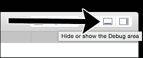
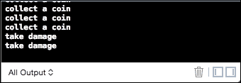
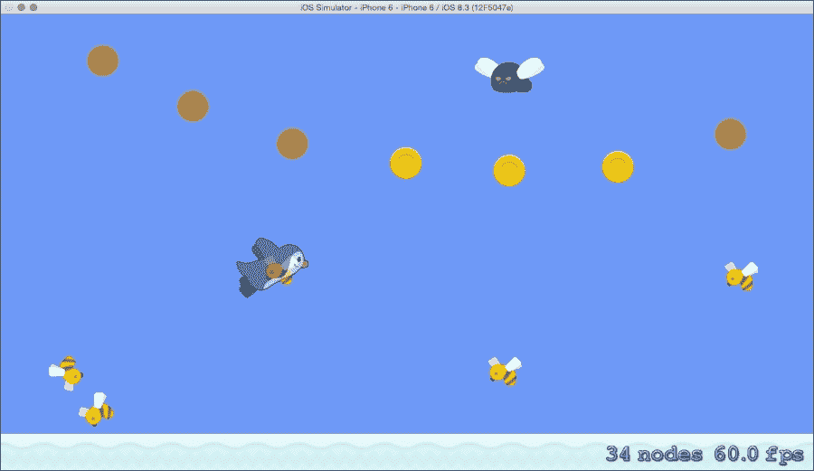

# 第七章. 实现碰撞事件

到目前为止，我们让 SpriteKit 物理模拟检测和处理游戏对象之间的碰撞。你已经看到，当皮埃尔企鹅飞入敌人或金币时，它会将它们发送到太空。这是因为物理模拟自动监控碰撞并设置每个碰撞物体的碰撞后轨迹和速度。在本章中，当两个物体接触时，我们将添加自己的游戏逻辑：从敌人那里受到伤害、在接触星星后给予玩家无敌状态，以及玩家收集金币时跟踪分数。随着游戏机制变得生动，游戏将变得更加有趣。

本章包括以下主题：

+   学习 SpriteKit 碰撞词汇

+   将接触事件添加到我们的游戏中

+   玩家健康和伤害

+   收集金币

+   提升星级逻辑

# 学习 SpriteKit 碰撞词汇

SpriteKit 使用一些独特概念和术语来描述物理事件。如果你现在熟悉这些术语，那么在章节后面的实现步骤中理解起来会更容易。

## 碰撞与接触

当物理体在相同空间中聚集时，有两种类型的交互：

+   **碰撞**是物理模拟在物体接触后对物体进行数学分析和重新定位。碰撞包括物体之间所有的自动物理交互：防止重叠、弹开、空中旋转和传递动量。默认情况下，物理体与场景中的其他所有物理体发生碰撞；到目前为止，我们在游戏中已经见证了这种自动碰撞行为。

+   当两个物体接触时，也会发生**接触**事件。接触事件允许我们在两个物体接触时，将自定义游戏逻辑连接进去。接触事件本身不会产生任何变化；它们只为我们提供了执行自己代码的机会。例如，当玩家或玩家遇到敌人时，我们将使用接触事件来分配伤害。默认情况下没有接触事件；在本章中，我们将手动配置接触。

### 小贴士

物理体默认情况下与场景中的其他所有物体发生碰撞，但你可以配置特定的物体以忽略碰撞并相互穿过而不产生任何物理反应。

此外，碰撞和接触是独立的；你可以禁用两种类型物体之间的物理碰撞，并在物体穿过彼此时仍然使用接触事件来执行自定义代码。

## 物理类别掩码

你可以为游戏中的每个物理体分配物理类别。这些类别允许你指定应该发生碰撞的物体、应该接触的物体以及应该无事件地相互穿过的物体。当两个物体尝试共享同一空间时，物理模拟将比较每个物体的类别并测试是否应该触发碰撞或接触事件。

### 注意

我们的游戏将包括企鹅、地面、金币和敌人的物理类别。

物理类别以 32 位掩码存储，这使得物理模拟可以通过处理器高效的位操作执行这些测试。虽然理解位操作不是使用物理类别所必需的，但如果您有兴趣扩展您的知识，这是一个很好的阅读主题。如果您感兴趣，可以尝试在互联网上搜索 `swift bitwise operations`。

每个物理物体都有三个属性，您可以使用这些属性来控制游戏中的碰撞。让我们先简单总结每个属性，然后再深入探讨：

+   `categoryBitMask`：物理物体的物理类别

+   `collisionBitMask`：与这些物理类别发生碰撞

+   `contactTestBitMask`：与这些物理类别接触

`categoryBitMask` 属性存储了物体当前的物理类别。默认值是 `0xFFFFFFFF`，相当于所有类别。这意味着默认情况下，每个物理物体都属于所有物理类别。

`collisionBitMask` 属性指定了物体应该与之碰撞的物理类别，防止两个物体共享相同的空间。起始值是 `0xFFFFFFFF`，或所有位都设置，意味着默认情况下，物体将与每个类别发生碰撞。当一个物体开始与另一个物体重叠时，物理模拟将比较每个物体的 `collisionBitMask` 与另一个物体的 `categoryBitMask`。如果匹配，则发生碰撞。请注意，这个测试是双向的；每个物体可以独立参与或忽略碰撞。

`contactTestBitMask` 属性与碰撞属性的工作方式相同，但指定了接触事件而不是碰撞的类别。默认值是 `0x00000000`，或没有设置位，意味着默认情况下，物体不会与任何物体接触。

这是一个复杂的话题。如果你还没有完全理解这个主题，可以继续前进。将类别掩码实现到我们的游戏中将帮助你学习。

## 在 Swift 中使用类别掩码

苹果的冒险游戏演示提供了在 Swift 中使用位掩码的良好实现。我们将遵循他们的例子，并使用 `enum` 来存储我们的类别作为 `UInt32` 值，并以易于阅读的方式编写这些位掩码。以下是一个理论战争游戏的物理类别 `enum` 的示例：

```swift
enum PhysicsCategory:UInt32 {
    case playerTank = 1
    case enemyTanks = 2
    case missiles = 4
    case bullets = 8
    case buildings = 16
}
```

对于每个后续组，双倍其值非常重要；这是创建适当的位掩码以进行物理模拟的必要步骤。例如，如果我们添加 `fighterJets`，则值需要是 `32`。始终记得双倍后续值以创建独特的位掩码，以便在物理测试中按预期执行。

### 小贴士

位掩码是 CPU 可以非常快速比较的二进制值，以检查是否匹配。您不需要理解位运算符来完成此材料，但如果您已经熟悉并且好奇，这种加倍方法之所以有效，是因为 `2` 等同于 `1 << 1`（二进制：`10`），`4` 等同于 `1 << 2`（二进制：`100`），`8` 等同于 `1 << 3`（二进制：`1000`），依此类推。我们选择手动加倍，因为 `enum` 值必须是字面量，这些值对人类来说更容易阅读。

# 为我们的游戏添加接触事件

现在您已经熟悉了 SpriteKit 的物理概念，我们可以进入 Xcode 为我们的企鹅游戏实现物理类别和接触逻辑。我们将首先添加我们的物理类别。

## 设置物理类别

要创建我们的物理类别，请打开您的 `GameScene.swift` 文件，并在 `GameScene` 类外部底部输入以下代码：

```swift
enum PhysicsCategory:UInt32 {
    case penguin = 1
    case damagedPenguin = 2
    case ground = 4
    case enemy = 8
    case coin = 16
    case powerup = 32
}
```

注意我们是如何像之前的例子那样将每个后续值翻倍的。我们还为我们的企鹅在受到伤害后使用创建了一个额外的类别。我们将使用 `damagedPenguin` 物理类别，以便企鹅在受到伤害后几秒钟内能够穿过敌人。

## 将类别分配给游戏对象

现在我们有了物理类别，我们需要回到现有的游戏对象并将类别分配给物理体。我们将从 `Player` 类开始。

### 玩家

打开 `Player.swift` 并在 `spawn` 函数底部添加以下代码：

```swift
self.physicsBody?.categoryBitMask =
    PhysicsCategory.penguin.rawValue
self.physicsBody?.contactTestBitMask =
    PhysicsCategory.enemy.rawValue |
    PhysicsCategory.ground.rawValue |
    PhysicsCategory.powerup.rawValue |
    PhysicsCategory.coin.rawValue
```

我们将企鹅物理类别分配给 `Player` 物理体，并使用 `contactTestBitMask` 属性设置与敌人、地面、提升和金币的接触测试。

此外，请注意我们如何使用 `enum` 值的 `rawValue` 属性。当您使用物理类别位掩码时，您将需要使用 `rawValue` 属性。

### 地面

接下来，让我们为 `Ground` 类分配物理类别。打开 `Ground.swift`，并在 `spawn` 函数底部添加以下代码：

```swift
self.physicsBody?.categoryBitMask =
    PhysicsCategory.ground.rawValue
```

我们需要做的只是将地面位掩码分配给 `Ground` 类的物理体，因为它默认情况下已经与所有物体发生碰撞。

### 星星提升

打开 `Star.swift` 并在 `spawn` 函数底部添加以下代码：

```swift
self.physicsBody?.categoryBitMask =
    PhysicsCategory.powerup.rawValue
```

这将功率提升物理类别分配给 `Star` 类。

### 敌人

在 `Bat.swift`、`Bee.swift`、`Blade.swift`、`Ghost.swift` 和 `MadFly.swift` 中执行此相同操作。在它们的 `spawn` 函数内部添加以下代码：

```swift
self.physicsBody?.categoryBitMask = PhysicsCategory.enemy.rawValue
self.physicsBody?.collisionBitMask =
    ~PhysicsCategory.damagedPenguin.rawValue
```

我们使用位运算的 `NOT` 操作符 (`~`) 从与敌人的碰撞中移除 `damagedPenguin` 物理类别。敌人将与所有类别发生碰撞，除了 `damagedPenguin` 物理类别。这允许我们在想要企鹅忽略敌人碰撞并直接穿过时，将企鹅的类别更改为 `damagedPenguin` 值。

### 金币

最后，我们将添加金币的物理类别。我们不希望金币与其他游戏对象发生碰撞，但我们仍然想要监控接触事件。打开 `Coin.swift` 文件，在 `spawn` 函数的底部添加以下代码：

```swift
self.physicsBody?.categoryBitMask = PhysicsCategory.coin.rawValue
self.physicsBody?.collisionBitMask = 0
```

## 准备 GameScene 以处理接触事件

现在我们已经为游戏对象分配了物理类别，我们可以在 `GameScene` 类中监控接触事件。按照以下步骤连接 `GameScene` 类：

1.  首先，我们需要告诉 `GameScene` 类实现 `SKPhysicsContactDelegate` 协议。SpriteKit 就可以在接触事件发生时通知 `GameScene` 类。将 `GameScene` 类声明行修改为如下所示：

    ```swift
    class GameScene: SKScene, SKPhysicsContactDelegate {
    ```

1.  我们将通过将 `GameScene physicsWorld contactDelegate` 属性设置为 `GameScene` 类来告诉 SpriteKit 通知 `GameScene` 类接触事件。在 `GameScene didMoveToView` 函数的底部添加以下行：

    ```swift
    self.physicsWorld.contactDelegate = self
    ```

1.  `SKPhysicsContactDelegate` 定义了一个 `didBeginContact` 函数，当发生接触时将会触发。我们现在可以在 `GameScene` 类中实现这个 `didBeginContact` 函数。在 `GameScene` 类中创建一个新的函数，命名为 `didBeginContact`，如下面的代码所示：

    ```swift
    func didBeginContact(contact: SKPhysicsContact) {
        // Each contact has two bodies; we do not know which is which.
        // We will find the penguin body, then use
        // the other body to determine the type of contact.
        let otherBody:SKPhysicsBody
        // Combine the two penguin physics categories into one
        // bitmask using the bitwise OR operator |
        let penguinMask = PhysicsCategory.penguin.rawValue |
            PhysicsCategory.damagedPenguin.rawValue
        // Use the bitwise AND operator & to find the penguin.
        // This returns a positive number if body A's category
        // is the same as either the penguin or damagedPenguin:
        if (contact.bodyA.categoryBitMask & penguinMask) > 0 {
            // bodyA is the penguin, we will test bodyB: 
            otherBody = contact.bodyB
        }
        else {
            // bodyB is the penguin, we will test bodyA:
            otherBody = contact.bodyA
        }
        // Find the type of contact:
        switch otherBody.categoryBitMask {
        case PhysicsCategory.ground.rawValue:
            println("hit the ground")
        case PhysicsCategory.enemy.rawValue:
            println("take damage")
        case PhysicsCategory.coin.rawValue:
            println("collect a coin")
        case PhysicsCategory.powerup.rawValue:
            println("start the power-up")
        default:
            println("Contact with no game logic")
        }
    }
    ```

这个函数将作为我们接触事件的中心枢纽。当我们的各种接触事件发生时，我们将向控制台打印信息，以测试我们的代码是否正常工作。

### 查看控制台输出

您可以使用 `println` 函数将信息写入控制台，这对于调试非常有用。如果您尚未在 Xcode 中使用控制台，请按照以下简单步骤查看它：

1.  在 Xcode 的右上角，确保调试区域已开启，如图所示：

1.  在 Xcode 的右下角，确保控制台已开启，如图所示：

### 测试我们的接触代码

现在您可以看到控制台输出了，运行项目。当您将皮埃尔飞入各种游戏对象时，应该会在控制台中看到我们的 `println` 字符串。您的控制台应该看起来像这样：



恭喜——如果您在控制台中看到了接触输出，您已经完成了我们接触系统的结构。

您可能会注意到飞入金币会产生奇怪的碰撞行为，我们将在本章后面增强这一点。接下来，我们将为每种接触类型添加游戏逻辑。

# 检查点 7-A

要下载到这一点的项目，请访问此 URL：

[`www.thinkingswiftly.com/game-development-with-swift/chapter-7`](http://www.thinkingswiftly.com/game-development-with-swift/chapter-7)

# 玩家生命值和伤害

首个自定义接触逻辑是玩家伤害。我们将为玩家分配健康点数，并在受伤时扣除。当玩家耗尽健康点数时，游戏结束。这是我们游戏玩法的基础机制之一。按照以下步骤实现健康逻辑：

1.  在 `Player.swift` 文件中，向 `Player` 类添加六个新属性：

    ```swift
    // The player will be able to take 3 hits before game over:
    var health:Int = 3
    // Keep track of when the player is invulnerable:
    var invulnerable = false
    // Keep track of when the player is newly damaged:
    var damaged = false
    // We will create animations to run when the player takes
    // damage or dies. Add these properties to store them:
    var damageAnimation = SKAction()
    var dieAnimation = SKAction()
    // We want to stop forward velocity if the player dies,
    // so we will now store forward velocity as a property:
    var forwardVelocity:CGFloat = 200
    ```

1.  在 `update` 函数中，更改移动玩家通过世界的代码以使用新的 `forwardVelocity` 属性：

    ```swift
    // Set a constant velocity to the right:
    self.physicsBody?.velocity.dx = self.forwardVelocity

    ```

1.  在 `startFlapping` 函数的非常开始处添加此行，以防止玩家在死亡时飞得更高：

    ```swift
    if self.health <= 0 { return }
    ```

1.  在 `stopFlapping` 函数的非常开始处添加相同的行，以防止在死亡后运行飞翔动画：

    ```swift
    if self.health <= 0 { return }
    ```

1.  向 `Player` 类添加一个名为 `die` 的新函数：

    ```swift
    func die() {
        // Make sure the player is fully visible:
        self.alpha = 1
        // Remove all animations:
        self.removeAllActions()
        // Run the die animation:
        self.runAction(self.dieAnimation)
        // Prevent any further upward movement:
        self.flapping = false
        // Stop forward movement:
        self.forwardVelocity = 0
    }
    ```

1.  向 `Player` 类添加一个名为 `takeDamage` 的新函数：

    ```swift
    func takeDamage() {
        // If invulnerable or damaged, return:
        if self.invulnerable || self.damaged { return }

        // Remove one from our health pool
        self.health--
        if self.health == 0 {
            // If we are out of health, run the die function:
            die()
        }
        else {
            // Run the take damage animation:
            self.runAction(self.damageAnimation)
        }
    }
    ```

1.  打开 `GameScene.swift` 文件。在 `didBeginContact` 函数中，更新与敌人接触时触发的 switch 案例：

    ```swift
    case PhysicsCategory.enemy.rawValue:
        println("take damage")
     player.takeDamage()

    ```

1.  当我们撞击地面时，我们也会受到伤害。以相同的方式更新地面情况：

    ```swift
    case PhysicsCategory.ground.rawValue:
        println("hit the ground")
     player.takeDamage()

    ```

干得好——让我们测试我们的代码以确保一切正常工作。运行项目并撞击一些敌人。你可以在控制台输出的打印内容中检查一切是否正常工作。受到三次伤害后，企鹅应该掉到地上并变得无反应。

### 注意

你可能会注意到，玩家在玩游戏时无法知道他们剩余多少健康点数。我们将在下一章中向场景添加一个健康计。

接下来，当玩家受到伤害和游戏结束时，我们将通过新的动画增强游戏的感受。

## 受伤和游戏结束动画

当玩家受到敌人打击时，我们将使用 `SKAction` 序列创建有趣的动画。通过组合动作，我们将在玩家击中敌人后提供一个受伤状态下的临时安全。我们将展示一个逐渐脉冲然后随着安全状态开始减弱而加速的淡入淡出动画。

### 受伤动画

要添加新动画，请将此代码添加到 `Player` 类的 `createAnimations` 函数底部：

```swift
// --- Create the taking damage animation ---
let damageStart = SKAction.runBlock {
    // Allow the penguin to pass through enemies:
    self.physicsBody?.categoryBitMask =
        PhysicsCategory.damagedPenguin.rawValue
    // Use the bitwise NOT operator ~ to remove
    // enemies from the collision test:
    self.physicsBody?.collisionBitMask =
        ~PhysicsCategory.enemy.rawValue
}
// Create an opacity pulse, slow at first and fast at the end:
let slowFade = SKAction.sequence([
    SKAction.fadeAlphaTo(0.3, duration: 0.35),
    SKAction.fadeAlphaTo(0.7, duration: 0.35)
    ])
let fastFade = SKAction.sequence([
    SKAction.fadeAlphaTo(0.3, duration: 0.2),
    SKAction.fadeAlphaTo(0.7, duration: 0.2)
    ])
let fadeOutAndIn = SKAction.sequence([
    SKAction.repeatAction(slowFade, count: 2),
    SKAction.repeatAction(fastFade, count: 5),
    SKAction.fadeAlphaTo(1, duration: 0.15)
    ])
// Return the penguin to normal:
let damageEnd = SKAction.runBlock {
    self.physicsBody?.categoryBitMask =
        PhysicsCategory.penguin.rawValue
    // Collide with everything again:
    self.physicsBody?.collisionBitMask = 0xFFFFFFFF
    // Turn off the newly damaged flag:
    self.damaged = false
}
// Store the whole sequence in the damageAnimation property:
self.damageAnimation = SKAction.sequence([
    damageStart,
    fadeOutAndIn,
    damageEnd
    ])
```

接下来，更新 `takeDamage` 函数，在受到打击后立即标记玩家为受伤。你刚刚创建的受伤动画将在完成后关闭受伤标记。在此更改后，`takeDamage` 函数的前四行应该看起来像这样（新代码用粗体表示）：

```swift
// If invulnerable or damaged, return out of the function:
if self.invulnerable || self.damaged { return }
// Set the damaged state to true after being hit:
self.damaged = true

```

运行项目。在受到伤害后，你的企鹅应该逐渐消失并能够穿过敌人，如图所示：



我们开始看到我们辛勤工作的良好成果。注意企鹅在无敌状态下可以穿过敌人，但仍然与金币、星星和地面发生碰撞。接下来，我们将添加一个游戏结束动画。

### 游戏结束动画

当企鹅的生命值耗尽时，我们将创建一个有趣且夸张的死亡动画。当皮埃尔失去最后一点生命值时，他将悬挂在空中，放大体型，翻转到背部，然后最终跌落到地面。为了实现这个动画，在 `Player` 类的 `createAnimations` 函数底部添加以下代码：

```swift
/* --- Create the death animation --- */
let startDie = SKAction.runBlock {
    // Switch to the death texture with X eyes:
    self.texture =
        self.textureAtlas.textureNamed("pierre-dead.png")
    // Suspend the penguin in space:
    self.physicsBody?.affectedByGravity = false
    // Stop any movement:
    self.physicsBody?.velocity = CGVector(dx: 0, dy: 0)
    // Make the penguin pass through everything except the ground:
    self.physicsBody?.collisionBitMask =
        PhysicsCategory.ground.rawValue
}

let endDie = SKAction.runBlock {
    // Turn gravity back on:
    self.physicsBody?.affectedByGravity = true
}

self.dieAnimation = SKAction.sequence([
    startDie,
    // Scale the penguin bigger:
    SKAction.scaleTo(1.3, duration: 0.5),
    // Use the waitForDuration action to provide a short pause:
    SKAction.waitForDuration(0.5),
    // Rotate the penguin on to his back:
    SKAction.rotateToAngle(3, duration: 1.5),
    SKAction.waitForDuration(0.5),
    endDie
])
```

运行项目并与三个敌人碰撞。你会看到如截图所示的喜剧死亡动画播放：


可怜的皮埃尔企鹅！你很好地实现了伤害和死亡动画。接下来，我们将处理硬币接触事件上的硬币收集。

# 收集硬币

作为玩家的主要目标之一，收集硬币应该是我们游戏中最令人愉快的方面之一。当玩家接触硬币时，我们将创建一个奖励动画。按照以下步骤实现硬币收集：

1.  在 `GameScene.swift` 中，向 `GameScene` 类添加一个新属性：

    ```swift
    var coinsCollected = 0
    ```

1.  在 `Coin.swift` 中，向 `Coin` 类添加一个名为 `collect` 的新函数：

    ```swift
    func collect() {
        // Prevent further contact:
        self.physicsBody?.categoryBitMask = 0
        // Fade out, move up, and scale up the coin:
        let collectAnimation = SKAction.group([
            SKAction.fadeAlphaTo(0, duration: 0.2),
            SKAction.scaleTo(1.5, duration: 0.2),
            SKAction.moveBy(CGVector(dx: 0, dy: 25), duration: 0.2)
        ])
        // After fading it out, move the coin out of the way
        // and reset it to initial values until the encounter
        // system re-uses it:
        let resetAfterCollected = SKAction.runBlock {
            self.position.y = 5000
            self.alpha = 1
            self.xScale = 1
            self.yScale = 1
            self.physicsBody?.categoryBitMask =
                PhysicsCategory.coin.rawValue
        }
        // Combine the actions into a sequence:
        let collectSequence = SKAction.sequence([
            collectAnimation,
            resetAfterCollected
        ])
        // Run the collect animation:
        self.runAction(collectSequence)
    }
    ```

1.  在 `GameScene.swift` 中，在 `didBeginContact` 函数的硬币接触情况下调用新的 `collect` 函数：

    ```swift
    case PhysicsCategory.coin.rawValue:
        // Try to cast the otherBody's node as a Coin:
        if let coin = otherBody.node as? Coin {
            // Invoke the collect animation:
            coin.collect()
            // Add the value of the coin to our counter:
            self.coinsCollected += coin.value
            println(self.coinsCollected)
        }
    ```

干得好！运行项目并尝试收集一些硬币。你会看到硬币执行它们的收集动画。游戏将跟踪你收集的硬币数量，并将数字打印到控制台。玩家目前还看不到这个数字；我们将在下一章中在游戏屏幕上添加一个文本计数器。接下来，我们将实现升级星的游戏逻辑。

# 升级星逻辑

当玩家接触星星时，我们将授予玩家短暂的不可伤害状态，并给予玩家极大的速度以通过遭遇。按照以下步骤实现升级：

1.  在 `Player.swift` 中，向 `Player` 类添加一个新函数，如下所示：

    ```swift
    func starPower() {
        // Remove any existing star power-up animation, if
        // the player is already under the power of star
        self.removeActionForKey("starPower")
        // Grant great forward speed:
        self.forwardVelocity = 400
        // Make the player invulnerable:
        self.invulnerable = true
        // Create a sequence to scale the player larger,
        // wait 8 seconds, then scale back down and turn off
        // invulnerability, returning the player to normal: 
        let starSequence = SKAction.sequence([
            SKAction.scaleTo(1.5, duration: 0.3),
            SKAction.waitForDuration(8),
            SKAction.scaleTo(1, duration: 1),
            SKAction.runBlock {
                self.forwardVelocity = 200
                self.invulnerable = false
            }
        ])
        // Execute the sequence:
        self.runAction(starSequence, withKey: "starPower")
    }
    ```

1.  在 `GameScene` 类的 `didBeginContact` 函数中，在升级情况下调用新的函数：

    ```swift
    case PhysicsCategory.powerup.rawValue:
        player.starPower()
    ```

你可能会发现增加星星升级的生成率来测试很有帮助。记住，我们在 `GameScene` 的 `didSimulatePhysics` 函数中生成一个随机数，以确定星星生成的频率。为了更频繁地生成星星，注释掉生成随机数的行，并用硬编码的 `0` 替换它，如下所示（新代码用粗体标出）：

```swift
//let starRoll = Int(arc4random_uniform(10))
let starRoll = 0
if starRoll == 0 {
```

太好了，现在测试星星升级会很容易。运行项目并找到一个星星。企鹅应该放大体型并开始向前冲，在经过时吹飞敌人，如截图所示：


在你继续之前，记得将星星生成代码改回随机数，否则星星会生成得太频繁。

# 检查点 7-B

我们在本章中取得了巨大的进步。要下载到这一点的项目，请访问此网址：

[`www.thinkingswiftly.com/game-development-with-swift/chapter-7`](http://www.thinkingswiftly.com/game-development-with-swift/chapter-7)

# 摘要

我们的小企鹅游戏看起来棒极了！你通过实现精灵接触事件，让核心机制变得生动起来。你学习了 SpriteKit 如何处理碰撞和接触，使用了位掩码为不同类型的精灵分配碰撞类别，在我们的企鹅游戏中搭建了一个接触系统，并添加了自定义游戏逻辑，包括受到伤害、收集金币和获得星级增强。

到目前为止，我们已经有一个可玩的游戏了；下一步是添加润色、菜单和功能，使游戏脱颖而出。我们将在第八章“Polishing to a Shine – HUD, Parallax Backgrounds, Particles, and More”中，通过添加 HUD、背景图像、粒子发射器等，让我们的游戏更加闪耀。第八章。
