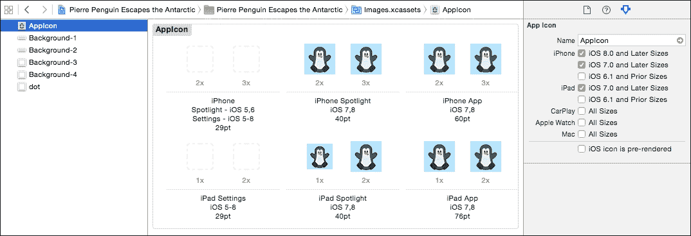

# 第十一章。发布它！为 App Store 和发布做准备

多么伟大的旅程！我们已经走过了使用 Swift 进行游戏开发过程的每一个环节，我们终于准备好将我们的辛勤工作与世界分享了。我们需要通过完成与之相关的资产来为项目的发布做准备：各种应用图标、启动屏幕和 App Store 的截图。然后，我们将在 iTunes Connect 中填写我们应用的描述和信息。最后，我们将使用 Xcode 上传生产归档构建并提交给苹果的审查流程。我们离在 App Store 上看到我们的游戏越来越近了！

虽然我可以向你展示你可以使用的提交应用的通用路径，但随着苹果更新 iTunes Connect，这个过程一直在变化。此外，每个应用都有其独特的方面，可能需要在本章中我展示的路径上进行调整。我鼓励你浏览 iOS 开发者库中的苹果官方文档，并参考 Stack Overflow 以获取更新的答案。你可以通过浏览到[`developer.apple.com/library/ios`](https://developer.apple.com/library/ios)来定位 iOS 开发者库。

本章包括以下主题：

+   完成资产：应用图标和启动屏幕

+   完成 iTunes Connect 信息

+   配置定价

+   从 Xcode 上传我们的项目

+   在 iTunes Connect 中提交审查

# 完成资产

在我们能够发布我们的游戏之前，我们需要一些外围资产。我们将创建一组应用图标，重新设计启动屏幕，并为我们在 App Store 预览中支持的每个设备拍摄截图。

## 添加应用图标

我们的应用需要多个尺寸的应用图标才能在 App Store 和我们所支持的各个 iOS 设备上正确显示。你可以在提供的资产包中的`Icon`文件夹中找到一个示例图标集。

### 小贴士

你应该设计一个宽度为 1024 像素、高度为 1024 像素的图标，然后将其缩小以适应其他变体。确保检查每个变体，以确保调整大小后看起来仍然很好。你将在本章后面将这个大尺寸直接上传到 iTunes Connect。

将图标集成到项目中的最佳方式是使用与新建项目一起提供的预配置为应用图标的`Images.xcassets`资产包。我们将拖放我们的图标到这个文件中，将它们引入到项目中。

按照以下步骤将我们的图标添加到项目中：

1.  在 Xcode 中，打开`Images.xcassets`文件，在左侧面板中找到**AppIcon**图像集。

1.  将资产包中的图像拖放到相应的图标槽中。你可以将文件作为组拖放，Xcode 将处理它们到正确的槽中。你可以忽略设置图标的图标槽，因为我们的应用不与 iOS 设置集成。当你完成时，你的图标图像集将看起来像这样：

1.  通过点击项目导航器中的你的项目进入你的常规项目设置。找到**应用图标源**设置，并确保它设置为**AppIcon**以使用图像包，如图所示：

我们在 Xcode 中添加图标已经完成。稍后我们还需要上传一些更多尺寸的图标到 iTunes Connect。你可以在真实设备上运行你的项目来查看你的新图标效果。

## 设计启动屏幕

当用户在设备上点击你的图标时，iOS 会以极快的速度显示你的应用的启动屏幕作为一个简单的预览。这给人一种应用几乎立即加载的错觉。玩家会立即从他们的点击中获得反馈，而你的应用实际上在后台加载。这不是添加徽标、品牌或任何信息的地方。目标是创建一个非常简单的屏幕，看起来像你的应用在内容放置之前的样子。对于 Pierre Penguin，我们将实现一个简单的空白天空蓝色背景，看起来像主菜单在没有内容之前的样子。

按照以下步骤设置你的天空蓝色启动屏幕：

1.  在 Xcode 中打开`LaunchScreen.xib`文件。你将在界面构建器中看到启动屏幕打开。

1.  选择每个现有的文本元素，并使用键盘上的*删除*键删除每个元素。

1.  通过点击启动屏幕的空白区域中的任何位置来选择整个框架。

1.  确保你打开了 Xcode 右侧的实用工具栏，并打开**属性检查器**，如图所示：

1.  在右侧栏中找到背景颜色设置，然后点击现有的白色颜色选项以打开颜色选择窗口。

1.  选择颜色滑块标签，并输入 RGB 值`102`，`153`，`242`，如图所示：

1.  你应该看到整个框架从我们的游戏中变成了天空蓝色。

1.  接下来，通过点击项目导航器中的项目名称来输入你的常规设置。就像之前为应用图标所做的，确保**启动屏幕文件**设置为**LaunchScreen**：

完美！当我们运行我们的应用时，我们会立即看到天空蓝色，这为从主屏幕到我们完全加载的应用提供了一个更平滑的过渡。

## 为每个支持的设备截图

有趣的截图会让你的游戏在 App Store 中脱颖而出。我为 Pierre Penguin 在资源包的`Screenshots`文件夹中创建了一些示例截图。你需要为每个你想要支持的 iOS 设备创建单独的截图。

截图必须是 JPG 或 PNG 文件。你可以使用我的示例截图作为每个截图尺寸的模板，或者按照以下表格：

| 设备尺寸 | 全屏游戏的截图尺寸 |
| --- | --- |
| 3.5"（必需） | 960x640 像素 |
| 4"（必需） | 1136x640 像素 |
| 4.7" | 1334x750 像素 |
| 5.5" | 2208x1242 像素 |
| iPad（所有版本） | 2048x1536 像素 |

一旦您的截图准备就绪，您就可以在 iTunes Connect 中最终确定您的游戏设置。我们将在下一部分完成 iTunes Connect 的详细信息。

# 最终确定 iTunes Connect 信息

iTunes Connect 控制我们在 App Store 中的应用详情。我们将使用 iTunes Connect 为我们的游戏创建描述，添加我们希望在 App Store 中显示的截图，并配置我们的定价信息和项目设置。

按照以下步骤填写您的 iTunes Connect 信息：

1.  在您的网络浏览器中打开 iTunes Connect 网站。浏览到**我的应用**部分，然后点击您的游戏。iTunes Connect 将带您到您游戏页面的**版本**标签。

1.  我们将从截图开始。将每个设备截图拖放到**应用视频预览和截图**部分的相应槽位中，如图所示：

1.  滚动并填写下一部分的信息：**名称**、**描述**、**关键词**和相关的 URL。这些字段是自我解释的，但您始终可以点击灰色问号圆圈以获取苹果的详细信息。

    ### 小贴士

    关于关键词：如果您有强大、准确的关键词，用户将更容易找到您的应用。尝试使用您认为人们可能会在 App Store 中输入以引导他们到您的游戏的短语。您限制在 100 个字符内，因此请省略关键词之间的空格。

1.  接下来，滚动到**通用应用信息**部分。在这里，您将上传您的应用图标，输入版本号（`1.0`），选择您的应用的 App Store 类别（**游戏**），并提供您的地址信息。如果您需要关于这些字段中的任何进一步的详细信息，请再次点击灰色问号圆圈。

1.  滚动并找到**Game Center**，然后翻转滑块到开启位置。您需要通过点击蓝色加号图标添加排行榜和成就，如图所示：

1.  最后，滚动到**应用审核信息**部分，并再次填写您的联系信息。这是为了在苹果员工需要更多信息时审核您的应用。您还可以选择在审核通过后是否希望游戏自动发布到 App Store，或者等待您手动发布以配合您的营销活动。

1.  点击右上角的**保存**。

## 配置价格

皮埃尔企鹅将免费供所有人游玩，但您可以为您的游戏选择许多定价策略。

### 小贴士

苹果不断更新 iTunes Connect，我预计价格部分很快将进行重大更新。您的体验可能与这些步骤不完全一致。

按照以下步骤设置您游戏的价格：

1.  在您的游戏的 iTunes Connect 页面上，点击顶部导航栏中的**价格**标签。

1.  选择 **可用日期**、**价格层级**和教育折扣。以下是我的设置供您参考：

1.  在右下角点击 **保存**。

完美！我们的 iTunes Connect 信息已完整并准备好提交到 App Store 审查流程。现在我们只需在 Xcode 中最终确定并上传我们的构建版本。

### 小贴士

如果您想对您的游戏收费，那么您需要填写在 iTunes Connect 的 **协议、税务和银行** 部分找到的合同和银行信息。

# 从 Xcode 上传我们的项目

接下来，我们将创建我们游戏的最终构建版本，验证它是否包含 App Store 所需的所有内容，并将捆绑包上传到 iTunes Connect。

首先，我们将为我们的游戏创建部署存档。当您对项目满意时，使用 **产品** 菜单并选择 **存档...**，如图所示：

一旦流程完成，Xcode 将打开您的存档列表。从这里，您可以验证您的应用程序，以确保它包含所有必需的资产和配置文件，以便在 App Store 上发布。按照以下步骤验证您的应用程序并将其上传到 iTunes Connect：

1.  点击以下截图所示的 **验证** 按钮，以验证您的应用程序。

1.  下一个屏幕将要求您为您的应用程序选择一个开发团队。如果您是独立开发者，您只需选择自己的名字，如图所示：

1.  Xcode 将为您创建一个分发配置文件，然后带您进入一个摘要屏幕。只需点击 **验证** 按钮：

1.  Xcode 将继续验证一切是否为 App Store 准备就绪，这可能需要几分钟。完成后，您应该会看到一个成功消息，如图所示。如果您收到任何错误，您可能缺少 App Store 所需的资产或配置文件。阅读并回复错误消息，并参考 iOS 开发者库、网络搜索或 Stack Overflow 以获取进一步的帮助。

1.  点击 **完成**，然后点击蓝色 **提交到 App Store** 按钮将存档上传到 iTunes Connect，如图所示：

1.  您需要再次点击通过验证步骤，然后最终点击 **提交**。Xcode 将然后将您的应用程序上传到 iTunes Connect 并显示另一个成功消息。

恭喜！您已成功将您的应用程序上传到 Apple。我们几乎完成了应用程序的提交。接下来，我们将返回到 iTunes Connect，将我们的应用程序推送到审查和批准流程。

# 在 iTunes Connect 中提交审查

我们已经完成了项目的准备工作，我们准备好将我们的辛勤工作提交给苹果的审核流程。按照以下步骤提交你的应用到苹果：

1.  返回到 iTunes Connect 网站，浏览到你的游戏页面（在**版本**标签页）。

1.  滚动到**构建**部分，并在提交你的应用之前选择**点击+添加构建**。

1.  使用单选按钮选择你刚刚上传的归档，然后点击**完成**，如下所示。上传的构建显示在这个列表中可能需要几分钟（有时是几个小时）：

1.  在右上角点击**保存**，然后**提交审核**按钮应该会亮起蓝色：

1.  点击**提交审核**，iTunes Connect 将显示包含关于你的游戏的三个最终问题的**提交审核**页面。苹果想知道你的应用是否使用了加密、第三方内容或广告。我为 Pierre Penguin 回答了所有三个问题都是否定的。准确回答这些问题非常重要，所以如果你不确定如何进行，请在 iTunes Connect 中使用问号图标获取更多信息。

1.  在你回答了**提交审核**问题后，点击右上角的**提交**。这是提交过程的最后一步。

如果你的应用提交成功，iTunes Connect 将返回到你的应用页面的版本标签页。你会看到应用状态变为**等待审核**，如下所示：

太棒了！我们已经将我们的游戏提交给了苹果。审核过程通常需要 7-14 天。如果你的游戏没有获得批准就返回，不要气馁，苹果通常要求开发者纠正小问题并重新提交他们的应用。你正在走向在 App Store 看到你的游戏！

# 摘要

许多独立开发者都挣扎于发布游戏的最后一步。如果你准备好发布一款游戏，你做得很好！在本章中，我们创建了应用图标和我们的启动屏幕，在 iTunes Connect 中最终确定了我们的 App Store 营销信息，使用 Xcode 归档并上传了我们的游戏，并将我们的游戏提交给苹果进行审核。你现在应该对自己的能力有信心，能够将你的游戏发布到 App Store。

在本书的过程中，我们取得了巨大的成就：我们从一个新的项目模板开始，组装了一个完整的 Swift 游戏，直到发布。当我们各自走向不同的道路时，我祝愿你在未来的游戏开发事业中取得巨大成功。我希望你现在对自己的能力有信心，能够用 Swift 开始自己的游戏项目。我期待在 App Store 看到你的作品！
