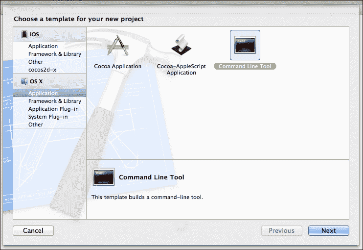
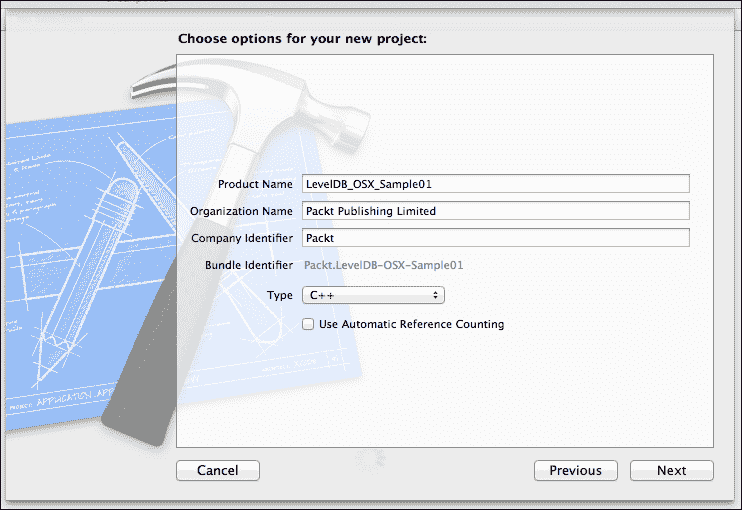
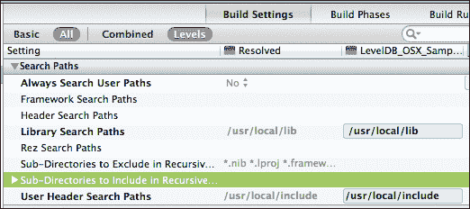
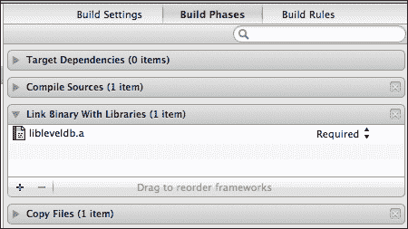
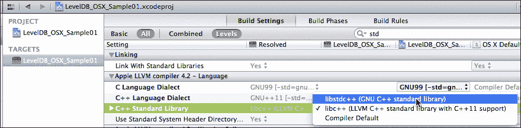

# 第一章。下载 LevelDB 和用 OS X 构建

本章将指导你下载 LevelDB 并使用针对 OS X 构建的特定命令行技术构建它。然后，它将展示如何设置一个简单的 OS X 应用程序的 Xcode 项目，iOS 的详细信息请参阅第二章，*安装 LevelDB 和为 iOS 构建*。

构建错误消息以及我们如何处理它们将对任何使用开源项目的基于 Mac 的开发者都有用。这些通常假设开发者熟悉 Unix 开发工具和安装惯例。我们将从高度详细的内容开始，以便让那些只在其他平台上的 Xcode 或类似 IDE 上使用过的人更容易理解。后面的章节将总结步骤，因此你可能需要回来复习。

本章中的说明将假设你正在使用 OS X 的终端。我们将用作终端提示符的`$`将根据你的本地终端设置而变化，通常显示当前工作目录。

本章中的示例使用了最小限度的 C++（使用 C++11 的更易用的风格）。安装步骤和源代码的完整日志文件可在 Packt Publishing 网站上找到，后面的章节有更大的示例作为完整的应用程序。

### 小贴士

本章中的说明与通用 Unix 命令类似，但你可能会发现命令、目录结构和权限略有不同。大多数 Linux 发行版具有类似的目录布局，但 OS X 与通用 Unix 实践甚至与早期的 OS X 标准有所不同。

# 安装 LevelDB

想要积极使用最新源代码的人可以使用 Git 克隆仓库，从以下说明开始：[`code.google.com/p/leveldb/source/checkout`](https://code.google.com/p/leveldb/source/checkout)。项目维护者通常在少量更改后更新发布存档，因此除非你计划积极贡献，否则很少有动力与仓库一起工作。一个基于本书中使用的源代码，面向为 Apple 构建的 Git 克隆是：[`code.google.com/r/dentaroo-appleflavouredleveldb/`](https://code.google.com/r/dentaroo-appleflavouredleveldb/)。

要决定你是否想更新你的 LevelDB 副本，你可以查看变更历史记录在[`code.google.com/p/leveldb/source/list`](https://code.google.com/p/leveldb/source/list)。以下的大部分截图和示例来自 2013 年 5 月 14 日发布的版本 1.10.1。对后续版本的任何依赖都将进行讨论。至少有一个针对 LevelDB 的补丁是直接由于这本书的贡献，问题 177，在后续编译器上为 iOS 构建。

LevelDB、其他库和我们的示例主要使用 Xcode 版本 4.6.3 编译，并使用 Xcode 5 的开发者预览版进行验证，因为它们是可用的。

稳定的 LevelDB 版本始终可在下载页面获得：[`code.google.com/p/leveldb/downloads/list`](https://code.google.com/p/leveldb/downloads/list)。

打开该页面，然后点击 1.10.1，这将带您到一个特定的页面，允许您点击`.tar.gz`文件并下载它。

使用标准的 Unix 工具`tar`，将解压缩`.gz`步骤，然后在一个命令中解包`.tar`存档。如果您想了解更多信息，请查看`tar --help`：

```swift
$ tar xvf leveldb-1.10.0.tar.gz
x leveldb-1.10.0/
…
x leveldb-1.10.0/util/coding.cc

```

现在文件已解压，将目录更改到其中：

```swift
$ cd leveldb-1.10.0
$ pwd
/Users/andydent/dev/openSourceDev/leveldb-1.10.0

```

您可以清理这里的`.tar`文件，因为它不再需要，但我建议存档一份您的`zip`文件副本，以供以后比较和恢复。

## 构建 LevelDB 库

与许多开源项目不同，LevelDB 没有附带配置脚本。要构建我们的第一个版本，只需在命令行中输入`make`（见`make.txt`日志）。理解`makefile`非常重要，它是一个纯文本文件，您可以用任何编辑器打开它。在顶部有一个注释部分，允许您设置 OPT 以指定调试或生产构建（默认）。

目标是出现在行左侧的标签，以冒号结尾，例如`db_bench`。大多数 makefile 至少有`all`和`clean`目标。`clean`目标会删除所有之前的构建产品，这样您就可以保证使用更改后的设置进行构建。LevelDB 源代码附带了一系列测试，通过`make check`调用（见`make check.txt`日志）。在`make check`的输出中，您将看到：

```swift
==== Test TableTest.ApproximateOffsetOfCompressed
skipping compression tests

```

由于 LevelDB 的默认安装缺少用于快速压缩表中值的 snappy 压缩库，因此跳过了压缩测试。

您可以对 LevelDB 库进行的进一步检查是运行`db_bench`命令，这是一个由 makefile 构建的时间工具。它作为`make check`的一部分构建，也可以通过命令`build db_bench`在任何时候构建。如果您现在运行`db_bench`并保存输出，您可以在包含 snappy 前后比较基准测试结果。我们还将查看使用针对您应用程序特定的数据使用 snappy 的影响，在第十章 *调整和关键策略* 中，我们将探讨调整。

## 安装 snappy

如果您的数据库具有非常大的值，例如存储在单个记录中的完整文档，snappy 压缩库非常有用。您经常在 LevelDB 的讨论中看到它被提及。

为了完整性，我们将介绍如何安装 snappy 以及使用默认选项构建它。不幸的是，在撰写本文时，它无法使用我们在后续章节中将使用的 C++11 和 libc++选项进行构建。因此，在您在此处对 snappy 进行任何实验后，请使用以下说明来删除它，以避免与 libc++相关的编译错误。

要安装 snappy，我们通过一个类似的过程从[`code.google.com/p/snappy/downloads/list`](http://code.google.com/p/snappy/downloads/list)下载存档，然后解压，使用第二个终端窗口以便更容易跟踪不同的库。这次，有一个配置脚本。我们使用以下命令构建和安装：

```swift
$./configure
$make
$make install

```

经过这三个过程（见日志）后，你将在`/usr`的标准位置找到 snappy 的包含文件和构建库，LevelDB makefile 会在这里查找它们。在 LevelDB 目录的终端窗口中，使用以下命令重新构建你的 LevelDB 库：

```swift
$make clean
$make

```

你会在`make`命令的日志中看到**–DSNAPPY**，这表示它检测到了 snappy 的安装并更改了选项以匹配。如果你重复执行`make check`，你会看到压缩测试正在工作。

## 删除 snappy

如果你已经安装了 snappy 进行这些测试，如上所述，你可能想将其删除。makefile 中内置了一个卸载目标，可以从标准位置将其删除，这是 LevelDB makefile 检查的位置。

在一个工作目录设置为你的 snappy 目录的终端中：

```swift
$ make uninstall
( cd '/usr/local/share/doc/snappy' &&rm -f ChangeLog COPYINGINSTALL NEWS README format_description.txt framing_format.txt )
( cd '/usr/local/include' &&rm -f snappy.h snappy-sinksource.h snappy-stubs-public.h snappy-c.h )
 /bin/sh ./libtool   --mode=uninstall rm -f '/usr/local/lib/libsnappy.la'
libtool: uninstall: rm -f /usr/local/lib/libsnappy.la /usr/local/lib/libsnappy.1.dylib /usr/local/lib/libsnappy.dylib /usr/local/lib/libsnappy.a

```

现在将目录切换回你的 LevelDB 源目录，执行`make clean`，然后重复原始的`make`命令以重新构建你的库。

### 小贴士

在构建之前清理是一个好习惯。几乎所有的 makefile 都会在源文件被污染后重新构建，但不会对环境变化做出响应，因此需要通过清理强制进行全面重建。

# 移动到 Xcode

现在构建过程已经成功构建了库、实用程序和测试程序，你可以继续以纯 Unix 方式编程命令行工具，通过编辑`cpp`文件并使用 make 命令构建它们。对于 OS X GUI 和所有 iOS 应用，我们必须使用 Xcode 进行构建。

### 小贴士

我们将首先创建一个工作空间。使用工作空间来封装项目是一个好习惯，因为新的**CocoaPods**标准用于交付开源模块，它依赖于它们。在这个阶段，我们没有技术上的理由必须使用工作空间，只是养成好习惯。

在 Xcode 中，导航到**文件** | **新建** | **工作空间**，在你可以用作开发基础的地方创建一个工作空间。

### 小贴士

我建议避免在路径名称中使用空格，因为有时这会导致脚本或实用程序执行一些意外的操作。这也是给 Windows 开发者的一个很好的建议，即使他们使用的是最新的 Visual Studio。不是核心工具让你陷入困境，而是相关的脚本、命令行或环境变量。

现在导航到**文件** | **新建** | **项目**，这将显示一个模板选择器。在左侧面板中选择 OS X **应用程序**，然后点击提供的图标中的**命令行工具**，然后点击**下一步**：



选择命令行工具模板

选择一个 C++ 项目，并取消选择 **使用自动引用计数** 复选框。确保您指定了 **产品名称** 和 **公司标识符**。当您输入这些条目时，您会看到 **捆绑标识符** 正在从它们生成：`Packt.LevelDB-OSX-Sample01`。如下面的截图所示：



输入选项并查看捆绑标识符

**下一步** 按钮将您带到保存对话框，您可以在其中指定项目将被创建的位置。保留 **源** **控制** 选项，并选择 **添加到**：我们称为 `levelDB_OSX` 的工作区。

您将看到 Xcode 中出现一个项目窗口，显示 **构建设置**。在左上角是 **运行** 按钮。只需点击它，以证明您的命令行工具可以编译和运行。在底部，您应该看到嵌入的终端窗口的 **所有输出** 显示 `Hello, World!`

如果这是您第一次使用 Xcode，恭喜！您刚刚编译并运行了一个简单的 C++ 程序。现在我们将从文档 `doc/index.html` 中复制一段代码，并使用它来证明我们的简单 *Hello World* 是一个 *Hello LevelDB*。

我们将从以下行开始：

```swift
#include <assert>
#include "leveldb/db.h"
```

注意，一个红色的警告图标迅速出现在 `<assert>` 行的左侧。点击它告诉我们 **assert 文件未找到**，并且在 **导航器** 的左侧面板中可以看到类似的消息。将 `<assert>` 改为 `<cassert>`，消息就会消失（这会查找标准的 C++ 头文件而不是传统的 Unix assert 头文件）。

### 小贴士

**下载示例代码**

您可以从您在 [`www.packtpub.com`](http://www.packtpub.com) 的账户中下载您购买的所有 Packt 书籍的示例代码文件。如果您在其他地方购买了这本书，您可以访问 [`www.packtpub.com/support`](http://www.packtpub.com/support) 并注册以将文件直接通过电子邮件发送给您。


由于找不到 db.h 头文件导致的错误

现在红色图标位于 `leveldb/db.h` 包含旁边，并警告我们它不知道该文件。我们将在一分钟内修复它，Xcode 不知道在哪里可以找到 LevelDB 头文件。现在，只需将 `index.html` 中的其他行复制到创建数据库，然后是最终的 `delete db;` 来再次关闭它。

最终的代码看起来像：

```swift
#include <iostream>
#include <cassert>
#include "leveldb/db.h"

int main(intargc, const char * argv[])
{
    leveldb::DB* db;
leveldb::Options options;
options.create_if_missing = true;
leveldb::Status status = leveldb::DB::Open(options,
"/tmp/testdb", &db);
assert(status.ok());
std::cout<< "Hello, World with leveldb in it!\n";
delete db;
return 0;
}
```

我们需要将 Xcode 指向头文件的位置，这意味着在设置中设置一个路径，同时也需要决定文件应该放在哪里。这很大程度上是一个个人喜好问题。您可以将它们留在您解压和构建的地方，或者将副本放在一个标准位置。我将将它们复制到 Unix 头文件的标准位置：`/usr/local/include`。只需将 LevelDB 目录从我们的 LevelDB 安装中的包含目录（记得我们之前解压了它）拖到 `/usr/local/include`。我们复制的目录包含 `db.h` 和 `env.h` 以及一些其他的 `.h` 文件：



用户头文件搜索路径

复制这些文件仍然没有解决我们的编译警告。我们需要修改我们的项目，让它知道在哪里查找包含文件。在导航器（树的顶部）中点击 Xcode 目标**LevelDB_OSX_Sample01**，然后在出现的**目标**面板中点击其名称，以便看到**构建设置**选项卡。向下滚动大约一半到达**搜索路径**部分，并在**用户头文件搜索路径**中添加一个条目`/usr/local/includ`e，递归设置为关闭。它将直接显示为`/usr/local/include/`。

现在，位于`leveldb/db.h`文本旁边的红色图标应该消失，但我们仍然无法构建，我们需要添加库。点击**构建****阶段**选项卡，打开**链接二进制与库**部分。将`libleveldb.a`文件拖动到这个部分（从你放在`/usr/local/lib`中的副本），如图所示：



静态库添加到构建阶段

你可能会认为这已经足够构建了，但尝试会导致错误：

```swift
Undefined symbols for architecture x86_64:
  "leveldb::DB::Open(leveldb::Options const&, std::__1::basic_string<char, std::__1::char_traits<char>, std::__1::allocator<char>> const&, leveldb::DB**)", referenced from:
      _main in main.o
ld: symbol(s) not found for architecture x86_64
clang: error: linker command failed with exit code 1 (use -v to see invocation)
```

问题在于默认的构建版本链接了 libstdc++，而默认的模板使用了 libc++。LevelDB 库在其接口中使用了`std::string`对象，因此你必须确保库和应用程序都使用相同的标准库，以避免崩溃和不可预测的运行时错误：



选择 libstdc++库

返回到**构建设置**选项卡，并滚动到**Apple LLVM 编译器 4.2 – 语言**面板。**C++标准库**允许你选择**libstdc++ (GNU C++标准库)**。

选择它后，你应该能够通过点击大型的运行图标最终构建并运行你的小测试程序。然后去查看`/tmp/testdb`文件夹，看看创建的数据库文件。

# 摘要

在本章中，我们经历了一个典型的使用以 Unix 为导向的开源软件的过程，通过命令行下载并构建了 LevelDB。我们克服了一些常见的构建错误，并了解了 C++库模型之间的差异。

在库构建和安装后，我们学习了如何将它们包含到 Xcode 项目中并构建一个简单的 OS X 命令行程序。接下来，我们将学习如何为 iOS 应用程序调整这个过程。
